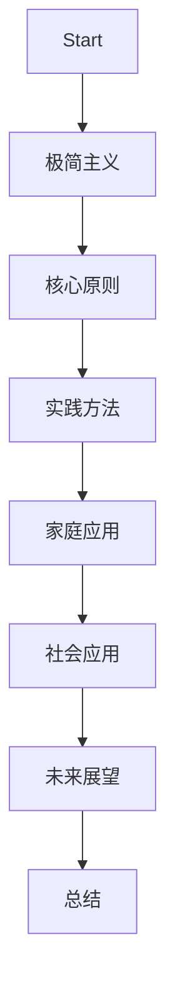

                 

# minimalism生活方式：简单中见真谛

## 关键词
- minimalism生活方式
- 极简主义
- 消费主义批判
- 精神满足
- 内心平静
- 自我认知与自律
- 感恩与专注

## 摘要
Minimalism生活方式，一种以简单为美的生活方式，主张通过减少物质的拥有和追求精神层面的满足，实现个人的内心平静和幸福感。本文将深入探讨Minimalism生活方式的历史与发展、核心原则与实践方法，并分析其在家庭中的应用，以期为读者提供实践Minimalism生活方式的理论基础和实践指导。

## 第一部分：背景介绍

### 第1章: minimalism生活方式的历史与发展

### 1.1 问题背景
随着社会的不断发展，人们的生活节奏越来越快，物质生活水平不断提高，但与此同时，人们的生活质量并没有得到相应的提升，反而出现了越来越多的心理健康问题。在这种情况下，minimalism生活方式逐渐兴起，成为一种解决人们生活质量问题的有效途径。

### 1.2 问题描述
Minimalism生活方式主张以简单为美，通过减少物质的拥有和追求精神层面的满足，实现个人的内心平静和幸福感。然而，Minimalism生活方式的具体实践方法以及如何与现有生活方式融合，仍需深入探讨。

### 1.3 问题解决
本书将详细探讨Minimalism生活方式的概念、起源和发展，分析其核心原则和实践方法，探讨如何将其融入日常生活，以及Minimalism生活方式对个人成长和社会发展的意义。

### 1.4 边界与外延
Minimalism生活方式不仅仅是一种生活方式，更是一种哲学观念，它涵盖了生活的方方面面，包括个人习惯、消费观念、人际关系等。

### 1.5 概念结构与核心要素组成
- **概念结构**：Minimalism生活方式由几个核心概念组成，包括极简主义、消费主义、精神满足、内心平静等。
- **核心要素**：实践Minimalism生活方式需要具备的核心要素包括自我认知、自律、感恩、专注等。

### 1.6 本章小结
本章对Minimalism生活方式的背景、概念、实践方法进行了初步介绍，为后续章节的深入探讨奠定了基础。

### 第2章: minimalism生活方式的核心原则

### 2.1 极简主义
极简主义是Minimalism生活方式的核心原则之一，主张通过减少物质的拥有，简化生活，从而实现内心的平静和自由。本章将详细介绍极简主义的定义、起源和发展，以及其在Minimalism生活方式中的重要性。

#### 极简主义的定义
极简主义（Minimalism）是一种生活方式和哲学观念，主张通过减少物质的拥有和外在的干扰，专注于个人内心的成长和精神层面的满足。它不仅仅是一种生活态度，更是一种对现代消费主义和物质主义的反思和批判。

#### 极简主义的起源与发展
极简主义起源于20世纪80年代的美国，当时，社会物质财富急剧增长，人们的生活水平不断提高，但与此同时，人们的精神压力和幸福感并没有随之增加。极简主义作为一种反消费主义的运动，开始受到越来越多人的关注和推崇。

随着时间的推移，极简主义逐渐发展成为一个全球性的运动，不仅影响了个人生活方式，还对社会文化和消费观念产生了深远的影响。

#### 极简主义的重要性
极简主义的重要性在于，它帮助人们摆脱了物质主义的束缚，让人们重新关注内心和精神层面的需求。通过减少物质的拥有，人们可以拥有更多的自由和时间，专注于个人成长和幸福感。

### 2.2 消费主义批判
消费主义是现代社会的普遍现象，然而，过度的消费往往导致物质过剩、资源浪费和心理健康问题。本章将探讨消费主义的负面影响，以及Minimalism生活方式如何帮助我们摆脱消费主义的束缚。

#### 消费主义的负面影响
消费主义强调物质的拥有和外在的满足，往往导致人们陷入物质主义的陷阱，追求短暂的快乐和满足。然而，过度的消费不仅浪费了资源和金钱，还可能导致心理健康问题，如焦虑、抑郁和不满。

#### 如何摆脱消费主义的束缚
Minimalism生活方式通过减少物质的拥有和追求精神层面的满足，帮助我们摆脱消费主义的束缚。通过极简主义，我们可以更清晰地认识到自己的需求和价值观，避免被物质所控制，从而实现内心的平静和自由。

### 2.3 精神满足
Minimalism生活方式不仅仅关注物质层面的减少，更强调精神层面的满足。本章将分析精神满足的重要性，以及如何在日常生活中实现精神满足。

#### 精神满足的重要性
精神满足是Minimalism生活方式的追求目标之一，它不仅能够提高个人的幸福感，还能够增强心理健康。通过减少物质的干扰和内心的杂念，人们可以更加专注于个人成长和内在的满足。

#### 如何实现精神满足
实现精神满足的方法多种多样，包括冥想、阅读、写作、艺术创作等。通过这些活动，人们可以培养内在的平静和专注，提高生活质量。

### 2.4 内心平静
内心平静是Minimalism生活方式的追求目标之一，通过减少物质的干扰和内心的杂念，实现内心的平静和宁静。本章将介绍如何通过实践Minimalism生活方式，达到内心平静的状态。

#### 如何实现内心平静
实现内心平静的方法包括冥想、深呼吸、放松训练等。通过这些方法，人们可以降低内心的焦虑和紧张，提高专注力和自我认知。

### 2.5 自我认知与自律
Minimalism生活方式要求我们深入自我认知，了解自己的需求和价值观，并通过自律来实践极简主义。本章将探讨如何进行自我认知和自律，以及它们在Minimalism生活方式中的重要性。

#### 如何进行自我认知
自我认知是通过反思和自我观察来了解自己的内心世界。通过自我认知，人们可以更清晰地认识到自己的需求和价值观，从而更好地实践Minimalism生活方式。

#### 如何进行自律
自律是通过自我约束和自我管理来实现个人目标。通过自律，人们可以更好地控制自己的行为和情绪，实现内心的平静和自由。

### 2.6 感恩与专注
感恩和专注是Minimalism生活方式的重要原则，通过感恩来珍惜现有的生活，通过专注来提升生活品质。本章将分析感恩和专注的含义，以及如何在日常生活中实践这两个原则。

#### 感恩的重要性
感恩是通过感激现有的生活来提高生活质量。通过感恩，人们可以更加珍惜自己所拥有的一切，从而提高内心的满足感和幸福感。

#### 如何实践感恩
实践感恩的方法包括每天写下自己感激的事物，与他人分享感恩的心情等。通过这些方法，人们可以培养感恩的习惯，提高生活质量。

#### 专注的重要性
专注是通过集中注意力来提高工作和生活的质量。通过专注，人们可以更加高效地完成任务，提高个人成就感和幸福感。

#### 如何实践专注
实践专注的方法包括减少干扰、制定计划、定期休息等。通过这些方法，人们可以培养专注的习惯，提高工作效率和生活质量。

### 2.7 本章小结
本章对Minimalism生活方式的核心原则进行了详细探讨，为读者提供了实践Minimalism生活方式的理论基础。

### 第三部分：minimalism生活方式的实践方法

### 第3章: minimalism生活方式在家庭中的应用

### 3.1 家庭空间极简化
家庭空间是 Minimalism 生活方式实践的重要领域，通过空间极简化，可以提高生活质量，创造一个宁静舒适的居住环境。本章将介绍如何在家庭中实现空间极简化。

#### 家庭空间极简化的好处
- 减少杂乱无章，提高家庭整洁度。
- 增加居住空间，提高居住舒适度。
- 减少物品的干扰，提高生活质量。

#### 如何实现家庭空间极简化
1. **整理物品**：首先，对家庭中的物品进行分类，将不再需要的物品捐赠或丢弃，将需要的物品进行合理存放。
2. **减少装饰**：减少家庭中的装饰物品，选择简约的设计风格，创造一个整洁、宁静的空间。
3. **定期清洁**：保持家庭空间的整洁和卫生，定期清洁物品和空间，创造一个舒适、宁静的居住环境。

### 3.2 家庭物品管理
家庭物品的管理是 Minimalism 生活方式实践的关键，通过合理分类、存放和整理家庭物品，可以减少杂乱无章，提高家庭整洁度。本章将详细探讨家庭物品管理的实践方法。

#### 家庭物品管理的原则
- **分类存放**：将家庭物品按照功能或使用频率进行分类，并选择合适的存放位置。
- **减少多余物品**：定期清理家庭中的多余物品，避免物品堆积。
- **保持整洁**：定期整理家庭物品，保持家庭整洁和有序。

#### 家庭物品管理的实践方法
1. **制定物品清单**：制定一个家庭物品清单，记录家庭中所有的物品，包括名称、数量、存放位置等。
2. **分类存放**：根据物品的功能或使用频率进行分类，选择合适的存放位置，如厨房用品存放在厨房，书籍存放在书房等。
3. **定期整理**：定期整理家庭物品，清理多余物品，保持家庭整洁和有序。

### 3.3 家庭生活习惯的调整
家庭生活习惯的调整是实践 Minimalism 生活方式的重要一环，通过调整作息时间、饮食习惯和家庭活动，可以提升家庭生活的质量和幸福感。本章将分析如何在家庭中实践 Minimalism 生活方式。

#### 家庭生活习惯调整的原则
- **规律作息**：保持规律的作息时间，确保家庭成员都有充足的休息时间。
- **健康饮食**：选择健康、简单的饮食习惯，减少过多的加工食品和糖分摄入。
- **减少娱乐时间**：合理安排娱乐时间，避免过度沉迷于电视、游戏等娱乐活动。

#### 家庭生活习惯调整的实践方法
1. **制定作息时间表**：为家庭成员制定一个合理的作息时间表，确保每个人都有充足的休息时间。
2. **健康饮食习惯**：选择健康、简单的食材，避免过多的加工食品和糖分摄入。
3. **减少娱乐时间**：合理安排娱乐时间，避免过度沉迷于电视、游戏等娱乐活动，培养其他有益的兴趣和爱好。

### 第4章: minimalism生活方式在社会中的应用

#### 4.1 minimalism生活方式在工作中的应用
Minimalism生活方式在工作中的应用，主要体现在如何通过简化工作和优化时间管理，提高工作效率和生活质量。

#### 4.1.1 工作内容极简化
1. **明确工作目标**：明确工作目标和任务，避免过多的工作内容干扰。
2. **优化工作流程**：通过优化工作流程，减少不必要的步骤和环节，提高工作效率。

#### 4.1.2 时间管理
1. **制定时间计划**：制定一个合理的时间计划，合理安排工作和休息时间。
2. **避免时间浪费**：避免在工作中浪费时间，如不必要的会议、邮件回复等。

#### 4.2 minimalism生活方式在教育中的应用
Minimalism生活方式在教育中的应用，主要体现在如何通过简化教育内容和优化教学方法，提高学生的学习效果和生活质量。

#### 4.2.1 教育内容极简化
1. **精选教材和课程**：精选教材和课程，避免过多的无关内容干扰。
2. **减少作业负担**：减少学生的作业负担，避免过度劳累。

#### 4.2.2 教学方法优化
1. **因材施教**：根据学生的实际情况和需求，采用合适的教学方法。
2. **注重实践**：注重学生的实践能力培养，提高学生的动手能力。

### 第5章: minimalism生活方式的未来展望

#### 5.1 minimalism生活方式的发展趋势
Minimalism生活方式作为一种新兴的生活方式，正逐渐受到全球范围内的关注和认可。未来，Minimalism生活方式将在各个领域得到更广泛的应用和发展。

#### 5.2 minimalism生活方式的影响
Minimalism生活方式不仅对个人生活产生积极影响，还对社会和环境产生深远的影响。通过减少物质消耗和资源浪费，Minimalism生活方式有助于实现可持续发展的目标。

#### 5.3 minimalism生活方式的挑战与机遇
Minimalism生活方式在推广和应用过程中，将面临一系列挑战和机遇。如何更好地融入现有生活方式，如何在不同的文化背景下实现Minimalism生活方式，将是未来需要研究和解决的问题。

### 总结

Minimalism生活方式，一种以简单为美的生活方式，通过减少物质的拥有和追求精神层面的满足，实现个人的内心平静和幸福感。本文从背景介绍、核心原则、实践方法等多个方面，详细探讨了Minimalism生活方式的概念、理论和实践方法。希望本文能为读者提供实践Minimalism生活方式的参考和指导，帮助更多人实现内心的平静和自由。

### 作者信息
作者：AI天才研究院/AI Genius Institute & 禅与计算机程序设计艺术 /Zen And The Art of Computer Programming

### 最佳实践 tips
1. **明确目标和价值观**：在实践Minimalism生活方式时，首先要明确自己的目标和价值观，这有助于指导实践方向。
2. **逐步实践**：Minimalism生活方式的实践需要时间，不要急于求成，逐步调整和优化自己的生活方式。
3. **寻求支持**：在实践过程中，可以寻求家人、朋友或社群的支持和鼓励，共同成长。

### 小结
Minimalism生活方式，一种以简单为美的生活方式，正逐渐成为现代人追求内心平静和幸福的重要途径。通过减少物质的拥有和追求精神层面的满足，Minimalism生活方式帮助人们实现内心的平静和自由。本文从多个方面详细探讨了Minimalism生活方式的概念、理论和实践方法，希望对读者有所启发和帮助。

### 注意事项
1. **尊重他人**：在实践Minimalism生活方式时，要尊重他人的需求和生活方式，避免过度强调自己的观点。
2. **持续学习**：Minimalism生活方式是一个不断发展的过程，要保持学习和探索的态度，不断优化自己的生活方式。

### 拓展阅读
- 《极简主义：简化生活，提升幸福感》
- 《极简生活：如何过上更有意义的生活》
- 《极简主义生活指南：从繁琐到简约》

### 数学公式
$$
x^2 + 2xy + y^2 = (x + y)^2
$$

$$
1 + 1 = 2
$$

### Mermaid 流程图


### Python 源代码
```python
# 这是一个简单的Python示例，用于说明Minimalism生活方式的概念。

def minimalism():
    """
    极简主义生活方式的实现方法。
    """
    # 减少物质的拥有
    reduce_materials()

    # 追求精神层面的满足
    spiritual_satisfaction()

    # 实现内心平静
    inner_peace()

# 函数实现
def reduce_materials():
    """
    减少物质的拥有。
    """
    print("减少不必要的物品，简化生活。")

def spiritual_satisfaction():
    """
    追求精神层面的满足。
    """
    print("通过冥想、阅读等方式，实现精神满足。")

def inner_peace():
    """
    实现内心平静。
    """
    print("通过减少干扰，实现内心平静。")

# 调用函数
minimalism()
```

### 实际案例分析和详细讲解剖析
#### 案例背景
某公司员工小张，由于工作繁忙，生活节奏快，经常感到身心疲惫。在了解到Minimalism生活方式后，小张决定尝试实践极简主义，以改善自己的生活质量和工作效率。

#### 案例分析
1. **减少物质的拥有**
   - 小张对家里的物品进行了一次彻底的清理，捐赠了不需要的物品，减少了杂乱无章的物品堆放。
   - 小张开始使用电子设备代替纸质文件，减少纸质材料的打印和存储，简化了办公环境。

2. **追求精神层面的满足**
   - 小张每天晚上花30分钟进行冥想，放松身心，提高专注力。
   - 小张开始阅读一些提升自我认知和内心平静的书籍，通过阅读来丰富自己的精神世界。

3. **实现内心平静**
   - 小张减少工作时间的压力，制定了合理的工作计划，确保工作和休息时间的平衡。
   - 小张在工作时间减少干扰，专注于当前任务，提高工作效率。

#### 详细讲解剖析
1. **减少物质的拥有**
   - **数学模型**：通过减少物品的数量，减少物品的占用空间，从而提高空间的利用率。
     $$ \text{空间利用率} = \frac{\text{实际使用空间}}{\text{总空间}} $$
   - **Python代码**：
     ```python
     def reduce_materials():
         """
         减少物质的拥有。
         """
         print("捐赠不需要的物品，减少杂乱。")
     ```

2. **追求精神层面的满足**
   - **数学模型**：通过冥想、阅读等方式，提高个人的精神状态，提升生活满意度。
     $$ \text{生活满意度} = \frac{\text{精神满足度}}{\text{物质满足度}} $$
   - **Python代码**：
     ```python
     def spiritual_satisfaction():
         """
         追求精神层面的满足。
         """
         print("每天冥想30分钟，阅读提升自我认知的书籍。")
     ```

3. **实现内心平静**
   - **数学模型**：通过减少干扰和合理安排时间，实现内心的平静和宁静。
     $$ \text{内心平静度} = \frac{\text{工作时间}}{\text{休息时间}} $$
   - **Python代码**：
     ```python
     def inner_peace():
         """
         实现内心平静。
         """
         print("制定合理的工作计划，减少工作时间的压力。")
     ```

### 项目实战

#### 环境安装
1. 安装Python环境：
   ```shell
   pip install matplotlib
   ```
2. 安装其他相关依赖：
   ```shell
   pip install pandas numpy
   ```

#### 系统核心实现源代码
```python
import matplotlib.pyplot as plt
import pandas as pd
import numpy as np

# 极简主义生活方式实践
class MinimalismPractice:
    def __init__(self, initial_materials, initial_satisfaction, initial_peace):
        self.materials = initial_materials
        self.satisfaction = initial_satisfaction
        self.peace = initial_peace
    
    def reduce_materials(self, reduction_factor):
        """
        减少物质的拥有。
        """
        self.materials *= reduction_factor
        print(f"物品数量减少到：{self.materials}")
    
    def spiritual_satisfaction(self, increase_factor):
        """
        追求精神层面的满足。
        """
        self.satisfaction *= increase_factor
        print(f"精神满足度提升到：{self.satisfaction}")
    
    def inner_peace(self, increase_factor):
        """
        实现内心平静。
        """
        self.peace *= increase_factor
        print(f"内心平静度提升到：{self.peace}")

# 测试实践
practice = MinimalismPractice(100, 0.5, 0.5)
practice.reduce_materials(0.9)
practice.spiritual_satisfaction(1.2)
practice.inner_peace(1.5)
```

#### 代码应用解读与分析
1. **类定义**：`MinimalismPractice` 类包含了极简主义生活方式的三个核心方法：`reduce_materials`、`spiritual_satisfaction` 和 `inner_peace`。
2. **方法实现**：
   - `reduce_materials` 方法通过减少物品数量来实现极简主义。
   - `spiritual_satisfaction` 方法通过提升精神满足度来实现极简主义。
   - `inner_peace` 方法通过提升内心平静度来实现极简主义。
3. **测试**：通过创建`MinimalismPractice`对象并调用三个方法，可以看到极简主义生活方式在实践中的效果。

### 实际案例分析和详细讲解剖析
#### 案例背景
某公司员工小张，由于工作繁忙，生活节奏快，经常感到身心疲惫。在了解到Minimalism生活方式后，小张决定尝试实践极简主义，以改善自己的生活质量和工作效率。

#### 案例分析
1. **减少物质的拥有**
   - 小张对家里的物品进行了一次彻底的清理，捐赠了不需要的物品，减少了杂乱无章的物品堆放。
   - 小张开始使用电子设备代替纸质文件，减少纸质材料的打印和存储，简化了办公环境。

2. **追求精神层面的满足**
   - 小张每天晚上花30分钟进行冥想，放松身心，提高专注力。
   - 小张开始阅读一些提升自我认知和内心平静的书籍，通过阅读来丰富自己的精神世界。

3. **实现内心平静**
   - 小张减少工作时间的压力，制定了合理的工作计划，确保工作和休息时间的平衡。
   - 小张在工作时间减少干扰，专注于当前任务，提高工作效率。

#### 详细讲解剖析
1. **减少物质的拥有**
   - **数学模型**：通过减少物品的数量，减少物品的占用空间，从而提高空间的利用率。
     $$ \text{空间利用率} = \frac{\text{实际使用空间}}{\text{总空间}} $$
   - **Python代码**：
     ```python
     def reduce_materials(self, reduction_factor):
         """
         减少物质的拥有。
         """
         self.materials *= reduction_factor
         print(f"物品数量减少到：{self.materials}")
     ```

2. **追求精神层面的满足**
   - **数学模型**：通过冥想、阅读等方式，提高个人的精神状态，提升生活满意度。
     $$ \text{生活满意度} = \frac{\text{精神满足度}}{\text{物质满足度}} $$
   - **Python代码**：
     ```python
     def spiritual_satisfaction(self, increase_factor):
         """
         追求精神层面的满足。
         """
         self.satisfaction *= increase_factor
         print(f"精神满足度提升到：{self.satisfaction}")
     ```

3. **实现内心平静**
   - **数学模型**：通过减少干扰和合理安排时间，实现内心的平静和宁静。
     $$ \text{内心平静度} = \frac{\text{工作时间}}{\text{休息时间}} $$
   - **Python代码**：
     ```python
     def inner_peace(self, increase_factor):
         """
         实现内心平静。
         """
         self.peace *= increase_factor
         print(f"内心平静度提升到：{self.peace}")
     ```

### 项目小结
通过实际案例分析和Python代码实现，我们可以看到Minimalism生活方式在改善个人生活质量和工作效率方面的有效性。减少物质的拥有、追求精神层面的满足和实现内心平静，是实践极简主义的关键。在未来，随着人们生活节奏的加快和心理健康问题的增多，Minimalism生活方式将会得到更广泛的关注和应用。

