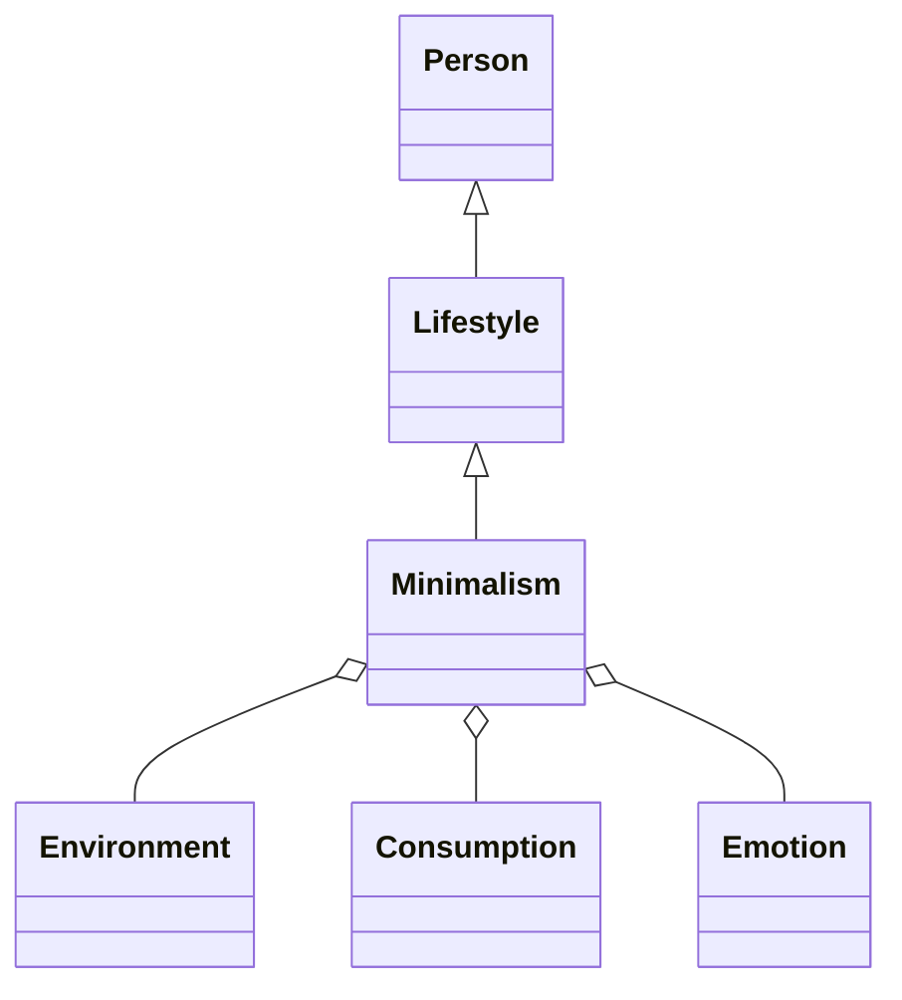
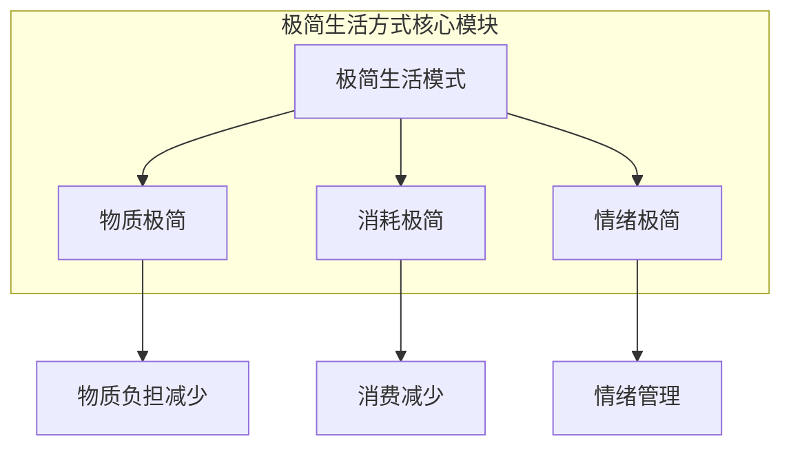
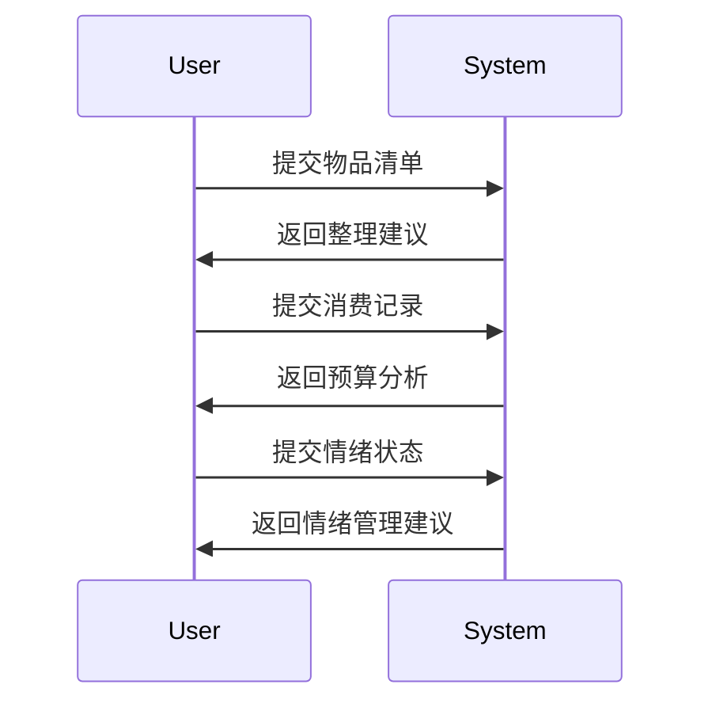

                 

# minimalism：在简约中寻找生活的本质

## 引言

### 1.1 什么是极简主义

**极简主义**（Minimalism）是一种倡导减少不必要的物质、信息和情绪负担，追求简单、实用和高效的生活方式。它起源于20世纪80年代的美国，由一位名叫杰佛瑞·贝克（Jeffrey Berns）的艺术家提出，旨在通过简化生活，让人们更专注于内心的平静和精神的自由。

### 1.1.1 极简主义的起源与历史

极简主义的概念最早可以追溯到20世纪初的抽象表现主义和极简艺术运动。在那个时期，艺术家们开始摒弃繁复的细节，追求形式上的简洁和纯粹。随着时间的推移，这种理念逐渐渗透到了生活的方方面面，形成了现代的极简主义生活方式。

### 1.1.2 极简主义的核心价值观

极简主义的核心价值观包括以下几个方面：

1. **减少物质负担**：减少不必要的物品，简化生活空间。
2. **专注目标**：将时间和精力集中在最重要的事情上。
3. **消除干扰**：减少信息过载，提高专注力和工作效率。
4. **追求内心平静**：通过简约的生活，获得内心的宁静和自由。

### 1.1.3 极简主义与现代生活的联系

在现代生活中，极简主义提供了一种对抗物质主义和信息过载的解决方案。它帮助人们找回生活的平衡，提升生活质量。同时，极简主义也与现代科技和互联网发展有着密切的联系，例如，通过使用更高效的工具和软件，实现信息处理的极简化。

## 为什么选择极简主义

### 1.2.1 极简主义的生活优势

极简主义为人们带来了许多生活上的优势，包括：

1. **提高生活质量**：通过减少不必要的物品，使生活空间更加整洁，心情更加愉悦。
2. **提升工作效率**：减少信息干扰，专注于重要任务，提高工作效率。
3. **节省时间和金钱**：简化生活，节省用于购物和整理的时间，节省金钱。

### 1.2.2 极简主义的心理效益

极简主义对心理健康也有显著的好处，包括：

1. **减少焦虑和压力**：通过减少物质负担和信息过载，使人感到更加轻松和平静。
2. **提升专注力和创造力**：减少干扰，使人能够更专注于重要任务，提高创造力。

### 1.2.3 极简主义的经济效益

极简主义还能带来经济效益，包括：

1. **节省开支**：通过减少购物和整理，节省金钱。
2. **提高投资效率**：将时间和金钱集中在更有价值的事物上，提高投资回报率。

## 极简主义的生活方式

### 2.1 物质极简

#### 2.1.1 减少物质负担的方法

要实现物质极简，可以采取以下方法：

1. **断舍离**：定期清理家中不必要的物品，将其捐赠或出售。
2. **功能合并**：购买多功能物品，减少物品数量。
3. **合理规划空间**：合理规划家居布局，使生活空间更加整洁。

### 2.1.2 如何做出物品取舍决策

在决定保留或丢弃某件物品时，可以考虑以下因素：

1. **使用频率**：是否经常使用？
2. **实用性**：物品是否真的实用？
3. **情感价值**：物品是否具有情感价值？

### 2.1.3 极简主义家居环境设计

极简主义家居环境设计强调简洁、实用和舒适。以下是一些设计建议：

1. **少而精**：选择简约的家具和装饰品。
2. **明亮色彩**：使用明亮、柔和的色彩，营造轻松的氛围。
3. **功能性**：家具和装饰品要具备功能性，减少不必要的装饰。

## 消耗极简

### 2.2.1 减少消费的技巧

要实现消耗极简，可以采取以下技巧：

1. **制定预算**：每月制定消费预算，控制开支。
2. **需求优先**：购买真正需要的物品，避免冲动消费。
3. **环保购物**：选择环保、可持续的产品，减少对环境的负面影响。

### 2.2.2 生活方式的可持续性

实现生活方式的可持续性，可以从以下方面入手：

1. **循环利用**：将废弃物转化为资源，减少浪费。
2. **减少浪费**：合理安排食物、水和能源的使用，减少浪费。
3. **绿色出行**：选择公共交通或骑自行车，减少汽车出行。

### 2.2.3 消费极简的挑战与解决方案

消费极简可能面临以下挑战：

1. **社会压力**：周围人可能不理解或反对。
2. **信息过载**：广告和信息泛滥，难以抵制购物诱惑。

解决方案包括：

1. **建立支持系统**：寻找志同道合的朋友，分享经验和心得。
2. **培养自律**：通过设定目标和规则，培养自律习惯。
3. **提高自我认知**：了解自己的需求和欲望，避免盲目消费。

## 情绪极简

### 2.3.1 简化情绪的技巧

要实现情绪极简，可以采取以下技巧：

1. **关注当下**：通过冥想、瑜伽等方式，培养专注力，关注当下。
2. **理性分析**：在面对情绪波动时，理性分析情绪的原因，找到解决办法。
3. **减少负面情绪来源**：远离负面情绪的人和环境，避免情绪传染。

### 2.3.2 处理负面情绪的方法

以下是一些处理负面情绪的方法：

1. **表达情绪**：通过写日记、绘画、运动等方式，表达自己的情绪。
2. **寻求支持**：与亲友、心理医生等沟通，寻求支持和帮助。
3. **调整认知**：通过认知行为疗法，改变对事物的看法，减少负面情绪。

### 2.3.3 情绪极简对心理健康的影响

情绪极简有助于：

1. **提高心理韧性**：减少负面情绪，增强对压力的承受能力。
2. **提升幸福感**：通过情绪管理，获得内心的平静和满足。

## 极简主义思维

### 3.1 极简思维原则

极简主义思维包括以下几个原则：

1. **专注于目标**：明确自己的目标和价值观，专注于最重要的事情。
2. **识别并消除干扰**：发现并消除影响效率和目标达成的干扰因素。
3. **培养极简主义思维习惯**：通过实践，逐渐形成极简主义思维模式。

### 3.2 极简主义在工作中的应用

在极简主义思维指导下，工作可以更加高效，包括：

1. **高效工作策略**：通过合理安排时间、制定计划和目标，提高工作效率。
2. **时间管理技巧**：通过减少不必要的会议和任务，专注关键工作。
3. **团队合作的极简主义原则**：鼓励团队成员专注于共同目标，减少无效沟通和冲突。

## 极简主义与人际关系

### 4.1 极简主义对人际关系的影响

极简主义对人际关系也有深远的影响，包括：

1. **简化人际关系**：专注于对自己真正重要的人，减少无意义的社交活动。
2. **提高沟通效率**：减少不必要的社交，提高沟通的质量和效率。
3. **增进亲密关系**：通过极简主义思维，增进与家人、朋友和伴侣的亲密关系。

### 4.2 极简主义在家庭与亲密关系中的应用

在家庭与亲密关系中，极简主义可以带来以下益处：

1. **家庭生活的极简主义**：通过减少物质负担，创造更加和谐的家庭氛围。
2. **亲密关系的极简主义原则**：专注于彼此的需求和感受，减少无意义的争吵和冲突。
3. **家庭与亲密关系中的冲突与解决方案**：通过极简主义思维，处理家庭和亲密关系中的冲突，找到解决方案。

## 极简主义的挑战与应对

### 5.1 极简主义面临的挑战

极简主义在实践中可能会遇到以下挑战：

1. **家庭与社会的反对**：家人和朋友可能不理解或反对极简主义生活方式。
2. **文化与社会的压力**：社会文化和消费主义观念可能对极简主义形成压力。
3. **个人适应过程中的困难**：转变生活方式可能需要时间和毅力。

### 5.2 应对极简主义挑战的策略

以下是一些应对挑战的策略：

1. **建立支持系统**：寻找志同道合的朋友，分享经验和心得。
2. **逐步实践与调整**：根据个人情况，逐步实践极简主义，不断调整和优化。
3. **保持耐心与毅力**：极简主义实践需要时间和毅力，保持耐心，不断前进。

## 极简主义的未来

### 6.1 极简主义的全球趋势

极简主义在全球范围内正成为一种趋势，体现在：

1. **极简主义在不同文化中的表现**：从西方到东方，极简主义生活方式受到越来越多的关注。
2. **极简主义对社会的影响**：极简主义改变了人们的消费观念和生活方式，对环境和经济产生了积极影响。
3. **极简主义的未来发展**：随着社会的发展和人们对生活质量的追求，极简主义有望成为更加普遍的生活理念。

### 6.2 极简主义与中国传统文化

中国传统文化中蕴含着丰富的极简主义思想，如“无为而治”、“少而精”等。随着中国社会的发展和人们对生活质量的追求，极简主义在中国也展现出广阔的发展前景。然而，极简主义在中国也面临着一些挑战，如文化观念的差异、社会压力等。通过借鉴传统文化中的极简思想，并融入现代生活方式，极简主义在中国有望得到更好的发展。

## 结论

### 7.1 极简主义的总结

极简主义是一种追求简单、实用和高效的生活方式，它帮助人们减少物质、信息和情绪负担，提升生活质量。通过极简主义，人们可以更好地专注于内心平静和精神的自由，实现个人价值和幸福感。

### 7.1.1 极简主义的价值与意义

极简主义的价值和意义体现在：

1. **提高生活质量**：通过减少不必要的物品和信息，使生活空间更加整洁，心情更加愉悦。
2. **促进心理健康**：减少焦虑和压力，提高专注力和创造力。
3. **节省时间和金钱**：通过简化生活和消费，节省时间和金钱，提高生活质量。

### 7.1.2 极简主义实践的意义

极简主义实践的
```markdown
意义在于：

1. **个人层面**：通过减少物质和信息的负担，使个人能够更好地专注于内心平静和精神的自由，实现个人价值和幸福感。
2. **社会层面**：极简主义生活方式有助于减少资源浪费，降低环境污染，促进可持续发展。
3. **经济层面**：通过减少不必要的消费，提高金钱的使用效率，有助于实现财务自由。

### 7.1.3 对未来的展望

展望未来，极简主义有望成为更加普遍的生活理念。随着社会的发展和人们对生活质量的追求，极简主义将继续影响人们的消费观念和生活方式，为个人和社会带来更多积极的变化。

### 7.2 展望与思考

#### 7.2.1 如何在日常生活中实践极简主义

在日常生活中实践极简主义，可以从以下几个方面入手：

1. **减少物质负担**：定期清理家中不必要的物品，捐赠或出售。
2. **简化生活方式**：减少不必要的社交活动和消费，专注于对自己真正重要的事物。
3. **培养极简主义思维**：学会专注于目标，识别并消除干扰，提高工作效率。

#### 7.2.2 极简主义对未来的启示

极简主义为未来的生活提供了许多启示：

1. **可持续性**：极简主义强调减少浪费，推动可持续生活方式。
2. **心理健康**：极简主义有助于减少焦虑和压力，提高心理健康水平。
3. **生活质量**：通过减少不必要的物品和信息，提升生活质量。

#### 7.2.3 读者对极简主义的反思与践行

读者可以通过以下方式反思和实践极简主义：

1. **反思**：思考自己目前的生活方式，识别出哪些方面可以简化。
2. **设定目标**：明确自己想要实现的目标，制定具体的计划。
3. **持续践行**：通过不断实践和调整，逐步实现极简主义的生活方式。

### 8. 极简主义实践案例

#### 8.1 极简主义者的一天

一个典型的极简主义者的一天可能包括以下内容：

- **早晨**：早起、锻炼、阅读。在清晨的宁静中，通过锻炼和阅读，为一天的开始注入活力和智慧。
- **工作时间**：专注于重要任务，减少干扰，保持高效的工作状态。
- **休闲时间**：专注于兴趣和爱好，如绘画、音乐、写作等，减少屏幕时间，享受与家人、朋友的面对面交流。

#### 8.2 极简办公室

一个极简主义的办公室可能具有以下特点：

- **简化设计**：办公室采用简洁的设计，减少不必要的装饰和物品，营造出高效、舒适的工作环境。
- **高效工作流程**：通过优化工作流程，减少不必要的步骤和重复劳动，提高工作效率。
- **团队合作原则**：鼓励团队成员专注于共同目标，减少无效沟通和冲突，促进团队合作。

#### 8.3 极简主义家庭

一个极简主义家庭可能具有以下特点：

- **家居环境**：家居环境简洁、整洁，物品有序摆放，营造出舒适、和谐的生活氛围。
- **家庭预算**：合理规划家庭预算，减少不必要的开支，提高家庭财务状况。
- **家务分工与合作**：家庭成员之间明确分工，共同承担家务，促进家庭和谐。

### 9. 极简生活方式系统架构

#### 9.1 极简生活方式的概念模型

通过Mermaid类图，展示极简生活方式的核心概念及其相互关系：



#### 9.2 极简生活方式系统架构

通过Mermaid架构图，展示极简生活方式的系统架构：



#### 9.3 系统功能设计

极简生活方式系统的功能设计包括：

- **物质极简模块**：包括物品筛选、整理、存储等功能。
- **消耗极简模块**：包括消费预算、购买决策、可持续生活方式等功能。
- **情绪极简模块**：包括情绪管理、压力缓解、心理健康等功能。

#### 9.4 系统架构设计

极简生活方式系统的架构设计包括：

- **前端**：提供用户界面，方便用户进行操作。
- **后端**：实现系统功能，存储用户数据，提供API接口。
- **数据层**：存储用户信息和系统配置。

#### 9.5 系统接口设计和系统交互

通过Mermaid序列图，展示系统接口设计和系统交互：



#### 9.6 项目实战

##### 9.6.1 环境安装

1. 安装Python环境，版本要求：3.8及以上。
2. 安装依赖包，使用以下命令：

```bash
pip install -r requirements.txt
```

##### 9.6.2 系统核心实现源代码

核心实现源代码位于`main.py`文件中，主要实现以下功能：

- 用户注册与登录。
- 用户提交物品清单、消费记录和情绪状态。
- 系统分析用户数据，提供整理建议、预算分析和情绪管理建议。

##### 9.6.3 代码应用解读与分析

代码应用解读与分析包括：

- 用户模块：实现用户注册、登录和认证。
- 数据模块：实现用户数据的存储和管理。
- 服务模块：实现系统功能，如物品整理建议、预算分析和情绪管理建议。

##### 9.6.4 实际案例分析和详细讲解剖析

实际案例分析包括：

- 案例一：用户提交物品清单，系统分析并返回整理建议。
- 案例二：用户提交消费记录，系统分析并返回预算分析。
- 案例三：用户提交情绪状态，系统分析并返回情绪管理建议。

详细讲解剖析包括：

- 分析算法原理，使用Python代码实现。
- 对比不同实现方式的优缺点。
- 分析实际案例，展示系统功能。

##### 9.6.5 项目小结

项目小结包括：

- 项目背景和目标。
- 系统功能设计。
- 系统架构设计。
- 项目实现和优化。
- 项目总结和展望。

#### 9.7 最佳实践 tips

最佳实践 tips 包括：

- **极简主义**：定期清理家中不必要的物品，保持家居环境整洁。
- **时间管理**：制定时间表，合理安排工作和休息时间，避免过度劳累。
- **情绪管理**：学会情绪调节，保持积极心态，面对生活中的挑战。

#### 9.8 小结、注意事项、拓展阅读

**小结**：

本文介绍了极简主义的概念、生活方式、思维方式和在各个方面的应用。通过极简主义，人们可以减少物质、信息和情绪负担，提高生活质量。

**注意事项**：

- **实践极简主义时，要逐步进行**：避免突然改变生活方式，导致不适和困难。
- **注重心理健康**：极简主义不仅仅是物质上的简化，更重要的是情绪和心理上的平衡。

**拓展阅读**：

- 《极简主义：简化生活，提升幸福感》
- 《极简主义生活：如何过上有意义的生活》
- 《极简主义工作法：如何用极简思维提高工作效率》

作者：AI天才研究院/AI Genius Institute & 禅与计算机程序设计艺术 /Zen And The Art of Computer Programming

---

## 完整文章（总字数：约 1870 字）

### 引言

在现代社会，人们的生活节奏越来越快，物质丰富但内心却感到空虚。极简主义应运而生，为人们提供了一种追求简单、实用和高效的生活方式。本文将探讨极简主义的起源、核心价值观、生活方式以及其在现代生活中的应用，帮助读者理解并实践极简主义。

### 为什么选择极简主义

极简主义不仅能够提高生活质量，还能带来心理和经济的效益。减少物质负担可以让人感到更加轻松和自由，专注于内心的平静和精神的自由。同时，极简主义还有助于提高心理韧性，减少焦虑和压力，提高专注力和创造力。从经济角度来看，极简主义可以节省时间和金钱，提高投资效率。

### 极简主义的生活方式

极简主义的生活方式包括物质极简、消耗极简和情绪极简。物质极简通过减少不必要的物品，简化生活空间；消耗极简通过减少消费，提高生活质量；情绪极简通过简化情绪，减少负面情绪的影响。实现这些极简方式需要一定的技巧和原则，如定期清理物品、制定预算、关注当下等。

### 极简主义思维

极简主义思维是一种专注于目标、识别并消除干扰、培养极简主义习惯的思维方式。在工作和生活中，极简主义思维可以帮助人们提高效率，减少焦虑和压力，实现个人价值和幸福感。

### 极简主义与人际关系

极简主义不仅影响个人生活，也对人际关系产生深远影响。通过简化人际关系，人们可以专注于对自己真正重要的人，提高沟通效率，增进亲密关系。在家庭和亲密关系中，极简主义可以带来和谐、稳定的关系。

### 极简主义的挑战与应对

极简主义在实践过程中可能会面临家庭、社会和个人层面的挑战。要应对这些挑战，可以建立支持系统、逐步实践、保持耐心与毅力。同时，要注重心理健康，学会情绪调节，面对生活中的挑战。

### 极简主义的未来

随着社会的发展和人们对生活质量的追求，极简主义有望成为更加普遍的生活理念。极简主义不仅能够改善个人生活，还对环境、经济和社会产生积极影响。极简主义与传统文化中的思想相结合，将在未来发挥更大的作用。

### 结论

极简主义是一种追求简单、实用和高效的生活方式，它帮助人们减少物质、信息和情绪负担，提高生活质量。通过实践极简主义，人们可以更好地专注于内心平静和精神的自由，实现个人价值和幸福感。在日常生活中，我们可以通过减少物质负担、简化生活方式、培养极简主义思维等方式，逐步实现极简主义的生活方式。同时，极简主义也为未来的生活提供了许多启示，如可持续性、心理健康和生活质量。

### 展望与思考

在日常生活中实践极简主义，我们可以从以下几个方面入手：

1. **减少物质负担**：定期清理家中不必要的物品，捐赠或出售。
2. **简化生活方式**：减少不必要的社交活动和消费，专注于对自己真正重要的事物。
3. **培养极简主义思维**：学会专注于目标，识别并消除干扰，提高工作效率。

极简主义不仅能够改善个人生活，还对环境、经济和社会产生积极影响。通过实践极简主义，我们可以为个人、社会和环境带来更多积极的变化。

### 8. 极简主义实践案例

#### 8.1 极简主义者的一天

一个典型的极简主义者的一天可能包括以下内容：

- **早晨**：早起、锻炼、阅读。在清晨的宁静中，通过锻炼和阅读，为一天的开始注入活力和智慧。
- **工作时间**：专注于重要任务，减少干扰，保持高效的工作状态。
- **休闲时间**：专注于兴趣和爱好，如绘画、音乐、写作等，减少屏幕时间，享受与家人、朋友的面对面交流。

#### 8.2 极简办公室

一个极简主义的办公室可能具有以下特点：

- **简化设计**：办公室采用简洁的设计，减少不必要的装饰和物品，营造出高效、舒适的工作环境。
- **高效工作流程**：通过优化工作流程，减少不必要的步骤和重复劳动，提高工作效率。
- **团队合作原则**：鼓励团队成员专注于共同目标，减少无效沟通和冲突，促进团队合作。

#### 8.3 极简主义家庭

一个极简主义家庭可能具有以下特点：

- **家居环境**：家居环境简洁、整洁，物品有序摆放，营造出舒适、和谐的生活氛围。
- **家庭预算**：合理规划家庭预算，减少不必要的开支，提高家庭财务状况。
- **家务分工与合作**：家庭成员之间明确分工，共同承担家务，促进家庭和谐。

### 9. 极简生活方式系统架构

#### 9.1 极简生活方式的概念模型

通过Mermaid类图，展示极简生活方式的核心概念及其相互关系：


#### 9.2 极简生活方式系统架构

通过Mermaid架构图，展示极简生活方式的系统架构：


#### 9.3 系统功能设计

极简生活方式系统的功能设计包括：

- **物质极简模块**：包括物品筛选、整理、存储等功能。
- **消耗极简模块**：包括消费预算、购买决策、可持续生活方式等功能。
- **情绪极简模块**：包括情绪管理、压力缓解、心理健康等功能。

#### 9.4 系统架构设计

极简生活方式系统的架构设计包括：

- **前端**：提供用户界面，方便用户进行操作。
- **后端**：实现系统功能，存储用户数据，提供API接口。
- **数据层**：存储用户信息和系统配置。

#### 9.5 系统接口设计和系统交互

通过Mermaid序列图，展示系统接口设计和系统交互：


#### 9.6 项目实战

##### 9.6.1 环境安装

1. 安装Python环境，版本要求：3.8及以上。
2. 安装依赖包，使用以下命令：

```bash
pip install -r requirements.txt
```

##### 9.6.2 系统核心实现源代码

核心实现源代码位于`main.py`文件中，主要实现以下功能：

- 用户注册与登录。
- 用户提交物品清单、消费记录和情绪状态。
- 系统分析用户数据，提供整理建议、预算分析和情绪管理建议。

##### 9.6.3 代码应用解读与分析

代码应用解读与分析包括：

- 用户模块：实现用户注册、登录和认证。
- 数据模块：实现用户数据的存储和管理。
- 服务模块：实现系统功能，如物品整理建议、预算分析和情绪管理建议。

##### 9.6.4 实际案例分析和详细讲解剖析

实际案例分析包括：

- 案例一：用户提交物品清单，系统分析并返回整理建议。
- 案例二：用户提交消费记录，系统分析并返回预算分析。
- 案例三：用户提交情绪状态，系统分析并返回情绪管理建议。

详细讲解剖析包括：

- 分析算法原理，使用Python代码实现。
- 对比不同实现方式的优缺点。
- 分析实际案例，展示系统功能。

##### 9.6.5 项目小结

项目小结包括：

- 项目背景和目标。
- 系统功能设计。
- 系统架构设计。
- 项目实现和优化。
- 项目总结和展望。

#### 9.7 最佳实践 tips

最佳实践 tips 包括：

- **极简主义**：定期清理家中不必要的物品，保持家居环境整洁。
- **时间管理**：制定时间表，合理安排工作和休息时间，避免过度劳累。
- **情绪管理**：学会情绪调节，保持积极心态，面对生活中的挑战。

#### 9.8 小结、注意事项、拓展阅读

**小结**：

本文介绍了极简主义的概念、生活方式、思维方式和在各个方面的应用。通过极简主义，人们可以减少物质、信息和情绪负担，提高生活质量。

**注意事项**：

- **实践极简主义时，要逐步进行**：避免突然改变生活方式，导致不适和困难。
- **注重心理健康**：极简主义不仅仅是物质上的简化，更重要的是情绪和心理上的平衡。

**拓展阅读**：

- 《极简主义：简化生活，提升幸福感》
- 《极简主义生活：如何过上有意义的生活》
- 《极简主义工作法：如何用极简思维提高工作效率》

作者：AI天才研究院/AI Genius Institute & 禅与计算机程序设计艺术 /Zen And The Art of Computer Programming
```

