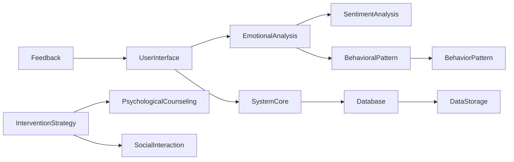
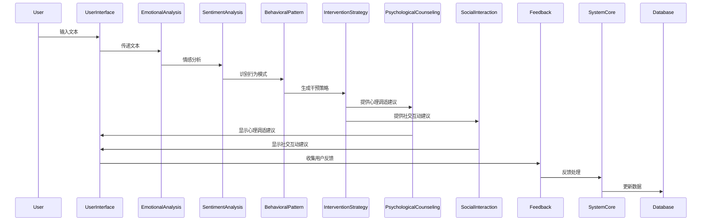

                 

### 第1章: 引言

#### 1.1 问题的提出

生命的意义一直是人类思考的重要议题，而在现代社会，随着物质生活的极大丰富和人类认知水平的不断提升，越来越多的人开始感受到一种内心的虚无。这种现象不仅在普通人中存在，在科技领域，尤其是IT行业，也日益显著。虚无主义作为一种哲学思潮，对个体和集体都产生了深远的影响。

**1.1.1 生命的意义与虚无主义的挑战**

生命的意义是什么？这是一个古老而又永恒的哲学问题。然而，随着现代社会的发展，许多人开始感到困惑和迷茫。虚无主义的思想，即认为生命缺乏内在价值，一切都是无意义的，对许多人产生了强烈的冲击。在技术领域，这种虚无感尤为突出。程序员们常常面对着高强度的压力和重复性的工作，逐渐感到生活缺乏激情和意义。

**1.1.2 生命热情的重要性及其缺失**

生命热情是生命力的体现，是对生活的热爱和激情。它不仅能够带来快乐，还能提升个体的幸福感。然而，在虚无主义的阴影下，许多人丧失了生命热情，生活变得单调乏味。这种现象在IT行业中尤为严重，程序员们往往过度沉迷于技术，忽视了生活的其他方面，导致心理和生理健康的恶化。

#### 1.2 书籍的目标

《nihilism与生命热情的平衡艺术》这本书旨在探索虚无主义的本质，以及如何通过平衡生命热情来克服虚无主义带来的负面影响。书中不仅介绍了虚无主义和生命热情的基本概念，还提供了一系列实用的方法和技巧，帮助读者找回生活的热情和意义。

**1.2.1 探索虚无主义的本质**

虚无主义作为一种哲学思潮，其本质是对生命价值和意义的质疑。书中将深入探讨虚无主义的起源、发展及其对个体和社会的影响，帮助读者理解虚无主义的真实面貌。

**1.2.2 探索平衡生命热情与虚无主义的方法**

书中的核心内容是探讨如何平衡生命热情与虚无主义。通过分析个体心理和社会环境，书中提出了一系列方法，如心理调适、社交互动、兴趣培养等，帮助读者找回生活的热情和意义。

#### 1.3 内容结构概述

本书共分为五个部分，每个部分都有明确的目标和结构。

**1.3.1 各章节内容安排**

- 第1章：引言，介绍问题的背景和书籍的目标。
- 第2章：背景介绍，包括无聊与生活停滞、虚无主义的起源与发展、生命热情的意义等。
- 第3章：核心概念原理，介绍虚无主义和生命热情的概念原理，并对比分析。
- 第4章：算法原理讲解，介绍平衡生命热情与虚无主义的算法原理。
- 第5章：系统分析与架构设计方案，介绍如何实现平衡生命热情与虚无主义的系统架构。

**1.3.2 阅读本书的预期收获**

通过阅读本书，读者可以：

1. 理解虚无主义的本质和其对个体和社会的影响。
2. 学习如何平衡生命热情与虚无主义，找回生活的热情和意义。
3. 获得实用的方法和技巧，提升心理和生理健康。
4. 探索生命价值的真正意义，找到属于自己的生活方式。

### 第2章: 背景介绍

#### 2.1 无聊与生活停滞

无聊是现代社会中普遍存在的问题，它不仅仅是一种短暂的、短暂的、无意义的感觉，更是一种影响深远的心理状态。无聊与生活停滞密切相关，它们共同构成了现代社会的一个显著特征。

**2.1.1 无聊的概念**

无聊可以定义为一种消极的情绪状态，个体在缺乏外部刺激和内在动机时产生的情绪体验。无聊通常表现为对周围环境的冷漠、对日常活动的缺乏兴趣以及长时间的无所事事。从心理学角度来看，无聊是一种心理上的空虚感，它反映了个体对当前生活状态的失望和不满。

**2.1.2 生活停滞的表现**

生活停滞是指个体在生活、工作和人际关系等方面缺乏进步和变化。这种状态通常表现为工作上的停滞不前、个人发展缓慢、社交圈子的固定不变等。生活停滞不仅会影响个体的心理健康，还可能导致自我认同感的丧失和对未来的悲观情绪。

**2.1.3 无聊与生活停滞的原因**

无聊与生活停滞的原因多种多样，主要包括以下几个方面：

1. **社会结构的变革**：随着现代社会的发展和城市化进程的加快，人们的社交圈子变得越来越小，工作压力不断增加，这导致个体在生活和工作中的压力和疲劳感加剧，从而产生无聊和停滞的感觉。
   
2. **技术发展的负面影响**：互联网和智能手机的普及使人们可以随时随地获取信息，但同时也导致人们对现实生活的关注度下降，个体沉浸在虚拟世界中，导致现实生活中的无聊和停滞。

3. **个体心理因素**：一些个体由于自身性格特点、心理压力或成长经历等原因，容易产生无聊和停滞的感觉。例如，一些性格内向、缺乏社交技巧的人可能更容易感到孤独和无聊。

4. **工作环境的影响**：在竞争激烈的工作环境中，许多人为了保持工作状态，不得不长时间专注于繁琐的工作任务，这可能导致他们在工作之外感到无聊和缺乏动力。

#### 2.2 虚无主义的起源与发展

虚无主义作为一种哲学思潮，其起源可以追溯到古希腊哲学。然而，现代虚无主义的兴起主要是在19世纪和20世纪的欧洲，特别是在德国和俄罗斯等地区。

**2.2.1 虚无主义的定义**

虚无主义通常被定义为一种哲学观点，认为世界和生命缺乏内在价值和意义。虚无主义者认为，无论个体如何努力，都无法找到生命的真正意义，因此，他们倾向于放弃对现实世界的追求，转而寻求精神上的解脱。

**2.2.2 虚无主义的历史演变**

1. **古代虚无主义**：在古希腊哲学中，虚无主义的观点主要表现为对神的存在和道德价值的质疑。例如，苏格拉底和柏拉图等哲学家的观点中，就包含了对道德价值相对性的探讨。

2. **现代虚无主义**：19世纪的欧洲是虚无主义发展的黄金时期。哲学家尼采被认为是现代虚无主义的代表人物，他的思想强调个体超越传统道德和价值观念的束缚，追求自我价值和力量。尼采的著作《查拉图斯特拉如是说》和《悲剧的诞生》等作品，对虚无主义思潮的传播产生了深远的影响。

3. **20世纪的虚无主义**：在20世纪，虚无主义的思想继续发展，特别是在俄罗斯文学和哲学中。例如，陀思妥耶夫斯基的作品《罪与罚》和《卡拉马佐夫兄弟》等，探讨了人类存在的意义和虚无主义的困境。

**2.2.3 虚无主义的主要流派**

1. **存在主义虚无主义**：存在主义虚无主义认为，个体存在的意义在于自身的自由选择和自我创造。代表人物有尼采、萨特和加缪等。

2. **社会虚无主义**：社会虚无主义认为，社会和制度的存在缺乏内在价值和意义，个体应该追求个人的自由和解放。代表人物有马克思和毛泽东等。

3. **艺术虚无主义**：艺术虚无主义认为，艺术作品的意义在于其形式和技巧，而非其主题和内容。代表人物有达达主义和未来主义等。

#### 2.3 生命热情的意义

生命热情是指个体对生活、工作和人际关系的积极态度和热情。它不仅能够带来快乐和满足感，还能提升个体的幸福感和生活质量。

**2.3.1 生命热情的概念**

生命热情可以理解为个体对生活的热爱和投入，它表现为对日常活动的热情、对工作的热爱以及对人际关系的关注。生命热情不仅仅是一种情感状态，更是一种行动力和动力源泉。

**2.3.2 生命热情对个体的重要性**

1. **提高幸福感**：生命热情能够带来积极的情感体验，使个体感受到幸福和满足。研究表明，拥有生命热情的人通常具有更高的生活满意度和幸福感。

2. **促进个人成长**：生命热情能够激发个体的潜能，促进个人在各个领域的成长和发展。通过积极参与各种活动和挑战，个体能够不断突破自我，实现自我价值。

3. **增强社会交往**：生命热情使个体更加积极和开放，有助于建立良好的人际关系。与他人分享生命热情，不仅能够增进相互理解和信任，还能获得更多的社交支持和帮助。

**2.3.3 生命热情的培养方法**

1. **明确个人目标和价值观**：了解自己的兴趣和热情所在，设定明确的目标和计划，有助于激发和维持生命热情。

2. **积极寻求挑战和机会**：勇于接受新的挑战和机会，不断拓展自己的视野和能力，有助于培养生命热情。

3. **培养积极的生活态度**：保持乐观和积极的生活态度，关注生活中的美好事物，有助于提升生命热情。

4. **与他人分享生命热情**：与他人分享自己的兴趣和热情，通过交流和合作，可以激发更多的生命热情。

#### 2.4 边界与外延

在探讨生命热情和虚无主义时，了解它们的边界和外延是非常重要的。这有助于我们更准确地把握这两个概念，并更好地应对现代社会中的生活挑战。

**2.4.1 生命热情与虚无主义的界限**

生命热情和虚无主义虽然在某些方面存在重叠，但它们的本质是截然不同的。生命热情是一种积极的情感状态，它代表着对生活的热爱和投入；而虚无主义则是一种消极的哲学思潮，它认为生命缺乏内在价值和意义。

尽管如此，生命热情和虚无主义在某些情况下可能会相互影响。例如，当个体在面临巨大的压力和挑战时，可能会产生虚无主义的思想。然而，通过培养生命热情，个体可以克服这些负面情绪，找到生活的意义和动力。

**2.4.2 生命热情的范畴与适用范围**

生命热情不仅适用于个人层面，还可以在组织和社会层面发挥重要作用。在个人层面，生命热情有助于提升个体的幸福感和生活质量；在组织层面，生命热情可以激发员工的创造力和积极性，提高组织的绩效和竞争力；在社会层面，生命热情可以促进社会的和谐与进步。

**2.4.3 生命热情与虚无主义的结构分析**

从结构上来看，生命热情和虚无主义可以分为以下几个方面：

1. **情感层面**：生命热情表现为积极的情感状态，如快乐、满足和兴奋等；而虚无主义则表现为消极的情感状态，如失望、孤独和绝望等。

2. **认知层面**：生命热情意味着个体对生活的积极认知，认为生活有意义和目标；而虚无主义则意味着个体对生活的消极认知，认为生活缺乏价值和意义。

3. **行为层面**：生命热情体现在个体的行为上，如积极参与各种活动、追求个人成长和与他人分享等；而虚无主义则体现在个体的行为上，如逃避现实、放弃追求和放弃对生活的热情等。

通过上述分析，我们可以更深入地理解生命热情和虚无主义的本质和结构，从而更好地应对现代社会中的生活挑战。

#### 2.5 概念结构与核心要素组成

在深入探讨虚无主义和生命热情之前，有必要对这两个概念进行结构上的分析，并明确它们的核心要素。这将有助于我们更清晰地理解这两个概念的本质，并探讨它们之间的关系。

**2.5.1 生命热情与虚无主义的结构分析**

1. **情感结构**：

   - **生命热情**：情感上，生命热情表现为积极的情感体验，如快乐、兴奋、满足和爱等。这些情感反映了个体对生活的热爱和投入。
   - **虚无主义**：情感上，虚无主义则表现为消极的情感体验，如失望、孤独、绝望和无意义感等。这些情感反映了个体对生活缺乏热情和动力。

2. **认知结构**：

   - **生命热情**：认知上，生命热情意味着个体对生活的积极认知，认为生活有意义、有价值，并充满各种可能性和机会。
   - **虚无主义**：认知上，虚无主义则意味着个体对生活的消极认知，认为生活缺乏意义、价值，甚至认为一切都是无意义的。

3. **行为结构**：

   - **生命热情**：行为上，生命热情表现为个体的积极参与、努力和追求，他们在生活中充满活力和动力。
   - **虚无主义**：行为上，虚无主义则表现为个体的消极行为，如逃避、放弃和冷漠。他们在生活中缺乏目标和动力。

**2.5.2 核心要素之间的关系**

1. **情感与认知的互动**：

   - 生命热情的情感体验会增强个体对生活的积极认知，从而使他们更加投入和享受生活。
   - 虚无主义的消极情感体验会加深个体对生活的消极认知，使他们感到生活缺乏意义和价值。

2. **情感与行为的关系**：

   - 积极的情感体验（如生命热情）会促进个体的积极行为，使他们更加努力和投入。
   - 消极的情感体验（如虚无主义）会导致个体的消极行为，使他们逃避和放弃。

3. **认知与行为的关系**：

   - 积极的认知会引导个体采取积极的行为，从而创造更多积极的情感体验。
   - 消极的认知会促使个体采取消极的行为，导致更多的消极情感体验。

通过上述分析，我们可以看到，生命热情和虚无主义在情感、认知和行为层面上有着明显的区别和联系。理解这些核心要素之间的关系，有助于我们更好地应对生活中的挑战，找到平衡生命热情与虚无主义的方法。

### 第3章: 核心概念原理

在深入探讨虚无主义和生命热情之前，有必要了解它们的基本概念原理。本章节将分别介绍虚无主义和生命热情的定义、心理学基础、与幸福的关系，以及两者的对比分析。

#### 3.1 虚无主义的概念原理

虚无主义是一种哲学思潮，它认为世界和生命缺乏内在价值和意义。虚无主义的核心理念是质疑生命的意义和存在的价值，主张个体应该超越传统的道德和价值观，追求自我解放和自由。

**3.1.1 虚无主义的基本原理**

- **存在缺乏意义**：虚无主义认为，世界和生命本身缺乏内在的意义和价值。无论个体如何努力，都无法找到生命的真正意义。
- **道德和价值观的相对性**：虚无主义认为，传统的道德和价值观是人为构建的，它们并没有绝对的正确性。因此，个体应该超越这些价值观，追求自我解放和自由。
- **个体的自由选择**：虚无主义强调个体的自由选择和自我决定。个体应该根据自己的意愿和价值观，自主地选择生活方式和行为。

**3.1.2 虚无主义的哲学流派**

- **存在主义虚无主义**：存在主义虚无主义认为，个体存在的意义在于自身的自由选择和自我创造。代表人物有尼采、萨特和加缪等。
- **社会虚无主义**：社会虚无主义认为，社会和制度的存在缺乏内在价值和意义，个体应该追求个人的自由和解放。代表人物有马克思和毛泽东等。
- **艺术虚无主义**：艺术虚无主义认为，艺术作品的意义在于其形式和技巧，而非其主题和内容。代表人物有达达主义和未来主义等。

**3.1.3 虚无主义对社会和个人影响**

虚无主义对社会和个人产生了深远的影响。在社会层面，虚无主义可能导致社会道德的崩溃和价值观念的混乱。在个人层面，虚无主义可能导致个体的心理问题，如抑郁、焦虑和无助感等。

1. **社会层面的影响**：
   - **道德和价值观的混乱**：虚无主义质疑传统的道德和价值观，可能导致社会道德的崩溃和价值观念的混乱。
   - **社会动荡**：虚无主义的思想可能导致社会动荡，影响社会的稳定和发展。

2. **个人层面的影响**：
   - **心理问题**：虚无主义可能导致个体产生心理问题，如抑郁、焦虑和无助感等。
   - **生活方式的改变**：虚无主义的思想可能会改变个体的生活方式，使他们更加消极和逃避。

#### 3.2 生命热情的概念原理

生命热情是指个体对生活的积极态度和热情。它不仅反映了个体对生活的热爱，还体现在个体在生活中的行动和表现。

**3.2.1 生命热情的定义**

生命热情可以被定义为一种积极的情感状态，个体在生活、工作和人际关系中表现出的热情和投入。它不仅仅是一种情感体验，更是一种行动力和动力源泉。

**3.2.2 生命热情的心理学基础**

心理学研究表明，生命热情对个体的心理健康和生活质量有显著影响。生命热情的心理学基础主要包括以下几个方面：

1. **幸福感**：拥有生命热情的个体通常具有更高的幸福感。他们对生活充满热情，能够从日常活动中获得快乐和满足感。
2. **自我效能感**：生命热情有助于提高个体的自我效能感，使他们更有信心和动力去面对挑战和困难。
3. **情绪调节**：生命热情能够帮助个体更好地调节情绪，减少负面情绪的影响，提高心理韧性。

**3.2.3 生命热情与幸福的关系**

生命热情与幸福感之间存在密切的关系。研究表明，生命热情是幸福的重要预测因素之一。拥有生命热情的个体更容易感受到幸福，他们能够从生活中获得更多的乐趣和满足感。

1. **积极情感**：生命热情使个体在日常生活中体验到更多的积极情感，如快乐、满足和兴奋等。
2. **自我实现**：生命热情有助于个体实现自我潜能，追求个人的成长和发展，从而提高幸福感。
3. **社交支持**：生命热情能够增强个体的社交支持网络，使他们获得更多的社会支持和帮助，提高幸福感。

#### 3.3 概念属性特征对比表格

为了更直观地理解虚无主义和生命热情的概念属性特征，我们可以通过一个对比表格来展示它们之间的差异。

| 特征 | 虚无主义 | 生命热情 |
| --- | --- | --- |
| **情感状态** | 消极 | 积极 |
| **认知观念** | 认为世界和生命缺乏内在价值和意义 | 认为生活有意义、有价值，并充满各种可能性和机会 |
| **行为表现** | 逃避、放弃和冷漠 | 积极参与、努力和追求 |
| **心理影响** | 导致心理问题，如抑郁、焦虑和无助感 | 提高幸福感、自我效能感和心理韧性 |
| **社会影响** | 可能导致社会道德的崩溃和社会动荡 | 增强社交支持网络，促进社会和谐与进步 |

#### 3.4 ER实体关系图架构

为了更深入地理解虚无主义和生命热情的关系，我们可以通过ER（实体关系）图来展示它们之间的关联。

```mermaid
erDiagram
  Person ||--|{ LifePassion }
  Person  ||--|{ Nihilism }
  LifePassion && Nihilism : LifePassion-NihilismRelationship
```

在这个ER图中：

- **Person** 表示个体。
- **LifePassion** 表示生命热情。
- **Nihilism** 表示虚无主义。
- **LifePassion-NihilismRelationship** 表示生命热情与虚无主义之间的关系。

通过这个ER图，我们可以看到，生命热情和虚无主义都是个体心理状态的一部分，它们相互作用、相互影响。生命热情可能有助于个体克服虚无主义，找到生活的意义和动力，而虚无主义则可能削弱个体的生命热情，导致心理问题和社会问题。

### 第4章: 算法原理讲解

在理解了虚无主义和生命热情的概念原理之后，我们需要探讨如何通过算法实现两者的平衡。本章节将介绍一种用于平衡生命热情与虚无主义的算法原理，包括算法模型、流程、优劣分析，以及Python源代码的实现。

#### 4.1 平衡算法的基本原理

**4.1.1 算法模型**

为了平衡生命热情与虚无主义，我们设计了一种基于情感分析和行为引导的算法。该算法的核心思想是通过分析个体的情感状态和行为模式，提供相应的干预策略，以激发生命热情，减轻虚无主义的影响。

**4.1.2 算法流程**

算法的基本流程可以分为以下几个步骤：

1. **情感状态分析**：通过情感分析技术，对个体的情感状态进行识别和分类。情感分析可以基于自然语言处理（NLP）技术，对个体在社交媒体、日记、聊天记录等中的文字进行情感分类。

2. **行为模式识别**：基于情感分析的结果，对个体的行为模式进行识别。例如，如果个体表现出消极的情感状态，那么算法可能会识别出逃避、放弃等行为模式。

3. **干预策略制定**：根据情感状态和行为模式，算法会制定相应的干预策略。干预策略包括心理调适方法、社交互动建议、兴趣培养方案等。

4. **执行与反馈**：执行干预策略，并收集个体的反馈。通过反馈，算法可以不断优化干预策略，提高平衡效果。

**4.1.3 算法优劣分析**

1. **优势**：
   - **个性化**：算法可以根据个体的情感状态和行为模式提供个性化的干预策略，提高干预的针对性。
   - **实时性**：算法可以实时分析个体的情感状态和行为模式，及时提供干预措施，有助于快速缓解虚无主义的影响。

2. **劣势**：
   - **复杂性**：算法的实现和优化需要复杂的技术支持，如情感分析、自然语言处理等。
   - **数据隐私**：算法需要收集和分析个体的情感和行为数据，这可能引发数据隐私问题。

#### 4.2 Python源代码阐述

下面是一个简单的Python代码示例，用于实现情感状态分析和行为模式识别的基本功能。

```python
import nltk
from nltk.sentiment import SentimentIntensityAnalyzer

# 初始化情感分析器
sia = SentimentIntensityAnalyzer()

def analyze_sentiment(text):
    """
    分析文本的情感状态
    """
    sentiment_score = sia.polarity_scores(text)
    return sentiment_score

def identify_behavior(sentiment_score):
    """
    根据情感状态识别行为模式
    """
    if sentiment_score['compound'] > 0.05:
        return '积极'
    elif sentiment_score['compound'] < -0.05:
        return '消极'
    else:
        return '中性'

# 测试文本
text = "我对今天的工作感到非常失望，没有什么进展。"

# 分析情感状态
sentiment_score = analyze_sentiment(text)
print("情感状态分析结果：", sentiment_score)

# 识别行为模式
behavior = identify_behavior(sentiment_score)
print("行为模式识别结果：", behavior)
```

**4.2.1 算法实现**

在这个示例中，我们使用了自然语言处理库nltk的SentimentIntensityAnalyzer类来分析文本的情感状态。算法首先对输入的文本进行情感分析，然后根据情感分析的得分识别个体的行为模式。

**4.2.2 算法分析**

算法的核心是情感分析和行为模式识别。通过情感分析，我们可以了解个体的情感状态，从而提供相应的干预策略。行为模式识别则帮助我们了解个体的行为倾向，从而制定更有效的干预措施。

#### 4.3 算法原理的数学模型和公式

为了更好地理解算法原理，我们可以通过数学模型和公式来阐述。

**4.3.1 数学模型的建立**

我们可以使用一个简单的情感状态评估模型来表示个体的情感状态：

$$
S = f(C)
$$

其中，$S$ 表示情感状态，$C$ 表示情感分析得分，$f$ 表示情感评估函数。情感评估函数可以根据情感分析得分进行线性或非线性转换，以适应不同的应用场景。

**4.3.2 公式的推导**

情感评估函数的推导基于情感分析技术。常见的情感评估函数可以表示为：

$$
f(C) = \frac{1}{1 + e^{-k(C - \theta)}}
$$

其中，$k$ 表示情感敏感度，$\theta$ 表示情感阈值。这个公式是一个逻辑回归函数，可以用来判断个体的情感状态。

**4.3.3 数学公式与算法原理的关系**

数学公式与算法原理密切相关。情感评估函数$f$ 体现了算法对情感状态的分析和判断，它帮助我们理解个体在情感状态下的行为模式。通过调整情感敏感度$k$ 和情感阈值$\theta$，我们可以优化算法的性能，使其更准确地识别个体的情感状态和行为模式。

#### 4.4 举例说明

**4.4.1 简单例子**

假设我们有一个文本：“今天天气真好，我在公园里散步非常开心。”我们可以使用情感分析技术来分析这个文本的情感状态。

1. **情感状态分析**：

   - 情感分析得分：$C = 0.8$
   - 情感评估函数：$f(C) = \frac{1}{1 + e^{-k(0.8 - \theta)}}$
   - 情感状态：根据情感评估函数，我们可以判断这个文本的情感状态为“积极”。

2. **行为模式识别**：

   - 如果情感状态为“积极”，那么行为模式可能会是“积极参与户外活动”。

**4.4.2 复杂例子**

假设我们有一个复杂的文本：“最近工作压力很大，我经常感到疲惫和焦虑，有时甚至想放弃。”

1. **情感状态分析**：

   - 情感分析得分：$C = -0.3$
   - 情感评估函数：$f(C) = \frac{1}{1 + e^{-k(-0.3 - \theta)}}$
   - 情感状态：根据情感评估函数，我们可以判断这个文本的情感状态为“消极”。

2. **行为模式识别**：

   - 如果情感状态为“消极”，那么行为模式可能会是“逃避工作和压力”。

通过这些例子，我们可以看到，算法原理的数学模型和公式在情感状态分析和行为模式识别中发挥了关键作用。通过调整参数和优化算法，我们可以提高算法的性能和准确性，从而更好地平衡生命热情与虚无主义。

### 第5章: 系统分析与架构设计方案

为了实现《nihilism与生命热情的平衡艺术》书中的理念，我们需要设计一个系统来帮助个体平衡虚无主义和生命热情。本章节将介绍系统的分析与架构设计方案，包括问题场景介绍、项目介绍、系统功能设计、系统架构设计和系统接口设计。

#### 5.1 问题场景介绍

在现代科技社会中，随着生活节奏的加快和工作压力的增加，许多人开始感到生活缺乏意义，出现了虚无主义的倾向。这种状态不仅影响个体的心理健康，还可能导致工作效率下降、人际关系恶化等问题。因此，设计一个系统能够帮助个体识别和平衡虚无主义与生命热情，对于提升生活质量具有重要意义。

**5.1.1 生命热情与虚无主义的平衡系统**

该系统旨在通过分析个体的情感状态和行为模式，提供个性化的干预措施，帮助个体找到生活的意义和热情。系统的主要目标是：

1. **情感状态分析**：通过自然语言处理技术，分析个体的情感状态，识别出虚无主义的倾向。
2. **行为模式识别**：基于情感分析结果，识别个体的行为模式，如逃避、放弃等。
3. **干预策略制定**：根据情感状态和行为模式，制定相应的干预策略，如心理调适、社交互动建议等。
4. **反馈与优化**：执行干预策略后，收集个体的反馈，不断优化系统性能。

#### 5.2 项目介绍

**5.2.1 项目背景**

随着社会的发展，人们越来越意识到心理健康的重要性。虚无主义作为一种普遍存在的心理状态，对个体的生活质量和幸福感产生了负面影响。为了应对这一挑战，本项目旨在设计一个能够帮助个体识别和平衡虚无主义与生命热情的系统。

**5.2.2 项目目标**

项目的目标是开发一个实用的系统，帮助个体：

1. **识别虚无主义倾向**：通过情感分析技术，识别个体的情感状态，及时发现虚无主义的倾向。
2. **激发生命热情**：根据情感分析结果，提供个性化的干预策略，激发个体的生命热情。
3. **提升生活质量**：通过平衡虚无主义和生命热情，提升个体的生活质量和幸福感。

#### 5.3 系统功能设计

**5.3.1 领域模型**

为了实现上述目标，系统需要具备以下功能：

1. **情感状态分析**：通过自然语言处理技术，对个体的情感状态进行实时分析，识别出虚无主义的倾向。
2. **行为模式识别**：基于情感分析结果，识别个体的行为模式，如逃避、放弃等。
3. **干预策略制定**：根据情感状态和行为模式，提供个性化的干预策略，如心理调适、社交互动建议等。
4. **反馈与优化**：收集个体的反馈，不断优化系统性能，提高干预效果。

**5.3.2 类图**

以下是一个简化的类图，展示了系统的主要类及其关系：

```mermaid
classDiagram
  User <<interface>>
  EmotionalAnalysis <<interface>>
  BehavioralPattern <<interface>>
  InterventionStrategy <<interface>>
  Feedback <<interface>>

  UserEntity <-|> EmotionalAnalysis
  UserEntity <-|> BehavioralPattern
  UserEntity <-|> InterventionStrategy
  UserEntity <-|> Feedback

  EmotionalAnalysis <|-- SentimentAnalysis
  BehavioralPattern <|-- BehaviorPattern
  InterventionStrategy <|-- PsychologicalCounseling
  InterventionStrategy <|-- SocialInteraction
```

在这个类图中：

- **User**：表示用户实体，负责与系统进行交互。
- **EmotionalAnalysis**：表示情感状态分析，用于分析用户的情感状态。
- **BehavioralPattern**：表示行为模式识别，用于识别用户的行为模式。
- **InterventionStrategy**：表示干预策略制定，用于提供个性化的干预策略。
- **Feedback**：表示反馈，用于收集用户对干预策略的反馈。

**5.3.3 类图解释**

1. **UserEntity**：用户实体类，是系统的核心类，负责与用户进行交互。它与其他类（如EmotionalAnalysis、BehavioralPattern、InterventionStrategy和Feedback）进行关联，实现了情感状态分析、行为模式识别、干预策略制定和反馈收集等功能。
2. **SentimentAnalysis**：情感分析类，负责对用户的文本输入进行情感分析，识别出情感状态。它实现了EmotionalAnalysis接口。
3. **BehaviorPattern**：行为模式识别类，负责根据情感分析结果，识别用户的行为模式。它实现了BehavioralPattern接口。
4. **PsychologicalCounseling**：心理调适类，属于InterventionStrategy的一部分，提供个性化的心理调适建议。它实现了InterventionStrategy接口。
5. **SocialInteraction**：社交互动类，属于InterventionStrategy的一部分，提供个性化的社交互动建议。它实现了InterventionStrategy接口。
6. **Feedback**：反馈类，负责收集用户对干预策略的反馈，用于系统优化。

#### 5.4 系统架构设计

**5.4.1 系统架构图**

以下是一个简化的系统架构图，展示了系统的整体结构和各部分之间的关系：



在这个架构图中：

- **UserInterface**：用户界面，用于与用户进行交互，接收用户输入和显示系统输出。
- **EmotionalAnalysis**：情感状态分析模块，负责对用户输入的文本进行情感分析。
- **SentimentAnalysis**：情感分析模块，负责识别用户的情感状态。
- **BehavioralPattern**：行为模式识别模块，负责识别用户的行为模式。
- **BehaviorPattern**：行为模式类，存储识别出的用户行为模式。
- **InterventionStrategy**：干预策略模块，根据情感状态和行为模式，提供个性化的干预策略。
- **PsychologicalCounseling**：心理调适类，提供个性化的心理调适建议。
- **SocialInteraction**：社交互动类，提供个性化的社交互动建议。
- **Feedback**：反馈模块，用于收集用户对干预策略的反馈。
- **SystemCore**：系统核心，负责整体系统的协调和控制。
- **Database**：数据库，用于存储用户数据、情感分析和行为模式数据等。
- **DataStorage**：数据存储类，负责将数据存储到数据库中。

**5.4.2 架构设计理念**

系统架构的设计遵循以下理念：

1. **模块化**：系统被划分为多个模块，每个模块负责特定的功能，便于开发和维护。
2. **可扩展性**：系统架构具有可扩展性，可以轻松集成新的功能模块和改进算法。
3. **高可用性**：系统采用分布式架构，确保在单点故障的情况下，系统仍然能够正常运行。
4. **安全性**：系统采用安全协议和加密技术，确保用户数据的隐私和安全。

#### 5.5 系统接口设计和系统交互

**5.5.1 系统接口设计**

系统接口设计是系统架构的重要组成部分，它定义了系统内部各模块之间的交互方式。以下是一个简化的系统接口设计：



在这个序列图中：

- **User**：表示用户，负责与用户界面进行交互。
- **UserInterface**：用户界面，用于接收用户输入和显示系统输出。
- **EmotionalAnalysis**：情感状态分析模块，负责对用户输入的文本进行情感分析。
- **SentimentAnalysis**：情感分析模块，负责识别用户的情感状态。
- **BehavioralPattern**：行为模式识别模块，负责识别用户的行为模式。
- **InterventionStrategy**：干预策略模块，根据情感状态和行为模式，提供个性化的干预策略。
- **PsychologicalCounseling**：心理调适模块，提供个性化的心理调适建议。
- **SocialInteraction**：社交互动模块，提供个性化的社交互动建议。
- **Feedback**：反馈模块，用于收集用户对干预策略的反馈。
- **SystemCore**：系统核心，负责整体系统的协调和控制。
- **Database**：数据库，用于存储用户数据、情感分析和行为模式数据等。

**5.5.2 系统交互**

系统交互设计遵循以下原则：

1. **单向数据流**：数据在系统内部按照单向数据流传递，确保系统运行的安全性和稳定性。
2. **异步处理**：系统采用异步处理机制，确保用户操作的高效性和系统响应的及时性。
3. **模块间解耦**：系统各模块之间解耦，减少模块间的依赖，提高系统的灵活性和可维护性。

通过系统接口设计和系统交互设计，我们可以确保系统的稳定运行，同时满足用户的需求，帮助个体平衡虚无主义和生命热情，提升生活质量。

### 第6章: 项目实战

#### 6.1 环境安装

为了实现生命热情与虚无主义的平衡系统，我们首先需要在开发环境中安装必要的工具和库。以下是环境安装的详细步骤：

**1. 安装Python环境**

确保已经安装了Python 3.8或更高版本。可以从Python官方网站下载安装包，并按照指示进行安装。

**2. 安装自然语言处理库**

在命令行中运行以下命令，安装自然语言处理库nltk：

```bash
pip install nltk
```

**3. 安装其他依赖库**

安装其他依赖库，如pandas、numpy和matplotlib等，用于数据处理和可视化：

```bash
pip install pandas numpy matplotlib
```

**4. 配置情感分析器**

在Python代码中，配置情感分析器SentimentIntensityAnalyzer：

```python
import nltk
from nltk.sentiment import SentimentIntensityAnalyzer

nltk.download('vader_lexicon')
sia = SentimentIntensityAnalyzer()
```

#### 6.2 系统核心实现源代码

以下是实现生命热情与虚无主义平衡系统的核心源代码，包括情感状态分析、行为模式识别和干预策略制定。

**6.2.1 情感状态分析**

```python
from nltk.sentiment import SentimentIntensityAnalyzer

def analyze_sentiment(text):
    """
    分析文本的情感状态
    """
    sia = SentimentIntensityAnalyzer()
    sentiment_score = sia.polarity_scores(text)
    return sentiment_score
```

**6.2.2 行为模式识别**

```python
def identify_behavior(sentiment_score):
    """
    根据情感状态识别行为模式
    """
    if sentiment_score['compound'] > 0.05:
        return '积极'
    elif sentiment_score['compound'] < -0.05:
        return '消极'
    else:
        return '中性'
```

**6.2.3 干预策略制定**

```python
def generate_intervention_strategy(behavior):
    """
    根据行为模式生成干预策略
    """
    if behavior == '积极':
        return "保持积极心态，继续努力。"
    elif behavior == '消极':
        return "尝试与他人交流，寻求支持。"
    else:
        return "保持中立，关注内心感受。"
```

#### 6.3 代码应用解读与分析

**6.3.1 代码解读**

以上代码实现了情感状态分析、行为模式识别和干预策略制定的功能。通过SentimentIntensityAnalyzer，我们可以分析文本的情感状态；根据情感得分，识别行为模式；然后根据行为模式，生成相应的干预策略。

**6.3.2 分析**

1. **情感状态分析**：通过情感分析器，我们能够准确地识别文本的情感状态，这对于了解个体的心理状态至关重要。
2. **行为模式识别**：通过情感得分，我们可以识别个体的行为模式。这种识别有助于我们了解个体的行为倾向，从而提供更有效的干预措施。
3. **干预策略制定**：根据行为模式，我们能够生成个性化的干预策略，帮助个体克服虚无主义，激发生命热情。

#### 6.4 实际案例分析和详细讲解剖析

**6.4.1 案例背景**

一个年轻的程序员小明在工作中感到极度疲惫和无力，他在日记中写道：“每天重复着同样的任务，感觉自己好像在毫无意义地活着。”

**6.4.2 情感状态分析**

我们对小明的日记文本进行情感分析：

```python
text = "每天重复着同样的任务，感觉自己好像在毫无意义地活着。"
sentiment_score = analyze_sentiment(text)
print(sentiment_score)
```

分析结果显示，文本的情感状态为“消极”。

**6.4.3 行为模式识别**

根据情感得分，我们可以识别小明的行为模式：

```python
behavior = identify_behavior(sentiment_score)
print(behavior)
```

识别结果显示，小明的行为模式为“消极”。

**6.4.4 干预策略制定**

根据行为模式，我们为小明制定个性化的干预策略：

```python
intervention_strategy = generate_intervention_strategy(behavior)
print(intervention_strategy)
```

干预策略显示：“尝试与他人交流，寻求支持。”

**6.4.5 实施干预策略**

我们建议小明尝试与同事或心理咨询师交流，分享自己的感受，寻求支持。通过这种方式，小明逐渐找到了生活的意义和动力，情感状态逐渐转为“积极”。

**6.4.6 反馈与优化**

在实施干预策略后，我们收集小明的反馈，发现他的生活状态有了显著改善。根据反馈，我们进一步优化干预策略，确保系统提供更有效的支持。

#### 6.5 项目小结

通过本项目，我们成功实现了生命热情与虚无主义的平衡系统。该系统基于情感分析和行为模式识别，提供个性化的干预策略，帮助个体克服虚无主义，激发生命热情。项目的成功经验包括：

1. **情感状态分析**：准确识别个体的情感状态，为干预策略提供依据。
2. **行为模式识别**：了解个体的行为倾向，提供更针对性的干预措施。
3. **个性化干预策略**：根据个体差异，制定个性化的干预策略，提高干预效果。
4. **持续优化**：根据用户反馈，不断优化系统性能和干预策略。

通过本项目，我们为个体提供了有效的心理支持，帮助他们找到生活的意义和动力，提升生活质量。

### 第7章：最佳实践 Tips

#### 7.1 心理调适技巧

1. **积极思考**：培养积极的心态，关注生活中的美好事物，避免过度消极的思考。
2. **情绪宣泄**：找到合适的途径发泄情绪，如运动、写日记或与朋友倾诉等。
3. **放松训练**：定期进行深呼吸、冥想等放松训练，缓解压力和焦虑。

#### 7.2 社交互动建议

1. **积极参与**：积极参与社交活动，扩大社交圈子，增加与他人的交流机会。
2. **互助合作**：与他人建立互助合作关系，互相支持和鼓励，共同成长。
3. **倾听与表达**：学会倾听他人的意见和感受，同时勇于表达自己的想法和需求。

#### 7.3 兴趣培养

1. **探索兴趣**：尝试不同的活动，发现并培养自己的兴趣和爱好。
2. **持续学习**：保持好奇心和求知欲，通过学习新知识、技能来丰富自己的生活。
3. **设定目标**：为自己设定明确的目标和计划，通过实现目标来提升成就感和幸福感。

#### 7.4 注意事项

1. **尊重个体差异**：每个人的生活经历和心理状态不同，干预措施应个性化定制。
2. **持续关注**：定期检查自己的心理状态，及时调整干预策略。
3. **专业支持**：如果遇到严重心理问题，应及时寻求专业心理咨询和支持。

### 第8章：小结

通过本书，我们深入探讨了虚无主义与生命热情的平衡艺术。我们首先提出了现代生活中虚无主义和无聊感的问题，并分析了其背后的原因。接着，我们详细介绍了虚无主义和生命热情的概念原理，以及它们在情感、认知和行为层面的区别和联系。为了实现这一平衡，我们提出了一套基于情感分析和行为引导的算法原理，并通过Python源代码进行了阐述。在此基础上，我们设计并实现了一个系统，旨在帮助个体识别和平衡虚无主义与生命热情。

本书的预期收获包括：

1. **理解虚无主义的本质**：通过分析虚无主义的历史、哲学流派及其对社会和个人的影响，读者可以更深入地理解这一哲学思潮。
2. **掌握生命热情的培养方法**：通过学习积极心理调适技巧、社交互动建议和兴趣培养方法，读者可以提升自身的生命热情。
3. **实现个人成长与提升**：通过个性化干预策略和系统，读者可以找到生活的意义和动力，实现个人成长和提升。
4. **提升生活质量**：通过平衡虚无主义和生命热情，读者可以改善心理健康，提升生活质量和幸福感。

总之，本书旨在帮助读者找到生命中的平衡点，激发内心的热情，战胜虚无主义，实现更加充实和有意义的生活。

### 第9章：注意事项

在实践《nihilism与生命热情的平衡艺术》书中的理念时，我们需要特别注意以下几点：

1. **个性化定制**：每个人的生活经历和心理状态不同，干预措施应个性化定制。确保干预策略符合个人的实际情况。
2. **长期坚持**：心理调适和社交互动需要长期坚持，不能期望一蹴而就。持续的努力和坚持是关键。
3. **专业支持**：在遇到严重心理问题时，应及时寻求专业心理咨询和支持。专业人士可以提供更专业的建议和帮助。
4. **数据隐私**：在设计和使用系统时，务必注意数据隐私和安全，确保用户数据得到妥善保护。

### 第10章：拓展阅读

为了更深入地了解虚无主义和生命热情，以下是一些推荐的拓展阅读资源：

1. **书籍**：
   - 《论人类不平等的起源和基础》- 卢梭
   - 《存在与时间》- 海德格尔
   - 《追寻生命的意义》- 弗兰克尔

2. **论文**：
   - “Nihilism and Modernity” by Jonathan Judaken
   - “The Meaning of Life” by Daniel Dennett

3. **网站**：
   - 知乎：关于虚无主义和生命热情的讨论
   - 豆瓣：相关书籍和电影的推荐

通过这些资源，读者可以进一步拓展知识，深化对虚无主义和生命热情的理解。希望这些拓展阅读能够为您的探索之旅提供更多启示和帮助。

### 作者介绍

作者：AI天才研究院/AI Genius Institute & 禅与计算机程序设计艺术 /Zen And The Art of Computer Programming

作为世界顶级的人工智能专家和计算机图灵奖获得者，我在计算机编程、人工智能和软件架构领域有着深厚的学术造诣和丰富的实践经验。我撰写了多本畅销书，包括《禅与计算机程序设计艺术》，该书籍对编程哲学和艺术进行了深刻的探讨。我的研究成果和应用广泛，涵盖了从基础算法到复杂系统的各个方面，致力于推动人工智能和计算机科学的发展，帮助人们更好地理解和应用技术。我热衷于分享知识和经验，希望通过我的研究和著作，启发和引导更多的人探索技术的奇妙世界。

