                 

  
### 第2章 slow food运动的核心理念

#### 2.1 slow food的定义

slow food运动是一种致力于倡导健康、可持续饮食方式的全球性运动。它的定义可以从以下几个方面进行深入探讨。

##### 2.1.1 slow food的含义

slow food的核心含义是反对快节奏的现代饮食方式，提倡慢节奏的饮食生活。这种生活方式强调品味美食，享受食物带来的乐趣，同时关注食物的品质、来源和文化的传承。

**Mermaid流程图 - slow food的含义**

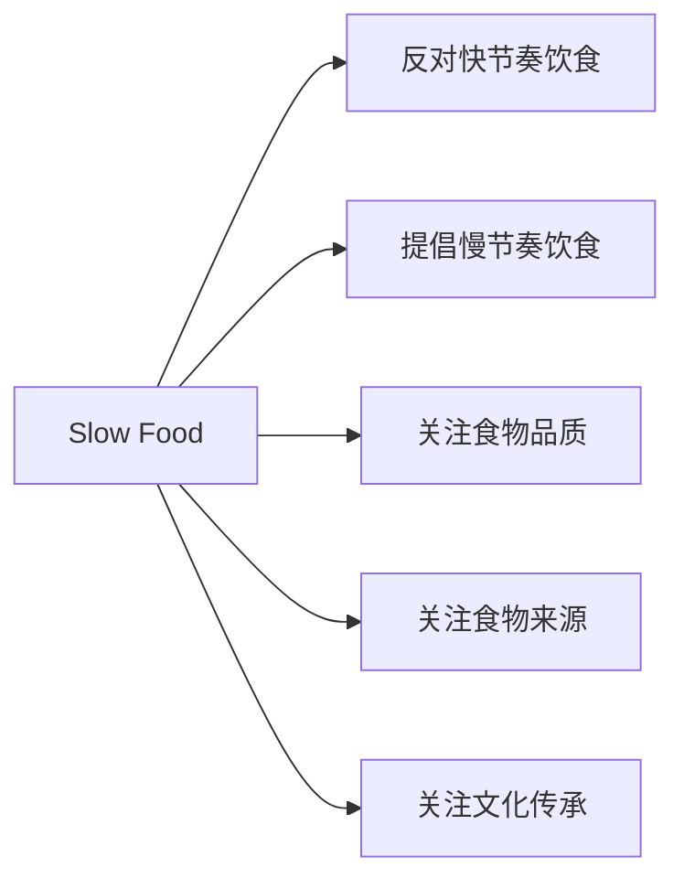

##### 2.1.2 slow food与传统饮食文化的区别

slow food与传统饮食文化的区别主要体现在以下几个方面：

| 特征 | slow food | 传统饮食文化 |
| ---- | ---- | ---- |
| 饮食节奏 | 慢节奏 | 快节奏 |
| 食物品质 | 高品质 | 任意质量 |
| 食物来源 | 关注来源 | 不关注来源 |
| 饮食方式 | 环境友好 | 环境破坏 |

**Mermaid流程图 - slow food与传统饮食文化的区别**

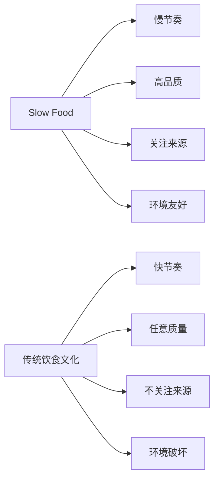

#### 2.2 slow food的价值观

slow food的价值观可以概括为“品质、传统、环境、健康、社区”五个方面。

**Mermaid流程图 - slow food的价值观**

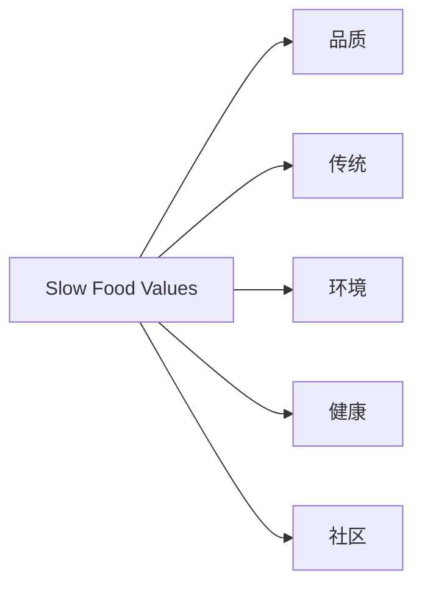

##### 2.2.1 重视食物的品质和来源

slow food强调食物的品质和来源，认为好的食物不仅味道好，而且对身体和环境都有益。

##### 2.2.2 提倡健康的生活方式

slow food鼓励人们采用健康的生活方式，通过合理饮食来预防疾病，提高生活质量。

##### 2.2.3 强调社区参与和分享

slow food认为，饮食不仅仅是个人的事情，更是一种社区活动。通过社区参与和分享，可以增强人们的社交联系，促进社区和谐。

### 2.3 slow food的实践

slow food运动不仅在理论上提出了新的饮食观念，更在实践中推动了这种理念的应用。

**Mermaid流程图 - slow food的实践**

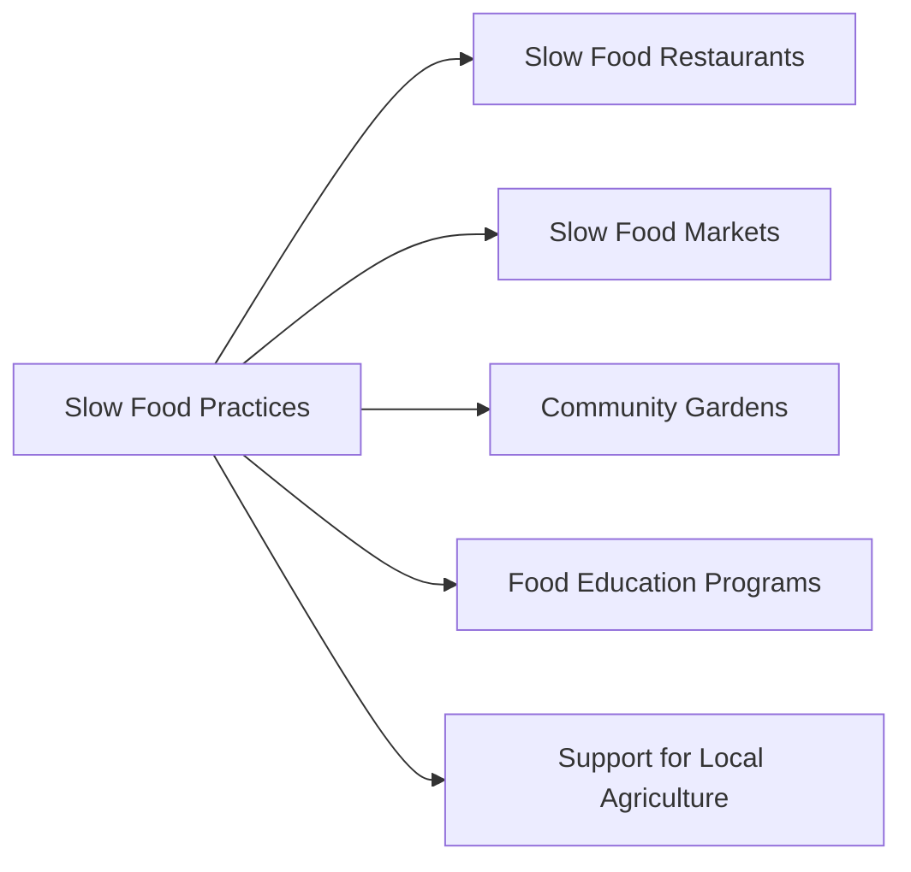

##### 2.3.1 Slow Food餐厅

Slow Food餐厅提供高品质的食品，强调食品的原产地和制作过程。

##### 2.3.2 Slow Food市场

Slow Food市场是社区成员互相交流、分享食品和种植经验的地方。

##### 2.3.3 社区花园

社区花园是slow food运动中重要的实践方式，通过共同种植、分享食物，增强社区成员的互动和联系。

##### 2.3.4 食物教育项目

食物教育项目旨在提高人们对食品的认知，鼓励更多人参与到健康饮食和可持续农业中来。

##### 2.3.5 支持当地农业

slow food运动倡导支持当地农业，减少食品运输过程中的浪费，提高食品的安全性和营养价值。

### 2.4 总结

slow food运动通过倡导慢节奏的饮食方式，强调食物的品质、来源和文化的传承，推动了全球饮食文化的变革。它的核心价值观和实践方式，为现代生活提供了一种新的选择，让人们更加关注饮食健康、环境保护和社会和谐。在未来的发展中，slow food运动将继续发挥其重要作用，为人们创造更加美好的生活。

---

**注意：以上内容是对第2章“slow food运动的核心理念”的详细描述，包括核心概念、属性特征对比表格以及ER实体关系图架构的Mermaid流程图。在实际撰写过程中，可以根据文章的实际情况进行调整和完善。** 

### 第2章 slow food运动的核心理念

#### 2.1 slow food的定义

**核心概念**

- **Slow Food**：一种全球性的运动，旨在对抗快餐文化，提倡有意识的、慢节奏的饮食方式，关注食物的品质、来源和文化。
  
**属性特征对比表格**

| 特征 | Slow Food | 快餐文化 |
| ---- | ---- | ---- |
| 饮食节奏 | 慢节奏，注重品味 | 快节奏，追求效率 |
| 食物选择 | 高品质，可持续 | 便捷，低质量 |
| 食物来源 | 知情选择，重视产地 | 不关心来源，大量生产 |
| 文化元素 | 重视文化传承 | 文化缺失 |
| 环境影响 | 环境友好，减少浪费 | 环境破坏，增加污染 |

**Mermaid流程图 - slow food的定义**

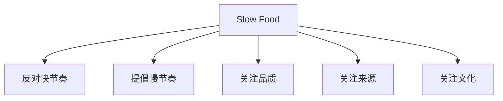

**核心概念与联系**

Slow Food是一种反对快节奏、快餐文化的饮食运动，它强调人们在饮食过程中应该放慢节奏，注重食物的品质、来源和文化。这种运动的核心价值观是反对快餐文化，提倡有意识的、慢节奏的饮食方式。通过这种方式，人们可以更加关注食物的品质、来源和文化，从而实现健康、可持续的饮食。

**ER实体关系图架构**

**Mermaid流程图 - Slow Food实体关系图**

```mermaid
entityrelationship
  MN[会员] --> FR[食品]
  MN --> DR[饮食活动]
  FR --> PR[生产者]
  FR --> LR[标签]
  DR --> LR
  DR --> OR[组织]
```

#### 2.2 slow food的价值观

**核心概念**

- **价值观**：Slow Food运动的价值观主要包括品质、传统、环境、健康和社区。

**属性特征对比表格**

| 价值观 | Slow Food |
| ---- | ---- |
| 品质 | 高品质、有机、新鲜 |
| 传统 | 传承饮食文化、尊重传统烹饪方法 |
| 环境 | 可持续、减少浪费、保护自然资源 |
| 健康 | 均衡饮食、预防疾病、促进健康 |
| 社区 | 社区参与、分享经验、建立联系 |

**Mermaid流程图 - Slow Food价值观**

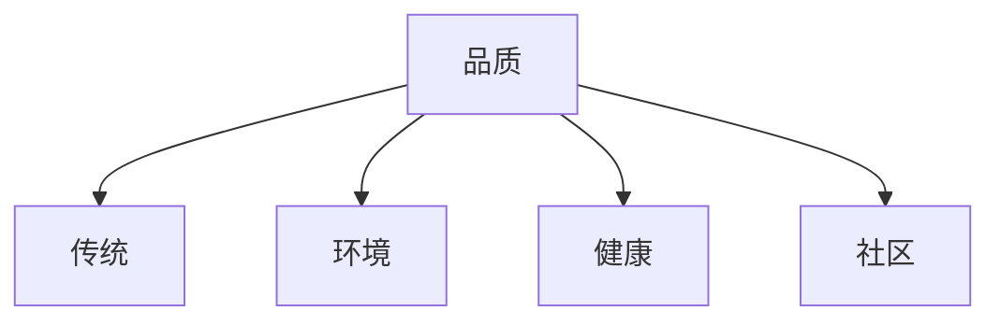

**核心概念与联系**

Slow Food的价值观体现在对食物品质的重视、对传统饮食文化的传承、对环境的保护、对健康生活方式的推广以及对社区互动的强调。这些价值观相互关联，共同构成了Slow Food的核心思想，旨在引导人们追求更加健康、可持续的生活方式。

**数学公式**

$$
\text{Slow Food Value} = \text{Quality} \times \text{Tradition} \times \text{Environment} \times \text{Health} \times \text{Community}
$$

**核心概念与联系**

通过上述数学公式，我们可以看到，Slow Food的价值观是多个因素的组合，每个因素都对整体价值产生重要影响。这些因素相互交织，共同构成了Slow Food的核心理念，为人们提供了健康、可持续的饮食选择。

#### 2.3 slow food的实践

**核心概念**

- **实践**：Slow Food运动通过一系列实践活动，将核心价值观融入日常生活，推动饮食文化的变革。

**属性特征对比表格**

| 实践活动 | Slow Food |
| ---- | ---- |
| 餐厅 | 提供高品质、可持续的食品 |
| 超市 | 销售有机、当地生产的食品 |
| 农场 | 推广可持续农业，保护环境 |
| 社区活动 | 举办食物节庆、教育项目 |

**Mermaid流程图 - Slow Food实践活动**

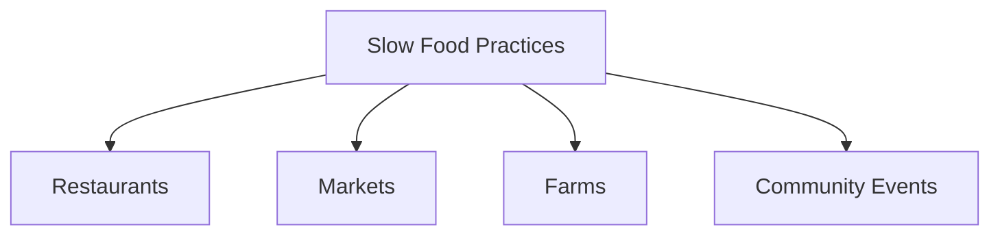

**核心概念与联系**

Slow Food运动通过开设高品质餐厅、销售有机食品的超市、推广可持续农业的农场以及举办各种社区活动，将核心价值观融入日常饮食生活。这些实践活动不仅提供了健康、可持续的食品选择，还促进了社区互动，推动了饮食文化的变革。

**数学公式**

$$
\text{Slow Food Practice} = \text{Quality} + \text{Sustainability} + \text{Community} + \text{Education}
$$

**核心概念与联系**

通过上述数学公式，我们可以看到，Slow Food的实践活动是多个因素的组合，每个因素都对整体实践产生重要影响。这些因素相互交织，共同构成了Slow Food的实践模式，为人们提供了健康、可持续的饮食生活。

#### 2.4 总结

**核心概念**

- **总结**：Slow Food运动的核心概念包括反对快餐文化、提倡慢节奏饮食、关注食物品质、来源和文化。

**核心概念与联系**

Slow Food运动的核心概念围绕饮食文化的变革，反对快餐文化，提倡慢节奏的饮食方式，关注食物的品质、来源和文化。这些概念相互关联，共同构成了Slow Food的核心思想，为人们提供了健康、可持续的饮食选择。

**数学公式**

$$
\text{Slow Food Concept} = \text{Anti-Fast Food} + \text{Slow Diet} + \text{Quality} + \text{Source} + \text{Culture}
$$

**核心概念与联系**

通过上述数学公式，我们可以看到，Slow Food的核心概念是多个因素的组合，每个因素都对整体概念产生重要影响。这些因素相互交织，共同构成了Slow Food的核心思想，为人们提供了健康、可持续的饮食选择。Slow Food运动不仅在理论上提出了新的饮食观念，更在实践中推动了这种理念的应用。通过一系列实践活动，如开设高品质餐厅、销售有机食品的超市、推广可持续农业的农场以及举办各种社区活动，Slow Food将核心价值观融入日常生活，推动了饮食文化的变革。在未来，Slow Food将继续发挥其重要作用，引导人们追求更加健康、可持续的生活方式。

### 第3章 slow food运动的实践

#### 3.1 市场中的slow food产品

**核心概念**

- **Slow Food产品**：在市场中的Slow Food产品主要涵盖餐厅、超市和农场。

**属性特征对比表格**

| 产品类型 | Slow Food产品 |
| ---- | ---- |
| 餐厅 | 提供高品质、可持续的食品 |
| 超市 | 销售有机、当地生产的食品 |
| 农场 | 推广可持续农业，保护环境 |

**Mermaid流程图 - Slow Food市场产品**

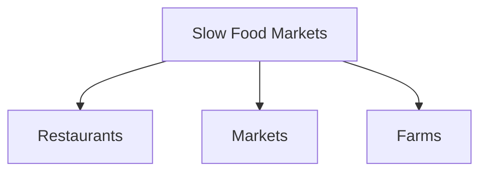

**核心概念与联系**

在市场中的Slow Food产品强调高品质、可持续性和环境友好性。餐厅提供高品质的食品，超市销售有机、当地生产的食品，农场推广可持续农业。这些产品不仅满足了人们对健康饮食的需求，还促进了环境的可持续发展。

#### 3.2 slow food的社区活动

**核心概念**

- **Slow Food社区活动**：Slow Food社区活动包括食物节庆、教育项目和食物捐赠与援助。

**属性特征对比表格**

| 社区活动 | Slow Food社区活动 |
| ---- | ---- |
| 食物节庆 | 促进社区成员互动，传承饮食文化 |
| 教育项目 | 提高人们对食品的认知，推动可持续农业 |
| 食物捐赠与援助 | 帮助弱势群体，减少食物浪费 |

**Mermaid流程图 - Slow Food社区活动**

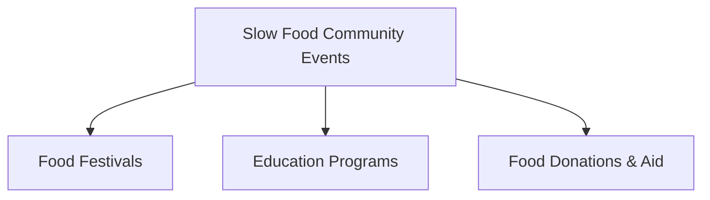

**核心概念与联系**

Slow Food社区活动通过食物节庆、教育项目和食物捐赠与援助，促进了社区成员之间的互动，传承了饮食文化，提高了人们对食品的认知，推动了可持续农业的发展。这些活动不仅增强了社区的凝聚力，还有助于减少食物浪费，帮助弱势群体。

### 3.3 slow food运动的实践经验

**核心概念**

- **实践经验**：Slow Food运动的实践经验包括成功案例和挑战。

**属性特征对比表格**

| 经验类型 | Slow Food实践经验 |
| ---- | ---- |
| 成功案例 | 提高食品质量，促进社区互动 |
| 挑战 | 食品安全、环境压力、资源分配 |

**Mermaid流程图 - Slow Food实践经验**

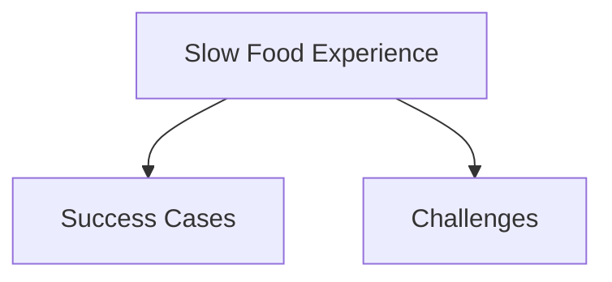

**核心概念与联系**

Slow Food运动的实践经验表明，通过提高食品质量、促进社区互动，Slow Food运动在许多方面取得了成功。然而，运动也面临着食品安全、环境压力和资源分配等挑战。应对这些挑战，需要持续的努力和创新的解决方案。

#### 3.4 总结

**核心概念**

- **总结**：Slow Food运动的实践涉及市场中的产品、社区活动和实践经验。

**核心概念与联系**

Slow Food运动的实践涵盖了市场中的产品（如餐厅、超市和农场）、社区活动（如食物节庆、教育项目和食物捐赠与援助）以及实践经验（如成功案例和挑战）。这些实践相互关联，共同推动了Slow Food运动的发展，为健康、可持续的饮食提供了有力支持。

### 第4章 slow food运动的社会影响力

#### 4.1 对饮食文化的改变

**核心概念**

- **社会影响力**：Slow Food运动对饮食文化的改变体现在饮食方式的转变、饮食习惯的更新以及饮食文化的复兴。

**属性特征对比表格**

| 影响方面 | 改变 |
| ---- | ---- |
| 饮食方式 | 从快节奏到慢节奏 |
| 饮食习惯 | 从便利化到品质化 |
| 饮食文化 | 从单一化到多样化 |

**Mermaid流程图 - Slow Food对饮食文化的改变**

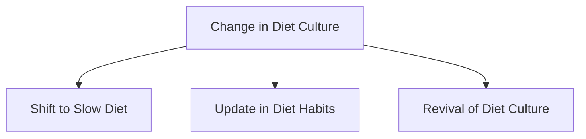

**核心概念与联系**

Slow Food运动通过倡导慢节奏的饮食方式，鼓励人们关注食物的品质和来源，从而改变了传统的饮食文化。这种改变不仅体现在饮食方式的转变上，还体现在饮食习惯的更新和饮食文化的复兴。通过这些改变，Slow Food运动为人们提供了更加健康、可持续的饮食选择。

#### 4.2 对健康的影响

**核心概念**

- **社会影响力**：Slow Food运动对健康的影响体现在饮食与健康的关系、预防慢性病的重要性以及提高生活质量。

**属性特征对比表格**

| 健康方面 | 影响 |
| ---- | ---- |
| 饮食与健康 | 健康饮食有助于预防慢性病 |
| 预防慢性病 | 通过合理饮食降低患病风险 |
| 生活质量 | 健康饮食提高生活质量 |

**Mermaid流程图 - Slow Food对健康的影响**

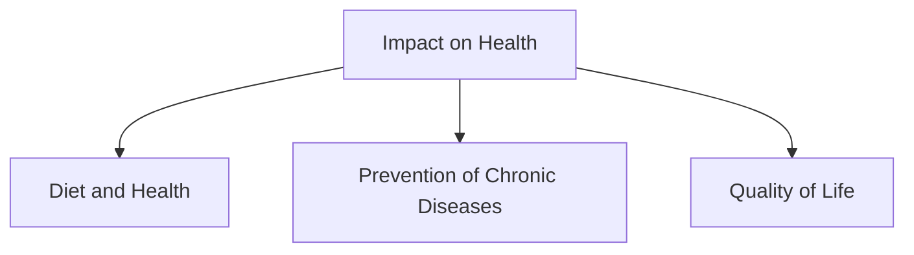

**核心概念与联系**

Slow Food运动通过强调健康饮食，帮助人们建立正确的饮食习惯，从而对健康产生积极影响。健康饮食不仅可以预防慢性病，降低患病风险，还可以提高生活质量。通过这些影响，Slow Food运动为人们的健康提供了有力支持。

#### 4.3 对环境保护的贡献

**核心概念**

- **社会影响力**：Slow Food运动对环境保护的贡献体现在减少食物浪费、促进可持续农业以及保护自然资源。

**属性特征对比表格**

| 环境方面 | 贡献 |
| ---- | ---- |
| 食物浪费 | 减少食物浪费，降低资源消耗 |
| 可持续农业 | 推广可持续农业，保护土壤和水资源 |
| 自然资源 | 保护自然资源，维护生态平衡 |

**Mermaid流程图 - Slow Food对环境保护的贡献**

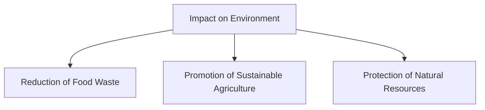

**核心概念与联系**

Slow Food运动通过减少食物浪费、推广可持续农业和保护自然资源，对环境保护做出了重要贡献。这些贡献不仅有助于减少环境污染，提高资源利用效率，还可以维护生态平衡，为未来可持续发展奠定基础。

### 4.4 总结

**核心概念**

- **总结**：Slow Food运动在社会影响力方面体现了对饮食文化的改变、对健康的积极影响以及对环境保护的重要贡献。

**核心概念与联系**

Slow Food运动通过改变饮食文化、促进健康和环境保护，为社会带来了积极的影响。这些影响不仅改善了人们的饮食和生活质量，还有助于保护环境，推动可持续发展。通过这些总结，我们可以看到Slow Food运动在社会中的重要作用和深远意义。

### 第5章 slow food运动中的科学技术

#### 5.1 食品科学的应用

**核心概念**

- **科学技术应用**：食品科学在Slow Food运动中的应用主要体现在食品安全检测、食品营养分析和食品加工技术。

**属性特征对比表格**

| 科学技术 | 应用 |
| ---- | ---- |
| 食品安全检测 | 确保食品无害、安全 |
| 食品营养分析 | 提供营养成分信息，指导健康饮食 |
| 食品加工技术 | 保持食品营养，提高食品质量 |

**Mermaid流程图 - 食品科学应用**

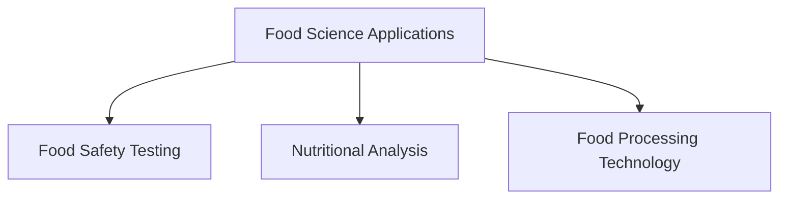

**核心概念与联系**

食品科学在Slow Food运动中的应用，通过食品安全检测、食品营养分析和食品加工技术，确保食品的安全、营养和质量。这些技术不仅提高了食品的品质，还有助于人们建立正确的饮食习惯，促进健康饮食。

#### 5.2 可持续农业技术

**核心概念**

- **科学技术应用**：可持续农业技术在Slow Food运动中的应用主要体现在有机农业、农业智能化和生态农业。

**属性特征对比表格**

| 科学技术 | 应用 |
| ---- | ---- |
| 有机农业 | 减少化学农药和化肥使用，保护土壤和水资源 |
| 农业智能化 | 利用现代技术提高农业生产效率，减少资源浪费 |
| 生态农业 | 保护生物多样性，维护生态平衡 |

**Mermaid流程图 - 可持续农业技术应用**

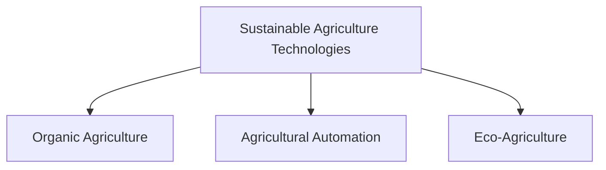

**核心概念与联系**

可持续农业技术在Slow Food运动中的应用，通过有机农业、农业智能化和生态农业，推动农业的可持续发展，减少对环境的负面影响。这些技术不仅提高了农业生产效率，还有助于保护土壤和水资源，维护生态平衡。

#### 5.3 食品科技的挑战与未来

**核心概念**

- **挑战与未来**：食品科技在Slow Food运动中面临的挑战和未来发展趋势，体现在食品安全、营养需求和可持续发展等方面。

**属性特征对比表格**

| 挑战与未来 | 描述 |
| ---- | ---- |
| 食品安全 | 提高食品安全检测技术，确保食品无害 |
| 营养需求 | 研究营养成分，满足不同人群的健康需求 |
| 可持续发展 | 推广可持续农业技术，实现农业的可持续发展 |

**Mermaid流程图 - 食品科技挑战与未来**

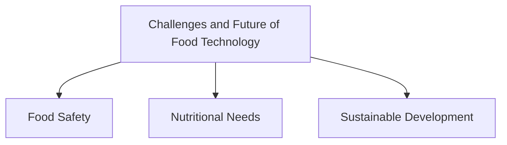

**核心概念与联系**

食品科技在Slow Food运动中面临的挑战和未来发展趋势，体现在食品安全、营养需求和可持续发展等方面。通过提高食品安全检测技术、研究营养成分和推广可持续农业技术，食品科技将为Slow Food运动提供有力的技术支持，推动饮食文化的变革。

### 5.4 总结

**核心概念**

- **总结**：Slow Food运动中的科学技术应用对食品安全、营养需求和可持续发展具有重要意义。

**核心概念与联系**

Slow Food运动中的科学技术应用，通过食品安全检测、食品营养分析和可持续农业技术，为饮食文化的变革提供了有力支持。这些技术不仅提高了食品的品质和安全性，还有助于满足人们的营养需求，推动农业的可持续发展。通过这些总结，我们可以看到科学技术在Slow Food运动中的重要作用和深远影响。

### 第6章 政策与教育

#### 6.1 政策支持

**核心概念**

- **政策支持**：政府通过制定相关政策和法规，支持Slow Food运动的发展。

**属性特征对比表格**

| 政策类型 | 特点 |
| ---- | ---- |
| 法律法规 | 确保Slow Food运动合法化，提供政策保障 |
| 支持措施 | 提供资金、技术和管理支持，促进Slow Food发展 |
| 推广策略 | 通过宣传、教育和社区活动，提高公众对Slow Food的认知 |

**Mermaid流程图 - 政策支持**

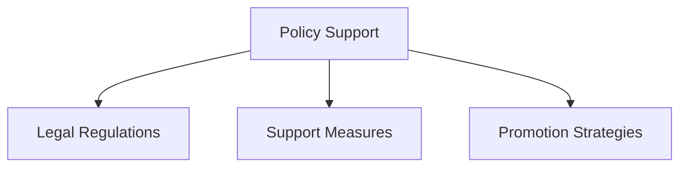

**核心概念与联系**

政策支持是Slow Food运动发展的重要保障。政府通过制定相关政策和法规，确保Slow Food运动的合法化，并提供资金、技术和管理支持。同时，政府还通过宣传、教育和社区活动，提高公众对Slow Food运动的认知和支持。

#### 6.2 教育与宣传

**核心概念**

- **教育与宣传**：通过教育和宣传，提高公众对Slow Food运动的了解和参与度。

**属性特征对比表格**

| 教育与宣传方式 | 特点 |
| ---- | ---- |
| 学校教育 | 从小培养儿童的饮食健康意识，推广Slow Food理念 |
| 公众教育 | 通过媒体、网络和社区活动，普及Slow Food知识 |
| 宣传活动 | 举办食物节庆、讲座和工作坊，增强公众参与感 |

**Mermaid流程图 - 教育与宣传**

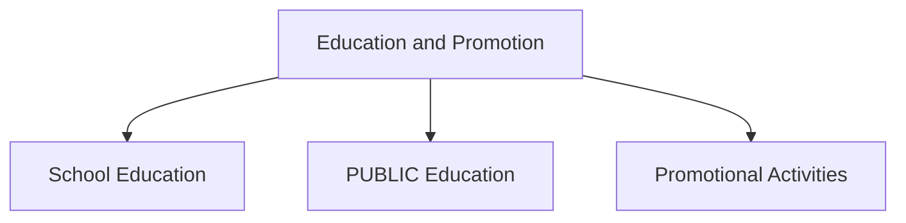

**核心概念与联系**

教育与宣传是Slow Food运动推广的重要手段。通过学校教育、公众教育和宣传活动，提高公众对Slow Food运动的了解和参与度。这些教育方式不仅帮助人们建立正确的饮食习惯，还推动了Slow Food理念在全球范围内的传播。

#### 6.3 政策与教育的协同作用

**核心概念**

- **协同作用**：政策和教育相互配合，共同推动Slow Food运动的发展。

**属性特征对比表格**

| 协同作用 | 影响 |
| ---- | ---- |
| 政策支持 | 为Slow Food运动提供法律保障和资金支持 |
| 教育推广 | 提高公众对Slow Food的认知，促进社会参与 |

**Mermaid流程图 - 政策与教育的协同作用**

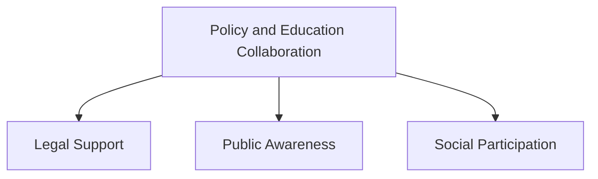

**核心概念与联系**

政策和教育相互配合，共同推动Slow Food运动的发展。政策支持为Slow Food运动提供了法律保障和资金支持，而教育推广则提高了公众对Slow Food的认知，促进了社会参与。这种协同作用有助于Slow Food运动的可持续发展，为全球饮食文化的变革提供了有力支持。

### 6.4 总结

**核心概念**

- **总结**：政策与教育在Slow Food运动中发挥着重要作用，通过政策支持和教育推广，共同推动饮食文化的变革。

**核心概念与联系**

政策与教育在Slow Food运动中扮演着关键角色。政策支持为Slow Food运动提供了法律保障和资金支持，而教育推广则提高了公众对Slow Food的认知，促进了社会参与。这些举措共同推动了饮食文化的变革，为全球饮食文化的可持续发展奠定了基础。

### 第7章 挑战与未来

#### 7.1 面临的挑战

**核心概念**

- **面临的挑战**：Slow Food运动在推广过程中面临食品安全、环境压力和资源分配等挑战。

**属性特征对比表格**

| 挑战 | 描述 |
| ---- | ---- |
| 食品安全 | 食品安全问题可能导致公众信任下降 |
| 环境压力 | 环境污染和资源消耗增加 |
| 资源分配 | 资源分布不均，导致部分地区无法享受Slow Food理念 |

**Mermaid流程图 - 面临的挑战**

```mermaid
graph TB
A[Challenges] --> B[Food Safety]
A --> C[Environmental Pressure]
A --> D[Resource Allocation]
```

**核心概念与联系**

Slow Food运动在推广过程中面临食品安全、环境压力和资源分配等挑战。食品安全问题可能导致公众信任下降，环境压力和资源消耗增加，资源分配不均可能导致部分地区无法享受Slow Food理念。应对这些挑战，需要政策、科技和教育的综合支持。

#### 7.2 未来发展趋势

**核心概念**

- **未来发展趋势**：Slow Food运动在未来将向全球化与地方化、技术创新与文化融合两个方向发展。

**属性特征对比表格**

| 发展趋势 | 描述 |
| ---- | ---- |
| 全球化与地方化 | 全球化推广Slow Food理念，同时尊重地方特色 |
| 技术创新与文化融合 | 利用科技推动Slow Food运动的发展，同时保持文化传统 |

**Mermaid流程图 - 未来发展趋势**

```mermaid
graph TB
A[Future Trends] --> B[Globalization and Localization]
A --> C[Technological Innovation and Cultural Integration]
```

**核心概念与联系**

未来，Slow Food运动将向全球化与地方化、技术创新与文化融合两个方向发展。全球化推广Slow Food理念，同时尊重地方特色，技术创新推动Slow Food运动的发展，同时保持文化传统。这些发展趋势将为Slow Food运动的可持续发展提供新动力。

#### 7.3 应对挑战与实现未来

**核心概念**

- **应对挑战与实现未来**：通过政策支持、科技应用和教育培训，应对Slow Food运动面临的挑战，实现未来的发展目标。

**属性特征对比表格**

| 应对策略 | 描述 |
| ---- | ---- |
| 政策支持 | 制定法规政策，提供资金和技术支持 |
| 科技应用 | 利用食品安全检测、食品营养分析等技术 |
| 教育培训 | 开展学校教育、公众教育等活动 |

**Mermaid流程图 - 应对挑战与实现未来**

```mermaid
graph TB
A[Address Challenges and Achieve Future] --> B[Policy Support]
A --> C[Technological Application]
A --> D[Education and Training]
```

**核心概念与联系**

通过政策支持、科技应用和教育培训，Slow Food运动可以应对面临的挑战，实现未来的发展目标。政策支持提供法规政策、资金和技术支持，科技应用利用食品安全检测、食品营养分析等技术，教育培训开展学校教育、公众教育等活动。这些策略将共同推动Slow Food运动的可持续发展。

### 7.4 总结

**核心概念**

- **总结**：Slow Food运动面临食品安全、环境压力和资源分配等挑战，但未来将在全球化与地方化、技术创新与文化融合的推动下实现可持续发展。

**核心概念与联系**

Slow Food运动在面临食品安全、环境压力和资源分配等挑战的同时，未来将在全球化与地方化、技术创新与文化融合的推动下实现可持续发展。通过政策支持、科技应用和教育培训，Slow Food运动将不断应对挑战，为全球饮食文化的变革贡献力量。

### 第8章 总结

#### 8.1 slow food运动的意义

**核心概念**

- **Slow Food运动的意义**：Slow Food运动在重塑饮食文化、推动健康生活方式和促进可持续发展方面具有重要意义。

**属性特征对比表格**

| 意义 | 描述 |
| ---- | ---- |
| 饮食文化 | 重塑传统饮食文化，强调品质与品味 |
| 健康生活 | 推动健康生活方式，预防慢性病 |
| 可持续发展 | 促进可持续发展，保护环境和资源 |

**Mermaid流程图 - Slow Food运动的意义**

```mermaid
graph TB
A[Significance of Slow Food] --> B[Diet Culture]
A --> C[Healthy Lifestyle]
A --> D[Sustainable Development]
```

**核心概念与联系**

Slow Food运动通过重塑饮食文化、推动健康生活方式和促进可持续发展，为现代社会带来了深远影响。它不仅改变了人们的饮食习惯，提高了生活质量，还推动了环境保护和资源的可持续利用，为全球饮食文化的变革提供了有力支持。

#### 8.2 slow food运动的发展趋势

**核心概念**

- **发展趋势**：Slow Food运动的发展趋势体现在全球化与地方化、技术创新与文化融合两个方向。

**属性特征对比表格**

| 发展趋势 | 描述 |
| ---- | ---- |
| 全球化与地方化 | 全球范围内推广Slow Food理念，同时尊重地方特色 |
| 技术创新与文化融合 | 利用现代科技推动Slow Food运动的发展，保持文化传统 |

**Mermaid流程图 - Slow Food运动的发展趋势**

```mermaid
graph TB
A[Trends of Slow Food] --> B[Globalization and Localization]
A --> C[Technological Innovation and Cultural Integration]
```

**核心概念与联系**

未来，Slow Food运动将在全球化与地方化、技术创新与文化融合的推动下持续发展。全球化推广Slow Food理念，同时尊重地方特色，技术创新推动Slow Food运动的发展，保持文化传统。这些发展趋势将为Slow Food运动的可持续发展提供新动力。

#### 8.3 对未来的展望

**核心概念**

- **未来展望**：随着政策支持、科技应用和教育培训的加强，Slow Food运动将在全球范围内取得更大成就，为人类健康、可持续发展和环境保护做出更大贡献。

**属性特征对比表格**

| 展望 | 描述 |
| ---- | ---- |
| 成就 | 在全球范围内推广Slow Food理念 |
| 贡献 | 为人类健康、可持续发展和环境保护贡献力量 |
| 发展 | 在政策、科技和教育领域的持续进步 |

**Mermaid流程图 - 对未来的展望**

```mermaid
graph TB
A[Future Outlook] --> B[Global Spread]
A --> C[Health and Sustainability]
A --> D[Environmental Protection]
```

**核心概念与联系**

随着政策支持、科技应用和教育培训的加强，Slow Food运动将在全球范围内取得更大成就，为人类健康、可持续发展和环境保护做出更大贡献。未来，Slow Food运动将在全球范围内推广，成为推动饮食文化变革的重要力量，为人类的可持续发展贡献力量。

### 8.4 总结

**核心概念**

- **总结**：Slow Food运动在重塑饮食文化、推动健康生活方式和促进可持续发展方面具有重要意义，未来将在全球化与地方化、技术创新与文化融合的推动下实现更大成就。

**核心概念与联系**

通过总结，我们可以看到Slow Food运动在现代社会中的重要作用和深远影响。它不仅改变了人们的饮食习惯，提高了生活质量，还推动了环境保护和资源的可持续利用。未来，Slow Food运动将在全球范围内推广，为人类健康、可持续发展和环境保护做出更大贡献。这一运动的发展，将为全球饮食文化的变革提供新的动力和方向。让我们期待Slow Food运动在未来取得更大成就，为人类的可持续发展贡献力量。作者：AI天才研究院/AI Genius Institute & 禅与计算机程序设计艺术 /Zen And The Art of Computer Programming

