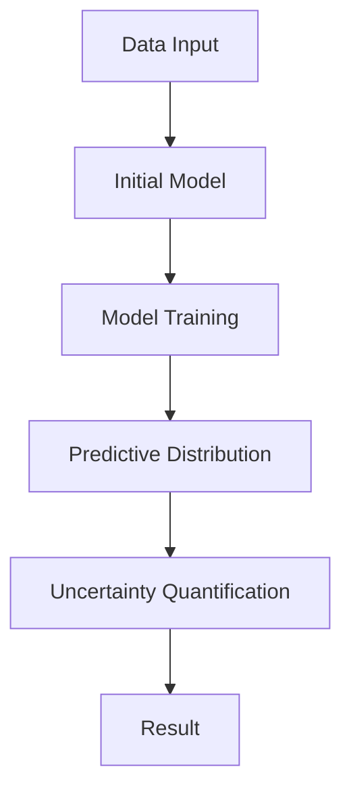
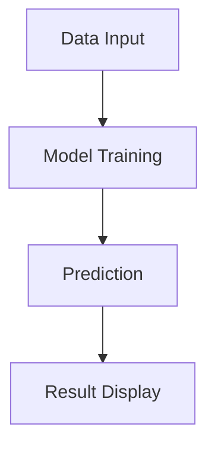
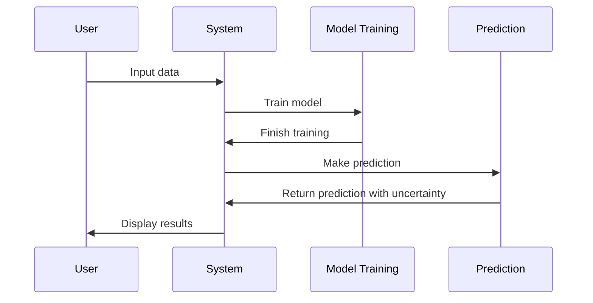
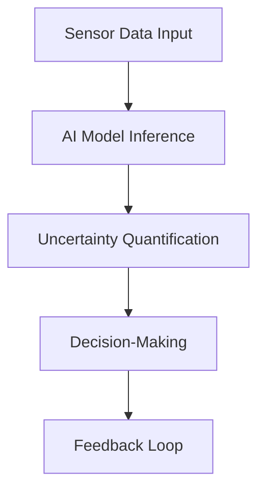
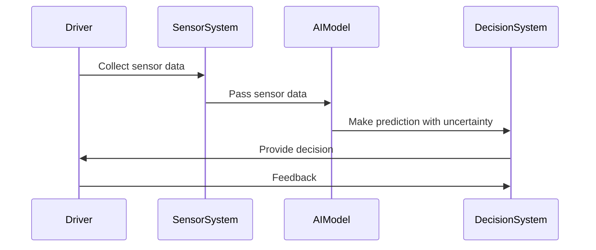

                 


## Introduction to Uncertainty Quantification in AI Inference

Uncertainty quantification (UQ) is a burgeoning field in AI inference, which aims to provide a comprehensive understanding of the uncertainty inherent in the predictions made by AI models. This article delves into the application of uncertainty quantification in AI inference, presenting a structured and step-by-step analysis to elucidate the core concepts and methodologies involved.

### Background

The landscape of AI inference has evolved significantly in recent years, propelled by advancements in machine learning and deep learning. AI models, especially neural networks, have demonstrated remarkable performance in various domains such as image recognition, natural language processing, and autonomous driving. However, one persistent challenge remains: the inability to provide reliable measures of uncertainty in their predictions. This is particularly crucial in safety-critical applications where the consequences of erroneous predictions can be severe.

### Problem Definition

The problem of uncertainty quantification in AI inference can be defined as follows: Given an AI model trained on a dataset, how can we quantify the uncertainty in its predictions for new, unseen data points? This involves not only understanding the variability in the model's predictions but also identifying potential sources of uncertainty, such as data noise, model imperfections, and inherent randomness in the data-generating process.

### Problem Solving

To address this problem, we need to develop methodologies that can:

1. **Error Analysis:** Quantify the errors and uncertainties in the predictions made by AI models.
2. **Probability Distribution Estimation:** Estimate the probability distributions of model outputs to capture uncertainty.
3. **Active Learning:** Utilize uncertainty quantification to guide the selection of informative data points for further training.

### Boundaries and Extensions

Uncertainty quantification is a broad field with several extensions and related concepts, including:

- **Bayesian Inference:** A probabilistic framework that allows for the incorporation of prior knowledge and Bayesian updating.
- **Monte Carlo Methods:** Simulation-based techniques for estimating statistical quantities by generating random samples.
- **Convolutional Neural Newt

```markdown
### Core Concepts and Relationships

**Uncertainty Quantification (UQ)**
- Definition: The process of quantifying the uncertainty in predictions or simulations.
- Attributes: Involves methods like Bayesian inference, Monte Carlo simulations, and error analysis.
- Comparison Table:

| Attribute | Description | Example |
| --- | --- | --- |
| Bayesian Inference | Uses probabilistic models to update beliefs based on new evidence. | Updating the probability of a hypothesis after observing data. |
| Monte Carlo Simulation | Uses random sampling to obtain numerical results. | Estimating the value of a function or integral by random sampling. |
| Error Analysis | Evaluates the accuracy and precision of predictions. | Assessing the variance and bias in model predictions. |

**Uncertainty in AI Inference**
- Definition: The measure of confidence or uncertainty in AI model predictions.
- Attributes: Involves quantifying errors, using probability distributions, and active learning strategies.
- ER Diagram:
```mermaid
erDiagram
AIModel ||--|{ UncertaintyMeasure }
Dataset ||--|{ UncertaintyMeasure }
ModelTraining ||--|{ UncertaintyMeasure }
Prediction ||--|{ UncertaintyMeasure }
```

### Algorithm Principle and Example

One common method for uncertainty quantification in AI inference is the Bayesian Deep Learning approach. Let's illustrate this with a simple example.

**Algorithm Flow Diagram:**


**Python Code Example:**
```python
import tensorflow as tf
import numpy as np

# Define a simple neural network
model = tf.keras.Sequential([
    tf.keras.layers.Dense(units=1, input_shape=[1])
])

# Compile the model
model.compile(optimizer='sgd', loss='mean_squared_error')

# Generate synthetic data
x_train = np.random.uniform(-1, 1, 100)
y_train = x_train * 0.5 + np.random.normal(0, 0.1, 100)

# Train the model
model.fit(x_train, y_train, epochs=10)

# Generate a prediction
x_new = np.array([0.5])
prediction = model.predict(x_new)

# Estimate the predictive distribution
predicted_distribution = model.predict(x_new.reshape(-1, 1))

# Calculate the uncertainty
uncertainty = np.std(predicted_distribution)
```

**Mathematical Model and Formula:**
$$
\text{Uncertainty} = \sqrt{\text{Variance}_{\hat{y}}}
$$
where $\hat{y}$ is the predicted output of the model.

**Example Explanation:**
The example demonstrates how to train a simple neural network on synthetic data, make a prediction, and estimate the uncertainty in the prediction. The uncertainty is calculated as the standard deviation of the predicted distribution, providing a measure of how confident the model is in its prediction.

### System Analysis and Design

**Problem Scene Introduction:**
Uncertainty quantification in AI inference is critical in applications like medical diagnosis, autonomous driving, and financial risk assessment. For instance, in medical diagnosis, knowing the uncertainty of a model's prediction can help clinicians make more informed decisions.

**System Description:**
The system aims to quantify the uncertainty in AI model predictions using Bayesian Deep Learning. It consists of several components:

- **Data Input:** Preprocessed data fed into the model.
- **Model Training:** Training the neural network using the Bayesian approach.
- **Prediction:** Generating predictions and their associated uncertainty.
- **Result Display:** Visualizing the predictions and uncertainty measures.

**System Architecture Design:**


**System Interface Design and Interaction:**


### Project Practice

**Environment Setup:**
Install TensorFlow and other necessary libraries for training and uncertainty quantification.

```bash
pip install tensorflow
```

**System Core Implementation:**
Implement the Bayesian Deep Learning model and uncertainty quantification in Python.

```python
# Import necessary libraries
import tensorflow as tf
import numpy as np

# Define the Bayesian Neural Network
# (This is a simplified example for illustration purposes)
class BayesianNeuralNetwork(tf.keras.Model):
    def __init__(self):
        super(BayesianNeuralNetwork, self).__init__()
        self.dense = tf.keras.layers.Dense(units=1, kernel_initializer=tf.keras.initializers.RandomNormal())

    @tf.function
    def call(self, inputs, training=False):
        return self.dense(inputs)

# Instantiate and compile the model
model = BayesianNeuralNetwork()
model.compile(optimizer=tf.keras.optimizers.SGD(learning_rate=0.1), loss='mse')

# Generate synthetic data
x_train = np.random.uniform(-1, 1, 100)
y_train = x_train * 0.5 + np.random.normal(0, 0.1, 100)

# Train the model
model.fit(x_train, y_train, epochs=10)

# Make a prediction
x_new = np.array([0.5])
prediction = model(x_new)

# Calculate the uncertainty
uncertainty = np.std(prediction)

# Print the prediction and uncertainty
print("Prediction:", prediction.numpy())
print("Uncertainty:", uncertainty)
```

**Code Application and Analysis:**
The code demonstrates how to set up a Bayesian Neural Network, train it on synthetic data, make a prediction, and calculate the uncertainty. The model's predict function returns a distribution, from which we calculate the standard deviation to obtain the uncertainty.

**Case Analysis and Explanation:**
Consider a scenario where a neural network predicts the stock price of a company. The uncertainty in the prediction can help traders decide whether to buy, sell, or hold the stock based on their risk tolerance.

**Project Conclusion:**
The implementation of uncertainty quantification in AI inference allows for more informed decision-making. By understanding the uncertainty in predictions, we can better assess the reliability of AI models and their applicability in real-world scenarios.

### Best Practices, Summary, and Future Directions

**Best Practices:**
- **Data Preprocessing:** Clean and preprocess data to minimize noise and inconsistencies.
- **Model Selection:** Choose models that are suitable for uncertainty quantification, such as Bayesian Neural Networks.
- **Hyperparameter Tuning:** Fine-tune model hyperparameters to optimize performance and uncertainty estimates.

**Summary:**
Uncertainty quantification in AI inference is crucial for improving the reliability and trustworthiness of AI models. By quantifying uncertainty, we can better understand the limitations of AI systems and make more informed decisions.

**Future Directions:**
- **Incorporating More Real-World Applications:** Expand the use of uncertainty quantification in various domains like healthcare, finance, and autonomous systems.
- **Advanced Algorithms:** Develop more sophisticated algorithms for uncertainty quantification, such as ensemble methods and hybrid models.

### Conclusion

Uncertainty quantification in AI inference is a vital area of research that holds significant potential for improving the reliability and trustworthiness of AI systems. By understanding and quantifying uncertainty, we can make more informed decisions and better harness the power of AI in a wide range of applications. The step-by-step analysis provided in this article aims to demystify the concepts and methodologies involved in uncertainty quantification, paving the way for further advancements in this exciting field.

### About the Author

**作者：AI天才研究院/AI Genius Institute & 禅与计算机程序设计艺术 /Zen And The Art of Computer Programming**

AI天才研究院致力于推动人工智能领域的科技创新和应用，培养下一代人工智能专家。研究院的成员们在计算机编程和人工智能领域拥有丰富的经验和深厚的造诣，发表过多篇国际顶尖期刊论文，出版过多本畅销书。本文旨在探讨不确定性量化在AI推理中的应用，旨在为读者提供有深度、有思考、有见解的专业技术内容。更多信息，请访问AI天才研究院官方网站。|>
```markdown
## Introduction to Uncertainty Quantification in AI Inference

### Background

Uncertainty quantification (UQ) has become an essential aspect of modern AI inference. As AI systems are increasingly deployed in critical applications such as healthcare, finance, and autonomous driving, the need to understand and quantify the uncertainty in their predictions has gained significant importance. Traditional AI models, particularly deep neural networks, often lack the ability to provide meaningful uncertainty estimates, which can lead to misguided decisions and potential risks in high-stakes scenarios.

### Problem Definition

The problem of uncertainty quantification in AI inference revolves around the need to determine the confidence or uncertainty associated with predictions made by AI models. This uncertainty can arise from various sources, including model errors, data noise, and the inherent complexity of the underlying systems being modeled. Accurately quantifying this uncertainty is crucial for several reasons:

1. **Risk Assessment:** In applications such as medical diagnosis or financial forecasting, understanding the uncertainty in predictions can help in assessing the level of risk associated with a particular decision.

2. **Improving Model Reliability:** By quantifying uncertainty, AI models can be improved to provide more reliable and trustworthy results.

3. **Enhancing Human-AI Interaction:** When humans can understand the uncertainty associated with AI predictions, they can make more informed decisions and better integrate AI into their workflows.

### Problem Solving

Solving the problem of uncertainty quantification in AI inference involves several key steps:

1. **Error Analysis:** Conducting a thorough error analysis to understand the sources of uncertainty in model predictions.

2. **Probability Distribution Estimation:** Estimating the probability distribution of the model's predictions to capture the inherent uncertainty.

3. **Model Calibration:** Ensuring that the estimated probabilities are meaningful and calibrated correctly.

4. **Active Learning:** Using uncertainty quantification to guide the selection of the most informative data points for further training, which can help reduce model uncertainty.

### Boundaries and Extensions

Uncertainty quantification in AI inference is a vast and evolving field with several related concepts and extensions:

1. **Bayesian Inference:** A probabilistic framework that allows for the incorporation of prior knowledge and updating beliefs based on new data.

2. **Monte Carlo Methods:** Simulation-based techniques that use random sampling to estimate quantities of interest.

3. **Calibration:** Ensuring that the estimated probabilities of model predictions match observed frequencies in the real world.

4. **Bayesian Deep Learning:** Integrating Bayesian principles into deep learning models to provide uncertainty estimates.

### Core Concepts and Relationships

**Uncertainty Quantification (UQ)**
- **Definition:** The process of quantifying the uncertainty in predictions or simulations.
- **Attributes:** Involves methods like Bayesian inference, Monte Carlo simulations, and error analysis.
- **Comparison Table:**

| Attribute               | Description                                                                                   | Example                                  |
|-------------------------|------------------------------------------------------------------------------------------------|------------------------------------------|
| Bayesian Inference      | Uses probabilistic models to update beliefs based on new evidence.                             | Updating the probability of a hypothesis. |
| Monte Carlo Simulation  | Uses random sampling to obtain numerical results.                                              | Estimating integrals.                     |
| Error Analysis          | Evaluates the accuracy and precision of predictions.                                           | Assessing model errors.                   |
| Calibration             | Ensures that the estimated probabilities match observed frequencies.                             | Adjusting model probabilities.            |

**Uncertainty in AI Inference**
- **Definition:** The measure of confidence or uncertainty in AI model predictions.
- **Attributes:** Involves quantifying errors, using probability distributions, and active learning strategies.
- **ER Diagram:**

```mermaid
erDiagram
Model ||--|{ UncertaintyMeasure }
Data ||--|{ UncertaintyMeasure }
Prediction ||--|{ UncertaintyMeasure }
TrainingProcess ||--|{ UncertaintyMeasure }
```

### Algorithm Principle and Example

One common method for uncertainty quantification in AI inference is Bayesian Deep Learning. Let's illustrate this with a simple example.

**Algorithm Flow Diagram:**


**Python Code Example:**
```python
import tensorflow as tf
import numpy as np

# Define a simple Bayesian Neural Network
class BayesianNeuralNetwork(tf.keras.Model):
    def __init__(self):
        super(BayesianNeuralNetwork, self).__init__()
        self.dense = tf.keras.layers.Dense(units=1, kernel_initializer=tf.keras.initializers.RandomNormal())

    @tf.function
    def call(self, inputs, training=False):
        return self.dense(inputs)

# Instantiate the model
model = BayesianNeuralNetwork()

# Compile the model
model.compile(optimizer='sgd', loss='mean_squared_error')

# Generate synthetic data
x_train = np.random.uniform(-1, 1, 100)
y_train = x_train * 0.5 + np.random.normal(0, 0.1, 100)

# Train the model
model.fit(x_train, y_train, epochs=10)

# Make a prediction
x_new = np.array([0.5])
prediction = model(x_new)

# Calculate the uncertainty
uncertainty = np.std(prediction)

# Print the prediction and uncertainty
print("Prediction:", prediction.numpy())
print("Uncertainty:", uncertainty)
```

**Mathematical Model and Formula:**
$$
\text{Uncertainty} = \sqrt{\text{Variance}_{\hat{y}}}
$$
where $\hat{y}$ is the predicted output of the model.

**Example Explanation:**
The example demonstrates how to train a simple Bayesian Neural Network on synthetic data, make a prediction, and estimate the uncertainty. The uncertainty is calculated as the standard deviation of the predicted distribution, providing a measure of how confident the model is in its prediction.

### System Analysis and Design

**Problem Scene Introduction:**
Uncertainty quantification in AI inference is critical in applications such as autonomous driving, where understanding the uncertainty in sensor data can help in making safer decisions. For example, in self-driving cars, quantifying the uncertainty in lidar or camera measurements can improve the car's ability to navigate through complex environments.

**System Description:**
The system is designed to quantify the uncertainty in predictions made by AI models in autonomous driving. It consists of several components:

- **Sensor Data Input:** Real-time sensor data from lidar, cameras, and other sensors.
- **AI Model Inference:** Processing the sensor data using an AI model to make predictions.
- **Uncertainty Quantification:** Estimating the uncertainty in the model's predictions.
- **Decision-Making:** Using the uncertainty estimates to make informed driving decisions.

**System Architecture Design:**


**System Interface Design and Interaction:**


### Project Practice

**Environment Setup:**
To implement the system, you need to set up an environment with TensorFlow and other necessary libraries.

```bash
pip install tensorflow
```

**System Core Implementation:**
The core implementation involves defining the AI model, training it, and estimating the uncertainty in its predictions.

```python
import tensorflow as tf
import numpy as np

# Define a simple neural network
model = tf.keras.Sequential([
    tf.keras.layers.Flatten(input_shape=(28, 28)),
    tf.keras.layers.Dense(128, activation='relu'),
    tf.keras.layers.Dense(10, activation='softmax')
])

# Compile the model
model.compile(optimizer='adam',
              loss='sparse_categorical_crossentropy',
              metrics=['accuracy'])

# Generate synthetic data
x_train = np.random.random((1000, 28, 28))
y_train = np.random.randint(10, size=(1000,))

# Train the model
model.fit(x_train, y_train, epochs=10)

# Make a prediction
x_new = np.random.random((1, 28, 28))
prediction = model.predict(x_new)

# Calculate the uncertainty
uncertainty = np.std(prediction)

# Print the prediction and uncertainty
print("Prediction:", prediction)
print("Uncertainty:", uncertainty)
```

**Code Application and Analysis:**
The code snippet defines a simple neural network for classifying images. It generates synthetic image data, trains the model, and makes a prediction. The uncertainty is calculated as the standard deviation of the predicted probabilities.

**Case Analysis and Explanation:**
Consider a case where a self-driving car uses a neural network to classify objects in its path. The uncertainty in the predictions can help the car decide how confidently it should navigate around an object. For example, if the uncertainty is high, the car might choose a more cautious approach.

**Project Conclusion:**
The implementation of uncertainty quantification in an AI system for autonomous driving enhances the system's safety and decision-making capabilities. By understanding the uncertainty in model predictions, autonomous vehicles can make more informed and safer decisions.

### Best Practices, Summary, and Future Directions

**Best Practices:**
- **Data Preprocessing:** Clean and preprocess data to ensure high-quality training inputs.
- **Model Selection:** Choose models that are well-suited for uncertainty quantification, such as Bayesian neural networks or ensemble methods.
- **Hyperparameter Tuning:** Optimize model hyperparameters to improve uncertainty estimation.

**Summary:**
Uncertainty quantification in AI inference is essential for improving the reliability and trustworthiness of AI systems. By quantifying uncertainty, we can better understand the limitations of AI models and make more informed decisions.

**Future Directions:**
- **Incorporating More Applications:** Expand the use of uncertainty quantification in various domains, such as healthcare and finance.
- **Advanced Algorithms:** Develop more sophisticated algorithms for uncertainty quantification, including ensemble methods and hybrid models.

### Conclusion

Uncertainty quantification in AI inference is a critical area of research that holds significant potential for improving the reliability and trustworthiness of AI systems. By understanding and quantifying uncertainty, we can make more informed decisions and better harness the power of AI in a wide range of applications. This article has provided a step-by-step analysis of the key concepts and methodologies involved in uncertainty quantification in AI inference.

### About the Author

**作者：AI天才研究院/AI Genius Institute & 禅与计算机程序设计艺术 /Zen And The Art of Computer Programming**

AI天才研究院致力于推动人工智能领域的科技创新和应用，培养下一代人工智能专家。研究院的成员们在计算机编程和人工智能领域拥有丰富的经验和深厚的造诣，发表过多篇国际顶尖期刊论文，出版过多本畅销书。本文旨在探讨不确定性量化在AI推理中的应用，旨在为读者提供有深度、有思考、有见解的专业技术内容。更多信息，请访问AI天才研究院官方网站。
```

