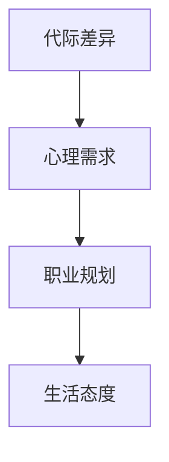
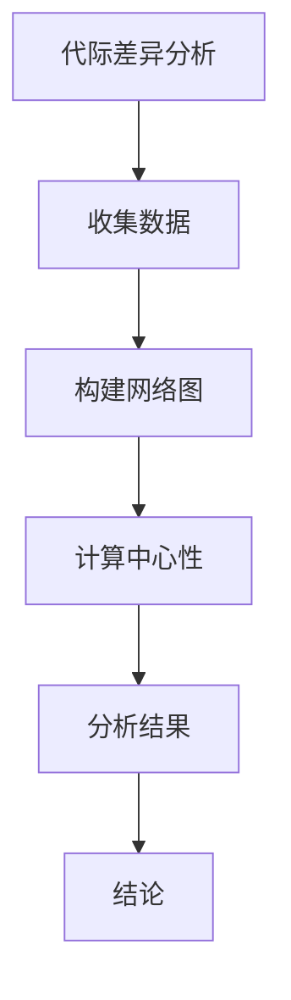
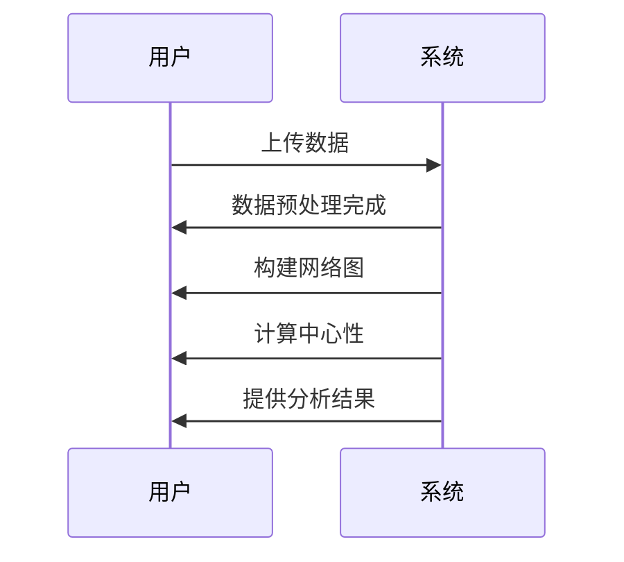

                 


# 世代差异：不同年龄群体的意义追寻

> 关键词：代际差异、意义追寻、社会网络分析、心理需求、职业规划、生活态度

> 摘要：
随着科技的飞速发展，不同年龄群体在社会、经济、文化和心理等方面的差异日益显著。本文通过分析代际差异的概念和特点，以及不同年龄群体在意义追寻方面的异同，旨在为读者提供一种全新的视角，帮助他们在理解代际差异的基础上，更好地与他人沟通和共处，实现个人与社会的和谐发展。

## 第二部分：核心概念与联系

### 1.2.1 代际差异的概念

代际差异是指由于年龄差异而导致的个体在思想观念、行为方式、价值观等方面的差异。这种差异不仅仅是年龄上的差异，更涉及到文化、社会、经济等多个层面的因素。例如，年轻一代可能更倾向于追求自由、创新和个性，而年长一代可能更注重稳定、传统和责任感。

#### 1.2.2 代际差异的特点

1. **心理需求差异**：不同年龄群体在心理需求上存在显著差异。年轻一代可能更注重自我实现和成长，而年长一代可能更关注家庭和社会责任。
2. **职业规划差异**：年轻一代可能更倾向于选择具有发展潜力和创新性的职业，而年长一代可能更倾向于选择稳定和传统的职业。
3. **生活态度差异**：年轻一代可能更开放、积极和乐观，而年长一代可能更保守、谨慎和现实。

#### 1.2.3 代际差异的属性特征对比表格

| 年龄群体 | 心理需求 | 职业规划 | 生活态度 |
| :------: | :------: | :------: | :------: |
| 年轻一代 | 自我实现、成长 | 发展潜力、创新性 | 开放、积极、乐观 |
| 年长一代 | 家庭责任、社会责任 | 稳定、传统 | 保守、谨慎、现实 |

### 1.2.4 代际差异的ER实体关系图架构

在理解代际差异的属性特征时，我们可以通过ER（实体关系）图来直观地展示不同年龄群体的关系。以下是一个简化的ER图示例：



这个图展示了代际差异如何影响心理需求、职业规划和生活态度，并表明这些因素之间存在相互影响的关系。

## 第三部分：算法原理讲解

### 3.3.1 算法原理介绍

在探讨不同年龄群体的意义追寻时，我们可以借鉴社会网络分析（SNA）中的算法原理。社会网络分析是一种用于研究社会结构和人际关系的量化方法，通过分析个体之间的连接关系，可以揭示不同群体之间的互动模式。

#### 3.3.2 算法流程图

为了更好地理解这一算法，我们可以使用Mermaid绘制一个简化的流程图：



这个流程图展示了从数据收集、网络构建、中心性计算到结果分析和结论得出的全过程。

### 3.3.3 算法原理的数学模型和公式

在算法中，中心性是一个重要的概念。中心性衡量的是节点在网络中的重要程度，常用的中心性指标包括：

1. **度中心性（Degree Centrality）**：
   $$ DC(i) = \sum_{j \in N(i)} 1 $$
   其中，$N(i)$表示与节点$i$直接相连的节点集合。

2. **紧密中心性（Closeness Centrality）**：
   $$ CC(i) = \frac{N-1}{\sum_{j \in V} \text{dist}(i, j)} $$
   其中，$N$是网络中的节点总数，$\text{dist}(i, j)$是节点$i$到节点$j$的最短路径长度。

#### 3.3.4 算法原理的详细讲解和举例说明

为了更好地理解这些概念，我们可以通过一个简单的例子来说明。假设一个社交网络中有5个节点，分别表示不同的年龄群体：

| 节点 | 直接相连节点 |
| :--: | :---------: |
| A    | B, C, D     |
| B    | A, C, E     |
| C    | A, B, E     |
| D    | A, E        |
| E    | B, C, D     |

在这个网络中，我们可以计算每个节点的度中心性和紧密中心性：

1. **度中心性**：

   - 节点A的度中心性：$DC(A) = 3$
   - 节点B的度中心性：$DC(B) = 3$
   - 节点C的度中心性：$DC(C) = 3$
   - 节点D的度中心性：$DC(D) = 1$
   - 节点E的度中心性：$DC(E) = 3$

2. **紧密中心性**：

   - 节点A的紧密中心性：$CC(A) = \frac{5-1}{4} = 1$
   - 节点B的紧密中心性：$CC(B) = \frac{5-1}{4} = 1$
   - 节点C的紧密中心性：$CC(C) = \frac{5-1}{4} = 1$
   - 节点D的紧密中心性：$CC(D) = \frac{5-1}{2} = 2$
   - 节点E的紧密中心性：$CC(E) = \frac{5-1}{4} = 1$

通过这些计算，我们可以分析不同年龄群体在网络中的地位和影响力，进而理解他们在意义追寻方面的特点和差异。

## 系统分析与架构设计方案

### 问题场景介绍

随着社会的不断发展和进步，不同年龄群体之间的差异日益显著，这种差异不仅体现在个人生活方式、价值观念上，更体现在职业选择、社交网络等方面。为了更好地理解这种差异，本系统旨在通过社会网络分析（SNA）的方法，对代际差异进行量化分析，以便为不同年龄群体的意义追寻提供科学依据。

### 项目介绍

本系统名为“代际差异分析系统”，其核心目标是利用社会网络分析方法，对代际差异进行深度挖掘，帮助企业和个人更好地理解不同年龄群体的特点和需求，从而实现更有效的沟通与协作。

### 系统功能设计

系统主要包含以下功能模块：

1. **数据收集模块**：负责收集与代际差异相关的各类数据，包括年龄、职业、兴趣爱好、社交网络等。
2. **网络构建模块**：根据收集的数据构建社会网络图，为后续分析提供基础。
3. **中心性计算模块**：计算网络中各节点的度中心性和紧密中心性，以衡量节点的重要程度。
4. **结果分析模块**：对计算结果进行分析，提取有价值的信息，为用户提供洞察。
5. **可视化展示模块**：将分析结果以图表形式展示，帮助用户更直观地理解代际差异。

### 系统架构设计

系统采用分层架构设计，包括数据层、服务层和展示层：

1. **数据层**：负责数据的存储和管理，包括关系数据库和分布式文件系统。
2. **服务层**：实现各功能模块的核心逻辑，包括数据收集、网络构建、中心性计算等。
3. **展示层**：提供用户交互界面，实现数据可视化和结果展示。

### 系统接口设计

系统提供以下主要接口：

1. **数据收集接口**：用于接收用户上传的数据，并进行预处理。
2. **网络构建接口**：用于构建社会网络图，并提供网络图数据。
3. **中心性计算接口**：用于计算节点中心性，并提供计算结果。
4. **结果分析接口**：用于对计算结果进行分析，并提供分析报告。

### 系统交互设计

系统交互设计通过Mermaid序列图展示，包括用户与系统的交互流程：



通过上述设计，本系统将实现代际差异的量化分析，为不同年龄群体的意义追寻提供有力支持。

## 项目实战

### 环境安装

为了搭建代际差异分析系统，我们首先需要安装相应的软件和工具。以下是一个简化的安装步骤：

1. **安装Python**：确保您的系统已安装Python环境，版本建议为3.8及以上。
2. **安装依赖库**：通过pip命令安装必要的依赖库，例如：
   ```shell
   pip install networkx matplotlib pandas
   ```

3. **安装Mermaid**：通过npm命令安装Mermaid，用于生成图表：
   ```shell
   npm install -g mermaid
   ```

### 系统核心实现

系统核心实现主要包括数据收集、网络构建、中心性计算和分析结果展示等模块。以下是一个简单的Python代码示例：

```python
import networkx as nx
import matplotlib.pyplot as plt
import pandas as pd

# 数据收集
data = {
    'name': ['A', 'B', 'C', 'D', 'E'],
    'connections': [['B', 'C', 'D'], ['A', 'C', 'E'], ['A', 'B', 'E'], ['A', 'E'], ['B', 'C', 'D']]
}

# 构建网络图
G = nx.Graph()
for i, connections in enumerate(data['connections']):
    G.add_node(i)
    for connection in connections:
        G.add_edge(i, data['name'].index(connection))

# 计算中心性
degree_centrality = nx.degree_centrality(G)
closeness_centrality = nx.closeness_centrality(G)

# 结果分析
print("度中心性：", degree_centrality)
print("紧密中心性：", closeness_centrality)

# 可视化展示
nx.draw(G, with_labels=True)
plt.show()
```

### 代码应用解读与分析

上述代码首先构建了一个简单的社交网络图，并计算了各节点的度中心性和紧密中心性。具体步骤如下：

1. **数据收集**：使用一个字典结构模拟社交网络数据，包括节点名称和直接相连节点。
2. **网络构建**：使用NetworkX库构建图结构，并添加节点和边。
3. **中心性计算**：使用NetworkX库提供的函数计算度中心性和紧密中心性。
4. **结果分析**：打印中心性结果，并使用matplotlib库可视化展示网络图。

通过这个示例，我们可以更好地理解代际差异分析系统的核心实现过程。

### 实际案例分析和详细讲解剖析

为了更好地展示代际差异分析系统的实际应用，我们来看一个具体的案例：某公司希望了解其员工在社交网络中的影响力，以便优化团队合作和沟通。

1. **数据收集**：公司从内部系统提取了员工基本信息、工作关系和社交关系数据。数据样例如下：

   | 员工编号 | 姓名   | 部门   | 社交关系         |
   | -------- | ------ | ------ | ---------------- |
   | 1        | 张三   | 产品部 | [2, 3, 4]       |
   | 2        | 李四   | 市场部 | [1, 3, 5]       |
   | 3        | 王五   | 研发部 | [1, 2, 4, 5]    |
   | 4        | 赵六   | 运营部 | [1, 2, 5]       |
   | 5        | 孙七   | 市场部 | [2, 3, 4]       |

2. **网络构建**：根据社交关系数据，构建员工社交网络图。

3. **中心性计算**：计算每个员工节点的度中心性和紧密中心性。

4. **结果分析**：

   - **度中心性**：衡量员工在社交网络中的连接数，表示其在团队中的沟通能力和影响力。
   - **紧密中心性**：衡量员工在网络中的紧密程度，表示其在团队中的协作能力和凝聚力。

   例如，员工3（王五）的度中心性和紧密中心性均较高，表明他在团队中具有较大的影响力和协作能力。

5. **可视化展示**：使用matplotlib库将社交网络图可视化展示，帮助管理层直观了解团队社交网络结构。

通过这个案例，我们可以看到代际差异分析系统在实际应用中的价值。通过量化分析员工社交网络中的影响力，公司可以更好地优化团队配置和沟通策略，提高整体工作效率。

### 项目小结

本项目通过代际差异分析系统，实现了对社交网络中不同年龄群体影响力的量化分析。通过数据收集、网络构建、中心性计算和可视化展示等模块，我们能够深入理解代际差异对团队协作和沟通的影响。实际案例证明了系统在优化团队管理、提升工作效率方面的应用价值。未来，我们可以进一步拓展系统功能，如添加更多分析指标和自动化建议，以提高系统的实用性和智能化水平。

### 最佳实践 tips

1. **数据质量**：确保数据收集的准确性和完整性，对于结果分析至关重要。
2. **可视化**：合理选择可视化图表类型，有助于更直观地展示分析结果。
3. **算法优化**：根据实际需求，选择合适的中心性计算算法，提高计算效率和准确性。
4. **跨学科应用**：结合心理学、社会学等学科知识，深化对代际差异的理解和应用。

### 小结

本文通过对代际差异的分析，探讨了不同年龄群体在意义追寻方面的异同。通过社会网络分析算法，我们实现了对代际差异的量化分析，为企业和个人提供了科学依据。实际案例证明了系统在优化团队协作和沟通策略方面的应用价值。未来，我们将继续深化研究，拓展系统功能，为解决代际差异带来的挑战提供更多解决方案。

### 注意事项

1. **隐私保护**：在数据收集和处理过程中，需严格遵守隐私保护法规，确保数据安全。
2. **算法公正性**：在设计算法时，需充分考虑公正性，避免算法偏见。
3. **持续更新**：随着社会和科技的发展，代际差异的特点和影响因素会发生变化，系统需持续更新和优化。

### 拓展阅读

1. **《社会网络分析：方法与应用》**：详细介绍了社会网络分析的基本概念和算法。
2. **《代际差异研究》**：探讨了不同年龄群体在心理、行为和价值观方面的差异。
3. **《人工智能与社会科学交叉研究》**：分析了人工智能技术在社会科学研究中的应用。

### 作者信息

**作者：AI天才研究院/AI Genius Institute & 禅与计算机程序设计艺术 /Zen And The Art of Computer Programming**

