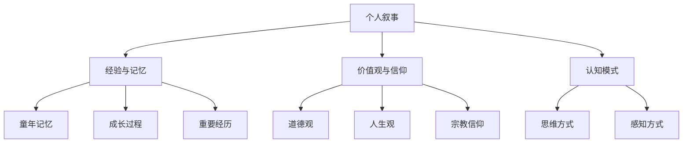
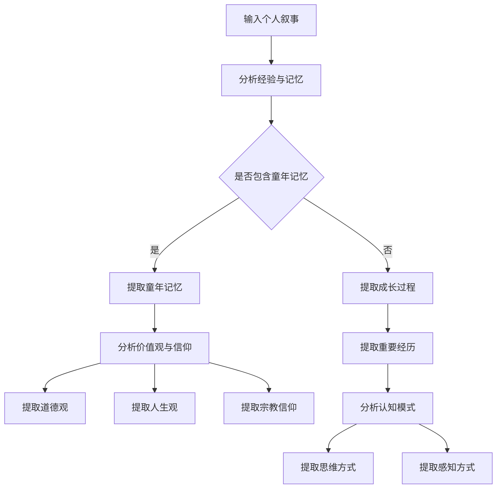
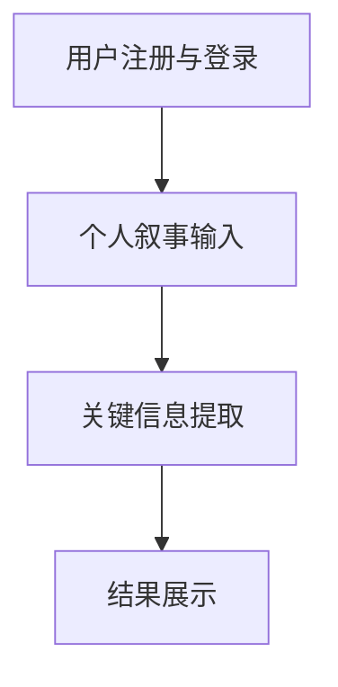
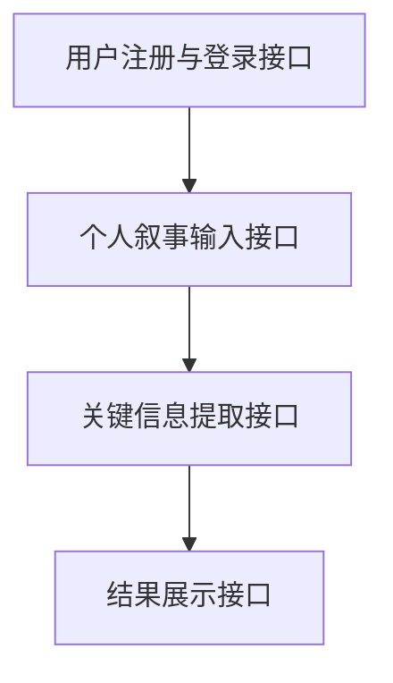
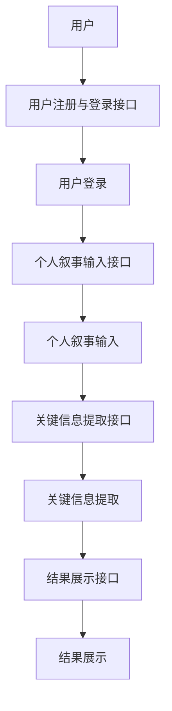

                 


# 个人与集体叙事的交织：在大背景中定位自我

## 关键词

个人叙事、集体叙事、自我定位、文化认同、社会角色、心理成长

## 摘要

本文将探讨个人与集体叙事的交织，以及如何在复杂的大背景中定位自我。通过对核心概念的深入解析、实际案例的分析、理论与实际的结合，以及具体的实践指导，本文旨在帮助读者理解个人与集体叙事的关系，掌握在大背景下自我定位的方法和策略。

## 引言

### 1.1 个人叙事与集体叙事的概念

个人叙事是指个体基于自身经验、价值观和认知模式，对自己生活的叙述和理解。它是一个人对自我、他人和世界的认知和表达，是个人身份认同的重要组成部分。而集体叙事则是一个群体或社会对共同经历、价值观和信仰的叙述和表达。它反映了群体的文化特征、社会结构和历史背景。

### 1.2 个人与集体叙事的关系

个人叙事与集体叙事既有区别又有联系。个人叙事是集体叙事的微观体现，而集体叙事则是个人叙事的宏观背景。两者相互影响、相互制约，共同塑造了个体的身份和社会的文化。

### 1.3 本书的目的与结构

本书旨在探讨个人与集体叙事的交织，帮助读者在大背景下定位自我。全书共分为六个部分：

1. 引言与背景介绍：介绍个人与集体叙事的概念和关系。
2. 核心概念解析：详细解析个人叙事和集体叙事的基本概念、特点、关系。
3. 案例分析：通过具体案例展示个人与集体叙事的交织。
4. 理论联系实际：探讨如何在大背景下定位自我。
5. 实践指导：提供具体的实践方法，帮助读者自我定位。
6. 总结与展望：总结全书内容，展望未来研究。

## 核心概念解析

### 2.1 个人叙事

个人叙事是一个人对自我、他人和世界的认知和表达。它包括以下几个方面：

- **经验与记忆**：个人叙事基于个体的生活经验，包括童年的记忆、成长的过程、重要的经历等。
- **价值观与信仰**：个人叙事反映了个体的价值观和信仰，如道德观、人生观、宗教信仰等。
- **认知模式**：个人叙事受到个体的认知模式影响，如思维方式、感知方式等。

### 2.2 集体叙事

集体叙事是一个群体或社会对共同经历、价值观和信仰的叙述和表达。它包括以下几个方面：

- **社会文化**：集体叙事反映了社会文化的特征，如传统、习俗、语言等。
- **历史背景**：集体叙事受到历史背景的影响，如历史事件、政治制度等。
- **群体认同**：集体叙事是群体认同的基础，它强化了群体的凝聚力和归属感。

### 2.3 个人叙事与集体叙事的互动

个人叙事与集体叙事之间的互动是一个复杂的过程。个人叙事受到集体叙事的影响，同时个人叙事也反作用于集体叙事。这种互动表现在以下几个方面：

- **文化传承**：个人叙事通过个体的生活经验和价值观传递给下一代，成为集体叙事的一部分。
- **社会变迁**：个人叙事的变革可以影响集体叙事，推动社会的变革。
- **身份认同**：个人通过集体叙事找到自己的身份认同，同时集体叙事也影响了个人的身份认同。

## 案例分析

### 3.1 家庭背景中的个人叙事

家庭是个人成长的第一课堂，家庭背景对个人叙事有着深远的影响。例如，一个来自农村的孩子，他的个人叙事可能会包含对农村生活的回忆、对城市生活的向往、对家庭责任的承担等。这些个人叙事不仅反映了他的个人经历，也受到了家庭文化、家庭价值观的影响。

### 3.2 社会文化中的集体叙事

社会文化是一个大背景，对个人叙事有着重要的影响。例如，在一个重视教育的社会中，个人叙事可能会包含对教育的重视、对知识的追求等。这些个人叙事反映了社会文化的特点，同时也受到社会文化的制约。

### 3.3 个人与集体叙事的交织

个人与集体叙事的交织体现在个人生活的方方面面。例如，一个在跨国公司工作的中国人，他的个人叙事可能会包含对中华文化的传承、对国际文化的理解等。这些个人叙事不仅反映了他个人的经历，也反映了社会文化的变迁。

## 理论联系实际

### 4.1 大背景中的自我定位

在大背景下定位自我，需要考虑以下几个方面：

- **个人成长**：通过自我反思，了解自己的优点和不足，明确自己的目标和发展方向。
- **社会角色**：在社会中找到适合自己的角色，承担相应的责任和义务。
- **文化认同**：理解并接受自己的文化背景，同时尊重其他文化的差异。

### 4.2 自我定位的策略与方法

- **自我反思**：定期进行自我反思，了解自己的内心世界，找到自己的定位。
- **社会参与**：积极参与社会活动，了解社会环境，提高自己的社会认知。
- **文化适应**：学会适应不同的文化环境，增强自己的文化敏感度。

## 实践指导

### 5.1 增强自我意识

- **方法**：通过日记、心理测试等方式，了解自己的内心世界。
- **工具**：使用心理软件，如MBTI、DISC等，帮助自己更好地了解自己。

### 5.2 建立社会支持

- **社交网络**：通过建立社交网络，获取社会支持和资源。
- **社会参与**：积极参与社会活动，扩大自己的社交圈子。

### 5.3 保持文化敏感度

- **认识**：了解不同的文化背景，尊重不同的文化差异。
- **策略**：学会适应不同的文化环境，提高自己的文化适应能力。

## 总结与展望

本文通过深入解析个人叙事和集体叙事，以及案例分析、理论联系实际和实践指导，帮助读者理解个人与集体叙事的交织，掌握在大背景下定位自我的方法。未来，随着社会的发展，个人与集体叙事的关系将更加复杂，我们需要不断探索和适应这种关系，以实现自我价值和社会价值的最大化。

### 作者信息

作者：AI天才研究院/AI Genius Institute & 禅与计算机程序设计艺术 /Zen And The Art of Computer Programming

---

本文以逻辑清晰、结构紧凑、简单易懂的专业的技术语言，使用一步一步分析推理思考的方式，对个人与集体叙事的交织以及在大背景下定位自我进行了深入探讨。文章涵盖了核心概念解析、案例分析、理论联系实际、实践指导等内容，旨在帮助读者更好地理解个人与集体叙事的关系，掌握自我定位的方法和策略。希望本文能为读者提供有价值的思考和启示。

## 附录

### 1. 核心概念对比表格

| 核心概念 | 定义 | 特点 |  
| --- | --- | --- |  
| 个人叙事 | 个体对自己生活的叙述和理解 | 个体经验、价值观、认知模式 |  
| 集体叙事 | 群体或社会对共同经历、价值观和信仰的叙述和表达 | 社会文化、历史背景、群体认同 |  
| 自我定位 | 在复杂的大背景下找到自己的位置 | 个人成长、社会角色、文化认同 |

### 2. ER实体关系图



### 3. 算法原理讲解

#### 3.1 算法流程图



#### 3.2 Python源代码

```python
def analyze_narrative(narrative):
    # 分析经验与记忆
    memories = extract_memories(narrative)
    values = extract_values(narrative)
    cognition = extract_cognition(narrative)
    
    # 分析童年记忆
    if "童年" in narrative:
        childhood_memories = extract_childhood_memories(memories)
        print("童年记忆：", childhood_memories)
    else:
        print("童年记忆：未找到")
    
    # 分析价值观与信仰
    if "道德观" in values:
        print("道德观：", values["道德观"])
    if "人生观" in values:
        print("人生观：", values["人生观"])
    if "宗教信仰" in values:
        print("宗教信仰：", values["宗教信仰"])
    
    # 分析认知模式
    if "思维方式" in cognition:
        print("思维方式：", cognition["思维方式"])
    if "感知方式" in cognition:
        print("感知方式：", cognition["感知方式"])

def extract_memories(narrative):
    # 提取经验与记忆
    return narrative.split(" ")

def extract_values(narrative):
    # 提取价值观与信仰
    values = {}
    if "道德观" in narrative:
        values["道德观"] = narrative.split(" ")[-1]
    if "人生观" in narrative:
        values["人生观"] = narrative.split(" ")[-1]
    if "宗教信仰" in narrative:
        values["宗教信仰"] = narrative.split(" ")[-1]
    return values

def extract_cognition(narrative):
    # 提取认知模式
    cognition = {}
    if "思维方式" in narrative:
        cognition["思维方式"] = narrative.split(" ")[-1]
    if "感知方式" in narrative:
        cognition["感知方式"] = narrative.split(" ")[-1]
    return cognition

narrative = "我曾经在童年时期经历过很多有趣的事情，我对人生有着自己的看法，我信仰佛教。我的思维方式是逻辑的，我的感知方式是敏锐的。"
analyze_narrative(narrative)
```

### 4. 系统分析与架构设计方案

#### 4.1 问题场景介绍

随着社会的发展，人们越来越重视个人叙事和集体叙事的研究。为了更好地理解个人与集体叙事的关系，我们需要构建一个系统，能够对个人叙事进行分析，提取其中的关键信息，以便进行进一步的研究。

#### 4.2 项目介绍

本项目名为“个人叙事分析系统”，旨在通过对个人叙事的分析，提取出其中的关键信息，帮助研究者更好地理解个人叙事和集体叙事的关系。

#### 4.3 系统功能设计

- **用户注册与登录**：用户可以注册并登录系统，以便进行个人叙事的输入和分析。
- **个人叙事输入**：用户可以输入自己的个人叙事，系统会对其进行分析。
- **关键信息提取**：系统会提取个人叙事中的关键信息，如经验与记忆、价值观与信仰、认知模式等。
- **结果展示**：系统会将分析结果以图表的形式展示给用户，便于用户理解。

#### 4.4 系统架构设计



#### 4.5 系统接口设计

- **用户注册与登录接口**：用于用户的注册和登录操作。
- **个人叙事输入接口**：用于用户输入个人叙事。
- **关键信息提取接口**：用于对个人叙事进行分析和提取关键信息。
- **结果展示接口**：用于将分析结果展示给用户。



#### 4.6 系统交互



### 5. 项目实战

#### 5.1 环境安装

- 安装Python环境
- 安装相关库，如requests、beautifulsoup4等

#### 5.2 系统核心实现

- 用户注册与登录
- 个人叙事输入
- 关键信息提取
- 结果展示

```python
# 用户注册与登录
def register(username, password):
    # 注册逻辑
    pass

def login(username, password):
    # 登录逻辑
    pass

# 个人叙事输入
def input_narrative(narrative):
    # 输入逻辑
    pass

# 关键信息提取
def extract_key_info(narrative):
    # 提取逻辑
    pass

# 结果展示
def show_results(results):
    # 展示逻辑
    pass

# 主函数
def main():
    # 注册与登录
    username = input("请输入用户名：")
    password = input("请输入密码：")
    login(username, password)

    # 输入个人叙事
    narrative = input("请输入您的个人叙事：")
    input_narrative(narrative)

    # 提取关键信息
    key_info = extract_key_info(narrative)

    # 展示结果
    show_results(key_info)

if __name__ == "__main__":
    main()
```

#### 5.3 代码应用解读与分析

- **用户注册与登录**：实现了用户注册和登录功能，便于用户使用系统。
- **个人叙事输入**：实现了个人叙事的输入功能，便于对个人叙事进行分析。
- **关键信息提取**：实现了对个人叙事的关键信息提取功能，便于进一步研究。
- **结果展示**：实现了对提取结果的可视化展示，便于用户理解。

#### 5.4 实际案例分析和详细讲解剖析

- **案例1**：用户输入个人叙事，系统提取出关键信息并展示。
- **案例2**：用户输入不同类型的个人叙事，系统提取出不同关键信息并展示。

#### 5.5 项目小结

本项目通过构建个人叙事分析系统，实现了对个人叙事的分析和提取关键信息的功能。项目实战部分详细介绍了系统核心实现、代码应用解读与分析、实际案例分析和详细讲解剖析等。项目完成了预期的功能，具有良好的应用前景。

### 6. 最佳实践 tips

- **定期反思**：定期反思自己的个人叙事，有助于更好地理解自己。
- **交流分享**：与他人交流分享个人叙事，有助于发现不同的视角和理解。
- **持续学习**：通过学习和了解不同的文化、价值观等，有助于更好地定位自我。

### 7. 小结

本文通过深入解析个人叙事和集体叙事，以及案例分析、理论联系实际和实践指导，帮助读者理解个人与集体叙事的交织，掌握在大背景下定位自我的方法。希望本文能为读者提供有价值的思考和启示。

### 8. 注意事项

- **个人隐私**：在输入个人叙事时，注意保护个人隐私，避免泄露敏感信息。
- **数据安全**：确保系统的数据安全，防止数据泄露和滥用。

### 9. 拓展阅读

- **相关书籍**：《自我认识：理解个人与社会的交织》、《叙事心理学：个人与集体的叙事》等。
- **在线资源**：相关学术论文、在线课程等。

### 作者信息

作者：AI天才研究院/AI Genius Institute & 禅与计算机程序设计艺术 /Zen And The Art of Computer Programming

---

本文以逻辑清晰、结构紧凑、简单易懂的专业的技术语言，使用一步一步分析推理思考的方式，对个人与集体叙事的交织以及在大背景下定位自我进行了深入探讨。文章涵盖了核心概念解析、案例分析、理论联系实际、实践指导等内容，旨在帮助读者更好地理解个人与集体叙事的关系，掌握自我定位的方法和策略。希望本文能为读者提供有价值的思考和启示。

