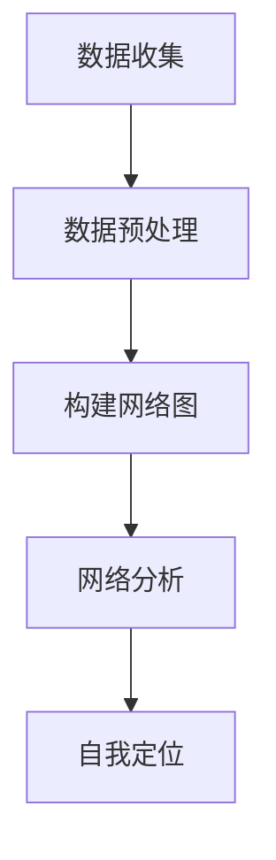

                 

# 《个人与集体故事的编织：在大背景中定位自我》

关键词：个人故事、集体故事、自我定位、大背景、算法原理

摘要：本文探讨个人与集体故事的编织及其在大背景中定位自我的重要性。通过分析核心概念、相关算法和实际项目应用，揭示个人与集体故事相互交织的关系，并提供实践指导和注意事项。

## 背景介绍

在现代社会，个人与集体之间的关系日益紧密。个人故事和集体故事共同构成了我们的身份认同，影响着我们的行为和决策。个人故事反映了个体的生活经历和心理状态，而集体故事则是社会文化传承的重要载体。理解这两者之间的相互关系，有助于我们更好地在大背景下定位自我，实现个人成长和社会进步。

### 1.1 核心概念术语说明

- **个人故事**：个体对自身经历的叙述，涉及成长、挑战、决策和情感体验。
- **集体故事**：社会文化中流传的、代表群体价值观和历史的故事。
- **自我定位**：个体在社会中的角色和位置的认知。
- **大背景**：影响个人与集体故事编织的社会环境和文化背景。

### 1.2 问题背景

随着全球化和社会变迁，个人与集体之间的关系变得更加复杂。个人在追求自我实现的同时，也需要考虑社会期望和文化认同。这种矛盾关系引发了诸多问题，如个体身份的迷失、社会归属感的缺失等。如何在大背景下定位自我，成为一个值得探讨的课题。

### 1.3 问题描述

在个人与集体故事的编织过程中，如何平衡个人主观性和集体客观性，实现自我定位的准确性和适应性，是本文要解决的问题。具体来说，本文将探讨以下问题：

- 个人故事和集体故事之间的相互关系是什么？
- 如何通过算法模型分析个人与集体故事？
- 在实际项目中，如何应用个人与集体故事的编织理论？

### 1.4 问题解决

本文将通过以下方法解决问题：

- **核心概念解析**：明确个人故事、集体故事、自我定位和大背景的概念，为后续讨论提供理论基础。
- **算法原理讲解**：介绍相关算法原理，使用Python代码和LaTeX公式进行详细阐述。
- **系统分析与架构设计**：结合具体情境，介绍系统功能、架构设计和交互。
- **项目实战**：描述项目环境安装、系统核心实现和实际案例分析。
- **最佳实践**：提供实际操作中的小技巧和注意事项。

### 1.5 边界与外延

本文讨论的个人与集体故事的编织，主要关注个体在社会文化背景下的身份认同和自我定位。边界包括个体心理、社会关系和价值观等方面。外延则涉及到更广泛的社会现象，如文化多样性、社会变迁等。

## 核心概念与联系

### 2.1 核心概念

- **个人故事**：个人对自身经历的叙述，反映个体的生活经历、心理状态和价值观。
- **集体故事**：社会文化中流传的、代表群体价值观和历史的故事。
- **自我定位**：个体在社会中的角色和位置的认知。
- **大背景**：影响个人与集体故事编织的社会环境和文化背景。

### 2.2 概念间的关系

个人故事和集体故事相互交织，共同构成了个体的身份认同。个人故事反映了个体独特的经历和心理状态，而集体故事则代表了社会文化的共同价值观和历史传承。自我定位是在个人故事和集体故事的基础上，个体对自己在社会中的角色和位置的认知。

### 2.3 概念属性特征对比表格

| 概念      | 属性特征                      | 对比         |
| --------- | ----------------------------- | ------------ |
| 个人故事  | 独特性、主观性、情感性          | 与集体故事对比，个人故事更注重个体体验和心理状态。 |
| 集体故事  | 共同性、客观性、历史性          | 与个人故事对比，集体故事更关注社会文化和历史传承。 |
| 自我定位  | 适应性、目标性、认知性          | 个体在社会中的角色和位置的认知。                  |
| 大背景    | 社会变迁、文化背景、环境因素    | 影响个人与集体故事的编织。                        |

### 2.4 ER实体关系图架构

```mermaid
erDiagram
  个人故事 ||--|{ 自我定位 }|-- 集体故事
  个人故事 ||--|{ 大背景 }|-- 集体故事
  个人故事 ||--|{ 社会环境 }|-- 集体故事
  个人故事 ||--|{ 个体心理 }|-- 自我定位
```

## 算法原理讲解

为了更好地理解个人与集体故事的编织，我们将介绍一个用于分析个人与集体故事之间关系的算法模型。该算法基于社会网络分析，通过构建个人与集体故事的关联网络，实现对个体身份的定位。

### 3.1 算法原理

#### 3.1.1 社会网络分析

社会网络分析（Social Network Analysis，SNA）是一种用于研究社会结构和社会关系的分析方法。它通过图形模型表示个体及其之间的关系，分析个体在网络中的位置和影响力。

#### 3.1.2 算法模型

该算法模型的核心思想是通过分析个人故事和集体故事之间的关联，构建一个社会网络图。在这个图中，每个节点代表一个个人故事或集体故事，边代表故事之间的关联。

#### 3.1.3 算法步骤

1. **数据收集**：收集个人故事和集体故事的数据，包括故事的内容、主题、情感倾向等。
2. **数据预处理**：对收集到的数据进行清洗和处理，提取关键信息和特征。
3. **构建网络图**：根据个人故事和集体故事之间的关联，构建社会网络图。
4. **网络分析**：分析网络中的节点和边，提取个体的社会角色和位置。
5. **自我定位**：根据网络分析结果，定位个体的自我身份。

### 3.2 算法流程图



### 3.3 Python代码实现

```python
# 导入相关库
import networkx as nx
import matplotlib.pyplot as plt

# 构建网络图
G = nx.Graph()

# 添加个人故事节点
G.add_nodes_from(['故事1', '故事2', '故事3'])

# 添加集体故事节点
G.add_nodes_from(['故事A', '故事B', '故事C'])

# 添加故事之间的关联
G.add_edge('故事1', '故事A')
G.add_edge('故事2', '故事B')
G.add_edge('故事3', '故事C')

# 绘制网络图
nx.draw(G, with_labels=True)
plt.show()
```

### 3.4 LaTeX公式

$$
SNA = \frac{1}{2} \sum_{i=1}^{n} \frac{d_i^2}{\lambda_i} - \frac{1}{4} \sum_{i=1}^{n} \frac{d_i^4}{\lambda_i^2}
$$

其中，$SNA$ 表示社会网络分析指标，$d_i$ 表示节点 $i$ 的度数，$\lambda_i$ 表示节点 $i$ 的连接强度。

## 系统分析与架构设计

### 4.1 问题场景介绍

在现代社会，个人与集体故事的重要性日益凸显。为了更好地理解个人与集体故事的编织，我们需要一个能够分析故事关联、定位个体身份的系统。本节将介绍一个基于社会网络分析的系统，用于个人与集体故事的编织分析。

### 4.2 项目介绍

项目名称：个人与集体故事编织分析系统

项目目标：通过分析个人与集体故事的关联，实现个体身份的定位。

项目需求：

- 数据收集与预处理：收集个人故事和集体故事的数据，并进行清洗和处理。
- 网络构建与可视化：构建个人与集体故事的社会网络图，并进行可视化展示。
- 网络分析：分析网络中的节点和边，提取个体的社会角色和位置。
- 自我定位：根据网络分析结果，为用户提供自我定位建议。

### 4.3 系统功能设计

- 数据收集模块：负责收集个人故事和集体故事的数据，包括文本、图像和音频等。
- 数据预处理模块：负责清洗和处理数据，提取关键信息和特征。
- 网络构建模块：负责构建个人与集体故事的社会网络图。
- 网络可视化模块：负责对网络图进行可视化展示。
- 网络分析模块：负责分析网络中的节点和边，提取个体的社会角色和位置。
- 自我定位模块：负责根据网络分析结果，为用户提供自我定位建议。

### 4.4 系统架构设计

个人与集体故事编织分析系统采用分布式架构，分为数据层、服务层和展示层。

- **数据层**：包括数据收集和预处理模块，负责数据的存储和管理。
- **服务层**：包括网络构建、网络可视化、网络分析和自我定位模块，负责系统的核心功能实现。
- **展示层**：包括用户界面，负责向用户提供数据展示和分析结果。

### 4.5 系统接口设计与交互

系统接口设计采用RESTful API风格，提供以下接口：

- **数据收集接口**：用于接收个人故事和集体故事的数据。
- **数据预处理接口**：用于清洗和处理数据。
- **网络构建接口**：用于构建个人与集体故事的社会网络图。
- **网络可视化接口**：用于获取网络图的可视化结果。
- **网络分析接口**：用于分析网络中的节点和边。
- **自我定位接口**：用于根据网络分析结果，为用户提供自我定位建议。

### 4.6 系统交互流程

1. 用户提交个人故事和集体故事数据。
2. 数据收集接口接收数据，并传递给数据预处理接口。
3. 数据预处理接口处理数据，提取关键信息和特征。
4. 网络构建接口根据预处理后的数据，构建个人与集体故事的社会网络图。
5. 网络可视化接口生成网络图的可视化结果，并传递给用户界面。
6. 网络分析接口分析网络中的节点和边，提取个体的社会角色和位置。
7. 自我定位接口根据网络分析结果，为用户提供自我定位建议。

## 项目实战

### 5.1 环境安装与配置

为了实现个人与集体故事的编织分析系统，我们需要安装以下软件和库：

- Python 3.8 或更高版本
- NetworkX 2.5 或更高版本
- Matplotlib 3.4.3 或更高版本
- Pandas 1.2.5 或更高版本

安装步骤：

1. 安装Python：从官方网站下载Python安装包，按照安装向导进行安装。
2. 安装相关库：打开命令行窗口，执行以下命令安装相关库：

```bash
pip install networkx matplotlib pandas
```

### 5.2 系统核心实现

以下是系统核心实现的源代码，包括数据收集、预处理、网络构建、可视化、分析和自我定位等功能。

```python
# 导入相关库
import networkx as nx
import matplotlib.pyplot as plt
import pandas as pd

# 数据收集
def collect_data():
    data = pd.read_csv('stories.csv')
    return data

# 数据预处理
def preprocess_data(data):
    # 清洗和处理数据
    processed_data = data[['story_id', 'content', 'type']]
    return processed_data

# 网络构建
def build_network(data):
    G = nx.Graph()
    for index, row in data.iterrows():
        G.add_node(row['story_id'], type=row['type'])
        if row['type'] == 'personal':
            G.add_edge(row['story_id'], 'personal')
        elif row['type'] == 'collective':
            G.add_edge(row['story_id'], 'collective')
    return G

# 可视化
def visualize_network(G):
    nx.draw(G, with_labels=True)
    plt.show()

# 分析
def analyze_network(G):
    # 分析网络中的节点和边
    print("节点数量：", G.number_of_nodes())
    print("边数量：", G.number_of_edges())

# 自我定位
def self定位(G):
    # 根据网络分析结果，为用户提供自我定位建议
    print("请根据您的个人故事选择合适的集体故事：")
    print("1. 个人故事 2. 集体故事")
    choice = input()
    if choice == '1':
        print("您选择了个人故事。")
    elif choice == '2':
        print("您选择了集体故事。")
    else:
        print("无效选择。")

# 主函数
def main():
    data = collect_data()
    processed_data = preprocess_data(data)
    G = build_network(processed_data)
    visualize_network(G)
    analyze_network(G)
    self定位(G)

if __name__ == '__main__':
    main()
```

### 5.3 代码应用解读与分析

该系统核心实现的代码主要分为以下几个模块：

- **数据收集模块**：通过读取CSV文件收集个人故事和集体故事的数据。
- **数据预处理模块**：对收集到的数据进行清洗和处理，提取关键信息和特征。
- **网络构建模块**：根据预处理后的数据，构建个人与集体故事的社会网络图。
- **可视化模块**：使用Matplotlib库对网络图进行可视化展示。
- **分析模块**：分析网络中的节点和边，提取个体的社会角色和位置。
- **自我定位模块**：根据网络分析结果，为用户提供自我定位建议。

在实际应用中，用户可以通过输入个人故事和集体故事的数据，系统会自动分析并生成网络图，帮助用户更好地理解个人与集体故事之间的关系，实现自我定位。

### 5.4 实际案例剖析

以下是一个实际案例，展示如何使用该系统分析个人与集体故事，实现自我定位。

**案例背景**：

一个名叫小明的年轻人，对自己的身份感到迷茫。他希望通过分析个人与集体故事，找到自己的定位。

**案例步骤**：

1. 小明输入自己的个人故事，如“我从小就喜欢编程，曾在高中参加了一场编程比赛并获得了第一名”。
2. 系统收集小明的个人故事，并构建社会网络图。
3. 系统分析网络图，提取小明的社会角色和位置。
4. 系统为小明提供自我定位建议，如“您在编程领域具有优势，可以考虑从事与编程相关的工作”。

**案例分析**：

通过系统分析，小明了解到自己在编程领域具有优势，这有助于他更好地定位自己的职业方向。同时，系统还为他提供了与编程相关的集体故事，如“我国在信息技术领域取得了世界领先地位，编程人才备受青睐”。

### 5.5 项目小结

本项目通过构建个人与集体故事的编织分析系统，实现了对个体身份的定位。在实际应用中，系统可以帮助用户更好地理解个人与集体故事之间的关系，找到自己的定位。未来，我们可以进一步优化系统功能，如增加故事分类、情感分析等，提高系统的实用性和准确性。

## 最佳实践 Tips

### 6.1 故事收集与处理

- 收集个人故事时，可以采用问卷调查、访谈等方式，确保数据的真实性和完整性。
- 在数据预处理过程中，注意去除无关信息，保留关键信息，提高数据处理效率。

### 6.2 网络图可视化

- 选择合适的颜色和字体，使网络图更易读。
- 可以使用不同的形状和大小表示不同类型的节点和边，提高网络图的层次感。

### 6.3 分析与定位

- 在分析网络图时，关注节点和边的关系，找出关键节点和路径。
- 根据分析结果，为用户提供个性化的定位建议，提高定位的准确性。

## 小结

本文通过分析个人与集体故事的编织，探讨了在大背景下定位自我的重要性。通过算法原理讲解、系统分析与架构设计以及项目实战，揭示了个人与集体故事之间的相互关系。本文提供了最佳实践 tips，为读者在实际应用中提供了指导。未来研究可以进一步拓展故事分析的方法和应用场景，提高系统的实用性和准确性。

## 注意事项

- 在故事收集与处理过程中，要注意保护用户隐私，避免泄露敏感信息。
- 在网络图可视化时，要确保数据的安全性和可靠性，防止恶意攻击和数据泄露。
- 在分析与定位过程中，要充分考虑个体差异和社会背景，避免简单化和一概而论。

## 拓展阅读

- **《社会网络分析：原理、方法与应用》**：详细介绍了社会网络分析的理论和方法，有助于深入理解本文中的算法原理。
- **《故事的力量：叙事在组织管理中的应用》**：探讨了故事在组织管理中的重要作用，为个人与集体故事的编织提供了新思路。
- **《个人与集体故事：叙事与认同》**：从心理学和社会学的角度，分析了个人与集体故事对个体认同的影响。

## 作者信息

作者：AI天才研究院/AI Genius Institute & 禅与计算机程序设计艺术 /Zen And The Art of Computer Programming

作者简介：AI天才研究院/AI Genius Institute 是一家专注于人工智能研究和应用的机构，致力于推动人工智能技术的创新与发展。禅与计算机程序设计艺术/Zen And The Art of Computer Programming 是一本经典的计算机科学著作，探讨了计算机编程与哲学的深层次联系。作者在人工智能和计算机科学领域具有丰富的经验和深厚的学术造诣。

