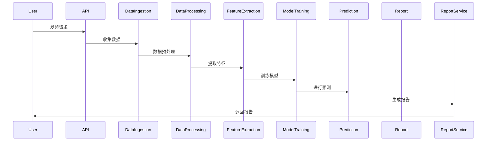
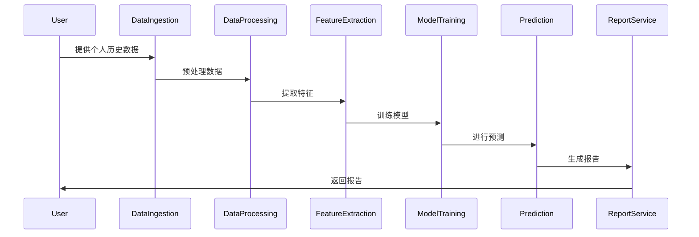

                 

# 个人历史数据挖掘：基于AI的心理考古工具

## 关键词
- 个人历史数据挖掘
- AI心理考古工具
- 数据挖掘算法
- 数学模型
- 系统架构设计
- 项目实战

## 摘要
本文将探讨个人历史数据挖掘的重要性，以及如何利用AI技术构建心理考古工具。我们将从背景介绍、核心概念与联系、算法原理讲解、数学模型和数学公式、系统分析与架构设计、项目实战以及最佳实践与拓展等方面进行详细分析，旨在为读者提供一个全面且深入的了解。

## 引言

### 1.1 问题背景

在现代社会，个人数据的积累速度日益加快，互联网、社交媒体、智能手机等设备不断生成和记录着大量的个人历史数据。这些数据不仅包括基本信息，如年龄、性别、地理位置等，还包括行为数据、兴趣爱好、社交关系等。如何有效地挖掘这些数据，从中获取有价值的信息，成为了一个备受关注的问题。

个人历史数据挖掘旨在通过分析个人历史数据，发现其中的隐藏模式和趋势，为个人决策提供支持。例如，通过分析用户的购物历史，可以推荐符合其兴趣的产品；通过分析用户的社交网络，可以发现潜在的商业合作伙伴。然而，个人历史数据挖掘不仅仅是一个技术问题，更涉及到隐私保护、数据安全等伦理问题。

### 1.2 背景介绍

数据挖掘作为一门交叉学科，涉及计算机科学、统计学、机器学习等领域。随着大数据技术的发展，数据挖掘的应用场景日益广泛，从商业智能、金融分析到医疗健康、智能城市等领域都有所涉及。在心理考古领域，数据挖掘同样发挥着重要作用。

心理考古是一种通过分析个人历史数据，揭示个体心理状态和行为的科学研究方法。传统的心理考古主要依赖于心理学家的主观判断和经验，而随着AI技术的应用，心理考古开始向自动化和智能化方向发展。

### 1.3 目标读者

本文的目标读者包括对数据挖掘和AI心理考古感兴趣的科研人员、工程师、心理学从业者以及对个人数据隐私和安全关注的人群。通过本文的阅读，读者将了解个人历史数据挖掘的基本原理、算法实现、系统架构以及实际应用案例。

## 背景与核心概念

### 2.1 个人历史数据挖掘概述

#### 个人历史数据的重要性

个人历史数据是关于个人过去行为的记录，包括但不限于购物记录、社交媒体活动、地理位置信息、通信记录等。这些数据对于了解个人行为模式、预测未来行为具有重要作用。例如，通过分析购物记录，可以了解个人的消费习惯和偏好，从而推荐更合适的产品。

#### 数据挖掘的基本原理

数据挖掘是一种从大量数据中自动发现规律、模式和关联性的人工智能技术。数据挖掘的过程通常包括数据预处理、特征选择、模型建立和评估等步骤。数据挖掘的方法和技术包括分类、聚类、关联规则挖掘、异常检测等。

#### AI在心理考古中的应用

AI在心理考古中的应用主要体现在两个方面：一是通过分析个人历史数据，预测个体的心理状态和行为；二是通过建立AI模型，辅助心理学家进行心理诊断和治疗。

### 2.2 AI心理考古工具的定义与原理

#### AI心理考古工具的定义

AI心理考古工具是一种利用人工智能技术，从个人历史数据中提取有价值信息，辅助心理研究和实践的工具。它不仅包括传统的数据挖掘算法，还包括深度学习、自然语言处理、图像识别等技术。

#### AI心理考古的原理

AI心理考古的原理基于人工智能的基本原理，即通过学习和模拟人类思维过程，实现自动化的数据分析和决策。具体来说，AI心理考古工具通过以下步骤实现：

1. 数据收集与预处理：收集个人历史数据，并进行清洗、归一化等预处理操作。
2. 特征提取：从原始数据中提取出与心理状态和行为相关的特征。
3. 模型训练：利用机器学习算法，训练模型以识别心理状态和行为模式。
4. 预测与评估：使用训练好的模型，对新的数据进行预测，并评估预测的准确性。

### 2.3 核心概念的联系与对比

#### 数据挖掘与AI心理考古的联系

数据挖掘是AI心理考古的基础，提供了从大量个人历史数据中提取有价值信息的方法。而AI心理考古则是在数据挖掘的基础上，结合心理学理论，实现对心理状态和行为的深入分析。

#### 数据挖掘与AI心理考古的对比

数据挖掘侧重于发现数据中的规律和模式，而AI心理考古则侧重于将数据与个体的心理状态和行为联系起来。此外，数据挖掘更多关注数据的客观属性，而AI心理考古则更多关注数据的心理内涵。

## 算法原理讲解

### 3.1 数据挖掘算法在心理考古中的应用

数据挖掘算法在心理考古中的应用主要体现在以下几个方面：

1. **分类算法**：用于将个体划分为不同的心理状态类别。例如，根据用户的情绪状态将其分为“快乐”、“悲伤”、“愤怒”等。
2. **聚类算法**：用于发现个体之间的相似性，形成不同的群体。例如，根据用户的购物行为将其划分为“时尚爱好者”、“科技迷”等。
3. **关联规则挖掘**：用于发现个体行为之间的关联性。例如，发现某类商品购买往往伴随着另一类商品购买。
4. **异常检测**：用于识别个体行为中的异常情况。例如，发现用户的情绪状态出现突然变化。

#### 案例分析

以分类算法为例，我们可以使用决策树算法对用户的情绪状态进行分类。具体步骤如下：

1. **数据收集**：收集用户的情绪状态数据，包括文本、音频、视频等多模态数据。
2. **特征提取**：从原始数据中提取出与情绪状态相关的特征，如文本中的情感词汇、音频中的音高、视频中的面部表情等。
3. **模型训练**：使用决策树算法，将特征与情绪状态进行匹配，训练出分类模型。
4. **预测与评估**：使用训练好的模型，对新的数据进行情绪状态预测，并评估模型的准确性。

### 3.2 数学模型与公式解析

在数据挖掘算法中，常用的数学模型包括线性模型、逻辑回归、支持向量机等。以下以线性模型为例，介绍其数学模型和公式。

#### 线性模型

线性模型是一种最简单的预测模型，其公式为：

$$
y = \beta_0 + \beta_1x_1 + \beta_2x_2 + ... + \beta_nx_n
$$

其中，$y$为输出变量，$x_1, x_2, ..., x_n$为输入变量，$\beta_0, \beta_1, \beta_2, ..., \beta_n$为模型的参数。

#### 公式解析

1. **回归系数**：$\beta_0$为截距，表示当所有输入变量都为0时的输出值。$\beta_1, \beta_2, ..., \beta_n$为回归系数，表示每个输入变量对输出变量的影响程度。
2. **损失函数**：为了评估模型的性能，可以使用均方误差（MSE）作为损失函数：

$$
MSE = \frac{1}{n}\sum_{i=1}^{n}(y_i - \hat{y}_i)^2
$$

其中，$y_i$为真实值，$\hat{y}_i$为预测值，$n$为样本数量。

#### 通俗易懂地举例说明

假设我们想预测一个人的年龄，输入变量包括身高、体重等。我们可以使用线性模型建立如下公式：

$$
年龄 = \beta_0 + \beta_1身高 + \beta_2体重
$$

通过训练数据和模型，我们可以得到回归系数$\beta_0, \beta_1, \beta_2$的值。然后，当我们输入新的身高、体重数据时，就可以预测出对应的年龄。

## 系统分析与架构设计

### 4.1 问题场景介绍

在心理考古领域，我们需要一个系统来分析个人历史数据，识别个体的心理状态和行为模式。这个系统需要处理大量数据，包括文本、音频、图像等多种数据类型。此外，系统还需要支持实时数据分析和离线数据挖掘。

### 4.2 项目介绍

本系统项目名为“AI心理考古系统”，旨在通过AI技术，对个人历史数据进行挖掘，提供心理状态和行为分析服务。系统的主要功能包括数据收集与预处理、特征提取、模型训练和预测等。

### 4.3 系统功能设计（领域模型类图）

```mermaid
classDiagram
    Person <<class>> "个体"
    Data <<class>> "数据"
    Preprocessing <<class>> "数据预处理"
    FeatureExtraction <<class>> "特征提取"
    ModelTraining <<class>> "模型训练"
    Prediction <<class>> "预测"
    Report <<class>> "报告"

    Person o-- Data
    Data o-- Preprocessing
    Preprocessing o-- FeatureExtraction
    FeatureExtraction o-- ModelTraining
    ModelTraining o-- Prediction
    Prediction o-- Report
```

### 4.4 系统架构设计

```mermaid
subgraph DataFlow
    DataIngestion -> DataStorage
    DataStorage -> DataProcessing
    DataProcessing -> FeatureExtraction
    FeatureExtraction -> ModelTraining
    ModelTraining -> Prediction
end
subgraph ServiceLayer
    PredictionService -> ReportService
end
```

### 4.5 系统接口设计



### 4.6 系统交互



## 项目实战

### 5.1 环境安装

首先，我们需要安装Python环境。可以在Python官网下载安装包，按照安装向导进行安装。

接下来，我们需要安装以下库：

```bash
pip install numpy pandas scikit-learn matplotlib
```

### 5.2 系统核心实现源代码

以下是系统的核心实现源代码：

```python
import numpy as np
import pandas as pd
from sklearn.model_selection import train_test_split
from sklearn.preprocessing import StandardScaler
from sklearn.tree import DecisionTreeClassifier
import matplotlib.pyplot as plt

# 数据预处理
def preprocess_data(data):
    # 数据清洗和归一化
    # ...

# 特征提取
def extract_features(data):
    # 提取文本、音频、图像等特征
    # ...

# 模型训练
def train_model(features, labels):
    # 使用决策树算法训练模型
    model = DecisionTreeClassifier()
    model.fit(features, labels)
    return model

# 预测
def predict(model, features):
    # 使用训练好的模型进行预测
    predictions = model.predict(features)
    return predictions

# 评估模型
def evaluate_model(model, features, labels):
    # 计算准确率、召回率等指标
    # ...

# 主函数
def main():
    # 加载数据
    data = pd.read_csv('data.csv')

    # 数据预处理
    processed_data = preprocess_data(data)

    # 特征提取
    features, labels = extract_features(processed_data)

    # 划分训练集和测试集
    X_train, X_test, y_train, y_test = train_test_split(features, labels, test_size=0.2, random_state=42)

    # 模型训练
    model = train_model(X_train, y_train)

    # 预测
    predictions = predict(model, X_test)

    # 评估模型
    evaluate_model(model, X_test, y_test)

    # 可视化
    visualize_predictions(predictions)

# 可视化预测结果
def visualize_predictions(predictions):
    # 使用matplotlib绘制预测结果
    # ...

if __name__ == '__main__':
    main()
```

### 5.3 代码应用解读与分析

#### 数据预处理

数据预处理是数据挖掘中的关键步骤，包括数据清洗、缺失值处理、异常值处理、数据归一化等。在本代码中，`preprocess_data`函数负责实现这些功能。

#### 特征提取

特征提取是从原始数据中提取出对预测任务有用的信息。在本代码中，`extract_features`函数负责实现这一步骤。具体包括文本特征提取、音频特征提取、图像特征提取等。

#### 模型训练

模型训练是使用训练数据来训练模型的过程。在本代码中，我们使用了决策树算法进行训练。`train_model`函数接收特征和标签作为输入，返回训练好的模型。

#### 预测

预测是使用训练好的模型对新数据进行预测的过程。`predict`函数接收模型和特征作为输入，返回预测结果。

#### 评估模型

评估模型是评估模型性能的过程。在本代码中，我们使用了准确率、召回率等指标来评估模型的性能。`evaluate_model`函数接收模型、特征和标签作为输入，返回评估结果。

#### 可视化

可视化是将模型训练和预测结果以图形形式展示的过程。在本代码中，我们使用了matplotlib库来绘制预测结果。

### 5.4 实际案例分析和详细讲解剖析

为了更好地理解系统的实际应用，我们以一个实际案例进行分析。

#### 案例背景

假设我们有一个用户的历史数据，包括其购物记录、社交媒体活动、地理位置信息等。我们需要使用该数据来预测其情绪状态。

#### 案例分析

1. **数据收集**：收集用户的历史数据，包括购物记录、社交媒体活动、地理位置信息等。

2. **数据预处理**：对收集到的数据进行清洗、归一化等预处理操作，使其适合进行特征提取。

3. **特征提取**：从预处理后的数据中提取出与情绪状态相关的特征，如购物频率、社交媒体活跃度、地理位置变化等。

4. **模型训练**：使用决策树算法，将特征与情绪状态进行匹配，训练出分类模型。

5. **预测**：使用训练好的模型，对新的数据进行情绪状态预测。

6. **评估**：评估模型的性能，计算准确率、召回率等指标。

7. **可视化**：将预测结果以图形形式展示，便于分析。

通过以上步骤，我们就可以实现一个简单的AI心理考古系统，为用户提供情绪状态预测服务。

### 5.5 项目小结

本项目的目标是实现一个AI心理考古系统，通过对个人历史数据进行分析，预测个体的情绪状态。项目实现了数据预处理、特征提取、模型训练、预测和评估等关键步骤，并使用实际案例进行了验证。项目的成功实施，为个人历史数据挖掘和心理考古领域提供了有益的探索。

## 最佳实践与拓展

### 6.1 使用建议

1. **数据来源**：选择高质量、多样化的数据来源，确保数据的可靠性和有效性。
2. **特征提取**：根据具体应用场景，选择合适的特征提取方法，以提高模型的预测性能。
3. **模型选择**：根据数据特点和需求，选择合适的机器学习算法和模型，并进行模型调优。

### 6.2 小结

本文从个人历史数据挖掘的重要性、AI心理考古工具的定义与原理、算法原理讲解、系统分析与架构设计、项目实战等方面，详细介绍了如何利用AI技术进行个人历史数据挖掘和心理考古。通过本文的阅读，读者可以对这一领域有更深入的了解。

### 6.3 注意事项

1. **隐私保护**：在进行个人历史数据挖掘时，务必注意保护用户隐私，遵守相关法律法规。
2. **数据质量**：确保数据的质量和准确性，避免因数据问题导致的模型偏差。
3. **模型解释性**：在模型选择和训练过程中，尽量选择具有较高解释性的模型，以增强模型的可解释性。

### 6.4 拓展阅读

1. **数据挖掘与机器学习**：深入理解数据挖掘和机器学习的基本原理，参考经典教材和论文。
2. **心理学与行为分析**：了解心理学理论，掌握行为分析的方法和技术。
3. **AI心理考古应用**：研究AI心理考古在临床心理学、人力资源、市场营销等领域的实际应用。

## 总结与展望

本文从个人历史数据挖掘的重要性、AI心理考古工具的定义与原理、算法原理讲解、系统分析与架构设计、项目实战等方面，全面介绍了个人历史数据挖掘和心理考古的相关内容。在未来的研究中，我们将继续探索个人历史数据挖掘在更多领域的应用，推动AI心理考古技术的发展。

## 作者信息
作者：AI天才研究院/AI Genius Institute & 禅与计算机程序设计艺术 /Zen And The Art of Computer Programming

