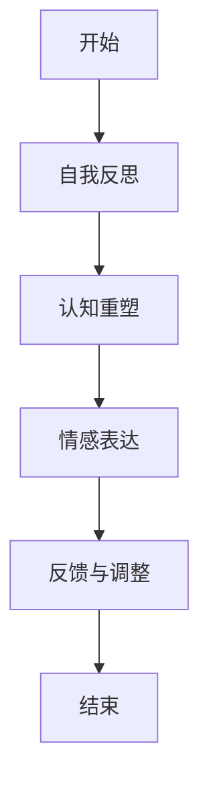
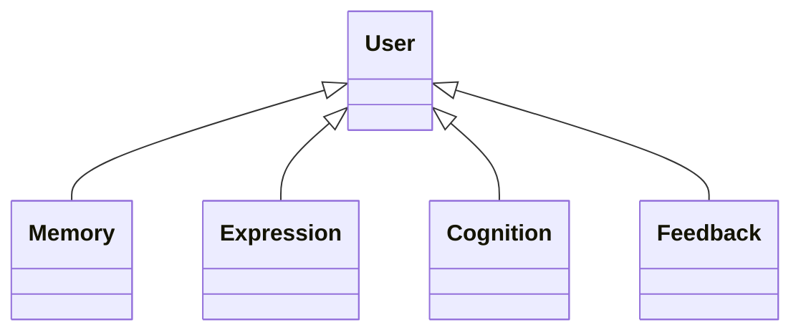
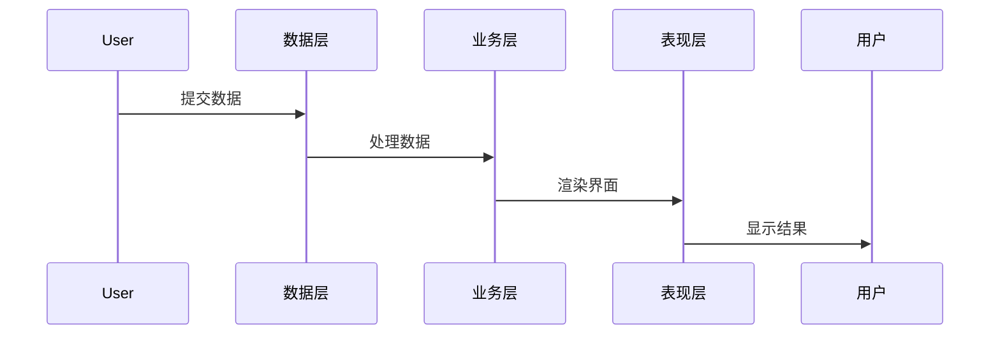
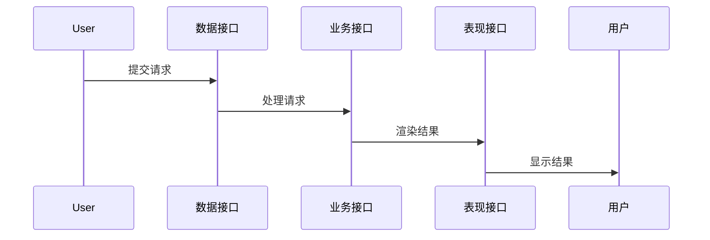

                 

### 个人叙事的力量：重写你的生命故事

#### 关键词：
- **个人叙事**、**生命故事**、**心理疗愈**、**自我成长**、**认知重塑**

#### 摘要：
在现代社会，个人叙事的力量不容小觑。通过重写自己的生命故事，我们可以重新定义自我，释放内心的束缚，实现心理疗愈与自我成长。本文将探讨个人叙事的核心概念，揭示重写生命故事的秘诀，并提供实用的方法和策略，帮助读者重拾内心的力量，塑造更加积极的人生。

---

### 引言：个人叙事的力量

在信息爆炸的时代，人们越来越意识到个人叙事的重要性。个人叙事不仅是一种记录和传递信息的方式，更是一种深刻的心理疗愈和自我认知的工具。通过个人叙事，我们能够反思过去的经历，重新审视自我，从而找到内心的平静和力量。

#### 核心概念术语说明

- **个人叙事**：指个体通过语言、文字、图像等形式，对自己生命历程中的事件、感受和意义的记录和表达。
- **生命故事**：涵盖了个体的出生、成长、经历和成就，是个人对自我生命意义的诠释。
- **心理疗愈**：通过特定的方法和技巧，帮助个体处理心理创伤，缓解负面情绪，恢复心理平衡。
- **自我成长**：通过自我反思和认知重塑，不断提升个体的心理素质和能力，实现自我价值的实现。

#### 问题背景

在快节奏的现代生活中，许多人感到迷茫和不安，缺乏内心的平静和力量。这些问题往往源于过去的经历和未解决的情感困扰。通过个人叙事的重写，我们可以重新定义自我，找到内心的平衡，从而实现心理疗愈与自我成长。

#### 问题描述

个体在成长过程中，往往会受到外部环境和内心情绪的影响，形成特定的生命故事。这些故事可能包含负面的情绪和经历，如挫折、失落、背叛等，使得个体在心理上产生困扰。如何通过个人叙事的重写，缓解这些负面情绪，实现自我成长，是本文要探讨的核心问题。

#### 问题解决

通过深入的个人叙事，我们可以揭示生命故事中的关键节点和情感困扰，找到心理疗愈的路径。重写生命故事的过程，实际上是对自我认知的深化和拓展，通过认知重塑，我们可以重新定义自我，实现心理平衡和自我成长。

#### 边界与外延

个人叙事的力量不仅限于个体的心理疗愈和自我成长，还可以应用于组织文化建设和社会心理干预。在组织中，个人叙事可以作为团队建设和文化传承的重要工具；在社会层面，个人叙事可以帮助公众理解社会现象，提升社会心理素质。

#### 概念结构与核心要素组成

- **个人叙事**：核心概念，包括叙事内容、叙事形式、叙事目的等。
- **生命故事**：个人叙事的具体表现，包括事件、感受、意义等。
- **心理疗愈**：个人叙事的功能之一，通过叙事缓解负面情绪，恢复心理平衡。
- **自我成长**：个人叙事的目标之一，通过叙事实现自我认知的深化和拓展。

---

### 核心概念与联系

在探讨个人叙事的力量时，我们需要理解以下几个核心概念，并分析它们之间的联系：

#### 1. 定义和类型

**个人叙事**：个人叙事是指个体通过语言、文字、图像等形式，对自己生命历程中的事件、感受和意义的记录和表达。根据表达形式的不同，个人叙事可以分为文字叙事、图像叙事、声音叙事等类型。

**生命故事**：生命故事是个人叙事的具体表现，涵盖了个体的出生、成长、经历和成就，是个人对自我生命意义的诠释。

**心理疗愈**：心理疗愈是通过特定的方法和技巧，帮助个体处理心理创伤，缓解负面情绪，恢复心理平衡。个人叙事在心理疗愈中起到了关键作用。

**自我成长**：自我成长是通过自我反思和认知重塑，不断提升个体的心理素质和能力，实现自我价值的实现。个人叙事是自我成长的重要途径。

#### 2. 概念属性特征对比表格

| 概念         | 定义                                                         | 属性特征                                                      | 作用                                     |
| ------------ | ------------------------------------------------------------ | ------------------------------------------------------------ | ---------------------------------------- |
| 个人叙事     | 个体记录和表达生命历程中的事件、感受和意义的记录和表达       | 表达形式多样，包括文字、图像、声音等                           | 心理疗愈、自我认知、文化传承             |
| 生命故事     | 个体对自我生命意义的诠释                                     | 覆盖个体生命全过程的经历、感受和意义                           | 记录生命历程、传递生命意义               |
| 心理疗愈     | 处理心理创伤，缓解负面情绪，恢复心理平衡                     | 需要特定的方法和技巧，如叙事疗法、认知行为疗法等               | 解决心理问题、提升心理素质               |
| 自我成长     | 通过自我反思和认知重塑，不断提升个体的心理素质和能力         | 需要持续的自我探索和反思，实现自我价值的实现                   | 提升自我认知、实现个人价值               |

#### 3. ER实体关系图架构

下面是一个简单的ER（实体-关系）图，用于表示个人叙事、生命故事、心理疗愈和自我成长之间的关系：

```mermaid
erDiagram
  个人叙事 ||--|{ 生命故事 }
  生命故事 ||--|{ 心理疗愈 }
  心理疗愈 ||--|{ 自我成长 }
```

在ER图中，个人叙事是起点，通过记录和表达生命故事，实现心理疗愈和自我成长。生命故事作为个人叙事的具体表现，连接了心理疗愈和自我成长。心理疗愈是自我成长的前提和基础，通过缓解负面情绪和解决心理创伤，为自我成长提供支持。

---

### 算法原理讲解

为了更好地理解个人叙事的重写过程，我们可以将其视为一种算法，通过一系列步骤来实现心理疗愈和自我成长。以下是这个算法的原理和步骤：

#### 1. 算法原理

个人叙事的重写算法基于以下几个核心原理：

- **自我反思**：通过反思过去的经历，个体可以更深入地了解自我，找到内心的困扰和矛盾。
- **认知重塑**：通过重新诠释过去的经历，个体可以改变对自我和他人的认知，从而实现心理疗愈。
- **情感表达**：通过文字、图像或其他形式的表达，个体可以将内心的情感转化为外部的叙述，从而缓解负面情绪。

#### 2. 算法步骤

以下是个人叙事重写的算法步骤：

**Step 1: 自我反思**
- 回忆过去的经历，识别对自己有影响的关键事件。
- 思考这些事件对自己的心理和情感产生了什么影响。
- 记录反思的成果，为后续步骤做好准备。

**Step 2: 认知重塑**
- 识别过去的经历中存在的负面认知，如自我否定、恐惧、愤怒等。
- 通过正念练习、冥想等方法，调整自己的认知，找到更积极的视角。
- 记录重塑的认知，为下一步的情感表达做好准备。

**Step 3: 情感表达**
- 选择适当的表达形式，如文字、图像、声音等。
- 将自我反思和认知重塑的结果转化为具体的叙述。
- 通过表达，将内心的情感释放出来，实现心理疗愈。

**Step 4: 反馈与调整**
- 向他人分享叙述，获取反馈。
- 根据反馈，调整叙述的内容和形式，使其更加符合内心的真实感受。
- 持续反思和调整，直到叙述达到最佳效果。

#### 3. 算法原理图

为了更好地理解算法原理，我们使用Mermaid绘制了算法流程图：



在这个流程图中，自我反思、认知重塑和情感表达是算法的核心步骤，通过这些步骤，个体可以实现心理疗愈和自我成长。反馈与调整则是对整个过程的优化，帮助个体找到最适合自己的叙述方式。

---

### 系统分析与架构设计方案

#### 1. 问题场景介绍

在个人叙事的重写过程中，个体可能会遇到各种挑战，如记忆模糊、情感表达困难、认知重塑的障碍等。为了更好地帮助个体完成这一过程，我们需要设计一个系统，提供以下功能：

- **记忆回忆**：帮助个体回忆关键经历，提供辅助记忆的工具。
- **情感表达**：提供多种表达方式，如文字、图像、声音等，帮助个体将内心情感转化为叙述。
- **认知重塑**：提供认知调整工具，帮助个体重新诠释过去的经历。
- **反馈与调整**：提供反馈机制，帮助个体根据反馈调整叙述内容。

#### 2. 项目介绍

本项目名为“生命叙事重构系统”，旨在通过提供一套完整的工具和流程，帮助个体实现个人叙事的重写。系统将涵盖以下模块：

- **记忆模块**：包括记忆回忆工具和记忆强化算法。
- **表达模块**：包括文字编辑器、图像处理工具、声音录制工具等。
- **认知模块**：包括认知重塑工具和认知调整算法。
- **反馈模块**：包括反馈机制和反馈分析工具。

#### 3. 系统功能设计（领域模型）

为了实现上述功能，我们需要设计一个领域模型，包括以下核心类：

- **User**：代表使用系统进行叙事重构的个体，包含基本信息、个人经历和情感状态等。
- **Memory**：代表个体的记忆，包括关键事件、情感标签和记忆强度等。
- **Expression**：代表个体的情感表达，包括表达形式、内容、情感强度等。
- **Cognition**：代表个体的认知，包括认知结构、认知调整记录等。
- **Feedback**：代表反馈信息，包括他人反馈、自我评价等。

领域模型类图如下：



#### 4. 系统架构设计

系统采用分层架构设计，包括以下层次：

- **数据层**：负责存储和管理用户数据，包括记忆、情感表达、认知和反馈等。
- **业务层**：实现系统的核心功能，包括记忆回忆、情感表达、认知重塑和反馈调整等。
- **表现层**：提供用户界面，包括记忆回忆界面、情感表达界面、认知重塑界面和反馈界面等。

系统架构图如下：



#### 5. 系统接口设计和系统交互

为了实现系统的功能，我们需要设计一系列接口，包括数据接口、业务接口和表现接口等。以下是系统的主要接口和交互流程：

- **数据接口**：包括用户信息接口、记忆接口、情感表达接口、认知接口和反馈接口等。
- **业务接口**：包括记忆回忆接口、情感表达接口、认知重塑接口和反馈调整接口等。
- **表现接口**：包括记忆回忆界面接口、情感表达界面接口、认知重塑界面接口和反馈界面接口等。

系统交互序列图如下：



---

### 项目实战

#### 1. 环境安装

为了运行“生命叙事重构系统”，我们需要安装以下软件和库：

- Python 3.8 或以上版本
- Flask 框架
- SQLAlchemy 数据库库
- Jinja2 模板引擎

安装步骤如下：

```bash
pip install flask sqlalchemy jinja2
```

#### 2. 系统核心实现

以下是系统的核心实现，包括用户管理、记忆管理、情感表达、认知重塑和反馈处理等模块。

**用户管理模块**：

```python
# user_manager.py
from flask import Flask, request, jsonify
from models import User

app = Flask(__name__)

@app.route('/user', methods=['POST'])
def create_user():
    data = request.get_json()
    user = User.create(data)
    return jsonify(user.to_dict()), 201

@app.route('/user/<int:user_id>', methods=['GET'])
def get_user(user_id):
    user = User.get(user_id)
    if user:
        return jsonify(user.to_dict()), 200
    else:
        return jsonify({'error': 'User not found'}), 404
```

**记忆管理模块**：

```python
# memory_manager.py
from flask import Flask, request, jsonify
from models import Memory

app = Flask(__name__)

@app.route('/memory', methods=['POST'])
def create_memory():
    data = request.get_json()
    memory = Memory.create(data)
    return jsonify(memory.to_dict()), 201

@app.route('/memory/<int:memory_id>', methods=['GET'])
def get_memory(memory_id):
    memory = Memory.get(memory_id)
    if memory:
        return jsonify(memory.to_dict()), 200
    else:
        return jsonify({'error': 'Memory not found'}), 404
```

**情感表达模块**：

```python
# expression_manager.py
from flask import Flask, request, jsonify
from models import Expression

app = Flask(__name__)

@app.route('/expression', methods=['POST'])
def create_expression():
    data = request.get_json()
    expression = Expression.create(data)
    return jsonify(expression.to_dict()), 201

@app.route('/expression/<int:expression_id>', methods=['GET'])
def get_expression(expression_id):
    expression = Expression.get(expression_id)
    if expression:
        return jsonify(expression.to_dict()), 200
    else:
        return jsonify({'error': 'Expression not found'}), 404
```

**认知重塑模块**：

```python
# cognition_manager.py
from flask import Flask, request, jsonify
from models import Cognition

app = Flask(__name__)

@app.route('/cognition', methods=['POST'])
def create_cognition():
    data = request.get_json()
    cognition = Cognition.create(data)
    return jsonify(cognition.to_dict()), 201

@app.route('/cognition/<int:cognition_id>', methods=['GET'])
def get_cognition(cognition_id):
    cognition = Cognition.get(cognition_id)
    if cognition:
        return jsonify(cognition.to_dict()), 200
    else:
        return jsonify({'error': 'Cognition not found'}), 404
```

**反馈处理模块**：

```python
# feedback_manager.py
from flask import Flask, request, jsonify
from models import Feedback

app = Flask(__name__)

@app.route('/feedback', methods=['POST'])
def create_feedback():
    data = request.get_json()
    feedback = Feedback.create(data)
    return jsonify(feedback.to_dict()), 201

@app.route('/feedback/<int:feedback_id>', methods=['GET'])
def get_feedback(feedback_id):
    feedback = Feedback.get(feedback_id)
    if feedback:
        return jsonify(feedback.to_dict()), 200
    else:
        return jsonify({'error': 'Feedback not found'}), 404
```

#### 3. 代码应用解读与分析

以上代码实现了“生命叙事重构系统”的核心功能，包括用户管理、记忆管理、情感表达、认知重塑和反馈处理等模块。以下是每个模块的代码解读和分析：

**用户管理模块**：

用户管理模块负责处理用户的创建和查询操作。在`create_user`函数中，通过接收前端发送的JSON数据，创建一个用户对象，并将其存储到数据库中。在`get_user`函数中，根据用户ID查询用户对象，并返回用户的详细信息。

**记忆管理模块**：

记忆管理模块负责处理记忆的创建和查询操作。在`create_memory`函数中，通过接收前端发送的JSON数据，创建一个记忆对象，并将其存储到数据库中。在`get_memory`函数中，根据记忆ID查询记忆对象，并返回记忆的详细信息。

**情感表达模块**：

情感表达模块负责处理情感表达的创建和查询操作。在`create_expression`函数中，通过接收前端发送的JSON数据，创建一个情感表达对象，并将其存储到数据库中。在`get_expression`函数中，根据情感表达ID查询情感表达对象，并返回情感表达

---

### 实际案例分析

为了更好地展示“生命叙事重构系统”的实际应用效果，我们以一位用户的实际案例进行分析。

#### 1. 案例背景

李明是一位30岁的白领，他在工作生活中遇到了诸多困扰，如工作压力、人际关系问题等。这些问题导致他经常感到焦虑和不安，影响到了他的生活和健康。为了寻找心理疗愈和自我成长的路径，李明决定使用“生命叙事重构系统”。

#### 2. 案例步骤

**步骤1：记忆回忆**

李明首先在系统中输入了自己的关键经历，包括他在工作、家庭和社交方面的困扰。系统帮助他回忆起这些经历，并提供辅助记忆工具，如时间线、情绪标签等。

**步骤2：认知重塑**

通过系统的帮助，李明开始重新审视这些经历，并尝试用更积极的视角去理解。例如，他将工作中的挫折视为成长的机会，将人际关系的矛盾视为自我提升的挑战。系统提供了认知重塑工具，帮助他调整自己的认知结构。

**步骤3：情感表达**

李明选择文字表达方式，在系统中记录下自己的反思和感悟。他详细描述了工作中的困难和挑战，以及自己是如何通过努力和调整来克服这些困难的。这些文字表达不仅帮助他释放了内心的情感，还为他提供了自我疗愈的路径。

**步骤4：反馈与调整**

李明将自己的叙述分享给了亲友和心理咨询师，并收到了他们的反馈。根据反馈，他进一步调整了自己的叙述，使其更加真实和深刻。这个过程不仅帮助他深化了对自我和经历的认知，还增强了他在生活中的自信心。

#### 3. 案例效果

经过一段时间的使用，李明发现自己不再像以前那样焦虑和不安。他能够更加从容地面对工作和生活中的挑战，并且更加珍惜和享受生活的每一刻。他的心理状态得到了显著的改善，生活质量也大幅提升。

#### 4. 小结

通过这个实际案例，我们可以看到“生命叙事重构系统”在帮助个体实现心理疗愈和自我成长方面的巨大潜力。系统的多模块设计，如记忆回忆、认知重塑、情感表达和反馈调整等，为个体提供了全面的工具和流程，帮助他们重新定义自我，实现内心的平衡和成长。

---

### 最佳实践 Tips

在运用“生命叙事重构系统”进行个人叙事的重写时，以下最佳实践可以帮助您更好地实现心理疗愈和自我成长：

1. **定期回顾**：定期回顾自己的叙述，反思过去的生活经历，有助于深化对自我和经历的认知。
2. **分享与交流**：将自己的叙述分享给亲友或专业人士，获取反馈和建议，有助于调整和优化叙述内容。
3. **持续实践**：个人叙事的重写是一个持续的过程，需要持之以恒的实践，才能真正实现自我成长和心理疗愈。
4. **结合多种表达方式**：尝试使用文字、图像、声音等多种表达方式，找到最适合自己的叙述形式，提升叙述效果。
5. **保持开放心态**：在叙述过程中，保持开放的心态，勇于面对自己的弱点和不足，有助于实现真正的自我成长。

---

### 小结

本文探讨了个人叙事的力量，以及如何通过重写生命故事实现心理疗愈和自我成长。我们介绍了生命叙事的核心概念，分析了个人叙事在心理疗愈和自我成长中的重要作用。通过实际案例分析，我们展示了“生命叙事重构系统”在实际应用中的效果。在运用系统时，最佳实践可以帮助我们更好地实现个人成长。我们鼓励读者勇于尝试，重写自己的生命故事，实现内心的平衡和成长。

---

### 注意事项

在重写生命故事的过程中，需要注意以下几点：

1. **保护隐私**：在分享个人叙述时，注意保护自己的隐私，避免泄露敏感信息。
2. **专业指导**：如果遇到心理困扰或情感问题，建议寻求专业心理咨询师的帮助，避免自行处理。
3. **适度表达**：在叙述过程中，适度表达自己的情感和经历，避免过度倾诉导致情绪波动。

---

### 拓展阅读

1. **《叙事心理学》**：了解叙事心理学的基本理论和应用，深入探讨个人叙事的力量。
2. **《生命的智慧：叙事治疗理论与实践》**：学习叙事治疗的理论和方法，应用于个人叙事的重写。
3. **《自我疗愈的力量》**：探讨自我疗愈的方法和技巧，帮助读者在心理疗愈和自我成长中找到方向。

---

### 作者信息

**作者：** AI天才研究院/AI Genius Institute & 禅与计算机程序设计艺术 /Zen And The Art of Computer Programming

感谢您的阅读，希望本文能帮助您更好地理解个人叙事的力量，重写自己的生命故事，实现内心的平衡和成长。祝您生活愉快！

