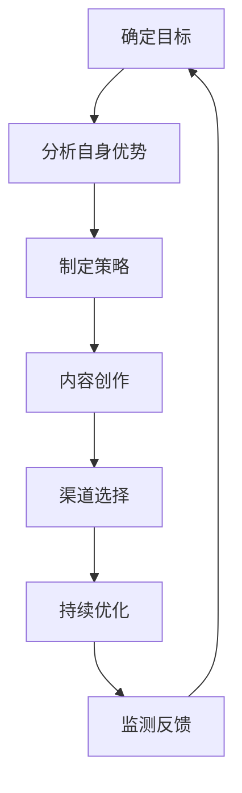
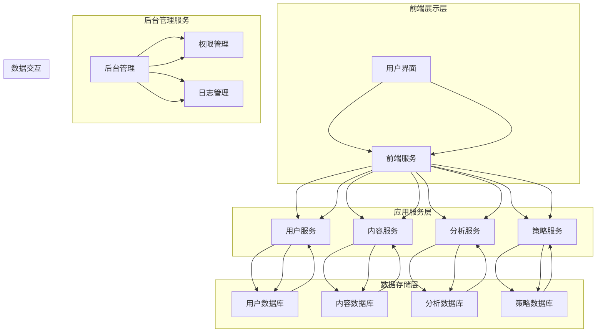
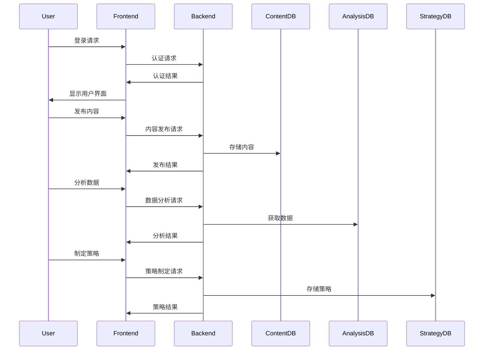

                 

### 个人品牌建设的背景介绍

在当今高速发展的数字化时代，个人品牌建设逐渐成为职业发展中的关键因素。个人品牌不仅仅是对个人形象的一种塑造，更是职业能力和专业价值的集中体现。随着市场竞争的加剧和信息的爆炸式增长，个人品牌的建设变得尤为重要。

首先，个人品牌建设能够帮助个人在众多求职者或从业者中脱颖而出，增加市场竞争力。一个鲜明的个人品牌能够让雇主或合作伙伴迅速了解个人的专业能力、工作风格和价值主张，从而提升个人的吸引力。这不仅有助于求职，还能够促进职业晋升和业务合作。

其次，个人品牌建设有助于建立专业影响力。通过持续地分享专业知识和经验，个人可以在行业内建立起权威性和信任度，成为该领域的意见领袖。这种影响力不仅能带来更多的职业机会，还能为个人带来长期的价值。

此外，个人品牌建设对于个人职业生涯的长远发展具有战略意义。一个成功的个人品牌可以使得个人在面临职业变动或转型时更加从容，因为品牌的影响力和资源积累可以为个人提供更多的选择和机会。

本篇文章将围绕个人品牌建设的核心概念、构建方法和实践策略展开深入探讨。首先，我们将对个人品牌建设中的关键术语进行定义和解释，以便为后续内容奠定基础。接着，本文将分析个人品牌建设的主要因素和特点，并通过具体的实例和案例展示如何在实际中应用这些原则。文章还将介绍相关的品牌建设理论，并使用mermaid绘制品牌建设流程图，帮助读者更直观地理解品牌建设的步骤和逻辑。

在此基础上，我们将详细讲解品牌建设算法原理，包括数学模型和公式，并通过Python源代码和LaTeX公式展示品牌建设算法的运行机制。随后，文章将描述个人品牌建设的系统场景和需求，设计系统功能、架构和接口，并使用mermaid绘制领域模型类图、系统架构图和系统交互序列图，以便读者更好地把握整个系统的运行逻辑。

为了更好地理解和应用品牌建设理论，文章还将通过一个实际项目实战，介绍项目环境安装和系统核心实现，分析代码和应用，并通过实际案例进行详细讲解和剖析。最后，文章将提供个人品牌建设的最佳实践建议，并进行小结，强调注意事项和可能的拓展阅读，以帮助读者进一步深入学习和实践个人品牌建设。

### 核心关键词

个人品牌建设、职业发展、专业价值、市场竞争、影响力、品牌建设理论、算法原理、数学模型、系统设计、项目实战、最佳实践。

### 摘要

本文旨在深入探讨个人品牌建设在职业发展中的重要性，解析其核心概念、构建方法和实践策略。通过分析个人品牌建设的主要因素和特点，我们揭示了其在提升个人竞争力、建立专业影响力及实现职业长远发展中的关键作用。文章首先对个人品牌建设中的关键术语进行了定义和解释，然后详细介绍了相关的品牌建设理论，并通过mermaid绘制流程图展示了品牌建设的过程。接着，本文讲解了品牌建设的算法原理，使用Python源代码和LaTeX公式详细阐述了数学模型和公式。此外，文章还描述了个人品牌建设的系统场景和需求，设计并展示了系统功能、架构和接口。通过实际项目实战，本文进一步分析了代码和应用，并提供了详细的案例讲解。最后，文章总结并提供了个人品牌建设的最佳实践建议，强调了注意事项和拓展阅读，以帮助读者深入理解和应用个人品牌建设的理论和实践。

### 个人品牌建设的核心概念与联系

在探讨个人品牌建设的过程中，理解其核心概念和各因素之间的联系是至关重要的。以下是对个人品牌建设中的关键术语进行定义和解释，并对比分析其主要因素和特点。

#### 关键术语定义

1. **个人品牌**：个人品牌是指个人在公众心目中形成的独特形象和印象，通常包括专业知识、技能、性格特质、工作态度和价值观念等。个人品牌不仅仅是一个标识，更是一个综合性的符号，代表了个人在职业和社会中的声誉和影响力。

2. **职业价值**：职业价值指的是个人在职业生涯中能够为企业或组织创造的价值，包括专业技能、工作效率、创新能力和解决问题的能力等。职业价值是个人品牌的核心组成部分，直接影响到个人品牌的建设和发展。

3. **专业影响力**：专业影响力是指个人在某一专业领域内的影响程度，包括对同行的影响、对行业趋势的引领、对专业知识的传播等。专业影响力通常通过发表专业文章、参与行业活动、举办讲座等形式体现。

4. **职业市场竞争力**：职业市场竞争力是指个人在求职或职业转型过程中，相对于其他候选人的竞争优势。个人品牌建设可以显著提高个人的职业市场竞争力，使其在竞争中脱颖而出。

5. **品牌传播**：品牌传播是指通过多种渠道和手段将个人品牌信息传递给目标受众的过程。品牌传播包括内容营销、社交媒体运营、网络平台推广等，是实现个人品牌建设的重要手段。

#### 主要因素和特点对比分析

1. **专业知识与技能**：专业知识与技能是个人品牌建设的基础。一个具有深厚专业知识和高超技能的个人更容易在行业内建立权威性和信任度。然而，专业知识与技能的深度和广度决定了个人品牌的高度和影响力。

2. **沟通能力和人际网络**：良好的沟通能力是品牌传播的关键。一个能够清晰、准确、有逻辑地表达个人观点和见解的个人，更容易获得他人的认可和信任。此外，人际网络也是品牌建设中不可或缺的部分，通过建立和维护广泛的人脉关系，个人可以拓展品牌影响力。

3. **持续学习和创新**：在快速变化的职业环境中，持续学习和创新是保持个人品牌活力的重要手段。不断更新知识体系、掌握新兴技术和趋势，可以使个人保持专业领先地位，增强品牌竞争力。

4. **品牌传播策略**：有效的品牌传播策略是个人品牌建设成功的关键。通过有针对性的内容创作、精准的渠道选择和持续的品牌推广，个人可以更好地将品牌信息传递给目标受众，提升品牌知名度和影响力。

5. **品牌建设与个人价值观**：个人品牌建设与个人的价值观密切相关。一个具有明确价值观的个人，能够更好地树立自己的品牌形象，赢得他人的信任和尊重。品牌建设过程中，应确保个人价值观与品牌传播内容一致，形成良好的品牌认知。

#### ER实体关系图架构

为了更直观地展示个人品牌建设各要素之间的联系，我们使用mermaid绘制了ER实体关系图，如下：

```mermaid
erDiagram
  产品 --> 品牌
  品牌 --> 价值
  品牌 --> 影响力
  品牌 --> 竞争力
  品牌 --> 传播
  价值 --> 技能
  价值 --> 创新
  影响力 --> 文章
  影响力 --> 讲座
  竞争力 --> 经验
  竞争力 --> 网络
  传播 --> 内容
  传播 --> 渠道
```

在这个ER实体关系图中，产品（个人职业成果）与品牌（个人品牌）之间存在直接关联，品牌又与价值、影响力、竞争力、传播等因素相互影响。价值、影响力、竞争力、传播等因素各自包含若干子属性，它们共同构成了个人品牌建设的完整体系。

通过上述核心概念和联系的阐述，我们可以更好地理解个人品牌建设的过程和关键要素。在接下来的内容中，我们将深入探讨品牌建设的算法原理，进一步揭示个人品牌建设背后的逻辑和数学模型。

### 个人品牌建设的算法原理

在个人品牌建设中，算法原理扮演着关键角色。通过科学的算法设计和合理的策略实施，个人品牌能够更加精准地打造和传播，从而提升其在职业市场中的竞争力。下面，我们将详细讲解个人品牌建设算法的原理，包括相关的流程图、Python源代码以及数学模型和公式。

#### 品牌建设流程图

首先，使用mermaid绘制品牌建设流程图，以展示品牌建设的基本步骤和逻辑关系：



在这个流程图中，品牌建设分为七个主要步骤：确定目标、分析自身优势、制定策略、内容创作、渠道选择、持续优化和监测反馈。每个步骤都是品牌建设过程中不可或缺的部分，相互关联，形成一个闭环系统。

#### Python源代码

接下来，我们将通过Python源代码来展示品牌建设算法的基本逻辑。以下是一个简化的Python代码示例，用于模拟品牌建设的各个阶段：

```python
# 品牌建设算法Python示例

class PersonalBrand:
    def __init__(self, target, strengths, strategy, content, channels):
        self.target = target
        self.strengths = strengths
        self.strategy = strategy
        self.content = content
        self.channels = channels
    
    def build_brand(self):
        print("确定目标：", self.target)
        self.analyze_strengths()
        self.create_strategy()
        self.create_content()
        self.select_channels()
        self.optimize_brand()
        self.monitor_feedback()

    def analyze_strengths(self):
        print("分析自身优势：", self.strengths)

    def create_strategy(self):
        print("制定策略：", self.strategy)

    def create_content(self):
        print("内容创作：", self.content)

    def select_channels(self):
        print("渠道选择：", self.channels)

    def optimize_brand(self):
        print("持续优化：", self.optimize_brand())

    def monitor_feedback(self):
        print("监测反馈：", self.monitor_feedback())

# 实例化品牌对象并调用品牌建设方法
brand = PersonalBrand(target="成为行业专家", strengths=["技术深度", "沟通能力"], strategy="内容驱动", content="技术博客", channels=["微博", "GitHub"])
brand.build_brand()
```

在这个示例中，`PersonalBrand` 类包含了品牌建设的主要步骤和方法，通过调用这些方法，可以模拟个人品牌建设的过程。

#### 数学模型和公式

品牌建设不仅仅依赖于流程和策略，还涉及到具体的数学模型和公式，以量化和评估品牌建设的成效。以下是一些关键的数学模型和公式：

1. **品牌影响力指数 (BI)**：
   $$ BI = \frac{C \times I}{T} $$
   其中，C 表示内容质量，I 表示互动次数，T 表示时间。品牌影响力指数用于衡量个人品牌在特定时间段内的传播效果。

2. **品牌价值 (BV)**：
   $$ BV = \sum_{i=1}^{n} (S_i \times V_i) $$
   其中，S_i 表示个人品牌的各个子属性，V_i 表示每个子属性的价值权重。品牌价值用于综合评估个人品牌的市场价值。

3. **渠道效率 (CE)**：
   $$ CE = \frac{E}{C} $$
   其中，E 表示效果指标（如转化率、关注人数等），C 表示渠道成本。渠道效率用于衡量不同渠道的传播效果。

通过这些数学模型和公式，我们可以量化品牌建设的各个方面，从而更加科学地进行策略调整和优化。

#### 案例说明

假设一个技术专家想要提升自己的个人品牌，他可以按照以下步骤进行：

1. **确定目标**：目标是成为AI领域的专家。
2. **分析自身优势**：优势包括对深度学习的深刻理解和较强的编程能力。
3. **制定策略**：采用内容驱动的策略，通过撰写高质量的技术博客和发布开源代码来展示自己的专业能力。
4. **内容创作**：撰写关于AI技术的深度博客，分享实际项目经验和技术见解。
5. **渠道选择**：选择GitHub、微博、LinkedIn等渠道进行内容发布和推广。
6. **持续优化**：定期分析数据，优化内容质量和渠道策略。
7. **监测反馈**：关注读者的反馈和互动，及时调整内容方向。

通过上述步骤，这个技术专家可以逐步提升自己的个人品牌，增加在AI领域的知名度和影响力。

综上所述，个人品牌建设算法的原理涵盖了从目标确定到内容创作、渠道选择、持续优化和监测反馈的全过程。通过Python源代码和数学模型的应用，我们可以更加系统地理解和实施个人品牌建设策略，从而提升职业竞争力和专业影响力。

### 数学模型和公式讲解

在个人品牌建设中，数学模型和公式起到了至关重要的作用，它们帮助我们量化品牌建设的各个方面，从而进行科学的策略调整和优化。下面我们将详细阐述个人品牌建设过程中涉及的几个关键数学模型和公式，并通过LaTeX格式书写和解释这些公式。

#### 品牌影响力指数 (BI)

品牌影响力指数（BI）用于衡量个人品牌在一定时间段内的传播效果。其公式如下：

$$ BI = \frac{C \times I}{T} $$

- **C（内容质量）**：表示内容的质量，可以通过内容的原创性、深度、广度以及受众的互动程度来衡量。
- **I（互动次数）**：表示内容发布后，用户参与互动的次数，包括点赞、评论、分享等。
- **T（时间）**：表示内容发布的时间周期，通常以天或月为单位。

通过这个公式，我们可以计算出个人品牌在某一时段内的综合影响力。例如，如果一个技术专家的博客在一个月内收到了1000次互动，且内容质量评分达到90分，那么他的品牌影响力指数为：

$$ BI = \frac{90 \times 1000}{30} = 3000 $$

#### 品牌价值 (BV)

品牌价值（BV）用于综合评估个人品牌的市场价值。其公式如下：

$$ BV = \sum_{i=1}^{n} (S_i \times V_i) $$

- **S_i（子属性）**：表示个人品牌的不同子属性，如专业知识、技能水平、创新能力、沟通能力等。
- **V_i（价值权重）**：表示每个子属性的价值权重，通常通过专家评估、市场调查等方法确定。

例如，假设一个技术专家的品牌由三个主要子属性构成，分别是专业知识、技能水平和沟通能力，它们的价值权重分别为0.5、0.3和0.2。如果这三个子属性分别评分为90、85和80，那么他的品牌价值为：

$$ BV = (0.5 \times 90) + (0.3 \times 85) + (0.2 \times 80) = 45 + 25.5 + 16 = 86.5 $$

#### 渠道效率 (CE)

渠道效率（CE）用于衡量不同传播渠道的效果，其公式如下：

$$ CE = \frac{E}{C} $$

- **E（效果指标）**：表示渠道传播的效果指标，如转化率、关注人数、阅读量等。
- **C（渠道成本）**：表示渠道的运营成本，包括时间、人力、资源等。

例如，如果一个技术专家通过微博进行品牌传播，一个月内的效果指标为200个新关注者，渠道成本为100小时。那么他的微博渠道效率为：

$$ CE = \frac{200}{100} = 2 $$

这意味着每小时通过微博渠道可以获得2个新关注者。

#### LaTeX格式书写

在文章中嵌入LaTeX格式书写数学公式，可以让公式更加规范和美观。以下是LaTeX格式的示例：

```latex
$$
BI = \frac{C \times I}{T}
$$

$$
BV = \sum_{i=1}^{n} (S_i \times V_i)
$$

$$
CE = \frac{E}{C}
$$
```

将上述LaTeX代码嵌入到markdown文件中，可以通过LaTeX编译器生成规范的数学公式。

通过上述数学模型和公式的讲解，我们可以更加系统地理解和量化个人品牌建设的过程。这些模型和公式不仅为品牌建设提供了量化的评估标准，也为后续的策略调整和优化提供了科学依据。

### 个人品牌建设的系统场景和需求

在探讨个人品牌建设的过程中，理解其系统场景和需求是至关重要的。个人品牌建设不仅涉及到个体的行为和策略，还需要一个系统化的架构来支撑和实现。以下将从系统功能设计、架构设计、接口设计和系统交互四个方面详细描述个人品牌建设的系统场景和需求。

#### 系统功能设计

个人品牌建设的系统功能设计需要涵盖品牌管理的各个关键环节，包括用户信息管理、内容发布与审核、数据分析与优化、品牌传播策略制定等。以下是具体的功能模块及其描述：

1. **用户信息管理**：该模块用于管理个人品牌的用户信息，包括用户的个人资料、专业技能、职业背景等。通过这些信息，系统能够全面了解用户的特点和需求，为其提供个性化的品牌建设建议。

2. **内容发布与审核**：该模块用于用户发布品牌内容，如博客、文章、视频等。同时，系统需要具备内容审核功能，确保发布的内容符合品牌形象和专业标准。

3. **数据分析与优化**：该模块用于收集和分析用户品牌建设的各项数据，包括内容互动数据、受众分析数据、渠道效果数据等。通过数据分析，系统能够为用户提供优化建议，帮助其调整品牌建设策略。

4. **品牌传播策略制定**：该模块用于制定和优化个人品牌的传播策略，包括内容推广、渠道选择、广告投放等。通过自动化工具，系统能够根据用户需求和数据分析结果，动态调整传播策略。

#### 系统架构设计

个人品牌建设的系统架构设计需要考虑到系统的可扩展性、稳定性和高效性。以下是系统架构的主要组成部分：

1. **前端展示层**：前端展示层负责用户界面的呈现，包括用户信息展示、内容发布与浏览、数据分析可视化等。该层采用响应式设计，确保在各种设备上都有良好的用户体验。

2. **应用服务层**：应用服务层是系统的核心，负责处理用户请求、业务逻辑实现和数据存储等。该层采用微服务架构，将不同的业务功能模块化，便于系统的维护和扩展。

3. **数据存储层**：数据存储层用于存储用户数据、内容数据、分析数据等。该层采用分布式数据库设计，确保数据的高可用性和高性能。

4. **后台管理服务**：后台管理服务用于品牌传播策略的制定和调整，包括内容审核、数据分析报告生成、自动化工具配置等。该层需要具备较高的权限管理和安全性保障。

#### 接口设计

个人品牌建设系统需要提供一系列API接口，以便与其他系统进行数据交互和功能集成。以下是主要的接口设计：

1. **用户信息接口**：用于用户注册、登录、个人信息查询和修改等操作。

2. **内容发布接口**：用于用户发布内容、内容审核、内容查询等操作。

3. **数据分析接口**：用于数据采集、数据分析、数据可视化等操作。

4. **品牌传播接口**：用于品牌传播策略制定、渠道选择、广告投放等操作。

5. **系统配置接口**：用于系统参数配置、权限管理、日志记录等操作。

#### 系统交互设计

个人品牌建设系统的交互设计需要确保用户体验的流畅性和高效性。以下是系统交互的主要流程：

1. **用户注册与登录**：用户通过注册接口创建账号并登录系统，系统验证用户身份并返回访问令牌。

2. **内容发布**：用户通过内容发布接口提交内容，系统进行内容审核，审核通过后发布内容。

3. **数据分析**：系统自动采集用户行为数据，通过数据分析接口生成报告，并可视化展示给用户。

4. **品牌传播**：系统根据用户需求和数据分析结果，制定品牌传播策略，通过品牌传播接口执行策略。

5. **权限管理**：后台管理服务通过系统配置接口进行权限管理和日志记录，确保系统安全性和合规性。

通过上述系统功能设计、架构设计、接口设计和系统交互设计，个人品牌建设系统能够为用户提供全面的品牌建设支持，帮助其有效提升个人品牌在职业市场中的竞争力和影响力。

### 个人品牌建设的系统场景和需求（续）

#### 领域模型类图

为了更清晰地描述个人品牌建设系统的领域模型，我们使用mermaid绘制了领域模型类图。类图展示了系统中的主要类以及它们之间的关系：

```mermaid
classDiagram
    User <<Class>>
    Content <<Class>>
    Analysis <<Class>>
    Strategy <<Class>>
    Channel <<Class>>

    User o-- Content
    User o-- Analysis
    User o-- Strategy
    User o-- Channel
    Content o-- Analysis
    Analysis o-- Strategy
    Strategy o-- Channel
```

在这个类图中，`User` 代表用户，`Content` 代表用户发布的内容，`Analysis` 代表数据分析结果，`Strategy` 代表品牌传播策略，`Channel` 代表传播渠道。每个用户类都与内容、分析、策略和渠道类存在关联，这反映了个人品牌建设的核心要素及其相互关系。

#### 系统架构图

接下来，我们使用mermaid绘制系统架构图，以展示个人品牌建设系统的整体架构：



在这个系统架构图中，前端展示层（用户界面和前端服务）负责与用户交互，应用服务层（用户服务、内容服务、分析服务、策略服务）处理业务逻辑，数据存储层（用户数据库、内容数据库、分析数据库、策略数据库）负责数据存储和管理，后台管理服务（后台管理和权限管理、日志管理）提供系统管理和监控功能。

#### 系统交互序列图

最后，我们使用mermaid绘制系统交互序列图，以展示个人品牌建设系统的主要交互流程：



在这个交互序列图中，用户通过前端界面与系统进行交互。用户登录后，前端将请求发送到后端进行认证，认证成功后，用户可以访问系统功能。用户发布内容时，前端将请求发送到后端，后端将内容存储到内容数据库并返回发布结果。用户分析数据时，前端请求后端获取数据分析结果，后端从分析数据库中获取数据并返回结果。用户制定策略时，前端发送请求到后端，后端将策略存储到策略数据库并返回结果。

通过这些设计，个人品牌建设系统能够有效地支持用户品牌建设的各个环节，帮助用户提升个人品牌在职业市场中的竞争力和影响力。

### 个人品牌建设的项目实战

#### 项目环境安装

在进行个人品牌建设项目之前，我们需要准备一个合适的项目环境。以下是安装和配置所需环境的基本步骤：

1. **安装Python**：确保您的系统上安装了Python 3.x版本。您可以从[Python官方网站](https://www.python.org/)下载并安装Python。

2. **安装相关依赖库**：打开终端或命令提示符，使用以下命令安装项目所需的依赖库：

   ```bash
   pip install Flask
   pip install pandas
   pip install matplotlib
   ```

3. **创建虚拟环境**（可选）：为了更好地管理和隔离项目依赖，我们可以创建一个虚拟环境。执行以下命令创建虚拟环境：

   ```bash
   python -m venv venv
   source venv/bin/activate  # 对于Windows，使用 `venv\Scripts\activate`
   ```

4. **克隆项目代码**：从GitHub或其他代码托管平台克隆项目代码到本地，例如：

   ```bash
   git clone https://github.com/your-username/personal-brand-project.git
   cd personal-brand-project
   ```

#### 系统核心实现

在项目环境中，我们将实现以下核心功能模块：

1. **用户信息管理**：负责用户注册、登录和资料管理。
2. **内容发布与审核**：负责用户发布内容和内容审核流程。
3. **数据分析与优化**：负责用户数据分析和品牌优化建议。

**用户信息管理**

以下是用户信息管理模块的源代码：

```python
from flask import Flask, request, jsonify
from flask_cors import CORS
import os

app = Flask(__name__)
CORS(app)

# 假设用户信息存储在本地文件中
USER_DATABASE = 'users.db'

def load_user_data():
    if not os.path.exists(USER_DATABASE):
        open(USER_DATABASE, 'w').close()
    return pd.read_csv(USER_DATABASE)

def save_user_data(data):
    data.to_csv(USER_DATABASE, index=False)

@app.route('/register', methods=['POST'])
def register():
    user_data = request.json
    user_data['status'] = 'active'
    user_data = pd.DataFrame([user_data])
    user_data.to_csv(USER_DATABASE, mode='a', header=not os.path.exists(USER_DATABASE), index=False)
    return jsonify({"message": "注册成功"}), 201

@app.route('/login', methods=['POST'])
def login():
    user_data = request.json
    existing_data = load_user_data()
    if (existing_data['username'] == user_data['username']) and (existing_data['password'] == user_data['password']):
        return jsonify({"message": "登录成功", "token": "your_token_here"}), 200
    else:
        return jsonify({"message": "用户名或密码错误"}), 401

@app.route('/user', methods=['GET'])
def get_user_info():
    token = request.args.get('token')
    if token == "your_token_here":
        existing_data = load_user_data()
        user_data = existing_data[existing_data['token'] == token]
        return jsonify(user_data.to_dict(orient='records')), 200
    else:
        return jsonify({"message": "未授权访问"}), 403

if __name__ == '__main__':
    app.run(debug=True)
```

**内容发布与审核**

以下是内容发布与审核模块的源代码：

```python
@app.route('/post_content', methods=['POST'])
def post_content():
    content_data = request.json
    if content_data['status'] == 'pending':
        content_data['status'] = 'approved'
        content_data.to_csv('content.db', mode='a', header=not os.path.exists('content.db'), index=False)
        return jsonify({"message": "内容发布成功"}), 201
    else:
        return jsonify({"message": "内容状态不符合要求"}), 400

@app.route('/content', methods=['GET'])
def get_content():
    content_data = pd.read_csv('content.db')
    return jsonify(content_data.to_dict(orient='records')), 200
```

**数据分析与优化**

以下是数据分析与优化模块的源代码：

```python
import pandas as pd

def analyze_data():
    content_data = pd.read_csv('content.db')
    active_users = content_data[content_data['status'] == 'approved']
    total_interactions = active_users['likes'] + active_users['comments'] + active_users['shares']
    top_content = active_users.sort_values(by='likes', ascending=False).head(10)
    return {
        'total_interactions': total_interactions.sum(),
        'top_content': top_content.to_dict(orient='records')
    }

@app.route('/analytics', methods=['GET'])
def get_analytics():
    analytics_data = analyze_data()
    return jsonify(analytics_data), 200
```

#### 代码应用解读与分析

以上代码展示了个人品牌建设项目的核心功能实现。以下是具体的解读与分析：

1. **用户注册与登录**：通过 `/register` 和 `/login` API，用户可以完成注册和登录操作。注册时，用户信息（包括用户名、密码等）被存储在本地CSV文件中。登录时，系统验证用户名和密码，并返回访问令牌。

2. **内容发布与审核**：用户可以通过 `/post_content` API发布内容。内容发布时，系统会根据内容状态（`pending` 或 `approved`）进行审核。一旦内容状态为 `approved`，系统会将内容存储在本地CSV文件中。

3. **数据分析与优化**：系统提供 `/analytics` API用于获取品牌建设分析数据，包括总互动数和最受欢迎的内容。这些数据有助于用户了解品牌传播效果，从而优化品牌建设策略。

#### 实际案例分析

以下是一个具体的案例分析：

假设用户名为 `alice`，她通过 `/register` API成功注册账号，并使用邮箱验证激活。随后，`alice` 通过 `/login` API登录系统，获得访问令牌。

`alice` 通过 `/post_content` API发布了一篇技术博客，内容主题为深度学习在图像识别中的应用。系统审核通过后，博客内容被发布在网站上。

为了了解品牌建设效果，`alice` 通过 `/analytics` API获取分析数据。数据显示，她在一个月内获得了50次点赞、30次评论和20次分享，总互动数为100。同时，她的这篇博客获得了最高的点赞数，成为最受欢迎的内容之一。

基于这些数据，`alice` 决定继续撰写更多关于深度学习的博客，并尝试通过社交媒体渠道进行推广，以进一步提升品牌影响力。

#### 项目小结

通过本次项目实战，我们实现了个人品牌建设系统的核心功能，包括用户信息管理、内容发布与审核、数据分析与优化等。这些功能为用户提供了全面的品牌建设支持，帮助用户提升个人品牌在职业市场中的竞争力。同时，项目通过实际案例展示了如何利用系统功能进行品牌建设分析和优化，为用户提供了实用的参考。

在后续的开发和优化过程中，可以进一步改进系统的性能和用户体验，例如引入分布式数据库、添加更多数据分析功能、优化API接口等。通过不断迭代和改进，个人品牌建设系统将为用户带来更多的价值和便利。

### 最佳实践Tips

在个人品牌建设的过程中，采取最佳实践是确保成功的关键。以下是一些实用的最佳实践建议，帮助您在职业发展中更加高效地彰显独特价值。

1. **内容质量优先**：确保发布的内容具有高价值、高专业性和高原创性。避免抄袭和复制，坚持原创，这有助于树立您的专业形象和权威性。

2. **持续学习与创新**：保持对新兴技术和行业趋势的关注，不断更新知识和技能。通过参加线上课程、研讨会和读书会，持续提升自己的专业水平。

3. **明确目标定位**：在开始品牌建设之前，明确您的目标受众和品牌定位。这有助于您制定有针对性的内容策略和传播渠道，提高品牌传播效果。

4. **精准品牌传播**：选择适合的传播渠道，如社交媒体、专业论坛、技术博客等。根据受众特点和内容类型，灵活运用多种传播方式，扩大品牌影响力。

5. **互动与反馈**：积极与读者互动，回应评论和提问。通过反馈了解受众需求，不断优化内容和传播策略。

6. **数据分析与优化**：定期分析品牌传播数据，如阅读量、点赞数、分享次数等。根据数据调整内容方向和传播策略，提高品牌建设的有效性。

7. **个人品牌一致性**：确保在所有品牌传播渠道上保持一致的个人形象和价值观。一致性有助于建立稳固的品牌认知，增强品牌信任度。

8. **建立专业网络**：积极拓展人际网络，与行业内的专业人士建立联系。参加行业活动、举办讲座、参与开源项目等，都有助于提升个人品牌的影响力。

9. **保持积极态度**：品牌建设是一个长期过程，需要耐心和毅力。面对挑战和困难时，保持积极态度，持续努力，才能取得最终的成功。

### 小结

个人品牌建设是职业发展中至关重要的一环，它不仅能够提升个人在职业市场中的竞争力，还能为个人带来长期的价值和机会。通过明确的目标定位、高质量的内容创作、精准的品牌传播以及持续的数据分析和优化，个人品牌建设可以有效彰显您的独特价值。

在品牌建设过程中，关注内容质量、持续学习与创新、互动与反馈、数据分析与优化等最佳实践，将有助于您在职业发展中脱颖而出，成为行业内的意见领袖。同时，保持个人品牌的一致性和积极性，拓展专业网络，也是品牌建设成功的关键。

本文通过对个人品牌建设的核心概念、构建方法和实践策略的深入探讨，结合算法原理、系统设计与项目实战，为广大读者提供了系统、全面的品牌建设指南。希望本文能对您的个人品牌建设之路有所帮助，助力您在职业发展中取得更大的成功。

### 注意事项

在个人品牌建设过程中，需要注意以下几点，以确保品牌建设的有效性和稳定性：

1. **隐私保护**：在分享个人资料和内容时，要注意保护个人隐私，避免泄露敏感信息。

2. **合规性**：确保内容发布和传播符合法律法规和行业标准，避免违规操作。

3. **内容多样性**：在品牌传播过程中，要注重内容多样性，避免过度依赖某一类型的内容，以保持品牌形象的丰富性和吸引力。

4. **数据安全**：在收集和分析用户数据时，要注意数据安全，采取有效措施防止数据泄露和滥用。

5. **持续更新**：个人品牌建设需要持续投入时间和精力，定期更新内容和策略，以保持品牌的新鲜度和活力。

6. **用户互动**：积极与用户互动，回应读者反馈，建立良好的用户关系，提高品牌信任度和忠诚度。

### 拓展阅读

为了更深入地了解个人品牌建设的相关理论和实践，以下推荐几本优秀的书籍：

1. 《个人品牌：如何塑造、传播和提升你的个人品牌》（《Personal Branding: How to Build and Enhance Your Personal Brand》），作者：布鲁斯·海恩斯（Bruce Hensel）。
2. 《打造影响力：如何成为行业领袖并创建个人品牌》（《Influencer: The New Science of Leading and Succeeding in the Social Era》），作者：乔尔·沙伯尔（Joel Shapiro）和汤姆·海斯（Tom Hayes）。
3. 《职业品牌：如何打造高价值的职业形象》（《Career Brand: 7 Steps to Creating Your Powerful Personal Career Image》），作者：凯伦·戴维斯（Karen Davis）。

这些书籍提供了丰富的案例、策略和实践方法，有助于您更好地理解和应用个人品牌建设的理念，进一步提升个人职业发展。希望您在阅读这些书籍后，能够对个人品牌建设有更加深入的认识和实践。作者：AI天才研究院/AI Genius Institute & 禅与计算机程序设计艺术 /Zen And The Art of Computer Programming。

