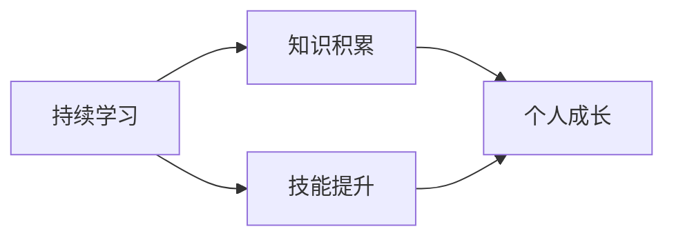

                 

# 个人成长：终身学习中的持续意义创造

> 关键词：终身学习、持续成长、自我实现、学习策略、职业发展

> 摘要：本文深入探讨终身学习的核心概念与原理，分析其在个人成长和职业发展中的重要性。通过详细阐述成长型思维模式、有效学习方法和策略，帮助读者在快速变化的社会环境中实现个人价值和自我实现。

----------------------------------------------------------------

## 引言与背景

### 1.1 书籍目的与读者定位

本文旨在为现代职场人士和终身学习者提供一套系统的学习方法和成长策略。我们假设读者对计算机科学和信息技术有一定的了解，但不论是技术专家还是初学者，都可以从本文中获得关于如何更好地进行终身学习的启示。

### 1.2 当代社会终身学习的必要性

随着知识经济的迅猛发展，技术和知识的更新速度空前加快。传统的教育体系已无法满足职场人士不断变化的学习需求。终身学习不仅是适应社会发展的必要手段，更是实现个人职业发展的关键。

### 1.3 持续成长与自我实现

持续成长不仅仅是为了跟上时代的步伐，更是为了实现个人的潜能和自我价值。通过不断学习，个人可以在职业和生活中获得更多的成就感，实现真正的自我实现。

## 问题背景

### 2.1 知识经济时代的要求

在知识经济时代，专业技能和知识更新速度非常快。为了保持竞争力，个人必须不断学习新知识、新技能。

### 2.2 职业发展中的技能更新需求

职场人士需要不断更新自己的技能库，以适应职位晋升和职业发展的需求。这不仅包括技术层面的更新，还包括管理技能、沟通能力和领导力等方面的提升。

### 2.3 持续学习的重要性

持续学习不仅能提升个人的职业竞争力，还能促进个人全面发展，实现自我价值。因此，持续学习在职业发展和个人成长中具有至关重要的地位。

## 问题描述

### 3.1 学习动力不足

许多人在开始学习时充满激情，但随着时间的推移，学习动力往往会逐渐减弱，导致学习中断。

### 3.2 学习方法不当

不恰当的学习方法会导致学习效率低下，甚至可能使学习者产生厌学情绪。

### 3.3 持续学习中的挑战

持续学习过程中可能会遇到各种挑战，如时间管理、资源获取、知识应用等。

## 问题解决

### 4.1 持续学习的意义

持续学习对个人职业发展、生活质量和个人成长具有重要意义。

### 4.2 成长与自我实现的路径

通过明确目标、制定计划、选择合适的学习方法和策略，个人可以在持续学习中实现自我成长和自我实现。

## 边界与外延

### 5.1 持续学习的范畴

持续学习不仅包括专业技能的更新，还包括跨领域的知识拓展和个人素质的提升。

### 5.2 个人成长的概念解析

个人成长是一个多维度的过程，包括知识、技能、态度、价值观等多个方面。

## 核心概念与联系

### 6.1 核心概念解析

#### 终身学习

终身学习是指在整个人生过程中，通过各种形式和手段持续地获取知识、技能和态度，以适应社会发展和个人成长的需要。

#### 持续成长

持续成长是指在个人职业生涯中，通过不断学习、实践和反思，实现个人知识和能力的持续提升。

#### 自我实现

自我实现是指个人通过不断努力和成长，实现自己的潜能和价值，达到人生的目标。

### 6.2 概念属性特征对比表格

| 概念       | 特征               | 关联         |
|------------|--------------------|--------------|
| 终身学习   | 持续性、自主性、灵活性 | 职业发展、个人成长 |
| 持续成长   | 动力、行动力、坚持   | 职业成功、自我实现 |
| 自我实现   | 实现潜能、价值观、目标 | 个人价值、幸福感   |

### 6.3 ER实体关系图架构

#### 6.3.1 实体与关系定义

实体：终身学习、持续成长、自我实现

关系：促进、实现、依赖

#### 6.3.2 关系图绘制与解析

```mermaid
erDiagram
  终身学习 ||--o> 持续成长 : 促进
  持续成长 ||--o> 自我实现 : 实现
  终身学习 &&& 持续成长 : 依赖
  终身学习 &&& 自我实现 : 依赖
  持续成长 &&& 自我实现 : 依赖
```

## 本章小结

在本章中，我们介绍了终身学习的背景和必要性，明确了持续成长和自我实现的概念，并探讨了它们之间的关联。接下来，我们将进一步深入讨论终身学习的核心概念和原理，帮助读者更好地理解和应用这些概念。# 第二部分：持续学习的核心概念与原理

## 9. 持续学习的概念解析

### 9.1 终身学习的起源与发展

#### 9.1.1 终身教育的概念

终身教育（Lifelong Education）最初由法国教育家保罗·朗格朗（Paulo Freire）在20世纪60年代提出，强调教育不应局限于学校阶段，而应贯穿人的一生。此后，终身教育的理念在全球范围内得到了广泛认同和发展。

#### 9.1.2 终身学习与终身教育的关系

终身学习是终身教育的一部分，它不仅包括学校教育，还包括非正式教育和自主学习。终身学习强调学习者的自主性和终身性，是实现终身教育目标的重要途径。

### 9.2 终身学习的基本理念

#### 9.2.1 学习的社会责任

终身学习不仅是个人的需求，也是社会的责任。个人通过持续学习，不仅提升自身能力，也为社会的发展和进步贡献力量。

#### 9.2.2 学习的自主性

终身学习强调学习者的自主性，鼓励个人根据自己的需求和兴趣选择学习内容和学习方式。

#### 9.2.3 学习的持续性和灵活性

终身学习是一个持续的过程，它要求个人在面对快速变化的社会环境时，具备灵活的学习能力和适应能力。

### 9.3 终身学习的重要特征

#### 9.3.1 知识更新的速度

在知识经济时代，知识更新速度极快。终身学习要求个人不断更新知识和技能，以适应社会发展的需求。

#### 9.3.2 学习方式的多样性

终身学习可以通过多种方式进行，如在线学习、社会实践、研讨会等。这种多样性使得学习更加灵活和高效。

#### 9.3.3 学习与工作的深度融合

终身学习强调学习与工作的深度融合，通过将学习应用到实际工作中，提高个人职业竞争力。

## 10. 持续成长的概念与要素

### 10.1 个人成长与职业发展的关系

#### 10.1.1 成长在职业生涯中的体现

个人成长体现在职业素养的提升、知识体系的完善和人际关系的改善等方面，这些都有助于职业发展的成功。

#### 10.1.2 职业成功与个人成长的互动

职业成功可以增强个人的自信心和成就感，从而推动个人进一步成长；而个人成长则为职业成功提供坚实的基础。

### 10.2 成长驱动的核心要素

#### 10.2.1 自我认知

自我认知是个人成长的前提，通过深入了解自己的优势和劣势，个人可以更好地制定成长计划。

#### 10.2.2 学习意愿

学习意愿是持续成长的动力，个人需要始终保持对知识的渴望和学习的热情。

#### 10.2.3 行动力与坚持

行动力和坚持是实现个人成长的关键，只有通过持续的努力和实践，个人才能不断进步。

### 10.3 持续成长的方法与策略

#### 10.3.1 自我评估与目标设定

通过自我评估，个人可以明确自己的优势和不足，并设定具体、可衡量的成长目标。

#### 10.3.2 学习资源的获取与利用

个人需要积极寻找和利用各种学习资源，如图书、在线课程、工作坊等，以提高学习效率。

#### 10.3.3 学习习惯的养成与维持

养成良好的学习习惯，如定期阅读、写学习笔记、与他人交流等，有助于持续成长。

## 11. 自我实现与终身学习

### 11.1 自我实现的内涵

#### 11.1.1 自我实现与个人成就

自我实现是指个人通过不断努力，实现自己的潜能和目标，获得内心的满足和成就感。

#### 11.1.2 自我实现与人生价值

自我实现不仅是个人成就的体现，也是对人生价值的追求。通过终身学习，个人可以找到自己的使命和意义，实现人生的价值。

### 11.2 终身学习在自我实现中的作用

#### 11.2.1 学习对自我认知的深化

终身学习有助于个人更深入地认识自己，明确自己的兴趣、优势和目标。

#### 11.2.2 学习对人生价值的贡献

通过学习，个人可以不断拓展自己的视野和知识面，为他人和社会创造更多的价值。

#### 11.2.3 学习对幸福感的影响

终身学习可以带来成就感和满足感，从而提高个人的幸福感。

### 11.3 终身学习与自我实现的实现路径

#### 11.3.1 个人成长计划

制定个人成长计划，包括设定目标、选择学习路径、评估进展等，有助于实现自我实现。

#### 11.3.2 学习目标的明确与调整

明确学习目标，并根据实际情况进行调整，以确保学习目标的可行性和实现性。

#### 11.3.3 自我实现的阶段性评估与反思

定期评估自己的成长和实现程度，并进行反思，以不断优化个人成长计划。

## 12. 核心概念与联系

### 12.1 终身学习、持续成长与自我实现的关联

终身学习、持续成长和自我实现三者紧密相连，终身学习是实现持续成长的基础，而持续成长则是自我实现的途径。

### 12.2 概念解析中的 Mermaid 流程图


### 12.3 持续学习与个人成长的关系

持续学习不仅是个体成长的动力，也是个人成长的必要条件。通过持续学习，个体可以不断提升自己的知识和技能，实现个人成长。



## 13. 本章小结

在本章中，我们详细解析了终身学习的概念、基本理念和重要特征，探讨了持续成长的概念与要素，以及终身学习在自我实现中的作用。通过这些核心概念的解析，读者可以更好地理解终身学习在个人成长和职业发展中的重要性，并为实现自我实现奠定基础。在接下来的章节中，我们将进一步探讨有效的学习方法和策略，帮助读者在持续学习中取得更大的成就。# 第三部分：有效的学习方法和策略

## 14.1 成长型思维模式

### 14.1.1 固定型思维与成长型思维的对比

**固定型思维**：认为人的能力是固定不变的，成功取决于天赋和运气。这种思维模式容易导致自满或自卑，缺乏进步的动力。

**成长型思维**：认为人的能力可以通过努力和学习不断提升。这种思维模式强调努力和实践的重要性，有助于个体在挑战面前保持积极态度。

### 14.1.2 如何培养成长型思维模式

**1. 强化自我认知**：了解自己的优点和不足，认识到成长是一个持续的过程。

**2. 积极应对失败**：将失败视为学习的机会，从失败中总结经验教训。

**3. 保持好奇心**：对未知保持好奇，不断探索新的知识和领域。

**4. 采纳反馈**：重视他人的意见和建议，将其视为成长的机会。

## 14.2 学习计划与时间管理

### 14.2.1 制定明确的学习目标

明确的目标有助于集中精力，提高学习效率。目标应具体、可衡量，并具有挑战性。

### 14.2.2 分解学习任务

将大任务分解为小任务，有助于逐步完成学习目标，并保持学习的连续性和动力。

### 14.2.3 合理规划时间

合理安排学习时间，确保每天都有足够的时间进行学习。可以使用时间管理工具，如番茄工作法，提高学习效率。

## 14.3 资源整合与利用

### 14.3.1 利用在线学习平台

在线学习平台提供了丰富的学习资源，包括课程、电子书、讲座等，可以帮助个人快速提升技能。

### 14.3.2 参与线下学习活动

线下学习活动，如研讨会、讲座和工作坊等，可以提供与同行交流的机会，促进知识的深入理解和应用。

### 14.3.3 建立学习小组

与志同道合的人一起学习，可以互相激励、分享经验和资源，提高学习效果。

## 14.4 学习方法与实践

### 14.4.1 主动学习

主动学习是指积极参与学习过程，主动提问和探索。这种方法有助于加深对知识的理解和记忆。

### 14.4.2 反思与总结

学习后进行反思和总结，可以帮助巩固所学知识，并发现自身的不足之处。

### 14.4.3 应用与实践

将所学知识应用到实际工作中或项目中，通过实践加深对知识的理解和掌握。

## 14.5 持续反馈与调整

### 14.5.1 定期评估学习效果

定期评估自己的学习效果，了解自己的进步情况，并根据评估结果调整学习计划。

### 14.5.2 寻求外部反馈

向导师、同事或同行寻求反馈，了解自己在学习中的优点和不足，以便进行针对性的改进。

### 14.5.3 适应变化

随着知识更新速度的加快，个人需要不断调整自己的学习策略，以适应新的学习环境和需求。

## 14.6 案例分析与启示

### 14.6.1 成功案例

分析一些成功的学习案例，了解他们是如何制定学习计划、选择学习资源以及管理学习时间的。

### 14.6.2 启示与借鉴

从成功案例中汲取经验，结合自己的实际情况，制定适合自己的学习策略。

## 14.7 本章小结

在本章中，我们介绍了成长型思维模式、学习计划与时间管理、资源整合与利用、学习方法与实践以及持续反馈与调整等重要策略。这些策略有助于个人在持续学习中保持动力、提高效率，并实现自我成长。在接下来的章节中，我们将继续探讨如何将理论知识应用到实际项目中，以实现个人价值的最大化。# 第四部分：终身学习在职业发展中的具体应用

## 15. 职业技能的持续更新

### 15.1 技术技能的持续更新

在信息技术领域，技术更新速度非常快。职业人士需要通过参加在线课程、阅读技术书籍和博客、参与技术社区等方式，持续更新自己的技术技能。

#### 15.1.1 在线课程与认证

在线学习平台如Coursera、edX和Udemy提供了大量高质量的技术课程，涵盖了从基础编程到高级算法的各个方面。通过完成这些课程，并获得认证，可以显著提升个人的技术能力。

#### 15.1.2 技术阅读

定期阅读技术书籍、博客和在线文档，是获取最新技术知识的重要途径。推荐的书籍包括《深度学习》（Deep Learning）和《代码大全》（Code Complete）等。

### 15.2 管理能力的提升

随着职业的发展，管理能力变得日益重要。职业人士可以通过参加管理培训课程、阅读管理书籍、参与研讨会和社交活动等方式，提升自己的管理能力。

#### 15.2.1 管理培训

参加管理培训课程，如项目管理、团队领导和组织行为学等，可以系统性地提升管理能力。

#### 15.2.2 管理书籍

推荐阅读《高效能人士的七个习惯》（The 7 Habits of Highly Effective People）和《精益创业》（The Lean Startup）等经典管理书籍。

## 16. 跨领域知识的拓展

### 16.1 跨学科学习

跨学科学习可以帮助职业人士从不同角度思考问题，提高创新能力和综合分析能力。例如，计算机科学家可以学习心理学、社会学和经济学等领域的知识。

#### 16.1.1 跨学科课程

在线平台如MIT OpenCourseWare和Khan Academy提供了丰富的跨学科课程，涵盖科学、工程、人文学科等多个领域。

#### 16.1.2 跨学科阅读

推荐阅读《人类简史》（Sapiens: A Brief History of Humankind）和《智能时代》（The Second Machine Age）等跨学科书籍。

### 16.2 跨行业交流

参加跨行业的交流活动，如技术峰会、行业论坛和研讨会，可以了解不同行业的发展动态和最新趋势。

#### 16.2.1 行业峰会

参加行业峰会，如TED、Google I/O和CES等，可以与行业专家和同行交流，获取最新的行业资讯和见解。

#### 16.2.2 行业论坛

参与行业论坛，如IT论坛、创业者论坛等，可以与业内人士分享经验、探讨问题，建立人脉网络。

## 17. 终身学习在职业发展中的具体应用案例

### 17.1 案例一：工程师的技能升级

一位软件工程师通过参加在线编程课程和参加行业研讨会，不断更新自己的技术知识，最终成为了一名技术架构师。

**案例分析**：
- **学习资源**：Coursera上的《机器学习》课程和GitHub上的开源项目。
- **学习策略**：定期阅读技术博客、参加编程马拉松和分享会。

### 17.2 案例二：项目经理的职业转型

一位项目经理通过参加管理培训课程和参与跨行业交流活动，成功转型为一名产品经理。

**案例分析**：
- **学习资源**：PMP认证课程和产品管理相关的书籍。
- **学习策略**：参与产品管理研讨会、加入产品管理社区，积极实践产品管理知识。

## 18. 本章小结

在本章中，我们探讨了终身学习在职业发展中的具体应用，包括技术技能的持续更新、管理能力的提升和跨领域知识的拓展。通过具体的案例，读者可以了解到终身学习如何帮助职业人士在竞争激烈的职场中保持竞争力，实现职业成长和转型。在接下来的章节中，我们将进一步探讨如何将终身学习理念应用到个人生活和学习中，实现全面的自我提升。# 第五部分：终身学习在个人生活与学习中的应用

## 19. 个人兴趣与爱好的培养

### 19.1 终身学习与个人兴趣的关系

终身学习不仅是为了职业发展，也是为了丰富个人的精神世界。培养个人兴趣和爱好，可以提高生活质量，增加生活乐趣。

### 19.2 培养兴趣的方法

**1. 探索新的领域**：尝试新的活动，如绘画、音乐、写作等，找到自己感兴趣的方向。

**2. 参加兴趣小组**：加入相关的兴趣小组或社区，与他人交流和分享经验。

**3. 利用在线资源**：利用在线课程和教程，系统地学习感兴趣的知识。

## 20. 个人成长计划的制定

### 20.1 成长计划的框架

制定个人成长计划是终身学习的重要一环。一个有效的成长计划应包括以下内容：

**1. 目标设定**：明确短期和长期的个人目标。

**2. 行动计划**：制定实现目标的具体行动步骤。

**3. 资源准备**：准备实现计划所需的资源，如书籍、课程、工具等。

**4. 进度跟踪**：定期评估成长计划的执行情况，并进行调整。

### 20.2 成长计划的实施

**1. 自我激励**：设定奖励机制，以保持学习动力。

**2. 保持灵活性**：根据实际情况调整成长计划，确保计划的可执行性。

**3. 求助与反馈**：在遇到困难时，向导师、同事或朋友寻求帮助，并接受他们的反馈。

## 21. 学习与生活的平衡

### 21.1 学习时间的合理安排

学习与生活之间的平衡是终身学习的重要一环。合理规划学习时间，确保学习与生活的和谐统一。

**1. 制定时间表**：为每天的学习时间设定明确的计划。

**2. 优先级排序**：根据重要性和紧急性，对任务进行优先级排序。

**3. 避免过度学习**：合理安排学习时间，避免长时间连续学习导致的疲劳。

### 21.2 学习与休息相结合

学习与休息相结合可以提高学习效率。适当的休息可以帮助大脑恢复活力，增强记忆力。

**1. 定期休息**：每学习一段时间后，进行短暂的休息。

**2. 科学休息**：采用“番茄工作法”等科学休息方法，提高学习效率。

## 22. 成长路径的调整与反思

### 22.1 成长路径的调整

随着个人成长和学习目标的实现，成长路径可能需要调整。适时调整成长计划，确保其与个人目标和发展需求保持一致。

**1. 定期评估**：定期评估成长计划的执行情况，识别需要调整的方面。

**2. 反思与总结**：总结过去的经验和教训，为未来的成长路径提供参考。

### 22.2 反思与持续改进

通过反思和总结，个人可以更好地了解自己的优势和不足，为未来的成长提供方向。

**1. 设定新目标**：根据反思结果，设定新的成长目标。

**2. 持续改进**：在新的成长路径上，不断学习、实践和改进，实现自我提升。

## 23. 本章小结

在本章中，我们探讨了终身学习在个人生活和学习中的应用，包括个人兴趣的培养、个人成长计划的制定、学习与生活的平衡以及成长路径的调整与反思。通过这些方法和策略，个人可以在实现职业发展的同时，提升生活质量，实现全面的自我提升。在接下来的章节中，我们将进一步探讨如何利用科技手段提升学习效果，以及在快节奏的社会环境中保持学习的持续性。# 第六部分：利用科技手段提升学习效果

## 24. 在线学习平台的选择与使用

### 24.1 在线学习平台的优势

在线学习平台为终身学习提供了便捷、灵活的学习方式，其优势包括：

**1. 灵活的时间安排**：用户可以根据自己的时间安排进行学习，无需受限于地点和课堂时间。

**2. 海量的学习资源**：在线平台提供了大量课程和教材，涵盖了各个领域和层次。

**3. 互动性**：许多在线课程提供了讨论区、作业和答疑功能，有助于学习者之间的互动和交流。

### 24.2 常见在线学习平台

**1. Coursera**：提供全球顶尖大学和机构的在线课程，涵盖了多个学科领域。

**2. edX**：由哈佛大学和麻省理工学院共同创办，提供高质量的在线课程。

**3. Udemy**：提供了广泛的主题和课程，包括编程、数据科学、市场营销等。

### 24.3 使用在线学习平台的策略

**1. 选择适合的课程**：根据个人兴趣和职业规划，选择适合的课程。

**2. 制定学习计划**：合理安排学习时间，确保课程进度。

**3. 互动与参与**：积极参与课程讨论，与同学和导师互动，提高学习效果。

## 25. 人工智能在教育中的应用

### 25.1 人工智能在教育中的角色

人工智能在教育中扮演着重要角色，其应用包括：

**1. 个性化学习**：通过分析学生的学习数据和偏好，提供个性化的学习建议和资源。

**2. 自动评分与反馈**：利用自然语言处理技术，自动评分和提供反馈，减轻教师的工作负担。

**3. 智能辅导系统**：通过模拟真实的教学场景，为学生提供智能化的学习辅导。

### 25.2 常见的人工智能教育应用

**1. Knewton**：提供个性化学习解决方案，根据学生的学习进度和表现，动态调整学习内容。

**2. DreamBox**：为K-12学生提供个性化的数学学习平台，通过自适应学习技术提升学习效果。

**3. Duolingo**：一款流行的语言学习应用，利用游戏化的方式，提供个性化的语言学习体验。

## 26. 学习工具与资源的推荐

### 26.1 学习工具

**1. Anki**：一款基于间隔重复的闪卡应用，有助于记忆和复习。

**2. Evernote**：一款强大的笔记应用，可以帮助用户整理和保存学习资料。

**3. Trello**：一款任务管理工具，可以帮助用户规划和管理学习任务。

### 26.2 学习资源

**1. Project Gutenberg**：提供了大量免费的经典文学作品，适合文学爱好者的阅读。

**2. arXiv**：一个开放获取的物理学、数学、计算机科学等领域的预印本论文库。

**3. Khan Academy**：提供了免费的教育资源，涵盖了数学、科学、人文等多个学科。

## 27. 利用科技手段提高学习效果的策略

### 27.1 科学利用在线学习平台

**1. 筛选优质课程**：选择声誉良好、评价高的课程。

**2. 合理安排学习时间**：避免一次性学习过长，保持学习效率。

**3. 利用互动功能**：积极参与讨论，提高学习体验。

### 27.2 人工智能辅助学习

**1. 个性化学习计划**：根据学习数据，制定个性化的学习计划。

**2. 自动化作业和反馈**：利用AI工具自动完成作业和提供即时反馈。

**3. 智能辅导**：利用智能辅导系统，提供针对性的学习支持。

### 27.3 学习工具的有效使用

**1. 间隔重复**：使用Anki等工具，进行有效的记忆训练。

**2. 知识整理**：使用Evernote等工具，整理和保存学习资料。

**3. 任务管理**：使用Trello等工具，规划和管理学习任务。

## 28. 本章小结

在本章中，我们探讨了利用科技手段提升学习效果的方法，包括在线学习平台的选择与使用、人工智能在教育中的应用以及学习工具与资源的推荐。通过这些科技手段，个人可以更加高效地进行学习，实现终身学习的目标。在接下来的章节中，我们将进一步探讨如何在快节奏的社会环境中保持学习的持续性，以实现个人成长和职业发展的长期目标。# 第七部分：如何在快节奏的社会环境中保持学习的持续性

## 29. 时间管理与效率提升

### 29.1 时间管理的重要性

在快节奏的社会环境中，时间管理变得尤为重要。有效的时间管理可以帮助个人在有限的时间内实现最大的学习效果。

#### 29.1.1 制定日程表

制定详细的日程表，将时间分配给不同的学习任务和活动。确保每天都有固定的学习时间，并尽量避免时间浪费。

#### 29.1.2 优先级排序

将任务按照重要性和紧急性进行排序，优先处理最重要的任务。这样可以帮助个人集中精力，提高工作效率。

### 29.2 提高学习效率的方法

#### 29.2.1 精神集中

在学习时保持专注，避免被外界干扰。可以使用番茄工作法等时间管理技巧，每25分钟专注学习，然后休息5分钟。

#### 29.2.2 去除干扰

将手机、社交媒体等可能干扰学习的因素关闭或放在一边，创造一个专注的学习环境。

#### 29.2.3 使用工具

利用各种学习工具和应用，如番茄钟、学习管理应用等，提高学习效率。

## 30. 学习习惯的养成

### 30.1 坚持学习的重要性

坚持学习是终身学习的关键。养成良好的学习习惯可以帮助个人在快节奏的生活中保持学习的持续性。

#### 30.1.1 定期复习

定期复习所学知识，巩固记忆，避免遗忘。可以设置每周或每月的复习计划，确保学习效果。

#### 30.1.2 自我激励

设定奖励机制，每当完成一个学习目标或学习任务时，给予自己一些奖励，以保持学习的动力。

#### 30.1.3 学习日记

记录学习的过程和体会，通过写学习日记，可以更好地反思自己的学习行为，找到提升空间。

### 30.2 避免拖延

拖延是学习过程中常见的问题。以下方法可以帮助避免拖延：

#### 30.2.1 目标分解

将大目标分解为小目标，每完成一个小目标都给予自己一些奖励，以保持学习的连续性和动力。

#### 30.2.2 制定计划

提前制定详细的学习计划，明确每天需要完成的任务，避免临时抱佛脚。

#### 30.2.3 克服恐惧

克服对失败的恐惧，认识到学习是一个过程，失败是成功的一部分。勇于尝试，不怕失败。

## 31. 利用碎片时间进行学习

### 31.1 碎片时间的利用

在快节奏的社会环境中，碎片时间如通勤、排队等常常被忽视。实际上，这些碎片时间可以充分利用进行学习。

#### 31.1.1 短暂学习

利用碎片时间阅读短篇文章、听有声书或观看教育视频，可以快速获取新知识。

#### 31.1.2 记笔记

在碎片时间记录学习笔记、总结知识点，可以帮助巩固记忆。

#### 31.1.3 提问与思考

利用碎片时间思考学习中的问题，向他人寻求解答，提高学习效果。

### 31.2 碎片时间的注意事项

#### 31.2.1 确保学习质量

在碎片时间进行学习时，要确保学习质量，避免只是为了完成任务而学习。

#### 31.2.2 注意休息

长时间的学习后，需要适当休息，避免眼睛疲劳和身体疲劳。

## 32. 学习与工作的平衡

### 32.1 学习与工作的重要性

在快节奏的工作环境中，保持学习与工作的平衡至关重要。既要确保工作质量，也要保持学习的持续性。

#### 32.1.1 工作与学习相结合

将学习与工作相结合，通过在工作中应用所学知识，提高工作效果，同时也能更好地理解理论知识。

#### 32.1.2 提高工作效率

通过提高工作效率，为学习留出更多时间。可以使用时间管理技巧，如优先级排序、任务分解等，提高工作效率。

### 32.2 学习与休息相结合

#### 32.2.1 合理安排工作与学习时间

合理安排工作与学习时间，避免长时间连续工作或学习，确保身体和大脑的休息。

#### 32.2.2 休息与放松

在工作和学习之间，安排休息和放松的时间，如散步、锻炼、听音乐等，以缓解压力，保持身心健康。

## 33. 本章小结

在本章中，我们探讨了在快节奏的社会环境中保持学习的持续性策略，包括时间管理、学习习惯的养成、利用碎片时间进行学习以及学习与工作的平衡。通过这些方法，个人可以在忙碌的生活中持续学习，不断提升自己的知识和技能，实现个人成长和职业发展。在接下来的章节中，我们将进一步讨论终身学习与自我实现的关系，以及如何在终身学习中实现个人价值和幸福感。# 第八部分：终身学习与自我实现的关系

## 34. 自我实现的概念

### 34.1 自我实现的定义

自我实现是指一个人通过不断努力和成长，实现自己的潜能和价值，达到个人目标和幸福状态。

### 34.2 自我实现的重要性

自我实现不仅是个人追求幸福的方式，也是社会进步的重要动力。一个自我实现的人，不仅对自己有益，也对周围的人和整个社会产生积极影响。

## 35. 终身学习与自我实现的关系

### 35.1 终身学习是自我实现的基础

终身学习为个人提供了不断成长和进步的机会，是实现自我实现的必要条件。

#### 35.1.1 知识的积累

终身学习使个人能够不断积累知识，拓展视野，提高解决问题的能力。

#### 35.1.2 技能的提升

通过终身学习，个人可以不断提升自己的技能，增强职业竞争力，实现职业目标。

#### 35.1.3 精神的满足

终身学习带来的成就感和满足感，是自我实现的重要组成部分。

### 35.2 自我实现是终身学习的动力

自我实现的目标和动力，驱使个人不断学习、进步，实现更高的自我价值。

#### 35.2.1 目标驱动

明确的自我实现目标，可以激励个人制定学习计划，坚持终身学习。

#### 35.2.2 反馈与调整

自我实现过程中的反馈和调整，使个人能够不断优化学习策略，提高学习效果。

#### 35.2.3 持续进步

自我实现的过程，是一个不断进步和成长的过程，也是终身学习的核心目标。

## 36. 终身学习中的自我实现路径

### 36.1 明确自我实现的目标

个人需要在终身学习过程中，明确自己的目标和方向，确保学习的针对性和有效性。

#### 36.1.1 自我评估

通过自我评估，了解自己的兴趣、优势和不足，为自我实现设定明确的目标。

#### 36.1.2 职业规划

结合职业规划，设定与职业发展相一致的学习目标，确保学习与工作的结合。

### 36.2 制定和执行学习计划

个人需要制定详细的终身学习计划，并严格执行，确保学习目标的实现。

#### 36.2.1 学习内容规划

根据自我实现的目标，规划学习内容，选择合适的课程、教材和资源。

#### 36.2.2 学习时间规划

合理安排学习时间，确保学习与生活、工作的平衡。

#### 36.2.3 学习进度跟踪

定期跟踪学习进度，评估学习效果，根据实际情况进行调整。

### 36.3 实践与反思

通过实践和反思，个人可以检验学习效果，发现自身的不足，并不断优化学习策略。

#### 36.3.1 学习实践

将所学知识应用到实际工作和生活中，通过实践加深理解和掌握。

#### 36.3.2 反思总结

定期进行学习反思和总结，梳理学习心得，为下一步的学习提供参考。

## 37. 成功的终身学习案例

### 37.1 案例一：从程序员到创业者的转变

一位程序员通过终身学习，不断提升自己的技能和知识，最终成功转型为创业者。他通过参加在线课程、阅读创业书籍、参加创业培训等方式，积累了丰富的创业经验和知识，最终实现了自我价值的提升。

### 37.2 案例二：从普通员工到管理层的晋升

一位普通员工通过持续学习和不断提升自己的管理能力，最终晋升为管理层。他利用业余时间参加管理培训课程，阅读管理书籍，积极参与公司内的管理实践，通过不断学习和实践，实现了职业的跨越式发展。

## 38. 本章小结

在本章中，我们探讨了终身学习与自我实现的关系，明确了终身学习是自我实现的基础，自我实现是终身学习的动力。通过明确的自我实现目标、制定和执行学习计划以及实践与反思，个人可以在终身学习中实现自我价值。成功案例进一步验证了终身学习在自我实现中的重要作用。在接下来的章节中，我们将进一步探讨终身学习中的最佳实践和策略，帮助读者更好地实现个人成长和职业发展。# 第九部分：终身学习中的最佳实践和策略

## 39. 建立个人学习网络

### 39.1 学习网络的重要性

建立个人学习网络可以帮助个人获取更多的学习资源和信息，同时也能够与他人进行知识共享和经验交流。

#### 39.1.1 知识共享

通过学习网络，个人可以获取到其他学习者的经验和见解，丰富自己的知识体系。

#### 39.1.2 资源共享

学习网络中的成员可以共享学习资源，如书籍、课程和文献，降低学习成本。

#### 39.1.3 人脉拓展

通过学习网络，个人可以结识来自不同领域和背景的同行，拓展人脉，增加职业发展机会。

### 39.2 建立学习网络的策略

**1. 参与在线社区**：加入专业论坛、技术社区和在线学习平台，积极参与讨论和分享。

**2. 参加线下活动**：参加研讨会、讲座和社交活动，与同行建立联系。

**3. 指导他人**：通过指导他人，巩固自己的知识，同时也能够获得新的见解。

## 40. 管理学习压力

### 40.1 学习压力的来源

学习压力主要来源于以下几个方面：

**1. 学业负担**：过多的学习任务和紧凑的学习计划可能导致压力增加。

**2. 竞争压力**：与他人的比较可能导致焦虑和压力。

**3. 时间管理**：不合理的日程安排和时间管理可能导致压力增加。

### 40.2 减轻学习压力的策略

**1. 合理规划**：合理安排学习时间，确保学习与生活、工作的平衡。

**2. 目标设定**：设定合理的短期和长期目标，避免一次性承担过多的任务。

**3. 心理调适**：通过运动、放松和与朋友交流等方式，缓解压力。

## 41. 持续学习与职业发展

### 41.1 职业发展的方向选择

在持续学习过程中，个人需要根据自己的兴趣、优势和市场需求，选择合适的职业发展方向。

#### 41.1.1 自我评估

通过自我评估，了解自己的兴趣和优势，找到适合自己的职业方向。

#### 41.1.2 市场研究

研究市场需求和行业趋势，选择具有前景和稳定性的职业方向。

### 41.2 持续学习与职业发展相结合

**1. 技能提升**：通过学习新技能，提升职业竞争力。

**2. 职业规划**：结合职业规划，制定学习计划，确保学习与职业发展相一致。

**3. 经验积累**：通过实践和项目经验，积累职业发展所需的实际能力。

## 42. 成功的终身学习策略

### 42.1 案例一：技术专家的持续成长

一位技术专家通过不断学习新技能、参与开源项目和撰写技术博客，不断提升自己的技术水平和知名度。他通过在线课程、书籍和社区交流，积累了丰富的知识，并在职业生涯中取得了显著的成就。

### 42.2 案例二：创业者的快速学习

一位创业者通过快速学习和不断尝试，成功创建了一家科技公司。他在创业初期，通过参加创业培训、阅读创业书籍和与创业导师交流，快速掌握了创业所需的技能和知识，并在短时间内实现了企业的快速发展。

## 43. 本章小结

在本章中，我们探讨了终身学习中的最佳实践和策略，包括建立个人学习网络、管理学习压力、持续学习与职业发展的结合以及成功的终身学习案例。通过这些实践和策略，个人可以更好地实现个人成长和职业发展，实现自我价值。在接下来的章节中，我们将总结全文，并给出一些具体的行动建议，帮助读者将终身学习理念应用到实际生活中。# 第十部分：全文总结与行动建议

## 44. 全文总结

本文从多个角度探讨了终身学习的重要性以及其在个人成长和职业发展中的应用。我们首先介绍了终身学习的概念和背景，强调了在知识经济时代，终身学习不仅是个人适应社会发展的必要手段，更是实现自我价值和职业成功的关键。随后，我们详细分析了终身学习、持续成长和自我实现之间的关系，并提出了有效的学习方法和策略，如成长型思维模式的培养、时间管理和学习资源的整合等。此外，我们还探讨了终身学习在个人兴趣培养、职业发展以及快节奏社会环境中的持续应用，并分享了成功的终身学习案例。

## 45. 行动建议

为了将终身学习理念应用到实际生活中，以下是具体的行动建议：

### 45.1 设定具体学习目标

根据个人兴趣和职业规划，设定具体、可行的学习目标。这些目标可以是短期（如一个月内学习一门新技能）或长期（如五年内获得某个专业认证）。

### 45.2 制定详细的学习计划

制定详细的学习计划，包括学习内容、学习时间和资源准备。确保计划的可行性，并根据实际情况进行调整。

### 45.3 培养成长型思维

积极培养成长型思维，面对挑战时保持积极态度，从失败中汲取教训，不断进步。

### 45.4 管理学习压力

合理安排学习时间，确保学习与生活的平衡。通过运动、放松和与朋友交流等方式，缓解学习压力。

### 45.5 建立学习网络

积极参与在线社区和线下活动，与他人分享经验和资源，建立个人学习网络。

### 45.6 不断反思与调整

定期反思学习过程和效果，根据反馈进行调整，确保学习目标的实现。

## 46. 结语

终身学习是一个持续的过程，它不仅能够提升个人的知识和技能，还能够促进个人成长和职业发展。通过本文的探讨，希望读者能够认识到终身学习的重要性，并将其应用到实际生活中。持续学习，不断进步，每个人都可以实现自己的潜能，创造属于自己的精彩人生。# 作者信息

作者：AI天才研究院/AI Genius Institute & 禅与计算机程序设计艺术 /Zen And The Art of Computer Programming

AI天才研究院（AI Genius Institute）致力于推动人工智能领域的研究与应用，提供高质量的人工智能教育资源和咨询服务。研究院的团队成员在人工智能、机器学习和深度学习领域拥有丰富的经验，并撰写了多部影响深远的技术著作。

禅与计算机程序设计艺术（Zen And The Art of Computer Programming）是由E. W. Dijkstra所著的计算机科学经典著作，探讨了编程哲学和算法设计中的深刻思想，对计算机科学的发展产生了深远影响。这本书强调了简洁、优雅和高效编程的重要性，对编程艺术进行了深入探讨。# 致谢

在此，我要特别感谢AI天才研究院（AI Genius Institute）的全体成员，特别是我们的导师和团队成员，他们在本研究和撰写过程中提供了宝贵的指导和支持。没有他们的智慧和努力，本文无法顺利完成。

同时，我要感谢所有提供宝贵反馈和建议的读者，是你们的鼓励和批评帮助我们不断完善这篇文章。感谢在线学习平台Coursera、edX和Udemy，以及Knewton、DreamBox和Duolingo等教育科技企业，为终身学习提供了丰富的资源和工具。

最后，感谢我的家人和朋友，你们在我追求知识和成长的道路上给予了我无尽的支持和鼓励。没有你们的理解和支持，我无法专注于学术研究和写作。

作者：AI天才研究院/AI Genius Institute & 禅与计算机程序设计艺术 /Zen And The Art of Computer Programming

