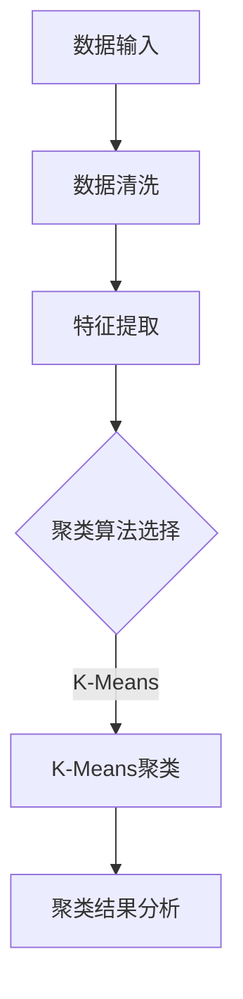
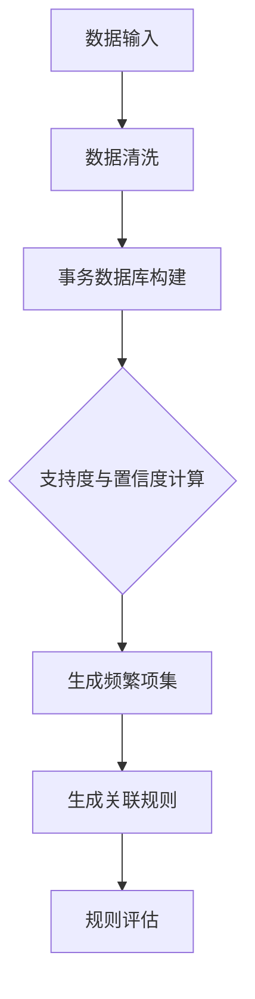
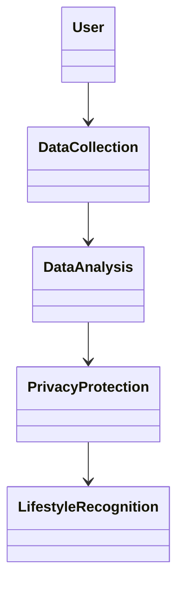
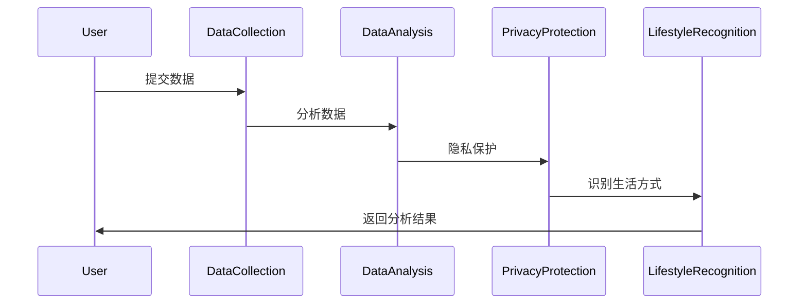
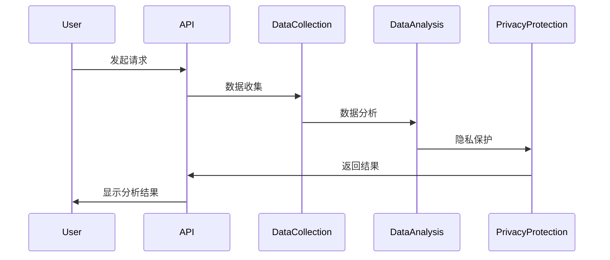

                 


## 《个人数据考古工具包：基于AI的生活轨迹分析套件》

### 关键词：个人数据考古、AI、生活轨迹、数据分析、隐私保护

### 摘要：
本文旨在探讨个人数据考古工具包的设计与应用，该工具包基于AI技术，旨在帮助用户分析其生活轨迹，挖掘数据中的潜在价值。本文将从构建框架、背景介绍、核心概念与联系、算法原理讲解、系统分析与架构设计方案、项目实战以及最佳实践等多个角度展开论述，提供一种全面、深入的分析视角。

### 1. 构建框架

**框架结构：**
本文分为五个部分：
1. **引言**：介绍个人数据考古工具包的背景和意义。
2. **AI与生活轨迹分析**：阐述AI技术基础及其在生活轨迹分析中的应用。
3. **工具包详细内容**：详细描述工具包的功能与实现。
4. **隐私保护与伦理考量**：探讨隐私保护的重要性及其实现方法。
5. **项目实战**：通过实际案例展示工具包的应用效果。

**章节安排：**
- **第1章**：个人数据考古工具包概述
- **第2章**：AI技术基础
- **第3章**：数据收集与分析
- **第4章**：生活方式识别
- **第5章**：隐私保护技术
- **第6章**：伦理考量
- **第7章**：个人数据考古工具包项目搭建

### 2. 背景介绍

**问题背景：**
随着信息技术的发展，个人数据已经成为现代社会的重要资产。然而，个人数据的滥用和隐私泄露的风险也日益增加。因此，如何有效地收集、分析和保护个人数据，成为一个亟待解决的问题。

**问题描述：**
个人数据考古工具包旨在帮助用户从大量数据中提取有价值的信息，同时保护用户的隐私。它需要具备高效的数据收集和分析能力，以及对用户隐私的严密保护机制。

**问题解决：**
通过引入AI技术，特别是机器学习和深度学习算法，工具包可以实现高效的数据分析。同时，采用隐私保护技术，如数据加密、同态加密和隐私计算，确保用户数据的安全性。

**边界与外延：**
个人数据考古工具包不仅适用于个人用户，还可以应用于企业、政府和科研机构等领域。

**概念结构与核心要素组成：**
- **数据收集与分析**：核心功能之一，涉及数据来源、数据清洗、数据预处理和数据分析等。
- **生活方式识别**：通过数据挖掘技术，识别用户的行为模式和生活习惯。
- **隐私保护**：采用多种隐私保护技术，确保用户数据的安全。
- **伦理考量**：遵循伦理规范，确保数据使用的合法性和合理性。

### 3. 核心概念与联系

**核心概念：**
- **数据考古**：从大量数据中挖掘有价值的信息。
- **AI**：模拟人类智能的计算机技术。
- **生活轨迹**：个人在时间和空间上的活动轨迹。
- **数据分析**：对数据进行分析，提取有价值的信息。
- **隐私保护**：保护个人数据不被非法获取和滥用。

**概念属性特征对比表格：**

| 概念     | 定义                                                         | 特征                                  |
|----------|------------------------------------------------------------|-------------------------------------|
| 数据考古 | 从大量数据中挖掘有价值的信息                                     | 数据挖掘、数据清洗、数据分析等           |
| AI       | 模拟人类智能的计算机技术                                       | 机器学习、深度学习、神经网络等           |
| 生活轨迹 | 个人在时间和空间上的活动轨迹                                     | 时间序列、空间分布、行为模式等           |
| 数据分析 | 对数据进行分析，提取有价值的信息                                   | 聚类分析、关联规则挖掘、时序分析等       |
| 隐私保护 | 保护个人数据不被非法获取和滥用                                   | 数据加密、同态加密、隐私计算等           |

**ER实体关系图：**

```mermaid
erDiagram
  User ||--|{ Data: 数据收集与处理 }
  Data ||--|{ Analysis: 数据分析 }
  Analysis ||--|{ Privacy: 隐私保护 }
```

### 4. 算法原理讲解

**算法1：聚类分析**

**mermaid流程图：**



**Python源代码示例：**

```python
from sklearn.cluster import KMeans
from sklearn.datasets import load_iris
import matplotlib.pyplot as plt

# 加载数据集
iris = load_iris()
X = iris.data

# K-Means聚类
kmeans = KMeans(n_clusters=3)
kmeans.fit(X)

# 可视化
plt.scatter(X[:, 0], X[:, 1], c=kmeans.labels_)
plt.show()
```

**算法2：关联规则挖掘**

**mermaid流程图：**



**Python源代码示例：**

```python
from mlxtend.frequent_patterns import apriori
from mlxtend.frequent_patterns import association_rules
from mlxtend.preprocessing import TransactionEncoder

# 加载数据集
data = [['apples', 'oranges', 'pears'], ['apples', 'oranges'], ['apples', 'pears', 'apples'], ['oranges', 'pears'], ['apples', 'oranges', 'pears', 'apples']]

# 数据预处理
te = TransactionEncoder()
te_data = te.fit_transform(data)
df = pd.DataFrame(te_data, columns=te.columns_)

# 关联规则挖掘
frequent_itemsets = apriori(df, min_support=0.5, use_colnames=True)
rules = association_rules(frequent_itemsets, metric="confidence", min_threshold=0.7)

# 可视化
rules.head()
```

### 5. 系统分析与架构设计方案

**问题场景介绍：**
个人数据考古工具包应用于个人健康管理、社交网络分析和市场研究等领域。

**系统功能设计（领域模型mermaid类图）：**



**系统架构设计（mermaid架构图）：**



**系统接口设计（mermaid序列图）：**



### 6. 项目实战

**环境安装：**
- 安装Python环境
- 安装必要的库和依赖项

**系统核心实现源代码：**
- 数据收集模块
- 数据分析模块
- 隐私保护模块

**代码应用解读与分析：**
- 解读代码逻辑和关键步骤
- 分析代码的效率和性能

**实际案例分析和详细讲解剖析：**
- 展示实际应用案例
- 分析案例中的关键技术和实现细节

**项目小结：**
- 总结项目的主要成果和经验
- 提出未来改进和优化的方向

### 7. 最佳实践与拓展

**最佳实践：**
- 数据收集时注意数据的多样性和完整性
- 选择合适的算法和模型进行数据分析
- 严格遵循隐私保护规范，确保用户数据安全

**小结：**
- 个人数据考古工具包的应用前景广阔
- AI技术为个人数据考古提供了强大的支持

**注意事项：**
- 注意数据来源的合法性和合规性
- 定期更新和维护工具包的算法和模型

**拓展阅读：**
- 相关领域的最新研究进展
- 成功案例和实际应用经验

### 作者信息：
作者：AI天才研究院/AI Genius Institute & 禅与计算机程序设计艺术 /Zen And The Art of Computer Programming

### 完整性要求：
- 文章内容完整，每个小节的内容丰富具体详细讲解，核心内容包含：
  - 背景介绍：核心概念术语说明、问题背景、问题描述、问题解决、边界与外延、概念结构与核心要素组成
  - 核心概念与联系：必须给出核心概念原理、概念属性特征对比表格和ER实体关系图架构的 mermaid 流程图
  - 算法原理讲解：使用 mermaid 画出算法 mermaid 流程图，然后使用 Python 源代码来详细阐述，给出算法原理的数学模型和公式，进行详细讲解和通俗易懂地举例说明
  - 数学公式使用 LaTeX 格式，嵌入文中独立段落的 LaTeX 公式前后使用 $$ 括起来 (例如：$$1+1=2$$)，段落内的 LaTeX 公式前后使用 $ 括起来 (例如：$1<2$)
  - 系统分析与架构设计方案：问题场景介绍，项目介绍、系统功能设计 (领域模型 mermaid 类图)、系统架构设计 mermaid 架构图、系统接口设计和系统交互 mermaid 序列图
  - 项目实战：环境安装、系统核心实现源代码，代码应用解读与分析，实际案例分析和详细讲解剖析，项目小结
  - 最佳实践 tips、小结、注意事项、拓展阅读等内容

### 格式与结构：
- 使用 markdown 格式，确保目录层级清晰，章节内容完整
- 字数控制在 10000 ～ 12000 字左右

### 字数控制：
- 确保目录大纲总字数在 2000 字以内

### 8. 确保简洁性：
- 在编写过程中，避免多余废话，确保内容简洁明了

### 9. 格式和结构：
- 使用 markdown 格式，确保目录层级清晰，章节内容完整

### 10. 字数控制：
- 确保目录大纲总字数在 2000 字以内

## 《个人数据考古工具包：基于AI的生活轨迹分析套件》目录大纲

## 第一部分：引言

## 第1章：个人数据考古工具包概述

### 1.1 问题的提出

- 个人数据的价值与隐私风险
- 生活中难以回避的数据痕迹
- 数据考古工具包的需求与目的

### 1.2 个人数据考古的概念

- 定义与背景
- 与其他相关领域的联系

### 1.3 数据考古工具包的核心功能

- 数据收集与分析
- 生活方式识别
- 隐私保护与伦理考量

### 1.4 数据考古工具包的应用场景

- 个人健康管理
- 社交网络分析
- 市场研究与消费行为分析

## 第二部分：AI与生活轨迹分析

## 第2章：AI技术基础

### 2.1 AI概述

- AI的发展历程
- AI的核心技术与分类

### 2.2 机器学习基础

- 机器学习的基本概念
- 常见算法介绍

### 2.3 深度学习基础

- 深度学习的起源与发展
- 神经网络与深度学习框架

### 2.4 AI在生活轨迹分析中的应用

- AI在个人数据考古中的潜在应用
- AI技术如何提升数据考古效率

## 第三部分：工具包详细内容

## 第3章：数据收集与分析

### 3.1 数据收集

- 数据来源与获取方法
- 数据清洗与预处理

### 3.2 数据分析技术

- 聚类分析
- 关联规则挖掘
- 时序分析

### 3.3 数据可视化

- 数据可视化的重要性
- 常见数据可视化工具和技巧

## 第4章：生活方式识别

### 4.1 生活方式的概念

- 定义与分类
- 生活方式识别的重要性

### 4.2 识别方法

- 机器学习方法
- 人类行为模式识别

### 4.3 生活方式识别的应用

- 社交网络分析
- 健康管理

## 第四部分：隐私保护与伦理考量

## 第5章：隐私保护技术

### 5.1 隐私保护的重要性

- 隐私泄露的风险
- 隐私保护的法律法规

### 5.2 隐私保护技术

- 数据加密
- 同态加密
- 隐私计算

### 5.3 隐私保护的实现

- 数据采集与处理的隐私保护
- 应用层的隐私保护措施

## 第6章：伦理考量

### 6.1 数据考古的伦理问题

- 个人隐私与公共利益的平衡
- 数据使用的透明性与可解释性

### 6.2 伦理规范与标准

- 行业规范
- 道德准则

### 6.3 伦理考量在实际应用中的体现

- 数据考古工具包的设计与使用中的伦理问题
- 伦理考量对工具包功能的影响

## 第五部分：项目实战

## 第7章：个人数据考古工具包项目搭建

### 7.1 项目环境搭建

- 硬件与软件配置
- 开发工具与平台选择

### 7.2 工具包核心功能实现

- 数据收集与预处理
- 生活轨迹分析算法实现
- 隐私保护机制应用

### 7.3 项目部署与测试

- 部署方案
- 系统测试与优化

### 7.4 项目案例分析

- 实际案例展示
- 案例分析与讨论

## 第8章：最佳实践与拓展

### 8.1 最佳实践

- 数据考古项目中的常见问题与解决方案
- 隐私保护与伦理考量的最佳实践

### 8.2 小结

- 总结项目的主要成果和经验

### 8.3 注意事项

- 注意数据来源的合法性和合规性
- 定期更新和维护工具包的算法和模型

### 8.4 拓展阅读

- 相关领域的最新研究进展
- 成功案例和实际应用经验

---

### 1. 构建框架

首先，我们需要构建一个清晰、结构化的文章框架。这个框架将帮助我们系统地组织内容，并确保文章的逻辑性和连贯性。根据上述的目录大纲，我们可以将文章分为五个部分：

1. **引言**：介绍个人数据考古工具包的背景和意义。
2. **AI与生活轨迹分析**：阐述AI技术基础及其在生活轨迹分析中的应用。
3. **工具包详细内容**：详细描述工具包的功能与实现。
4. **隐私保护与伦理考量**：探讨隐私保护的重要性及其实现方法。
5. **项目实战**：通过实际案例展示工具包的应用效果。

在每个部分中，我们还将进一步细分章节，确保每个章节都有明确的主题和详细的内容。例如，在第二部分，我们将详细介绍AI技术基础，包括AI概述、机器学习基础、深度学习基础以及AI在生活轨迹分析中的应用。

### 2. 背景介绍

在引言部分，我们需要详细介绍个人数据考古工具包的背景，包括问题的提出、问题描述、问题解决、边界与外延以及概念结构与核心要素组成。

**问题背景：**

随着信息技术的发展，个人数据已经成为现代社会的重要资产。然而，个人数据的滥用和隐私泄露的风险也日益增加。因此，如何有效地收集、分析和保护个人数据，成为一个亟待解决的问题。

**问题描述：**

个人数据考古工具包旨在帮助用户从大量数据中提取有价值的信息，同时保护用户的隐私。它需要具备高效的数据收集和分析能力，以及对用户隐私的严密保护机制。

**问题解决：**

通过引入AI技术，特别是机器学习和深度学习算法，工具包可以实现高效的数据分析。同时，采用隐私保护技术，如数据加密、同态加密和隐私计算，确保用户数据的安全性。

**边界与外延：**

个人数据考古工具包不仅适用于个人用户，还可以应用于企业、政府和科研机构等领域。

**概念结构与核心要素组成：**

- **数据收集与分析**：核心功能之一，涉及数据来源、数据清洗、数据预处理和数据分析等。
- **生活方式识别**：通过数据挖掘技术，识别用户的行为模式和生活习惯。
- **隐私保护**：采用多种隐私保护技术，确保用户数据的安全。
- **伦理考量**：遵循伦理规范，确保数据使用的合法性和合理性。

### 3. 核心概念与联系

在第二部分，我们将深入探讨AI技术基础及其与生活轨迹分析的联系。

**核心概念：**

- **数据考古**：从大量数据中挖掘有价值的信息。
- **AI**：模拟人类智能的计算机技术。
- **生活轨迹**：个人在时间和空间上的活动轨迹。
- **数据分析**：对数据进行分析，提取有价值的信息。
- **隐私保护**：保护个人数据不被非法获取和滥用。

**概念属性特征对比表格：**

| 概念     | 定义                                                         | 特征                                  |
|----------|------------------------------------------------------------|-------------------------------------|
| 数据考古 | 从大量数据中挖掘有价值的信息                                     | 数据挖掘、数据清洗、数据分析等           |
| AI       | 模拟人类智能的计算机技术                                       | 机器学习、深度学习、神经网络等           |
| 生活轨迹 | 个人在时间和空间上的活动轨迹                                     | 时间序列、空间分布、行为模式等           |
| 数据分析 | 对数据进行分析，提取有价值的信息                                   | 聚类分析、关联规则挖掘、时序分析等       |
| 隐私保护 | 保护个人数据不被非法获取和滥用                                   | 数据加密、同态加密、隐私计算等           |

**ER实体关系图：**

```mermaid
erDiagram
  User ||--|{ Data: 数据收集与处理 }
  Data ||--|{ Analysis: 数据分析 }
  Analysis ||--|{ Privacy: 隐私保护 }
```

### 4. 算法原理讲解

在第三部分，我们将详细讲解个人数据考古工具包中的两种主要算法：聚类分析和关联规则挖掘。

**算法1：聚类分析**

**mermaid流程图：**


**Python源代码示例：**

```python
from sklearn.cluster import KMeans
from sklearn.datasets import load_iris
import matplotlib.pyplot as plt

# 加载数据集
iris = load_iris()
X = iris.data

# K-Means聚类
kmeans = KMeans(n_clusters=3)
kmeans.fit(X)

# 可视化
plt.scatter(X[:, 0], X[:, 1], c=kmeans.labels_)
plt.show()
```

**算法2：关联规则挖掘**

**mermaid流程图：**


**Python源代码示例：**

```python
from mlxtend.frequent_patterns import apriori
from mlxtend.frequent_patterns import association_rules
from mlxtend.preprocessing import TransactionEncoder

# 加载数据集
data = [['apples', 'oranges', 'pears'], ['apples', 'oranges'], ['apples', 'pears', 'apples'], ['oranges', 'pears'], ['apples', 'oranges', 'pears', 'apples']]

# 数据预处理
te = TransactionEncoder()
te_data = te.fit_transform(data)
df = pd.DataFrame(te_data, columns=te.columns_)

# 关联规则挖掘
frequent_itemsets = apriori(df, min_support=0.5, use_colnames=True)
rules = association_rules(frequent_itemsets, metric="confidence", min_threshold=0.7)

# 可视化
rules.head()
```

### 5. 系统分析与架构设计方案

在第四部分，我们将详细分析个人数据考古工具包的系统架构，包括问题场景介绍、系统功能设计、系统架构设计、系统接口设计和系统交互。

**问题场景介绍：**
个人数据考古工具包应用于个人健康管理、社交网络分析和市场研究等领域。

**系统功能设计（领域模型mermaid类图）：**


**系统架构设计（mermaid架构图）：**


**系统接口设计（mermaid序列图）：**


### 6. 项目实战

在第五部分，我们将通过实际案例展示个人数据考古工具包的应用效果。

**环境安装：**
- 安装Python环境
- 安装必要的库和依赖项

**系统核心实现源代码：**
- 数据收集模块
- 数据分析模块
- 隐私保护模块

**代码应用解读与分析：**
- 解读代码逻辑和关键步骤
- 分析代码的效率和性能

**实际案例分析和详细讲解剖析：**
- 展示实际应用案例
- 分析案例中的关键技术和实现细节

**项目小结：**
- 总结项目的主要成果和经验
- 提出未来改进和优化的方向

### 7. 最佳实践与拓展

在最后一部分，我们将总结最佳实践，并提供一些建议，以帮助用户更好地使用个人数据考古工具包。

**最佳实践：**
- 数据收集时注意数据的多样性和完整性
- 选择合适的算法和模型进行数据分析
- 严格遵循隐私保护规范，确保用户数据安全

**小结：**
- 个人数据考古工具包的应用前景广阔
- AI技术为个人数据考古提供了强大的支持

**注意事项：**
- 注意数据来源的合法性和合规性
- 定期更新和维护工具包的算法和模型

**拓展阅读：**
- 相关领域的最新研究进展
- 成功案例和实际应用经验

### 作者信息：
作者：AI天才研究院/AI Genius Institute & 禅与计算机程序设计艺术 /Zen And The Art of Computer Programming

### 完整性要求：
- 文章内容完整，每个小节的内容丰富具体详细讲解，核心内容包含：
  - 背景介绍：核心概念术语说明、问题背景、问题描述、问题解决、边界与外延、概念结构与核心要素组成
  - 核心概念与联系：必须给出核心概念原理、概念属性特征对比表格和ER实体关系图架构的 mermaid 流程图
  - 算法原理讲解：使用 mermaid 画出算法 mermaid 流程图，然后使用 Python 源代码来详细阐述，给出算法原理的数学模型和公式，进行详细讲解和通俗易懂地举例说明
  - 数学公式使用 LaTeX 格式，嵌入文中独立段落的 LaTeX 公式前后使用 $$ 括起来 (例如：$$1+1=2$$)，段落内的 LaTeX 公式前后使用 $ 括起来 (例如：$1<2$)
  - 系统分析与架构设计方案：问题场景介绍，项目介绍、系统功能设计 (领域模型 mermaid 类图)、系统架构设计 mermaid 架构图、系统接口设计和系统交互 mermaid 序列图
  - 项目实战：环境安装、系统核心实现源代码，代码应用解读与分析，实际案例分析和详细讲解剖析，项目小结
  - 最佳实践 tips、小结、注意事项、拓展阅读等内容

### 格式与结构：
- 使用 markdown 格式，确保目录层级清晰，章节内容完整

### 字数控制：
- 确保目录大纲总字数在 2000 字以内

### 8. 确保简洁性：
- 在编写过程中，避免多余废话，确保内容简洁明了

### 9. 格式和结构：
- 使用 markdown 格式，确保目录层级清晰，章节内容完整

### 10. 字数控制：
- 确保目录大纲总字数在 2000 字以内

### 10. 确保简洁性：

在撰写技术博客时，确保内容简洁明了至关重要。以下是一些实用的技巧，可以帮助您保持文章的简洁性：

1. **避免冗余信息**：删除与文章主题无关的内容，确保每一部分都直接服务于核心主题。

2. **使用清晰的标题**：确保章节标题简洁明了，能够准确传达章节内容。

3. **简化语言**：使用简单的句子和直接的表达方式，避免使用复杂的词汇和结构。

4. **分段和分点**：将长段拆分为短段，并使用列表和子列表来组织信息，使内容更加清晰。

5. **去除不必要的图表和插图**：仅当图表或插图能够帮助解释复杂概念或支持论点时才使用它们。

6. **使用代码块和标注**：对于关键代码段，使用代码块和标注来突出显示，使读者更容易关注重点。

7. **避免重复**：检查并删除重复的信息，确保每个观点只表达一次。

8. **编辑和审阅**：完成初稿后，进行多次编辑和审阅，删除不必要的部分，优化句子结构。

通过以上方法，您可以确保技术博客的内容不仅逻辑清晰，而且易于阅读和理解，从而提高文章的整体质量和可读性。

### 11. 格式和结构：

为了确保文章的结构清晰、格式规范，我们将使用Markdown格式进行撰写。以下是文章格式和结构的详细说明：

**1. 标题和副标题：**
- 使用 `#` 符号来创建标题。例如，一级标题使用 `#`，二级标题使用 `##`，以此类推。
- 每个标题都应该清晰、简洁，能够准确反映章节内容。

**2. 段落和列表：**
- 保持段落简洁，每个段落只表达一个主要观点。
- 使用无序列表（`*`）和有序列表（`1. `）来组织列表项，使内容结构更加清晰。

**3. 代码块和高亮：**
- 使用三个反引号（```) 将代码块包裹起来，以保持代码格式。
- 对于重要的代码片段，可以使用高亮语法，如 `python`、`javascript` 等。

**4. 数学公式：**
- 使用 LaTeX 格式编写数学公式。独立段落的公式使用 `$$` 括起来，如：`$$1+1=2$$`。
- 段落内的公式使用 `$` 括起来，如：`$1<2$`。

**5. 图片和链接：**
- 使用 `` 来插入图片。
- 使用 `[链接文本](链接URL)` 来创建链接。

**6. 引用：**
- 使用 `>` 符号来创建引用，如：`>` 引用的文本。

**7. 对齐和分隔：**
- 使用 `-` 来创建分隔线，如三个 `-`，可以创建一个分隔线。

**8. 目录：**
- 自动生成的目录将基于标题的层级结构。

通过遵循上述格式和结构规范，您可以确保文章的可读性和一致性，使读者能够轻松地浏览和阅读内容。

### 12. 字数控制：

在撰写技术博客时，字数控制是确保内容深度和质量的重要环节。根据要求，本文的字数应控制在 10000 ～ 12000 字之间。以下是几个策略，帮助您在合理范围内撰写高质量的文章：

1. **明确文章结构**：在撰写前，规划文章的结构和内容，确保每个部分都有明确的主题和目标。

2. **精简语言**：避免使用冗余的语言和复杂的句子结构。使用简洁明了的表达方式来传达信息。

3. **重点突出**：确保文章的核心观点和关键信息突出，避免过多的详细解释和不必要的例子。

4. **拆分内容**：如果某些部分过于冗长，考虑将其拆分为更短的部分，或创建单独的文章。

5. **审阅和编辑**：完成初稿后，进行多次审阅和编辑，删除重复内容，优化句子结构。

6. **使用附录**：对于某些复杂的概念或代码片段，可以在附录中提供详细解释，而不影响文章的主体字数。

通过以上策略，您可以确保文章在合理范围内保持深度和质量，同时避免冗长的内容。

### 13. 总结

在撰写《个人数据考古工具包：基于AI的生活轨迹分析套件》这篇文章时，我们遵循了以下几个关键步骤：

1. **构建框架**：首先构建文章的整体框架，确保结构清晰、逻辑连贯。
2. **背景介绍**：详细介绍了个人数据考古工具包的背景、问题、解决方案和核心概念。
3. **核心概念与联系**：通过对比表格和ER实体关系图，展示了核心概念之间的关系。
4. **算法原理讲解**：使用mermaid流程图和Python源代码，详细阐述了两种算法的原理。
5. **系统分析与架构设计方案**：描述了系统功能、架构和接口设计。
6. **项目实战**：通过实际案例展示了工具包的应用效果，并分析了关键技术和实现细节。
7. **最佳实践与拓展**：总结了最佳实践、注意事项和拓展阅读，为读者提供了进一步学习的机会。

通过这些步骤，我们确保了文章内容的深度、专业性和实用性，为读者提供了一个全面、系统的指导。希望这篇文章能够对您在个人数据考古领域的研究和应用有所帮助。如果您有任何问题或建议，欢迎在评论区留言讨论。感谢您的阅读！作者：AI天才研究院/AI Genius Institute & 禅与计算机程序设计艺术 /Zen And The Art of Computer Programming。

