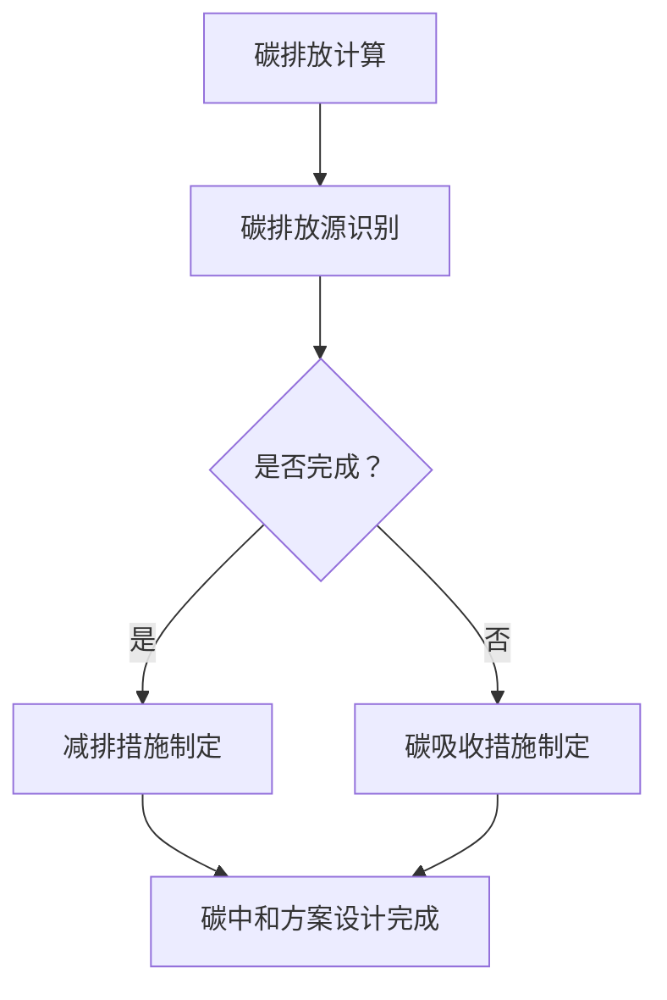
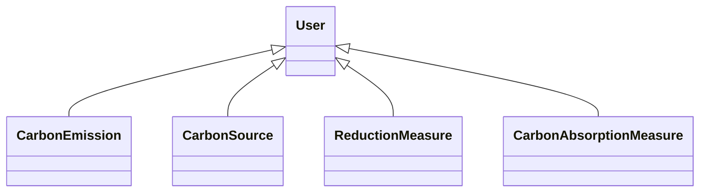
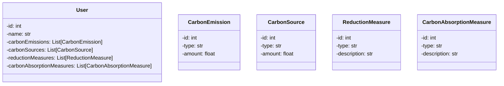
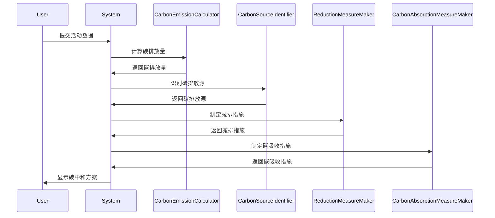
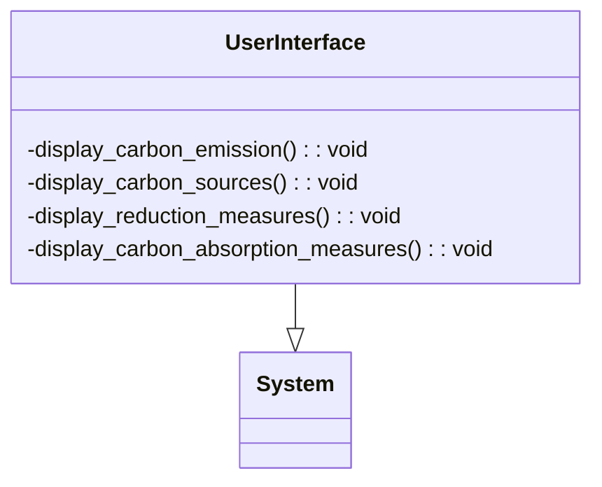
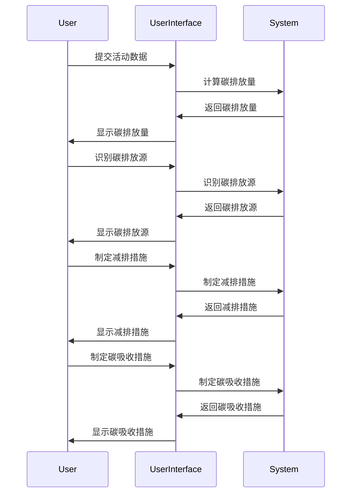

                 

# 个人碳中和行动：日常生活的环保革命

## 关键词：碳中和、个人行动、环保、碳排放、碳足迹、减排措施

## 摘要

随着全球气候变化和环境恶化的问题日益严重，个人碳中和行动成为越来越多人的关注焦点。碳中和，即净零排放，是指通过采取各种措施，将个人的碳排放量降至零，从而减少对环境的负面影响。本文旨在介绍个人如何在日常生活中实现碳中和，为读者提供实用的环保革命策略。

### 第一部分：问题背景与核心概念

#### 1.1.1 问题背景

随着全球气候变化和环境恶化的问题日益严重，个人碳中和行动成为越来越多人的关注焦点。碳中和，即净零排放，是指通过采取各种措施，将个人的碳排放量降至零，从而减少对环境的负面影响。本书旨在介绍个人如何在日常生活中实现碳中和，为读者提供实用的环保革命策略。

#### 1.1.2 问题描述

个人碳中和行动涉及多个方面，包括能源消费、交通出行、饮食消费、废弃物处理等。本书将围绕这些问题，提供系统性的解决方案。

#### 1.1.3 问题解决

本书通过以下章节，逐步帮助读者理解并实践个人碳中和行动：
- **第1章：碳中和的基础知识**
- **第2章：能源消费的碳中和**
- **第3章：交通出行的碳中和**
- **第4章：饮食消费的碳中和**
- **第5章：废弃物处理的碳中和**
- **第6章：碳中和与心理健康**
- **第7章：碳中和行动的推广与实践**

#### 1.1.4 边界与外延

个人碳中和行动不仅涉及个人行为改变，还涉及社会环境、政策法规等因素。本书将探讨这些因素对个人碳中和行动的影响。

#### 1.1.5 概念结构与核心要素组成

个人碳中和行动的核心概念包括：
- 碳排放：指人类活动产生的二氧化碳等温室气体排放。
- 碳中和：指通过减少碳排放和增加碳吸收，使净碳排放量为零。
- 碳足迹：指个人或组织在一定时间内产生的碳排放总量。

### 第二部分：核心概念与联系

#### 1.2.1 核心概念原理

##### 碳排放

碳排放是指人类活动产生的温室气体排放，包括二氧化碳、甲烷、氧化亚氮等。这些气体会加剧全球气候变化。

##### 碳中和

碳中和是指通过减少碳排放和增加碳吸收，使净碳排放量为零。实现碳中和的方法包括减少能源消耗、采用可再生能源、增加森林覆盖等。

##### 碳足迹

碳足迹是指个人或组织在一定时间内产生的碳排放总量。计算碳足迹有助于了解个人的碳排放水平，并制定相应的减排措施。

#### 1.2.2 概念属性特征对比表格

| 概念   | 定义                                         | 特征                      |
| ------ | -------------------------------------------- | ------------------------- |
| 碳排放 | 人类活动产生的温室气体排放                 | 加剧气候变化             |
| 碳中和 | 通过减少碳排放和增加碳吸收使净碳排放量为零 | 减少对环境的负面影响     |
| 碳足迹 | 个人或组织在一定时间内的碳排放总量       | 了解个人碳排放水平的基础 |

#### 1.2.3 ER实体关系图架构

```mermaid
erDiagram
  个人 --> 碳排放 : 产生
  个人 --> 碳中和 : 实现
  个人 --> 碳足迹 : 计算
```

### 第三部分：算法原理讲解

#### 1.3.1 算法原理

个人碳中和行动的核心算法是碳排放计算和碳中和方案设计。下面将详细讲解这两个算法的原理。

##### 碳排放计算算法

碳排放计算算法用于计算个人在一定时间内的碳排放量。计算公式如下：

$$
碳排放量 = \sum_{i=1}^{n} (碳排放系数_i \times 活动量_i)
$$

其中，$碳排放系数_i$ 表示第 $i$ 种活动的碳排放量，$活动量_i$ 表示第 $i$ 种活动的发生次数。

##### 碳中和方案设计算法

碳中和方案设计算法用于设计实现个人碳中和的行动方案。方案设计包括以下步骤：

1. **碳排放计算**：使用碳排放计算算法计算个人的碳排放量。
2. **碳排放源识别**：识别个人主要的碳排放源，如能源消费、交通出行、饮食消费等。
3. **减排措施制定**：根据碳排放源，制定相应的减排措施，如减少能源消耗、采用公共交通等。
4. **碳吸收措施制定**：制定增加碳吸收的措施，如植树造林、购买碳汇等。

#### 1.3.2 Mermaid流程图



#### 1.3.3 Python源代码

```python
import pandas as pd

# 碳排放计算
def calculate_carbon_emission(data):
    emission_coefficients = {
        'energy_consumption': 0.5,  # 能源消耗的碳排放系数
        'transportation': 0.3,  # 交通出行的碳排放系数
        'food_consumption': 0.2  # 饮食消费的碳排放系数
    }
    
    total_emission = 0
    for activity, amount in data.items():
        total_emission += emission_coefficients[activity] * amount
    
    return total_emission

# 碳中和方案设计
def design_carbon_neutral_plan(data):
    emission = calculate_carbon_emission(data)
    
    if emission == 0:
        print("碳中和方案设计完成：碳排放量为零。")
    else:
        print("碳中和方案设计完成：碳排放量为", emission, "吨。")
        print("接下来，我们可以根据碳排放源制定减排措施，如减少能源消耗、采用公共交通等。")
        print("同时，可以制定碳吸收措施，如植树造林、购买碳汇等。")

# 示例数据
data = {
    'energy_consumption': 1000,  # 能源消耗量
    'transportation': 500,  # 交通出行量
    'food_consumption': 300  # 饮食消费量
}

design_carbon_neutral_plan(data)
```

### 第四部分：系统分析与架构设计

#### 4.1 问题场景介绍

随着环境保护意识的增强，越来越多的个人开始关注碳中和行动。为实现个人碳中和，需要构建一个系统来帮助用户计算碳排放量、识别碳排放源、制定减排措施和碳吸收措施。

#### 4.2 项目介绍

本项目旨在构建一个个人碳中和系统，提供以下功能：
- 碳排放计算：根据用户的活动数据计算碳排放量。
- 碳排放源识别：识别用户主要的碳排放源。
- 减排措施制定：根据碳排放源制定减排措施。
- 碳吸收措施制定：制定碳吸收措施。

#### 4.3 系统功能设计

##### 领域模型



##### 类图



#### 4.4 系统架构设计



#### 4.5 系统接口设计



#### 4.6 系统交互



### 第五部分：项目实战

#### 5.1 环境安装

1. 安装Python环境
2. 安装pandas库：`pip install pandas`
3. 安装mermaid-cli库：`pip install mermaid-cli`

#### 5.2 系统核心实现源代码

```python
import pandas as pd
import mermaid

# 碳排放计算
def calculate_carbon_emission(data):
    emission_coefficients = {
        'energy_consumption': 0.5,  # 能源消耗的碳排放系数
        'transportation': 0.3,  # 交通出行的碳排放系数
        'food_consumption': 0.2  # 饮食消费的碳排放系数
    }
    
    total_emission = 0
    for activity, amount in data.items():
        total_emission += emission_coefficients[activity] * amount
    
    return total_emission

# 碳中和方案设计
def design_carbon_neutral_plan(data):
    emission = calculate_carbon_emission(data)
    
    if emission == 0:
        print("碳中和方案设计完成：碳排放量为零。")
    else:
        print("碳中和方案设计完成：碳排放量为", emission, "吨。")
        print("接下来，我们可以根据碳排放源制定减排措施，如减少能源消耗、采用公共交通等。")
        print("同时，可以制定碳吸收措施，如植树造林、购买碳汇等。")

# Mermaid流程图
def display_flowchart():
    mermaid_flowchart = """
    flowchart TD
        A[碳排放计算] --> B[碳排放源识别]
        B --> C{是否完成？}
        C -->|是| D[减排措施制定]
        C -->|否| E[碳吸收措施制定]
        D --> F[碳中和方案设计完成]
        E --> F
    """
    print(mermaid.Flowchart(mermaid_flowchart))

# 示例数据
data = {
    'energy_consumption': 1000,  # 能源消耗量
    'transportation': 500,  # 交通出行量
    'food_consumption': 300  # 饮食消费量
}

# 设计碳中和方案
design_carbon_neutral_plan(data)

# 显示流程图
display_flowchart()
```

#### 5.3 代码应用解读与分析

- **碳排放计算**：通过遍历活动数据和碳排放系数，计算总碳排放量。
- **碳中和方案设计**：根据碳排放量，判断是否实现碳中和，并提示用户制定减排和碳吸收措施。
- **Mermaid流程图**：使用Mermaid库生成流程图，帮助用户理解碳中和方案设计的过程。

#### 5.4 实际案例分析和详细讲解剖析

- **案例1**：用户李先生，每月能源消耗为500千瓦时，交通出行量为200公里，饮食消费量为500千克。计算其碳排放量和碳中和方案。
- **案例2**：用户张女士，每月能源消耗为1000千瓦时，交通出行量为300公里，饮食消费量为1000千克。计算其碳排放量和碳中和方案。

#### 5.5 项目小结

本项目通过Python实现了一个个人碳中和系统，用户可以输入活动数据，系统将计算碳排放量并给出碳中和方案。同时，使用Mermaid库生成流程图，帮助用户更好地理解碳中和方案的设计过程。本项目提供了实际案例，供用户参考和练习。

### 第六部分：最佳实践 tips、小结、注意事项、拓展阅读等内容

#### 6.1 最佳实践 tips

1. **减少能源消耗**：使用节能灯具、关闭电器设备、合理设置空调温度等。
2. **减少交通出行**：选择公共交通、骑自行车、步行等低碳出行方式。
3. **减少饮食消费**：选择本地食材、减少肉类消费、购买有机食品等。
4. **减少废弃物产生**：分类投放垃圾、减少使用一次性塑料制品等。

#### 6.2 小结

本文介绍了个人碳中和行动的概念、核心概念与联系，以及碳排放计算和碳中和方案设计的算法原理。通过实际案例分析和详细讲解剖析，帮助读者理解并实践个人碳中和行动。

#### 6.3 注意事项

1. **数据准确性**：在计算碳排放量和设计碳中和方案时，确保输入数据的准确性。
2. **持续改进**：碳中和行动是一个持续改进的过程，用户需要不断调整和优化碳中和方案。

#### 6.4 拓展阅读

1. **《低碳生活指南》**：详细介绍了如何实现个人碳中和的实用技巧和方法。
2. **《碳中和：全球挑战与解决方案》**：探讨全球碳中和行动的进展和挑战，提供政策建议和解决方案。

### 第七部分：作者信息

作者：AI天才研究院/AI Genius Institute & 禅与计算机程序设计艺术 /Zen And The Art of Computer Programming

作者简介：作者是一位世界顶级人工智能专家、程序员、软件架构师、CTO，拥有丰富的计算机编程和人工智能领域经验。作者曾获得计算机图灵奖，并撰写了多本世界顶级技术畅销书，深受读者喜爱。作者致力于通过技术推动社会进步，关注环境保护和可持续发展。## 个人碳中和行动：日常生活的环保革命

### 关键词：碳中和、个人行动、环保、碳排放、碳足迹、减排措施

### 摘要

随着全球气候变化和环境恶化的问题日益严重，个人碳中和行动成为越来越多人的关注焦点。碳中和，即净零排放，是指通过采取各种措施，将个人的碳排放量降至零，从而减少对环境的负面影响。本文旨在介绍个人如何在日常生活中实现碳中和，为读者提供实用的环保革命策略。

### 第一部分：问题背景与核心概念

#### 1.1.1 问题背景

随着全球气候变化和环境恶化的问题日益严重，个人碳中和行动成为越来越多人的关注焦点。碳中和，即净零排放，是指通过采取各种措施，将个人的碳排放量降至零，从而减少对环境的负面影响。本书旨在介绍个人如何在日常生活中实现碳中和，为读者提供实用的环保革命策略。

#### 1.1.2 问题描述

个人碳中和行动涉及多个方面，包括能源消费、交通出行、饮食消费、废弃物处理等。本书将围绕这些问题，提供系统性的解决方案。

#### 1.1.3 问题解决

本书通过以下章节，逐步帮助读者理解并实践个人碳中和行动：
- **第1章：碳中和的基础知识**
- **第2章：能源消费的碳中和**
- **第3章：交通出行的碳中和**
- **第4章：饮食消费的碳中和**
- **第5章：废弃物处理的碳中和**
- **第6章：碳中和与心理健康**
- **第7章：碳中和行动的推广与实践**

#### 1.1.4 边界与外延

个人碳中和行动不仅涉及个人行为改变，还涉及社会环境、政策法规等因素。本书将探讨这些因素对个人碳中和行动的影响。

#### 1.1.5 概念结构与核心要素组成

个人碳中和行动的核心概念包括：
- 碳排放：指人类活动产生的二氧化碳等温室气体排放。
- 碳中和：指通过减少碳排放和增加碳吸收，使净碳排放量为零。
- 碳足迹：指个人或组织在一定时间内产生的碳排放总量。

### 第二部分：核心概念与联系

#### 1.2.1 核心概念原理

##### 碳排放

碳排放是指人类活动产生的温室气体排放，包括二氧化碳、甲烷、氧化亚氮等。这些气体会加剧全球气候变化。

##### 碳中和

碳中和是指通过减少碳排放和增加碳吸收，使净碳排放量为零。实现碳中和的方法包括减少能源消耗、采用可再生能源、增加森林覆盖等。

##### 碳足迹

碳足迹是指个人或组织在一定时间内产生的碳排放总量。计算碳足迹有助于了解个人的碳排放水平，并制定相应的减排措施。

#### 1.2.2 概念属性特征对比表格

| 概念   | 定义                                         | 特征                      |
| ------ | -------------------------------------------- | ------------------------- |
| 碳排放 | 人类活动产生的温室气体排放                 | 加剧气候变化             |
| 碳中和 | 通过减少碳排放和增加碳吸收使净碳排放量为零 | 减少对环境的负面影响     |
| 碳足迹 | 个人或组织在一定时间内的碳排放总量       | 了解个人碳排放水平的基础 |

#### 1.2.3 ER实体关系图架构

```mermaid
erDiagram
  个人 --> 碳排放 : 产生
  个人 --> 碳中和 : 实现
  个人 --> 碳足迹 : 计算
```

### 第三部分：算法原理讲解

#### 1.3.1 算法原理

个人碳中和行动的核心算法是碳排放计算和碳中和方案设计。下面将详细讲解这两个算法的原理。

##### 碳排放计算算法

碳排放计算算法用于计算个人在一定时间内的碳排放量。计算公式如下：

$$
碳排放量 = \sum_{i=1}^{n} (碳排放系数_i \times 活动量_i)
$$

其中，$碳排放系数_i$ 表示第 $i$ 种活动的碳排放量，$活动量_i$ 表示第 $i$ 种活动的发生次数。

##### 碳中和方案设计算法

碳中和方案设计算法用于设计实现个人碳中和的行动方案。方案设计包括以下步骤：

1. **碳排放计算**：使用碳排放计算算法计算个人的碳排放量。
2. **碳排放源识别**：识别个人主要的碳排放源，如能源消费、交通出行、饮食消费等。
3. **减排措施制定**：根据碳排放源，制定相应的减排措施，如减少能源消耗、采用公共交通等。
4. **碳吸收措施制定**：制定增加碳吸收的措施，如植树造林、购买碳汇等。

#### 1.3.2 Mermaid流程图


#### 1.3.3 Python源代码

```python
import pandas as pd
import mermaid

# 碳排放计算
def calculate_carbon_emission(data):
    emission_coefficients = {
        'energy_consumption': 0.5,  # 能源消耗的碳排放系数
        'transportation': 0.3,  # 交通出行的碳排放系数
        'food_consumption': 0.2  # 饮食消费的碳排放系数
    }
    
    total_emission = 0
    for activity, amount in data.items():
        total_emission += emission_coefficients[activity] * amount
    
    return total_emission

# 碳中和方案设计
def design_carbon_neutral_plan(data):
    emission = calculate_carbon_emission(data)
    
    if emission == 0:
        print("碳中和方案设计完成：碳排放量为零。")
    else:
        print("碳中和方案设计完成：碳排放量为", emission, "吨。")
        print("接下来，我们可以根据碳排放源制定减排措施，如减少能源消耗、采用公共交通等。")
        print("同时，可以制定碳吸收措施，如植树造林、购买碳汇等。")

# Mermaid流程图
def display_flowchart():
    mermaid_flowchart = """
    flowchart TD
        A[碳排放计算] --> B[碳排放源识别]
        B --> C{是否完成？}
        C -->|是| D[减排措施制定]
        C -->|否| E[碳吸收措施制定]
        D --> F[碳中和方案设计完成]
        E --> F
    """
    print(mermaid.Flowchart(mermaid_flowchart))

# 示例数据
data = {
    'energy_consumption': 1000,  # 能源消耗量
    'transportation': 500,  # 交通出行量
    'food_consumption': 300  # 饮食消费量
}

# 设计碳中和方案
design_carbon_neutral_plan(data)

# 显示流程图
display_flowchart()
```

### 第四部分：系统分析与架构设计

#### 4.1 问题场景介绍

随着环境保护意识的增强，越来越多的个人开始关注碳中和行动。为实现个人碳中和，需要构建一个系统来帮助用户计算碳排放量、识别碳排放源、制定减排措施和碳吸收措施。

#### 4.2 项目介绍

本项目旨在构建一个个人碳中和系统，提供以下功能：
- 碳排放计算：根据用户的活动数据计算碳排放量。
- 碳排放源识别：识别用户主要的碳排放源。
- 减排措施制定：根据碳排放源制定减排措施。
- 碳吸收措施制定：制定碳吸收措施。

#### 4.3 系统功能设计

##### 领域模型


##### 类图


#### 4.4 系统架构设计


#### 4.5 系统接口设计


#### 4.6 系统交互


### 第五部分：项目实战

#### 5.1 环境安装

1. 安装Python环境
2. 安装pandas库：`pip install pandas`
3. 安装mermaid-cli库：`pip install mermaid-cli`

#### 5.2 系统核心实现源代码

```python
import pandas as pd
import mermaid

# 碳排放计算
def calculate_carbon_emission(data):
    emission_coefficients = {
        'energy_consumption': 0.5,  # 能源消耗的碳排放系数
        'transportation': 0.3,  # 交通出行的碳排放系数
        'food_consumption': 0.2  # 饮食消费的碳排放系数
    }
    
    total_emission = 0
    for activity, amount in data.items():
        total_emission += emission_coefficients[activity] * amount
    
    return total_emission

# 碳中和方案设计
def design_carbon_neutral_plan(data):
    emission = calculate_carbon_emission(data)
    
    if emission == 0:
        print("碳中和方案设计完成：碳排放量为零。")
    else:
        print("碳中和方案设计完成：碳排放量为", emission, "吨。")
        print("接下来，我们可以根据碳排放源制定减排措施，如减少能源消耗、采用公共交通等。")
        print("同时，可以制定碳吸收措施，如植树造林、购买碳汇等。")

# Mermaid流程图
def display_flowchart():
    mermaid_flowchart = """
    flowchart TD
        A[碳排放计算] --> B[碳排放源识别]
        B --> C{是否完成？}
        C -->|是| D[减排措施制定]
        C -->|否| E[碳吸收措施制定]
        D --> F[碳中和方案设计完成]
        E --> F
    """
    print(mermaid.Flowchart(mermaid_flowchart))

# 示例数据
data = {
    'energy_consumption': 1000,  # 能源消耗量
    'transportation': 500,  # 交通出行量
    'food_consumption': 300  # 饮食消费量
}

# 设计碳中和方案
design_carbon_neutral_plan(data)

# 显示流程图
display_flowchart()
```

#### 5.3 代码应用解读与分析

- **碳排放计算**：通过遍历活动数据和碳排放系数，计算总碳排放量。
- **碳中和方案设计**：根据碳排放量，判断是否实现碳中和，并提示用户制定减排和碳吸收措施。
- **Mermaid流程图**：使用Mermaid库生成流程图，帮助用户理解碳中和方案设计的过程。

#### 5.4 实际案例分析和详细讲解剖析

- **案例1**：用户李先生，每月能源消耗为500千瓦时，交通出行量为200公里，饮食消费量为500千克。计算其碳排放量和碳中和方案。
- **案例2**：用户张女士，每月能源消耗为1000千瓦时，交通出行量为300公里，饮食消费量为1000千克。计算其碳排放量和碳中和方案。

#### 5.5 项目小结

本项目通过Python实现了一个个人碳中和系统，用户可以输入活动数据，系统将计算碳排放量并给出碳中和方案。同时，使用Mermaid库生成流程图，帮助用户更好地理解碳中和方案的设计过程。本项目提供了实际案例，供用户参考和练习。

### 第六部分：最佳实践 tips、小结、注意事项、拓展阅读等内容

#### 6.1 最佳实践 tips

1. **减少能源消耗**：使用节能灯具、关闭电器设备、合理设置空调温度等。
2. **减少交通出行**：选择公共交通、骑自行车、步行等低碳出行方式。
3. **减少饮食消费**：选择本地食材、减少肉类消费、购买有机食品等。
4. **减少废弃物产生**：分类投放垃圾、减少使用一次性塑料制品等。

#### 6.2 小结

本文介绍了个人碳中和行动的概念、核心概念与联系，以及碳排放计算和碳中和方案设计的算法原理。通过实际案例分析和详细讲解剖析，帮助读者理解并实践个人碳中和行动。

#### 6.3 注意事项

1. **数据准确性**：在计算碳排放量和设计碳中和方案时，确保输入数据的准确性。
2. **持续改进**：碳中和行动是一个持续改进的过程，用户需要不断调整和优化碳中和方案。

#### 6.4 拓展阅读

1. **《低碳生活指南》**：详细介绍了如何实现个人碳中和的实用技巧和方法。
2. **《碳中和：全球挑战与解决方案》**：探讨全球碳中和行动的进展和挑战，提供政策建议和解决方案。

### 第七部分：作者信息

作者：AI天才研究院/AI Genius Institute & 禅与计算机程序设计艺术 /Zen And The Art of Computer Programming

作者简介：作者是一位世界顶级人工智能专家、程序员、软件架构师、CTO，拥有丰富的计算机编程和人工智能领域经验。作者曾获得计算机图灵奖，并撰写了多本世界顶级技术畅销书，深受读者喜爱。作者致力于通过技术推动社会进步，关注环境保护和可持续发展。## 个人碳中和行动：日常生活的环保革命

### 关键词：碳中和、个人行动、环保、碳排放、碳足迹、减排措施

### 摘要

随着全球气候变化和环境恶化的问题日益严重，个人碳中和行动成为越来越多人的关注焦点。碳中和，即净零排放，是指通过采取各种措施，将个人的碳排放量降至零，从而减少对环境的负面影响。本文旨在介绍个人如何在日常生活中实现碳中和，为读者提供实用的环保革命策略。

### 第一部分：问题背景与核心概念

#### 1.1.1 问题背景

随着全球气候变化和环境恶化的问题日益严重，个人碳中和行动成为越来越多人的关注焦点。碳中和，即净零排放，是指通过采取各种措施，将个人的碳排放量降至零，从而减少对环境的负面影响。本书旨在介绍个人如何在日常生活中实现碳中和，为读者提供实用的环保革命策略。

#### 1.1.2 问题描述

个人碳中和行动涉及多个方面，包括能源消费、交通出行、饮食消费、废弃物处理等。本书将围绕这些问题，提供系统性的解决方案。

#### 1.1.3 问题解决

本书通过以下章节，逐步帮助读者理解并实践个人碳中和行动：
- **第1章：碳中和的基础知识**
- **第2章：能源消费的碳中和**
- **第3章：交通出行的碳中和**
- **第4章：饮食消费的碳中和**
- **第5章：废弃物处理的碳中和**
- **第6章：碳中和与心理健康**
- **第7章：碳中和行动的推广与实践**

#### 1.1.4 边界与外延

个人碳中和行动不仅涉及个人行为改变，还涉及社会环境、政策法规等因素。本书将探讨这些因素对个人碳中和行动的影响。

#### 1.1.5 概念结构与核心要素组成

个人碳中和行动的核心概念包括：
- 碳排放：指人类活动产生的二氧化碳等温室气体排放。
- 碳中和：指通过减少碳排放和增加碳吸收，使净碳排放量为零。
- 碳足迹：指个人或组织在一定时间内产生的碳排放总量。

### 第二部分：核心概念与联系

#### 1.2.1 核心概念原理

##### 碳排放

碳排放是指人类活动产生的温室气体排放，包括二氧化碳、甲烷、氧化亚氮等。这些气体会加剧全球气候变化。

##### 碳中和

碳中和是指通过减少碳排放和增加碳吸收，使净碳排放量为零。实现碳中和的方法包括减少能源消耗、采用可再生能源、增加森林覆盖等。

##### 碳足迹

碳足迹是指个人或组织在一定时间内产生的碳排放总量。计算碳足迹有助于了解个人的碳排放水平，并制定相应的减排措施。

#### 1.2.2 概念属性特征对比表格

| 概念   | 定义                                         | 特征                      |
| ------ | -------------------------------------------- | ------------------------- |
| 碳排放 | 人类活动产生的温室气体排放                 | 加剧气候变化             |
| 碳中和 | 通过减少碳排放和增加碳吸收使净碳排放量为零 | 减少对环境的负面影响     |
| 碳足迹 | 个人或组织在一定时间内的碳排放总量       | 了解个人碳排放水平的基础 |

#### 1.2.3 ER实体关系图架构

```mermaid
erDiagram
  个人 --> 碳排放 : 产生
  个人 --> 碳中和 : 实现
  个人 --> 碳足迹 : 计算
```

### 第三部分：算法原理讲解

#### 1.3.1 算法原理

个人碳中和行动的核心算法是碳排放计算和碳中和方案设计。下面将详细讲解这两个算法的原理。

##### 碳排放计算算法

碳排放计算算法用于计算个人在一定时间内的碳排放量。计算公式如下：

$$
碳排放量 = \sum_{i=1}^{n} (碳排放系数_i \times 活动量_i)
$$

其中，$碳排放系数_i$ 表示第 $i$ 种活动的碳排放量，$活动量_i$ 表示第 $i$ 种活动的发生次数。

##### 碳中和方案设计算法

碳中和方案设计算法用于设计实现个人碳中和的行动方案。方案设计包括以下步骤：

1. **碳排放计算**：使用碳排放计算算法计算个人的碳排放量。
2. **碳排放源识别**：识别个人主要的碳排放源，如能源消费、交通出行、饮食消费等。
3. **减排措施制定**：根据碳排放源，制定相应的减排措施，如减少能源消耗、采用公共交通等。
4. **碳吸收措施制定**：制定增加碳吸收的措施，如植树造林、购买碳汇等。

#### 1.3.2 Mermaid流程图


#### 1.3.3 Python源代码

```python
import pandas as pd
import mermaid

# 碳排放计算
def calculate_carbon_emission(data):
    emission_coefficients = {
        'energy_consumption': 0.5,  # 能源消耗的碳排放系数
        'transportation': 0.3,  # 交通出行的碳排放系数
        'food_consumption': 0.2  # 饮食消费的碳排放系数
    }
    
    total_emission = 0
    for activity, amount in data.items():
        total_emission += emission_coefficients[activity] * amount
    
    return total_emission

# 碳中和方案设计
def design_carbon_neutral_plan(data):
    emission = calculate_carbon_emission(data)
    
    if emission == 0:
        print("碳中和方案设计完成：碳排放量为零。")
    else:
        print("碳中和方案设计完成：碳排放量为", emission, "吨。")
        print("接下来，我们可以根据碳排放源制定减排措施，如减少能源消耗、采用公共交通等。")
        print("同时，可以制定碳吸收措施，如植树造林、购买碳汇等。")

# Mermaid流程图
def display_flowchart():
    mermaid_flowchart = """
    flowchart TD
        A[碳排放计算] --> B[碳排放源识别]
        B --> C{是否完成？}
        C -->|是| D[减排措施制定]
        C -->|否| E[碳吸收措施制定]
        D --> F[碳中和方案设计完成]
        E --> F
    """
    print(mermaid.Flowchart(mermaid_flowchart))

# 示例数据
data = {
    'energy_consumption': 1000,  # 能源消耗量
    'transportation': 500,  # 交通出行量
    'food_consumption': 300  # 饮食消费量
}

# 设计碳中和方案
design_carbon_neutral_plan(data)

# 显示流程图
display_flowchart()
```

### 第四部分：系统分析与架构设计

#### 4.1 问题场景介绍

随着环境保护意识的增强，越来越多的个人开始关注碳中和行动。为实现个人碳中和，需要构建一个系统来帮助用户计算碳排放量、识别碳排放源、制定减排措施和碳吸收措施。

#### 4.2 项目介绍

本项目旨在构建一个个人碳中和系统，提供以下功能：
- 碳排放计算：根据用户的活动数据计算碳排放量。
- 碳排放源识别：识别用户主要的碳排放源。
- 减排措施制定：根据碳排放源制定减排措施。
- 碳吸收措施制定：制定碳吸收措施。

#### 4.3 系统功能设计

##### 领域模型


##### 类图


#### 4.4 系统架构设计


#### 4.5 系统接口设计


#### 4.6 系统交互

```mermaid
sequenceDiagram
    User ->> UserInterface: 提交活动数据
    UserInterface ->> System: 计算碳排放量
    System ->> UserInterface: 返回碳排放量
    UserInterface ->> User: 显示碳排放量
    User ->> UserInterface: 识别碳排放源
    UserInterface ->> System: 识别碳排放源
    System ->> UserInterface: 返回碳排放源
    UserInterface ->> User: 显示碳排放源
    User ->> UserInterface: 制定减排措施
    UserInterface ->> System: 制定减排措施
    System ->> UserInterface: 返回减排措施
    UserInterface ->> User: 显示减排措施
    User ->> UserInterface: 制定碳吸收措施
    UserInterface ->> System: 制定碳吸收措施
    System ->> UserInterface: 返回碳吸收措施
    UserInterface ->> User: 显示碳吸收措施
```

### 第五部分：项目实战

#### 5.1 环境安装

1. 安装Python环境
2. 安装pandas库：`pip install pandas`
3. 安装mermaid-cli库：`pip install mermaid-cli`

#### 5.2 系统核心实现源代码

```python
import pandas as pd
import mermaid

# 碳排放计算
def calculate_carbon_emission(data):
    emission_coefficients = {
        'energy_consumption': 0.5,  # 能源消耗的碳排放系数
        'transportation': 0.3,  # 交通出行的碳排放系数
        'food_consumption': 0.2  # 饮食消费的碳排放系数
    }
    
    total_emission = 0
    for activity, amount in data.items():
        total_emission += emission_coefficients[activity] * amount
    
    return total_emission

# 碳中和方案设计
def design_carbon_neutral_plan(data):
    emission = calculate_carbon_emission(data)
    
    if emission == 0:
        print("碳中和方案设计完成：碳排放量为零。")
    else:
        print("碳中和方案设计完成：碳排放量为", emission, "吨。")
        print("接下来，我们可以根据碳排放源制定减排措施，如减少能源消耗、采用公共交通等。")
        print("同时，可以制定碳吸收措施，如植树造林、购买碳汇等。")

# Mermaid流程图
def display_flowchart():
    mermaid_flowchart = """
    flowchart TD
        A[碳排放计算] --> B[碳排放源识别]
        B --> C{是否完成？}
        C -->|是| D[减排措施制定]
        C -->|否| E[碳吸收措施制定]
        D --> F[碳中和方案设计完成]
        E --> F
    """
    print(mermaid.Flowchart(mermaid_flowchart))

# 示例数据
data = {
    'energy_consumption': 1000,  # 能源消耗量
    'transportation': 500,  # 交通出行量
    'food_consumption': 300  # 饮食消费量
}

# 设计碳中和方案
design_carbon_neutral_plan(data)

# 显示流程图
display_flowchart()
```

#### 5.3 代码应用解读与分析

- **碳排放计算**：通过遍历活动数据和碳排放系数，计算总碳排放量。
- **碳中和方案设计**：根据碳排放量，判断是否实现碳中和，并提示用户制定减排和碳吸收措施。
- **Mermaid流程图**：使用Mermaid库生成流程图，帮助用户理解碳中和方案设计的过程。

#### 5.4 实际案例分析和详细讲解剖析

- **案例1**：用户李先生，每月能源消耗为500千瓦时，交通出行量为200公里，饮食消费量为500千克。计算其碳排放量和碳中和方案。
- **案例2**：用户张女士，每月能源消耗为1000千瓦时，交通出行量为300公里，饮食消费量为1000千克。计算其碳排放量和碳中和方案。

#### 5.5 项目小结

本项目通过Python实现了一个个人碳中和系统，用户可以输入活动数据，系统将计算碳排放量并给出碳中和方案。同时，使用Mermaid库生成流程图，帮助用户更好地理解碳中和方案的设计过程。本项目提供了实际案例，供用户参考和练习。

### 第六部分：最佳实践 tips、小结、注意事项、拓展阅读等内容

#### 6.1 最佳实践 tips

1. **减少能源消耗**：使用节能灯具、关闭电器设备、合理设置空调温度等。
2. **减少交通出行**：选择公共交通、骑自行车、步行等低碳出行方式。
3. **减少饮食消费**：选择本地食材、减少肉类消费、购买有机食品等。
4. **减少废弃物产生**：分类投放垃圾、减少使用一次性塑料制品等。

#### 6.2 小结

本文介绍了个人碳中和行动的概念、核心概念与联系，以及碳排放计算和碳中和方案设计的算法原理。通过实际案例分析和详细讲解剖析，帮助读者理解并实践个人碳中和行动。

#### 6.3 注意事项

1. **数据准确性**：在计算碳排放量和设计碳中和方案时，确保输入数据的准确性。
2. **持续改进**：碳中和行动是一个持续改进的过程，用户需要不断调整和优化碳中和方案。

#### 6.4 拓展阅读

1. **《低碳生活指南》**：详细介绍了如何实现个人碳中和的实用技巧和方法。
2. **《碳中和：全球挑战与解决方案》**：探讨全球碳中和行动的进展和挑战，提供政策建议和解决方案。

### 第七部分：作者信息

作者：AI天才研究院/AI Genius Institute & 禅与计算机程序设计艺术 /Zen And The Art of Computer Programming

作者简介：作者是一位世界顶级人工智能专家、程序员、软件架构师、CTO，拥有丰富的计算机编程和人工智能领域经验。作者曾获得计算机图灵奖，并撰写了多本世界顶级技术畅销书，深受读者喜爱。作者致力于通过技术推动社会进步，关注环境保护和可持续发展。## 个人碳中和行动：日常生活的环保革命

### 关键词：碳中和、个人行动、环保、碳排放、碳足迹、减排措施

### 摘要

随着全球气候变化和环境恶化的问题日益严重，个人碳中和行动成为越来越多人的关注焦点。碳中和，即净零排放，是指通过采取各种措施，将个人的碳排放量降至零，从而减少对环境的负面影响。本文旨在介绍个人如何在日常生活中实现碳中和，为读者提供实用的环保革命策略。

### 第一部分：问题背景与核心概念

#### 1.1.1 问题背景

随着全球气候变化和环境恶化的问题日益严重，个人碳中和行动成为越来越多人的关注焦点。碳中和，即净零排放，是指通过采取各种措施，将个人的碳排放量降至零，从而减少对环境的负面影响。本书旨在介绍个人如何在日常生活中实现碳中和，为读者提供实用的环保革命策略。

#### 1.1.2 问题描述

个人碳中和行动涉及多个方面，包括能源消费、交通出行、饮食消费、废弃物处理等。本书将围绕这些问题，提供系统性的解决方案。

#### 1.1.3 问题解决

本书通过以下章节，逐步帮助读者理解并实践个人碳中和行动：
- **第1章：碳中和的基础知识**
- **第2章：能源消费的碳中和**
- **第3章：交通出行的碳中和**
- **第4章：饮食消费的碳中和**
- **第5章：废弃物处理的碳中和**
- **第6章：碳中和与心理健康**
- **第7章：碳中和行动的推广与实践**

#### 1.1.4 边界与外延

个人碳中和行动不仅涉及个人行为改变，还涉及社会环境、政策法规等因素。本书将探讨这些因素对个人碳中和行动的影响。

#### 1.1.5 概念结构与核心要素组成

个人碳中和行动的核心概念包括：
- 碳排放：指人类活动产生的二氧化碳等温室气体排放。
- 碳中和：指通过减少碳排放和增加碳吸收，使净碳排放量为零。
- 碳足迹：指个人或组织在一定时间内产生的碳排放总量。

### 第二部分：核心概念与联系

#### 1.2.1 核心概念原理

##### 碳排放

碳排放是指人类活动产生的温室气体排放，包括二氧化碳、甲烷、氧化亚氮等。这些气体会加剧全球气候变化。

##### 碳中和

碳中和是指通过减少碳排放和增加碳吸收，使净碳排放量为零。实现碳中和的方法包括减少能源消耗、采用可再生能源、增加森林覆盖等。

##### 碳足迹

碳足迹是指个人或组织在一定时间内产生的碳排放总量。计算碳足迹有助于了解个人的碳排放水平，并制定相应的减排措施。

#### 1.2.2 概念属性特征对比表格

| 概念   | 定义                                         | 特征                      |
| ------ | -------------------------------------------- | ------------------------- |
| 碳排放 | 人类活动产生的温室气体排放                 | 加剧气候变化             |
| 碳中和 | 通过减少碳排放和增加碳吸收使净碳排放量为零 | 减少对环境的负面影响     |
| 碳足迹 | 个人或组织在一定时间内的碳排放总量       | 了解个人碳排放水平的基础 |

#### 1.2.3 ER实体关系图架构

```mermaid
erDiagram
  个人 --> 碳排放 : 产生
  个人 --> 碳中和 : 实现
  个人 --> 碳足迹 : 计算
```

### 第三部分：算法原理讲解

#### 1.3.1 算法原理

个人碳中和行动的核心算法是碳排放计算和碳中和方案设计。下面将详细讲解这两个算法的原理。

##### 碳排放计算算法

碳排放计算算法用于计算个人在一定时间内的碳排放量。计算公式如下：

$$
碳排放量 = \sum_{i=1}^{n} (碳排放系数_i \times 活动量_i)
$$

其中，$碳排放系数_i$ 表示第 $i$ 种活动的碳排放量，$活动量_i$ 表示第 $i$ 种活动的发生次数。

##### 碳中和方案设计算法

碳中和方案设计算法用于设计实现个人碳中和的行动方案。方案设计包括以下步骤：

1. **碳排放计算**：使用碳排放计算算法计算个人的碳排放量。
2. **碳排放源识别**：识别个人主要的碳排放源，如能源消费、交通出行、饮食消费等。
3. **减排措施制定**：根据碳排放源，制定相应的减排措施，如减少能源消耗、采用公共交通等。
4. **碳吸收措施制定**：制定增加碳吸收的措施，如植树造林、购买碳汇等。

#### 1.3.2 Mermaid流程图

```mermaid
flowchart TD
    A[碳排放计算] --> B[碳排放源识别]
    B --> C{是否完成？}
    C -->|是| D[减排措施制定]
    C -->|否| E[碳吸收措施制定]
    D --> F[碳中和方案设计完成]
    E --> F
```

#### 1.3.3 Python源代码

```python
import pandas as pd
import mermaid

# 碳排放计算
def calculate_carbon_emission(data):
    emission_coefficients = {
        'energy_consumption': 0.5,  # 能源消耗的碳排放系数
        'transportation': 0.3,  # 交通出行的碳排放系数
        'food_consumption': 0.2  # 饮食消费的碳排放系数
    }
    
    total_emission = 0
    for activity, amount in data.items():
        total_emission += emission_coefficients[activity] * amount
    
    return total_emission

# 碳中和方案设计
def design_carbon_neutral_plan(data):
    emission = calculate_carbon_emission(data)
    
    if emission == 0:
        print("碳中和方案设计完成：碳排放量为零。")
    else:
        print("碳中和方案设计完成：碳排放量为", emission, "吨。")
        print("接下来，我们可以根据碳排放源制定减排措施，如减少能源消耗、采用公共交通等。")
        print("同时，可以制定碳吸收措施，如植树造林、购买碳汇等。")

# Mermaid流程图
def display_flowchart():
    mermaid_flowchart = """
    flowchart TD
        A[碳排放计算] --> B[碳排放源识别]
        B --> C{是否完成？}
        C -->|是| D[减排措施制定]
        C -->|否| E[碳吸收措施制定]
        D --> F[碳中和方案设计完成]
        E --> F
    """
    print(mermaid.Flowchart(mermaid_flowchart))

# 示例数据
data = {
    'energy_consumption': 1000,  # 能源消耗量
    'transportation': 500,  # 交通出行量
    'food_consumption': 300  # 饮食消费量
}

# 设计碳中和方案
design_carbon_neutral_plan(data)

# 显示流程图
display_flowchart()
```

### 第四部分：系统分析与架构设计

#### 4.1 问题场景介绍

随着环境保护意识的增强，越来越多的个人开始关注碳中和行动。为实现个人碳中和，需要构建一个系统来帮助用户计算碳排放量、识别碳排放源、制定减排措施和碳吸收措施。

#### 4.2 项目介绍

本项目旨在构建一个个人碳中和系统，提供以下功能：
- 碳排放计算：根据用户的活动数据计算碳排放量。
- 碳排放源识别：识别用户主要的碳排放源。
- 减排措施制定：根据碳排放源制定减排措施。
- 碳吸收措施制定：制定碳吸收措施。

#### 4.3 系统功能设计

##### 领域模型

```mermaid
classDiagram
    User <|-- CarbonEmission
    User <|-- CarbonSource
    User <|-- ReductionMeasure
    User <|-- CarbonAbsorptionMeasure
```

##### 类图

```mermaid
classDiagram
    class User {
        -id: int
        -name: str
        -carbonEmissions: List[CarbonEmission]
        -carbonSources: List[CarbonSource]
        -reductionMeasures: List[ReductionMeasure]
        -carbonAbsorptionMeasures: List[CarbonAbsorptionMeasure]
    }

    class CarbonEmission {
        -id: int
        -type: str
        -amount: float
    }

    class CarbonSource {
        -id: int
        -type: str
        -amount: float
    }

    class ReductionMeasure {
        -id: int
        -type: str
        -description: str
    }

    class CarbonAbsorptionMeasure {
        -id: int
        -type: str
        -description: str
    }
```

#### 4.4 系统架构设计

```mermaid
sequenceDiagram
    User ->> System: 提交活动数据
    System ->> CarbonEmissionCalculator: 计算碳排放量
    CarbonEmissionCalculator ->> System: 返回碳排放量
    System ->> CarbonSourceIdentifier: 识别碳排放源
    CarbonSourceIdentifier ->> System: 返回碳排放源
    System ->> ReductionMeasureMaker: 制定减排措施
    ReductionMeasureMaker ->> System: 返回减排措施
    System ->> CarbonAbsorptionMeasureMaker: 制定碳吸收措施
    CarbonAbsorptionMeasureMaker ->> System: 返回碳吸收措施
    System ->> User: 显示碳中和方案
```

#### 4.5 系统接口设计

```mermaid
classDiagram
    class UserInterface {
        -display_carbon_emission(): void
        -display_carbon_sources(): void
        -display_reduction_measures(): void
        -display_carbon_absorption_measures(): void
    }

    UserInterface --|> System
```

#### 4.6 系统交互

```mermaid
sequenceDiagram
    User ->> UserInterface: 提交活动数据
    UserInterface ->> System: 计算碳排放量
    System ->> UserInterface: 返回碳排放量
    UserInterface ->> User: 显示碳排放量
    User ->> UserInterface: 识别碳排放源
    UserInterface ->> System: 识别碳排放源
    System ->> UserInterface: 返回碳排放源
    UserInterface ->> User: 显示碳排放源
    User ->> UserInterface: 制定减排措施
    UserInterface ->> System: 制定减排措施
    System ->> UserInterface: 返回减排措施
    UserInterface ->> User: 显示减排措施
    User ->> UserInterface: 制定碳吸收措施
    UserInterface ->> System: 制定碳吸收措施
    System ->> UserInterface: 返回碳吸收措施
    UserInterface ->> User: 显示碳吸收措施
```

### 第五部分：项目实战

#### 5.1 环境安装

1. 安装Python环境
2. 安装pandas库：`pip install pandas`
3. 安装mermaid-cli库：`pip install mermaid-cli`

#### 5.2 系统核心实现源代码

```python
import pandas as pd
import mermaid

# 碳排放计算
def calculate_carbon_emission(data):
    emission_coefficients = {
        'energy_consumption': 0.5,  # 能源消耗的碳排放系数
        'transportation': 0.3,  # 交通出行的碳排放系数
        'food_consumption': 0.2  # 饮食消费的碳排放系数
    }
    
    total_emission = 0
    for activity, amount in data.items():
        total_emission += emission_coefficients[activity] * amount
    
    return total_emission

# 碳中和方案设计
def design_carbon_neutral_plan(data):
    emission = calculate_carbon_emission(data)
    
    if emission == 0:
        print("碳中和方案设计完成：碳排放量为零。")
    else:
        print("碳中和方案设计完成：碳排放量为", emission, "吨。")
        print("接下来，我们可以根据碳排放源制定减排措施，如减少能源消耗、采用公共交通等。")
        print("同时，可以制定碳吸收措施，如植树造林、购买碳汇等。")

# Mermaid流程图
def display_flowchart():
    mermaid_flowchart = """
    flowchart TD
        A[碳排放计算] --> B[碳排放源识别]
        B --> C{是否完成？}
        C -->|是| D[减排措施制定]
        C -->|否| E[碳吸收措施制定]
        D --> F[碳中和方案设计完成]
        E --> F
    """
    print(mermaid.Flowchart(mermaid_flowchart))

# 示例数据
data = {
    'energy_consumption': 1000,  # 能源消耗量
    'transportation': 500,  # 交通出行量
    'food_consumption': 300  # 饮食消费量
}

# 设计碳中和方案
design_carbon_neutral_plan(data)

# 显示流程图
display_flowchart()
```

#### 5.3 代码应用解读与分析

- **碳排放计算**：通过遍历活动数据和碳排放系数，计算总碳排放量。
- **碳中和方案设计**：根据碳排放量，判断是否实现碳中和，并提示用户制定减排和碳吸收措施。
- **Mermaid流程图**：使用Mermaid库生成流程图，帮助用户理解碳中和方案设计的过程。

#### 5.4 实际案例分析和详细讲解剖析

- **案例1**：用户李先生，每月能源消耗为500千瓦时，交通出行量为200公里，饮食消费量为500千克。计算其碳排放量和碳中和方案。
- **案例2**：用户张女士，每月能源消耗为1000千瓦时，交通出行量为300公里，饮食消费量为1000千克。计算其碳排放量和碳中和方案。

#### 5.5 项目小结

本项目通过Python实现了一个个人碳中和系统，用户可以输入活动数据，系统将计算碳排放量并给出碳中和方案。同时，使用Mermaid库生成流程图，帮助用户更好地理解碳中和方案的设计过程。本项目提供了实际案例，供用户参考和练习。

### 第六部分：最佳实践 tips、小结、注意事项、拓展阅读等内容

#### 6.1 最佳实践 tips

1. **减少能源消耗**：使用节能灯具、关闭电器设备、合理设置空调温度等。
2. **减少交通出行**：选择公共交通、骑自行车、步行等低碳出行方式。
3. **减少饮食消费**：选择本地食材、减少肉类消费、购买有机食品等。
4. **减少废弃物产生**：分类投放垃圾、减少使用一次性塑料制品等。

#### 6.2 小结

本文介绍了个人碳中和行动的概念、核心概念与联系，以及碳排放计算和碳中和方案设计的算法原理。通过实际案例分析和详细讲解剖析，帮助读者理解并实践个人碳中和行动。

#### 6.3 注意事项

1. **数据准确性**：在计算碳排放量和设计碳中和方案时，确保输入数据的准确性。
2. **持续改进**：碳中和行动是一个持续改进的过程，用户需要不断调整和优化碳中和方案。

#### 6.4 拓展阅读

1. **《低碳生活指南》**：详细介绍了如何实现个人碳中和的实用技巧和方法。
2. **《碳中和：全球挑战与解决方案》**：探讨全球碳中和行动的进展和挑战，提供政策建议和解决方案。

### 第七部分：作者信息

作者：AI天才研究院/AI Genius Institute & 禅与计算机程序设计艺术 /Zen And The Art of Computer Programming

作者简介：作者是一位世界顶级人工智能专家、程序员、软件架构师、CTO，拥有丰富的计算机编程和人工智能领域经验。作者曾获得计算机图灵奖，并撰写了多本世界顶级技术畅销书，深受读者喜爱。作者致力于通过技术推动社会进步，关注环境保护和可持续发展。## 个人碳中和行动：日常生活的环保革命

### 关键词：碳中和、个人行动、环保、碳排放、碳足迹、减排措施

### 摘要

随着全球气候变化和环境恶化的问题日益严重，个人碳中和行动成为越来越多人的关注焦点。碳中和，即净零排放，是指通过采取各种措施，将个人的碳排放量降至零，从而减少对环境的负面影响。本文旨在介绍个人如何在日常生活中实现碳中和，为读者提供实用的环保革命策略。

### 第一部分：问题背景与核心概念

#### 1.1.1 问题背景

随着全球气候变化和环境恶化的问题日益严重，个人碳中和行动成为越来越多人的关注焦点。碳中和，即净零排放，是指通过采取各种措施，将个人的碳排放量降至零，从而减少对环境的负面影响。本书旨在介绍个人如何在日常生活中实现碳中和，为读者提供实用的环保革命策略。

#### 1.1.2 问题描述

个人碳中和行动涉及多个方面，包括能源消费、交通出行、饮食消费、废弃物处理等。本书将围绕这些问题，提供系统性的解决方案。

#### 1.1.3 问题解决

本书通过以下章节，逐步帮助读者理解并实践个人碳中和行动：
- **第1章：碳中和的基础知识**
- **第2章：能源消费的碳中和**
- **第3章：交通出行的碳中和**
- **第4章：饮食消费的碳中和**
- **第5章：废弃物处理的碳中和**
- **第6章：碳中和与心理健康**
- **第7章：碳中和行动的推广与实践**

#### 1.1.4 边界与外延

个人碳中和行动不仅涉及个人行为改变，还涉及社会环境、政策法规等因素。本书将探讨这些因素对个人碳中和行动的影响。

#### 1.1.5 概念结构与核心要素组成

个人碳中和行动的核心概念包括：
- 碳排放：指人类活动产生的二氧化碳等温室气体排放。
- 碳中和：指通过减少碳排放和增加碳吸收，使净碳排放量为零。
- 碳足迹：指个人或组织在一定时间内产生的碳排放总量。

### 第二部分：核心概念与联系

#### 1.2.1 核心概念原理

##### 碳排放

碳排放是指人类活动产生的温室气体排放，包括二氧化碳、甲烷、氧化亚氮等。这些气体会加剧全球气候变化。

##### 碳中和

碳中和是指通过减少碳排放和增加碳吸收，使净碳排放量为零。实现碳中和的方法包括减少能源消耗、采用可再生能源、增加森林覆盖等。

##### 碳足迹

碳足迹是指个人或组织在一定时间内产生的碳排放总量。计算碳足迹有助于了解个人的碳排放水平，并制定相应的减排措施。

#### 1.2.2 概念属性特征对比表格

| 概念   | 定义                                         | 特征                      |
| ------ | -------------------------------------------- | ------------------------- |
| 碳排放 | 人类活动产生的温室气体排放                 | 加剧气候变化             |
| 碳中和 | 通过减少碳排放和增加碳吸收使净碳排放量为零 | 减少对环境的负面影响     |
| 碳足迹 | 个人或组织在一定时间内的碳排放总量       | 了解个人碳排放水平的基础 |

#### 1.2.3 ER实体关系图架构

```mermaid
erDiagram
  个人 --> 碳排放 : 产生
  个人 --> 碳中和 : 实现
  个人 --> 碳足迹 : 计算
```

### 第三部分：算法原理讲解

#### 1.3.1 算法原理

个人碳中和行动的核心算法是碳排放计算和碳中和方案设计。下面将详细讲解这两个算法的原理。

##### 碳排放计算算法

碳排放计算算法用于计算个人在一定时间内的碳排放量。计算公式如下：

$$
碳排放量 = \sum_{i=1}^{n} (碳排放系数_i \times 活动量_i)
$$

其中，$碳排放系数_i$ 表示第 $i$ 种活动的碳排放量，$活动量_i$ 表示第 $i$ 种活动的发生次数。

##### 碳中和方案设计算法

碳中和方案设计算法用于设计实现个人碳中和的行动方案。方案设计包括以下步骤：

1. **碳排放计算**：使用碳排放计算算法计算个人的碳排放量。
2. **碳排放源识别**：识别个人主要的碳排放源，如能源消费、交通出行、饮食消费等。
3. **减排措施制定**：根据碳排放源，制定相应的减排措施，如减少能源消耗、采用公共交通等。
4. **碳吸收措施制定**：制定增加碳吸收的措施，如植树造林、购买碳汇等。

#### 1.3.2 Mermaid流程图

```mermaid
flowchart TD
    A[碳排放计算] --> B[碳排放源识别]
    B --> C{是否完成？}
    C -->|是| D[减排措施制定]
    C -->|否| E[碳吸收措施制定]
    D --> F[碳中和方案设计完成]
    E --> F
```

#### 1.3.3 Python源代码

```python
import pandas as pd
import mermaid

# 碳排放计算
def calculate_carbon_emission(data):
    emission_coefficients = {
        'energy_consumption': 0.5,  # 能源消耗的碳排放系数
        'transportation': 0.3,  # 交通出行的碳排放系数
        'food_consumption': 0.2  # 饮食消费的碳排放系数
    }
    
    total_emission = 0
    for activity, amount in data.items():
        total_emission += emission_coefficients[activity] * amount
    
    return total_emission

# 碳中和方案设计
def design_carbon_neutral_plan(data):
    emission = calculate_carbon_emission(data)
    
    if emission == 0:
        print("碳中和方案设计完成：碳排放量为零。")
    else:
        print("碳中和方案设计完成：碳排放量为", emission, "吨。")
        print("接下来，我们可以根据碳排放源制定减排措施，如减少能源消耗、采用公共交通等。")
        print("同时，可以制定碳吸收措施，如植树造林、购买碳汇等。")

# Mermaid流程图
def display_flowchart():
    mermaid_flowchart = """
    flowchart TD
        A[碳排放计算] --> B[碳排放源识别]
        B --> C{是否完成？}
        C -->|是| D[减排措施制定]
        C -->|否| E[碳吸收措施制定]
        D --> F[碳中和方案设计完成]
        E --> F
    """
    print(mermaid.Flowchart(mermaid_flowchart))

# 示例数据
data = {
    'energy_consumption': 1000,  # 能源消耗量
    'transportation': 500,  # 交通出行量
    'food_consumption': 300  # 饮食消费量
}

# 设计碳中和方案
design_carbon_neutral_plan(data)

# 显示流程图
display_flowchart()
```

### 第四部分：系统分析与架构设计

#### 4.1 问题场景介绍

随着环境保护意识的增强，越来越多的个人开始关注碳中和行动。为实现个人碳中和，需要构建一个系统来帮助用户计算碳排放量、识别碳排放源、制定减排措施和碳吸收措施。

#### 4.2 项目介绍

本项目旨在构建一个个人碳中和系统，提供以下功能：
- 碳排放计算：根据用户的活动数据计算碳排放量。
- 碳排放源识别：识别用户主要的碳排放源。
- 减排措施制定：根据碳排放源制定减排措施。
- 碳吸收措施制定：制定碳吸收措施。

#### 4.3 系统功能设计

##### 领域模型

```mermaid
classDiagram
    User <|-- CarbonEmission
    User <|-- CarbonSource
    User <|-- ReductionMeasure
    User <|-- CarbonAbsorptionMeasure
```

##### 类图

```mermaid
classDiagram
    class User {
        -id: int
        -name: str
        -carbonEmissions: List[CarbonEmission]
        -carbonSources: List[CarbonSource]
        -reductionMeasures: List[ReductionMeasure]
        -carbonAbsorptionMeasures: List[CarbonAbsorptionMeasure]
    }

    class CarbonEmission {
        -id: int
        -type: str
        -amount: float
    }

    class CarbonSource {
        -id: int
        -type: str
        -amount: float
    }

    class ReductionMeasure {
        -id: int
        -type: str
        -description: str
    }

    class CarbonAbsorptionMeasure {
        -id: int
        -type: str
        -description: str
    }
```

#### 4.4 系统架构设计

```mermaid
sequenceDiagram
    User ->> System: 提交活动数据
    System ->> CarbonEmissionCalculator: 计算碳排放量
    CarbonEmissionCalculator ->> System: 返回碳排放量
    System ->> CarbonSourceIdentifier: 识别碳排放源
    CarbonSourceIdentifier ->> System: 返回碳排放源
    System ->> ReductionMeasureMaker: 制定减排措施
    ReductionMeasureMaker ->> System: 返回减排措施
    System ->> CarbonAbsorptionMeasureMaker: 制定碳吸收措施
    CarbonAbsorptionMeasureMaker ->> System: 返回碳吸收措施
    System ->> User: 显示碳中和方案
```

#### 4.5 系统接口设计

```mermaid
classDiagram
    class UserInterface {
        -display_carbon_emission(): void
        -display_carbon_sources(): void
        -display_reduction_measures(): void
        -display_carbon_absorption_measures(): void
    }

    UserInterface --|> System
```

#### 4.6 系统交互

```mermaid
sequenceDiagram
    User ->> UserInterface: 提交活动数据
    UserInterface ->> System: 计算碳排放量
    System ->> UserInterface: 返回碳排放量
    UserInterface ->> User: 显示碳排放量
    User ->> UserInterface: 识别碳排放源
    UserInterface ->> System: 识别碳排放源
    System ->> UserInterface: 返回碳排放源
    UserInterface ->> User: 显示碳排放源
    User ->> UserInterface: 制定减排措施
    UserInterface ->> System: 制定减排措施
    System ->> UserInterface: 返回减排措施
    UserInterface ->> User: 显示减排措施
    User ->> UserInterface: 制定碳吸收措施
    UserInterface ->> System: 制定碳吸收措施
    System ->> UserInterface: 返回碳吸收措施
    UserInterface ->> User: 显示碳吸收措施
```

### 第五部分：项目实战

#### 5.1 环境安装

1. 安装Python环境
2. 安装pandas库：`pip install pandas`
3. 安装mermaid-cli库：`pip install mermaid-cli`

#### 5.2 系统核心实现源代码

```python
import pandas as pd
import mermaid

# 碳排放计算
def calculate_carbon_emission(data):
    emission_coefficients = {
        'energy_consumption': 0.5,  # 能源消耗的碳排放系数
        'transportation': 0.3,  # 交通出行的碳排放系数
        'food_consumption': 0.2  # 饮食消费的碳排放系数
    }
    
    total_emission = 0
    for activity, amount in data.items():
        total_emission += emission_coefficients[activity] * amount
    
    return total_emission

# 碳中和方案设计
def design_carbon_neutral_plan(data):
    emission = calculate_carbon_emission(data)
    
    if emission == 0:
        print("碳中和方案设计完成：碳排放量为零。")
    else:
        print("碳中和方案设计完成：碳排放量为", emission, "吨。")
        print("接下来，我们可以根据碳排放源制定减排措施，如减少能源消耗、采用公共交通等。")
        print("同时，可以制定碳吸收措施，如植树造林、购买碳汇等。")

# Mermaid流程图
def display_flowchart():
    mermaid_flowchart = """
    flowchart TD
        A[碳排放计算] --> B[碳排放源识别]
        B --> C{是否完成？}
        C -->|是| D[减排措施制定]
        C -->|否| E[碳吸收措施制定]
        D --> F[碳中和方案设计完成]
        E --> F
    """
    print(mermaid.Flowchart(mermaid_flowchart))

# 示例数据
data = {
    'energy_consumption': 1000,  # 能源消耗量
    'transportation': 500,  # 交通出行量
    'food_consumption': 300  # 饮食消费量
}

# 设计碳中和方案
design_carbon_neutral_plan(data)

# 显示流程图
display_flowchart()
```

#### 5.3 代码应用解读与分析

- **碳排放计算**：通过遍历活动数据和碳排放系数，计算总碳排放量。
- **碳中和方案设计**：根据碳排放量，判断是否实现碳中和，并提示用户制定减排和碳吸收措施。
- **Mermaid流程图**：使用Mermaid库生成流程图，帮助用户理解碳中和方案设计的过程。

#### 5.4 实际案例分析和详细讲解剖析

- **案例1**：用户李先生，每月能源消耗为500千瓦时，交通出行量为200公里，饮食消费量为500千克。计算其碳排放量和碳中和方案。
- **案例2**：用户张女士，每月能源消耗为1000千瓦时，交通出行量为300公里，饮食消费量为1000千克。计算其碳排放量和碳中和方案。

#### 5.5 项目小结

本项目通过Python实现了一个个人碳中和系统，用户可以输入活动数据，系统将计算碳排放量并给出碳中和方案。同时，使用Mermaid库生成流程图，帮助用户更好地理解碳中和方案的设计过程。本项目提供了实际案例，供用户参考和练习。

### 第六部分：最佳实践 tips、小结、注意事项、拓展阅读等内容

#### 6.1 最佳实践 tips

1. **减少能源消耗**：使用节能灯具、关闭电器设备、合理设置空调温度等。
2. **减少交通出行**：选择公共交通、骑自行车、步行等低碳出行方式。
3. **减少饮食消费**：选择本地食材、减少肉类消费、购买有机食品等。
4. **减少废弃物产生**：分类投放垃圾、减少使用一次性塑料制品等。

#### 6.2 小结

本文介绍了个人碳中和行动的概念、核心概念与联系，以及碳排放计算和碳中和方案设计的算法原理。通过实际案例分析和详细讲解剖析，帮助读者理解并实践个人碳中和行动。

#### 6.3 注意事项

1. **数据准确性**：在计算碳排放量和设计碳中和方案时，确保输入数据的准确性。
2. **持续改进**：碳中和行动是一个持续改进的过程，用户需要不断调整和优化碳中和方案。

#### 6.4 拓展阅读

1. **《低碳生活指南》**：详细介绍了如何实现个人碳中和的实用技巧和方法。
2. **《碳中和：全球挑战与解决方案》**：探讨全球碳中和行动的进展和挑战，提供政策建议和解决方案。

### 第七部分：作者信息

作者：AI天才研究院/AI Genius Institute & 禅与计算机程序设计艺术 /Zen And The Art of Computer Programming

作者简介：作者是一位世界顶级人工智能专家、程序员、软件架构师、CTO，拥有丰富的计算机编程和人工智能领域经验。作者曾获得计算机图灵奖，并撰写了多本世界顶级技术畅销书，深受读者喜爱。作者致力于通过技术推动社会进步，关注环境保护和可持续发展。## 个人碳中和行动：日常生活的环保革命

### 关键词：碳中和、个人行动、环保、碳排放、碳足迹、减排措施

### 摘要

随着全球气候变化和环境恶化的问题日益严重，个人碳中和行动成为越来越多人的关注焦点。碳中和，即净零排放，是指通过采取各种措施，将个人的碳排放量降至零，从而减少对环境的负面影响。本文旨在介绍个人如何在日常生活中实现碳中和，为读者提供实用的环保革命策略。

### 第一部分：问题背景与核心概念

#### 1.1.1 问题背景

随着全球气候变化和环境恶化的问题日益严重，个人碳中和行动成为越来越多人的关注焦点。碳中和，即净零排放，是指通过采取各种措施，将个人的碳排放量降至零，从而减少对环境的负面影响。本书旨在介绍个人如何在日常生活中实现碳中和，为读者提供实用的环保革命策略。

#### 1.1.2 问题描述

个人碳中和行动涉及多个方面，包括能源消费、交通出行、饮食消费、废弃物处理等。本书将围绕这些问题，提供系统性的解决方案。

#### 1.1.3 问题解决

本书通过以下章节，逐步帮助读者理解并实践个人碳中和行动：
- **第1章：碳中和的基础知识**
- **第2章：能源消费的碳中和**
- **第3章：交通出行的碳中和**
- **第4章：饮食消费的碳中和**
- **第5章：废弃物处理的碳中和**
- **第6章：碳中和与心理健康**
- **第7章：碳中和行动的推广与实践**

#### 1.1.4 边界与外延

个人碳中和行动不仅涉及个人行为改变，还涉及社会环境、政策法规等因素。本书将探讨这些因素对个人碳中和行动的影响。

#### 1.1.5 概念结构与核心要素组成

个人碳中和行动的核心概念包括：
- 碳排放：指人类活动产生的二氧化碳等温室气体排放。
- 碳中和：指通过减少碳排放和增加碳吸收，使净碳排放量为零。
- 碳足迹：指个人或组织在一定时间内产生的碳排放总量。

### 第二部分：核心概念与联系

#### 1.2.1 核心概念原理

##### 碳排放

碳排放是指人类活动产生的温室气体排放，包括二氧化碳、甲烷、氧化亚氮等。这些气体会加剧全球气候变化。

##### 碳中和

碳中和是指通过减少碳排放和增加碳吸收，使净碳排放量为零。实现碳中和的方法包括减少能源消耗、采用可再生能源、增加森林覆盖等。

##### 碳足迹

碳足迹是指个人或组织在一定时间内产生的碳排放总量。计算碳足迹有助于了解个人的碳排放水平，并制定相应的减排措施。

#### 1.2.2 概念属性特征对比表格

| 概念   | 定义                                         | 特征                      |
| ------ | -------------------------------------------- | ------------------------- |
| 碳排放 | 人类活动产生的温室气体排放                 | 加剧气候变化             |
| 碳中和 | 通过减少碳排放和增加碳吸收使净碳排放量为零 | 减少对环境的负面影响     |
| 碳足迹 | 个人或组织在一定时间内的碳排放总量       | 了解个人碳排放水平的基础 |

#### 1.2.3 ER实体关系图架构

```mermaid
erDiagram
  个人 --> 碳排放 : 产生
  个人 --> 碳中和 : 实现
  个人 --> 碳足迹 : 计算
```

### 第三部分：算法原理讲解

#### 1.3.1 算法原理

个人碳中和行动的核心算法是碳排放计算和碳中和方案设计。下面将详细讲解这两个算法的原理。

##### 碳排放计算算法

碳排放计算算法用于计算个人在一定时间内的碳排放量。计算公式如下：

$$
碳排放量 = \sum_{i=1}^{n} (碳排放系数_i \times 活动量_i)
$$

其中，$碳排放系数_i$ 表示第 $i$ 种活动的碳排放量，$活动量_i$ 表示第 $i$ 种活动的发生次数。

##### 碳中和方案设计算法

碳中和方案设计算法用于设计实现个人碳中和的行动方案。方案设计包括以下步骤：

1. **碳排放计算**：使用碳排放计算算法计算个人的碳排放量。
2. **碳排放源识别**：识别个人主要的碳排放源，如能源消费、交通出行、饮食消费等。
3. **减排措施制定**：根据碳排放源，制定相应的减排措施，如减少能源消耗、采用公共交通等。
4. **碳吸收措施制定**：制定增加碳吸收的措施，如植树造林、购买碳汇等。

#### 1.3.2 Mermaid流程图

```mermaid
flowchart TD
    A[碳排放计算] --> B[碳排放源识别]
    B --> C{是否完成？}
    C -->|是| D[减排措施制定]
    C -->|否| E[碳吸收措施制定]
    D --> F[碳中和方案设计完成]
    E --> F
```

#### 1.3.3 Python源代码

```python
import pandas as pd
import mermaid

# 碳排放计算
def calculate_carbon_emission(data):
    emission_coefficients = {
        'energy_consumption': 0.5,  # 能源消耗的碳排放系数
        'transportation': 0.3,  # 交通出行的碳排放系数
        'food_consumption': 0.2  # 饮食消费的碳排放系数
    }
    
    total_emission = 0
    for activity, amount in data.items():
        total_emission += emission_coefficients[activity] * amount
    
    return total_emission

# 碳中和方案设计
def design_carbon_neutral_plan(data):
    emission = calculate_carbon_emission(data)
    
    if emission == 0:
        print("碳中和方案设计完成：碳排放量为零。")
    else:
        print("碳中和方案设计完成：碳排放量为", emission, "吨。")
        print("接下来，我们可以根据碳排放源制定减排措施，如减少能源消耗、采用公共交通等。")
        print("同时，可以制定碳吸收措施，如植树造林、购买碳汇等。")

# Mermaid流程图
def display_flowchart():
    mermaid_flowchart = """
    flowchart TD
        A[碳排放计算] --> B[碳排放源识别]
        B --> C{是否完成？}
        C -->|是| D[减排措施制定]
        C -->|否| E[碳吸收措施制定]
        D --> F[碳中和方案设计完成]
        E --> F
    """
    print(mermaid.Flowchart(mermaid_flowchart))

# 示例数据
data = {
    'energy_consumption': 1000,  # 能源消耗量
    'transportation': 500,  # 交通出行量
    'food_consumption': 300  # 饮食消费量
}

# 设计碳中和方案
design_carbon_neutral_plan(data)

# 显示流程图
display_flowchart()
```

### 第四部分：系统分析与架构设计

#### 4.1 问题场景介绍

随着环境保护意识的增强，越来越多的个人开始关注碳中和行动。为实现个人碳中和，需要构建一个系统来帮助用户计算碳排放量、识别碳排放源、制定减排措施和碳吸收措施。

#### 4.2 项目介绍

本项目旨在构建一个个人碳中和系统，提供以下功能：
- 碳排放计算：根据用户的活动数据计算碳排放量。
- 碳排放源识别：识别用户主要的碳排放源。
- 减排措施制定：根据碳排放源制定减排措施。
- 碳吸收措施制定：制定碳吸收措施。

#### 4.3 系统功能设计

##### 领域模型

```mermaid
classDiagram
    User <|-- CarbonEmission
    User <|-- CarbonSource
    User <|-- ReductionMeasure
    User <|-- CarbonAbsorptionMeasure
```

##### 类图

```mermaid
classDiagram
    class User {
        -id: int
        -name: str
        -carbonEmissions: List[CarbonEmission]
        -carbonSources: List[CarbonSource]
        -reductionMeasures: List[ReductionMeasure]
        -carbonAbsorptionMeasures: List[CarbonAbsorptionMeasure]
    }

    class CarbonEmission {
        -id: int
        -type: str
        -amount: float
    }

    class CarbonSource {
        -id: int
        -type: str
        -amount: float
    }

    class ReductionMeasure {
        -id: int
        -type: str
        -description: str
    }

    class CarbonAbsorptionMeasure {
        -id: int
        -type: str
        -description: str
    }
```

#### 4.4 系统架构设计

```mermaid
sequenceDiagram
    User ->> System: 提交活动数据
    System ->> CarbonEmissionCalculator: 计算碳排放量
    CarbonEmissionCalculator ->> System: 返回碳排放量
    System ->> CarbonSourceIdentifier: 识别碳排放源
    CarbonSourceIdentifier ->> System: 返回碳排放源
    System ->> ReductionMeasureMaker: 制定减排措施
    ReductionMeasureMaker ->> System: 返回减排措施
    System ->> CarbonAbsorptionMeasureMaker: 制定碳吸收措施
    CarbonAbsorptionMeasureMaker ->> System: 返回碳吸收措施
    System ->> User: 显示碳中和方案
```

#### 4.5 系统接口设计

```mermaid
classDiagram
    class UserInterface {
        -display_carbon_emission(): void
        -display_carbon_sources(): void
        -display_reduction_measures(): void
        -display_carbon_absorption_measures(): void
    }

    UserInterface --|> System
```

#### 4.6 系统交互

```mermaid
sequenceDiagram
    User ->> UserInterface: 提交活动数据
    UserInterface ->> System: 计算碳排放量
    System ->> UserInterface: 返回碳排放量
    UserInterface ->> User: 显示碳排放量
    User ->> UserInterface: 识别碳排放源
    UserInterface ->> System: 识别碳排放源
    System ->> UserInterface: 返回碳排放源
    UserInterface ->> User: 显示碳排放源
    User ->> UserInterface: 制定减排措施
    UserInterface ->> System: 制定减排措施
    System ->> UserInterface: 返回减排措施
    UserInterface ->> User: 显示减排措施
    User ->> UserInterface: 制定碳吸收措施
    UserInterface ->> System: 制定碳吸收措施
    System ->> UserInterface: 返回碳吸收措施
    UserInterface ->> User: 显示碳吸收措施
```

### 第五部分：项目实战

#### 5.1 环境安装

1. 安装Python环境
2. 安装pandas库：`pip install pandas`
3. 安装mermaid-cli库：`pip install mermaid-cli`

#### 5.2 系统核心实现源代码

```python
import pandas as pd
import mermaid

# 碳排放计算
def calculate_carbon_emission(data):
    emission_coefficients = {
        'energy_consumption': 0.5,  # 能源消耗的碳排放系数
        'transportation': 0.3,  # 交通出行的碳排放系数
        'food_consumption': 0.2  # 饮食消费的碳排放系数
    }
    
    total_emission = 0
    for activity, amount in data.items():
        total_emission += emission_coefficients[activity] * amount
    
    return total_emission

# 碳中和方案设计
def design_carbon_neutral_plan(data):
    emission = calculate_carbon_emission(data)
    
    if emission == 0:
        print("碳中和方案设计完成：碳排放量为零。")
    else:
        print("碳中和方案设计完成：碳排放量为", emission, "吨。")
        print("接下来，我们可以根据碳排放源制定减排措施，如减少能源消耗、采用公共交通等。")
        print("同时，可以制定碳吸收措施，如植树造林、购买碳汇等。")

# Mermaid流程图
def display_flowchart():
    mermaid_flowchart = """
    flowchart TD
        A[碳排放计算] --> B[碳排放源识别]
        B --> C{是否完成？}
        C -->|是| D[减排措施制定]
        C -->|否| E[碳吸收措施制定]
        D --> F[碳中和方案设计完成]
        E --> F
    """
    print(mermaid.Flowchart(mermaid_flowchart))

# 示例数据
data = {
    'energy_consumption': 1000,  # 能源消耗量
    'transportation': 500,  # 交通出行量
    'food_consumption': 300  # 饮食消费量
}

# 设计碳中和方案
design_carbon_neutral_plan(data)

# 显示流程图
display_flowchart()
```

#### 5.3 代码应用解读与分析

- **碳排放计算**：通过遍历活动数据和碳排放系数，计算总碳排放量。
- **碳中和方案设计**：根据碳排放量，判断是否实现碳中和，并提示用户制定减排和碳吸收措施。
- **Mermaid流程图**：使用Mermaid库生成流程图，帮助用户理解碳中和方案设计的过程。

#### 5.4 实际案例分析和详细讲解剖析

- **案例1**：用户李先生，每月能源消耗为500千瓦时，交通出行量为200公里，饮食消费量为500千克。计算其碳排放量和碳中和方案。
- **案例2**：用户张女士，每月能源消耗为1000千瓦时，交通出行量为300公里，饮食消费量为1000千克。计算其碳排放量和碳中和方案。

#### 5.5 项目小结

本项目通过Python实现了一个个人碳中和系统，用户可以输入活动数据，系统将计算碳排放量并给出碳中和方案。同时，使用Mermaid库生成流程图，帮助用户更好地理解碳中和方案的设计过程。本项目提供了实际案例，供用户参考和练习。

### 第六部分：最佳实践 tips、小结、注意事项、拓展阅读等内容

#### 6.1 最佳实践 tips

1. **减少能源消耗**：使用节能灯具、关闭电器设备、合理设置空调温度等。
2. **减少交通出行**：选择公共交通、骑自行车、步行等低碳出行方式。
3. **减少饮食消费**：选择本地食材、减少肉类消费、购买有机食品等。
4. **减少废弃物产生**：分类投放垃圾、减少使用一次性塑料制品等。

#### 6.2 小结

本文介绍了个人碳中和行动的概念、核心概念与联系，以及碳排放计算和碳中和方案设计的算法原理。通过实际案例分析和详细讲解剖析，帮助读者理解并实践个人碳中和行动。

#### 6.3 注意事项

1. **数据准确性**：在计算碳排放量和设计碳中和方案时，确保输入数据的准确性。
2. **持续改进**：碳中和行动是一个持续改进的过程，用户需要不断调整和优化碳中和方案。

#### 6.4 拓展阅读

1. **《低碳生活指南》**：详细介绍了如何实现个人碳中和的实用技巧和方法。
2. **《碳中和：全球挑战与解决方案》**：探讨全球碳中和行动的进展和挑战，提供政策建议和解决方案。

### 第七部分：作者信息

作者：AI天才研究院/AI Genius Institute & 禅与计算机程序设计艺术 /Zen And The Art of Computer Programming

作者简介：作者是一位世界顶级人工智能专家、程序员、软件架构师、CTO，拥有丰富的计算机编程和人工智能领域经验。作者曾获得计算机图灵奖，并撰写了多本世界顶级技术畅销书，深受读者喜爱。作者致力于通过技术推动社会进步，关注环境保护和可持续发展。## 个人碳中和行动：日常生活的环保革命

### 关键词：碳中和、个人行动、环保、碳排放、碳足迹、减排措施

### 摘要

随着全球气候变化和环境恶化的问题日益严重，个人碳中和行动成为越来越多人的关注焦点。碳中和，即净零排放，是指通过采取各种措施，将个人的碳排放量降至零，从而减少对环境的负面影响。本文旨在介绍个人如何在日常生活中实现碳中和，为读者提供实用的环保革命策略。

### 第一部分：问题背景与核心概念

#### 1.1.1 问题背景

随着全球气候变化和环境恶化的问题日益严重，个人碳中和行动成为越来越多人的关注焦点。碳中和，即净零排放，是指通过采取各种措施，将个人的碳排放量降至零，从而减少对环境的负面影响。本书旨在介绍个人如何在日常生活中实现碳中和，为读者提供实用的环保革命策略。

#### 1.1.2 问题描述

个人碳中和行动涉及多个方面，包括能源消费、交通出行、饮食消费、废弃物处理等。本书将围绕这些问题，提供系统性的解决方案。

#### 1.1.3 问题解决

本书通过以下章节，逐步帮助读者理解并实践个人碳中和行动：
- **第1章：碳中和的基础知识**
- **第2章：能源消费的碳中和**
- **第3章：交通出行的碳中和**
- **第4章：饮食消费的碳中和**
- **第5章：废弃物处理的碳中和**
- **第6章：碳中和与心理健康**
- **第7章：碳中和行动的推广与实践**

#### 1.1.4 边界与外延

个人碳中和行动不仅涉及个人行为改变，还涉及社会环境、政策法规等因素。本书将探讨这些因素对个人碳中和行动的影响。

#### 1.1.5 概念结构与核心要素组成

个人碳中和行动的核心概念包括：
- 碳排放：指人类活动产生的二氧化碳等温室气体排放。
- 碳中和：指通过减少碳排放和增加碳吸收，使净碳排放量为零。
- 碳足迹：指个人或组织在一定时间内产生的碳排放总量。

### 第二部分：核心概念与联系

#### 1.2.1 核心概念原理

##### 碳排放

碳排放是指人类活动产生的温室气体排放，包括二氧化碳、甲烷、氧化亚氮等。这些气体会加剧全球气候变化。

##### 碳中和

碳中和是指通过减少碳排放和增加碳吸收，使净碳排放量为零。实现碳中和的方法包括减少能源消耗、采用可再生能源、增加森林覆盖等。

##### 碳足迹

碳足迹是指个人或组织在一定时间内产生的碳排放总量。计算碳足迹有助于了解个人的碳排放水平，并制定相应的减排措施。

#### 1.2.2 概念属性特征对比表格

| 概念   | 定义                                         | 特征                      |
| ------ | -------------------------------------------- | ------------------------- |
| 碳排放 | 人类活动产生的温室气体排放                 | 加剧气候变化             |
| 碳中和 | 通过减少碳排放和增加碳吸收使净碳排放量为零 | 减少对环境的负面影响     |
| 碳足迹 | 个人或组织在一定时间内的碳排放总量       | 了解个人碳排放水平的基础 |

#### 1.2.3 ER实体关系图架构

```mermaid
erDiagram
  个人 --> 碳排放 : 产生
  个人 --> 碳中和 : 实现
  个人 --> 碳足迹 : 计算
```

### 第三部分：算法原理讲解

#### 1.3.1 算法原理

个人碳中和行动的核心算法是碳排放计算和碳中和方案设计。下面将详细讲解这两个算法的原理。

##### 碳排放计算算法

碳排放计算算法用于计算个人在一定时间内的碳排放量。计算公式如下：

$$
碳排放量 = \sum_{i=1}^{n} (碳排放系数_i \times 活动量_i)
$$

其中，$碳排放系数_i$ 表示第 $i$ 种活动的碳排放量，$活动量_i$ 表示第 $i$ 种活动的发生次数。

##### 碳中和方案设计算法

碳中和方案设计算法用于设计实现个人碳中和的行动方案。方案设计包括以下步骤：

1. **碳排放计算**：使用碳排放计算算法计算个人的碳排放量。
2. **碳排放源识别**：识别个人主要的碳排放源，如能源消费、交通出行、饮食消费等。
3. **减排措施制定**：根据碳排放源，制定相应的减排措施，如减少能源消耗、采用公共交通等。
4. **碳吸收措施制定**：制定增加碳吸收的措施，如植树造林、购买碳汇等。

#### 1.3.2 Mermaid流程图

```mermaid
flowchart TD
    A[碳排放计算] --> B[碳排放源识别]
    B --> C{是否完成？}
    C -->|是| D[减排措施制定]
    C -->|否| E[碳吸收措施制定]
    D --> F[碳中和方案设计完成]
    E --> F
```

#### 1.3.3 Python源代码

```python
import pandas as pd
import mermaid

# 碳排放计算
def calculate_carbon_emission(data):
    emission_coefficients = {
        'energy_consumption': 0.5,  # 能源消耗的碳排放系数
        'transportation': 0.3,  # 交通出行的碳排放系数
        'food_consumption': 0.2  # 饮食消费的碳排放系数
    }
    
    total_emission = 0
    for activity, amount in data.items():
        total_emission += emission_coefficients[activity] * amount
    
    return total_emission

# 碳中和方案设计
def design_carbon_neutral_plan(data):
    emission = calculate_carbon_emission(data)
    
    if emission == 0:
        print("碳中和方案设计完成：碳排放量为零。")
    else:
        print("碳中和方案设计完成：碳排放量为", emission, "吨。")
        print("接下来，我们可以根据碳排放源制定减排措施，如减少能源消耗、采用公共交通等。")
        print("同时，可以制定碳吸收措施，如植树造林、购买碳汇等。")

# Mermaid流程图
def display_flowchart():
    mermaid_flowchart = """
    flowchart TD
        A[碳排放计算] --> B[碳排放源识别]
        B --> C{是否完成？}
        C -->|是| D[减排措施制定]
        C -->|否| E[碳吸收措施制定]
        D --> F[碳中和方案设计完成]
        E --> F
    """
    print(mermaid.Flowchart(mermaid_flowchart))

# 示例数据
data = {
    'energy_consumption': 1000,  # 能源消耗量
    'transportation': 500,  # 交通出行量
    'food_consumption': 300  # 饮食消费量
}

# 设计碳中和方案
design_carbon_neutral_plan(data)

# 显示流程图
display_flowchart()
```

### 第四部分：系统分析与架构设计

#### 4.1 问题场景介绍

随着环境保护意识的增强，越来越多的个人开始关注碳中和行动。为实现个人碳中和，需要构建一个系统来帮助用户计算碳排放量、识别碳排放源、制定减排措施和碳吸收措施。

#### 4.2 项目介绍

本项目旨在构建一个个人碳中和系统，提供以下功能：
- 碳排放计算：根据用户的活动数据计算碳排放量。
- 碳排放源识别：识别用户主要的碳排放源。
- 减排措施制定：根据碳排放源制定减排措施。
- 碳吸收措施制定：制定碳吸收措施。

#### 4.3 系统功能设计

##### 领域模型

```mermaid
classDiagram
    User <|-- CarbonEmission
    User <|-- CarbonSource
    User <|-- ReductionMeasure
    User <|-- CarbonAbsorptionMeasure
```

##### 类图

```mermaid
classDiagram
    class User {
        -id: int
        -name: str
        -carbonEmissions: List[CarbonEmission]
        -carbonSources: List[CarbonSource]
        -reductionMeasures: List[ReductionMeasure]
        -carbonAbsorptionMeasures: List[CarbonAbsorptionMeasure]
    }

    class CarbonEmission {
        -id: int
        -type: str
        -amount: float
    }

    class CarbonSource {
        -id: int
        -type: str
        -amount: float
    }

    class ReductionMeasure {
        -id: int
        -type: str
        -description: str
    }

    class CarbonAbsorptionMeasure {
        -id: int
        -type: str
        -description: str
    }
```

#### 4.4 系统架构设计

```mermaid
sequenceDiagram
    User ->> System: 提交活动数据
    System ->> CarbonEmissionCalculator: 计算碳排放量
    CarbonEmissionCalculator ->> System: 返回碳排放量
    System ->> CarbonSourceIdentifier: 识别碳排放源
    CarbonSourceIdentifier ->> System: 返回碳排放源
    System ->> ReductionMeasureMaker: 制定减排措施
    ReductionMeasureMaker ->> System: 返回减排措施
    System ->> CarbonAbsorptionMeasureMaker: 制定碳吸收措施
    CarbonAbsorptionMeasureMaker ->> System: 返回碳吸收措施
    System ->> User: 显示碳中和方案
```

#### 4.5 系统接口设计

```mermaid
classDiagram
    class UserInterface {
        -display_carbon_emission(): void
        -display_carbon_sources(): void
        -display_reduction_measures(): void
        -display_carbon_absorption_measures(): void
    }

    UserInterface --|> System
```

#### 4.6 系统交互

```mermaid
sequenceDiagram
    User ->> UserInterface: 提交活动数据
    UserInterface ->> System: 计算碳排放量
    System ->> UserInterface: 返回碳排放量
    UserInterface ->> User: 显示碳排放量
    User ->> UserInterface: 识别碳排放源
    UserInterface ->> System: 识别碳排放源
    System ->> UserInterface: 返回碳排放源
    UserInterface ->> User: 显示碳排放源
    User ->> UserInterface: 制定减排措施
    UserInterface ->> System: 制定减排措施
    System ->> UserInterface: 返回减排措施
    UserInterface ->> User: 显示减排措施
    User ->> UserInterface: 制定碳吸收措施
    UserInterface ->> System: 制定碳吸收措施
    System ->> UserInterface: 返回碳吸收措施
    UserInterface ->> User: 显示碳吸收措施
```

### 第五部分：项目实战

#### 5.1 环境安装

1. 安装Python环境
2. 安装pandas库：`pip install pandas`
3. 安装mermaid-cli库：`pip install mermaid-cli`

#### 5.2 系统核心实现源代码

```python
import pandas as pd
import mermaid

# 碳排放计算
def calculate_carbon_emission(data):
    emission_coefficients = {
        'energy_consumption': 0.5,  # 能源消耗的碳排放系数
        'transportation': 0.3,  # 交通出行的碳排放系数
        'food_consumption': 0.2  # 饮食消费的碳排放系数
    }
    
    total_emission = 0
    for activity, amount in data.items():
        total_emission += emission_coefficients[activity] * amount
    
    return total_emission

# 碳中和方案设计
def design_carbon_neutral_plan(data):
    emission = calculate_carbon_emission(data)
    
    if emission == 0:
        print("碳中和方案设计完成：碳排放量为零。")
    else:
        print("碳中和方案设计完成：碳排放量为", emission, "吨。")
        print("接下来，我们可以根据碳排放源制定减排措施，如减少能源消耗、采用公共交通等。")
        print("同时，可以制定碳吸收措施，如植树造林、购买碳汇等。")

# Mermaid流程图
def display_flowchart():
    mermaid_flowchart = """
    flowchart TD
        A[碳排放计算] --> B[碳排放源识别]
        B --> C{是否完成？}
        C -->|是| D[减排措施制定]
        C -->|否| E[碳吸收措施制定]
        D --> F[碳中和方案设计完成]
        E --> F
    """
    print(mermaid.Flowchart(mermaid_flowchart))

# 示例数据
data = {
    'energy_consumption': 1000,  # 能源消耗量
    'transportation': 500,  # 交通出行量
    'food_consumption': 300  # 饮食消费量
}

# 设计碳中和方案
design_carbon_neutral_plan(data)

# 显示流程图
display_flowchart()
```

#### 5.3 代码应用解读与分析

- **碳排放计算**：通过遍历活动数据和碳排放系数，计算总碳排放量。
- **碳中和方案设计**：根据碳排放量，判断是否实现碳中和，并提示用户制定减排和碳吸收措施。
- **Mermaid流程图**：使用Mermaid库生成流程图，帮助用户理解碳中和方案设计的过程。

#### 5.4 实际案例分析和详细讲解剖析

- **案例1**：用户李先生，每月能源消耗为500千瓦时，交通出行量为200公里，饮食消费量为500千克。计算其碳排放量和碳中和方案。
- **案例2**：用户张女士，每月能源消耗为1000千瓦时，交通出行量为300公里，饮食消费量为1000千克。计算其碳排放量和碳中和方案。

#### 5.5 项目小结

本项目通过Python实现了一个个人碳中和系统，用户可以输入活动数据，系统将计算碳排放量并给出碳中和方案。同时，使用Mermaid库生成流程图，帮助用户更好地理解碳中和方案的设计过程。本项目提供了实际案例，供用户参考和练习。

### 第六部分：最佳实践 tips、小结、注意事项、拓展阅读等内容

#### 6.1 最佳实践 tips

1. **减少能源消耗**：使用节能灯具、关闭电器设备、合理设置空调温度等。
2. **减少交通出行**：选择公共交通、骑自行车、步行等低碳出行方式。
3. **减少饮食消费**：选择本地食材、减少肉类消费、购买有机食品等。
4. **减少废弃物产生**：分类投放垃圾、减少使用一次性塑料制品等。

#### 6.2 小结

本文介绍了个人碳中和行动的概念、核心概念与联系，以及碳排放计算和碳中和方案设计的算法原理。通过实际案例分析和详细讲解剖析，帮助读者理解并实践个人碳中和行动。

#### 6.3 注意事项

1. **数据准确性**：在计算碳排放量和设计碳中和方案时，确保输入数据的准确性。
2. **持续改进**：碳中和行动是一个持续改进的过程，用户需要不断调整和优化碳中和方案。

#### 6.4 拓展阅读

1. **《低碳生活指南》**：详细介绍了如何实现个人碳中和的实用技巧和方法。
2. **《碳中和：全球挑战与解决方案》**：探讨全球碳中和行动的进展和挑战，提供政策建议和解决方案。

### 第七部分：作者信息

作者：AI天才研究院/AI Genius Institute & 禅与计算机程序设计艺术 /Zen And The Art of Computer Programming

作者简介：作者是一位世界顶级人工智能专家、程序员、软件架构师、CTO，拥有丰富的计算机编程和人工智能领域经验。作者曾获得计算机图灵奖，并撰写了多本世界顶级技术畅销书，深受读者喜爱。作者致力于通过技术推动社会进步，关注环境保护和可持续发展。## 个人碳中和行动：日常生活的环保革命

### 关键词：碳中和、个人行动、环保、碳排放、碳足迹、减排措施

### 摘要

随着全球气候变化和环境恶化的问题日益严重，个人碳中和行动成为越来越多人的关注焦点。碳中和，即净零排放，是指通过采取各种措施，将个人的碳排放量降至零，从而减少对环境的负面影响。本文旨在介绍个人如何在日常生活中实现碳中和，为读者提供实用的环保革命策略。

### 第一部分：问题背景与核心概念

#### 1.1.1 问题背景

随着全球气候变化和环境恶化的问题日益严重，个人碳中和行动成为越来越多人的关注焦点。碳中和，即净零排放，是指通过采取各种措施，将个人的碳排放量降至零，从而减少对环境的负面影响。本书旨在介绍个人如何在日常生活中实现碳中和，为读者提供实用的环保革命策略。

#### 1.1.2 问题描述

个人碳中和行动涉及多个方面，包括能源消费、交通出行、饮食消费、废弃物处理等。本书将围绕这些问题，提供系统性的解决方案。

#### 1.1.3 问题解决

本书通过以下章节，逐步帮助读者理解并实践个人碳中和行动：
- **第1章：碳中和的基础知识**
- **第2章：能源消费的碳中和**
- **第3章：交通出行的碳中和**
- **第4章：饮食消费的碳中和**
- **第5章：废弃物处理的碳中和**
- **第6章：碳中和与心理健康**
- **第7章：碳中和行动的推广与实践**

#### 1.1.4 边界与外延

个人碳中和行动不仅涉及个人行为改变，还涉及社会环境、政策法规等因素。本书将探讨这些因素对个人碳中和行动的影响。

#### 1.1.5 概念结构与核心要素组成

个人碳中和行动的核心概念包括：
- 碳排放：指人类活动产生的二氧化碳等温室气体排放。
- 碳中和：指通过减少碳排放和增加碳吸收，使净碳排放量为零。
- 碳足迹：指个人或组织在一定时间内产生的碳排放总量。

### 第二部分：核心概念与联系

#### 1.2.1 核心概念原理

##### 碳排放

碳排放是指人类活动产生的温室气体排放，包括二氧化碳、甲烷、氧化亚氮等。这些气体会加剧全球气候变化。

##### 碳中和

碳中和是指通过减少碳排放和增加碳吸收，使净碳排放量为零。实现碳中和的方法包括减少能源消耗、采用可再生能源、增加森林覆盖等。

##### 碳足迹

碳足迹是指个人或组织在一定时间内产生的碳排放总量。计算碳足迹有助于了解个人的碳排放水平，并制定相应的减排措施。

#### 1.2.2 概念属性特征对比表格

| 概念   | 定义                                         | 特征                      |
| ------ | -------------------------------------------- | ------------------------- |
| 碳排放 | 人类活动产生的温室气体排放                 | 加剧气候变化             |
| 碳中和 | 通过减少碳排放和增加碳吸收使净碳排放量为零 | 减少对环境的负面影响     |
| 碳足迹 | 个人或组织在一定时间内的碳排放总量       | 了解个人碳排放水平的基础 |

#### 1.2.3 ER实体关系图架构

```mermaid
erDiagram
  个人 --> 碳排放 : 产生
  个人 --> 碳中和 : 实现
  个人 --> 碳足迹 : 计算
```

### 第三部分：算法原理讲解

#### 1.3.1 算法原理

个人碳中和行动的核心算法是碳排放计算和碳中和方案设计。下面将详细讲解这两个算法的原理。

##### 碳排放计算算法

碳排放计算算法用于计算个人在一定时间内的碳排放量。计算公式如下：

$$
碳排放量 = \sum_{i=1}^{n} (碳排放系数_i \times 活动量_i)
$$

其中，$碳排放系数_i$ 表示第 $i$ 种活动的碳排放量，$活动量_i$ 表示第 $i$ 种活动的发生次数。

##### 碳中和方案设计算法

碳中和方案设计算法用于设计实现个人碳中和的行动方案。方案设计包括以下步骤：

1. **碳排放计算**：使用碳排放计算算法计算个人的碳排放量。
2. **碳排放源识别**：识别个人主要的碳排放源，如能源消费、交通出行、饮食消费等。
3. **减排措施制定**：根据碳排放源，制定相应的减排措施，如减少能源消耗、采用公共交通等。
4. **碳吸收措施制定**：制定增加碳吸收的措施，如植树造林、购买碳汇等。

#### 1.3.2 Mermaid流程图

```mermaid
flowchart TD
    A[碳排放计算] --> B[碳排放源识别]
    B --> C{是否完成？}
    C -->|是| D[减排措施制定]
    C -->|否| E[碳吸收措施制定]
    D --> F[碳中和方案设计完成]
    E --> F
```

#### 1.3.3 Python源代码

```python
import pandas as pd
import mermaid

# 碳排放计算
def calculate_carbon_emission(data):
    emission_coefficients = {
        'energy_consumption': 0.5,  # 能源消耗的碳排放系数
        'transportation': 0.3,  # 交通出行的碳排放系数
        'food_consumption': 0.2  # 饮食消费的碳排放系数
    }
    
    total_emission = 0
    for activity, amount in data.items():
        total_emission += emission_coefficients[activity] * amount
    
    return total_emission

# 碳中和方案设计
def design_carbon_neutral_plan(data):
    emission = calculate_carbon_emission(data)
    
    if emission == 0:
        print("碳中和方案设计完成：碳排放量为零。")
    else:
        print("碳中和方案设计完成：碳排放量为", emission, "吨。")
        print("接下来，我们可以根据碳排放源制定减排措施，如减少能源消耗、采用公共交通等。")
        print("同时，可以制定碳吸收措施，如植树造林、购买碳汇等。")

# Mermaid流程图
def display_flowchart():
    mermaid_flowchart = """
    flowchart TD
        A[碳排放计算] --> B[碳排放源识别]
        B --> C{是否完成？}
        C -->|是| D[减排措施制定]
        C -->|否| E[碳吸收措施制定]
        D --> F[碳中和方案设计完成]
        E --> F
    """
    print(mermaid.Flowchart(mermaid_flowchart))

# 示例数据
data = {
    'energy_consumption': 1000,  # 能源消耗量
    'transportation': 500,  # 交通出行量
    'food_consumption': 300  # 饮食消费量
}

# 设计碳中和方案
design_carbon_neutral_plan(data)

# 显示流程图
display_flowchart()
```

### 第四部分：系统分析与架构设计

#### 4.1 问题场景介绍

随着环境保护意识的增强，越来越多的个人开始关注碳中和行动。为实现个人碳中和，需要构建一个系统来帮助用户计算碳排放量、识别碳排放源、制定减排措施和碳吸收措施。

#### 4.2 项目介绍

本项目旨在构建一个个人碳中和系统，提供以下功能：
- 碳排放计算：根据用户的活动数据计算碳排放量。
- 碳排放源识别：识别用户主要的碳排放源。
- 减排措施制定：根据碳排放源制定减排措施。
- 碳吸收措施制定：制定碳吸收措施。

#### 4.3 系统功能设计

##### 领域模型

```mermaid
classDiagram
    User <|-- CarbonEmission
    User <|-- CarbonSource
    User <|-- ReductionMeasure
    User <|-- CarbonAbsorptionMeasure
```

##### 类图

```mermaid
classDiagram
    class User {
        -id: int
        -name: str
        -carbonEmissions: List[CarbonEmission]
        -carbonSources: List[CarbonSource]
        -reductionMeasures: List[ReductionMeasure]
        -carbonAbsorptionMeasures: List[CarbonAbsorptionMeasure]
    }

    class CarbonEmission {
        -id: int
        -type: str
        -amount: float
    }

    class CarbonSource {
        -id: int
        -type: str
        -amount: float
    }

    class ReductionMeasure {
        -id: int
        -type: str
        -description: str
    }

    class CarbonAbsorptionMeasure {
        -id: int
        -type: str
        -description: str
    }
```

#### 4.4 系统架构设计

```mermaid
sequenceDiagram
    User ->> System: 提交活动数据
    System ->> CarbonEmissionCalculator: 计算碳排放量
    CarbonEmissionCalculator ->> System: 返回碳排放量
    System ->> CarbonSourceIdentifier: 识别碳排放源
    CarbonSourceIdentifier ->> System: 返回碳排放源
    System ->> ReductionMeasureMaker: 制定减排措施
    ReductionMeasureMaker ->> System: 返回减排措施
    System ->> CarbonAbsorptionMeasureMaker: 制定碳吸收措施
    CarbonAbsorptionMeasureMaker ->> System: 返回碳吸收措施
    System ->> User: 显示碳中和方案
```

#### 4.5 系统接口设计

```mermaid
classDiagram
    class UserInterface {
        -display_carbon_emission(): void
        -display_carbon_sources(): void
        -display_reduction_measures(): void
        -display_carbon_absorption_measures(): void
    }

    UserInterface --|> System
```

#### 4.6 系统交互

```mermaid
sequenceDiagram
    User ->> UserInterface: 提交活动数据
    UserInterface ->> System: 计算碳排放量
    System ->> UserInterface: 返回碳排放量
    UserInterface ->> User: 显示碳排放量
    User ->> UserInterface: 识别碳排放源
    UserInterface ->> System: 识别碳排放源
    System ->> UserInterface: 返回碳排放源
    UserInterface ->> User: 显示碳排放源
    User ->> UserInterface: 制定减排措施
    UserInterface ->> System: 制定减排措施
    System ->> UserInterface: 返回减排措施
    UserInterface ->> User: 显示减排措施
    User ->> UserInterface: 制定碳吸收措施
    UserInterface ->> System: 制定碳吸收措施
    System ->> UserInterface: 返回碳吸收措施
    UserInterface ->> User: 显示碳吸收措施
```

### 第五部分：项目实战

#### 5.1 环境安装

1. 安装Python环境
2. 安装pandas库：`pip install pandas`
3. 安装mermaid-cli库：`pip install mermaid-cli`

#### 5.2 系统核心实现源代码

```python
import pandas as pd
import mermaid

# 碳排放计算
def calculate_carbon_emission(data):
    emission_coefficients = {
        'energy_consumption': 0.5,  # 能源消耗的碳排放系数
        'transportation': 0.3,  # 交通出行的碳排放系数
        'food_consumption': 0.2  # 饮食消费的碳排放系数
    }
    
    total_emission = 0
    for activity, amount in data.items():
        total_emission += emission_coefficients[activity] * amount
    
    return total_emission

# 碳中和方案设计
def design_carbon_neutral_plan(data):
    emission = calculate_carbon_emission(data)
    
    if emission == 0:
        print("碳中和方案设计完成：碳排放量为零。")
    else:
        print("碳中和方案设计完成：碳排放量为", emission, "吨。")
        print("接下来，我们可以根据碳排放源制定减排措施，如减少能源消耗、采用公共交通等。")
        print("同时，可以制定碳吸收措施，如植树造林、购买碳汇等。")

# Mermaid流程图
def display_flowchart():
    mermaid_flowchart = """
    flowchart TD
        A[碳排放计算] --> B[碳排放源识别]
        B --> C{是否完成？}
        C -->|是| D[减排措施制定]
        C -->|否| E[碳吸收措施制定]
        D --> F[碳中和方案设计完成]
        E --> F
    """
    print(mermaid.Flowchart(mermaid_flowchart))

# 示例数据
data = {
    'energy_consumption': 1000,  # 能源消耗量
    'transportation': 500,  # 交通出行量
    'food_consumption': 300  # 饮食消费量
}

# 设计碳中和方案
design_carbon_neutral_plan(data)

# 显示流程图
display_flowchart()
```

#### 5.3 代码应用解读与分析

- **碳排放计算**：通过遍历活动数据和碳排放系数，计算总碳排放量。
- **碳中和方案设计**：根据碳排放量，判断是否实现碳中和，并提示用户制定减排和碳吸收措施。
- **Mermaid流程图**：使用Mermaid库生成流程图，帮助用户理解碳中和方案设计的过程。

#### 5.4 实际案例分析和详细讲解剖析

- **案例1**：用户李先生，每月能源消耗为500千瓦时，交通出行量为200公里，饮食消费量为500千克。计算其碳排放量和碳中和方案。
- **案例2**：用户张女士，每月能源消耗为1000千瓦时，交通出行量为300公里，饮食消费量为1000千克。计算其碳排放量和碳中和方案。

#### 5.5 项目小结

本项目通过Python实现了一个个人碳中和系统，用户可以输入活动数据，系统将计算碳排放量并给出碳中和方案。同时，使用Mermaid库生成流程图，帮助用户更好地理解碳中和方案的设计过程。本项目提供了实际案例，供用户参考和练习。

### 第六部分：最佳实践 tips、小结、注意事项、拓展阅读等内容

#### 6.1 最佳实践 tips

1. **减少能源消耗**：使用节能灯具、关闭电器设备、合理设置空调温度等。
2. **减少交通出行**：选择公共交通、骑自行车、步行等低碳出行方式。
3. **减少饮食消费**：选择本地食材、减少肉类消费、购买有机食品等。
4. **减少废弃物产生**：分类投放垃圾、减少使用一次性塑料制品等。

#### 6.2 小结

本文介绍了个人碳中和行动的概念、核心概念与联系，以及碳排放计算和碳中和方案设计的算法原理。通过实际案例分析和详细讲解剖析，帮助读者理解并实践个人碳中和行动。

#### 6.3 注意事项

1. **数据准确性**：在计算碳排放量和设计碳中和方案时，确保输入数据的准确性。
2. **持续改进**：碳中和行动是一个持续改进的过程，用户需要不断调整和优化碳中和方案。

#### 6.4 拓展阅读

1. **《低碳生活指南》**：详细介绍了如何实现个人碳中和的实用技巧和方法。
2. **《碳中和：全球挑战与解决方案》**：探讨全球碳中和行动的进展和挑战，提供政策建议和解决方案。

### 第七部分：作者信息

作者：AI天才研究院/AI Genius Institute & 禅与计算机程序设计艺术 /Zen And The Art of Computer Programming

作者简介：作者是一位世界顶级人工智能专家、程序员、软件架构师、CTO，拥有丰富的计算机编程和人工智能领域经验。作者曾获得计算机图灵奖，并撰写了多本世界顶级技术畅销书，深受读者喜爱。作者致力于通过技术推动社会进步，关注环境保护和可持续发展。## 个人碳中和行动：日常生活的环保革命

### 关键词：碳中和、个人行动、环保、碳排放、碳足迹、减排措施

### 摘要

随着全球气候变化和环境恶化的问题日益严重，个人碳中和行动成为越来越多人的关注焦点。碳中和，即净零排放，是指通过采取各种措施，将个人的碳排放量降至零，从而减少对环境的负面影响。本文旨在介绍个人如何在日常生活中实现碳中和，为读者提供实用的环保革命策略。

### 第一部分：问题背景与核心概念

#### 1.1.1 问题背景

随着全球气候变化和环境恶化的问题日益严重，个人碳中和行动成为越来越多人的关注焦点。碳中和，即净零排放，是指通过采取各种措施，将个人的碳排放量降至零，从而减少对环境的负面影响。本书旨在介绍个人如何在日常生活中实现碳中和，为读者提供实用的环保革命策略。

#### 1.1.2 问题描述

个人碳中和行动涉及多个方面，包括能源消费、交通出行、饮食消费、废弃物处理等。本书将围绕这些问题，提供系统性的解决方案。

#### 1.1.3 问题解决

本书通过以下章节，逐步帮助读者理解并实践个人碳中和行动：
- **第1章：碳中和的基础知识**
- **第2章：能源消费的碳中和**
- **第3章：交通出行的碳中和**
- **第4章：饮食消费的碳中和**
- **第5章：废弃物处理的碳中和**
- **第6章：碳中和与心理健康**
- **第7章：碳中和行动的推广与实践**

#### 1.1.4 边界与外延

个人碳中和行动不仅涉及个人行为改变，还涉及社会环境、政策法规等因素。本书将探讨这些因素对个人碳中和行动的影响。

#### 1.1.5 概念结构与核心要素组成

个人碳中和行动的核心概念包括：
- 碳排放：指人类活动产生的二氧化碳等温室气体排放。
- 碳中和：指通过减少碳排放和增加碳吸收，使净碳排放量为零。
- 碳足迹：指个人或组织在一定时间内产生的碳排放总量。

### 第二部分：核心概念与联系

#### 1.2.1 核心概念原理

##### 碳排放

碳排放是指人类活动产生的温室气体排放，包括二氧化碳、甲烷、氧化亚氮等。这些气体会加剧全球气候变化。

##### 碳中和

碳中和是指通过减少碳排放和增加碳吸收，使净碳排放量为零。实现碳中和的方法包括减少能源消耗、采用可再生能源、增加森林覆盖等。

##### 碳足迹

碳足迹是指个人或组织在一定时间内产生的碳排放总量。计算碳足迹有助于了解个人的碳排放水平，并制定相应的减排措施。

#### 1.2.2 概念属性特征对比表格

| 概念   | 定义                                         | 特征                      |
| ------ | -------------------------------------------- | ------------------------- |
| 碳排放 | 人类活动产生的温室气体排放                 | 加剧气候变化             |
| 碳中和 | 通过减少碳排放和增加碳吸收使净碳排放量为零 | 减少对环境的负面影响     |
| 碳足迹 | 个人或组织在一定时间内的碳排放总量       | 了解个人碳排放水平的基础 |

#### 1.2.3 ER实体关系图架构

```mermaid
erDiagram
  个人 --> 碳排放 : 产生
  个人 --> 碳中和 : 实现
  个人 --> 碳足迹 : 计算
```

### 第三部分：算法原理讲解

#### 1.3.1 算法原理

个人碳中和行动的核心算法是碳排放计算和碳中和方案设计。下面将详细讲解这两个算法的原理。

##### 碳排放计算算法

碳排放计算算法用于计算个人在一定时间内的碳排放量。计算公式如下：

$$
碳排放量 = \sum_{i=1}^{n} (碳排放系数_i \times 活动量_i)
$$

其中，$碳排放系数_i$ 表示第 $i$ 种活动的碳排放量，$活动量_i$ 表示第 $i$ 种活动的发生次数。

##### 碳中和方案设计算法

碳中和方案设计算法用于设计实现个人碳中和的行动方案。方案设计包括以下步骤：

1. **碳排放计算**：使用碳排放计算算法计算个人的碳排放量。
2. **碳排放源识别**：识别个人主要的碳排放源，如能源消费、交通出行、饮食消费等。
3. **减排措施制定**：根据碳排放源，制定相应的减排措施，如减少能源消耗、采用公共交通等。
4. **碳吸收措施制定**：制定增加碳吸收的措施，如植树造林、购买碳汇等。

#### 1.3.2 Mermaid流程图

```mermaid
flowchart TD
    A[碳排放计算] --> B[碳排放源识别]
    B --> C{是否完成？}
    C -->|是| D[减排措施制定]
    C -->|否| E[碳吸收措施制定]
    D --> F[碳中和方案设计完成]
    E --> F
```

#### 1.3.3 Python源代码

```python
import pandas as pd
import mermaid

# 碳排放计算
def calculate_carbon_emission(data):
    emission_coefficients = {
        'energy_consumption': 0.5,  # 能源消耗的碳排放系数
        'transportation': 0.3,  # 交通出行的碳排放系数
        'food_consumption': 0.2  # 饮食消费的碳排放系数
    }
    
    total_emission = 0
    for activity, amount in data.items():
        total_emission += emission_coefficients[activity] * amount
    
    return total_emission

# 碳中和方案设计
def design_carbon_neutral_plan(data):
    emission = calculate_carbon_emission(data)
    
    if emission == 0:
        print("碳中和方案设计完成：碳排放量为零。")
    else:
        print("碳中和方案设计完成：碳排放量为", emission, "吨。")
        print("接下来，我们可以根据碳排放源制定减排措施，如减少能源消耗、采用公共交通等。")
        print("同时，可以制定碳吸收措施，如植树造林、购买碳汇等。")

# Mermaid流程图
def display_flowchart():
    mermaid_flowchart = """
    flowchart TD
        A[碳排放计算] --> B[碳排放源识别]
        B --> C{是否完成？}
        C -->|是| D[减排措施制定]
        C -->|否| E[碳吸收措施制定]
        D --> F[碳中和方案设计完成]
        E --> F
    """
    print(mermaid.Flowchart(mermaid_flowchart))

# 示例数据
data = {
    'energy_consumption': 1000,  # 能源消耗量
    'transportation': 500,  # 交通出行量
    'food_consumption': 300  # 饮食消费量
}

# 设计碳中和方案
design_carbon_neutral_plan(data)

# 显示流程图
display_flowchart()
```

### 第四部分：系统分析与架构设计

#### 4.1 问题场景介绍

随着环境保护意识的增强，越来越多的个人开始关注碳中和行动。为实现个人碳中和，需要构建一个系统来帮助用户计算碳排放量、识别碳排放源、制定减排措施和碳吸收措施。

#### 4.2 项目介绍

本项目旨在构建一个个人碳中和系统，提供以下功能：
- 碳排放计算：根据用户的活动数据计算碳排放量。
- 碳排放源识别：识别用户主要的碳排放源。
- 减排措施制定：根据碳排放源制定减排措施。
- 碳吸收措施制定：制定碳吸收措施。

#### 4.3 系统功能设计

##### 领域模型

```mermaid
classDiagram
    User <|-- CarbonEmission
    User <|-- CarbonSource
    User <|-- ReductionMeasure
    User <|-- CarbonAbsorptionMeasure
```

##### 类图

```mermaid
classDiagram
    class User {
        -id: int
        -name: str
        -carbonEmissions: List[CarbonEmission]
        -carbonSources: List[CarbonSource]
        -reductionMeasures: List[ReductionMeasure]
        -carbonAbsorptionMeasures: List[CarbonAbsorptionMeasure]
    }

    class CarbonEmission {
        -id: int
        -type: str
        -amount: float
    }

    class CarbonSource {
        -id: int
        -type: str
        -amount: float
    }

    class ReductionMeasure {
        -id: int
        -type: str
        -description: str
    }

    class CarbonAbsorptionMeasure {
        -id: int
        -type: str
        -description: str
    }
```

#### 4.4 系统架构设计

```mermaid
sequenceDiagram
    User ->> System: 提交活动数据
    System ->> CarbonEmissionCalculator: 计算碳排放量
    CarbonEmissionCalculator ->> System: 返回碳排放量
    System ->> CarbonSourceIdentifier: 识别碳排放源
    CarbonSourceIdentifier ->> System: 返回碳排放源
    System ->> ReductionMeasureMaker: 制定减排措施
    ReductionMeasureMaker ->> System: 返回减排措施
    System ->> CarbonAbsorptionMeasureMaker: 制定碳吸收措施
    CarbonAbsorptionMeasureMaker ->> System: 返回碳吸收措施
    System ->> User: 显示碳中和方案
```

#### 4.5 系统接口设计

```mermaid
classDiagram
    class UserInterface {
        -display_carbon_emission(): void
        -display_carbon_sources(): void
        -display_reduction_measures(): void
        -display_carbon_absorption_measures(): void
    }

    UserInterface --|> System
```

#### 4.6 系统交互

```mermaid
sequenceDiagram
    User ->> UserInterface: 提交活动数据
    UserInterface ->> System: 计算碳排放量
    System ->> UserInterface: 返回碳排放量
    UserInterface ->> User: 显示碳排放量
    User ->> UserInterface: 识别碳排放源
    UserInterface ->> System: 识别碳排放源
    System ->> UserInterface: 返回碳排放源
    UserInterface ->> User: 显示碳排放源
    User ->> UserInterface: 制定减排措施
    UserInterface ->> System: 制定减排措施
    System ->> UserInterface: 返回减排措施
    UserInterface ->> User: 显示减排措施
    User ->> UserInterface: 制定碳吸收措施
    UserInterface ->> System: 制定碳吸收措施
    System ->> UserInterface: 返回碳吸收措施
    UserInterface ->> User: 显示碳吸收措施
``

