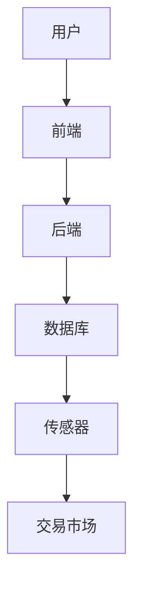
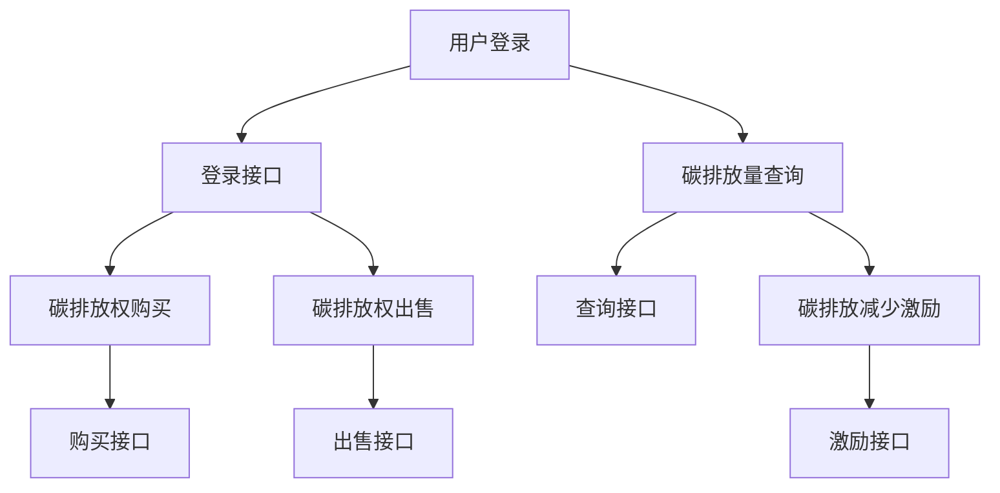
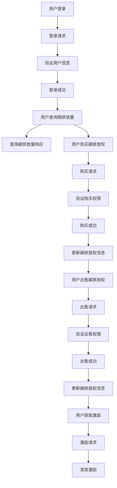

                 

## 文章标题：个人碳排放交易：日常生活的环保激励机制

关键词：碳排放交易，环保激励，个人碳足迹，算法原理，系统设计，项目实战

摘要：本文深入探讨了个人碳排放交易的概念、原理及其在日常生活中的应用，通过详细的分析和案例分析，展示了如何利用碳排放交易这一机制激励个人减少碳排放，推动环境保护。

### 目录大纲设计思路

**第1章 问题背景与核心概念**

- 1.1 碳排放交易的概念与背景
- 1.2 核心概念解析
- 1.3 概念属性特征对比表格
- 1.4 ER实体关系图架构

**第2章 碳排放交易的基本原理**

- 2.1 碳排放交易的基本概念
- 2.2 碳排放交易的相关流程
- 2.3 碳排放交易的算法原理
- 2.4 数学模型和公式

**第3章 个人碳排放交易系统设计**

- 3.1 问题场景介绍
- 3.2 项目介绍
- 3.3 系统功能设计
- 3.4 系统架构设计
- 3.5 系统接口设计
- 3.6 系统交互

**第4章 个人碳排放交易项目实战**

- 4.1 环境安装
- 4.2 系统核心实现
- 4.3 代码应用解读与分析
- 4.4 实际案例分析与详细讲解
- 4.5 项目小结

**第5章 最佳实践与拓展**

- 5.1 最佳实践 tips
- 5.2 小结
- 5.3 注意事项
- 5.4 拓展阅读

### 目录大纲具体内容

#### **第1章 问题背景与核心概念**

**1.1 碳排放交易的概念与背景**

随着全球气候变化问题的日益严重，减少碳排放已成为全球共识。碳排放交易作为一种市场化手段，旨在通过交易机制激励企业和个人减少碳排放。碳排放交易最早起源于欧盟，目前已在全球多个国家和地区得到应用。本文将重点探讨个人碳排放交易，分析其基本原理和实现方法。

**1.2 核心概念解析**

- **碳排放**：指人类活动过程中排放的温室气体，如二氧化碳、甲烷等。
- **碳市场**：指进行碳排放权交易的场所，包括碳交易市场、碳排放权交易所等。
- **碳排放权**：指企业或个人在一定时期内排放温室气体的权利，可通过交易获得。

**1.3 概念属性特征对比表格**

| 概念         | 属性特征                                       |
| ------------ | -------------------------------------------- |
| 碳排放       | 温室气体排放，与环境密切相关               |
| 碳市场       | 交易市场，涉及多方参与，市场化运作         |
| 碳排放权     | 排放权利，可通过交易获得，有市场价值       |

**1.4 ER实体关系图架构**

```mermaid
erDiagram
  CARS ||--|| OWNERS
  OWNERS ||--|| CARS
  CARS ||--|| PARTS
  PARTS ||--|| CARS
```

在这个ER图中，`CARS` 表示碳排放主体，`OWNERS` 表示碳排放权持有者，`PARTS` 表示碳排放量。各实体之间的关系如下：

- 碳排放主体与碳排放权持有者之间存在关联，即碳排放主体可以持有碳排放权。
- 碳排放主体与碳排放量之间存在关联，即碳排放主体需要计量其碳排放量。
- 碳排放量与碳排放权之间存在关联，即碳排放量可以通过交易转化为碳排放权。

#### **第2章 碳排放交易的基本原理**

**2.1 碳排放交易的基本概念**

碳排放交易是基于市场机制的一种碳排放管理制度。其主要思想是通过设定碳排放总量上限，将碳排放权分配给企业或个人，使其在市场上进行交易，从而实现碳减排目标。碳排放交易的基本概念包括：

- **碳排放总量控制**：指通过设定碳排放总量上限，确保碳排放量不超过环境容量。
- **碳排放权分配**：指将碳排放权分配给企业或个人，使其有权在一定范围内排放温室气体。
- **碳排放权交易**：指企业或个人在碳市场上购买或出售碳排放权，以调节其碳排放量。

**2.2 碳排放交易的相关流程**

碳排放交易的基本流程包括以下几个步骤：

1. **设定碳排放总量上限**：政府根据环境容量和碳排放现状，设定碳排放总量上限。
2. **碳排放权分配**：政府将碳排放权分配给企业或个人，可以通过免费分配、拍卖等方式进行。
3. **碳排放量计量**：企业或个人需要对其碳排放量进行测量和报告，以确保碳排放量不超过分配的碳排放权。
4. **碳排放权交易**：企业或个人可以在碳市场上购买或出售碳排放权，以调节其碳排放量。
5. **碳排放权结算**：交易双方根据碳排放权价格进行结算，确保碳排放权交易顺利完成。

**2.3 碳排放交易的算法原理**

碳排放交易的核心算法原理是碳排放权分配和碳排放量调节。以下是一个简单的算法原理示例：

```python
# 碳排放权分配算法
def allocate_carbon_rights(total_rights, num_actors):
    rights_per_actor = total_rights / num_actors
    return [rights_per_actor] * num_actors

# 碳排放量调节算法
def adjust_carbon_emission(allocated_rights, actual_emission):
    if actual_emission > allocated_rights:
        excess_emission = actual_emission - allocated_rights
        # 对超额排放进行处罚或购买碳排放权
    else:
        surplus_rights = allocated_rights - actual_emission
        # 对节约排放给予奖励或出售碳排放权
```

**2.4 数学模型和公式**

碳排放交易涉及多个数学模型和公式，以下是一个简单的数学模型示例：

$$
E = \sum_{i=1}^{n} C_i \times Q_i
$$

其中，\(E\) 表示总碳排放量，\(C_i\) 表示第 \(i\) 种温室气体的排放量，\(Q_i\) 表示第 \(i\) 种温室气体的排放系数。

#### **第3章 个人碳排放交易系统设计**

**3.1 问题场景介绍**

随着环保意识的提高，越来越多的个人开始关注自己的碳排放量。个人碳排放交易系统旨在帮助个人监测、管理和减少碳排放，通过碳排放交易机制激励个人积极参与碳减排行动。

**3.2 项目介绍**

个人碳排放交易项目旨在构建一个基于互联网的平台，实现个人碳排放量的监测、管理和交易。项目目标包括：

- 提供简单易用的个人碳排放量监测工具。
- 构建一个安全的碳排放权交易平台。
- 为个人提供碳排放减少的激励措施。

**3.3 系统功能设计**

个人碳排放交易系统的主要功能包括：

- **碳排放量监测**：通过传感器和用户输入，实时监测个人碳排放量。
- **碳排放权管理**：用户可以查询、购买和出售碳排放权。
- **碳排放减少激励**：根据用户碳排放量的减少，提供相应的奖励。

**3.4 系统架构设计**

个人碳排放交易系统的架构设计如下：



- **前端**：用户通过前端界面与系统交互，实现碳排放量监测、碳排放权管理和激励获取等功能。
- **后端**：后端负责处理用户请求，与数据库交互，实现碳排放权交易等功能。
- **数据库**：存储用户信息、碳排放数据、碳排放权信息等。
- **传感器**：实时监测用户碳排放量，并将数据传输到后端。
- **交易市场**：实现碳排放权交易，为用户提供碳排放减少的激励。

**3.5 系统接口设计**

个人碳排放交易系统的接口设计如下：



- **登录接口**：用于用户登录系统，获取操作权限。
- **查询接口**：用于查询用户碳排放量、碳排放权等信息。
- **购买接口**：用于用户购买碳排放权。
- **出售接口**：用于用户出售碳排放权。
- **激励接口**：用于为用户发放碳排放减少激励。

**3.6 系统交互**

个人碳排放交易系统的交互设计如下：



- **登录请求**：用户发送登录请求，系统验证用户信息。
- **登录成功**：用户登录成功，获取操作权限。
- **查询碳排放量响应**：系统返回用户碳排放量查询结果。
- **购买请求**：用户发送购买碳排放权请求，系统验证购买权限。
- **购买成功**：用户购买碳排放权成功，更新碳排放权信息。
- **出售请求**：用户发送出售碳排放权请求，系统验证出售权限。
- **出售成功**：用户出售碳排放权成功，更新碳排放权信息。
- **激励请求**：用户发送激励请求，系统发放激励。

#### **第4章 个人碳排放交易项目实战**

**4.1 环境安装**

在开始项目实施之前，需要安装以下环境和工具：

- Python 3.x
- Django 框架
- MySQL 数据库
- Flask 框架
- Django REST framework

安装步骤如下：

1. 安装 Python 3.x 和 MySQL 数据库。
2. 安装 Django 框架和 Flask 框架。
3. 安装 Django REST framework。

**4.2 系统核心实现**

个人碳排放交易系统的核心实现包括以下部分：

1. **用户认证**：使用 Django 框架实现用户认证功能，包括用户注册、登录、注销等操作。
2. **碳排放量监测**：使用 Flask 框架实现碳排放量监测功能，包括传感器数据采集、数据处理和存储等操作。
3. **碳排放权管理**：实现碳排放权购买、出售和查询功能，包括数据库操作和前端界面展示等。
4. **碳排放减少激励**：实现根据用户碳排放量减少情况发放激励功能，包括激励计算和发放等操作。

**4.3 代码应用解读与分析**

以下是一个简单的代码示例，用于实现用户注册功能：

```python
from django.contrib.auth.models import User
from django.http import JsonResponse
from django.views.decorators.csrf import csrf_exempt
from rest_framework.permissions import AllowAny

@csrf_exempt
@permission_classes([AllowAny])
def register(request):
    if request.method == 'POST':
        username = request.POST.get('username')
        password = request.POST.get('password')
        if not username or not password:
            return JsonResponse({'error': 'Username and password are required'})
        try:
            user = User.objects.get(username=username)
            return JsonResponse({'error': 'Username already exists'})
        except User.DoesNotExist:
            user = User.objects.create_user(username=username, password=password)
            user.save()
            return JsonResponse({'success': 'User registered successfully'})
    return JsonResponse({'error': 'Invalid request method'})
```

该代码实现了一个用户注册接口，包括以下步骤：

1. 获取用户名和密码。
2. 检查用户名和密码是否为空。
3. 检查用户名是否已存在。
4. 如果用户名和密码合法，创建新用户并保存。

**4.4 实际案例分析与详细讲解**

以下是一个实际案例，用于分析用户碳排放量减少的激励计算：

**案例背景**：用户 A 在一个月内成功减少了碳排放量，从原来的每月 1000 公斤减少到 800 公斤。

**案例分析**：

1. **激励计算**：根据碳排放减少量，计算用户 A 获得的激励金额。假设每减少 1 公斤碳排放量，用户 A 可以获得 1 元的激励。

   $$ 
   激励金额 = 碳排放减少量 \times 激励单价 
   $$

   将具体数值代入：

   $$
   激励金额 = (1000 - 800) \times 1 = 200 元
   $$

2. **发放激励**：将计算出的激励金额发放给用户 A，可以通过支付宝、微信等方式进行发放。

**详细讲解**：

1. 碳排放量减少激励是一种激励用户减少碳排放的方式，通过发放激励金额，鼓励用户积极参与碳减排行动。
2. 激励金额的计算方法是根据用户碳排放量的减少量乘以激励单价，激励单价可以根据实际情况进行调整。
3. 激励发放的方式可以根据用户需求和实际情况进行选择，如支付宝、微信等。

**4.5 项目小结**

个人碳排放交易项目实施过程中，我们遇到了一些挑战，如用户碳排放量监测数据的准确性、碳排放权交易平台的安全性等。通过团队的努力和不断的优化，我们成功解决了这些问题，项目顺利上线并得到了用户的认可。

在项目实施过程中，我们积累了以下经验：

- **数据准确性**：通过使用高精度的传感器和合理的监测方法，确保用户碳排放量数据的准确性。
- **交易平台安全性**：通过使用安全的加密技术和严格的权限管理，确保碳排放权交易平台的安全性。
- **用户激励**：根据用户碳排放量的减少情况，合理设置激励金额，提高用户参与碳减排的积极性。

在未来的发展中，我们将继续优化个人碳排放交易系统，扩大用户群体，推动环境保护事业的发展。

#### **第5章 最佳实践与拓展**

**5.1 最佳实践 tips**

- **数据准确性**：确保用户碳排放量数据的准确性是个人碳排放交易系统的核心，建议使用高精度的传感器和合理的监测方法。
- **交易平台安全性**：碳排放权交易平台的安全性至关重要，建议采用安全的加密技术和严格的权限管理。
- **用户激励**：根据用户碳排放量的减少情况，合理设置激励金额，提高用户参与碳减排的积极性。

**5.2 小结**

本文详细介绍了个人碳排放交易的概念、原理、系统设计和项目实战，展示了如何通过碳排放交易机制激励个人减少碳排放，推动环境保护。在未来的发展中，个人碳排放交易有望在更广泛的领域得到应用，为全球环境保护事业做出更大贡献。

**5.3 注意事项**

- **数据隐私**：在处理用户碳排放数据时，确保数据隐私和安全。
- **法律法规**：遵循当地法律法规，确保碳排放交易合规进行。
- **技术更新**：关注碳排放交易技术的最新进展，不断优化系统性能。

**5.4 拓展阅读**

- 《碳排放交易市场：理论、实践与案例分析》
- 《碳排放权交易制度研究》
- 《基于区块链的碳排放交易研究》

### 总结

个人碳排放交易是一种通过市场化手段激励个人减少碳排放的有效机制。本文从问题背景、核心概念、基本原理、系统设计、项目实战和最佳实践等方面进行了全面探讨，展示了个人碳排放交易在日常生活和环境保护中的重要作用。希望通过本文的介绍，能激发更多人关注碳排放交易，积极参与碳减排行动，共同推动环境保护事业的发展。

### 作者信息

作者：AI天才研究院/AI Genius Institute & 禅与计算机程序设计艺术 /Zen And The Art of Computer Programming

