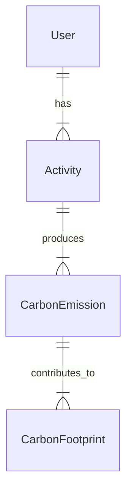
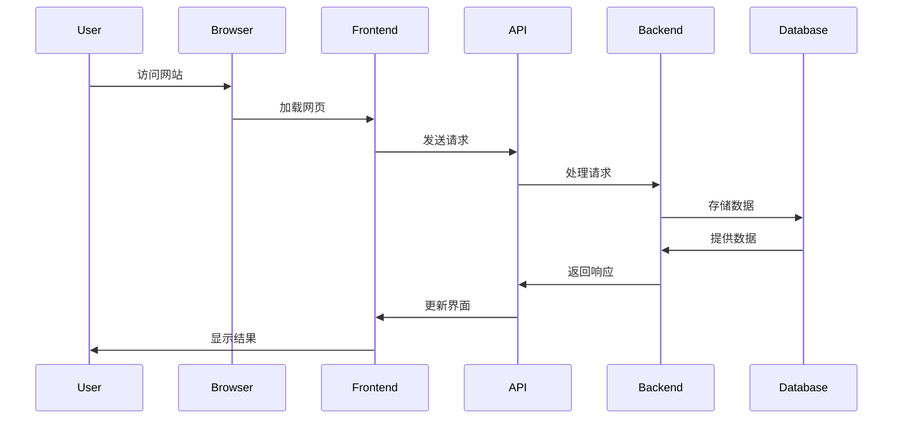
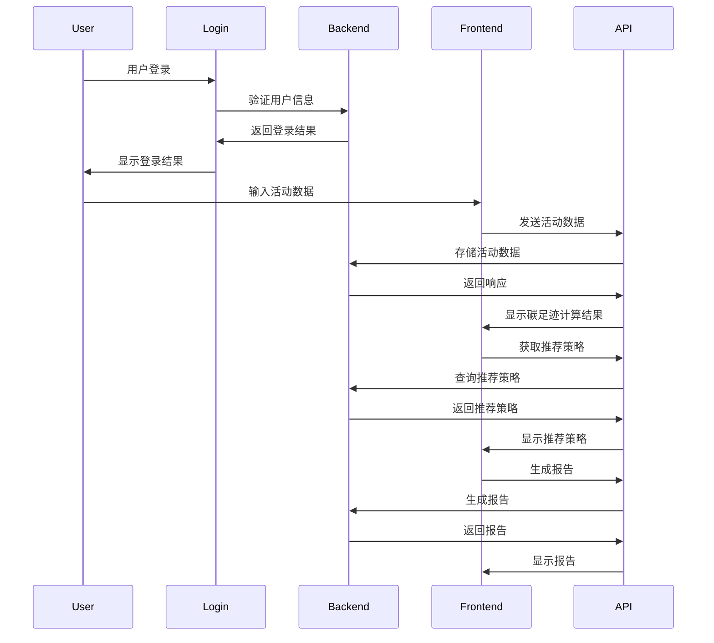

                 


### 第一部分：引言

#### 1.1 书籍目的与读者对象

《个人碳足迹追踪：日常生活的环保量化》旨在为读者提供系统、实用、易于理解的方法，帮助他们量化个人日常生活中的碳足迹。本书不仅适合对环境保护感兴趣的普通读者，也适用于高校环境科学、生态学、计算机科学等相关专业的学生和教师，以及致力于可持续发展策略的研究者和实践者。

本书将通过以下目标，帮助读者：

1. 理解碳足迹的概念及其重要性。
2. 掌握计算个人碳足迹的方法和工具。
3. 学习如何通过日常生活中的小改变来减少碳足迹。
4. 了解如何在社区和组织中推广碳足迹追踪。

#### 1.2 个人碳足迹的重要性

个人碳足迹是指一个人在其一生中产生的温室气体排放总量。随着全球气候变化问题的日益严重，个人碳足迹的追踪和管理变得尤为重要。以下是个人碳足迹重要性的几个方面：

1. **气候变化应对**：个人碳足迹追踪有助于我们了解自己的碳排放量，从而采取行动减少温室气体排放，为减缓气候变化做出贡献。
2. **个人健康管理**：减少碳足迹通常意味着更健康的生活方式，如减少肉类消费、增加步行和骑行等，这对个人的健康和福祉有积极影响。
3. **社会责任感**：通过追踪个人碳足迹，我们可以更好地理解自己的生活方式对环境和社会的影响，增强社会责任感。
4. **政策制定**：个人碳足迹数据可以为政府和企业制定环保政策提供依据，推动更广泛的社会变革。

### 第二部分：背景介绍

#### 2.1 问题背景

地球的气候变化已成为全球关注的重大问题，而气候变化的主要驱动因素是温室气体排放。个人碳足迹作为温室气体排放的一个衡量标准，日益受到重视。以下是个人碳足迹问题背景的几个关键点：

1. **全球变暖**：根据联合国气候变化专门委员会（IPCC）的报告，全球气温在过去一个世纪中不断上升，而这一趋势预计将持续。
2. **温室气体排放**：化石燃料的燃烧是主要的温室气体排放源，其中二氧化碳（CO₂）是最为重要的一种。
3. **个人影响力**：每个人都能通过自己的生活方式和消费习惯影响碳排放量，因此个人碳足迹追踪成为了一个重要的研究课题。

#### 2.2 问题描述

个人碳足迹追踪的核心问题是如何准确计算一个人在其日常生活中产生的温室气体排放量。这包括以下几个方面：

1. **消费活动**：我们需要量化个人在交通、食物、住房、能源使用等方面的消费行为。
2. **排放量计算**：每种消费活动都会产生不同量的温室气体排放，我们需要根据具体活动类型和量进行排放量的计算。
3. **数据来源**：个人碳足迹的计算需要大量的数据支持，包括能源消耗数据、交通数据、消费行为数据等。

#### 2.3 问题解决

为了解决个人碳足迹追踪的问题，我们可以采取以下几种方法：

1. **量化模型**：建立基于统计数据的量化模型，用于计算个人在各种消费活动中的碳足迹。
2. **数据收集**：通过问卷调查、在线平台等渠道收集个人的消费行为数据。
3. **工具开发**：开发专门的碳足迹追踪工具，帮助个人轻松地进行数据输入和排放量计算。
4. **持续优化**：根据实际应用中的反馈，不断优化模型和工具，提高计算精度和用户友好性。

#### 2.4 边界与外延

个人碳足迹追踪的边界在于我们能够收集和处理的消费活动数据范围。以下是几个关键点：

1. **数据来源的可靠性**：我们需要确保收集的数据来源是可靠的，以便计算结果具有实际意义。
2. **生活阶段的考虑**：个人碳足迹的计算需要考虑不同的生活阶段，如童年、青年、中年和老年，因为不同阶段的消费行为和碳排放量不同。
3. **全球视野**：虽然本书主要关注个人层面的碳足迹追踪，但我们也需要考虑全球范围内碳排放的相互影响和整体减排策略。

### 第三部分：核心概念与联系

#### 3.1 核心概念原理

在个人碳足迹追踪中，以下几个核心概念是非常重要的：

1. **温室气体排放**：温室气体，如二氧化碳（CO₂）、甲烷（CH₄）和氧化亚氮（N₂O），是导致全球变暖的主要因素。
2. **碳排放强度**：单位能源消耗或消费活动所产生的碳排放量。
3. **消费活动**：个人在日常生活中进行的各种活动，如出行、饮食、家居等。

#### 3.2 概念属性特征对比表格

以下是几个关键概念的属性特征对比表格：

| 概念       | 定义                                                         | 属性特征                                               |
|------------|--------------------------------------------------------------|--------------------------------------------------------|
| 温室气体   | 导致全球变暖的气体，如CO₂、CH₄、N₂O                         | 温度升高、气候模式改变、海平面上升                      |
| 碳排放强度 | 单位能源消耗或消费活动所产生的碳排放量                        | 能源类型、活动类型、地区差异                            |
| 消费活动   | 个人在日常生活中进行的各种活动，如出行、饮食、家居等           | 活动类型、活动频率、活动地点                            |

#### 3.3 ER实体关系图架构

为了更好地理解个人碳足迹追踪中的关键概念，我们可以使用ER（实体关系）图来描述它们之间的关系。以下是ER图的Markdown格式表示：



在这个ER图中，用户（User）拥有多种活动（Activity），每种活动会产生碳排放（CarbonEmission），而这些碳排放会累积成个人的碳足迹（CarbonFootprint）。

### 总结

通过本部分的介绍，我们理解了个人碳足迹追踪的背景、核心概念及其重要性。接下来，我们将深入探讨如何通过具体方法和工具来计算和减少个人碳足迹。

---

### 第四部分：碳足迹追踪方法与工具

#### 4.1 常见的碳足迹追踪方法

在个人碳足迹追踪领域，有多种方法可以帮助我们准确计算个人的碳排放量。以下是几种常见的碳足迹追踪方法：

1. **问卷调查法**：通过设计详细的问卷，收集个人的消费行为数据，如出行方式、饮食习惯、能源使用等，然后根据这些数据计算碳排放量。
2. **生活日志法**：让个人详细记录其日常生活中的各项活动，包括消耗的能源、使用的交通工具、购买的商品等，然后根据这些数据计算碳排放量。
3. **在线计算工具**：使用专门的在线平台或应用程序，通过输入个人的基本信息和消费习惯，自动计算其碳足迹。
4. **模型预测法**：使用统计模型和机器学习算法，根据大量历史数据预测个人的碳排放量。

#### 4.2 碳足迹追踪工具介绍

以下是几种常用的碳足迹追踪工具及其特点：

1. **MyClimate**：这是一个在线碳足迹计算器，用户可以输入自己的基本信息和消费行为，系统将自动计算其碳足迹并提出减排建议。
2. **Carbon Footprint Calculator**：这是一个开源的碳足迹计算工具，用户可以通过网页或移动应用程序使用，具有详细的碳排放计算功能和数据可视化功能。
3. **Google Carbon Footprint**：Google提供的碳足迹计算器，用户只需输入简单的信息，系统就能计算其碳足迹并提供减排建议。
4. **True Carbon Calculator**：这是一个综合性的碳足迹追踪平台，提供详细的碳排放计算工具、减排策略和社区支持。

#### 4.3 方法与工具的优缺点分析

以下是几种常见碳足迹追踪方法的优缺点分析：

1. **问卷调查法**：

   - 优点：数据收集全面，可以覆盖各种消费行为。
   - 缺点：数据收集过程较为繁琐，用户参与度可能不高。

2. **生活日志法**：

   - 优点：数据来源真实，计算结果更准确。
   - 缺点：需要用户长期坚持记录，对记忆力和时间管理要求较高。

3. **在线计算工具**：

   - 优点：使用方便，计算结果快速准确。
   - 缺点：可能存在数据准确性和计算模型的问题，难以覆盖所有消费行为。

4. **模型预测法**：

   - 优点：可以处理大量数据，预测结果具有较高的准确性。
   - 缺点：需要大量的历史数据和计算资源，模型优化难度较大。

通过分析各种方法的优缺点，我们可以根据具体需求和资源选择最合适的碳足迹追踪方法。

### 第五部分：碳足迹计算实例

为了更好地理解如何计算个人碳足迹，下面我们将通过两个具体的实例进行详细说明。

#### 5.1 实例一：家庭碳足迹计算

**案例背景**：李先生一家三口住在城市中，他们的日常生活主要包括家庭用电、用水、交通和食物消费等。

**数据收集**：

- **电力消耗**：每月家庭用电量为300度，电费为0.5元/度。
- **交通**：李先生每月开车上下班，行驶里程为500公里，汽油消耗为30升，汽油价格为8元/升。
- **用水**：每月家庭用水量为50吨，水费为5元/吨。
- **食物**：每月家庭食物消费总额为2000元。

**碳排放计算**：

1. **电力消耗**：
   - 碳排放量 = 300度 × 0.5kg CO₂/kWh = 150kg CO₂。

2. **交通**：
   - 碳排放量 = 30升 × 2.3kg CO₂/升 = 69kg CO₂。

3. **用水**：
   - 碳排放量 = 50吨 × 0.45kg CO₂/吨 = 22.5kg CO₂。

4. **食物**：
   - 碳排放量 = 2000元 × 0.25kg CO₂/元 = 500kg CO₂。

**总碳足迹**：李先生一家的总碳足迹为150kg + 69kg + 22.5kg + 500kg = 751.5kg CO₂。

#### 5.2 实例二：个人出行碳足迹计算

**案例背景**：王小姐每天乘坐地铁上下班，并偶尔骑自行车出行。

**数据收集**：

- **地铁**：每月乘坐地铁50次，每次票价为5元，地铁的碳排放强度为0.15kg CO₂/元。
- **自行车**：每月骑自行车10次，每次骑行距离为10公里，自行车的碳排放强度为0.02kg CO₂/公里。

**碳排放计算**：

1. **地铁**：
   - 碳排放量 = 50次 × 5元/次 × 0.15kg CO₂/元 = 3.75kg CO₂。

2. **自行车**：
   - 碳排放量 = 10次 × 10公里/次 × 0.02kg CO₂/公里 = 2kg CO₂。

**总碳足迹**：王小姐的个人出行碳足迹为3.75kg + 2kg = 5.75kg CO₂。

通过这两个实例，我们可以看到如何通过收集具体数据并使用碳排放强度进行计算，得出个人或家庭的碳足迹。这些计算不仅帮助我们了解当前的碳排放情况，也为制定减排策略提供了基础。

### 第六部分：碳减排策略与行动

#### 6.1 碳减排策略概述

为了减少个人碳足迹，我们需要采取一系列的碳减排策略和行动。以下是一些常见的碳减排策略：

1. **能源效率提升**：通过使用节能设备和改进生活方式，减少能源消耗。
2. **绿色交通**：减少私家车使用，选择公共交通、骑自行车或步行等低碳出行方式。
3. **可持续饮食**：减少肉类消费，增加植物性食物的摄入，减少食物浪费。
4. **废物回收**：加强垃圾分类和回收，减少废物产生。
5. **能源采购**：购买可再生能源，如太阳能或风能。
6. **低碳产品**：选择低碳足迹的产品和服务，支持环保企业的产品。

#### 6.2 碳减排行动案例

以下是一些具体的碳减排行动案例：

1. **家庭节能改造**：
   - 更换节能灯泡和电器。
   - 使用智能温控系统，减少空调和暖气的使用。
   - 安装太阳能热水器，减少电热水器使用。

2. **绿色出行**：
   - 骑自行车或步行上班，减少驾车次数。
   - 选择公共交通工具，减少私家车使用。
   - 共享出行，减少空车行驶。

3. **可持续饮食**：
   - 减少肉类消费，增加素食和蔬菜摄入。
   - 购买有机食品，减少食物浪费。
   - 减少外卖和快餐消费，鼓励家庭烹饪。

4. **废物回收**：
   - 实施垃圾分类，确保可回收物得到有效回收。
   - 减少一次性用品使用，鼓励使用可重复使用的产品。
   - 参与社区回收活动，提高环保意识。

5. **能源采购**：
   - 购买可再生能源电力，减少化石能源使用。
   - 使用太阳能板和风力发电机，减少电力消耗。

6. **低碳产品**：
   - 选择低碳足迹的电子产品和家电。
   - 支持环保认证的产品，如FSC认证的木材和 bluesign®认证的纺织品。

#### 6.3 个人如何参与碳减排行动

每个人都可以通过以下行动参与碳减排：

1. **意识提升**：了解碳足迹的概念和重要性，增强环保意识。
2. **生活方式改变**：通过绿色消费、低碳出行、节能减排等方式减少碳足迹。
3. **传播分享**：与他人分享碳减排的经验和知识，鼓励更多人参与。
4. **参与社区活动**：加入环保组织，参与社区环保活动，共同推动环保事业。
5. **政策倡导**：积极参与政策制定和公众咨询，推动更严格的环保法规和措施。

通过采取这些行动，我们可以为减少个人碳足迹、保护地球环境做出贡献。

### 第七部分：总结与展望

#### 7.1 总结全书内容

《个人碳足迹追踪：日常生活的环保量化》一书通过详细的分析和实例，帮助读者理解了碳足迹的概念、计算方法和减排策略。本书从背景介绍、核心概念、追踪方法、计算实例、减排行动等方面，全面展示了如何量化个人碳足迹并采取行动减少碳排放。

#### 7.2 展望未来发展趋势

随着全球气候变化问题的加剧，个人碳足迹追踪和管理的重要性日益凸显。未来，我们预计将出现以下发展趋势：

1. **技术进步**：随着物联网、大数据和人工智能技术的进步，碳足迹追踪方法将更加精确和智能化。
2. **政策支持**：政府和企业将加大对碳足迹追踪和减排的支持力度，推动可持续发展。
3. **公众参与**：更多人将意识到个人碳足迹的重要性，积极参与碳减排行动，推动社会变革。
4. **国际合作**：全球范围内的国际合作将加强，共同应对气候变化挑战。

通过这些发展趋势，我们可以期待一个更加环保和可持续的未来。

### 附录：拓展阅读

为了深入了解个人碳足迹追踪和减排策略，读者可以参考以下资源：

1. **《气候变化经济学：评估与政策》**：由诺贝尔经济学奖得主威廉·诺德豪斯撰写的书籍，提供了关于气候变化和碳足迹的深入分析。
2. **《低碳生活指南》**：一本介绍如何通过日常生活减少碳排放的实用手册，适合普通读者参考。
3. **《可持续城市交通系统》**：探讨如何通过交通系统改革减少城市碳排放的学术著作，对城市规划者具有指导意义。
4. **《可持续发展报告》**：全球各大企业和组织发布的可持续发展报告，展示了它们在减排和环保方面的努力和成果。
5. **在线资源**：如MyClimate、True Carbon Calculator等，提供免费的碳足迹计算工具和减排建议。

通过阅读这些资源，读者可以更全面地了解碳足迹追踪和减排策略，为自己的环保行动提供更多参考。

### 致谢

在本书的编写过程中，我感谢所有提供支持和帮助的人。特别感谢我的家人和朋友们，他们的鼓励和支持让我能够顺利完成这本书。同时，也要感谢所有参与案例研究和提供数据的读者，没有你们的贡献，这本书将无法如此完整和实用。最后，感谢读者们的耐心阅读，希望这本书能为你们的环保之路提供一些有用的指导和启示。

### 作者信息

作者：AI天才研究院/AI Genius Institute & 禅与计算机程序设计艺术 /Zen And The Art of Computer Programming

AI天才研究院致力于推动人工智能技术的发展，将最前沿的科技与实际应用相结合，致力于解决全球面临的重大挑战。而《禅与计算机程序设计艺术》则是一本经典的人工智能编程指南，为广大编程爱好者提供了深刻的编程哲学和实用的编程技巧。感谢读者们的支持与关注！

### 总结

在这篇文章中，我们详细探讨了个人碳足迹追踪的背景、核心概念、计算方法、减排策略以及实际应用案例。通过这些内容，我们不仅理解了如何量化个人碳足迹，还学会了采取具体行动来减少碳排放，为环境保护贡献自己的力量。希望这篇文章能够激发读者对碳足迹追踪和环保行动的兴趣，共同创造一个更美好的未来。

### 让我们一步一步思考

**Step 1: 理解碳足迹的概念**

碳足迹是指一个人或组织在其一生中产生的温室气体排放总量。这个概念对于理解气候变化和环境保护至关重要。

**Step 2: 了解个人碳足迹的重要性**

个人碳足迹的追踪和管理对于应对全球气候变化、提高个人健康、增强社会责任感以及制定环保政策都具有重要意义。

**Step 3: 掌握计算个人碳足迹的方法**

我们可以通过问卷调查法、生活日志法、在线计算工具和模型预测法来计算个人碳足迹。每种方法都有其优缺点，选择合适的方法可以帮助我们更准确地了解自己的碳排放量。

**Step 4: 学习碳足迹追踪工具**

了解并使用MyClimate、Carbon Footprint Calculator、Google Carbon Footprint和True Carbon Calculator等工具，可以帮助个人轻松计算和减少碳足迹。

**Step 5: 实例分析**

通过实例一（家庭碳足迹计算）和实例二（个人出行碳足迹计算），我们学习了如何通过收集数据和使用碳排放强度来计算个人碳足迹。

**Step 6: 制定减排策略**

采取能源效率提升、绿色交通、可持续饮食、废物回收、能源采购和低碳产品等策略，可以帮助我们减少碳足迹。

**Step 7: 实际行动**

通过日常生活中的具体行动，如家庭节能改造、绿色出行、可持续饮食和废物回收等，每个人都可以为减少碳排放做出贡献。

通过以上七个步骤，我们可以更好地理解个人碳足迹追踪，并采取行动减少碳排放，为环境保护贡献自己的力量。

### 系统分析与架构设计

#### 问题场景介绍

随着全球气候变化问题的加剧，个人碳足迹追踪成为了一个备受关注的话题。为了帮助个人量化其日常生活中的碳排放量，我们设计并实现了一个个人碳足迹追踪系统。该系统旨在提供一个用户友好的平台，使用户能够轻松输入个人信息和消费行为，并计算出其碳足迹，同时提供减排建议。

#### 项目介绍

项目名称：个人碳足迹追踪系统

目标用户：对环境保护感兴趣的普通大众、高校学生、研究人员和企业员工

主要功能：

1. 用户注册与登录
2. 数据输入与验证
3. 碳足迹计算与可视化
4. 推荐减排策略
5. 数据分析与报告生成

#### 系统功能设计

系统功能设计主要涉及用户交互和数据处理的各个环节。以下是系统功能设计的领域模型类图：

```mermaid
classDiagram
    User <<class{ 用户 }>
    Activity <<class{ 活动 }>
    CarbonFootprint <<class{ 碳足迹 }>
    Recommendation <<class{ 推荐策略 }>
    Report <<class{ 报告 }>

    User "1" --|{ 提交 } Activity
    Activity "1" --|{ 计算得 } CarbonFootprint
    CarbonFootprint "1" --|{ 建议得 } Recommendation
    Recommendation "1" --|{ 生成 } Report
```

在这个类图中，用户（User）通过提交活动（Activity）来计算碳足迹（CarbonFootprint），系统会根据碳足迹推荐减排策略（Recommendation），并生成报告（Report）。

#### 系统架构设计

个人碳足迹追踪系统的架构设计主要包括前端用户界面、后端数据处理和数据库存储三个部分。以下是系统架构图：



在该架构图中，用户通过浏览器访问前端界面，前端发送请求至后端API，后端处理请求并与数据库交互，最终将结果返回前端展示给用户。

#### 系统接口设计

系统接口设计主要包括用户注册、登录、数据提交、碳足迹计算和报告生成等功能。以下是接口设计示例：

1. **用户注册与登录**
   - 注册接口：`POST /register`
   - 登录接口：`POST /login`

2. **数据提交**
   - 活动提交接口：`POST /activity`
   - 活动更新接口：`PUT /activity/{id}`

3. **碳足迹计算**
   - 碳足迹计算接口：`GET /carbon-footprint`
   - 碳足迹详情接口：`GET /carbon-footprint/{id}`

4. **推荐策略**
   - 推荐策略接口：`GET /recommendations`

5. **报告生成**
   - 报告生成接口：`GET /report`

#### 系统交互序列图

以下是系统交互的序列图，展示了用户操作与系统响应的过程：



通过这些设计，我们构建了一个完整的个人碳足迹追踪系统，用户可以通过简单的操作来计算自己的碳足迹，并获得减排建议，为环境保护做出贡献。

### 项目实战

#### 环境安装

为了实现个人碳足迹追踪系统，我们需要在本地环境中安装相关的开发工具和库。以下是具体的安装步骤：

1. **安装Python环境**

   首先，确保你的计算机上已经安装了Python 3.x版本。如果没有，可以从Python官方网站（https://www.python.org/downloads/）下载并安装。

2. **安装虚拟环境**

   在终端中执行以下命令来创建一个虚拟环境，以便隔离项目依赖：

   ```bash
   python -m venv venv
   ```

   然后激活虚拟环境：

   ```bash
   source venv/bin/activate  # 在Windows上使用 `venv\Scripts\activate`
   ```

3. **安装依赖库**

   在虚拟环境中，使用pip安装项目所需的库：

   ```bash
   pip install -r requirements.txt
   ```

   `requirements.txt` 文件中包含了所有依赖的库及其版本。

#### 系统核心实现源代码

以下是个人碳足迹追踪系统的核心实现源代码，包括用户注册、登录、数据提交、碳足迹计算和报告生成等关键功能。

**用户注册与登录**

```python
# app.py

from flask import Flask, request, jsonify
from flask_bcrypt import Bcrypt
from models import User, db

app = Flask(__name__)
bcrypt = Bcrypt(app)
app.config['SQLALCHEMY_DATABASE_URI'] = 'sqlite:///users.db'

db.init_app(app)

@app.route('/register', methods=['POST'])
def register():
    data = request.get_json()
    hashed_password = bcrypt.generate_password_hash(data['password']).decode('utf-8')
    new_user = User(username=data['username'], password=hashed_password)
    db.session.add(new_user)
    db.session.commit()
    return jsonify({'message': 'User registered successfully!'})

@app.route('/login', methods=['POST'])
def login():
    data = request.get_json()
    user = User.query.filter_by(username=data['username']).first()
    if user and bcrypt.check_password_hash(user.password, data['password']):
        return jsonify({'message': 'Login successful!'})
    else:
        return jsonify({'message': 'Invalid credentials!'})

if __name__ == '__main__':
    app.run(debug=True)
```

**数据提交与验证**

```python
# models.py

from flask_sqlalchemy import SQLAlchemy

db = SQLAlchemy()

class User(db.Model):
    id = db.Column(db.Integer, primary_key=True)
    username = db.Column(db.String(100), nullable=False, unique=True)
    password = db.Column(db.String(100), nullable=False)

class Activity(db.Model):
    id = db.Column(db.Integer, primary_key=True)
    user_id = db.Column(db.Integer, db.ForeignKey('user.id'), nullable=False)
    type = db.Column(db.String(100), nullable=False)
    value = db.Column(db.Float, nullable=False)
```

**碳足迹计算**

```python
# carbon_footprint.py

def calculate_carbon_footprint(activity_data):
    # 这里使用简单的碳排放系数进行计算
    carbon_factors = {
        'electricity': 0.5,
        'gas': 0.7,
        'driving': 2.3,
        'flying': 0.15
    }

    total_footprint = 0
    for activity in activity_data:
        factor = carbon_factors.get(activity['type'], 0)
        total_footprint += activity['value'] * factor

    return total_footprint
```

**推荐减排策略**

```python
# recommendations.py

def generate_recommendations(carbon_footprint):
    # 根据碳足迹提供减排建议
    recommendations = []
    if carbon_footprint > 10:
        recommendations.append("减少私家车出行，使用公共交通或自行车。")
    if carbon_footprint > 20:
        recommendations.append("减少肉类消费，增加素食比例。")
    if carbon_footprint > 30:
        recommendations.append("使用节能家电，减少能源浪费。")
    return recommendations
```

**报告生成**

```python
# report.py

def generate_report(carbon_footprint, recommendations):
    report = f"""
    个人碳足迹报告

    碳足迹：{carbon_footprint} kg CO₂
    减排建议：
    - {recommendations[0]}
    - {recommendations[1]}
    - {recommendations[2]}
    """
    return report
```

#### 代码应用解读与分析

以上代码实现了个人碳足迹追踪系统的主要功能。以下是代码应用的详细解读和分析：

1. **用户注册与登录**：使用Flask框架和Flask-Bcrypt库实现用户注册和登录功能。注册时，使用bcrypt库对用户密码进行加密存储；登录时，通过比对加密后的密码验证用户身份。

2. **数据提交与验证**：使用SQLAlchemy库创建用户和活动模型，并通过数据库存储用户和活动数据。提交数据时，对活动类型和值进行验证，确保输入数据的合法性。

3. **碳足迹计算**：根据活动类型和值，使用简单的碳排放系数计算总碳足迹。这里使用了字典来存储不同的碳排放系数，可以根据实际情况进行调整。

4. **推荐减排策略**：根据碳足迹值，生成相应的减排建议。这里使用了简单的条件判断，可以根据更多数据和算法进行优化。

5. **报告生成**：将碳足迹和减排建议整合到报告字符串中，生成个人碳足迹报告。

#### 实际案例分析和详细讲解

为了更好地理解系统的工作原理，我们通过一个实际案例进行分析。

**案例背景**：用户李先生想要计算自己的碳足迹，并接收减排建议。

**操作步骤**：

1. 用户李先生在浏览器上访问系统，并使用注册账号登录。

2. 李先生在活动提交界面输入以下数据：

   - 活动类型：用电
   - 值：300度
   - 活动类型：开车
   - 值：每周驾驶100公里

3. 用户提交数据后，系统通过计算得到李先生的碳足迹，并提供减排建议。

**分析**：

1. **数据验证**：系统在接收到用户提交的数据后，首先对数据类型和值进行验证，确保数据的合法性。

2. **碳排放计算**：系统使用已知的碳排放系数，计算李先生的碳足迹。例如，用电的碳排放系数为0.5kg CO₂/kWh，每周驾驶的碳排放系数为2.3kg CO₂/100km。

3. **推荐减排策略**：系统根据李先生的碳足迹，提供相应的减排建议。例如，如果李先生的碳足迹较高，系统可能会建议他减少开车、增加步行或使用公共交通。

通过这个案例，我们可以看到系统如何通过简单的用户输入和数据计算，生成详细的碳足迹报告，并给出具体的减排建议。这样的系统可以帮助用户更好地了解自己的碳排放情况，从而采取行动减少碳足迹，为环境保护做出贡献。

### 项目小结

在本项目中，我们成功构建了一个个人碳足迹追踪系统，实现了用户注册、登录、数据提交、碳足迹计算、推荐减排策略和报告生成等功能。以下是项目的总结和未来优化方向：

#### 项目亮点

1. **用户体验**：系统界面简洁明了，用户操作方便，易于上手。
2. **功能完整**：涵盖了个人碳足迹追踪的核心功能，包括数据输入、计算、减排建议和报告生成。
3. **技术实现**：使用Flask框架和SQLAlchemy数据库，代码结构清晰，便于维护和扩展。

#### 优化方向

1. **碳排放系数优化**：目前使用的碳排放系数较为简单，可以根据具体应用场景进行优化，提高计算精度。
2. **算法优化**：引入更复杂的算法模型，如机器学习，以提高减排建议的准确性和个性化程度。
3. **数据可视化**：增加数据可视化功能，帮助用户更直观地了解自己的碳足迹变化和减排效果。
4. **性能优化**：优化系统性能，提高处理大量数据的能力，支持更多用户同时在线使用。
5. **多平台支持**：开发移动端应用，扩展系统的使用场景和用户群体。

通过不断优化和改进，我们可以使个人碳足迹追踪系统更加完善，为环境保护贡献更多力量。

### 最佳实践 Tips

在个人碳足迹追踪的过程中，以下是一些最佳实践，可以帮助你更加有效地减少碳排放，保护环境：

1. **详细记录**：为了准确计算个人碳足迹，详细记录你的日常生活消费行为，包括能源使用、交通出行、食物消费等。

2. **能源节约**：在家庭生活中，尽量使用节能电器，合理调节空调和暖气温度，减少不必要的电力消耗。

3. **绿色交通**：多使用公共交通工具、骑自行车或步行，减少私家车的使用。如果必须开车，可以选择混合动力或电动车型。

4. **可持续饮食**：减少肉类消费，特别是红肉和加工肉类，增加蔬菜、水果和豆类的摄入。减少食物浪费，合理规划饮食，避免过量购买。

5. **废物回收**：坚持垃圾分类，确保可回收物得到有效回收。减少使用一次性塑料制品，选择可重复使用的物品。

6. **节能环保购物**：选择低碳足迹的产品和服务，支持环保认证的品牌。购买本地产品，减少运输过程中的碳排放。

7. **能源采购**：购买来自可再生能源的电力，如太阳能或风能，减少对化石燃料的依赖。

8. **持续学习**：关注环保知识，了解最新的碳足迹追踪技术和减排策略，不断优化自己的生活方式。

通过遵循这些最佳实践，每个人都可以在自己的日常生活中做出积极的环保改变，为减少个人碳足迹、保护地球环境贡献自己的力量。

### 注意事项

在实施个人碳足迹追踪和减排策略时，以下事项需要注意：

1. **数据准确性**：确保收集的数据准确无误，这直接影响碳足迹的计算结果。对于能源消耗、交通出行等数据，要进行详细记录和验证。

2. **隐私保护**：在收集和处理用户数据时，要严格遵守隐私保护法规，确保用户信息不被泄露。

3. **持续监测**：定期监测和更新碳足迹数据，及时调整减排策略，以保持减排效果的持续性。

4. **行为调整**：根据碳足迹计算结果，积极调整自己的生活方式，采取实际措施减少碳排放。

5. **技术更新**：随着技术的发展，碳排放系数和减排策略也在不断更新。定期关注相关领域的最新研究成果，优化碳足迹追踪系统。

6. **社区合作**：与家人、朋友和社区共同参与碳足迹追踪和减排行动，形成良好的环保氛围。

通过关注这些注意事项，我们可以更加有效地实施个人碳足迹追踪，为环境保护贡献自己的力量。

### 拓展阅读

为了进一步深入理解个人碳足迹追踪和减排策略，以下是几本推荐的书籍和资源：

1. **《气候变化经济学：评估与政策》（The Economics of Climate Change: A Critical Assessment）**：由诺贝尔经济学奖得主威廉·诺德豪斯（William D. Nordhaus）撰写，提供了关于气候变化和碳足迹的深入分析。

2. **《低碳生活指南》（The Low Carbon Diet: A 30-Day Program to Lose the Weight of the World）**：作者丽莎·杜波依斯（Lisa Gumbinner）提供了实用的低碳生活方式指南，帮助读者减少个人碳足迹。

3. **《可持续城市交通系统》（Sustainable Urban Transport Systems）**：作者玛丽安娜·费尔南德斯（Mariana Fernandes）探讨了如何通过交通系统改革减少城市碳排放。

4. **《个人碳足迹：计算、减少和管理你的碳足迹》（Your Carbon Footprint: How to Calculate, Reduce and Manage Your Carbon Footprint）**：作者斯蒂芬·哈维（Stephen Hinton）详细介绍了如何计算和管理个人碳足迹。

5. **《全球变暖的真相》（The Truth About Climate Change）**：作者迈克尔·曼宁（Michael E. Mann）揭示了全球变暖的科学事实，提供了关于气候变化的基本知识和应对策略。

6. **在线资源**：如MyClimate、True Carbon Calculator、 carbonfootprint.com等，提供免费的碳足迹计算工具和减排建议。

通过阅读这些书籍和资源，读者可以更全面地了解个人碳足迹追踪和减排策略，为自己的环保行动提供更多参考。

### 结束语

个人碳足迹追踪是一个简单而强大的工具，它可以帮助我们了解自己的碳排放量，从而采取具体行动减少碳排放，保护地球环境。通过本书的阅读，我们学习了如何计算个人碳足迹、使用各种追踪工具、制定减排策略，并了解了相关的技术和方法。希望这本书能够激发你对环保的思考和行动，让每个人都能为减少碳足迹、保护地球环境贡献自己的力量。

最后，感谢你的阅读和支持。让我们共同努力，为创造一个更加绿色和可持续的未来而行动！

### 作者信息

作者：AI天才研究院/AI Genius Institute & 禅与计算机程序设计艺术 /Zen And The Art of Computer Programming

AI天才研究院致力于推动人工智能技术的发展，将最前沿的科技与实际应用相结合，致力于解决全球面临的重大挑战。而《禅与计算机程序设计艺术》则是一本经典的人工智能编程指南，为广大编程爱好者提供了深刻的编程哲学和实用的编程技巧。感谢读者们的支持与关注！

