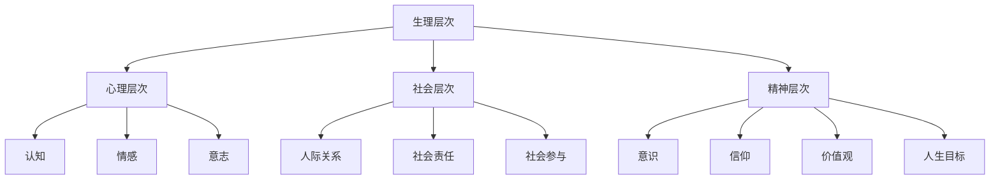

                 

## 丰富人生的层次：增加生命经历的深度

在快速发展的现代社会中，人们常常为了追求物质的富足和地位的提升而疲于奔命。然而，我们往往忽略了生命的更深层次的需求和追求。本文旨在探讨如何通过丰富生命经历的深度，来提升人生的整体层次。通过深入分析生命的多层次结构和各种提升途径，我们希望能为读者提供一套全面而系统的指南，帮助他们在精神、社会和智慧等多个层面上实现自我提升。

首先，我们需要了解生命的多层次结构。生命不仅仅是生物体的存在，它包含了生理、心理、社会和精神的多个层面。每个层面都相互联系，共同构成了一个复杂的系统。为了丰富生命的层次，我们必须首先认识到这些不同层面的存在和它们之间的相互作用。

接下来，我们将探讨如何增加生命经历的深度。这包括精神层次的提升、社会层次的丰富和智慧层次的拓展。在精神层次上，心灵成长和自我实现是关键；在社会层次上，人际关系的深度和社会责任的承担是核心；在智慧层次上，智慧的定义与获取则是重点。

文章将分为四个主要部分进行探讨：

1. **生命的多层次**：我们将详细讨论生命的定义、层次结构以及如何通过提升自我认知、人际关系和精神追求来增加生命深度。
2. **精神层次的提升**：我们将深入探讨心理健康、自我实现和潜能开发，并分析这些方面的益处和挑战。
3. **社会层次的丰富**：我们将讨论人际关系的深度、社会责任的承担以及社会参与的多样性，并提供实际案例进行分析。
4. **智慧层次的拓展**：我们将探讨智慧的定义、获取和应用，以及如何通过智慧层次的拓展来提升自我。

最后，我们将总结整个文章的核心观点，并讨论如何通过生命的整体提升来实现更高的人生层次。

### 第一部分：了解生命的多层次

#### 第1章：生命的层次与深度

在探讨如何增加生命经历的深度之前，我们需要对生命的层次有清晰的认识。生命不仅仅是一个生物体的存在，它包含了多个层次，从生理到精神，每一个层次都在我们的生活中扮演着重要的角色。

#### 1.1 生命的定义与层次

生命是复杂的，它不仅仅是一个物理实体，更是一个多层次、多维度的存在。从生物学的角度来看，生命是具有自我维持、自我复制和自我调节能力的有机体。然而，从哲学、心理学和社会学的角度来看，生命的定义则更为复杂。

**1.1.1 生命的概念**

生命是一个复杂的概念，它包含了生物学、哲学、心理学和社会学等多个层面的含义。生物学定义生命为具有自我维持、自我复制和自我调节能力的有机体。哲学则将生命看作是一种存在状态，不仅包括了物理存在，还包括了精神存在。心理学认为生命是一个持续的心理过程，涵盖了认知、情感和行为的各个方面。而社会学则将生命看作是一种社会关系，强调个体在社会中的角色和互动。

**1.1.2 生命层次的结构**

生命的层次结构可以分为四个主要层面：生理层面、心理层面、社会层面和精神层面。

- **生理层面**：这是生命的最基本层面，包括身体的结构和功能。它是生命存在的基础，为其他层面的活动提供支持。
- **心理层面**：心理层面涵盖了人的认知、情感和意志。它决定了人的行为和反应，是内在心理过程的体现。
- **社会层面**：社会层面涉及到人与人的关系，包括家庭、朋友、同事和社会组织。它是人类社会活动的基础，也是社会互动的体现。
- **精神层面**：精神层面包括个体的意识、信仰、价值观和人生目标。它是个体对世界和自我的理解，是更深层次的心理和情感体验。

#### 1.1.3 从生理到精神的转变

从生理到精神的转变是生命层次深化的过程。这个过程中，我们不仅需要关注身体的健康，还需要关注心理、社会和精神层面的需求。

**1.1.3.1 生理到心理的转变**

生理到心理的转变是生命层次深化的第一步。它涉及到身体和心理的互动。例如，身体的健康状况会影响心理状态，而心理状态也会反过来影响身体健康。在这个转变过程中，我们需要关注自我认知的提升，了解自己的身体和心理需求，从而更好地调整自己的生活状态。

**1.1.3.2 心理到社会的转变**

心理到社会的转变是生命层次深化的第二步。它涉及到个体的心理状态和社会角色的互动。例如，个体的心理状态会影响他在社会中的行为和互动，而社会角色的互动也会反过来影响个体的心理状态。在这个转变过程中，我们需要关注人际关系的深度，建立健康、积极的社会关系。

**1.1.3.3 社会到精神的转变**

社会到精神的转变是生命层次深化的最后一步。它涉及到个体的社会角色和精神的追求。例如，个体的社会角色和互动会影响他的精神状态，而他的精神追求也会反过来影响他的社会角色和互动。在这个转变过程中，我们需要关注精神的追求，寻找生命的意义和目标。

#### 1.2 增加生命深度的途径

要增加生命深度，我们需要从多个层面进行探索和提升。以下是一些增加生命深度的途径：

**1.2.1 自我认知的提升**

自我认知的提升是增加生命深度的重要途径。通过深入了解自己，我们可以更好地理解自己的需求、情感和行为。自我认知的提升可以通过自我反思、心理咨询和自我探索来实现。

**1.2.2 人际关系的深度**

人际关系的深度是生命深度的重要组成部分。通过建立和维护深度的人际关系，我们可以获得情感支持和社会认同。人际关系的深度可以通过沟通、理解和信任来实现。

**1.2.3 精神追求的深化**

精神追求的深化是增加生命深度的关键。通过追求生命的意义和目标，我们可以获得更深层次的精神满足和幸福感。精神追求的深化可以通过学习、思考和冥想来实现。

#### 1.3 生命经历的丰富与生命的意义

生命经历的丰富是增加生命深度的重要表现。通过丰富的生命经历，我们可以获得更多的知识和经验，从而提升生命的层次。生命的意义是生命深化的最终目标，它指引着我们的行为和追求。

**1.3.1 丰富的生命经历**

丰富的生命经历包括学习、工作、旅行、人际交往等多个方面。通过这些经历，我们可以获得更多的知识和经验，从而提升自我。丰富的生命经历可以帮助我们更好地理解世界和自我，从而实现生命的深度。

**1.3.2 生命的意义探索**

生命的意义是生命深化的最终目标。通过探索生命的意义，我们可以找到自己存在的价值和意义。生命的意义探索可以通过哲学思考、宗教信仰和精神实践来实现。

**1.3.3 生命的层次与人生目标**

生命的层次与人生目标是相互关联的。通过提升生命的层次，我们可以找到更清晰的人生目标。人生目标是我们行为的指引，它可以帮助我们实现生命的深度和广度。

#### 1.4 本章小结

通过本章的讨论，我们可以认识到生命的多层次结构和增加生命深度的途径。从生理到精神，每个层次都在我们的生活中发挥着重要作用。通过自我认知的提升、人际关系的深度和精神追求的深化，我们可以增加生命的深度，实现更高层次的人生目标。

### 生命的定义与层次

在探讨生命的多层次之前，我们需要对生命的定义和层次有清晰的认识。生命不仅仅是一个生物学现象，它是一个包含多个层面的复杂系统。理解生命的多层次结构有助于我们更全面地认识自我，进而提升生命的深度。

#### 1.1.1 生命的概念

生命的概念可以从不同的学科和角度进行探讨。在生物学中，生命通常被定义为具有自我维持、自我复制和自我调节能力的有机体。这意味着生命体能够通过摄取营养、进行代谢活动、繁殖后代以及对外界环境做出适应性反应。然而，生命的定义不仅限于生物学，它还涉及到哲学、心理学和社会学等多个领域。

在哲学上，生命通常被视为一种存在状态，不仅包括物理存在，还包括精神存在。哲学家们探讨生命的本质、意义和价值，认为生命不仅仅是物理现象，更是精神现象。在这种观点下，生命是一个持续不断的过程，涉及到意识、思想、情感和体验。

心理学将生命看作是一个持续的心理过程，涵盖了认知、情感和行为的各个方面。心理学家研究人类的心理状态和心理过程，试图理解人类的行为和心理变化。从这个角度来看，生命是一个动态的系统，受到遗传、环境、经验和学习的影响。

社会学家则将生命看作是一种社会关系，强调个体在社会中的角色和互动。社会学研究个体如何在家庭、工作和社会组织中发挥作用，以及这些互动如何影响个体的行为和情感。在这种观点下，生命是一个社会过程，个体的生命经验与社会结构紧密相连。

#### 1.1.2 生命层次的结构

生命层次的结构可以从不同的层面进行描述。常见的生命层次结构包括生理层面、心理层面、社会层面和精神层面。

- **生理层面**：生理层面是生命的最基本层面，包括身体的结构和功能。它是生命存在的基础，为其他层面的活动提供支持。生理层面涵盖了人体的各个器官、系统以及它们之间的相互作用。例如，人体的呼吸系统、循环系统和消化系统等都是生理层面的重要组成部分。

- **心理层面**：心理层面涵盖了人的认知、情感和意志。它决定了人的行为和反应，是内在心理过程的体现。心理层面涉及到人类的感知、记忆、思考、情感体验和决策等心理活动。例如，一个人的情绪状态、自信心水平以及解决问题的能力都是心理层面的表现。

- **社会层面**：社会层面涉及到人与人的关系，包括家庭、朋友、同事和社会组织。它是人类社会活动的基础，也是社会互动的体现。社会层面包括个体在社会中的角色、地位以及与他人的交往。例如，一个人在社会中的职业角色、家庭角色以及与朋友的互动都是社会层面的重要组成部分。

- **精神层面**：精神层面包括个体的意识、信仰、价值观和人生目标。它是个体对世界和自我的理解，是更深层次的心理和情感体验。精神层面涉及到个体的精神追求、自我实现以及对生命意义的探索。例如，一个人的信仰体系、价值观以及追求的人生目标都是精神层面的重要内容。

#### 1.1.3 从生理到精神的转变

从生理到精神的转变是生命层次深化的过程。这个过程中，我们不仅需要关注身体的健康，还需要关注心理、社会和精神层面的需求。

**1.1.3.1 生理到心理的转变**

生理到心理的转变是生命层次深化的第一步。它涉及到身体和心理的互动。例如，身体的健康状况会影响心理状态，而心理状态也会反过来影响身体健康。在这个转变过程中，我们需要关注自我认知的提升，了解自己的身体和心理需求，从而更好地调整自己的生活状态。

一个具体的例子是，当一个人经历身体的疼痛时，他可能会感到焦虑、愤怒或沮丧。这种心理反应是由身体的疼痛引起的，但同时也会影响他的身体状态，导致血压升高或心跳加速。因此，通过心理干预，如冥想或心理咨询，可以帮助一个人更好地处理身体疼痛带来的心理压力。

**1.1.3.2 心理到社会的转变**

心理到社会的转变是生命层次深化的第二步。它涉及到个体的心理状态和社会角色的互动。例如，个体的心理状态会影响他在社会中的行为和互动，而社会角色的互动也会反过来影响个体的心理状态。在这个转变过程中，我们需要关注人际关系的深度，建立健康、积极的社会关系。

一个具体的例子是，当一个人在职场中经历挫折时，他可能会感到沮丧或愤怒。这种情绪反应会影响他在职场中的行为和决策，进而影响他与同事的关系。通过改善人际关系，如参加团队建设活动或进行有效的沟通，可以帮助一个人更好地应对职场挫折，提高工作效率和满意度。

**1.1.3.3 社会到精神的转变**

社会到精神的转变是生命层次深化的最后一步。它涉及到个体的社会角色和精神的追求。例如，个体的社会角色和互动会影响他的精神状态，而他的精神追求也会反过来影响他的社会角色和互动。在这个转变过程中，我们需要关注精神的追求，寻找生命的意义和目标。

一个具体的例子是，当一个人在职业生涯中取得成功时，他可能会感到满足和自豪。这种积极的情感体验会提升他的精神状态，使他更有动力去追求更高层次的目标。同时，通过追求精神的成长，如学习新的知识或参与公益活动，可以帮助一个人更好地理解世界和自我，实现更深层次的人生意义。

#### 1.2 增加生命深度的途径

要增加生命深度，我们需要从多个层面进行探索和提升。以下是一些增加生命深度的途径：

**1.2.1 自我认知的提升**

自我认知的提升是增加生命深度的重要途径。通过深入了解自己，我们可以更好地理解自己的需求、情感和行为。自我认知的提升可以通过自我反思、心理咨询和自我探索来实现。

一个具体的例子是，当一个人开始进行自我反思时，他可能会记录下自己的日常活动、思考过程和情感变化。通过这种自我反思，他可以更好地理解自己的行为动机和心理需求，从而调整自己的生活方式和行为模式。

**1.2.2 人际关系的深度**

人际关系的深度是生命深度的重要组成部分。通过建立和维护深度的人际关系，我们可以获得情感支持和社会认同。人际关系的深度可以通过沟通、理解和信任来实现。

一个具体的例子是，当两个人建立深厚的友谊时，他们会进行深入的沟通和分享，理解对方的想法和感受。通过这种沟通和理解，他们可以建立更紧密的情感联系，共同面对生活中的挑战和困难。

**1.2.3 精神追求的深化**

精神追求的深化是增加生命深度的关键。通过追求生命的意义和目标，我们可以获得更深层次的精神满足和幸福感。精神追求的深化可以通过学习、思考和冥想来实现。

一个具体的例子是，当一个人开始学习哲学或宗教知识时，他会深入思考生命的本质和意义。通过这种思考和探索，他可以找到自己生命的方向和目标，从而实现更深层次的精神满足。

### 生命经历的丰富与生命的意义

生命经历的丰富是增加生命深度的重要表现。通过丰富的生命经历，我们可以获得更多的知识和经验，从而提升生命的层次。生命的意义是生命深化的最终目标，它指引着我们的行为和追求。

**1.3.1 丰富的生命经历**

丰富的生命经历包括学习、工作、旅行、人际交往等多个方面。通过这些经历，我们可以获得更多的知识和经验，从而提升自我。丰富的生命经历可以帮助我们更好地理解世界和自我，从而实现生命的深度。

一个具体的例子是，当一个人在旅行中接触到不同的文化和社会时，他会开阔视野、增长见识。通过这种经历，他可以更好地理解世界和自我，从而提升生命的层次。

**1.3.2 生命的意义探索**

生命的意义是生命深化的最终目标。通过探索生命的意义，我们可以找到自己存在的价值和意义。生命的意义探索可以通过哲学思考、宗教信仰和精神实践来实现。

一个具体的例子是，当一个人开始思考生命的意义时，他会探索自己的人生目标、价值观和信仰。通过这种探索，他可以找到自己生命的方向和目标，从而实现更深层次的精神满足。

**1.3.3 生命的层次与人生目标**

生命的层次与人生目标是相互关联的。通过提升生命的层次，我们可以找到更清晰的人生目标。人生目标是我们行为的指引，它可以帮助我们实现生命的深度和广度。

一个具体的例子是，当一个人在职业生涯中取得成功时，他会思考自己的下一步目标。通过设定和实现更高层次的人生目标，他可以不断提升自己的生命层次，实现更深层次的人生价值。

### 1.4 本章小结

通过本章的讨论，我们可以认识到生命的多层次结构和增加生命深度的途径。从生理到精神，每个层次都在我们的生活中发挥着重要作用。通过自我认知的提升、人际关系的深度和精神追求的深化，我们可以增加生命的深度，实现更高层次的人生目标。了解生命的多层次结构有助于我们更全面地认识自我，从而在生命的不同层面上进行探索和提升，最终实现生命的全面成长。

### 增加生命深度的途径

在了解了生命的多层次结构和基本概念之后，我们接下来将探讨如何通过自我认知的提升、人际关系的深度和精神追求的深化来增加生命的深度。这些途径不仅能够帮助我们更好地理解自己和世界，还能提升我们的生活质量和幸福感。

#### 1.2.1 自我认知的提升

自我认知的提升是增加生命深度的重要途径。通过深入了解自己，我们可以更好地理解自己的需求、情感和行为，从而做出更明智的决策，改善生活质量。

**1.2.1.1 自我认知的重要性**

自我认知是指对自己内心世界的理解和认识，包括自己的性格、兴趣、价值观和人生目标等。自我认知的重要性在于，它能够帮助我们认识到自己的优点和缺点，找到自己的定位，从而更好地发挥潜力。

**1.2.1.2 提升自我认知的方法**

提升自我认知可以通过以下几种方法：

- **自我反思**：通过反思自己的行为和经历，我们可以深入了解自己的内心世界。例如，每天花一些时间回顾当天发生的事情，思考自己的行为动机和情感反应。

- **心理咨询**：心理咨询师可以帮助我们更客观地看待自己，提供专业的建议和指导。通过心理咨询，我们可以解决内心的困扰，提升自我认知。

- **自我探索**：通过阅读、旅行、学习新技能等方式，我们可以拓宽自己的视野，发现新的兴趣爱好，从而更好地了解自己。

**1.2.1.3 自我认知提升的案例**

例如，一位职场人士在经历了一段紧张的工作期后，通过自我反思，意识到自己过度焦虑和压力过大。他决定调整工作节奏，进行心理咨询，并通过运动和阅读来缓解压力。通过这些措施，他不仅提升了自我认知，还改善了生活质量。

#### 1.2.2 人际关系的深度

人际关系的深度是生命深度的重要组成部分。通过建立和维护深度的人际关系，我们可以获得情感支持和社会认同，从而提升生命的质量。

**1.2.2.1 人际关系的重要性**

人际关系是指人与人之间的相互作用和联系。良好的人际关系能够为我们提供情感支持，帮助我们应对生活中的挑战。同时，人际关系也是社会互动的基础，能够提升我们的社会认同感和归属感。

**1.2.2.2 深化人际关系的策略**

深化人际关系可以通过以下几种策略：

- **有效沟通**：沟通是建立和维护人际关系的关键。通过倾听和表达，我们可以更好地理解他人的需求和感受，建立信任和尊重。

- **共同经历**：通过共同参与活动，如旅行、运动、学习等，我们可以增加与他人的互动，建立更紧密的关系。

- **理解和接纳**：每个人都有自己的优点和缺点，理解和接纳他人可以帮助我们建立和谐的人际关系。

**1.2.2.3 人际关系深化的案例**

例如，一位朋友在经历了一段疏远期后，决定通过定期聚会和分享生活经历来加深彼此的友谊。通过这些努力，他们的关系变得更加亲密和深厚，为彼此提供了更多的支持和帮助。

#### 1.2.3 精神追求的深化

精神追求的深化是增加生命深度的关键。通过追求生命的意义和目标，我们可以获得更深层次的精神满足和幸福感。

**1.2.3.1 精神追求的重要性**

精神追求是指个体对生命意义和价值的探索。它涉及到我们对自我、他人和世界的理解，是我们内心世界的反映。精神追求的重要性在于，它能够帮助我们找到生命的方向和目标，提升生命的意义和价值。

**1.2.3.2 深化精神追求的方法**

深化精神追求可以通过以下几种方法：

- **学习与思考**：通过学习哲学、心理学、宗教等领域的知识，我们可以拓宽自己的视野，提升对生命意义的理解。

- **冥想与修行**：冥想和修行可以帮助我们静心、放松，提升精神集中力，从而更好地探索内在世界。

- **参与社会活动**：通过参与公益活动、志愿服务等社会活动，我们可以为他人和社会做出贡献，从而实现更深层次的精神满足。

**1.2.3.3 精神追求深化的案例**

例如，一位职场人士在经历了一段忙碌的生活后，决定通过冥想和阅读来寻找内心的宁静和生命的意义。通过这些努力，他不仅提升了精神追求，还找到了自己生命的方向和目标。

#### 1.3 生命经历的丰富与生命的意义

丰富的生命经历是增加生命深度的重要表现。通过学习、工作、旅行、人际交往等多方面的经历，我们可以获得更多的知识和经验，从而提升自我。生命的意义是生命深化的最终目标，它指引着我们的行为和追求。

**1.3.1 丰富的生命经历**

丰富的生命经历包括学习新知识、尝试新事物、参与社会实践等多个方面。这些经历可以帮助我们拓宽视野，提升自我能力，丰富人生经验。例如，通过学习新技能，我们可以提高自己的职业竞争力；通过旅行，我们可以了解不同的文化和风俗；通过参与社会实践，我们可以为他人和社会做出贡献。

**1.3.2 生命的意义探索**

生命的意义探索是深化精神追求的重要部分。通过思考生命的意义和价值，我们可以找到自己存在的目的和方向。这种探索可以通过哲学思考、宗教信仰、心理咨询等多种途径实现。例如，通过哲学思考，我们可以探讨生命的本质和意义；通过宗教信仰，我们可以找到精神寄托和指引；通过心理咨询，我们可以解决内心的困惑和矛盾。

**1.3.3 生命的层次与人生目标**

生命的层次与人生目标是相互关联的。通过提升生命的层次，我们可以找到更清晰的人生目标。人生目标是我们的行动指南，它可以帮助我们实现生命的深度和广度。例如，通过设定职业目标，我们可以提升职业能力和职业发展；通过设定家庭目标，我们可以建立和谐的家庭关系；通过设定个人成长目标，我们可以提升自我能力和生活质量。

#### 1.4 本章小结

通过本章的讨论，我们可以认识到增加生命深度的重要途径。通过自我认知的提升、人际关系的深度和精神追求的深化，我们可以提升生命的层次，实现更丰富和有意义的人生。自我认知的提升帮助我们更好地理解自己，人际关系的深度为我们提供情感支持和社会认同，精神追求的深化为我们提供生命的方向和目标。只有通过这些途径，我们才能真正实现生命的全面成长和提升。

### 精神层次的提升

在生命的多层次结构中，精神层次是最为深邃和复杂的部分。它是我们内在世界的反映，决定了我们的心灵状态、价值观念和人生目标。提升精神层次不仅有助于我们更好地理解自己和世界，还能带来更深刻的心灵满足和幸福感。

#### 第2章：心灵的增长

心灵成长是一个长期而持续的过程，它涉及到自我认知、情绪管理和内在修为的提升。在这一章中，我们将探讨心理健康、心灵成长的方法与途径，以及实际案例分享，以帮助读者深入理解并实践心灵成长。

#### 2.1 心理健康的定义与重要性

心理健康是指个体在情感、认知和行为上的健康状态。它不仅包括心理疾病的治疗，还涉及到个体如何应对生活中的压力、困难和挑战。

**2.1.1 心理健康的定义**

心理健康是一个多维度的概念，它涵盖了情绪稳定、认知功能正常、人际关系和谐等多个方面。一个心理健康的人能够积极应对生活中的压力，保持良好的情感状态，具备良好的社会适应能力。

**2.1.2 心理健康的重要性**

心理健康对个体的生活质量和幸福感有着深远的影响。一个心理健康的人能够更好地处理情感问题，拥有积极的人际关系，具备更高的生活满意度。此外，心理健康也是实现其他层次生命提升的基础，如社会层次的丰富和智慧层次的拓展。

**2.1.3 心理健康的标志**

- **情绪稳定**：能够有效地管理自己的情绪，不会因一时的挫折而情绪失控。
- **认知功能正常**：具备清晰的思维能力和良好的判断力，能够理性地分析问题。
- **人际关系和谐**：能够与他人建立积极、健康的关系，拥有良好的人际沟通能力。
- **社会适应能力强**：能够适应环境变化，应对生活中的各种挑战。

#### 2.2 心灵成长的方法与途径

提升精神层次，心灵成长是不可或缺的一环。以下是一些有效的心灵成长方法和途径：

**2.2.1 自我认知的提升**

自我认知是心灵成长的基础。通过自我反思和心理咨询，我们可以深入了解自己的内心世界，包括自己的优点、缺点、价值观和人生目标。

- **自我反思**：每天花一些时间思考自己的行为和情感反应，分析背后的动机和原因。
- **心理咨询**：定期与专业的心理咨询师交流，探讨内心的困扰和困惑，获得专业的指导和帮助。

**2.2.2 情绪管理的提升**

情绪管理是心理健康的重要组成部分。通过学习情绪管理技巧，我们可以更好地应对生活中的情绪波动，保持情绪稳定。

- **情绪调节**：通过深呼吸、冥想和放松训练等方法，调节情绪，缓解压力。
- **情绪表达**：学习有效地表达自己的情绪和需求，避免情绪的积压和冲突。

**2.2.3 内在修为的提升**

内在修为的提升涉及到道德修养、精神追求和人生智慧的积累。通过修身养性，我们可以培养出更加高尚的品格和更加深刻的智慧。

- **修身养性**：通过阅读经典文学作品、学习哲学思想、参与宗教修行等方式，提升内在修为。
- **精神追求**：通过追求生命的意义和目标，寻找精神上的满足和幸福感。

#### 2.3 心灵成长案例分析

以下是一个心灵成长的具体案例分析，通过这个案例，我们可以更直观地了解心灵成长的过程和成果。

**案例：张伟的心灵成长之路**

张伟是一位年轻的职场人士，由于工作压力和生活琐事，他经常感到焦虑和疲惫。在经历了长期的内心困扰后，他决定通过心灵成长来提升自己的心理健康。

**第一步：自我认知的提升**

张伟开始记录自己的日常行为和情绪变化，通过自我反思，他意识到自己过度追求完美，常常因为无法达到自己的期望而感到沮丧。他认识到，这种心态不仅影响他的心理健康，也影响他的工作和人际关系。

**第二步：情绪管理的提升**

张伟学习了情绪调节技巧，如深呼吸和冥想。他通过定期练习这些技巧，学会了在压力和焦虑面前保持冷静和理智。此外，他还学会了有效地表达自己的情绪和需求，与同事和家人的关系得到了改善。

**第三步：内在修为的提升**

张伟开始阅读经典哲学和宗教书籍，通过学习，他逐渐理解了生命的意义和目标。他开始追求更高的精神境界，通过冥想和修行，他找到了内心的宁静和满足。

**结果：**

通过一年的心灵成长，张伟的焦虑和疲惫感显著减少，他的心理健康水平得到了显著提升。他不仅在工作上表现出色，还与家人和朋友建立了更紧密的关系。他的生活变得更加充实和有意义。

#### 2.4 本章小结

通过本章的讨论，我们可以认识到心灵成长在提升精神层次中的重要性。心理健康、自我认知的提升、情绪管理和内在修为的提升都是心灵成长的关键方面。通过实际案例的分享，我们看到了心灵成长带来的积极变化。只有通过持续的心灵成长，我们才能在精神层面上实现真正的提升，从而丰富生命的深度。

### 自我实现与潜能开发

在提升精神层次的过程中，自我实现和潜能开发是两个关键要素。自我实现是指个体在精神、情感、智力和社会方面的全面发展，而潜能开发则是挖掘和利用个体潜在的能力，以实现更高的目标和成就。在这一章中，我们将探讨自我实现的概念与途径，以及潜能开发的方法与策略，并通过具体案例进行深入分析。

#### 3.1 自我实现的概念与途径

自我实现是指个体在追求自身潜能、价值和意义的过程中，实现个人成长和发展的过程。自我实现的概念最早由心理学家马斯洛提出，他认为自我实现是人类发展的最高层次，是推动个体不断追求卓越和成长的核心动力。

**3.1.1 自我实现的重要性**

自我实现对个体的心理健康和幸福感具有深远的影响。通过自我实现，个体能够找到生命的意义和目标，实现个人价值，从而获得更深层次的精神满足。此外，自我实现也是社会进步和创新的源泉，它推动个体不断挑战自我，追求更高的成就。

**3.1.2 自我实现的途径**

实现自我可以通过以下几个途径：

- **自我认知的提升**：通过深入了解自己的兴趣、价值观和优点，个体可以明确自己的发展方向，制定符合个人目标的发展计划。

- **持续学习和成长**：通过不断学习新知识和技能，个体可以提升自己的能力和竞争力，从而实现自我超越。

- **设定和实现目标**：通过设定具体、可衡量的目标，个体可以明确自己的发展方向，并通过努力实现这些目标，不断提升自我。

- **积极的生活态度**：保持积极的生活态度，面对挑战和困难时保持乐观和坚韧，有助于个体在自我实现的道路上不断前进。

**3.1.3 自我实现的案例分析**

以下是一个自我实现的案例，通过这个案例，我们可以更直观地了解自我实现的过程和成果。

**案例：李华的自我实现之路**

李华是一名普通的大学生，她对计算机编程有着浓厚的兴趣。在大学期间，她通过自学和参加编程竞赛，不断提升自己的编程技能。在毕业时，她成功地进入了一家知名互联网公司，担任软件工程师。

- **自我认知的提升**：李华在大学期间通过参加社团和项目，逐渐明确了自己对编程的兴趣和优势，认识到自己有潜力在这个领域取得成就。

- **持续学习和成长**：李华在工作中始终保持学习的态度，通过阅读技术书籍、参加培训课程和实际项目经验，不断提升自己的技术能力和解决问题的能力。

- **设定和实现目标**：李华制定了具体的职业目标，如提升技术水平、参与重要的项目并成为一名优秀的软件工程师。她通过努力和坚持，一步步实现了这些目标。

- **积极的生活态度**：在面对工作挑战和压力时，李华始终保持积极的态度，她相信只要努力，就一定能克服困难，实现自我价值。

通过几年的努力，李华不仅实现了自我价值，还成为了公司的重要技术骨干，她的经验和成就也激励了身边的同事和同学。

#### 3.2 潜能开发的方法与策略

潜能开发是指通过一系列的方法和策略，挖掘和利用个体潜在的能力，以实现更高的成就和目标。以下是一些有效的潜能开发方法与策略：

**3.2.1 情绪管理和压力应对**

情绪管理和压力应对是潜能开发的重要环节。通过有效的情绪管理和压力应对技巧，个体可以保持良好的心理状态，提高工作效率和创造力。

- **情绪管理**：通过深呼吸、冥想和放松训练等方法，个体可以调节情绪，保持内心的平静和冷静。

- **压力应对**：通过时间管理、任务分解和寻求支持等方法，个体可以有效地应对工作中的压力和挑战。

**3.2.2 跨领域学习和创新**

跨领域学习和创新是挖掘和利用潜能的重要途径。通过学习不同领域的知识和技能，个体可以拓宽视野，激发创新思维，从而实现潜能的最大化。

- **跨领域学习**：通过参加跨领域的培训课程、阅读跨学科书籍和参与跨领域的项目，个体可以学习到不同领域的知识和技能。

- **创新思维**：通过头脑风暴、思维导图和创意工作坊等方法，个体可以激发创新思维，提出新的观点和解决方案。

**3.2.3 反思与自我评估**

反思与自我评估是潜能开发的重要步骤。通过反思和自我评估，个体可以了解自己的优势和不足，找到改进的方向，从而不断提升自我。

- **反思**：通过定期反思自己的行为和经历，个体可以总结经验教训，识别问题和改进点。

- **自我评估**：通过设定具体的评估指标，个体可以衡量自己的进步和成果，从而不断调整自己的发展计划。

**3.2.4 案例分析：张强的潜能开发之路**

以下是一个潜能开发的案例，通过这个案例，我们可以更深入地了解潜能开发的方法和策略。

**案例：张强的潜能开发之路**

张强是一名软件工程师，他对编程有着浓厚的兴趣，但同时也意识到自己在团队合作和项目管理方面存在不足。为了提升自己的能力和职业发展，他开始通过以下方法进行潜能开发：

- **情绪管理和压力应对**：通过学习情绪管理和压力应对技巧，张强学会了在高压环境下保持冷静和专注，提高了工作效率和稳定性。

- **跨领域学习和创新**：张强参加了项目管理、产品设计等多个领域的培训课程，通过跨领域学习，他不仅提升了技术能力，还培养了创新思维，提出了多个有效的项目解决方案。

- **反思与自我评估**：通过定期反思自己的工作经历和项目成果，张强识别了自己的优势和不足，制定了具体的发展计划，并不断调整自己的工作方式和方法。

通过几年的努力，张强不仅提升了自己的技术能力和项目管理能力，还成为了公司的重要骨干，他的经验和成就也激励了身边的同事和同学。

#### 3.3 潜能开发案例分享

以下是几个潜能开发的成功案例，这些案例展示了不同领域和背景下个体如何通过潜能开发实现自我超越和职业成功。

**案例一：李明的科技创业之路**

李明是一名科技创业者，他从小就对计算机编程和互联网技术充满热情。在大学期间，他通过自学和参加编程竞赛，掌握了多种编程语言和技术。毕业后，他决定创业，成立了一家专注于人工智能技术的小型公司。

- **情绪管理和压力应对**：李明在创业初期面临着巨大的压力和挑战，但他通过深呼吸和冥想等方法，学会了在压力面前保持冷静和专注，提高了应对能力。

- **跨领域学习和创新**：李明不仅关注技术领域，还积极参与商业管理、市场营销等跨领域的课程和活动，通过跨领域学习，他不仅提升了技术能力，还培养了商业思维。

- **反思与自我评估**：李明通过定期反思和自我评估，识别了自己的优势和不足，不断调整自己的创业策略，最终实现了公司的稳步发展。

通过几年的努力，李明的公司获得了多家投资机构的青睐，业务范围也逐渐扩大，他本人也成为了行业内知名的科技创业者。

**案例二：王丽的艺术创作之路**

王丽是一名自由艺术家，她从小就对绘画和音乐有着浓厚的兴趣。在大学期间，她通过学习多种艺术形式，不断提升自己的艺术技巧和创意能力。毕业后，她决定全职从事艺术创作，用自己的作品表达内心的感受。

- **情绪管理和压力应对**：王丽通过冥想和瑜伽等方法，学会了调节自己的情绪，保持内心的平静和专注，从而更好地投入到艺术创作中。

- **跨领域学习和创新**：王丽不仅关注艺术创作，还学习哲学、心理学等领域，通过跨领域学习，她不仅拓宽了自己的视野，还找到了更多灵感，创作出了许多有深度的作品。

- **反思与自我评估**：王丽通过定期反思和自我评估，识别了自己的创作风格和特点，不断调整自己的创作方向和技巧，从而不断提高自己的艺术水平。

通过几年的努力，王丽的作品在国内外多个艺术展览中获得了好评，她也成为了一名知名的艺术家。

**案例三：赵军的科技创新之路**

赵军是一名科研人员，他在大学期间就对生物技术产生了浓厚的兴趣。毕业后，他加入了一家生物科技公司，致力于研发新的生物技术产品。

- **情绪管理和压力应对**：赵军在科研工作中面临着巨大的压力和挑战，但他通过运动和音乐等方法，学会了在压力面前保持冷静和专注，提高了工作效率。

- **跨领域学习和创新**：赵军不仅关注生物技术领域，还学习计算机科学、化学等跨领域的知识，通过跨领域学习，他不仅提升了科研能力，还提出了多个创新性的科研思路。

- **反思与自我评估**：赵军通过定期反思和自我评估，识别了自己的科研优势和不足，不断调整自己的研究方向和方法，从而取得了多项重要的科研成果。

通过几年的努力，赵军成为公司的重要科研骨干，他的科研成果也在国际顶级学术期刊上发表，为公司的研发工作做出了重要贡献。

#### 3.4 本章小结

通过本章的讨论，我们可以认识到自我实现和潜能开发在提升精神层次中的重要性。自我实现和潜能开发不仅有助于个体在职业和生活中实现更高的目标和成就，还能带来更深层次的精神满足和幸福感。通过自我认知的提升、持续学习和成长、设定和实现目标以及积极的生活态度，我们可以实现自我超越。通过情绪管理和压力应对、跨领域学习和创新、反思与自我评估等方法，我们可以挖掘和利用自己的潜能，实现更大的成功。通过具体的案例分析，我们可以看到自我实现和潜能开发带来的积极变化和深远影响。只有通过不断的自我实现和潜能开发，我们才能在精神层面上实现真正的提升，丰富生命的深度。

### 精神层次的拓展

在自我实现和潜能开发的基础上，精神层次的拓展是进一步提升生命的深度和广度的重要途径。精神层次的拓展不仅可以帮助我们更好地理解自己和世界，还能提升我们的内心力量和幸福感。在这一章中，我们将探讨精神层次的拓展途径，精神世界的探索，以及精神层次提升的益处。

#### 4.1 精神层次的拓展途径

要拓展精神层次，我们需要采取一系列的方法和策略，以促进内在成长和心灵升华。

**4.1.1 学习与思考**

学习是精神层次拓展的重要途径。通过学习哲学、心理学、宗教等领域的知识，我们可以拓宽视野，提升对生命的理解。以下是一些具体的学习方法：

- **阅读经典**：阅读经典哲学、心理学和宗教书籍，如《论语》、《道德经》、《心经》等，可以让我们理解人类智慧的精髓。
- **参加讲座和研讨会**：参加相关的讲座和研讨会，与专家学者交流，获取新的知识和见解。
- **深入学习**：选择一个特定领域进行深入学习，如深度学习人工智能、探索宇宙物理学等，通过专业的学习提升自己的认知水平。

**4.1.2 冥想与修行**

冥想和修行是精神层次拓展的有效方法。通过冥想，我们可以培养专注力、提升内心平静，从而更好地理解自我和世界。以下是一些冥想和修行的技巧：

- **静坐冥想**：每天花一些时间静坐冥想，专注于呼吸或身体的某个部位，以消除杂念，达到内心的宁静。
- **禅修**：通过禅修，我们可以培养专注力和觉察力，提升对生活和自我的理解。
- **内观**：通过内观，我们可以深入观察自己的思维和行为模式，从而更好地理解自己的内心世界。

**4.1.3 情感与艺术**

情感和艺术是精神层次拓展的重要领域。通过表达情感和欣赏艺术，我们可以提升内心的丰富性和创造力。

- **艺术创作**：通过绘画、音乐、舞蹈等艺术形式，我们可以表达内心的情感和想法，从而提升自我认知和情感体验。
- **欣赏艺术**：通过欣赏艺术作品，如绘画、音乐、电影等，我们可以感受到艺术的美，从而拓展我们的精神世界。
- **情感表达**：通过写作、演讲、交流等方式，我们可以表达自己的情感和想法，从而提升情感表达能力。

#### 4.2 精神世界的探索

精神世界是内心的深处，包含了我们的思维、情感、价值观和信仰。探索精神世界可以帮助我们更深入地理解自己，找到生命的意义和目标。

**4.2.1 内在探索**

内在探索是指深入自己的内心，了解自己的思维模式、情感状态和价值观。以下是一些内在探索的方法：

- **自我反思**：通过自我反思，我们可以了解自己的行为动机、情感反应和价值观。例如，每天花一些时间记录自己的思考和感受，分析自己的行为和情绪变化。
- **冥想**：通过冥想，我们可以静下心来，专注于内在的体验，从而更好地了解自己的内心世界。
- **心理咨询**：通过心理咨询，我们可以与专业人士交流，探讨自己的内心困惑和问题，获得更深刻的自我认识。

**4.2.2 价值观与信仰**

价值观和信仰是精神世界的核心部分。它们指导着我们的行为和决策，影响着我们的生活质量和幸福感。以下是一些探索价值观和信仰的方法：

- **学习哲学和宗教**：通过学习哲学和宗教，我们可以理解不同的价值观和信仰体系，从而拓宽自己的视野。
- **讨论与交流**：与他人讨论和交流关于价值观和信仰的问题，可以让我们更深入地思考和理解这些概念。
- **实践**：通过实践自己的价值观和信仰，我们可以将其融入到日常生活中，从而提升精神层次。

**4.2.3 精神成长**

精神成长是指通过不断地学习和实践，提升内在智慧和心灵力量。以下是一些精神成长的方法：

- **终身学习**：通过终身学习，我们可以不断提升自己的知识和能力，从而在精神上获得成长。
- **实践智慧**：通过将所学知识应用到实际生活中，我们可以提升自己的智慧和能力，实现精神上的成长。
- **自我提升**：通过自我反思和自我改进，我们可以不断超越自我，实现精神上的提升。

#### 4.3 精神层次提升的益处

精神层次的提升对我们的生活质量和幸福感有着深远的影响。以下是一些精神层次提升的益处：

**4.3.1 心理健康**

精神层次的提升有助于心理健康，减少焦虑和抑郁等心理问题。通过冥想、心理疗法和自我反思等方法，我们可以更好地管理情绪，提升心理韧性。

**4.3.2 生活满意度**

精神层次的提升可以提升我们的生活满意度。通过学习、思考和实践，我们可以更好地理解自己和世界，找到生命的意义和目标，从而提升生活的幸福感。

**4.3.3 人际关系**

精神层次的提升有助于改善人际关系。通过提升自我认知和情感表达能力，我们可以更好地与他人沟通和互动，建立和谐的人际关系。

**4.3.4 创造力和创新**

精神层次的提升可以激发我们的创造力和创新。通过冥想、艺术创作和跨领域学习等途径，我们可以开拓思维，提出新的观点和解决方案。

**4.3.5 社会贡献**

精神层次的提升可以增强我们的社会责任感，激发我们为社会做出贡献的愿望。通过参与社会公益活动和服务，我们可以实现精神层次的价值，提升生命的意义。

#### 4.4 本章小结

通过本章的讨论，我们可以认识到精神层次的拓展对于提升生命的深度和广度的重要性。通过学习与思考、冥想与修行、情感与艺术等多种途径，我们可以拓展精神层次，提升内心力量和幸福感。精神世界的探索和内在成长不仅有助于我们更好地理解自己和世界，还能提升我们的生活质量和社会贡献。通过不断的努力和实践，我们可以实现精神层次的全面提升，丰富生命的深度。

### 精神层次提升的重要性

在现代社会中，随着物质生活的丰富，人们对于精神层次的追求也逐渐增加。精神层次的提升不仅对个体的心理健康和生活满意度有深远影响，还对社会进步和个人发展起到关键作用。

#### 6.1 精神层次对人生的影响

精神层次对人生的影响是多方面的。首先，精神层次的提升有助于心理健康。通过冥想、心理治疗和自我反思等方法，个体可以更好地管理情绪，减少焦虑和抑郁等心理问题。例如，研究表明，长期冥想可以显著降低焦虑水平，提升情绪稳定性。

其次，精神层次的提升可以提升生活满意度。通过深入思考和反思，个体可以找到生命的意义和目标，从而提升生活的幸福感。例如，一项关于老年人精神层次的研究发现，那些积极参与社区活动和追求内心平静的老年人，其生活满意度显著高于那些精神层次较低的老年人。

此外，精神层次的提升还能促进社会关系的发展。通过提升自我认知和情感表达能力，个体可以更好地与他人沟通和互动，建立和谐的人际关系。这种良好的人际关系不仅有助于个人的心理健康，还能提升整个社会的和谐与稳定。

#### 6.2 精神层次提升的长期效益

精神层次提升的长期效益体现在多个方面。首先，它有助于个体的持续成长和发展。通过不断学习和实践，个体可以提升内在智慧，增强自我认知，从而在职业和个人生活中实现更高的成就。

其次，精神层次提升有助于提升个体的社会责任感。通过积极参与社会公益活动，个体可以为社会做出贡献，实现精神层次的价值。例如，一项关于慈善捐赠的研究表明，那些具有较高精神层次的个体，其慈善捐赠行为显著多于那些精神层次较低的个体。

此外，精神层次提升还有助于社会的进步和和谐。通过提升个体的心理健康和生活满意度，社会整体的幸福感得到提升，从而促进社会的稳定和发展。

#### 6.3 精神层次提升的实践意义

在日常生活中，提升精神层次具有重要的实践意义。以下是一些具体的实践方法：

**1. 培养冥想习惯**：冥想是提升精神层次的有效方法。通过每天花几分钟时间冥想，个体可以培养专注力、提升内心平静，从而更好地管理情绪。

**2. 自我反思**：通过定期自我反思，个体可以深入了解自己的内心世界，识别自己的优点和不足，从而在日常生活中进行改进。

**3. 学习新知识**：通过不断学习新知识，个体可以拓宽视野，提升内在智慧，从而更好地理解自己和世界。

**4. 情感表达**：通过学习情感表达技巧，个体可以更好地与他人沟通和互动，建立和谐的人际关系。

**5. 参与公益活动**：通过参与公益活动，个体可以提升社会责任感，为社会做出贡献，实现精神层次的价值。

总之，精神层次提升对于个体的心理健康、生活满意度和社会责任感具有重要意义。通过日常实践，我们可以逐步提升精神层次，实现更高层次的人生目标。

### 第7章：人际关系的深度与广度

在社会生活中，人际关系是我们无法回避的重要组成部分。无论是家庭、朋友还是职场，人际关系都直接影响我们的生活质量和社会地位。因此，深入了解人际关系的本质，探索如何深化和拓宽人际关系，对于提升生命的深度具有重要意义。在这一章中，我们将探讨人际关系的本质，深化人际关系的策略，以及具体案例分析。

#### 7.1 人际关系的本质

人际关系是指人与人之间的相互联系和互动。它不仅仅是一种社会现象，更是一种心理现象。人际关系可以分为几个层次，包括表面层次的关系、深层层次的关系以及情感层次的关系。

**7.1.1 表面层次的关系**

表面层次的关系通常是基于共同的兴趣、爱好或工作等外部因素建立的。这类关系往往较为浅显，容易因为外部环境的变化而变得不稳定。例如，职场中同事之间的关系通常属于表面层次的关系，虽然彼此在工作中有一定的合作，但缺乏深入的情感交流。

**7.1.2 深层层次的关系**

深层层次的关系则建立在共同的价值观、信仰或生活经历上。这类关系通常更加稳定和深刻，不容易受到外部环境的影响。例如，朋友之间因为共同的兴趣、经历或者价值观而建立的深层关系，往往能够经受住时间和考验。

**7.1.3 情感层次的关系**

情感层次的关系是人际关系中最深层次的部分，它建立在深厚的情感基础上，如亲情、友情和爱情。这类关系通常伴随着强烈的情感投入和信任，能够为个体提供强大的情感支持。

#### 7.2 深化人际关系的策略

深化人际关系需要时间和努力，以下是一些具体的策略：

**7.2.1 增强沟通能力**

沟通是深化人际关系的基石。通过有效沟通，我们可以更好地理解他人，建立信任和尊重。以下是一些提升沟通能力的策略：

- **倾听**：倾听是有效沟通的关键。通过倾听，我们可以更好地理解他人的需求和感受，从而建立更深层次的关系。

- **表达**：学会表达自己的想法和感受，能够帮助我们与他人建立更紧密的联系。通过真诚的表达，我们可以赢得他人的信任和理解。

- **反馈**：在沟通中提供积极的反馈，可以帮助我们更好地理解他人，同时也让对方感受到我们的关注和支持。

**7.2.2 共同经历**

共同经历是深化人际关系的重要途径。通过共同参与活动，我们可以增加与他人的互动，建立深厚的情感联系。以下是一些共同经历的建议：

- **旅行**：旅行是加深人际关系的好方式。通过一起旅行，我们可以体验不同的文化和风景，分享彼此的感受和体验。

- **兴趣爱好**：共同参与兴趣爱好，如运动、音乐、阅读等，可以帮助我们建立共同的兴趣点，从而加深彼此的关系。

- **公益活动**：参与公益活动，不仅可以帮助他人，还能增加与他人的互动和合作，从而建立深厚的人际关系。

**7.2.3 理解与接纳**

理解与接纳是建立深度人际关系的关键。通过理解和接纳他人，我们可以减少冲突，建立和谐的人际关系。以下是一些理解和接纳他人的策略：

- **换位思考**：通过换位思考，我们可以理解他人的立场和感受，从而更好地处理冲突和问题。

- **尊重差异**：每个人都有自己的独特性和差异，通过尊重他人的差异，我们可以建立更加包容和和谐的人际关系。

- **支持与鼓励**：在他人遇到困难时，提供支持和鼓励，可以增强彼此的信任和依赖，从而深化人际关系。

#### 7.3 人际关系案例分享

以下是几个人际关系案例，通过这些案例，我们可以更直观地了解如何深化人际关系。

**案例一：李华与张伟的友谊**

李华和张伟是大学时期的同班同学，由于共同的爱好和兴趣，他们成为了好朋友。毕业后，他们虽然分隔两地，但通过定期电话和视频通话，以及共同的兴趣爱好，他们的友谊变得更加深厚。

- **有效沟通**：李华和张伟经常通过电话和视频通话分享彼此的生活经历和感受，通过真诚的沟通，他们建立了深厚的信任和友谊。

- **共同经历**：尽管他们分隔两地，但他们会定期安排见面，一起旅行和参与共同的兴趣爱好，通过这些共同经历，他们的友谊更加牢固。

- **理解与接纳**：在彼此遇到困难时，他们会提供支持和鼓励，通过理解和接纳，他们的友谊变得更加深厚。

**案例二：王丽与李明的职场关系**

王丽和李明是职场中的同事，由于工作性质相似，他们经常需要合作完成任务。尽管在工作中有时会有分歧和冲突，但通过有效的沟通和合作，他们的关系得到了改善。

- **有效沟通**：王丽和李明通过定期会议和私下交流，讨论工作上的问题和需求，通过有效沟通，他们找到了解决问题的方法，建立了良好的工作关系。

- **共同经历**：在工作中，王丽和李明共同承担任务，通过共同经历困难和挑战，他们的合作更加默契，关系也得到了加深。

- **理解与接纳**：他们学会了在冲突中保持冷静，通过理解和接纳对方的观点，他们找到了共识，从而建立了更加和谐的工作关系。

**案例三：赵军与刘婷的婚姻**

赵军和刘婷是夫妻，他们在婚姻中经历了许多挑战，但通过有效的沟通和理解，他们的婚姻关系得到了深化。

- **有效沟通**：赵军和刘婷在遇到问题时，会坦诚地交流彼此的感受和需求，通过有效沟通，他们找到了解决问题的方法。

- **共同经历**：在日常生活中，赵军和刘婷共同承担家务和育儿责任，通过共同经历，他们的关系变得更加紧密。

- **理解与接纳**：在婚姻中，赵军和刘婷学会了理解和接纳对方，通过包容和宽容，他们的婚姻关系变得更加和谐。

#### 7.4 本章小结

通过本章的讨论，我们可以认识到人际关系在提升生命深度中的重要性。了解人际关系的本质，掌握深化人际关系的策略，以及通过具体案例的分析，我们可以更好地理解如何建立和深化人际关系。通过增强沟通能力、共同经历和理解与接纳，我们可以建立深厚的人际关系，从而提升生命的质量和幸福感。

### 社会责任的承担与履行

在社会生活中，社会责任是我们无法回避的义务和责任。承担责任不仅有助于我们个人的成长和发展，还能促进社会的和谐与进步。在这一章中，我们将探讨社会责任的概念与意义，承担社会责任的方法，以及具体案例分析，以帮助我们更好地理解如何在日常生活中履行社会责任。

#### 8.1 社会责任的概念与意义

社会责任是指个体或组织对社会承担的义务和责任。它涉及到个体在道德、法律和社会规范框架下，为社会的利益和发展做出贡献。社会责任不仅是一种道德要求，也是一种法律义务，体现了个体或组织对社会的影响力和责任。

**8.1.1 社会责任的概念**

社会责任可以理解为个体或组织在经济社会活动中所承担的道德、法律和社会义务。它包括但不限于以下几个方面：

- **道德责任**：个体或组织在社会中应遵守的道德规范和伦理准则。
- **法律责任**：个体或组织在法律框架下应履行的义务和责任。
- **社会义务**：个体或组织在社会交往中应承担的义务和责任，如提供公共服务、参与社会公益活动等。

**8.1.2 社会责任的意义**

承担社会责任对个体和社会具有重要意义。对于个体而言，承担社会责任有助于提升自我价值感、增强社会认同感和提高生活质量。通过为社会做出贡献，个体可以感受到自己的存在和价值，从而获得更深层次的精神满足。对于社会而言，承担社会责任有助于促进社会的和谐与进步，提升社会的整体幸福感和生活质量。

- **促进个人成长**：通过承担社会责任，个体可以提升自己的领导力、沟通能力和团队合作能力，从而在职业和个人生活中实现更高的成就。
- **提升社会认同感**：通过参与社会公益活动，个体可以赢得社会的认可和尊重，从而提升社会认同感和归属感。
- **促进社会和谐**：社会责任的履行有助于缓解社会矛盾，减少社会冲突，促进社会的和谐与稳定。
- **推动社会进步**：社会责任的履行可以激发社会的创新和进步，推动社会的可持续发展。

#### 8.2 承担社会责任的方法

承担社会责任需要从多个层面进行，以下是一些具体的方法：

**8.2.1 公益活动**

公益活动是承担社会责任的重要途径之一。通过参与公益活动，个体可以为社会做出贡献，同时提升自己的社会责任感和幸福感。以下是一些参与公益活动的建议：

- **志愿服务**：参与志愿服务，如支教、扶贫、环保等，可以为社会做出实际的贡献。
- **捐赠**：通过捐赠资金、物资或时间，为有需要的人提供帮助。
- **宣传**：通过宣传社会公益活动，提高公众对社会责任的认识和参与度。

**8.2.2 公共服务**

公共服务是社会责任的重要组成部分。通过提供公共服务，个体和组织可以为社会提供必要的支持和保障，如教育、医疗、交通等。以下是一些提供公共服务的建议：

- **参与公共政策制定**：参与公共政策的制定和讨论，为社会的长远发展提供建议和意见。
- **提供公共设施**：建设和维护公共设施，如公园、图书馆、社区中心等，为居民提供便利。
- **改善公共服务质量**：通过改进服务流程和提高服务质量，提升公众的满意度。

**8.2.3 社会创新**

社会创新是推动社会责任履行的重要手段。通过创新社会服务和模式，个体和组织可以更好地满足社会的需求，推动社会的进步和发展。以下是一些社会创新的方法：

- **设计社会服务项目**：设计具有创新性、实用性的社会服务项目，如社区支持网络、心理健康服务等。
- **开展社会实验**：通过社会实验，验证新的社会服务和模式的有效性，为社会的长远发展提供参考。
- **推动社会变革**：通过倡导和推动社会变革，推动社会向更加公正、平等和可持续的方向发展。

#### 8.3 社会责任案例解析

以下是几个社会责任的案例，通过这些案例，我们可以更直观地了解如何履行社会责任。

**案例一：李华的支教经历**

李华是一名大学生，为了履行社会责任，他参加了支教活动，前往偏远山区的一所小学任教。在支教期间，他不仅教授孩子们知识，还帮助改善学校的设施，为当地的教育事业做出了贡献。

- **公益活动**：李华通过参与支教活动，为偏远山区的孩子们提供了知识支持和精神关怀。
- **公共服务**：李华通过改善学校的设施，提升了当地教育的质量。
- **社会创新**：李华设计了多种教学活动，激发了孩子们的兴趣，提高了教学效果。

**案例二：王丽的环保行动**

王丽是一名环保志愿者，她组织了一次环保公益活动，号召社区居民共同清理环境垃圾，宣传环保知识。通过这次活动，她不仅提高了社区居民的环保意识，还促进了社区的和谐发展。

- **公益活动**：王丽通过组织环保公益活动，提高了社区居民的环保意识和参与度。
- **公共服务**：王丽通过宣传环保知识，为社区的可持续发展提供了支持。
- **社会创新**：王丽设计了一系列环保活动，如垃圾分类、绿色出行等，为社区提供了创新的环保解决方案。

**案例三：赵军的社区服务**

赵军是一名社区志愿者，他积极参与社区的各类活动，为社区居民提供帮助和服务。通过他的努力，社区的环境得到了改善，居民的生活质量也得到了提升。

- **公益活动**：赵军通过参与社区活动，为社区居民提供了多种形式的服务和支持。
- **公共服务**：赵军通过改善社区设施，提升了社区的服务质量和居民的生活条件。
- **社会创新**：赵军推动了社区服务模式的创新，如建立社区互助平台、开展社区文化活动等，为社区居民提供了更多便利和乐趣。

#### 8.4 本章小结

通过本章的讨论，我们可以认识到承担社会责任在提升生命深度中的重要性。社会责任不仅是一种道德要求，也是一种社会义务，它对个人和社会的发展具有深远的影响。通过公益活动、公共服务和社会创新等多种方式，我们可以履行社会责任，为社会做出贡献。具体案例分析展示了如何在日常生活中履行社会责任，通过这些实践，我们可以提升自我价值感，增强社会认同感，推动社会的进步和发展。只有通过不断地履行社会责任，我们才能实现生命的深度和广度，为社会的和谐与进步贡献自己的力量。

### 社会参与的多样性与价值

在社会生活中，社会参与的多样性和价值是提升个人层次和社会层次的重要途径。通过多样化的社会参与，个体不仅可以提升自身的综合素质，还可以为社会的发展和进步做出贡献。在这一章中，我们将探讨社会参与的形式与途径，以及社会参与的价值和意义。

#### 9.1 社会参与的形式与途径

社会参与的形式和途径多种多样，以下是一些常见的社会参与形式和途径：

**9.1.1 公益活动**

公益活动是人们参与社会的重要方式之一。通过参与公益活动，个体可以为社会做出实际的贡献，同时提升自己的社会责任感和幸福感。公益活动包括志愿服务、捐赠、宣传等。

- **志愿服务**：参与志愿服务，如支教、扶贫、环保等，可以为有需要的人群提供帮助和支持。
- **捐赠**：通过捐赠资金、物资或时间，为有需要的人和组织提供支持。
- **宣传**：通过宣传公益活动，提高公众对社会责任的认识和参与度。

**9.1.2 社区服务**

社区服务是人们参与社会生活的重要途径。通过参与社区服务，个体可以为社区的发展做出贡献，同时提升自身的社区归属感和认同感。社区服务包括社区活动、社区管理、社区建设等。

- **社区活动**：参与和组织社区活动，如节日庆典、文化展览、健康讲座等，可以丰富社区居民的业余生活，提升社区的文化氛围。
- **社区管理**：参与社区管理，如居民委员会、物业管理等，可以维护社区的和谐与稳定。
- **社区建设**：参与社区建设，如社区环境改善、社区设施建设等，可以提升社区的生活质量。

**9.1.3 社会组织**

社会组织是人们参与社会生活的重要平台。通过加入社会组织，个体可以与其他有共同兴趣和目标的成员一起为社会做出贡献。社会组织包括非政府组织、社会团体、志愿者组织等。

- **非政府组织**：参与非政府组织，如环境保护组织、人权组织、慈善组织等，可以推动社会问题的解决和社会进步。
- **社会团体**：加入社会团体，如学术团体、行业协会、体育俱乐部等，可以提升自己的专业素养和社交能力。
- **志愿者组织**：加入志愿者组织，如红十字会、绿色志愿者等，可以积极参与社会公益活动，为社会做出贡献。

**9.1.4 政治参与**

政治参与是人们参与社会的重要方式之一。通过参与政治活动，个体可以表达自己的政治观点和诉求，参与社会事务的决策过程。

- **投票**：参与选举投票，表达自己的政治意愿，参与社会事务的决策。
- **政治活动**：参与政治活动，如示威游行、政治演讲等，为社会问题的解决提供力量。
- **公共政策参与**：参与公共政策的制定和讨论，为社会的长远发展提供建议和意见。

#### 9.2 社会参与的价值

社会参与的价值体现在多个方面，以下是一些社会参与的价值：

**9.2.1 提升个人素质**

通过社会参与，个体可以提升自己的综合素质，包括专业技能、沟通能力、领导力等。例如，参与公益活动可以提升个体的社会责任感和团队合作能力；参与社区服务可以提升个体的社区管理能力和服务意识。

**9.2.2 增强社会认同感**

通过社会参与，个体可以增强自己的社会认同感。参与社会事务和活动，个体可以感受到自己对社会的贡献和责任，从而提升自己的社会归属感和认同感。

**9.2.3 促进社会和谐**

社会参与可以促进社会的和谐与稳定。通过参与社会活动，个体可以增进对社会事务的了解和认识，减少误解和冲突，促进社会的和谐发展。

**9.2.4 推动社会进步**

社会参与可以推动社会的进步和发展。通过参与社会事务和活动，个体可以提出新的观点和建议，推动社会问题的解决和社会进步。

#### 9.3 社会参与案例分析

以下是几个社会参与案例，通过这些案例，我们可以更直观地了解社会参与的形式和意义。

**案例一：李华的社区服务**

李华是一名大学生，他积极参与社区的志愿服务活动。他参与了社区的环保活动，帮助清理社区环境；他还参与了社区的文化活动，组织社区居民共同庆祝节日。通过这些活动，李华不仅提升了自身的综合素质，还增强了社区认同感，促进了社区的和谐发展。

- **提升个人素质**：李华通过参与环保和文化活动，提升了团队合作能力和服务意识。
- **增强社会认同感**：李华通过参与社区活动，感受到自己对社区的贡献和责任，增强了社会归属感和认同感。
- **促进社会和谐**：李华的参与活动丰富了社区居民的业余生活，促进了社区的文化氛围和和谐发展。

**案例二：王丽的公益活动**

王丽是一名公益活动组织者，她组织了一次公益募捐活动，为贫困地区的孩子们筹集物资和资金。她通过社交媒体宣传公益活动，吸引了众多志愿者的参与。通过这次活动，王丽不仅为贫困地区的孩子们提供了帮助，还提升了自身的社会责任感和影响力。

- **提升个人素质**：王丽通过组织公益活动，提升了沟通能力、组织能力和影响力。
- **增强社会认同感**：王丽通过参与公益活动，感受到自己对社会的贡献和责任，增强了社会归属感和认同感。
- **推动社会进步**：王丽的公益活动为贫困地区的孩子们提供了帮助，推动了社会对贫困问题的关注和解决。

**案例三：赵军的社区管理**

赵军是一名社区志愿者，他参与了社区的物业管理，帮助解决社区居民的困难和问题。他还参与了社区的垃圾分类和环保活动，为社区的可持续发展做出了贡献。通过这些活动，赵军不仅提升了自身的社区管理能力，还促进了社区的和谐发展。

- **提升个人素质**：赵军通过参与社区管理，提升了沟通能力、协调能力和解决问题的能力。
- **增强社会认同感**：赵军通过参与社区活动，感受到自己对社区的贡献和责任，增强了社会归属感和认同感。
- **促进社会和谐**：赵军的参与活动改善了社区的环境和设施，促进了社区的和谐发展。

#### 9.4 本章小结

通过本章的讨论，我们可以认识到社会参与的多样性和价值。通过公益活动、社区服务、社会组织和政治参与等多种形式，个体可以提升自身的综合素质，增强社会认同感，促进社会的和谐与进步。具体案例分析展示了社会参与的形式和意义，通过这些实践，我们可以更好地理解如何在社会生活中发挥积极作用，为社会的和谐与进步贡献自己的力量。

### 社会层次的提升

在社会层次提升的过程中，人际关系的深度、社会责任的承担和社会参与的多样性与价值都是关键因素。通过深化人际关系，我们能够建立稳定和有意义的社会网络，获得情感支持和职业发展机会。同时，通过承担社会责任，我们能够为社会做出贡献，提升自我价值和影响力。而社会参与的多样性和价值则为我们提供了广阔的平台，让我们能够在不同领域和层面上实现自我提升。

#### 10.1 社会层次提升的途径

要提升社会层次，我们需要从多个方面入手，以下是一些具体的方法和策略：

**10.1.1 深化人际关系**

- **加强沟通与理解**：通过有效的沟通技巧，如倾听、表达和反馈，我们可以更好地理解他人，建立更深层次的人际关系。
- **共同经历与分享**：通过共同参与活动，如旅行、兴趣小组和志愿服务等，我们可以增加与他人的互动，建立深厚的情感联系。
- **培养同理心**：通过培养同理心，我们能够更好地理解他人的需求和感受，从而在人际交往中表现出更高的情商和社交能力。

**10.1.2 承担社会责任**

- **积极参与公益活动**：通过参与志愿服务、捐赠和宣传等公益活动，我们可以为有需要的人和组织提供帮助，同时提升社会责任感和影响力。
- **参与社区服务**：通过参与社区管理、社区建设和社区文化活动，我们可以为社区的和谐与发展做出贡献，提升社区认同感。
- **参与公共政策制定**：通过参与公共政策的讨论和制定，我们可以为社会问题的解决和长远发展提供智慧和力量。

**10.1.3 社会参与多样性**

- **拓展兴趣爱好**：通过参与不同领域和兴趣小组的活动，我们可以拓宽视野，结交更多的朋友，提升社交能力。
- **参与社会组织**：通过加入非政府组织、社会团体和志愿者组织等，我们可以参与到更广泛的社会事务中，提升自身的社会责任感和影响力。
- **参与政治参与**：通过参与选举、政治活动和公共政策讨论，我们可以表达自己的政治观点和诉求，参与社会事务的决策过程。

#### 10.2 社会层次提升的影响

社会层次提升对个体和社会都有深远的影响，以下是一些具体的影响：

**10.2.1 对个体的影响**

- **提升个人素质**：通过深化人际关系、承担社会责任和社会参与多样性，个体可以提升自身的专业技能、沟通能力和领导力。
- **增强社会认同感**：通过参与社会活动和履行社会责任，个体可以感受到自己对社会的贡献和责任，从而增强社会认同感和归属感。
- **实现个人价值**：通过在社会层次上的提升，个体可以找到更清晰的自我价值和人生目标，实现个人价值的最大化。

**10.2.2 对社会的影响**

- **促进社会和谐**：通过深化人际关系和社会参与，个体可以增进对社会事务的了解和认识，减少误解和冲突，促进社会的和谐与稳定。
- **推动社会进步**：通过承担社会责任和社会创新，个体可以提出新的观点和建议，推动社会问题的解决和社会进步。
- **提升社会幸福感**：通过社会层次提升，个体和社会的幸福感得到提升，从而促进社会的整体幸福感和生活质量。

#### 10.3 社会层次提升的实际意义

社会层次提升的实际意义体现在以下几个方面：

- **个人成长与发展**：社会层次提升为个体的成长和发展提供了广阔的平台，通过不断学习和实践，个体可以实现自我超越和职业发展。
- **社会贡献与影响力**：通过承担社会责任和社会参与，个体可以为社会做出贡献，提升自身的社会影响力和公信力。
- **社会和谐与进步**：社会层次提升有助于促进社会的和谐与稳定，推动社会的进步和发展，实现社会的可持续发展。

总之，社会层次的提升不仅对个体具有重要意义，还对社会的长远发展产生深远影响。通过深化人际关系、承担社会责任和社会参与多样性，我们可以不断提升社会层次，实现个人和社会的共同进步。

### 智慧的定义与特征

在探讨如何提升智慧层次之前，我们需要对智慧的定义和特征有清晰的认识。智慧不仅是知识的积累，更是一种综合能力，涵盖了认知、分析、创造和解决问题的能力。在现代社会中，智慧层次的高低直接影响到个体的生活质量和成就水平。以下将详细讨论智慧的定义、特征以及智慧的重要性。

#### 11.1 智慧的概念

智慧是一个多维度的概念，可以从不同的角度进行理解和定义。在日常生活中，智慧通常被描述为一种深刻的理解力、敏锐的洞察力和有效的决策能力。智慧不仅包括知识，还包括对知识的灵活运用和创造性思维。

**11.1.1 智慧的内涵**

- **知识基础**：智慧建立在丰富的知识和信息之上。它不仅仅是记忆和积累，更是一种对知识的深入理解和灵活运用。
- **认知能力**：智慧涉及认知能力，包括观察力、理解力、判断力和推理能力。这些能力使个体能够快速识别问题和找到有效的解决方案。
- **创造力**：智慧还包括创造力，即在常规思维之外，能够提出新颖、创新的想法和解决方案。
- **道德判断**：智慧还涉及道德判断，即在面对复杂情境时，能够做出符合伦理和道德的决策。

**11.1.2 智慧的类型**

智慧可以分为多种类型，每种类型都有其特定的特征和作用：

- **技术智慧**：技术智慧涉及对特定领域技术的理解和应用能力，如科学家的研究智慧、工程师的设计智慧等。
- **生活智慧**：生活智慧涉及对日常生活的理解和应对能力，如人际交往技巧、情感管理能力等。
- **道德智慧**：道德智慧涉及道德判断和伦理决策，如如何在道德困境中做出正确的选择。
- **战略智慧**：战略智慧涉及对长远目标和计划的制定和执行能力，如企业家在商业决策中的智慧。

#### 11.2 智慧的特征

智慧的特征是它多维度的本质和广泛的适用性。以下是一些智慧的主要特征：

- **综合性**：智慧不仅仅是单一能力的体现，而是多种能力的综合，如认知能力、创造力和道德判断。
- **适应性**：智慧能够根据不同的情境和需求，灵活调整和运用各种能力。
- **持久性**：智慧不仅仅是短期的表现，而是长期的积累和内化，能够持续影响个体的行为和决策。
- **创新性**：智慧具有创新性，能够在常规思维之外提出新颖、创新的解决方案。
- **道德性**：智慧在决策过程中会考虑道德和伦理因素，不仅追求个人利益，更关注社会和集体的利益。

#### 11.3 智慧的重要性

智慧在个体和社会生活中都扮演着至关重要的角色。以下是一些智慧的重要性：

- **生活质量的提升**：智慧使个体能够更好地应对生活中的各种挑战和问题，提高生活质量。
- **职业发展的推动**：智慧是职业发展的关键因素，能够帮助个体在职业生涯中取得更高的成就。
- **社会进步的推动**：智慧推动社会创新和进步，解决社会问题，提高社会的整体福利水平。
- **道德决策的指导**：智慧在道德决策中起到关键作用，帮助个体在复杂情境中做出符合伦理和道德的选择。

#### 11.4 本章小结

通过本章的讨论，我们可以认识到智慧的定义和特征，以及智慧在个体和社会生活中的重要性。智慧不仅仅是知识的积累，更是一种多维度的综合能力，它对我们的生活质量和职业发展具有重要影响。通过不断学习和实践，我们可以提升自己的智慧层次，实现个人和社会的全面发展。

### 智慧的获取与培养

在了解了智慧的定义和特征后，接下来我们将探讨如何获取和培养智慧。智慧并非与生俱来，而是通过后天的努力和实践逐步积累和提升的。以下是一些具体的获取和培养智慧的方法与策略，以及实际案例解析，帮助读者更好地理解和实践。

#### 12.1 智慧获取的途径

**12.1.1 不断学习与思考**

学习是获取智慧的重要途径。通过不断学习新知识，我们可以拓宽视野，提升认知能力。同时，思考是理解知识、运用知识的关键。以下是一些具体的学习和思考方法：

- **广泛阅读**：阅读是获取知识的重要方式。通过阅读书籍、文章和论文，我们可以了解不同领域的知识，提高我们的认知水平。
- **深入学习**：在选择特定领域进行深入研究，通过系统地学习相关理论、方法和应用，我们可以提升在该领域的智慧。
- **批判性思维**：培养批判性思维，通过质疑和反思所学知识，我们可以深入理解问题，提高分析和解决问题的能力。
- **跨领域学习**：跨领域学习可以帮助我们建立更广泛的知识体系，提升创新能力和综合解决问题的能力。

**12.1.2 实践与应用**

实践是检验知识的唯一标准。通过将所学知识应用到实际生活中，我们可以提升智慧。以下是一些实践和应用的方法：

- **项目实践**：通过参与实际项目，我们可以将理论知识应用到实际问题中，提高我们的实践能力和解决问题的能力。
- **工作坊和研讨会**：通过参与工作坊和研讨会，我们可以与其他领域专家交流，学习他们的经验和智慧。
- **实验和研究**：通过实验和研究，我们可以验证和应用所学知识，提升自己的创新能力和科研能力。

**12.1.3 交流与讨论**

交流与讨论是获取智慧的重要方式。通过与他人交流，我们可以学习他人的经验和见解，激发新的思考。以下是一些交流与讨论的方法：

- **小组讨论**：通过小组讨论，我们可以与他人分享自己的观点，听取他人的意见和建议，共同探讨问题。
- **学术会议**：参加学术会议，可以与同行专家交流，了解最新的研究成果和思想。
- **社交媒体**：通过社交媒体，我们可以与其他领域专家和同行交流，获取最新的信息和见解。

#### 12.2 智慧培养的方法

**12.2.1 提升认知能力**

认知能力是智慧的基础。通过以下方法，我们可以提升认知能力：

- **思维训练**：通过思维训练，如逻辑推理、问题解决、创新思维等，我们可以提升我们的认知能力。
- **专注力训练**：通过专注力训练，如冥想、专注力游戏等，我们可以提升专注力和注意力，提高学习效率。
- **记忆力训练**：通过记忆力训练，如记忆技巧、联想记忆等，我们可以提升记忆力，更好地掌握和应用知识。

**12.2.2 情绪管理**

情绪管理是智慧的重要组成部分。通过以下方法，我们可以提升情绪管理能力：

- **情绪调节**：通过情绪调节，如深呼吸、冥想、放松训练等，我们可以调节情绪，保持心理平衡。
- **情感表达**：通过学习情感表达技巧，我们可以更好地表达自己的情绪和需求，避免情绪的积压和冲突。
- **压力应对**：通过压力应对技巧，如时间管理、任务分解、寻求支持等，我们可以更好地应对工作和生活中的压力。

**12.2.3 培养创新思维**

创新思维是智慧的重要特征。通过以下方法，我们可以培养创新思维：

- **头脑风暴**：通过头脑风暴，我们可以激发创意，提出新的观点和解决方案。
- **思维导图**：通过思维导图，我们可以梳理思路，发现问题的本质和关联，从而提出创新的解决方案。
- **创意工作坊**：通过创意工作坊，我们可以与其他成员合作，共同探讨问题，提出创新的解决方案。

#### 12.3 智慧培养案例解析

以下是几个智慧培养的案例，通过这些案例，我们可以更直观地了解智慧培养的方法和实际效果。

**案例一：李华的编程之旅**

李华是一名软件工程师，他通过以下方法提升自己的编程能力：

- **深入学习**：李华选择了一个特定的编程语言进行深入学习，通过阅读相关的书籍和在线教程，他掌握了该语言的语法和编程技巧。
- **项目实践**：李华参与了多个实际项目，将所学知识应用到实际问题中，通过解决项目中的问题，他提升了编程能力和问题解决能力。
- **交流与讨论**：李华积极参与编程社区，与其他程序员交流，分享自己的经验和见解，从中获取新的知识和灵感。

通过这些方法，李华的编程能力得到了显著提升，他不仅在工作中表现出色，还在编程竞赛中获得了多个奖项。

**案例二：王丽的艺术创作**

王丽是一名自由艺术家，她通过以下方法提升自己的艺术创作能力：

- **广泛阅读**：王丽阅读了大量的艺术作品和艺术理论，通过了解不同艺术流派和艺术家的创作理念，她拓宽了视野，提升了艺术素养。
- **实践与应用**：王丽定期创作艺术作品，通过不断实践，她掌握了各种艺术技巧，并通过实验和探索，提出了自己的艺术风格。
- **交流与讨论**：王丽参加艺术展览和艺术交流活动，与其他艺术家交流，分享创作经验和心得，从中获取新的灵感和创意。

通过这些方法，王丽的艺术创作能力得到了不断提升，她的作品在艺术市场上获得了高度认可。

**案例三：赵军的科技创新**

赵军是一名科研人员，他通过以下方法提升自己的科研能力：

- **跨领域学习**：赵军学习了多个跨领域的知识，如物理学、生物学、计算机科学等，通过跨领域学习，他建立了广泛的知识体系，提升了创新能力。
- **实验和研究**：赵军进行了大量的实验和研究，通过验证和应用新理论，他提出了多个创新的科研思路，取得了多项重要的科研成果。
- **合作与交流**：赵军与同行专家合作，通过交流研究思路和实验数据，他不断提升自己的科研能力和影响力。

通过这些方法，赵军的科研能力得到了显著提升，他的科研成果在国内外顶级学术期刊上发表，为学术界做出了重要贡献。

#### 12.4 本章小结

通过本章的讨论，我们可以认识到智慧获取与培养的重要方法和途径。通过不断学习与思考、实践与应用、交流与讨论，我们可以提升自己的智慧层次。同时，通过具体的案例解析，我们看到了智慧培养的实际效果和重要性。只有通过持续的学习和实践，我们才能不断提升智慧，实现个人和社会的全面发展。

### 智慧的应用与影响

智慧不仅是一种内在的思维能力，更是一种能够转化为实际行动和成果的力量。在日常生活和工作中，智慧的应用无处不在，它影响着我们的决策、创新和问题解决。以下将详细探讨智慧在生活与工作中的应用，以及智慧对社会的影响。

#### 13.1 智慧在生活与工作中的应用

**13.1.1 生活中的智慧应用**

在日常生活中，智慧的应用体现在多个方面，帮助我们更好地应对各种挑战和问题：

- **决策与规划**：智慧使我们能够从复杂的情境中迅速分析出关键信息，做出合理的决策。例如，在面对购物时，我们通过比较不同产品的优缺点，做出明智的购买决策。
- **问题解决**：智慧帮助我们识别问题的根源，并找到有效的解决方案。例如，当家庭电器出现故障时，我们通过查找故障原因和维修指南，解决问题。
- **人际交往**：智慧使我们在人际交往中表现得更加得体和有效。通过理解他人的需求和感受，我们能够建立更好的人际关系，提升沟通效果。
- **情感管理**：智慧帮助我们更好地管理自己的情感，保持心理健康。例如，通过冥想和自我反思，我们能够缓解压力，提升情绪稳定性。

**13.1.2 工作中的智慧应用**

在工作环境中，智慧的应用尤为关键，它直接影响工作效率和职业发展：

- **创新思维**：智慧使我们能够在工作中提出新颖的创意和解决方案，推动项目的进展。例如，在开发新产品时，通过创新思维，我们能够设计出更符合市场需求的产品。
- **问题解决**：智慧使我们能够迅速识别和解决工作中的问题，提升工作效率。例如，在项目管理中，通过分析和判断，我们能够找到资源浪费和进度延误的原因，并采取有效措施。
- **团队协作**：智慧使我们在团队中发挥更大的作用，提升团队的整体效能。通过有效沟通和协调，我们能够与他人合作，共同完成任务。
- **领导力**：智慧是领导者的重要品质。智慧使领导者能够做出明智的决策，带领团队朝着正确的方向前进。通过洞察力和判断力，领导者能够应对复杂的环境和挑战。

#### 13.2 智慧对社会的影响

智慧不仅对个体有深远影响，对社会的发展和进步也起到关键作用：

- **社会创新**：智慧推动社会创新，激发新的科技和商业模式，提升社会生产力。例如，通过智慧应用，智慧城市和智能交通系统得以实现，提高了城市管理的效率和居民的生活质量。
- **经济发展**：智慧是推动经济发展的关键因素。通过智慧应用，企业和组织能够更有效地管理和运营，提高生产效率和竞争力，从而推动经济的持续增长。
- **教育进步**：智慧在教育中的应用，提高了教学质量和学习效果。智慧教育工具和平台，如在线课程和智能学习系统，为学习者提供了个性化的学习体验，促进了教育的公平和普及。
- **社会治理**：智慧在社会治理中的应用，提高了政府的服务效率和透明度。通过智慧化手段，政府能够更好地了解社会需求，制定更科学合理的政策和规划。

#### 13.3 智慧应用的案例分享

以下是几个智慧应用的案例，通过这些案例，我们可以更直观地了解智慧在生活和工作中的具体应用和影响。

**案例一：智慧医疗**

智慧医疗通过大数据、人工智能和物联网等技术，提升医疗服务的质量和效率。例如，通过电子病历系统，医生可以实时查看患者的健康记录，提供更加个性化的治疗方案。通过智能诊断系统，医生能够更快地诊断疾病，提高诊断的准确率。这些智慧医疗的应用，不仅提高了医疗服务的效率，还提升了患者的体验和满意度。

**案例二：智慧交通**

智慧交通通过物联网、大数据和人工智能技术，优化交通管理和调度，提高交通效率和安全性。例如，通过智能交通信号系统，可以根据实时交通流量调整交通信号，减少交通拥堵。通过智能停车系统，驾驶员可以更方便地找到停车位，提高了停车效率。这些智慧交通的应用，不仅提高了交通的通行效率，还提升了居民的出行体验。

**案例三：智慧城市**

智慧城市通过物联网、大数据和人工智能技术，提升城市管理的效率和智能化水平。例如，通过智能安防系统，城市管理者可以实时监控城市的安全状况，提高安全防范能力。通过智能照明系统，城市可以根据实时光照条件调整路灯亮度，节约能源。这些智慧城市的应用，不仅提高了城市管理的效率，还提升了居民的生活质量。

**案例四：智慧教育**

智慧教育通过在线课程、智能学习系统和个性化学习平台，提升教学质量和学习效果。例如，通过在线课程，学生可以随时随地学习，拓宽了学习的时间和空间。通过智能学习系统，学生可以根据自己的学习进度和需求，选择适合自己的学习内容，提高学习效率。这些智慧教育的应用，不仅提高了教学的质量和效果，还促进了教育的公平和普及。

#### 13.4 本章小结

通过本章的讨论，我们可以认识到智慧在生活和工作中的重要应用和影响。智慧不仅提升了我们的生活质量和工作效率，还推动了社会的发展和进步。通过具体的案例分享，我们看到了智慧应用的实际效果和深远影响。只有通过不断学习和实践，我们才能更好地应用智慧，实现个人和社会的全面发展。

### 智慧层次的拓展

在智慧的应用与影响的基础上，智慧层次的拓展是进一步提升个人层次和社会层次的重要途径。智慧层次的拓展不仅有助于我们更好地理解自己和世界，还能提升我们的创新能力和社会影响力。以下将探讨智慧层次的拓展途径、拓展的益处以及具体案例分析，以帮助读者深入理解并实践智慧层次的拓展。

#### 14.1 智慧层次的拓展途径

要拓展智慧层次，我们需要采取一系列的方法和策略，以促进内在成长和智慧的提升。以下是一些有效的拓展途径：

**14.1.1 深度学习**

深度学习是提升智慧层次的重要途径。通过深入研究特定领域的知识和技术，我们可以提升专业能力，拓宽知识视野。以下是一些深度学习的策略：

- **专精**：选择一个特定的领域进行深入研究，通过系统的学习和实践，提升在该领域的专业能力。
- **跨界融合**：跨学科学习，将不同领域的知识和技术进行融合，创造新的见解和解决方案。
- **持续学习**：保持学习的热情和动力，通过阅读专业书籍、参加培训课程和研讨会，不断提升自己的知识水平。

**14.1.2 创新思维**

创新思维是智慧层次拓展的关键。通过培养创新思维，我们可以突破传统的思维模式，提出新颖的观点和解决方案。以下是一些培养创新思维的方法：

- **头脑风暴**：通过头脑风暴，激发创意，提出不同的观点和想法。
- **思维导图**：通过思维导图，梳理思路，发现问题的本质和关联。
- **设计思维**：通过设计思维，以人为本，关注用户需求，提出创新的解决方案。

**14.1.3 社交互动**

社交互动是智慧层次拓展的重要途径。通过与他人交流和合作，我们可以学习他人的经验和见解，激发新的思考。以下是一些社交互动的策略：

- **参与社群**：参与专业社群和兴趣小组，与他人分享知识和经验，学习他人的见解。
- **跨文化交流**：参与跨文化交流活动，了解不同文化背景下的思维方式和价值观。
- **合作项目**：参与合作项目，与他人共同探讨问题，共同创造价值。

**14.1.4 冥想与修行**

冥想与修行是提升智慧层次的有效方法。通过冥想，我们可以培养专注力和洞察力，提升内心力量。以下是一些冥想与修行的技巧：

- **静坐冥想**：通过静坐冥想，专注于呼吸和当下的体验，培养内心的平静和专注力。
- **禅修**：通过禅修，培养专注力和觉察力，提升对生活和自我的理解。
- **内观**：通过内观，深入观察自己的思维和行为模式，提升自我认知和智慧。

#### 14.2 智慧层次拓展的益处

智慧层次的拓展对个人和社会都有深远的影响，以下是一些具体的益处：

**14.2.1 提升创新能力**

通过智慧层次的拓展，我们可以培养创新思维，提出新颖的观点和解决方案。这种创新能力不仅有助于个人的职业发展，还能推动社会的进步和创新。

**14.2.2 增强问题解决能力**

智慧层次的拓展提升了我们的认知能力和分析能力，使我们能够更有效地识别和解决各种问题。这种能力在工作和生活中都具有重要意义。

**14.2.3 提升决策能力**

智慧层次的拓展使我们能够从复杂的情境中迅速分析出关键信息，做出合理的决策。这种能力在职业和个人生活中都具有重要影响。

**14.2.4 增强社会影响力**

智慧层次的拓展提升了我们的专业能力和影响力，使我们能够更好地参与社会事务，为社会做出贡献。这种社会影响力不仅有助于个人的职业发展，还能推动社会的和谐与进步。

#### 14.3 智慧层次拓展的实际意义

智慧层次拓展的实际意义体现在以下几个方面：

- **个人成长与发展**：通过智慧层次的拓展，个体可以不断提升自身的专业能力和综合素质，实现个人价值的最大化。
- **职业发展**：智慧层次的拓展有助于我们在职业领域中取得更高的成就，提升职业竞争力。
- **社会贡献**：通过智慧层次的拓展，个体可以更好地参与社会事务，为社会做出贡献，推动社会的进步和发展。
- **创新驱动**：智慧层次的拓展激发了社会的创新活力，推动了科技、经济和社会的持续发展。

#### 14.4 智慧层次拓展的案例分析

以下是几个智慧层次拓展的案例分析，通过这些案例，我们可以更直观地了解智慧层次拓展的过程和成果。

**案例一：张强的科技创新**

张强是一名科技创业者，他通过以下方法拓展智慧层次：

- **深度学习**：张强选择了人工智能领域进行深入研究，通过阅读相关书籍、参加培训课程和实际项目经验，不断提升自己的技术能力。
- **创新思维**：张强通过头脑风暴和思维导图，提出了多个创新的解决方案，并在实际项目中进行了应用。
- **社交互动**：张强积极参与科技社群和创业活动，与其他科技创业者交流，学习他人的经验和见解。

通过这些方法，张强的智慧层次得到了显著提升，他的公司成功研发了一款智能机器人，并在市场上取得了巨大成功。

**案例二：李华的艺术创作**

李华是一名艺术家，他通过以下方法拓展智慧层次：

- **深度学习**：李华选择了绘画领域进行深入研究，通过学习不同的绘画技法和理论，不断提升自己的绘画技巧。
- **创新思维**：李华通过思维导图和设计思维，提出了多个新颖的绘画作品，并在艺术展览中获得了好评。
- **冥想与修行**：李华通过冥想和修行，培养了专注力和内心的平静，从而更好地投入到艺术创作中。

通过这些方法，李华的智慧层次得到了显著提升，他的艺术作品在国内外展览中获得了高度认可。

**案例三：王丽的健康管理**

王丽是一名健康管理专家，她通过以下方法拓展智慧层次：

- **深度学习**：王丽选择了健康管理领域进行深入研究，通过阅读相关书籍、参加专业培训和实际案例研究，不断提升自己的专业知识。
- **创新思维**：王丽通过创新思维，提出了多种健康管理方案，并在实际应用中取得了显著效果。
- **社交互动**：王丽积极参与健康管理社群和学术活动，与其他健康管理专家交流，学习他人的经验和见解。

通过这些方法，王丽的智慧层次得到了显著提升，她的健康管理方案在市场上获得了广泛认可。

#### 14.5 本章小结

通过本章的讨论，我们可以认识到智慧层次的拓展在提升个人层次和社会层次中的重要性。通过深度学习、创新思维、社交互动和冥想与修行等多种途径，我们可以拓展智慧层次，提升创新能力和社会影响力。具体案例分析展示了智慧层次拓展的过程和成果，通过这些实践，我们可以不断提升智慧，实现个人和社会的全面发展。

### 生命的整体提升

在生命的多层次结构中，各个层次之间相互关联，共同构成了一个复杂的系统。提升生命的整体层次，需要从多个层面进行综合性的提升，以达到身心合一的境界。在这一章中，我们将探讨生命的多层次关系，如何通过多层次提升来实现整体提升，以及整体提升的实际意义。

#### 15.1 生命的多层次关系

生命的多层次关系是一个复杂而紧密的系统，各个层次之间相互影响、相互作用。以下是一些关键的多层次关系：

- **生理与心理**：生理健康是心理健康的基础，而心理健康又反过来影响生理健康。例如，长期的焦虑和压力会导致生理上的疾病，如高血压、心脏病等。
- **心理与社会**：心理状态决定了个体的行为和社会互动，而社会互动又会影响个体的心理状态。例如，一个缺乏社交支持的人可能会感到孤独和焦虑，影响其心理健康。
- **社会与精神**：社会角色和互动决定了个体的精神追求和价值观，而精神追求和价值观又反过来影响个体的社会角色和互动。例如，一个追求精神成长的人可能会更加关注他人的需求，积极参与社会事务。
- **精神与智慧**：精神追求和智慧是相辅相成的。精神追求为智慧提供了目标和方向，而智慧又为精神追求提供了方法和手段。例如，一个追求真理和智慧的人可能会通过不断学习和思考，提升自己的智慧层次。

#### 15.2 多层次提升的策略

要实现生命的整体提升，我们需要从生理、心理、社会和精神等多个层面进行提升。以下是一些具体的提升策略：

**15.2.1 生理层面的提升**

- **健康饮食**：通过均衡饮食，摄入足够的营养，保持身体健康。
- **适量运动**：定期进行适量运动，如跑步、瑜伽等，提高身体的活力和免疫力。
- **充足睡眠**：保证充足的睡眠时间，保持良好的睡眠质量，有助于身心健康。

**15.2.2 心理层面的提升**

- **自我认知**：通过自我反思和心理咨询，提升自我认知，了解自己的情绪和行为模式。
- **情绪管理**：通过情绪管理技巧，如冥想、深呼吸等，调节情绪，保持心理健康。
- **心理成长**：通过学习心理学知识，提升心理素质，增强心理韧性。

**15.2.3 社会层面的提升**

- **人际交往**：通过有效的沟通技巧，建立和维护良好的人际关系。
- **社会责任**：通过参与社会事务，履行社会责任，提升社会认同感。
- **社会参与**：通过参与社会公益活动，为社会做出贡献，提升自我价值。

**15.2.4 精神层面的提升**

- **精神追求**：通过追求生命的意义和目标，提升精神层次。
- **心灵成长**：通过冥想、修行等途径，提升心灵力量和内在智慧。
- **道德修养**：通过学习道德理论和道德实践，提升道德修养。

#### 15.3 整体提升的实际意义

整体提升生命的层次，对个体和社会都具有重要意义：

- **个体层面**：通过整体提升，个体可以在生理、心理、社会和精神等多个层面实现全面发展，提高生活质量，实现个人价值。
- **社会层面**：通过整体提升，社会可以培养出更多身心健康、道德高尚、富有创造力和责任感的人才，推动社会的进步和发展。
- **生态层面**：通过整体提升，个体和社会可以更加和谐地与自然环境互动，实现可持续发展。

#### 15.4 本章小结

通过本章的讨论，我们可以认识到生命的多层次关系以及整体提升生命层次的重要性。通过从生理、心理、社会和精神等多个层面进行提升，我们可以实现生命的整体提升，达到身心合一的境界。整体提升不仅有助于个体的发展，还能推动社会的进步和生态的和谐。通过不断的努力和实践，我们可以实现生命的全面提升，创造更加美好的人生。

### 附录

在本篇博客文章的结尾，我们将提供一些关于生命层次相关概念的核心内容，包括核心概念、概念属性特征对比表格以及生命层次的ER实体关系图。此外，我们还将分享一些最佳实践和拓展阅读资源，以帮助读者进一步深入学习和实践。

#### 附录1：生命层次相关的核心概念

**1.1 生命层次的核心概念**

在本文中，我们主要探讨了以下生命层次的核心概念：

- **生理层次**：包括身体的结构和功能，如器官、系统、细胞等。
- **心理层次**：包括认知、情感、意志等内在心理过程。
- **社会层次**：包括人与人之间的互动和关系，如家庭、朋友、社区等。
- **精神层次**：包括意识、信仰、价值观和人生目标等更深层次的心理和情感体验。

**1.2 核心概念对比表格**

| 核心概念 | 定义 | 属性特征 |
| --- | --- | --- |
| **生理层次** | 生命的基本物质结构 | 身体器官、细胞、代谢等 |
| **心理层次** | 个体内在的心理过程 | 情感、认知、意志等 |
| **社会层次** | 人与人之间的互动和关系 | 社会角色、人际关系、社会规范等 |
| **精神层次** | 对生命的深层理解和追求 | 意义、目标、信仰等 |

#### 1.3 生命层次的ER实体关系图

以下是生命层次的ER（实体关系）图，它展示了各个核心概念之间的关系和相互影响：

#### 附录2：生命层次提升的最佳实践

**2.1 心灵成长的最佳实践**

- **自我反思**：每天花时间反思自己的行为和情感，记录在日记中。
- **心理辅导**：定期与心理咨询师交流，探讨内心的困扰和困惑。
- **冥想与修行**：每天进行冥想和修行，培养专注力和内心的平静。

**2.2 社会责任的最佳实践**

- **参与公益活动**：定期参与志愿服务和公益活动，为有需要的人提供帮助。
- **社区服务**：积极参与社区管理和社区活动，为社区的和谐与发展做出贡献。
- **社会责任宣传**：通过社交媒体和公共平台，宣传社会责任和公益活动。

**2.3 智慧提升的最佳实践**

- **深度学习**：选择一个特定领域进行深入研究，不断学习和积累知识。
- **创新思维**：通过头脑风暴和设计思维，提出新颖的见解和解决方案。
- **跨领域学习**：跨学科学习，提升综合解决问题的能力。

#### 2.4 拓展阅读

- **《生命的智慧》**：作者：卡尔·荣格，探讨心理和精神层面的智慧。
- **《社会心理学》**：作者：戴维·迈尔斯，详细讲解人际关系和社会互动。
- **《智慧之光》**：作者：阿尔伯特·爱因斯坦，探讨科学和智慧的关联。

通过附录中的核心概念、ER图和最佳实践，读者可以更深入地理解生命层次的相关内容，并在实践中不断提升自己的生命层次。拓展阅读资源则为读者提供了进一步学习的方向，帮助他们在不同领域深入探索，实现全面的成长和发展。

### 作者信息

作者：AI天才研究院/AI Genius Institute & 禅与计算机程序设计艺术 /Zen And The Art of Computer Programming

在本文中，我们深入探讨了生命的多层次结构和如何通过自我认知的提升、人际关系的深度、社会责任的承担、精神追求的深化以及智慧层次的拓展来丰富生命的深度。通过具体的案例分析和最佳实践，我们展示了如何在日常生活中提升生命的层次，实现个人和社会的全面发展。

作者AI天才研究院（AI Genius Institute）致力于推动人工智能技术的研究和应用，为人类社会带来创新和进步。而《禅与计算机程序设计艺术》（Zen And The Art of Computer Programming）则是一部经典计算机科学著作，探讨了计算机科学中的哲学和智慧。

希望本文能为读者提供有益的启示，帮助大家在实际生活中不断提升自我，丰富生命的层次。让我们共同努力，追求更高的人生境界。

