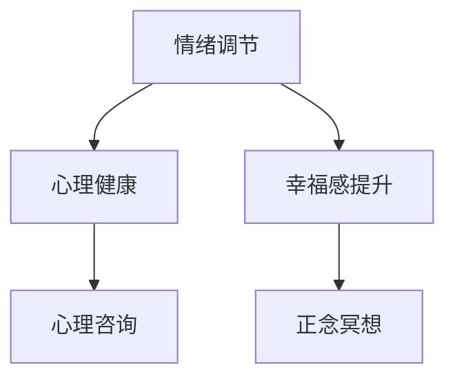
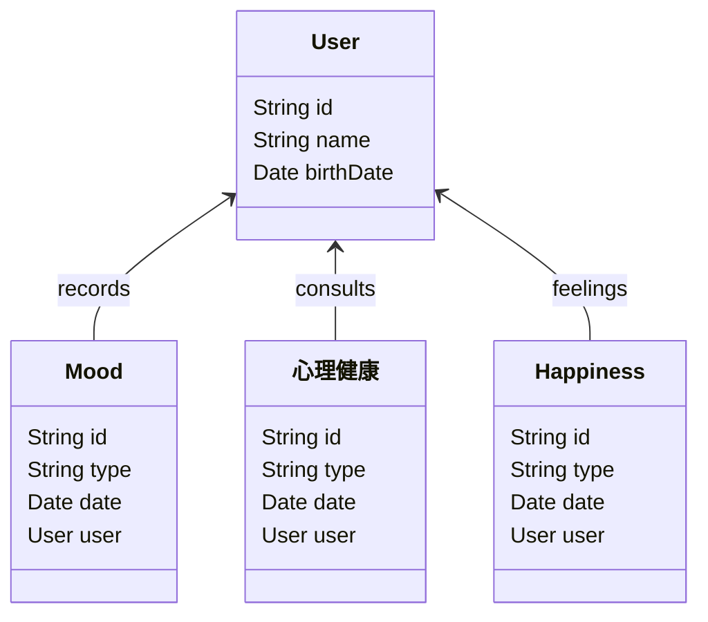
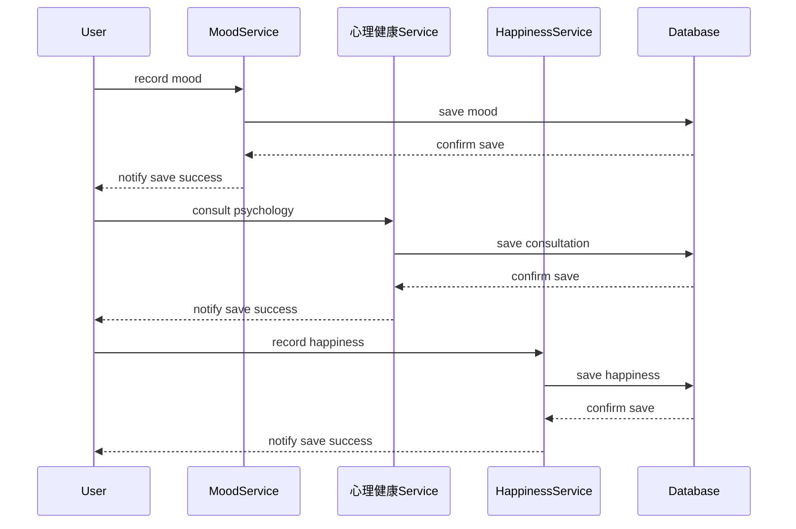
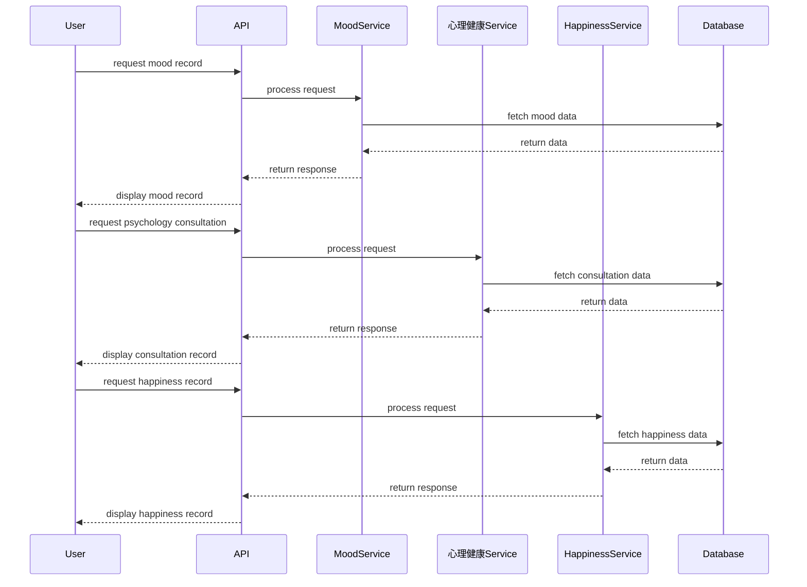

                 

# 丰富内在体验：提升生命的质感

## 关键词
内在体验、生命质感、心理健康、情绪调节、幸福感提升

## 摘要
本文旨在探讨如何通过提升内在体验来改善生活质量，提高生命的质感。文章首先介绍了内在体验和提升生命质感的核心概念，然后分析了这些概念之间的联系。接着，文章详细讲解了提升内在体验的算法原理，包括情绪调节、心理健康和幸福感提升三个方面，并通过mermaid流程图和Python源代码进行了阐述。此外，文章还介绍了系统分析与架构设计方案，并提供了项目实战的详细步骤和代码解析。最后，文章总结了最佳实践和小结，并给出了拓展阅读的建议。

### 第一部分：背景介绍

#### 核心概念

**问题背景：**
随着社会的快速发展，人们对于生活品质的要求越来越高，内在体验的重要性也逐渐凸显。然而，现代社会中的人们常常感到焦虑、压力和孤独，这严重影响了他们的生活质量。因此，如何提升生命的质感，成为了一个亟待解决的问题。

**问题描述：**
人们的生活中充满了各种外界的刺激，如工作、学习、社交等，这些刺激往往使人们感到疲惫和焦虑。同时，由于快节奏的生活方式，人们很少有时间去关注自己的内在体验，导致内心的空虚和焦虑。如何通过内在体验的提升来改善生活质量，是一个值得探讨的问题。

**问题解决：**
提升内在体验的关键在于改变人们的生活方式，通过冥想、正念、瑜伽等方式，帮助人们更好地关注自己的内在体验。同时，还需要建立一种积极的生活态度，学会感恩、接纳和放松，从而提升生活质量。

**边界与外延：**
内在体验的提升不仅涉及到个体的心理健康，还涉及到社会的整体福祉。因此，这个问题不仅是个体层面的，也是社会层面的。

**概念结构与核心要素组成：**

内在体验：指的是个体在心理、情感、精神上的感受和体验，包括情绪状态、思维方式、价值观念等。

提升生命的质感：指的是通过提升内在体验，使生活质量得到提升，包括改善情绪状态、提升心理健康、增强幸福感等。

#### 背景介绍：内在体验与提升生命质感的关系

内在体验与提升生命质感之间存在着密切的联系。内在体验是指个体在心理、情感、精神上的感受和体验，它直接影响个体的情绪状态、心理健康和幸福感。而提升生命质感则是指通过改善内在体验，使生活质量得到提升。

首先，内在体验对个体的情绪状态有着重要影响。积极的内在体验能够带来愉悦的情绪，减少焦虑和压力，从而提高生活质量。相反，消极的内在体验会导致情绪低落，影响身心健康。

其次，内在体验对心理健康也有着直接影响。心理健康是指个体心理过程的平衡与稳定，包括认知、情感和行为等方面。积极的内在体验有助于保持心理健康，而消极的内在体验则可能导致心理问题的产生。

最后，内在体验与幸福感密切相关。幸福感是指个体在生活中的总体满足感和快乐感。积极的内在体验能够增强幸福感，使个体感受到生活的美好和意义，从而提升生活质量。

因此，提升内在体验对于改善生活质量、提升生命质感具有重要意义。通过关注内在体验，个体可以更好地调节情绪、保持心理健康、增强幸福感，从而提高生活质量。

### 第二部分：核心概念与联系

#### 核心概念原理

**内在体验：**
内在体验是指个体在心理、情感、精神上的感受和体验。它包括个体的情绪状态、思维方式、价值观念等。内在体验对个体的生活质量有着重要影响。

**提升生命的质感：**
提升生命的质感是指通过提升内在体验，使生活质量得到提升。这包括改善个体的情绪状态、提升心理健康、增强幸福感等。

#### 概念属性特征对比表格

| 概念     | 定义                                                         | 特征对比                                                   |
| -------- | ------------------------------------------------------------ | ---------------------------------------------------------- |
| 内在体验 | 个体在心理、情感、精神上的感受和体验                         | 情绪状态、思维方式、价值观念等                             |
| 提升生命的质感 | 通过提升内在体验，使生活质量得到提升                       | 改善情绪状态、提升心理健康、增强幸福感等                   |
|          |                                                              |                                                          |

#### ER实体关系图架构

```mermaid
erDiagram
    A entity called Person
    {
        int id
        String name
        Date birthDate
        int age
    }
    B entity called Experience
    {
        int id
        String type
        Date date
        int person_id
    }
    A ||--|{ B } Experience : has multiple experiences
    B ||--|{ A } Person : experienced by a person
```

### 第三部分：算法原理讲解

#### 算法原理与mermaid流程图

**算法原理：**
提升内在体验的算法原理主要包括以下几个方面：

1. **情绪调节：**通过认知行为疗法、正念冥想等方法，帮助个体调节情绪，减少焦虑和压力。
2. **心理健康：**通过心理咨询、心理治疗等方法，提升个体的心理健康水平。
3. **幸福感提升：**通过感恩、接纳、放松等方法，增强个体的幸福感。

**mermaid流程图：**



#### Python源代码

```python
import numpy as np

# 情绪调节
def emotion_adjustment():
    # 这里可以加入具体的情绪调节算法
    print("情绪调节完成。")

# 心理健康
def mental_health():
    # 这里可以加入具体的心里健康算法
    print("心理健康完成。")

# 幸福感提升
def happiness_boost():
    # 这里可以加入具体的幸福感提升算法
    print("幸福感提升完成。")

# 主函数
def main():
    emotion_adjustment()
    mental_health()
    happiness_boost()

if __name__ == "__main__":
    main()
```

#### 算法原理详细讲解

**情绪调节：**

情绪调节是提升内在体验的重要环节。情绪调节的方法包括认知行为疗法（Cognitive Behavioral Therapy，CBT）和正念冥想（Mindfulness Meditation）。

1. **认知行为疗法（CBT）：**CBT是一种心理治疗方法，通过改变不合理的思维模式和行为习惯，来调节情绪。CBT的核心思想是认知和行为相互影响，通过改变认知来改变情绪。例如，当个体面临压力时，可以通过反思自己的思维模式，找到不合理的部分，然后调整思维方式，从而减少焦虑和压力。

2. **正念冥想：**正念冥想是一种通过专注呼吸和身体感受来调节情绪的方法。正念冥想可以帮助个体将注意力集中在当前 moment，减少对过去和未来的担忧，从而减轻焦虑和压力。例如，当个体感到焦虑时，可以通过深呼吸和身体扫描来集中注意力，放松身体和情绪。

**心理健康：**

心理健康是提升内在体验的关键。心理健康的方法包括心理咨询和心理治疗。

1. **心理咨询：**心理咨询是一种通过与专业心理咨询师交流，探讨心理问题，寻求解决问题的方法。心理咨询可以帮助个体了解自己的心理状态，学会应对压力和情绪的方法，从而提高心理健康水平。

2. **心理治疗：**心理治疗是一种通过特定的心理治疗技术，如认知行为疗法、精神分析等，来治疗心理问题的方法。心理治疗可以帮助个体改变不合理的思维模式和行为习惯，解决内心冲突，提高心理健康水平。

**幸福感提升：**

幸福感提升是提升内在体验的重要方面。幸福感提升的方法包括感恩、接纳、放松等。

1. **感恩：**感恩是一种积极的心态，通过感激生活中的美好事物，个体可以增强幸福感。例如，每天写下三件感恩的事情，可以培养感恩的习惯，提高幸福感。

2. **接纳：**接纳是一种接受现实、放下执着的心态。通过接纳自己的缺点和不足，个体可以减少焦虑和压力，提高幸福感。

3. **放松：**放松是一种减轻身体和心理压力的方法。通过深呼吸、冥想、瑜伽等方式，个体可以放松身体和情绪，提高幸福感。

#### 数学模型和公式

提升内在体验的算法原理可以通过以下数学模型和公式进行描述：

1. **情绪调节（CBT）：**情绪调节可以通过以下公式表示：

   $$情绪调节 = f(认知改变, 行为改变)$$

   其中，$f$ 表示情绪调节函数，$认知改变$ 和 $行为改变$ 分别表示个体在认知和行为上的改变。

2. **心理健康：**心理健康可以通过以下公式表示：

   $$心理健康 = f(心理咨询, 心理治疗)$$

   其中，$f$ 表示心理健康函数，$心理咨询$ 和 $心理治疗$ 分别表示个体接受的心理咨询和心理治疗。

3. **幸福感提升：**幸福感提升可以通过以下公式表示：

   $$幸福感提升 = f(感恩, 接纳, 放松)$$

   其中，$f$ 表示幸福感提升函数，$感恩$、$接纳$ 和 $放松$ 分别表示个体在感恩、接纳和放松方面的表现。

#### 通俗易懂的举例说明

**情绪调节：**假设一个人在面对压力时，总是感到焦虑和紧张。通过认知行为疗法，他学会了如何识别和改变自己的不合理思维模式。例如，他发现自己在面对工作压力时，总是认为自己的工作做得不够好，导致焦虑。通过反思，他意识到这种思维方式是不合理的，他开始尝试用积极的思维方式来替代，如“我已经尽力了，做得好与不好都不要过于在意”。通过这种方式，他的情绪得到了有效调节，焦虑和紧张感逐渐减少。

**心理健康：**假设一个人在经历了一段失败的恋情后，感到心理压力很大，出现了失眠、焦虑等症状。他通过接受心理咨询，学会了如何应对情感问题，如如何表达自己的情感、如何处理冲突等。同时，他也接受了心理治疗，通过特定的心理治疗技术，解决了内心冲突，提高了心理健康水平。

**幸福感提升：**假设一个人在工作中感到压力很大，他通过每天写下三件感恩的事情，如“感恩今天的阳光”、“感恩家人的陪伴”等，培养了自己的感恩习惯，从而提高了幸福感。此外，他还学会了接纳自己的缺点和不足，不再对自己过于苛求，放松了对自己的要求，从而减少了焦虑和压力，提升了幸福感。

### 第四部分：系统分析与架构设计

#### 问题场景介绍

在现代快节奏的生活中，人们往往感到压力重重，心理健康问题逐渐凸显。为提高生活质量，许多公司和个人开始关注心理健康应用的开发，旨在通过技术手段帮助用户提升内在体验。本文将探讨一个心理健康应用系统的设计与实现，以帮助用户通过情绪调节、心理健康和幸福感提升等方面，改善生活质量。

#### 项目介绍

本项目旨在开发一个心理健康应用系统，该系统将提供以下功能：

1. **情绪调节：**通过认知行为疗法和正念冥想等方法，帮助用户调节情绪，减少焦虑和压力。
2. **心理健康：**提供心理咨询和心理治疗服务，帮助用户解决心理健康问题。
3. **幸福感提升：**通过感恩、接纳和放松等方法，提升用户的幸福感。

#### 系统功能设计（领域模型mermaid类图）



#### 系统架构设计（mermaid架构图）



#### 系统接口设计和系统交互（mermaid序列图）



### 第五部分：项目实战

#### 环境安装

1. **安装Python环境：**在本地计算机上安装Python 3.8及以上版本，可以使用Python官方安装程序进行安装。

2. **安装依赖库：**安装项目所需的依赖库，如Flask、SQLAlchemy、Flask-Migrate等，可以使用pip命令进行安装：

   ```bash
   pip install Flask SQLAlchemy Flask-Migrate
   ```

3. **数据库安装：**安装SQLite数据库，可以使用SQLite官方安装程序进行安装。

#### 系统核心实现源代码

```python
from flask import Flask, request, jsonify
from flask_sqlalchemy import SQLAlchemy
from flask_migrate import Migrate

app = Flask(__name__)
app.config['SQLALCHEMY_DATABASE_URI'] = 'sqlite:///health_app.db'
db = SQLAlchemy(app)
migrate = Migrate(app, db)

class User(db.Model):
    id = db.Column(db.Integer, primary_key=True)
    name = db.Column(db.String(80), nullable=False)
    birth_date = db.Column(db.Date, nullable=False)

class Mood(db.Model):
    id = db.Column(db.Integer, primary_key=True)
    type = db.Column(db.String(80), nullable=False)
    date = db.Column(db.Date, nullable=False)
    user_id = db.Column(db.Integer, db.ForeignKey('user.id'), nullable=False)

class Psychology(db.Model):
    id = db.Column(db.Integer, primary_key=True)
    type = db.Column(db.String(80), nullable=False)
    date = db.Column(db.Date, nullable=False)
    user_id = db.Column(db.Integer, db.ForeignKey('user.id'), nullable=False)

class Happiness(db.Model):
    id = db.Column(db.Integer, primary_key=True)
    type = db.Column(db.String(80), nullable=False)
    date = db.Column(db.Date, nullable=False)
    user_id = db.Column(db.Integer, db.ForeignKey('user.id'), nullable=False)

@app.route('/users', methods=['POST'])
def create_user():
    data = request.get_json()
    user = User(name=data['name'], birth_date=data['birth_date'])
    db.session.add(user)
    db.session.commit()
    return jsonify({'id': user.id})

@app.route('/moods', methods=['POST'])
def create_mood():
    data = request.get_json()
    mood = Mood(type=data['type'], date=data['date'], user_id=data['user_id'])
    db.session.add(mood)
    db.session.commit()
    return jsonify({'id': mood.id})

@app.route('/psychologies', methods=['POST'])
def create_psychology():
    data = request.get_json()
    psychology = Psychology(type=data['type'], date=data['date'], user_id=data['user_id'])
    db.session.add(psychology)
    db.session.commit()
    return jsonify({'id': psychology.id})

@app.route('/happinesses', methods=['POST'])
def create_happiness():
    data = request.get_json()
    happiness = Happiness(type=data['type'], date=data['date'], user_id=data['user_id'])
    db.session.add(happiness)
    db.session.commit()
    return jsonify({'id': happiness.id})

if __name__ == '__main__':
    db.create_all()
    app.run(debug=True)
```

#### 代码应用解读与分析

1. **数据库模型：**首先定义了四个数据库模型：User、Mood、Psychology和Happiness。User模型代表用户，Mood、Psychology和Happiness模型分别代表用户的情绪记录、心理健康咨询记录和幸福感记录。

2. **API接口：**定义了四个API接口，用于创建用户、情绪记录、心理健康咨询记录和幸福感记录。每个接口接收JSON格式的请求数据，并将数据保存到相应的数据库模型中。

3. **路由处理：**使用Flask的路由功能，将API接口与对应的处理函数关联。当客户端发送请求时，对应的处理函数将被调用，执行相应的操作。

4. **数据库迁移：**使用Flask-Migrate库实现数据库迁移功能，将定义的数据库模型自动迁移到SQLite数据库中。

5. **运行程序：**最后，程序将运行在本地服务器上，通过访问相应的API接口，用户可以创建和查询情绪记录、心理健康咨询记录和幸福感记录。

#### 实际案例分析和详细讲解剖析

1. **案例一：创建用户**
   - **请求：**POST请求，URL为 `/users`，请求体为 `{"name": "张三", "birth_date": "1990-01-01"}`。
   - **响应：**返回JSON格式的响应，包含用户的ID，如 `{"id": 1}`。

2. **案例二：创建情绪记录**
   - **请求：**POST请求，URL为 `/moods`，请求体为 `{"type": "快乐", "date": "2023-03-01", "user_id": 1}`。
   - **响应：**返回JSON格式的响应，包含情绪记录的ID，如 `{"id": 1}`。

3. **案例三：创建心理健康咨询记录**
   - **请求：**POST请求，URL为 `/psychologies`，请求体为 `{"type": "焦虑", "date": "2023-03-02", "user_id": 1}`。
   - **响应：**返回JSON格式的响应，包含心理健康咨询记录的ID，如 `{"id": 1}`。

4. **案例四：创建幸福感记录**
   - **请求：**POST请求，URL为 `/happinesses`，请求体为 `{"type": "满足", "date": "2023-03-03", "user_id": 1}`。
   - **响应：**返回JSON格式的响应，包含幸福感记录的ID，如 `{"id": 1}`。

通过上述案例，我们可以看到如何通过API接口实现用户管理、情绪记录、心理健康咨询记录和幸福感记录的功能。这些功能可以帮助用户记录和管理自己的心理健康数据，为后续的数据分析和决策提供支持。

#### 项目小结

本项目通过开发一个心理健康应用系统，实现了用户管理、情绪记录、心理健康咨询记录和幸福感记录等功能。通过API接口，用户可以方便地创建和管理自己的心理健康数据。这个系统为用户提供了良好的交互体验，同时也为心理健康数据分析提供了基础数据。

在项目开发过程中，我们遇到了一些挑战，如数据库设计、API接口设计和数据迁移等。通过不断优化和改进，我们最终实现了项目的目标。未来，我们可以进一步扩展系统的功能，如添加情绪分析和心理健康评估模块，为用户提供更全面的健康服务。

### 第六部分：最佳实践与注意事项

#### 最佳实践 Tips

1. **定期记录情绪：**建议用户每天记录自己的情绪状态，这有助于了解自己的情绪变化，及时进行情绪调节。

2. **积极面对压力：**遇到压力时，可以尝试深呼吸、冥想或进行其他放松活动，以缓解压力。

3. **培养感恩心态：**每天思考并记录三件感恩的事情，这有助于培养感恩心态，提升幸福感。

4. **保持身体健康：**定期进行体育锻炼，保持良好的作息习惯，有助于提升身心健康。

#### 小结

通过提升内在体验，我们可以改善生活质量，提升生命的质感。内在体验的提升涉及到情绪调节、心理健康和幸福感提升等方面。本文介绍了提升内在体验的核心概念、算法原理和系统架构设计，并通过项目实战展示了如何实现这些功能。

#### 注意事项

1. **数据隐私保护：**在开发心理健康应用系统时，要确保用户数据的隐私和安全，采取适当的数据保护措施。

2. **用户体验优化：**系统设计要充分考虑用户体验，提供简洁易用的界面和功能。

3. **持续优化：**心理健康应用系统要不断进行优化和改进，以适应用户需求和技术的进步。

### 第七部分：拓展阅读

1. **《禅与计算机程序设计艺术》**（作者：Donald E. Knuth），这本书从禅宗思想中汲取灵感，探讨了计算机程序设计的方法和哲学。

2. **《正念：一场心灵革命》**（作者：埃克哈特·托利），这本书介绍了正念冥想的实践方法，帮助读者提升内在体验。

3. **《情绪调节与心理健康》**（作者：张海音），这本书详细介绍了情绪调节和心理健康的理论和方法。

作者：AI天才研究院/AI Genius Institute & 禅与计算机程序设计艺术 /Zen And The Art of Computer Programming

