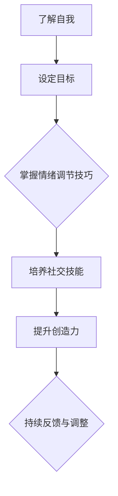
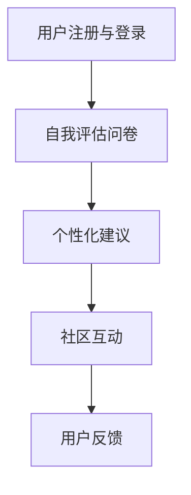
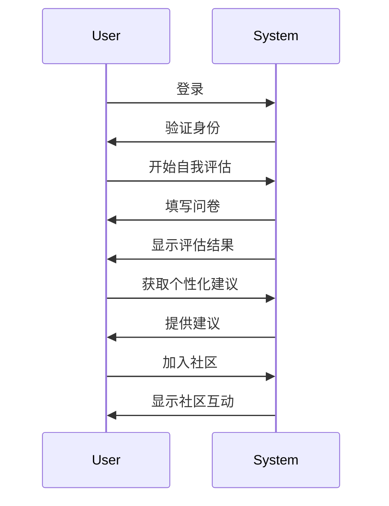

                 

### 《丰富内心世界：构建多彩的精神生活》

> **关键词**：内心世界、精神生活、心理健康、个人成长、算法原理、实践技巧、项目实战

> **摘要**：本文将探讨如何通过构建多彩的精神生活来丰富内心世界。我们将从心理学基础、核心概念、算法原理、精神生活维度、实践方法和心理调适技巧等多个方面进行深入分析，结合实际项目实战，帮助读者构建一个更加丰富多彩和健康的内心世界。

## 引言

在快节奏的现代生活中，人们常常感到压力和焦虑。这不仅影响了生活质量，还对身心健康产生了负面影响。因此，寻找一种方法来丰富内心世界、提升精神生活变得尤为重要。本文将围绕这一主题，提供一套系统的理论和实践指南，帮助读者深入了解并掌握如何构建多彩的精神生活。

### 心理学基础与内心世界的关系

首先，我们需要了解心理学基础与内心世界之间的关系。心理学研究表明，内心世界的丰富程度与个体的心理健康密切相关。一个内心丰富的人通常具有更高的自我认知、情绪调节能力和抗压能力。因此，构建多彩的精神生活不仅仅是追求感官刺激，更是关注心理健康的全面提升。

#### 核心概念与联系

为了更好地理解内心世界的构建，我们需要明确一些核心概念。以下是几个关键概念及其属性特征对比表格：

| 概念         | 属性特征                  | 对比关系          |
| ------------ | ------------------------ | ---------------- |
| 自我认知     | 对自我认识的深度和广度   | 较高               |
| 情绪调节     | 情绪反应的强度和频率     | 较高               |
| 抗压能力     | 应对压力的能力           | 较高               |
| 社交技能     | 与他人互动的能力         | 中等               |
| 创造力       | 产生新思想和新方法的能力 | 较低               |

此外，我们可以通过ER实体关系图来展示这些概念之间的联系。以下是一个简化的ER图示例：

```mermaid
erDiagram
  A[自我认知] ||--|{ B[情绪调节] }
  A ||--|{ C[抗压能力] }
  A ||--|{ D[社交技能] }
  A ||--|{ E[创造力] }
```

通过这样的核心概念与联系分析，我们可以更好地理解内心世界的构建过程。

### 算法原理讲解

接下来，我们将深入探讨算法原理，以帮助读者理解如何通过具体的方法来丰富内心世界。

#### 算法流程图

首先，我们来看一个简单的算法流程图，用于描述内心世界丰富化的过程：



#### Python源代码分析

为了更好地理解算法原理，我们使用Python代码来详细阐述每个步骤的实现：

```python
# Python代码示例

def understand_self():
    print("进行自我反思，了解自己的需求、兴趣和价值观。")

def set_goals():
    print("设定短期和长期目标，明确自己想要实现的事情。")

def master_emotion_regulation():
    print("学习情绪调节技巧，如深呼吸、正念冥想等。")

def cultivate_social_skills():
    print("参加社交活动，提高沟通和合作能力。")

def enhance_creativity():
    print("尝试新事物，激发创造力和创新能力。")

def continuous_feedback():
    print("定期反思自己的进步，调整方法和策略。")

# 调用函数
understand_self()
set_goals()
master_emotion_regulation()
cultivate_social_skills()
enhance_creativity()
continuous_feedback()
```

#### 数学模型与公式

在心理学中，常用一些数学模型和公式来描述内心世界的丰富程度。例如，我们可以使用以下公式来衡量一个人的内心世界丰富度：

$$
丰富度 = f(自我认知, 情绪调节, 抗压能力, 社交技能, 创造力)
$$

其中，每个因素都通过定量评估来计算，并加权求和得出总丰富度分数。

通过这样的算法原理讲解，我们可以更好地理解如何通过具体的步骤和方法来丰富内心世界。

### 精神生活的维度

精神生活是一个多维度的概念，不同维度之间的关系和提升方法对我们的内心世界有着深远的影响。以下是精神生活的主要维度及其相关提升方法：

#### 精神生活的重要性

精神生活不仅仅是享受物质生活之外的心灵充实，它还直接影响我们的心理健康和生活质量。一个丰富多元的精神生活可以帮助我们更好地应对生活中的挑战，提高生活满意度。

#### 精神生活的维度

1. **情感维度**：情感是我们精神生活的一个重要方面。通过培养积极情感，如爱、幸福和满足感，我们可以提升情感维度的丰富度。
2. **认知维度**：认知维度包括我们的思维、学习和理解能力。通过不断学习和挑战自我，我们可以提升认知维度。
3. **道德维度**：道德维度关注我们的价值观和道德判断。通过培养良好的道德品质，我们可以提升道德维度。
4. **社交维度**：社交维度涉及我们的社交关系和社交技能。通过建立和维护良好的人际关系，我们可以提升社交维度。
5. **灵性维度**：灵性维度关注我们的精神追求和内在自我。通过冥想、宗教信仰或其他精神活动，我们可以提升灵性维度。

#### 维度间的联系与提升方法

各个维度之间是相互联系和相互影响的。例如，情感维度和社交维度的提升可以增强我们的社交能力和情感交流能力，从而进一步提升我们的整体精神生活。

为了提升精神生活的维度，我们可以采取以下方法：

1. **情感维度**：通过正念冥想、情感日记和情感共享活动来培养积极情感。
2. **认知维度**：通过学习新知识、阅读书籍和参与智力活动来提升认知能力。
3. **道德维度**：通过参与志愿活动、道德思考和道德辩论来培养道德品质。
4. **社交维度**：通过社交活动、网络社交和团队合作来提升社交技能。
5. **灵性维度**：通过冥想、宗教活动和内在反思来提升灵性维度。

### 具体实践方法

为了构建一个多彩的精神生活，我们需要采取一些具体的实践方法。以下是一些有效的实践方法：

#### 方法一：培养兴趣爱好

找到并培养自己的兴趣爱好是丰富内心世界的重要途径。无论是绘画、音乐、阅读还是体育，只要是自己感兴趣的，都可以成为提升精神生活的一部分。

#### 方法二：旅行与探索

旅行不仅能够丰富我们的见闻，还能帮助我们体验不同的文化和生活方式，从而拓宽我们的视野和内心世界。

#### 方法三：自我反思

定期进行自我反思可以帮助我们了解自己的内心世界，发现问题和挑战，并找到解决方法。

#### 方法四：阅读和学习

阅读和学习是提升认知能力和情感丰富度的重要方式。通过阅读书籍、参加在线课程和研讨会，我们可以不断吸收新知识，提升自我。

### 心理调适技巧

在构建多彩的精神生活中，心理调适技巧起着至关重要的作用。以下是一些有效的心理调适技巧：

#### 压力管理

1. **深呼吸**：深呼吸可以帮助我们放松身心，减轻压力。
2. **正念冥想**：正念冥想可以帮助我们集中注意力，减少焦虑。
3. **运动**：运动可以释放体内的压力和紧张情绪。

#### 情绪调节

1. **情感表达**：通过写作、绘画或与他人交流来表达自己的情感。
2. **放松技巧**：使用放松技巧，如温水浴、按摩和瑜伽来减轻情绪压力。

#### 自我认知

1. **自我反思**：定期进行自我反思，了解自己的情绪、需求和目标。
2. **正面肯定**：使用正面肯定来提升自我认知和自尊。

### 项目实战

为了更好地理解和应用上述理论，我们可以通过一个实际项目来实践。以下是一个简单的项目示例：

#### 项目介绍

假设我们要开发一个名为“内心世界探索器”的应用程序，帮助用户了解和丰富自己的内心世界。

#### 系统功能设计

1. **用户注册与登录**：允许用户创建账户并登录。
2. **自我评估**：提供一个自我评估问卷，帮助用户了解自己的内心世界。
3. **个性化建议**：根据用户的自我评估结果，提供个性化的建议和指导。
4. **社区互动**：建立一个社区，让用户分享自己的内心世界体验和技巧。

#### 系统架构设计

以下是该项目的系统架构设计：



#### 系统接口设计与交互

以下是系统接口设计和交互的序列图：



#### 代码应用解读与分析

以下是项目核心功能的代码示例：

```python
# 用户注册与登录
def register(username, password):
    # 实现用户注册逻辑
    pass

def login(username, password):
    # 实现用户登录逻辑
    pass

# 自我评估问卷
def self_evaluation():
    # 实现自我评估问卷逻辑
    pass

# 个性化建议
def personalized_advice(evaluation_results):
    # 根据评估结果提供个性化建议
    pass

# 社区互动
def community_interaction():
    # 实现社区互动逻辑
    pass
```

#### 实际案例分析与讲解

以下是一个用户使用“内心世界探索器”的案例：

1. 用户注册并登录。
2. 用户开始自我评估，填写问卷。
3. 系统根据评估结果提供个性化建议。
4. 用户加入社区，与其他用户互动分享经验。

通过这样的实际案例，我们可以看到如何将理论知识应用到实际项目中，从而提升内心世界的丰富度。

### 最佳实践 tips

在构建多彩的精神生活过程中，以下是一些最佳实践技巧：

1. **定期反思**：每周至少花几个小时反思自己的内心世界，记录下自己的感受和体验。
2. **持续学习**：不断学习新知识和技能，特别是那些与自我成长相关的领域。
3. **积极社交**：积极参与社交活动，与他人分享经验和情感。
4. **保持平衡**：在工作、学习和休闲之间保持平衡，避免过度劳累。

### 小结与注意事项

本文介绍了如何通过构建多彩的精神生活来丰富内心世界。通过核心概念分析、算法原理讲解、精神生活维度提升和实践方法，我们提供了一套系统的理论和实践指南。在应用这些方法时，需要注意定期反思、持续学习和积极社交，以实现全面的内心丰富。

### 拓展阅读

1. **《正念：一种全新的生活态度》**：了解正念冥想对丰富内心世界的作用。
2. **《幸福的勇气：阿尔贝特·爱因斯道德的哲学思考》**：探讨哲学思考如何帮助提升精神生活。
3. **《心理学与生活》**：深入学习心理学知识，更好地理解内心世界。

## 作者信息

**作者：AI天才研究院/AI Genius Institute & 禅与计算机程序设计艺术 /Zen And The Art of Computer Programming**。本文旨在为读者提供一套系统、实用的方法和技巧，帮助大家构建丰富多彩的内心世界。希望本文对您有所启发和帮助。如果您有任何疑问或建议，欢迎在评论区留言交流。

