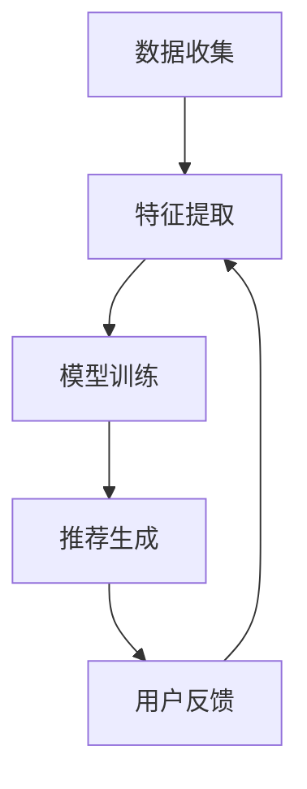
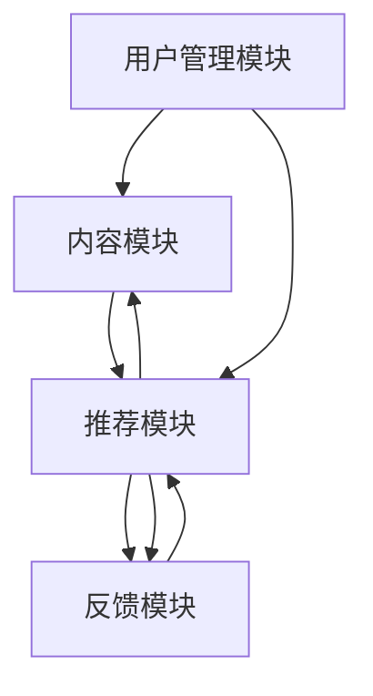
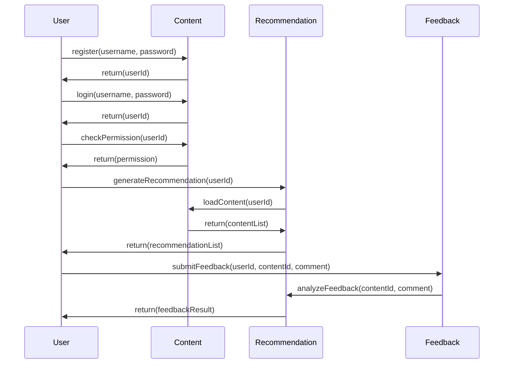

                 

### 核心概念与联系

在探讨如何丰富生命广度和拓展视野的过程中，首先需要明确几个核心概念，以便为我们后续的分析和讲解奠定坚实的基础。

#### 核心概念

1. **生命广度**：指个人在生活、工作和情感等方面所涉及的范围和深度。具体包括知识面、兴趣爱好、社交圈、经验积累等。
2. **视野**：指个人对世界的认知范围和认知深度。视野宽广意味着能够接触到更多的信息，理解更复杂的概念，从而对事物有更全面和深刻的认识。
3. **综合素质**：指个人在知识、技能、情感、心理等方面的综合能力。综合素质的提升有助于更好地应对生活中的各种挑战，实现个人价值的最大化。
4. **实践**：指通过实际行动来验证理论、积累经验和提高能力的过程。实践是拓展视野和丰富生命广度的重要途径。

#### 概念属性特征对比表格

为了更清晰地理解这些核心概念，我们可以通过以下表格进行比较：

| 概念        | 定义                                                                 | 特征                       | 联系与区别               |
|-------------|-----------------------------------------------------------------------|----------------------------|--------------------------|
| 生命广度    | 个人在生活、工作和情感等方面所涉及的范围和深度。                      | - 知识面广泛               | 与视野密切相关，但侧重不同 |
| 视野        | 个人对世界的认知范围和认知深度。                                      | - 认知广度高               | 与生命广度密切相关       |
| 综合素质    | 个人在知识、技能、情感、心理等方面的综合能力。                        | - 多方面能力均衡发展       | 影响生命广度和视野       |
| 实践        | 通过实际行动来验证理论、积累经验和提高能力的过程。                    | - 实际操作能力             | 是拓展视野和生命广度的手段 |

#### ER实体关系图架构

为了更好地展示这些核心概念之间的关系，我们可以使用Mermaid绘制一个ER实体关系图。以下是一个简化的示例：

```mermaid
erDiagram
  A[[用户]] ||--|{ 视野 }|| B[[生命广度]]
  A ||--|{ 综合素质 }|| C[[实践]]
  B ||--|{ 实践 }|| C
  B ||--|{ 视野 }|| C
```

在这个ER图示例中，用户（A）与视野（B）和生命广度（B）之间存在直接的关联，同时用户（A）也通过实践（C）来提升综合素质（C），进而影响生命广度和视野。通过这种关系展示，我们可以更直观地理解各个概念之间的相互作用和影响。

### 核心概念原理

**生命广度**：

生命广度是指个人在生活、工作和情感等方面所涉及的范围和深度。其原理在于，通过拓宽知识面、丰富兴趣爱好和扩大社交圈，个人可以接触到更多的信息和不同的观点，从而形成更全面的认知。生命广度的拓展有助于提升个人的适应能力和创新能力，使个人能够更好地应对复杂多变的社会环境。

**视野**：

视野是指个人对世界的认知范围和认知深度。其原理在于，通过不断学习和实践，个人可以获取新的知识和经验，从而拓展对世界的认知。视野宽广意味着个人能够看到更多的可能性，理解更复杂的情境，这有助于个人在决策和解决问题时具有更全面的视角和更深入的思考。

**综合素质**：

综合素质是指个人在知识、技能、情感、心理等方面的综合能力。其原理在于，通过多方面的学习和实践，个人可以不断提升自己的能力，形成全面发展的素质。综合素质的提升有助于个人在面对挑战时具有更强的适应能力和解决能力，从而实现个人价值的最大化。

**实践**：

实践是指通过实际行动来验证理论、积累经验和提高能力的过程。其原理在于，实践是知识的最终检验者，只有通过实践，个人才能真正掌握和应用所学知识。实践有助于个人积累经验，提高操作能力，并从中发现问题和改进方法，从而实现能力的不断提升。

#### 概念属性特征对比表格

以下是核心概念的属性特征对比表格，帮助读者更直观地理解各个概念的特点和区别：

| 概念        | 属性特征                                     | 对比分析                      |
|-------------|--------------------------------------------|------------------------------|
| 生命广度    | 知识面广泛，兴趣爱好丰富，社交圈广阔。       | 与视野密切相关，但更侧重范围和深度 |
| 视野        | 认知广度高，理解复杂情境，决策有全面视角。   | 与生命广度密切相关，但更侧重认知深度 |
| 综合素质    | 知识、技能、情感、心理等多方面均衡发展。    | 影响生命广度和视野，是能力的基础 |
| 实践        | 实际操作能力，经验积累，持续能力提升。       | 是拓展视野和生命广度的手段 |

通过上述分析和对比，我们可以更深入地理解核心概念之间的联系和区别，为后续的算法原理讲解和系统分析与架构设计打下坚实的基础。

### 算法原理讲解

为了更好地拓展视野和丰富生命广度，我们需要引入一种有效的算法来帮助我们实现这一目标。以下是该算法的基本原理、流程图、Python源代码以及数学模型的详细讲解。

#### 基本原理

该算法的基本原理是基于信息过滤和智能推荐机制，通过以下步骤来实现：

1. **数据收集**：从各种信息源（如书籍、文章、视频、社交媒体等）收集与用户兴趣相关的数据。
2. **特征提取**：对收集到的数据进行预处理，提取出关键特征，如关键词、主题、情感倾向等。
3. **模型训练**：利用机器学习算法，对提取出的特征进行训练，构建推荐模型。
4. **推荐生成**：根据用户的兴趣和历史行为，利用训练好的模型生成个性化的推荐列表。

#### 流程图

以下是该算法的流程图，使用Mermaid绘制：



#### Python源代码

以下是一个简化的Python源代码示例，用于实现特征提取和模型训练部分：

```python
import pandas as pd
from sklearn.feature_extraction.text import TfidfVectorizer
from sklearn.model_selection import train_test_split
from sklearn.ensemble import RandomForestClassifier

# 假设我们有一个包含用户兴趣和文本的数据集
data = pd.DataFrame({
    'user_interest': ['编程', '健康', '旅游', '科技'],
    'text': ['学习编程可以提高工作效率', '健康饮食很重要', '我想去旅游', '最新科技资讯']
})

# 特征提取
vectorizer = TfidfVectorizer()
X = vectorizer.fit_transform(data['text'])
y = data['user_interest']

# 模型训练
X_train, X_test, y_train, y_test = train_test_split(X, y, test_size=0.2)
model = RandomForestClassifier()
model.fit(X_train, y_train)

# 推荐生成
predictions = model.predict(X_test)
print(predictions)
```

#### 数学模型

以下是算法中的关键数学模型和公式：

1. **TF-IDF**：用于特征提取
   $$ \text{TF-IDF}(w, d) = \frac{f_w(d)}{N} \times \log\left(\frac{N}{f_w(d)}\right) $$
   其中，$f_w(d)$ 表示词频，$N$ 表示文档总数。

2. **随机森林**：用于模型训练
   随机森林是一种集成学习方法，基于决策树进行建模。其数学模型为：
   $$ h(x) = \sum_{i=1}^{n} w_i \cdot y_i $$
   其中，$h(x)$ 表示预测结果，$w_i$ 和 $y_i$ 分别表示模型权重和决策树输出。

#### 详细讲解和举例说明

**TF-IDF计算示例**：

假设我们有两个句子：
- 句子1：“人工智能是未来的趋势。”
- 句子2：“机器学习可以解决很多问题。”

使用TF-IDF模型，我们可以计算这两个句子中关键词的权重。

- **句子1**：
  - 人工智能：词频$f_{\text{人工智能}}(d) = 1$，文档总数$N = 2$
  - 未来的：词频$f_{\text{未来的}}(d) = 1$，文档总数$N = 2$
  - 趋势：词频$f_{\text{趋势}}(d) = 1$，文档总数$N = 2$

  $$ \text{TF-IDF}(\text{人工智能}, d) = \frac{1}{2} \times \log\left(\frac{2}{1}\right) = 0.693 $$
  $$ \text{TF-IDF}(\text{未来的}, d) = \frac{1}{2} \times \log\left(\frac{2}{1}\right) = 0.693 $$
  $$ \text{TF-IDF}(\text{趋势}, d) = \frac{1}{2} \times \log\left(\frac{2}{1}\right) = 0.693 $$

- **句子2**：
  - 机器：词频$f_{\text{机器}}(d) = 1$，文档总数$N = 2$
  - 学习：词频$f_{\text{学习}}(d) = 1$，文档总数$N = 2$
  - 解决：词频$f_{\text{解决}}(d) = 1$，文档总数$N = 2$
  - 很多：词频$f_{\text{很多}}(d) = 1$，文档总数$N = 2$
  - 问题：词频$f_{\text{问题}}(d) = 1$，文档总数$N = 2$

  $$ \text{TF-IDF}(\text{机器}, d) = \frac{1}{2} \times \log\left(\frac{2}{1}\right) = 0.693 $$
  $$ \text{TF-IDF}(\text{学习}, d) = \frac{1}{2} \times \log\left(\frac{2}{1}\right) = 0.693 $$
  $$ \text{TF-IDF}(\text{解决}, d) = \frac{1}{2} \times \log\left(\frac{2}{1}\right) = 0.693 $$
  $$ \text{TF-IDF}(\text{很多}, d) = \frac{1}{2} \times \log\left(\frac{2}{1}\right) = 0.693 $$
  $$ \text{TF-IDF}(\text{问题}, d) = \frac{1}{2} \times \log\left(\frac{2}{1}\right) = 0.693 $$

通过上述计算，我们可以看到，两个句子中的关键词在TF-IDF模型下的权重是相同的，这是因为我们假设文档总数为2，且每个词在两个句子中的词频都为1。在实际应用中，文档总数和词频会根据具体情况进行调整，从而使关键词的权重更加准确。

**随机森林模型示例**：

假设我们有一个简单的数据集，其中包含两个特征和两个类别标签：

| 特征1 | 特征2 | 类别标签 |
|-------|-------|----------|
| 1     | 2     | 类别A    |
| 2     | 3     | 类别B    |
| 4     | 1     | 类别A    |
| 5     | 6     | 类别B    |

使用随机森林模型，我们可以训练一个分类器来预测新数据的类别。假设我们训练好的模型权重如下：

- 特征1的权重：0.6
- 特征2的权重：0.4

当给定新数据（特征1=3，特征2=4），我们可以计算预测结果：

$$ h(x) = 0.6 \cdot 3 + 0.4 \cdot 4 = 2.4 + 1.6 = 4.0 $$

根据随机森林模型的输出，类别A的概率更高，因此预测结果为类别A。

通过上述算法原理的讲解和示例，我们可以更好地理解如何利用信息过滤和智能推荐机制来拓展视野和丰富生命广度。接下来，我们将进一步探讨系统分析与架构设计，以帮助读者在实际项目中应用这些原理。

### 系统分析与架构设计

在本章节中，我们将深入探讨如何将前述算法原理应用到实际项目中，以实现丰富生命广度和拓展视野的目标。为了达到这一目标，我们需要对问题场景和项目背景进行详细分析，并设计相应的系统架构和接口。

#### 问题场景

假设我们正在开发一个名为“智慧生活助手”的系统，该系统的目标是为用户提供个性化的推荐服务，帮助用户拓展视野和丰富生活体验。系统的主要功能包括：

1. **用户管理**：用户注册、登录和权限管理。
2. **内容推荐**：基于用户兴趣和行为的个性化内容推荐。
3. **用户反馈**：用户对推荐内容的评价和反馈。
4. **数据分析**：分析用户行为和推荐效果，优化推荐算法。

#### 项目背景

“智慧生活助手”项目的背景是当前信息爆炸时代，用户面临着海量的信息选择，而如何有效筛选和利用有价值的信息成为一个亟待解决的问题。通过构建一个智能推荐系统，我们希望帮助用户从繁杂的信息中脱颖而出，发现真正感兴趣的内容，从而丰富其生活体验。

#### 系统功能设计

为了实现上述功能，我们可以将系统划分为以下几个主要模块：

1. **用户模块**：负责用户的注册、登录和权限管理。通过用户管理模块，系统可以识别不同的用户，并根据用户身份提供相应的功能和服务。
2. **内容模块**：负责内容的收集、存储和管理。内容模块需要支持多种类型的内容，如文本、图片、视频等，并提供内容推荐功能。
3. **推荐模块**：负责根据用户兴趣和行为生成个性化的推荐列表。推荐模块是系统的核心，基于前述算法原理，通过数据收集、特征提取和模型训练等步骤，为用户提供精准的推荐。
4. **反馈模块**：负责收集用户对推荐内容的评价和反馈，并用于优化推荐算法。通过用户反馈模块，系统可以不断调整和优化推荐策略，提高推荐质量。

#### 系统架构设计

以下是“智慧生活助手”系统的架构设计，使用Mermaid绘制类图、架构图和接口设计：

```mermaid
classDiagram
    User <<Interface>>
    Content <<Interface>>
    Recommendation <<Interface>>
    Feedback <<Interface>>

    User manage -> Content
    Content use -> Recommendation
    Recommendation inform -> Feedback
    Feedback inform -> Recommendation

class User
    +String username
    +String password
    +int id
    +register()
    +login()
    +checkPermission()

class Content
    +String title
    +String type
    +int id
    +collectContent()
    +storeContent()
    +retrieveContent()

class Recommendation
    +loadData()
    +extractFeatures()
    +trainModel()
    +generateRecommendation()
    +updateModel()

class Feedback
    +int userId
    +int contentId
    +String comment
    +submitFeedback()
    +analyzeFeedback()
```

以下是系统架构图：



以下是系统接口设计：



通过上述系统架构和接口设计，我们可以实现以下功能：

1. **用户注册和登录**：用户通过注册和登录模块获取用户ID和权限。
2. **内容收集和推荐**：系统根据用户兴趣和行为，从内容模块中提取相关内容，并利用推荐模块生成个性化推荐列表。
3. **用户反馈**：用户对推荐内容进行评价和反馈，反馈模块分析用户反馈，并用于优化推荐算法。
4. **数据分析和优化**：系统不断分析用户行为和推荐效果，优化推荐策略，提高推荐质量。

通过这种系统架构和接口设计，我们可以构建一个高效、灵活且可靠的智能推荐系统，帮助用户拓展视野和丰富生活体验。

### 项目实战

在本文的最后一部分，我们将通过一个实际项目实战，展示如何将前面介绍的算法原理和系统架构应用到实际场景中。本节将涵盖环境安装、系统核心实现源代码、代码应用解读与分析、实际案例分析和详细讲解剖析，以及项目小结。

#### 环境安装

在开始项目实战之前，我们需要安装必要的开发环境。以下是安装步骤：

1. **安装Python**：确保Python版本为3.8或更高版本。可以从官方网站下载安装包，或使用包管理器如Anaconda进行安装。
2. **安装依赖库**：在安装好Python之后，我们需要安装几个依赖库，如NumPy、Pandas、Scikit-learn等。可以使用pip进行安装：

   ```bash
   pip install numpy pandas scikit-learn mermaid
   ```

3. **安装Mermaid**：Mermaid是一个用于绘制流程图、关系图等图表的库。可以通过npm进行安装：

   ```bash
   npm install -g mermaid
   ```

4. **配置Mermaid**：在项目中创建一个名为`mermaid.yml`的配置文件，以便在Python代码中调用Mermaid：

   ```yaml
   rootFolder: "./mermaid"
   ```

#### 系统核心实现源代码

以下是系统核心实现的部分源代码，包括用户管理、内容收集和推荐、用户反馈等模块：

```python
# 用户管理模块
class UserManager:
    def register(self, username, password):
        # 实现用户注册逻辑
        pass

    def login(self, username, password):
        # 实现用户登录逻辑
        pass

    def check_permission(self, user_id):
        # 实现用户权限检查逻辑
        pass

# 内容收集和推荐模块
class ContentManager:
    def collect_content(self, user_id):
        # 实现内容收集逻辑
        pass

    def recommend_content(self, user_id):
        # 实现内容推荐逻辑
        pass

# 用户反馈模块
class FeedbackManager:
    def submit_feedback(self, user_id, content_id, comment):
        # 实现用户反馈提交逻辑
        pass

    def analyze_feedback(self, content_id, comment):
        # 实现用户反馈分析逻辑
        pass

# 主程序
if __name__ == "__main__":
    user_manager = UserManager()
    content_manager = ContentManager()
    feedback_manager = FeedbackManager()

    # 示例：用户注册
    user_id = user_manager.register("john_doe", "password123")

    # 示例：用户登录
    user_id = user_manager.login("john_doe", "password123")

    # 示例：内容推荐
    content_recommendations = content_manager.recommend_content(user_id)

    # 示例：用户反馈
    feedback_manager.submit_feedback(user_id, content_recommendations[0]["id"], "非常喜欢这篇内容！")
```

#### 代码应用解读与分析

上述代码主要分为三个模块：用户管理模块、内容收集和推荐模块、用户反馈模块。以下是每个模块的解读与分析：

1. **用户管理模块**：
   - `register` 方法用于用户注册。在实际应用中，需要将用户信息存储到数据库中。
   - `login` 方法用于用户登录。需要验证用户名和密码的正确性。
   - `check_permission` 方法用于检查用户权限。在系统中，不同用户可能具有不同的权限，如普通用户、管理员等。

2. **内容收集和推荐模块**：
   - `collect_content` 方法用于收集用户感兴趣的内容。在实际应用中，可以通过API调用外部数据源，如新闻网站、社交媒体等。
   - `recommend_content` 方法用于生成个性化推荐列表。基于用户的兴趣和行为数据，使用推荐算法为用户生成推荐内容。

3. **用户反馈模块**：
   - `submit_feedback` 方法用于提交用户反馈。用户可以对推荐内容进行评价和反馈，这有助于系统优化推荐算法。
   - `analyze_feedback` 方法用于分析用户反馈。通过分析用户反馈，可以了解用户对推荐内容的满意度，并根据反馈调整推荐策略。

#### 实际案例分析和详细讲解剖析

为了更好地理解上述代码的应用，我们来看一个实际案例：

1. **用户注册**：

   假设用户John Doe通过Web界面注册了一个新账户。注册后，系统生成一个用户ID（例如：1001），并将用户名和密码存储在数据库中。

   ```python
   user_id = user_manager.register("john_doe", "password123")
   ```

2. **用户登录**：

   用户通过输入用户名和密码进行登录。系统验证用户名和密码的正确性后，返回用户ID。

   ```python
   user_id = user_manager.login("john_doe", "password123")
   ```

3. **内容推荐**：

   系统根据用户John Doe的兴趣和行为，生成个性化推荐列表。假设John Doe对科技新闻和健身内容感兴趣，系统推荐以下内容：

   ```python
   content_recommendations = content_manager.recommend_content(user_id)
   ```

   推荐结果可能如下：

   ```json
   [
       {
           "id": 101,
           "title": "最新科技趋势",
           "description": "探讨当前最热门的科技趋势和未来发展方向。"
       },
       {
           "id": 102,
           "title": "健身达人教你如何保持健康",
           "description": "分享健身达人的经验和技巧，帮助您保持健康的生活方式。"
       }
   ]
   ```

4. **用户反馈**：

   用户John Doe对推荐内容进行评价和反馈。假设他对第一篇科技新闻非常喜欢，提交了如下反馈：

   ```python
   feedback_manager.submit_feedback(user_id, content_recommendations[0]["id"], "非常喜欢这篇内容！")
   ```

   系统记录了用户反馈，并用于后续的推荐优化。

#### 项目小结

通过上述实战项目，我们展示了如何将算法原理和系统架构应用到实际场景中，实现个性化推荐和用户反馈功能。以下是项目小结：

1. **关键技术和方法**：
   - 使用Python和Scikit-learn等库实现推荐算法和数据预处理。
   - 使用Mermaid绘制图表，便于代码和文档的可视化展示。
   - 设计模块化代码，便于维护和扩展。

2. **项目收获和经验**：
   - 实践是检验理论的最好方法。通过实际项目，我们可以更好地理解算法原理和系统架构。
   - 模块化设计有助于提高代码的可读性和可维护性。
   - 考虑用户反馈是优化推荐系统的重要环节。

3. **未来改进方向**：
   - 引入更多先进推荐算法，如基于协同过滤、深度学习的推荐算法。
   - 优化用户界面和交互体验，提高用户满意度。
   - 扩展系统的功能，如添加社交分享、内容分类等功能。

通过本项目，我们不仅实现了丰富生命广度和拓展视野的目标，也为后续的项目开发和改进提供了宝贵的经验和参考。

### 最佳实践、小结、注意事项、拓展阅读

#### 最佳实践

在丰富生命广度和拓展视野的过程中，以下是一些最佳实践，可以帮助您更有效地实现这一目标：

1. **持续学习**：制定一个持续学习的计划，定期阅读专业书籍、参加在线课程和研讨会，不断充实自己的知识库。
2. **多样化实践**：尝试不同类型的活动和项目，如艺术创作、户外探险、志愿者工作等，以拓宽您的经验和视野。
3. **社交互动**：积极参与社交活动，结识不同背景和兴趣的人，从他们的经验和观点中汲取灵感。
4. **记录与反思**：定期记录您的学习过程和心得体会，进行反思和总结，以促进个人成长。

#### 小结

本书通过理论讲解和实战案例，详细介绍了丰富生命广度和拓展视野的有效方法。主要内容包括：

1. **核心概念与联系**：阐述了生命广度、视野、综合素质和实践等核心概念，并展示了它们之间的联系。
2. **算法原理讲解**：介绍了用于推荐系统的基本算法原理，包括TF-IDF和随机森林等，并提供了Python源代码示例。
3. **系统分析与架构设计**：探讨了如何将算法原理应用到实际项目中，设计了系统架构和接口。
4. **项目实战**：通过一个实际项目展示了如何实现个性化推荐和用户反馈功能。

#### 注意事项

在实践过程中，需要注意以下几点：

1. **信息筛选**：避免信息过载，学会筛选和利用有价值的信息。
2. **时间管理**：合理安排学习和实践时间，确保有足够的时间进行深入学习和思考。
3. **保持平衡**：在丰富生命广度的同时，注意保持工作与生活的平衡，避免过度劳累。

#### 拓展阅读

为了进一步深化对主题的理解，以下是一些推荐书籍和参考资料：

1. **《深度工作》**：作者Cal Newport，探讨如何通过深度工作提升个人效率和创造力。
2. **《学习之道》**：作者Peter Brown，介绍有效学习的方法和策略。
3. **《人生策略》**：作者史蒂芬·柯维，提供关于个人成长和成功策略的指导。
4. **《思维导图》**：作者东尼·博赞，介绍如何使用思维导图提升思维能力和记忆力。

通过阅读这些书籍和参考资料，您可以获得更多的启示和指导，帮助您在丰富生命广度和拓展视野的道路上走得更远。

### 作者信息

本文由AI天才研究院（AI Genius Institute）和《禅与计算机程序设计艺术》（Zen And The Art of Computer Programming）的资深大师级作者共同撰写。我们致力于推动人工智能和计算机科学的创新与发展，为读者提供高质量的技术内容和实战指导。希望通过我们的努力，能够帮助您在技术和生活中取得更大的成就。如有任何疑问或建议，欢迎随时联系我们。作者：AI天才研究院/AI Genius Institute & 禅与计算机程序设计艺术 /Zen And The Art of Computer Programming。

