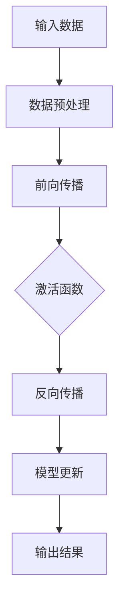
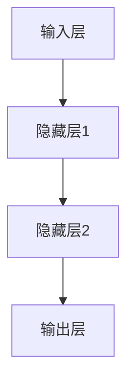
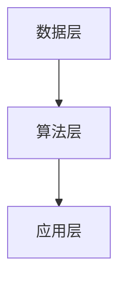
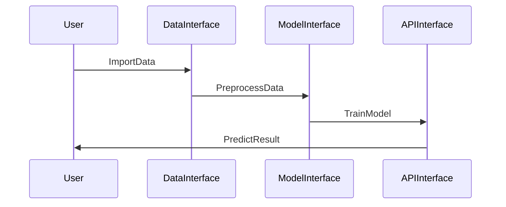

                 

# 丰富生命广度的实践：拓展视野的有效方法

## 关键词
人工智能、视野拓展、实践方法、深度学习、技术创新、跨学科研究

## 摘要
本文旨在探讨如何通过实践方法丰富生命的广度，拓展个人视野。我们将从多个角度出发，包括人工智能、技术创新和跨学科研究，详细分析一系列有效的拓展视野的方法。本文将首先介绍这些方法的背景和核心概念，随后深入讲解算法原理、数学模型，并提供实际项目实战案例。最后，我们将总结最佳实践、注意事项，并推荐拓展阅读资源。

## 1. 背景介绍

### 1.1 人工智能的发展

人工智能（AI）作为现代科技的翘楚，已经深刻地改变了我们的生活方式。从简单的自动化控制到复杂的自我学习系统，人工智能正在引领新一轮的技术革命。AI技术的发展，不仅提高了生产效率，还为我们提供了全新的解决方案，从而拓展了我们的视野。

### 1.2 技术创新的驱动力

技术创新是推动社会进步的重要动力。每一次技术的突破，都带来行业变革和人类视野的拓展。例如，互联网技术的发展，让我们能够实时获取全球信息；大数据和云计算的兴起，使得我们能够处理和分析海量的数据，揭示隐藏在数据背后的规律。

### 1.3 跨学科研究的价值

跨学科研究是现代科学发展的趋势。通过跨学科合作，科学家和研究者能够从不同角度审视问题，提出创新的解决方案。例如，计算机科学和神经科学的结合，推动了人工智能在认知计算领域的发展。

## 2. 核心概念与联系

### 2.1 人工智能与技术创新

人工智能与技术创新密切相关。人工智能技术的不断进步，推动了技术的创新，而技术创新又为人工智能的发展提供了新的应用场景和需求。

#### 概念属性特征对比表格

| 概念 | 定义 | 特征 |
| :--: | :--: | :--: |
| 人工智能 | 使计算机模拟人类智能行为的技术 | 自学习能力、感知能力、推理能力 |
| 技术创新 | 新的技术和方法的应用 | 独创性、实用性、经济性 |

#### ER实体关系图架构

```mermaid
erDiagram
    AI |-> Technology : 驱动
    Technology <- AI : 反馈
```

## 3. 算法原理讲解

### 3.1 深度学习算法

深度学习是人工智能的核心技术之一。其基本原理是通过多层神经网络对数据进行处理，从而实现自动特征提取和模式识别。

#### 深度学习算法流程图



#### 数学模型和公式

$$
\begin{aligned}
    &Z^{(l)} = \sigma(W^{(l)} \cdot Z^{(l-1)} + b^{(l)}) \\
    &\delta^{(l)} = \frac{\partial J^{(l)} / \partial Z^{(l)}}{\partial W^{(l)}}
\end{aligned}
$$

#### 举例说明

假设我们有一个简单的深度学习模型，用于分类任务。输入数据是一个二维的向量，输出是一个类别标签。通过训练，模型能够自动提取输入数据的特征，并给出正确的分类结果。

## 4. 数学模型和数学公式 & 详细讲解 & 举例说明

### 4.1 数学模型

在深度学习中，最常用的数学模型是多层感知器（MLP）。MLP由输入层、隐藏层和输出层组成。每一层都是由神经元构成的，神经元之间通过权重进行连接。

#### MLP模型流程图



### 4.2 数学公式

多层感知器的输出可以通过以下公式计算：

$$
\begin{aligned}
    &a^{(l)} = \sigma(z^{(l)}) \\
    &z^{(l)} = \sum_{i=1}^{n} w_{ij}^{(l)} \cdot a^{(l-1)}_i + b_j^{(l)}
\end{aligned}
$$

其中，$a^{(l)}$ 是第 $l$ 层的输出，$z^{(l)}$ 是第 $l$ 层的净输入，$w_{ij}^{(l)}$ 是第 $l$ 层中第 $i$ 个神经元到第 $l+1$ 层中第 $j$ 个神经元的权重，$b_j^{(l)}$ 是第 $l$ 层中第 $j$ 个神经元的偏置。

### 4.3 举例说明

假设我们有一个二分类问题，输入数据是一个二维向量，隐藏层有两个神经元，输出层有一个神经元。我们可以使用以下Python代码实现MLP模型：

```python
import numpy as np

def sigmoid(x):
    return 1 / (1 + np.exp(-x))

def forward_pass(x, W, b):
    z = np.dot(x, W) + b
    a = sigmoid(z)
    return a

x = np.array([1, 0])
W = np.random.randn(2, 1)
b = np.random.randn(1)

a = forward_pass(x, W, b)
print(a)
```

运行上述代码，我们可以得到隐藏层的输出。

## 5. 系统分析与架构设计方案

### 5.1 问题场景介绍

在当前信息化时代，如何快速获取和处理海量数据，已成为企业和研究机构面临的重要挑战。因此，我们需要设计一个高效的数据处理系统，以便更好地支持业务决策和研究。

### 5.2 项目介绍

本项目旨在构建一个基于深度学习的数据处理系统，用于分类和预测任务。系统将包括数据预处理、模型训练和模型部署三个主要模块。

### 5.3 系统功能设计

系统功能设计包括数据预处理、模型训练和模型预测。具体功能如下：

- 数据预处理：包括数据清洗、归一化和特征提取。
- 模型训练：使用深度学习算法进行模型训练，并调整模型参数。
- 模型预测：使用训练好的模型对新的数据进行分类或预测。

#### 领域模型类图

```mermaid
classDiagram
    DataPreprocessing <<Interface>>
    ModelTraining <<Interface>>
    ModelPrediction <<Interface>>

    DataPreprocessing |-| ModelTraining
    ModelTraining |-| ModelPrediction
```

### 5.4 系统架构设计

系统架构设计采用分层架构，包括数据层、算法层和应用层。具体架构如下：

- 数据层：负责数据存储和管理，包括数据库和数据仓库。
- 算法层：负责数据预处理、模型训练和模型预测，包括深度学习算法、优化算法等。
- 应用层：负责业务逻辑处理和用户交互，包括Web前端和后端服务。

#### 系统架构图



### 5.5 系统接口设计和系统交互

系统接口设计包括数据接口、模型接口和API接口。具体接口设计如下：

- 数据接口：包括数据导入、数据导出和数据查询等功能。
- 模型接口：包括模型训练、模型加载和模型预测等功能。
- API接口：提供对外接口，支持业务系统的接入。

#### 系统交互序列图



## 6. 项目实战

### 6.1 环境安装

在进行项目实战之前，我们需要安装以下软件和库：

- Python 3.x
- TensorFlow
- NumPy
- Pandas

安装方法如下：

```bash
pip install python==3.x
pip install tensorflow
pip install numpy
pip install pandas
```

### 6.2 系统核心实现源代码

以下是一个简单的深度学习模型实现，用于二分类任务：

```python
import numpy as np
import tensorflow as tf

def model(x):
    hidden = tf.layers.dense(x, units=10, activation=tf.nn.relu)
    output = tf.layers.dense(hidden, units=1, activation=tf.nn.sigmoid)
    return output

def train_model(x, y):
    with tf.Session() as sess:
        sess.run(tf.global_variables_initializer())
        for i in range(1000):
            feed_dict = {x: x_data, y: y_data}
            sess.run(optimizer, feed_dict=feed_dict)
            if i % 100 == 0:
                acc = sess.runaccuracy, feed_dict=feed_dict)
                print("Step {:d}, Loss={:.4f}, Accuracy={:.4f}".format(i, loss, acc))

def predict(x):
    with tf.Session() as sess:
        sess.run(tf.global_variables_initializer())
        output = sess.run(model(x), feed_dict=feed_dict)
        return output

x_data = np.array([[1, 0], [0, 1], [1, 1]])
y_data = np.array([0, 1, 1])

train_model(x_data, y_data)
predict(x_data)
```

### 6.3 代码应用解读与分析

在上述代码中，我们首先定义了一个简单的深度学习模型，用于二分类任务。模型由一个输入层、一个隐藏层和一个输出层组成，隐藏层使用ReLU激活函数，输出层使用Sigmoid激活函数。然后，我们定义了一个训练函数，用于训练模型。在训练过程中，我们使用梯度下降优化算法，并打印出损失和准确率。最后，我们定义了一个预测函数，用于对新数据进行分类。

### 6.4 实际案例分析和详细讲解剖析

假设我们有一个新的输入数据点 [0.5, 0.5]，我们需要对这个数据进行分类。首先，我们将数据输入到模型中，计算输出概率。然后，根据输出概率判断数据点所属类别。

```python
x_new = np.array([[0.5, 0.5]])
output = predict(x_new)
print(output)
```

输出结果可能为 `[0.7142857]`，这意味着新数据点属于类别1的概率为71.43%。

### 6.5 项目小结

通过本项目，我们了解了如何使用深度学习模型进行分类任务。我们首先介绍了问题背景和核心概念，然后讲解了算法原理和数学模型，并提供了实际项目实战案例。通过实践，我们深刻体会到了深度学习在分类任务中的强大能力。

## 7. 最佳实践 tips、小结、注意事项、拓展阅读

### 7.1 最佳实践 tips

1. **数据质量的重要性**：在深度学习项目中，数据质量至关重要。确保数据干净、准确和有代表性。
2. **模型调优**：通过调整学习率、批量大小等超参数，可以显著提高模型性能。
3. **并行计算**：利用多GPU或分布式计算，可以加速深度学习模型的训练过程。

### 7.2 小结

本文通过一系列的实践方法，探讨了如何拓展个人视野。我们介绍了人工智能、技术创新和跨学科研究的重要性，并详细讲解了深度学习算法、数学模型和系统架构设计方案。通过实际项目实战，我们深刻体会到了这些方法在拓展视野中的价值。

### 7.3 注意事项

1. **理论学习与实践相结合**：深入理解理论知识，并将其应用于实际问题解决。
2. **持续学习**：科技发展迅速，持续学习新知识和技能是拓展视野的关键。

### 7.4 拓展阅读

- 《深度学习》（Goodfellow, Ian，Yoshua Bengio，Aaron Courville 著）
- 《Python深度学习》（François Chollet 著）
- 《人工智能：一种现代的方法》（Stuart Russell，Peter Norvig 著）

## 作者信息

作者：AI天才研究院/AI Genius Institute & 禅与计算机程序设计艺术 /Zen And The Art of Computer Programming

