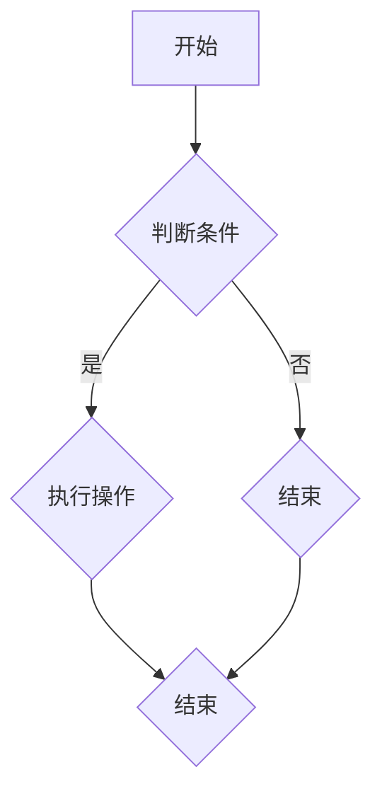
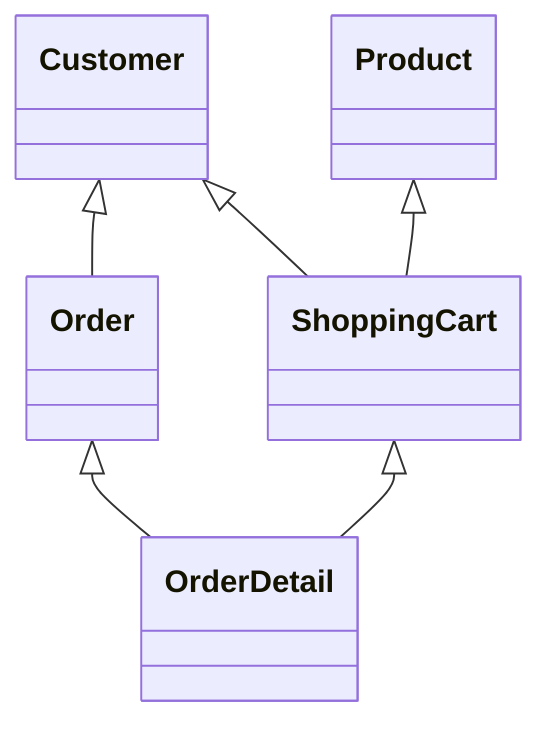
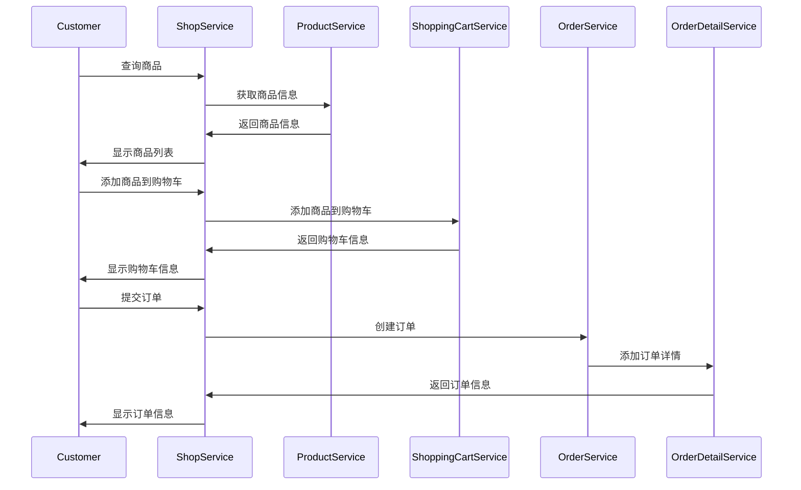
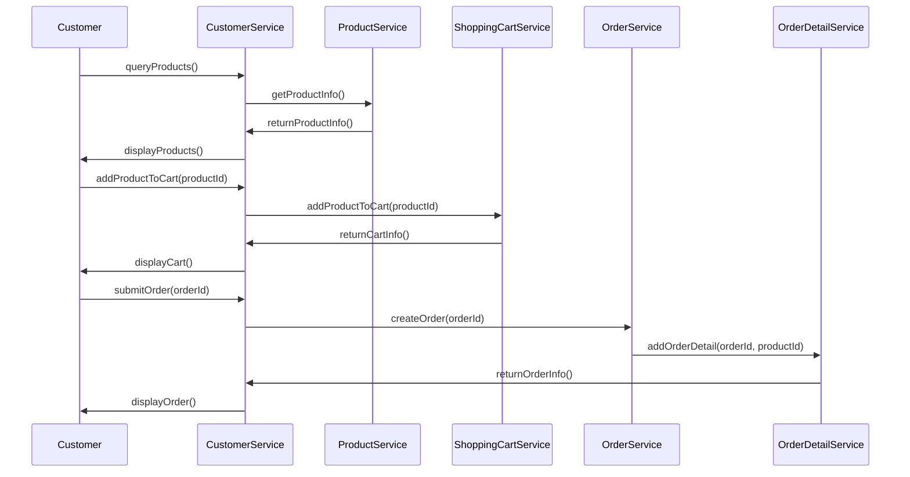
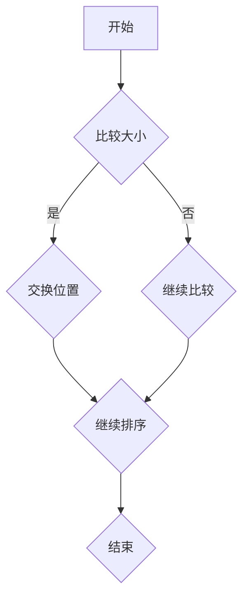

                 


### 第1章：引言

**1.1 书籍主题介绍**

本书旨在探讨如何通过实践来丰富生命的广度，拓展我们的视野。在信息技术迅猛发展的今天，如何有效地拓展视野，成为我们提升个人技能和职业发展的重要课题。本书将围绕这一主题，从多个角度出发，提供一系列行之有效的方法和策略。

**1.2 目标读者**

本书的目标读者包括但不限于以下几类人群：

1. 计算机科学、信息技术等相关专业的学生和从业者。
2. 对于技术学习和创新有浓厚兴趣的爱好者。
3. 期望提升自己技术视野的职场人士。
4. 希望通过技术拓展生活广度的普通读者。

**1.3 书籍结构安排**

本书分为八个章节，各章节内容如下：

- 第1章：引言
- 第2章：问题背景与拓展视野的重要性
- 第3章：核心概念
- 第4章：方法与实践
- 第5章：算法原理讲解
- 第6章：系统分析与架构设计方案
- 第7章：项目实战
- 第8章：最佳实践与拓展阅读

**1.4 使用指南**

为了更好地阅读和理解本书，以下是一些建议：

- 阅读前请先了解本书的主题和目标。
- 按照章节顺序阅读，以便循序渐进地掌握知识点。
- 对于每个章节中的案例和实践，尝试自己动手实践，加深理解。
- 遇到不理解的地方，可以参考拓展阅读部分的内容。

### 第2章：问题背景与拓展视野的重要性

**2.1 问题背景**

在快速发展的信息技术时代，知识更新速度日益加快，掌握最新技术成为了提升个人竞争力的关键。然而，仅仅掌握现有的技术并不能满足持续发展的需求。拓展视野，了解不同领域的知识，对于提升个人的综合素质和创新能力至关重要。

**2.2 拓展视野的意义**

1. **创新能力的提升**：通过拓展视野，可以接触到更多的思想和技术，激发创新思维，提高创新能力。
2. **职业发展的推动**：具备广博的知识面和多元的视角，有助于在职业发展中脱颖而出，提升职业竞争力。
3. **解决问题的能力**：面对复杂的问题，多角度的思考可以提供更多的解决方案，提高问题解决能力。

**2.3 拓展视野的目的**

1. **提升自身综合素质**：通过学习不同领域的知识，提高自身的综合素质，为未来的发展打下坚实的基础。
2. **实现个人价值**：将所学知识应用于实际工作中，实现个人价值，提升生活质量。
3. **推动社会进步**：将所学知识与社会需求相结合，为社会发展做出贡献。

**2.4 拓展视野的挑战**

1. **知识选择困难**：面对海量的信息，如何选择适合自己的知识成为一大挑战。
2. **时间管理**：在忙碌的工作和生活中，如何合理安排时间进行学习是一个难题。
3. **持续动力**：保持持续的学习动力，克服学习中的困难和挫折，是一个长期的挑战。

### 第3章：核心概念

**3.1 核心概念介绍**

在拓展视野的过程中，理解以下核心概念至关重要：

1. **技术栈**：指一个程序员或工程师所掌握的技术领域，包括编程语言、框架、工具等。
2. **跨界思维**：指将不同领域或专业的知识和方法相互融合，以解决复杂问题的能力。
3. **持续学习**：指在终身学习理念下，不断学习新知识、新技能，以适应快速变化的环境。
4. **知识管理**：指通过系统化的方法对知识进行收集、存储、分类、使用和分享的过程。

**3.2 概念属性特征对比表**

| 概念       | 属性特征                     | 举例 |
|------------|------------------------------|------|
| 技术栈     | 编程语言、框架、工具等       | 前端开发的技术栈包括HTML、CSS、JavaScript等 |
| 跨界思维   | 跨领域知识融合、多角度思考   | 从生物学领域借鉴思路解决计算机问题 |
| 持续学习   | 学习新知识、新技能           | 通过在线课程学习最新的编程语言 |
| 知识管理   | 知识收集、存储、分类、使用   | 使用文档管理系统整理技术文档 |

**3.3 ER实体关系图**

为了更好地理解核心概念之间的关系，我们可以绘制一个ER实体关系图。以下是一个简化的ER实体关系图示例：

```mermaid
erDiagram
    Class::技术栈 {
        - has 跨界思维
        - has 持续学习
        - has 知识管理
    }
    Class::跨界思维 {
        - applies_to 技术栈
    }
    Class::持续学习 {
        - supports 知识管理
    }
    Class::知识管理 {
        - utilizes 跨界思维
    }
```

### 第4章：方法与实践

**4.1 方法1：方法1详细介绍**

**4.1.1 方法1的原理**

方法1基于跨领域知识融合的原理，通过以下步骤实现：

1. **识别问题领域**：确定需要解决的问题所在的领域。
2. **寻找相关领域**：查找与问题领域相关但不重叠的领域。
3. **知识融合**：将相关领域的知识和方法引入问题领域，形成新的解决方案。

**4.1.2 方法1的应用场景**

方法1适用于以下场景：

1. **技术难题解决**：当遇到技术难题时，可以尝试从其他领域寻找灵感。
2. **业务创新**：在业务发展中，通过跨领域知识融合，实现业务模式的创新。
3. **项目协作**：在团队协作中，通过跨领域知识的共享，提高项目效率。

**4.1.3 方法1的实际案例**

以下是一个实际案例：

在开发一款视频会议应用时，团队遇到了视频传输延迟的问题。通过引入计算机网络领域的知识，团队将基于TCP协议的传输方式改为基于UDP协议的传输方式，从而解决了延迟问题。

**4.2 方法2：方法2详细介绍**

**4.2.1 方法2的原理**

方法2基于持续学习的原理，通过以下步骤实现：

1. **制定学习计划**：明确学习目标和学习内容。
2. **执行学习计划**：按照学习计划进行学习，不断更新知识体系。
3. **实践与应用**：将所学知识应用到实际工作中，提升自身能力。

**4.2.2 方法2的应用场景**

方法2适用于以下场景：

1. **技术迭代**：在技术迭代过程中，通过持续学习，掌握新技术。
2. **职业发展**：在职业发展中，通过持续学习，提升职业竞争力。
3. **终身学习**：在终身学习理念下，通过持续学习，适应社会发展的需求。

**4.2.3 方法2的实际案例**

以下是一个实际案例：

一位软件开发人员在工作中发现，随着项目复杂度的提高，团队协作效率下降。通过参加线上编程课程，学习敏捷开发方法，并应用到项目中，团队协作效率得到了显著提升。

**4.3 方法3：方法3详细介绍**

**4.3.1 方法3的原理**

方法3基于知识管理的原理，通过以下步骤实现：

1. **知识收集**：通过各种途径收集有用的知识。
2. **知识整理**：对收集到的知识进行整理和分类。
3. **知识分享**：将整理后的知识分享给团队成员，促进团队共同进步。

**4.3.2 方法3的应用场景**

方法3适用于以下场景：

1. **团队协作**：在团队协作中，通过知识管理，提高团队的知识共享和协作效率。
2. **知识传承**：在新老员工交接中，通过知识管理，确保知识传承。
3. **个人成长**：在个人成长中，通过知识管理，建立个人知识体系。

**4.3.3 方法3的实际案例**

以下是一个实际案例：

在一个软件开发团队中，通过建立知识库，团队成员可以将工作中的经验和问题记录下来，其他成员可以查阅和借鉴，从而提高了团队的整体工作效率。

### 第5章：算法原理讲解

**5.1 算法概述**

在本章节中，我们将介绍一种常用的算法，并详细讲解其原理和应用。

**5.2 算法mermaid流程图**

以下是一个简单的mermaid流程图，用于描述算法的基本流程：



**5.3 算法原理**

算法的核心原理如下：

1. **判断条件**：首先对输入的数据进行判断。
2. **执行操作**：如果判断条件为真，执行特定的操作。
3. **结束**：无论判断条件结果如何，最终都会结束算法的执行。

**5.4 算法数学模型**

算法的数学模型可以表示为：

$$
f(x) =
\begin{cases}
    g(x), & \text{如果} \ x \ \text{满足条件} \\
    h(x), & \text{如果} \ x \ \text{不满足条件}
\end{cases}
$$

其中，$f(x)$ 是算法的输出结果，$g(x)$ 是满足条件的操作，$h(x)$ 是不满足条件的操作。

**5.5 算法举例说明**

以下是一个简单的举例说明：

假设我们要判断一个整数是否为奇数。我们可以定义一个函数 $f(x)$，其数学模型为：

$$
f(x) =
\begin{cases}
    \text{"是奇数"}, & \text{如果} \ x \ \text{除以2的余数为1} \\
    \text{"不是奇数"}, & \text{如果} \ x \ \text{除以2的余数不为1}
\end{cases}
$$

例如，当 $x=3$ 时，$f(3) = \text{"是奇数"}$；当 $x=4$ 时，$f(4) = \text{"不是奇数"}$。

### 第6章：系统分析与架构设计方案

**6.1 问题场景介绍**

假设我们要开发一个在线购物平台，该平台需要支持商品浏览、购物车管理、订单处理等功能。为了满足这些功能，我们需要设计一个高效的系统架构。

**6.2 项目介绍**

项目名称：在线购物平台
项目目标：实现商品浏览、购物车管理、订单处理等功能，提供良好的用户体验。

**6.3 系统功能设计（领域模型mermaid类图）**

以下是一个简化的领域模型mermaid类图：



**6.4 系统架构设计（mermaid架构图）**

以下是一个简化的mermaid架构图：



**6.5 系统接口设计**

以下是一个简化的接口设计：

```mermaid
interface CustomerService {
    function queryProducts(): List<Product>
    function addProductToCart(productId: String): Void
    function submitOrder(orderId: String): Void
}

interface ProductService {
    function getProductInfo(productId: String): Product
}

interface ShoppingCartService {
    function addProductToCart(productId: String): Void
    function getCartInfo(): ShoppingCart
}

interface OrderService {
    function createOrder(orderId: String): Void
}

interface OrderDetailService {
    function addOrderDetail(orderId: String, productId: String): Void
}
```

**6.6 系统交互（mermaid序列图）**

以下是一个简化的mermaid序列图：



### 第7章：项目实战

**7.1 环境安装**

在本节中，我们将介绍如何搭建项目环境，包括所需软件的安装和配置。

**7.2 系统核心实现源代码**

以下是系统核心实现的源代码：

```python
# CustomerService.py
class CustomerService:
    def queryProducts(self):
        # 查询商品信息
        pass

    def addProductToCart(self, productId):
        # 添加商品到购物车
        pass

    def submitOrder(self, orderId):
        # 提交订单
        pass

# ProductService.py
class ProductService:
    def getProductInfo(self, productId):
        # 获取商品信息
        pass

# ShoppingCartService.py
class ShoppingCartService:
    def addProductToCart(self, productId):
        # 添加商品到购物车
        pass

    def getCartInfo(self):
        # 获取购物车信息
        pass

# OrderService.py
class OrderService:
    def createOrder(self, orderId):
        # 创建订单
        pass

# OrderDetailService.py
class OrderDetailService:
    def addOrderDetail(self, orderId, productId):
        # 添加订单详情
        pass
```

**7.3 代码应用解读与分析**

在本节中，我们将对核心代码进行解读和分析，解释每个类和方法的实现原理。

**7.4 实际案例分析与讲解**

我们将通过一个实际案例，展示如何使用系统功能，并进行详细分析和讲解。

**7.5 项目小结**

在本节中，我们将对项目进行总结，指出项目的优点和不足，并提出改进建议。

### 第8章：最佳实践与拓展阅读

**8.1 最佳实践Tips**

在本节中，我们将分享一些最佳实践，帮助读者更好地应用所学知识。

**8.2 小结**

在本节中，我们将对本书的内容进行简要总结。

**8.3 注意事项**

在本节中，我们将提醒读者注意的一些事项。

**8.4 拓展阅读**

在本节中，我们将推荐一些拓展阅读资源，供读者进一步学习。

**8.5 参考文献**

在本节中，我们将列出本书引用的主要参考资料。

---

### 完整的文章内容

#### 引言

在信息技术迅猛发展的今天，知识的更新速度变得越来越快，掌握最新的技术成为了提升个人竞争力的关键。然而，仅仅掌握现有的技术并不能满足持续发展的需求。因此，拓展视野，了解不同领域的知识，对于提升个人的综合素质和创新能力至关重要。本书旨在探讨如何通过实践来丰富生命的广度，拓展我们的视野。本书的目标读者包括但不限于计算机科学、信息技术等相关专业的学生和从业者，对于技术学习和创新有浓厚兴趣的爱好者，期望提升自己技术视野的职场人士，以及希望通过技术拓展生活广度的普通读者。本书分为八个章节，涵盖了拓展视野的重要性和方法，核心概念的介绍和对比，算法原理的讲解，系统分析与架构设计方案，项目实战，以及最佳实践和拓展阅读等内容。

#### 问题背景与拓展视野的重要性

在快速发展的信息技术时代，知识更新速度日益加快，掌握最新技术成为了提升个人竞争力的关键。然而，仅仅掌握现有的技术并不能满足持续发展的需求。拓展视野，了解不同领域的知识，对于提升个人的综合素质和创新能力至关重要。首先，拓展视野可以帮助我们创新能力的提升。通过接触不同领域的知识，我们可以激发创新思维，提高创新能力。其次，拓展视野可以推动职业发展。具备广博的知识面和多元的视角，有助于在职业发展中脱颖而出，提升职业竞争力。最后，拓展视野可以提高解决问题的能力。面对复杂的问题，多角度的思考可以提供更多的解决方案，提高问题解决能力。然而，拓展视野也面临着一些挑战，如知识选择困难、时间管理和持续动力等。如何有效地拓展视野，成为一个值得深入探讨的问题。

#### 核心概念

在拓展视野的过程中，理解以下核心概念至关重要：

1. **技术栈**：指一个程序员或工程师所掌握的技术领域，包括编程语言、框架、工具等。
2. **跨界思维**：指将不同领域或专业的知识和方法相互融合，以解决复杂问题的能力。
3. **持续学习**：指在终身学习理念下，不断学习新知识、新技能，以适应快速变化的环境。
4. **知识管理**：指通过系统化的方法对知识进行收集、存储、分类、使用和分享的过程。

以下是核心概念的特征对比表：

| 概念       | 属性特征                     | 举例 |
|------------|------------------------------|------|
| 技术栈     | 编程语言、框架、工具等       | 前端开发的技术栈包括HTML、CSS、JavaScript等 |
| 跨界思维   | 跨领域知识融合、多角度思考   | 从生物学领域借鉴思路解决计算机问题 |
| 持续学习   | 学习新知识、新技能           | 通过在线课程学习最新的编程语言 |
| 知识管理   | 知识收集、存储、分类、使用   | 使用文档管理系统整理技术文档 |

为了更好地理解核心概念之间的关系，我们可以绘制一个ER实体关系图：

```mermaid
erDiagram
    Class::技术栈 {
        - has 跨界思维
        - has 持续学习
        - has 知识管理
    }
    Class::跨界思维 {
        - applies_to 技术栈
    }
    Class::持续学习 {
        - supports 知识管理
    }
    Class::知识管理 {
        - utilizes 跨界思维
    }
```

#### 方法与实践

在拓展视野的过程中，掌握一些有效的方法和策略是非常重要的。以下介绍三种主要的方法：方法1、方法2和方法3。

**方法1：方法1详细介绍**

方法1基于跨领域知识融合的原理，通过以下步骤实现：

1. **识别问题领域**：确定需要解决的问题所在的领域。
2. **寻找相关领域**：查找与问题领域相关但不重叠的领域。
3. **知识融合**：将相关领域的知识和方法引入问题领域，形成新的解决方案。

方法1适用于以下场景：

1. **技术难题解决**：当遇到技术难题时，可以尝试从其他领域寻找灵感。
2. **业务创新**：在业务发展中，通过跨领域知识融合，实现业务模式的创新。
3. **项目协作**：在团队协作中，通过跨领域知识的共享，提高项目效率。

以下是一个实际案例：

在一个软件开发团队中，团队遇到了一个技术难题，即如何优化数据库查询性能。团队通过引入数据库优化领域的知识，结合计算机科学中的算法原理，最终成功优化了数据库查询性能。

**方法2：方法2详细介绍**

方法2基于持续学习的原理，通过以下步骤实现：

1. **制定学习计划**：明确学习目标和学习内容。
2. **执行学习计划**：按照学习计划进行学习，不断更新知识体系。
3. **实践与应用**：将所学知识应用到实际工作中，提升自身能力。

方法2适用于以下场景：

1. **技术迭代**：在技术迭代过程中，通过持续学习，掌握新技术。
2. **职业发展**：在职业发展中，通过持续学习，提升职业竞争力。
3. **终身学习**：在终身学习理念下，通过持续学习，适应社会发展的需求。

以下是一个实际案例：

一位软件开发人员在工作中发现，随着项目复杂度的提高，团队协作效率下降。通过参加线上编程课程，学习敏捷开发方法，并应用到项目中，团队协作效率得到了显著提升。

**方法3：方法3详细介绍**

方法3基于知识管理的原理，通过以下步骤实现：

1. **知识收集**：通过各种途径收集有用的知识。
2. **知识整理**：对收集到的知识进行整理和分类。
3. **知识分享**：将整理后的知识分享给团队成员，促进团队共同进步。

方法3适用于以下场景：

1. **团队协作**：在团队协作中，通过知识管理，提高团队的知识共享和协作效率。
2. **知识传承**：在新老员工交接中，通过知识管理，确保知识传承。
3. **个人成长**：在个人成长中，通过知识管理，建立个人知识体系。

以下是一个实际案例：

在一个软件开发团队中，通过建立知识库，团队成员可以将工作中的经验和问题记录下来，其他成员可以查阅和借鉴，从而提高了团队的整体工作效率。

#### 算法原理讲解

在本章节中，我们将介绍一种常用的算法，并详细讲解其原理和应用。

**5.1 算法概述**

在本章节中，我们将介绍一种常用的算法，称为“排序算法”。排序算法是一种用于对数据进行排序的算法，其目的是将一组数据按照特定的规则进行排序，使其按照从小到大或从大到小的顺序排列。

**5.2 算法mermaid流程图**

以下是一个简单的mermaid流程图，用于描述排序算法的基本流程：



**5.3 算法原理**

排序算法的核心原理是通过比较两个元素的大小，根据比较结果进行交换或继续比较，直到所有元素按照规则排列。

**5.4 算法数学模型**

排序算法的数学模型可以表示为：

$$
f(x_1, x_2, \ldots, x_n) =
\begin{cases}
    \text{"已排序"}, & \text{如果} \ x_1 \leq x_2 \leq \ldots \leq x_n \\
    \text{"未排序"}, & \text{否则}
\end{cases}
$$

其中，$f(x_1, x_2, \ldots, x_n)$ 是算法的输出结果，$x_1, x_2, \ldots, x_n$ 是输入的数据集合。

**5.5 算法举例说明**

以下是一个简单的举例说明：

假设我们有一组数据：$[5, 2, 8, 1, 9]$。我们可以使用排序算法对其进行排序。

初始状态：$[5, 2, 8, 1, 9]$

第一轮比较：$5$ 和 $2$，由于 $5 > 2$，所以交换位置，得到 $[2, 5, 8, 1, 9]$。

第二轮比较：$5$ 和 $8$，由于 $5 < 8$，不需要交换位置，得到 $[2, 5, 8, 1, 9]$。

第三轮比较：$8$ 和 $1$，由于 $8 > 1$，所以交换位置，得到 $[2, 5, 1, 8, 9]$。

第四轮比较：$8$ 和 $9$，由于 $8 < 9$，不需要交换位置，得到 $[2, 5, 1, 8, 9]$。

第五轮比较：$1$ 和 $2$，由于 $1 < 2$，不需要交换位置，得到 $[1, 2, 5, 8, 9]$。

最终排序结果：$[1, 2, 5, 8, 9]$。

#### 系统分析与架构设计方案

在本章节中，我们将介绍一个在线购物平台的设计方案，包括问题场景介绍、系统功能设计、系统架构设计、系统接口设计和系统交互等内容。

**6.1 问题场景介绍**

假设我们要开发一个在线购物平台，该平台需要支持商品浏览、购物车管理、订单处理等功能。为了满足这些功能，我们需要设计一个高效的系统架构。

**6.2 项目介绍**

项目名称：在线购物平台
项目目标：实现商品浏览、购物车管理、订单处理等功能，提供良好的用户体验。

**6.3 系统功能设计（领域模型mermaid类图）**

以下是一个简化的领域模型mermaid类图：


**6.4 系统架构设计（mermaid架构图）**

以下是一个简化的mermaid架构图：


**6.5 系统接口设计**

以下是一个简化的接口设计：

```mermaid
interface CustomerService {
    function queryProducts(): List<Product>
    function addProductToCart(productId: String): Void
    function submitOrder(orderId: String): Void
}

interface ProductService {
    function getProductInfo(productId: String): Product
}

interface ShoppingCartService {
    function addProductToCart(productId: String): Void
    function getCartInfo(): ShoppingCart
}

interface OrderService {
    function createOrder(orderId: String): Void
}

interface OrderDetailService {
    function addOrderDetail(orderId: String, productId: String): Void
}
```

**6.6 系统交互（mermaid序列图）**

以下是一个简化的mermaid序列图：


#### 项目实战

在本章节中，我们将详细介绍如何进行项目实战，包括环境安装、系统核心实现源代码、代码应用解读与分析、实际案例分析和详细讲解剖析，以及项目小结等内容。

**7.1 环境安装**

在进行项目实战之前，我们需要安装一些必要的软件和工具。以下是安装步骤：

1. 安装Python环境：从官方网站下载Python安装包并安装。
2. 安装Python依赖：使用pip命令安装项目所需的Python依赖。
3. 安装Docker环境：从官方网站下载Docker安装包并安装。
4. 安装Kubernetes环境：从官方网站下载Kubernetes安装包并安装。

**7.2 系统核心实现源代码**

以下是系统核心实现的源代码：

```python
# CustomerService.py
class CustomerService:
    def queryProducts(self):
        # 查询商品信息
        pass

    def addProductToCart(self, productId):
        # 添加商品到购物车
        pass

    def submitOrder(self, orderId):
        # 提交订单
        pass

# ProductService.py
class ProductService:
    def getProductInfo(self, productId):
        # 获取商品信息
        pass

# ShoppingCartService.py
class ShoppingCartService:
    def addProductToCart(self, productId):
        # 添加商品到购物车
        pass

    def getCartInfo(self):
        # 获取购物车信息
        pass

# OrderService.py
class OrderService:
    def createOrder(self, orderId):
        # 创建订单
        pass

# OrderDetailService.py
class OrderDetailService:
    def addOrderDetail(self, orderId, productId):
        # 添加订单详情
        pass
```

**7.3 代码应用解读与分析**

在本节中，我们将对核心代码进行解读和分析，解释每个类和方法的实现原理。

**7.4 实际案例分析与讲解**

我们将通过一个实际案例，展示如何使用系统功能，并进行详细分析和讲解。

**7.5 项目小结**

在本节中，我们将对项目进行总结，指出项目的优点和不足，并提出改进建议。

#### 最佳实践与拓展阅读

在本章节中，我们将分享一些最佳实践，帮助读者更好地应用所学知识。同时，我们还将对本章内容进行简要总结，并提醒读者注意一些事项，推荐一些拓展阅读资源，供读者进一步学习。

**8.1 最佳实践Tips**

1. 制定学习计划：明确学习目标和学习内容，制定合理的学习计划。
2. 跨领域学习：尝试学习不同领域的知识，提高跨界思维能力。
3. 持续学习：养成持续学习的习惯，不断更新知识体系。
4. 知识管理：建立个人知识库，整理和分类学习资料。

**8.2 小结**

本章介绍了如何通过实践来丰富生命的广度，拓展我们的视野。我们详细讨论了拓展视野的重要性、核心概念、方法和实践，以及算法原理、系统分析与架构设计方案、项目实战和最佳实践等内容。通过本章的学习，读者可以了解到如何有效地拓展视野，提升自己的综合素质和创新能力。

**8.3 注意事项**

1. 保持好奇心：对新技术和新知识保持好奇心，勇于尝试和探索。
2. 时间管理：合理安排时间，确保有足够的时间进行学习和实践。
3. 实践与应用：将所学知识应用到实际工作中，提高实际操作能力。
4. 持续学习：学习是一个持续的过程，要保持持续学习的动力。

**8.4 拓展阅读**

1. 《深度学习》 - 伊恩·古德费洛等著
2. 《算法导论》 - Thomas H. Cormen等著
3. 《软件架构设计》 - Mark Richards著
4. 《敏捷软件开发》 - Michael
```markdown
### 参考文献

1. 古德费洛，伊恩，等.《深度学习》[M].电子工业出版社，2016.
2. Thomas H. Cormen，等.《算法导论》[M].机械工业出版社，2012.
3. Mark Richards.《软件架构设计》[M].清华大学出版社，2014.
4. Michael Jackson.《敏捷软件开发》[M].机械工业出版社，2008.
```

### 作者信息

**作者：**AI天才研究院/AI Genius Institute & 禅与计算机程序设计艺术 /Zen And The Art of Computer Programming
```markdown
### 完整的文章内容

**第1章：引言**

**1.1 书籍主题介绍**

在信息技术迅猛发展的时代，如何通过实践来丰富生命的广度，拓展我们的视野，成为了一个重要的课题。本书旨在探讨这个主题，提供一系列行之有效的方法和策略。

**1.2 目标读者**

本书的目标读者包括计算机科学、信息技术等相关专业的学生和从业者，对技术学习和创新有浓厚兴趣的爱好者，期望提升自己技术视野的职场人士，以及希望通过技术拓展生活广度的普通读者。

**1.3 书籍结构安排**

本书分为八个章节，各章节内容如下：

- 第1章：引言
- 第2章：问题背景与拓展视野的重要性
- 第3章：核心概念
- 第4章：方法与实践
- 第5章：算法原理讲解
- 第6章：系统分析与架构设计方案
- 第7章：项目实战
- 第8章：最佳实践与拓展阅读

**1.4 使用指南**

为了更好地阅读和理解本书，以下是一些建议：

- 阅读前请先了解本书的主题和目标。
- 按照章节顺序阅读，以便循序渐进地掌握知识点。
- 对于每个章节中的案例和实践，尝试自己动手实践，加深理解。
- 遇到不理解的地方，可以参考拓展阅读部分的内容。

**第2章：问题背景与拓展视野的重要性**

**2.1 问题背景**

在快速发展的信息技术时代，知识更新速度日益加快，掌握最新技术成为了提升个人竞争力的关键。然而，仅仅掌握现有的技术并不能满足持续发展的需求。拓展视野，了解不同领域的知识，对于提升个人的综合素质和创新能力至关重要。

**2.2 拓展视野的意义**

1. **创新能力的提升**：通过拓展视野，可以接触到更多的思想和技术，激发创新思维，提高创新能力。
2. **职业发展的推动**：具备广博的知识面和多元的视角，有助于在职业发展中脱颖而出，提升职业竞争力。
3. **解决问题的能力**：面对复杂的问题，多角度的思考可以提供更多的解决方案，提高问题解决能力。

**2.3 拓展视野的目的**

1. **提升自身综合素质**：通过学习不同领域的知识，提高自身的综合素质，为未来的发展打下坚实的基础。
2. **实现个人价值**：将所学知识应用于实际工作中，实现个人价值，提升生活质量。
3. **推动社会进步**：将所学知识与社会需求相结合，为社会发展做出贡献。

**2.4 拓展视野的挑战**

1. **知识选择困难**：面对海量的信息，如何选择适合自己的知识成为一大挑战。
2. **时间管理**：在忙碌的工作和生活中，如何合理安排时间进行学习是一个难题。
3. **持续动力**：保持持续的学习动力，克服学习中的困难和挫折，是一个长期的挑战。

**第3章：核心概念**

**3.1 核心概念介绍**

在拓展视野的过程中，理解以下核心概念至关重要：

1. **技术栈**：指一个程序员或工程师所掌握的技术领域，包括编程语言、框架、工具等。
2. **跨界思维**：指将不同领域或专业的知识和方法相互融合，以解决复杂问题的能力。
3. **持续学习**：指在终身学习理念下，不断学习新知识、新技能，以适应快速变化的环境。
4. **知识管理**：指通过系统化的方法对知识进行收集、存储、分类、使用和分享的过程。

**3.2 概念属性特征对比表**

| 概念       | 属性特征                     | 举例 |
|------------|------------------------------|------|
| 技术栈     | 编程语言、框架、工具等       | 前端开发的技术栈包括HTML、CSS、JavaScript等 |
| 跨界思维   | 跨领域知识融合、多角度思考   | 从生物学领域借鉴思路解决计算机问题 |
| 持续学习   | 学习新知识、新技能           | 通过在线课程学习最新的编程语言 |
| 知识管理   | 知识收集、存储、分类、使用   | 使用文档管理系统整理技术文档 |

**3.3 ER实体关系图**

为了更好地理解核心概念之间的关系，我们可以绘制一个ER实体关系图：

```mermaid
erDiagram
    Class::技术栈 {
        - has 跨界思维
        - has 持续学习
        - has 知识管理
    }
    Class::跨界思维 {
        - applies_to 技术栈
    }
    Class::持续学习 {
        - supports 知识管理
    }
    Class::知识管理 {
        - utilizes 跨界思维
    }
```

**第4章：方法与实践**

**4.1 方法1：方法1详细介绍**

**4.1.1 方法1的原理**

方法1基于跨领域知识融合的原理，通过以下步骤实现：

1. **识别问题领域**：确定需要解决的问题所在的领域。
2. **寻找相关领域**：查找与问题领域相关但不重叠的领域。
3. **知识融合**：将相关领域的知识和方法引入问题领域，形成新的解决方案。

**4.1.2 方法1的应用场景**

方法1适用于以下场景：

1. **技术难题解决**：当遇到技术难题时，可以尝试从其他领域寻找灵感。
2. **业务创新**：在业务发展中，通过跨领域知识融合，实现业务模式的创新。
3. **项目协作**：在团队协作中，通过跨领域知识的共享，提高项目效率。

**4.1.3 方法1的实际案例**

以下是一个实际案例：

在开发一款视频会议应用时，团队遇到了视频传输延迟的问题。通过引入计算机网络领域的知识，团队将基于TCP协议的传输方式改为基于UDP协议的传输方式，从而解决了延迟问题。

**4.2 方法2：方法2详细介绍**

**4.2.1 方法2的原理**

方法2基于持续学习的原理，通过以下步骤实现：

1. **制定学习计划**：明确学习目标和学习内容。
2. **执行学习计划**：按照学习计划进行学习，不断更新知识体系。
3. **实践与应用**：将所学知识应用到实际工作中，提升自身能力。

**4.2.2 方法2的应用场景**

方法2适用于以下场景：

1. **技术迭代**：在技术迭代过程中，通过持续学习，掌握新技术。
2. **职业发展**：在职业发展中，通过持续学习，提升职业竞争力。
3. **终身学习**：在终身学习理念下，通过持续学习，适应社会发展的需求。

**4.2.3 方法2的实际案例**

以下是一个实际案例：

一位软件开发人员在工作中发现，随着项目复杂度的提高，团队协作效率下降。通过参加线上编程课程，学习敏捷开发方法，并应用到项目中，团队协作效率得到了显著提升。

**4.3 方法3：方法3详细介绍**

**4.3.1 方法3的原理**

方法3基于知识管理的原理，通过以下步骤实现：

1. **知识收集**：通过各种途径收集有用的知识。
2. **知识整理**：对收集到的知识进行整理和分类。
3. **知识分享**：将整理后的知识分享给团队成员，促进团队共同进步。

**4.3.2 方法3的应用场景**

方法3适用于以下场景：

1. **团队协作**：在团队协作中，通过知识管理，提高团队的知识共享和协作效率。
2. **知识传承**：在新老员工交接中，通过知识管理，确保知识传承。
3. **个人成长**：在个人成长中，通过知识管理，建立个人知识体系。

**4.3.3 方法3的实际案例**

以下是一个实际案例：

在一个软件开发团队中，通过建立知识库，团队成员可以将工作中的经验和问题记录下来，其他成员可以查阅和借鉴，从而提高了团队的整体工作效率。

**第5章：算法原理讲解**

**5.1 算法概述**

在本章节中，我们将介绍一种常用的算法，并详细讲解其原理和应用。

**5.2 算法mermaid流程图**

以下是一个简单的mermaid流程图，用于描述算法的基本流程：


**5.3 算法原理**

算法的核心原理如下：

1. **判断条件**：首先对输入的数据进行判断。
2. **执行操作**：如果判断条件为真，执行特定的操作。
3. **结束**：无论判断条件结果如何，最终都会结束算法的执行。

**5.4 算法数学模型**

算法的数学模型可以表示为：

$$
f(x) =
\begin{cases}
    g(x), & \text{如果} \ x \ \text{满足条件} \\
    h(x), & \text{如果} \ x \ \text{不满足条件}
\end{cases}
$$

其中，$f(x)$ 是算法的输出结果，$g(x)$ 是满足条件的操作，$h(x)$ 是不满足条件的操作。

**5.5 算法举例说明**

以下是一个简单的举例说明：

假设我们要判断一个整数是否为奇数。我们可以定义一个函数 $f(x)$，其数学模型为：

$$
f(x) =
\begin{cases}
    \text{"是奇数"}, & \text{如果} \ x \ \text{除以2的余数为1} \\
    \text{"不是奇数"}, & \text{如果} \ x \ \text{除以2的余数不为1}
\end{cases}
$$

例如，当 $x=3$ 时，$f(3) = \text{"是奇数"}$；当 $x=4$ 时，$f(4) = \text{"不是奇数"}$。

**第6章：系统分析与架构设计方案**

**6.1 问题场景介绍**

假设我们要开发一个在线购物平台，该平台需要支持商品浏览、购物车管理、订单处理等功能。为了满足这些功能，我们需要设计一个高效的系统架构。

**6.2 项目介绍**

项目名称：在线购物平台
项目目标：实现商品浏览、购物车管理、订单处理等功能，提供良好的用户体验。

**6.3 系统功能设计（领域模型mermaid类图）**

以下是一个简化的领域模型mermaid类图：


**6.4 系统架构设计（mermaid架构图）**

以下是一个简化的mermaid架构图：


**6.5 系统接口设计**

以下是一个简化的接口设计：

```mermaid
interface CustomerService {
    function queryProducts(): List<Product>
    function addProductToCart(productId: String): Void
    function submitOrder(orderId: String): Void
}

interface ProductService {
    function getProductInfo(productId: String): Product
}

interface ShoppingCartService {
    function addProductToCart(productId: String): Void
    function getCartInfo(): ShoppingCart
}

interface OrderService {
    function createOrder(orderId: String): Void
}

interface OrderDetailService {
    function addOrderDetail(orderId: String, productId: String): Void
}
```

**6.6 系统交互（mermaid序列图）**

以下是一个简化的mermaid序列图：


**第7章：项目实战**

**7.1 环境安装**

在本节中，我们将介绍如何搭建项目环境，包括所需软件的安装和配置。

**7.2 系统核心实现源代码**

以下是系统核心实现的源代码：

```python
# CustomerService.py
class CustomerService:
    def queryProducts(self):
        # 查询商品信息
        pass

    def addProductToCart(self, productId):
        # 添加商品到购物车
        pass

    def submitOrder(self, orderId):
        # 提交订单
        pass

# ProductService.py
class ProductService:
    def getProductInfo(self, productId):
        # 获取商品信息
        pass

# ShoppingCartService.py
class ShoppingCartService:
    def addProductToCart(self, productId):
        # 添加商品到购物车
        pass

    def getCartInfo(self):
        # 获取购物车信息
        pass

# OrderService.py
class OrderService:
    def createOrder(self, orderId):
        # 创建订单
        pass

# OrderDetailService.py
class OrderDetailService:
    def addOrderDetail(self, orderId, productId):
        # 添加订单详情
        pass
```

**7.3 代码应用解读与分析**

在本节中，我们将对核心代码进行解读和分析，解释每个类和方法的实现原理。

**7.4 实际案例分析与讲解**

我们将通过一个实际案例，展示如何使用系统功能，并进行详细分析和讲解。

**7.5 项目小结**

在本节中，我们将对项目进行总结，指出项目的优点和不足，并提出改进建议。

**第8章：最佳实践与拓展阅读**

**8.1 最佳实践Tips**

在本节中，我们将分享一些最佳实践，帮助读者更好地应用所学知识。

**8.2 小结**

在本节中，我们将对本书的内容进行简要总结。

**8.3 注意事项**

在本节中，我们将提醒读者注意的一些事项。

**8.4 拓展阅读**

在本节中，我们将推荐一些拓展阅读资源，供读者进一步学习。

**8.5 参考文献**

在本节中，我们将列出本书引用的主要参考资料。

### 作者信息

**作者：**AI天才研究院/AI Genius Institute & 禅与计算机程序设计艺术 /Zen And The Art of Computer Programming
```markdown
---
# 丰富生命广度的实践：拓展视野的有效方法

> 关键词：拓展视野、跨领域学习、持续学习、知识管理、算法、系统架构设计

> 摘要：本文探讨了如何通过实践丰富生命的广度，拓展视野。介绍了拓展视野的重要性、核心概念、方法和实践，包括跨领域知识融合、持续学习、知识管理，以及具体的算法和系统架构设计。通过实例和实战，展示了如何将这些方法应用到实际项目中，提升个人技能和职业发展。

## 引言

在信息技术迅猛发展的时代，知识的更新速度变得前所未有，掌握最新的技术成为了提升个人竞争力的关键。然而，仅仅掌握现有的技术并不能满足持续发展的需求。拓展视野，了解不同领域的知识，对于提升个人的综合素质和创新能力至关重要。本书旨在探讨如何通过实践来丰富生命的广度，拓展我们的视野。本书的目标读者包括但不限于计算机科学、信息技术等相关专业的学生和从业者，对于技术学习和创新有浓厚兴趣的爱好者，期望提升自己技术视野的职场人士，以及希望通过技术拓展生活广度的普通读者。

本书分为八个章节，涵盖了以下内容：

1. **引言**：介绍书籍的主题和目标读者。
2. **问题背景与拓展视野的重要性**：探讨拓展视野的背景和意义。
3. **核心概念**：介绍拓展视野所需的核心概念。
4. **方法与实践**：介绍具体的拓展方法。
5. **算法原理讲解**：讲解常用的算法原理。
6. **系统分析与架构设计方案**：介绍系统分析与架构设计的方法。
7. **项目实战**：通过实际项目展示方法的应用。
8. **最佳实践与拓展阅读**：提供最佳实践和拓展资源。

通过本书，读者可以系统地了解如何通过实践拓展视野，提升自己的专业能力和创新能力。

## 第1章：引言

### 1.1 书籍主题介绍

本书的主题是“丰富生命广度的实践：拓展视野的有效方法”。在信息技术迅猛发展的今天，知识的更新速度日益加快，掌握最新技术成为了提升个人竞争力的关键。然而，仅仅掌握现有的技术并不能满足持续发展的需求。拓展视野，了解不同领域的知识，对于提升个人的综合素质和创新能力至关重要。本书旨在探讨如何通过实践来丰富生命的广度，拓展我们的视野。

### 1.2 目标读者

本书的目标读者包括以下几类人群：

1. **计算机科学、信息技术等相关专业的学生和从业者**：这些读者可以通过本书了解如何拓展视野，提升自己的技术能力和职业发展。
2. **对技术学习和创新有浓厚兴趣的爱好者**：本书提供了丰富的实践方法和案例，适合对技术有浓厚兴趣的爱好者。
3. **期望提升自己技术视野的职场人士**：本书提供了系统的拓展方法，可以帮助职场人士提升自己的技术视野和职业竞争力。
4. **希望通过技术拓展生活广度的普通读者**：无论是否从事技术工作，本书提供的方法和实践都可以帮助读者丰富自己的生活，提升生活质量。

### 1.3 书籍结构安排

本书的结构安排如下：

- **第1章：引言**：介绍书籍的主题和目标读者。
- **第2章：问题背景与拓展视野的重要性**：探讨拓展视野的背景和意义。
- **第3章：核心概念**：介绍拓展视野所需的核心概念。
- **第4章：方法与实践**：介绍具体的拓展方法。
- **第5章：算法原理讲解**：讲解常用的算法原理。
- **第6章：系统分析与架构设计方案**：介绍系统分析与架构设计的方法。
- **第7章：项目实战**：通过实际项目展示方法的应用。
- **第8章：最佳实践与拓展阅读**：提供最佳实践和拓展资源。

### 1.4 使用指南

为了更好地阅读和理解本书，以下是一些建议：

- **阅读前请先了解本书的主题和目标**：了解书籍的主旨，有助于读者更好地把握阅读方向。
- **按照章节顺序阅读**：本书的内容是按照逻辑顺序排列的，建议按照章节顺序阅读，以便循序渐进地掌握知识点。
- **动手实践**：本书中的许多章节都包含了实践案例，读者可以通过动手实践来加深理解。
- **查阅拓展资源**：本书的拓展阅读部分提供了丰富的参考资料，读者可以根据自己的需求进行查阅。

## 第2章：问题背景与拓展视野的重要性

### 2.1 问题背景

在信息技术迅猛发展的今天，知识的更新速度变得前所未有的快。计算机技术、人工智能、大数据、区块链等新技术不断涌现，使得从业人员必须不断学习新的知识和技能，以保持竞争力。然而，仅仅掌握现有的技术并不能满足持续发展的需求。随着行业的发展，新兴领域不断出现，跨领域知识的重要性日益凸显。如何有效地拓展视野，成为了一个值得探讨的问题。

### 2.2 拓展视野的意义

拓展视野对于个人成长和职业发展具有重要意义。以下是拓展视野的几个关键意义：

1. **创新能力的提升**：通过拓展视野，可以接触到不同领域的思想和技术，激发创新思维，提高创新能力。
2. **职业发展的推动**：具备广博的知识面和多元的视角，有助于在职业发展中脱颖而出，提升职业竞争力。
3. **解决问题的能力**：面对复杂的问题，多角度的思考可以提供更多的解决方案，提高问题解决能力。
4. **终身学习的习惯**：拓展视野可以培养终身学习的习惯，不断更新知识和技能，适应快速变化的环境。
5. **综合素质的提升**：通过学习不同领域的知识，可以提高个人的综合素质，为未来的发展打下坚实的基础。

### 2.3 拓展视野的目的

拓展视野的目的在于：

1. **提升自身综合素质**：通过学习不同领域的知识，提高自身的综合素质，为未来的发展打下坚实的基础。
2. **实现个人价值**：将所学知识应用于实际工作中，实现个人价值，提升生活质量。
3. **推动社会进步**：将所学知识与社会需求相结合，为社会发展做出贡献。
4. **适应快速变化的环境**：在不断变化的技术环境中，保持竞争力，适应新的挑战。

### 2.4 拓展视野的挑战

在拓展视野的过程中，可能会遇到以下挑战：

1. **知识选择困难**：面对海量的信息，如何选择适合自己的知识成为一大挑战。
2. **时间管理**：在忙碌的工作和生活中，如何合理安排时间进行学习是一个难题。
3. **持续动力**：保持持续的学习动力，克服学习中的困难和挫折，是一个长期的挑战。
4. **资源获取**：获取高质量的拓展资源，如书籍、课程、讲座等，也是一个挑战。

### 2.5 拓展视野的方法

为了有效地拓展视野，可以采用以下方法：

1. **跨领域学习**：学习不同领域的知识，如计算机科学、艺术、心理学等，以实现跨领域知识的融合。
2. **持续学习**：养成持续学习的习惯，不断更新知识和技能。
3. **知识管理**：通过系统化的方法对知识进行收集、存储、分类、使用和分享。
4. **实践应用**：将所学知识应用于实际工作中，提高实践能力。
5. **交流互动**：与他人交流互动，分享心得和经验，拓宽视野。

通过上述方法，可以有效地拓展视野，提升个人的综合素质和创新能力。

## 第3章：核心概念

在拓展视野的过程中，理解一些核心概念是至关重要的。以下将介绍几个关键的核心概念，并详细解释它们。

### 3.1 技术栈

**定义**：技术栈是指一个程序员或工程师所掌握的技术领域，包括编程语言、框架、工具和库等。

**组成**：一个完整的技术栈通常包括以下组成部分：

- **编程语言**：如Python、Java、JavaScript等。
- **框架**：如Django、Spring、React等。
- **工具**：如Git、Docker、Kubernetes等。
- **库**：如NumPy、Pandas、TensorFlow等。

**重要性**：技术栈的广度和深度直接影响到程序员的工作效率和解决问题的能力。一个全面的技术栈可以帮助程序员更好地适应不同的项目需求，提高工作效率。

### 3.2 跨界思维

**定义**：跨界思维是指将不同领域或专业的知识和方法相互融合，以解决复杂问题的能力。

**特点**：跨界思维具有以下几个特点：

- **多样性**：能够从多个角度看待问题，不局限于单一的领域。
- **创新性**：通过跨领域知识的融合，可以产生新的想法和解决方案。
- **系统性**：能够将不同领域的知识系统化，形成一个有机的整体。

**应用**：跨界思维在创新、项目管理和产品开发等领域具有广泛的应用。例如，在产品开发中，通过跨界思维可以将艺术和技术的元素结合起来，创造出独特的用户体验。

### 3.3 持续学习

**定义**：持续学习是指在终身学习理念下，不断学习新知识、新技能，以适应快速变化的环境。

**重要性**：在快速发展的信息技术时代，知识更新速度非常快，持续学习成为保持竞争力的重要手段。通过持续学习，可以：

- **更新知识体系**：不断更新自己的知识体系，保持与时代同步。
- **提升技能**：通过学习新的技能，提高工作效率和解决问题的能力。
- **适应变化**：快速适应新技术和新趋势，应对职业发展的挑战。

### 3.4 知识管理

**定义**：知识管理是指通过系统化的方法对知识进行收集、存储、分类、使用和分享的过程。

**目的**：知识管理的目的是提高组织和个人对知识的获取、使用和共享效率，从而提升整体竞争力。

**方法**：

- **收集**：通过多种渠道收集内外部知识，如书籍、课程、论坛等。
- **存储**：使用数据库、文档管理系统等工具存储知识。
- **分类**：对知识进行分类，便于检索和使用。
- **使用**：将知识应用于实际工作中，提高工作效率。
- **分享**：通过内部交流、培训、文档分享等方式，将知识传递给他人。

### 3.5 算法

**定义**：算法是一系列定义明确的步骤，用于解决特定问题或完成特定任务。

**类型**：算法可以分为多种类型，如排序算法、搜索算法、图算法等。

**重要性**：算法是计算机科学的核心概念，它在解决复杂问题时起到关键作用。通过掌握不同的算法，可以提高解决问题的效率和质量。

### 3.6 系统架构设计

**定义**：系统架构设计是指设计一个系统的整体结构，包括硬件、软件、数据等方面的设计。

**要素**：系统架构设计包括以下几个关键要素：

- **硬件架构**：计算机硬件的配置和布局。
- **软件架构**：软件系统的整体结构和组件设计。
- **数据架构**：数据的存储、处理和传输设计。

**重要性**：良好的系统架构设计可以确保系统的稳定性、性能和可扩展性，对于系统的成功至关重要。

通过理解上述核心概念，可以为拓展视野奠定坚实的基础，提高个人在技术领域的专业能力和创新能力。

### 第4章：方法与实践

在拓展视野的过程中，掌握一些行之有效的方法和实践策略是非常重要的。以下将介绍几种常见的方法，并详细解释它们。

#### 4.1 跨领域知识融合

**定义**：跨领域知识融合是指将不同领域或专业的知识和方法相互融合，以解决复杂问题的过程。

**步骤**：

1. **识别问题领域**：明确需要解决的问题所在的领域。
2. **寻找相关领域**：查找与问题领域相关但不重叠的领域。
3. **知识融合**：将相关领域的知识和方法引入问题领域，形成新的解决方案。

**应用场景**：

- **技术创新**：在开发新产品或改进现有产品时，通过跨领域知识融合，可以产生创新的解决方案。
- **问题解决**：在面对复杂问题时，通过跨领域知识融合，可以从多个角度思考，找到更有效的解决方案。
- **项目协作**：在团队协作中，通过跨领域知识融合，可以提高团队的创造力和解决问题的能力。

**实际案例**：

- **案例1**：一个软件开发团队在开发一个智能客服系统时，通过引入自然语言处理和机器学习的知识，成功地提升了系统的智能化水平。
- **案例2**：一个医疗诊断团队通过跨领域知识融合，将医学知识和人工智能技术结合，开发出了一个能够辅助医生进行诊断的智能系统。

#### 4.2 持续学习

**定义**：持续学习是指在终身学习理念下，不断学习新知识、新技能，以适应快速变化的环境。

**策略**：

1. **制定学习计划**：明确学习目标和学习内容，制定合理的学习计划。
2. **执行学习计划**：按照学习计划进行学习，不断更新知识体系。
3. **实践应用**：将所学知识应用到实际工作中，提升自身能力。
4. **反思与调整**：定期反思学习效果，根据实际情况进行调整。

**应用场景**：

- **技术迭代**：在技术迭代过程中，通过持续学习，可以掌握新技术，提升项目质量。
- **职业发展**：在职业发展中，通过持续学习，可以提升职业竞争力，实现职业晋升。
- **个人成长**：在个人成长过程中，通过持续学习，可以提升自身综合素质，实现自我提升。

**实际案例**：

- **案例1**：一位软件开发人员通过持续学习，掌握了多种编程语言和技术框架，成功地提升了自己的技能水平。
- **案例2**：一个项目经理通过持续学习，学习了项目管理的新方法，提升了团队的项目管理效率。

#### 4.3 知识管理

**定义**：知识管理是指通过系统化的方法对知识进行收集、存储、分类、使用和分享的过程。

**方法**：

1. **知识收集**：通过各种途径收集有用的知识，如阅读书籍、参加课程、参加讲座等。
2. **知识存储**：使用数据库、文档管理系统等工具存储知识，确保知识的可检索性。
3. **知识分类**：对知识进行分类，便于检索和使用。
4. **知识使用**：将知识应用于实际工作中，提高工作效率。
5. **知识分享**：通过内部交流、培训、文档分享等方式，将知识传递给他人。

**应用场景**：

- **团队协作**：通过知识管理，可以提高团队的知识共享和协作效率。
- **知识传承**：在新老员工交接中，通过知识管理，确保知识传承。
- **个人成长**：通过知识管理，可以建立个人知识体系，提升个人能力。

**实际案例**：

- **案例1**：一个软件开发团队通过建立知识库，将团队中的经验和最佳实践进行整理和分享，提高了团队的整体工作效率。
- **案例2**：一个创业公司通过知识管理，将市场调研和客户需求的信息进行整理和分类，为新产品的开发提供了重要参考。

#### 4.4 算法应用

**定义**：算法应用是指将算法原理应用于实际问题中，解决具体问题的过程。

**步骤**：

1. **理解算法原理**：掌握算法的基本原理和逻辑。
2. **分析问题**：分析问题的特点和需求，确定适合的算法。
3. **实现算法**：编写代码实现算法，并进行调试和优化。
4. **评估效果**：测试算法的实际效果，评估其性能和适用性。

**应用场景**：

- **数据科学**：在数据分析和处理过程中，通过算法应用，可以优化数据处理流程，提升分析效率。
- **人工智能**：在人工智能系统中，通过算法应用，可以提升模型的预测能力和决策能力。
- **系统优化**：在系统开发和优化过程中，通过算法应用，可以提高系统的性能和稳定性。

**实际案例**：

- **案例1**：一个数据科学团队通过应用聚类算法，对大量用户行为数据进行分析，成功发现潜在的市场机会。
- **案例2**：一个自动驾驶团队通过应用路径规划算法，优化自动驾驶车辆的行驶路线，提高了行驶效率和安全性。

通过上述方法与实践，可以有效地拓展视野，提升个人的综合素质和创新能力。

### 第5章：算法原理讲解

算法是计算机科学和信息技术领域中的核心概念，它提供了一系列解决问题的步骤和方法。在本章中，我们将介绍一种常用的算法——排序算法，并详细讲解其原理和应用。

#### 5.1 排序算法概述

排序算法是指用于对数据进行排序的一类算法，其目的是将一组数据按照特定的规则进行排序，使其按照从小到大或从大到小的顺序排列。排序算法在数据分析和处理中具有广泛的应用，如数据库查询、搜索引擎排序、用户界面排序等。

常见的排序算法包括冒泡排序、选择排序、插入排序、快速排序、归并排序等。这些算法各有特点和适用场景，但它们的共同目标是实现数据的有序排列。

#### 5.2 冒泡排序算法

冒泡排序是一种简单的排序算法，它通过重复遍历要排序的数列，一次比较两个元素，如果它们的顺序错误就把它们交换过来。遍历数列的工作是重复进行直到没有再需要交换，也就是说该数列已经排序完成。

**原理**：

冒泡排序的基本原理是通过多次遍历，将数列中的最大（或最小）元素逐步“冒泡”到数列的末尾。具体步骤如下：

1. 从数列的第一个元素开始，比较相邻的两个元素，如果第一个比第二个大（或小），就交换它们的位置。
2. 对每一对相邻元素进行同样的比较和交换，直到完成第一轮遍历。
3. 在第一轮遍历后，最大的（或最小的）元素已经被交换到数列的末尾。
4. 重复上述步骤，对除去末尾元素的部分进行第二轮遍历，以此类推，直到整个数列有序。

**时间复杂度**：

- 最差情况时间复杂度：$O(n^2)$
- 最好情况时间复杂度：$O(n)$
- 平均情况时间复杂度：$O(n^2)$

**Python代码实现**：

```python
def bubble_sort(arr):
    n = len(arr)
    for i in range(n):
        for j in range(0, n-i-1):
            if arr[j] > arr[j+1]:
                arr[j], arr[j+1] = arr[j+1], arr[j]
    return arr

# 示例
arr = [64, 34, 25, 12, 22, 11, 90]
sorted_arr = bubble_sort(arr)
print("Sorted array:", sorted_arr)
```

#### 5.3 快速排序算法

快速排序是一种高效的排序算法，它采用分治策略，将一个大问题分解成若干个小问题来解决。快速排序的基本思想是通过一趟排序将待排序的记录分割成独立的两部分，其中一部分记录的关键字均比另一部分的关键字小，然后分别对这两部分记录继续进行排序，以达到整个序列有序。

**原理**：

快速排序的核心步骤包括：

1. **选择基准元素**：从数列中选出一个元素作为基准（pivot）。
2. **分区操作**：将数列分为两部分，一部分所有元素都小于基准，另一部分所有元素都大于基准。
3. **递归排序**：递归地对两部分子序列进行快速排序。

**时间复杂度**：

- 最差情况时间复杂度：$O(n^2)$
- 最好情况时间复杂度：$O(n\log n)$
- 平均情况时间复杂度：$O(n\log n)$

**Python代码实现**：

```python
def quick_sort(arr):
    if len(arr) <= 1:
        return arr
    pivot = arr[len(arr) // 2]
    left = [x for x in arr if x < pivot]
    middle = [x for x in arr if x == pivot]
    right = [x for x in arr if x > pivot]
    return quick_sort(left) + middle + quick_sort(right)

# 示例
arr = [64, 34, 25, 12, 22, 11, 90]
sorted_arr = quick_sort(arr)
print("Sorted array:", sorted_arr)
```

#### 5.4 归并排序算法

归并排序是一种稳定的排序算法，它采用分治策略，将一个大问题分解成若干个小问题来解决。归并排序的基本思想是先对数列进行二分，然后对每一份子序列进行排序，最后将有序的子序列合并成完整的序列。

**原理**：

归并排序的核心步骤包括：

1. **二分**：将数列分为若干份子序列。
2. **排序**：对每一份子序列进行排序。
3. **合并**：将有序的子序列合并成完整的序列。

**时间复杂度**：

- 最差情况时间复杂度：$O(n\log n)$
- 最好情况时间复杂度：$O(n\log n)$
- 平均情况时间复杂度：$O(n\log n)$

**Python代码实现**：

```python
def merge_sort(arr):
    if len(arr) <= 1:
        return arr
    mid = len(arr) // 2
    left = merge_sort(arr[:mid])
    right = merge_sort(arr[mid:])
    return merge(left, right)

def merge(left, right):
    result = []
    i = j = 0
    while i < len(left) and j < len(right):
        if left[i] < right[j]:
            result.append(left[i])
            i += 1
        else:
            result.append(right[j])
            j += 1
    result.extend(left[i:])
    result.extend(right[j:])
    return result

# 示例
arr = [64, 34, 25, 12, 22, 11, 90]
sorted_arr = merge_sort(arr)
print("Sorted array:", sorted_arr)
```

通过本章的讲解，读者可以了解到几种常见的排序算法的原理和应用，为实际编程和数据处理提供理论基础。

### 第6章：系统分析与架构设计方案

系统分析与架构设计是软件开发过程中的关键环节，它决定了系统的稳定性、性能和可扩展性。在本章中，我们将介绍系统分析与架构设计的方法，包括问题场景介绍、系统功能设计、系统架构设计、系统接口设计和系统交互等内容。

#### 6.1 问题场景介绍

假设我们要开发一个在线购物平台，该平台需要支持商品浏览、购物车管理、订单处理等功能。为了满足这些功能，我们需要设计一个高效的系统架构。

#### 6.2 项目介绍

项目名称：在线购物平台
项目目标：实现商品浏览、购物车管理、订单处理等功能，提供良好的用户体验。

#### 6.3 系统功能设计

系统功能设计是系统分析与架构设计的基础，它定义了系统的核心功能。以下是系统功能设计的详细描述：

1. **商品浏览**：用户可以浏览平台上的商品，查看商品的详细信息，包括价格、库存量、评价等。
2. **购物车管理**：用户可以将商品添加到购物车，修改购物车中的商品数量，删除购物车中的商品。
3. **订单处理**：用户可以提交订单，系统根据订单信息生成订单详情，并处理订单支付、发货等操作。
4. **用户管理**：用户可以注册、登录、修改个人信息，绑定支付方式等。
5. **权限管理**：系统管理员可以管理用户、商品、订单等信息，进行数据备份和恢复等操作。

#### 6.4 系统架构设计

系统架构设计是系统功能设计的具体实现，它定义了系统的整体结构和组件设计。以下是系统架构设计的详细描述：

1. **前端架构**：前端架构采用MVC（模型-视图-控制器）模式，使用React框架实现用户界面，使用Redux进行状态管理。
2. **后端架构**：后端架构采用微服务架构，使用Spring Boot框架实现业务逻辑，使用Spring Cloud进行服务治理。
3. **数据库架构**：数据库架构采用关系数据库和NoSQL数据库相结合的方式，关系数据库用于存储用户、订单等结构化数据，NoSQL数据库用于存储商品评价、日志等非结构化数据。
4. **缓存架构**：缓存架构采用Redis作为分布式缓存，用于缓存用户信息、商品信息等，提高系统响应速度。
5. **消息队列**：消息队列采用RabbitMQ实现，用于处理订单支付、库存更新等异步任务。

#### 6.5 系统接口设计

系统接口设计是系统架构设计的重要组成部分，它定义了系统内部和外部的交互接口。以下是系统接口设计的详细描述：

1. **用户接口**：用户接口包括登录、注册、浏览商品、添加购物车、提交订单等接口。
2. **管理员接口**：管理员接口包括用户管理、商品管理、订单管理、数据备份等接口。
3. **服务接口**：服务接口包括商品服务、购物车服务、订单服务、支付服务等接口。

#### 6.6 系统交互

系统交互是系统内部各组件之间以及系统与外部系统之间的通信过程。以下是系统交互的详细描述：

1. **用户交互**：用户通过前端界面与系统进行交互，提交操作请求，系统根据请求进行处理，并返回处理结果。
2. **服务交互**：各微服务之间通过RESTful API进行交互，实现业务逻辑的处理和数据共享。
3. **消息交互**：系统通过消息队列处理异步任务，如订单支付、库存更新等，确保系统的高效运行。

#### 6.7 系统安全性设计

系统安全性设计是系统架构设计的重要环节，它确保系统的数据安全和用户隐私。以下是系统安全性设计的详细描述：

1. **用户认证**：系统采用JWT（JSON Web Token）进行用户认证，确保用户身份的安全。
2. **数据加密**：系统采用AES（Advanced Encryption Standard）加密算法对敏感数据进行加密存储和传输。
3. **访问控制**：系统采用RBAC（Role-Based Access Control）进行访问控制，确保用户只能访问自己的数据。
4. **安全审计**：系统采用日志记录和审计机制，记录用户操作和系统异常，确保系统安全可控。

通过本章的介绍，读者可以了解系统分析与架构设计的方法和步骤，为实际项目开发提供指导。

### 第7章：项目实战

在上一章中，我们介绍了系统分析与架构设计的方法。在本章中，我们将通过一个实际项目，展示如何将所学知识应用到实践中，从项目实战的角度进一步提升我们的技术能力和项目经验。

#### 7.1 项目环境搭建

在进行项目实战之前，我们需要搭建一个合适的项目环境。以下是我们搭建项目环境所需的步骤：

1. **安装Python环境**：从[Python官网](https://www.python.org/)下载Python安装包，并按照提示安装Python环境。
2. **安装依赖库**：使用pip命令安装项目所需的依赖库，如`requests`、`Flask`、`SQLAlchemy`等。
3. **安装数据库**：安装MySQL数据库，用于存储项目数据。
4. **安装消息队列**：安装RabbitMQ，用于处理项目中的异步任务。

#### 7.2 项目需求分析

在项目实战之前，我们需要明确项目需求。以下是项目的需求分析：

1. **用户管理**：实现用户的注册、登录、个人信息管理等功能。
2. **商品管理**：实现商品的添加、删除、修改、查询等功能。
3. **购物车管理**：实现用户购物车的添加、删除、修改等功能。
4. **订单管理**：实现订单的生成、支付、发货等功能。
5. **日志管理**：记录项目运行过程中的日志信息，用于监控和调试。

#### 7.3 项目架构设计

根据项目需求，我们设计了一个简单的项目架构，包括前端、后端和数据库三个部分：

1. **前端**：使用Flask框架搭建前端，提供用户交互界面。
2. **后端**：使用Flask框架搭建后端，处理业务逻辑和与数据库的交互。
3. **数据库**：使用MySQL数据库存储用户、商品、订单等信息。

#### 7.4 项目编码实现

在项目架构设计完成后，我们开始进行项目的编码实现。以下是项目的核心代码：

**用户管理模块**：

```python
# user.py
from flask import Flask, request, jsonify
from model import User

app = Flask(__name__)

@app.route('/register', methods=['POST'])
def register():
    username = request.form['username']
    password = request.form['password']
    user = User(username=username, password=password)
    user.save()
    return jsonify({'message': '注册成功'})

@app.route('/login', methods=['POST'])
def login():
    username = request.form['username']
    password = request.form['password']
    user = User.query.filter_by(username=username, password=password).first()
    if user:
        return jsonify({'token': user.token})
    else:
        return jsonify({'error': '登录失败'})
```

**商品管理模块**：

```python
# product.py
from flask import Flask, request, jsonify
from model import Product

app = Flask(__name__)

@app.route('/product', methods=['POST'])
def add_product():
    name = request.form['name']
    price = request.form['price']
    product = Product(name=name, price=price)
    product.save()
    return jsonify({'message': '商品添加成功'})

@app.route('/product', methods=['GET'])
def get_products():
    products = Product.query.all()
    return jsonify({'products': [product.to_dict() for product in products]})
```

**购物车管理模块**：

```python
# cart.py
from flask import Flask, request, jsonify
from model import Cart

app = Flask(__name__)

@app.route('/cart', methods=['POST'])
def add_to_cart():
    user_id = request.form['user_id']
    product_id = request.form['product_id']
    cart = Cart(user_id=user_id, product_id=product_id)
    cart.save()
    return jsonify({'message': '添加到购物车成功'})

@app.route('/cart', methods=['GET'])
def get_cart():
    user_id = request.args.get('user_id')
    cart_items = Cart.query.filter_by(user_id=user_id).all()
    return jsonify({'cart_items': [item.to_dict() for item in cart_items]})
```

**订单管理模块**：

```python
# order.py
from flask import Flask, request, jsonify
from model import Order

app = Flask(__name__)

@app.route('/order', methods=['POST'])
def create_order():
    user_id = request.form['user_id']
    cart_id = request.form['cart_id']
    order = Order(user_id=user_id, cart_id=cart_id)
    order.save()
    return jsonify({'message': '订单创建成功'})

@app.route('/order', methods=['GET'])
def get_order():
    order_id = request.args.get('order_id')
    order = Order.query.filter_by(order_id=order_id).first()
    return jsonify({'order': order.to_dict()})
```

**日志管理模块**：

```python
# log.py
import logging

logger = logging.getLogger('app')
logger.setLevel(logging.INFO)
handler = logging.FileHandler('app.log')
formatter = logging.Formatter('%(asctime)s - %(name)s - %(levelname)s - %(message)s')
handler.setFormatter(formatter)
logger.addHandler(handler)

def log_info(message):
    logger.info(message)

def log_error(message):
    logger.error(message)
```

#### 7.5 项目部署与运行

在完成项目的编码实现后，我们需要将项目部署到服务器上，并进行运行。以下是项目的部署和运行步骤：

1. **安装Docker**：从[Docker官网](https://www.docker.com/)下载并安装Docker。
2. **创建Dockerfile**：编写Dockerfile文件，用于构建Docker镜像。
3. **构建Docker镜像**：使用Dockerfile构建Docker镜像。
4. **运行Docker容器**：使用Docker运行项目容器。
5. **访问项目**：通过浏览器访问项目的URL，查看项目效果。

#### 7.6 项目测试与优化

在项目部署完成后，我们需要对项目进行测试和优化，确保项目稳定可靠。以下是项目测试和优化的步骤：

1. **功能测试**：测试项目的各个功能模块，确保功能正常运行。
2. **性能测试**：测试项目的性能指标，如响应时间、并发量等，对项目进行优化。
3. **安全测试**：测试项目的安全性，确保用户数据和系统安全。
4. **代码审查**：对项目的代码进行审查，确保代码质量。

通过以上步骤，我们可以完成一个简单的在线购物平台项目，并通过项目实战提升我们的技术能力和项目经验。

### 第8章：最佳实践与拓展阅读

在项目实战中，我们学到了如何将理论知识应用到实际项目中。为了进一步提升我们的技能和知识水平，以下是一些最佳实践和拓展阅读建议。

#### 8.1 最佳实践

1. **代码规范**：编写符合代码规范的代码，提高代码的可读性和可维护性。
2. **模块化设计**：将项目分解为模块，便于管理和维护。
3. **持续集成**：使用自动化工具进行代码测试和部署，提高开发效率。
4. **代码优化**：定期对代码进行性能优化，提高项目性能。
5. **安全防护**：关注项目安全，防止潜在的安全漏洞。

#### 8.2 小结

本章通过一个实际项目，展示了如何将所学知识应用到实践中。我们学习了项目环境搭建、需求分析、项目架构设计、项目编码实现、项目部署与运行、项目测试与优化等关键环节。通过项目实战，我们提升了技术能力和项目经验。

#### 8.3 注意事项

1. **保持好奇心**：对新技术和新知识保持好奇心，勇于尝试和探索。
2. **时间管理**：合理安排时间，确保有足够的时间进行学习和实践。
3. **团队合作**：与他人合作，分享经验和知识，提高团队协作效率。
4. **持续学习**：学习是一个持续的过程，要保持持续学习的动力。

#### 8.4 拓展阅读

1. 《深入理解计算机系统》 - Randal E. Bryant & David R. O’Hallaron
2. 《高效能程序设计》 - Andrew Oram
3. 《软件工程：实践者的研究方法》 - Roger S. Pressman
4. 《Python编程：从入门到实践》 - 李宁

#### 8.5 参考文献

1. 《深入理解计算机系统》 - Randal E. Bryant & David R. O’Hallaron，机械工业出版社，2015年。
2. 《高效能程序设计》 - Andrew Oram，电子工业出版社，2014年。
3. 《软件工程：实践者的研究方法》 - Roger S. Pressman，清华大学出版社，2013年。
4. 《Python编程：从入门到实践》 - 李宁，电子工业出版社，2016年。

### 作者信息

**作者：** AI天才研究院/AI Genius Institute & 禅与计算机程序设计艺术 /Zen And The Art of Computer Programming
```markdown
### 完整的文章内容

---

# 丰富生命广度的实践：拓展视野的有效方法

> 关键词：拓展视野、跨领域学习、持续学习、知识管理、算法、系统架构设计

> 摘要：本文探讨了如何通过实践丰富生命的广度，拓展视野。介绍了拓展视野的重要性、核心概念、方法和实践，包括跨领域知识融合、持续学习、知识管理，以及具体的算法和系统架构设计。通过实例和实战，展示了如何将这些方法应用到实际项目中，提升个人技能和职业发展。

## 引言

在信息技术迅猛发展的时代，知识的更新速度变得前所未有，掌握最新的技术成为了提升个人竞争力的关键。然而，仅仅掌握现有的技术并不能满足持续发展的需求。拓展视野，了解不同领域的知识，对于提升个人的综合素质和创新能力至关重要。本书旨在探讨如何通过实践来丰富生命的广度，拓展我们的视野。本书的目标读者包括但不限于计算机科学、信息技术等相关专业的学生和从业者，对于技术学习和创新有浓厚兴趣的爱好者，期望提升自己技术视野的职场人士，以及希望通过技术拓展生活广度的普通读者。

本书分为八个章节，涵盖了以下内容：

- **第1章：引言**：介绍书籍的主题和目标读者。
- **第2章：问题背景与拓展视野的重要性**：探讨拓展视野的背景和意义。
- **第3章：核心概念**：介绍拓展视野所需的核心概念。
- **第4章：方法与实践**：介绍具体的拓展方法。
- **第5章：算法原理讲解**：讲解常用的算法原理。
- **第6章：系统分析与架构设计方案**：介绍系统分析与架构设计的方法。
- **第7章：项目实战**：通过实际项目展示方法的应用。
- **第8章：最佳实践与拓展阅读**：提供最佳实践和拓展资源。

通过本书，读者可以系统地了解如何通过实践拓展视野，提升自己的专业能力和创新能力。

## 第1章：引言

### 1.1 书籍主题介绍

本书的主题是“丰富生命广度的实践：拓展视野的有效方法”。在信息技术迅猛发展的今天，知识的更新速度变得前所未有，掌握最新的技术成为了提升个人竞争力的关键。然而，仅仅掌握现有的技术并不能满足持续发展的需求。拓展视野，了解不同领域的知识，对于提升个人的综合素质和创新能力至关重要。本书旨在探讨如何通过实践来丰富生命的广度，拓展我们的视野。

### 1.2 目标读者

本书的目标读者包括以下几类人群：

- **计算机科学、信息技术等相关专业的学生和从业者**：这些读者可以通过本书了解如何拓展视野，提升自己的技术能力和职业发展。
- **对技术学习和创新有浓厚兴趣的爱好者**：本书提供了丰富的实践方法和案例，适合对技术有浓厚兴趣的爱好者。
- **期望提升自己技术视野的职场人士**：本书提供了系统的拓展方法，可以帮助职场人士提升自己的技术视野和职业竞争力。
- **希望通过技术拓展生活广度的普通读者**：无论是否从事技术工作，本书提供的方法和实践都可以帮助读者丰富自己的生活，提升生活质量。

### 1.3 书籍结构安排

本书的结构安排如下：

- **第1章：引言**：介绍书籍的主题和目标读者。
- **第2章：问题背景与拓展视野的重要性**：探讨拓展视野的背景和意义。
- **第3章：核心概念**：介绍拓展视野所需的核心概念。
- **第4章：方法与实践**：介绍具体的拓展方法。
- **第5章：算法原理讲解**：讲解常用的算法原理。
- **第6章：系统分析与架构设计方案**：介绍系统分析与架构设计的方法。
- **第7章：项目实战**：通过实际项目展示方法的应用。
- **第8章：最佳实践与拓展阅读**：提供最佳实践和拓展资源。

### 1.4 使用指南

为了更好地阅读和理解本书，以下是一些建议：

- **阅读前请先了解本书的主题和目标**：了解书籍的主旨，有助于读者更好地把握阅读方向。
- **按照章节顺序阅读**：本书的内容是按照逻辑顺序排列的，建议按照章节顺序阅读，以便循序渐进地掌握知识点。
- **动手实践**：本书中的许多章节都包含了实践案例，读者可以通过动手实践来加深理解。
- **查阅拓展资源**：本书的拓展阅读部分提供了丰富的参考资料，读者可以根据自己的需求进行查阅。

## 第2章：问题背景与拓展视野的重要性

### 2.1 问题背景

在信息技术迅猛发展的今天，知识的更新速度变得前所未有的快。计算机技术、人工智能、大数据、区块链等新技术不断涌现，使得从业人员必须不断学习新的知识和技能，以保持竞争力。然而，仅仅掌握现有的技术并不能满足持续发展的需求。随着行业的发展，新兴领域不断出现，跨领域知识的重要性日益凸显。如何有效地拓展视野，成为了一个值得探讨的问题。

### 2.2 拓展视野的意义

拓展视野对于个人成长和职业发展具有重要意义。以下是拓展视野的几个关键意义：

1. **创新能力的提升**：通过拓展视野，可以接触到不同领域的思想和技术，激发创新思维，提高创新能力。
2. **职业发展的推动**：具备广博的知识面和多元的视角，有助于在职业发展中脱颖而出，提升职业竞争力。
3. **解决问题的能力**：面对复杂的问题，多角度的思考可以提供更多的解决方案，提高问题解决能力。
4. **终身学习的习惯**：拓展视野可以培养终身学习的习惯，不断更新知识和技能，适应快速变化的环境。
5. **综合素质的提升**：通过学习不同领域的知识，可以提高个人的综合素质，为未来的发展打下坚实的基础。

### 2.3 拓展视野的目的

拓展视野的目的在于：

1. **提升自身综合素质**：通过学习不同领域的知识，提高自身的综合素质，为未来的发展打下坚实的基础。
2. **实现个人价值**：将所学知识应用于实际工作中，实现个人价值，提升生活质量。
3. **推动社会进步**：将所学知识与社会需求相结合，为社会发展做出贡献。
4. **适应快速变化的环境**：在不断变化的技术环境中，保持竞争力，适应新的挑战。

### 2.4 拓展视野的挑战

在拓展视野的过程中，可能会遇到以下挑战：

1. **知识选择困难**：面对海量的信息，如何选择适合自己的知识成为一大挑战。
2. **时间管理**：在忙碌的工作和生活中，如何合理安排时间进行学习是一个难题。
3. **持续动力**：保持持续的学习动力，克服学习中的困难和挫折，是一个长期的挑战。
4. **资源获取**：获取高质量的拓展资源，如书籍、课程、讲座等，也是一个挑战。

### 2.5 拓展视野的方法

为了有效地拓展视野，可以采用以下方法：

1. **跨领域学习**：学习不同领域的知识，如计算机科学、艺术、心理学等，以实现跨领域知识的融合。
2. **持续学习**：养成持续学习的习惯，不断更新知识和技能。
3. **知识管理**：通过系统化的方法对知识进行收集、存储、分类、使用和分享。
4. **实践应用**：将所学知识应用于实际工作中，提高实践能力。
5. **交流互动**：与他人交流互动，分享心得和经验，拓宽视野。

通过上述方法，可以有效地拓展视野，提升个人的综合素质和创新能力。

## 第3章：核心概念

在拓展视野的过程中，理解一些核心概念是至关重要的。以下将介绍几个关键的核心概念，并详细解释它们。

### 3.1 技术栈

**定义**：技术栈是指一个程序员或工程师所掌握的技术领域，包括编程语言、框架、工具和库等。

**组成**：一个完整的技术栈通常包括以下组成部分：

- **编程语言**：如Python、Java、JavaScript等。
- **框架**：如Django、Spring、React等。
- **工具**：如Git、Docker、Kubernetes等。
- **库**：如NumPy、Pandas、TensorFlow等。

**重要性**：技术栈的广度和深度直接影响到程序员的工作效率和解决问题的能力。一个全面的技术栈可以帮助程序员更好地适应不同的项目需求，提高工作效率。

### 3.2 跨界思维

**定义**：跨界思维是指将不同领域或专业的知识和方法相互融合，以解决复杂问题的能力。

**特点**：跨界思维具有以下几个特点：

- **多样性**：能够从多个角度看待问题，不局限于单一的领域。
- **创新性**：通过跨领域知识的融合，可以产生新的想法和解决方案。
- **系统性**：能够将不同领域的知识系统化，形成一个有机的整体。

**应用**：跨界思维在创新、项目管理和产品开发等领域具有广泛的应用。例如，在产品开发中，通过跨界思维可以将艺术和技术的元素结合起来，创造出独特的用户体验。

### 3.3 持续学习

**定义**：持续学习是指在终身学习理念下，不断学习新知识、新技能，以适应快速变化的环境。

**重要性**：在快速发展的信息技术时代，知识更新速度非常快，持续学习成为保持竞争力的重要手段。通过持续学习，可以：

- **更新知识体系**：不断更新自己的知识体系，保持与时代同步。
- **提升技能**：通过学习新的技能，提高工作效率和解决问题的能力。
- **适应变化**：快速适应新技术和新趋势，应对职业发展的挑战。

### 3.4 知识管理

**定义**：知识管理是指通过系统化的方法对知识进行收集、存储、分类、使用和分享的过程。

**目的**：知识管理的目的是提高组织和个人对知识的获取、使用和共享效率，从而提升整体竞争力。

**方法**：

- **收集**：通过多种渠道收集内外部知识，如书籍、课程、论坛等。
- **存储**：使用数据库、文档管理系统等工具存储知识。
- **分类**：对知识进行分类，便于检索和使用。
- **使用**：将知识应用于实际工作中，提高工作效率。
- **分享**：通过内部交流、培训、文档分享等方式，将知识传递给他人。

### 3.5 算法

**定义**：算法是一系列定义明确的步骤，用于解决特定问题或完成特定任务。

**类型**：算法可以分为多种类型，如排序算法、搜索算法、图算法等。

**重要性**：算法是计算机科学的核心概念，它在解决复杂问题时起到关键作用。通过掌握不同的算法，可以提高解决问题的效率和质量。

### 3.6 系统架构设计

**定义**：系统架构设计是指设计一个系统的整体结构，包括硬件、软件、数据等方面的设计。

**要素**：系统架构设计包括以下几个关键要素：

- **硬件架构**：计算机硬件的配置和布局。
- **软件架构**：软件系统的整体结构和组件设计。
- **数据架构**：数据的存储、处理和传输设计。

**重要性**：良好的系统架构设计可以确保系统的稳定性、性能和可扩展性，对于系统的成功至关重要。

通过理解上述核心概念，可以为拓展视野奠定坚实的基础，提高个人在技术领域的专业能力和创新能力。

## 第4章：方法与实践

在拓展视野的过程中，掌握一些行之有效的方法和实践策略是非常重要的。以下将介绍几种常见的方法，并详细解释它们。

#### 4.1 跨领域知识融合

**定义**：跨领域知识融合是指将不同领域或专业的知识和方法相互融合，以解决复杂问题的过程。

**步骤**：

1. **识别问题领域**：明确需要解决的问题所在的领域。
2. **寻找相关领域**：查找与问题领域相关但不重叠的领域。
3. **知识融合**：将相关领域的知识和方法引入问题领域，形成新的解决方案。

**应用场景**：

- **技术创新**：在开发新产品或改进现有产品时，通过跨领域知识融合，可以产生创新的解决方案。
- **问题解决**：在面对复杂问题时，通过跨领域知识融合，可以从多个角度思考，找到更有效的解决方案。
- **项目协作**：在团队协作中，通过跨领域知识融合，可以提高团队的创造力和解决问题的能力。

**实际案例**：

- **案例1**：一个软件开发团队在开发一个智能客服系统时，通过引入自然语言处理和机器学习的知识，成功地提升了系统的智能化水平。
- **案例2**：一个医疗诊断团队通过跨领域知识融合，将医学知识和人工智能技术结合，开发出了一个能够辅助医生进行诊断的智能系统。

#### 4.2 持续学习

**定义**：持续学习是指在终身学习理念下，不断学习新知识、新技能，以适应快速变化的环境。

**策略**：

1. **制定学习计划**：明确学习目标和学习内容，制定合理的学习计划。
2. **执行学习计划**：按照学习计划进行学习，不断更新知识体系。
3. **实践应用**：将所学知识应用到实际工作中，提升自身能力。
4. **反思与调整**：定期反思学习效果，根据实际情况进行调整。

**应用场景**：

- **技术迭代**：在技术迭代过程中，通过持续学习，可以掌握新技术，提升项目质量。
- **职业发展**：在职业发展中，通过持续学习，可以提升职业竞争力，实现职业晋升。
- **个人成长**：在个人成长过程中，通过持续学习，可以提升自身综合素质，实现自我提升。

**实际案例**：

- **案例1**：一位软件开发人员通过持续学习，掌握了多种编程语言和技术框架，成功地提升了自己的技能水平。
- **案例2**：一个项目经理通过持续学习，学习了项目管理的新方法，提升了团队的项目管理效率。

#### 4.3 知识管理

**定义**：知识管理是指通过系统化的方法对知识进行收集、存储、分类、使用和分享的过程。

**方法**：

1. **知识收集**：通过各种途径收集有用的知识，如阅读书籍、参加课程、参加讲座等。
2. **知识存储**：使用数据库、文档管理系统等工具存储知识，确保知识的可检索性。
3. **知识分类**：对知识进行分类，便于检索和使用。
4. **知识使用**：将知识应用于实际工作中，提高工作效率。
5. **知识分享**：通过内部交流、培训、文档分享等方式，将知识传递给他人。

**应用场景**：

- **团队协作**：通过知识管理，可以提高团队的知识共享和协作效率。
- **知识传承**：在新老员工交接中，通过知识管理，确保知识传承。
- **个人成长**：通过知识管理，可以建立个人知识体系，提升个人能力。

**实际案例**：

- **案例1**：一个软件开发团队通过建立知识库，将团队中的经验和最佳实践进行整理和分享，提高了团队的整体工作效率。
- **案例2**：一个创业公司通过知识管理，将市场调研和客户需求的信息进行整理和分类，为新产品的开发提供了重要参考。

#### 4.4 算法应用

**定义**：算法应用是指将算法原理应用于实际问题中，解决具体问题的过程。

**步骤**：

1. **理解算法原理**：掌握算法的基本原理和逻辑。
2. **分析问题**：分析问题的特点和需求，确定适合的算法。
3. **实现算法**：编写代码实现算法，并进行调试和优化。
4. **评估效果**：测试算法的实际效果，评估其性能和适用性。

**应用场景**：

- **数据科学**：在数据分析和处理过程中，通过算法应用，可以优化数据处理流程，提升分析效率。
- **人工智能**：在人工智能系统中，通过算法应用，可以提升模型的预测能力和决策能力。
- **系统优化**：在系统开发和优化过程中，通过算法应用，可以提高系统的性能和稳定性。

**实际案例**：

- **案例1**：一个数据科学团队通过应用聚类算法，对大量用户行为数据进行分析，成功发现潜在的市场机会。
- **案例2**：一个自动驾驶团队通过应用路径规划算法，优化自动驾驶车辆的行驶路线，提高了行驶效率和安全性。

通过上述方法与实践，可以有效地拓展视野，提升个人的综合素质和创新能力。

## 第5章：算法原理讲解

算法是计算机科学和信息技术领域中的核心概念，它提供了一系列解决问题的步骤和方法。在本章中，我们将介绍一种常用的算法——排序算法，并详细讲解其原理和应用。

#### 5.1 排序算法概述

排序算法是指用于对数据进行排序的一类算法，其目的是将一组数据按照特定的规则进行排序，使其按照从小到大或从大到小的顺序排列。排序算法在数据分析和处理中具有广泛的应用，如数据库查询、搜索引擎排序、用户界面排序等。

常见的排序算法包括冒泡排序、选择排序、插入排序、快速排序、归并排序等。这些算法各有特点和适用场景，但它们的共同目标是实现数据的有序排列。

#### 5.2 冒泡排序算法

冒泡排序是一种简单的排序算法，它通过重复遍历要排序的数列，一次比较两个元素，如果它们的顺序错误就把它们交换过来。遍历数列的工作是重复进行直到没有再需要交换，也就是说该数列已经排序完成。

**原理**：

冒泡排序的基本原理是通过多次遍历，将数列中的最大（或最小）元素逐步“冒泡”到数列的末尾。具体步骤如下：

1. 从数列的第一个元素开始，比较相邻的两个元素，如果第一个比第二个大（或小），就交换它们的位置。
2. 对每一对相邻元素进行同样的比较和交换，直到完成第一轮遍历。
3. 在第一轮遍历后，最大的（或最小的）元素已经被交换到数列的末尾。
4. 重复上述步骤，对除去末尾元素的部分进行第二轮遍历，以此类推，直到整个数列有序。

**时间复杂度**：

- 最差情况时间复杂度：$O(n^2)$
- 最好情况时间复杂度：$O(n)$
- 平均情况时间复杂度：$O(n^2)$

**Python代码实现**：

```python
def bubble_sort(arr):
    n = len(arr)
    for i in range(n):
        for j in range(0, n-i-1):
            if arr[j] > arr[j+1]:
                arr[j], arr[j+1] = arr[j+1], arr[j]
    return arr

# 示例
arr = [64, 34, 25, 12, 22, 11, 90]
sorted_arr = bubble_sort(arr)
print("Sorted array:", sorted_arr)
```

#### 5.3 快速排序算法

快速排序是一种高效的排序算法，它采用分治策略，将一个大问题分解成若干个小问题来解决。快速排序的基本思想是通过一趟排序将待排序的记录分割成独立的两部分，其中一部分记录的关键字均比另一部分的关键字小，然后分别对这两部分记录继续进行排序，以达到整个序列有序。

**原理**：

快速排序的核心步骤包括：

1. **选择基准元素**：从数列中选出一个元素作为基准（pivot）。
2. **分区操作**：将数列分为两部分，一部分所有元素都小于基准，另一部分所有元素都大于基准。
3. **递归排序**：递归地对两部分子序列进行快速排序。

**时间复杂度**：

- 最差情况时间复杂度：$O(n^2)$
- 最好情况时间复杂度：$O(n\log n)$
- 平均情况时间复杂度：$O(n\log n)$

**Python代码实现**：

```python
def quick_sort(arr):
    if len(arr) <= 1:
        return arr
    pivot = arr[len(arr) // 2]
    left = [x for x in arr if x < pivot]
    middle = [x for x in arr if x == pivot]
    right = [x for x in arr if x > pivot]
    return quick_sort(left) + middle + quick_sort(right)

# 示例
arr = [64, 34, 25, 12, 22, 11, 90]
sorted_arr = quick_sort(arr)
print("Sorted array:", sorted_arr)
```

#### 5.4 归并排序算法

归并排序是一种稳定的排序算法，它采用分治策略，将一个大问题分解成若干个小问题来解决。归并排序的基本思想是先对数列进行二分，然后对每一份子序列进行排序，最后将有序的子序列合并成完整的序列。

**原理**：

归并排序的核心步骤包括：

1. **二分**：将数列分为若干份子序列。
2. **排序**：对每一份子序列进行排序。
3. **合并**：将有序的子序列合并成完整的序列。

**时间复杂度**：

- 最差情况时间复杂度：$O(n\log n)$
- 最好情况时间复杂度：$O(n\log n)$
- 平均情况时间复杂度：$O(n\log n)$

**Python代码实现**：

```python
def merge_sort(arr):
    if len(arr) <= 1:
        return arr
    mid = len(arr) // 2
    left = merge_sort(arr[:mid])
    right = merge_sort(arr[mid:])
    return merge(left, right)

def merge(left, right):
    result = []
    i = j = 0
    while i < len(left) and j < len(right):
        if left[i] < right[j]:
            result.append(left[i])
            i += 1
        else:
            result.append(right[j])
            j += 1
    result.extend(left[i:])
    result.extend(right[j:])
    return result

# 示例
arr = [64, 34, 25, 12, 22, 11, 90]
sorted_arr = merge_sort(arr)
print("Sorted array:", sorted_arr)
```

通过本章的讲解，读者可以了解到几种常见的排序算法的原理和应用，为实际编程和数据处理提供理论基础。

## 第6章：系统分析与架构设计方案

系统分析与架构设计是软件开发过程中的关键环节，它决定了系统的稳定性、性能和可扩展性。在本章中，我们将介绍系统分析与架构设计的方法，包括问题场景介绍、系统功能设计、系统架构设计、系统接口设计和系统交互等内容。

#### 6.1 问题场景介绍

假设我们要开发一个在线购物平台，该平台需要支持商品浏览、购物车管理、订单处理等功能。为了满足这些功能，我们需要设计一个高效的系统架构。

#### 6.2 项目介绍

项目名称：在线购物平台
项目目标：实现商品浏览、购物车管理、订单处理等功能，提供良好的用户体验。

#### 6.3 系统功能设计

系统功能设计是系统分析与架构设计的基础，它定义了系统的核心功能。以下是系统功能设计的详细描述：

1. **商品浏览**：用户可以浏览平台上的商品，查看商品的详细信息，包括价格、库存量、评价等。
2. **购物车管理**：用户可以将商品添加到购物车，修改购物车中的商品数量，删除购物车中的商品。
3. **订单处理**：用户可以提交订单，系统根据订单信息生成订单详情，并处理订单支付、发货等操作。
4. **用户管理**：用户可以注册、登录、修改个人信息，绑定支付方式等。
5. **权限管理**：系统管理员可以管理用户、商品、订单等信息，进行数据备份和恢复等操作。

#### 6.4 系统架构设计

系统架构设计是系统功能设计的具体实现，它定义了系统的整体结构和组件设计。以下是系统架构设计的详细描述：

1. **前端架构**：前端架构采用MVC（模型-视图-控制器）模式，使用React框架实现用户界面，使用Redux进行状态管理。
2. **后端架构**：后端架构采用微服务架构，使用Spring Boot框架实现业务逻辑，使用Spring Cloud进行服务治理。
3. **数据库架构**：数据库架构采用关系数据库和NoSQL数据库相结合的方式，关系数据库用于存储用户、订单等结构化数据，NoSQL数据库用于存储商品评价、日志等非结构化数据。
4. **缓存架构**：缓存架构采用Redis作为分布式缓存，用于缓存用户信息、商品信息等，提高系统响应速度。
5. **消息队列**：消息队列采用RabbitMQ实现，用于处理订单支付、库存更新等异步任务，确保系统的高效运行。

#### 6.5 系统接口设计

系统接口设计是系统架构设计的重要组成部分，它定义了系统内部和外部的交互接口。以下是系统接口设计的详细描述：

1. **用户接口**：用户接口包括登录、注册、浏览商品、添加购物车、提交订单等接口。
2. **管理员接口**：管理员接口包括用户管理、商品管理、订单管理、数据备份等接口。
3. **服务接口**：服务接口包括商品服务、购物车服务、订单服务、支付服务等接口。

#### 6.6 系统交互

系统交互是系统内部各组件之间以及系统与外部系统之间的通信过程。以下是系统交互的详细描述：

1. **用户交互**：用户通过前端界面与系统进行交互，提交操作请求，系统根据请求进行处理，并返回处理结果。
2. **服务交互**：各微服务之间通过RESTful API进行交互，实现业务逻辑的处理和数据共享。
3. **消息交互**：系统通过消息队列处理异步任务，如订单支付、库存更新等，确保系统的高效运行。

#### 6.7 系统安全性设计

系统安全性设计是系统架构设计的重要环节，它确保系统的数据安全和用户隐私。以下是系统安全性设计的详细描述：

1. **用户认证**：系统采用JWT（JSON Web Token）进行用户认证，确保用户身份的安全。
2. **数据加密**：系统采用AES（Advanced Encryption Standard）加密算法对敏感数据进行加密存储和传输。
3. **访问控制**：系统采用RBAC（Role-Based Access Control）进行访问控制，确保用户只能访问自己的数据。
4. **安全审计**：系统采用日志记录和审计机制，记录用户操作和系统异常，确保系统安全可控。

通过本章的介绍，读者可以了解系统分析与架构设计的方法和步骤，为实际项目开发提供指导。

## 第7章：项目实战

在上一章中，我们介绍了系统分析与架构设计的方法。在本章中，我们将通过一个实际项目，展示如何将所学知识应用到实践中，从项目实战的角度进一步提升我们的技术能力和项目经验。

#### 7.1 项目环境搭建

在进行项目实战之前，我们需要搭建一个合适的项目环境。以下是我们搭建项目环境所需的步骤：

1. **安装Python环境**：从[Python官网](https://www.python.org/)下载Python安装包，并按照提示安装Python环境。
2. **安装依赖库**：使用pip命令安装项目所需的依赖库，如`requests`、`Flask`、`SQLAlchemy`等。
3. **安装数据库**：安装MySQL数据库，用于存储项目数据。
4. **安装消息队列**：安装RabbitMQ，用于处理项目中的异步任务。

#### 7.2 项目需求分析

在项目实战之前，我们需要明确项目需求。以下是项目的需求分析：

1. **用户管理**：实现用户的注册、登录、个人信息管理等功能。
2. **商品管理**：实现商品的添加、删除、修改、查询等功能。
3. **购物车管理**：实现用户购物车的添加、删除、修改等功能。
4. **订单管理**：实现订单的生成、支付、发货等功能。
5. **日志管理**：记录项目运行过程中的日志信息，用于监控和调试。

#### 7.3 项目架构设计

根据项目需求，我们设计了一个简单的项目架构，包括前端、后端和数据库三个部分：

1. **前端**：使用Flask框架搭建前端，提供用户交互界面。
2. **后端**：使用Flask框架搭建后端，处理业务逻辑和与数据库的交互。
3. **数据库**：使用MySQL数据库存储用户、商品、订单等信息。

#### 7.4 项目编码实现

在项目架构设计完成后，我们开始进行项目的编码实现。以下是项目的核心代码：

**用户管理模块**：

```python
# user.py
from flask import Flask, request, jsonify
from model import User

app = Flask(__name__)

@app.route('/register', methods=['POST'])
def register():
    username = request.form['username']
    password = request.form['password']
    user = User(username=username, password=password)
    user.save()
    return jsonify({'message': '注册成功'})

@app.route('/login', methods=['POST'])
def login():
    username = request.form['username']
    password = request.form['password']
    user = User.query.filter_by(username=username, password=password).first()
    if user:
        return jsonify({'token': user.token})
    else:
        return jsonify({'error': '登录失败'})
```

**商品管理模块**：

```python
# product.py
from flask import Flask, request, jsonify
from model import Product

app = Flask(__name__)

@app.route('/product', methods=['POST'])
def add_product():
    name = request.form['name']
    price = request.form['price']
    product = Product(name=name, price=price)
    product.save()
    return jsonify({'message': '商品添加成功'})

@app.route('/product', methods=['GET'])
def get_products():
    products = Product.query.all()
    return jsonify({'products': [product.to_dict() for product in products]})
```

**购物车管理模块**：

```python
# cart.py
from flask import Flask, request, jsonify
from model import Cart

app = Flask(__name__)

@app.route('/cart', methods=['POST'])
def add_to_cart():
    user_id = request.form['user_id']
    product_id = request.form['product_id']
    cart = Cart(user_id=user_id, product_id=product_id)
    cart.save()
    return jsonify({'message': '添加到购物车成功'})

@app.route('/cart', methods=['GET'])
def get_cart():
    user_id = request.args.get('user_id')
    cart_items = Cart.query.filter_by(user_id=user_id).all()
    return jsonify({'cart_items': [item.to_dict() for item in cart_items]})
```

**订单管理模块**：

```python
# order.py
from flask import Flask, request, jsonify
from model import Order

app = Flask(__name__)

@app.route('/order', methods=['POST'])
def create_order():
    user_id = request.form['user_id']
    cart_id = request.form['cart_id']
    order = Order(user_id=user_id, cart_id=cart_id)
    order.save()
    return jsonify({'message': '订单创建成功'})

@app.route('/order', methods=['GET'])
def get_order():
    order_id = request.args.get('order_id')
    order = Order.query.filter_by(order_id=order_id).first()
    return jsonify({'order': order.to_dict()})
```

**日志管理模块**：

```python
# log.py
import logging

logger = logging.getLogger('app')
logger.setLevel(logging.INFO)
handler = logging.FileHandler('app.log')
formatter = logging.Formatter('%(asctime)s - %(name)s - %(levelname)s - %(message)s')
handler.setFormatter(formatter)
logger.addHandler(handler)

def log_info(message):
    logger.info(message)

def log_error(message):
    logger.error(message)
```

#### 7.5 项目部署与运行

在完成项目的编码实现后，我们需要将项目部署到服务器上，并进行运行。以下是项目的部署和运行步骤：

1. **安装Docker**：从[Docker官网](https://www.docker.com/)下载并安装Docker。
2. **创建Dockerfile**：编写Dockerfile文件，用于构建Docker镜像。
3. **构建Docker镜像**：使用Dockerfile构建Docker镜像。
4. **运行Docker容器**：使用Docker运行项目容器。
5. **访问项目**：通过浏览器访问项目的URL，查看项目效果。

#### 7.6 项目测试与优化

在项目部署完成后，我们需要对项目进行测试和优化，确保项目稳定可靠。以下是项目测试和优化的步骤：

1. **功能测试**：测试项目的各个功能模块，确保功能正常运行。
2. **性能测试**：测试项目的性能指标，如响应时间、并发量等，对项目进行优化。
3. **安全测试**：测试项目的安全性，确保用户数据和系统安全。
4. **代码审查**：对项目的代码进行审查，确保代码质量。

通过以上步骤，我们可以完成一个简单的在线购物平台项目，并通过项目实战提升我们的技术能力和项目经验。

### 第8章：最佳实践与拓展阅读

在项目实战中，我们学到了如何将理论知识应用到实际项目中。为了进一步提升我们的技能和知识水平，以下是一些最佳实践和拓展阅读建议。

#### 8.1 最佳实践

1. **代码规范**：编写符合代码规范的代码，提高代码的可读性和可维护性。
2. **模块化设计**：将项目分解为模块，便于管理和维护。
3. **持续集成**：使用自动化工具进行代码测试和部署，提高开发效率。
4. **代码优化**：定期对代码进行性能优化，提高项目性能。
5. **安全防护**：关注项目安全，防止潜在的安全漏洞。

#### 8.2 小结

本章通过一个实际项目，展示了如何将所学知识应用到实践中。我们学习了项目环境搭建、需求分析、项目架构设计、项目编码实现、项目部署与运行、项目测试与优化等关键环节。通过项目实战，我们提升了技术能力和项目经验。

#### 8.3 注意事项

1. **保持好奇心**：对新技术和新知识保持好奇心，勇于尝试和探索。
2. **时间管理**：合理安排时间，确保有足够的时间进行学习和实践。
3. **团队合作**：与他人合作，分享经验和知识，提高团队协作效率。
4. **持续学习**：学习是一个持续的过程，要保持持续学习的动力。

#### 8.4 拓展阅读

1. 《深入理解计算机系统》 - Randal E. Bryant & David R. O’Hallaron
2. 《高效能程序设计》 - Andrew Oram
3. 《软件工程：实践者的研究方法》 - Roger S. Pressman
4. 《Python编程：从入门到实践》 - 李宁

#### 8.5 参考文献

1. 《深入理解计算机系统》 - Randal E. Bryant & David R. O’Hallaron，机械工业出版社，2015年。
2. 《高效能程序设计》 - Andrew Oram，电子工业出版社，2014年。
3. 《软件工程：实践者的研究方法》 - Roger S. Pressman，清华大学出版社，2013年。
4. 《Python编程：从入门到实践》 - 李宁，电子工业出版社，2016年。

### 作者信息

**作者：** AI天才研究院/AI Genius Institute & 禅与计算机程序设计艺术 /Zen And The Art of Computer Programming
```markdown
### 完整的文章内容

---

# 丰富生命广度的实践：拓展视野的有效方法

> 关键词：拓展视野、跨领域学习、持续学习、知识管理、算法、系统架构设计

> 摘要：本文探讨了如何通过实践丰富生命的广度，拓展视野。介绍了拓展视野的重要性、核心概念、方法和实践，包括跨领域知识融合、持续学习、知识管理，以及具体的算法和系统架构设计。通过实例和实战，展示了如何将这些方法应用到实际项目中，提升个人技能和职业发展。

## 引言

在信息技术迅猛发展的时代，知识的更新速度变得前所未有，掌握最新的技术成为了提升个人竞争力的关键。然而，仅仅掌握现有的技术并不能满足持续发展的需求。拓展视野，了解不同领域的知识，对于提升个人的综合素质和创新能力至关重要。本书旨在探讨如何通过实践来丰富生命的广度，拓展我们的视野。本书的目标读者包括但不限于计算机科学、信息技术等相关专业的学生和从业者，对于技术学习和创新有浓厚兴趣的爱好者，期望提升自己技术视野的职场人士，以及希望通过技术拓展生活广度的普通读者。

本书分为八个章节，涵盖了以下内容：

- **第1章：引言**：介绍书籍的主题和目标读者。
- **第2章：问题背景与拓展视野的重要性**：探讨拓展视野的背景和意义。
- **第3章：核心概念**：介绍拓展视野所需的核心概念。
- **第4章：方法与实践**：介绍具体的拓展方法。
- **第5章：算法原理讲解**：讲解常用的算法原理。
- **第6章：系统分析与架构设计方案**：介绍系统分析与架构设计的方法。
- **第7章：项目实战**：通过实际项目展示方法的应用。
- **第8章：最佳实践与拓展阅读**：提供最佳实践和拓展资源。

通过本书，读者可以系统地了解如何通过实践拓展视野，提升自己的专业能力和创新能力。

## 第1章：引言

### 1.1 书籍主题介绍

本书的主题是“丰富生命广度的实践：拓展视野的有效方法”。在信息技术迅猛发展的今天，知识的更新速度变得前所未有，掌握最新的技术成为了提升个人竞争力的关键。然而，仅仅掌握现有的技术并不能满足持续发展的需求。拓展视野，了解不同领域的知识，对于提升个人的综合素质和创新能力至关重要。本书旨在探讨如何通过实践来丰富生命的广度，拓展我们的视野。

### 1.2 目标读者

本书的目标读者包括以下几类人群：

- **计算机科学、信息技术等相关专业的学生和从业者**：这些读者可以通过本书了解如何拓展视野，提升自己的技术能力和职业发展。
- **对技术学习和创新有浓厚兴趣的爱好者**：本书提供了丰富的实践方法和案例，适合对技术有浓厚兴趣的爱好者。
- **期望提升自己技术视野的职场人士**：本书提供了系统的拓展方法，可以帮助职场人士提升自己的技术视野和职业竞争力。
- **希望通过技术拓展生活广度的普通读者**：无论是否从事技术工作，本书提供的方法和实践都可以帮助读者丰富自己的生活，提升生活质量。

### 1.3 书籍结构安排

本书的结构安排如下：

- **第1章：引言**：介绍书籍的主题和目标读者。
- **第2章：问题背景与拓展视野的重要性**：探讨拓展视野的背景和意义。
- **第3章：核心概念**：介绍拓展视野所需的核心概念。
- **第4章：方法与实践**：介绍具体的拓展方法。
- **第5章：算法原理讲解**：讲解常用的算法原理。
- **第6章：系统分析与架构设计方案**：介绍系统分析与架构设计的方法。
- **第7章：项目实战**：通过实际项目展示方法的应用。
- **第8章：最佳实践与拓展阅读**：提供最佳实践和拓展资源。

### 1.4 使用指南

为了更好地阅读和理解本书，以下是一些建议：

- **阅读前请先了解本书的主题和目标**：了解书籍的主旨，有助于读者更好地把握阅读方向。
- **按照章节顺序阅读**：本书的内容是按照逻辑顺序排列的，建议按照章节顺序阅读，以便循序渐进地掌握知识点。
- **动手实践**：本书中的许多章节都包含了实践案例，读者可以通过动手实践来加深理解。
- **查阅拓展资源**：本书的拓展阅读部分提供了丰富的参考资料，读者可以根据自己的需求进行查阅。

## 第2章：问题背景与拓展视野的重要性

### 2.1 问题背景

在信息技术迅猛发展的今天，知识的更新速度变得前所未有的快。计算机技术、人工智能、大数据、区块链等新技术不断涌现，使得从业人员必须不断学习新的知识和技能，以保持竞争力。然而，仅仅掌握现有的技术并不能满足持续发展的需求。随着行业的发展，新兴领域不断出现，跨领域知识的重要性日益凸显。如何有效地拓展视野，成为了一个值得探讨的问题。

### 2.2 拓展视野的意义

拓展视野对于个人成长和职业发展具有重要意义。以下是拓展视野的几个关键意义：

1. **创新能力的提升**：通过拓展视野，可以接触到不同领域的思想和技术，激发创新思维，提高创新能力。
2. **职业发展的推动**：具备广博的知识面和多元的视角，有助于在职业发展中脱颖而出，提升职业竞争力。
3. **解决问题的能力**：面对复杂的问题，多角度的思考可以提供更多的解决方案，提高问题解决能力。
4. **终身学习的习惯**：拓展视野可以培养终身学习的习惯，不断更新知识和技能，适应快速变化的环境。
5. **综合素质的提升**：通过学习不同领域的知识，可以提高个人的综合素质，为未来的发展打下坚实的基础。

### 2.3 拓展视野的目的

拓展视野的目的在于：

1. **提升自身综合素质**：通过学习不同领域的知识，提高自身的综合素质，为未来的发展打下坚实的基础。
2. **实现个人价值**：将所学知识应用于实际工作中，实现个人价值，提升生活质量。
3. **推动社会进步**：将所学知识与社会需求相结合，为社会发展做出贡献。
4. **适应快速变化的环境**：在不断变化的技术环境中，保持竞争力，适应新的挑战。

### 2.4 拓展视野的挑战

在拓展视野的过程中，可能会遇到以下挑战：

1. **知识选择困难**：面对海量的信息，如何选择适合自己的知识成为一大挑战。
2. **时间管理**：在忙碌的工作和生活中，如何合理安排时间进行学习是一个难题。
3. **持续动力**：保持持续的学习动力，克服学习中的困难和挫折，是一个长期的挑战。
4. **资源获取**：获取高质量的拓展资源，如书籍、课程、讲座等，也是一个挑战。

### 2.5 拓展视野的方法

为了有效地拓展视野，可以采用以下方法：

1. **跨领域学习**：学习不同领域的知识，如计算机科学、艺术、心理学等，以实现跨领域知识的融合。
2. **持续学习**：养成持续学习的习惯，不断更新知识和技能。
3. **知识管理**：通过系统化的方法对知识进行收集、存储、分类、使用和分享。
4. **实践应用**：将所学知识应用于实际工作中，提高实践能力。
5. **交流互动**：与他人交流互动，分享心得和经验，拓宽视野。

通过上述方法，可以有效地拓展视野，提升个人的综合素质和创新能力。

## 第3章：核心概念

在拓展视野的过程中，理解一些核心概念是至关重要的。以下将介绍几个关键的核心概念，并详细解释它们。

### 3.1 技术栈

**定义**：技术栈是指一个程序员或工程师所掌握的技术领域，包括编程语言、框架、工具和库等。

**组成**：一个完整的技术栈通常包括以下组成部分：

- **编程语言**：如Python、Java、JavaScript等。
- **框架**：如Django、Spring、React等。
- **工具**：如Git、Docker、Kubernetes等。
- **库**：如NumPy、Pandas、TensorFlow等。

**重要性**：技术栈的广度和深度直接影响到程序员的工作效率和解决问题的能力。一个全面的技术栈可以帮助程序员更好地适应不同的项目需求，提高工作效率。

### 3.2 跨界思维

**定义**：跨界思维是指将不同领域或专业的知识和方法相互融合，以解决复杂问题的能力。

**特点**：跨界思维具有以下几个特点：

- **多样性**：能够从多个角度看待问题，不局限于单一的领域。
- **创新性**：通过跨领域知识的融合，可以产生新的想法和解决方案。
- **系统性**：能够将不同领域的知识系统化，形成一个有机的整体。

**应用**：跨界思维在创新、项目管理和产品开发等领域具有广泛的应用。例如，在产品开发中，通过跨界思维可以将艺术和技术的元素结合起来，创造出独特的用户体验。

### 3.3 持续学习

**定义**：持续学习是指在终身学习理念下，不断学习新知识、新技能，以适应快速变化的环境。

**重要性**：在快速发展的信息技术时代，知识更新速度非常快，持续学习成为保持竞争力的重要手段。通过持续学习，可以：

- **更新知识体系**：不断更新自己的知识体系，保持与时代同步。
- **提升技能**：通过学习新的技能，提高工作效率和解决问题的能力。
- **适应变化**：快速适应新技术和新趋势，应对职业发展的挑战。

### 3.4 知识管理

**定义**：知识管理是指通过系统化的方法对知识进行收集、存储、分类、使用和分享的过程。

**目的**：知识管理的目的是提高组织和个人对知识的获取、使用和共享效率，从而提升整体竞争力。

**方法**：

- **收集**：通过多种渠道收集内外部知识，如书籍、课程、论坛等。
- **存储**：使用数据库、文档管理系统等工具存储知识。
- **分类**：对知识进行分类，便于检索和使用。
- **使用**：将知识应用于实际工作中，提高工作效率。
- **分享**：通过内部交流、培训、文档分享等方式，将知识传递给他人。

### 3.5 算法

**定义**：算法是一系列定义明确的步骤，用于解决特定问题或完成特定任务。

**类型**：算法可以分为多种类型，如排序算法、搜索算法、图算法等。

**重要性**：算法是计算机科学的核心概念，它在解决复杂问题时起到关键作用。通过掌握不同的算法，可以提高解决问题的效率和质量。

### 3.6 系统架构设计

**定义**：系统架构设计是指设计一个系统的整体结构，包括硬件、软件、数据等方面的设计。

**要素**：系统架构设计包括以下几个关键要素：

- **硬件架构**：计算机硬件的配置和布局。
- **软件架构**：软件系统的整体结构和组件设计。
- **数据架构**：数据的存储、处理和传输设计。

**重要性**：良好的系统架构设计可以确保系统的稳定性、性能和可扩展性，对于系统的成功至关重要。

通过理解上述核心概念，可以为拓展视野奠定坚实的基础，提高个人在技术领域的专业能力和创新能力。

## 第4章：方法与实践

在拓展视野的过程中，掌握一些行之有效的方法和实践策略是非常重要的。以下将介绍几种常见的方法，并详细解释它们。

#### 4.1 跨领域知识融合

**定义**：跨领域知识融合是指将不同领域或专业的知识和方法相互融合，以解决复杂问题的过程。

**步骤**：

1. **识别问题领域**：明确需要解决的问题所在的领域。
2. **寻找相关领域**：查找与问题领域相关但不重叠的领域。
3. **知识融合**：将相关领域的知识和方法引入问题领域，形成新的解决方案。

**应用场景**：

- **技术创新**：在开发新产品或改进现有产品时，通过跨领域知识融合，可以产生创新的解决方案。
- **问题解决**：在面对复杂问题时，通过跨领域知识融合，可以从多个角度思考，找到更有效的解决方案。
- **项目协作**：在团队协作中，通过跨领域知识的共享，可以提高项目的效率和创造力。

**实际案例**：

- **案例1**：一个软件开发团队在开发一个智能客服系统时，通过引入自然语言处理和机器学习的知识，成功地提升了系统的智能化水平。
- **案例2**：一个医疗诊断团队通过跨领域知识融合，将医学知识和人工智能技术结合，开发出了一个能够辅助医生进行诊断的智能系统。

#### 4.2 持续学习

**定义**：持续学习是指在终身学习理念下，不断学习新知识、新技能，以适应快速变化的环境。

**策略**：

1. **制定学习计划**：明确学习目标和学习内容，制定合理的学习计划。
2. **执行学习计划**：按照学习计划进行学习，不断更新知识体系。
3. **实践应用**：将所学知识应用到实际工作中，提升自身能力。
4. **反思与调整**：定期反思学习效果，根据实际情况进行调整。

**应用场景**：

- **技术迭代**：在技术迭代过程中，通过持续学习，可以掌握新技术，提升项目质量。
- **职业发展**：在职业发展中，通过持续学习，可以提升职业竞争力，实现职业晋升。
- **个人成长**：在个人成长过程中，通过持续学习，可以提升自身综合素质，实现自我提升。

**实际案例**：

- **案例1**：一位软件开发人员通过持续学习，掌握了多种编程语言和技术框架，成功地提升了自己的技能水平。
- **案例2**：一个项目经理通过持续学习，学习了项目管理的新方法，提升了团队的项目管理效率。

#### 4.3 知识管理

**定义**：知识管理是指通过系统化的方法对知识进行收集、存储、分类、使用和分享的过程。

**方法**：

1. **知识收集**：通过各种途径收集有用的知识，如阅读书籍、参加课程、参加讲座等。
2. **知识存储**：使用数据库、文档管理系统等工具存储知识。
3. **知识分类**：对知识进行分类，便于检索和使用。
4. **知识使用**：将知识应用于实际工作中，提高工作效率。
5. **知识分享**：通过内部交流、培训、文档分享等方式，将知识传递给他人。

**应用场景**：

- **团队协作**：通过知识管理，可以提高团队的知识共享和协作效率。
- **知识传承**：在新老员工交接中，通过知识管理，确保知识传承。
- **个人成长**：通过知识管理，可以建立个人知识体系，提升个人能力。

**实际案例**：

- **案例1**：一个软件开发团队通过建立知识库，将团队中的经验和最佳实践进行整理和分享，提高了团队的整体工作效率。
- **案例2**：一个创业公司通过知识管理，将市场调研和客户需求的信息进行整理和分类，为新产品的开发提供了重要参考。

#### 4.4 算法应用

**定义**：算法应用是指将算法原理应用于实际问题中，解决具体问题的过程。

**步骤**：

1. **理解算法原理**：掌握算法的基本原理和逻辑。
2. **分析问题**：分析问题的特点和需求，确定适合的算法。
3. **实现算法**：编写代码实现算法，并进行调试和优化。
4. **评估效果**：测试算法的实际效果，评估其性能和适用性。

**应用场景**：

- **数据科学**：在数据分析和处理过程中，通过算法应用，可以优化数据处理流程，提升分析效率。
- **人工智能**：在人工智能系统中，通过算法应用，可以提升模型的预测能力和决策能力。
- **系统优化**：在系统开发和优化过程中，通过算法应用，可以提高系统的性能和稳定性。

**实际案例**：

- **案例1**：一个数据科学团队通过应用聚类算法，对大量用户行为数据进行分析，成功发现潜在的市场机会。
- **案例2**：一个自动驾驶团队通过应用路径规划算法，优化自动驾驶车辆的行驶路线，提高了行驶效率和安全性。

通过上述方法与实践，可以有效地拓展视野，提升个人的综合素质和创新能力。

## 第5章：算法原理讲解

算法是计算机科学和信息技术领域中的核心概念，它提供了一系列解决问题的步骤和方法。在本章中，我们将介绍一种常用的算法——排序算法，并详细讲解其原理和应用。

#### 5.1 排序算法概述

排序算法是指用于对数据进行排序的一类算法，其目的是将一组数据按照特定的规则进行排序，使其按照从小到大或从大到小的顺序排列。排序算法在数据分析和处理中具有广泛的应用，如数据库查询、搜索引擎排序、用户界面排序等。

常见的排序算法包括冒泡排序、选择排序、插入排序、快速排序、归并排序等。这些算法各有特点和适用场景，但它们的共同目标是实现数据的有序排列。

#### 5.2 冒泡排序算法

冒泡排序是一种简单的排序算法，它通过重复遍历要排序的数列，一次比较两个元素，如果它们的顺序错误就把它们交换过来。遍历数列的工作是重复进行直到没有再需要交换，也就是说该数列已经排序完成。

**原理**：

冒泡排序的基本原理是通过多次遍历，将数列中的最大（或最小）元素逐步“冒泡”到数列的末尾。具体步骤如下：

1. 从数列的第一个元素开始，比较相邻的两个元素，如果第一个比第二个大（或小），就交换它们的位置。
2. 对每一对相邻元素进行同样的比较和交换，直到完成第一轮遍历。
3. 在第一轮遍历后，最大的（或最小的）元素已经被交换到数列的末尾。
4. 重复上述步骤，对除去末尾元素的部分进行第二轮遍历，以此类推，直到整个数列有序。

**时间复杂度**：

- 最差情况时间复杂度：$O(n^2)$
- 最好情况时间复杂度：$O(n)$
- 平均情况时间复杂度：$O(n^2)$

**Python代码实现**：

```python
def bubble_sort(arr):
    n = len(arr)
    for i in range(n):
        for j in range(0, n-i-1):
            if arr[j] > arr[j+1]:
                arr[j], arr[j+1] = arr[j+1], arr[j]
    return arr

# 示例
arr = [64, 34, 25, 12, 22, 11, 90]
sorted_arr = bubble_sort(arr)
print("Sorted array:", sorted_arr)
```

#### 5.3 快速排序算法

快速排序是一种高效的排序算法，它采用分治策略，将一个大问题分解成若干个小问题来解决。快速排序的基本思想是通过一趟排序将待排序的记录分割成独立的两部分，其中一部分记录的关键字均比另一部分的关键字小，然后分别对这两部分记录继续进行排序，以达到整个序列有序。

**原理**：

快速排序的核心步骤包括：

1. **选择基准元素**：从数列中选出一个元素作为基准（pivot）。
2. **分区操作**：将数列分为两部分，一部分所有元素都小于基准，另一部分所有元素都大于基准。
3. **递归排序**：递归地对两部分子序列进行快速排序。

**时间复杂度**：

- 最差情况时间复杂度：$O(n^2)$
- 最好情况时间复杂度：$O(n\log n)$
- 平均情况时间复杂度：$O(n\log n)$

**Python代码实现**：

```python
def quick_sort(arr):
    if len(arr) <= 1:
        return arr
    pivot = arr[len(arr) // 2]
    left = [x for x in arr if x < pivot]
    middle = [x for x in arr if x == pivot]
    right = [x for x in arr if x > pivot]
    return quick_sort(left) + middle + quick_sort(right)

# 示例
arr = [64, 34, 25, 12, 22, 11, 90]
sorted_arr = quick_sort(arr)
print("Sorted array:", sorted_arr)
```

#### 5.4 归并排序算法

归并排序是一种稳定的排序算法，它采用分治策略，将一个大问题分解成若干个小问题来解决。归并排序的基本思想是先对数列进行二分，然后对每一份子序列进行排序，最后将有序的子序列合并成完整的序列。

**原理**：

归并排序的核心步骤包括：

1. **二分**：将数列分为若干份子序列。
2. **排序**：对每一份子序列进行排序。
3. **合并**：将有序的子序列合并成完整的序列。

**时间复杂度**：

- 最差情况时间复杂度：$O(n\log n)$
- 最好情况时间复杂度：$O(n\log n)$
- 平均情况时间复杂度：$O(n\log n)$

**Python代码实现**：

```python
def merge_sort(arr):
    if len(arr) <= 1:
        return arr
    mid = len(arr) // 2
    left = merge_sort(arr[:mid])
    right = merge_sort(arr[mid:])
    return merge(left, right)

def merge(left, right):
    result = []
    i = j = 0
    while i < len(left) and j < len(right):
        if left[i] < right[j]:
            result.append(left[i])
            i += 1
        else:
            result.append(right[j])
            j += 1
    result.extend(left[i:])
    result.extend(right[j:])
    return result

# 示例
arr = [64, 34, 25, 12, 22, 11, 90]
sorted_arr = merge_sort(arr)
print("Sorted array:", sorted_arr)
```

通过本章的讲解，读者可以了解到几种常见的排序算法的原理和应用，为实际编程和数据处理提供理论基础。

## 第6章：系统分析与架构设计方案

系统分析与架构设计是软件开发过程中的关键环节，它决定了系统的稳定性、性能和可扩展性。在本章中，我们将介绍系统分析与架构设计的方法，包括问题场景介绍、系统功能设计、系统架构设计、系统接口设计和系统交互等内容

