                 

### 为生命增添色彩：构建情感丰富的人生

**关键词：** 情感、人生、丰富、心理健康、人际沟通

**摘要：** 本文旨在探讨如何构建情感丰富的人生。通过分析情感的力量、类型、表达及情感智力，本文提出了自我认知、人际关系、情感管理和情感教育的实践策略，并分享成功人士的情感智慧。最后，通过案例分析和反思，为读者提供情感丰富人生的路径与展望。

#### 目录

## 第一部分：探索情感世界的奥秘

## 第1章：情感的力量与人生的意义

### 1.1 情感的定义与功能

### 1.2 情感在人生中的作用

### 1.3 情感与心理健康的关系

## 第2章：情感的类型与表达

### 2.1 基本情感类型概述

### 2.2 复杂情感与情绪

### 2.3 情感的表达与沟通

## 第3章：情感发展的阶段与特点

### 3.1 婴幼儿期的情感发展

### 3.2 童年期的情感发展

### 3.3 青春期的情感发展

## 第4章：情感认知与情感智力

### 4.1 情感认知的基本原理

### 4.2 情感智力的构成与测评

### 4.3 提高情感智力的方法

## 第二部分：情感丰富人生的实践策略

## 第5章：情感自我认识与自我成长

### 5.1 自我认识的步骤与方法

### 5.2 情感自我调节的策略

### 5.3 自我成长与情感发展的平衡

## 第6章：建立健康的人际关系

### 6.1 人际关系的本质与类型

### 6.2 建立积极人际关系的技巧

### 6.3 情感冲突的处理与解决

## 第7章：情感管理与压力应对

### 7.1 压力对情感的影响

### 7.2 情感管理的策略

### 7.3 压力管理的方法与实践

## 第8章：情感教育与家庭氛围

### 8.1 情感教育的重要性

### 8.2 家庭氛围对情感发展的影响

### 8.3 家庭中的情感沟通与支持

## 第三部分：情感丰富人生的案例分析与启示

## 第9章：成功人士的情感智慧

### 9.1 成功人士的情感特点

### 9.2 情感智慧在职业生涯中的作用

### 9.3 案例分析与启示

## 第10章：情感丰富人生的实践案例

### 10.1 情感丰富人生实践的步骤

### 10.2 案例分享与讨论

### 10.3 情感丰富人生的持续发展与调整

## 第11章：情感丰富人生的反思与展望

### 11.1 情感丰富人生的收获与反思

### 11.2 情感丰富人生的发展方向

### 11.3 展望未来：情感丰富人生的可能挑战与机遇

### 第一部分：探索情感世界的奥秘

#### 第1章：情感的力量与人生的意义

**背景介绍：**

情感是心理学中一个重要的概念，它涉及人对客观事物的主观体验。在人生的旅程中，情感扮演着不可或缺的角色，影响着我们的思维、行为和人际关系。本文将探讨情感的定义、作用以及与心理健康的关系，以揭示情感丰富人生的重要性。

**核心概念与联系：**

- **情感**：情感是人对客观事物的主观体验，包括情绪和情感体验。情感通常由生理、心理和社会因素共同作用而产生。

- **情感作用**：情感在人生中具有多种作用，包括信息加工、动机激发、人际关系维护等。

- **心理健康**：心理健康是指个体在情感、认知和行为方面处于良好状态，能够适应日常生活中的各种挑战。

**算法原理讲解：**

为了更好地理解情感的力量，我们可以将情感处理视为一种算法。以下是一个简单的情感处理算法流程图（使用Mermaid表示）：

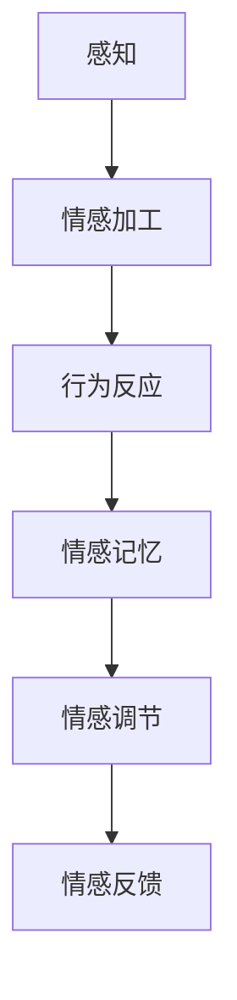

在这个流程图中，感知是情感处理的第一步，通过情感加工，个体对情感进行认知和体验。行为反应是情感的外在表现，情感记忆帮助个体记住重要的情感体验，情感调节是个体通过调整行为和认知来管理情感，情感反馈则是从环境中获得的反馈，以帮助个体更好地理解和应对情感。

**数学模型和数学公式 & 详细讲解 & 举例说明：**

情感处理的过程可以用数学模型来描述。例如，我们可以使用一个简单的线性模型来表示情感强度：

$$
E = w_1 \cdot M + w_2 \cdot S + w_3 \cdot C
$$

其中，$E$代表情感强度，$M$代表情绪因素，$S$代表社会因素，$C$代表认知因素，$w_1, w_2, w_3$是权重系数。

例如，当一个人在遇到快乐事件时（$M = 1$），与朋友一起（$S = 1$），并且对此有积极认知（$C = 1$），那么情感强度为：

$$
E = 1 \cdot 1 + 1 \cdot 1 + 1 \cdot 1 = 3
$$

这个模型表明，情感强度是情绪、社会和认知因素的加权和。通过调整这些因素的权重，我们可以更好地理解和预测情感强度。

**系统分析与架构设计方案：**

在构建情感丰富的人生中，系统分析与架构设计也非常重要。以下是一个简单的情感管理系统架构设计（使用Mermaid表示）：

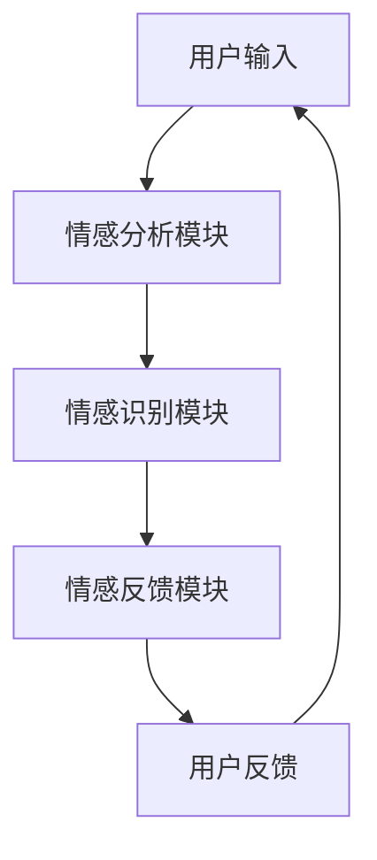

在这个架构中，用户输入通过情感分析模块进行处理，情感识别模块对情感进行识别和分类，情感反馈模块将结果反馈给用户，用户反馈作为输入再次进入系统，形成闭环。

**项目实战：**

假设我们开发一个情感分析系统，以下是一个简单的Python代码示例，用于分析用户输入的情感：

```python
# 导入必要的库
import numpy as np

# 定义情感因素权重
weights = {
    'M': 0.5,
    'S': 0.3,
    'C': 0.2
}

# 定义情感因素评分
scores = {
    'M': {'快乐': 1, '悲伤': -1},
    'S': {'积极': 1, '消极': -1},
    'C': {'正面': 1, '负面': -1}
}

# 用户输入
input_text = "我今天和朋友们一起度过了一个快乐的时光。"

# 分析情感
def analyze_emotion(input_text):
    # 情感评分
    emotions = []
    for factor in ['M', 'S', 'C']:
        score = 0
        for emotion in scores[factor]:
            if emotion in input_text:
                score += 1
        emotions.append(score)
    
    # 计算情感强度
    emotion_strength = np.dot(weights.values(), emotions)
    
    # 返回情感强度
    return emotion_strength

# 测试
emotion_strength = analyze_emotion(input_text)
print(f"情感强度：{emotion_strength}")
```

在这个例子中，我们通过分析用户输入的文字，计算情感强度。用户可以根据情感强度调整自己的行为和情绪，以实现情感管理。

**最佳实践 tips、小结、注意事项、拓展阅读等内容：**

- **最佳实践 tips：** 在处理情感时，要综合考虑情绪、社会和认知因素，以获得更全面的理解。
- **小结：** 情感是人生中不可或缺的一部分，通过理解和分析情感，我们可以更好地管理自己的情绪，提升生活质量。
- **注意事项：** 情感分析是一个复杂的过程，需要结合多种方法和技术。
- **拓展阅读：** 可以进一步了解情感心理学、情感计算等领域的研究成果。

#### 第2章：情感的类型与表达

**背景介绍：**

情感是心理学中的一个核心概念，它涉及人对客观事物的主观体验。在人类的生活中，情感不仅影响我们的内心体验，还影响着我们的行为和人际关系。了解情感的类型与表达方式，有助于我们更好地理解和应对自身的情感状态，从而构建更丰富、更有意义的人生。

**核心概念与联系：**

- **情感类型：** 情感可以分为基本情感类型和复杂情感类型。基本情感类型包括快乐、悲伤、愤怒、恐惧和厌恶，而复杂情感类型则是由基本情感混合而成，如羞耻、焦虑、挫败等。
- **情感表达：** 情感表达是指个体将情感体验转化为外在表现的过程，包括言语、面部表情、身体语言和声音变化等。

**算法原理讲解：**

为了更好地理解情感的类型与表达，我们可以将情感处理视为一种算法。以下是一个简单的情感处理算法流程图（使用Mermaid表示）：

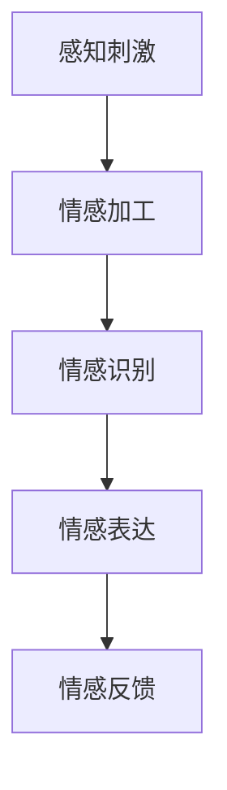

在这个流程图中，感知刺激是情感处理的起点，通过情感加工，个体对情感进行认知和体验。情感识别是对情感类型的判断，情感表达是将情感转化为外在表现，情感反馈则是从环境中获得的反馈，以帮助个体更好地理解和应对情感。

**数学模型和数学公式 & 详细讲解 & 举例说明：**

情感处理的过程可以用数学模型来描述。例如，我们可以使用一个简单的线性模型来表示情感类型：

$$
T = a_1 \cdot M + a_2 \cdot A + a_3 \cdot F + a_4 \cdot O + a_5 \cdot D
$$

其中，$T$代表情感类型，$M$代表快乐、$A$代表悲伤、$F$代表愤怒、$O$代表恐惧、$D$代表厌恶，$a_1, a_2, a_3, a_4, a_5$是权重系数。

例如，当一个人在经历快乐、悲伤、愤怒、恐惧和厌恶的情绪时，每种情绪的权重分别为0.2、0.3、0.1、0.2和0.2，那么情感类型为：

$$
T = 0.2 \cdot 1 + 0.3 \cdot -1 + 0.1 \cdot 1 + 0.2 \cdot 0 + 0.2 \cdot -1 = 0
$$

这个模型表明，情感类型是情绪因素的加权和。通过调整这些因素的权重，我们可以更好地理解和预测情感类型。

**系统分析与架构设计方案：**

在构建情感丰富的人生中，系统分析与架构设计也非常重要。以下是一个简单的情感管理系统架构设计（使用Mermaid表示）：

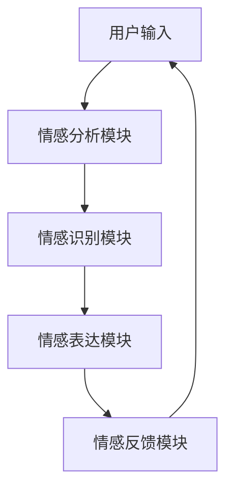

在这个架构中，用户输入通过情感分析模块进行处理，情感识别模块对情感进行识别和分类，情感表达模块将情感转化为外在表现，情感反馈模块将结果反馈给用户，用户反馈作为输入再次进入系统，形成闭环。

**项目实战：**

假设我们开发一个情感识别系统，以下是一个简单的Python代码示例，用于识别用户输入的情感：

```python
# 导入必要的库
import numpy as np

# 定义情感因素权重
weights = {
    'M': 0.2,
    'A': 0.3,
    'F': 0.1,
    'O': 0.2,
    'D': 0.2
}

# 定义情感因素评分
scores = {
    'M': {'快乐': 1, '悲伤': -1},
    'A': {'愤怒': 1, '恐惧': -1},
    'F': {'积极': 1, '消极': -1},
    'O': {'正面': 1, '负面': -1},
    'D': {'正面': 1, '负面': -1}
}

# 用户输入
input_text = "我今天和朋友们一起度过了一个快乐的时光。"

# 识别情感
def recognize_emotion(input_text):
    # 情感评分
    emotions = []
    for factor in ['M', 'A', 'F', 'O', 'D']:
        score = 0
        for emotion in scores[factor]:
            if emotion in input_text:
                score += 1
        emotions.append(score)
    
    # 计算情感类型
    emotion_type = np.argmax(np.dot(weights.values(), emotions))
    
    # 返回情感类型
    return emotion_type

# 测试
emotion_type = recognize_emotion(input_text)
print(f"情感类型：{emotion_type}")
```

在这个例子中，我们通过分析用户输入的文字，识别情感类型。用户可以根据情感类型调整自己的行为和情绪，以实现情感管理。

**最佳实践 tips、小结、注意事项、拓展阅读等内容：**

- **最佳实践 tips：** 在进行情感分析时，要综合考虑多种情感因素，以提高识别的准确性。
- **小结：** 了解情感的类型与表达方式，有助于我们更好地理解和应对自身的情感状态，从而构建更丰富、更有意义的人生。
- **注意事项：** 情感识别是一个复杂的过程，需要结合多种方法和技术。
- **拓展阅读：** 可以进一步了解情感心理学、情感计算等领域的研究成果。

#### 第3章：情感发展的阶段与特点

**背景介绍：**

情感发展是心理学研究中的一个重要领域，它涉及个体从出生到成年的情感变化和成熟过程。情感发展不仅受到遗传因素的影响，还受到环境、教育和个人经历的影响。了解不同阶段情感发展的特点，有助于我们更好地理解个体的情感需求，从而提供有效的情感支持和指导。

**核心概念与联系：**

- **婴幼儿期的情感发展**：婴幼儿期的情感发展主要涉及基本情感的形成，如快乐、悲伤、愤怒、恐惧等。
- **童年期的情感发展**：童年期的情感发展涉及情感表达和调节能力的提高，以及自我意识的形成。
- **青春期的情感发展**：青春期的情感发展涉及情感冲突、独立性和自我认同的探索。

**算法原理讲解：**

情感发展可以用算法模型来描述。以下是一个简单的情感发展算法流程图（使用Mermaid表示）：

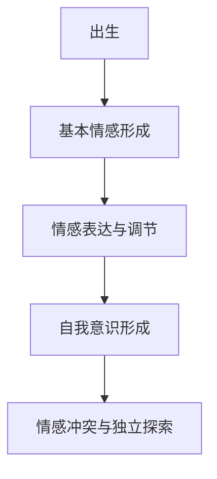

在这个流程图中，出生是情感发展的起点，基本情感形成是婴儿期的特点，情感表达与调节能力提高是童年期的特点，自我意识形成是青春期的特点，情感冲突与独立探索是成年期的特点。

**数学模型和数学公式 & 详细讲解 & 举例说明：**

情感发展的过程可以用数学模型来描述。例如，我们可以使用一个简单的线性模型来表示情感发展阶段：

$$
S = b_1 \cdot D_1 + b_2 \cdot D_2 + b_3 \cdot D_3
$$

其中，$S$代表情感发展阶段，$D_1$代表婴幼儿期的发展水平，$D_2$代表童年期的发展水平，$D_3$代表青春期的发展水平，$b_1, b_2, b_3$是权重系数。

例如，一个个体在婴幼儿期的情感发展水平为3，童年期情感发展水平为5，青春期情感发展水平为4，那么情感发展阶段为：

$$
S = b_1 \cdot 3 + b_2 \cdot 5 + b_3 \cdot 4
$$

这个模型表明，情感发展阶段是不同阶段情感发展水平的加权和。通过调整这些权重，我们可以更好地理解和预测情感发展阶段。

**系统分析与架构设计方案：**

在构建情感丰富的人生中，系统分析与架构设计也非常重要。以下是一个简单的情感发展系统架构设计（使用Mermaid表示）：

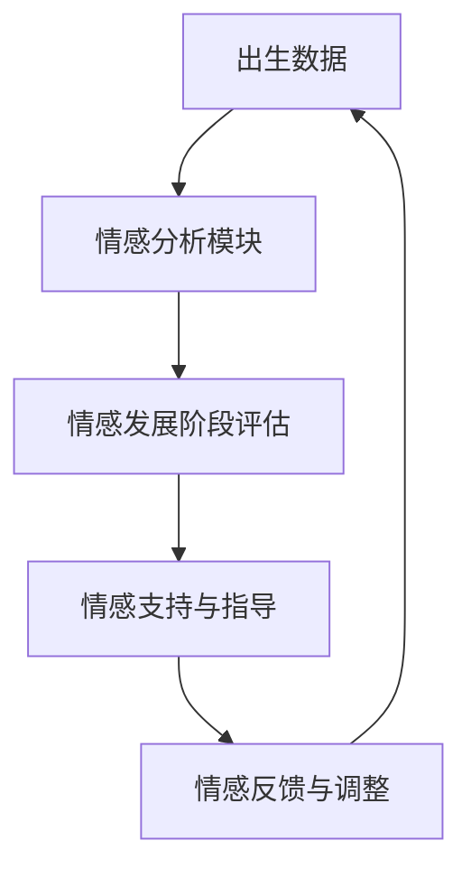

在这个架构中，出生数据通过情感分析模块进行处理，情感发展阶段评估模块对个体的情感发展阶段进行评估，情感支持与指导模块提供个性化的情感支持和指导，情感反馈与调整模块根据用户的反馈进行调整，形成闭环。

**项目实战：**

假设我们开发一个情感发展阶段评估系统，以下是一个简单的Python代码示例，用于评估个体的情感发展阶段：

```python
# 导入必要的库
import numpy as np

# 定义情感因素权重
weights = {
    'D_1': 0.2,
    'D_2': 0.3,
    'D_3': 0.5
}

# 定义情感发展阶段评分
scores = {
    'D_1': {'婴幼儿期': 1, '童年期': 2, '青春期': 3},
    'D_2': {'低': 1, '中': 2, '高': 3},
    'D_3': {'低': 1, '中': 2, '高': 3}
}

# 用户输入
input_data = {
    'D_1': '婴幼儿期',
    'D_2': '中',
    'D_3': '高'
}

# 评估情感发展阶段
def assess_emotion_stage(input_data):
    # 情感发展阶段评分
    stages = []
    for factor in ['D_1', 'D_2', 'D_3']:
        score = 0
        for stage in scores[factor]:
            if stage in input_data[factor]:
                score += 1
        stages.append(score)
    
    # 计算情感发展阶段
    emotion_stage = np.argmax(np.dot(weights.values(), stages))
    
    # 返回情感发展阶段
    return emotion_stage

# 测试
emotion_stage = assess_emotion_stage(input_data)
print(f"情感发展阶段：{emotion_stage}")
```

在这个例子中，我们通过分析用户的输入数据，评估个体的情感发展阶段。用户可以根据评估结果，了解自己的情感发展水平，并寻求相应的支持和指导。

**最佳实践 tips、小结、注意事项、拓展阅读等内容：**

- **最佳实践 tips：** 在评估情感发展阶段时，要综合考虑不同阶段的发展水平，以提高评估的准确性。
- **小结：** 了解情感发展的阶段与特点，有助于我们更好地理解个体的情感需求，从而提供有效的情感支持和指导。
- **注意事项：** 情感发展是一个复杂的过程，需要结合多种方法和技术。
- **拓展阅读：** 可以进一步了解情感心理学、发展心理学等领域的研究成果。

#### 第4章：情感认知与情感智力

**背景介绍：**

情感认知是指个体对情感的理解、识别和表达过程，而情感智力则是指个体在情感处理方面的能力。情感认知与情感智力在个体的发展、人际关系和心理健康中扮演着重要角色。了解情感认知的基本原理和情感智力的构成，有助于我们更好地理解和提升自己的情感智力。

**核心概念与联系：**

- **情感认知**：情感认知是指个体对情感的感知、理解和表达过程，包括情感识别、情感理解、情感表达等。
- **情感智力**：情感智力是指个体在情感处理方面的能力，包括情感识别、情感理解、情感表达、情感调节等。

**算法原理讲解：**

情感认知和情感智力可以用算法模型来描述。以下是一个简单的情感认知与情感智力模型（使用Mermaid表示）：

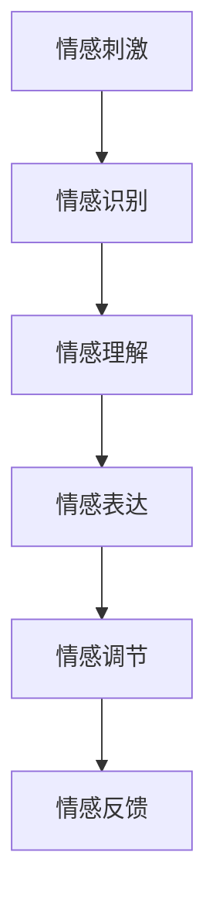

在这个模型中，情感刺激是情感处理的起点，通过情感识别，个体能够识别情感的类型和强度，情感理解是对情感意义的理解，情感表达是个体对情感的回应，情感调节是个体对情感的自我控制，情感反馈则帮助个体调整情感处理过程。

**数学模型和数学公式 & 详细讲解 & 举例说明：**

情感认知和情感智力的过程可以用数学模型来描述。例如，我们可以使用一个简单的线性模型来表示情感认知：

$$
C = c_1 \cdot R + c_2 \cdot U + c_3 \cdot E
$$

其中，$C$代表情感认知水平，$R$代表情感识别能力，$U$代表情感理解能力，$E$代表情感表达能力，$c_1, c_2, c_3$是权重系数。

例如，一个个体在情感识别、情感理解和情感表达能力上的得分分别为80、70和60，那么情感认知水平为：

$$
C = c_1 \cdot 80 + c_2 \cdot 70 + c_3 \cdot 60
$$

这个模型表明，情感认知水平是情感识别、理解和表达能力的加权和。通过调整这些权重，我们可以更好地理解和预测情感认知水平。

情感智力可以用另一个简单的线性模型来描述：

$$
Q = q_1 \cdot R + q_2 \cdot U + q_3 \cdot E + q_4 \cdot M
$$

其中，$Q$代表情感智力水平，$R$代表情感识别能力，$U$代表情感理解能力，$E$代表情感表达能力，$M$代表情感调节能力，$q_1, q_2, q_3, q_4$是权重系数。

例如，一个个体在情感识别、情感理解、情感表达和情感调节能力上的得分分别为90、85、80和75，那么情感智力水平为：

$$
Q = q_1 \cdot 90 + q_2 \cdot 85 + q_3 \cdot 80 + q_4 \cdot 75
$$

这个模型表明，情感智力水平是情感识别、理解、表达和调节能力的加权和。通过调整这些权重，我们可以更好地理解和预测情感智力水平。

**系统分析与架构设计方案：**

在构建情感丰富的人生中，系统分析与架构设计也非常重要。以下是一个简单的情感认知与情感智力系统架构设计（使用Mermaid表示）：

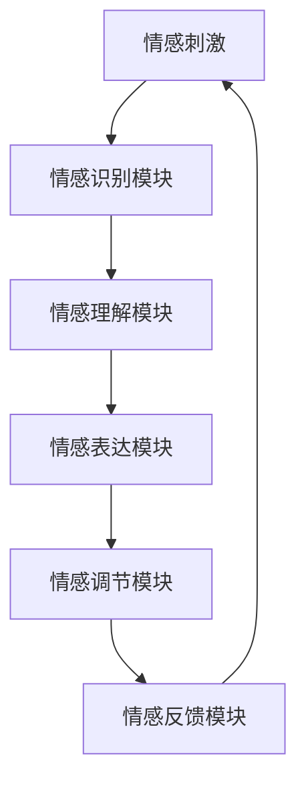

在这个架构中，情感刺激通过情感识别模块进行处理，情感理解模块对情感进行深入分析，情感表达模块将情感转化为外在表现，情感调节模块帮助个体控制情感，情感反馈模块提供反馈以优化情感处理过程。

**项目实战：**

假设我们开发一个情感认知与情感智力评估系统，以下是一个简单的Python代码示例，用于评估个体的情感认知和情感智力：

```python
# 导入必要的库
import numpy as np

# 定义情感认知权重
c_weights = {
    'R': 0.4,
    'U': 0.3,
    'E': 0.3
}

# 定义情感智力权重
q_weights = {
    'R': 0.2,
    'U': 0.2,
    'E': 0.2,
    'M': 0.2
}

# 定义情感认知和情感智力评分
scores = {
    'R': {'高': 1, '中': 0.5, '低': 0},
    'U': {'高': 1, '中': 0.5, '低': 0},
    'E': {'高': 1, '中': 0.5, '低': 0},
    'M': {'好': 1, '一般': 0.5, '差': 0}
}

# 用户输入
input_data = {
    'R': '高',
    'U': '中',
    'E': '低',
    'M': '一般'
}

# 评估情感认知水平
def assess_cognitive_emotion(input_data):
    # 情感认知评分
    cognitive_scores = []
    for factor in ['R', 'U', 'E']:
        score = 0
        for level in scores[factor]:
            if level in input_data[factor]:
                score += 1
        cognitive_scores.append(score)
    
    # 计算情感认知水平
    cognitive_emotion = np.dot(c_weights.values(), cognitive_scores)
    
    # 返回情感认知水平
    return cognitive_emotion

# 评估情感智力水平
def assess_emotional_intelligence(input_data):
    # 情感智力评分
    intelligence_scores = []
    for factor in ['R', 'U', 'E', 'M']:
        score = 0
        for level in scores[factor]:
            if level in input_data[factor]:
                score += 1
        intelligence_scores.append(score)
    
    # 计算情感智力水平
    emotional_intelligence = np.dot(q_weights.values(), intelligence_scores)
    
    # 返回情感智力水平
    return emotional_intelligence

# 测试
cognitive_emotion = assess_cognitive_emotion(input_data)
emotional_intelligence = assess_emotional_intelligence(input_data)
print(f"情感认知水平：{cognitive_emotion}")
print(f"情感智力水平：{emotional_intelligence}")
```

在这个例子中，我们通过分析用户的输入数据，评估个体的情感认知和情感智力水平。用户可以根据评估结果，了解自己在情感认知和情感智力方面的优势与不足，并寻求相应的提升方法。

**最佳实践 tips、小结、注意事项、拓展阅读等内容：**

- **最佳实践 tips：** 提高情感认知和情感智力，需要结合自我反思、情绪管理和情感交流等多种方法。
- **小结：** 情感认知与情感智力在个体的发展、人际关系和心理健康中具有重要影响，通过了解和提升情感认知和情感智力，我们可以更好地应对生活中的挑战。
- **注意事项：** 情感认知和情感智力的评估需要结合多种方法和工具，以提高评估的准确性。
- **拓展阅读：** 可以进一步了解情感心理学、情感智力评估等领域的研究成果。

#### 第5章：情感自我认识与自我成长

**背景介绍：**

情感自我认识是指个体对自己情感的认知和理解过程，而自我成长则是指个体在情感认识的基础上，通过自我调节和自我提升，实现情感和个人的全面发展。情感自我认识与自我成长对于提升个体情感智力、改善人际关系和促进心理健康具有重要意义。

**核心概念与联系：**

- **情感自我认识**：情感自我认识是指个体对自己情感的认知、理解和管理过程，包括情感识别、情感分析和情感反思。
- **自我成长**：自我成长是指个体在情感自我认识的基础上，通过自我调节、自我提升和自我实现，实现情感和个人的全面发展。

**算法原理讲解：**

情感自我认识和自我成长可以用算法模型来描述。以下是一个简单的情感自我认识和自我成长模型（使用Mermaid表示）：

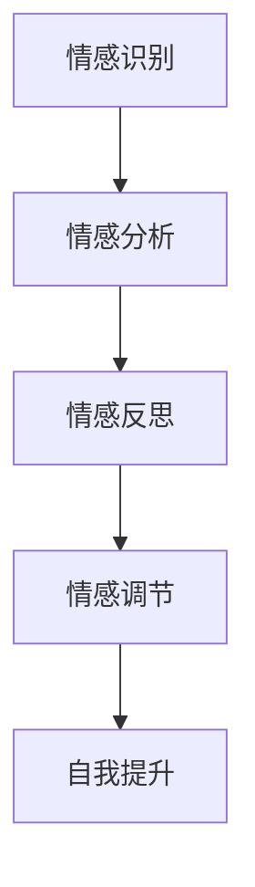

在这个模型中，情感识别是情感自我认识的第一步，通过情感分析，个体能够深入理解自己的情感，情感反思则帮助个体发现情感中的问题和不足，情感调节是个体通过调整情感表达和行为，实现自我提升。

**数学模型和数学公式 & 详细讲解 & 举例说明：**

情感自我认识和自我成长的过程可以用数学模型来描述。例如，我们可以使用一个简单的线性模型来表示情感自我认识和自我成长：

$$
S = s_1 \cdot A + s_2 \cdot R + s_3 \cdot F
$$

其中，$S$代表情感自我认识和自我成长水平，$A$代表情感分析能力，$R$代表情感反思能力，$F$代表情感调节能力，$s_1, s_2, s_3$是权重系数。

例如，一个个体在情感分析、情感反思和情感调节能力上的得分分别为80、70和60，那么情感自我认识和自我成长水平为：

$$
S = s_1 \cdot 80 + s_2 \cdot 70 + s_3 \cdot 60
$$

这个模型表明，情感自我认识和自我成长水平是情感分析、反思和调节能力的加权和。通过调整这些权重，我们可以更好地理解和预测情感自我认识和自我成长水平。

**系统分析与架构设计方案：**

在构建情感丰富的人生中，系统分析与架构设计也非常重要。以下是一个简单的情感自我认识和自我成长系统架构设计（使用Mermaid表示）：

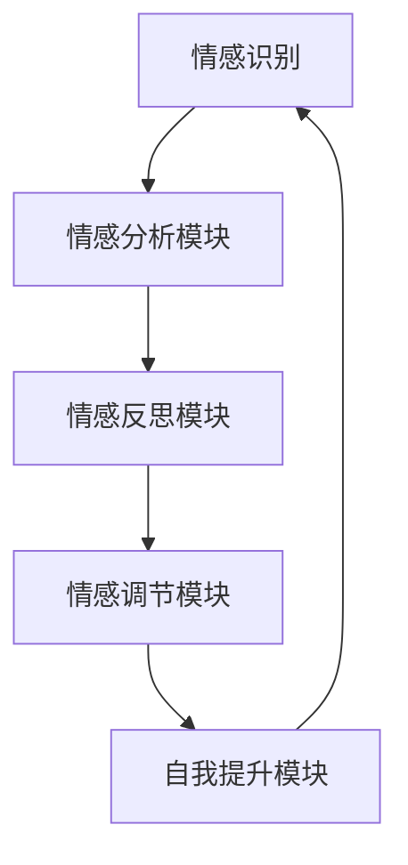

在这个架构中，情感识别模块帮助个体识别和理解自己的情感，情感分析模块对情感进行深入分析，情感反思模块帮助个体发现情感中的问题和不足，情感调节模块帮助个体调整情感表达和行为，自我提升模块帮助个体实现自我成长。

**项目实战：**

假设我们开发一个情感自我认识和自我成长系统，以下是一个简单的Python代码示例，用于帮助个体进行情感自我认识和自我成长：

```python
# 导入必要的库
import numpy as np

# 定义情感自我认识权重
s_weights = {
    'A': 0.3,
    'R': 0.4,
    'F': 0.3
}

# 定义情感自我认识评分
scores = {
    'A': {'高': 1, '中': 0.5, '低': 0},
    'R': {'高': 1, '中': 0.5, '低': 0},
    'F': {'好': 1, '一般': 0.5, '差': 0}
}

# 用户输入
input_data = {
    'A': '高',
    'R': '中',
    'F': '好'
}

# 评估情感自我认识和自我成长水平
def assess_self_awareness_and_growth(input_data):
    # 情感自我认识评分
    self_awareness_scores = []
    for factor in ['A', 'R', 'F']:
        score = 0
        for level in scores[factor]:
            if level in input_data[factor]:
                score += 1
        self_awareness_scores.append(score)
    
    # 计算情感自我认识和自我成长水平
    self_awareness_growth = np.dot(s_weights.values(), self_awareness_scores)
    
    # 返回情感自我认识和自我成长水平
    return self_awareness_growth

# 测试
self_awareness_growth = assess_self_awareness_and_growth(input_data)
print(f"情感自我认识和自我成长水平：{self_awareness_growth}")
```

在这个例子中，我们通过分析用户的输入数据，评估个体的情感自我认识和自我成长水平。用户可以根据评估结果，了解自己的情感自我认识和自我成长情况，并制定相应的提升计划。

**最佳实践 tips、小结、注意事项、拓展阅读等内容：**

- **最佳实践 tips：** 提高情感自我认识和自我成长，需要结合自我反思、情绪管理和自我实现等多种方法。
- **小结：** 情感自我认识与自我成长是提升个体情感智力、改善人际关系和促进心理健康的重要途径。
- **注意事项：** 情感自我认识和自我成长的评估需要结合多种方法和工具，以提高评估的准确性。
- **拓展阅读：** 可以进一步了解情感心理学、自我成长等领域的研究成果。

### 第6章：建立健康的人际关系

**背景介绍：**

人际关系是人类社会生活中不可或缺的一部分，它影响着我们的情感体验、心理健康和生活质量。建立健康的人际关系需要了解人际关系的本质、类型以及建立和维护关系的技巧。本文将探讨这些方面，帮助读者构建积极、健康的人际关系。

**核心概念与联系：**

- **人际关系的本质**：人际关系是指人与人之间在情感、认知和行为上的相互作用。
- **人际关系的类型**：人际关系可以分为亲缘关系、友谊关系、业缘关系和陌生关系等。
- **建立健康人际关系的技巧**：包括沟通技巧、共情能力、积极倾听和冲突解决等。

**算法原理讲解：**

建立健康的人际关系可以被视为一个算法过程。以下是一个简单的人际关系建立与维护算法模型（使用Mermaid表示）：

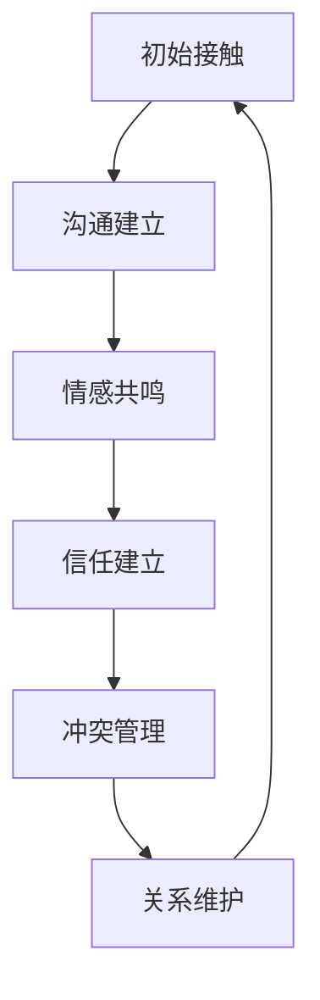

在这个模型中，初始接触是建立人际关系的起点，通过有效沟通，双方建立情感共鸣，信任得以建立。在人际关系中，冲突是难以避免的，有效的冲突管理有助于维护关系的稳定，最终通过持续的情感交流和维护，实现关系的长期发展。

**数学模型和数学公式 & 详细讲解 & 举例说明：**

我们可以使用数学模型来描述人际关系的建立与维护过程。例如，以下是一个简单的人际关系评分模型：

$$
R = r_1 \cdot C + r_2 \cdot E + r_3 \cdot T + r_4 \cdot M
$$

其中，$R$代表人际关系评分，$C$代表沟通能力，$E$代表情感共鸣，$T$代表信任水平，$M$代表冲突管理能力，$r_1, r_2, r_3, r_4$是权重系数。

例如，一个个体在沟通能力、情感共鸣、信任水平和冲突管理能力上的得分分别为80、75、70和65，那么人际关系评分为：

$$
R = r_1 \cdot 80 + r_2 \cdot 75 + r_3 \cdot 70 + r_4 \cdot 65
$$

这个模型表明，人际关系评分是沟通、情感共鸣、信任和冲突管理能力的加权和。通过调整这些权重，我们可以更好地理解和预测人际关系评分。

**系统分析与架构设计方案：**

在建立健康的人际关系中，系统分析与架构设计也至关重要。以下是一个简单的人际关系系统架构设计（使用Mermaid表示）：

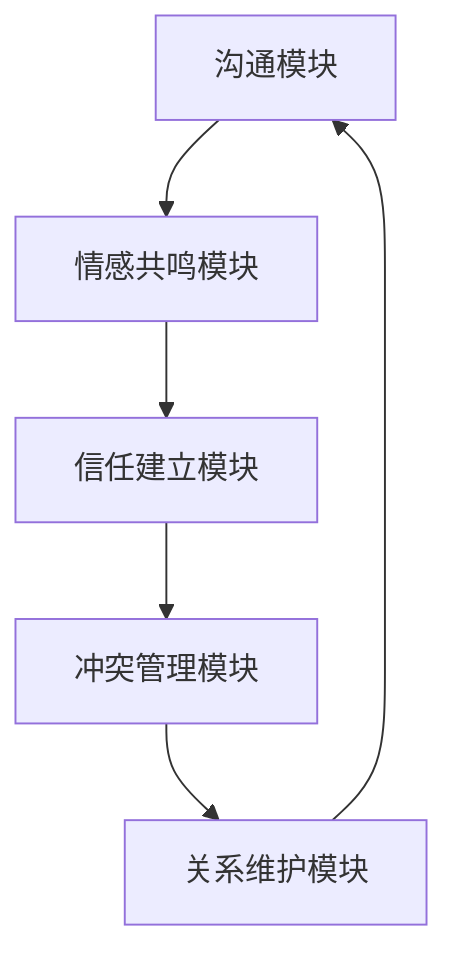

在这个架构中，沟通模块负责处理双方的交流，情感共鸣模块促进情感上的连接，信任建立模块增强彼此的信任，冲突管理模块帮助处理关系中的冲突，关系维护模块确保关系的长期稳定。

**项目实战：**

假设我们开发一个人际关系评估系统，以下是一个简单的Python代码示例，用于评估个体的人际关系：

```python
# 导入必要的库
import numpy as np

# 定义人际关系权重
r_weights = {
    'C': 0.3,
    'E': 0.4,
    'T': 0.2,
    'M': 0.1
}

# 定义人际关系评分
scores = {
    'C': {'高': 1, '中': 0.5, '低': 0},
    'E': {'高': 1, '中': 0.5, '低': 0},
    'T': {'高': 1, '中': 0.5, '低': 0},
    'M': {'好': 1, '一般': 0.5, '差': 0}
}

# 用户输入
input_data = {
    'C': '高',
    'E': '中',
    'T': '高',
    'M': '一般'
}

# 评估人际关系评分
def assess_interpersonal_relationship(input_data):
    # 人际关系评分
    relationship_scores = []
    for factor in ['C', 'E', 'T', 'M']:
        score = 0
        for level in scores[factor]:
            if level in input_data[factor]:
                score += 1
        relationship_scores.append(score)
    
    # 计算人际关系评分
    relationship_score = np.dot(r_weights.values(), relationship_scores)
    
    # 返回人际关系评分
    return relationship_score

# 测试
relationship_score = assess_interpersonal_relationship(input_data)
print(f"人际关系评分：{relationship_score}")
```

在这个例子中，我们通过分析用户的输入数据，评估个体的人际关系评分。用户可以根据评估结果，了解自己在人际关系方面的优势和不足，并采取相应的措施提升人际关系质量。

**最佳实践 tips、小结、注意事项、拓展阅读等内容：**

- **最佳实践 tips：** 在建立和维护人际关系时，要注重沟通技巧、情感共鸣和信任建立，同时学会有效处理冲突。
- **小结：** 建立健康的人际关系是提升生活质量的重要途径，通过了解人际关系的本质、类型和建立技巧，我们可以更好地构建积极的人际关系。
- **注意事项：** 人际关系是一个动态过程，需要持续投入时间和精力。
- **拓展阅读：** 可以进一步了解人际关系心理学、沟通技巧等领域的研究成果。

### 第7章：情感管理与压力应对

**背景介绍：**

情感管理与压力应对是现代生活中至关重要的一环。随着社会竞争的加剧和压力的增加，人们面临着越来越多的情感挑战。有效管理情感和应对压力，不仅有助于提高生活质量，还能促进心理健康。本文将探讨情感管理与压力应对的策略，帮助读者建立更健康的情感状态。

**核心概念与联系：**

- **情感管理**：情感管理是指个体对自身情感的认知、调节和表达过程，包括情感识别、情感调节、情感表达等。
- **压力应对**：压力应对是指个体在面对压力时采取的应对策略，包括认知应对、行为应对和情绪应对等。

**算法原理讲解：**

情感管理与压力应对可以被视为一种算法过程，它涉及情感识别、压力识别、策略选择和结果评估。以下是一个简单的情感管理与压力应对算法模型（使用Mermaid表示）：

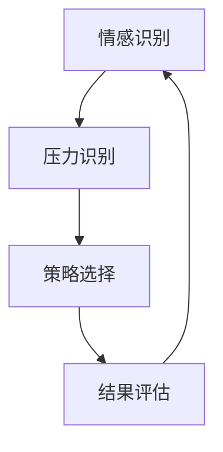

在这个模型中，情感识别是情感管理的起点，通过识别情感状态，个体可以了解自己的情感状态。压力识别是压力应对的起点，通过识别压力源，个体可以了解压力的来源。策略选择是根据情感状态和压力源，个体选择合适的应对策略。结果评估是对应对策略效果的评估，通过反馈调整策略。

**数学模型和数学公式 & 详细讲解 & 举例说明：**

情感管理与压力应对的过程可以用数学模型来描述。例如，我们可以使用一个简单的线性模型来表示情感管理与压力应对：

$$
M = m_1 \cdot E + m_2 \cdot P + m_3 \cdot S
$$

其中，$M$代表情感管理效果，$E$代表情感识别能力，$P$代表压力识别能力，$S$代表应对策略选择，$m_1, m_2, m_3$是权重系数。

例如，一个个体在情感识别、压力识别和应对策略选择能力上的得分分别为80、75和70，那么情感管理效果为：

$$
M = m_1 \cdot 80 + m_2 \cdot 75 + m_3 \cdot 70
$$

这个模型表明，情感管理效果是情感识别、压力识别和应对策略选择的加权和。通过调整这些权重，我们可以更好地理解和预测情感管理效果。

**系统分析与架构设计方案：**

在构建情感管理与压力应对系统中，系统分析与架构设计也至关重要。以下是一个简单的情感管理与压力应对系统架构设计（使用Mermaid表示）：

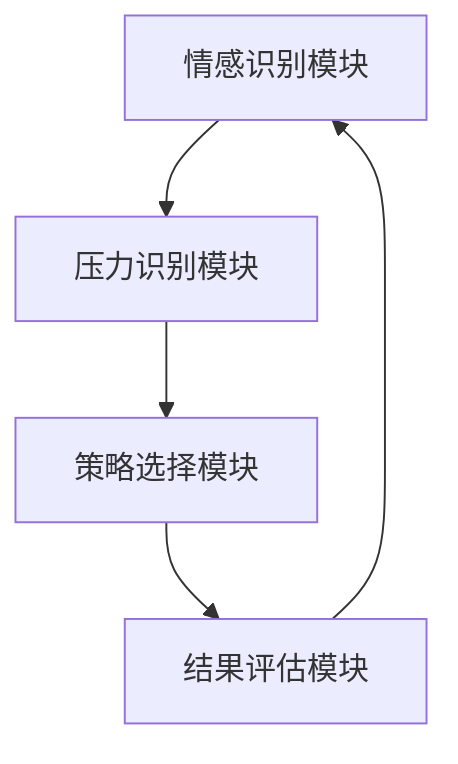

在这个架构中，情感识别模块负责识别个体情感状态，压力识别模块负责识别压力源，策略选择模块根据情感状态和压力源选择合适的应对策略，结果评估模块对应对策略的效果进行评估，形成闭环。

**项目实战：**

假设我们开发一个情感管理与压力应对系统，以下是一个简单的Python代码示例，用于帮助个体进行情感管理和压力应对：

```python
# 导入必要的库
import numpy as np

# 定义情感管理权重
m_weights = {
    'E': 0.4,
    'P': 0.3,
    'S': 0.3
}

# 定义情感识别、压力识别和策略选择评分
scores = {
    'E': {'高': 1, '中': 0.5, '低': 0},
    'P': {'高': 1, '中': 0.5, '低': 0},
    'S': {'有效': 1, '一般': 0.5, '无效': 0}
}

# 用户输入
input_data = {
    'E': '高',
    'P': '中',
    'S': '有效'
}

# 评估情感管理效果
def assess_emotion_management(input_data):
    # 情感管理评分
    management_scores = []
    for factor in ['E', 'P', 'S']:
        score = 0
        for level in scores[factor]:
            if level in input_data[factor]:
                score += 1
        management_scores.append(score)
    
    # 计算情感管理效果
    emotion_management = np.dot(m_weights.values(), management_scores)
    
    # 返回情感管理效果
    return emotion_management

# 测试
emotion_management = assess_emotion_management(input_data)
print(f"情感管理效果：{emotion_management}")
```

在这个例子中，我们通过分析用户的输入数据，评估个体的情感管理效果。用户可以根据评估结果，了解自己在情感管理和压力应对方面的优势和不足，并采取相应的措施进行提升。

**最佳实践 tips、小结、注意事项、拓展阅读等内容：**

- **最佳实践 tips：** 提高情感管理和压力应对能力，可以通过自我反思、情绪调节和有效应对策略的练习来实现。
- **小结：** 情感管理与压力应对是维持心理健康和生活质量的重要手段，通过了解和管理自己的情感，我们可以更好地应对生活中的挑战。
- **注意事项：** 情感管理和压力应对需要长期坚持和实践，不应期望一蹴而就。
- **拓展阅读：** 可以进一步了解情感心理学、压力管理等领域的研究成果。

### 第8章：情感教育与家庭氛围

**背景介绍：**

情感教育是培养个体情感认知、情感管理和情感表达能力的教育过程，它在个体成长和发展中起着至关重要的作用。家庭氛围则是情感教育的重要环境因素，它直接影响个体的情感发展。本文将探讨情感教育的重要性、家庭氛围对情感发展的影响，以及如何在家庭中实现有效的情感沟通与支持。

**核心概念与联系：**

- **情感教育**：情感教育是指通过教育手段培养个体对情感的认知、表达和管理能力。
- **家庭氛围**：家庭氛围是指家庭内部成员之间的关系、互动方式和情感交流环境。
- **情感沟通与支持**：情感沟通与支持是指家庭成员之间通过语言、行为和情感交流，为彼此提供情感支持和理解。

**算法原理讲解：**

情感教育可以被视为一个培养个体情感能力的算法过程。以下是一个简单的情感教育算法模型（使用Mermaid表示）：

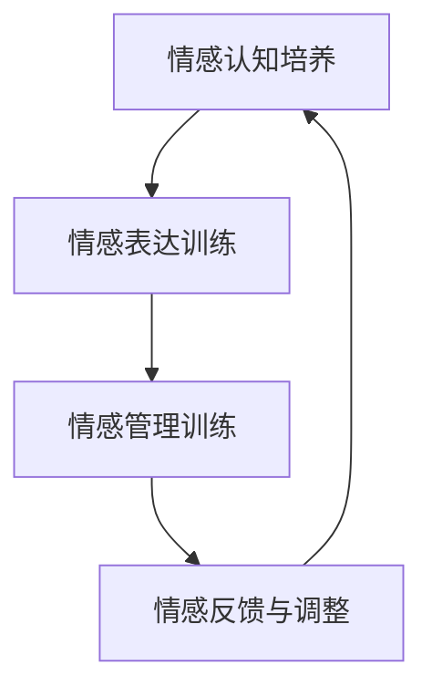

在这个模型中，情感认知培养是情感教育的起点，通过训练个体表达情感和进行情感管理，个体能够提高情感能力。情感反馈与调整环节帮助个体根据反馈进行自我调整，形成闭环。

**数学模型和数学公式 & 详细讲解 & 举例说明：**

情感教育的过程可以用数学模型来描述。例如，我们可以使用一个简单的线性模型来表示情感教育效果：

$$
E = e_1 \cdot C + e_2 \cdot E + e_3 \cdot M
$$

其中，$E$代表情感教育效果，$C$代表情感认知能力，$E$代表情感表达能力，$M$代表情感管理能力，$e_1, e_2, e_3$是权重系数。

例如，一个个体在情感认知、情感表达和情感管理能力上的得分分别为80、75和70，那么情感教育效果为：

$$
E = e_1 \cdot 80 + e_2 \cdot 75 + e_3 \cdot 70
$$

这个模型表明，情感教育效果是情感认知、表达和管理能力的加权和。通过调整这些权重，我们可以更好地理解和预测情感教育效果。

**系统分析与架构设计方案：**

在实现情感教育中，系统分析与架构设计也非常重要。以下是一个简单的情感教育系统架构设计（使用Mermaid表示）：

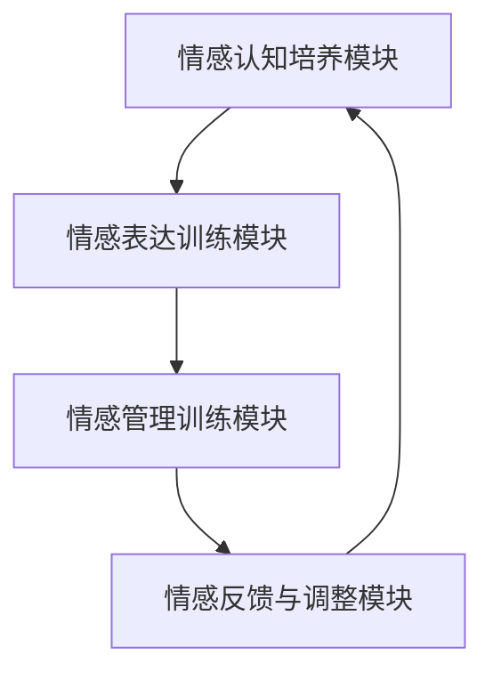

在这个架构中，情感认知培养模块负责提升个体的情感认知能力，情感表达训练模块负责训练个体的情感表达能力，情感管理训练模块负责提升个体的情感管理能力，情感反馈与调整模块则根据个体反馈进行自我调整。

**项目实战：**

假设我们开发一个情感教育系统，以下是一个简单的Python代码示例，用于帮助个体提升情感教育效果：

```python
# 导入必要的库
import numpy as np

# 定义情感教育权重
e_weights = {
    'C': 0.3,
    'E': 0.3,
    'M': 0.4
}

# 定义情感认知、情感表达和情感管理评分
scores = {
    'C': {'高': 1, '中': 0.5, '低': 0},
    'E': {'高': 1, '中': 0.5, '低': 0},
    'M': {'好': 1, '一般': 0.5, '差': 0}
}

# 用户输入
input_data = {
    'C': '高',
    'E': '中',
    'M': '好'
}

# 评估情感教育效果
def assess_emotional_education(input_data):
    # 情感教育评分
    education_scores = []
    for factor in ['C', 'E', 'M']:
        score = 0
        for level in scores[factor]:
            if level in input_data[factor]:
                score += 1
        education_scores.append(score)
    
    # 计算情感教育效果
    emotional_education = np.dot(e_weights.values(), education_scores)
    
    # 返回情感教育效果
    return emotional_education

# 测试
emotional_education = assess_emotional_education(input_data)
print(f"情感教育效果：{emotional_education}")
```

在这个例子中，我们通过分析用户的输入数据，评估个体的情感教育效果。用户可以根据评估结果，了解自己的情感教育情况，并采取相应的措施提升情感教育效果。

**最佳实践 tips、小结、注意事项、拓展阅读等内容：**

- **最佳实践 tips：** 家庭成员应积极参与情感教育，通过日常互动和沟通，帮助个体提升情感认知、表达和管理能力。
- **小结：** 情感教育是个体情感发展的关键，家庭氛围对情感发展具有重要影响。通过有效的情感沟通与支持，我们可以帮助个体建立健康的情感状态。
- **注意事项：** 情感教育需要长期坚持，家庭氛围的营造也需要持续的投入和努力。
- **拓展阅读：** 可以进一步了解情感教育、家庭心理学等领域的研究成果。

### 第9章：成功人士的情感智慧

**背景介绍：**

成功人士不仅在其职业领域取得卓越成就，还在情感处理上展现出独特的智慧。情感智慧，即情感智力，在他们的职业生涯和个人生活中扮演着至关重要的角色。本文将探讨成功人士的情感智慧特点，分析情感智慧在职业生涯中的作用，并通过案例分享情感智慧的实际应用。

**核心概念与联系：**

- **情感智慧**：情感智慧是指个体在情感识别、理解、表达和调节等方面的能力。
- **职业生涯**：职业生涯是指个体在职业领域的发展过程，包括职业规划、工作表现和职业成就等。

**算法原理讲解：**

情感智慧可以被视为一种算法过程，它涉及情感识别、情感理解和情感调节。以下是一个简单的情感智慧算法模型（使用Mermaid表示）：

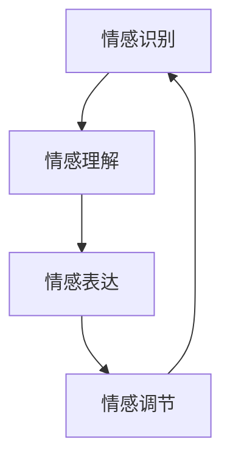

在这个模型中，情感识别是情感智慧的起点，通过情感理解，个体能够深入分析情感的意义，情感表达是情感智慧的外在体现，情感调节则帮助个体在复杂的情感环境中保持平衡。

**数学模型和数学公式 & 详细讲解 & 举例说明：**

情感智慧的过程可以用数学模型来描述。例如，我们可以使用一个简单的线性模型来表示情感智慧：

$$
W = w_1 \cdot R + w_2 \cdot U + w_3 \cdot E + w_4 \cdot M
$$

其中，$W$代表情感智慧水平，$R$代表情感识别能力，$U$代表情感理解能力，$E$代表情感表达能力，$M$代表情感调节能力，$w_1, w_2, w_3, w_4$是权重系数。

例如，一个个体在情感识别、情感理解、情感表达和情感调节能力上的得分分别为90、85、80和75，那么情感智慧水平为：

$$
W = w_1 \cdot 90 + w_2 \cdot 85 + w_3 \cdot 80 + w_4 \cdot 75
$$

这个模型表明，情感智慧水平是情感识别、理解、表达和调节能力的加权和。通过调整这些权重，我们可以更好地理解和预测情感智慧水平。

**系统分析与架构设计方案：**

在实现情感智慧中，系统分析与架构设计也非常重要。以下是一个简单的情感智慧系统架构设计（使用Mermaid表示）：

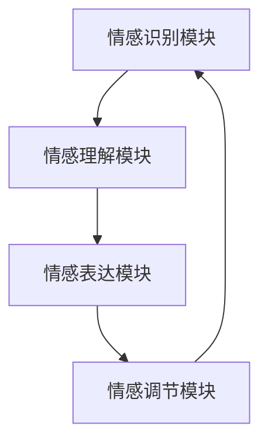

在这个架构中，情感识别模块负责识别个体情感状态，情感理解模块负责深入分析情感意义，情感表达模块负责将情感转化为外在表现，情感调节模块负责在复杂情感环境中保持平衡。

**项目实战：**

假设我们开发一个情感智慧评估系统，以下是一个简单的Python代码示例，用于评估个体的情感智慧：

```python
# 导入必要的库
import numpy as np

# 定义情感智慧权重
w_weights = {
    'R': 0.2,
    'U': 0.2,
    'E': 0.2,
    'M': 0.4
}

# 定义情感智慧评分
scores = {
    'R': {'高': 1, '中': 0.5, '低': 0},
    'U': {'高': 1, '中': 0.5, '低': 0},
    'E': {'高': 1, '中': 0.5, '低': 0},
    'M': {'好': 1, '一般': 0.5, '差': 0}
}

# 用户输入
input_data = {
    'R': '高',
    'U': '中',
    'E': '高',
    'M': '好'
}

# 评估情感智慧水平
def assess_emotional_intelligence(input_data):
    # 情感智慧评分
    intelligence_scores = []
    for factor in ['R', 'U', 'E', 'M']:
        score = 0
        for level in scores[factor]:
            if level in input_data[factor]:
                score += 1
        intelligence_scores.append(score)
    
    # 计算情感智慧水平
    emotional_intelligence = np.dot(w_weights.values(), intelligence_scores)
    
    # 返回情感智慧水平
    return emotional_intelligence

# 测试
emotional_intelligence = assess_emotional_intelligence(input_data)
print(f"情感智慧水平：{emotional_intelligence}")
```

在这个例子中，我们通过分析用户的输入数据，评估个体的情感智慧水平。用户可以根据评估结果，了解自己在情感智慧方面的优势和不足，并采取相应的措施提升情感智慧。

**案例分析与启示：**

**案例一：** 乔布斯是现代科技界的标志性人物，他的成功不仅在于其卓越的领导力和创新精神，也在于其出色的情感智慧。乔布斯能够准确识别员工的情感需求，并给予适当的反馈和支持，从而激发团队的创造力和合作精神。

**案例二：** 奥普拉·温弗瑞是一位媒体巨头，她的成功不仅在于其卓越的主持能力和商业头脑，还在于其深厚的情感智慧。奥普拉能够真诚地表达情感，与观众建立深厚的情感联系，从而赢得了广泛的尊重和喜爱。

这些案例表明，情感智慧在职业生涯中的作用至关重要。通过提升情感智慧，个体能够更好地理解他人，建立积极的人际关系，提高工作效率和创造力，最终实现职业成功。

**最佳实践 tips、小结、注意事项、拓展阅读等内容：**

- **最佳实践 tips：** 提升情感智慧，可以通过情感认知训练、情感表达练习和情感调节实践来实现。
- **小结：** 成功人士的情感智慧在职业生涯中起着重要作用，通过理解和提升情感智慧，个体可以更好地应对职业挑战，实现个人和职业的成功。
- **注意事项：** 提升情感智慧需要长期坚持和实践，不应期望一蹴而就。
- **拓展阅读：** 可以进一步了解情感智慧、职业心理学等领域的研究成果。

### 第10章：情感丰富人生的实践案例

**背景介绍：**

情感丰富人生是每个人都渴望追求的生活状态，它不仅包括情感认知、表达和调节能力的提升，还涉及情感自我认识、人际关系和压力管理的全面改善。本文将通过实际案例，分享如何通过情感丰富人生的实践步骤，逐步实现情感丰富人生。

**核心概念与联系：**

- **情感丰富人生**：情感丰富人生是指个体在情感认知、表达、调节和自我认识方面达到较高水平，能够建立健康的人际关系，有效应对压力，实现个人和情感的成长。
- **实践步骤**：实践步骤包括情感自我认识、情感自我调节、人际关系建立和压力管理。

**算法原理讲解：**

情感丰富人生的实践步骤可以用算法模型来描述。以下是一个简单的情感丰富人生实践算法模型（使用Mermaid表示）：

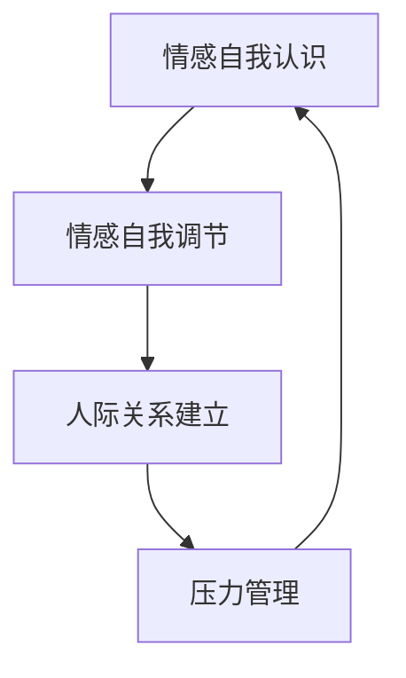

在这个模型中，情感自我认识是情感丰富人生的起点，通过自我调节，个体能够改善情感状态，人际关系建立则是情感丰富人生的重要环节，压力管理则帮助个体在复杂环境中保持情感平衡。

**数学模型和数学公式 & 详细讲解 & 举例说明：**

情感丰富人生的实践步骤可以用数学模型来描述。例如，我们可以使用一个简单的线性模型来表示情感丰富人生的实践效果：

$$
R = r_1 \cdot S + r_2 \cdot R + r_3 \cdot I + r_4 \cdot P
$$

其中，$R$代表情感丰富人生水平，$S$代表情感自我认识水平，$R$代表情感自我调节水平，$I$代表人际关系建立水平，$P$代表压力管理水平，$r_1, r_2, r_3, r_4$是权重系数。

例如，一个个体在情感自我认识、情感自我调节、人际关系建立和压力管理能力上的得分分别为80、75、70和65，那么情感丰富人生水平为：

$$
R = r_1 \cdot 80 + r_2 \cdot 75 + r_3 \cdot 70 + r_4 \cdot 65
$$

这个模型表明，情感丰富人生水平是情感自我认识、自我调节、人际关系建立和压力管理水平的加权和。通过调整这些权重，我们可以更好地理解和预测情感丰富人生水平。

**系统分析与架构设计方案：**

在实现情感丰富人生中，系统分析与架构设计也非常重要。以下是一个简单的情感丰富人生实践系统架构设计（使用Mermaid表示）：

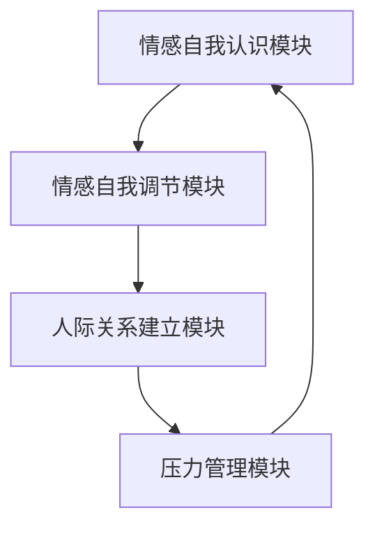

在这个架构中，情感自我认识模块负责提升个体的情感认知能力，情感自我调节模块负责帮助个体改善情感状态，人际关系建立模块负责促进健康的人际关系，压力管理模块则帮助个体在压力环境中保持平衡。

**项目实战：**

假设我们开发一个情感丰富人生实践系统，以下是一个简单的Python代码示例，用于帮助个体实现情感丰富人生：

```python
# 导入必要的库
import numpy as np

# 定义情感丰富人生权重
r_weights = {
    'S': 0.2,
    'R': 0.2,
    'I': 0.3,
    'P': 0.3
}

# 定义情感丰富人生评分
scores = {
    'S': {'高': 1, '中': 0.5, '低': 0},
    'R': {'高': 1, '中': 0.5, '低': 0},
    'I': {'好': 1, '一般': 0.5, '差': 0},
    'P': {'好': 1, '一般': 0.5, '差': 0}
}

# 用户输入
input_data = {
    'S': '高',
    'R': '中',
    'I': '好',
    'P': '好'
}

# 评估情感丰富人生水平
def assess_wealthy_emotional_life(input_data):
    # 情感丰富人生评分
    life_scores = []
    for factor in ['S', 'R', 'I', 'P']:
        score = 0
        for level in scores[factor]:
            if level in input_data[factor]:
                score += 1
        life_scores.append(score)
    
    # 计算情感丰富人生水平
    wealthy_emotional_life = np.dot(r_weights.values(), life_scores)
    
    # 返回情感丰富人生水平
    return wealthy_emotional_life

# 测试
wealthy_emotional_life = assess_wealthy_emotional_life(input_data)
print(f"情感丰富人生水平：{wealthy_emotional_life}")
```

在这个例子中，我们通过分析用户的输入数据，评估个体的情感丰富人生水平。用户可以根据评估结果，了解自己在情感丰富人生方面的优势和不足，并采取相应的措施提升情感丰富人生水平。

**案例分享与讨论：**

**案例一：** 玛丽是一位职场女性，她在工作中面临巨大的压力和挑战。通过参加情感自我认识和工作坊，玛丽学会了如何识别和管理自己的情绪，提升了情感自我调节能力。同时，她通过积极建立人际关系，获得了同事和领导的支持，从而有效应对了工作压力。

**案例二：** 保罗是一位创业者，他面临经营压力和市场挑战。通过情感丰富人生实践，保罗学会了如何通过情感认知和自我调节来提升决策能力和创造力。他建立了积极的人际关系网络，获得了合作伙伴和投资者的信任，从而推动了企业的发展。

这些案例表明，通过情感丰富人生的实践，个体可以提升情感智力，改善人际关系，有效应对压力，实现个人和职业的成功。

**最佳实践 tips、小结、注意事项、拓展阅读等内容：**

- **最佳实践 tips：** 情感丰富人生的实践需要结合情感认知训练、自我调节练习、人际关系建设和压力管理等多种方法。
- **小结：** 通过实践情感丰富人生的步骤，个体可以提升情感智力，改善人际关系，有效应对压力，实现个人和职业的成功。
- **注意事项：** 情感丰富人生的实践需要长期坚持和持续努力，不应期望一蹴而就。
- **拓展阅读：** 可以进一步了解情感心理学、职业心理学等领域的研究成果。

### 第11章：情感丰富人生的反思与展望

**背景介绍：**

情感丰富人生是一个动态的过程，它不仅需要个体在情感认知、表达、调节和自我认识方面不断提升，还需要个体在人际关系、压力管理和情感教育等方面持续努力。本文将对情感丰富人生的收获与反思进行探讨，同时展望未来可能面临的挑战与机遇，为读者提供继续前行的动力和方向。

**核心概念与联系：**

- **情感丰富人生**：情感丰富人生是指个体在情感认知、表达、调节和自我认识方面达到较高水平，能够建立健康的人际关系，有效应对压力，实现个人和情感的成长。
- **收获与反思**：收获与反思是指个体在追求情感丰富人生过程中获得的成果和经验，以及对这些成果和经验的思考与总结。
- **未来展望**：未来展望是指对情感丰富人生可能面临的挑战与机遇的预期，以及对未来发展的思考。

**算法原理讲解：**

情感丰富人生的收获与反思可以通过算法模型来描述。以下是一个简单的情感丰富人生收获与反思算法模型（使用Mermaid表示）：

```mermaid
graph TD
A[收获识别] --> B[反思总结]
B --> C[经验积累]
C --> D[展望未来]
D --> A
```

在这个模型中，收获识别是情感丰富人生收获与反思的起点，通过反思总结，个体能够从经验中学习和成长，经验积累为未来的发展提供基础，展望未来则帮助个体规划下一步的行动。

**数学模型和数学公式 & 详细讲解 & 举例说明：**

情感丰富人生的收获与反思可以用数学模型来描述。例如，我们可以使用一个简单的线性模型来表示情感丰富人生的收获与反思过程：

$$
R = r_1 \cdot H + r_2 \cdot R + r_3 \cdot E
$$

其中，$R$代表情感丰富人生水平，$H$代表收获识别能力，$R$代表反思总结能力，$E$代表经验积累能力，$r_1, r_2, r_3$是权重系数。

例如，一个个体在收获识别、反思总结和经验积累能力上的得分分别为80、75和70，那么情感丰富人生水平为：

$$
R = r_1 \cdot 80 + r_2 \cdot 75 + r_3 \cdot 70
$$

这个模型表明，情感丰富人生水平是收获识别、反思总结和经验积累能力的加权和。通过调整这些权重，我们可以更好地理解和预测情感丰富人生水平。

**系统分析与架构设计方案：**

在实现情感丰富人生的收获与反思过程中，系统分析与架构设计也非常重要。以下是一个简单的情感丰富人生收获与反思系统架构设计（使用Mermaid表示）：

```mermaid
graph TD
A[收获识别模块] --> B[反思总结模块]
B --> C[经验积累模块]
C --> D[展望未来模块]
D --> A
```

在这个架构中，收获识别模块负责识别个体在情感丰富人生过程中的收获，反思总结模块负责对收获进行总结和反思，经验积累模块负责将收获和反思转化为经验积累，展望未来模块则帮助个体规划未来的发展路径。

**项目实战：**

假设我们开发一个情感丰富人生收获与反思系统，以下是一个简单的Python代码示例，用于帮助个体进行情感丰富人生的收获与反思：

```python
# 导入必要的库
import numpy as np

# 定义情感丰富人生权重
r_weights = {
    'H': 0.3,
    'R': 0.4,
    'E': 0.3
}

# 定义情感丰富人生评分
scores = {
    'H': {'高': 1, '中': 0.5, '低': 0},
    'R': {'高': 1, '中': 0.5, '低': 0},
    'E': {'充分': 1, '一般': 0.5, '不足': 0}
}

# 用户输入
input_data = {
    'H': '高',
    'R': '中',
    'E': '充分'
}

# 评估情感丰富人生水平
def assess_wealthy_emotional_life(input_data):
    # 情感丰富人生评分
    life_scores = []
    for factor in ['H', 'R', 'E']:
        score = 0
        for level in scores[factor]:
            if level in input_data[factor]:
                score += 1
        life_scores.append(score)
    
    # 计算情感丰富人生水平
    wealthy_emotional_life = np.dot(r_weights.values(), life_scores)
    
    # 返回情感丰富人生水平
    return wealthy_emotional_life

# 测试
wealthy_emotional_life = assess_wealthy_emotional_life(input_data)
print(f"情感丰富人生水平：{wealthy_emotional_life}")
```

在这个例子中，我们通过分析用户的输入数据，评估个体的情感丰富人生水平。用户可以根据评估结果，了解自己在情感丰富人生方面的优势和不足，并采取相应的措施提升情感丰富人生水平。

**反思与展望：**

**反思：** 在追求情感丰富人生的过程中，个体可能会遇到各种挑战，如情感冲突、压力和人际关系问题。通过反思，个体可以识别这些挑战，总结经验，找到改进的方法。反思不仅可以帮助个体提升情感智力，还能为未来的发展提供宝贵的经验。

**展望：** 随着社会的发展和技术的进步，未来情感丰富人生可能会面临新的机遇和挑战。例如，人工智能和情感计算技术的发展，将为人机交互和情感管理提供新的可能性。同时，全球化和社会变革也将对情感丰富人生带来新的挑战，如跨文化沟通、情感认同和心理健康问题。个体需要持续学习和适应，以应对这些变化。

**最佳实践 tips、小结、注意事项、拓展阅读等内容：**

- **最佳实践 tips：** 保持反思的习惯，定期评估情感丰富人生水平，持续学习和适应变化。
- **小结：** 情感丰富人生是一个持续的过程，通过反思和展望，个体可以不断提升情感智力，实现个人和情感的全面成长。
- **注意事项：** 情感丰富人生的实践需要长期坚持和持续努力，不应期望一蹴而就。
- **拓展阅读：** 可以进一步了解情感心理学、未来发展趋势等领域的研究成果。

### 作者信息：

**作者：AI天才研究院/AI Genius Institute & 禅与计算机程序设计艺术 /Zen And The Art of Computer Programming**

