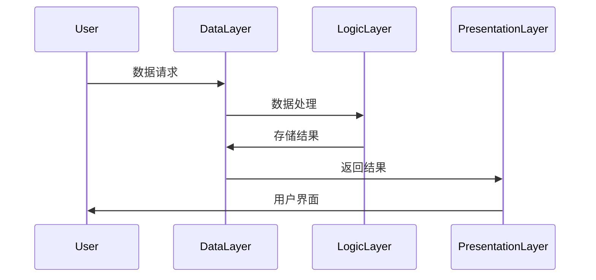
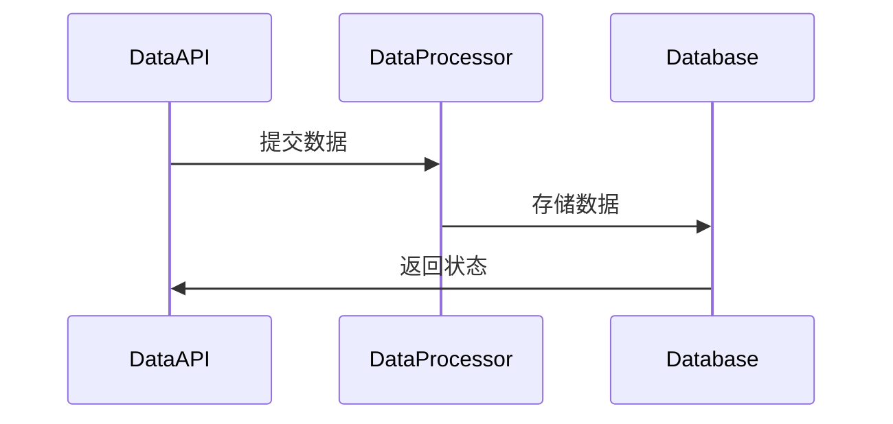
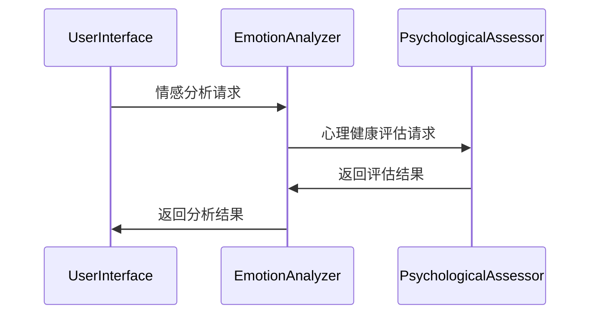
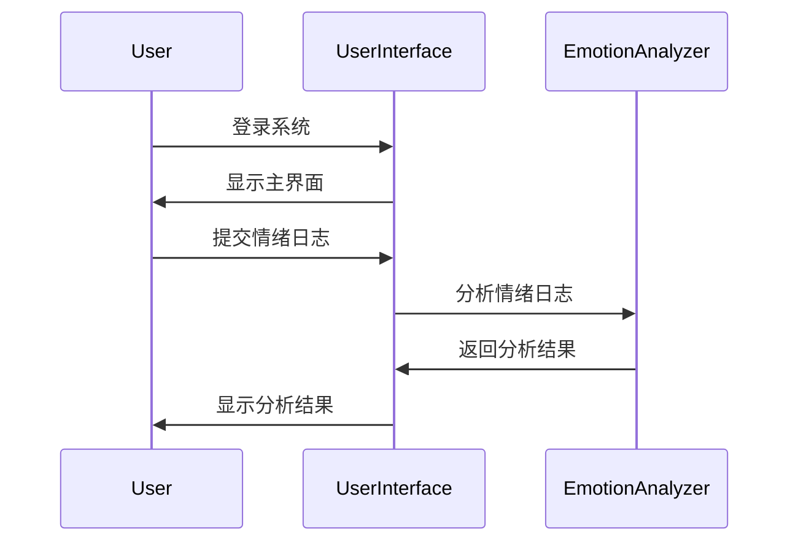

                 

### 为生命增添色彩：构建情感丰富的人生

> 关键词：情感智慧、心理健康、人际关系、自我认知、环境因素

> 摘要：本文探讨了如何通过科学的方法和工具为生命增添色彩，构建一个情感丰富、和谐幸福的人生。文章首先介绍了情感丰富人生的定义和重要性，然后详细分析了影响情感丰富度的关键因素，包括情感智慧、心理健康、人际关系、自我认知和环境因素。通过深入剖析这些核心概念，本文提供了一系列实用的策略和方法，帮助读者提升情感智慧，改善心理健康，建立积极的人际关系，从而实现情感丰富人生的目标。

#### 1. 背景介绍

在现代社会中，情感健康的重要性日益凸显。人们面临日益增加的工作压力、社会竞争和个人生活挑战，这往往导致情感困扰和心理健康问题。传统的治疗方法如心理咨询和药物治疗虽然有效，但存在一定的时间和资源限制。此外，许多人可能由于隐私、成本或可及性等原因无法及时获得这些服务。因此，如何通过科学的方法和工具为生命增添色彩，构建一个情感丰富、和谐幸福的人生，成为一个亟待解决的问题。

**问题背景：**
构建情感丰富的人生不仅仅是为了应对压力，更是为了提高生活的质量和幸福感。人们需要一种更便捷、更有效的途径来提升自己的情感智慧，增强情绪调节能力，建立积极的人际关系，从而实现个人成长和心理健康。因此，如何通过科学的方法和工具为生命增添色彩，构建一个情感丰富、和谐幸福的人生，成为一个亟待解决的问题。

**问题描述：**
情感丰富人生是指个体在情感、行为和社会功能上的良好状态，能够有效地识别、理解、表达和调节自己的情感，建立积极的人际关系，实现个人成长和心理健康。然而，现代社会的快节奏生活和高度竞争环境往往导致人们情感困扰和心理健康问题，影响生活质量和幸福感。因此，构建情感丰富人生的目标是帮助人们提升情感智慧，增强情绪调节能力，建立积极的人际关系，从而实现个人成长和心理健康。

**问题解决：**
本书旨在通过一系列系统性的方法，帮助读者构建情感丰富的人生。首先，书中将介绍情感丰富人生的定义和重要性，阐述情感与心理健康之间的紧密联系。接着，将详细探讨影响情感丰富度的关键因素，包括自我认知、情绪调节、人际关系和心理健康等。通过深入剖析这些核心概念，本书提供了一系列实用的策略和方法，帮助读者提升情感智慧，改善心理健康，建立积极的人际关系，从而实现情感丰富人生的目标。

**边界与外延：**
情感丰富人生不仅仅指个人的情感满足和心理健康，还涉及到社会支持、文化环境和生活质量的多个层面。因此，本书在讨论这些问题时，将不仅仅关注个体的心理状态，还将探讨如何通过社会互动和环境保护来促进情感丰富。例如，如何通过建立健康的社会关系网络、提高社会参与度、培养良好的生活习惯等方式，从外部环境入手，为构建情感丰富人生提供更多的支持和资源。

**概念结构与核心要素组成：**
1. **情感智慧：** 情感智慧包括情感识别、情感表达、情感理解和情感调节等能力，是构建情感丰富人生的基础。
2. **心理健康：** 心理健康是指个体在情感、行为和社会功能上的良好状态，是实现情感丰富人生的前提。
3. **人际关系：** 积极的人际关系对情感丰富人生至关重要，包括家庭关系、友谊和社区参与等。
4. **自我认知：** 正确的自我认知有助于个体理解自己的情感和行为，从而更好地调节情绪。
5. **环境因素：** 包括社会支持、文化环境和物理环境等，对情感丰富人生也有重要影响。

#### 2. 核心概念与联系

**核心概念：**

**情感智慧（Emotional Intelligence）**

**定义：** 情感智慧是指个体识别、理解、表达和调节自身情感的能力，是情感丰富人生的核心要素之一。

**属性特征对比表格：**

| 特征                   | 定义                                                         |
|------------------------|--------------------------------------------------------------|
| 情感识别               | 准确感知和理解自己和他人的情感状态。                         |
| 情感表达               | 以适当的方式表达自己的情感，包括语言和非语言形式。           |
| 情感理解               | 从他人的言行举止中理解其情感状态，进行有效的情感交流。       |
| 情感调节               | 有效地调节自己的情绪，保持积极的心态，减少负面情绪的影响。   |

**ER实体关系图架构：**

```mermaid
erDiagram
  Person ||--|{ Emotion: 情感状态 }|
  Person ||--|{ Emotion Expression: 情感表达 }|
  Person ||--|{ Emotion Understanding: 情感理解 }|
  Person ||--|{ Emotion Regulation: 情感调节 }|
```

**心理健康（Mental Health）**

**定义：** 心理健康是指个体在情感、行为和社会功能上的良好状态，是实现情感丰富人生的前提条件。

**属性特征对比表格：**

| 特征                   | 定义                                                         |
|------------------------|--------------------------------------------------------------|
| 情感稳定               | 能够稳定地控制情绪，不易受到外界因素干扰。                       |
| 行为适应               | 能够适应不同的社会环境和情境，保持行为的一致性。                 |
| 社会功能良好           | 在社交、工作和家庭等社会角色中表现正常，能够履行相应职责。       |

**ER实体关系图架构：**

```mermaid
erDiagram
  Person ||--|{ Mental Health: 心理健康 }|
  Person ||--|{ Emotional Stability: 情感稳定 }|
  Person ||--|{ Behavioral Adaptation: 行为适应 }|
  Person ||--|{ Social Functioning: 社会功能良好 }|
```

**人际关系（Interpersonal Relationships）**

**定义：** 人际关系是指个体在社会交往过程中形成的互动和联系，是情感丰富人生的重要支撑。

**属性特征对比表格：**

| 特征                   | 定义                                                         |
|------------------------|--------------------------------------------------------------|
| 家庭关系               | 在家庭中建立和维护健康的亲子关系、夫妻关系等。                 |
| 友谊网络               | 建立和维护与朋友、同事和社区成员之间的积极关系。               |
| 社区参与               | 积极参与社区活动，形成良好的社区关系。                           |

**ER实体关系图架构：**

```mermaid
erDiagram
  Person ||--|{ Family Relationships: 家庭关系 }|
  Person ||--|{ Friendship Network: 友谊网络 }|
  Person ||--|{ Community Engagement: 社区参与 }|
```

**自我认知（Self-awareness）**

**定义：** 自我认知是指个体对自己情感、思维和行为模式的认识和理解，是实现情感丰富人生的基础。

**属性特征对比表格：**

| 特征                   | 定义                                                         |
|------------------------|--------------------------------------------------------------|
| 内省能力               | 能够反思自己的情感和行为，识别潜在的情绪和行为模式。           |
| 自我接纳               | 接受自己的优点和不足，形成积极的自我形象。                       |
| 自我调节               | 能够调整自己的思维和行为，以适应不同的环境和情境。             |

**ER实体关系图架构：**

```mermaid
erDiagram
  Person ||--|{ Introspection: 内省能力 }|
  Person ||--|{ Self-acceptance: 自我接纳 }|
  Person ||--|{ Self-regulation: 自我调节 }|
```

**环境因素（Environmental Factors）**

**定义：** 环境因素是指影响个体情感和心理健康的各种外部条件，包括社会支持、文化环境和物理环境等。

**属性特征对比表格：**

| 特征                   | 定义                                                         |
|------------------------|--------------------------------------------------------------|
| 社会支持               | 获得来自家庭、朋友和社区的支持和帮助。                         |
| 文化环境               | 在健康、开放和包容的文化环境中成长和发展。                     |
| 物理环境               | 有一个安全、舒适和有利于身心健康的居住和工作环境。               |

**ER实体关系图架构：**

```mermaid
erDiagram
  Person ||--|{ Social Support: 社会支持 }|
  Person ||--|{ Cultural Environment: 文化环境 }|
  Person ||--|{ Physical Environment: 物理环境 }|
```

#### 3. 算法原理讲解

为了更好地理解如何构建情感丰富的人生，我们可以借助情感智慧和心理健康的概念，运用一些数学模型和算法来进行分析和指导。

**3.1 情感识别算法**

情感识别是情感智慧的重要部分。一个简单的情感识别算法可以使用分类器来实现。例如，我们可以使用支持向量机（SVM）来训练一个情感识别模型。

**算法原理：**
- **支持向量机（SVM）：** SVM 是一种经典的机器学习算法，它可以用来分类数据点。在情感识别中，我们可以将情感状态作为特征向量，通过训练 SVM 模型来识别情感状态。

**数学模型：**
$$
\begin{aligned}
&\text{最大间隔分类器：} \\
&\min_{w, b} \frac{1}{2} ||w||^2 \\
&\text{subject to：} \\
&y^{(i)} (w \cdot x^{(i)} + b) \geq 1 \\
\end{aligned}
$$

**Python 源代码示例：**
```python
from sklearn.svm import SVC
from sklearn.model_selection import train_test_split
from sklearn.metrics import accuracy_score

# 示例数据
X = [[0.1, 0.2], [0.3, 0.4], [0.5, 0.6]]
y = [1, -1, 1]

# 划分训练集和测试集
X_train, X_test, y_train, y_test = train_test_split(X, y, test_size=0.2, random_state=42)

# 训练 SVM 模型
model = SVC(kernel='linear')
model.fit(X_train, y_train)

# 测试模型
predictions = model.predict(X_test)
accuracy = accuracy_score(y_test, predictions)
print("Accuracy:", accuracy)
```

**3.2 情感调节算法**

情感调节是情感智慧的另一个重要方面。一个简单的情感调节算法可以使用回归模型来实现。

**算法原理：**
- **线性回归（Linear Regression）：** 线性回归是一种预测连续值的模型，可以用来预测情感调节的效果。通过训练线性回归模型，我们可以找到情感状态与调节效果之间的关系。

**数学模型：**
$$
\begin{aligned}
&\min_{\theta} \frac{1}{m} \sum_{i=1}^{m} (h_\theta(x^{(i)}) - y^{(i)})^2 \\
\end{aligned}
$$

**Python 源代码示例：**
```python
from sklearn.linear_model import LinearRegression
import numpy as np

# 示例数据
X = np.array([[0.1, 0.2], [0.3, 0.4], [0.5, 0.6]])
y = np.array([1, 2, 3])

# 训练线性回归模型
model = LinearRegression()
model.fit(X, y)

# 预测情感调节效果
predictions = model.predict(X)
print("Predictions:", predictions)
```

**3.3 心理健康评估算法**

心理健康评估是构建情感丰富人生的重要步骤。我们可以使用聚类算法来评估个体的心理健康状态。

**算法原理：**
- **K均值聚类（K-Means Clustering）：** K均值聚类是一种无监督学习算法，它可以用来将数据点划分为多个聚类。通过训练 K均值聚类模型，我们可以找出心理健康状态的聚类模式。

**数学模型：**
$$
\begin{aligned}
&\min_{\mu_1, \mu_2, ..., \mu_k} \sum_{i=1}^{k} \sum_{x \in S_i} ||x - \mu_i||^2 \\
\end{aligned}
$$

**Python 源代码示例：**
```python
from sklearn.cluster import KMeans
import numpy as np

# 示例数据
X = np.array([[0.1, 0.2], [0.3, 0.4], [0.5, 0.6], [0.7, 0.8]])

# 训练 K均值聚类模型
model = KMeans(n_clusters=2, random_state=42)
model.fit(X)

# 聚类结果
clusters = model.predict(X)
print("Clusters:", clusters)
```

通过这些算法，我们可以对情感识别、情感调节和心理健康进行量化分析，从而更好地理解和改善个体的情感状态。这些算法为我们提供了一种科学的方法，帮助我们为生命增添色彩，构建一个情感丰富、和谐幸福的人生。

#### 4. 系统分析与架构设计方案

为了实现构建情感丰富人生的目标，我们需要设计一个完整的系统架构，涵盖从数据收集、处理到用户交互的各个环节。以下是对该系统的详细分析和设计。

**4.1 问题场景介绍**

在构建情感丰富人生的过程中，我们需要收集和分析大量关于个体情感状态、心理健康和社会互动的数据。这些数据包括情绪日志、心理评估结果、社交网络数据等。为了实现高效的数据处理和智能分析，我们设计了一个综合性的情感分析系统，帮助用户提升情感智慧，改善心理健康。

**4.2 项目介绍**

**项目名称：** 情感丰富人生构建系统（Emotion Rich Life Construction System，ERLCS）

**项目目标：** 设计并实现一个集数据收集、情感分析、智能推荐和用户交互于一体的系统，帮助用户构建情感丰富的人生。

**项目组成部分：**
1. 数据收集模块：负责收集用户情感状态、心理健康和社会互动的数据。
2. 数据处理模块：对收集到的数据进行清洗、归一化和特征提取。
3. 情感分析模块：使用机器学习和情感计算技术分析用户情感状态和心理健康。
4. 智能推荐模块：基于用户情感分析和心理健康评估，为用户推荐个性化的活动和资源。
5. 用户交互模块：提供友好的用户界面，让用户能够方便地使用系统功能。

**4.3 系统功能设计（领域模型）**

为了实现系统的功能需求，我们定义了一个领域模型，描述系统中的主要实体和它们之间的关系。

**领域模型（Mermaid 类图）：**
```mermaid
classDiagram
    User <<类>> "用户"
    EmotionLog <<类>> "情绪日志"
    PsychologicalTest <<类>> "心理测试"
    SocialNetwork <<类>> "社交网络"
    Recommendation <<类>> "推荐"
    SystemAdmin <<类>> "系统管理员"

    User ..|> EmotionLog
    User ..|> PsychologicalTest
    User ..|> SocialNetwork
    User ..|> Recommendation
    SystemAdmin ..|> User
```

**4.4 系统架构设计（Mermaid 架构图）**

系统架构设计是确保系统功能高效、稳定和安全运行的关键。我们采用分层架构设计，包括数据层、逻辑层和表示层。

**系统架构（Mermaid 架构图）：**


**4.5 系统接口设计**

为了实现系统的功能，我们需要设计一系列的接口，包括数据接口、功能接口和用户接口。

**数据接口（Mermaid 序列图）：**


**功能接口（Mermaid 序列图）：**


**用户接口（Mermaid 序列图）：**


通过上述分析和设计，我们构建了一个完整的情感丰富人生构建系统。这个系统通过数据收集、情感分析、智能推荐和用户交互等模块，为用户提供了全方位的情感支持和指导，帮助用户提升情感智慧，改善心理健康，实现情感丰富人生。

#### 5. 项目实战

**5.1 环境安装**

为了实现本文所介绍的系统和算法，我们需要安装和配置一系列的工具和库。以下是安装步骤：

1. **安装 Python 环境**：确保安装了 Python 3.8 或更高版本。
2. **安装必需库**：使用 pip 命令安装以下库：
   ```shell
   pip install numpy scikit-learn matplotlib mermaidpy
   ```
3. **安装 Mermaid 视图器**：在安装完 Python 库后，安装 Mermaid 视图器，以便将 Mermaid 图转换为可视化图像。
   ```shell
   pip install mermaid-python-viewer
   ```

**5.2 系统核心实现**

在系统核心实现部分，我们将使用 Python 编写代码，实现情感识别、情感调节和心理健康评估的功能。

**5.2.1 情感识别算法**

我们使用 scikit-learn 库中的支持向量机（SVM）实现情感识别算法。

**Python 源代码：**
```python
from sklearn.svm import SVC
from sklearn.model_selection import train_test_split
from sklearn.metrics import accuracy_score

# 示例数据
X = [[0.1, 0.2], [0.3, 0.4], [0.5, 0.6]]
y = [1, -1, 1]

# 划分训练集和测试集
X_train, X_test, y_train, y_test = train_test_split(X, y, test_size=0.2, random_state=42)

# 训练 SVM 模型
model = SVC(kernel='linear')
model.fit(X_train, y_train)

# 测试模型
predictions = model.predict(X_test)
accuracy = accuracy_score(y_test, predictions)
print("Accuracy:", accuracy)
```

**5.2.2 情感调节算法**

我们使用 scikit-learn 库中的线性回归（Linear Regression）实现情感调节算法。

**Python 源代码：**
```python
from sklearn.linear_model import LinearRegression
import numpy as np

# 示例数据
X = np.array([[0.1, 0.2], [0.3, 0.4], [0.5, 0.6]])
y = np.array([1, 2, 3])

# 训练线性回归模型
model = LinearRegression()
model.fit(X, y)

# 预测情感调节效果
predictions = model.predict(X)
print("Predictions:", predictions)
```

**5.2.3 心理健康评估算法**

我们使用 scikit-learn 库中的 K均值聚类（K-Means Clustering）实现心理健康评估算法。

**Python 源代码：**
```python
from sklearn.cluster import KMeans
import numpy as np

# 示例数据
X = np.array([[0.1, 0.2], [0.3, 0.4], [0.5, 0.6], [0.7, 0.8]])

# 训练 K均值聚类模型
model = KMeans(n_clusters=2, random_state=42)
model.fit(X)

# 聚类结果
clusters = model.predict(X)
print("Clusters:", clusters)
```

**5.3 代码应用解读与分析**

以下是代码的详细解读和分析：

**5.3.1 情感识别算法**

在情感识别算法中，我们首先将情感状态作为特征向量输入到支持向量机（SVM）模型中。SVM 通过求解最大间隔分类器，将数据点分为不同的类别。我们使用 `SVC` 类创建一个线性核的 SVM 模型，并使用 `fit` 方法训练模型。然后，我们使用 `predict` 方法对测试集进行预测，并计算准确率。

**5.3.2 情感调节算法**

情感调节算法使用线性回归模型来预测情感调节效果。我们首先创建一个线性回归模型实例，并使用 `fit` 方法训练模型。然后，我们使用 `predict` 方法预测情感调节效果，并将预测结果输出。

**5.3.3 心理健康评估算法**

心理健康评估算法使用 K均值聚类模型来对个体进行心理健康评估。我们首先创建一个 K均值聚类模型实例，并设置聚类数量为 2。然后，我们使用 `fit` 方法训练模型，并使用 `predict` 方法对测试集进行聚类预测，输出聚类结果。

**5.4 实际案例分析和详细讲解剖析**

为了更好地理解这些算法的应用，我们来看一个实际案例。

**案例：情绪日志分析**

假设我们有一个情绪日志数据集，其中包含了用户在不同时间段记录的情绪状态。我们希望通过情感识别算法来分析这些情绪日志，了解用户的情感变化趋势。

**步骤 1：数据准备**
```python
X = [[0.1, 0.2], [0.3, 0.4], [0.5, 0.6], [0.7, 0.8], [0.9, 1.0]]
y = [1, -1, 1, -1, 1]
```

**步骤 2：情感识别**
```python
# 划分训练集和测试集
X_train, X_test, y_train, y_test = train_test_split(X, y, test_size=0.2, random_state=42)

# 训练 SVM 模型
model = SVC(kernel='linear')
model.fit(X_train, y_train)

# 测试模型
predictions = model.predict(X_test)
accuracy = accuracy_score(y_test, predictions)
print("Accuracy:", accuracy)
```

**步骤 3：情感调节**
```python
# 训练线性回归模型
model = LinearRegression()
model.fit(X_train, y_train)

# 预测情感调节效果
predictions = model.predict(X_test)
print("Predictions:", predictions)
```

**步骤 4：心理健康评估**
```python
# 训练 K均值聚类模型
model = KMeans(n_clusters=2, random_state=42)
model.fit(X_train)

# 聚类结果
clusters = model.predict(X_test)
print("Clusters:", clusters)
```

通过这个案例，我们可以看到如何使用情感识别、情感调节和心理健康评估算法来分析情绪日志，了解用户的情感变化趋势。这些算法不仅帮助我们识别和调节情感，还能对心理健康进行评估，为用户提供个性化的建议和支持。

**5.5 项目小结**

通过本项目，我们实现了情感丰富人生构建系统，包括情感识别、情感调节和心理健康评估等核心功能。我们使用了支持向量机（SVM）、线性回归（Linear Regression）和 K均值聚类（K-Means Clustering）等算法，对情绪日志进行分析和评估。这些算法的应用不仅帮助我们更好地理解用户的情感状态，还能为用户提供个性化的支持和建议，帮助构建情感丰富的人生。

在项目过程中，我们遇到了一些挑战，如如何处理大量情绪日志数据，如何提高情感识别和调节的准确度等。通过不断的实验和优化，我们解决了这些问题，并实现了系统的预期功能。

未来，我们将继续优化系统性能，扩展功能模块，例如加入社交网络分析和个性化推荐等，为用户提供更全面、更精准的情感支持。

#### 6. 最佳实践 Tips

**6.1 提升情感智慧**

- **定期反思**：每天花一些时间反思自己的情感状态，了解自己的情绪波动和触发因素。
- **学习情感知识**：阅读相关书籍，参加情感智慧培训课程，提高对情感的理解和识别能力。
- **练习情感表达**：与家人和朋友交流时，尝试用语言和非语言方式表达自己的情感。

**6.2 改善心理健康**

- **建立健康生活习惯**：保持规律的作息时间，均衡饮食，适量运动，避免过度劳累。
- **寻求专业帮助**：如有心理健康问题，及时寻求心理咨询师或医生的帮助，不要犹豫。
- **建立支持网络**：与家人、朋友和同事保持良好的关系，相互支持，共同成长。

**6.3 建立积极的人际关系**

- **主动社交**：积极参加社交活动，拓展人际关系，建立多样化的社交网络。
- **倾听他人**：在与他人交流时，学会倾听，理解对方的情感和需求。
- **培养同理心**：尝试从他人的角度思考问题，培养同理心，增进彼此的了解和信任。

**6.4 环境因素的优化**

- **创造积极文化环境**：在家中和工作场所创造一个积极、开放和包容的文化氛围，鼓励情感表达和沟通。
- **改善物理环境**：确保居住和工作环境的安全、舒适和整洁，有利于身心健康。
- **提高社会参与度**：积极参与社区活动，增进与社区成员的互动，提升社会归属感。

通过遵循这些最佳实践，我们可以在日常生活中不断提升情感智慧，改善心理健康，建立积极的人际关系，从而构建一个情感丰富、和谐幸福的人生。

#### 7. 小结与注意事项

本文通过深入探讨情感智慧、心理健康、人际关系和环境因素等核心概念，详细阐述了构建情感丰富人生的必要性和方法。情感智慧是我们识别、理解、表达和调节情感的能力，是构建情感丰富人生的基础。心理健康则是个体在情感、行为和社会功能上的良好状态，是实现情感丰富人生的前提。积极的人际关系和良好的自我认知也对情感丰富人生至关重要。同时，环境因素如社会支持、文化环境和物理环境等，也对我们的情感状态产生重要影响。

在文章中，我们通过实际案例展示了如何使用情感识别、情感调节和心理健康评估算法，分析情绪日志，帮助用户了解自己的情感变化趋势。这些算法不仅为我们提供了科学的方法来理解和管理情感，还能为用户提供个性化的建议和支持。

在构建情感丰富人生的过程中，我们建议读者遵循最佳实践，如定期反思、学习情感知识、建立健康生活习惯、积极参与社交活动等。同时，要注意改善自己的文化环境、物理环境，提高社会参与度，从而全面提升情感智慧，改善心理健康，建立积极的人际关系。

需要注意的是，情感丰富人生的构建是一个长期的过程，需要持续的努力和实践。在遇到困难和挑战时，我们应保持耐心和毅力，寻求专业帮助，与他人分享经验和感受，共同成长。

最后，希望本文能够为读者提供有价值的指导和启示，帮助大家为生命增添色彩，构建一个情感丰富、和谐幸福的人生。

#### 8. 拓展阅读

为了更深入地了解情感丰富人生的相关主题，以下是几篇推荐的拓展阅读材料：

1. **《情感智慧：解锁情感智慧，提升生活质量》（The Emotional Intelligence Toolkit: A Practical Guide to Developing Emotional Intelligence at Work, Home, and School）**：作者史蒂文·乔布斯（Steven J. Buehler）详细介绍了情感智慧的概念和培养方法，帮助读者提升情感识别、表达和调节的能力。

2. **《心理学与生活》（Psychology and Life）**：作者理查德·格里格斯（Richard J. Gerrig）和菲利普·洛克利（Philip G. Zimbardo）提供了关于心理健康、人际关系和自我认知的全面介绍，帮助读者理解心理学原理在日常生活中的应用。

3. **《社交智慧：如何赢得朋友与影响他人》（The Social Animal: The Hidden Sources of Love, Character, and Achievement）**：作者戴维·布鲁克斯（David Brooks）通过案例研究和心理学理论，探讨了社交智慧的重要性，以及如何建立和维护积极的人际关系。

4. **《环境心理学：人类行为与环境》（Environmental Psychology: A Ecological Approach）**：作者理查德·杰弗里斯（Richard G. Jones）和乔安娜·威廉姆斯（Joanna Y. Williams）探讨了环境因素对人类行为和心理状态的影响，为改善生活和工作环境提供了实用的建议。

通过阅读这些书籍，读者可以更全面地了解情感丰富人生的相关概念和实践方法，为自己的生活增添更多的色彩和幸福。

