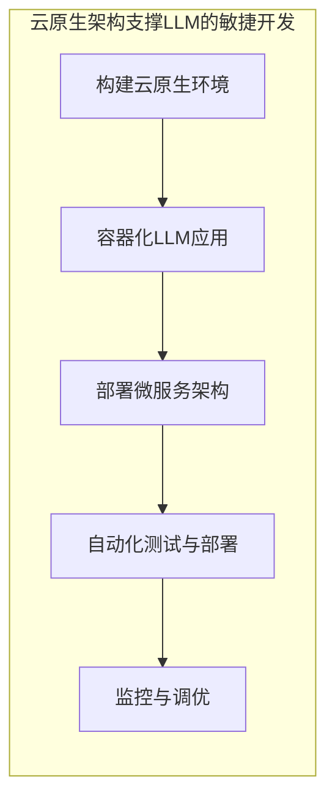
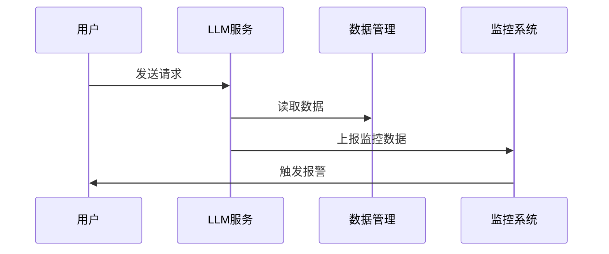

                 

### 第一部分：背景介绍

#### 1.1 问题背景

随着人工智能技术的快速发展，大规模语言模型（Large Language Model，简称LLM）成为了当前研究的热点。LLM在自然语言处理、智能问答、机器翻译等领域展现了巨大的潜力，然而其开发过程却面临诸多挑战。传统架构在处理LLM应用时，往往存在扩展性差、部署复杂、维护困难等问题，无法满足敏捷开发的需求。

#### 1.2 问题描述

传统架构在面对LLM应用时，主要存在以下几个问题：

1. **扩展性不足**：传统架构通常采用单体架构，难以应对大规模数据和高并发请求的需求。
2. **部署复杂**：传统架构通常需要手动部署和配置，部署流程繁琐且容易出错。
3. **维护困难**：传统架构的代码耦合度高，修改一处可能导致整个系统出现问题，维护成本高。
4. **测试不足**：传统架构的自动化测试和持续集成难以实施，导致开发过程中漏洞和错误难以发现。

#### 1.3 问题解决

为了解决上述问题，云原生架构提供了一种新的解决方案。云原生架构具有以下几个特点：

1. **容器化**：通过容器化技术，将应用程序及其依赖环境打包成独立的容器镜像，实现应用的轻量级打包和隔离。
2. **微服务架构**：将应用拆分为一系列独立的微服务，每个微服务负责实现一个特定的功能，以提高系统的灵活性和可维护性。
3. **自动化**：利用CI/CD工具实现自动化测试、部署和监控，提高开发效率。
4. **云服务集成**：充分利用云服务提供商提供的资源和服务，实现高效资源利用和快速部署。

#### 1.4 边界与外延

尽管云原生架构在支撑LLM应用开发方面具有显著优势，但并非适用于所有场景。以下是一些边界与外延：

1. **性能要求**：对于对性能要求极高或者对实时性要求严格的系统，传统架构可能更为合适。
2. **资源依赖**：云原生架构对云服务提供商的依赖较大，如果云服务不稳定，可能会影响系统的可靠性。
3. **学习成本**：云原生架构涉及多种新技术和工具，开发者需要一定时间来学习和适应。

#### 1.5 概念结构与核心要素组成

云原生架构的核心要素包括：

- **容器化**：通过Docker等容器技术，实现应用程序的轻量级打包和隔离。
- **微服务架构**：将应用拆分为一系列独立的、可复用的服务，以提高系统的灵活性和可维护性。
- **自动化**：利用CI/CD工具实现自动化测试、部署和监控，提高开发效率。
- **云服务集成**：充分利用云服务提供商提供的资源和服务，实现高效资源利用和快速部署。

#### 1.6 本章小结

本章介绍了云原生架构的背景、问题、解决方法以及其边界和核心要素。接下来，我们将进一步探讨云原生架构在支撑LLM敏捷开发中的应用。

---

### 第二部分：核心概念与联系

#### 2.1 云原生架构的核心概念

云原生架构的核心概念包括容器化、微服务架构、自动化和云服务集成。下面我们将详细解释这些概念及其相互关系。

##### 2.1.1 容器化

容器化是一种将应用程序及其运行环境打包成独立容器镜像的技术。通过容器化，开发者可以轻松地将应用程序部署到任何支持容器的环境中，而无需担心依赖环境不一致的问题。

**优点**：

- **轻量级**：容器镜像相对于虚拟机来说更加轻量级，启动速度更快。
- **隔离性**：容器之间具有很好的隔离性，可以确保一个容器崩溃不会影响到其他容器。
- **可移植性**：容器镜像可以轻松地在不同环境中移植，提高开发效率和可移植性。

**缺点**：

- **需要学习新工具**：如Docker等容器引擎，开发者需要花费一定时间来学习和适应。
- **安全性**：容器镜像中可能包含敏感信息，需要注意保护。

##### 2.1.2 微服务架构

微服务架构是一种将应用程序拆分为一系列独立的小服务的架构风格。每个微服务负责实现一个特定的功能，可以通过API进行通信。

**优点**：

- **灵活性**：每个微服务可以独立开发、测试和部署，提高系统的灵活性。
- **可维护性**：微服务的代码耦合度低，修改一处不会影响到整个系统，降低维护成本。
- **可扩展性**：通过拆分服务，可以针对特定功能进行扩展，提高系统的可扩展性。

**缺点**：

- **服务治理**：需要维护大量的服务，服务治理变得复杂。
- **网络通信**：服务之间通过网络通信，可能会增加系统的网络延迟。

##### 2.1.3 自动化

自动化是指通过脚本、工具和平台，实现开发、测试、部署和监控等过程的自动化。自动化可以显著提高开发效率，减少人为错误。

**优点**：

- **提高效率**：自动化可以减少重复性工作，提高开发效率。
- **减少错误**：自动化测试和监控可以及时发现并修复问题，减少人为错误。
- **持续集成**：自动化可以确保代码质量，实现持续集成和持续交付。

**缺点**：

- **需要投入资源**：自动化需要购买和配置相关工具和平台，需要一定的资源投入。
- **维护成本**：自动化系统需要定期更新和维护，以保持其正常运行。

##### 2.1.4 云服务集成

云服务集成是指将云服务提供商提供的各种资源和服务整合到开发环境中，以实现高效资源利用和快速部署。

**优点**：

- **高效资源利用**：通过云服务集成，可以充分利用云服务提供商提供的资源，提高资源利用效率。
- **快速部署**：云服务集成可以简化部署流程，实现快速部署。
- **弹性伸缩**：云服务集成支持弹性伸缩，可以根据业务需求自动调整资源。

**缺点**：

- **对云服务依赖**：如果云服务提供商出现问题，可能会影响系统的正常运行。
- **成本**：云服务的使用需要支付费用，可能会增加成本。

#### 2.2 云原生架构的属性特征对比表格

| 特征         | 容器化           | 微服务架构           | 自动化            | 云服务集成           |
| ------------ | ---------------- | ------------------- | ---------------- | ------------------- |
| 定义         | 轻量级打包与隔离 | 应用拆分为小服务     | 自动化开发流程   | 整合云服务资源       |
| 优点         | 可移植性、隔离性 | 灵活性、可维护性     | 提高效率、减少错误 | 高效资源利用、快速部署 |
| 缺点         | 需要学习新工具   | 需要复杂的服务治理 | 需要投入资源     | 对云服务依赖较大     |
| 适用场景     | 应用打包与运行   | 应用分解与集成       | 开发与运维       | 云资源整合与利用     |

#### 2.3 云原生架构的ER实体关系图架构

```mermaid
erDiagram
    容器化 ||--|||> 微服务架构 : 容器化实现应用拆分
    自动化 ||--|||> 微服务架构 : 自动化提升开发效率
    云服务集成 ||--|||> 微服务架构 : 云服务集成实现资源整合
    容器化 ||--|||> 自动化 : 容器化实现应用自动化部署
    云服务集成 ||--|||> 自动化 : 云服务集成实现资源自动化管理
```

#### 2.4 本章小结

本章详细介绍了云原生架构的核心概念及其相互关系，为后续章节的应用场景和技术实现打下了基础。下一章我们将深入探讨如何利用云原生架构支撑LLM的敏捷开发。

---

### 第三部分：算法原理讲解

#### 3.1 算法流程图



#### 3.2 算法原理

云原生架构支撑LLM的敏捷开发主要涉及以下几个步骤：

1. **构建云原生环境**：选择合适的云服务提供商，构建云原生环境，包括容器编排平台（如Kubernetes）和CI/CD工具（如Jenkins）等。
2. **容器化LLM应用**：使用Docker等容器技术，将LLM应用及其依赖环境打包成容器镜像，实现应用的轻量级打包和隔离。
3. **部署微服务架构**：将LLM应用拆分为一系列微服务，每个微服务负责实现一个特定的功能，通过Kubernetes等容器编排工具进行部署和管理。
4. **自动化测试与部署**：利用CI/CD工具，实现自动化测试和部署，确保代码质量，提高开发效率。
5. **监控与调优**：通过监控工具（如Prometheus和Grafana）监控系统的运行状态，对系统进行调优，确保系统的高可用性和稳定性。

#### 3.3 数学模型

假设有n个微服务，每个微服务的响应时间为$T_i$，系统的整体响应时间为$T$，则：

$$
T = \sum_{i=1}^{n} T_i
$$

为了最小化系统的响应时间，我们需要优化每个微服务的响应时间。考虑到微服务的独立性，我们可以通过以下公式进行优化：

$$
T_i = \frac{T}{n}
$$

这样，每个微服务的响应时间都等于系统的平均响应时间，从而最小化系统的总体响应时间。

#### 3.4 举例说明

假设我们有一个LLM应用，需要部署10个微服务，系统的总响应时间为10秒。根据上述算法原理，每个微服务的响应时间应该为：

$$
T_i = \frac{T}{n} = \frac{10}{10} = 1秒
$$

这意味着，为了实现系统的敏捷开发，我们需要确保每个微服务的响应时间不超过1秒。

#### 3.5 本章小结

本章介绍了云原生架构支撑LLM敏捷开发的算法原理，包括算法流程图、数学模型和举例说明。通过这些原理，我们可以更好地理解如何利用云原生架构实现LLM的敏捷开发。下一章我们将探讨具体的系统分析与架构设计方案。

---

### 第四部分：系统分析与架构设计方案

#### 4.1 问题场景介绍

在当前的企业级应用场景中，大规模语言模型（LLM）的应用越来越广泛，如自然语言处理、智能问答、机器翻译等。为了满足业务需求，企业需要快速迭代和部署LLM应用，同时保证系统的高可用性和性能。传统架构在处理这类需求时，往往存在扩展性差、部署复杂、维护困难等问题。因此，我们需要一种新的架构方案来支撑LLM的敏捷开发。

#### 4.2 项目介绍

本项目旨在利用云原生架构，构建一个支撑大规模语言模型（LLM）敏捷开发的系统。系统将采用容器化技术、微服务架构、自动化测试和部署等先进理念，以提高开发效率、降低维护成本、提升系统性能。

#### 4.3 系统功能设计

系统功能设计主要包括以下几个方面：

1. **LLM服务管理**：负责管理LLM应用的部署、扩展和监控。
2. **数据管理**：负责存储和管理LLM应用所需的数据。
3. **用户交互**：提供用户界面，方便用户与LLM应用进行交互。
4. **监控与报警**：实时监控系统的运行状态，并在异常情况下触发报警。

#### 4.4 系统架构设计

系统架构设计如下：

1. **容器化层**：采用Docker等容器技术，将LLM应用及其依赖环境打包成容器镜像，实现应用的轻量级打包和隔离。
2. **微服务层**：将LLM应用拆分为多个微服务，每个微服务负责实现一个特定的功能，通过Kubernetes等容器编排工具进行部署和管理。
3. **自动化层**：利用CI/CD工具（如Jenkins），实现自动化测试和部署，确保代码质量，提高开发效率。
4. **监控层**：采用Prometheus和Grafana等监控工具，实时监控系统的运行状态，并在异常情况下触发报警。

#### 4.5 系统接口设计

系统接口设计如下：

1. **LLM服务接口**：提供RESTful API，方便其他系统或应用与LLM应用进行交互。
2. **数据接口**：提供数据存储和检索的接口，方便数据管理和访问。
3. **监控接口**：提供监控数据的查询和报警接口，方便管理员监控系统的运行状态。

#### 4.6 系统交互序列图



#### 4.7 本章小结

本章介绍了支撑大规模语言模型（LLM）敏捷开发的项目背景、系统功能设计、系统架构设计、系统接口设计和系统交互序列图。通过这些设计，我们可以更好地理解如何利用云原生架构实现LLM的敏捷开发。下一章我们将进行项目实战，详细介绍环境安装和系统核心实现。

---

### 第五部分：项目实战

#### 5.1 环境安装

在进行项目实战之前，我们需要搭建一个云原生环境，包括Docker、Kubernetes、Jenkins等工具。以下是具体安装步骤：

1. **安装Docker**：
   - 在Ubuntu系统中，可以通过以下命令安装Docker：
     ```bash
     sudo apt-get update
     sudo apt-get install docker-ce docker-ce-cli containerd.io
     sudo systemctl start docker
     sudo systemctl enable docker
     ```

2. **安装Kubernetes**：
   - Kubernetes可以通过kubeadm进行安装。以下是安装步骤：
     - 首先，确保系统满足以下要求：
       ```bash
       sudo apt-get update
       sudo apt-get install -y apt-transport-https ca-certificates curl
       ```
     - 添加Kubernetes的GPG key：
       ```bash
       sudo curl -s https://mirrors.aliyun.com/kubernetes/apt/doc/apt-key.gpg | sudo apt-key add -
       ```
     - 添加Kubernetes的APT仓库：
       ```bash
       cat <<EOF | sudo tee /etc/apt/sources.list.d/kubernetes.list
       deb https://mirrors.aliyun.com/kubernetes/apt/ kubernetes-xenial main
       EOF
       ```
     - 安装Kubernetes的依赖包：
       ```bash
       sudo apt-get update
       sudo apt-get install -y kubelet kubeadm kubectl
       ```
     - 启动并使能kubelet服务：
       ```bash
       sudo systemctl start kubelet
       sudo systemctl enable kubelet
       ```

3. **安装Jenkins**：
   - 在Ubuntu系统中，可以通过以下命令安装Jenkins：
     ```bash
     sudo apt-get update
     sudo apt-get install -y jenkins
     ```

4. **启动Jenkins**：
   - 默认情况下，Jenkins的端口号为8080，可以通过以下命令启动Jenkins：
     ```bash
     sudo systemctl start jenkins
     ```

#### 5.2 系统核心实现

系统核心实现主要包括以下几个方面：

1. **容器化LLM应用**：
   - 使用Docker将LLM应用及其依赖环境打包成容器镜像。以下是创建Dockerfile的示例：
     ```Dockerfile
     FROM python:3.8-slim
     RUN pip install --no-cache-dir torch torchvision torchaudio
     COPY . /app
     WORKDIR /app
     CMD ["python", "main.py"]
     ```

   - 构建容器镜像并推送到容器镜像仓库：
     ```bash
     docker build -t my_llm_app .
     docker push my_llm_app
     ```

2. **部署微服务架构**：
   - 使用Kubernetes部署微服务。以下是Kubernetes部署文件的示例：
     ```yaml
     apiVersion: apps/v1
     kind: Deployment
     metadata:
       name: my_llm_app
     spec:
       replicas: 3
       selector:
         matchLabels:
           app: my_llm_app
       template:
         metadata:
           labels:
             app: my_llm_app
         spec:
           containers:
           - name: my_llm_app
             image: my_llm_app:latest
             ports:
             - containerPort: 80
     ```

   - 应用部署文件到Kubernetes集群：
     ```bash
     kubectl apply -f deployment.yaml
     ```

3. **自动化测试与部署**：
   - 使用Jenkins实现自动化测试和部署。以下是Jenkins配置文件的示例：
     ```yaml
     pipeline {
         agent any
         stages {
             stage('Test') {
                 steps {
                     sh 'python -m unittest discover -s tests'
                 }
             }
             stage('Build') {
                 steps {
                     sh 'docker build -t my_llm_app .'
                 }
             }
             stage('Deploy') {
                 steps {
                     sh 'kubectl apply -f deployment.yaml'
                 }
             }
         }
         post {
             always {
                 sh 'kubectl rollout status deployment/my_llm_app'
             }
         }
     }
     ```

   - 配置Jenkins触发器，使其在代码提交后自动执行Pipeline。

4. **监控与调优**：
   - 使用Prometheus和Grafana实现监控与调优。以下是Prometheus配置文件的示例：
     ```yaml
     global:
       scrape_interval: 15s
     scrape_configs:
     - job_name: 'kubernetes-pods'
       kubernetes_sd_configs:
       - name: 'pods'
         role: pod
       metric_relabel_configs:
       - source_labels: [__meta_kubernetes_pod_name]
         action: replace
         target_label: pod_name
     ```

   - 将Prometheus配置文件应用到Prometheus服务器，并使用Grafana创建可视化仪表板。

#### 5.3 代码应用解读与分析

以下是对项目关键部分的代码应用解读与分析：

1. **容器化LLM应用**：
   - Dockerfile：通过Dockerfile，将LLM应用及其依赖环境打包成容器镜像。关键步骤包括安装Python环境、安装PyTorch等依赖库、复制应用代码和设置容器启动命令。
   - 构建与推送：使用`docker build`和`docker push`命令构建容器镜像并推送到容器镜像仓库。

2. **部署微服务架构**：
   - Kubernetes Deployment：通过Kubernetes Deployment文件，定义了LLM应用的部署配置，包括副本数量、容器镜像、容器端口等。
   - Kubernetes Service：通过Kubernetes Service文件，定义了LLM应用的负载均衡策略，确保外部访问可以均匀分配到各个副本。

3. **自动化测试与部署**：
   - Jenkins Pipeline：通过Jenkins Pipeline，实现了自动化测试、构建和部署的过程。关键步骤包括执行单元测试、构建容器镜像和部署Kubernetes Deployment。

4. **监控与调优**：
   - Prometheus：通过Prometheus，实现了对Kubernetes集群中Pod的监控，获取了Pod的运行状态、资源使用情况等指标。
   - Grafana：通过Grafana，创建了可视化仪表板，展示了系统的实时监控数据，便于管理员进行调优。

#### 5.4 实际案例分析与详细讲解

以下是一个实际案例，展示了如何利用云原生架构支撑LLM的敏捷开发：

**案例**：某企业需要开发一个智能问答系统，通过大规模语言模型（LLM）实现自然语言理解与生成。

**分析**：

1. **需求分析**：根据业务需求，确定智能问答系统的功能模块，如自然语言处理、知识库查询、问答生成等。
2. **架构设计**：采用云原生架构，将智能问答系统拆分为多个微服务，每个微服务负责实现一个特定的功能，如NLP服务、知识库服务、问答生成服务等。
3. **容器化与部署**：使用Docker将每个微服务打包成容器镜像，使用Kubernetes进行部署和管理，实现微服务的自动化部署和弹性伸缩。
4. **自动化测试与部署**：使用Jenkins实现自动化测试和部署，确保每个微服务的代码质量和稳定性。
5. **监控与调优**：使用Prometheus和Grafana进行系统监控，及时发现并解决问题，确保系统的稳定运行。

**讲解**：

1. **需求分析**：智能问答系统需要处理大量的用户查询，因此需要具备高并发处理能力。通过云原生架构，可以轻松实现系统的水平扩展，满足业务需求。
2. **架构设计**：将智能问答系统拆分为多个微服务，可以提高系统的灵活性和可维护性。每个微服务可以独立开发、测试和部署，降低系统的耦合度。
3. **容器化与部署**：通过容器化技术，可以轻松地将微服务打包和部署到Kubernetes集群中。Kubernetes提供了丰富的调度和管理功能，可以实现微服务的自动化部署和弹性伸缩。
4. **自动化测试与部署**：自动化测试可以确保每个微服务的代码质量和稳定性，提高开发效率。自动化部署可以简化部署流程，减少人工干预，降低部署风险。
5. **监控与调优**：通过监控工具，可以实时了解系统的运行状态和性能指标，及时发现并解决问题。调优策略可以根据监控数据进行分析和调整，提高系统的性能和稳定性。

#### 5.5 项目小结

本项目通过云原生架构，实现了大规模语言模型（LLM）的敏捷开发。通过容器化、微服务架构、自动化测试与部署、监控与调优等先进技术，提高了开发效率、降低了维护成本、提升了系统性能。未来，我们还可以进一步优化系统，如增加服务监控、日志收集、性能调优等功能，以更好地支撑LLM的应用和发展。

---

### 第六部分：最佳实践 Tips

在实践云原生架构支撑LLM敏捷开发的过程中，以下是一些最佳实践和技巧，可以帮助您更顺利地实现项目目标：

1. **模块化设计**：在进行系统设计时，尽可能将功能模块化，以便于后续的维护和扩展。
2. **代码规范化**：编写规范化的代码，确保代码的可读性和可维护性，便于团队成员之间的协作。
3. **充分利用云服务**：充分利用云服务提供商提供的各种资源和服务，如容器镜像仓库、负载均衡、自动化测试工具等，以提高开发效率和系统性能。
4. **持续集成与持续部署**：建立完善的CI/CD流程，确保代码质量和系统的稳定性，提高开发效率。
5. **性能监控与调优**：定期监控系统的运行状态和性能指标，及时发现问题并进行调优，确保系统的稳定性和高效性。
6. **团队协作与沟通**：建立良好的团队协作和沟通机制，确保项目顺利进行，降低风险。

### 第七部分：小结

本文通过逐步分析，探讨了如何利用云原生架构支撑大规模语言模型（LLM）的敏捷开发。首先，我们介绍了云原生架构的背景、核心概念、算法原理和系统分析与架构设计方案。接着，我们通过项目实战详细展示了环境安装、系统核心实现、代码应用解读与分析、实际案例分析和项目小结。最后，我们给出了一些最佳实践和技巧，以帮助读者更好地应用云原生架构支撑LLM敏捷开发。

云原生架构作为一种先进的技术理念，为LLM的敏捷开发提供了有力支持。通过容器化、微服务架构、自动化测试与部署、监控与调优等技术手段，我们可以构建一个高效、可靠的开发环境，以应对现代软件应用的需求。然而，云原生架构并非万能，针对不同的业务场景，我们需要灵活选择和调整架构方案。

在未来的发展中，云原生架构将继续演进，结合更多新技术和理念，如服务网格、边缘计算等，为软件开发和运维提供更强大的支持。同时，我们也要关注云原生架构带来的挑战，如安全性、资源依赖等问题，并积极探索解决方案。

### 第八部分：注意事项

1. **安全性**：在容器化和云服务集成过程中，需要确保数据安全和隐私保护，避免敏感信息泄露。
2. **资源依赖**：云原生架构对云服务提供商的依赖较大，选择合适的云服务提供商和备份方案，以应对云服务不稳定的情况。
3. **学习成本**：云原生架构涉及多种新技术和工具，开发者需要投入时间和精力进行学习和适应。
4. **性能优化**：在系统运行过程中，需要不断进行性能优化，以满足日益增长的业务需求。

### 第九部分：拓展阅读

1. **《云原生应用架构实践》**：本书详细介绍了云原生应用架构的设计原则和实践方法，适合对云原生架构感兴趣的读者。
2. **《大规模语言模型：理论、实现与应用》**：本书系统地介绍了大规模语言模型的理论基础、实现方法和应用场景，有助于深入理解LLM。
3. **《Kubernetes权威指南》**：本书是Kubernetes的权威指南，全面介绍了Kubernetes的架构、原理和使用方法，适合希望深入了解Kubernetes的读者。

---

# {{此处是文章标题}}

> 关键词：云原生架构、大规模语言模型、敏捷开发、容器化、微服务、自动化、监控与调优

> 摘要：本文探讨了如何利用云原生架构支撑大规模语言模型（LLM）的敏捷开发。首先介绍了云原生架构的背景、核心概念、算法原理和系统分析与架构设计方案。接着通过项目实战详细展示了环境安装、系统核心实现、代码应用解读与分析、实际案例分析和项目小结。最后给出了最佳实践、注意事项和拓展阅读，以帮助读者更好地应用云原生架构支撑LLM敏捷开发。

