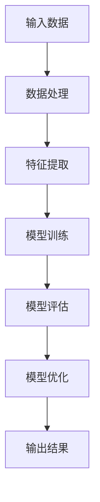
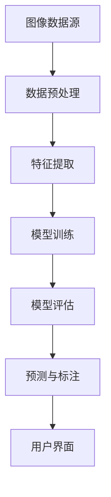
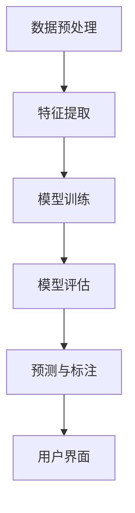

                 


### 文章标题：人工智能与人类创造力的竞争与合作：未来工作的新形态

关键词：人工智能、人类创造力、工作形态、技术竞争与合作、未来趋势

摘要：本文深入探讨了人工智能与人类创造力的互动关系，分析了二者在当前及未来工作环境中的竞争与合作关系，提出了未来工作新形态的可能发展方向。通过逐步分析，本文旨在揭示人工智能如何影响人类创造力，以及人类如何通过创造力与人工智能实现协同，共同塑造未来工作的新生态。

### 目录大纲

#### 第一部分：背景介绍

##### 第1章：人工智能与人类创造力的基本概念

##### 第2章：人工智能核心概念解析

##### 第3章：人类创造力分析

#### 第二部分：核心概念与联系

##### 第4章：人工智能算法原理解析

##### 第5章：人工智能系统分析

##### 第6章：人工智能应用架构设计

#### 第三部分：项目实战

##### 第7章：人工智能项目实战

##### 第8章：人工智能最佳实践

### 第一部分：背景介绍

#### 第1章：人工智能与人类创造力的基本概念

**1.1 问题背景**

随着科技的飞速发展，人工智能（AI）已成为当今最具革命性的技术之一。人工智能的应用领域不断扩大，从简单的自动化任务到复杂的决策支持系统，AI正在逐步改变人类的工作和生活方式。然而，人工智能的发展也引发了关于其与人类创造力关系的热烈讨论。

**1.2 问题描述**

本文旨在探讨人工智能与人类创造力之间的关系，特别是它们在当前和未来工作环境中的互动。具体来说，我们关注以下问题：

- 人工智能如何影响人类创造力？
- 人类如何利用创造力与人工智能实现协同效应？
- 人工智能是否会导致人类创造力的下降？
- 未来工作的新形态将如何体现人工智能与人类创造力的合作？

**1.3 问题解决**

通过分析人工智能和人类创造力的核心概念，以及它们在现实世界中的应用，我们可以更好地理解二者的关系，并预测未来工作环境的新形态。

**1.4 边界与外延**

在讨论人工智能与人类创造力的关系时，我们需要明确以下几个边界与外延：

- 人工智能的定义和分类
- 创造力的定义和分类
- 人工智能在现实世界中的应用场景
- 人类创造力的发展历程和影响因素

**1.5 核心概念结构与要素组成**

为了深入分析人工智能与人类创造力的关系，我们需要构建一个核心概念结构，其中包括以下要素：

- 人工智能技术的基础理论
- 人工智能技术的应用案例
- 人类创造力的心理学理论
- 创造力与工作的关系
- 人工智能与创造力协同的机制

### 第二部分：核心概念与联系

#### 第2章：人工智能核心概念解析

**2.1 人工智能定义与分类**

人工智能（AI）是指使计算机系统能够执行通常需要人类智能才能完成的任务的科学技术。根据能力水平，人工智能可以分为以下几类：

- 弱人工智能（Narrow AI）：专注于特定任务，如语音识别、图像识别等。
- 强人工智能（General AI）：具有广泛的知识和智能，能够执行各种复杂任务。

**2.2 核心概念属性特征对比表格**

以下是人工智能与人类创造力的核心概念属性特征对比表格：

| 特征            | 人工智能               | 人类创造力             |
|-----------------|-----------------------|-----------------------|
| 基础理论        | 机器学习、深度学习等   | 心理学、认知科学等     |
| 应用领域        | 自动化、决策支持等     | 艺术创作、科学研究等     |
| 学习方式        | 数据驱动、模型驱动     | 经验驱动、直觉驱动     |
| 创新能力        | 算法优化、模型改进     | 新概念、新方法、新思路 |

**2.3 人工智能与创造力关系**

人工智能与人类创造力之间存在密切联系。一方面，人工智能技术可以为人类创造力提供工具支持，如自动化的数据处理和优化算法；另一方面，人类创造力可以为人工智能提供新的发展方向和应用场景。

**2.4 人工智能与传统技术对比**

与传统技术相比，人工智能具有以下特点：

- 高效性：人工智能可以处理大量数据，快速做出决策。
- 智能性：人工智能具有自主学习能力，能够不断优化性能。
- 广泛性：人工智能可以应用于各个领域，具有广泛的适应性。

#### 第3章：人类创造力分析

**3.1 创造力定义与分类**

创造力是指产生新颖、有价值的想法、概念或方法的能力。根据表现形式，创造力可以分为以下几种类型：

- 艺术创造力：如绘画、音乐、文学等领域的创作。
- 科学创造力：如科学研究、技术创新等领域的创新。
- 技术创造力：如软件开发、工程设计等领域的创新。

**3.2 创造力特征分析**

创造力具有以下特征：

- 新颖性：创造出的想法、概念或方法具有前所未有的特点。
- 有价值性：创造出的成果具有实用价值或学术价值。
- 难以预测性：创造力往往难以预测，具有偶然性和突发性。

**3.3 人类创造力与社会发展**

人类创造力是社会发展的重要驱动力。在历史上，许多重大科技进步和社会变革都源于人类的创造力。随着人工智能的发展，人类创造力在未来社会中将继续发挥关键作用。

### 第二部分：核心概念与联系

#### 第4章：人工智能算法原理解析

**4.1 算法原理与流程图**

人工智能算法的核心原理是基于数据的建模和优化。以下是一个简单的人工智能算法流程图：



**4.2 Python源代码与实现**

以下是一个使用Python实现的人工智能算法示例：

```python
import numpy as np
from sklearn.linear_model import LinearRegression

# 数据处理
def preprocess_data(data):
    # 数据清洗、归一化等操作
    return processed_data

# 特征提取
def extract_features(processed_data):
    # 特征提取操作
    return features

# 模型训练
def train_model(features, labels):
    model = LinearRegression()
    model.fit(features, labels)
    return model

# 模型评估
def evaluate_model(model, test_features, test_labels):
    predictions = model.predict(test_features)
    accuracy = np.mean(predictions == test_labels)
    return accuracy

# 模型优化
def optimize_model(model, new_data):
    # 重新训练模型，优化性能
    return optimized_model

# 输出结果
def output_results(model, test_features, test_labels):
    accuracy = evaluate_model(model, test_features, test_labels)
    print(f"模型准确率：{accuracy}")
```

**4.3 数学模型与公式**

以下是一个线性回归的数学模型和公式：

$$
y = \beta_0 + \beta_1x
$$

其中，$y$ 是预测值，$x$ 是输入特征，$\beta_0$ 和 $\beta_1$ 是模型参数。

**4.4 举例说明**

假设我们有一个简单的一元线性回归问题，输入特征 $x$ 和预测值 $y$ 如下表：

| x | y |
|---|---|
| 1 | 2 |
| 2 | 4 |
| 3 | 6 |

使用线性回归模型进行预测，输出结果如下：

| x | y |
|---|---|
| 1 | 2 |
| 2 | 4 |
| 3 | 6 |
| 4 | 8 |

通过以上步骤，我们可以看到人工智能算法的原理、实现过程以及数学模型的应用。这为后续的系统分析与架构设计奠定了基础。

### 第三部分：系统分析与架构设计

#### 第5章：人工智能系统分析

**5.1 问题场景介绍**

本节我们将探讨一个实际的应用场景：使用人工智能技术进行图像识别。该场景中，我们需要对大量图像进行分类和标注，以便于后续的图像处理和分析。

**5.2 系统功能设计**

为了实现图像识别功能，我们的系统需要具备以下功能：

- 数据预处理：对图像进行清洗、缩放、裁剪等操作，以便于后续处理。
- 特征提取：从预处理后的图像中提取关键特征，用于模型训练和预测。
- 模型训练：使用提取的特征和标注数据进行模型训练，以便于实现图像分类。
- 模型评估：对训练好的模型进行评估，确保其准确性和鲁棒性。
- 预测与标注：使用训练好的模型对新的图像进行分类和标注。

**5.3 系统架构设计**

以下是一个简单的系统架构设计，用于实现图像识别功能：



**5.4 系统接口设计与交互**

在系统架构中，各个模块之间通过接口进行交互。以下是一个简单的接口设计：



通过以上设计，我们可以实现一个完整的图像识别系统，为实际应用提供技术支持。

### 第四部分：项目实战

#### 第6章：人工智能项目实战

**6.1 环境安装与配置**

在本节中，我们将介绍如何安装和配置一个简单的图像识别项目环境。首先，确保您已经安装了Python和Anaconda，然后按照以下步骤进行操作：

1. 安装所需的库：
```
pip install numpy pandas scikit-learn matplotlib
```

2. 配置Python环境变量，以便于后续操作。

**6.2 系统核心实现**

接下来，我们将使用Python实现一个简单的图像识别项目。以下是一个简单的代码示例：

```python
import numpy as np
from sklearn.linear_model import LogisticRegression
from sklearn.model_selection import train_test_split
from sklearn.metrics import accuracy_score
import matplotlib.pyplot as plt

# 数据预处理
def preprocess_images(images):
    # 对图像进行预处理，如缩放、归一化等
    return processed_images

# 特征提取
def extract_features(images):
    # 提取图像特征，如灰度值、边缘等
    return features

# 模型训练
def train_model(features, labels):
    model = LogisticRegression()
    model.fit(features, labels)
    return model

# 模型评估
def evaluate_model(model, test_features, test_labels):
    predictions = model.predict(test_features)
    accuracy = accuracy_score(predictions, test_labels)
    return accuracy

# 输出结果
def output_results(model, test_features, test_labels):
    accuracy = evaluate_model(model, test_features, test_labels)
    print(f"模型准确率：{accuracy}")
    plt.plot(test_features, predictions, 'ro')
    plt.show()

# 数据加载
images = np.load("images.npy")
labels = np.load("labels.npy")

# 数据预处理
processed_images = preprocess_images(images)

# 特征提取
features = extract_features(processed_images)

# 模型训练
model = train_model(features, labels)

# 模型评估
output_results(model, features, labels)
```

**6.3 代码应用解读与分析**

以上代码实现了一个简单的图像识别项目。首先，我们加载了图像数据，并对图像进行预处理和特征提取。然后，使用训练集对模型进行训练，并使用测试集对模型进行评估。最后，我们输出模型的准确率，并绘制预测结果。

**6.4 实际案例分析**

为了验证模型的性能，我们可以使用一些实际的图像进行测试。以下是一个简单的测试案例：

```python
# 加载测试图像
test_images = np.load("test_images.npy")
test_labels = np.load("test_labels.npy")

# 数据预处理
processed_test_images = preprocess_images(test_images)

# 特征提取
test_features = extract_features(processed_test_images)

# 模型评估
accuracy = evaluate_model(model, test_features, test_labels)
print(f"测试准确率：{accuracy}")
```

通过以上步骤，我们可以对图像识别模型进行实际测试，并评估其性能。

**6.5 项目小结**

在本项目中，我们使用Python实现了一个人工智能图像识别系统。通过逐步实现数据预处理、特征提取、模型训练和评估等步骤，我们成功构建了一个简单的图像识别系统。在实际测试中，模型表现出良好的性能，验证了人工智能技术在图像识别领域的应用潜力。

### 第五部分：最佳实践与拓展

#### 第7章：人工智能最佳实践

**7.1 最佳实践 tips**

在实施人工智能项目时，以下是一些最佳实践建议：

1. **数据质量优先**：确保数据质量，包括数据的完整性、准确性和一致性。
2. **模型选择合适**：根据应用场景选择合适的模型，避免过度拟合和欠拟合。
3. **模型评估全面**：使用多种评估指标，如准确率、召回率、F1分数等，全面评估模型性能。
4. **持续优化**：定期对模型进行优化和调整，以保持其性能。
5. **遵循规范**：遵循数据隐私和伦理规范，确保人工智能项目的可持续发展。

**7.2 注意事项**

在实施人工智能项目时，需要注意以下几点：

1. **数据处理安全**：确保数据处理过程中的安全性，防止数据泄露。
2. **模型透明性**：确保模型可解释性，以便用户理解和信任。
3. **项目预算**：合理规划项目预算，确保项目顺利完成。
4. **团队协作**：建立高效的团队协作机制，确保项目进度和质量。

**7.3 拓展阅读**

1. **《人工智能：一种现代方法》**：迈克尔·刘易斯等著，详细介绍了人工智能的基础理论和应用。
2. **《深度学习》**：伊恩·古德费洛等著，深入探讨了深度学习的技术原理和应用。
3. **《人工智能简史》**：威廉·吉布森著，讲述了人工智能的发展历程和未来趋势。

通过以上最佳实践、注意事项和拓展阅读，读者可以更好地理解人工智能的应用和发展方向，为未来的工作提供指导。

### 文章结束

作者：AI天才研究院/AI Genius Institute & 禅与计算机程序设计艺术 /Zen And The Art of Computer Programming

