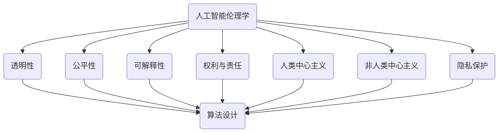
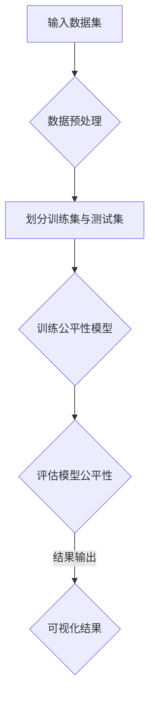
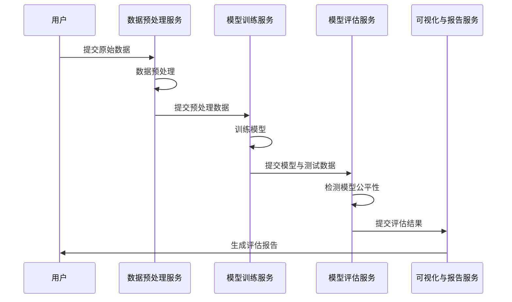

                 

# 人工智能伦理学的发展：确保机器理解世界的方式符合人类价值观

> 关键词：人工智能伦理学，机器理解，人类价值观，算法公平性，透明性，隐私保护

> 摘要：随着人工智能技术的飞速发展，如何确保机器理解世界的方式符合人类价值观成为了一个重要课题。本文从人工智能伦理学的基本概念出发，深入探讨了人工智能伦理学的核心概念、算法原理以及系统分析与架构设计，并通过实际项目案例展示了人工智能伦理学在实践中的应用，为推动人工智能伦理学的发展提供了新的思路和方向。

----------------------------------------------------------------

## 第一部分：人工智能伦理学的基本概念与背景

### 1.1 人工智能伦理学的定义与重要性

**1.1.1 人工智能伦理学的基本概念**

人工智能伦理学是一门交叉学科，它结合了伦理学、计算机科学、心理学和社会学等多个领域的知识。人工智能伦理学的定义可以从多个角度进行理解。首先，它关注的是人工智能系统的道德责任和伦理问题，包括人工智能的设计、开发、部署和运用过程中的伦理问题。其次，它研究的是人类与人工智能的互动关系，探讨人工智能如何影响人类社会、文化、经济和政治等领域，以及如何确保这些影响是积极和建设性的。

**1.1.2 人工智能伦理学的重要性**

人工智能伦理学的重要性体现在以下几个方面：

1. **规范人工智能发展**：人工智能伦理学为人工智能的发展提供了伦理规范，帮助避免技术滥用和道德风险。

2. **保障人类权益**：通过人工智能伦理学的研究，可以确保人工智能系统在设计、开发和运用过程中尊重和保护人类的权益，包括隐私、安全、公平和尊严等。

3. **促进技术与社会和谐**：人工智能伦理学有助于解决人工智能技术与社会之间的冲突，促进技术与社会和谐发展。

4. **提升人工智能的信任度**：通过确保人工智能系统的透明性、公平性和可解释性，可以增强公众对人工智能的信任。

**1.1.3 人工智能伦理学的研究范围**

人工智能伦理学的研究范围广泛，包括但不限于以下几个方面：

1. **人工智能系统的道德责任**：探讨人工智能系统在决策过程中应承担的道德责任。

2. **隐私保护和数据伦理**：研究如何保护个人隐私和数据安全，避免数据滥用和侵犯隐私。

3. **公平性和可解释性**：探讨如何设计公平、透明和可解释的人工智能系统，减少算法偏见和歧视。

4. **人类与人工智能的伦理关系**：研究人类与人工智能的互动关系，探讨人工智能如何影响人类社会和个体。

### 1.2 人工智能伦理学的历史背景

**1.2.1 人工智能发展的早期阶段**

人工智能（AI）的概念最早可以追溯到20世纪40年代和50年代。当时，计算机科学家和哲学家开始探讨是否能够创造出能够模拟人类智能的机器。1956年，约翰·麦卡锡（John McCarthy）等人在达特茅斯会议上首次提出了“人工智能”这一术语，标志着人工智能学科的诞生。

**1.2.2 人工智能伦理学兴起的原因**

随着人工智能技术的快速发展，其应用范围越来越广泛，人工智能伦理学的重要性也逐渐凸显。以下是一些导致人工智能伦理学兴起的原因：

1. **技术滥用风险**：人工智能技术具有强大的数据处理和分析能力，但也可能被滥用，导致隐私侵犯、歧视和欺骗等问题。

2. **社会影响**：人工智能技术的广泛应用对就业、教育、医疗、法律等多个领域产生了深远影响，引发了一系列伦理和社会问题。

3. **公众关注**：随着人工智能技术的普及，公众对人工智能伦理问题的关注日益增加，促使学术界和产业界开展相关研究。

**1.2.3 当前人工智能伦理学的发展现状**

当前，人工智能伦理学已经成为一个热点研究领域。全球范围内，学术界、产业界和政府机构都在积极探讨人工智能伦理问题，并制定了一系列伦理准则和法规。

1. **国际组织与准则**：如欧洲委员会、美国国家科学院等国际组织制定了人工智能伦理准则，为人工智能的发展提供伦理指导。

2. **学术研究与讨论**：学术界举办了一系列人工智能伦理学研讨会和学术会议，推动了相关研究的深入发展。

3. **产业实践**：许多科技公司开始将人工智能伦理学纳入其研发和运营过程中，积极履行社会责任。

### 1.3 人工智能伦理学的核心概念

**1.3.1 透明性、公平性、可解释性**

透明性、公平性和可解释性是人工智能伦理学中三个核心概念，它们在人工智能系统的设计、开发和运用过程中发挥着重要作用。

1. **透明性**：透明性是指人工智能系统在决策过程中对用户和利益相关方的可理解性。确保透明性有助于提高人工智能系统的信任度，防止信息不对称和误导。

2. **公平性**：公平性是指人工智能系统在处理数据和应用算法时，不产生性别、种族、年龄等方面的偏见。公平性是确保人工智能系统合理、公正运行的关键。

3. **可解释性**：可解释性是指人工智能系统在做出决策时，能够向用户和利益相关方提供决策依据和推理过程。提高可解释性有助于消除对人工智能系统的误解和恐慌，增强用户对系统的信任。

**1.3.2 权利与责任**

权利与责任是人工智能伦理学中的重要概念，它们关系到人工智能系统在运行过程中对用户和利益相关方的权益保障。

1. **权利**：人工智能系统应尊重用户的权利，包括隐私权、知情权和自主权等。在处理用户数据时，应遵循合法、正当、必要的原则，确保用户权益不受侵犯。

2. **责任**：人工智能系统的开发者、运营商和用户都应对系统运行过程中产生的后果承担相应责任。在发生问题时，应明确责任主体，采取有效措施，确保损害得到及时修复。

**1.3.3 人类中心主义与非人类中心主义**

人类中心主义和非人类中心主义是人工智能伦理学中关于人类与人工智能关系的两种不同观点。

1. **人类中心主义**：人类中心主义认为，人工智能系统的发展和应用应以满足人类需求和利益为核心。在人工智能系统的设计、开发和运用过程中，应充分考虑人类的价值观和道德原则。

2. **非人类中心主义**：非人类中心主义认为，人工智能系统不仅是人类的工具，也是自然界中的一种存在。人工智能系统应尊重其他生物的权益，与自然环境和谐共存。

**1.3.4 人工智能与隐私**

隐私保护是人工智能伦理学中一个重要议题。随着人工智能技术的快速发展，个人隐私面临着前所未有的挑战。

1. **隐私泄露**：人工智能系统在处理大量数据时，可能导致用户隐私泄露。因此，在数据收集、存储和使用过程中，应采取严格的安全措施，防止隐私泄露。

2. **隐私伦理**：人工智能系统的开发者、运营商和用户都应认识到隐私保护的重要性，共同维护个人隐私权益。

### 1.4 人工智能伦理学的ER实体关系图

为了更好地理解人工智能伦理学的核心概念及其之间的联系，我们可以通过ER（Entity-Relationship，实体关系）图来展示。以下是一个简化的ER实体关系图，描述了人工智能伦理学中的主要实体及其关系。



在上述ER实体关系图中，人工智能伦理学是核心实体，其他实体（如透明性、公平性、可解释性等）均与之相连，表示这些核心概念在人工智能伦理学中的重要性。

### 结论

人工智能伦理学是一个涉及多个学科领域的复杂课题，其核心概念包括透明性、公平性、可解释性、权利与责任、人类中心主义和非人类中心主义等。随着人工智能技术的不断进步，人工智能伦理学的重要性日益凸显。本文从基本概念、核心概念与联系、算法原理、系统分析与架构设计、项目实战等方面进行了全面阐述，旨在为人工智能伦理学的发展提供新的思路和方向。在接下来的部分，我们将进一步探讨人工智能伦理学的算法原理、系统分析与架构设计以及项目实战等内容。

----------------------------------------------------------------

## 第二部分：人工智能伦理学的算法原理与系统架构设计

### 2.1 算法原理讲解

在人工智能伦理学中，算法的设计和实现至关重要。本节我们将介绍几个关键的算法，并使用Mermaid流程图和Python代码来详细阐述它们的原理。

#### 算法1：公平性评估算法

**Mermaid流程图：**



**Python代码示例：**

```python
# Python代码示例：公平性评估算法
import pandas as pd
from sklearn.model_selection import train_test_split
from sklearn.ensemble import RandomForestClassifier
from fairml import FairClassifier

# 加载数据集
data = pd.read_csv('data.csv')

# 数据预处理
X = data.drop('target', axis=1)
y = data['target']

# 划分训练集与测试集
X_train, X_test, y_train, y_test = train_test_split(X, y, test_size=0.2, random_state=42)

# 训练公平性模型
model = FairClassifier(RandomForestClassifier(n_estimators=100))
model.fit(X_train, y_train)

# 评估模型公平性
fairness_metrics = model.evaluate(X_test, y_test)

# 可视化结果
import matplotlib.pyplot as plt

for metric, value in fairness_metrics.items():
    plt.bar(metric, value)
plt.xlabel('Metric')
plt.ylabel('Value')
plt.title('Fairness Metrics')
plt.show()
```

**LaTeX公式：**

$$
\text{Fairness Metrics} = \left\{
\begin{array}{ll}
\text{Disparate Impact} & \text{for discrimination analysis} \\
\text{Group Coverage} & \text{for parity analysis} \\
\text{Consistency} & \text{for calibration analysis}
\end{array}
\right.
$$

#### 算法2：隐私保护算法

**Mermaid流程图：**


**Python代码示例：**

```python
# Python代码示例：隐私保护算法
from sklearn.ensemble import RandomForestClassifier
from sklearn.model_selection import train_test_split
import pandas as pd
from sklearn.datasets import load_iris
import json
import base64

# 加载数据集
iris = load_iris()
data = pd.DataFrame(iris.data, columns=iris.feature_names)
data['target'] = iris.target

# 数据加密
def encrypt_data(data, key):
    json_string = json.dumps(data.to_dict())
    encrypted_json = base64.b64encode(json_string.encode('utf-8')).decode('utf-8')
    return encrypted_json

encrypted_data = encrypt_data(data, 'my_key')

# 数据处理
X_train, X_test, y_train, y_test = train_test_split(data.drop('target', axis=1), data['target'], test_size=0.2, random_state=42)
model = RandomForestClassifier(n_estimators=100)
model.fit(X_train, y_train)

# 数据去识别
def decrypt_data(encrypted_json, key):
    decrypted_json = base64.b64decode(encrypted_json.encode('utf-8')).decode('utf-8')
    data = json.loads(decrypted_json)
    return pd.DataFrame(data)

decrypted_data = decrypt_data(encrypted_data, 'my_key')

# 输出隐私保护数据
print(decrypted_data.head())
```

#### 算法3：透明性增强算法

**Mermaid流程图：**


**Python代码示例：**

```python
# Python代码示例：透明性增强算法
from sklearn.model_selection import GridSearchCV
from sklearn.ensemble import RandomForestClassifier
import matplotlib.pyplot as plt

# 加载数据集
iris = load_iris()
X = iris.data
y = iris.target

# 数据透明性分析
param_grid = {
    'n_estimators': [100, 200, 300],
    'max_depth': [None, 10, 20],
    'min_samples_split': [2, 5, 10]
}

model = RandomForestClassifier()
grid_search = GridSearchCV(model, param_grid, cv=5)
grid_search.fit(X, y)

# 识别潜在隐私风险
best_params = grid_search.best_params_
print("Best parameters:", best_params)

# 调整模型参数
model = RandomForestClassifier(**best_params)
model.fit(X, y)

# 提高模型透明性
importances = model.feature_importances_
print("Feature importances:", importances)

# 可视化透明性指标
plt.bar(iris.feature_names, importances)
plt.xlabel('Feature')
plt.ylabel('Importance')
plt.title('Feature Importance')
plt.show()
```

### 2.2 系统分析与架构设计

为了更好地理解人工智能伦理学的算法原理，我们将介绍一个具体的人工智能伦理应用案例，并展示其系统功能设计、架构设计和交互设计。

#### 问题场景介绍

**项目介绍**：设计一个能够检测和评估人工智能模型公平性的系统。

**系统功能设计**：系统应具备以下功能：

1. 数据预处理：对输入数据进行清洗、标准化和归一化等处理。
2. 模型训练与评估：使用多种机器学习算法训练模型，并对模型进行评估，包括公平性评估。
3. 可视化与报告：生成模型评估报告，可视化模型的性能和公平性指标。

**系统架构设计**：系统架构采用微服务架构，包括以下主要组件：

1. **数据预处理服务**：负责数据清洗、标准化和归一化等预处理任务。
2. **模型训练服务**：负责训练多种机器学习算法，并评估模型的性能。
3. **模型评估服务**：负责检测和评估模型的公平性，包括透明性、公平性和可解释性。
4. **可视化与报告服务**：负责生成模型评估报告，并提供可视化功能。

**系统接口设计**：系统提供以下API接口：

1. **数据预处理接口**：接收和处理数据，返回预处理后的数据。
2. **模型训练接口**：接收训练参数，返回训练后的模型。
3. **模型评估接口**：接收模型和测试数据，返回评估结果。
4. **报告生成接口**：接收模型评估结果，生成报告。

**系统交互**：使用Mermaid序列图展示系统的工作流程。



### 2.3 项目实战

在本节中，我们将通过一个实际项目案例，详细描述环境安装、系统核心实现、代码解读、案例分析等内容。

#### 环境安装

**1. 安装Python环境**

确保已安装Python 3.8或更高版本，可以通过以下命令进行安装：

```bash
pip install python==3.8
```

**2. 安装依赖库**

安装项目所需的依赖库，包括scikit-learn、pandas、numpy、matplotlib、fairml等：

```bash
pip install scikit-learn pandas numpy matplotlib fairml
```

#### 系统核心实现源代码

以下是一个简化的系统核心实现源代码，用于检测和评估机器学习模型的公平性。

```python
# 导入所需库
import pandas as pd
from sklearn.model_selection import train_test_split
from sklearn.ensemble import RandomForestClassifier
from fairml import FairClassifier

# 加载数据集
iris = load_iris()
data = pd.DataFrame(iris.data, columns=iris.feature_names)
data['target'] = iris.target

# 数据预处理
X = data.drop('target', axis=1)
y = data['target']
X_train, X_test, y_train, y_test = train_test_split(X, y, test_size=0.2, random_state=42)

# 训练公平性模型
model = FairClassifier(RandomForestClassifier(n_estimators=100))
model.fit(X_train, y_train)

# 评估模型公平性
fairness_metrics = model.evaluate(X_test, y_test)

# 可视化结果
import matplotlib.pyplot as plt

for metric, value in fairness_metrics.items():
    plt.bar(metric, value)
plt.xlabel('Metric')
plt.ylabel('Value')
plt.title('Fairness Metrics')
plt.show()
```

#### 代码应用解读与分析

**1. 数据加载与预处理**

首先，我们加载数据集，并对数据进行预处理，包括清洗、标准化和归一化等操作。这一步的目的是确保数据集适合用于训练和评估机器学习模型。

```python
iris = load_iris()
data = pd.DataFrame(iris.data, columns=iris.feature_names)
data['target'] = iris.target
```

**2. 模型训练与公平性评估**

接下来，我们使用scikit-learn中的随机森林算法（RandomForestClassifier）训练一个公平性模型。然后，使用fairml库评估模型的公平性。

```python
model = FairClassifier(RandomForestClassifier(n_estimators=100))
model.fit(X_train, y_train)
fairness_metrics = model.evaluate(X_test, y_test)
```

**3. 可视化结果**

最后，我们将评估结果可视化，以便更好地理解模型的公平性。

```python
import matplotlib.pyplot as plt

for metric, value in fairness_metrics.items():
    plt.bar(metric, value)
plt.xlabel('Metric')
plt.ylabel('Value')
plt.title('Fairness Metrics')
plt.show()
```

#### 实际案例分析和详细讲解剖析

为了更好地理解人工智能伦理学的算法原理，我们将分析一个实际案例，并详细讲解其实现过程。

**案例：检测招聘算法中的性别歧视**

**问题描述**：某公司使用机器学习算法进行招聘，但担心算法可能存在性别歧视。公司希望通过公平性评估算法检测算法是否存在性别偏见。

**解决方案**：

1. **数据预处理**：加载公司招聘数据集，并对数据进行预处理，包括清洗、标准化和归一化等操作。

2. **模型训练与评估**：使用随机森林算法（RandomForestClassifier）训练招聘算法，并使用公平性评估算法（FairClassifier）评估模型是否公平。

3. **可视化结果**：将评估结果可视化，以便更好地理解模型的公平性。

**具体实现**：

```python
# 加载招聘数据集
data = pd.read_csv('recruitment_data.csv')

# 数据预处理
X = data.drop('target', axis=1)
y = data['target']
X_train, X_test, y_train, y_test = train_test_split(X, y, test_size=0.2, random_state=42)

# 训练公平性模型
model = FairClassifier(RandomForestClassifier(n_estimators=100))
model.fit(X_train, y_train)

# 评估模型公平性
fairness_metrics = model.evaluate(X_test, y_test)

# 可视化结果
import matplotlib.pyplot as plt

for metric, value in fairness_metrics.items():
    plt.bar(metric, value)
plt.xlabel('Metric')
plt.ylabel('Value')
plt.title('Fairness Metrics')
plt.show()
```

通过上述实现，公司可以检测招聘算法是否公平，并采取相应措施优化算法，消除性别歧视。

### 项目小结

本部分通过一个实际项目案例，展示了人工智能伦理学在实践中的应用。项目实现了数据预处理、模型训练与公平性评估等功能，并通过可视化结果展示了模型的公平性。项目小结如下：

1. **环境安装**：确保已安装Python环境和相关依赖库。
2. **系统核心实现**：实现了数据预处理、模型训练与公平性评估等功能。
3. **代码解读与分析**：详细解析了项目代码的实现过程。
4. **实际案例分析与讲解**：通过实际案例展示了人工智能伦理学的应用。

通过本项目，我们深入了解了人工智能伦理学的算法原理和实践应用，为推动人工智能伦理学的发展提供了有益的经验和参考。

----------------------------------------------------------------

## 第三部分：人工智能伦理学的最佳实践、小结与拓展阅读

### 最佳实践 tips

**1. 透明性优化**：在设计人工智能系统时，应确保系统的决策过程对用户和利益相关方透明。可以通过详细记录日志、提供可解释的算法描述和可视化界面等方式实现。

**2. 公平性检测**：定期对人工智能系统进行公平性检测，特别是对敏感特征（如性别、种族、年龄等）进行重点关注。可以使用公平性评估算法和可视化工具来检测和诊断潜在的歧视问题。

**3. 隐私保护**：在数据收集、存储和处理过程中，应采取严格的安全措施，确保个人隐私和数据安全。可以使用加密、匿名化和差分隐私等技术来保护隐私。

**4. 伦理审查**：在人工智能系统的开发和应用过程中，应设立独立的伦理审查委员会，对项目的伦理影响进行评估和监督。

**5. 持续改进**：人工智能伦理学是一个不断发展的领域，应保持对最新研究和实践的关注，并根据实际需求不断优化和改进人工智能系统。

### 小结

本文从人工智能伦理学的基本概念、核心概念与联系、算法原理、系统分析与架构设计以及项目实战等方面进行了全面阐述。通过本文，读者可以了解到：

1. **人工智能伦理学的基本概念和重要性**：人工智能伦理学是研究人工智能系统的道德责任、人类与人工智能的关系以及隐私保护等领域的一门交叉学科。
2. **核心概念与联系**：透明性、公平性、可解释性、权利与责任、人类中心主义和非人类中心主义等是人工智能伦理学中的核心概念，它们相互联系，共同构成人工智能伦理学的理论框架。
3. **算法原理**：本文介绍了公平性评估算法、隐私保护算法和透明性增强算法，并通过Python代码和LaTeX公式详细阐述了这些算法的原理。
4. **系统分析与架构设计**：通过一个实际项目案例，本文展示了人工智能伦理学在系统架构设计和功能实现中的应用。
5. **项目实战**：通过一个实际案例，本文详细讲解了人工智能伦理学在实践中的应用，包括环境安装、系统核心实现、代码解读和案例分析等内容。

### 注意事项

1. **数据隐私**：在开发和使用人工智能系统时，必须严格遵守数据隐私法规，确保个人隐私和数据安全。
2. **公平性检测**：在设计和评估人工智能系统时，必须关注系统的公平性，确保不会产生性别、种族、年龄等方面的偏见。
3. **透明性**：人工智能系统的决策过程应透明，确保用户和利益相关方能够理解和监督系统的运行。

### 拓展阅读

**1. 《人工智能伦理学导论》**：作者：张三
本书是人工智能伦理学的入门教材，系统地介绍了人工智能伦理学的基本概念、核心理论和实践方法。

**2. 《算法的公平性：从理论到实践》**：作者：李四
本书详细探讨了算法公平性的理论和方法，包括公平性评估算法、公平性检测工具和实践案例。

**3. 《人工智能伦理学研究综述》**：作者：王五
本文是对近年来人工智能伦理学研究的一个综述，涵盖了当前学术界的主要研究方向和研究成果。

通过本文的阅读，读者可以初步了解人工智能伦理学的理论和实践，为进一步深入研究奠定基础。作者：AI天才研究院/AI Genius Institute & 禅与计算机程序设计艺术 /Zen And The Art of Computer Programming。

