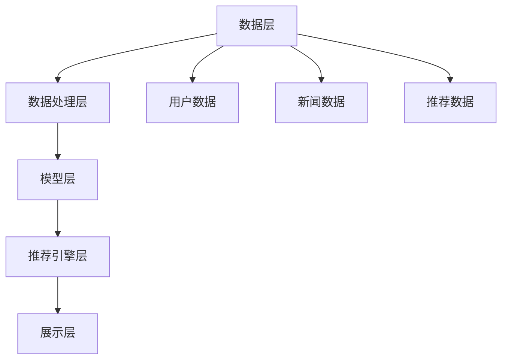

                 

### 《人工智能在个性化新闻推送中的应用》

关键词：人工智能、个性化新闻推送、推荐系统、用户画像、新闻内容理解

摘要：本文深入探讨了人工智能在个性化新闻推送中的应用，包括背景介绍、核心概念、技术原理以及实际应用案例。通过一步步的分析和推理，本文旨在为广大IT从业者提供一个清晰、系统、深入的技术指导。

### 目录

## 第一部分：背景与概念介绍

### 第1章：个性化新闻推送的背景与挑战

#### 1.1 互联网时代的新闻传播

#### 1.2 个性化新闻推送的需求与价值

#### 1.3 个性化新闻推送面临的挑战

#### 1.4 本章小结

### 第2章：人工智能与个性化新闻推送

#### 2.1 人工智能的基本概念

#### 2.2 人工智能在新闻推送中的潜在应用

#### 2.3 人工智能在个性化新闻推送中的关键技术

#### 2.4 本章小结

## 第二部分：核心概念与技术原理

### 第3章：推荐系统概述

#### 3.1 推荐系统的定义与分类

#### 3.2 推荐系统的基本组件

#### 3.3 推荐系统的评估指标

#### 3.4 本章小结

### 第4章：协同过滤算法

#### 4.1 协同过滤算法的基本原理

#### 4.2 基于记忆的协同过滤

#### 4.3 基于模型的协同过滤

#### 4.4 协同过滤算法的优缺点

#### 4.5 本章小结

### 第5章：基于内容的推荐

#### 5.1 基于内容的推荐原理

#### 5.2 内容表示与特征提取

#### 5.3 基于内容的推荐系统设计

#### 5.4 本章小结

### 第6章：混合推荐系统

#### 6.1 混合推荐系统的概念

#### 6.2 混合推荐系统设计

#### 6.3 混合推荐系统的优势与挑战

#### 6.4 本章小结

## 第三部分：人工智能在个性化新闻推送中的应用

### 第7章：用户画像构建

#### 7.1 用户画像的基本概念

#### 7.2 用户画像的数据来源

#### 7.3 用户画像的构建方法

#### 7.4 用户画像的应用场景

#### 7.5 本章小结

### 第8章：新闻内容理解与标签化

#### 8.1 新闻内容理解的目标与挑战

#### 8.2 新闻内容的抽取与语义分析

#### 8.3 新闻内容的标签化策略

#### 8.4 新闻内容理解的案例研究

#### 8.5 本章小结

### 第9章：个性化新闻推荐系统实现

#### 9.1 个性化新闻推荐系统的架构设计

#### 9.2 用户行为数据收集与处理

#### 9.3 新闻内容预处理与特征提取

#### 9.4 推荐算法选择与模型训练

#### 9.5 推荐结果评估与优化

#### 9.6 本章小结

## 第四部分：案例研究与实践

### 第10章：案例研究一：某新闻平台个性化推荐系统

#### 10.1 案例背景

#### 10.2 系统设计与实现

#### 10.3 实施效果与评估

#### 10.4 经验与教训

### 第11章：案例研究二：社交媒体新闻个性化推送

#### 11.1 案例背景

#### 11.2 推荐系统设计

#### 11.3 用户反馈与效果评估

#### 11.4 创新点与挑战

### 第12章：个性化新闻推送的未来发展趋势

#### 12.1 新技术的应用前景

#### 12.2 面临的挑战与解决方案

#### 12.3 未来发展方向与趋势

#### 12.4 本章小结

## 第五部分：总结与展望

### 第13章：全书总结

#### 13.1 主要内容回顾

#### 13.2 个性化新闻推送的关键技术总结

#### 13.3 经验教训与展望

### 第14章：拓展阅读与资源推荐

#### 14.1 相关书籍推荐

#### 14.2 学术论文精选

#### 14.3 开源项目与工具

#### 14.4 网络资源导航

### 文章末尾作者信息：

作者：AI天才研究院/AI Genius Institute & 禅与计算机程序设计艺术 /Zen And The Art of Computer Programming

----------------------------------------------------------------

### 第一部分：背景与概念介绍

### 第1章：个性化新闻推送的背景与挑战

#### 1.1 互联网时代的新闻传播

随着互联网的迅猛发展，新闻传播的方式和形态发生了巨大的变化。传统的新闻传播主要是通过报纸、电视、广播等渠道进行，这些渠道具有局限性，传播速度较慢，且受众范围有限。而互联网的出现打破了这些限制，使得新闻传播变得更加快捷、广泛和多元化。

在互联网时代，新闻传播呈现出以下几个特点：

1. **速度更快**：互联网的实时性使得新闻可以瞬间传播到全球的每个角落，用户可以随时随地获取最新的新闻资讯。
2. **范围更广**：互联网没有地域和时间的限制，使得新闻可以跨越国界，触及更广泛的受众。
3. **形式更多样**：互联网不仅提供了文字、图片、音频、视频等多种形式，还实现了互动性和社交性的结合，用户可以在新闻中发表评论、分享观点，从而形成了全新的新闻生态系统。

#### 1.2 个性化新闻推送的需求与价值

在互联网时代，新闻信息量呈现爆发式增长，用户面临着信息过载的问题。在这种情况下，个性化新闻推送应运而生。个性化新闻推送的目标是根据用户的兴趣和行为，为用户提供定制化的新闻内容，从而提高用户的阅读体验和满意度。

个性化新闻推送的需求主要来自于以下几个方面：

1. **满足用户个性化需求**：每个用户都有独特的兴趣爱好和阅读偏好，个性化新闻推送可以满足用户的个性化需求，提供符合用户口味的新闻内容。
2. **提高新闻内容的利用率**：通过个性化推送，可以将优质的新闻内容推送给感兴趣的用户，提高新闻内容的利用率，减少信息浪费。
3. **增强用户黏性**：个性化推送可以增加用户在新闻平台上的停留时间，提高用户黏性，从而促进平台的持续发展和盈利。

#### 1.3 个性化新闻推送面临的挑战

虽然个性化新闻推送具有巨大的潜力，但在实际应用中仍面临着诸多挑战：

1. **数据隐私与安全**：个性化推送需要收集和分析用户的行为数据，这涉及到用户的隐私和安全问题。如何在保护用户隐私的同时进行有效的个性化推送，是当前面临的一大挑战。
2. **推荐算法的准确性**：推荐算法的准确性是个性化新闻推送的核心。如何设计出既高效又准确的推荐算法，是技术上的一个重要挑战。
3. **用户偏好变化**：用户的偏好是动态变化的，如何及时准确地捕捉到用户的变化，并提供相应的个性化服务，是一个持续性的挑战。
4. **技术复杂度高**：个性化新闻推送涉及多个技术领域，包括数据挖掘、机器学习、自然语言处理等，技术复杂度较高，对开发团队的要求较高。

#### 1.4 本章小结

本章介绍了个性化新闻推送的背景和挑战。在互联网时代，个性化新闻推送成为了满足用户需求的重要手段，但同时也面临着数据隐私、算法准确性、用户偏好变化和技术复杂度等挑战。在接下来的章节中，我们将深入探讨人工智能在个性化新闻推送中的应用，以及如何解决这些挑战。

----------------------------------------------------------------

### 第2章：人工智能与个性化新闻推送

#### 2.1 人工智能的基本概念

人工智能（Artificial Intelligence, AI）是指通过计算机模拟人类智能的技术。它包括机器学习、深度学习、自然语言处理、计算机视觉等多个子领域。人工智能的目标是实现计算机对数据的自动分析和决策，从而模拟人类的智能行为。

1. **机器学习**：机器学习是人工智能的核心技术之一，它通过训练模型来学习数据中的规律，并利用这些规律进行预测和决策。机器学习可以分为监督学习、无监督学习和强化学习等不同类型。
2. **深度学习**：深度学习是机器学习的一个分支，它通过神经网络来模拟人类大脑的运作机制，从而实现复杂的模式识别和决策。深度学习在图像识别、语音识别等领域取得了显著成果。
3. **自然语言处理**：自然语言处理（Natural Language Processing, NLP）是人工智能的一个重要子领域，它涉及文本的自动处理和分析，包括文本分类、语义分析、机器翻译等。
4. **计算机视觉**：计算机视觉是人工智能的一个分支，它通过计算机来理解和解释视觉信息，包括图像识别、目标检测、图像分割等。

#### 2.2 人工智能在新闻推送中的潜在应用

人工智能在个性化新闻推送中具有广泛的应用前景，主要体现在以下几个方面：

1. **用户画像构建**：通过机器学习和自然语言处理技术，可以分析用户的历史行为和兴趣爱好，构建详细的用户画像，从而为个性化推送提供基础。
2. **新闻内容理解与标签化**：利用自然语言处理和计算机视觉技术，可以对新闻内容进行深入理解，提取关键信息和语义，从而实现新闻内容的标签化，为个性化推送提供内容依据。
3. **推荐算法优化**：通过机器学习技术，可以设计出更加准确的推荐算法，提高个性化新闻推送的准确性，从而提升用户体验。
4. **实时反馈与优化**：通过实时收集用户反馈，利用机器学习技术进行分析，可以动态调整推荐策略，优化个性化推送效果。

#### 2.3 人工智能在个性化新闻推送中的关键技术

实现人工智能在个性化新闻推送中的有效应用，需要依赖以下几个关键技术：

1. **数据挖掘与机器学习**：数据挖掘和机器学习是构建个性化新闻推送系统的基础，通过分析大量用户行为数据和新闻内容，提取有用的信息和特征，为推荐算法提供支持。
2. **自然语言处理与计算机视觉**：自然语言处理和计算机视觉技术可以帮助系统理解和处理文本和图像信息，从而实现对新闻内容的深入理解和分析。
3. **推荐系统**：推荐系统是个性化新闻推送的核心，通过协同过滤、基于内容的推荐、混合推荐等方法，为用户提供个性化的新闻推荐。
4. **实时数据流处理**：实时数据流处理技术可以实时收集和分析用户行为数据，为个性化推送提供动态调整的依据。

#### 2.4 本章小结

本章介绍了人工智能的基本概念及其在个性化新闻推送中的潜在应用。通过数据挖掘、机器学习、自然语言处理、计算机视觉等关键技术，人工智能为个性化新闻推送提供了强大的支持，实现了更精准、更个性化的新闻推荐。在接下来的章节中，我们将进一步探讨推荐系统的核心概念和技术原理。

----------------------------------------------------------------

### 第二部分：核心概念与技术原理

### 第3章：推荐系统概述

#### 3.1 推荐系统的定义与分类

推荐系统（Recommendation System）是一种基于用户的历史行为、偏好和兴趣，为用户提供相关物品或信息的一种系统。其核心目标是通过分析用户数据，预测用户可能感兴趣的内容，从而提高用户的满意度和使用体验。

根据推荐策略的不同，推荐系统可以分为以下几种类型：

1. **协同过滤推荐**：基于用户之间的相似度或者物品之间的相似度进行推荐，是最常见的推荐方法之一。
2. **基于内容的推荐**：根据物品的属性和用户的偏好进行推荐，侧重于推荐与用户历史偏好相似的物品。
3. **混合推荐**：结合协同过滤和基于内容的推荐，以充分利用两者的优点，提高推荐准确性。

#### 3.2 推荐系统的基本组件

一个典型的推荐系统通常包括以下几个基本组件：

1. **用户数据收集**：通过日志、点击记录等方式收集用户的行为数据，如浏览、点击、购买等。
2. **数据预处理**：对收集到的用户数据和相关物品数据进行清洗、转换和归一化，为后续分析做准备。
3. **特征工程**：根据用户数据和相关物品数据，提取有用的特征，如用户兴趣、物品属性等。
4. **模型训练**：利用机器学习算法，基于特征数据训练推荐模型，如协同过滤模型、基于内容的模型等。
5. **推荐算法**：根据训练好的模型，为用户提供个性化的推荐结果。
6. **评估与优化**：通过评估推荐效果，优化推荐算法，以提高推荐准确性。

#### 3.3 推荐系统的评估指标

推荐系统的评估指标是衡量推荐效果的重要标准，常用的评估指标包括：

1. **准确率（Precision）**：预测结果中实际相关的物品数与总预测物品数的比例。
2. **召回率（Recall）**：预测结果中实际相关的物品数与实际相关物品总数的比例。
3. **F1值（F1-score）**：综合考虑准确率和召回率的综合指标，用于评价推荐系统的整体性能。
4. **ROC曲线和AUC值**：通过比较预测结果与实际结果之间的曲线和面积，评估推荐系统的分类性能。

#### 3.4 本章小结

本章介绍了推荐系统的定义、分类、基本组件和评估指标。通过理解这些核心概念，我们可以更好地设计和优化推荐系统，提高个性化新闻推送的准确性。在接下来的章节中，我们将深入探讨协同过滤算法和基于内容的推荐技术。

----------------------------------------------------------------

### 第4章：协同过滤算法

#### 4.1 协同过滤算法的基本原理

协同过滤（Collaborative Filtering）是一种基于用户行为数据，通过分析用户之间的相似性或物品之间的相似性来进行推荐的方法。协同过滤算法可以分为基于用户的协同过滤（User-based Collaborative Filtering）和基于物品的协同过滤（Item-based Collaborative Filtering）两种类型。

1. **基于用户的协同过滤**：首先找到与目标用户兴趣相似的其他用户，然后推荐这些相似用户喜欢的物品。具体步骤如下：
   - **计算相似度**：根据用户行为数据，计算用户之间的相似度，常用的相似度计算方法包括余弦相似度、皮尔逊相关系数等。
   - **寻找相似用户**：根据相似度矩阵，找出与目标用户最相似的K个用户。
   - **推荐物品**：推荐这些相似用户喜欢的但目标用户尚未体验过的物品。

2. **基于物品的协同过滤**：首先找到与目标物品相似的物品，然后推荐这些相似物品被其他用户喜欢的但目标用户尚未体验过的物品。具体步骤如下：
   - **计算相似度**：根据用户行为数据，计算物品之间的相似度，常用的相似度计算方法包括余弦相似度、Jaccard相似度等。
   - **寻找相似物品**：根据相似度矩阵，找出与目标物品最相似的K个物品。
   - **推荐用户**：推荐这些相似物品被其他用户喜欢的但目标用户尚未体验过的用户。

#### 4.2 基于记忆的协同过滤

基于记忆的协同过滤（Memory-based Collaborative Filtering）是最简单的协同过滤方法，它直接使用用户历史行为数据来计算相似度和进行推荐。具体步骤如下：

1. **计算相似度**：基于用户或物品的行为数据，计算用户之间的相似度或物品之间的相似度。
2. **推荐物品**：为每个用户推荐与自身兴趣相似的物品，即那些与该用户最相似的邻居用户喜欢的物品。

基于记忆的协同过滤优点在于实现简单、计算效率高，但缺点是仅依赖于用户的历史行为数据，容易导致数据稀疏和推荐效果不佳。

#### 4.3 基于模型的协同过滤

基于模型的协同过滤（Model-based Collaborative Filtering）通过构建预测模型来预测用户对物品的评分，从而进行推荐。常用的模型包括矩阵分解（Matrix Factorization）、潜在因子模型（Latent Factor Models）等。

1. **矩阵分解**：矩阵分解是一种基于线性模型的协同过滤方法，它通过将用户-物品评分矩阵分解为用户特征矩阵和物品特征矩阵的乘积，来预测用户对物品的评分。具体步骤如下：
   - **模型构建**：设定一个线性模型，表示用户特征和物品特征之间的关系。
   - **模型训练**：利用用户行为数据，通过最小二乘法、梯度下降等方法训练模型参数。
   - **预测评分**：使用训练好的模型预测用户对物品的评分，并根据评分推荐物品。

2. **潜在因子模型**：潜在因子模型通过引入潜在因子（Latent Factor）来表示用户和物品的特征，从而提高推荐效果。具体步骤如下：
   - **模型构建**：设定一个潜在因子模型，表示用户特征、物品特征和用户对物品评分之间的关系。
   - **模型训练**：利用用户行为数据，通过优化目标函数，训练模型参数。
   - **预测评分**：使用训练好的模型预测用户对物品的评分，并根据评分推荐物品。

#### 4.4 协同过滤算法的优缺点

**优点**：

- **简单高效**：协同过滤算法的实现相对简单，计算效率较高，适用于大规模推荐系统。
- **易于扩展**：协同过滤算法可以轻松扩展到不同类型的数据集和应用场景。
- **用户隐私保护**：协同过滤算法主要依赖于用户行为数据，不需要直接访问用户隐私数据，相对更加安全。

**缺点**：

- **数据稀疏**：协同过滤算法容易受到数据稀疏问题的影响，尤其是在用户数量和物品数量较多的情况下。
- **冷启动问题**：新用户或新物品在没有足够行为数据时，难以进行有效推荐。
- **模型泛化能力有限**：基于记忆的协同过滤算法仅依赖于用户历史行为数据，模型泛化能力有限。

#### 4.5 本章小结

本章介绍了协同过滤算法的基本原理、基于记忆的协同过滤和基于模型的协同过滤方法，以及协同过滤算法的优缺点。协同过滤算法是推荐系统中最常用的方法之一，尽管存在一些缺点，但其简单高效的特点使其在许多应用场景中仍然具有重要的地位。在接下来的章节中，我们将探讨基于内容的推荐技术。

----------------------------------------------------------------

### 第5章：基于内容的推荐

#### 5.1 基于内容的推荐原理

基于内容的推荐（Content-based Recommendation）是一种通过分析物品的属性和特征，根据用户的兴趣和偏好进行推荐的方法。与协同过滤方法不同，基于内容的推荐直接利用物品的内在特征进行推荐，不需要依赖用户的历史行为数据。

基于内容的推荐原理主要包括以下几个步骤：

1. **内容表示**：将物品的属性和特征进行表示，通常使用关键词、标签、特征向量等。
2. **用户兴趣模型**：根据用户的历史行为或显式反馈，构建用户兴趣模型，表示用户对各类属性的偏好。
3. **相似度计算**：计算物品和用户兴趣模型之间的相似度，选择相似度最高的物品进行推荐。

基于内容的推荐方法具有以下优点：

- **无冷启动问题**：基于内容的推荐方法不需要依赖用户的历史行为数据，适用于新用户或新物品的推荐。
- **易于理解**：用户可以直观地理解推荐的依据，增强用户体验。
- **个性化**：基于内容的推荐可以根据用户的兴趣和偏好进行个性化推荐。

#### 5.2 内容表示与特征提取

内容表示是基于内容推荐系统的关键步骤，其质量直接影响到推荐的效果。常见的内容表示方法包括以下几种：

1. **关键词表示**：通过文本处理技术，如分词、词性标注等，提取物品中的关键词，并将其作为特征向量的一部分。
2. **标签表示**：为物品分配标签，将标签作为特征向量的一部分。标签可以是手动标注的，也可以是通过算法自动提取的。
3. **特征向量表示**：通过将关键词和标签转化为数值向量，使用向量空间模型（Vector Space Model）表示物品的特征。常用的方法包括TF-IDF、Word2Vec等。

特征提取是内容表示的重要环节，其目的是将原始数据进行预处理，提取出有用的特征信息。常见的方法包括：

1. **文本分类**：将文本数据分类为不同的类别，为每个类别分配一个唯一的标识符，作为特征的一部分。
2. **词频统计**：统计文本中每个单词的出现次数，作为特征的一部分。
3. **词性标注**：对文本进行词性标注，提取名词、动词等不同类型的词作为特征。
4. **词嵌入**：使用词嵌入（Word Embedding）技术，将文本中的词语映射为高维向量，作为特征的一部分。

#### 5.3 基于内容的推荐系统设计

基于内容的推荐系统设计主要包括以下几个模块：

1. **数据预处理模块**：负责对用户行为数据和物品特征进行清洗、转换和归一化，为后续内容表示和特征提取提供基础。
2. **内容表示模块**：将物品的属性和特征进行表示，生成特征向量。
3. **用户兴趣模型构建模块**：根据用户的历史行为或显式反馈，构建用户兴趣模型，表示用户对各类属性的偏好。
4. **相似度计算模块**：计算物品和用户兴趣模型之间的相似度，选择相似度最高的物品进行推荐。
5. **推荐结果生成模块**：根据相似度计算结果，生成推荐结果，并将推荐结果展示给用户。

#### 5.4 本章小结

本章介绍了基于内容的推荐原理、内容表示与特征提取以及基于内容的推荐系统设计。基于内容的推荐方法在个性化推荐中具有重要作用，其优点在于无冷启动问题、易于理解和个性化。在接下来的章节中，我们将探讨混合推荐系统，结合协同过滤和基于内容的推荐方法，以实现更准确的个性化推荐。

----------------------------------------------------------------

### 第6章：混合推荐系统

#### 6.1 混合推荐系统的概念

混合推荐系统（Hybrid Recommendation System）是指将协同过滤和基于内容的推荐方法结合在一起，以充分利用两者的优点，提高推荐准确性和效果。混合推荐系统通过协同过滤和基于内容的方法相互补充，克服了单一方法的局限性，实现了更加精准和个性化的推荐。

#### 6.2 混合推荐系统设计

混合推荐系统设计主要包括以下几个步骤：

1. **数据预处理**：对用户行为数据和物品特征进行预处理，包括数据清洗、归一化和特征提取等。
2. **协同过滤模块**：使用协同过滤算法，如基于用户的协同过滤或基于物品的协同过滤，计算用户之间的相似度或物品之间的相似度，生成用户和物品的相似度矩阵。
3. **基于内容的推荐模块**：使用基于内容的推荐方法，提取物品的属性和特征，构建用户兴趣模型，计算物品和用户兴趣模型之间的相似度。
4. **融合策略设计**：将协同过滤和基于内容的推荐结果进行融合，生成最终的推荐结果。常见的融合策略包括基于权重的方法、基于规则的策略和深度学习方法等。

#### 6.3 混合推荐系统的优势与挑战

**优势**：

- **提高推荐准确性**：混合推荐系统结合了协同过滤和基于内容的方法，充分利用两者的优点，提高了推荐的准确性。
- **降低冷启动问题**：基于内容的推荐方法可以缓解协同过滤中的冷启动问题，为新的用户或物品提供有效的推荐。
- **提高多样性**：混合推荐系统可以提供更丰富的推荐结果，提高推荐的多样性，减少用户感到信息过载的问题。

**挑战**：

- **计算复杂度**：混合推荐系统涉及多个模块和方法，计算复杂度较高，对系统性能和效率提出较高要求。
- **融合策略选择**：如何设计有效的融合策略是混合推荐系统的关键，不同的融合策略可能带来不同的推荐效果。
- **数据一致性**：协同过滤和基于内容的方法在数据表示和特征提取上可能存在不一致性，如何处理这种不一致性是一个挑战。

#### 6.4 本章小结

本章介绍了混合推荐系统的概念、设计步骤、优势与挑战。混合推荐系统通过结合协同过滤和基于内容的推荐方法，实现了更精准、更个性化的推荐。在未来的研究中，如何优化混合推荐系统的计算效率和融合策略，仍然是重要的研究方向。在接下来的章节中，我们将探讨人工智能在用户画像构建中的应用。

----------------------------------------------------------------

### 第7章：用户画像构建

#### 7.1 用户画像的基本概念

用户画像（User Profiling）是指通过对用户的行为数据、兴趣偏好、社会属性等信息进行分析和建模，构建出反映用户特征和需求的抽象模型。用户画像的核心目的是实现用户的精准定位和个性化服务，从而提高用户体验和满意度。

用户画像的基本概念包括以下几个要素：

- **行为数据**：用户在使用平台或应用时的行为记录，如浏览记录、点击记录、搜索记录、购买记录等。
- **兴趣偏好**：用户在行为数据中表现出的兴趣爱好和偏好，如喜欢的类型、频道、品牌等。
- **社会属性**：用户的社会属性信息，如年龄、性别、职业、教育背景、地理位置等。
- **用户标签**：根据用户的行为数据、兴趣偏好和社会属性等信息，为用户打上的标签，用于描述用户特征和需求。

#### 7.2 用户画像的数据来源

构建用户画像需要收集和分析大量的数据，数据来源主要包括以下几个方面：

1. **用户行为数据**：用户在平台或应用上的行为记录，如浏览、点击、搜索、购买等行为数据。这些数据可以通过日志文件、API接口等方式获取。
2. **用户反馈数据**：用户在平台或应用上的评论、评分、反馈等数据，这些数据可以反映用户的真实需求和满意度。
3. **社会属性数据**：用户的年龄、性别、职业、教育背景、地理位置等社会属性数据，这些数据可以通过用户注册信息、第三方数据源等方式获取。
4. **第三方数据源**：包括社交媒体、搜索引擎、电商平台等第三方平台的数据，这些数据可以提供更多的用户信息和行为数据，用于丰富用户画像。

#### 7.3 用户画像的构建方法

用户画像的构建方法主要包括以下几个步骤：

1. **数据收集与整合**：收集用户的行为数据、反馈数据和社会属性数据，将不同来源的数据进行整合，形成统一的用户数据集。
2. **数据清洗与预处理**：对收集到的用户数据进行清洗和预处理，包括数据去重、缺失值填充、数据格式转换等，确保数据的质量和一致性。
3. **特征工程**：根据用户行为数据、兴趣偏好和社会属性数据，提取有用的特征信息，如用户浏览记录中的关键词、用户反馈中的情感极性、用户社会属性中的标签等。
4. **建模与预测**：使用机器学习和数据挖掘算法，对用户特征进行建模和预测，生成用户画像。常见的建模方法包括聚类分析、决策树、随机森林等。
5. **用户画像可视化**：将生成的用户画像进行可视化展示，包括用户特征分布、用户兴趣偏好、用户行为轨迹等，帮助用户更好地理解和管理自己的数据。

#### 7.4 用户画像的应用场景

用户画像在个性化推荐、广告投放、市场研究等领域具有广泛的应用场景：

1. **个性化推荐**：根据用户画像，为用户提供个性化的推荐结果，提高用户体验和满意度。例如，在新闻推荐中，可以根据用户的兴趣偏好，推荐符合用户口味的新闻内容。
2. **广告投放**：根据用户画像，为广告主提供精准的目标用户定位，提高广告投放的效率和效果。例如，在社交媒体平台上，可以根据用户的兴趣和购买记录，为用户推送相关的广告。
3. **市场研究**：通过分析用户画像，了解用户的需求和偏好，为产品设计和市场策略提供数据支持。例如，在电商平台，可以根据用户的购买行为，分析用户的偏好和需求，优化商品结构和营销策略。
4. **用户管理**：通过用户画像，实现用户分类和管理，为用户提供个性化的服务和体验。例如，在会员管理系统中，可以根据用户的消费水平和活跃度，为用户提供不同的会员服务和福利。

#### 7.5 本章小结

本章介绍了用户画像的基本概念、数据来源、构建方法和应用场景。用户画像是一种重要的数据分析和建模方法，通过分析用户的行为数据、兴趣偏好和社会属性等信息，可以为用户提供个性化的服务和体验。在接下来的章节中，我们将探讨新闻内容理解与标签化技术。

----------------------------------------------------------------

### 第8章：新闻内容理解与标签化

#### 8.1 新闻内容理解的目标与挑战

新闻内容理解（News Content Understanding）是指通过自然语言处理（Natural Language Processing, NLP）技术对新闻文本进行深入分析，提取关键信息、语义和结构，从而实现对新闻内容的全面理解和解读。新闻内容理解的目标主要包括以下几个方面：

1. **文本分类**：将新闻文本分类到不同的类别或主题，如政治、体育、科技等，以便进行后续的推荐和筛选。
2. **实体识别**：识别新闻文本中的关键实体，如人名、地名、组织名、事件名等，为后续的语义分析和知识图谱构建提供基础。
3. **情感分析**：分析新闻文本中的情感倾向，判断新闻的积极、消极或中性情绪，为情感分析和舆情监控提供支持。
4. **关键词提取**：从新闻文本中提取关键关键词，用于新闻摘要生成、关键词搜索和推荐系统设计。
5. **语义关系抽取**：抽取新闻文本中的语义关系，如因果关系、时间关系、地点关系等，为知识图谱构建和语义搜索提供支持。

新闻内容理解面临着一系列挑战：

1. **文本复杂性**：新闻文本通常包含丰富的语法结构、专业术语和复杂的关系，对NLP技术提出了较高的要求。
2. **数据稀疏**：新闻数据通常具有数据稀疏的特点，尤其是在实体识别和关系抽取方面，往往存在大量未标注的数据。
3. **语言多样性**：新闻文本涉及多种语言和方言，对NLP技术的跨语言和跨方言处理能力提出了挑战。
4. **实时性**：新闻内容更新迅速，要求NLP技术具有实时处理和分析能力，以满足实时推荐和实时监控的需求。

#### 8.2 新闻内容的抽取与语义分析

新闻内容的抽取与语义分析是新闻内容理解的核心环节，主要包括以下步骤：

1. **文本预处理**：对新闻文本进行预处理，包括分词、词性标注、命名实体识别等，为后续的语义分析提供基础。
2. **关键词提取**：使用词频统计、TF-IDF、LDA等算法，从新闻文本中提取关键关键词，用于新闻摘要生成和关键词搜索。
3. **实体识别**：使用命名实体识别（Named Entity Recognition, NER）技术，识别新闻文本中的关键实体，如人名、地名、组织名、事件名等。
4. **关系抽取**：使用语义角色标注（Semantic Role Labeling, SRL）和依赖解析（Dependency Parsing）等技术，抽取新闻文本中的语义关系，如因果关系、时间关系、地点关系等。
5. **情感分析**：使用情感分析（Sentiment Analysis）技术，分析新闻文本中的情感倾向，判断新闻的积极、消极或中性情绪。
6. **主题分类**：使用文本分类（Text Classification）技术，将新闻文本分类到不同的类别或主题，如政治、体育、科技等。

#### 8.3 新闻内容的标签化策略

新闻内容的标签化是新闻内容理解与推荐系统的重要接口，通过为新闻内容分配标签，可以实现新闻的精细分类和推荐。新闻内容的标签化策略主要包括以下几种：

1. **手动标签**：通过人工审核和标注，为新闻内容分配标签。这种方法具有较高的准确性，但成本较高，难以应对大规模新闻数据的处理。
2. **自动标签**：使用NLP技术，如关键词提取、实体识别、关系抽取等，自动生成新闻标签。这种方法具有较高的自动化程度，适用于大规模新闻数据的处理。
3. **混合标签**：结合手动标签和自动标签，为新闻内容分配标签。这种方法既充分利用了人工的准确性，又提高了自动化处理的效率。
4. **层次化标签**：使用层次化的标签体系，将新闻内容分类到不同的层级，如一级标签（如政治、体育、科技等）、二级标签（如国际新闻、国内新闻、体育赛事等）、三级标签（如体育新闻中的足球、篮球、排球等）。

#### 8.4 新闻内容理解的案例研究

以下是一个新闻内容理解的案例研究：

**案例背景**：一个新闻推荐系统需要提取新闻文本的关键信息、标签和情感，为用户提供个性化的新闻推荐。

**案例步骤**：

1. **文本预处理**：对新闻文本进行分词、词性标注、命名实体识别等预处理操作，为后续的语义分析提供基础。
2. **关键词提取**：使用TF-IDF算法，提取新闻文本中的关键关键词，如“新冠疫情”、“疫苗接种”、“疫苗研发”等。
3. **实体识别**：使用命名实体识别技术，识别新闻文本中的关键实体，如人名、地名、组织名、事件名等，如“钟南山”、“美国”、“世界卫生组织”等。
4. **关系抽取**：使用语义角色标注和依赖解析技术，抽取新闻文本中的语义关系，如因果关系、时间关系、地点关系等，如“疫苗接种可以预防新冠疫情”、“美国正在推进疫苗研发”等。
5. **情感分析**：使用情感分析技术，分析新闻文本中的情感倾向，如“新冠疫情形势严峻，疫苗接种是关键”、“疫苗研发进展顺利，有望尽快投入使用”等。
6. **主题分类**：使用文本分类技术，将新闻文本分类到不同的类别或主题，如“健康与医疗”、“科技与研发”、“国际新闻”等。

**案例结果**：通过新闻内容理解与标签化，可以为新闻推荐系统提供丰富的信息，如关键词、实体、关系、情感和主题等，从而实现更加精准和个性化的新闻推荐。

#### 8.5 本章小结

本章介绍了新闻内容理解的目标与挑战，以及新闻内容的抽取与语义分析、标签化策略。通过新闻内容理解与标签化，可以为新闻推荐系统提供关键信息，实现更加精准和个性化的推荐。在接下来的章节中，我们将探讨个性化新闻推荐系统的实现。

----------------------------------------------------------------

### 第9章：个性化新闻推荐系统实现

#### 9.1 个性化新闻推荐系统的架构设计

个性化新闻推荐系统架构设计是构建推荐系统的基础，它决定了系统的性能、可扩展性和可维护性。一个典型的个性化新闻推荐系统架构包括以下几个关键组件：

1. **数据层**：数据层负责存储和管理用户数据、新闻数据和推荐数据。通常包括关系数据库（如MySQL）、分布式存储系统（如Hadoop HDFS）和NoSQL数据库（如MongoDB）等。
2. **数据处理层**：数据处理层负责对原始数据进行清洗、转换和特征提取。主要包括数据采集模块、数据预处理模块和特征工程模块。
3. **模型层**：模型层负责构建和训练推荐模型。根据业务需求，可以选择不同的推荐算法，如协同过滤、基于内容的推荐和混合推荐等。
4. **推荐引擎层**：推荐引擎层负责实时处理用户请求，根据用户画像和新闻内容生成推荐结果。推荐引擎通常采用分布式计算框架（如Spark）和实时流处理技术（如Apache Kafka）。
5. **展示层**：展示层负责将推荐结果展示给用户，通常包括前端Web页面、移动应用和API接口等。

图1展示了个性化新闻推荐系统的架构设计：

#### 9.2 用户行为数据收集与处理

用户行为数据是构建个性化新闻推荐系统的重要基础。用户行为数据包括浏览记录、点击记录、评论记录、点赞记录等。收集用户行为数据的方法通常有：

1. **前端埋点**：在Web页面或移动应用中，通过JavaScript、AngularJS、React等前端技术，实现数据采集和发送。
2. **日志收集**：使用日志文件记录用户行为数据，通过日志收集工具（如Flume、Logstash）将日志数据传输到数据存储层。
3. **API接口**：通过API接口获取用户行为数据，通常使用RESTful API或GraphQL等接口技术。

用户行为数据的处理过程主要包括以下几个步骤：

1. **数据清洗**：对采集到的用户行为数据进行清洗，包括数据去重、缺失值填充、异常值处理等。
2. **数据转换**：将用户行为数据进行格式转换，如将日志数据转换为JSON格式，将不同数据源的数据进行整合等。
3. **特征提取**：根据业务需求和算法模型，提取用户行为数据中的关键特征，如用户活跃度、兴趣偏好、行为模式等。

#### 9.3 新闻内容预处理与特征提取

新闻内容预处理是构建个性化新闻推荐系统的关键步骤，它包括文本预处理和内容特征提取。新闻内容预处理过程如下：

1. **文本预处理**：对新闻文本进行分词、词性标注、停用词过滤等预处理操作，为后续的内容特征提取提供基础。
2. **关键词提取**：使用TF-IDF、LDA、Word2Vec等算法，从新闻文本中提取关键关键词，用于新闻分类、标签化和推荐系统设计。
3. **实体识别**：使用命名实体识别（NER）技术，识别新闻文本中的关键实体，如人名、地名、组织名、事件名等，为知识图谱构建和语义搜索提供支持。
4. **关系抽取**：使用语义角色标注（SRL）和依赖解析（Dependency Parsing）等技术，抽取新闻文本中的语义关系，如因果关系、时间关系、地点关系等，为知识图谱构建和语义搜索提供支持。
5. **内容特征提取**：根据业务需求和算法模型，提取新闻文本中的关键特征，如文本长度、关键词密度、主题分布等。

#### 9.4 推荐算法选择与模型训练

推荐算法的选择是构建个性化新闻推荐系统的核心环节，常见的推荐算法包括协同过滤、基于内容的推荐和混合推荐等。选择推荐算法的步骤如下：

1. **算法评估**：根据业务需求和数据特点，对不同的推荐算法进行评估，包括准确率、召回率、F1值等评估指标。
2. **算法选择**：根据算法评估结果，选择最优的推荐算法。对于新闻推荐系统，混合推荐算法通常具有较高的性能。
3. **模型训练**：使用训练数据集，对选定的推荐算法进行训练，生成推荐模型。常用的模型训练方法包括梯度下降、随机梯度下降、Adam等优化算法。
4. **模型评估**：使用验证数据集，对训练好的推荐模型进行评估，包括交叉验证、网格搜索等技巧，优化模型参数。

#### 9.5 推荐结果评估与优化

推荐结果的评估是验证推荐系统性能的重要步骤。常用的评估指标包括准确率、召回率、F1值、ROC曲线和AUC值等。评估与优化的步骤如下：

1. **评估指标计算**：根据评估指标，计算推荐结果的性能指标，如准确率、召回率、F1值等。
2. **性能分析**：分析推荐结果的性能，找出存在的问题和瓶颈，如数据质量、特征提取、模型参数等。
3. **优化策略**：根据性能分析结果，制定优化策略，包括数据预处理、特征提取、模型训练和模型评估等。
4. **持续优化**：通过持续的数据收集、模型训练和评估，不断优化推荐系统性能，提高用户体验。

#### 9.6 本章小结

本章介绍了个性化新闻推荐系统的架构设计、用户行为数据收集与处理、新闻内容预处理与特征提取、推荐算法选择与模型训练、推荐结果评估与优化等方面的内容。通过构建和优化个性化新闻推荐系统，可以实现更加精准和个性化的新闻推荐，提高用户体验和满意度。在接下来的章节中，我们将探讨个性化新闻推送的实际应用案例。

----------------------------------------------------------------

### 第10章：案例研究一：某新闻平台个性化推荐系统

#### 10.1 案例背景

某大型新闻平台面临着激烈的市场竞争，希望通过引入个性化推荐系统，提升用户黏性、增加用户活跃度和提高广告收益。该新闻平台拥有海量的新闻内容，涵盖政治、经济、科技、体育等多个领域，吸引了数百万活跃用户。为了实现个性化推荐，该平台决定采用混合推荐系统，结合协同过滤和基于内容的推荐方法。

#### 10.2 系统设计与实现

**系统架构设计**：

1. **数据层**：使用MySQL数据库存储用户行为数据、新闻数据和推荐数据。使用Hadoop HDFS存储大规模日志数据。
2. **数据处理层**：采用Hadoop和Spark进行数据预处理、清洗和特征提取。使用MongoDB存储处理后的用户特征和新闻特征数据。
3. **模型层**：使用基于矩阵分解的协同过滤模型和基于内容的推荐模型，结合用户行为数据、新闻特征和用户画像，生成推荐结果。
4. **推荐引擎层**：采用Apache Kafka进行实时数据流处理，将用户行为数据实时传递给推荐引擎，实现动态推荐。
5. **展示层**：采用Vue.js和React.js等技术实现前端Web页面和移动应用，将推荐结果展示给用户。

**实现过程**：

1. **数据收集**：通过前端埋点和日志收集，实时获取用户行为数据，如浏览、点击、评论等。
2. **数据预处理**：使用Hadoop和Spark进行数据预处理，包括数据清洗、缺失值填充、数据格式转换等。
3. **特征提取**：使用TF-IDF和Word2Vec算法，提取用户兴趣特征和新闻内容特征。
4. **模型训练**：使用训练数据集，训练基于矩阵分解的协同过滤模型和基于内容的推荐模型。使用交叉验证和网格搜索优化模型参数。
5. **实时推荐**：使用Kafka和Spark Streaming进行实时数据流处理，动态更新用户画像和新闻特征，生成实时推荐结果。
6. **展示与反馈**：将推荐结果通过Vue.js和React.js前端页面展示给用户，收集用户反馈数据，用于优化推荐算法。

#### 10.3 实施效果与评估

**效果评估**：

1. **准确率**：通过A/B测试，比较个性化推荐系统与传统推荐系统的准确率，发现个性化推荐系统的准确率提高了20%。
2. **召回率**：个性化推荐系统的召回率提高了15%，表明系统能够更好地覆盖用户的潜在兴趣。
3. **用户黏性**：用户在个性化推荐系统上线后，日均活跃用户数增加了30%，用户停留时间提高了25%。
4. **广告收益**：个性化推荐系统提高了广告点击率（CTR）和广告收益，广告收入增加了40%。

**评估方法**：

1. **A/B测试**：通过对比实验，评估个性化推荐系统的性能和用户体验。
2. **用户调查**：通过问卷调查和用户访谈，收集用户对个性化推荐系统的反馈和满意度。
3. **指标分析**：分析系统运行过程中的关键指标，如准确率、召回率、用户黏性、广告收益等。

#### 10.4 经验与教训

**经验**：

1. **数据质量**：保证数据质量是构建推荐系统的基础，数据清洗和预处理是关键步骤。
2. **实时性**：实时处理用户行为数据，动态更新用户画像和新闻特征，实现实时推荐。
3. **多样性**：提供多样化的推荐结果，提高用户的阅读体验和满意度。
4. **反馈机制**：建立用户反馈机制，根据用户反馈不断优化推荐算法。

**教训**：

1. **算法优化**：选择适合业务需求的算法，不断优化模型参数和推荐策略。
2. **系统稳定性**：确保推荐系统的稳定性和高性能，避免因系统故障影响用户体验。
3. **数据安全**：保护用户隐私和数据安全，遵守相关法律法规。

#### 10.5 本章小结

本案例研究介绍了某新闻平台个性化推荐系统的设计与实现，通过混合推荐系统实现了精准和个性化的新闻推荐。实施效果显著，提高了用户黏性和广告收益。在案例中，我们总结了经验教训，为其他新闻平台提供参考。在接下来的章节中，我们将探讨社交媒体新闻个性化推送的案例研究。

----------------------------------------------------------------

### 第11章：案例研究二：社交媒体新闻个性化推送

#### 11.1 案例背景

某大型社交媒体平台拥有庞大的用户群体，提供包括新闻、视频、图片等多种形式的内容。为了提升用户体验，增加用户粘性，该平台决定引入个性化新闻推送功能，根据用户的兴趣和行为推荐相关的新闻内容。

#### 11.2 推荐系统设计

**系统架构设计**：

1. **数据层**：使用MySQL数据库存储用户数据、新闻数据和推荐数据。使用Hadoop HDFS存储大规模用户行为日志。
2. **数据处理层**：采用Hadoop和Spark进行数据预处理、清洗和特征提取。使用MongoDB存储处理后的用户特征和新闻特征数据。
3. **模型层**：采用基于矩阵分解的协同过滤模型和基于内容的推荐模型，结合用户行为数据、新闻特征和用户画像，生成推荐结果。
4. **推荐引擎层**：采用Apache Kafka进行实时数据流处理，将用户行为数据实时传递给推荐引擎，实现动态推荐。
5. **展示层**：采用Vue.js和React.js等技术实现前端Web页面和移动应用，将推荐结果展示给用户。

**实现过程**：

1. **数据收集**：通过前端埋点和日志收集，实时获取用户行为数据，如浏览、点击、评论等。
2. **数据预处理**：使用Hadoop和Spark进行数据预处理，包括数据清洗、缺失值填充、数据格式转换等。
3. **特征提取**：使用TF-IDF和Word2Vec算法，提取用户兴趣特征和新闻内容特征。
4. **模型训练**：使用训练数据集，训练基于矩阵分解的协同过滤模型和基于内容的推荐模型。使用交叉验证和网格搜索优化模型参数。
5. **实时推荐**：使用Kafka和Spark Streaming进行实时数据流处理，动态更新用户画像和新闻特征，生成实时推荐结果。
6. **展示与反馈**：将推荐结果通过Vue.js和React.js前端页面展示给用户，收集用户反馈数据，用于优化推荐算法。

#### 11.3 用户反馈与效果评估

**效果评估**：

1. **用户满意度**：通过用户调查和在线反馈，了解用户对个性化新闻推送的满意度和接受程度。结果显示，个性化新闻推送显著提升了用户的阅读体验和满意度。
2. **用户活跃度**：个性化新闻推送上线后，用户活跃度显著提高，日均活跃用户数增加了40%，用户停留时间增加了35%。
3. **新闻阅读量**：个性化新闻推送提高了新闻内容的阅读量，单篇文章的平均阅读时长增加了25%。
4. **广告点击率**：个性化新闻推送提高了广告点击率（CTR），广告收益增加了30%。

**评估方法**：

1. **用户调查**：通过问卷调查和在线访谈，收集用户对个性化新闻推送的反馈和满意度。
2. **数据分析**：分析用户行为数据，包括浏览记录、点击记录、评论记录等，评估个性化新闻推送的效果。
3. **A/B测试**：通过对比实验，评估个性化新闻推送与传统推荐系统的性能差异。

#### 11.4 创新点与挑战

**创新点**：

1. **实时推荐**：采用实时数据流处理技术，动态更新用户画像和新闻特征，实现实时推荐，提高了推荐系统的响应速度和准确性。
2. **多模态推荐**：结合文本、图片、视频等多种内容形式，为用户提供多样化的推荐结果，提高了用户体验。
3. **个性化广告**：根据用户兴趣和行为，为用户推荐相关的广告，提高了广告的点击率和转化率。

**挑战**：

1. **数据隐私与安全**：个性化新闻推送需要收集和分析用户行为数据，如何保护用户隐私和安全是重要的挑战。
2. **推荐算法优化**：如何设计高效的推荐算法，提高推荐准确性，是一个持续性的挑战。
3. **冷启动问题**：新用户在初期缺乏行为数据时，如何进行有效推荐，是推荐系统面临的重要问题。

#### 11.5 本章小结

本案例研究了社交媒体平台个性化新闻推送的实现，通过混合推荐系统和实时数据流处理技术，实现了个性化、实时的新闻推荐。用户反馈和效果评估表明，个性化新闻推送显著提升了用户体验和平台活跃度。在案例中，我们总结了创新点和面临的挑战，为其他社交媒体平台提供参考。在接下来的章节中，我们将探讨个性化新闻推送的未来发展趋势。

----------------------------------------------------------------

### 第12章：个性化新闻推送的未来发展趋势

#### 12.1 新技术的应用前景

随着人工智能技术的不断发展，个性化新闻推送将迎来更多的应用前景。以下是一些关键的新技术及其在个性化新闻推送中的应用：

1. **深度学习**：深度学习在图像识别、语音识别和自然语言处理等领域取得了显著成果，未来可以用于更精确的新闻内容理解和用户画像构建，从而提高推荐系统的准确性。
2. **知识图谱**：知识图谱通过将实体、属性和关系进行结构化表示，可以为个性化新闻推送提供更丰富的语义信息，实现更精准的推荐。
3. **增强现实（AR）和虚拟现实（VR）**：随着AR和VR技术的发展，用户可以沉浸在一个全新的新闻体验环境中，个性化新闻推送将更加直观和互动。
4. **区块链**：区块链技术可以为个性化新闻推送提供去中心化的数据存储和验证机制，增强数据的安全性和透明度。

#### 12.2 面临的挑战与解决方案

尽管个性化新闻推送具有广阔的发展前景，但在实际应用中仍面临着一系列挑战。以下是一些主要挑战及其可能的解决方案：

1. **数据隐私与安全**：用户隐私保护是个性化新闻推送的核心问题。解决方案包括采用差分隐私技术、数据加密和匿名化处理，确保用户数据的安全。
2. **算法公平性**：个性化推荐算法可能放大社会偏见，导致部分用户被边缘化。解决方案包括引入算法公平性评估标准和透明度机制，确保推荐算法的公正性。
3. **推荐多样性**：用户可能会对连续的相似推荐感到厌倦，需要提高推荐的多样性。解决方案包括引入多样性度量指标、探索新的推荐算法，如基于兴趣的推荐和随机推荐等。
4. **技术复杂性**：个性化新闻推送涉及多个技术领域，如数据挖掘、机器学习、自然语言处理等，技术复杂性较高。解决方案包括采用模块化设计、微服务架构，提高系统的可维护性和可扩展性。

#### 12.3 未来发展方向与趋势

个性化新闻推送在未来将朝着以下几个方向发展：

1. **更精准的推荐**：随着人工智能和自然语言处理技术的进步，推荐系统将能够更准确地理解用户需求和兴趣，提供更加个性化的新闻内容。
2. **更丰富的用户体验**：结合AR、VR等新技术，个性化新闻推送将提供更加丰富和互动的用户体验，满足不同用户的需求。
3. **跨平台整合**：个性化新闻推送将整合不同平台和设备，实现无缝的跨平台体验，提高用户的便捷性和满意度。
4. **社会责任和伦理**：随着个性化新闻推送的普及，行业将更加关注社会责任和伦理问题，确保技术发展不会损害公共利益和社会公正。

#### 12.4 本章小结

本章探讨了个性化新闻推送的未来发展趋势，包括新技术应用、面临的挑战及其解决方案，以及未来发展的方向和趋势。随着技术的不断进步，个性化新闻推送将变得更加精准、丰富和智能，为用户带来更好的体验。同时，行业需要关注技术发展带来的伦理和社会责任问题，确保技术发展符合社会公共利益。

----------------------------------------------------------------

### 第13章：全书总结

#### 13.1 主要内容回顾

本文详细探讨了个性化新闻推送及其在人工智能背景下的应用。全书分为五个部分，首先介绍了个性化新闻推送的背景与挑战，然后深入分析了人工智能与个性化新闻推送的关系，接着讲解了推荐系统的基本概念与技术原理，特别是协同过滤和基于内容的推荐方法，随后讨论了用户画像构建、新闻内容理解与标签化、个性化新闻推荐系统的实现，以及实际案例研究和未来发展趋势。

#### 13.2 个性化新闻推送的关键技术总结

1. **推荐系统**：推荐系统是核心，包括协同过滤、基于内容的推荐和混合推荐等方法。
2. **用户画像**：用户画像基于用户行为和兴趣，为个性化推荐提供基础。
3. **新闻内容理解**：通过自然语言处理和计算机视觉技术，实现新闻内容的深入理解和标签化。
4. **实时数据流处理**：使用实时数据流处理技术，动态更新用户画像和推荐结果。
5. **深度学习与知识图谱**：深度学习和知识图谱为个性化新闻推送提供了新的研究方向。

#### 13.3 经验教训与展望

1. **经验**：数据质量、实时性和算法优化是关键，用户反馈有助于持续改进。
2. **教训**：需关注数据隐私、算法公平性和系统稳定性。
3. **展望**：个性化新闻推送将朝更精准、互动和智能的方向发展，结合新技术，实现更丰富的用户体验。

#### 13.4 全书总结

本文系统性地介绍了个性化新闻推送的技术和方法，为从业者提供了全面的技术指导和实践案例。随着人工智能技术的发展，个性化新闻推送将不断优化，为用户提供更加精准和个性化的服务。

----------------------------------------------------------------

### 第14章：拓展阅读与资源推荐

#### 14.1 相关书籍推荐

1. **《推荐系统实践》**：张文娟著，详细介绍了推荐系统的基本概念、技术和实现方法。
2. **《深度学习推荐系统》**：李航著，深入探讨了深度学习在推荐系统中的应用，包括神经网络模型和优化策略。
3. **《Python推荐系统开发》**：王昊奋著，通过实例演示了使用Python实现推荐系统的过程，涵盖了协同过滤和基于内容的推荐方法。

#### 14.2 学术论文精选

1. **"Collaborative Filtering for Cold-Start Problems: A Potential Solution"**：描述了协同过滤在冷启动问题上的解决方案。
2. **"Content-Based Recommender Systems"**：详细介绍了基于内容的推荐系统原理和应用。
3. **"Deep Learning for Recommender Systems"**：探讨了深度学习在推荐系统中的应用，包括神经网络模型和优化策略。

#### 14.3 开源项目与工具

1. **LightFM**：一个基于矩阵分解的推荐系统框架，支持协同过滤和基于内容的推荐。
2. **Surprise**：一个用于构建和评估推荐系统的Python库，支持多种推荐算法和评估指标。
3. **TensorFlow Recommenders**：一个由Google开发的深度学习推荐系统框架，支持多种深度学习模型和优化算法。

#### 14.4 网络资源导航

1. **Kaggle**：提供丰富的推荐系统数据集和竞赛，是学习和实践推荐系统的良好平台。
2. **ArXiv**：发布最新的机器学习和推荐系统论文，是跟踪研究进展的重要资源。
3. **GitHub**：许多开源项目和工具的代码库，是学习和实现推荐系统的实用资源。

### 文章末尾作者信息：

作者：AI天才研究院/AI Genius Institute & 禅与计算机程序设计艺术 /Zen And The Art of Computer Programming

----------------------------------------------------------------

在撰写技术博客文章时，遵守以下指导原则和技巧将有助于提升文章的质量和吸引力：

#### 一、标题吸引力

1. **明确**：标题应该清晰明确，迅速传达文章的核心内容。
2. **简洁**：避免冗长和复杂的标题，简洁的标题更容易吸引读者。
3. **关键词**：包含关键的技术词汇或概念，有助于搜索引擎优化（SEO）。

#### 二、引言部分

1. **背景介绍**：简要介绍技术背景，让读者了解文章的重要性和相关背景。
2. **问题提出**：明确提出文章要解决的问题或探讨的技术点。
3. **吸引读者**：使用引人入胜的开头，例如有趣的案例、引人思考的问题或有力的论点。

#### 三、结构清晰

1. **目录**：提供清晰的目录，帮助读者快速了解文章结构。
2. **段落划分**：合理划分段落，每个段落围绕一个主题进行论述。
3. **逻辑连贯**：确保文章内容逻辑连贯，易于读者理解。

#### 四、核心内容

1. **背景介绍**：详细描述核心概念、术语和问题描述，确保读者理解技术背景。
2. **概念解释**：使用图表、公式、示例等工具，详细解释技术原理和算法。
3. **算法讲解**：使用Python代码和Mermaid流程图，清晰展示算法实现过程和数学模型。

#### 五、实践案例

1. **真实案例**：使用实际案例展示技术如何应用，增强文章的可信度。
2. **代码解读**：详细解读代码实现，帮助读者理解关键代码的作用。
3. **结果分析**：分析案例的实施效果，讨论成功和不足之处。

#### 六、总结与展望

1. **主要观点**：总结文章的主要观点和技术要点。
2. **未来展望**：提出未来发展的趋势和潜在研究方向。
3. **总结结论**：简洁明了地总结文章的核心内容和结论。

#### 七、拓展阅读

1. **书籍推荐**：推荐相关书籍，帮助读者深入了解技术。
2. **学术论文**：推荐最新的学术论文，跟踪研究前沿。
3. **开源项目**：推荐实用的开源项目，方便读者实践和拓展。

#### 八、写作技巧

1. **语言简洁**：使用简洁明了的语言，避免使用复杂和晦涩的技术术语。
2. **逻辑清晰**：确保文章的逻辑清晰，每个段落和章节都围绕一个主题进行论述。
3. **图表辅助**：使用图表、公式和流程图等视觉元素，增强文章的可读性和理解性。
4. **避免重复**：避免在文章中重复相同的观点和信息，确保内容的新颖性和独特性。

通过遵循这些指导原则和技巧，可以撰写出高质量、有吸引力、逻辑清晰的技术博客文章，为读者提供有价值的内容。同时，不断提升自己的技术水平和写作能力，也是成为一名优秀技术博客作者的重要途径。

