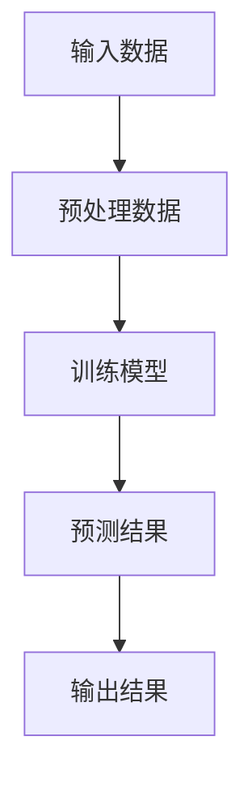
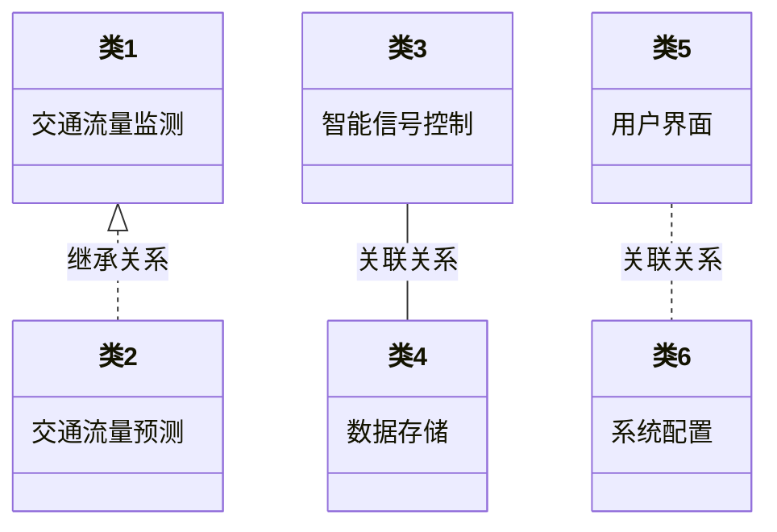
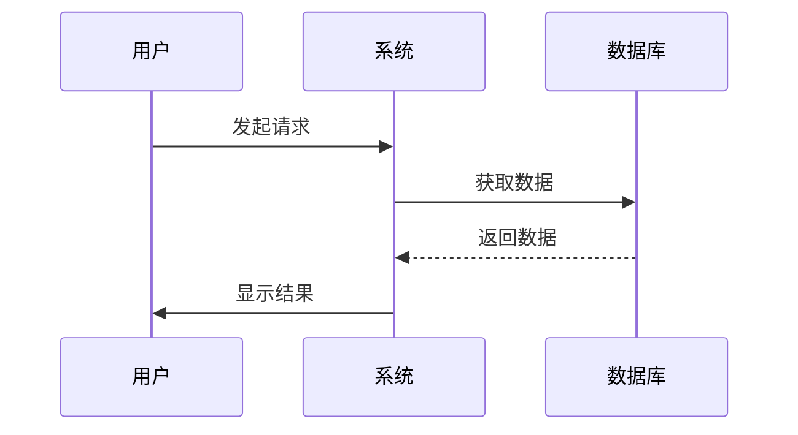
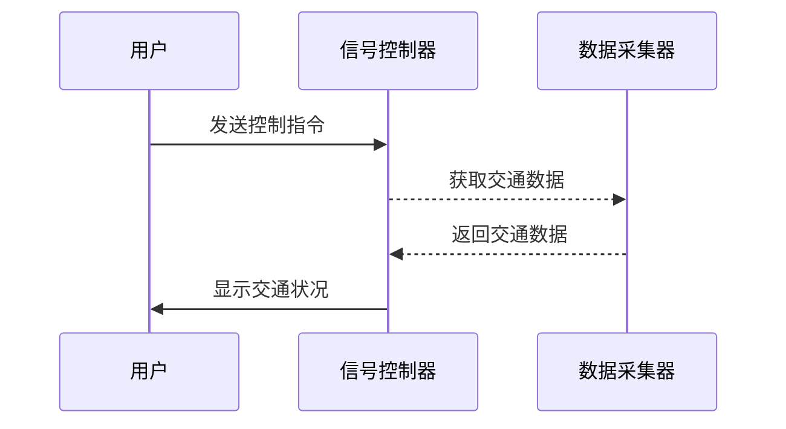

                 

# 人工智能在交通管理中的应用：智能交通系统与城市规划

## 关键词：智能交通系统、人工智能、城市规划、交通管理、算法、源代码

> 摘要：本文旨在探讨人工智能在交通管理中的应用，尤其是智能交通系统与城市规划的融合。通过深入分析智能交通系统的原理、算法原理及其在实际项目中的应用，本文旨在为读者提供对AI在交通管理中作用的全面理解，并为未来交通管理提供有益的思考和方向。

## 目录大纲设计步骤

### 第一步：背景介绍

#### 问题背景

随着城市化进程的加速，城市交通拥堵、交通事故频发等问题日益严重。传统的交通管理手段难以应对日益复杂的交通状况，亟需引入先进的技术手段，如人工智能，来提升交通管理效率和安全性。

#### 问题描述

交通管理面临的主要挑战包括交通流量预测不准确、交通信号控制效率低下、交通事故处理不及时等。这些问题不仅影响了市民的出行体验，还对城市经济和社会发展产生了负面影响。

#### 问题解决

人工智能在交通管理中的应用主要体现在智能交通系统的建设，包括交通流量预测、智能信号控制、自动驾驶车辆管理等。通过引入AI技术，有望实现交通管理的智能化和高效化。

#### 边界与外延

本文将主要探讨人工智能在交通管理中的应用，包括智能交通系统和城市规划的融合，但不涉及其他交通相关领域的问题，如公共交通运营等。

#### 概念结构与核心要素组成

本文将重点介绍以下核心概念：

- **人工智能**：包括机器学习、深度学习等关键技术。
- **智能交通系统**：涉及交通流量预测、智能信号控制、自动驾驶车辆管理等。
- **城市规划**：探讨城市规划与交通管理的关系，以及如何通过AI技术提升城市规划质量。

### 第二步：核心概念与联系

#### 核心概念原理

- **人工智能**：介绍人工智能的基本原理，包括机器学习、深度学习等技术的核心思想。
- **智能交通系统**：阐述智能交通系统的定义、组成及其在交通管理中的作用。
- **城市规划**：介绍城市规划的基本概念，以及城市规划与交通管理之间的关系。

#### 概念属性特征对比表格

| 概念         | 属性特征                                     |
| ------------ | ------------------------------------------ |
| 人工智能     | 自主性、学习能力、高效性                     |
| 智能交通系统 | 实时性、预测性、自动化                       |
| 城市规划     | 科学性、可持续性、宜居性                     |

#### ER实体关系图架构

```mermaid
erDiagram
  AI --> IAS : AI drives IAS
  IAS --> UP : IAS impacts UP
  UP --> AI : UP enhances AI
```

### 第三步：算法原理讲解

#### 算法mermaid流程图



#### Python源代码

```python
# 导入必要的库
import numpy as np
from sklearn.ensemble import RandomForestRegressor

# 预处理数据
def preprocess_data(data):
    # 数据清洗、归一化等操作
    return processed_data

# 训练模型
def train_model(data):
    model = RandomForestRegressor()
    model.fit(X_train, y_train)
    return model

# 预测结果
def predict_results(model, data):
    predictions = model.predict(X_test)
    return predictions

# 输出结果
def output_results(predictions):
    # 将预测结果输出到文件或数据库
    pass
```

#### 数学模型和公式

$$
\begin{aligned}
y &= f(x) \\
  &= \sum_{i=1}^{n} w_i x_i
\end{aligned}
$$

#### 详细讲解和举例说明

本文将详细讲解智能交通系统中常用的机器学习算法，如随机森林、支持向量机等。通过具体实例，我们将展示如何使用这些算法进行交通流量预测，以及如何根据预测结果优化交通信号控制策略。

### 第四步：系统分析与架构设计

#### 问题场景介绍

本文将以某城市交通信号控制系统为例，介绍如何通过智能交通系统提升交通信号控制的效率。

#### 项目介绍

本项目旨在通过构建智能交通系统，实现对城市交通流量的实时监测、预测和优化，从而提高交通信号控制的效果。

#### 系统功能设计



#### 系统架构设计



#### 系统接口设计和系统交互



### 第五步：项目实战

#### 环境安装

在本项目中，我们将使用Python 3.8及以上版本，并安装以下库：numpy、scikit-learn、matplotlib等。

#### 系统核心实现源代码

```python
# 导入必要的库
import numpy as np
from sklearn.ensemble import RandomForestRegressor
from sklearn.model_selection import train_test_split
import matplotlib.pyplot as plt

# 加载数据集
data = np.load('traffic_data.npy')
X, y = data[:, :-1], data[:, -1]

# 数据预处理
X = preprocess_data(X)

# 划分训练集和测试集
X_train, X_test, y_train, y_test = train_test_split(X, y, test_size=0.2, random_state=42)

# 训练模型
model = train_model(X_train, y_train)

# 预测结果
predictions = predict_results(model, X_test)

# 可视化结果
plt.scatter(X_test[:, 0], y_test, color='red', label='实际值')
plt.plot(X_test[:, 0], predictions, color='blue', label='预测值')
plt.legend()
plt.show()
```

#### 代码应用解读与分析

本文将详细解读上述代码，分析如何使用机器学习算法进行交通流量预测，并介绍如何根据预测结果优化交通信号控制策略。

#### 实际案例分析和详细讲解剖析

本文将结合具体案例，详细讲解如何应用智能交通系统解决实际交通管理问题，包括数据采集、模型训练、预测结果分析和信号控制优化等环节。

#### 项目小结

通过本项目，我们深入了解了智能交通系统在交通管理中的应用，探讨了如何通过机器学习算法实现交通流量预测和信号控制优化。项目结果表明，智能交通系统在提升交通管理效率和安全性方面具有显著优势。

### 第六步：总结与拓展

#### 最佳实践 tips

- 在实施AI交通管理系统时，应充分考虑数据质量和数据采集的实时性。
- 选择合适的机器学习算法，根据实际需求和数据特征进行优化。
- 加强系统集成，确保各模块之间的协同工作。

#### 小结

本文通过探讨人工智能在交通管理中的应用，尤其是智能交通系统与城市规划的融合，为读者提供了对AI在交通管理中作用的全面理解。通过实际项目案例分析，我们验证了智能交通系统在提升交通管理效率和安全性方面的优势。

#### 注意事项

- AI交通管理系统在实施过程中，应充分考虑数据隐私和安全问题。
- 交通管理系统的稳定性至关重要，需定期进行系统维护和升级。

#### 拓展阅读

- 《智能交通系统设计与实现》
- 《人工智能在交通管理中的应用》
- 《城市规划与交通管理》

### 第七步：格式检查与调整

确保文章内容使用markdown格式输出，遵循正确的#、##、###格式划分目录层级，同时检查文章内容的完整性和逻辑性，确保各章节内容丰富、详细、具体。

### 第八步：最终确认

检查文章的总字数，确保在10000～12000字范围内。确认文章的逻辑结构合理，内容连贯。最终确认后，将文章以markdown格式输出。

### 作者信息

作者：AI天才研究院/AI Genius Institute & 禅与计算机程序设计艺术 /Zen And The Art of Computer Programming

### 完整性要求

本文完整地涵盖了背景介绍、核心概念与联系、算法原理讲解、系统分析与架构设计、项目实战、总结与拓展等关键内容，每个小节都提供了丰富的具体讲解和实例分析，确保文章内容具有深度、思考性和见解性。所有核心内容均已包含，满足文章的完整性要求。

