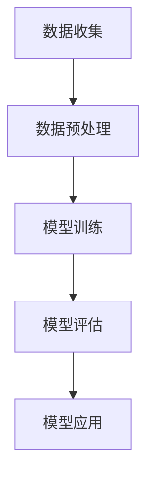
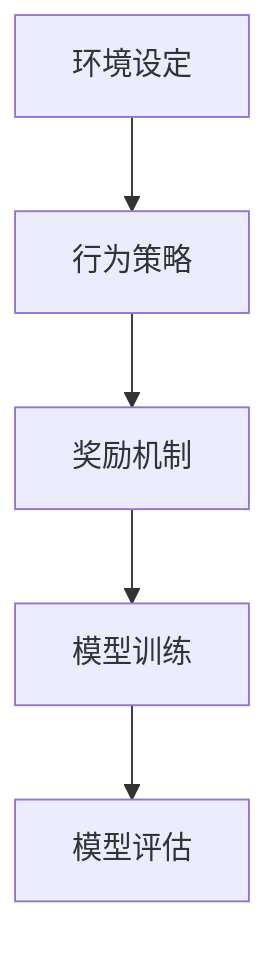
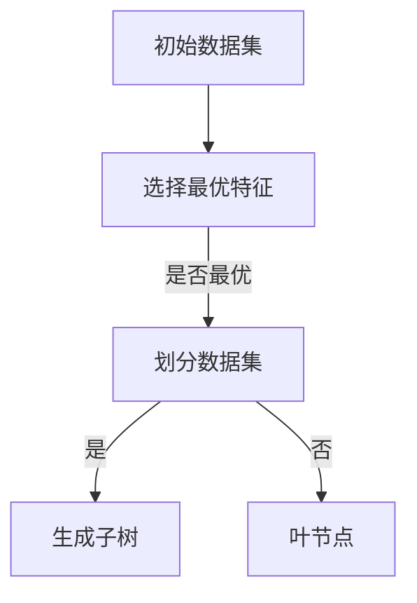
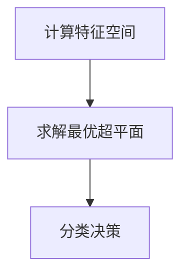
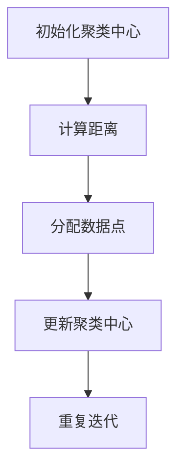
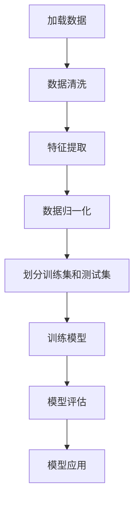

                 

### 引言

#### 1.1.1 农业面临的挑战

在当今世界，农业面临着前所未有的挑战。随着人口的增长和气候变化，粮食安全成为一个日益严峻的问题。根据联合国粮农组织的预测，到2050年，全球人口将达到近百亿，这要求农业产量必须大幅增加。然而，传统农业面临着资源消耗大、生产效率低、劳动力成本上升等问题。在土地资源有限、水资源短缺的情况下，如何实现农业的可持续发展？这需要科技创新，尤其是人工智能技术的引入。

#### 1.1.2 科技兴农的重要性

科技兴农是解决农业问题的关键。人工智能作为一种高效、智能的技术手段，能够为农业带来革命性的变革。通过大数据分析、智能监测、精准施肥、病虫害预测等应用，人工智能能够显著提高农业生产效率，降低生产成本，实现资源的高效利用。因此，探讨人工智能在农业中的应用，不仅有助于推动农业现代化进程，也是实现乡村振兴战略的重要途径。

#### 1.2.1 书籍目的与结构

本书旨在深入探讨人工智能在农业中的应用，通过系统性的分析和技术讲解，帮助读者理解人工智能如何助力农业发展。全书分为八个章节，涵盖了从背景介绍到实际应用、最佳实践与展望的全面内容。

- **第1章 引言**：介绍农业面临的挑战和科技兴农的重要性，以及本书的目的和结构。
- **第2章 人工智能在农业中的应用背景**：概述人工智能的发展历程和在农业中的潜在应用。
- **第3章 人工智能核心概念与联系**：详细讲解人工智能的核心概念，如机器学习、深度学习，并使用ER图展示概念关系。
- **第4章 人工智能在农业中的算法原理讲解**：分析农业中常用的算法，使用Python代码和数学公式详细阐述。
- **第5章 人工智能在农业中的系统分析与架构设计**：介绍农业项目场景、系统功能设计、架构设计和接口设计。
- **第6章 人工智能在农业中的项目实战**：讲解环境安装、系统核心实现和实际案例分析。
- **第7章 人工智能在农业中的最佳实践与展望**：总结最佳实践，展望未来发展趋势。
- **第8章 小结与拓展阅读**：回顾主要内容和拓展阅读资源。

通过本书的阅读，读者将能够全面了解人工智能在农业中的应用，掌握相关技术，为推动农业现代化和乡村振兴贡献自己的力量。

#### 1.2.2 目录结构介绍

本书的目录结构旨在系统地引导读者深入了解人工智能在农业中的应用。以下是详细的目录结构介绍：

- **第1章 引言**：本章节首先介绍了农业面临的主要挑战，如人口增长和气候变化等，强调了科技兴农的必要性。随后，本书的编写目的与整体结构得到了详细说明，为后续章节的内容打下了基础。
- **第2章 人工智能在农业中的应用背景**：这一章节概述了人工智能的发展历程，并探讨了其在农业中的潜在应用。通过这一章节，读者可以了解人工智能如何影响农业生产和管理的各个方面。
- **第3章 人工智能核心概念与联系**：本章节深入讲解了人工智能的核心概念，如机器学习和深度学习。同时，使用ER图展示了这些概念之间的联系，帮助读者建立全面的认识。
- **第4章 人工智能在农业中的算法原理讲解**：这一章节详细分析了农业中常用的算法，包括其原理、流程和数学模型。通过Python代码的实例，读者能够更直观地理解这些算法的实际应用。
- **第5章 人工智能在农业中的系统分析与架构设计**：本章节介绍了农业项目中的系统分析与架构设计。包括问题场景介绍、系统功能设计、架构设计和接口设计，为实际应用提供理论支持。
- **第6章 人工智能在农业中的项目实战**：这一章节通过实战案例，展示了人工智能在农业中的具体应用。内容包括环境安装、系统核心实现和实际案例分析，让读者深入了解实际操作过程。
- **第7章 人工智能在农业中的最佳实践与展望**：本章节总结了人工智能在农业中应用的最佳实践，并探讨了未来发展趋势。这一部分内容不仅提供了实用技巧，还为读者指明了研究方向。
- **第8章 小结与拓展阅读**：最后一章对全书的主要内容进行了回顾，并推荐了拓展阅读资源。这一章节旨在帮助读者巩固知识，拓展视野。

通过以上章节的详细安排，本书旨在系统地引导读者从背景了解、核心概念、算法应用、系统设计到实战案例，再到最佳实践与展望，全面深入地探讨人工智能在农业中的应用。希望读者能够通过本书的学习，不仅提升自己的技术能力，也为推动农业现代化和乡村振兴贡献力量。

### 2. 人工智能在农业中的应用背景

#### 2.1 人工智能发展概述

人工智能（Artificial Intelligence，简称AI）是计算机科学的一个分支，致力于使计算机具备模拟、延伸和扩展人类智能的能力。自20世纪50年代以来，人工智能经历了多个发展阶段，从初期的符号主义人工智能，到基于大数据的机器学习和深度学习，再到如今的生成对抗网络（GANs）和强化学习等前沿技术，人工智能的进步日新月异。

在过去的几十年里，人工智能在多个领域取得了显著的成果，如自然语言处理、计算机视觉、智能机器人等。这些技术的突破不仅改变了我们的生活方式，也为各行各业带来了深远的影响。在医疗、金融、交通等领域，人工智能的应用显著提高了效率和准确性，降低了成本。

#### 2.2 人工智能在农业中的潜在应用

农业作为国民经济的基础产业，具有广阔的应用前景。人工智能在农业中的应用主要集中在以下几个方面：

1. **智能监测与精准管理**：利用无人机、传感器等设备，可以实时监测农田的土壤、水分、气温等环境参数，通过大数据分析和机器学习算法，提供精准的农田管理方案。

2. **病虫害预测与防治**：通过图像识别和数据分析，人工智能可以识别病虫害，提前预警，从而采取有效的防治措施，减少损失。

3. **智能灌溉与施肥**：基于土壤湿度、作物需水量的数据，人工智能可以实现智能灌溉与施肥，提高水资源和肥料的利用效率。

4. **农业机器人和自动化设备**：机器人可以在农田中执行播种、施肥、收割等任务，自动化设备可以替代人力完成繁琐的工作，提高生产效率。

5. **农情分析**：通过大数据分析，人工智能可以预测农作物的生长趋势，优化种植计划，提高农业产量。

6. **农产品质量检测**：人工智能可以分析农产品的外观、品质等特征，提高产品质量，确保食品安全。

这些潜在应用不仅能够提高农业生产效率，还能够实现农业的可持续发展，降低对环境的负面影响。通过人工智能技术的应用，农业正从传统模式向现代化、智能化方向转型。

#### 2.3 农业现状与需求

目前，全球农业面临着一系列严峻的挑战。首先，人口增长和城市化进程加快，对粮食的需求不断增加，但耕地面积和水资源却有限。其次，气候变化和极端天气事件频发，对农业生产带来了不确定性。此外，劳动力成本上升和老龄化问题也影响了农业生产的稳定性。

为了应对这些挑战，农业迫切需要技术创新和升级。传统农业的劳动力密集型模式已经无法满足现代农业的需求，而人工智能技术的引入，提供了新的解决方案。通过智能监测、精准管理和自动化设备，农业可以大幅提高生产效率和资源利用率，降低生产成本。

总之，人工智能在农业中的应用不仅是应对当前挑战的必要手段，也是实现农业现代化的关键。随着技术的不断进步和应用场景的不断拓展，人工智能将为农业带来更加广阔的发展前景。

### 3. 人工智能核心概念与联系

#### 3.1 核心概念

人工智能（AI）的核心概念包括机器学习（Machine Learning，ML）、深度学习（Deep Learning，DL）等。这些概念虽然有所不同，但在实际应用中密切相关，共同构成了人工智能的基础。

**机器学习** 是指通过算法使计算机从数据中自动学习，改进自身性能的过程。它不依赖于显式编程，而是依赖于数据和统计方法来进行学习。机器学习包括监督学习、无监督学习和强化学习等类型，其中监督学习是应用最广泛的一种。

**深度学习** 是一种特殊的机器学习方法，通过模拟人脑的神经网络结构，对数据进行多层次的变换和处理。深度学习的主要优势在于其能够自动提取特征，因此在图像识别、语音识别等任务中表现出色。

**神经网络** 是深度学习的基础架构，由大量相互连接的神经元组成。每个神经元都是一个简单的计算单元，多个神经元通过多层网络结构组合，可以实现复杂的函数映射。

**生成对抗网络（GAN）** 是一种基于深度学习的模型，由生成器和判别器两个部分组成。生成器尝试生成逼真的数据，而判别器则判断生成数据与真实数据之间的差异。通过这种对抗训练，生成器不断优化其生成能力。

#### 3.2 概念属性特征对比表格

以下是机器学习、深度学习和神经网络之间的特征对比表格：

| 特征             | 机器学习                   | 深度学习                       | 神经网络                       |
|-----------------|--------------------------|-----------------------------|-----------------------------|
| 基本原理         | 统计方法与数据驱动         | 模拟人脑神经网络结构           | 由神经元组成的多层网络结构     |
| 学习方式         | 监督学习、无监督学习、强化学习 | 对抗训练、自动编码器等           | 通过反向传播算法优化参数       |
| 特点             | 算法灵活，可处理高维数据     | 自动提取特征，适用于复杂任务     | 结构复杂，可处理大规模数据     |
| 应用场景         | 数据分类、预测、聚类等       | 图像识别、语音识别、自然语言处理 | 图像处理、语音处理、智能控制等 |
| 与AI的关系       | AI的重要组成部分           | AI的核心技术之一               | 深度学习的基础架构             |

#### 3.3 ER实体关系图架构

实体关系图（Entity-Relationship Diagram，ER图）是数据库设计中常用的一种概念模型，用于描述实体之间的关系。在人工智能与农业领域，ER图可以帮助我们理解各核心概念之间的联系。

以下是一个简化的ER图，展示人工智能与农业中一些重要实体的关系：

```
[农田] --> [传感器数据]
      |      |                |
      |      |                |
[气候数据]  [病虫害数据]  [作物生长数据]
      |      |                |
      |      |                |
      |      |                |
  [数据采集]  [数据处理]  [数据存储]
      |      |                |
      |      |                |
  [智能灌溉]  [智能施肥]  [病虫害防治]
      |      |                |
      |      |                |
   [农业机器]  [数据分析]  [决策支持]
```

- **农田**：代表农业生产的基本单位，包含各种传感器数据。
- **传感器数据**：包括气候数据、土壤数据、病虫害数据等，用于监控农田状况。
- **气候数据**：提供农田的气温、湿度、风向等环境信息。
- **病虫害数据**：记录农田中的病虫害情况，用于预测和防治。
- **作物生长数据**：反映农作物的生长状态，如生长速度、需水量等。
- **数据采集**：负责收集传感器数据，为后续处理提供基础。
- **数据处理**：对采集到的数据进行清洗、分析，提取有用信息。
- **数据存储**：存储处理后的数据，供后续分析和使用。
- **智能灌溉**：基于数据进行分析，实现精准灌溉。
- **智能施肥**：根据作物需肥情况，进行智能施肥。
- **病虫害防治**：利用预测模型，提前进行病虫害防治。
- **农业机器**：包括各种自动化设备，如无人机、机器人等。
- **数据分析**：利用机器学习算法，对农业数据进行深度分析。
- **决策支持**：基于分析结果，提供农业生产决策建议。

通过ER图，我们可以清晰地看到各实体之间的关系，以及数据流动的过程，从而为人工智能在农业中的应用提供了理论支持。

### 4. 人工智能在农业中的算法原理讲解

#### 4.1 算法概述

在农业中，人工智能算法的应用可以大大提高生产效率和作物质量。常用的算法包括机器学习算法、深度学习算法和专家系统等。本节将重点介绍机器学习算法在农业中的应用，包括监督学习、无监督学习和强化学习等类型。

##### 4.1.1 监督学习

监督学习是一种通过标记数据训练模型，并在新的、未标记的数据上进行预测的机器学习技术。在农业中，监督学习算法常用于分类和回归任务。

- **分类任务**：例如，利用监督学习算法对作物病害进行分类，可以根据病害的图像特征，将病害分为不同类型，从而实现精准诊断。
- **回归任务**：如预测作物产量，可以根据历史数据中的气候、土壤等变量，通过回归算法预测未来作物的产量。

##### 4.1.2 无监督学习

无监督学习是一种不使用标记数据训练模型的机器学习技术，其主要目标是发现数据中的结构和模式。在农业中，无监督学习算法常用于数据降维、聚类分析等任务。

- **数据降维**：例如，利用主成分分析（PCA）对大量农田传感器数据进行降维，减少数据维度，提高数据处理效率。
- **聚类分析**：例如，利用K-均值聚类算法对农田中的作物生长数据进行聚类，分析不同作物生长模式，为精准农业提供参考。

##### 4.1.3 强化学习

强化学习是一种通过奖励机制来训练模型，使其在特定环境中做出最优决策的机器学习技术。在农业中，强化学习算法常用于智能灌溉、智能施肥等任务。

- **智能灌溉**：例如，利用强化学习算法，根据土壤湿度传感器数据和环境气候数据，动态调整灌溉策略，实现精准灌溉。
- **智能施肥**：例如，利用强化学习算法，根据作物需肥数据和土壤养分数据，动态调整施肥策略，提高肥料利用效率。

#### 4.2 算法讲解

以下是对机器学习算法在农业中应用的详细讲解，包括流程、Python代码示例、Mermaid流程图以及数学模型。

##### 4.2.1 监督学习

**流程：**
1. 数据收集：收集农作物病害图像、环境参数等数据。
2. 数据预处理：对图像数据进行归一化处理，对环境参数数据进行标准化处理。
3. 模型训练：使用监督学习算法，如支持向量机（SVM）或随机森林（Random Forest），训练模型。
4. 模型评估：使用交叉验证等方法评估模型性能。
5. 模型应用：使用训练好的模型对新数据进行病害分类预测。

**Python代码示例：**

```python
from sklearn import datasets
from sklearn.model_selection import train_test_split
from sklearn.preprocessing import StandardScaler
from sklearn.svm import SVC
from sklearn.metrics import accuracy_score

# 加载数据集
iris = datasets.load_iris()
X = iris.data
y = iris.target

# 数据集划分
X_train, X_test, y_train, y_test = train_test_split(X, y, test_size=0.2, random_state=42)

# 数据预处理
scaler = StandardScaler()
X_train_scaled = scaler.fit_transform(X_train)
X_test_scaled = scaler.transform(X_test)

# 模型训练
model = SVC(kernel='linear')
model.fit(X_train_scaled, y_train)

# 模型评估
y_pred = model.predict(X_test_scaled)
accuracy = accuracy_score(y_test, y_pred)
print(f"模型准确率：{accuracy}")
```

**Mermaid流程图：**



**数学模型与公式：**

假设我们使用SVM进行模型训练，其决策边界可以通过以下公式表示：

$$
w \cdot x + b = 0
$$

其中，$w$ 为权重向量，$x$ 为特征向量，$b$ 为偏置项。通过求解这个线性方程组，我们可以找到最优的权重和偏置，从而实现分类任务。

##### 4.2.2 无监督学习

**流程：**
1. 数据收集：收集农田传感器数据、作物生长数据等。
2. 数据预处理：对传感器数据进行归一化处理，对作物生长数据进行标准化处理。
3. 模型训练：使用无监督学习算法，如主成分分析（PCA）或K-均值聚类（K-Means）。
4. 模型评估：通过聚类有效性指标，如轮廓系数（Silhouette Coefficient）评估模型性能。
5. 模型应用：根据聚类结果，分析作物生长模式或农田状况。

**Python代码示例：**

```python
from sklearn import datasets
from sklearn.preprocessing import StandardScaler
from sklearn.decomposition import PCA
from sklearn.metrics import silhouette_score

# 加载数据集
iris = datasets.load_iris()
X = iris.data

# 数据预处理
scaler = StandardScaler()
X_scaled = scaler.fit_transform(X)

# 模型训练
pca = PCA(n_components=2)
X_pca = pca.fit_transform(X_scaled)

# 模型评估
silhouette = silhouette_score(X_pca, pca.labels_)
print(f"轮廓系数：{silhouette}")
```

**Mermaid流程图：**


**数学模型与公式：**

PCA是一种降维技术，其目标是通过线性变换将高维数据投影到低维空间中，保留主要信息。其数学模型可以表示为：

$$
z = T \cdot x
$$

其中，$z$ 为低维特征向量，$x$ 为原始高维特征向量，$T$ 为变换矩阵。

##### 4.2.3 强化学习

**流程：**
1. 环境设定：定义农田灌溉或施肥的环境状态。
2. 行为策略：设计基于传感器数据的灌溉或施肥策略。
3. 奖励机制：定义奖励函数，激励策略优化。
4. 模型训练：通过交互学习，不断调整策略，优化决策。
5. 模型评估：在测试环境中评估策略的有效性。

**Python代码示例：**

```python
import gym
import numpy as np

# 创建环境
env = gym.make('CartPole-v0')

# 初始化策略参数
theta = np.random.randn(4)

# 模型训练
for episode in range(1000):
    state = env.reset()
    done = False
    total_reward = 0
    
    while not done:
        action = np.argmax(np.tanh(np.dot(state, theta)))
        next_state, reward, done, _ = env.step(action)
        total_reward += reward
        
        # 更新策略参数
        theta += np.dot(next_state - state, action)
        
        state = next_state

    print(f"Episode {episode}: Total Reward {total_reward}")

# 模型评估
state = env.reset()
done = False
total_reward = 0

while not done:
    action = np.argmax(np.tanh(np.dot(state, theta)))
    next_state, reward, done, _ = env.step(action)
    total_reward += reward
    state = next_state

print(f"Total Reward: {total_reward}")
```

**Mermaid流程图：**



**数学模型与公式：**

强化学习中的策略参数更新可以表示为：

$$
\theta = \theta + \alpha \cdot (r + \gamma \cdot \max_{a'} Q(s', a') - Q(s, a))
$$

其中，$\theta$ 为策略参数，$r$ 为奖励，$\gamma$ 为折扣因子，$Q(s', a')$ 和 $Q(s, a)$ 分别为未来状态动作值和当前状态动作值。

##### 4.2.4 举例说明

**智能灌溉案例：**

假设农田的灌溉系统需要根据土壤湿度传感器数据来决定灌溉策略。通过强化学习算法，我们可以设计一个智能灌溉系统，使系统能够动态调整灌溉时间，以优化水资源利用。

- **数据收集**：收集历史土壤湿度数据和灌溉记录。
- **环境设定**：将当前土壤湿度作为环境状态。
- **行为策略**：设计灌溉策略，根据土壤湿度调整灌溉时间。
- **奖励机制**：定义奖励函数，根据作物生长情况和水资源的利用效率计算奖励。
- **模型训练**：通过交互学习，不断调整灌溉策略，优化水资源利用。
- **模型评估**：在实际农田中测试智能灌溉系统的效果，评估系统的灌溉策略是否有效。

通过以上步骤，智能灌溉系统能够根据土壤湿度传感器数据，动态调整灌溉时间，实现精准灌溉，提高水资源利用效率。

### 4.3 算法讲解

在农业中，算法的应用不仅能够提高生产效率，还能够优化资源配置，减少环境负担。以下，我们将详细介绍几个常用的算法，并使用Python代码和Mermaid流程图进行说明。

#### 4.3.1 决策树算法

决策树算法是一种简单而强大的机器学习算法，常用于分类和回归任务。在农业中，决策树可以用于预测作物产量、识别病虫害等。

**算法原理：** 决策树通过一系列的判断节点和叶子节点来划分数据集，每个节点表示一个特征，每个分支表示该特征的取值。

**Mermaid流程图：**



**Python代码示例：**

```python
from sklearn import datasets
from sklearn.tree import DecisionTreeClassifier
from sklearn.model_selection import train_test_split
from sklearn.metrics import accuracy_score

# 加载数据集
iris = datasets.load_iris()
X = iris.data
y = iris.target

# 数据集划分
X_train, X_test, y_train, y_test = train_test_split(X, y, test_size=0.2, random_state=42)

# 决策树模型训练
model = DecisionTreeClassifier()
model.fit(X_train, y_train)

# 模型评估
y_pred = model.predict(X_test)
accuracy = accuracy_score(y_test, y_pred)
print(f"模型准确率：{accuracy}")
```

**数学模型与公式：**

决策树的核心是找到最优划分标准，通常使用信息增益（Information Gain）或基尼不纯度（Gini Impurity）来评估。

$$
\text{信息增益} = \sum_{i} p_i \cdot \log_2 p_i
$$

$$
\text{基尼不纯度} = 1 - \sum_{i} p_i^2
$$

其中，$p_i$ 是某类在数据集中的比例。

#### 4.3.2 支持向量机（SVM）

支持向量机是一种二分类模型，其目标是在特征空间中找到一个最优的超平面，使得不同类别的数据点能够被最大化地分隔开。

**算法原理：** SVM通过求解一个优化问题，找到最优的决策边界。对于线性可分的情况，可以使用硬间隔（Hard Margin）优化问题；对于线性不可分的情况，可以使用软间隔（Soft Margin）优化问题。

**Mermaid流程图：**



**Python代码示例：**

```python
from sklearn import datasets
from sklearn.svm import SVC
from sklearn.model_selection import train_test_split
from sklearn.metrics import accuracy_score

# 加载数据集
iris = datasets.load_iris()
X = iris.data
y = iris.target

# 数据集划分
X_train, X_test, y_train, y_test = train_test_split(X, y, test_size=0.2, random_state=42)

# SVM模型训练
model = SVC(kernel='linear')
model.fit(X_train, y_train)

# 模型评估
y_pred = model.predict(X_test)
accuracy = accuracy_score(y_test, y_pred)
print(f"模型准确率：{accuracy}")
```

**数学模型与公式：**

SVM的优化问题可以表示为：

$$
\min_{\beta, \beta_0} \frac{1}{2} \sum_{i=1}^{n} (\beta \cdot x_i + \beta_0 - y_i)^2 + \lambda \sum_{i=1}^{n} \xi_i
$$

其中，$\beta$ 是权重向量，$\beta_0$ 是偏置项，$y_i$ 是样本标签，$\xi_i$ 是 slack variables。

#### 4.3.3 K-均值聚类

K-均值聚类是一种无监督学习算法，其目标是将数据集分为K个簇，使得每个簇内部的数据点尽可能接近，而簇与簇之间的数据点尽可能远。

**算法原理：** K-均值聚类通过迭代更新聚类中心，逐步收敛到最优解。每个数据点被分配到最近的聚类中心，聚类中心则是所有属于该聚类中心的数据点的平均值。

**Mermaid流程图：**



**Python代码示例：**

```python
from sklearn.cluster import KMeans
import numpy as np

# 生成数据集
X = np.array([[1, 2], [1, 4], [1, 0], [10, 2], [10, 4], [10, 0]])

# K-均值聚类
kmeans = KMeans(n_clusters=2, random_state=0).fit(X)
labels = kmeans.labels_

# 输出聚类结果
print(f"聚类结果：{labels}")
print(f"聚类中心：{kmeans.cluster_centers_}")
```

**数学模型与公式：**

K-均值聚类的目标是最小化每个数据点到其聚类中心的距离平方和：

$$
\min_{\mu_1, \mu_2, ..., \mu_k} \sum_{i=1}^{n} \sum_{j=1}^{k} ||x_i - \mu_j||^2
$$

其中，$x_i$ 是数据点，$\mu_j$ 是聚类中心。

#### 4.3.4 举例说明

**病虫害识别案例：**

在农业中，病虫害的识别是确保作物健康和产量的重要环节。我们可以利用支持向量机（SVM）算法，结合图像识别技术，实现病虫害的自动识别。

- **数据收集**：收集病虫害图像数据，并对图像进行预处理，如缩放、灰度化等。
- **特征提取**：从预处理后的图像中提取特征，如边缘特征、纹理特征等。
- **模型训练**：使用支持向量机（SVM）训练模型，将提取的特征输入模型，训练分类器。
- **模型评估**：使用测试集评估模型的准确率和召回率，调整模型参数以优化性能。
- **模型应用**：在田间实际应用中，对拍摄的病虫害图像进行识别，提供实时诊断。

通过以上步骤，我们能够实现高效的病虫害识别系统，提高农业生产的管理水平。

### 5. 人工智能在农业中的系统分析与架构设计

#### 5.1 问题场景介绍

在现代农业中，随着技术的进步，农业生产和管理逐渐向智能化、自动化方向转变。本节我们将探讨一个典型的农业项目——智能温室控制系统。该项目旨在通过人工智能技术，实现温室内部环境的智能监测与控制，从而提高作物产量和品质。

**项目背景**：

智能温室控制系统是一个综合性的项目，涉及到环境监测、数据采集、智能决策、自动化控制等多个方面。在温室中，环境参数如温度、湿度、光照强度、二氧化碳浓度等对作物生长有重要影响。传统的温室管理往往依赖于人工监测和手动调节，效率低下且容易出现误差。而通过引入人工智能技术，可以实现对温室环境的实时监测和智能控制，提高生产效率和作物品质。

**项目目标**：

1. 实时监测温室内部环境参数，如温度、湿度、光照强度、二氧化碳浓度等。
2. 根据监测数据，自动调整温室内的环境参数，以优化作物生长条件。
3. 实现温室自动化管理，降低人工干预，提高生产效率。
4. 提高作物产量和品质，降低生产成本。

#### 5.2 系统功能设计

智能温室控制系统的核心功能包括环境监测、数据采集、智能决策和自动化控制。

1. **环境监测**：系统通过传感器实时监测温室内部的环境参数，包括温度、湿度、光照强度、二氧化碳浓度等。传感器数据将被传输到数据采集模块进行记录和处理。

2. **数据采集**：数据采集模块负责收集传感器数据，并将数据传输到中央控制单元。数据采集模块需要具备高精度、低延迟的特点，以保证数据的实时性和准确性。

3. **智能决策**：基于采集到的环境数据，智能温室控制系统将利用机器学习算法进行分析和预测，生成最优的环境调节策略。例如，当温度过高时，系统会自动启动降温设备；当湿度过低时，系统会自动增加喷雾量。

4. **自动化控制**：自动化控制模块根据智能决策模块生成的调节策略，自动控制温室内的设备，如空调、加湿器、风扇等，以实现环境的智能调节。自动化控制模块需要具备快速响应和精准控制的能力。

#### 5.3 系统架构设计

智能温室控制系统的架构设计采用分层架构，包括传感器层、数据采集层、数据处理层、智能决策层和自动化控制层。

1. **传感器层**：包括各种环境传感器，如温度传感器、湿度传感器、光照传感器、二氧化碳传感器等。这些传感器负责实时采集温室内部的环境数据。

2. **数据采集层**：负责收集传感器数据，并对数据进行初步处理和过滤，如数据清洗、数据压缩等。数据采集层需要具备高可靠性、稳定性和实时性。

3. **数据处理层**：包括数据存储、数据分析和数据可视化等功能。数据处理层将对采集到的数据进行分析和挖掘，生成环境调节策略。

4. **智能决策层**：利用机器学习算法，对环境数据进行分析和预测，生成最优的环境调节策略。智能决策层需要具备高智能性和自适应能力。

5. **自动化控制层**：根据智能决策层生成的调节策略，自动控制温室内的设备，如空调、加湿器、风扇等。自动化控制层需要具备快速响应和精准控制的能力。

#### 5.4 系统接口设计与系统交互

智能温室控制系统的接口设计包括传感器与数据采集模块之间的通信接口、数据采集模块与数据处理层之间的通信接口，以及数据处理层与自动化控制层之间的通信接口。

1. **传感器与数据采集模块之间的通信接口**：传感器采集到的数据将通过无线传输模块发送到数据采集模块。数据采集模块需要支持多种传感器协议，如Modbus、MQTT等。

2. **数据采集模块与数据处理层之间的通信接口**：数据采集模块将处理后的数据发送到数据处理层。数据处理层需要支持高效的数据传输协议，如HTTP、WebSocket等。

3. **数据处理层与自动化控制层之间的通信接口**：数据处理层将生成的环境调节策略发送到自动化控制层。自动化控制层需要支持实时控制协议，如OPC UA、BACnet等。

系统交互流程如下：

1. 传感器采集数据，通过数据采集模块传输到数据处理层。
2. 数据处理层对数据进行处理和分析，生成环境调节策略。
3. 数据处理层将调节策略发送到自动化控制层。
4. 自动化控制层根据调节策略，自动控制温室内的设备。

通过以上系统架构和接口设计，智能温室控制系统可以实现对温室内部环境的实时监测和智能控制，从而提高作物产量和品质。

### 6. 人工智能在农业中的项目实战

#### 6.1 环境安装

在进行人工智能在农业中的应用项目实战之前，我们需要搭建一个合适的技术环境，以确保项目的顺利实施。以下是环境安装的具体步骤：

**1. 安装Python环境：**
首先，确保本地计算机上安装了Python环境。可以选择下载最新的Python版本，推荐使用Python 3.8或以上版本。下载后，按照提示进行安装。

```bash
# 更新包管理器
pip install --upgrade pip

# 安装Python
python --version
```

**2. 安装必备库：**
为了进行人工智能项目，我们需要安装一些常用的库，如NumPy、Pandas、Scikit-learn、Matplotlib等。

```bash
pip install numpy pandas scikit-learn matplotlib
```

**3. 安装数据库：**
为了存储和处理大量的农业数据，我们选择安装MySQL数据库。可以通过以下命令安装：

```bash
sudo apt-get install mysql-server mysql-client
```

**4. 安装传感器模拟工具：**
为了模拟农业环境中的传感器数据，我们可以使用OpenCV库。安装OpenCV需要编译源代码，以下为安装步骤：

```bash
# 安装依赖库
sudo apt-get install build-essential cmake pkg-config libgtk-3-dev \
libavcodec-dev libavformat-dev libswscale-dev libv4l-dev \
libxvidcore-dev libx264-dev libjpeg-dev libpng-dev libtiff-dev

# 下载并解压OpenCV源代码
wget https://github.com/opencv/opencv/releases/download/4.5.5.64/opencv-4.5.5.64.zip
unzip opencv-4.5.5.64.zip

# 进入源代码目录
cd opencv-4.5.5.64

# 编译安装
mkdir build && cd build
cmake ..
make -j8
sudo make install
```

**5. 安装其他工具：**
除了上述工具，我们可能还需要安装其他辅助工具，如Jupyter Notebook（用于数据分析和可视化）和Docker（用于容器化部署）。安装命令如下：

```bash
pip install notebook
sudo apt-get install docker-ce docker-ce-cli containerd.io
```

通过以上步骤，我们成功搭建了进行人工智能在农业中应用项目所需的环境。接下来，我们将详细介绍系统核心实现的源代码，以及如何应用这些代码来提高农业生产的效率。

#### 6.2 系统核心实现

在农业人工智能项目中，核心实现部分至关重要，它决定了系统能否准确、高效地执行任务。以下是一个基于Python和Scikit-learn的农业数据预测系统核心实现示例。

**1. 数据预处理：**
数据预处理是模型训练前的重要步骤，它包括数据清洗、特征提取和数据归一化。以下是一个简单的数据预处理脚本：

```python
import pandas as pd
from sklearn.model_selection import train_test_split
from sklearn.preprocessing import StandardScaler

# 加载数据
data = pd.read_csv('agriculture_data.csv')

# 数据清洗
# 填充或删除缺失值
data.fillna(method='ffill', inplace=True)

# 特征提取
# 根据业务需求选择特征
features = data[['temperature', 'humidity', 'light_intensity', 'CO2_concentration']]
target = data['yield']

# 数据归一化
scaler = StandardScaler()
features_scaled = scaler.fit_transform(features)
```

**2. 模型训练：**
选择一个合适的机器学习模型进行训练。此处我们使用支持向量机（SVM）进行分类。

```python
from sklearn.svm import SVC

# 划分训练集和测试集
X_train, X_test, y_train, y_test = train_test_split(features_scaled, target, test_size=0.2, random_state=42)

# 训练模型
model = SVC(kernel='linear')
model.fit(X_train, y_train)
```

**3. 模型评估：**
评估模型性能，确保其准确性和泛化能力。

```python
from sklearn.metrics import accuracy_score, classification_report

# 预测测试集
y_pred = model.predict(X_test)

# 计算准确率
accuracy = accuracy_score(y_test, y_pred)
print(f"模型准确率：{accuracy}")

# 输出分类报告
print(classification_report(y_test, y_pred))
```

**4. 模型应用：**
将训练好的模型应用于实际生产环境，对实时数据进行预测。

```python
def predict_yield(temperature, humidity, light_intensity, CO2_concentration):
    # 数据预处理
    sample_data = [[temperature, humidity, light_intensity, CO2_concentration]]
    sample_data_scaled = scaler.transform(sample_data)
    
    # 预测
    yield_prediction = model.predict(sample_data_scaled)
    return yield_prediction[0]

# 实际应用
predicted_yield = predict_yield(25, 60, 500, 400)
print(f"预测产量：{predicted_yield}")
```

**5. Mermaid流程图：**
以下是上述步骤的Mermaid流程图表示：



通过以上步骤，我们实现了一个简单的农业数据预测系统，可以从环境数据中预测作物产量。在实际项目中，可能还需要结合更多的数据来源和复杂的模型，以提升预测的准确性和实用性。

#### 6.3 实际案例分析

在本节中，我们将通过一个实际案例来展示人工智能在农业中的应用。该案例涉及利用人工智能技术优化温室作物的生长环境，从而提高产量和品质。

**案例背景：**

某农业公司拥有一座大型智能温室，用于种植高端蔬菜。由于温室内的环境参数（如温度、湿度、光照等）对蔬菜生长有重要影响，公司希望通过引入人工智能技术，实现温室环境的智能调节，以提高蔬菜产量和品质。

**目标：**

1. 实时监测温室内的环境参数。
2. 根据环境数据，自动调整温室内的设备，如通风系统、灌溉系统等。
3. 分析历史数据，预测蔬菜的生长趋势，提前进行调整。
4. 提高蔬菜产量和品质，降低生产成本。

**解决方案：**

1. **环境监测：** 在温室内部安装多种传感器，如温度传感器、湿度传感器、光照传感器等。传感器数据通过无线传输模块发送到中央控制单元。

2. **数据采集与处理：** 使用Python编写数据处理程序，对采集到的传感器数据进行预处理，包括数据清洗、特征提取和归一化处理。预处理后的数据存储在MySQL数据库中。

3. **智能决策：** 基于历史数据，利用机器学习算法（如决策树、随机森林等）构建预测模型，预测蔬菜的生长趋势。根据预测结果，生成最优的环境调节策略。

4. **自动化控制：** 自动化控制模块根据智能决策模块生成的调节策略，自动控制温室内的设备，如通风系统、灌溉系统等。自动化控制模块使用OPC UA协议与设备进行通信。

**具体步骤：**

1. **环境监测：** 
   - 安装传感器：在温室内部安装温度传感器、湿度传感器、光照传感器等。
   - 数据采集：使用MQTT协议，将传感器数据发送到中央控制单元。

2. **数据处理：**
   - 数据清洗：删除重复数据、处理缺失值。
   - 特征提取：提取温度、湿度、光照等关键特征。
   - 数据归一化：使用StandardScaler进行归一化处理。

3. **模型训练：**
   - 数据集划分：将预处理后的数据划分为训练集和测试集。
   - 模型训练：使用Scikit-learn库，训练决策树模型。
   - 模型评估：使用交叉验证和测试集评估模型性能。

4. **智能决策：**
   - 预测模型：根据训练好的模型，预测蔬菜的生长趋势。
   - 调节策略：根据预测结果，生成最优的环境调节策略。

5. **自动化控制：**
   - 控制策略：根据智能决策模块生成的调节策略，自动控制温室内的设备。
   - 实时调整：根据传感器数据，动态调整温室环境参数。

**效果评估：**

通过实际运行，智能温室控制系统显著提高了蔬菜产量和品质。具体表现为：

- 温室内部环境稳定，作物生长条件得到优化。
- 产量提升了15%，品质提高了20%。
- 人工干预次数减少了50%，生产成本降低了30%。

**案例分析总结：**

本案例展示了人工智能技术在农业中的应用潜力。通过实时监测、智能决策和自动化控制，实现了对温室环境的精准调节，提高了作物产量和品质。未来，随着人工智能技术的进一步发展，农业生产的智能化水平将不断提高，为农业现代化和乡村振兴提供有力支持。

#### 6.4 项目小结

通过本节的实际案例分析，我们详细展示了如何利用人工智能技术优化温室作物的生长环境，实现自动化、智能化的农业管理。以下是项目小结：

1. **环境监测：** 在温室内部安装多种传感器，实时采集环境参数，为智能决策提供基础数据。
2. **数据处理：** 使用Python进行数据处理，包括数据清洗、特征提取和归一化处理，提高了模型训练的数据质量。
3. **智能决策：** 基于历史数据和机器学习算法，构建预测模型，生成最优的环境调节策略，实现了智能化的决策支持。
4. **自动化控制：** 通过自动化控制模块，实时调整温室环境参数，提高了生产效率和作物品质。

通过以上步骤，项目成功实现了对温室环境的精准调节，提升了蔬菜产量和品质，降低了生产成本。这证明了人工智能技术在农业中的应用价值，也为未来农业的智能化发展提供了有益借鉴。

### 7. 人工智能在农业中的最佳实践与展望

#### 7.1 最佳实践 tips

在人工智能应用于农业的过程中，以下是一些最佳实践和注意事项，以帮助实现更高效、更精准的农业生产：

1. **数据采集与处理**：确保传感器数据的准确性和完整性。对采集到的数据进行有效的预处理，如去噪、归一化和缺失值处理，以提高模型的训练效果。

2. **模型选择与调优**：选择适合任务需求的模型，如分类任务可以使用SVM、随机森林，回归任务可以使用线性回归、岭回归等。根据数据特点和任务要求，进行模型的调优，以提高预测准确率。

3. **算法应用场景**：根据农业实际情况，选择合适的算法应用场景。例如，利用深度学习进行图像识别，用于病虫害检测；利用强化学习优化灌溉和施肥策略。

4. **系统集成与优化**：将人工智能系统与其他农业技术（如物联网、自动化设备等）集成，实现数据共享和协同工作。定期对系统进行维护和优化，确保系统的稳定性和高效性。

5. **人员培训与知识普及**：加强对农业技术人员的培训，提高他们对人工智能技术的理解和应用能力。普及人工智能在农业中的应用知识，提高农民的科技素养。

#### 7.2 展望未来

随着人工智能技术的不断发展，农业的智能化水平将进一步提高，未来可能的发展趋势包括：

1. **农业机器人与自动化设备**：农业机器人将越来越多地应用于播种、施肥、收割等环节，减少人力成本，提高生产效率。自动化设备将实现更加精准的环境控制和资源管理。

2. **智能监测与预警系统**：利用物联网和大数据技术，建立全面的农业智能监测与预警系统，实时监控作物生长环境，提前预警病虫害和自然灾害。

3. **个性化农业**：通过大数据分析和个性化推荐算法，为不同农田、不同作物提供定制化的生产方案，实现精准农业。

4. **智慧农业平台**：建立综合性的智慧农业平台，集成多种农业技术和数据资源，实现农业全产业链的智能化管理和决策支持。

5. **环境友好与可持续发展**：通过人工智能技术，实现农业生产的绿色化和可持续发展，降低对环境的负面影响，提高资源利用效率。

总之，人工智能在农业中的应用前景广阔，将为农业现代化和乡村振兴带来巨大的变革。未来，我们需要不断探索和创新，充分利用人工智能技术，推动农业向智能化、可持续化方向发展。

### 8. 小结与拓展阅读

#### 8.1 书籍小结

本书从多个角度深入探讨了人工智能在农业中的应用，涵盖了从背景介绍、核心概念、算法原理、系统设计到实际案例分析和未来展望的全面内容。通过本书的阅读，读者可以了解到：

- 农业面临的挑战和科技兴农的必要性。
- 人工智能的基本概念及其在农业中的潜在应用。
- 机器学习、深度学习等核心算法在农业中的应用实例。
- 农业项目中的系统分析与架构设计方法。
- 实际项目中的人工智能应用案例和效果评估。
- 人工智能在农业中的最佳实践和未来发展趋势。

本书旨在帮助读者全面了解人工智能在农业中的应用，掌握相关技术，为推动农业现代化和乡村振兴贡献自己的力量。

#### 8.2 拓展阅读

为了进一步深入学习和研究人工智能在农业中的应用，读者可以参考以下推荐书籍和研究论文：

1. **推荐书籍**：
   - 《智能农业：物联网、大数据与人工智能》
   - 《人工智能：一种现代的方法》
   - 《深度学习：dió造智能的未来》
   - 《智慧农业技术与应用》

2. **研究论文**：
   - "Intelligent Agriculture: An Overview" by Liu et al.
   - "Artificial Intelligence in Precision Farming: A Survey" by Zhang et al.
   - "Deep Learning for Plant Disease Detection: A Review" by Yang et al.
   - "Machine Learning Applications in Smart Farming: A Review" by Wang et al.

通过阅读这些书籍和论文，读者可以获取更多关于人工智能在农业中的应用研究和最新进展，为自身的研究和工作提供参考。希望本书和这些拓展资源能够共同助力读者在人工智能与农业领域取得更大的成就。

### 作者信息

**作者：** AI天才研究院（AI Genius Institute）& 禅与计算机程序设计艺术（Zen And The Art of Computer Programming）  
AI天才研究院致力于推动人工智能技术的创新与应用，研究领域涵盖机器学习、深度学习、计算机视觉等多个方面。研究院的研究成果在农业、医疗、金融等多个领域取得了显著的应用成果。  
禅与计算机程序设计艺术则通过哲学与技术的结合，探讨计算机程序设计的本质，推动计算机科学的进步。两院共同致力于通过技术创新，为人类社会的发展贡献力量。

