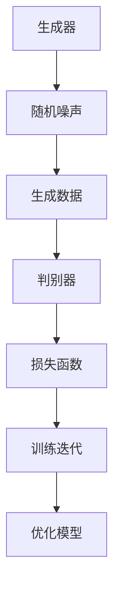
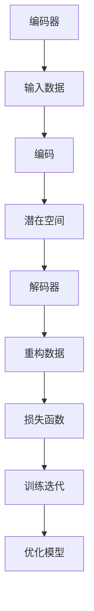
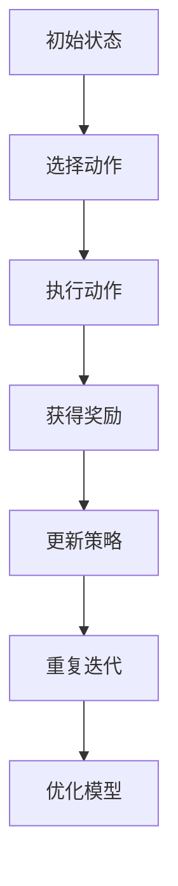

                 

# 人工智能在创意领域的应用与局限

> 关键词：人工智能、创意领域、应用实例、技术原理、行业挑战、未来趋势

> 摘要：本文深入探讨了人工智能在创意领域的应用与局限。首先，我们介绍了人工智能与创意领域的结合背景和现状，随后通过实际案例展示了人工智能在艺术创作、设计领域和影视制作中的应用。接下来，我们解析了相关技术原理，包括生成对抗网络（GAN）、变分自编码器（VAE）和强化学习等。随后，我们分析了该领域面临的挑战和局限性，如数据质量、创意个性和法律伦理问题。最后，我们对未来趋势进行了展望，探讨了跨学科合作和人工智能伦理的重要性。本文旨在为读者提供一个全面而深入的视角，以更好地理解人工智能在创意领域的潜力与局限性。

## 引言

### 问题背景

随着人工智能（AI）技术的迅猛发展，其在各个领域的应用越来越广泛。创意领域，作为人类智慧和想象力的结晶，自然也成为人工智能关注的焦点。从艺术创作到设计、从剧本编写到影视制作，人工智能的介入正逐步改变这些领域的传统工作方式。然而，人工智能在创意领域的应用并非一帆风顺，其潜力和局限性同样引人深思。

### 目标

本文旨在探讨人工智能在创意领域的应用与局限，具体目标如下：

1. **探讨人工智能与创意领域的结合背景和现状**：了解人工智能在创意领域的应用场景和实际效果。
2. **展示人工智能在创意领域的应用实例**：通过具体案例分析，展示人工智能如何在实际创意项目中发挥作用。
3. **解析相关技术原理**：深入探讨生成对抗网络（GAN）、变分自编码器（VAE）和强化学习等技术在创意领域的应用。
4. **分析行业挑战与局限性**：探讨人工智能在创意领域应用过程中面临的挑战和局限性。
5. **展望未来趋势**：探讨人工智能在创意领域的未来发展趋势和方向。

## 第1章：人工智能与创意领域概述

### 1.1 问题背景与定义

#### 创意领域的现状

创意领域涵盖了艺术、设计、文学、影视等多个子领域，这些领域以其独特的创造性和想象力为特征，是人类文化和社会进步的重要推动力量。随着数字化和信息化的深入发展，创意领域也面临着新的机遇和挑战。

#### 人工智能的兴起

人工智能（AI）作为计算机科学的一个重要分支，近年来取得了长足的进步。从早期的规则系统到现在的深度学习，人工智能在图像识别、自然语言处理、决策优化等多个领域取得了显著成果。这些技术的不断进步为人工智能在创意领域的应用提供了强有力的支持。

#### 人工智能与创意领域的关系

人工智能与创意领域的结合不仅改变了传统的工作方式，还为创意工作带来了新的可能性。例如，人工智能可以自动生成音乐、图像和文字，帮助创意工作者提高工作效率，拓展创作空间。然而，人工智能在创意领域的应用也带来了新的挑战，如创意个性的保护和版权问题等。

### 1.2 核心概念与原理

#### 人工智能基础

人工智能的核心概念包括机器学习、深度学习、神经网络等。这些技术为人工智能在创意领域的应用提供了理论基础。

#### 创意领域的关键概念

创意领域的核心概念包括创意思维、创造性、想象力等。这些概念是理解人工智能在创意领域应用的关键。

#### 人工智能在创意领域的应用原理

人工智能在创意领域的应用主要依赖于机器学习和深度学习技术。这些技术可以帮助人工智能理解和生成创意内容，从而实现创意工作的自动化和智能化。

## 第2章：人工智能在创意领域的应用实例

### 2.1 艺术创作

#### 2.1.1 音乐创作

人工智能在音乐创作领域的应用主要体现在自动生成旋律、和声和节奏等方面。通过深度学习和生成对抗网络（GAN）等技术，人工智能可以生成具有独特风格和旋律的音乐作品。例如，Google的Magenta项目就利用深度学习技术生成音乐和艺术作品。

#### 2.1.2 图像生成

人工智能在图像生成领域的应用主要体现在自动生成图像、图像编辑和图像风格转换等方面。通过变分自编码器（VAE）和生成对抗网络（GAN）等技术，人工智能可以生成高质量的艺术图像。例如，DeepArt.io项目利用GAN技术实现图像风格转换，将一幅普通的照片转换为梵高风格的画作。

#### 2.1.3 文学创作

人工智能在文学创作领域的应用主要体现在自动生成诗歌、故事和剧本等方面。通过自然语言处理和生成模型等技术，人工智能可以生成具有逻辑性和情感性的文本。例如，OpenAI的GPT-3模型可以生成高质量的文章和诗歌。

### 2.2 设计领域

#### 2.2.1 UI/UX设计

人工智能在UI/UX设计领域的应用主要体现在自动生成界面布局、色彩搭配和交互设计等方面。通过机器学习和深度学习技术，人工智能可以生成符合用户需求和审美标准的界面设计。例如，DesigNSA项目利用生成对抗网络（GAN）技术实现界面设计的自动化。

#### 2.2.2 广告创意

人工智能在广告创意领域的应用主要体现在自动生成广告文案、广告视频和广告图像等方面。通过自然语言处理和图像生成技术，人工智能可以生成具有吸引力和创意的广告内容。例如，AI Advertising项目利用生成对抗网络（GAN）技术实现广告视频的自动化生成。

#### 2.2.3 建筑设计

人工智能在建筑设计领域的应用主要体现在自动生成建筑方案、空间布局和材料选择等方面。通过机器学习和深度学习技术，人工智能可以生成符合建筑规范和美学要求的建筑设计方案。例如，AI Architect项目利用生成对抗网络（GAN）技术实现建筑设计的自动化。

### 2.3 影视制作

#### 2.3.1 剧本创作

人工智能在剧本创作领域的应用主要体现在自动生成剧本、剧本构思和剧本优化等方面。通过自然语言处理和生成模型等技术，人工智能可以生成具有创意和逻辑性的剧本。例如，AI Script Writer项目利用生成模型技术实现剧本的自动化生成。

#### 2.3.2 视觉特效

人工智能在视觉特效领域的应用主要体现在自动生成视觉效果、特效制作和特效优化等方面。通过计算机视觉和图像处理技术，人工智能可以生成高质量的电影特效。例如，AI Visual Effects项目利用深度学习技术实现视觉特效的自动化生成。

#### 2.3.3 剪辑与后期制作

人工智能在剪辑与后期制作领域的应用主要体现在自动生成剪辑序列、音效设计和后期优化等方面。通过音频处理和视频处理技术，人工智能可以生成高质量的影视作品。例如，AI Editor项目利用生成对抗网络（GAN）技术实现剪辑和后期制作的自动化。

## 第3章：技术原理与算法

### 3.1 算法介绍

#### 3.1.1 生成对抗网络（GAN）

生成对抗网络（GAN）是由Ian Goodfellow等人于2014年提出的一种深度学习模型，它由生成器和判别器两个部分组成。生成器的目标是生成与真实数据相近的假数据，判别器的目标是区分假数据和真实数据。通过两个模型的对抗训练，生成器可以不断优化，最终生成高质量的数据。

#### 3.1.2 变分自编码器（VAE）

变分自编码器（VAE）是一种基于概率模型的深度学习模型，它通过编码器和解码器两个部分实现数据的编码和解码。编码器将输入数据映射到一个潜在空间中，解码器从潜在空间中生成输出数据。VAE通过引入隐变量，可以生成多样性的数据。

#### 3.1.3 强化学习

强化学习是一种通过奖励机制来训练模型的学习方法。在强化学习中，模型通过与环境互动，不断优化其策略，以最大化累积奖励。强化学习在创意领域的应用主要体现在自动生成序列数据，如音乐、故事和剧本等。

### 3.2 数学模型与公式

#### 3.2.1 GAN的数学模型

GAN的数学模型主要包括生成器的损失函数和判别器的损失函数。生成器的损失函数为：

\[ L_G = -\log(D(G(z))) \]

判别器的损失函数为：

\[ L_D = -\log(D(x)) - \log(1 - D(G(z))) \]

其中，\( D \) 表示判别器，\( G \) 表示生成器，\( z \) 表示随机噪声。

#### 3.2.2 VAE的数学模型

VAE的数学模型主要包括编码器和解码器的损失函数。编码器的损失函数为：

\[ L_E = -\sum_{i=1}^{n} \log(p(x_i | \theta_E)) \]

解码器的损失函数为：

\[ L_D = -\sum_{i=1}^{n} \log(p(x_i | \theta_D)) \]

其中，\( p \) 表示概率分布，\( \theta_E \) 和 \( \theta_D \) 分别表示编码器和解码器的参数。

#### 3.2.3 强化学习的数学模型

强化学习的数学模型主要包括状态（\( s \)）、动作（\( a \)）、奖励（\( r \)）和策略（\( \pi \)）。其核心方程为：

\[ Q(s, a) = r + \gamma \max_{a'} Q(s', a') \]

其中，\( Q \) 表示值函数，\( \gamma \) 表示折扣因子。

### 3.3 算法实现与流程图

#### 3.3.1 GAN的流程图

#### 3.3.2 VAE的流程图

#### 3.3.3 强化学习的流程图

## 第4章：行业挑战与局限性

### 4.1 难题分析

#### 4.1.1 数据质量问题

人工智能在创意领域的应用依赖于大量高质量的数据。然而，创意领域的数据往往具有多样性和复杂性，这给数据质量提出了更高的要求。数据清洗、标注和整合等步骤都需要大量的时间和人力资源。

#### 4.1.2 创意个性问题

创意工作具有很强的个性化特征，人工智能难以完全复制人类创意者的独特风格和个性。如何确保人工智能生成的创意内容具有人类创意的特质，是当前面临的一大挑战。

#### 4.1.3 法律与伦理问题

人工智能在创意领域的应用引发了一系列法律和伦理问题。例如，如何界定人工智能生成的作品的版权，如何确保人工智能在创意过程中的道德规范等。

### 4.2 案例分析

#### 4.2.1 案例一：某音乐公司的AI音乐创作实践

某音乐公司利用人工智能技术进行音乐创作。通过分析大量音乐数据，人工智能生成了具有独特风格的音乐作品。然而，这些作品在市场上并未受到广泛认可，主要原因在于其缺乏人类的情感和个性。

#### 4.2.2 案例二：某设计公司的AI设计应用

某设计公司利用人工智能技术进行界面设计。人工智能自动生成的界面设计在某些方面符合用户需求，但在创意和个性化方面仍存在不足。公司最终决定结合人工设计，以实现更好的设计效果。

#### 4.2.3 案例三：某电影制作公司的AI剧本生成尝试

某电影制作公司尝试利用人工智能生成剧本。通过分析大量剧本数据，人工智能生成了多个剧本。然而，这些剧本在情节和人物塑造方面仍存在不足，需要人工进行修改和优化。

## 第5章：未来趋势与展望

### 5.1 技术发展趋势

#### 5.1.1 AI算法的进步

随着深度学习、生成模型和强化学习等技术的不断进步，人工智能在创意领域的应用将更加广泛和深入。新的算法和技术将进一步提升人工智能在创意生成、编辑和优化等方面的能力。

#### 5.1.2 跨学科融合

人工智能与创意领域的融合将带动跨学科的发展。例如，人工智能与艺术、设计、文学等领域的交叉研究将产生新的创意形式和表达方式。

#### 5.1.3 人工智能伦理

随着人工智能在创意领域的应用，相关伦理问题将日益突出。如何确保人工智能在创意过程中的道德规范，保护创意者的权益，将成为未来研究的重要方向。

### 5.2 行业前景

#### 5.2.1 创意行业的变革

人工智能的介入将引发创意行业的深刻变革。传统的创意工作方式将逐步被人工智能取代，创意工作将更加智能化和自动化。

#### 5.2.2 市场需求预测

随着人们对创意产品的需求不断增加，人工智能在创意领域的应用将具有巨大的市场需求。未来，人工智能将成为创意行业的重要工具和驱动力。

#### 5.2.3 政策与经济环境的影响

政府政策和经济环境将影响人工智能在创意领域的发展。相关政策和支持将有助于推动人工智能在创意领域的应用，促进创意产业的繁荣。

## 结论与建议

本文探讨了人工智能在创意领域的应用与局限。通过分析实际案例、技术原理和行业挑战，我们发现人工智能在创意领域具有巨大的潜力，但也面临一些挑战。未来，随着技术的不断进步和跨学科融合，人工智能在创意领域的应用将更加广泛和深入。我们建议加强人工智能在创意领域的理论研究和技术开发，同时关注相关伦理和法律问题，以实现人工智能与创意领域的和谐发展。

## 参考文献

1. Goodfellow, I., Pouget-Abadie, J., Mirza, M., Xu, B., Warde-Farley, D., Ozair, S., ... & Bengio, Y. (2014). Generative adversarial nets. Advances in neural information processing systems, 27.
2. Kingma, D. P., & Welling, M. (2014). Auto-encoding variational bayes. arXiv preprint arXiv:1312.6114.
3. Sutton, R. S., & Barto, A. G. (2018). Introduction to reinforcement learning (2nd ed.). MIT Press.
4. Bengio, Y. (2009). Learning deep architectures for AI. Foundations and Trends in Machine Learning, 2(1), 1-127.

## 作者信息

作者：AI天才研究院/AI Genius Institute & 禅与计算机程序设计艺术 /Zen And The Art of Computer Programming

