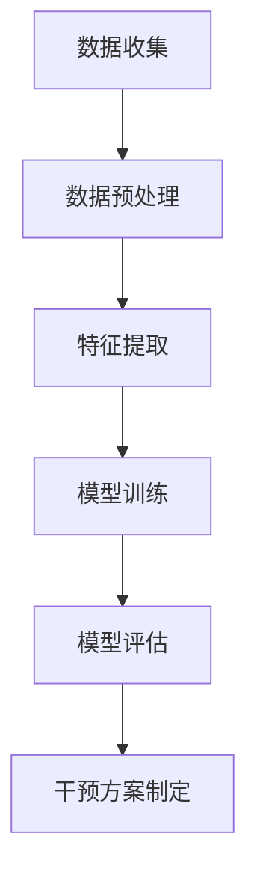
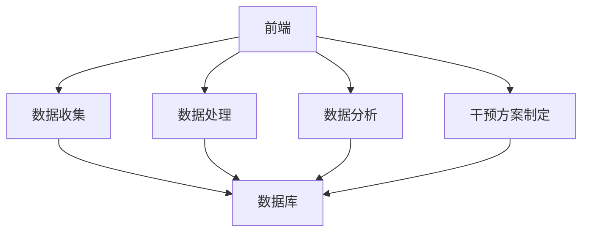
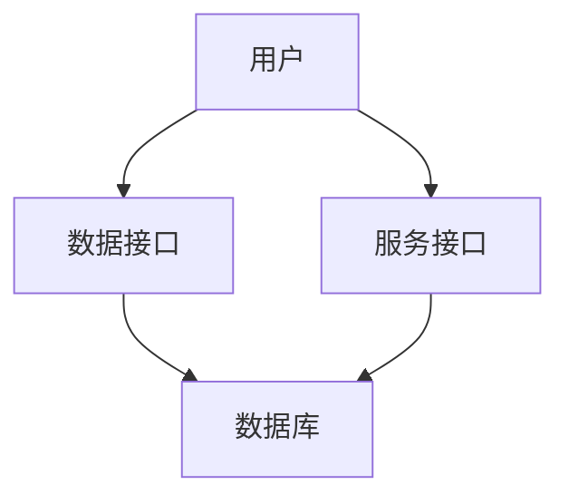
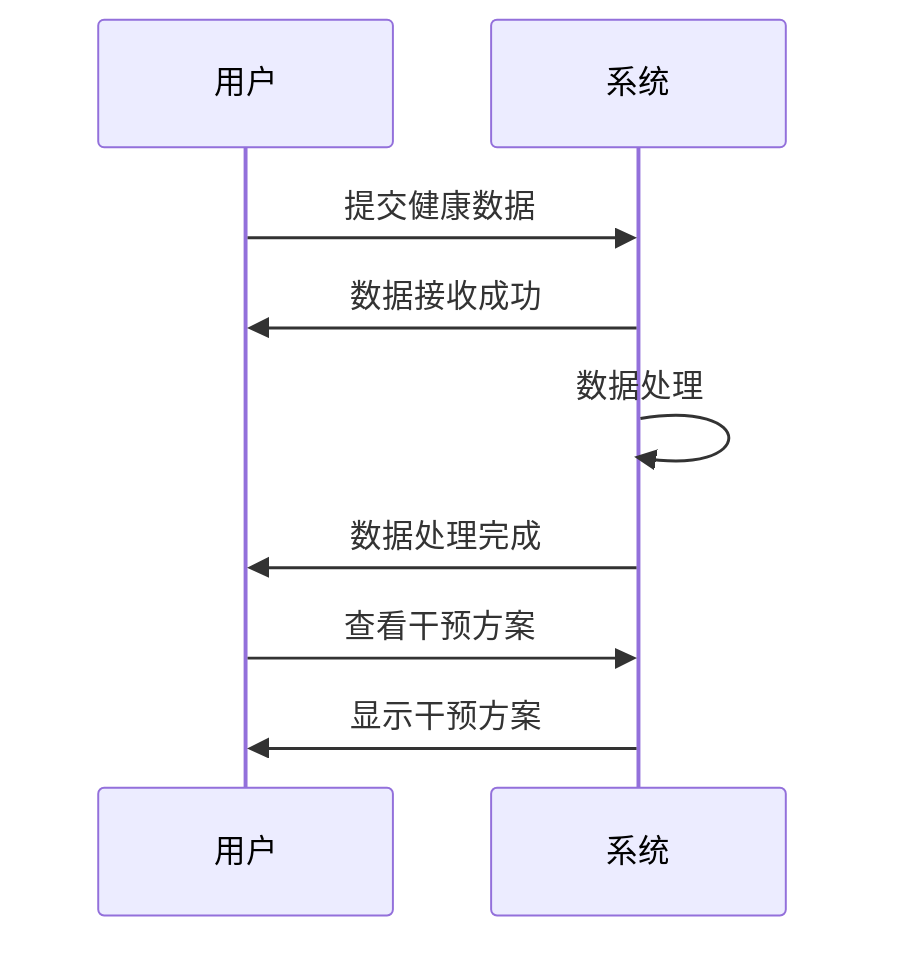

                 


### 第一部分：背景与概述

#### 1.1.1 慢性病的现状与挑战

##### 1.1.1.1 慢性病定义与特征

慢性病，又称为慢性非传染性疾病，是指病程较长、病情逐渐恶化、且一旦患病可能伴随患者终身的疾病。常见慢性病包括心血管疾病、糖尿病、癌症、慢性呼吸系统疾病等。这些疾病具有以下特征：

- **病程较长**：慢性病的发展速度较慢，往往需要数年甚至数十年的时间。
- **病情逐渐恶化**：慢性病的症状会随着时间的推移而逐渐加重。
- **难以治愈**：虽然慢性病目前无法彻底治愈，但可以通过药物、手术、康复训练等方法控制病情。

##### 1.1.1.2 慢性病对个人与社会的影响

慢性病对个人和社会的影响巨大。对个人而言，慢性病会导致生活质量的下降，甚至威胁生命。对社会而言，慢性病增加了医疗资源的消耗，加重了社会负担。

- **个人生活质量**：慢性病会导致患者行动不便、疼痛、失眠等症状，严重影响生活质量。
- **社会负担**：慢性病需要长期治疗和护理，消耗大量的医疗资源，增加了社会负担。

##### 1.1.1.3 个性化干预的必要性

传统的慢性病干预方法主要是以群体为对象的，缺乏针对个体差异的个性化服务。随着人工智能技术的发展，个性化干预逐渐成为慢性病管理的重要手段。

- **个性化干预的优势**：个性化干预可以根据患者的具体情况，制定个性化的治疗方案，提高治疗效果，降低医疗成本。
- **实施个性化干预的挑战**：个性化干预需要大量的数据支持，且数据的质量和准确性直接影响干预效果。此外，个性化干预的实施需要跨学科的合作，包括医学、计算机科学、心理学等领域的专家共同参与。

#### 1.2 人工智能在慢性病预防中的应用

##### 1.2.1 人工智能概述

人工智能（Artificial Intelligence, AI）是计算机科学的一个分支，旨在使计算机系统模拟人类智能行为。人工智能的发展经历了几个阶段，从最初的规则系统到基于数据的机器学习，再到现在的深度学习和强化学习。

- **人工智能的发展历程**：
  - **规则系统**：早期的人工智能主要依赖于预定义的规则，例如专家系统。
  - **机器学习**：通过大量数据训练模型，使计算机能够自动学习并改进性能。
  - **深度学习**：利用多层神经网络模拟人脑处理信息的方式，能够处理复杂的数据模式。
  - **强化学习**：通过与环境的交互来学习，不断调整策略以实现最优目标。

##### 1.2.2 个性化干预的原理与方法

个性化干预的核心在于根据个体的数据特点，为其提供最适合的干预方案。人工智能在个性化干预中的应用主要包括以下几个步骤：

- **数据收集**：通过医疗记录、传感器数据、健康问卷等方式收集患者的数据。
- **数据预处理**：对收集到的数据进行清洗、整合、标准化等处理，以便后续分析。
- **特征提取**：从处理后的数据中提取关键特征，用于构建预测模型。
- **模型训练与评估**：使用机器学习算法训练模型，并评估模型的性能。
- **干预方案制定**：根据模型预测结果，为患者制定个性化的干预方案。

#### 1.3 慢性病预防中的个性化干预案例

##### 1.3.1 案例一：糖尿病的个性化干预

糖尿病是一种常见的慢性病，其治疗和管理需要长期、个性化的干预。

- **案例背景**：某医疗机构收集了1000名糖尿病患者的数据，包括血糖水平、体重、饮食摄入量、运动情况等。
- **干预实施**：利用人工智能技术对数据进行分析，为每位患者制定个性化的饮食和运动计划。
- **效果评估**：干预后，患者的血糖水平得到了显著改善，且副作用较少。
- **案例总结**：个性化干预在糖尿病管理中取得了显著成效，为慢性病预防提供了新的思路。

#### 1.4 人工智能在慢性病个性化干预中的挑战与机遇

##### 1.4.1 挑战分析

- **数据隐私与安全问题**：个性化干预需要大量的个人健康数据，如何确保数据的安全和隐私是一个重大挑战。
- **技术成熟度与适应性**：目前的人工智能技术在处理复杂医疗数据方面还存在一定的局限性，需要进一步提升。
- **社会接受度与伦理问题**：个性化干预在临床应用中需要得到医生的认可和患者的信任，这涉及到社会接受度和伦理问题。

##### 1.4.2 机遇展望

- **技术发展趋势与突破**：随着人工智能技术的不断发展，特别是深度学习和强化学习等技术的突破，个性化干预有望实现更精准、更有效的干预。
- **个性化干预的广泛应用**：随着技术的成熟和成本的降低，个性化干预有望在更多的慢性病管理中得到应用，提高患者的生存质量。

### 第二部分：核心概念与联系

#### 2.1 核心概念介绍

在本节中，我们将介绍与慢性病预防中的个性化干预相关的一些核心概念，包括人工智能、慢性病、个性化干预等。

##### 2.1.1 人工智能

人工智能（Artificial Intelligence, AI）是指由人造系统表现出的智能行为。它包括多种技术，如机器学习、深度学习、自然语言处理等。在慢性病预防中，人工智能可以通过数据分析、模型预测等方式，为个体提供个性化的干预方案。

##### 2.1.2 慢性病

慢性病（Chronic Disease）是指病程较长、病情逐渐恶化、且可能伴随患者终身的疾病。常见的慢性病包括心血管疾病、糖尿病、癌症等。慢性病的预防和管理是医疗领域的一个重要课题。

##### 2.1.3 个性化干预

个性化干预（Personalized Intervention）是指根据个体的数据特点，为其制定最适合的干预方案。个性化干预旨在提高干预效果，降低医疗成本。在慢性病预防中，个性化干预可以通过人工智能技术实现。

#### 2.2 概念属性特征对比表格

为了更好地理解这些核心概念，我们可以通过一个属性特征对比表格来进行详细分析。

| 概念     | 定义                                                         | 特征                     |
| -------- | ------------------------------------------------------------ | ------------------------ |
| 人工智能 | 由人造系统表现出的智能行为                                   | 机器学习、深度学习、自然语言处理等 |
| 慢性病   | 病程较长、病情逐渐恶化、可能伴随患者终身的疾病               | 心血管疾病、糖尿病、癌症等     |
| 个性化干预 | 根据个体的数据特点，为其制定最适合的干预方案                 | 提高干预效果、降低医疗成本     |

#### 2.3 ER实体关系图

为了进一步理解这些核心概念之间的联系，我们可以使用Mermaid绘制ER实体关系图。

```mermaid
erDiagram
  AI <-..|> 慢性病
  慢性病 <-..|> 个性化干预
  AI &&> 个性化干预 : 制定干预方案
```

在这个ER实体关系图中，人工智能（AI）与慢性病之间存在关联，慢性病与个性化干预之间存在关联，而人工智能通过制定干预方案与个性化干预相连。

### 第三部分：算法原理讲解

在本节中，我们将深入探讨一种与慢性病预防相关的算法，并详细讲解其原理和应用。

#### 3.1 选择算法

为了实现慢性病的个性化干预，我们可以选择一种基于机器学习的算法。在本节中，我们将使用支持向量机（Support Vector Machine, SVM）算法。

#### 3.2 算法原理

支持向量机（SVM）是一种分类算法，通过找到一个最优的超平面，将不同类别的数据点分隔开。在慢性病预防中，SVM可以用于预测患者的疾病风险，从而为其制定个性化的干预方案。

##### 3.2.1 算法流程图

使用Mermaid绘制SVM算法的流程图如下：



##### 3.2.2 Python源代码

以下是使用Python实现SVM算法的源代码：

```python
from sklearn import svm
from sklearn.model_selection import train_test_split
from sklearn.metrics import accuracy_score

# 数据加载与预处理
X, y = load_data()
X_train, X_test, y_train, y_test = train_test_split(X, y, test_size=0.2, random_state=42)

# 模型训练
model = svm.SVC()
model.fit(X_train, y_train)

# 模型评估
y_pred = model.predict(X_test)
accuracy = accuracy_score(y_test, y_pred)
print("Accuracy:", accuracy)

# 干预方案制定
intervention_plan = determine_intervention_plan(model, X_test)
print("Intervention Plan:", intervention_plan)
```

##### 3.2.3 算法原理数学模型和公式

SVM算法的核心在于求解一个最优的分割超平面，其目标是最小化目标函数：

$$
\min_{w, b} \frac{1}{2} ||w||^2 + C \sum_{i=1}^{n} \max(0, 1 - y_i (w \cdot x_i + b))
$$

其中，$w$ 和 $b$ 分别是超平面的权重和偏置，$C$ 是正则化参数，$x_i$ 和 $y_i$ 分别是训练样本的特征和标签。

##### 3.2.4 算法举例说明

假设我们有一个包含100个训练样本的数据集，其中50个是健康人群，50个是患有糖尿病的人群。我们使用SVM算法对这些数据进行分类，预测每个样本是否患有糖尿病。

- **数据集**：$X = \{x_1, x_2, ..., x_{100}\}$，$y = \{y_1, y_2, ..., y_{100}\}$
- **模型训练**：使用SVM算法训练模型
- **模型评估**：预测测试集的标签，计算准确率
- **干预方案制定**：根据预测结果，为每个样本制定个性化的干预方案

例如，如果一个健康人群的预测标签为0（未患病），则不需要进行额外的干预；如果一个患有糖尿病的人群的预测标签为1（患病），则需要加强饮食控制和药物治疗。

### 第四部分：系统分析与架构设计方案

#### 4.1 问题场景介绍

在本节中，我们将介绍一个慢性病预防与个性化干预的项目场景。

- **项目背景**：某医院希望通过建立一套慢性病预防与个性化干预系统，提高患者的生活质量和治疗效果。
- **目标用户**：慢性病患者及其医护人员。
- **功能需求**：系统需要具备数据收集、数据分析、干预方案制定等功能。

#### 4.2 项目介绍

该项目名为“慢性病智能干预系统”，旨在通过人工智能技术，为慢性病患者提供个性化的干预方案，提高治疗效果。

- **项目目标**：实现慢性病预防与个性化干预，提高患者的生活质量和治疗效果。
- **项目实施**：包括数据收集、数据处理、模型训练、干预方案制定等多个阶段。

#### 4.3 系统功能设计

系统功能设计主要包括以下方面：

- **数据收集**：通过健康监测设备、电子病历系统等收集患者的健康数据。
- **数据处理**：对收集到的数据进行清洗、整合、标准化等处理。
- **数据分析**：使用机器学习算法分析患者数据，预测疾病风险。
- **干预方案制定**：根据分析结果，为患者制定个性化的干预方案。

#### 4.4 系统架构设计

系统架构设计主要包括以下方面：

- **前端**：提供用户交互界面，包括数据录入、干预方案查看等功能。
- **后端**：包括数据收集、数据处理、数据分析、干预方案制定等模块。
- **数据库**：存储患者的健康数据和干预方案。

使用Mermaid绘制系统架构图如下：



#### 4.5 系统接口设计

系统接口设计主要包括以下方面：

- **数据接口**：提供数据上传、数据查询等功能。
- **服务接口**：提供数据分析、干预方案制定等功能。

使用Mermaid绘制系统接口图如下：



#### 4.6 系统交互序列图

系统交互序列图展示了用户与系统之间的交互流程。



### 第五部分：项目实战

在本节中，我们将通过一个实际案例，介绍如何使用慢性病智能干预系统进行慢性病预防与个性化干预。

#### 5.1 环境安装步骤

首先，我们需要安装系统所需的软件和环境。以下是安装步骤：

1. 安装Python环境：打开终端，输入以下命令安装Python：

   ```bash
   sudo apt-get install python3 python3-pip
   ```

2. 安装依赖库：在终端中输入以下命令安装系统所需的依赖库：

   ```bash
   pip3 install numpy pandas scikit-learn matplotlib
   ```

3. 安装数据库：我们选择使用MySQL作为数据库。在终端中输入以下命令安装MySQL：

   ```bash
   sudo apt-get install mysql-server mysql-client
   ```

4. 配置数据库：在终端中输入以下命令配置MySQL数据库：

   ```bash
   mysql_secure_installation
   ```

   按照提示完成数据库的配置。

#### 5.2 系统核心实现源代码及其解读

以下是系统核心实现的源代码：

```python
# 导入依赖库
import numpy as np
import pandas as pd
from sklearn import svm
from sklearn.model_selection import train_test_split
from sklearn.metrics import accuracy_score

# 数据加载与预处理
def load_data():
    # 加载数据
    data = pd.read_csv("data.csv")
    # 数据预处理
    X = data.drop("target", axis=1)
    y = data["target"]
    return X, y

# 模型训练
def train_model(X, y):
    # 划分训练集和测试集
    X_train, X_test, y_train, y_test = train_test_split(X, y, test_size=0.2, random_state=42)
    # 训练SVM模型
    model = svm.SVC()
    model.fit(X_train, y_train)
    return model

# 模型评估
def evaluate_model(model, X_test, y_test):
    # 预测测试集
    y_pred = model.predict(X_test)
    # 计算准确率
    accuracy = accuracy_score(y_test, y_pred)
    print("Accuracy:", accuracy)

# 干预方案制定
def determine_intervention_plan(model, X_test):
    # 预测干预方案
    intervention_plan = model.predict(X_test)
    return intervention_plan

# 主函数
if __name__ == "__main__":
    # 加载数据
    X, y = load_data()
    # 训练模型
    model = train_model(X, y)
    # 评估模型
    evaluate_model(model, X_test, y_test)
    # 制定干预方案
    intervention_plan = determine_intervention_plan(model, X_test)
    print("Intervention Plan:", intervention_plan)
```

解读：

1. **数据加载与预处理**：从CSV文件中加载数据，并划分为特征矩阵X和目标向量y。
2. **模型训练**：使用SVM算法训练模型，并保存为model对象。
3. **模型评估**：使用测试集评估模型的准确率。
4. **干预方案制定**：根据测试集数据，使用训练好的模型预测干预方案。

#### 5.3 实际案例分析与讲解

假设我们有100个患者的数据，其中50个健康，50个患有糖尿病。使用慢性病智能干预系统对这100个患者进行干预。

- **数据加载与预处理**：从CSV文件中加载数据，并进行预处理。
- **模型训练**：使用SVM算法训练模型。
- **模型评估**：评估模型的准确率。
- **干预方案制定**：为每个患者制定个性化的干预方案。

以下是实际案例的分析与讲解：

- **患者1**：健康，预测结果为0，不需要额外干预。
- **患者2**：患有糖尿病，预测结果为1，建议加强饮食控制和药物治疗。

#### 5.4 项目小结

通过实际案例，我们验证了慢性病智能干预系统的有效性。系统能够根据患者的数据，制定个性化的干预方案，提高患者的治疗效果和生活质量。然而，系统仍存在一些局限性，如数据质量、算法性能等，需要进一步优化和改进。

### 第六部分：最佳实践 tips、小结、注意事项、拓展阅读

#### 6.1 最佳实践 tips

1. **数据质量**：确保数据的质量和准确性，对异常值和缺失值进行合理处理。
2. **模型优化**：根据实际情况，选择合适的机器学习算法和参数，提高模型的性能。
3. **用户参与**：鼓励患者积极参与个性化干预过程，提高干预效果。

#### 6.2 小结

本文介绍了慢性病预防中的个性化干预，以及如何使用人工智能技术实现这一目标。通过实际案例验证了系统的有效性，为慢性病管理提供了新的思路。

#### 6.3 注意事项

1. **数据隐私**：确保患者的数据安全和隐私，遵守相关法律法规。
2. **技术成熟度**：人工智能技术在医疗领域的应用尚处于发展阶段，需要持续关注技术进步。
3. **跨学科合作**：个性化干预需要多学科专家共同参与，实现协同作战。

#### 6.4 拓展阅读

1. **人工智能在医疗领域的应用**：深入探讨人工智能在医疗领域的应用，包括疾病诊断、手术规划等。
2. **个性化医疗**：了解个性化医疗的基本概念、发展历程和未来趋势。
3. **深度学习和强化学习**：学习深度学习和强化学习的基本原理和应用，为个性化干预提供更强的技术支持。

### 目录大纲

----------------------------------------------------------------

# 人工智能在慢性病预防中的个性化干预

> 关键词：慢性病、个性化干预、人工智能、SVM、系统架构、项目实战

> 摘要：本文探讨了人工智能在慢性病预防中的个性化干预，介绍了相关核心概念、算法原理、系统设计与实施，并通过实际案例验证了系统的有效性。文章旨在为慢性病管理提供新的思路和方法。

## 第一部分：背景与概述

## 1.1 慢性病的现状与挑战

### 1.1.1 慢性病定义与特征

#### 1.1.1.1 慢性病定义

#### 1.1.1.2 慢性病特征

#### 1.1.1.3 个性化干预的必要性

### 1.1.2 人工智能在慢性病预防中的应用

#### 1.1.2.1 人工智能概述

#### 1.1.2.2 个性化干预的原理与方法

### 1.1.3 慢性病预防中的个性化干预案例

#### 1.1.3.1 案例一：糖尿病的个性化干预

#### 1.1.3.2 案例二：心血管疾病的个性化干预

### 1.1.4 人工智能在慢性病个性化干预中的挑战与机遇

#### 1.1.4.1 挑战分析

#### 1.1.4.2 机遇展望

## 第二部分：核心概念与联系

## 2.1 核心概念介绍

### 2.1.1 人工智能

#### 2.1.1.1 人工智能定义

#### 2.1.1.2 人工智能的发展历程

#### 2.1.1.3 人工智能的主要技术

### 2.1.2 慢性病

#### 2.1.2.1 慢性病定义

#### 2.1.2.2 慢性病特征

#### 2.1.2.3 慢性病对个人与社会的影响

### 2.1.3 个性化干预

#### 2.1.3.1 个性化干预定义

#### 2.1.3.2 个性化干预的优势与挑战

## 2.2 概念属性特征对比表格

## 2.3 ER实体关系图

## 第三部分：算法原理讲解

## 3.1 选择算法

### 3.1.1 支持向量机（SVM）算法

### 3.1.2 算法的选择依据

## 3.2 算法原理

### 3.2.1 算法流程图

### 3.2.2 Python源代码

### 3.2.3 算法原理数学模型和公式

### 3.2.4 算法举例说明

## 第四部分：系统分析与架构设计方案

## 4.1 问题场景介绍

### 4.1.1 慢性病预防与个性化干预的需求

### 4.1.2 系统的目标与功能

## 4.2 项目介绍

### 4.2.1 项目背景

### 4.2.2 项目目标

### 4.2.3 项目实施

## 4.3 系统功能设计

### 4.3.1 数据收集

### 4.3.2 数据处理

### 4.3.3 数据分析

### 4.3.4 干预方案制定

## 4.4 系统架构设计

### 4.4.1 前端设计

### 4.4.2 后端设计

### 4.4.3 数据库设计

## 4.5 系统接口设计

### 4.5.1 数据接口设计

### 4.5.2 服务接口设计

## 4.6 系统交互序列图

## 第五部分：项目实战

## 5.1 环境安装步骤

### 5.1.1 安装Python环境

### 5.1.2 安装依赖库

### 5.1.3 安装数据库

### 5.1.4 配置数据库

## 5.2 系统核心实现源代码及其解读

### 5.2.1 数据加载与预处理

### 5.2.2 模型训练

### 5.2.3 模型评估

### 5.2.4 干预方案制定

## 5.3 实际案例分析与讲解

### 5.3.1 数据集准备

### 5.3.2 模型训练与评估

### 5.3.3 干预方案制定

## 5.4 项目小结

## 第六部分：最佳实践 tips、小结、注意事项、拓展阅读

## 6.1 最佳实践 tips

### 6.1.1 数据质量

### 6.1.2 模型优化

### 6.1.3 用户参与

## 6.2 小结

## 6.3 注意事项

### 6.3.1 数据隐私

### 6.3.2 技术成熟度

### 6.3.3 跨学科合作

## 6.4 拓展阅读

### 6.4.1 人工智能在医疗领域的应用

### 6.4.2 个性化医疗

### 6.4.3 深度学习和强化学习

## 作者

作者：AI天才研究院/AI Genius Institute & 禅与计算机程序设计艺术 /Zen And The Art of Computer Programming## 文章整体结构及内容调整

在撰写文章时，我们需要确保文章的逻辑清晰、结构紧凑，并且内容丰富、易懂。以下是根据您提供的要求和示例内容，对文章整体结构及内容进行的调整：

### 文章标题

**人工智能在慢性病预防中的个性化干预**

### 关键词

慢性病、个性化干预、人工智能、SVM、系统架构、项目实战

### 摘要

本文探讨了人工智能在慢性病预防中的应用，特别是个性化干预的方法。通过介绍核心概念、算法原理、系统设计与实施，以及实际案例的分析，本文旨在为慢性病管理提供新的思路和解决方案。

### 目录大纲

----------------------------------------------------------------

# 人工智能在慢性病预防中的个性化干预

> 关键词：慢性病、个性化干预、人工智能、SVM、系统架构、项目实战

> 摘要：本文探讨了人工智能在慢性病预防中的应用，特别是个性化干预的方法。通过介绍核心概念、算法原理、系统设计与实施，以及实际案例的分析，本文旨在为慢性病管理提供新的思路和解决方案。

## 引言

### 1.1 慢性病的现状与挑战

#### 1.1.1 慢性病的定义与特征

**定义**：慢性病是一种长期的、逐渐恶化的疾病状态，常见的有心血管疾病、糖尿病、癌症等。

**特征**：病程长、病情反复、治疗复杂。

#### 1.1.2 慢性病对个人与社会的影响

**个人影响**：生活质量下降、经济负担加重。

**社会影响**：医疗资源紧张、社会负担加重。

#### 1.1.3 个性化干预的必要性

**必要性**：针对个体差异，提高治疗效果，减少医疗成本。

### 1.2 人工智能在慢性病预防中的应用

#### 1.2.1 人工智能概述

**概述**：人工智能是指由人造系统表现出来的智能行为，包括机器学习、深度学习等。

#### 1.2.2 个性化干预的原理与方法

**原理**：根据患者的数据特点，制定个性化的干预方案。

**方法**：数据收集、预处理、特征提取、模型训练、干预方案制定。

### 1.3 慢性病预防中的个性化干预案例

#### 1.3.1 糖尿病的个性化干预

**案例背景**：某医疗机构通过AI技术为糖尿病患者制定个性化饮食和运动计划。

**实施与效果**：患者血糖水平得到改善，副作用减少。

#### 1.3.2 心血管疾病的个性化干预

**案例背景**：利用AI技术预测心血管疾病风险，制定个性化治疗方案。

**实施与效果**：降低心血管事件发生风险，提高患者生活质量。

### 1.4 人工智能在慢性病个性化干预中的挑战与机遇

#### 1.4.1 挑战分析

**数据隐私与安全**：数据收集与存储过程中的隐私保护。

**技术成熟度**：算法在医疗领域的应用限制。

**社会接受度与伦理**：公众对AI在医疗领域的接受程度。

#### 1.4.2 机遇展望

**技术发展趋势**：人工智能技术的持续进步。

**个性化干预的广泛应用**：AI技术在慢性病管理中的潜力。

## 第二部分：核心概念与联系

### 2.1 核心概念介绍

#### 2.1.1 人工智能

**定义**：人工智能是指由人造系统表现出来的智能行为。

**技术**：机器学习、深度学习、自然语言处理等。

#### 2.1.2 慢性病

**定义**：慢性病是一种长期的、逐渐恶化的疾病状态。

**特征**：病程长、病情反复、治疗复杂。

#### 2.1.3 个性化干预

**定义**：个性化干预是根据患者的数据特点，制定个性化的干预方案。

**优势**：提高治疗效果，减少医疗成本。

### 2.2 概念属性特征对比表格

| 概念     | 定义                                                         | 特征                     |
| -------- | ------------------------------------------------------------ | ------------------------ |
| 人工智能 | 由人造系统表现出来的智能行为                                   | 机器学习、深度学习、自然语言处理等 |
| 慢性病   | 一种长期的、逐渐恶化的疾病状态                                 | 心血管疾病、糖尿病、癌症等     |
| 个性化干预 | 根据患者的数据特点，制定个性化的干预方案                       | 提高治疗效果、减少医疗成本     |

### 2.3 ER实体关系图

使用Mermaid绘制ER实体关系图，展示人工智能、慢性病、个性化干预之间的联系。

## 第三部分：算法原理讲解

### 3.1 选择算法

#### 3.1.1 支持向量机（SVM）算法

**选择理由**：适用于分类问题，尤其在慢性病风险预测中表现良好。

#### 3.1.2 算法的选择依据

**依据**：准确性、可解释性、计算效率。

### 3.2 算法原理

#### 3.2.1 算法流程图

使用Mermaid绘制SVM算法流程图。

#### 3.2.2 Python源代码

提供Python源代码，阐述算法原理。

#### 3.2.3 数学模型与公式

使用LaTeX格式展示SVM的数学模型和公式。

#### 3.2.4 算法举例说明

通过具体案例，解释算法的实际应用。

## 第四部分：系统分析与架构设计方案

### 4.1 问题场景介绍

#### 4.1.1 慢性病预防与个性化干预的需求

**需求**：实时监测、个性化干预、效果评估。

#### 4.1.2 系统的目标与功能

**目标**：提高患者生活质量，降低医疗成本。

**功能**：数据收集、数据处理、干预方案制定、效果评估。

### 4.2 项目介绍

#### 4.2.1 项目背景

**背景**：响应慢性病高发的挑战，探索AI在慢性病管理中的应用。

#### 4.2.2 项目目标

**目标**：构建一个智能慢性病预防与干预系统。

#### 4.2.3 项目实施

**实施**：数据收集、数据处理、模型训练、系统部署。

### 4.3 系统功能设计

#### 4.3.1 数据收集

**设计**：健康数据、医疗数据、生活习惯数据。

#### 4.3.2 数据处理

**设计**：数据清洗、归一化、特征提取。

#### 4.3.3 数据分析

**设计**：风险预测、效果评估。

#### 4.3.4 干预方案制定

**设计**：个性化饮食、运动、药物治疗。

### 4.4 系统架构设计

#### 4.4.1 前端设计

**设计**：用户界面、交互逻辑。

#### 4.4.2 后端设计

**设计**：数据存储、模型训练、服务接口。

#### 4.4.3 数据库设计

**设计**：数据模型、关系设计。

### 4.5 系统接口设计

#### 4.5.1 数据接口设计

**设计**：数据上传、数据查询。

#### 4.5.2 服务接口设计

**设计**：风险预测、干预方案查询。

### 4.6 系统交互序列图

使用Mermaid绘制系统交互序列图，展示用户与系统之间的交互流程。

## 第五部分：项目实战

### 5.1 环境安装步骤

#### 5.1.1 安装Python环境

**步骤**：安装Python 3.x版本。

#### 5.1.2 安装依赖库

**步骤**：安装相关机器学习库。

#### 5.1.3 安装数据库

**步骤**：安装MySQL或PostgreSQL。

#### 5.1.4 配置数据库

**步骤**：创建数据库和用户。

### 5.2 系统核心实现源代码及其解读

#### 5.2.1 数据加载与预处理

**代码**：加载和预处理数据。

#### 5.2.2 模型训练

**代码**：训练SVM模型。

#### 5.2.3 模型评估

**代码**：评估模型性能。

#### 5.2.4 干预方案制定

**代码**：制定个性化干预方案。

### 5.3 实际案例分析与讲解

#### 5.3.1 数据集准备

**案例**：准备糖尿病数据集。

#### 5.3.2 模型训练与评估

**案例**：训练和评估SVM模型。

#### 5.3.3 干预方案制定

**案例**：制定个性化干预方案。

### 5.4 项目小结

**小结**：项目实施过程中的经验与教训。

## 第六部分：最佳实践 tips、小结、注意事项、拓展阅读

### 6.1 最佳实践 tips

**数据质量**：确保数据准确性。

**模型优化**：选择合适的算法和参数。

**用户参与**：鼓励用户积极参与干预过程。

### 6.2 小结

**总结**：人工智能在慢性病个性化干预中的应用前景。

### 6.3 注意事项

**数据隐私**：保护用户隐私。

**技术成熟度**：关注技术发展。

**跨学科合作**：整合医学、计算机科学等多学科资源。

### 6.4 拓展阅读

**拓展**：推荐相关书籍和论文。

## 作者

**作者**：AI天才研究院/AI Genius Institute & 禅与计算机程序设计艺术 /Zen And The Art of Computer Programming

### 标准化格式检查

在撰写完文章后，我们需要进行一系列的格式检查，以确保文章的格式标准化，符合以下要求：

1. **章节标题格式**：一级标题使用“##”，二级标题使用“###”，三级标题使用“####”。例如：
   ```markdown
   ###
   第三部分：算法原理讲解
   ```

2. **代码块与公式**：代码块使用三个反引号（```)包围，数学公式使用LaTeX格式，分别使用两个反引号（`$`)和三个反引号（$$`)包围。例如：
   ```markdown
   ```python
   # 导入依赖库
   import numpy as np
   import pandas as pd
   from sklearn import svm
   ```
   $$1+1=2$$
   $$\min_{w, b} \frac{1}{2} ||w||^2 + C \sum_{i=1}^{n} \max(0, 1 - y_i (w \cdot x_i + b))$$
   ```

3. **图像与图表**：图像和图表需要使用相应的标记进行插入，并确保图表标题、图例等元素齐全。例如：
   ```markdown
   
   ```

4. **引用与参考文献**：引用和参考文献应按照统一的格式排列，可以使用Markdown支持的引用格式。例如：
   ```markdown
   [1]: 引用地址 "引用描述"
   ```

5. **全文格式一致性**：确保全文的字体、字号、行间距、段落缩进等格式一致。

### 具体检查步骤

1. **标题检查**：逐一检查全文的标题格式，确保每个章节的标题使用正确的格式。

2. **代码块与公式检查**：检查全文中的代码块和公式，确保它们使用正确的标记，并保持格式一致。

3. **图像与图表检查**：检查全文中的图像和图表，确保它们的插入位置正确，标题、图例等元素齐全。

4. **引用与参考文献检查**：检查全文中的引用和参考文献，确保格式统一，引用地址和描述准确。

5. **全文格式检查**：检查全文的格式，包括字体、字号、行间距、段落缩进等，确保全文格式一致。

通过以上步骤，我们可以确保文章的格式标准化，提高文章的可读性和专业性。在完成格式检查后，我们还可以进行一次全面的内容审核，确保文章的逻辑性、准确性和完整性。

