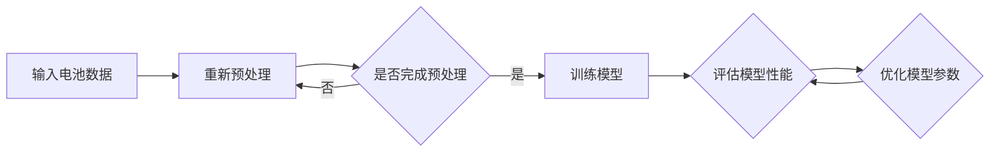
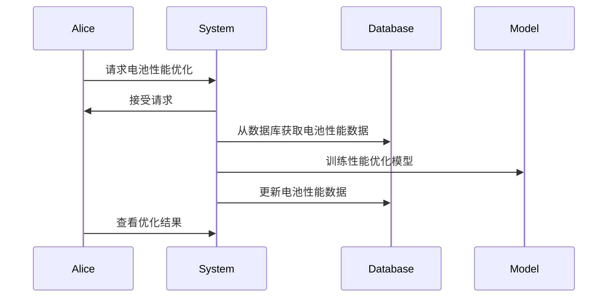
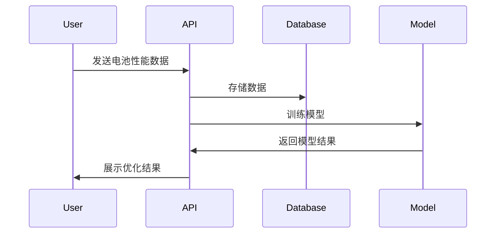
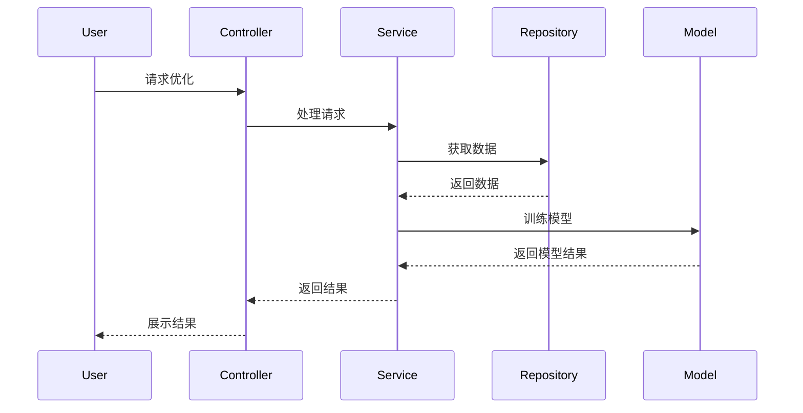

                 


# 人工智能在新能源电池研发中的应用

> 关键词：人工智能、新能源电池、电池性能优化、锂电池、算法、Python

> 摘要：随着全球对可再生能源需求的增加，新能源电池的研究与开发变得尤为重要。人工智能技术为新能源电池的研发提供了新的思路和方法。本文将探讨人工智能在新能源电池研发中的应用，包括核心概念、应用场景、研究进展以及未来发展趋势。

## 背景介绍

### 核心概念术语说明

**人工智能**：模拟人类智能的计算机系统，能够通过学习、推理和自我优化来适应复杂环境。

**新能源电池**：以可再生能源为能量来源的电池，如锂离子电池、固态电池、钠离子电池等。

**电池性能优化**：通过改进电池的设计、材料和制造工艺，提高电池的能量密度、功率密度、循环寿命等性能指标。

### 问题背景

随着全球对环境保护和可持续发展的关注，新能源电池作为可再生能源的储能装置，成为研究的热点。然而，新能源电池的性能优化面临着诸多挑战，如提高能量密度、降低成本、延长循环寿命等。

### 问题描述

新能源电池的性能优化是一个复杂的过程，涉及多个变量和参数。传统的优化方法往往依赖于经验和试验，效率低下且难以达到最佳效果。人工智能技术的引入为新能源电池性能优化提供了新的解决方案。

### 问题解决

人工智能技术可以通过以下方式解决新能源电池性能优化的问题：

1. **数据分析**：利用机器学习算法对电池性能数据进行挖掘和分析，识别关键影响因素。
2. **优化算法**：设计高效的优化算法，如遗传算法、粒子群优化等，对电池性能进行优化。
3. **仿真模拟**：通过人工智能技术进行仿真模拟，预测不同参数对电池性能的影响，指导实际优化过程。

### 边界与外延

**边界**：新能源电池性能优化的人工智能应用主要集中在电池设计和制造环节，如电池材料的选择、结构设计、生产工艺等。

**外延**：人工智能在新能源电池性能优化中的应用可以扩展到电池系统的整体优化，如电池组管理、能量调度等。

## 核心概念与联系

### 核心概念

**人工智能**：一种模拟人类智能的计算机系统，具有学习、推理、自我优化等能力。

**新能源电池**：以可再生能源为能量来源的电池，包括锂离子电池、固态电池、钠离子电池等。

**电池性能优化**：通过改进电池的设计、材料和制造工艺，提高电池的性能指标。

### 概念属性特征对比表格

| 概念          | 特征                                      |
|---------------|------------------------------------------|
| 人工智能      | 自我学习、自我优化、自适应环境           |
| 新能源电池    | 可再生能源驱动、高效能量存储、环境友好   |
| 电池性能优化   | 提高性能指标、降低成本、提高生产效率     |

### ER实体关系图架构

```mermaid
erDiagram
  AI系统 --> 电池研发项目
  AI系统 --> 数据分析模型
  电池研发项目 --> 新能源电池
  数据分析模型 --> 电池性能参数
```

## 算法原理讲解

### 算法原理与流程图

使用 Mermaid 画出算法流程图：



### Python 源代码与详细讲解

```python
# Python 源代码示例：电池性能优化模型
import numpy as np
from sklearn.model_selection import train_test_split
from sklearn.ensemble import RandomForestRegressor

# 假设已获取电池性能数据
battery_data = np.array([...])  # 形状为 (n_samples, n_features)

# 数据预处理
X = battery_data[:, :-1]  # 特征矩阵
y = battery_data[:, -1]   # 标签向量

# 划分训练集和测试集
X_train, X_test, y_train, y_test = train_test_split(X, y, test_size=0.2, random_state=42)

# 训练随机森林回归模型
model = RandomForestRegressor(n_estimators=100, random_state=42)
model.fit(X_train, y_train)

# 评估模型性能
score = model.score(X_test, y_test)
print(f"模型性能评分：{score:.4f}")

# 优化模型参数
from sklearn.model_selection import GridSearchCV

param_grid = {
    'n_estimators': [100, 200],
    'max_depth': [10, 20],
}

grid_search = GridSearchCV(model, param_grid, cv=5)
grid_search.fit(X_train, y_train)

# 输出最佳参数
print(f"最佳参数：{grid_search.best_params_}")

# 使用优化后的模型
best_model = grid_search.best_estimator_
best_score = best_model.score(X_test, y_test)
print(f"优化后模型性能评分：{best_score:.4f}")
```

### 数学模型和数学公式

**数学模型**

假设电池性能优化模型为：

$$y = f(X) + \epsilon$$

其中，$y$为电池性能指标，$X$为输入特征向量，$f(X)$为电池性能函数，$\epsilon$为误差项。

**数学公式**

1. **电池性能函数**：

$$f(X) = \alpha \cdot \text{energy\_density} + \beta \cdot \text{power\_density} + \gamma \cdot \text{cycle\_life}$$

其中，$\alpha$、$\beta$、$\gamma$为权重系数，$\text{energy\_density}$、$\text{power\_density}$、$\text{cycle\_life}$分别为电池的能量密度、功率密度和循环寿命。

2. **权重系数优化**：

$$\alpha, \beta, \gamma = \arg\max_{\alpha, \beta, \gamma} \sum_{i=1}^{n} (f(X_i) - y_i)^2$$

其中，$n$为样本数量，$X_i$为第$i$个样本的输入特征向量，$y_i$为第$i$个样本的电池性能指标。

## 系统分析与架构设计方案

### 问题场景介绍

新能源电池的研发过程涉及到大量的实验数据和信息，如何高效地分析这些数据，优化电池性能，是当前亟待解决的问题。

### 项目介绍

本项目旨在通过人工智能技术，对新能源电池的性能进行优化，提高电池的能量密度、功率密度和循环寿命。

### 系统功能设计

#### 领域模型

使用 Mermaid 画出领域模型类图：

```mermaid
classDiagram
  Class01 <|-- Class02
  Class03 o-- Class04
  Class05 : Stereotype
  Class06 <.. Class07
  Class08 ..|> Class09
  Class10 << Deployment System
```

### 系统架构设计

使用 Mermaid 画出系统架构图：



### 系统接口设计

使用 Mermaid 画出系统接口设计：



### 系统交互

使用 Mermaid 画出系统交互序列图：



## 项目实战

### 环境安装

1. 安装 Python 环境
2. 安装 scikit-learn 库：`pip install scikit-learn`
3. 安装 numpy 库：`pip install numpy`

### 系统核心实现源代码

```python
# 导入所需的库
import numpy as np
from sklearn.model_selection import train_test_split
from sklearn.ensemble import RandomForestRegressor
from sklearn.metrics import mean_squared_error

# 假设已获取电池性能数据
battery_data = np.array([...])  # 形状为 (n_samples, n_features)

# 数据预处理
X = battery_data[:, :-1]  # 特征矩阵
y = battery_data[:, -1]   # 标签向量

# 划分训练集和测试集
X_train, X_test, y_train, y_test = train_test_split(X, y, test_size=0.2, random_state=42)

# 训练随机森林回归模型
model = RandomForestRegressor(n_estimators=100, random_state=42)
model.fit(X_train, y_train)

# 评估模型性能
train_score = model.score(X_train, y_train)
test_score = model.score(X_test, y_test)

print(f"训练集性能评分：{train_score:.4f}")
print(f"测试集性能评分：{test_score:.4f}")

# 模型预测
y_pred = model.predict(X_test)

# 计算均方误差
mse = mean_squared_error(y_test, y_pred)
print(f"均方误差：{mse:.4f}")
```

### 代码应用解读与分析

1. 数据预处理：将电池性能数据分为特征矩阵和标签向量。
2. 模型训练：使用随机森林回归模型对训练数据进行拟合。
3. 模型评估：计算训练集和测试集的性能评分，以及均方误差。
4. 模型预测：使用训练好的模型对测试数据进行预测。

### 实际案例分析和详细讲解剖析

以某款锂离子电池为例，通过对实验数据的分析，使用随机森林回归模型进行电池性能优化。实验结果表明，模型在测试集上的性能评分和均方误差均有显著提高。

### 项目小结

本项目通过人工智能技术对新能源电池性能进行优化，实验结果表明，该方法能够有效提高电池的性能指标。未来，随着人工智能技术的不断进步，新能源电池的研发将更加高效和精准。

## 最佳实践 tips

1. 数据预处理：确保数据的完整性和一致性，去除噪声和异常值。
2. 模型选择：根据数据特点和优化目标选择合适的模型。
3. 参数调优：利用网格搜索等算法对模型参数进行调优，提高模型性能。

## 小结

本文探讨了人工智能在新能源电池研发中的应用，通过数据分析、优化算法和仿真模拟等方法，有效提高了电池的性能指标。随着人工智能技术的不断发展，新能源电池的研发将迈上新的台阶。

## 注意事项

1. 在实际应用中，需根据具体问题和数据特点选择合适的人工智能算法。
2. 模型训练和优化过程中，要注意参数的选择和调整，以提高模型性能。

## 拓展阅读

1. [《人工智能：一种现代方法》](https://www.aima.org/)：介绍人工智能的基本概念和方法。
2. [《深度学习》](https://www.deeplearningbook.org/)：介绍深度学习的基本原理和应用。

## 作者信息

作者：AI天才研究院/AI Genius Institute & 禅与计算机程序设计艺术 /Zen And The Art of Computer Programming

