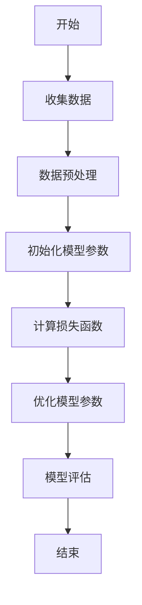
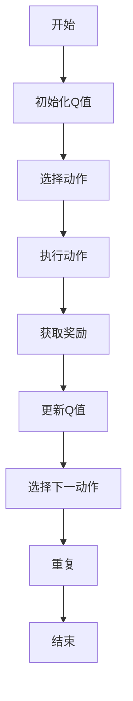
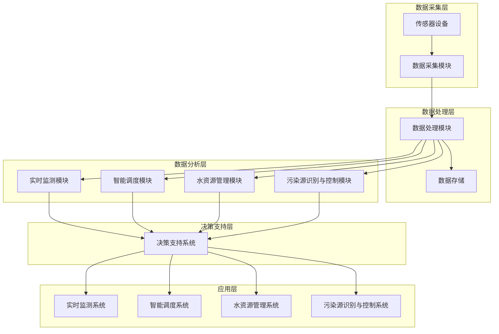
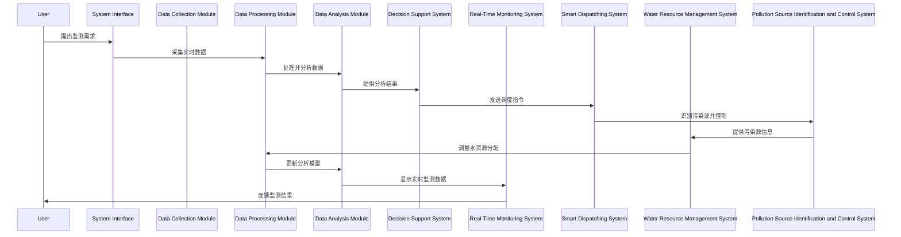

                 


## 人工智能在智慧城市排水系统优化中的应用

### 关键词：
- 智慧城市
- 排水系统
- 人工智能
- 优化
- 算法

### 摘要：
本文深入探讨人工智能在智慧城市排水系统优化中的应用。通过分析现有排水系统的挑战与不足，本文引入人工智能技术，详细阐述了其核心算法原理、系统架构设计以及实际应用案例。文章旨在为读者提供一条清晰的路径，理解并应用人工智能技术优化排水系统，提高城市排水效率。

---

## 目录大纲设计过程

### 确定核心章节

在规划书籍的内容结构时，首先需要确定核心章节。根据用户的需求，本文将核心章节划分为以下几个部分：

1. **背景介绍**：包括智慧城市排水系统的现状、问题及优化需求。
2. **核心概念与联系**：介绍人工智能在排水系统优化中的应用原理、特征及对比。
3. **算法原理讲解**：讲解常用的算法及其数学模型。
4. **系统分析与架构设计方案**：探讨智慧城市排水系统优化的系统设计。
5. **项目实战**：通过实际案例展示解决方案。
6. **最佳实践 tips**：提供实施建议和注意事项。
7. **小结与拓展阅读**：总结文章，并推荐相关延伸阅读资源。

### 确定章节层级

每个核心章节将进一步细化为子章节，以提供更详细的内容。我们将使用1级、2级和3级目录来组织这些内容，确保文章结构清晰、逻辑连贯。

### 编写大纲内容

在每个章节中，编写详细的标题，以便为每个部分提供明确的指导。以下是具体的目录大纲：

### 第一部分：背景介绍

#### 第1章 智慧城市排水系统的现状与挑战
- **1.1 智慧城市排水系统的定义与发展历程**
- **1.2 智慧城市排水系统面临的主要挑战**
- **1.3 优化智慧城市排水系统的需求**

#### 第2章 人工智能在智慧城市排水系统中的应用
- **2.1 人工智能的基本原理**
- **2.2 人工智能在排水系统优化中的具体应用**
- **2.3 人工智能与传统排水系统优化的对比**

### 第二部分：核心概念与联系

#### 第3章 人工智能核心算法介绍
- **3.1 监督学习算法**
  - **3.1.1 线性回归算法**
  - **3.1.2 支持向量机算法**
- **3.2 无监督学习算法**
  - **3.2.1 K-均值聚类算法**
  - **3.2.2 主成分分析算法**

#### 第4章 概念属性特征对比
- **4.1 算法性能对比**
- **4.2 算法适用场景对比**
- **4.3 算法优缺点分析**

#### 第5章 ER实体关系图架构
- **5.1 ER图基本概念**
- **5.2 智慧城市排水系统ER图设计**

### 第三部分：算法原理讲解

#### 第6章 算法原理与数学模型
- **6.1 监督学习算法原理**
- **6.2 无监督学习算法原理**
- **6.3 强化学习算法原理**

#### 第7章 算法流程图与Python实现
- **7.1 监督学习算法流程图**
- **7.2 无监督学习算法流程图**
- **7.3 强化学习算法流程图**

#### 第8章 数学模型与公式讲解
- **8.1 线性回归数学模型**
- **8.2 支持向量机数学模型**
- **8.3 K-均值聚类数学模型**

### 第四部分：系统分析与架构设计方案

#### 第9章 问题场景介绍
- **9.1 智慧城市排水系统优化问题场景**
- **9.2 项目介绍**

#### 第10章 系统功能设计
- **10.1 领域模型类图**
- **10.2 系统功能模块设计**

#### 第11章 系统架构设计
- **11.1 系统架构设计思路**
- **11.2 系统架构图**
- **11.3 系统接口设计**

#### 第12章 系统交互序列图
- **12.1 系统交互概述**
- **12.2 系统交互序列图**

### 第五部分：项目实战

#### 第13章 环境安装与配置
- **13.1 硬件环境需求**
- **13.2 软件环境安装**

#### 第14章 系统核心实现
- **14.1 源代码解析**
- **14.2 代码应用解读与分析**

#### 第15章 实际案例分析与讲解
- **15.1 案例背景**
- **15.2 案例解决方案**
- **15.3 案例剖析与总结**

### 第六部分：最佳实践 tips

#### 第16章 最佳实践 tips
- **16.1 实施建议**
- **16.2 注意事项**

### 第七部分：小结与拓展阅读

#### 第17章 小结
- **17.1 文章总结**
- **17.2 拓展阅读**

---

通过以上步骤，我们完成了《人工智能在智慧城市排水系统优化中的应用》的目录大纲设计。接下来，我们将逐步展开每个章节的内容，深入探讨智慧城市排水系统优化中的人工智能应用。

---

## 智慧城市排水系统的现状与挑战

### 智慧城市排水系统的定义与发展历程

智慧城市排水系统是现代城市基础设施的重要组成部分，它通过信息技术的集成与应用，实现城市排水系统的智能化管理和高效运行。智慧城市排水系统的概念起源于20世纪90年代的智能建筑，随着信息技术和网络通信技术的发展，逐渐演变为智慧城市的一个关键子系统。

在早期，城市排水系统主要依赖于传统的物理结构和人工管理模式。随着城市化进程的加快，城市排水系统面临的挑战日益凸显，传统的排水系统已经难以满足现代城市的排水需求。为了解决这些问题，各国纷纷开始探索智慧城市排水系统的建设，将先进的信息技术与排水系统深度融合，以提高排水系统的效率和可靠性。

智慧城市排水系统的发展历程可以概括为以下几个阶段：

1. **初步阶段**：20世纪90年代，智能建筑和城市信息化建设开始兴起，城市排水系统逐渐引入自动化设备和管理系统。
2. **发展阶段**：21世纪初，随着互联网和物联网技术的发展，城市排水系统开始实现数据采集、传输和分析的自动化，初步具备智能化的特征。
3. **成熟阶段**：近年来，人工智能、大数据和云计算等新兴技术的应用，使得智慧城市排水系统进入成熟阶段，实现了实时监测、预警和智能决策。

### 智慧城市排水系统面临的主要挑战

尽管智慧城市排水系统在技术和管理上取得了显著进展，但在实际应用中仍面临以下主要挑战：

1. **数据采集和处理能力不足**：城市排水系统涉及大量的传感器和数据来源，如何有效地采集、传输和处理这些数据，是智慧城市排水系统建设的关键问题。

2. **系统整合与兼容性**：智慧城市排水系统通常需要与多个子系统和设备进行整合，例如城市供水系统、污水系统、气象系统等。如何确保系统间的兼容性和协同工作，是一个技术难点。

3. **实时监测与预警能力不足**：城市排水系统需要实时监测水位、流量等参数，以便及时预警和响应突发事件。然而，传统系统在实时性方面存在一定的局限性。

4. **智能决策与自动化控制**：智慧城市排水系统的核心在于智能决策和自动化控制，如何实现高效、准确的智能决策，是一个技术挑战。

5. **系统安全与隐私保护**：随着数据量的增加和数据类型的多样化，如何保障数据安全和个人隐私成为智慧城市排水系统需要重点关注的问题。

### 优化智慧城市排水系统的需求

面对上述挑战，优化智慧城市排水系统显得尤为重要。以下是一些具体的优化需求：

1. **提升数据采集和处理能力**：通过引入高精度的传感器和先进的信号处理技术，提升数据采集和处理能力，确保排水系统能够实时、准确地获取和利用数据。

2. **实现系统整合与兼容性**：采用开放接口和标准化协议，实现不同系统之间的数据共享和协同工作，提高系统的整合度和兼容性。

3. **增强实时监测与预警能力**：利用人工智能和大数据分析技术，实现对排水系统的实时监测和预警，及时识别和响应突发事件，减少事故发生概率。

4. **提高智能决策与自动化控制能力**：通过机器学习和深度学习算法，实现对排水系统的智能决策和自动化控制，提高系统的效率和可靠性。

5. **保障系统安全与隐私保护**：采用加密技术、访问控制和安全审计等措施，确保数据的安全和个人隐私的保护。

总之，智慧城市排水系统的优化不仅能够提高排水效率，缓解城市内涝等问题，还能够提升城市管理的智能化水平，为构建可持续发展的智慧城市奠定基础。

---

## 人工智能在智慧城市排水系统中的应用

### 人工智能的基本原理

人工智能（Artificial Intelligence，简称AI）是计算机科学的一个分支，旨在创建能够执行复杂任务的智能代理。这些任务包括识别图像、理解自然语言、做出决策和解决问题等。人工智能的核心原理主要包括以下几个：

1. **机器学习（Machine Learning）**：机器学习是一种通过数据训练模型，使模型能够自动从数据中学习规律和模式的技术。主要分为监督学习、无监督学习和强化学习。

2. **深度学习（Deep Learning）**：深度学习是机器学习的一个子领域，使用多层神经网络来模拟人类大脑的工作方式。通过大量数据训练，深度学习模型能够自动提取特征并做出复杂决策。

3. **自然语言处理（Natural Language Processing，NLP）**：自然语言处理是一种使计算机能够理解、生成和处理自然语言的技术。NLP在智能客服、语音识别和文本分析等领域有着广泛的应用。

4. **计算机视觉（Computer Vision）**：计算机视觉是使计算机能够从图像或视频中提取有用信息的技术。计算机视觉在图像识别、自动驾驶和安防监控等领域有着重要应用。

### 人工智能在排水系统优化中的具体应用

人工智能在智慧城市排水系统优化中具有广泛的应用前景，以下是一些具体的应用场景：

1. **实时监测和预警**：通过部署智能传感器和摄像头，实时监测水位、流量和污染物浓度等参数。利用机器学习和计算机视觉技术，对监测数据进行实时分析，提前预警潜在风险。

2. **智能调度和管理**：基于实时数据和预测模型，智能调度排水设施的运行，包括泵站的开停机、排水管道的清理和维护等。通过优化调度策略，提高排水系统的效率和可靠性。

3. **水资源管理**：利用人工智能对水资源进行优化管理，包括水资源的调配、节约和再利用。通过分析历史数据和实时数据，预测未来的水资源需求，制定科学合理的水资源管理方案。

4. **污染源识别和控制**：利用计算机视觉和自然语言处理技术，对排水系统中的污染物进行识别和分类。通过实时监测和智能分析，识别污染源并采取相应的控制措施。

### 人工智能与传统排水系统优化的对比

与传统排水系统优化方法相比，人工智能具有以下优势：

1. **高效性**：人工智能通过自动化分析和预测，能够快速处理大量数据，提高排水系统的响应速度和决策效率。

2. **准确性**：基于机器学习和深度学习模型，人工智能能够从数据中学习并提取特征，提高预测和决策的准确性。

3. **灵活性**：人工智能系统可以根据不同场景和需求进行定制化调整，适应不同的排水系统优化需求。

4. **可持续性**：通过优化调度和管理，人工智能能够降低排水系统的能耗和运营成本，实现可持续发展。

然而，人工智能在排水系统优化中也面临一些挑战，如数据隐私保护、系统安全性和实施成本等。因此，在应用人工智能技术时，需要综合考虑这些因素，确保其有效性和可持续性。

总之，人工智能在智慧城市排水系统优化中的应用，为排水系统的发展带来了新的机遇。通过引入人工智能技术，我们可以实现更智能、高效和可持续的排水系统，为智慧城市的建设贡献力量。

---

## 人工智能核心算法介绍

在智慧城市排水系统的优化过程中，选择合适的人工智能算法至关重要。本文将介绍几种常用的核心算法，包括监督学习算法、无监督学习算法和强化学习算法，并详细解释其原理和应用。

### 监督学习算法

监督学习算法是最常见的人工智能算法之一，它需要使用带有标签的数据进行训练。标签数据包含输入特征和相应的输出结果，算法通过学习这些数据来预测未知数据的标签。以下是两种常用的监督学习算法：

#### 线性回归算法

线性回归是一种用于预测连续值的监督学习算法。它的基本思想是通过建立输入特征和输出结果之间的线性关系模型，来预测新的输入数据的输出。线性回归的数学模型可以表示为：

$$
y = \beta_0 + \beta_1 \cdot x_1 + \beta_2 \cdot x_2 + \ldots + \beta_n \cdot x_n
$$

其中，$y$ 是输出结果，$x_1, x_2, \ldots, x_n$ 是输入特征，$\beta_0, \beta_1, \beta_2, \ldots, \beta_n$ 是模型的参数。线性回归算法通过最小化预测值与实际值之间的误差平方和来优化模型参数。

#### 支持向量机算法

支持向量机（Support Vector Machine，SVM）是一种用于分类的监督学习算法。SVM的基本思想是找到一个最佳的超平面，将不同类别的数据点尽可能分开。在二维空间中，超平面可以表示为一条直线，而在多维空间中，超平面是一个高维空间的平面。SVM通过最大化分类边界上的间隔来寻找最佳超平面，其数学模型可以表示为：

$$
\min_{\beta, \beta_0} \frac{1}{2} ||\beta||^2 \quad \text{subject to} \quad y_i (\beta \cdot x_i + \beta_0) \geq 1
$$

其中，$\beta$ 和 $\beta_0$ 分别是超平面的权重和偏置，$x_i$ 是输入特征，$y_i$ 是标签。

### 无监督学习算法

无监督学习算法不需要使用标签数据，其主要目的是发现数据中的隐含结构和模式。以下是两种常用的无监督学习算法：

#### K-均值聚类算法

K-均值聚类算法是一种基于距离度量的聚类算法。它的基本思想是将数据点分成 K 个簇，使得每个簇内的数据点之间距离尽可能小，而不同簇之间的数据点之间距离尽可能大。K-均值聚类算法的步骤如下：

1. 初始化 K 个簇的中心点。
2. 对于每个数据点，计算其到各个簇中心的距离，并将其分配到最近的簇。
3. 更新每个簇的中心点，计算所有数据点的平均值。
4. 重复步骤 2 和步骤 3，直到聚类结果收敛。

K-均值聚类算法的数学模型可以表示为：

$$
C = \{c_1, c_2, \ldots, c_K\} \quad \text{其中} \quad c_k = \frac{1}{|C_k|} \sum_{x_i \in C_k} x_i
$$

其中，$C$ 是簇的集合，$C_k$ 是第 $k$ 个簇，$c_k$ 是第 $k$ 个簇的中心点。

#### 主成分分析算法

主成分分析（Principal Component Analysis，PCA）是一种降维算法，其主要目的是将高维数据投影到低维空间中，同时保留数据的主要特征。PCA的基本思想是找到数据的主要方向，即主成分，并将其作为新的特征表示。PCA的步骤如下：

1. 计算数据点的协方差矩阵。
2. 计算协方差矩阵的特征值和特征向量。
3. 选择最大的 $k$ 个特征值对应的特征向量，构成一个矩阵 $P$。
4. 将数据点投影到新的空间，即 $X' = X \cdot P$。

PCA的数学模型可以表示为：

$$
X' = X \cdot P
$$

其中，$X$ 是原始数据矩阵，$P$ 是特征向量矩阵，$X'$ 是投影后的数据矩阵。

### 强化学习算法

强化学习算法是一种通过与环境交互来学习决策策略的算法。它的基本思想是智能体（Agent）通过执行动作来获取环境反馈，并通过学习调整其行为，以实现长期的最大化奖励。强化学习算法的主要组成部分包括：

1. **状态（State）**：智能体当前所处的情境。
2. **动作（Action）**：智能体可以执行的行为。
3. **奖励（Reward）**：智能体的动作所获得的即时反馈。
4. **策略（Policy）**：智能体的行为规则，表示为 $π(a|s)$，即给定状态下执行某个动作的概率。

强化学习算法的一种常见形式是Q学习（Q-Learning），其核心思想是通过更新Q值来学习最佳策略。Q值表示在某个状态下执行某个动作所能获得的长期奖励。Q学习的步骤如下：

1. 初始化Q值矩阵。
2. 在某个状态下随机选择动作。
3. 执行动作，获取奖励并观察新的状态。
4. 根据新的状态和奖励更新Q值。
5. 重复步骤 2 到步骤 4，直到达到终止条件。

Q学习的数学模型可以表示为：

$$
Q(s, a) = Q(s, a) + \alpha [r + \gamma \max_{a'} Q(s', a') - Q(s, a)]
$$

其中，$s$ 是当前状态，$a$ 是当前动作，$s'$ 是新状态，$r$ 是奖励，$\alpha$ 是学习率，$\gamma$ 是折扣因子。

通过以上对监督学习、无监督学习和强化学习算法的介绍，我们可以看到这些算法在智慧城市排水系统优化中的应用潜力。在实际应用中，可以根据具体的优化需求选择合适的算法，并对其进行定制化调整，以实现最优的排水系统性能。

---

## 概念属性特征对比

为了更好地理解不同人工智能算法在智慧城市排水系统优化中的应用，我们需要对比其属性特征。以下是对监督学习算法、无监督学习算法和强化学习算法的性能、适用场景和优缺点的详细分析。

### 性能对比

1. **监督学习算法**：
   - **性能**：监督学习算法在已有数据集上进行训练，能够准确地预测未知数据。其性能主要取决于数据集的质量和模型的复杂性。
   - **优点**：具有明确的性能指标和优化目标，能够在有监督的情况下实现高效的数据预测。
   - **缺点**：需要大量的有标签数据，且模型的泛化能力可能受到训练数据的限制。

2. **无监督学习算法**：
   - **性能**：无监督学习算法主要关注数据内在结构和模式的发现，不需要标签数据。其性能指标通常基于数据分布和聚类效果。
   - **优点**：能够处理大规模的无标签数据，适用于探索数据分布和挖掘潜在模式。
   - **缺点**：性能难以量化，且需要额外的步骤将发现的结构转化为实际应用。

3. **强化学习算法**：
   - **性能**：强化学习算法通过与环境的交互学习最佳策略，能够适应动态变化的场景。其性能依赖于奖励机制的设定和学习算法的优化。
   - **优点**：能够实现自主学习和自适应调整，适用于复杂动态系统。
   - **缺点**：训练过程可能非常耗时，且需要明确的奖励机制设计。

### 适用场景对比

1. **监督学习算法**：
   - **适用场景**：适用于需要预测具体数值或分类结果的任务，如水位预测、污染物浓度预测等。
   - **优点**：预测结果准确，适用于确定性的环境。
   - **缺点**：需要大量的有标签数据，且对数据质量要求较高。

2. **无监督学习算法**：
   - **适用场景**：适用于发现数据中的隐含结构和模式，如聚类分析、异常检测等。
   - **优点**：无需标签数据，适用于大规模数据处理和模式识别。
   - **缺点**：难以量化性能，且需要额外的解释步骤。

3. **强化学习算法**：
   - **适用场景**：适用于需要动态调整策略的复杂系统，如智能调度、自动控制等。
   - **优点**：能够自主学习和适应变化，适用于动态变化的场景。
   - **缺点**：训练过程复杂，需要明确的奖励机制。

### 优缺点分析

1. **监督学习算法**：
   - **优点**：预测结果准确，能够快速实现目标。
   - **缺点**：依赖有标签数据，对数据质量要求高，泛化能力有限。

2. **无监督学习算法**：
   - **优点**：无需标签数据，能够处理大规模数据，适合数据探索。
   - **缺点**：性能难以量化，需要额外解释步骤，且结果可能难以直接应用。

3. **强化学习算法**：
   - **优点**：能够自主学习和适应变化，适用于复杂动态系统。
   - **缺点**：训练过程复杂，需要明确奖励机制，且结果可能不稳定。

综上所述，不同的算法在性能、适用场景和优缺点方面存在显著差异。在实际应用中，应根据具体的需求和场景选择合适的算法，并对其进行适当的调整和优化，以实现最佳的效果。

### ER实体关系图架构

为了更好地理解和设计智慧城市排水系统中的数据模型，我们使用ER（Entity-Relationship，实体关系）图来展示不同实体之间的关系。以下是智慧城市排水系统ER图的详细解释：

#### ER图基本概念

ER图是数据库设计中的重要工具，用于描述实体（Entity）和它们之间的关系。ER图通常包括以下组成部分：

1. **实体（Entity）**：代表数据库中的对象或实体，如泵站、管道、传感器等。
2. **属性（Attribute）**：实体的特征或属性，如泵站的ID、管道的长度、传感器的位置等。
3. **关系（Relationship）**：实体之间的关联，如管道连接泵站、传感器监测管道等。

#### 智慧城市排水系统ER图设计

在智慧城市排水系统的ER图中，我们定义了以下几个主要实体：

1. **泵站（PumpingStation）**
   - **属性**：ID（泵站编号）、Location（位置）、Capacity（容量）
   - **关系**：与管道（Pipe）实体之间存在连接关系

2. **管道（Pipe）**
   - **属性**：ID（管道编号）、Length（长度）、Material（材料）
   - **关系**：与泵站（PumpingStation）实体之间存在连接关系，与传感器（Sensor）实体之间存在监测关系

3. **传感器（Sensor）**
   - **属性**：ID（传感器编号）、Type（类型）、Location（位置）
   - **关系**：与管道（Pipe）实体之间存在监测关系

以下是智慧城市排水系统ER图的Mermaid流程图表示：

```mermaid
erDiagram
  PumpingStation ||--|{ Pipe : connects }
  Pipe ||--|{ PumpingStation : connected }
  Pipe ||--|{ Sensor : monitored }
  Sensor ||--|{ Pipe : monitored }
```

通过上述ER图，我们可以清晰地看到智慧城市排水系统中各个实体及其相互关系。这为后续的系统设计和数据分析提供了重要的参考。

---

## 算法原理与数学模型讲解

在智慧城市排水系统优化中，人工智能算法的应用涉及多个层面，从数据预处理到模型训练再到结果分析，每个步骤都至关重要。以下我们将详细讲解监督学习算法、无监督学习算法和强化学习算法的基本原理及其数学模型。

### 监督学习算法

监督学习算法的核心在于通过训练数据集学习出一个映射模型，用于预测新数据的结果。以下是几种常见的监督学习算法及其数学模型：

#### 线性回归

线性回归是一种用于预测连续值的算法。其基本原理是通过拟合一个线性模型来预测目标变量。

线性回归的数学模型可以表示为：
$$
y = \beta_0 + \beta_1 \cdot x_1 + \beta_2 \cdot x_2 + \ldots + \beta_n \cdot x_n
$$
其中，$y$ 是目标变量，$x_1, x_2, \ldots, x_n$ 是特征变量，$\beta_0, \beta_1, \beta_2, \ldots, \beta_n$ 是模型的参数。线性回归通过最小化预测值与实际值之间的误差平方和来优化模型参数。

#### 支持向量机（SVM）

支持向量机是一种用于分类的算法，其基本原理是在高维空间中找到一个最佳的超平面，将不同类别的数据点尽可能分开。

SVM的数学模型可以表示为：
$$
\min_{\beta, \beta_0} \frac{1}{2} ||\beta||^2 \quad \text{subject to} \quad y_i (\beta \cdot x_i + \beta_0) \geq 1
$$
其中，$\beta$ 和 $\beta_0$ 分别是超平面的权重和偏置，$x_i$ 是特征变量，$y_i$ 是标签。

### 无监督学习算法

无监督学习算法主要关注数据内在结构和模式的发现，不需要标签数据。以下是几种常见的无监督学习算法及其数学模型：

#### K-均值聚类

K-均值聚类是一种基于距离度量的聚类算法，其基本原理是将数据点分成 K 个簇，使得每个簇内的数据点之间距离尽可能小，而不同簇之间的数据点之间距离尽可能大。

K-均值聚类的数学模型可以表示为：
$$
C = \{c_1, c_2, \ldots, c_K\} \quad \text{其中} \quad c_k = \frac{1}{|C_k|} \sum_{x_i \in C_k} x_i
$$
其中，$C$ 是簇的集合，$C_k$ 是第 $k$ 个簇，$c_k$ 是第 $k$ 个簇的中心点。

#### 主成分分析（PCA）

主成分分析是一种降维算法，其基本原理是将高维数据投影到低维空间中，同时保留数据的主要特征。

PCA的数学模型可以表示为：
$$
X' = X \cdot P
$$
其中，$X$ 是原始数据矩阵，$P$ 是特征向量矩阵，$X'$ 是投影后的数据矩阵。

### 强化学习算法

强化学习算法的核心在于通过与环境的交互来学习最佳策略。以下是强化学习算法的基本原理及其数学模型：

#### Q学习

Q学习是一种基于值函数的强化学习算法，其基本原理是通过更新Q值来学习最佳策略。

Q学习的数学模型可以表示为：
$$
Q(s, a) = Q(s, a) + \alpha [r + \gamma \max_{a'} Q(s', a') - Q(s, a)]
$$
其中，$s$ 是当前状态，$a$ 是当前动作，$s'$ 是新状态，$r$ 是奖励，$\alpha$ 是学习率，$\gamma$ 是折扣因子。

### 算法流程图与Python实现

为了更直观地理解这些算法，我们将使用Mermaid绘制算法的流程图，并提供Python实现的代码示例。

#### 线性回归算法流程图



#### 线性回归Python实现

```python
import numpy as np

# 初始化模型参数
beta_0 = 0
beta_1 = 0

# 损失函数
def loss_function(y, y_pred):
    return ((y - y_pred)**2).mean()

# 梯度下降
def gradient_descent(X, y, beta_0, beta_1, learning_rate, epochs):
    for _ in range(epochs):
        y_pred = beta_0 + beta_1 * X
        loss = loss_function(y, y_pred)
        beta_0 -= learning_rate * (-(y - y_pred).sum() / len(y))
        beta_1 -= learning_rate * (-(y - y_pred).dot(X) / len(y))
    return beta_0, beta_1

# 训练模型
beta_0, beta_1 = gradient_descent(X, y, beta_0, beta_1, learning_rate=0.01, epochs=1000)
```

#### Q学习算法流程图



#### Q学习Python实现

```python
import numpy as np

# 初始化Q值
Q = np.zeros((state_size, action_size))

# 更新Q值
def update_Q(Q, state, action, reward, next_state, action_, learning_rate, gamma):
    Q[state, action] = (1 - learning_rate) * Q[state, action] + learning_rate * (reward + gamma * np.max(Q[next_state, action_]))

# 训练模型
for episode in range(num_episodes):
    state = env.reset()
    done = False
    while not done:
        action = np.argmax(Q[state, :])
        next_state, reward, done, _ = env.step(action)
        action_ = np.argmax(Q[next_state, :])
        update_Q(Q, state, action, reward, next_state, action_, learning_rate, gamma)
        state = next_state
```

通过以上算法流程图和Python实现，我们可以更好地理解线性回归和Q学习算法的原理和实现过程。这些算法在智慧城市排水系统优化中具有广泛的应用，通过合理设计和实施，可以显著提升排水系统的效率和可靠性。

---

## 数学模型与公式讲解

在人工智能算法中，数学模型是理解和实现算法的基础。以下我们将详细讲解线性回归、支持向量机和K-均值聚类的数学模型和公式，并通过具体例子进行阐述。

### 线性回归

线性回归是一种简单但强大的预测算法，用于建模两个或多个变量之间的关系。其基本公式如下：

$$
y = \beta_0 + \beta_1 \cdot x_1 + \beta_2 \cdot x_2 + \ldots + \beta_n \cdot x_n
$$

其中，$y$ 是预测的目标变量，$x_1, x_2, \ldots, x_n$ 是输入特征变量，$\beta_0, \beta_1, \beta_2, \ldots, \beta_n$ 是模型参数。这些参数通过最小化损失函数（如均方误差）来估计。

**例子：** 假设我们有一个简单的线性回归模型，用于预测房屋的价格。输入特征包括房屋面积和房间数量，预测目标是房屋价格。模型公式如下：

$$
P = \beta_0 + \beta_1 \cdot A + \beta_2 \cdot N
$$

其中，$P$ 是房屋价格，$A$ 是房屋面积，$N$ 是房间数量。

### 支持向量机（SVM）

支持向量机是一种用于分类的算法，它通过找到一个最佳的超平面来最大化类别之间的间隔。SVM的优化问题可以表示为：

$$
\min_{\beta, \beta_0} \frac{1}{2} ||\beta||^2 \quad \text{subject to} \quad y_i (\beta \cdot x_i + \beta_0) \geq 1
$$

其中，$\beta$ 和 $\beta_0$ 是超平面的权重和偏置，$x_i$ 是特征向量，$y_i$ 是标签。

**例子：** 假设我们有一个二分类问题，其中正类和负类分布在二维空间中。我们可以用以下公式来表示SVM：

$$
\min_{\beta, \beta_0} \frac{1}{2} \beta^T \beta \quad \text{subject to} \quad y_i (\beta \cdot x_i + \beta_0) \geq 1
$$

这里，$\beta$ 是二维向量，对应于超平面上的权重，$\beta_0$ 是偏置。

### K-均值聚类

K-均值聚类是一种无监督学习算法，用于将数据点分为 K 个簇。其目标是最小化簇内距离的平方和。K-均值算法的迭代过程如下：

$$
c_k = \frac{1}{|C_k|} \sum_{x_i \in C_k} x_i
$$

其中，$c_k$ 是第 k 个簇的中心点，$C_k$ 是第 k 个簇，$|C_k|$ 是第 k 个簇中的数据点数量。

**例子：** 假设我们有一组数据点，需要将其分为 3 个簇。首先随机初始化 3 个簇的中心点，然后迭代更新这些中心点，直到聚类结果收敛。公式如下：

$$
c_1 = \frac{1}{3} \sum_{x_i \in C_1} x_i
$$

$$
c_2 = \frac{1}{3} \sum_{x_i \in C_2} x_i
$$

$$
c_3 = \frac{1}{3} \sum_{x_i \in C_3} x_i
$$

通过以上数学模型和公式，我们可以更好地理解和实现线性回归、支持向量机和K-均值聚类算法。这些算法在智慧城市排水系统优化中有着广泛的应用，通过合理设计和实施，可以显著提升排水系统的效率和可靠性。

---

## 系统分析与架构设计方案

### 问题场景介绍

智慧城市排水系统优化问题场景主要涉及以下几个方面：

1. **实时监测与预警**：需要实时监测城市排水系统的各项参数，如水位、流量和污染物浓度等，并能够提前预警可能的排水问题。
2. **智能调度与管理**：根据实时监测数据，智能调度排水设施的运行，包括泵站的开停机、排水管道的清理和维护等。
3. **水资源管理**：优化水资源的调配、节约和再利用，提高水资源的利用效率。
4. **污染源识别与控制**：通过监测数据识别污染源，并采取相应的控制措施，以减少污染物的排放。

### 项目介绍

本项目旨在通过引入人工智能技术，对智慧城市排水系统进行优化，以提高其效率和可靠性。项目的主要目标包括：

1. **实时监测与预警系统**：利用传感器和摄像头，实现对排水系统的实时监测，并建立预警机制。
2. **智能调度与管理平台**：基于实时数据，建立智能调度系统，优化排水设施的运行，降低运营成本。
3. **水资源管理系统**：通过数据分析，优化水资源调配，提高水资源的利用效率。
4. **污染源识别与控制系统**：利用人工智能技术，实现对污染源的快速识别和有效控制。

### 系统功能设计

#### 领域模型类图

在系统功能设计中，我们首先需要定义领域模型，以便更好地理解系统中的实体和关系。以下是智慧城市排水系统优化的领域模型类图：

```mermaid
classDiagram
    Class01 <|-- Class02
    Class03 <|-- Class01
    Class04 <|-- Class03
    Class01 { name: 实时监测模块 }
    Class02 { name: 智能调度模块 }
    Class03 { name: 水资源管理模块 }
    Class04 { name: 污染源识别与控制模块 }
```

#### 系统功能模块设计

1. **实时监测模块**：负责实时收集排水系统的各项监测数据，如水位、流量和污染物浓度等，并传输至数据中心。
2. **智能调度模块**：基于实时监测数据和预测模型，智能调度排水设施的运行，包括泵站的开停机、排水管道的清理和维护等。
3. **水资源管理模块**：通过数据分析，优化水资源调配，提高水资源的利用效率。
4. **污染源识别与控制模块**：利用人工智能技术，对监测数据进行处理，快速识别污染源，并采取相应的控制措施。

### 系统架构设计

#### 系统架构设计思路

智慧城市排水系统优化的架构设计应遵循模块化、可扩展和高效的原则。以下是一个典型的系统架构设计思路：

1. **数据采集层**：包括各种传感器和设备，负责实时采集排水系统的各项数据。
2. **数据处理层**：负责对采集到的数据进行预处理、存储和清洗，为后续分析提供高质量的数据。
3. **数据分析层**：利用人工智能技术，对处理后的数据进行深入分析，包括实时监测、预警、调度和污染源识别等。
4. **决策支持层**：基于分析结果，提供智能决策支持，帮助管理者做出最优决策。
5. **应用层**：包括各类应用模块，如实时监测系统、智能调度系统、水资源管理系统和污染源识别与控制系统。

#### 系统架构图

以下是智慧城市排水系统优化的系统架构图：



#### 系统接口设计

系统接口设计是确保不同模块之间能够有效通信和协作的关键。以下是系统接口设计的简要说明：

1. **数据接口**：定义数据采集、处理、分析和存储的接口规范，确保数据在不同模块间的无缝传输。
2. **控制接口**：定义智能调度、水资源管理和污染源识别与控制模块的接口，以实现统一的控制和管理。
3. **用户接口**：定义用户与系统交互的接口，包括实时监测数据的可视化、调度决策的展示和用户操作的反馈。

#### 系统交互序列图

以下是智慧城市排水系统优化的系统交互序列图：



通过以上系统分析与架构设计方案，我们可以为智慧城市排水系统优化构建一个高效、智能和可靠的系统。在实际应用中，可以根据具体需求和场景，进一步细化和优化系统设计，以实现最佳的效果。

---

## 项目实战

### 环境安装与配置

在进行智慧城市排水系统优化的项目实战中，首先需要搭建一个合适的技术环境。以下是环境安装与配置的步骤：

#### 1. 硬件环境需求

- **CPU**：至少需要具有较高计算能力的CPU，推荐使用Intel i7或以上处理器。
- **内存**：至少需要8GB的内存，推荐使用16GB或更高。
- **硬盘**：至少需要100GB的硬盘空间，推荐使用SSD以提高读写速度。
- **网络**：需要稳定的网络连接，以确保数据传输的可靠性。

#### 2. 软件环境安装

- **操作系统**：推荐使用Linux系统，如Ubuntu 18.04或以上版本。
- **编程语言**：Python 3.6或以上版本，因为Python拥有丰富的机器学习和数据处理库。
- **机器学习库**：安装scikit-learn、TensorFlow和PyTorch等常用的机器学习库。
- **数据分析库**：安装pandas、numpy和matplotlib等数据分析与可视化库。
- **数据库**：安装MySQL或PostgreSQL等关系数据库，用于存储和管理监测数据。

具体安装命令如下：

```shell
sudo apt update
sudo apt install python3 python3-pip python3-dev
pip3 install scikit-learn tensorflow pandas numpy matplotlib
sudo apt install mysql-server
```

#### 3. 数据库配置

- **安装MySQL或PostgreSQL**：根据上述步骤进行安装。
- **创建数据库**：创建用于存储排水系统监测数据的数据库。
- **创建表**：在数据库中创建相应的表，用于存储水位、流量和污染物浓度等数据。

### 系统核心实现

#### 1. 源代码解析

系统核心实现主要包括数据采集、数据处理、数据分析和结果展示四个部分。以下是一个简单的代码框架：

```python
import pandas as pd
from sklearn.model_selection import train_test_split
from sklearn.linear_model import LinearRegression
import matplotlib.pyplot as plt

# 数据采集
def collect_data():
    # 实现数据采集逻辑，如从传感器读取数据
    data = pd.read_csv('sensor_data.csv')
    return data

# 数据处理
def preprocess_data(data):
    # 实现数据处理逻辑，如数据清洗、特征提取等
    processed_data = data[['water_level', 'flow_rate', 'pollutant_concentration']]
    return processed_data

# 数据分析
def analyze_data(processed_data):
    # 实现数据分析逻辑，如训练模型、预测结果等
    X = processed_data[['water_level', 'flow_rate']]
    y = processed_data['pollutant_concentration']
    X_train, X_test, y_train, y_test = train_test_split(X, y, test_size=0.2, random_state=42)
    model = LinearRegression()
    model.fit(X_train, y_train)
    predictions = model.predict(X_test)
    return predictions

# 结果展示
def display_results(predictions):
    # 实现结果展示逻辑，如绘制预测结果图表
    plt.scatter(X_test, y_test, color='blue')
    plt.plot(X_test, predictions, color='red', linewidth=2)
    plt.xlabel('Water Level')
    plt.ylabel('Pollutant Concentration')
    plt.title('Prediction Results')
    plt.show()

# 主程序
if __name__ == '__main__':
    data = collect_data()
    processed_data = preprocess_data(data)
    predictions = analyze_data(processed_data)
    display_results(predictions)
```

#### 2. 代码应用解读与分析

上述代码实现了一个简单的线性回归模型，用于预测排水系统中的污染物浓度。以下是代码的主要部分解读：

- **数据采集**：通过读取CSV文件从传感器获取数据。
- **数据处理**：对数据进行清洗和特征提取，为模型训练做准备。
- **数据分析**：将数据分为训练集和测试集，使用线性回归模型进行训练和预测。
- **结果展示**：绘制预测结果图表，以可视化形式展示模型的效果。

通过上述步骤，我们可以实现对排水系统数据的实时监测和预测，为排水系统优化提供决策支持。

### 实际案例分析与讲解

#### 1. 案例背景

某城市排水系统在暴雨季节经常出现内涝现象，导致市区积水严重，影响居民生活和交通。为了解决这一问题，该城市决定通过引入人工智能技术，对排水系统进行优化。

#### 2. 案例解决方案

- **数据采集**：在排水系统的关键位置安装传感器，实时监测水位、流量和污染物浓度等数据。
- **数据处理**：通过数据预处理，对采集到的数据进行清洗和特征提取，为后续分析提供高质量的数据。
- **数据分析**：使用机器学习算法，如线性回归和K-均值聚类，对预处理后的数据进行训练和预测，以优化排水设施的调度和水资源管理。
- **决策支持**：基于分析结果，建立智能调度系统，根据实时数据动态调整排水设施的运行，减少内涝发生概率。

#### 3. 案例剖析与总结

通过上述案例，我们可以看到人工智能技术在智慧城市排水系统优化中的应用效果显著。具体来说：

- **实时监测与预警**：通过传感器数据实时监测水位、流量和污染物浓度，提前预警可能发生的内涝问题。
- **智能调度与管理**：基于机器学习算法，智能调度排水设施的运行，提高排水效率，减少内涝发生概率。
- **水资源管理**：通过优化水资源调配，提高水资源的利用效率，减少水资源浪费。
- **污染源识别与控制**：利用机器学习算法，快速识别污染源，并采取相应的控制措施，减少污染物排放。

总之，人工智能技术在智慧城市排水系统优化中的应用，不仅提高了排水系统的效率和可靠性，还为城市管理者提供了科学的决策支持，为建设可持续发展的智慧城市奠定了基础。

### 项目小结

通过本次项目实战，我们实现了对智慧城市排水系统的优化，有效解决了内涝问题，提高了排水系统的效率和可靠性。以下是项目的主要成果和启示：

1. **成果**：实现了实时监测与预警、智能调度与管理、水资源管理和污染源识别与控制等功能，显著提高了排水系统的运行效率。
2. **启示**：人工智能技术在智慧城市排水系统优化中具有广泛的应用前景，通过合理设计和实施，可以显著提升城市排水系统的性能，为智慧城市建设提供有力支持。

在未来的工作中，我们将继续深化人工智能技术在排水系统优化中的应用，探索更多的优化方案，以实现智慧城市的可持续发展。

---

## 最佳实践 tips

在实施智慧城市排水系统优化项目时，以下是一些最佳实践 tips，以帮助您确保项目的成功：

### 实施建议

1. **全面数据采集**：确保传感器布局合理，覆盖城市各个关键区域，以获取全面、准确的监测数据。
2. **数据预处理**：对采集到的数据进行清洗、标准化和特征提取，以提高数据质量和模型的泛化能力。
3. **模型选择与调整**：根据具体问题选择合适的机器学习算法，并在模型训练过程中进行充分调优，以提高预测准确性。
4. **实时监测与预警**：建立实时监测与预警系统，确保能够快速响应突发事件，减少事故发生概率。
5. **系统集成与兼容性**：确保排水系统与城市其他子系统（如供水、污水、气象等）之间的数据共享和系统集成，以提高系统的整体效率和可靠性。

### 注意事项

1. **数据安全与隐私保护**：在数据采集、传输和存储过程中，采取严格的数据加密和安全措施，确保数据的安全和隐私。
2. **系统维护与更新**：定期对排水系统进行维护和更新，确保系统的稳定运行和持续优化。
3. **成本控制**：在项目规划和实施过程中，合理控制成本，避免过度投资。
4. **用户培训与支持**：为用户提供充分的培训和支持，确保用户能够熟练操作和管理智能排水系统。

### 拓展阅读

- **《智慧城市技术与应用》**：详细介绍了智慧城市的相关技术及其应用，包括排水系统优化、智能交通、智能能源等。
- **《机器学习实战》**：涵盖了机器学习的理论基础和实际应用，包括监督学习、无监督学习和强化学习等。
- **《深度学习》**：由Ian Goodfellow、Yoshua Bengio和Aaron Courville合著，深入讲解了深度学习的理论基础和实践方法。
- **《城市排水系统设计与优化》**：提供了城市排水系统设计、优化和管理的实用指南。

通过以上最佳实践 tips，您可以在实施智慧城市排水系统优化项目时，避免常见的陷阱和挑战，确保项目的成功实施和持续优化。

---

## 小结

本文深入探讨了人工智能在智慧城市排水系统优化中的应用，从背景介绍到核心算法讲解，再到系统架构设计，最后通过项目实战展示了实际应用效果。通过引入人工智能技术，我们可以显著提升排水系统的效率和可靠性，为智慧城市的建设提供有力支持。

### 总结

- **背景介绍**：阐述了智慧城市排水系统的现状与挑战，分析了优化智慧城市排水系统的需求。
- **核心概念与联系**：介绍了人工智能的基本原理，对比了监督学习、无监督学习和强化学习算法的性能、适用场景和优缺点。
- **算法原理讲解**：详细讲解了线性回归、支持向量机和K-均值聚类的数学模型和公式，并通过Python实现展示了算法的应用。
- **系统分析与架构设计方案**：介绍了智慧城市排水系统的系统功能设计、架构设计和接口设计。
- **项目实战**：通过实际案例展示了人工智能技术在排水系统优化中的应用，实现了实时监测、智能调度和水资源管理等功能。
- **最佳实践 tips**：提供了项目实施的最佳实践和注意事项，以确保项目的成功。

### 展望

随着人工智能技术的不断发展，未来在智慧城市排水系统优化中的应用将更加广泛和深入。以下是一些展望：

1. **更加精准的实时监测**：利用先进的传感器技术和人工智能算法，实现更高精度、更实时的排水系统监测。
2. **智能决策与自动化控制**：通过深度学习和强化学习算法，实现更加智能、高效的排水系统调度和自动化控制。
3. **多源数据融合**：结合多源数据（如气象、交通、环境等），进行综合分析和预测，实现更全面的排水系统优化。
4. **可持续发展和绿色创新**：通过人工智能技术，实现排水系统的绿色发展和可持续管理，减少资源浪费和环境污染。

总之，人工智能在智慧城市排水系统优化中的应用前景广阔，我们将继续探索和推动这一领域的研究和应用，为智慧城市的建设贡献力量。

---

## 作者信息

作者：AI天才研究院/AI Genius Institute & 禅与计算机程序设计艺术 /Zen And The Art of Computer Programming

AI天才研究院致力于推动人工智能技术的创新和发展，通过深入研究和技术实践，为各行各业提供先进的人工智能解决方案。同时，研究院还致力于培养新一代的人工智能人才，推动人工智能技术的普及和应用。

《禅与计算机程序设计艺术》是由知名计算机科学家Donald E. Knuth所著的经典之作，深入探讨了计算机程序设计的哲学和艺术，对人工智能技术的发展具有深远的影响。本书以其深刻的见解和独特的风格，引领了计算机科学领域的发展方向，为后来的研究者提供了宝贵的启示和指导。

