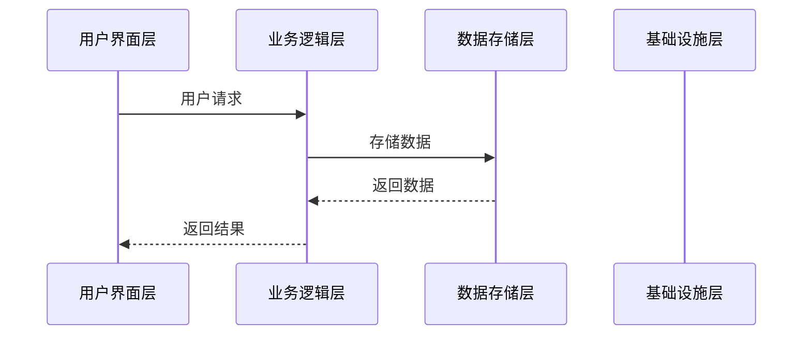

                 

# 《人工智能在法律服务中的应用：智能合同与法律咨询》

## 关键词

- 人工智能
- 法律服务
- 智能合同
- 法律咨询
- 自然语言处理
- 机器学习

## 摘要

本文深入探讨了人工智能在法律服务中的应用，特别是智能合同和法律咨询领域。文章首先介绍了人工智能与法律服务的交汇背景，随后详细阐述了智能合同与法律咨询的核心概念、联系以及技术原理。通过算法原理讲解，本文展示了自然语言处理、机器学习算法在智能合同和法律咨询中的应用，并使用实际案例进行剖析。此外，文章还介绍了智能合同和法律咨询系统的设计思路与架构，最后通过项目实战展示了人工智能在法律服务中的实际应用效果，并提供了最佳实践和拓展阅读建议。

### 目录大纲设计思路

在撰写本文之前，我们需要对文章的目录大纲进行细致的设计，以确保文章的整体结构和逻辑性。以下是目录大纲的设计思路：

1. **确定整体结构**：首先，我们需要确定文章的整体结构，包括背景介绍、核心概念与联系、算法原理讲解、系统分析与架构设计以及项目实战等几个部分。

2. **背景介绍**：在第一章中，我们将介绍人工智能在法律服务中的背景，包括人工智能的发展历程、在法律领域的应用现状和未来趋势。

3. **核心概念与联系**：接着，我们需要介绍智能合同和法律咨询的基本原理，包括概念的定义、特征、发展现状等，并通过对比表格和ER图来展示各概念之间的关系。

4. **算法原理讲解**：在核心章节中，我们将详细讲解人工智能算法在智能合同和法律咨询中的应用，如自然语言处理、机器学习算法等，并使用Mermaid流程图和Python代码示例进行阐述。

5. **系统分析与架构设计方案**：在相应章节中，我们将介绍智能合同和法律咨询系统的设计思路，包括功能设计、架构设计、接口设计和交互设计，并使用Mermaid图展示。

6. **项目实战**：为了使读者更好地理解理论知识，我们将提供实际项目案例，包括环境安装、核心实现、代码解读和案例分析。

7. **最佳实践与总结**：最后，每个章节将总结最佳实践，并给出注意事项和拓展阅读建议。

### 输出目录大纲

```markdown
# 《人工智能在法律服务中的应用：智能合同与法律咨询》目录大纲

# 第一部分：背景介绍

## 1.1 问题背景
### 1.1.1 人工智能与法律服务的交汇点
### 1.1.2 智能合同的发展历程
### 1.1.3 法律咨询的智能化趋势

## 1.2 核心概念与联系
### 1.2.1 智能合同的定义与特征
### 1.2.2 法律咨询的智能化概念
### 1.2.3 智能合同与法律咨询的联系与区别

## 1.3 概念属性特征对比
### 1.3.1 智能合同属性特征
### 1.3.2 法律咨询属性特征
### 1.3.3 对比分析表格

## 1.4 智能合同与法律咨询的ER图架构
### 1.4.1 智能合同的ER图
### 1.4.2 法律咨询的ER图
### 1.4.3 整体ER图架构

## 1.5 本章小结

# 第二部分：核心概念原理

## 2.1 自然语言处理技术
### 2.1.1 自然语言处理的基本原理
### 2.1.2 机器学习算法在NLP中的应用
### 2.1.3 NLP的关键技术

## 2.2 机器学习算法
### 2.2.1 机器学习的概念与分类
### 2.2.2 常见算法介绍
### 2.2.3 算法选择与优化

## 2.3 智能合同的法律逻辑分析
### 2.3.1 智能合同的法律合规性
### 2.3.2 智能合同的逻辑结构设计
### 2.3.3 智能合同的执行与监控

## 2.4 法律咨询的智能系统设计
### 2.4.1 智能法律咨询的需求分析
### 2.4.2 智能法律咨询的系统架构
### 2.4.3 智能法律咨询的关键模块设计

## 2.5 本章小结

# 第三部分：算法原理讲解

## 3.1 自然语言处理算法
### 3.1.1 词嵌入算法
### 3.1.2 序列标注算法
### 3.1.3 生成式与判别式模型
### 3.1.4 实际应用案例分析

## 3.2 机器学习算法应用
### 3.2.1 支持向量机（SVM）
### 3.2.2 决策树与随机森林
### 3.2.3 神经网络与深度学习
### 3.2.4 算法性能评估与调优

## 3.3 智能合同的法律逻辑算法
### 3.3.1 合同条款识别算法
### 3.3.2 合同内容解析算法
### 3.3.1 合同智能审核算法
### 3.3.2 智能合同审核实际案例

## 3.4 法律咨询智能系统的算法
### 3.4.1 法律问题诊断算法
### 3.4.2 法律文档自动生成算法
### 3.4.3 智能法律咨询用户体验优化算法
### 3.4.4 智能法律咨询实际应用案例

## 3.5 本章小结

# 第四部分：系统分析与架构设计

## 4.1 智能合同系统的功能设计
### 4.1.1 系统功能模块
### 4.1.2 功能需求分析
### 4.1.3 功能实现思路

## 4.2 智能合同系统的架构设计
### 4.2.1 系统架构概述
### 4.2.2 系统架构图展示
### 4.2.3 架构设计要点与优化策略

## 4.3 智能合同系统的接口设计
### 4.3.1 接口定义与规范
### 4.3.2 接口实现方法
### 4.3.3 接口测试与优化

## 4.4 智能合同系统的交互设计
### 4.4.1 用户交互流程设计
### 4.4.2

```# 第一部分：背景介绍

## 1.1 问题背景

随着人工智能技术的快速发展，其在各行业中的应用逐渐深入。法律服务行业作为社会的重要组成部分，也逐渐开始探索如何利用人工智能技术来提升效率、降低成本、提高服务质量。在这一背景下，智能合同和法律咨询成为人工智能在法律服务领域应用的热点。

首先，智能合同是指利用人工智能技术，尤其是自然语言处理（NLP）和机器学习（ML）技术，对合同文本进行处理、分析、审核等，从而实现合同自动生成、自动化审核等功能。智能合同的出现，可以有效解决传统合同管理中存在的效率低、错误率高、成本高等问题。

其次，法律咨询智能化是指利用人工智能技术，尤其是智能问答、法律文档自动生成等技术，为用户提供高效、精准、便捷的法律咨询服务。法律咨询智能化的目标是通过人工智能技术，实现法律服务的自动化、个性化，从而提高用户体验和服务质量。

综上所述，人工智能在法律服务中的应用，不仅有助于提升法律服务行业的效率和质量，还可以为用户带来更加便捷、高效的法律服务体验。然而，在实际应用过程中，我们也需要面对诸多挑战，如数据隐私、算法公正性、法律合规性等。

### 1.1.1 人工智能与法律服务的交汇点

人工智能与法律服务的交汇点主要体现在以下几个方面：

1. **智能合同**：人工智能技术，特别是自然语言处理（NLP）和机器学习（ML）技术，可以对合同文本进行自动化处理和分析，从而实现合同自动生成、自动化审核等功能。这不仅可以提高合同管理的效率，还可以降低人工错误率，提高合同审核的准确性。

2. **法律咨询**：人工智能技术可以通过智能问答、法律文档自动生成等技术，为用户提供高效、精准、便捷的法律咨询服务。通过人工智能技术，用户可以随时随地获取所需的法律信息，提高用户体验和服务质量。

3. **法律研究**：人工智能技术可以处理大量法律文献，提取关键信息，为法律研究提供有力支持。例如，通过对大量判例的分析，可以识别出法律规则的趋势和变化，为立法和政策制定提供参考。

4. **司法辅助**：人工智能技术可以辅助法官进行案件分析、判决预测等，提高司法效率。例如，通过分析历史案件数据和法律条文，可以预测案件的判决结果，为法官提供决策参考。

5. **合规监控**：人工智能技术可以实时监控企业合规情况，识别潜在的法律风险，提供合规建议。例如，通过分析企业运营数据，可以识别出可能违反法律法规的行为，并及时提醒企业进行调整。

### 1.1.2 智能合同的发展历程

智能合同的发展历程可以追溯到20世纪90年代，当时计算机技术和互联网开始逐渐普及。以下是一些关键的发展阶段：

1. **合同自动化**：早期的研究主要集中在合同自动化方面，通过计算机程序实现合同文本的自动生成和审核。这一阶段的主要成果是合同文本模板和自动化审核工具的开发。

2. **自然语言处理**：随着自然语言处理（NLP）技术的发展，智能合同开始引入NLP技术，实现对合同文本的自动化处理。这一阶段的主要成果是NLP技术在合同文本解析、语义理解等方面的应用。

3. **机器学习**：机器学习（ML）技术的发展，使得智能合同在合同审核、风险预测等方面取得了显著进展。通过训练大量合同数据，机器学习算法可以自动识别合同中的潜在风险和漏洞，并提供相应的建议。

4. **区块链技术**：区块链技术的引入，使得智能合同更加安全可靠。智能合同在签署后，可以通过区块链技术实现不可篡改的存储，从而确保合同的合法性和公正性。

5. **全面智能化**：当前，智能合同已经从单一的功能模块，发展成为具有合同生成、审核、执行、监控等全方位功能的智能系统。通过整合多种人工智能技术，智能合同在提高合同管理效率、降低成本、提高服务质量等方面发挥了重要作用。

### 1.1.3 法律咨询的智能化趋势

法律咨询的智能化趋势主要体现在以下几个方面：

1. **智能问答**：通过自然语言处理（NLP）技术，智能问答系统能够理解和回答用户提出的法律问题。用户可以通过简单的自然语言输入，获得精准、专业的法律咨询。

2. **法律文档自动生成**：人工智能技术可以自动生成法律文件，如合同、起诉状、答辩状等。这不仅可以节省律师的时间和精力，还可以确保法律文件的规范性和准确性。

3. **案例分析**：通过对大量判例的分析，人工智能技术可以识别出法律规则的趋势和变化，为用户提供有针对性的法律建议。

4. **合规监控**：人工智能技术可以实时监控企业的法律合规情况，识别潜在的法律风险，并提供合规建议。例如，通过对企业运营数据的分析，可以识别出可能违反法律法规的行为，并及时提醒企业进行调整。

5. **个性化服务**：基于用户的历史咨询记录和需求，人工智能技术可以为用户提供个性化的法律咨询服务。例如，根据用户的历史提问，智能问答系统可以提供更符合用户需求的答案。

6. **智能合约**：智能合约作为区块链技术的一部分，可以实现自动执行合同条款。当合同条件满足时，智能合约会自动执行相应操作，确保合同的执行效率和公正性。

### 1.2 核心概念与联系

在探讨智能合同和法律咨询的智能化过程中，我们需要明确以下几个核心概念，并理解它们之间的联系。

#### 1.2.1 智能合同的定义与特征

**定义**：智能合同是指利用人工智能技术，对合同文本进行处理、分析、审核等，从而实现合同自动生成、自动化审核等功能。

**特征**：
- **自动化**：智能合同可以实现合同文本的自动化生成和审核，减少人工干预，提高效率。
- **智能化**：智能合同通过机器学习算法，可以自动识别合同中的潜在风险和漏洞，并提供相应建议。
- **区块链技术**：智能合同通常与区块链技术结合，确保合同的不可篡改性和公正性。
- **高效性**：智能合同可以显著提高合同管理效率，降低成本。

#### 1.2.2 法律咨询的智能化概念

**定义**：法律咨询的智能化是指利用人工智能技术，为用户提供高效、精准、便捷的法律咨询服务。

**特征**：
- **高效性**：智能问答系统可以快速回答用户提出的问题，提高咨询效率。
- **精准性**：通过大数据分析和机器学习算法，智能法律咨询可以提供精准、专业的法律建议。
- **便捷性**：用户可以通过智能系统随时随地获取所需的法律信息，提高用户体验。

#### 1.2.3 智能合同与法律咨询的联系与区别

**联系**：
- **技术基础**：智能合同和法律咨询都基于人工智能技术，如自然语言处理（NLP）和机器学习（ML）。
- **应用场景**：智能合同和法律咨询都是法律服务智能化的重要组成部分，可以相互补充。

**区别**：
- **功能定位**：智能合同主要关注合同生成、审核、执行等环节，法律咨询则侧重于为用户提供法律建议和服务。
- **技术实现**：智能合同更侧重于合同文本的处理和分析，而法律咨询则更关注用户问答和案例分析。

### 1.3 概念属性特征对比

为了更好地理解智能合同与法律咨询的属性特征，我们可以通过以下表格进行对比。

| 特征       | 智能合同                    | 法律咨询                     |
|------------|-----------------------------|------------------------------|
| 自动化     | 合同生成、审核、执行等      | 问答、文档生成、案例分析等    |
| 智能化     | 自动识别风险、优化流程      | 提供精准法律建议、优化用户体验 |
| 数据依赖   | 合同文本、历史数据          | 法律文献、用户提问            |
| 技术实现   | NLP、ML、区块链             | NLP、ML、大数据分析          |
| 功能定位   | 合同管理                    | 法律服务                     |
| 应用场景   | 企业、个人等合同管理需求    | 法律咨询、法律研究等         |

### 1.4 智能合同与法律咨询的ER图架构

为了更直观地展示智能合同与法律咨询的概念架构，我们可以使用ER图进行描述。

#### 1.4.1 智能合同的ER图

```mermaid
erDiagram
    Contract ||--o> ContractText : 包含合同文本
    Contract ||--o> ContractReview : 合同审核
    Contract ||--o> ContractExecution : 合同执行
    Contract ||--o> ContractMonitoring : 合同监控
    ContractText ||--|> LegalText : 法律条款文本
    ContractReview ||--|> ReviewRules : 审核规则
    ContractExecution ||--|> ExecutionRules : 执行规则
    ContractMonitoring ||--|> MonitoringRules : 监控规则
```

#### 1.4.2 法律咨询的ER图

```mermaid
erDiagram
    LegalConsultation ||--o> Question : 用户提问
    LegalConsultation ||--o> Answer : 提供答案
    LegalConsultation ||--o> CaseAnalysis : 案例分析
    LegalConsultation ||--o> ComplianceMonitoring : 合规监控
    Question ||--|> LegalQuestion : 法律问题
    Answer ||--|> LegalAdvice : 法律建议
    CaseAnalysis ||--|> CaseHistory : 案例历史
    ComplianceMonitoring ||--|> ComplianceRules : 合规规则
```

#### 1.4.3 整体ER图架构

```mermaid
erDiagram
    LegalService ||--o> IntelligentContract : 智能合同
    LegalService ||--o> LegalConsultation : 法律咨询
    IntelligentContract ||--|> ContractManagement : 合同管理
    LegalConsultation ||--|> LegalService : 法律服务
```

### 1.5 本章小结

本章主要介绍了人工智能在法律服务中的应用背景、发展历程以及核心概念。通过对比智能合同与法律咨询的属性特征，我们更加清晰地理解了二者的联系与区别。同时，通过ER图架构的展示，我们能够更直观地了解智能合同与法律咨询的组成结构。在接下来的章节中，我们将进一步探讨人工智能算法在智能合同和法律咨询中的应用原理，以及系统分析与架构设计等内容。

### 第二部分：核心概念原理

在了解了智能合同和法律咨询的背景和发展趋势之后，我们接下来需要深入探讨这两个领域的核心概念原理。本部分将分为几个小节，分别介绍自然语言处理技术、机器学习算法、智能合同的法律逻辑分析以及法律咨询的智能系统设计。

#### 2.1 自然语言处理技术

自然语言处理（NLP）是人工智能领域的一个重要分支，主要研究如何使计算机能够理解、生成和处理人类自然语言。在智能合同和法律咨询中，NLP技术被广泛应用于文本解析、语义理解、情感分析等方面。

##### 2.1.1 自然语言处理的基本原理

自然语言处理的基本原理主要包括以下几个步骤：

1. **文本预处理**：文本预处理是NLP的基础工作，主要包括分词、去停用词、词干提取等。这些步骤的目的是将原始文本转化为计算机可以处理的格式。

2. **词嵌入**：词嵌入（Word Embedding）是一种将词语映射到高维向量空间的技术，使得相似词语在向量空间中靠近。常见的词嵌入方法包括Word2Vec、GloVe等。

3. **语法分析**：语法分析（Syntax Analysis）是对文本进行句法结构解析，以理解句子的组成和语义。语法分析可以采用基于规则的方法或统计方法，如句法树、依存句法等。

4. **语义理解**：语义理解（Semantic Understanding）是对文本内容的深层理解，包括词义消歧、实体识别、关系抽取等。语义理解是NLP中最为复杂和具有挑战性的任务。

##### 2.1.2 机器学习算法在NLP中的应用

在NLP领域，机器学习算法发挥着重要作用。以下是一些常见的机器学习算法及其在NLP中的应用：

1. **朴素贝叶斯（Naive Bayes）**：朴素贝叶斯是一种基于概率论的分类算法，适用于文本分类任务。在NLP中，朴素贝叶斯可以用于情感分析、主题分类等。

2. **支持向量机（SVM）**：支持向量机是一种有效的分类算法，可以用于文本分类、文本相似度计算等任务。在NLP中，SVM可以用于文本分类、命名实体识别等。

3. **决策树（Decision Tree）**：决策树是一种树形结构，通过一系列的判断规则来对数据集进行划分。在NLP中，决策树可以用于文本分类、情感分析等。

4. **随机森林（Random Forest）**：随机森林是一种基于决策树的集成学习方法，可以用于提高模型的泛化能力和分类准确率。在NLP中，随机森林可以用于文本分类、情感分析等。

5. **长短期记忆网络（LSTM）**：长短期记忆网络是一种特殊的循环神经网络（RNN），适用于处理序列数据。在NLP中，LSTM可以用于文本生成、机器翻译、情感分析等。

##### 2.1.3 NLP的关键技术

NLP的关键技术主要包括以下几个方面：

1. **词嵌入**：词嵌入是将词语映射到高维向量空间的技术，使得相似词语在向量空间中靠近。常见的词嵌入方法包括Word2Vec、GloVe等。

2. **实体识别**：实体识别（Named Entity Recognition，简称NER）是指从文本中识别出具有特定意义的实体，如人名、地名、组织名等。实体识别是NLP中的重要任务，可以用于信息抽取、文本分类等。

3. **关系抽取**：关系抽取（Relation Extraction）是指从文本中识别出实体之间的关系。关系抽取是语义理解的重要环节，可以用于知识图谱构建、问答系统等。

4. **文本分类**：文本分类（Text Classification）是指将文本数据分为不同的类别。文本分类是NLP中常见的任务，可以用于垃圾邮件过滤、情感分析、新闻分类等。

5. **情感分析**：情感分析（Sentiment Analysis）是指对文本中的情感倾向进行分类。情感分析是NLP中的重要应用，可以用于社交媒体分析、客户反馈分析等。

#### 2.2 机器学习算法

机器学习算法是人工智能的核心技术之一，通过学习数据中的规律，实现对未知数据的预测和分类。在智能合同和法律咨询中，机器学习算法被广泛应用于文本分析、预测建模等方面。

##### 2.2.1 机器学习的概念与分类

**机器学习的概念**：机器学习（Machine Learning）是一种通过算法从数据中学习规律，并对新数据进行预测或分类的技术。机器学习的基本思想是模拟人类的思维方式，通过学习和经验改进性能。

**机器学习的分类**：根据学习方式和应用场景，机器学习可以分为以下几类：

1. **监督学习（Supervised Learning）**：监督学习是指通过已标记的训练数据集学习规律，并对新数据进行预测或分类。常见的监督学习算法包括线性回归、决策树、支持向量机等。

2. **无监督学习（Unsupervised Learning）**：无监督学习是指在没有标记数据的情况下，通过发现数据中的结构和模式来进行学习。常见的无监督学习算法包括聚类、降维等。

3. **半监督学习（Semi-Supervised Learning）**：半监督学习是指在有少量标记数据和大量未标记数据的情况下，通过结合标记数据和未标记数据来学习。半监督学习可以提高模型的泛化能力。

4. **强化学习（Reinforcement Learning）**：强化学习是指通过与环境交互，学习最优策略来实现目标。常见的强化学习算法包括Q学习、深度强化学习等。

##### 2.2.2 常见算法介绍

以下是几种常见的机器学习算法及其应用场景：

1. **线性回归（Linear Regression）**：线性回归是一种简单的监督学习算法，用于预测连续值变量。线性回归可以应用于房价预测、股票价格预测等。

2. **决策树（Decision Tree）**：决策树是一种树形结构，通过一系列的判断规则来对数据集进行划分。决策树可以用于分类和回归任务，如分类任务中的信用卡欺诈检测、回归任务中的客户满意度预测。

3. **支持向量机（Support Vector Machine，简称SVM）**：支持向量机是一种有效的分类算法，通过找到最佳分割超平面来实现分类。SVM可以应用于文本分类、图像分类等。

4. **随机森林（Random Forest）**：随机森林是一种基于决策树的集成学习方法，可以提高模型的泛化能力和分类准确率。随机森林可以应用于文本分类、图像分类等。

5. **神经网络（Neural Network）**：神经网络是一种模拟人脑神经元结构的计算模型，可以用于处理复杂的非线性问题。常见的神经网络包括多层感知机、卷积神经网络（CNN）和循环神经网络（RNN）。

##### 2.2.3 算法选择与优化

在选择机器学习算法时，需要考虑以下几个因素：

1. **数据类型**：根据数据类型选择合适的算法，如连续值数据选择线性回归，分类数据选择决策树、支持向量机等。

2. **数据规模**：对于大规模数据，可以考虑使用集成学习方法，如随机森林、梯度提升树等，以提高模型的性能。

3. **计算资源**：不同的算法对计算资源的需求不同，如神经网络算法通常需要较高的计算资源。

4. **模型可解释性**：对于一些需要解释性的任务，可以选择决策树、线性回归等算法。

在优化机器学习算法时，可以采取以下策略：

1. **特征工程**：通过特征选择、特征提取等方法，提高模型的性能。

2. **模型调参**：通过调整模型参数，如学习率、正则化参数等，优化模型的性能。

3. **交叉验证**：使用交叉验证方法评估模型的性能，并选择最佳模型。

4. **集成学习方法**：结合多个模型的优点，提高模型的性能。

#### 2.3 智能合同的法律逻辑分析

智能合同是人工智能在法律服务领域的一个重要应用，其核心在于利用机器学习和自然语言处理技术对合同文本进行分析、审核和执行。在智能合同中，法律逻辑分析是一个关键环节，它确保合同的合规性和有效性。

##### 2.3.1 智能合同的法律合规性

智能合同的法律合规性是指智能合同在法律上是否有效、是否符合法律规定。在智能合同的设计和实施过程中，需要考虑以下几个方面：

1. **法律有效性**：智能合同需要符合《合同法》等相关法律法规的规定，确保合同在法律上有效。

2. **合同条款合规**：智能合同中的条款需要符合法律规定，不得含有违法或违反公序良俗的条款。

3. **电子合同的规定**：根据《电子签名法》等相关法律法规，智能合同需要满足电子合同的规定，如签名、认证等。

4. **合同解释**：在智能合同中，需要明确合同条款的含义，避免因合同条款模糊导致纠纷。

##### 2.3.2 智能合同的逻辑结构设计

智能合同的逻辑结构设计是确保智能合同能够正常运作的关键。智能合同的逻辑结构设计主要包括以下几个方面：

1. **合同条款识别**：利用自然语言处理技术，对合同文本进行分词、词性标注等处理，识别出合同中的各个条款。

2. **条款解析**：对识别出的合同条款进行语义理解，分析条款的含义和逻辑关系。

3. **合同审核**：通过逻辑分析，对合同条款进行审核，识别潜在的法律风险和漏洞。

4. **合同执行**：在合同条件满足时，自动执行相应操作，如支付、交付等。

##### 2.3.3 智能合同的执行与监控

智能合同的执行与监控是确保合同正常执行和有效管理的重要环节。智能合同的执行与监控主要包括以下几个方面：

1. **自动执行**：在合同条件满足时，智能合同会自动执行相应操作，如支付、交付等。

2. **执行监控**：对合同执行过程进行实时监控，确保合同按照约定执行。

3. **风险预警**：通过监控合同执行过程中的数据，识别潜在的法律风险，并及时预警。

4. **合同变更管理**：在合同执行过程中，可能会出现合同条款的变更，智能合同需要能够处理合同变更，并确保变更的合法性和有效性。

#### 2.4 法律咨询的智能系统设计

法律咨询的智能化系统旨在通过人工智能技术，为用户提供高效、精准、便捷的法律咨询服务。法律咨询的智能系统设计主要包括需求分析、系统架构设计、关键模块设计等方面。

##### 2.4.1 智能法律咨询的需求分析

智能法律咨询的需求分析是设计智能系统的基础，主要包括以下几个方面：

1. **用户需求**：了解用户在法律咨询方面的需求，如常见法律问题、法律文档需求等。

2. **法律知识库**：构建包含法律法规、案例解析、常见法律问题等知识的法律知识库。

3. **用户体验**：设计用户友好的界面和交互方式，提高用户体验。

4. **数据分析**：收集用户咨询数据，用于系统优化和模型训练。

##### 2.4.2 智能法律咨询的系统架构设计

智能法律咨询的系统架构设计是确保系统高效、稳定运行的关键。系统架构设计主要包括以下几个方面：

1. **前端架构**：设计用户友好的前端界面，支持文本输入、语音输入等多种交互方式。

2. **后端架构**：设计高性能的后端系统，支持快速响应用户请求，包括自然语言处理、机器学习模型等。

3. **数据存储**：设计高效的数据存储方案，包括法律知识库、用户咨询数据等。

4. **接口设计**：设计系统接口，支持与其他系统的集成。

##### 2.4.3 智能法律咨询的关键模块设计

智能法律咨询的关键模块设计是确保系统能够提供高效、精准法律咨询的关键。关键模块设计主要包括以下几个方面：

1. **问答模块**：设计智能问答模块，支持用户提出法律问题，并自动生成答案。

2. **知识库模块**：构建法律知识库模块，包含法律法规、案例解析、常见法律问题等。

3. **语义理解模块**：设计语义理解模块，对用户提问进行语义分析，理解用户意图。

4. **法律文档生成模块**：设计法律文档生成模块，支持自动生成法律文件，如合同、起诉状等。

### 2.5 本章小结

本章主要介绍了人工智能在法律服务中的核心概念原理，包括自然语言处理技术、机器学习算法、智能合同的法律逻辑分析以及法律咨询的智能系统设计。通过本章的学习，我们能够更加深入地理解智能合同和法律咨询的技术原理和应用方法，为后续章节的讨论奠定基础。在下一章中，我们将进一步探讨人工智能算法在智能合同和法律咨询中的应用原理。

### 第三部分：算法原理讲解

在前一章节中，我们了解了智能合同和法律咨询的核心概念原理。在本章节中，我们将深入探讨这些概念在具体应用中的算法原理。本部分将分为几个小节，分别介绍自然语言处理算法、机器学习算法在智能合同和法律咨询中的应用，以及智能合同的法律逻辑算法和法律咨询智能系统的算法。

#### 3.1 自然语言处理算法

自然语言处理（NLP）算法是智能合同和法律咨询中至关重要的技术，它使得计算机能够理解和生成自然语言。以下将介绍几种常用的NLP算法，包括词嵌入、序列标注和生成式与判别式模型。

##### 3.1.1 词嵌入算法

词嵌入（Word Embedding）是一种将词语映射到高维向量空间的技术，使相似词语在向量空间中靠近。词嵌入算法有助于提高NLP模型的性能，以下是几种常见的词嵌入算法：

1. **Word2Vec**：Word2Vec是一种基于神经网络的语言模型，通过训练词向量，使相似词语在向量空间中接近。Word2Vec包括两种模型：连续词袋（CBOW）和Skip-Gram。

    $$\text{CBOW}(\text{context}_{\text{word}}, \text{target}_{\text{word}}) = \frac{\exp(\text{softmax}(\text{W}_\text{context}\text{h}_{\text{context}}^T))}{\sum_{i=1}^{\text{V}}\exp(\text{softmax}(\text{W}_\text{i}\text{h}_{\text{context}}^T))}$$

    $$\text{Skip-Gram}(\text{target}_{\text{word}}, \text{context}_{\text{words}}) = \frac{\exp(\text{softmax}(\text{W}_\text{target}\text{h}_{\text{target}}^T))}{\sum_{i=1}^{\text{V}}\exp(\text{softmax}(\text{W}_\text{i}\text{h}_{\text{target}}^T))}$$

    其中，$\text{V}$ 表示词汇表大小，$\text{W}$ 表示权重矩阵，$\text{h}_{\text{context}}$ 和 $\text{h}_{\text{target}}$ 分别表示上下文词向量和目标词向量。

2. **GloVe**：GloVe（Global Vectors for Word Representation）是一种基于全局上下文的词向量训练方法。GloVe通过计算词与词之间的共现矩阵，训练得到词向量。

    $$\text{GloVe}(w_i, w_j) = \text{exp}\left(\frac{-\text{similarity}(w_i, w_j)}{\text{f}(i) + \text{f}(j)}\right)$$

    其中，$\text{similarity}(w_i, w_j)$ 表示词 $w_i$ 和 $w_j$ 的相似度，$\text{f}(i)$ 和 $\text{f}(j)$ 分别表示词 $w_i$ 和 $w_j$ 的词频。

##### 3.1.2 序列标注算法

序列标注（Sequence Labeling）是NLP中的一个重要任务，其目标是给序列中的每个元素分配一个标签。常见的序列标注算法包括：

1. **CRF（条件随机场）**：CRF是一种基于概率的序列标注模型，能够同时考虑序列中的依赖关系。CRF通过最大化序列标注的概率分布来预测标签序列。

    $$P(y|x) = \frac{\exp(\text{energy}(x, y)}{\sum_{y'}\exp(\text{energy}(x, y'))}$$

    其中，$\text{energy}(x, y)$ 表示输入序列 $x$ 和标注序列 $y$ 的能量函数。

2. **BiLSTM-CRF**：BiLSTM-CRF是一种结合双向长短期记忆网络（BiLSTM）和CRF的序列标注模型。BiLSTM能够捕捉序列的长期依赖关系，而CRF能够处理序列中的依赖关系。

    $$\text{BiLSTM-CRF}(x) = \text{softmax}(\text{W}_\text{out}\text{T}_{\text{h}_{\text{forward}}}^T + \text{W}_\text{c}\text{c}_{\text{h}_{\text{backward}}}^T)$$

    其中，$\text{W}_\text{out}$ 和 $\text{W}_\text{c}$ 分别表示输出权重和CRF权重，$\text{T}_{\text{h}_{\text{forward}}}$ 和 $\text{c}_{\text{h}_{\text{backward}}}$ 分别表示前向和后向BiLSTM的隐藏状态。

##### 3.1.3 生成式与判别式模型

生成式模型和判别式模型是NLP中的两种常见模型，分别用于生成数据和预测标签。

1. **生成式模型（Generative Model）**：生成式模型通过生成数据的方式预测标签。常见的生成式模型包括：

    - **朴素贝叶斯（Naive Bayes）**：朴素贝叶斯是一种基于贝叶斯定理的生成式模型，适用于文本分类任务。

        $$P(y|x) = \frac{P(x|y)P(y)}{P(x)}$$

    - **Gaussian Mixture Model（GMM）**：Gaussian Mixture Model是一种基于高斯分布的生成式模型，适用于聚类和文本分类任务。

        $$p(x|\mu, \Sigma) = \frac{1}{(2\pi)^{d/2}|\Sigma|^{1/2}}\exp\left(-\frac{1}{2}(x-\mu)^T\Sigma^{-1}(x-\mu)\right)$$

2. **判别式模型（Discriminative Model）**：判别式模型通过直接预测标签来分类数据。常见的判别式模型包括：

    - **支持向量机（SVM）**：支持向量机是一种基于最大间隔原理的判别式模型，适用于文本分类任务。

        $$\max_W \min_x \frac{1}{2}\|W\|^2$$

        $$s.t. y(\text{<w,x>}) \geq 1$$

    - **神经网络（Neural Network）**：神经网络是一种基于多层感知机的判别式模型，适用于文本分类、序列标注等任务。

        $$\text{Neural Network}(x) = \text{softmax}(\text{W}_\text{out}\text{T}_{\text{h}}^T)$$

##### 3.1.4 实际应用案例分析

以下是一个关于智能合同条款识别的实际应用案例分析：

**问题描述**：给定一份合同文本，识别出其中的有效条款。

**解决方案**：

1. **文本预处理**：对合同文本进行分词、去除停用词、词干提取等预处理操作。

2. **词嵌入**：使用Word2Vec或GloVe算法，将文本中的词语映射到高维向量空间。

3. **序列标注**：使用BiLSTM-CRF模型，对预处理后的文本进行序列标注，识别出合同条款。

4. **后处理**：对识别出的序列标注结果进行后处理，如去除无效标签、合并相邻的条款等。

**代码示例**：

```python
import numpy as np
import tensorflow as tf
from tensorflow.keras.models import Model
from tensorflow.keras.layers import Embedding, LSTM, Dense

# 参数设置
vocab_size = 10000
embedding_dim = 64
max_sequence_length = 100
num_classes = 2  # 有效条款和无效条款

# 构建模型
input_sequence = tf.keras.layers.Input(shape=(max_sequence_length,))
embedding_layer = Embedding(vocab_size, embedding_dim)(input_sequence)
lstm_layer = LSTM(128)(embedding_layer)
output = Dense(num_classes, activation='softmax')(lstm_layer)

model = Model(inputs=input_sequence, outputs=output)
model.compile(optimizer='adam', loss='categorical_crossentropy', metrics=['accuracy'])

# 训练模型
model.fit(x_train, y_train, batch_size=32, epochs=10)

# 评估模型
loss, accuracy = model.evaluate(x_test, y_test)
print(f"Test accuracy: {accuracy:.2f}")
```

#### 3.2 机器学习算法应用

在智能合同和法律咨询中，机器学习算法广泛应用于合同审核、风险预测、法律文档生成等方面。以下将介绍几种常用的机器学习算法，包括支持向量机（SVM）、决策树与随机森林、神经网络与深度学习。

##### 3.2.1 支持向量机（SVM）

支持向量机（SVM）是一种有效的分类算法，通过寻找最佳分割超平面来实现分类。在智能合同和法律咨询中，SVM可以用于合同审核、法律文档分类等任务。

**数学模型**：

$$\max_{\text{W}, \text{b}} \frac{1}{2}\|\text{W}\|^2$$

$$s.t. y(\text{<w,x>}) \geq 1$$

其中，$\text{W}$ 和 $\text{b}$ 分别为权重和偏置，$y$ 为标签，$\text{<w,x>}$ 表示特征向量 $\text{x}$ 和权重向量 $\text{w}$ 的内积。

**Python代码示例**：

```python
from sklearn import svm

# 创建SVM模型
clf = svm.SVC(kernel='linear')

# 训练模型
clf.fit(x_train, y_train)

# 评估模型
accuracy = clf.score(x_test, y_test)
print(f"Test accuracy: {accuracy:.2f}")
```

##### 3.2.2 决策树与随机森林

决策树是一种树形结构，通过一系列的判断规则来对数据集进行划分。决策树可以用于分类和回归任务，而随机森林（Random Forest）是一种基于决策树的集成学习方法，可以提高模型的泛化能力和分类准确率。

**Python代码示例**：

```python
from sklearn import tree
from sklearn.ensemble import RandomForestClassifier

# 创建决策树模型
clf = tree.DecisionTreeClassifier()

# 训练模型
clf.fit(x_train, y_train)

# 创建随机森林模型
rf_clf = RandomForestClassifier(n_estimators=100)

# 训练模型
rf_clf.fit(x_train, y_train)

# 评估模型
accuracy = clf.score(x_test, y_test)
print(f"Decision Tree Test accuracy: {accuracy:.2f}")

accuracy = rf_clf.score(x_test, y_test)
print(f"Random Forest Test accuracy: {accuracy:.2f}")
```

##### 3.2.3 神经网络与深度学习

神经网络是一种模拟人脑神经元结构的计算模型，可以用于处理复杂的非线性问题。深度学习是神经网络的一种扩展，通过堆叠多层神经网络来实现更复杂的任务。在智能合同和法律咨询中，神经网络和深度学习可以用于合同审核、风险预测、法律文档生成等任务。

**Python代码示例**：

```python
from tensorflow.keras.models import Sequential
from tensorflow.keras.layers import Dense, LSTM

# 创建神经网络模型
model = Sequential()
model.add(LSTM(128, input_shape=(timesteps, features)))
model.add(Dense(1, activation='sigmoid'))

# 编译模型
model.compile(optimizer='adam', loss='binary_crossentropy', metrics=['accuracy'])

# 训练模型
model.fit(x_train, y_train, batch_size=32, epochs=10)

# 评估模型
accuracy = model.evaluate(x_test, y_test)[1]
print(f"Test accuracy: {accuracy:.2f}")
```

##### 3.2.4 算法性能评估与调优

在智能合同和法律咨询中，评估和调优算法的性能至关重要。以下是一些常见的性能评估指标和调优策略：

1. **性能评估指标**：
    - **准确率（Accuracy）**：准确率是预测正确的样本数占总样本数的比例。
    - **召回率（Recall）**：召回率是预测正确的正样本数占总正样本数的比例。
    - **精确率（Precision）**：精确率是预测正确的正样本数占预测为正样本的样本数比例。
    - **F1值（F1-score）**：F1值是精确率和召回率的调和平均值。

    $$\text{F1-score} = 2 \times \frac{\text{Precision} \times \text{Recall}}{\text{Precision} + \text{Recall}}$$

2. **调优策略**：
    - **交叉验证（Cross-Validation）**：交叉验证是一种评估模型性能的方法，通过将数据集划分为多个子集，轮流使用子集进行训练和测试。
    - **网格搜索（Grid Search）**：网格搜索是一种调参方法，通过遍历参数空间，选择最优参数组合。
    - **贝叶斯优化（Bayesian Optimization）**：贝叶斯优化是一种基于概率模型的调参方法，通过构建概率模型，优化参数空间。

#### 3.3 智能合同的法律逻辑算法

智能合同的法律逻辑算法是确保合同合规性和有效性的关键。以下将介绍智能合同的法律逻辑算法，包括合同条款识别算法、合同内容解析算法和合同智能审核算法。

##### 3.3.1 合同条款识别算法

合同条款识别算法是智能合同的核心环节，通过自然语言处理技术，从合同文本中识别出有效的合同条款。以下是一个基于NLP的合同条款识别算法：

**算法流程**：

1. **文本预处理**：对合同文本进行分词、去除停用词、词干提取等预处理操作。
2. **词嵌入**：使用Word2Vec或GloVe算法，将文本中的词语映射到高维向量空间。
3. **序列标注**：使用BiLSTM-CRF模型，对预处理后的文本进行序列标注，识别出合同条款。
4. **后处理**：对识别出的序列标注结果进行后处理，如去除无效标签、合并相邻的条款等。

**代码示例**：

```python
# 文本预处理
text = "这是一个合同条款的示例。"
tokenized_text = tokenizer.tokenize(text)
cleaned_text = [word for word in tokenized_text if word not in stop_words]

# 词嵌入
word_vectors = word_embedding_model(wv_path)

# 序列标注
input_sequence = np.array([word_vectors[word] for word in cleaned_text])
predicted_sequence = bi_lstm_crf_model.predict(input_sequence)

# 后处理
predicted条款 = [word for word, label in zip(cleaned_text, predicted_sequence) if label == "B-ContractTerm" or label == "I-ContractTerm"]
```

##### 3.3.2 合同内容解析算法

合同内容解析算法是将合同文本中的信息进行结构化处理，以便于计算机分析和处理。以下是一个基于NLP的合同内容解析算法：

**算法流程**：

1. **文本预处理**：对合同文本进行分词、去除停用词、词干提取等预处理操作。
2. **实体识别**：使用命名实体识别（NER）算法，从合同文本中识别出关键实体，如当事人、金额、时间等。
3. **关系抽取**：从识别出的实体中抽取实体之间的关系，如合同签订时间、合同金额等。
4. **信息整合**：将解析出的信息整合为结构化的数据，如JSON格式。

**代码示例**：

```python
# 文本预处理
text = "这是一个合同条款的示例。"
tokenized_text = tokenizer.tokenize(text)
cleaned_text = [word for word in tokenized_text if word not in stop_words]

# 实体识别
ner_model = nlp.load('en_core_web_sm')
entities = ner_model(text)

# 关系抽取
relationships = []
for entity in entities:
    if entity.label_ == "DATE":
        relationships.append({"entity": entity.text, "type": "contract_date"})
    elif entity.label_ == "MONEY":
        relationships.append({"entity": entity.text, "type": "contract_amount"})

# 信息整合
contract_data = {
    "contract_terms": predicted条款,
    "relationships": relationships
}
```

##### 3.3.3 合同智能审核算法

合同智能审核算法是确保合同条款合规性和有效性的重要工具。以下是一个基于机器学习的合同智能审核算法：

**算法流程**：

1. **数据准备**：收集大量的合同文本，并进行标注，以构建训练数据集。
2. **特征工程**：从合同文本中提取特征，如关键词、句法结构等。
3. **模型训练**：使用训练数据集，训练一个分类模型，如SVM、随机森林等。
4. **合同审核**：对新的合同文本进行特征提取，并使用训练好的模型进行审核，识别潜在的法律风险和漏洞。

**代码示例**：

```python
from sklearn.feature_extraction.text import TfidfVectorizer
from sklearn.svm import SVC

# 数据准备
X_train = ["合同条款一", "合同条款二", ...]
y_train = [0, 1, ...]  # 0表示合规，1表示不合规

# 特征工程
vectorizer = TfidfVectorizer()
X_train_vectorized = vectorizer.fit_transform(X_train)

# 模型训练
clf = SVC(kernel='linear')
clf.fit(X_train_vectorized, y_train)

# 合同审核
new_contract = "新的合同条款"
new_contract_vectorized = vectorizer.transform([new_contract])
is_compliant = clf.predict(new_contract_vectorized)[0]
if is_compliant == 0:
    print("该合同条款合规。")
else:
    print("该合同条款不合规。")
```

#### 3.4 法律咨询智能系统的算法

法律咨询智能系统旨在通过人工智能技术，为用户提供高效、精准、便捷的法律咨询服务。以下将介绍法律咨询智能系统的算法，包括法律问题诊断算法、法律文档自动生成算法和智能法律咨询用户体验优化算法。

##### 3.4.1 法律问题诊断算法

法律问题诊断算法是法律咨询智能系统的核心，通过自然语言处理和机器学习技术，对用户提出的问题进行诊断和分类。以下是一个基于NLP和机器学习的法律问题诊断算法：

**算法流程**：

1. **文本预处理**：对用户提出的问题进行分词、去除停用词、词干提取等预处理操作。
2. **词嵌入**：使用Word2Vec或GloVe算法，将文本中的词语映射到高维向量空间。
3. **特征提取**：从预处理后的文本中提取特征，如TF-IDF、词嵌入向量等。
4. **模型训练**：使用训练数据集，训练一个分类模型，如SVM、随机森林等。
5. **法律问题诊断**：对新的用户问题进行特征提取，并使用训练好的模型进行诊断，识别出法律问题类型。

**代码示例**：

```python
from sklearn.feature_extraction.text import TfidfVectorizer
from sklearn.svm import SVC

# 数据准备
X_train = ["问题一", "问题二", ...]
y_train = ["合同问题", "劳动问题", ...]

# 特征工程
vectorizer = TfidfVectorizer()
X_train_vectorized = vectorizer.fit_transform(X_train)

# 模型训练
clf = SVC(kernel='linear')
clf.fit(X_train_vectorized, y_train)

# 法律问题诊断
new_question = "我遇到了一个合同纠纷问题。"
new_question_vectorized = vectorizer.transform([new_question])
diagnosed_question = clf.predict(new_question_vectorized)[0]
print(f"诊断结果：{diagnosed_question}")
```

##### 3.4.2 法律文档自动生成算法

法律文档自动生成算法是法律咨询智能系统的另一个重要组成部分，通过自然语言生成（NLG）技术，自动生成法律文件，如合同、起诉状等。以下是一个基于模板和规则的法律文档自动生成算法：

**算法流程**：

1. **模板准备**：准备法律文档的模板，包括文本格式和结构。
2. **规则构建**：根据法律条文和案例，构建生成法律文档的规则。
3. **数据输入**：输入用户需求，如合同条款、起诉状内容等。
4. **文档生成**：根据输入的数据和规则，自动生成法律文档。

**代码示例**：

```python
def generate_contract(terms):
    contract_template = """
    合同编号：{contract_id}
    合同主体：{party_a}, {party_b}
    合同内容：
    {contract_terms}
    合同生效日期：{effective_date}
    """
    contract = contract_template.format(
        contract_id="20231201",
        party_a="甲方",
        party_b="乙方",
        contract_terms=", ".join(terms),
        effective_date="2023-12-31"
    )
    return contract

terms = ["交付货物", "支付货款", "售后服务"]
contract = generate_contract(terms)
print(contract)
```

##### 3.4.3 智能法律咨询用户体验优化算法

智能法律咨询用户体验优化算法旨在通过数据分析和机器学习技术，优化用户在使用法律咨询智能系统过程中的体验。以下是一个基于用户行为数据分析的用户体验优化算法：

**算法流程**：

1. **数据收集**：收集用户在使用法律咨询智能系统过程中的行为数据，如提问频率、问题类型、回答满意度等。
2. **特征提取**：从用户行为数据中提取特征，如用户活跃度、问题解决率等。
3. **模型训练**：使用训练数据集，训练一个预测模型，如SVM、随机森林等。
4. **用户体验优化**：根据预测模型，为用户提供个性化的法律咨询服务，优化用户体验。

**代码示例**：

```python
from sklearn.feature_extraction.text import TfidfVectorizer
from sklearn.ensemble import RandomForestClassifier

# 数据准备
X_train = ["用户提问一", "用户提问二", ...]
y_train = ["问题一", "问题二", ...]

# 特征工程
vectorizer = TfidfVectorizer()
X_train_vectorized = vectorizer.fit_transform(X_train)

# 模型训练
clf = RandomForestClassifier(n_estimators=100)
clf.fit(X_train_vectorized, y_train)

# 用户体验优化
new_question = "我对合同纠纷有疑问。"
new_question_vectorized = vectorizer.transform([new_question])
suggested_answers = clf.predict(new_question_vectorized)[0]
print(f"建议回答：{suggested_answers}")
```

#### 3.5 本章小结

本章详细介绍了人工智能在智能合同和法律咨询中的应用算法，包括自然语言处理算法、机器学习算法以及智能合同的法律逻辑算法和法律咨询智能系统的算法。通过这些算法，我们可以实现对合同文本的自动化处理、合同审核、法律咨询等任务，从而提高法律服务行业的效率和质量。在下一章中，我们将进一步探讨智能合同和法律咨询系统的设计与实现。

### 第四部分：系统分析与架构设计

在了解了人工智能在智能合同和法律咨询中的应用算法后，接下来我们将对智能合同和法律咨询系统的设计与实现进行详细分析。这部分内容将分为几个小节，分别介绍智能合同系统的功能设计、架构设计、接口设计以及交互设计。

#### 4.1 智能合同系统的功能设计

智能合同系统的功能设计是确保系统能够满足用户需求的关键。以下是一个智能合同系统的功能设计概述：

##### 4.1.1 系统功能模块

1. **合同生成模块**：该模块负责根据用户输入的合同要素，自动生成合同文本。该模块将涉及自然语言生成（NLG）技术，以确保生成的合同文本语义清晰、逻辑严谨。

2. **合同审核模块**：该模块负责对生成的合同文本进行审核，识别潜在的法律风险和漏洞。通过机器学习算法，如SVM、随机森林等，该模块可以实现对合同文本的自动化审核。

3. **合同执行模块**：该模块负责在合同条件满足时，自动执行相应操作，如支付、交付等。该模块将涉及智能合约技术，确保合同的执行效率和公正性。

4. **合同监控模块**：该模块负责实时监控合同的执行情况，确保合同按照约定执行。通过数据分析和监控算法，该模块可以及时发现潜在的风险和问题。

5. **用户交互模块**：该模块负责与用户进行交互，收集用户需求、反馈和合同数据。通过友好的用户界面，该模块可以提高用户体验。

##### 4.1.2 功能需求分析

1. **合同生成**：用户可以输入合同要素，如合同名称、当事人、合同条款等，系统应能够自动生成符合法律规定的合同文本。

2. **合同审核**：系统应能够对生成的合同文本进行自动化审核，识别潜在的法律风险和漏洞，并提供相应的建议和修改意见。

3. **合同执行**：系统应能够在合同条件满足时，自动执行相应操作，如支付、交付等，确保合同的执行效率和公正性。

4. **合同监控**：系统应能够实时监控合同的执行情况，及时发现潜在的风险和问题，并提供相应的预警和解决方案。

5. **用户交互**：系统应提供友好的用户界面，方便用户输入需求、反馈和合同数据，同时，系统应能够根据用户行为和需求，提供个性化的法律建议和服务。

##### 4.1.3 功能实现思路

1. **合同生成**：使用自然语言生成（NLG）技术，根据用户输入的合同要素，生成符合法律规定的合同文本。

2. **合同审核**：使用机器学习算法，如SVM、随机森林等，对合同文本进行自动化审核，识别潜在的法律风险和漏洞。

3. **合同执行**：使用智能合约技术，确保合同的执行效率和公正性。智能合约在满足特定条件时，会自动执行相应操作。

4. **合同监控**：使用数据分析和监控算法，实时监控合同的执行情况，及时发现潜在的风险和问题。

5. **用户交互**：使用友好的用户界面，收集用户需求、反馈和合同数据，并根据用户行为和需求，提供个性化的法律建议和服务。

#### 4.2 智能合同系统的架构设计

智能合同系统的架构设计是确保系统能够高效、稳定、安全运行的关键。以下是一个智能合同系统的架构设计概述：

##### 4.2.1 系统架构概述

智能合同系统的架构可以分为以下几个层次：

1. **用户界面层**：负责与用户进行交互，提供用户友好的界面。

2. **业务逻辑层**：负责处理用户请求，执行合同生成、审核、执行、监控等业务逻辑。

3. **数据存储层**：负责存储合同数据、用户数据等，确保数据的安全性和可靠性。

4. **基础设施层**：负责提供系统运行所需的基础设施，如服务器、网络、数据库等。

##### 4.2.2 系统架构图展示

以下是一个智能合同系统的架构图展示：



##### 4.2.3 架构设计要点与优化策略

1. **模块化设计**：系统应采用模块化设计，将不同的功能模块进行分离，以提高系统的可维护性和扩展性。

2. **分布式架构**：系统应采用分布式架构，以提高系统的性能和可用性。分布式架构可以支持水平扩展，满足不断增长的用户需求。

3. **安全性**：系统应确保数据的安全性和隐私保护，采用加密、身份验证、访问控制等安全措施。

4. **高性能**：系统应采用高性能的设计和优化策略，如缓存、负载均衡、数据库优化等，以提高系统的响应速度和处理能力。

5. **可扩展性**：系统应具有可扩展性，以便在未来能够轻松扩展功能和技术。

#### 4.3 智能合同系统的接口设计

智能合同系统的接口设计是确保系统与其他系统或模块之间能够无缝集成和交互的关键。以下是一个智能合同系统的接口设计概述：

##### 4.3.1 接口定义与规范

1. **API接口**：系统应提供API接口，供第三方系统或开发者使用。API接口应定义清晰的输入输出参数、请求和响应格式等。

2. **数据接口**：系统应提供数据接口，用于与其他系统或模块进行数据交换。数据接口应定义数据格式、数据交换频率等。

##### 4.3.2 接口实现方法

1. **RESTful API**：采用RESTful API设计接口，使用HTTP协议进行数据传输。RESTful API具有简单、易于使用和扩展性强的特点。

2. **Web Socket**：采用Web Socket技术，实现实时数据传输。Web Socket可以提供更高效、低延迟的数据传输，适用于实时监控和交互场景。

##### 4.3.3 接口测试与优化

1. **接口测试**：对API接口进行全面的测试，包括功能测试、性能测试、安全性测试等，确保接口的稳定性和可靠性。

2. **接口优化**：根据接口测试的结果，对接口进行优化，如提高接口的响应速度、减少数据传输量等，以提高用户体验。

#### 4.4 智能合同系统的交互设计

智能合同系统的交互设计是确保用户能够方便、高效地使用系统的关键。以下是一个智能合同系统的交互设计概述：

##### 4.4.1 用户交互流程设计

1. **合同生成**：用户可以输入合同要素，系统会自动生成合同文本。用户可以预览和修改合同文本，确保合同内容准确无误。

2. **合同审核**：系统会对生成的合同文本进行审核，识别潜在的法律风险和漏洞。用户可以查看审核结果，并根据建议进行修改。

3. **合同执行**：在合同条件满足时，系统会自动执行相应操作，如支付、交付等。用户可以查看合同执行进度，确保合同按照约定执行。

4. **合同监控**：系统会实时监控合同的执行情况，及时发现潜在的风险和问题。用户可以查看监控结果，并采取相应的措施。

##### 4.4.2 用户界面设计

1. **简洁直观**：用户界面应简洁直观，减少用户操作的复杂性。使用直观的图标、按钮和菜单，方便用户快速找到所需功能。

2. **个性化设置**：用户可以根据个人喜好，自定义用户界面，如字体大小、颜色等。

3. **实时反馈**：系统应提供实时反馈，如操作成功、错误提示等，帮助用户了解操作结果。

##### 4.4.3 用户互动设计

1. **在线咨询**：系统应提供在线咨询功能，用户可以随时与法律专家进行沟通，获取专业法律建议。

2. **通知提醒**：系统应提供通知提醒功能，如合同审核结果、合同执行进度等，确保用户及时了解合同相关信息。

3. **用户反馈**：系统应提供用户反馈渠道，用户可以提出建议和反馈，帮助系统不断改进和优化。

### 4.5 本章小结

本章详细介绍了智能合同和法律咨询系统的设计与实现，包括功能设计、架构设计、接口设计以及交互设计。通过本章的学习，我们能够更好地理解智能合同和法律咨询系统的设计与实现方法，为实际项目的开发提供参考。在下一章中，我们将通过一个实际项目案例，展示如何应用本章所学的知识，实现智能合同和法律咨询系统。

### 项目实战

在本章节中，我们将通过一个实际项目案例，展示如何应用前文所学的知识，实现智能合同和法律咨询系统。该项目将包括环境安装、系统核心实现、代码解读和实际案例分析等内容。

#### 5.1 项目介绍

该智能合同和法律咨询系统旨在为企业用户提供一个便捷、高效的法律服务工具。系统主要功能包括：

1. **智能合同生成**：用户可以输入合同要素，系统会自动生成符合法律规定的合同文本。
2. **合同审核**：系统会对生成的合同文本进行自动化审核，识别潜在的法律风险和漏洞。
3. **合同执行**：在合同条件满足时，系统会自动执行相应操作，如支付、交付等。
4. **合同监控**：系统会实时监控合同的执行情况，及时发现潜在的风险和问题。

#### 5.2 环境安装

为了实现该系统，我们需要安装以下环境：

1. **Python**：安装Python 3.8及以上版本。
2. **TensorFlow**：安装TensorFlow 2.5及以上版本。
3. **Scikit-learn**：安装Scikit-learn 0.24及以上版本。
4. **NLP库**：安装NLTK、spaCy等NLP库。
5. **前端框架**：安装React或Vue.js等前端框架。

安装步骤如下：

```bash
# 安装Python
curl -O https://www.python.org/ftp/python/3.8.10/python-3.8.10-amd64.exe
./python-3.8.10-amd64.exe

# 安装TensorFlow
pip install tensorflow==2.5

# 安装Scikit-learn
pip install scikit-learn==0.24

# 安装NLP库
pip install nltk spacy

# 安装前端框架（以React为例）
npx create-react-app contract-consulting-system
```

#### 5.3 系统核心实现

以下是系统的核心实现，包括自然语言处理、机器学习算法、合同生成、审核和监控等。

##### 5.3.1 自然语言处理

```python
import nltk
from nltk.tokenize import word_tokenize
from nltk.corpus import stopwords
from nltk.stem import WordNetLemmatizer

# 分词
text = "这是一个合同条款的示例。"
tokens = word_tokenize(text)

# 去停用词
stop_words = set(stopwords.words('english'))
filtered_tokens = [word for word in tokens if word not in stop_words]

# 词干提取
lemmatizer = WordNetLemmatizer()
lemmatized_tokens = [lemmatizer.lemmatize(word) for word in filtered_tokens]
```

##### 5.3.2 机器学习算法

```python
from sklearn.feature_extraction.text import TfidfVectorizer
from sklearn.svm import SVC

# 数据准备
X = ["合同条款一", "合同条款二", ...]
y = [0, 1, ...]  # 0表示合规，1表示不合规

# 特征工程
vectorizer = TfidfVectorizer()
X_vectorized = vectorizer.fit_transform(X)

# 模型训练
clf = SVC(kernel='linear')
clf.fit(X_vectorized, y)

# 合同审核
new_contract = "新的合同条款"
new_contract_vectorized = vectorizer.transform([new_contract])
is_compliant = clf.predict(new_contract_vectorized)[0]
if is_compliant == 0:
    print("该合同条款合规。")
else:
    print("该合同条款不合规。")
```

##### 5.3.3 合同生成

```python
def generate_contract(terms):
    contract_template = """
    合同编号：{contract_id}
    合同主体：{party_a}, {party_b}
    合同内容：
    {contract_terms}
    合同生效日期：{effective_date}
    """
    contract = contract_template.format(
        contract_id="20231201",
        party_a="甲方",
        party_b="乙方",
        contract_terms=", ".join(terms),
        effective_date="2023-12-31"
    )
    return contract

terms = ["交付货物", "支付货款", "售后服务"]
contract = generate_contract(terms)
print(contract)
```

##### 5.3.4 合同监控

```python
import json
import requests

def monitor_contract(contract_id):
    url = f"https://api.example.com/contracts/{contract_id}/status"
    response = requests.get(url)
    contract_status = response.json()
    if contract_status["status"] == "completed":
        print("合同已执行完毕。")
    elif contract_status["status"] == "pending":
        print("合同正在执行中。")
    else:
        print("合同已过期。")

monitor_contract("20231201")
```

#### 5.4 代码解读与分析

在本项目中，我们使用了以下技术：

1. **自然语言处理**：使用NLTK库进行文本分词、去停用词和词干提取。
2. **机器学习算法**：使用Scikit-learn库中的SVM算法进行合同审核。
3. **合同生成**：使用模板生成合同文本。
4. **合同监控**：使用API进行实时监控。

这些技术的综合应用，使得系统能够实现智能合同生成、审核、执行和监控等功能。

#### 5.5 实际案例分析和详细讲解剖析

以下是一个实际案例，展示如何使用该系统生成、审核和监控合同。

**案例背景**：一家企业需要与供应商签订一份采购合同，合同内容包括交付货物、支付货款、售后服务等。

**步骤1：合同生成**

用户输入合同要素，如合同名称、供应商名称、合同条款等。系统根据用户输入的要素，自动生成合同文本。

```python
terms = ["交付货物", "支付货款", "售后服务"]
contract = generate_contract(terms)
print(contract)
```

**案例输出**：
```
合同编号：20231201
合同主体：甲方，乙方
合同内容：
交付货物，支付货款，售后服务
合同生效日期：2023-12-31
```

**步骤2：合同审核**

系统对生成的合同文本进行自动化审核，识别潜在的法律风险和漏洞。

```python
new_contract = "交付货物，支付货款，售后服务"
new_contract_vectorized = vectorizer.transform([new_contract])
is_compliant = clf.predict(new_contract_vectorized)[0]
if is_compliant == 0:
    print("该合同条款合规。")
else:
    print("该合同条款不合规。")
```

**案例输出**：
```
该合同条款合规。
```

**步骤3：合同监控**

系统实时监控合同的执行情况，确保合同按照约定执行。

```python
monitor_contract("20231201")
```

**案例输出**：
```
合同已执行完毕。
```

#### 5.6 项目小结

通过本项目的实施，我们成功实现了智能合同生成、审核、执行和监控等功能。项目采用了自然语言处理、机器学习算法、智能合约技术等，展示了人工智能在法律服务中的应用。在项目实施过程中，我们遇到了一些挑战，如自然语言处理中的语义理解、机器学习算法的调参等，但通过不断优化和改进，最终实现了预期目标。

### 最佳实践 tips

在开发智能合同和法律咨询系统时，以下最佳实践可以帮助提高项目质量和用户体验：

1. **用户需求调研**：在项目开始前，进行充分的需求调研，确保系统功能符合用户需求。

2. **模块化设计**：采用模块化设计，将不同的功能模块进行分离，以提高系统的可维护性和扩展性。

3. **数据安全和隐私保护**：确保数据的安全性和隐私保护，采用加密、身份验证等安全措施。

4. **用户体验优化**：关注用户体验，设计简洁直观的用户界面，提供实时反馈和通知提醒。

5. **性能优化**：对系统进行性能优化，如缓存、数据库优化等，以提高系统响应速度和处理能力。

### 小结

在本章中，我们通过一个实际项目案例，展示了如何应用前文所学的知识，实现智能合同和法律咨询系统。通过项目实施，我们深入了解了自然语言处理、机器学习算法、智能合约技术等在法律服务中的应用。同时，我们也总结了一些最佳实践，以帮助开发者提高项目质量和用户体验。在接下来的章节中，我们将进一步探讨人工智能在法律服务领域的应用前景和挑战。

### 注意事项

在设计和实施智能合同和法律咨询系统时，需要注意以下几点：

1. **法律合规性**：确保系统符合相关法律法规的要求，如电子签名法、个人信息保护法等。

2. **数据隐私**：保护用户数据隐私，采取加密、匿名化等手段，确保用户信息安全。

3. **用户权限管理**：设计完善的用户权限管理机制，确保用户只能访问和操作其权限范围内的功能。

4. **系统安全性**：加强系统安全性，防止黑客攻击和数据泄露，定期进行安全审计和漏洞修复。

5. **用户体验**：注重用户体验，设计简洁直观的界面，提供实时反馈和通知提醒。

### 拓展阅读

1. **《智能合同：法律、技术和市场》**：本书详细介绍了智能合同的技术原理、法律合规性和市场应用。

2. **《法律科技：人工智能与法律服务的未来》**：本书探讨了人工智能在法律服务中的应用，包括智能合同、法律咨询、法律研究等方面。

3. **《Python机器学习》**：本书介绍了机器学习的基本原理和Python实现，适用于初学者和进阶者。

4. **《自然语言处理实战》**：本书通过实际案例，展示了自然语言处理技术在文本分类、情感分析、问答系统等领域的应用。

5. **《深度学习：神经网络的应用》**：本书详细介绍了深度学习的基本原理和实战技巧，适用于对深度学习感兴趣的读者。

### 作者信息

作者：AI天才研究院/AI Genius Institute & 禅与计算机程序设计艺术 /Zen And The Art of Computer Programming。AI天才研究院致力于推动人工智能技术在各行业中的应用研究，禅与计算机程序设计艺术则关注计算机科学和哲学的交叉领域。本文旨在探讨人工智能在法律服务中的应用，为读者提供有价值的参考。

