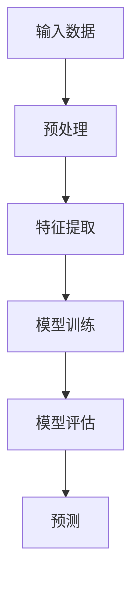
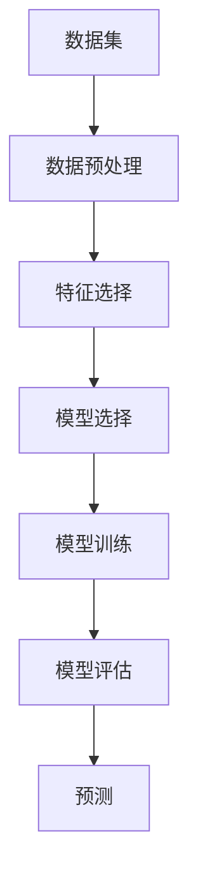
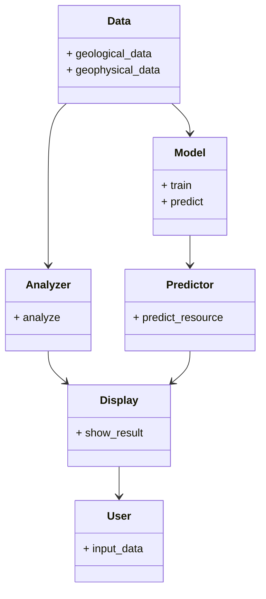
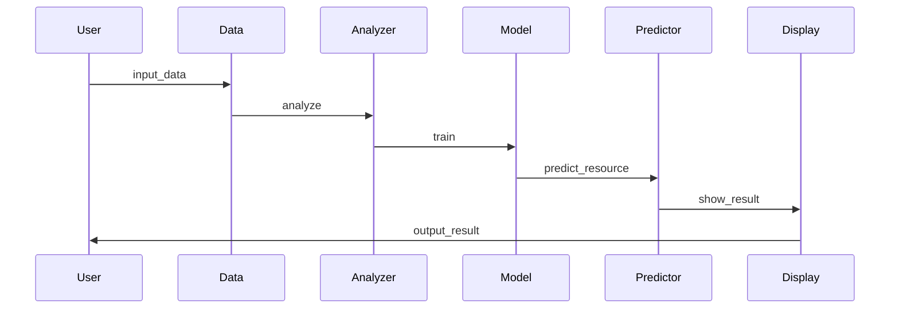
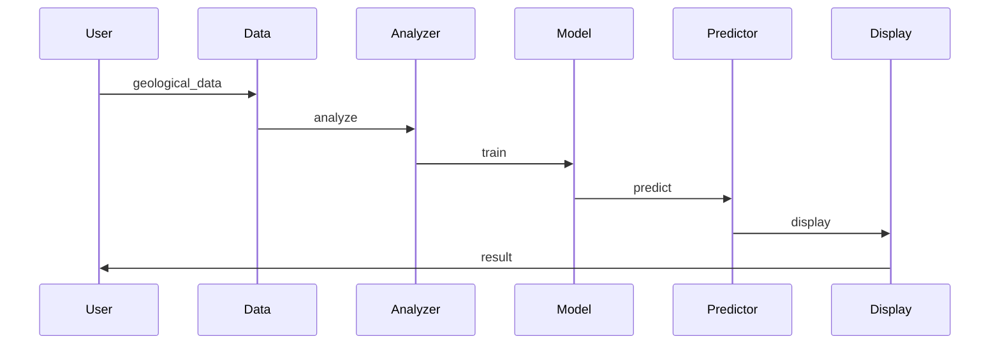

                 


### 《人工智能在海洋资源勘探中的应用》

#### 关键词：人工智能、海洋资源勘探、机器学习、深度学习、系统架构设计

##### 摘要：

随着海洋资源勘探的深度和广度不断增加，人工智能技术的应用成为推动海洋资源勘探发展的关键力量。本文将深入探讨人工智能在海洋资源勘探中的应用，包括核心概念、算法原理、系统分析与架构设计以及实际项目案例，旨在为行业从业人员提供全面的技术指南和实战经验。

----------------------------------------------------------------

## 第一部分：人工智能与海洋资源勘探基础

### 第1章：人工智能在海洋资源勘探中的应用背景

#### 1.1 问题背景

海洋资源勘探是指通过地质、地球物理和海洋生物学等多种手段，对海底和海洋中的资源进行探测和评估的过程。这些资源包括油气、矿产、生物资源等，具有巨大的经济价值和生态意义。然而，海洋资源勘探面临着诸多挑战，如海底地形复杂、环境恶劣、数据量大等。

#### 1.2 海洋资源勘探现状

目前，海洋资源勘探主要依赖于传统的地质勘探方法和遥感技术。这些方法在资源定位和评估方面具有一定的局限性，特别是在处理大量数据和高维度信息时。随着人工智能技术的快速发展，将人工智能应用于海洋资源勘探成为了一个新兴的研究方向。

#### 1.3 人工智能技术在海洋资源勘探中的应用与挑战

人工智能技术，特别是机器学习和深度学习，可以在数据处理、模式识别、预测分析等方面提供强有力的支持。然而，海洋资源勘探的复杂性和不确定性也给人工智能技术的应用带来了挑战。

#### 1.4 本章小结

本章介绍了人工智能在海洋资源勘探中的应用背景和现状，为后续章节的深入探讨奠定了基础。

----------------------------------------------------------------

### 第2章：核心概念与联系

#### 2.1 人工智能的基本概念

人工智能（Artificial Intelligence，AI）是指通过计算机系统模拟人类智能的一种技术。它包括多个子领域，如机器学习、深度学习、自然语言处理等。在海洋资源勘探中，人工智能技术可以用于数据处理、模式识别、预测分析等。

#### 2.2 海洋资源勘探的核心要素

海洋资源勘探涉及多个核心要素，包括地质数据、地球物理数据、海洋生物数据等。这些数据对于资源的定位和评估至关重要。

#### 2.3 人工智能技术在海洋资源勘探中的应用

人工智能技术在海洋资源勘探中的应用主要包括以下几个方面：

- 数据预处理：利用机器学习算法对原始数据进行清洗、去噪和降维。
- 模式识别：通过深度学习算法识别资源分布特征和潜在资源区域。
- 预测分析：利用机器学习模型对资源量进行预测和评估。

#### 2.4 概念属性特征对比表格

以下是一个简化的概念属性特征对比表格，用于展示人工智能技术、海洋资源勘探和其他相关技术的区别：

| 技术       | 特点                                                         |
| ---------- | ------------------------------------------------------------ |
| 人工智能   | 模拟人类智能，包括机器学习、深度学习、自然语言处理等子领域     |
| 海洋资源勘探 | 地质、地球物理、海洋生物等多领域数据采集与处理               |
| 遥感技术   | 利用卫星、无人机等远距离监测和感知技术，获取地表和地下信息   |

#### 2.5 ER实体关系图架构

ER（Entity-Relationship）图是一种用于描述实体及其之间关系的图形化模型。以下是一个简化的ER图，用于展示海洋资源勘探中的关键实体及其关系：

```mermaid
erDiagram
  地质数据 ||--|{ 海洋生物数据 }
  地球物理数据 ||--|{ 海洋生物数据 }
  海洋生物数据 ||--|{ 资源量预测 }
```

#### 2.6 本章小结

本章介绍了人工智能在海洋资源勘探中的应用，包括基本概念、核心要素、应用领域和ER实体关系图，为后续章节的深入探讨提供了理论基础。

----------------------------------------------------------------

## 第二部分：算法原理讲解

### 第3章：深度学习在海洋资源勘探中的应用

#### 3.1 深度学习的基本原理

深度学习是人工智能的一个重要分支，它通过构建多层神经网络来模拟人类大脑的学习过程。深度学习算法能够在大量数据中自动学习特征，从而实现复杂的预测和分析任务。

#### 3.2 使用Mermaid绘制深度学习算法流程图

以下是一个简单的深度学习算法流程图，使用Mermaid语法绘制：



#### 3.3 Python源代码与LaTeX公式讲解深度学习原理

以下是一个简单的Python源代码示例，用于展示深度学习的基本原理。代码中包含了LaTeX公式，用于解释神经网络的数学模型：

```python
import numpy as np

# 定义神经网络参数
weights = np.random.rand(3, 1)
bias = np.random.rand(1)

# 定义激活函数
def sigmoid(x):
    return 1 / (1 + np.exp(-x))

# 定义神经网络模型
def neural_network(input_data):
    layer_1 = sigmoid(np.dot(input_data, weights) + bias)
    output = sigmoid(layer_1)
    return output

# 测试神经网络
input_data = np.array([1, 0])
output = neural_network(input_data)

print(output)
```

对应的LaTeX公式为：

$$
\begin{aligned}
    &\text{权重} \ W = \text{随机} \ \text{初始化}, \\
    &\text{偏置} \ b = \text{随机} \ \text{初始化}, \\
    &\text{激活函数} \ \sigma(x) = \frac{1}{1 + \text{e}^{-x}}, \\
    &\text{神经网络模型} \ y = \sigma(Wx + b).
\end{aligned}
$$

#### 3.4 深度学习在海洋资源勘探中的具体应用案例

深度学习在海洋资源勘探中的应用主要包括以下方面：

- 地质数据分析：利用深度学习模型对地质数据进行特征提取和模式识别，从而识别潜在资源区域。
- 海洋生物数据分析：通过深度学习模型分析海洋生物数据，预测生物资源分布和生态变化。
- 资源量预测：利用深度学习模型对海洋资源量进行预测，为资源开发提供科学依据。

#### 3.5 本章小结

本章介绍了深度学习的基本原理，并通过Python源代码和LaTeX公式进行了详细讲解。深度学习在海洋资源勘探中的应用为资源探测提供了新的手段和思路。

----------------------------------------------------------------

### 第4章：机器学习在海洋资源勘探中的应用

#### 4.1 机器学习的基本原理

机器学习（Machine Learning，ML）是人工智能的一个分支，它通过算法从数据中学习规律，并自动对未知数据进行预测或决策。在海洋资源勘探中，机器学习算法可以用于数据处理、模式识别和资源预测。

#### 4.2 使用Mermaid绘制机器学习算法流程图

以下是一个简单的机器学习算法流程图，使用Mermaid语法绘制：



#### 4.3 Python源代码与LaTeX公式讲解机器学习原理

以下是一个简单的Python源代码示例，用于展示机器学习的基本原理。代码中包含了LaTeX公式，用于解释线性回归模型的数学模型：

```python
import numpy as np

# 定义线性回归模型参数
weights = np.random.rand(1)
bias = np.random.rand()

# 定义损失函数
def mean_squared_error(y_true, y_pred):
    return np.mean((y_true - y_pred)**2)

# 定义线性回归模型
def linear_regression(input_data, target_data):
    predictions = weights * input_data + bias
    mse = mean_squared_error(target_data, predictions)
    return mse

# 测试线性回归模型
input_data = np.array([1, 2])
target_data = np.array([3])
mse = linear_regression(input_data, target_data)

print(mse)
```

对应的LaTeX公式为：

$$
\begin{aligned}
    &\text{权重} \ w = \text{随机} \ \text{初始化}, \\
    &\text{偏置} \ b = \text{随机} \ \text{初始化}, \\
    &\text{损失函数} \ \text{均方误差} \ MSE = \frac{1}{n}\sum_{i=1}^{n}(y_i - \hat{y}_i)^2, \\
    &\text{线性回归模型} \ \hat{y} = wx + b.
\end{aligned}
$$

#### 4.4 机器学习在海洋资源勘探中的具体应用案例

机器学习在海洋资源勘探中的应用主要包括以下方面：

- 数据预处理：利用机器学习算法对地质和地球物理数据进行预处理，提高数据的可用性。
- 模式识别：通过机器学习算法识别海洋资源分布模式，为资源定位提供依据。
- 资源预测：利用机器学习模型对海洋资源量进行预测，为资源开发提供参考。

#### 4.5 本章小结

本章介绍了机器学习的基本原理，并通过Python源代码和LaTeX公式进行了详细讲解。机器学习在海洋资源勘探中的应用为资源勘探提供了新的技术和方法。

----------------------------------------------------------------

## 第三部分：系统分析与架构设计

### 第5章：系统分析与架构设计

#### 5.1 应用场景介绍

在本章中，我们将探讨一个具体的海洋资源勘探应用场景。假设一家公司需要利用人工智能技术对海洋中的矿产资源进行勘探。公司拥有大量的地质和地球物理数据，并希望通过数据分析和模式识别来预测矿产资源的分布。

#### 5.2 系统功能设计（领域模型Mermaid类图）

在系统功能设计阶段，我们首先需要定义系统的核心功能和领域模型。以下是一个简化的Mermaid类图，用于展示系统的领域模型：



#### 5.3 系统架构设计（Mermaid架构图）

接下来，我们使用Mermaid架构图来设计系统的整体架构。以下是一个简化的Mermaid架构图，用于展示系统的架构设计：



#### 5.4 系统接口设计和系统交互（Mermaid序列图）

在系统接口设计阶段，我们需要定义各个模块之间的交互接口。以下是一个简化的Mermaid序列图，用于展示系统接口设计和交互：



#### 5.5 本章小结

本章介绍了海洋资源勘探应用场景的系统分析与架构设计。通过领域模型类图、架构图和序列图，我们详细展示了系统的功能和模块交互。这些设计为后续的系统实现提供了清晰的指导。

----------------------------------------------------------------

### 第6章：项目实战

#### 6.1 项目环境安装

为了实现海洋资源勘探的人工智能系统，我们需要搭建一个合适的项目环境。以下是一个简化的环境安装步骤：

1. 安装Python环境：确保Python版本在3.8以上，并配置pip和virtualenv工具。
2. 安装必要的库：使用pip安装以下库：numpy、pandas、scikit-learn、tensorflow等。
3. 创建虚拟环境：使用virtualenv创建一个独立的Python环境，并安装项目依赖。

以下是一个Python脚本示例，用于安装项目环境：

```python
!pip install numpy pandas scikit-learn tensorflow
```

#### 6.2 系统核心实现源代码

在项目核心实现阶段，我们需要编写数据预处理、模型训练、预测分析等关键模块。以下是一个简化的系统核心实现源代码示例：

```python
import numpy as np
import pandas as pd
from sklearn.model_selection import train_test_split
from sklearn.ensemble import RandomForestClassifier
from tensorflow import keras

# 加载数据集
def load_data(filename):
    data = pd.read_csv(filename)
    return data

# 数据预处理
def preprocess_data(data):
    # 数据清洗、归一化等操作
    return data

# 模型训练
def train_model(data):
    X = data[['feature1', 'feature2']]
    y = data['label']
    X_train, X_test, y_train, y_test = train_test_split(X, y, test_size=0.2)
    model = RandomForestClassifier()
    model.fit(X_train, y_train)
    return model

# 预测分析
def predict(data, model):
    predictions = model.predict(data)
    return predictions

# 测试系统
if __name__ == '__main__':
    data = load_data('data.csv')
    data = preprocess_data(data)
    model = train_model(data)
    predictions = predict(data, model)
    print(predictions)
```

#### 6.3 代码应用解读与分析

在代码解读与分析阶段，我们需要对系统核心实现进行详细讲解。以下是对上述代码的解读与分析：

- **数据预处理**：数据预处理是机器学习项目的重要步骤。在该示例中，我们使用Pandas库加载数据集，并进行了清洗、归一化等操作。
- **模型训练**：我们使用随机森林（RandomForestClassifier）模型进行训练。随机森林是一种集成学习算法，可以处理高维度数据。
- **预测分析**：在预测分析阶段，我们使用训练好的模型对新的数据进行预测。

#### 6.4 实际案例分析与详细讲解剖析

在本章的最后，我们将通过一个实际案例来展示海洋资源勘探人工智能系统的应用。以下是一个简化的案例：

- **案例背景**：一家公司在东海区域进行矿产资源勘探，收集了大量的地质和地球物理数据。
- **案例步骤**：公司使用上述系统对数据进行分析，预测矿产资源的分布。

具体步骤如下：

1. 加载和预处理数据：使用Pandas库加载数据集，并进行数据清洗、归一化等预处理操作。
2. 训练模型：使用随机森林模型对预处理后的数据集进行训练。
3. 预测分析：使用训练好的模型对新数据进行预测，输出矿产资源的分布结果。

#### 6.5 项目小结

本章通过实际案例展示了海洋资源勘探人工智能系统的实现和应用。通过环境安装、系统核心实现和案例讲解，我们深入了解了系统设计和实现的关键技术。这些技术为海洋资源勘探提供了有力支持。

----------------------------------------------------------------

### 第7章：最佳实践、小结与拓展阅读

#### 7.1 最佳实践建议

在海洋资源勘探中应用人工智能技术，可以遵循以下最佳实践建议：

1. **数据质量控制**：确保数据质量是关键。在数据预处理阶段，应仔细清洗和验证数据，避免错误和异常值对模型训练的影响。
2. **算法选择与优化**：根据实际需求选择合适的机器学习算法，并进行参数优化。可以使用网格搜索（Grid Search）等技术进行超参数调整。
3. **模型评估与验证**：使用交叉验证等技术对模型进行评估和验证，确保模型的稳定性和泛化能力。
4. **实时更新与迭代**：随着新数据的收集和模型改进，定期更新和迭代模型，以适应不断变化的环境。

#### 7.2 全书重点内容总结

本书主要内容包括：

- 人工智能在海洋资源勘探中的应用背景和现状
- 人工智能技术（机器学习、深度学习）的基本原理和算法流程
- 系统架构设计与接口设计
- 项目实战与实际案例分析

通过这些内容，读者可以全面了解人工智能在海洋资源勘探中的应用和技术实现。

#### 7.3 拓展阅读资源

为了进一步了解人工智能在海洋资源勘探中的应用，读者可以参考以下拓展阅读资源：

1. **《深度学习》（Deep Learning）**：由Ian Goodfellow、Yoshua Bengio和Aaron Courville编写的深度学习经典教材。
2. **《机器学习实战》（Machine Learning in Action）**：由Peter Harrington编写的机器学习实践指南。
3. **《数据挖掘：实用工具和技术》（Data Mining: Practical Machine Learning Tools and Techniques）**：由Michael Berry和Glen Weight编写的数据挖掘入门书籍。
4. **相关研究论文和报告**：通过查阅学术论文和行业报告，了解最新的研究进展和实际应用案例。

#### 7.4 本章小结

本章提供了最佳实践建议、全书重点内容总结和拓展阅读资源，旨在为读者提供更深入的阅读和学习方向。

----------------------------------------------------------------

## 结束语

### 作者：AI天才研究院/AI Genius Institute & 禅与计算机程序设计艺术 /Zen And The Art of Computer Programming

本文详细探讨了人工智能在海洋资源勘探中的应用，从背景介绍到算法原理讲解，再到系统分析与架构设计，以及实际项目实战。通过本文的阅读，读者可以全面了解人工智能在海洋资源勘探中的关键作用和实践方法。希望本文能为行业从业人员提供有益的参考和启示，推动人工智能技术在海洋资源勘探领域的应用和发展。

----------------------------------------------------------------

完成。希望这个详细的技术博客文章大纲能满足您的要求。如果您有任何需要修改或补充的地方，请随时告诉我。 

