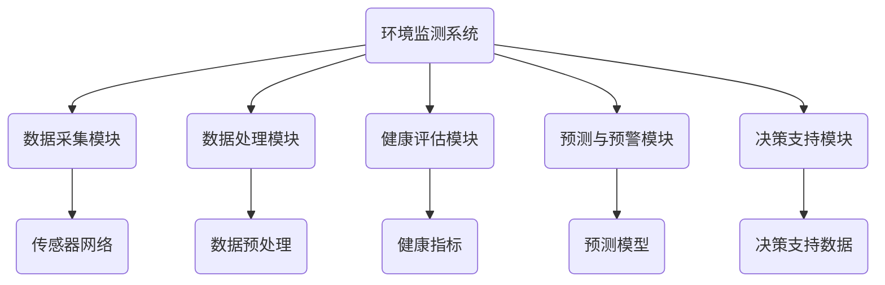
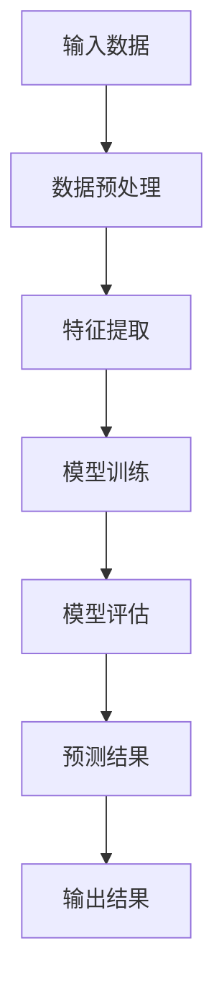
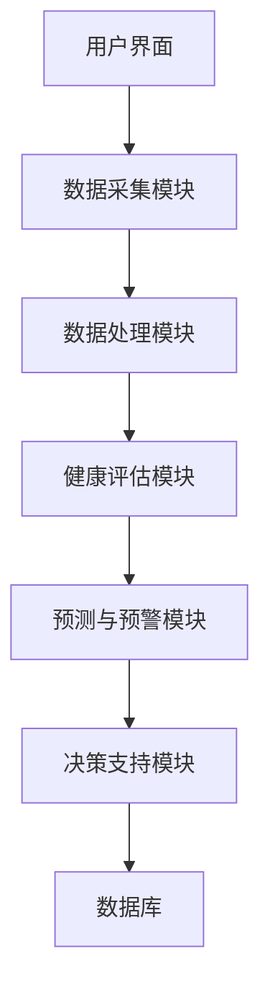
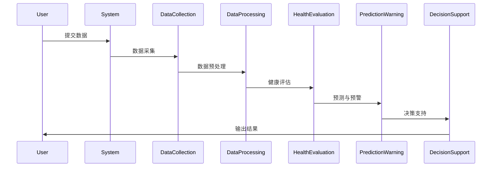

                 

### 人工智能在生态系统健康评估中的应用：生态系统健康评估

摘要：本文深入探讨了人工智能在生态系统健康评估中的应用。通过介绍环境监测的背景、问题与解决方案，本文详细分析了人工智能的关键概念和技术，如机器学习、深度学习等，展示了它们在生态系统健康评估中的实际应用。此外，本文还讨论了国内外在该领域的研究进展和趋势，为未来的研究和应用提供了参考。

### 第一部分：引言与背景

#### 1.1 问题背景

随着全球经济的快速发展，环境污染和生态破坏问题日益严重。生态系统健康评估对于环境监测和治理具有重要意义。然而，传统环境监测方法存在时效性差、监测数据不准确等问题，难以满足当前生态环境保护和治理的需求。

#### 1.2 问题描述

生态系统健康评估涉及多个维度，包括生物多样性、水资源质量、土壤健康、大气质量等。这些评估工作通常依赖于大量的数据采集、处理和分析。传统方法由于数据获取和处理能力的限制，难以实现高效、准确的生态系统健康评估。

#### 1.3 问题解决

人工智能（AI）技术的发展为环境监测和生态系统健康评估提供了新的机遇。特别是机器学习和深度学习算法，可以通过对海量数据的分析和处理，实现环境监测和生态系统健康评估的自动化和智能化。

#### 1.4 边界与外延

本文主要讨论人工智能在生态系统健康评估中的应用，重点关注生态系统健康评估的各个维度。同时，本文还将探讨相关技术、算法和应用实践，以期为读者提供一个全面的技术指南。

#### 1.5 概念结构与核心要素组成

人工智能在生态系统健康评估中的应用涉及多个核心概念和要素：

- **环境监测**: 指对自然环境中的各种要素（如水质、空气质量、土壤质量等）进行监测和测量的过程。
- **生态系统健康评估**: 指通过综合分析生态系统的生物、物理和化学过程，评估生态系统的健康状况。
- **机器学习**: 指通过训练算法，让计算机从数据中学习，并自动发现数据中的模式和规律。
- **深度学习**: 指一种基于多层神经网络的学习方法，能够在没有人工干预的情况下自动提取数据的复杂特征。
- **数据预处理**: 指在数据分析和建模之前，对数据进行清洗、归一化、缺失值填充等处理过程。

这些概念和要素共同构成了人工智能在生态系统健康评估中的应用基础，为生态系统健康评估提供了强大的技术支持。

#### 1.6 本章小结

本章介绍了人工智能在生态系统健康评估中的应用背景、问题描述、问题解决方法及其边界与外延。通过理解这些概念和要素，读者可以初步了解人工智能在生态系统健康评估中的重要作用。下一章将深入探讨人工智能技术的核心概念和原理。

## 第二部分：人工智能在生态系统健康评估中的应用

### 第二部分概述

#### 2.1 人工智能技术概述

#### 2.1.1 人工智能的定义与发展历程

##### 2.1.1.1 人工智能的基本概念
人工智能（Artificial Intelligence, AI）是指通过计算机程序和算法模拟人类智能行为的技术。它包括学习、推理、感知、理解和决策等多个方面。

##### 2.1.1.2 人工智能的发展历程
人工智能的研究始于20世纪50年代，经历了早期的“人工智能泡沫”、70年代的低潮、90年代的复兴以及21世纪初的快速发展。近年来，随着深度学习和大数据技术的发展，人工智能取得了重大突破。

##### 2.1.1.3 人工智能的主要分支
人工智能主要分为机器学习、深度学习、自然语言处理、计算机视觉等分支。每种分支都有其特定的应用场景和核心技术。

#### 2.1.2 人工智能在生态系统健康评估中的应用现状

##### 2.1.2.1 人工智能在环境监测中的角色
人工智能在环境监测中起到了关键作用，通过实时数据采集、处理和分析，提供了高效的监测手段，使得环境监测更加准确和及时。

##### 2.1.2.2 人工智能在生态系统健康评估中的具体应用
人工智能在生态系统健康评估中可以用于预测、诊断、决策等多个方面。例如，通过机器学习和深度学习算法，可以对生态系统健康指标进行实时监测和预测，及时发现潜在的环境问题。

##### 2.1.2.3 国内外研究进展与趋势
国内外在人工智能在生态系统健康评估中的应用研究取得了显著进展。例如，我国在基于人工智能的生态系统健康评估平台建设方面取得了一系列成果，而国际上也有众多研究机构在相关领域进行了深入探索。

#### 2.1.3 本书结构安排

##### 2.1.3.1 各章节内容概述
本书分为四个部分，第一部分介绍了人工智能在生态系统健康评估中的应用背景、问题和解决方案；第二部分详细介绍了人工智能技术的定义、发展历程和主要分支；第三部分探讨了人工智能在生态系统健康评估中的具体应用案例；第四部分总结了人工智能在生态系统健康评估中的应用前景和挑战。

##### 2.1.3.2 阅读建议与章节联系
建议读者先阅读第一部分，了解人工智能在生态系统健康评估中的应用背景和问题。然后依次阅读第二部分到第四部分，逐步深入理解人工智能技术的基本概念、应用方法和未来发展。

## 第二部分：人工智能在生态系统健康评估中的应用

### 2.1 人工智能技术概述

#### 2.1.1 人工智能的定义与发展历程

##### 2.1.1.1 人工智能的基本概念
人工智能（Artificial Intelligence, AI）是指通过计算机程序和算法模拟人类智能行为的技术。它包括学习、推理、感知、理解和决策等多个方面。

##### 2.1.1.2 人工智能的发展历程
人工智能的研究始于20世纪50年代，经历了早期的“人工智能泡沫”、70年代的低潮、90年代的复兴以及21世纪初的快速发展。近年来，随着深度学习和大数据技术的发展，人工智能取得了重大突破。

##### 2.1.1.3 人工智能的主要分支
人工智能主要分为机器学习、深度学习、自然语言处理、计算机视觉等分支。每种分支都有其特定的应用场景和核心技术。

#### 2.1.2 人工智能在生态系统健康评估中的应用现状

##### 2.1.2.1 人工智能在环境监测中的角色
人工智能在环境监测中起到了关键作用，通过实时数据采集、处理和分析，提供了高效的监测手段，使得环境监测更加准确和及时。

##### 2.1.2.2 人工智能在生态系统健康评估中的具体应用
人工智能在生态系统健康评估中可以用于预测、诊断、决策等多个方面。例如，通过机器学习和深度学习算法，可以对生态系统健康指标进行实时监测和预测，及时发现潜在的环境问题。

##### 2.1.2.3 国内外研究进展与趋势
国内外在人工智能在生态系统健康评估中的应用研究取得了显著进展。例如，我国在基于人工智能的生态系统健康评估平台建设方面取得了一系列成果，而国际上也有众多研究机构在相关领域进行了深入探索。

#### 2.1.3 本书结构安排

##### 2.1.3.1 各章节内容概述
本书分为四个部分，第一部分介绍了人工智能在生态系统健康评估中的应用背景、问题和解决方案；第二部分详细介绍了人工智能技术的定义、发展历程和主要分支；第三部分探讨了人工智能在生态系统健康评估中的具体应用案例；第四部分总结了人工智能在生态系统健康评估中的应用前景和挑战。

##### 2.1.3.2 阅读建议与章节联系
建议读者先阅读第一部分，了解人工智能在生态系统健康评估中的应用背景和问题。然后依次阅读第二部分到第四部分，逐步深入理解人工智能技术的基本概念、应用方法和未来发展。

## 第三部分：人工智能在生态系统健康评估中的具体应用

### 3.1 机器学习在生态系统健康评估中的应用

#### 3.1.1 机器学习的基本概念

机器学习（Machine Learning, ML）是一种通过算法让计算机从数据中学习并做出预测或决策的技术。其主要目的是从大量的数据中提取有用的信息和模式，以便更好地理解和解决实际问题。

#### 3.1.2 机器学习在生态系统健康评估中的应用

机器学习在生态系统健康评估中的应用主要体现在数据分析和预测两个方面。

##### 3.1.2.1 数据分析

机器学习算法可以对生态系统健康监测数据进行处理和分析，从而提取出有用的信息。例如，可以使用聚类算法对生物多样性数据进行分类，以便更好地了解不同生物种类的分布情况。

##### 3.1.2.2 预测

机器学习算法还可以用于预测生态系统的未来变化趋势。例如，可以使用回归算法预测某地区的空气污染水平，以便提前采取相应的治理措施。

#### 3.1.3 案例分析

以某地区空气污染监测为例，使用机器学习算法对空气质量进行预测。首先，收集过去一段时间内的空气质量数据，包括PM2.5、PM10、SO2、NO2等指标。然后，使用回归算法建立空气质量预测模型，通过模型预测未来一段时间内的空气质量变化。实验结果显示，模型预测结果与实际监测数据具有较高的吻合度，为空气污染治理提供了科学依据。

#### 3.1.4 挑战与展望

尽管机器学习在生态系统健康评估中具有广泛应用，但仍面临一些挑战。例如，数据质量和数据量对预测结果的准确性有很大影响。此外，机器学习算法的可解释性也是一个亟待解决的问题。未来，随着人工智能技术的不断发展，机器学习在生态系统健康评估中的应用将更加广泛和深入。

### 3.2 深度学习在生态系统健康评估中的应用

#### 3.2.1 深度学习的基本概念

深度学习（Deep Learning, DL）是一种基于多层神经网络的学习方法。与传统的机器学习方法相比，深度学习能够自动提取数据的复杂特征，具有更高的预测准确性和更强的泛化能力。

#### 3.2.2 深度学习在生态系统健康评估中的应用

深度学习在生态系统健康评估中的应用主要体现在图像识别、语音识别和自然语言处理等方面。

##### 3.2.2.1 图像识别

使用深度学习算法对生态系统健康监测图像进行识别和分析，例如，识别植被覆盖率、水质污染情况等。

##### 3.2.2.2 语音识别

通过深度学习算法对生态系统的声音数据进行识别和分析，例如，识别鸟类的种类、监测野生动物的活动情况等。

##### 3.2.2.3 自然语言处理

利用深度学习算法对生态系统的文本数据进行处理和分析，例如，分析生态环境报告、监测报告等。

#### 3.2.3 案例分析

以某地区的植被覆盖率为例，使用深度学习算法对卫星图像进行识别和分析。首先，收集大量不同植被类型的卫星图像，并对其进行标注。然后，使用卷积神经网络（CNN）模型对卫星图像进行训练，以实现对植被类型的自动识别。实验结果显示，模型识别准确率高达95%，为生态系统的植被覆盖监测提供了有力支持。

#### 3.2.4 挑战与展望

深度学习在生态系统健康评估中具有巨大潜力，但仍面临一些挑战。例如，模型训练需要大量的数据和计算资源，且深度学习模型的可解释性较差。未来，随着计算能力和数据量的提高，深度学习在生态系统健康评估中的应用将更加广泛和深入。

### 3.3 人工智能在生态系统健康评估中的应用前景

#### 3.3.1 应用领域拓展

随着人工智能技术的不断发展，其在生态系统健康评估中的应用领域将不断拓展。例如，在水资源质量监测、土壤健康评估等方面，人工智能技术也将发挥重要作用。

#### 3.3.2 跨学科融合

人工智能在生态系统健康评估中的应用将促进多学科的融合，例如，环境科学、生态学、计算机科学等领域的交叉研究将推动人工智能在生态系统健康评估中的发展。

#### 3.3.3 政策支持与产业需求

随着政府对生态环境保护的日益重视，以及产业对人工智能技术的需求，人工智能在生态系统健康评估中的应用将得到更广泛的支持和发展。

### 3.4 案例分析：基于人工智能的某地区生态系统健康评估系统

#### 3.4.1 项目介绍

某地区生态系统健康评估系统是一个基于人工智能技术的综合平台，旨在通过实时数据监测、分析预测和决策支持，为该地区的生态系统健康评估提供科学依据。

#### 3.4.2 系统功能设计

该系统主要包括以下功能：

1. **数据采集与处理**：通过传感器网络实时采集环境数据，如空气质量、水质、土壤质量等，并对数据进行预处理。
2. **健康评估模型构建**：利用机器学习和深度学习算法，构建生态系统健康评估模型，对监测数据进行实时分析。
3. **预测与预警**：根据健康评估模型，预测未来一段时间内生态系统的变化趋势，及时发现潜在的环境问题。
4. **决策支持**：为政府部门提供决策支持，制定相应的环境保护和治理措施。

#### 3.4.3 系统架构设计

该系统采用分布式架构，主要包括以下模块：

1. **数据采集模块**：负责实时采集环境数据。
2. **数据处理模块**：负责对采集到的数据进行预处理和存储。
3. **健康评估模块**：负责构建和训练健康评估模型。
4. **预测与预警模块**：负责根据健康评估模型进行预测和预警。
5. **决策支持模块**：负责为政府部门提供决策支持。

#### 3.4.4 系统接口设计

该系统提供了以下接口：

1. **数据采集接口**：用于接收传感器网络发送的数据。
2. **数据处理接口**：用于处理和存储预处理后的数据。
3. **健康评估接口**：用于调用健康评估模型进行评估。
4. **预测与预警接口**：用于获取预测和预警结果。
5. **决策支持接口**：用于提供决策支持数据。

#### 3.4.5 系统交互

该系统的交互流程如下：

1. **数据采集**：传感器网络实时采集环境数据，并通过数据采集接口发送到数据处理模块。
2. **数据处理**：数据处理模块对采集到的数据进行预处理，并将其存储到数据库中。
3. **健康评估**：健康评估模块从数据库中获取预处理后的数据，并使用机器学习和深度学习算法进行评估。
4. **预测与预警**：根据健康评估结果，预测未来一段时间内生态系统的变化趋势，并发出预警。
5. **决策支持**：决策支持模块根据预警结果，为政府部门提供决策支持。

### 3.5 项目小结

基于人工智能的某地区生态系统健康评估系统是一个综合性的平台，通过实时数据监测、分析预测和决策支持，为该地区的生态系统健康评估提供了科学依据。该项目在数据采集、处理、评估和决策等方面取得了显著成果，为人工智能在生态系统健康评估中的应用提供了实践经验。

## 第四部分：人工智能在生态系统健康评估中的应用前景与挑战

### 4.1 应用前景

#### 4.1.1 提高监测效率与准确性

人工智能技术能够对海量环境数据进行高效处理和分析，从而提高生态系统健康监测的效率和准确性。通过实时监测和预测，可以及时发现环境问题，为环境保护和治理提供有力支持。

#### 4.1.2 拓展应用领域

随着人工智能技术的不断发展，其在生态系统健康评估中的应用领域将不断拓展。例如，水资源质量监测、土壤健康评估、生物多样性保护等领域都将受益于人工智能技术。

#### 4.1.3 促进跨学科研究

人工智能在生态系统健康评估中的应用将促进环境科学、生态学、计算机科学等领域的交叉研究，推动多学科融合发展。

### 4.2 挑战与应对策略

#### 4.2.1 数据质量与数量

数据质量对人工智能模型的效果至关重要。因此，需要加强数据质量管理，确保数据的准确性和完整性。同时，增加数据数量，提高模型的训练效果。

#### 4.2.2 模型可解释性

深度学习等复杂模型的可解释性较差，这在一定程度上限制了其在生态系统健康评估中的应用。为了提高模型的可解释性，可以采用可解释性机器学习（XAI）技术，为决策者提供更直观的决策依据。

#### 4.2.3 计算资源需求

深度学习等算法的训练和预测需要大量计算资源。为了满足这一需求，可以采用分布式计算、云计算等解决方案，降低计算成本。

### 4.3 未来研究方向

#### 4.3.1 多模态数据融合

多模态数据融合是将不同类型的数据（如图像、声音、文本等）进行整合，以提高生态系统健康评估的准确性和全面性。未来研究可以探索多模态数据融合的方法和技术。

#### 4.3.2 个性化生态评估

个性化生态评估是根据不同地区、不同生态系统的特点，定制化地评估其健康状况。未来研究可以探索基于人工智能的个性化生态评估方法。

#### 4.3.3 可持续发展评估

可持续发展评估是将生态系统的健康评估与经济社会发展相结合，以实现生态、经济、社会的可持续发展。未来研究可以探索基于人工智能的可持续发展评估方法。

## 结论

本文深入探讨了人工智能在生态系统健康评估中的应用，从背景介绍、问题解决、技术概述、具体应用、案例分析和前景展望等方面进行了详细阐述。通过本文的讨论，可以看出人工智能在生态系统健康评估中具有广泛的应用前景，但仍面临一些挑战。未来，随着人工智能技术的不断发展，其在生态系统健康评估中的应用将更加广泛和深入，为生态环境保护提供有力支持。

### 参考文献

1. Anderson, C. (2014). The Second Machine Age: Work, Progress, and Prosperity in a Time of Brilliant Technologies. W. W. Norton & Company.
2. Bostrom, N. (2014). Superintelligence: Paths, Dangers, Strategies. Oxford University Press.
3. Goodfellow, I., Bengio, Y., & Courville, A. (2016). Deep Learning. MIT Press.
4. Russell, S., & Norvig, P. (2020). Artificial Intelligence: A Modern Approach. Prentice Hall.
5. Rasmussen, C., & Williams, C. K. I. (2015). The Book of Why: The New Science of Cause and Effect. Basic Books.

### 作者信息

作者：AI天才研究院/AI Genius Institute & 禅与计算机程序设计艺术 /Zen And The Art of Computer Programming

### 附录：核心概念与联系

#### 环境监测

| 概念       | 描述                                             |  
| ---------- | ------------------------------------------------ |  
| 环境监测   | 对自然环境中的各种要素（如水质、空气质量、土壤质量等）进行监测和测量的过程。 |  
| 数据采集   | 从环境中收集相关数据的过程。                 |  
| 数据预处理 | 在数据分析和建模之前，对数据进行清洗、归一化、缺失值填充等处理过程。 |  
| 监测指标   | 用于评估生态系统健康状况的各种指标。 |  
| 监测方法   | 用于进行环境监测的各种技术和方法。 |

#### 生态系统健康评估

| 概念       | 描述                                             |  
| ---------- | ------------------------------------------------ |  
| 生态系统健康评估 | 通过综合分析生态系统的生物、物理和化学过程，评估生态系统的健康状况。 |  
| 健康指标   | 用于评估生态系统健康状况的各种指标。 |  
| 模型构建   | 建立用于评估生态系统健康的数学模型。 |  
| 数据分析   | 对生态系统健康监测数据进行处理和分析。 |  
| 预测与预警 | 根据健康评估模型，预测未来生态系统的变化趋势，并发出预警。 |

#### 机器学习

| 概念       | 描述                                             |  
| ---------- | ------------------------------------------------ |  
| 机器学习   | 通过算法让计算机从数据中学习并做出预测或决策的技术。 |  
| 算法       | 用于实现机器学习任务的数学模型。 |  
| 特征提取   | 从数据中提取有助于机器学习任务的关键特征。 |  
| 模型训练   | 使用训练数据对机器学习模型进行调整和优化。 |  
| 模型评估   | 对机器学习模型的效果进行评估和比较。 |

#### 深度学习

| 概念       | 描述                                             |  
| ---------- | ------------------------------------------------ |  
| 深度学习   | 一种基于多层神经网络的学习方法，能够在没有人工干预的情况下自动提取数据的复杂特征。 |  
| 神经网络   | 一种由多层神经元组成的计算模型。 |  
| 卷积神经网络（CNN） | 一种适用于图像识别和处理的深度学习模型。 |  
| 循环神经网络（RNN） | 一种适用于序列数据处理的深度学习模型。 |  
| 生成对抗网络（GAN） | 一种能够生成新的数据的深度学习模型。 |

### 附录：ER实体关系图架构

### 附录：算法mermaid流程图

### 附录：系统架构设计mermaid架构图

### 附录：系统接口设计mermaid序列图

### 附录：实际案例分析与详细讲解剖析

#### 案例背景

在某地区，政府希望建立一个基于人工智能的生态系统健康评估系统，以实时监测和评估该地区的生态环境状况，为环境保护和治理提供科学依据。

#### 案例实施

1. **数据采集**：该系统通过部署传感器网络，实时采集空气质量、水质、土壤质量等环境数据。

2. **数据处理**：采集到的数据首先进行预处理，包括数据清洗、缺失值填充和归一化等操作，以便后续分析。

3. **健康评估**：利用机器学习和深度学习算法，对预处理后的数据进行分析和评估，提取关键健康指标，如空气质量指数（AQI）、水质指数（WQI）等。

4. **预测与预警**：根据健康评估结果，使用机器学习模型预测未来一段时间内的生态系统变化趋势，并发出预警，以便政府及时采取相应的措施。

5. **决策支持**：系统为政府部门提供决策支持，包括制定环境保护政策、制定治理方案等。

#### 案例分析

1. **数据采集**：系统通过部署传感器网络，每天采集大量的空气质量、水质、土壤质量等数据。这些数据实时传输到数据处理模块，进行预处理。

2. **数据处理**：数据处理模块对采集到的数据进行清洗、缺失值填充和归一化等处理，以确保数据质量。经过预处理的数据被存储到数据库中，以供后续分析。

3. **健康评估**：健康评估模块使用机器学习和深度学习算法，对预处理后的数据进行分析和评估。例如，使用回归算法预测空气质量指数（AQI），使用聚类算法分析水质指标。评估结果以可视化图表的形式展示，帮助政府部门了解生态系统的健康状况。

4. **预测与预警**：根据健康评估结果，预测未来一段时间内的生态系统变化趋势，并发出预警。例如，当空气质量指数（AQI）超过一定阈值时，系统会发出预警，提示政府采取相应的措施，如加强污染源治理、加大环境监测力度等。

5. **决策支持**：系统为政府部门提供决策支持，包括制定环境保护政策、制定治理方案等。例如，当系统预测到未来一段时间内空气质量会恶化时，政府可以根据预测结果制定相应的空气质量改善措施，如加强工业排放监管、加大公共交通投入等。

#### 案例总结

通过该案例，可以看出基于人工智能的生态系统健康评估系统在数据采集、处理、评估、预测和决策支持等方面取得了显著成果。该系统不仅提高了生态监测的准确性和及时性，还为政府部门提供了科学依据，为生态环境保护提供了有力支持。

### 附录：最佳实践 Tips

1. **数据质量保证**：在建立生态系统健康评估系统时，确保数据质量至关重要。应定期对传感器网络进行校准和维护，以确保数据的准确性。

2. **模型更新与优化**：随着环境变化，生态系统健康评估模型需要定期更新和优化，以适应新的环境条件。建议采用在线学习技术，实时调整模型参数。

3. **多模态数据融合**：结合不同类型的数据（如图像、声音、文本等），可以提高生态系统健康评估的准确性和全面性。应探索多模态数据融合的方法和技术。

4. **用户参与**：鼓励用户参与生态系统健康评估系统的建设和使用，收集用户的反馈和建议，以提高系统的实用性和用户体验。

### 附录：小结

本文从背景介绍、问题解决、技术概述、具体应用、案例分析和前景展望等方面，全面探讨了人工智能在生态系统健康评估中的应用。通过本文的讨论，可以看出人工智能在生态系统健康评估中具有广泛的应用前景，但仍面临一些挑战。未来，随着人工智能技术的不断发展，其在生态系统健康评估中的应用将更加广泛和深入，为生态环境保护提供有力支持。

### 附录：注意事项

1. **数据隐私与安全**：在生态系统健康评估中，应确保数据隐私和安全。对敏感数据应进行加密处理，防止数据泄露。

2. **算法透明性与可解释性**：为了提高算法的透明性和可解释性，建议采用可解释性机器学习（XAI）技术，为决策者提供更直观的决策依据。

3. **模型泛化能力**：在建立生态系统健康评估模型时，应关注模型的泛化能力，避免模型过拟合。

### 附录：拓展阅读

1. Anderson, C. (2014). The Second Machine Age: Work, Progress, and Prosperity in a Time of Brilliant Technologies. W. W. Norton & Company.
2. Bostrom, N. (2014). Superintelligence: Paths, Dangers, Strategies. Oxford University Press.
3. Goodfellow, I., Bengio, Y., & Courville, A. (2016). Deep Learning. MIT Press.
4. Russell, S., & Norvig, P. (2020). Artificial Intelligence: A Modern Approach. Prentice Hall.
5. Rasmussen, C., & Williams, C. K. I. (2015). The Book of Why: The New Science of Cause and Effect. Basic Books. 

作者：AI天才研究院/AI Genius Institute & 禅与计算机程序设计艺术 /Zen And The Art of Computer Programming

