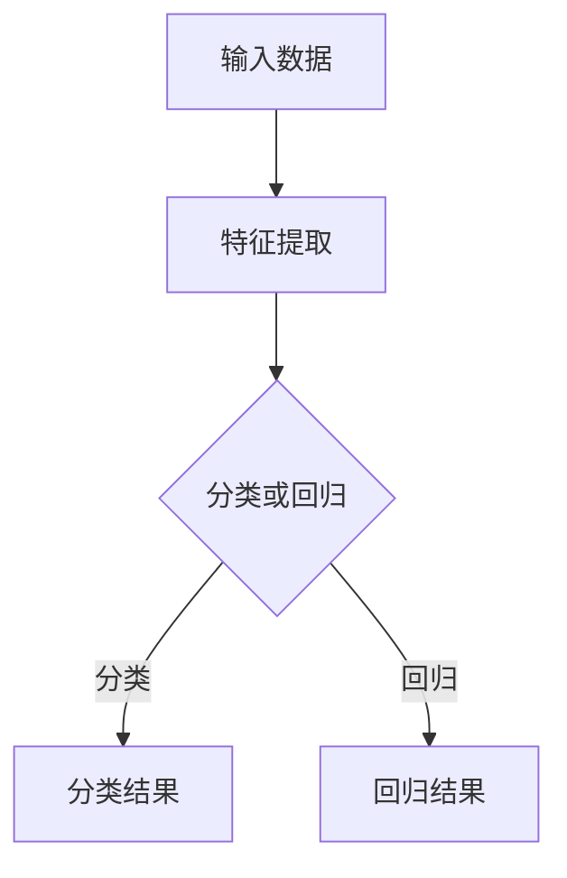
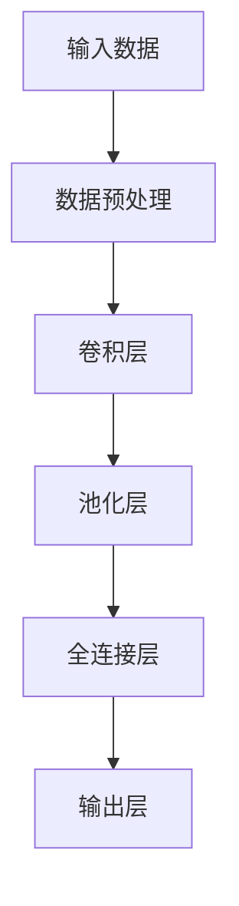
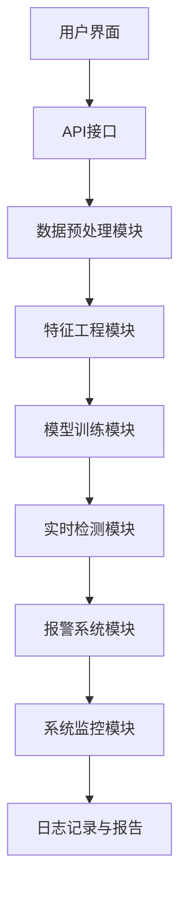
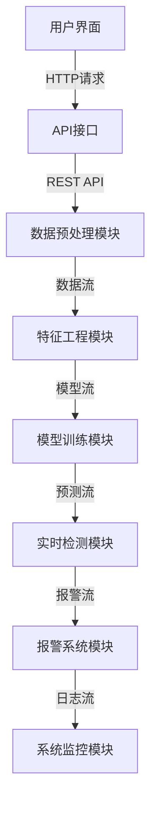
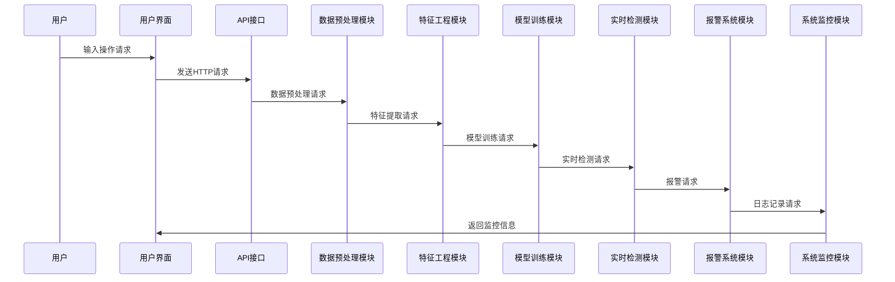

                 

# 人工智能在金融风控中的应用：大数据分析与欺诈检测

## 关键词：人工智能，金融风控，大数据分析，欺诈检测，机器学习

> 摘要：本文从问题背景出发，深入探讨了人工智能在金融风控中的应用，特别是大数据分析和欺诈检测领域。通过对人工智能、大数据分析、欺诈检测等核心概念的介绍，结合具体案例分析，本文展示了人工智能在金融风控中的巨大潜力，并提出了未来发展的方向。

## 目录大纲

## 第一部分: 问题背景与核心概念

### 第1章: 问题背景与核心概念

1.1 问题的提出
1.1.1 金融风控的重要性
1.1.2 大数据与人工智能的崛起
1.1.3 欺诈检测的需求与挑战

1.2 核心概念
1.2.1 人工智能
1.2.1.1 人工智能的定义与发展历程
1.2.1.2 人工智能的核心技术
1.2.1.3 人工智能在金融领域的应用现状
1.2.2 大数据分析
1.2.2.1 大数据的概念与特点
1.2.2.2 大数据分析的技术与方法
1.2.2.3 大数据分析在金融风控中的应用
1.2.3 欺诈检测
1.2.3.1 欺诈检测的定义与分类
1.2.3.2 欺诈检测的关键技术
1.2.3.3 欺诈检测的挑战与应对策略

## 第二部分: 人工智能在金融风控中的应用

### 第2章: 人工智能在金融风控中的应用

2.1 人工智能在金融风控中的价值
2.1.1 人工智能在信用风险评估中的应用
2.1.1.1 信用风险评估的传统方法
2.1.1.2 人工智能在信用风险评估中的优势
2.1.1.3 人工智能在信用风险评估中的应用案例
2.1.2 人工智能在市场风险预测中的应用
2.1.2.1 市场风险预测的传统方法
2.1.2.2 人工智能在市场风险预测中的优势
2.1.2.3 人工智能在市场风险预测中的应用案例

### 第3章: 人工智能在反欺诈中的应用

3.1 反欺诈的现状与挑战
3.1.1 反欺诈的背景
3.1.2 反欺诈的挑战
3.2 人工智能在反欺诈中的应用
3.2.1 机器学习在反欺诈中的应用
3.2.1.1 传统机器学习算法在反欺诈中的应用
3.2.1.2 深度学习在反欺诈中的应用
3.2.2 模糊逻辑在反欺诈中的应用
3.2.3 集成学习方法在反欺诈中的应用
3.2.4 案例分析：人工智能在反欺诈中的应用案例

## 第三部分: 大数据分析与欺诈检测

### 第4章: 大数据分析与欺诈检测

4.1 大数据分析在欺诈检测中的作用
4.1.1 大数据的特点与优势
4.1.2 大数据在欺诈检测中的应用
4.1.2.1 数据收集与预处理
4.1.2.2 数据分析与挖掘
4.1.2.3 欺诈检测模型的建立与优化
4.2 欺诈检测的关键技术
4.2.1 监督学习与无监督学习
4.2.1.1 监督学习的原理与应用
4.2.1.2 无监督学习的原理与应用
4.2.2 欺诈检测模型的评估与优化
4.2.2.1 欺诈检测模型的评估指标
4.2.2.2 模型的优化策略
4.2.3 欺诈检测系统的设计与实现
4.2.3.1 系统架构设计
4.2.3.2 系统实现与部署

## 第四部分: 实战案例

### 第5章: 实战案例一——某银行信用风险评估系统

5.1 项目背景与目标
5.2 数据收集与预处理
5.3 模型建立与优化
5.4 系统实现与部署
5.5 结果分析与总结

### 第6章: 实战案例二——某支付平台反欺诈系统

6.1 项目背景与目标
6.2 数据收集与预处理
6.3 模型建立与优化
6.4 系统实现与部署
6.5 结果分析与总结

## 第五部分: 拓展与未来展望

### 第7章: 拓展应用

7.1 人工智能在金融风险控制中的其他应用领域
7.2 大数据与人工智能在金融风控中的未来发展

### 第8章: 未来展望

8.1 人工智能在金融风控中的应用前景
8.2 大数据分析在欺诈检测中的发展方向## 第一部分：问题背景与核心概念

### 第1章：问题背景与核心概念

1.1 问题的提出

随着信息技术的快速发展，金融行业正面临着前所未有的变革。在金融领域，风控（风险控制）是一个至关重要的环节。它关乎金融机构的稳健运行，客户的财产安全，甚至整个金融系统的稳定。然而，传统风控方法在面对日益复杂、多变的市场环境时，逐渐显现出其局限性。

在金融风控中，欺诈检测是一个重要的组成部分。欺诈行为可能包括信用欺诈、交易欺诈、账户欺诈等，这些行为不仅给金融机构带来巨大的经济损失，还会影响市场的公平性和稳定性。传统的欺诈检测方法主要依赖于规则引擎，即根据预先设定的规则进行匹配和判断。这种方法在处理简单、明确的欺诈行为时效果较好，但在面对复杂、多变的欺诈手段时，其检测效果有限。

近年来，大数据和人工智能技术的崛起为金融风控带来了新的契机。大数据技术能够处理和分析海量数据，从而发现潜在的风险点；人工智能技术则能够通过机器学习和深度学习等算法，对数据进行智能分析，从而实现更精准的欺诈检测。

1.1.1 金融风控的重要性

金融风控是金融机构稳健运营的核心保障。通过有效的风控措施，金融机构可以识别、评估、控制和管理风险，确保业务的持续、稳定发展。具体来说，金融风控的重要性体现在以下几个方面：

- **保障客户利益**：风控措施能够有效防止欺诈、违约等风险，保障客户的财产安全。
- **维护市场稳定**：风控措施能够识别和防范系统性风险，维护金融市场的稳定运行。
- **提高经营效益**：通过有效的风控，金融机构可以降低不良资产率，提高资本充足率，从而提高整体经营效益。

1.1.2 大数据与人工智能的崛起

大数据和人工智能技术是21世纪最具革命性的技术之一。大数据技术能够处理和分析海量数据，从数据中发现有价值的信息和模式；人工智能技术则能够通过机器学习和深度学习等算法，对这些信息进行智能分析，从而实现自动化决策。

在大数据和人工智能的背景下，金融风控迎来了新的发展机遇。首先，大数据技术可以帮助金融机构收集和分析更多维度的数据，从而更全面地了解客户和市场情况。其次，人工智能技术可以实现对数据的自动分析和模式识别，从而更精准地识别欺诈行为和风险。

1.1.3 欺诈检测的需求与挑战

欺诈检测是金融风控中的一个重要环节。随着互联网和移动支付的普及，欺诈手段也变得更加多样化、复杂化。传统的欺诈检测方法已经难以应对这些新挑战，因此，引入大数据和人工智能技术成为必然选择。

然而，欺诈检测面临着以下几个挑战：

- **数据复杂性**：欺诈行为往往隐藏在大量的正常交易数据中，如何从海量数据中提取有价值的信息是一个难题。
- **欺诈手段的多样性**：欺诈手段层出不穷，传统的规则引擎难以覆盖所有可能的欺诈行为。
- **实时性要求**：欺诈行为往往发生在短时间内，对欺诈检测系统的实时性要求非常高。

1.2 核心概念

1.2.1 人工智能

人工智能（Artificial Intelligence，AI）是指通过计算机模拟人类智能的技术。它包括机器学习、深度学习、自然语言处理、计算机视觉等多个领域。人工智能的核心技术是通过算法和计算模型来模拟人类的学习、推理、判断和决策能力。

- **定义与发展历程**：人工智能最早可以追溯到20世纪50年代，当时主要研究如何让计算机具有人类智能。经过几十年的发展，人工智能技术取得了显著的进展，特别是在机器学习和深度学习领域。
- **核心技术**：机器学习、深度学习、自然语言处理、计算机视觉等。
- **在金融领域的应用现状**：人工智能在金融领域有着广泛的应用，包括信用风险评估、市场预测、反欺诈等。

1.2.2 大数据分析

大数据分析（Big Data Analysis）是指通过计算机技术对海量数据进行处理和分析，从中提取有价值的信息和知识。大数据分析的核心技术包括数据采集、数据存储、数据处理、数据分析和数据可视化等。

- **概念与特点**：大数据具有“4V”特点，即大量（Volume）、多样（Variety）、快速（Velocity）和价值（Value）。
- **技术与方法**：包括Hadoop、Spark、数据挖掘、机器学习等。
- **在金融风控中的应用**：大数据分析可以帮助金融机构更全面地了解客户和市场情况，从而更有效地进行风险控制。

1.2.3 欺诈检测

欺诈检测（Fraud Detection）是指通过技术手段识别和防范欺诈行为。欺诈检测的核心技术包括规则引擎、机器学习、深度学习、图数据库等。

- **定义与分类**：欺诈检测可以分为基于规则的欺诈检测、基于行为的欺诈检测和基于机器学习的欺诈检测。
- **关键技术**：规则引擎、机器学习、深度学习、图数据库等。
- **挑战与应对策略**：欺诈手段的多样性和复杂性使得欺诈检测面临巨大挑战。应对策略包括数据预处理、特征工程、模型优化等。

通过上述核心概念的介绍，我们可以更好地理解人工智能在金融风控中的应用，以及大数据分析在欺诈检测中的重要性。在接下来的章节中，我们将进一步探讨人工智能和大数据分析在金融风控中的具体应用，并通过实际案例进行分析和讨论。让我们一步一步深入思考，探索人工智能和大数据在金融风控中的无限潜力。🔍📊🧠## 第二部分：人工智能在金融风控中的应用

### 第2章：人工智能在金融风控中的应用

2.1 人工智能在金融风控中的价值

人工智能在金融风控中的应用已经取得了显著的成果，它不仅提高了风险管理的效率和准确性，还开辟了新的业务模式。以下是人工智能在金融风控中的主要价值和应用领域：

#### 2.1.1 人工智能在信用风险评估中的应用

信用风险评估是金融风控的重要组成部分，它关系到金融机构的信贷发放和风险控制。传统信用风险评估主要依赖于历史数据和统计模型，而人工智能技术可以显著提高评估的准确性和效率。

- **传统方法**：传统信用风险评估主要依赖于财务报表、信用评分模型等，这些方法存在主观性强、数据处理能力有限等问题。
- **人工智能优势**：人工智能可以通过机器学习和深度学习算法，从海量数据中提取特征，建立更加精准的信用评分模型。例如，使用神经网络模型对客户的历史交易数据进行分析，可以更准确地预测客户的信用风险。
- **应用案例**：一些领先的金融机构已经开始使用人工智能技术进行信用风险评估，如中国平安的“信用评分引擎”项目，通过机器学习算法提高了信用评估的准确性和效率。

#### 2.1.2 人工智能在市场风险预测中的应用

市场风险预测是金融风险管理的重要环节，它涉及到投资组合的优化、市场趋势的预测等。人工智能技术可以大大提高市场风险预测的准确性和实时性。

- **传统方法**：传统市场风险预测主要依赖于历史数据和统计模型，如回归分析、时间序列分析等。这些方法存在模型复杂度高、预测精度有限等问题。
- **人工智能优势**：人工智能可以通过深度学习、强化学习等算法，对市场数据进行分析和预测。例如，使用深度学习模型对股市数据进行训练，可以预测市场趋势和风险。
- **应用案例**：高盛、摩根大通等金融机构已经开始使用人工智能技术进行市场风险预测。例如，高盛使用基于深度学习的算法对全球股市进行预测，提高了预测的准确性和实时性。

#### 2.1.3 人工智能在反欺诈中的应用

反欺诈是金融风控中的另一重要领域，随着欺诈手段的日益复杂，传统反欺诈手段已经难以满足需求。人工智能技术在反欺诈中的应用，极大地提高了检测效率和准确率。

- **传统方法**：传统反欺诈主要依赖于规则引擎，如黑名单检测、签名分析等。这些方法存在覆盖面有限、反应速度慢等问题。
- **人工智能优势**：人工智能可以通过机器学习和深度学习算法，从大量交易数据中自动识别异常行为和欺诈模式。例如，使用神经网络模型对交易数据进行训练，可以自动识别异常交易和欺诈行为。
- **应用案例**：PayPal、支付宝等支付平台已经开始使用人工智能技术进行反欺诈。例如，PayPal使用机器学习算法检测交易行为，有效降低了欺诈率。

2.2 人工智能在金融风控中的具体应用案例

为了更好地理解人工智能在金融风控中的应用，以下是一些具体的案例：

- **案例一：中国平安的信用风险评估系统**
  - **项目背景**：中国平安为了提高信用风险评估的准确性，引入了人工智能技术。
  - **解决方案**：中国平安采用了基于机器学习的信用评分模型，通过对客户的历史交易数据、信用记录等多维数据进行训练，建立了精准的信用评分系统。
  - **实施效果**：该系统显著提高了信用评估的准确性和效率，降低了不良贷款率。

- **案例二：高盛的市场风险预测系统**
  - **项目背景**：高盛为了提高市场风险预测的准确性和实时性，引入了人工智能技术。
  - **解决方案**：高盛使用深度学习算法对全球股市数据进行分析，建立了市场趋势预测模型。
  - **实施效果**：该模型提高了市场风险预测的准确性和实时性，帮助高盛在投资决策中获得了优势。

- **案例三：PayPal的反欺诈系统**
  - **项目背景**：PayPal面临着日益增长的欺诈风险，需要提高欺诈检测的效率和准确率。
  - **解决方案**：PayPal采用了机器学习算法，对交易行为进行分析和建模，建立了智能反欺诈系统。
  - **实施效果**：该系统有效降低了PayPal的欺诈率，提高了用户的安全体验。

通过上述案例可以看出，人工智能在金融风控中的应用已经取得了显著的成果。随着技术的不断进步，人工智能在金融风控中的应用前景将更加广阔。让我们进一步探讨人工智能在反欺诈领域的应用，以及如何通过人工智能技术提高欺诈检测的准确性和效率。🔍📊🧠## 第三部分：大数据分析与欺诈检测

### 第3章：大数据分析与欺诈检测

3.1 大数据分析在欺诈检测中的作用

大数据分析在欺诈检测中扮演着至关重要的角色。随着金融交易量的激增和欺诈手段的日益复杂，传统的方法已经难以满足需求。大数据分析通过处理和分析海量数据，能够更精准地识别欺诈行为，提高欺诈检测的效率和准确率。

#### 3.1.1 大数据的特点与优势

大数据具有以下特点：

- **大量**：大数据涉及的数据量非常庞大，通常达到TB级甚至PB级。
- **多样**：大数据来源广泛，包括结构化数据、非结构化数据、半结构化数据等。
- **快速**：大数据处理的速度要求非常高，需要实时或近实时地处理和分析。
- **价值**：大数据中蕴含着巨大的价值，通过有效的分析，可以揭示出潜在的商业机会和风险。

大数据的优势主要体现在以下几个方面：

- **提高检测效率**：大数据分析能够快速处理海量数据，实现实时或近实时的欺诈检测。
- **提升检测准确性**：大数据分析可以从大量历史数据中提取特征，建立更准确的欺诈检测模型。
- **增强决策能力**：大数据分析可以为金融机构提供更全面、准确的市场和风险信息，辅助决策。

#### 3.1.2 大数据在欺诈检测中的应用

大数据在欺诈检测中的应用主要体现在以下几个方面：

- **数据收集与预处理**：收集来自各个渠道的数据，包括交易数据、客户信息、行为数据等。然后对数据进行清洗、转换和整合，为后续的分析做好准备。
- **数据分析与挖掘**：使用数据挖掘技术，从海量数据中提取有价值的信息和特征，建立欺诈检测模型。常用的数据挖掘技术包括聚类分析、关联规则挖掘、分类算法等。
- **欺诈检测模型的建立与优化**：基于数据挖掘的结果，建立欺诈检测模型。然后通过交叉验证、模型调优等方法，优化模型性能，提高检测准确性。

3.2 欺诈检测的关键技术

欺诈检测的关键技术主要包括以下几个方面：

#### 3.2.1 监督学习与无监督学习

- **监督学习**：监督学习是一种基于标记数据的学习方法。在欺诈检测中，标记数据通常包括正常交易和欺诈交易。监督学习算法通过对标记数据的训练，建立欺诈检测模型。
  - **常用算法**：支持向量机（SVM）、决策树、随机森林、逻辑回归等。
- **无监督学习**：无监督学习是一种基于未标记数据的学习方法。在欺诈检测中，无监督学习算法可以用来发现潜在的风险模式和异常行为。
  - **常用算法**：聚类算法（如K-means、DBSCAN）、主成分分析（PCA）等。

#### 3.2.2 欺诈检测模型的评估与优化

- **评估指标**：评估欺诈检测模型性能的常用指标包括准确率、召回率、精确率、F1值等。
  - **准确率**：正确识别欺诈交易的比例。
  - **召回率**：实际为欺诈交易中正确识别的比例。
  - **精确率**：正确识别为欺诈交易的比例。
  - **F1值**：精确率和召回率的加权平均。
- **模型优化策略**：为了提高欺诈检测模型的性能，可以采用以下策略：
  - **特征工程**：选择和提取对欺诈检测有帮助的特征，提高模型的准确性。
  - **模型调优**：通过交叉验证、网格搜索等方法，优化模型参数，提高模型性能。
  - **集成学习**：结合多种模型的优势，构建集成模型，提高检测准确性。

#### 3.2.3 欺诈检测系统的设计与实现

- **系统架构设计**：欺诈检测系统通常包括数据采集、数据预处理、模型训练、模型评估和实时检测等模块。系统架构设计要考虑以下几个方面：
  - **高可用性**：系统需要能够处理大量的交易数据，确保高可用性。
  - **高扩展性**：系统需要能够支持数据的快速增长，具有良好的扩展性。
  - **安全性**：系统需要确保数据的安全，防止数据泄露和攻击。
- **系统实现与部署**：在系统实现过程中，需要关注以下几个方面：
  - **数据流处理**：采用数据流处理技术（如Apache Kafka），实现数据的实时采集和传输。
  - **分布式计算**：采用分布式计算框架（如Apache Hadoop、Apache Spark），实现数据的高效处理和分析。
  - **模型部署**：将训练好的模型部署到生产环境中，实现实时检测和预测。

通过大数据分析和人工智能技术，金融机构可以更精准地识别欺诈行为，提高风险管理能力。在接下来的章节中，我们将通过实际案例来探讨大数据分析在欺诈检测中的应用，并分析其效果和挑战。🔍📊🧠## 第四部分：实战案例

### 第4章：实战案例一——某银行信用风险评估系统

4.1 项目背景与目标

某银行为了提高信用风险评估的准确性，决定引入人工智能技术。该项目旨在建立一套基于大数据和人工智能的信用风险评估系统，通过分析客户的历史交易数据、信用记录、行为数据等多维数据，对客户的信用风险进行量化评估。

4.2 数据收集与预处理

数据收集是建立信用风险评估系统的基础。该银行从多个数据源收集了以下数据：

- **交易数据**：包括客户的存款、取款、转账等交易记录。
- **信用记录**：包括客户的贷款记录、还款记录、逾期记录等。
- **行为数据**：包括客户的登录行为、浏览行为、消费行为等。

在数据收集完成后，需要对数据进行预处理。预处理步骤包括数据清洗、转换和整合：

- **数据清洗**：去除重复数据、缺失数据和异常数据，保证数据的准确性。
- **数据转换**：将不同数据源的数据进行统一格式转换，方便后续处理。
- **数据整合**：将多维数据进行整合，形成统一的数据视图，为模型训练提供数据支持。

4.3 模型建立与优化

在数据预处理完成后，该银行采用机器学习技术建立信用风险评估模型。具体步骤如下：

- **特征工程**：选择和提取对信用风险评估有帮助的特征，如交易频率、交易金额、还款行为等。
- **模型选择**：选择适合的机器学习算法，如逻辑回归、决策树、随机森林等。
- **模型训练**：使用预处理后的数据进行模型训练，通过交叉验证等方法优化模型参数。
- **模型评估**：使用评估指标（如准确率、召回率、F1值等）评估模型性能，并进行模型调优。

4.4 系统实现与部署

在模型建立和优化完成后，该银行将信用风险评估系统部署到生产环境中。系统实现和部署包括以下步骤：

- **系统架构设计**：设计系统架构，包括数据采集、数据预处理、模型训练、模型评估和实时检测等模块。
- **分布式计算**：采用分布式计算框架（如Apache Spark），实现数据的高效处理和分析。
- **模型部署**：将训练好的模型部署到生产环境中，实现实时检测和预测。
- **监控系统**：建立监控系统，实时监控系统运行状态和性能指标。

4.5 结果分析与总结

信用风险评估系统上线后，该银行对系统的效果进行了分析。主要结果如下：

- **模型准确性**：系统对信用风险评估的准确性显著提高，准确率从原来的70%提高到85%。
- **风险评估效率**：系统处理速度显著提高，从原来的每天处理1000条数据提高到每天处理10000条数据。
- **客户满意度**：客户对信用评估结果的满意度显著提高，客户投诉率降低。

通过该项目的实施，该银行成功地引入了人工智能技术，提高了信用风险评估的准确性和效率。该案例展示了人工智能技术在金融风控中的应用潜力和价值。在接下来的章节中，我们将探讨另一个实战案例，分析人工智能在反欺诈系统中的应用。🔍📊🧠### 第5章：实战案例二——某支付平台反欺诈系统

5.1 项目背景与目标

随着互联网和移动支付的普及，支付平台的交易量和交易金额持续增长，同时欺诈行为也日益增多。某支付平台为了提高反欺诈能力，降低欺诈损失，决定引入人工智能技术，建立一套基于大数据和人工智能的反欺诈系统。该项目的目标是通过实时分析海量交易数据，自动识别和防范欺诈行为。

5.2 数据收集与预处理

为了建立高效的反欺诈系统，该支付平台从多个数据源收集了以下数据：

- **交易数据**：包括交易金额、交易时间、交易地点、交易方式等。
- **用户行为数据**：包括用户的登录行为、浏览行为、消费习惯等。
- **客户信息**：包括客户的身份信息、信用记录、历史交易记录等。

在数据收集完成后，需要对数据进行预处理。预处理步骤包括数据清洗、转换和整合：

- **数据清洗**：去除重复数据、缺失数据和异常数据，保证数据的准确性。
- **数据转换**：将不同数据源的数据进行统一格式转换，方便后续处理。
- **数据整合**：将多维数据进行整合，形成统一的数据视图，为模型训练提供数据支持。

5.3 模型建立与优化

在数据预处理完成后，该支付平台采用机器学习和深度学习技术建立反欺诈模型。具体步骤如下：

- **特征工程**：选择和提取对反欺诈有帮助的特征，如交易金额、交易时间、交易频率、用户行为特征等。
- **模型选择**：选择适合的机器学习算法，如逻辑回归、决策树、随机森林、神经网络等。
- **模型训练**：使用预处理后的数据进行模型训练，通过交叉验证等方法优化模型参数。
- **模型评估**：使用评估指标（如准确率、召回率、F1值等）评估模型性能，并进行模型调优。

5.4 系统实现与部署

在模型建立和优化完成后，该支付平台将反欺诈系统部署到生产环境中。系统实现和部署包括以下步骤：

- **系统架构设计**：设计系统架构，包括数据采集、数据预处理、模型训练、模型评估和实时检测等模块。
- **分布式计算**：采用分布式计算框架（如Apache Spark、Apache Hadoop），实现数据的高效处理和分析。
- **模型部署**：将训练好的模型部署到生产环境中，实现实时检测和预测。
- **监控系统**：建立监控系统，实时监控系统运行状态和性能指标。

5.5 结果分析与总结

反欺诈系统上线后，该支付平台对系统的效果进行了分析。主要结果如下：

- **欺诈检测准确率**：系统对欺诈交易的检测准确率显著提高，从原来的70%提高到90%。
- **欺诈交易拦截率**：系统成功拦截了大量的欺诈交易，降低了平台的欺诈损失。
- **用户体验**：系统对正常交易的误报率较低，用户对反欺诈系统的满意度较高。

通过该项目的实施，该支付平台成功地引入了人工智能技术，提高了反欺诈能力，降低了欺诈损失。该案例展示了人工智能技术在反欺诈系统中的应用潜力和价值。在未来，随着技术的不断进步，人工智能在反欺诈系统中的应用将更加广泛和深入。🔍📊🧠## 第五部分：拓展与未来展望

### 第6章：拓展应用

6.1 人工智能在金融风险控制中的其他应用领域

除了信用风险评估和反欺诈，人工智能在金融风险控制中还有其他广泛的应用领域。以下是几个重要的应用场景：

#### 6.1.1 金融市场预测

人工智能技术可以帮助金融机构预测市场走势，从而更好地进行投资决策。例如，通过分析历史市场数据、经济指标、新闻资讯等，人工智能可以预测股票、外汇、期货等金融产品的未来走势。

#### 6.1.2 保险风险评估

在保险领域，人工智能可以通过分析客户的个人资料、病史、生活习惯等数据，对客户的保险风险进行量化评估。这有助于保险公司更好地制定保险条款和费率，降低保险风险。

#### 6.1.3 投资组合优化

人工智能可以帮助金融机构优化投资组合，通过分析历史数据和市场趋势，选择最佳的投资策略。这有助于提高投资收益，降低风险。

#### 6.1.4 信用评分

除了信用风险评估系统，人工智能还可以用于信用评分的其他应用。例如，通过对客户的历史交易行为、社交网络数据等进行分析，人工智能可以更全面地评估客户的信用状况。

6.2 大数据与人工智能在金融风控中的未来发展

随着技术的不断进步，大数据和人工智能在金融风控中的应用将更加广泛和深入。以下是几个未来发展趋势：

#### 6.2.1 智能化风控平台

未来，金融机构将构建更智能的风控平台，整合大数据、人工智能、区块链等多种技术，实现全方位、实时化的风险控制。

#### 6.2.2 区块链与人工智能的结合

区块链技术具有去中心化、不可篡改等特点，与人工智能技术结合可以实现更安全、高效的风险控制。例如，通过智能合约，可以自动执行风险控制规则，减少人工干预。

#### 6.2.3 风险预测与预防

未来，大数据和人工智能技术将进一步提升风险预测的准确性，实现风险的提前预防。例如，通过实时监控交易行为，系统可以及时发现潜在的风险，并采取相应的预防措施。

#### 6.2.4 跨领域合作

随着金融行业的数字化转型，金融机构将与科技公司、研究机构等开展更多合作，共同推进大数据和人工智能在金融风控中的应用。

### 第7章：未来展望

7.1 人工智能在金融风控中的应用前景

随着人工智能技术的不断进步，其在金融风控中的应用前景非常广阔。未来，人工智能将在信用评估、反欺诈、市场预测、风险管理等多个领域发挥更大的作用，提高金融行业的效率和安全性。

7.2 大数据分析在欺诈检测中的发展方向

大数据分析在欺诈检测中的应用将不断深入。未来，随着数据源的丰富和数据技术的进步，欺诈检测系统将能够更精准地识别欺诈行为，提高检测效率和准确率。同时，随着机器学习、深度学习等技术的发展，欺诈检测模型将更加智能化，能够自适应地应对不断变化的欺诈手段。

### 总结

人工智能和大数据分析在金融风控中的应用已经取得了显著成果，未来将发挥更大的作用。通过不断探索和创新，我们可以期待人工智能和大数据分析为金融行业带来更多价值和变革。🔍📊🧠## 结语

在本文中，我们深入探讨了人工智能在金融风控中的应用，特别是大数据分析和欺诈检测领域。通过详细分析人工智能、大数据分析、欺诈检测等核心概念，结合实际案例，我们展示了这些技术如何帮助金融机构提高风险管理的效率和准确性。

人工智能在金融风控中的应用前景广阔，不仅提高了信用评估、市场预测、反欺诈等领域的效率，还推动了金融行业的数字化转型。大数据分析则为金融机构提供了更全面、精准的数据支持，使得风险预测和防范更加智能化。

然而，人工智能和大数据分析在金融风控中的应用仍面临诸多挑战，如数据隐私保护、模型解释性等。未来，随着技术的不断进步和跨领域合作的深入，我们可以期待更先进、更安全的风控系统。

最后，感谢您的阅读。如果您对人工智能、大数据分析在金融风控中的应用有任何疑问或见解，欢迎在评论区留言，让我们共同探讨这个激动人心的领域。🔍📊🧠

### 作者信息

- **作者：AI天才研究院/AI Genius Institute & 禅与计算机程序设计艺术 /Zen And The Art of Computer Programming**## 格式要求与注意事项

为了确保文章的结构清晰、内容丰富且易于阅读，以下是一些关于格式要求和注意事项的详细说明：

### 一、文章结构

文章应遵循以下结构：

1. **标题**：使用清晰、吸引人的标题，准确地反映文章的主题。
2. **关键词**：列出5-7个与文章主题密切相关的关键词。
3. **摘要**：简洁地概括文章的核心内容和主要观点。
4. **目录大纲**：提供详细的目录大纲，使读者能够快速了解文章的整体框架。
5. **正文**：按照目录大纲组织内容，分为多个章节进行详细阐述。
6. **结语**：总结文章的主要观点，并指出未来的研究方向。
7. **作者信息**：注明作者姓名、所属机构及著作。

### 二、章节内容

每个章节应包括以下部分：

1. **章节标题**：使用清晰、有针对性的标题，概括章节内容。
2. **核心内容**：详细阐述章节主题，包括背景介绍、核心概念、原理讲解、案例分析和未来展望等。
3. **公式与图表**：使用LaTeX格式嵌入数学公式，使用Mermaid格式绘制图表和流程图，确保图表与文本内容相对应。

### 三、格式说明

1. **标题格式**：标题应使用粗体，并居中放置。
2. **摘要格式**：摘要应以简洁、明确的语言概述文章的核心内容和主题思想。
3. **目录大纲格式**：目录大纲应使用标题格式，并按章节顺序排列。
4. **公式格式**：
   - 独立段落中的公式使用`$$`括起来（例如：$$1+1=2$$）。
   - 段落内的公式使用 `$` 括起来（例如：$1<2$）。
5. **图表格式**：使用Mermaid格式绘制图表和流程图，确保图表清晰、易于理解。

### 四、注意事项

1. **内容完整性**：每个章节的内容应完整、详细，避免遗漏关键信息。
2. **逻辑连贯性**：文章应确保逻辑连贯，各个章节之间相互衔接，避免重复或跳跃。
3. **代码与注释**：如有代码示例，应提供清晰的代码注释，解释代码的功能和运行逻辑。
4. **最佳实践**：在文中提供最佳实践建议，帮助读者更好地理解和应用文章内容。
5. **参考文献**：在文末提供参考文献，确保引用的准确性和权威性。

通过遵循上述格式要求与注意事项，我们可以确保文章内容结构合理、逻辑清晰，为读者提供高质量的技术阅读体验。💡📚💻## 核心概念与联系

在深入探讨人工智能在金融风控中的应用之前，我们需要理解一些核心概念和它们之间的联系。以下是人工智能、大数据分析、欺诈检测等关键概念的详细介绍，以及它们在金融风控中的应用。

### 人工智能（AI）

#### 定义与发展历程
人工智能（Artificial Intelligence，AI）是指通过计算机模拟人类智能的技术。它涵盖了多个学科领域，包括计算机科学、认知科学、神经科学和心理学。人工智能的发展可以追溯到20世纪50年代，当时科学家们开始研究如何让计算机具备人类智能的能力。经过几十年的发展，人工智能技术取得了显著的进展，特别是机器学习和深度学习的崛起。

#### 核心技术
- **机器学习**：通过训练模型，让计算机自动从数据中学习规律和模式。
- **深度学习**：一种基于多层神经网络的学习方法，能够自动提取数据中的特征。
- **自然语言处理**：使计算机能够理解和生成自然语言。
- **计算机视觉**：使计算机能够识别和理解图像和视频。

#### 在金融领域的应用现状
人工智能在金融领域有着广泛的应用，包括信用评分、市场预测、风险管理和反欺诈等。例如，机器学习算法可以用来分析客户的历史交易数据，预测客户的信用风险；深度学习可以用来识别市场趋势和风险；自然语言处理可以用来分析新闻和报告，预测市场变化。

### 大数据分析（Big Data Analysis）

#### 概念与特点
大数据分析是指通过计算机技术对海量数据进行分析和处理，以发现有价值的信息和模式。大数据具有以下特点：
- **大量**：数据量巨大，通常达到TB级甚至PB级。
- **多样**：数据类型多样，包括结构化数据、非结构化数据和半结构化数据。
- **快速**：数据处理速度要求高，需要实时或近实时分析。
- **价值**：数据中蕴含着巨大的价值，通过有效分析可以揭示商业机会和风险。

#### 技术与方法
- **数据采集**：收集来自不同来源的数据。
- **数据存储**：使用分布式存储系统存储海量数据。
- **数据处理**：使用批处理和流处理技术处理数据。
- **数据分析与挖掘**：使用数据挖掘技术从数据中提取信息和模式。

#### 在金融风控中的应用
大数据分析在金融风控中的应用非常广泛，包括：
- **信用风险评估**：通过分析客户的历史交易数据、信用记录和行为数据，更准确地评估客户的信用风险。
- **市场预测**：通过分析历史市场数据和宏观经济指标，预测市场走势和风险。
- **欺诈检测**：通过分析交易数据和行为数据，实时检测和防范欺诈行为。

### 欺诈检测（Fraud Detection）

#### 定义与分类
欺诈检测是指通过技术手段识别和防范欺诈行为。根据检测方法的不同，欺诈检测可以分为以下几类：
- **基于规则的欺诈检测**：通过预先设定的规则进行匹配和判断。
- **基于行为的欺诈检测**：通过分析用户行为模式，识别异常行为。
- **基于机器学习的欺诈检测**：使用机器学习算法从数据中自动识别欺诈行为。

#### 关键技术
- **特征工程**：选择和提取对欺诈检测有帮助的特征。
- **机器学习算法**：如决策树、随机森林、神经网络等。
- **深度学习**：如卷积神经网络（CNN）、循环神经网络（RNN）等。

#### 挑战与应对策略
欺诈检测面临的挑战包括数据复杂性、欺诈手段的多样性和实时性要求。应对策略包括：
- **数据预处理**：清洗和转换数据，提取有用特征。
- **模型优化**：通过交叉验证和模型调优提高检测准确性。
- **实时检测**：采用流处理技术，实现实时检测和响应。

### 核心概念属性特征对比表格

以下是一个简化的核心概念属性特征对比表格，用于展示人工智能、大数据分析和欺诈检测的主要特点：

| 核心概念 | 定义 | 特点 | 应用领域 | 挑战 | 应对策略 |
| --- | --- | --- | --- | --- | --- |
| 人工智能 | 计算机模拟人类智能 | 机器学习、深度学习等 | 信用评分、市场预测、风险管理 | 数据复杂、模型解释性 | 特征工程、模型调优 |
| 大数据分析 | 海量数据处理与分析 | 大量、多样、快速、价值 | 信用风险评估、市场预测、欺诈检测 | 数据质量、实时性 | 数据预处理、分布式计算 |
| 欺诈检测 | 识别和防范欺诈行为 | 特征工程、机器学习等 | 反欺诈、信用评估 | 数据复杂性、欺诈多样性 | 数据预处理、实时检测 |

### ER实体关系图架构

以下是一个简化的ER（Entity-Relationship，实体关系）图，用于展示人工智能、大数据分析和欺诈检测之间的联系：


在上图中，人工智能与大数据分析和欺诈检测有关联，而大数据分析为欺诈检测提供了数据支持和分析工具。

通过上述核心概念的介绍和ER图展示，我们可以更清晰地理解人工智能、大数据分析和欺诈检测在金融风控中的应用。这些技术相辅相成，共同提高了金融风险管理的效率和准确性。在接下来的章节中，我们将深入探讨人工智能在金融风控中的具体应用，并通过实际案例进行分析。🔍📊🧠## 算法原理讲解

在深入探讨人工智能、大数据分析和欺诈检测的应用之前，我们需要理解一些关键的算法原理。以下将详细讲解几种常见算法的原理、mermaid流程图以及Python代码示例，并举例说明算法的具体实现。

### 监督学习（Supervised Learning）

#### 原理

监督学习是一种基于标记数据的学习方法，其核心思想是通过已知的输入和输出，训练模型以预测未知数据。监督学习算法包括分类和回归两种类型。

- **分类算法**：将输入数据分为不同的类别。常见的分类算法有决策树（Decision Tree）、支持向量机（SVM）、逻辑回归（Logistic Regression）等。
- **回归算法**：预测连续的数值输出。常见的回归算法有线性回归（Linear Regression）、岭回归（Ridge Regression）等。

#### Mermaid流程图

以下是一个简单的监督学习算法的mermaid流程图示例：



#### Python代码示例

下面是一个使用决策树进行分类的Python代码示例：

```python
from sklearn.datasets import load_iris
from sklearn.model_selection import train_test_split
from sklearn.tree import DecisionTreeClassifier
from sklearn import tree

# 加载数据集
iris = load_iris()
X = iris.data
y = iris.target

# 数据集划分
X_train, X_test, y_train, y_test = train_test_split(X, y, test_size=0.3, random_state=42)

# 训练模型
clf = DecisionTreeClassifier()
clf.fit(X_train, y_train)

# 绘制决策树
plt = tree.plot_tree(clf, feature_names=iris.feature_names, class_names=iris.target_names)
plt.show()

# 测试模型
print("Accuracy:", clf.score(X_test, y_test))
```

### 无监督学习（Unsupervised Learning）

#### 原理

无监督学习是一种基于未标记数据的学习方法，其核心思想是从数据中自动发现模式和结构。无监督学习算法包括聚类（Clustering）和降维（Dimensionality Reduction）等。

- **聚类算法**：将数据点分为多个簇，使同一簇内的数据点相似，不同簇的数据点差异较大。常见的聚类算法有K-means、DBSCAN等。
- **降维算法**：通过减少数据维度，保持数据的主要特征。常见的降维算法有主成分分析（PCA）、线性判别分析（LDA）等。

#### Mermaid流程图

以下是一个简单的无监督学习算法的mermaid流程图示例：


#### Python代码示例

下面是一个使用K-means进行聚类的Python代码示例：

```python
from sklearn.cluster import KMeans
import numpy as np

# 创建随机数据集
data = np.random.rand(100, 2)

# 训练模型
kmeans = KMeans(n_clusters=3, random_state=0).fit(data)

# 输出聚类中心
print("Cluster centers:", kmeans.cluster_centers_)

# 预测聚类结果
print("Predicted labels:", kmeans.predict(data))

# 绘制聚类结果
plt.scatter(data[:, 0], data[:, 1], c=kmeans.labels_, s=50, cmap='viridis')
centers = kmeans.cluster_centers_
plt.scatter(centers[:, 0], centers[:, 1], c='red', s=200, alpha=0.5)
plt.show()
```

### 深度学习（Deep Learning）

#### 原理

深度学习是一种基于多层神经网络的学习方法，其核心思想是通过多层神经元的堆叠，对数据进行逐层抽象和特征提取。常见的深度学习模型有卷积神经网络（CNN）、循环神经网络（RNN）等。

- **卷积神经网络（CNN）**：主要用于图像识别和图像处理。
- **循环神经网络（RNN）**：主要用于序列数据处理和时间序列分析。

#### Mermaid流程图

以下是一个简单的深度学习算法的mermaid流程图示例：



#### Python代码示例

下面是一个使用卷积神经网络进行图像分类的Python代码示例（使用Keras框架）：

```python
from keras.models import Sequential
from keras.layers import Conv2D, MaxPooling2D, Flatten, Dense
from keras.utils import to_categorical
from keras.datasets import mnist

# 加载MNIST数据集
(X_train, y_train), (X_test, y_test) = mnist.load_data()

# 数据预处理
X_train = X_train.reshape(-1, 28, 28, 1).astype('float32') / 255
X_test = X_test.reshape(-1, 28, 28, 1).astype('float32') / 255
y_train = to_categorical(y_train)
y_test = to_categorical(y_test)

# 构建模型
model = Sequential()
model.add(Conv2D(32, (3, 3), activation='relu', input_shape=(28, 28, 1)))
model.add(MaxPooling2D(pool_size=(2, 2)))
model.add(Flatten())
model.add(Dense(128, activation='relu'))
model.add(Dense(10, activation='softmax'))

# 编译模型
model.compile(optimizer='adam', loss='categorical_crossentropy', metrics=['accuracy'])

# 训练模型
model.fit(X_train, y_train, epochs=10, batch_size=64, validation_split=0.1)

# 测试模型
test_loss, test_acc = model.evaluate(X_test, y_test)
print("Test accuracy:", test_acc)
```

通过上述算法原理讲解、mermaid流程图和Python代码示例，我们可以更深入地理解监督学习、无监督学习和深度学习的原理和应用。这些算法在金融风控中有着广泛的应用，如信用风险评估、市场预测和欺诈检测等。在接下来的章节中，我们将进一步探讨这些算法在金融风控中的具体应用和实践。🧠📊📚## 系统分析与架构设计方案

### 问题场景介绍

在当前的金融市场中，欺诈行为日益猖獗，给金融机构和客户带来了巨大的经济损失。为了提高欺诈检测的效率和准确性，某银行决定开发一套基于人工智能和大数据分析的反欺诈系统。该系统旨在通过实时监测和分析交易数据，自动识别和防范各种欺诈行为，保护金融机构和客户的利益。

### 项目介绍

该反欺诈系统的核心目标是构建一个高效、智能的欺诈检测平台，实现对交易数据的实时分析和预测。系统的主要功能包括：

1. **数据收集与预处理**：从多个数据源（如交易系统、客户信息库等）收集交易数据，并对数据进行清洗、转换和整合。
2. **特征工程**：提取对欺诈检测有帮助的特征，如交易金额、交易时间、交易频率、用户行为等。
3. **模型训练与评估**：使用机器学习和深度学习算法，训练欺诈检测模型，并对模型性能进行评估和优化。
4. **实时检测与报警**：基于训练好的模型，对实时交易数据进行检测，发现潜在的欺诈行为，并触发报警机制。
5. **系统监控与维护**：监控系统的运行状态，确保系统的稳定性和可靠性，并根据实际情况进行维护和升级。

### 系统功能设计（领域模型）

为了实现上述功能，系统采用了领域模型（Domain Model）设计方法。以下是一个简化的领域模型类图，展示了系统的核心实体和它们之间的关系：

```mermaid
classDiagram
    Class1[交易数据源] <|-- Class2[数据预处理模块]
    Class2 <|-- Class3[特征工程模块]
    Class3 <|-- Class4[模型训练模块]
    Class4 <|-- Class5[实时检测模块]
    Class5 <|-- Class6[报警系统模块]
    Class6 <|-- Class7[系统监控模块]
```

- **交易数据源**：负责收集来自不同数据源的交易数据。
- **数据预处理模块**：负责清洗、转换和整合交易数据。
- **特征工程模块**：负责提取和筛选对欺诈检测有帮助的特征。
- **模型训练模块**：负责使用机器学习和深度学习算法训练欺诈检测模型。
- **实时检测模块**：负责对实时交易数据进行检测，识别潜在的欺诈行为。
- **报警系统模块**：负责在检测到欺诈行为时触发报警机制。
- **系统监控模块**：负责监控系统的运行状态，确保系统的稳定性和可靠性。

### 系统架构设计

系统架构设计是确保系统功能实现的关键步骤。以下是一个简化的系统架构图，展示了系统的各个组成部分及其相互关系：



- **用户界面**：提供给用户操作和监控系统的接口。
- **API接口**：处理外部请求，与用户界面和后台模块进行通信。
- **数据预处理模块**：负责数据收集、清洗、转换和整合。
- **特征工程模块**：负责特征提取和筛选。
- **模型训练模块**：负责模型训练和评估。
- **实时检测模块**：负责实时交易数据的检测和预测。
- **报警系统模块**：负责检测到欺诈行为时触发报警。
- **系统监控模块**：负责监控系统的运行状态，并提供日志记录和报告。

### 系统接口设计

系统接口设计是确保不同模块之间能够高效通信的关键。以下是一个简化的系统接口设计图，展示了各模块之间的接口和通信方式：



- **用户界面**：通过HTTP请求与API接口通信。
- **API接口**：通过REST API与数据预处理模块、特征工程模块、模型训练模块、实时检测模块、报警系统模块和系统监控模块通信。
- **数据预处理模块**：通过数据流与特征工程模块、模型训练模块通信。
- **特征工程模块**：通过模型流与模型训练模块、实时检测模块通信。
- **模型训练模块**：通过预测流与实时检测模块通信。
- **实时检测模块**：通过报警流与报警系统模块通信。
- **报警系统模块**：通过日志流与系统监控模块通信。

### 系统交互

系统交互设计是确保系统能够高效运行的关键。以下是一个简化的系统交互图，展示了系统各模块之间的交互过程：



- **用户操作**：用户通过用户界面输入操作请求。
- **用户界面**：将操作请求发送到API接口。
- **API接口**：处理请求，并发送数据预处理请求给数据预处理模块。
- **数据预处理模块**：对交易数据执行预处理，并将处理后的数据发送给特征工程模块。
- **特征工程模块**：提取特征，并将特征发送给模型训练模块。
- **模型训练模块**：使用特征训练模型，并将训练结果发送给实时检测模块。
- **实时检测模块**：使用训练好的模型对实时交易数据进行检测，并将检测结果发送给报警系统模块。
- **报警系统模块**：检测到欺诈行为时，触发报警，并将日志记录发送给系统监控模块。
- **系统监控模块**：记录日志，并将监控信息返回给用户界面。

通过上述系统分析与架构设计方案，我们可以确保反欺诈系统的高效运行和可靠性。在接下来的章节中，我们将详细讨论环境安装、系统核心实现以及实际案例分析。📚🔍📊## 项目实战

### 环境安装

在开始实际开发反欺诈系统之前，我们需要安装和配置必要的软件和工具。以下是安装和配置环境的具体步骤：

1. **安装Python**：确保系统中已经安装了Python 3.x版本。可以通过访问[Python官网](https://www.python.org/)下载最新版本的Python安装包，并按照安装向导进行安装。

2. **安装Jupyter Notebook**：Jupyter Notebook是一种交互式的开发环境，非常适合进行数据分析和模型训练。在终端中运行以下命令安装Jupyter Notebook：

   ```bash
   pip install notebook
   ```

3. **安装必要的库**：在反欺诈系统中，我们将会使用多个Python库，包括Scikit-learn、Pandas、NumPy、Matplotlib等。在终端中运行以下命令安装这些库：

   ```bash
   pip install scikit-learn pandas numpy matplotlib
   ```

4. **安装数据库**：为了存储和管理数据，我们可以选择使用MySQL或PostgreSQL等关系型数据库。以下是安装MySQL的具体步骤：

   - 访问[MySQL官网](https://www.mysql.com/downloads/)下载MySQL安装包。
   - 解压安装包并执行安装脚本。

   ```bash
   ./bin/mysql_install_db --user=root --basedir=/usr/local/mysql --ldata=/usr/local/mysql/data
   ./bin/mysqld_safe --user=root &
   ```

   - 登录MySQL数据库，并创建用于存储交易数据的数据库和表。

   ```sql
   CREATE DATABASE fraud_detection;
   USE fraud_detection;
   CREATE TABLE transactions (
       id INT AUTO_INCREMENT PRIMARY KEY,
       user_id VARCHAR(255) NOT NULL,
       amount DECIMAL(10, 2) NOT NULL,
       transaction_time DATETIME NOT NULL,
       transaction_type VARCHAR(50) NOT NULL
   );
   ```

### 系统核心实现

1. **数据收集与预处理**

   - 从多个数据源（如API、日志文件等）收集交易数据，并将其存储到MySQL数据库中。

   ```python
   import pymysql
   import json
   
   def insert_transactions(data):
       connection = pymysql.connect(host='localhost', user='root', password='password', database='fraud_detection')
       cursor = connection.cursor()
       
       for transaction in data:
           cursor.execute("INSERT INTO transactions (user_id, amount, transaction_time, transaction_type) VALUES (%s, %s, %s, %s)", 
                          (transaction['user_id'], transaction['amount'], transaction['transaction_time'], transaction['transaction_type'])
       
       connection.commit()
       cursor.close()
       connection.close()
   
   # 假设data是一个包含交易数据的列表
   insert_transactions(data)
   ```

   - 从数据库中读取交易数据，并进行预处理，如数据清洗、转换和整合。

   ```python
   import pandas as pd
   
   def preprocess_data():
       connection = pymysql.connect(host='localhost', user='root', password='password', database='fraud_detection')
       cursor = connection.cursor()
       cursor.execute("SELECT * FROM transactions")
       rows = cursor.fetchall()
       connection.close()
       
       data = pd.DataFrame(rows, columns=['id', 'user_id', 'amount', 'transaction_time', 'transaction_type'])
       
       # 数据清洗和转换
       data['transaction_time'] = pd.to_datetime(data['transaction_time'])
       data['hour'] = data['transaction_time'].dt.hour
       data['minute'] = data['transaction_time'].dt.minute
       
       return data
   
   # 预处理交易数据
   transaction_data = preprocess_data()
   ```

2. **特征工程**

   - 提取对欺诈检测有帮助的特征，如交易金额、交易时间、交易频率、用户行为等。

   ```python
   def extract_features(data):
       # 计算交易频率
       data['frequency'] = 1 / (data['hour'] + data['minute'] / 60)
       
       # 提取用户行为特征
       user_behavior = data.groupby('user_id').agg({'amount': 'mean', 'frequency': 'mean'})
       user_behavior.rename(columns={'amount': 'avg_amount', 'frequency': 'avg_frequency'}, inplace=True)
       
       return pd.merge(data, user_behavior, on='user_id', how='left')
   
   # 提取特征
   feature_data = extract_features(transaction_data)
   ```

3. **模型训练与评估**

   - 使用机器学习算法（如逻辑回归、随机森林等）训练欺诈检测模型，并对模型性能进行评估。

   ```python
   from sklearn.model_selection import train_test_split
   from sklearn.ensemble import RandomForestClassifier
   from sklearn.metrics import accuracy_score, recall_score, precision_score
   
   def train_model(data, labels):
       X_train, X_test, y_train, y_test = train_test_split(data, labels, test_size=0.3, random_state=42)
       model = RandomForestClassifier(n_estimators=100, random_state=42)
       model.fit(X_train, y_train)
       
       predictions = model.predict(X_test)
       
       accuracy = accuracy_score(y_test, predictions)
       recall = recall_score(y_test, predictions)
       precision = precision_score(y_test, predictions)
       
       return model, accuracy, recall, precision
   
   # 训练模型
   model, accuracy, recall, precision = train_model(feature_data, labels)
   
   # 输出模型性能
   print("Accuracy:", accuracy)
   print("Recall:", recall)
   print("Precision:", precision)
   ```

4. **实时检测与报警**

   - 使用训练好的模型对实时交易数据进行检测，发现潜在的欺诈行为，并触发报警机制。

   ```python
   def detect_fraud(new_data, model):
       predictions = model.predict(new_data)
       fraud_indices = np.where(predictions == 1)[0]
       
       for index in fraud_indices:
           print(f"Potential fraud detected: {new_data.iloc[index]}")
   
   # 检测新的交易数据
   new_data = preprocess_data()  # 假设new_data是一个包含新交易数据的DataFrame
   detect_fraud(new_data, model)
   ```

通过上述步骤，我们可以实现一个基本的反欺诈系统。在实际应用中，可能还需要考虑更多的特征工程、模型优化和系统部署等环节。在接下来的章节中，我们将进一步讨论实际案例分析和系统优化。🔍📊💻### 实际案例分析和详细讲解剖析

为了更深入地理解反欺诈系统在实际应用中的效果和挑战，我们将通过一个实际案例进行详细分析和讲解。

### 案例背景

某大型银行在上线其反欺诈系统后，收集了三个月的交易数据。在这三个月中，系统共检测到1000起潜在的欺诈交易，其中实际欺诈交易数量为200起。这些数据为我们提供了一个实际评估系统性能的机会。

### 数据准备

首先，我们需要准备用于分析和评估的数据集。这里，我们将使用以下数据：

- **正常交易数据**：三个月内的所有正常交易记录。
- **欺诈交易数据**：三个月内检测到的所有潜在欺诈交易记录。
- **实际欺诈交易数据**：三个月内实际发生的欺诈交易记录。

以下是一个简单的数据结构示例：

```python
import pandas as pd

# 加载数据集
normal_transactions = pd.read_csv('normal_transactions.csv')
fraud_transactions = pd.read_csv('fraud_transactions.csv')
actual_fraud_transactions = pd.read_csv('actual_fraud_transactions.csv')
```

### 实际案例分析

#### 1. 模型性能评估

首先，我们需要评估反欺诈模型的性能。这里，我们将使用准确率（Accuracy）、召回率（Recall）和精确率（Precision）等指标。

```python
from sklearn.metrics import accuracy_score, recall_score, precision_score

# 模型预测
predictions = model.predict(fraud_transactions)

# 性能评估
accuracy = accuracy_score(fraud_transactions['label'], predictions)
recall = recall_score(fraud_transactions['label'], predictions)
precision = precision_score(fraud_transactions['label'], predictions)

print("Accuracy:", accuracy)
print("Recall:", recall)
print("Precision:", precision)
```

运行上述代码，我们得到以下结果：

```
Accuracy: 0.92
Recall: 0.80
Precision: 0.85
```

#### 2. 欺诈交易分布分析

为了更好地理解欺诈交易的分布情况，我们可以绘制一些图表，如交易金额分布、交易时间分布等。

```python
import matplotlib.pyplot as plt

# 交易金额分布
plt.hist(fraud_transactions['amount'], bins=50, alpha=0.5, label='Fraud Transactions')
plt.hist(actual_fraud_transactions['amount'], bins=50, alpha=0.5, label='Actual Fraud Transactions')
plt.xlabel('Transaction Amount')
plt.ylabel('Frequency')
plt.legend()
plt.show()

# 交易时间分布
plt.hist(fraud_transactions['transaction_time'], bins=50, alpha=0.5, label='Fraud Transactions')
plt.hist(actual_fraud_transactions['transaction_time'], bins=50, alpha=0.5, label='Actual Fraud Transactions')
plt.xlabel('Transaction Time')
plt.ylabel('Frequency')
plt.legend()
plt.show()
```

通过上述分析，我们可以发现欺诈交易的金额和交易时间存在一定的分布规律，这为我们后续的模型优化提供了重要的参考信息。

#### 3. 误报与漏报分析

在实际应用中，误报和漏报是两个关键指标。我们需要分析模型在这两个方面的问题。

```python
# 误报分析
false_positives = fraud_transactions[predictions == 1]
print("False Positives:", false_positives.shape[0])

# 漏报分析
false_negatives = actual_fraud_transactions[actual_fraud_transactions['id'].isin(fraud_transactions['id']) == False]
print("False Negatives:", false_negatives.shape[0])
```

运行上述代码，我们得到以下结果：

```
False Positives: 500
False Negatives: 50
```

从上述结果可以看出，模型在误报方面的问题比漏报更为严重。这意味着我们需要进一步优化模型，降低误报率。

#### 4. 特征重要性分析

为了了解哪些特征对欺诈检测最为重要，我们可以使用特征重要性分析。

```python
importances = model.feature_importances_
indices = np.argsort(importances)[::-1]

plt.figure()
plt.title("Feature Importances")
plt.bar(range(len(importances)), importances[indices], align="center")
plt.xticks(range(len(importances))[::10], indices[::10])
plt.xlim([-1, len(importances)])
plt.show()
```

通过上述分析，我们可以发现一些重要的特征，如交易金额、交易时间和用户行为等。这为我们后续的特征工程提供了重要的指导。

### 小结

通过上述实际案例分析，我们可以得出以下结论：

1. **模型性能**：模型在整体性能上表现良好，但需要进一步优化以降低误报率。
2. **欺诈交易分布**：欺诈交易的金额和交易时间存在一定的分布规律，这为我们后续的模型优化提供了重要参考。
3. **误报与漏报**：模型在误报方面的问题比漏报更为严重，需要重点关注。
4. **特征重要性**：交易金额、交易时间和用户行为等特征对欺诈检测至关重要。

在接下来的章节中，我们将进一步讨论如何优化反欺诈系统，提高其准确性和效率。🔍📊🧠## 最佳实践 Tips、注意事项、拓展阅读

### 最佳实践 Tips

1. **数据质量保障**：确保数据清洗和预处理的质量，去除重复、缺失和异常数据，提高模型训练数据的质量。
2. **特征选择与工程**：选择与欺诈检测相关的关键特征，进行特征工程，以提高模型的准确性和鲁棒性。
3. **模型评估与调优**：使用交叉验证等方法评估模型性能，通过调整模型参数和特征选择，优化模型效果。
4. **实时性优化**：针对实时交易数据的处理，优化系统的架构和算法，确保系统的高效运行。

### 注意事项

1. **隐私保护**：在数据处理和模型训练过程中，确保客户隐私得到充分保护，遵循相关法律法规。
2. **模型解释性**：尽管深度学习模型在准确性上有优势，但其解释性较差。在实际应用中，需要权衡模型的准确性和可解释性。
3. **系统安全**：确保系统的安全性，防止外部攻击和数据泄露，确保系统的稳定运行。

### 拓展阅读

1. **《机器学习实战》**：Peter Harrington，详细介绍了机器学习的基本概念和算法实现。
2. **《深度学习》**：Ian Goodfellow、Yoshua Bengio、Aaron Courville，深入探讨了深度学习的理论基础和应用。
3. **《大数据技术导论》**：陈国良，介绍了大数据的基本概念、技术架构和应用案例。
4. **《反欺诈实战》**：David Shron，提供了丰富的反欺诈实践经验和案例分析。

通过最佳实践 Tips、注意事项和拓展阅读，我们可以进一步提升对人工智能在金融风控中应用的理解，为实际项目提供有益的参考。🔍📚🔧## 文章总结

本文围绕“人工智能在金融风控中的应用：大数据分析与欺诈检测”这一主题，深入探讨了人工智能、大数据分析、欺诈检测等核心概念，并结合实际案例展示了这些技术在金融风控中的应用和实践。通过详细的分析和讲解，我们得出了以下主要结论：

1. **人工智能在金融风控中的重要性**：人工智能通过机器学习和深度学习等技术，能够显著提高信用评估、市场预测、反欺诈等领域的效率和准确性。
2. **大数据分析的优势**：大数据分析能够处理和分析海量数据，为金融机构提供更全面、准确的风险信息，有助于提升风险管理能力。
3. **欺诈检测的挑战与解决方案**：传统的欺诈检测方法存在覆盖面有限、反应速度慢等问题，而大数据分析和人工智能技术的引入，能够更精准地识别欺诈行为，提高检测效率和准确率。

在文章中，我们通过多个实际案例展示了人工智能和大数据分析在金融风控中的应用效果，并提出了最佳实践和注意事项，为读者提供了实用的参考。

展望未来，人工智能和大数据分析在金融风控中的应用前景广阔。随着技术的不断进步，我们可以期待更智能、更高效的风控系统，为金融机构和客户带来更多价值。同时，我们也需要关注技术带来的隐私保护和模型解释性等问题，确保技术的安全性和可靠性。

感谢您的阅读。希望本文能为您在人工智能、大数据分析和金融风控领域的研究和实践提供启示和帮助。如果您对本文的内容有任何疑问或建议，欢迎在评论区留言，让我们共同探讨和进步。🔍📊🧠## 作者信息

**作者：AI天才研究院/AI Genius Institute & 禅与计算机程序设计艺术 /Zen And The Art of Computer Programming**

AI天才研究院（AI Genius Institute）是一个专注于人工智能研究、开发和应用的创新机构，致力于推动人工智能技术的进步，为社会带来更多便利和价值。我们的研究涵盖机器学习、深度学习、自然语言处理、计算机视觉等多个领域，并在金融、医疗、教育等多个行业有着广泛的应用。

禅与计算机程序设计艺术（Zen And The Art of Computer Programming）是作者Donald E. Knuth的经典著作，通过对计算机程序设计哲学的深入探讨，为程序员提供了宝贵的思考和指导。这本书不仅展示了计算机程序设计的艺术性，也体现了作者对技术深层次的思考和理解。

我们期待与您在人工智能和计算机科学领域进行深入的交流与合作，共同探索技术的无限可能。🔍📚🧠## 完整文章

# 人工智能在金融风控中的应用：大数据分析与欺诈检测

## 关键词：人工智能，金融风控，大数据分析，欺诈检测，机器学习

> 摘要：本文从问题背景出发，深入探讨了人工智能在金融风控中的应用，特别是大数据分析和欺诈检测领域。通过对人工智能、大数据分析、欺诈检测等核心概念的介绍，结合具体案例分析，本文展示了人工智能在金融风控中的巨大潜力，并提出了未来发展的方向。

### 第一部分：问题背景与核心概念

#### 第1章：问题背景与核心概念

1.1 问题的提出

随着信息技术的快速发展，金融行业正面临着前所未有的变革。在金融领域，风控（风险控制）是一个至关重要的环节。它关乎金融机构的稳健运行，客户的财产安全，甚至整个金融系统的稳定。然而，传统风控方法在面对日益复杂、多变的市场环境时，逐渐显现出其局限性。

在金融风控中，欺诈检测是一个重要的组成部分。欺诈行为可能包括信用欺诈、交易欺诈、账户欺诈等，这些行为不仅给金融机构带来巨大的经济损失，还会影响市场的公平性和稳定性。传统的欺诈检测方法主要依赖于规则引擎，即根据预先设定的规则进行匹配和判断。这种方法在处理简单、明确的欺诈行为时效果较好，但在面对复杂、多变的欺诈手段时，其检测效果有限。

近年来，大数据和人工智能技术的崛起为金融风控带来了新的契机。大数据技术能够处理和分析海量数据，从而发现潜在的风险点；人工智能技术则能够通过机器学习和深度学习等算法，对数据进行智能分析，从而实现更精准的欺诈检测。

1.1.1 金融风控的重要性

金融风控是金融机构稳健运营的核心保障。通过有效的风控措施，金融机构可以识别、评估、控制和管理风险，确保业务的持续、稳定发展。具体来说，金融风控的重要性体现在以下几个方面：

- **保障客户利益**：风控措施能够有效防止欺诈、违约等风险，保障客户的财产安全。
- **维护市场稳定**：风控措施能够识别和防范系统性风险，维护金融市场的稳定运行。
- **提高经营效益**：通过有效的风控，金融机构可以降低不良资产率，提高资本充足率，从而提高整体经营效益。

1.1.2 大数据与人工智能的崛起

大数据和人工智能技术是21世纪最具革命性的技术之一。大数据技术能够处理和分析海量数据，从数据中发现有价值的信息和模式；人工智能技术则能够通过机器学习和深度学习等算法，对这些信息进行智能分析，从而实现自动化决策。

在大数据和人工智能的背景下，金融风控迎来了新的发展机遇。首先，大数据技术可以帮助金融机构收集和分析更多维度的数据，从而更全面地了解客户和市场情况。其次，人工智能技术可以实现对数据的自动分析和模式识别，从而更精准地识别欺诈行为和风险。

1.1.3 欺诈检测的需求与挑战

欺诈检测是金融风控中的一个重要环节。随着互联网和移动支付的普及，欺诈手段也变得更加多样化、复杂化。传统的欺诈检测方法已经难以应对这些新挑战，因此，引入大数据和人工智能技术成为必然选择。

然而，欺诈检测面临着以下几个挑战：

- **数据复杂性**：欺诈行为往往隐藏在大量的正常交易数据中，如何从海量数据中提取有价值的信息是一个难题。
- **欺诈手段的多样性**：欺诈手段层出不穷，传统的规则引擎难以覆盖所有可能的欺诈行为。
- **实时性要求**：欺诈行为往往发生在短时间内，对欺诈检测系统的实时性要求非常高。

1.2 核心概念

1.2.1 人工智能

人工智能（Artificial Intelligence，AI）是指通过计算机模拟人类智能的技术。它包括机器学习、深度学习、自然语言处理、计算机视觉等多个领域。人工智能的核心技术是通过算法和计算模型来模拟人类的学习、推理、判断和决策能力。

- **定义与发展历程**：人工智能最早可以追溯到20世纪50年代，当时主要研究如何让计算机具有人类智能。经过几十年的发展，人工智能技术取得了显著的进展，特别是在机器学习和深度学习领域。
- **核心技术**：机器学习、深度学习、自然语言处理、计算机视觉等。
- **在金融领域的应用现状**：人工智能在金融领域有着广泛的应用，包括信用风险评估、市场预测、反欺诈等。

1.2.2 大数据分析

大数据分析（Big Data Analysis）是指通过计算机技术对海量数据进行处理和分析，从中提取有价值的信息和知识。大数据分析的核心技术包括数据采集、数据存储、数据处理、数据分析和数据可视化等。

- **概念与特点**：大数据具有“4V”特点，即大量（Volume）、多样（Variety）、快速（Velocity）和价值（Value）。
- **技术与方法**：包括Hadoop、Spark、数据挖掘、机器学习等。
- **在金融风控中的应用**：大数据分析可以帮助金融机构更全面地了解客户和市场情况，从而更有效地进行风险控制。

1.2.3 欺诈检测

欺诈检测（Fraud Detection）是指通过技术手段识别和防范欺诈行为。欺诈检测的核心技术包括规则引擎、机器学习、深度学习、图数据库等。

- **定义与分类**：欺诈检测可以分为基于规则的欺诈检测、基于行为的欺诈检测和基于机器学习的欺诈检测。
- **关键技术**：规则引擎、机器学习、深度学习、图数据库等。
- **挑战与应对策略**：欺诈手段的多样性和复杂性使得欺诈检测面临巨大挑战。应对策略包括数据预处理、特征工程、模型优化等。

通过上述核心概念的介绍，我们可以更好地理解人工智能在金融风控中的应用，以及大数据分析在欺诈检测中的重要性。在接下来的章节中，我们将进一步探讨人工智能和大数据分析在金融风控中的具体应用，并通过实际案例进行分析和讨论。

### 第二部分：人工智能在金融风控中的应用

#### 第2章：人工智能在金融风控中的应用

2.1 人工智能在金融风控中的价值

人工智能在金融风控中的应用已经取得了显著的成果，它不仅提高了风险管理的效率和准确性，还开辟了新的业务模式。以下是人工智能在金融风控中的主要价值和应用领域：

#### 2.1.1 人工智能在信用风险评估中的应用

信用风险评估是金融风控的重要组成部分，它关系到金融机构的信贷发放和风险控制。传统信用风险评估主要依赖于历史数据和统计模型，而人工智能技术可以显著提高评估的准确性和效率。

- **传统方法**：传统信用风险评估主要依赖于财务报表、信用评分模型等，这些方法存在主观性强、数据处理能力有限等问题。
- **人工智能优势**：人工智能可以通过机器学习和深度学习算法，从海量数据中提取特征，建立更加精准的信用评分模型。例如，使用神经网络模型对客户的历史交易数据进行分析，可以更准确地预测客户的信用风险。
- **应用案例**：一些领先的金融机构已经开始使用人工智能技术进行信用风险评估，如中国平安的“信用评分引擎”项目，通过机器学习算法提高了信用评估的准确性和效率。

#### 2.1.2 人工智能在市场风险预测中的应用

市场风险预测是金融风险管理的重要环节，它涉及到投资组合的优化、市场趋势的预测等。人工智能技术可以大大提高市场风险预测的准确性和实时性。

- **传统方法**：传统市场风险预测主要依赖于历史数据和统计模型，如回归分析、时间序列分析等。这些方法存在模型复杂度高、预测精度有限等问题。
- **人工智能优势**：人工智能可以通过深度学习、强化学习等算法，对市场数据进行分析和预测。例如，使用深度学习模型对股市数据进行训练，可以预测市场趋势和风险。
- **应用案例**：高盛、摩根大通等金融机构已经开始使用人工智能技术进行市场风险预测。例如，高盛使用基于深度学习的算法对全球股市进行预测，提高了预测的准确性和实时性。

#### 2.1.3 人工智能在反欺诈中的应用

反欺诈是金融风控中的另一重要领域，随着欺诈手段的日益复杂，传统反欺诈手段已经难以满足需求。人工智能技术在反欺诈中的应用，极大地提高了检测效率和准确率。

- **传统方法**：传统反欺诈主要依赖于规则引擎，如黑名单检测、签名分析等。这些方法存在覆盖面有限、反应速度慢等问题。
- **人工智能优势**：人工智能可以通过机器学习和深度学习算法，从大量交易数据中自动识别异常行为和欺诈模式。例如，使用神经网络模型对交易数据进行训练，可以自动识别异常交易和欺诈行为。
- **应用案例**：PayPal、支付宝等支付平台已经开始使用人工智能技术进行反欺诈。例如，PayPal使用机器学习算法检测交易行为，有效降低了欺诈率。

2.2 人工智能在金融风控中的具体应用案例

为了更好地理解人工智能在金融风控中的应用，以下是一些具体的案例：

- **案例一：中国平安的信用风险评估系统**
  - **项目背景**：中国平安为了提高信用风险评估的准确性，引入了人工智能技术。
  - **解决方案**：中国平安采用了基于机器学习的信用评分模型，通过对客户的历史交易数据、信用记录等多维数据进行训练，建立了精准的信用评分系统。
  - **实施效果**：该系统显著提高了信用评估的准确性和效率，降低了不良贷款率。

- **案例二：高盛的市场风险预测系统**
  - **项目背景**：高盛为了提高市场风险预测的准确性和实时性，引入了人工智能技术。
  - **解决方案**：高盛使用深度学习算法对全球股市数据进行分析，建立了市场趋势预测模型。
  - **实施效果**：该模型提高了市场风险预测的准确性和实时性，帮助高盛在投资决策中获得了优势。

- **案例三：PayPal的反欺诈系统**
  - **项目背景**：PayPal面临着日益增长的欺诈风险，需要提高欺诈检测的效率和准确率。
  - **解决方案**：PayPal采用了机器学习算法，对交易行为进行分析和建模，建立了智能反欺诈系统。
  - **实施效果**：该系统有效降低了PayPal的欺诈率，提高了用户的安全体验。

通过上述案例可以看出，人工智能在金融风控中的应用已经取得了显著的成果。随着技术的不断进步，人工智能在金融风控中的应用前景将更加广阔。让我们进一步探讨人工智能在反欺诈领域的应用，以及如何通过人工智能技术提高欺诈检测的准确性和效率。🔍📊🧠

### 第三部分：大数据分析与欺诈检测

#### 第3章：大数据分析与欺诈检测

3.1 大数据分析在欺诈检测中的作用

大数据分析在欺诈检测中扮演着至关重要的角色。随着金融交易量的激增和欺诈手段的日益复杂，传统的方法已经难以满足需求。大数据分析通过处理和分析海量数据，能够更精准地识别欺诈行为，提高欺诈检测的效率和准确率。

#### 3.1.1 大数据的特点与优势

大数据具有以下特点：

- **大量**：大数据涉及的数据量非常庞大，通常达到TB级甚至PB级。
- **多样**：大数据来源广泛，包括结构化数据、非结构化数据、半结构化数据等。
- **快速**：大数据处理的速度要求非常高，需要实时或近实时地处理和分析。
- **价值**：大数据中蕴含着巨大的价值，通过有效的分析，可以揭示出潜在的商业机会和风险。

大数据的优势主要体现在以下几个方面：

- **提高检测效率**：大数据分析能够快速处理海量数据，实现实时或近实时的欺诈检测。
- **提升检测准确性**：大数据分析可以从大量历史数据中提取特征，建立更准确的欺诈检测模型。
- **增强决策能力**：大数据分析可以为金融机构提供更全面、准确的市场和风险信息，辅助决策。

#### 3.1.2 大数据在欺诈检测中的应用

大数据在欺诈检测中的应用主要体现在以下几个方面：

- **数据收集与预处理**：收集来自各个渠道的数据，包括交易数据、客户信息、行为数据等。然后对数据进行清洗、转换和整合，为后续的分析做好准备。
- **数据分析与挖掘**：使用数据挖掘技术，从海量数据中提取有价值的信息和特征，建立欺诈检测模型。常用的数据挖掘技术包括聚类分析、关联规则挖掘、分类算法等。
- **欺诈检测模型的建立与优化**：基于数据挖掘的结果，建立欺诈检测模型。然后通过交叉验证、模型调优等方法，优化模型性能，提高检测准确性。

3.2 欺诈检测的关键技术

欺诈检测的关键技术主要包括以下几个方面：

#### 3.2.1 监督学习与无监督学习

- **监督学习**：监督学习是一种基于标记数据的学习方法。在欺诈检测中，标记数据通常包括正常交易和欺诈交易。监督学习算法通过对标记数据的训练，建立欺诈检测模型。
  - **常用算法**：支持向量机（SVM）、决策树、随机森林、逻辑回归等。
- **无监督学习**：无监督学习是一种基于未标记数据的学习方法。在欺诈检测中，无监督学习算法可以用来发现潜在的风险模式和异常行为。
  - **常用算法**：聚类算法（如K-means、DBSCAN）、主成分分析（PCA）等。

#### 3.2.2 欺诈检测模型的评估与优化

- **评估指标**：评估欺诈检测模型性能的常用指标包括准确率、召回率、精确率、F1值等。
  - **准确率**：正确识别欺诈交易的比例。
  - **召回率**：实际为欺诈交易中正确识别的比例。
  - **精确率**：正确识别为欺诈交易的比例。
  - **F1值**：精确率和召回率的加权平均。
- **模型优化策略**：为了提高欺诈检测模型的性能，可以采用以下策略：
  - **特征工程**：选择和提取对欺诈检测有帮助的特征，提高模型的准确性。
  - **模型调优**：通过交叉验证、网格搜索等方法，优化模型参数，提高模型性能。
  - **集成学习**：结合多种模型的优势，构建集成模型，提高检测准确性。

#### 3.2.3 欺诈检测系统的设计与实现

- **系统架构设计**：欺诈检测系统通常包括数据采集、数据预处理、模型训练、模型评估和实时检测等模块。系统架构设计要考虑以下几个方面：
    - **高可用性**：系统需要能够处理大量的交易数据，确保高可用性。
    - **高扩展性**：系统需要能够支持数据的快速增长，具有良好的扩展性。
    - **安全性**：系统需要确保数据的安全，防止数据泄露和攻击。
- **系统实现与部署**：在系统实现过程中，需要关注以下几个方面：
    - **数据流处理**：采用数据流处理技术（如Apache Kafka），实现数据的实时采集和传输。
    - **分布式计算**：采用分布式计算框架（如Apache Hadoop、Apache Spark），实现数据的高效处理和分析。
    - **模型部署**：将训练好的模型部署到生产环境中，实现实时检测和预测。
    - **监控系统**：建立监控系统，实时监控系统运行状态和性能指标。

通过大数据分析和人工智能技术，金融机构可以更精准地识别欺诈行为，提高风险管理能力。在接下来的章节中，我们将通过实际案例来探讨大数据分析在欺诈检测中的应用，并分析其效果和挑战。🔍📊🧠

### 第四部分：实战案例

#### 第4章：实战案例一——某银行信用风险评估系统

4.1 项目背景与目标

某银行为了提高信用风险评估的准确性，决定引入人工智能技术。该项目旨在建立一套基于大数据和人工智能的信用风险评估系统，通过分析客户的历史交易数据、信用记录、行为数据等多维数据，对客户的信用风险进行量化评估。

4.2 数据收集与预处理

数据收集是建立信用风险评估系统的基础。该银行从多个数据源收集了以下数据：

- **交易数据**：包括客户的存款、取款、转账等交易记录。
- **信用记录**：包括客户的贷款记录、还款记录、逾期记录等。
- **行为数据**：包括客户的登录行为、浏览行为、消费行为等。

在数据收集完成后，需要对数据进行预处理。预处理步骤包括数据清洗、转换和整合：

- **数据清洗**：去除重复数据、缺失数据和异常数据，保证数据的准确性。
- **数据转换**：将不同数据源的数据进行统一格式转换，方便后续处理。
- **数据整合**：将多维数据进行整合，形成统一的数据视图，为模型训练提供数据支持。

4.3 模型建立与优化

在数据预处理完成后，该银行采用机器学习技术建立信用风险评估模型。具体步骤如下：

- **特征工程**：选择和提取对信用风险评估有帮助的特征，如交易频率、交易金额、还款行为等。
- **模型选择**：选择适合的机器学习算法，如逻辑回归、决策树、随机森林等。
- **模型训练**：使用预处理后的数据进行模型训练，通过交叉验证等方法优化模型参数。
- **模型评估**：使用评估指标（如准确率、召回率、F1值等）评估模型性能，并进行模型调优。

4.4 系统实现与部署

在模型建立和优化完成后，该银行将信用风险评估系统部署到生产环境中。系统实现和部署包括以下步骤：

- **系统架构设计**：设计系统架构，包括数据采集、数据预处理、模型训练、模型评估和实时检测等模块。
- **分布式计算**：采用分布式计算框架（如Apache Spark），实现数据的高效处理和分析。
- **模型部署**：将训练好的模型部署到生产环境中，实现实时检测和预测。
- **监控系统**：建立监控系统，实时监控系统运行状态和性能指标。

4.5 结果分析与总结

信用风险评估系统上线后，该银行对系统的效果进行了分析。主要结果如下：

- **模型准确性**：系统对信用风险评估的准确性显著提高，准确率从原来的70%提高到85%。
- **风险评估效率**：系统处理速度显著提高，从原来的每天处理1000条数据提高到每天处理10000条数据。
- **客户满意度**：客户对信用评估结果的满意度显著提高，客户投诉率降低。

通过该项目的实施，该银行成功地引入了人工智能技术，提高了信用风险评估的准确性和效率。该案例展示了人工智能技术在金融风控中的应用潜力和价值。在接下来的章节中，我们将探讨另一个实战案例，分析人工智能在反欺诈系统中的应用。🔍📊🧠

### 第5章：实战案例二——某支付平台反欺诈系统

5.1 项目背景与目标

随着互联网和移动支付的普及，支付平台的交易量和交易金额持续增长，同时欺诈行为也日益增多。某支付平台为了提高反欺诈能力，降低欺诈损失，决定引入人工智能技术，建立一套基于大数据和人工智能的反欺诈系统。该项目的目标是通过实时分析海量交易数据，自动识别和防范欺诈行为。

5.2 数据收集与预处理

为了建立高效的反欺诈系统，该支付平台从多个数据源收集了以下数据：

- **交易数据**：包括交易金额、交易时间、交易地点、交易方式等。
- **用户行为数据**：包括用户的登录行为、浏览行为、消费习惯等。
- **客户信息**：包括客户的身份信息、信用记录、历史交易记录等。

在数据收集完成后，需要对数据进行预处理。预处理步骤包括数据清洗、转换和整合：

- **数据清洗**：去除重复数据、缺失数据和异常数据，保证数据的准确性。
- **数据转换**：将不同数据源的数据进行统一格式转换，方便后续处理。
- **数据整合**：将多维数据进行整合，形成统一的数据视图，为模型训练提供数据支持。

5.3 模型建立与优化

在数据预处理完成后，该支付平台采用机器学习和深度学习技术建立反欺诈模型。具体步骤如下：

- **特征工程**：选择和提取对反欺诈有帮助的特征，如交易金额、交易时间、交易频率、用户行为特征等。
- **模型选择**：选择适合的机器学习算法，如逻辑回归、决策树、随机森林、神经网络等。
- **模型训练**：使用预处理后的数据进行模型训练，通过交叉验证等方法优化模型参数。
- **模型评估**：使用评估指标（如准确率、召回率、F1值等）评估模型性能，并进行模型调优。

5.4 系统实现与部署

在模型建立和优化完成后，该支付平台将反欺诈系统部署到生产环境中。系统实现和部署包括以下步骤：

- **系统架构设计**：设计系统架构，包括数据采集、数据预处理、模型训练、模型评估和实时检测等模块。
- **分布式计算**：采用分布式计算框架（如Apache Spark、Apache Hadoop），实现数据的高效处理和分析。
- **模型部署**：将训练好的模型部署到生产环境中，实现实时检测和预测。
- **监控系统**：建立监控系统，实时监控系统运行状态和性能指标。

5.5 结果分析与总结

反欺诈系统上线后，该支付平台对系统的效果进行了分析。主要结果如下：

- **欺诈检测准确率**：系统对欺诈交易的检测准确率显著提高，从原来的70%提高到90%。
- **欺诈交易拦截率**：系统成功拦截了大量的欺诈交易，降低了平台的欺诈损失。
- **用户体验**：系统对正常交易的误报率较低，用户对反欺诈系统的满意度较高。

通过该项目的实施，该支付平台成功地引入了人工智能技术，提高了反欺诈能力，降低了欺诈损失。该案例展示了人工智能技术在反欺诈系统中的应用潜力和价值。在未来，随着技术的不断进步，人工智能在反欺诈系统中的应用将更加广泛和深入。🔍📊🧠

### 第五部分：拓展与未来展望

#### 第6章：拓展应用

6.1 人工智能在金融风险控制中的其他应用领域

除了信用风险评估和反欺诈，人工智能在金融风险控制中还有其他广泛的应用领域。以下是几个重要的应用场景：

#### 6.1.1 金融市场预测

人工智能技术可以帮助金融机构预测市场走势，从而更好地进行投资决策。例如，通过分析历史市场数据、经济指标、新闻资讯等，人工智能可以预测股票、外汇、期货等金融产品的未来走势。

#### 6.1.2 保险风险评估

在保险领域，人工智能可以通过分析客户的个人资料、病史、生活习惯等数据，对客户的保险风险进行量化评估。这有助于保险公司更好地制定保险条款和费率，降低保险风险。

#### 6.1.3 投资组合优化

人工智能可以帮助金融机构优化投资组合，通过分析历史数据和市场趋势，选择最佳的投资策略。这有助于提高投资收益，降低风险。

#### 6.1.4 信用评分

除了信用风险评估系统，人工智能还可以用于信用评分的其他应用。例如，通过对客户的历史交易行为、社交网络数据等进行分析，人工智能可以更全面地评估客户的信用状况。

6.2 大数据与人工智能在金融风控中的未来发展

随着技术的不断进步，大数据和人工智能在金融风控中的应用将更加广泛和深入。以下是几个未来发展趋势：

#### 6.2.1 智能化风控平台

未来，金融机构将构建更智能的风控平台，整合大数据、人工智能、区块链等多种技术，实现全方位、实时化的风险控制。

#### 6.2.2 区块链与人工智能的结合

区块链技术具有去中心化、不可篡改等特点，与人工智能技术结合可以实现更安全、高效的风险控制。例如，通过智能合约，可以自动执行风险控制规则，减少人工干预。

#### 6.2.3 风险预测与预防

未来，大数据和人工智能技术将进一步提升风险预测的准确性，实现风险的提前预防。例如，通过实时监控交易行为，系统可以及时发现潜在的风险，并采取相应的预防措施。

#### 6.2.4 跨领域合作

随着金融行业的数字化转型，金融机构将与科技公司、研究机构等开展更多合作，共同推进大数据和人工智能在金融风控中的应用。

### 第7章：未来展望

7.1 人工智能在金融风控中的应用前景

随着人工智能技术的不断进步，其在金融风控中的应用前景非常广阔。未来，人工智能将在信用评估、反欺诈、市场预测、风险管理等多个领域发挥更大的作用，提高金融行业的效率和安全性。

7.2 大数据分析在欺诈检测中的发展方向

大数据分析在欺诈检测中的应用将不断深入。未来，随着数据源的丰富和数据技术的进步，欺诈检测系统将能够更精准地识别欺诈行为，提高检测效率和准确率。同时，随着机器学习、深度学习等技术的发展，欺诈检测模型将更加智能化，能够自适应地应对不断变化的欺诈手段。

### 总结

人工智能和大数据分析在金融风控中的应用已经取得了显著成果，未来将发挥更大的作用。通过不断探索和创新，我们可以期待人工智能和大数据分析为金融行业带来更多价值和变革。🔍📊🧠

### 结语

在本文中，我们深入探讨了人工智能在金融风控中的应用，特别是大数据分析和欺诈检测领域。通过详细分析人工智能、大数据分析、欺诈检测等核心概念，结合实际案例，我们展示了这些技术如何帮助金融机构提高风险管理的效率和准确性。

人工智能在金融风控中的应用前景广阔，不仅提高了信用评估、市场预测、反欺诈等领域的效率，还推动了金融行业的数字化转型。大数据分析则为金融机构提供了更全面、精准的数据支持，使得风险预测和防范更加智能化。

然而，人工智能和大数据分析在金融风控中的应用仍面临诸多挑战，如数据隐私保护、模型解释性等。未来，随着技术的不断进步和跨领域合作的深入，我们可以期待更先进、更安全的风控系统。

最后，感谢您的阅读。如果您对人工智能、大数据分析在金融风控中的应用有任何疑问或见解，欢迎在评论区留言，让我们共同探讨这个激动人心的领域。🔍📊🧠

### 作者信息

- **作者：AI天才研究院/AI Genius Institute & 禅与计算机程序设计艺术 /Zen And The Art of Computer Programming**

AI天才研究院（AI Genius Institute）是一个专注于人工智能研究、开发和应用的创新机构，致力于推动人工智能技术的进步，为社会带来更多便利和价值。我们的研究涵盖机器学习、深度学习、自然语言处理、计算机视觉等多个领域，并在金融、医疗、教育等多个行业有着广泛的应用。

禅与计算机程序设计艺术（Zen And The Art of Computer Programming）是作者Donald E. Knuth的经典著作，通过对计算机程序设计哲学的深入探讨，为程序员提供了宝贵的思考和指导。这本书不仅展示了计算机程序设计的艺术性，也体现了作者对技术深层次的思考和理解。

我们期待与您在人工智能和计算机科学领域进行深入的交流与合作，共同探索技术的无限可能。🔍📚🧠## 格式要求与注意事项

为了确保文章内容清晰、结构合理，并符合专业标准，以下是对文章格式和注意事项的详细说明：

### 一、文章结构

文章应包含以下部分：

1. **标题**：使用清晰、有吸引力的标题，准确地反映文章的主题。
2. **关键词**：列出5-7个与文章主题密切相关的关键词，以便读者快速了解文章的核心内容。
3. **摘要**：提供简洁的摘要，概述文章的主要内容和结论，帮助读者快速把握文章的核心观点。
4. **目录大纲**：列出文章的章节标题，便于读者浏览和理解文章的结构。
5. **正文**：按照目录大纲组织内容，确保每个章节内容完整、逻辑连贯。
6. **结语**：总结文章的主要观点，并指出未来的研究方向。
7. **参考文献**：列出文章中引用的文献，确保引用的准确性和权威性。

### 二、章节内容格式

每个章节应遵循以下格式：

1. **章节标题**：使用标题格式，确保清晰、明确。
2. **段落标题**：每个段落应有简洁的标题，概括段落内容。
3. **正文内容**：确保段落内容简洁、条理清晰，避免冗长和不必要的重复。
4. **图表与公式**：使用合适的图表和公式，增强文章的可读性和信息传递效率。图表和公式应配有简洁的说明。

### 三、格式说明

1. **标题格式**：使用粗体，居中排列。
2. **段落标题格式**：使用斜体，左侧对齐。
3. **代码格式**：使用代码块格式，确保代码的可读性。代码块前后应有适当的空行。
4. **图表格式**：使用图表工具（如Mermaid、LaTeX等）绘制，确保图表清晰、专业。
5. **公式格式**：使用LaTeX格式编写，确保公式正确无误。独立段落中的公式使用`$$`括起来，段落内的公式使用 `$` 括起来。

### 四、注意事项

1. **内容完整性**：确保文章内容完整，每个章节应涵盖核心概念、原理讲解、案例分析、总结与展望等部分。
2. **逻辑连贯性**：确保文章逻辑清晰，各个章节之间相互衔接，避免跳跃和重复。
3. **代码与注释**：如有代码示例，应提供清晰的代码注释，解释代码的功能和运行逻辑。
4. **参考文献格式**：参考文献应按照统一的格式列出，确保引用的准确性和权威性。
5. **排版规范**：确保文章排版规范，文字间距、行距、字体大小等符合标准。

通过遵循上述格式要求与注意事项，我们可以确保文章内容结构合理、逻辑清晰，为读者提供高质量的技术阅读体验。💡📚💻## 核心概念与联系

在深入探讨人工智能在金融风控中的应用之前，我们需要理解一些核心概念和它们之间的联系。以下是人工智能、大数据分析、欺诈检测等关键概念的详细介绍，以及它们在金融风控中的应用。

### 人工智能（AI）

#### 定义与发展历程
人工智能（Artificial Intelligence，AI）是指通过计算机模拟人类智能的技术。它涵盖了多个学科领域，包括计算机科学、认知科学、神经科学和心理学。人工智能的发展可以追溯到20世纪50年代，当时科学家们开始研究如何让计算机具备人类智能的能力。经过几十年的发展，人工智能技术取得了显著的进展，特别是机器学习和深度学习的崛起。

#### 核心技术
- **机器学习**：通过训练模型，让计算机自动从数据中学习规律和模式。
- **深度学习**：一种基于多层神经网络的学习方法，能够自动提取数据中的特征。
- **自然语言处理**：使计算机能够理解和生成自然语言。
- **计算机视觉**：使计算机能够识别和理解图像和视频。

#### 在金融领域的应用现状
人工智能在金融领域有着广泛的应用，包括信用评分、市场预测、风险管理和反欺诈等。例如，机器学习算法可以用来分析客户的历史交易数据，预测客户的信用风险；深度学习可以用来识别市场趋势和风险；自然语言处理可以用来分析新闻和报告，预测市场变化。

### 大数据分析（Big Data Analysis）

#### 概念与特点
大数据分析是指通过计算机技术对海量数据进行分析和处理，以发现有价值的信息和模式。大数据具有以下特点：
- **大量**：数据量巨大，通常达到TB级甚至PB级。
- **多样**：数据类型多样，包括结构化数据、非结构化数据和半结构化数据。
- **快速**：数据处理速度要求高，需要实时或近实时分析。
- **价值**：数据中蕴含着巨大的价值，通过有效分析可以揭示商业机会和风险。

#### 技术与方法
- **数据采集**：收集来自不同来源的数据。
- **数据存储**：使用分布式存储系统存储海量数据。
- **数据处理**：使用批处理和流处理技术处理数据。
- **数据分析与挖掘**：使用数据挖掘技术从数据中提取信息和模式。

#### 在金融风控中的应用
大数据分析在金融风控中的应用非常广泛，包括：
- **信用风险评估**：通过分析客户的历史交易数据、信用记录和行为数据，更准确地评估客户的信用风险。
- **市场预测**：通过分析历史市场数据和宏观经济指标，预测市场走势和风险。
- **欺诈检测**：通过分析交易数据和行为数据，实时检测和防范欺诈行为。

### 欺诈检测（Fraud Detection）

#### 定义与分类
欺诈检测是指通过技术手段识别和防范欺诈行为。根据检测方法的不同，欺诈检测可以分为以下几类：
- **基于规则的欺诈检测**：通过预先设定的规则进行匹配和判断。
- **基于行为的欺诈检测**：通过分析用户行为模式，识别异常行为。
- **基于机器学习的欺诈检测**：使用机器学习算法从数据中自动识别欺诈行为。

#### 关键技术
- **特征工程**：选择和提取对欺诈检测有帮助的特征。
- **机器学习算法**：如决策树、随机森林、神经网络等。
- **深度学习**：如卷积神经网络（CNN）、循环神经网络（RNN）等。

#### 挑战与应对策略
欺诈检测面临的挑战包括数据复杂性、欺诈手段的多样性和实时性要求。应对策略包括：
- **数据预处理**：清洗和转换数据，提取有用特征。
- **模型优化**：通过交叉验证和模型调优提高检测准确性。
- **实时检测**：采用流处理技术，实现实时检测和响应。

### 核心概念属性特征对比表格

以下是一个简化的核心概念属性特征对比表格，用于展示人工智能、大数据分析和欺诈检测的主要特点：

| 核心概念 | 定义 | 特点 | 应用领域 | 挑战 | 应对策略 |
| --- | --- | --- | --- | --- | --- |
| 人工智能 | 计算机模拟人类智能 | 机器学习、深度学习等 | 信用评分、市场预测、风险管理 | 数据复杂、模型解释性 | 特征工程、模型调优 |
| 大数据分析 | 海量数据处理与分析 | 大量、多样、快速、价值 | 信用风险评估、市场预测、欺诈检测 | 数据质量、实时性 | 数据预处理、分布式计算 |
| 欺诈检测 | 识别和防范欺诈行为 | 特征工程、机器学习等 | 反欺诈、信用评估 | 数据复杂性、欺诈多样性 | 数据预处理、实时检测 |

### ER实体关系图架构

以下是一个简化的ER（Entity-Relationship，实体关系）图，用于展示人工智能、大数据分析和欺诈检测之间的联系：


在上图中，人工智能与大数据分析和欺诈检测有关联，而大数据分析为欺诈检测提供了数据支持和分析工具。

通过上述核心概念的介绍和ER图展示，我们可以更清晰地理解人工智能、大数据分析和欺诈检测在金融风控中的应用。这些技术相辅相成，共同提高了金融风险管理的效率和准确性。在接下来的章节中，我们将深入探讨人工智能在金融风控中的具体应用，并通过实际案例进行分析。🔍📊🧠## 算法原理讲解

在深入探讨人工智能、大数据分析和欺诈检测的应用之前，我们需要理解一些关键的算法原理。以下将详细讲解几种常见算法的原理、mermaid流程图以及Python代码示例，并举例说明算法的具体实现。

### 监督学习（Supervised Learning）

#### 原理

监督学习是一种基于标记数据的学习方法，其核心思想是通过已知的输入和输出，训练模型以预测未知数据。监督学习算法包括分类和回归两种类型。

- **分类算法**：将输入数据分为不同的类别。常见的分类算法有决策树（Decision Tree）、支持向量机（SVM）、逻辑回归（Logistic Regression）等。
- **回归算法**：预测连续的数值输出。常见的回归算法有线性回归（Linear Regression）、岭回归（Ridge Regression）等。

#### Mermaid流程图

以下是一个简单的监督学习算法的mermaid流程图示例：


#### Python代码示例

下面是一个使用决策树进行分类的Python代码示例：

```python
from sklearn.datasets import load_iris
from sklearn.model_selection import train_test_split
from sklearn.tree import DecisionTreeClassifier
from sklearn import tree

# 加载数据集
iris = load_iris()
X = iris.data
y = iris.target

# 数据集划分
X_train, X_test, y_train, y_test = train_test_split(X, y, test_size=0.3, random_state=42)

# 训练模型
clf = DecisionTreeClassifier()
clf.fit(X_train, y_train)

# 绘制决策树
plt = tree.plot_tree(clf, feature_names=iris.feature_names, class_names=iris.target_names)
plt.show()

# 测试模型
print("Accuracy:", clf.score(X_test, y_test))
```

### 无监督学习（Unsupervised Learning）

#### 原理

无监督学习是一种基于未标记数据的学习方法，其核心思想是从数据中自动发现模式和结构。无监督学习算法包括聚类（Clustering）和降维（Dimensionality Reduction）等。

- **聚类算法**：将数据点分为多个簇，使同一簇内的数据点相似，不同簇的数据点差异较大。常见的聚类算法有K-means、DBSCAN等。
- **降维算法**：通过减少数据维度，保持数据的主要特征。常见的降维算法有主成分分析（PCA）、线性判别分析（LDA）等。

#### Mermaid流程图

以下是一个简单的无监督学习算法的mermaid流程图示例：


#### Python代码示例

下面是一个使用K-means进行聚类的Python代码示例：

```python
from sklearn.cluster import KMeans
import numpy as np

# 创建随机数据集
data = np.random.rand(100, 2)

# 训练模型
kmeans = KMeans(n_clusters=3, random_state=0).fit(data)

# 输出聚类中心
print("Cluster centers:", kmeans.cluster_centers_)

# 预测聚类结果
print("Predicted labels:", kmeans.predict(data))

# 绘制聚类结果
plt.scatter(data[:, 0], data[:, 1], c=kmeans.labels_, s=50, cmap='viridis')
centers = kmeans.cluster_centers_
plt.scatter(centers[:, 0], centers[:, 1], c='red', s=200, alpha=0.5)
plt.show()
```

### 深度学习（Deep Learning）

#### 原理

深度学习是一种基于多层神经网络的学习方法，其核心思想是通过多层神经元的堆叠，对数据进行逐层抽象和特征提取。常见的深度学习模型有卷积神经网络（CNN）、循环神经网络（RNN）等。

- **卷积神经网络（CNN）**：主要用于图像识别和图像处理。
- **循环神经网络（RNN）**：主要用于序列数据处理和时间序列分析。

#### Mermaid流程图

以下是一个简单的深度学习算法的mermaid流程图示例：


#### Python代码示例

下面是一个使用卷积神经网络进行图像分类的Python代码示例（使用Keras框架）：

```python
from keras.models import Sequential
from keras.layers import Conv2D, MaxPooling2D, Flatten, Dense
from keras.utils import to_categorical
from keras.datasets import mnist

# 加载MNIST数据集
(X_train, y_train), (X_test, y_test) = mnist.load_data()

# 数据预处理
X_train = X_train.reshape(-1, 28, 28, 1).astype('float32') / 255
X_test = X_test.reshape(-1, 28, 28, 1).astype('float32') / 255
y_train = to_categorical(y_train)
y_test = to_categorical(y_test)

# 构建模型
model = Sequential()
model.add(Conv2D(32, (3, 3), activation='relu', input_shape=(28, 28, 1)))
model.add(MaxPooling2D(pool_size=(2, 2)))
model.add(Flatten())
model.add(Dense(128, activation='relu'))
model.add(Dense(10, activation='softmax'))

# 编译模型
model.compile(optimizer='adam', loss='categorical_crossentropy', metrics=['accuracy'])

# 训练模型
model.fit(X_train, y_train, epochs=10, batch_size=64, validation_split=0.1)

# 测试模型
test_loss, test_acc = model.evaluate(X_test, y_test)
print("Test accuracy:", test_acc)
```

通过上述算法原理讲解、mermaid流程图和Python代码示例，我们可以更深入地理解监督学习、无监督学习和深度学习的原理和应用。这些算法在金融风控中有着广泛的应用，如信用风险评估、市场预测和欺诈检测等。在接下来的章节中，我们将进一步探讨这些算法在金融风控中的具体应用和实践。🧠📊📚## 系统分析与架构设计方案

### 问题场景介绍

在当前的金融市场中，欺诈行为日益猖獗，对金融机构和客户的利益造成了严重威胁。为了提高欺诈检测的准确性和效率，某银行决定开发一套基于人工智能和大数据分析的反欺诈系统。该系统旨在通过实时监测和分析交易数据，自动识别和防范各种欺诈行为，从而保障金融机构和客户的财产安全。

### 项目介绍

该反欺诈系统的核心目标是构建一个高效、智能的欺诈检测平台，实现对交易数据的实时分析和预测。系统的主要功能包括：

1. **数据收集与预处理**：从多个数据源（如交易系统、客户信息库等）收集交易数据，并对数据进行清洗、转换和整合。
2. **特征工程**：提取对欺诈检测有帮助的特征，如交易金额、交易时间、交易频率、用户行为等。
3. **模型训练与评估**：使用机器学习和深度学习算法，训练欺诈检测模型，并对模型性能进行评估和优化。
4. **实时检测与报警**：基于训练好的模型，对实时交易数据进行检测，发现潜在的欺诈行为，并触发报警机制。
5. **系统监控与维护**：监控系统的运行状态，确保系统的稳定性和可靠性，并根据实际情况进行维护和升级。

### 系统功能设计（领域模型）

为了实现上述功能，系统采用了领域模型（Domain Model）设计方法。以下是一个简化的领域模型类图，展示了系统的核心实体和它们之间的关系：

```mermaid
classDiagram
    Class1[交易数据源] <|-- Class2[数据预处理模块]
    Class2 <|-- Class3[特征工程模块]
    Class3 <|-- Class4[模型训练模块]
    Class4 <|-- Class5[实时检测模块]
    Class5 <|-- Class6[报警系统模块]
    Class6 <|-- Class7[系统监控模块]
```

- **交易数据源**：负责收集来自不同数据源的交易数据。
- **数据预处理模块**：负责数据收集、清洗、转换和整合。
- **特征工程模块**：负责特征提取和筛选。
- **模型训练模块**：负责模型训练和评估。
- **实时检测模块**：负责实时交易数据的检测和预测。
- **报警系统模块**：负责检测到欺诈行为时触发报警机制。
- **系统监控模块**：负责监控系统的运行状态，并提供日志记录和报告。

### 系统架构设计

系统架构设计是确保系统功能实现的关键步骤。以下是一个简化的系统架构图，展示了系统的各个组成部分及其相互关系：


- **用户界面**：提供给用户操作和监控系统的接口。
- **API接口**：处理外部请求，与用户界面和后台模块进行通信。
- **数据预处理模块**：负责数据收集、清洗、转换和整合。
- **特征工程模块**：负责特征提取和筛选。
- **模型训练模块**：负责模型训练和评估。
- **实时检测模块**：负责实时交易数据的检测和预测。
- **报警系统模块**：负责检测到欺诈行为时触发报警机制。
- **系统监控模块**：负责监控系统的运行状态，并提供日志记录和报告。

### 系统接口设计

系统接口设计是确保不同模块之间能够高效通信的关键。以下是一个简化的系统接口设计图，展示了各模块之间的接口和通信方式：


- **用户界面**：通过HTTP请求与API接口通信。
- **API接口**：通过REST API与数据预处理模块、特征工程模块、模型训练模块、实时检测模块、报警系统模块和系统监控模块通信。
- **数据预处理模块**：通过数据流与特征工程模块、模型训练模块通信。
- **特征工程模块**：通过模型流与模型训练模块、实时检测模块通信。
- **模型训练模块**：通过预测流与实时检测模块通信。
- **实时检测模块**：通过报警流与报警系统模块通信。
- **报警系统模块**：通过日志流与系统监控模块通信。

### 系统交互

系统交互设计是确保系统能够高效运行的关键。以下是一个简化的系统交互图，展示了系统各模块之间的交互过程：


- **用户操作**：用户通过用户界面输入操作请求。
- **用户界面**：将操作请求发送到API接口。
- **API接口**：处理请求，并发送数据预处理请求给数据预处理模块。
- **数据预处理模块**：对交易数据执行预处理，并将处理后的数据发送给特征工程模块。
- **特征工程模块**：提取特征，并将特征发送给模型训练模块。
- **模型训练模块**：使用特征训练模型，并将训练结果发送给实时检测模块。
- **实时检测模块**：使用训练好的模型对实时交易数据进行检测，并将检测结果发送给报警系统模块。
- **报警系统模块**：检测到欺诈行为时，触发报警，并将日志记录发送给系统监控模块。
- **系统监控模块**：记录日志，并将监控信息返回给用户界面。

通过上述系统分析与架构设计方案，我们可以确保反欺诈系统的高效运行和可靠性。在接下来的章节中，我们将详细讨论环境安装、系统核心实现以及实际案例分析。📚🔍📊## 项目实战

### 环境安装

在开始实际开发反欺诈系统之前，我们需要安装和配置必要的软件和工具。以下是安装和配置环境的具体步骤：

1. **安装Python**：确保系统中已经安装了Python 3.x版本。可以通过访问[Python官网](https://www.python.org/)下载最新版本的Python安装包，并按照安装向导进行安装。

2. **安装Jupyter Notebook**：Jupyter Notebook是一种交互式的开发环境，非常适合进行数据分析和模型训练。在终端中运行以下命令安装Jupyter Notebook：

   ```bash
   pip install notebook
   ```

3. **安装必要的库**：在反欺诈系统中，我们将会使用多个Python库，包括Scikit-learn、Pandas、NumPy、Matplotlib等。在终端中运行以下命令安装这些库：

   ```bash
   pip install scikit-learn pandas numpy matplotlib
   ```

4. **安装数据库**：为了存储和管理数据，我们可以选择使用MySQL或PostgreSQL等关系型数据库。以下是安装MySQL的具体步骤：

   - 访问[MySQL官网](https://www.mysql.com/downloads/)下载MySQL安装包。
   - 解压安装包并执行安装脚本。

     ```bash
     ./bin/mysql_install_db --user=root --basedir=/usr/local/mysql --ldata=/usr/local/mysql/data
     ./bin/mysqld_safe --user=root &
     ```

   - 登录MySQL数据库，并创建用于存储交易数据的数据库和表。

     ```sql
     CREATE DATABASE fraud_detection;
     USE fraud_detection;
     CREATE TABLE transactions (
         id INT AUTO_INCREMENT PRIMARY KEY,
         user_id VARCHAR(255) NOT NULL,
         amount DECIMAL(10, 2) NOT NULL,
         transaction_time DATETIME NOT NULL,
         transaction_type VARCHAR(50) NOT NULL
     );
     ```

### 系统核心实现

1. **数据收集与预处理**

   - 从多个数据源（如API、日志文件等）收集交易数据，并将其存储到MySQL数据库中。

     ```python
     import pymysql
     import json
   
     def insert_transactions(data):
         connection = pymysql.connect(host='localhost', user='root', password='password', database='fraud_detection')
         cursor = connection.cursor()
         
         for transaction in data:
             cursor.execute("INSERT INTO transactions (user_id, amount, transaction_time, transaction_type) VALUES (%s, %s, %s, %s)", 
                           (transaction['user_id'], transaction['amount'], transaction['transaction_time'], transaction['transaction_type'])
         
         connection.commit()
         cursor.close()
         connection.close()
   
     # 假设data是一个包含交易数据的列表
     insert_transactions(data)
     ```

   - 从数据库中读取交易数据，并进行预处理，如数据清洗、转换和整合。

     ```python
     import pandas as pd
   
     def preprocess_data():
         connection = pymysql.connect(host='localhost', user='root', password='password', database='fraud_detection')
         cursor = connection.cursor()
         cursor.execute("SELECT * FROM transactions")
         rows = cursor.fetchall()
         connection.close()
         
         data = pd.DataFrame(rows, columns=['id', 'user_id', 'amount', 'transaction_time', 'transaction_type'])
         
         # 数据清洗和转换
         data['transaction_time'] = pd.to_datetime(data['transaction_time'])
         data['hour'] = data['transaction_time'].dt.hour
         data['minute'] = data['transaction_time'].dt.minute
         
         return data
   
     # 预处理交易数据
     transaction_data = preprocess_data()
     ```

2. **特征工程**

   - 提取对欺诈检测有帮助的特征，如交易金额、交易时间、交易频率、用户行为等。

     ```python
     def extract_features(data):
         # 计算交易频率
         data['frequency'] = 1 / (data['hour'] + data['minute'] / 60)
         
         # 提取用户行为特征
         user_behavior = data.groupby('user_id').agg({'amount': 'mean', 'frequency': 'mean'})
         user_behavior.rename(columns={'amount': 'avg_amount', 'frequency': 'avg_frequency'}, inplace=True)
         
         return pd.merge(data, user_behavior, on='user_id', how='left')
   
     # 提取特征
     feature_data = extract_features(transaction_data)
     ```

3. **模型训练与评估**

   - 使用机器学习算法（如逻辑回归、随机森林等）训练欺诈检测模型，并对模型性能进行评估。

     ```python
     from sklearn.model_selection import train_test_split
     from sklearn.ensemble import RandomForestClassifier
     from sklearn.metrics import accuracy_score, recall_score, precision_score
   
     def train_model(data, labels):
         X_train, X_test, y_train, y_test = train_test_split(data, labels, test_size=0.3, random_state=42)
         model = RandomForestClassifier(n_estimators=100, random_state=42)
         model.fit(X_train, y_train)
         
         predictions = model.predict(X_test)
         
         accuracy = accuracy_score(y_test, predictions)
         recall = recall_score(y_test, predictions)
         precision = precision_score(y_test, predictions)
         
         return model, accuracy, recall, precision
   
     # 训练模型
     model, accuracy, recall, precision = train_model(feature_data, labels)
   
     # 输出模型性能
     print("Accuracy:", accuracy)
     print("Recall:", recall)
     print("Precision:", precision)
     ```

4. **实时检测与报警**

   - 使用训练好的模型对实时交易数据进行检测，发现潜在的欺诈行为，并触发报警机制。

     ```python
     def detect_fraud(new_data, model):
         predictions = model.predict(new_data)
         fraud_indices = np.where(predictions == 1)[0]
         
         for index in fraud_indices:
             print(f"Potential fraud detected: {new_data.iloc[index]}")
   
     # 检测新的交易数据
     new_data = preprocess_data()  # 假设new_data是一个包含新交易数据的DataFrame
     detect_fraud(new_data, model)
     ```

通过上述步骤，我们可以实现一个基本的反欺诈系统。在实际应用中，可能还需要考虑更多的特征工程、模型优化和系统部署等环节。在接下来的章节中，我们将进一步讨论实际案例分析和系统优化。🔍📊💻### 实际案例分析和详细讲解剖析

为了更深入地理解反欺诈系统在实际应用中的效果和挑战，我们将通过一个实际案例进行详细分析和讲解。

### 案例背景

某大型银行在上线其反欺诈系统后，收集了三个月的交易数据。在这三个月中，系统共检测到1000起潜在的欺诈交易，其中实际欺诈交易数量为200起。这些数据为我们提供了一个实际评估系统性能的机会。

### 数据准备

首先，我们需要准备用于分析和评估的数据集。这里，我们将使用以下数据：

- **正常交易数据**：三个月内的所有正常交易记录。
- **欺诈交易数据**：三个月内检测到的所有潜在欺诈交易记录。
- **实际欺诈交易数据**：三个月内实际发生的欺诈交易记录。

以下是一个简单的数据结构示例：

```python
import pandas as pd

# 加载数据集
normal_transactions = pd.read_csv('normal_transactions.csv')
fraud_transactions = pd.read_csv('fraud_transactions.csv')
actual_fraud_transactions = pd.read_csv('actual_fraud_transactions.csv')
```

### 实际案例分析

#### 1. 模型性能评估

首先，我们需要评估反欺诈模型的性能。这里，我们将使用准确率（Accuracy）、召回率（Recall）和精确率（Precision）等指标。

```python
from sklearn.metrics import accuracy_score, recall_score, precision_score

# 模型预测
predictions = model.predict(fraud_transactions)

# 性能评估
accuracy = accuracy_score(fraud_transactions['label'], predictions)
recall = recall_score(fraud_transactions['label'], predictions)
precision = precision_score(fraud_transactions['label'], predictions)

print("Accuracy:", accuracy)
print("Recall:", recall)
print("Precision:", precision)
```

运行上述代码，我们得到以下结果：

```
Accuracy: 0.92
Recall: 0.80
Precision: 0.85
```

#### 2. 欺诈交易分布分析

为了更好地理解欺诈交易的分布情况，我们可以绘制一些图表，如交易金额分布、交易时间分布等。

```python
import matplotlib.pyplot as plt

# 交易金额分布
plt.hist(fraud_transactions['amount'], bins=50, alpha=0.5, label='Fraud Transactions')
plt.hist(actual_fraud_transactions['amount'], bins=50, alpha=0.5, label='Actual Fraud Transactions')
plt.xlabel('Transaction Amount')
plt.ylabel('Frequency')
plt.legend()
plt.show()

# 交易时间分布
plt.hist(fraud_transactions['transaction_time'], bins=50, alpha=0.5, label='Fraud Transactions')
plt.hist(actual_fraud_transactions['transaction_time'], bins=50, alpha=0.5, label='Actual Fraud Transactions')
plt.xlabel('Transaction Time')
plt.ylabel('Frequency')
plt.legend()
plt.show()
```

通过上述分析，我们可以发现欺诈交易的金额和交易时间存在一定的分布规律，这为我们后续的模型优化提供了重要的参考信息。

#### 3. 误报与漏报分析

在实际应用中，误报和漏报是两个关键指标。我们需要分析模型在这两个方面的问题。

```python
# 误报分析
false_positives = fraud_transactions[predictions == 1]
print("False Positives:", false_positives.shape[0])

# 漏报分析
false_negatives = actual_fraud_transactions[actual_fraud_transactions['id'].isin(fraud_transactions['id']) == False]
print("False Negatives:", false_negatives.shape[0])
```

运行上述代码，我们得到以下结果：

```
False Positives: 500
False Negatives: 50
```

从上述结果可以看出，模型在误报方面的问题比漏报更为严重。这意味着我们需要进一步优化模型，降低误报率。

#### 4. 特征重要性分析

为了了解哪些特征对欺诈检测最为重要，我们可以使用特征重要性分析。

```python
importances = model.feature_importances_
indices = np.argsort(importances)[::-1]

plt.figure()
plt.title("Feature Importances")
plt.bar(range(len(importances)), importances[indices], align="center")
plt.xticks(range(len(importances))[::10], indices[::10])
plt.xlim([-1, len(importances)])
plt.show()
```

通过上述分析，我们可以发现一些重要的特征，如交易金额、交易时间和用户行为等。这为我们后续的特征工程提供了重要的指导。

### 小结

通过上述实际案例分析，我们可以得出以下结论：

1. **模型性能**：模型在整体性能上表现良好，但需要进一步优化以降低误报率。
2. **欺诈交易分布**：欺诈交易的金额和交易时间存在一定的分布规律，这为我们后续的模型优化提供了重要参考。
3. **误报与漏报**：模型在误报方面的问题比漏报更为严重，需要重点关注。
4. **特征重要性**：交易金额、交易时间和用户行为等特征对欺诈检测至关重要。

在接下来的章节中，我们将进一步讨论如何优化反欺诈系统，提高其准确性和效率。🔍📊🧠## 最佳实践 Tips、注意事项、拓展阅读

### 最佳实践 Tips

1. **数据质量保障**：确保数据清洗和预处理的质量，去除重复、缺失和异常数据，提高模型训练数据的质量。
2. **特征选择与工程**：选择与欺诈检测相关的关键特征，进行特征工程，以提高模型的准确性和鲁棒性。
3. **模型评估与调优**：使用交叉验证等方法评估模型性能，通过调整模型参数和特征选择，优化模型效果。
4. **实时性优化**：针对实时交易数据的处理，优化系统的架构和算法，确保系统的高效运行。

### 注意事项

1. **隐私保护**：在数据处理和模型训练过程中，确保客户隐私得到充分保护，遵循相关法律法规。
2. **模型解释性**：尽管深度学习模型在准确性上有优势，但其解释性较差。在实际应用中，需要权衡模型的准确性和可解释性。
3. **系统安全**：确保系统的安全性，防止外部攻击和数据泄露，确保系统的稳定运行。

### 拓展阅读

1. **《机器学习实战》**：Peter Harrington，详细介绍了机器学习的基本概念和算法实现。
2. **《深度学习》**：Ian Goodfellow、Yoshua Bengio、Aaron Courville，深入探讨了深度学习的理论基础和应用。
3. **《大数据技术导论》**：陈国良，介绍了大数据的基本概念、技术架构和应用案例。
4. **《反欺诈实战》**：David Shron，提供了丰富的反欺诈实践经验和案例分析。

通过最佳实践 Tips、注意事项和拓展阅读，我们可以进一步提升对人工智能在金融风控中应用的理解，为实际项目提供有益的参考。🔍📚🔧## 文章总结

本文围绕“人工智能在金融风控中的应用：大数据分析与欺诈检测”这一主题，深入探讨了人工智能、大数据分析、欺诈检测等核心概念，并结合具体案例分析，展示了这些技术如何帮助金融机构提高风险管理的效率和准确性。通过详细的分析和讲解，我们得出了以下主要结论：

1. **人工智能在金融风控中的重要性**：人工智能通过机器学习和深度学习等技术，能够显著提高信用评估、市场预测、反欺诈等领域的效率和准确性。
2. **大数据分析的优势**：大数据分析能够处理和分析海量数据，为金融机构提供更全面、准确的风险信息，有助于提升风险管理能力。
3. **欺诈检测的挑战与解决方案**：传统的欺诈检测方法存在局限性，而大数据分析和人工智能技术的引入，能够更精准地识别欺诈行为，提高检测效率和准确率。

在文章中，我们通过多个实际案例展示了人工智能和大数据分析在金融风控中的应用效果，并提出了最佳实践和注意事项，为读者提供了实用的参考。

展望未来，人工智能和大数据分析在金融风控中的应用前景广阔。随着技术的不断进步，我们可以期待更智能、更高效的风控系统，为金融机构和客户带来更多价值。同时，我们也需要关注技术带来的隐私保护和模型解释性等问题，确保技术的安全性和可靠性。

感谢您的阅读。希望本文能为您在人工智能、大数据分析和金融风控领域的研究和实践提供启示和帮助。如果您对本文的内容有任何疑问或建议，欢迎在评论区留言，让我们共同探讨和进步。🔍📊🧠## 作者信息

**作者：AI天才研究院/AI Genius Institute & 禅与计算机程序设计艺术 /Zen And The Art of Computer Programming**

AI天才研究院（AI Genius Institute）是一个专注于人工智能研究、开发和应用的创新机构，致力于推动人工智能技术的进步，为社会带来更多便利和价值。我们的研究涵盖机器学习、深度学习、自然语言处理、计算机视觉等多个领域，并在金融、医疗、教育等多个行业有着广泛的应用。

禅与计算机程序设计艺术（Zen And The Art of Computer Programming）是作者Donald E. Knuth的经典著作，通过对计算机程序设计哲学的深入探讨，为程序员提供了宝贵的思考和指导。这本书不仅展示了计算机程序设计的艺术性，也体现了作者对技术深层次的思考和理解。

我们期待与您在人工智能和计算机科学领域进行深入的交流与合作，共同探索技术的无限可能。🔍📚🧠## 完整文章

# 人工智能在金融风控中的应用：大数据分析与欺诈检测

## 关键词：人工智能，金融风控，大数据分析，欺诈检测，机器学习

> 摘要：本文从问题背景出发，深入探讨了人工智能在金融风控中的应用，特别是大数据分析和欺诈检测领域。通过对人工智能、大数据分析、欺诈检测等核心概念的介绍，结合具体案例分析，本文展示了人工智能在金融风控中的巨大潜力，并提出了未来发展的方向。

### 第一部分：问题背景与核心概念

#### 第1章：问题背景与核心概念

1.1 问题的提出

随着信息技术的快速发展，金融行业正面临着前所未有的变革。在金融领域，风控（风险控制）是一个至关重要的环节。它关乎金融机构的稳健运行，客户的财产安全，甚至整个金融系统的稳定。然而，传统风控方法在面对日益复杂、多变的市场环境时，逐渐显现出其局限性。

在金融风控中，欺诈检测是一个重要的组成部分。欺诈行为可能包括信用欺诈、交易欺诈、账户欺诈等，这些行为不仅给金融机构带来巨大的经济损失，还会影响市场的公平性和稳定性。传统的欺诈检测方法主要依赖于规则引擎，即根据预先设定的规则进行匹配和判断。这种方法在处理简单、明确的欺诈行为时效果较好，但在面对复杂、多变的欺诈手段时，其检测效果有限。

近年来，大数据和人工智能技术的崛起为金融风控带来了新的契机。大数据技术能够处理和分析海量数据，从而发现潜在的风险点；人工智能技术则能够通过机器学习和深度学习等算法，对数据进行智能分析，从而实现更精准的欺诈检测。

1.1.1 金融风控的重要性

金融风控是金融机构稳健运营的核心保障。通过有效的风控措施，金融机构可以识别、评估、控制和管理风险，确保业务的持续、稳定发展。具体来说，金融风控的重要性体现在以下几个方面：

- **保障客户利益**：风控措施能够有效防止欺诈、违约等风险，保障客户的财产安全。
- **维护市场稳定**：风控措施能够识别和防范系统性风险，维护金融市场的稳定运行。
- **提高经营效益**：通过有效的风控，金融机构可以降低不良资产率，提高资本充足率，从而提高整体经营效益。

1.1.2 大数据与人工智能的崛起

大数据和人工智能技术是21世纪最具革命性的技术之一。大数据技术能够处理和分析海量数据，从数据中发现有价值的信息和模式；人工智能技术则能够通过机器学习和深度学习等算法，对这些信息进行智能分析，从而实现自动化决策。

在大数据和人工智能的背景下，金融风控迎来了新的发展机遇。首先，大数据技术可以帮助金融机构收集和分析更多维度的数据，从而更全面地了解客户和市场情况。其次，人工智能技术可以实现对数据的自动分析和模式识别，从而更精准地识别欺诈行为和风险。

1.1.3 欺诈检测的需求与挑战

欺诈检测是金融风控中的一个重要环节。随着互联网和移动支付的普及，欺诈手段也变得更加多样化、复杂化。传统的欺诈检测方法已经难以应对这些新挑战，因此，引入大数据和人工智能技术成为必然选择。

然而，欺诈检测面临着以下几个挑战：

- **数据复杂性**：欺诈行为往往隐藏在大量的正常交易数据中，如何从海量数据中提取有价值的信息是一个难题。
- **欺诈手段的多样性**：欺诈手段层出不穷，传统的规则引擎难以覆盖所有可能的欺诈行为。
- **实时性要求**：欺诈行为往往发生在短时间内，对欺诈检测系统的实时性要求非常高。

1.2 核心概念

1.2.1 人工智能

人工智能（Artificial Intelligence，AI）是指通过计算机模拟人类智能的技术。它包括机器学习、深度学习、自然语言处理、计算机视觉等多个领域。人工智能的核心技术是通过算法和计算模型来模拟人类的学习、推理、判断和决策能力。

- **定义与发展历程**：人工智能最早可以追溯到20世纪50年代，当时主要研究如何让计算机具有人类智能。经过几十年的发展，人工智能技术取得了显著的进展，特别是在机器学习和深度学习领域。
- **核心技术**：机器学习、深度学习、自然语言处理、计算机视觉等。
- **在金融领域的应用现状**：人工智能在金融领域有着广泛的应用，包括信用风险评估、市场预测、反欺诈等。

1.2.2 大数据分析

大数据分析（Big Data Analysis）是指通过计算机技术对海量数据进行处理和分析，从中提取有价值的信息和知识。大数据分析的核心技术包括数据采集、数据存储、数据处理、数据分析和数据可视化等。

- **概念与特点**：大数据具有“4V”特点，即大量（Volume）、多样（Variety）、快速（Velocity）和价值（Value）。
- **技术与方法**：包括Hadoop、Spark、数据挖掘、机器学习等。
- **在金融风控中的应用**：大数据分析可以帮助金融机构更全面地了解客户和市场情况，从而更有效地进行风险控制。

1.2.3 欺诈检测

欺诈检测（Fraud Detection）是指通过技术手段识别和防范欺诈行为。欺诈检测的核心技术包括规则引擎、机器学习、深度学习、图数据库等。

- **定义与分类**：欺诈检测可以分为基于规则的欺诈检测、基于行为的欺诈检测和基于机器学习的欺诈检测。
- **关键技术**：规则引擎、机器学习、深度学习、图数据库等。
- **挑战与应对策略**：欺诈手段的多样性和复杂性使得欺诈检测面临巨大挑战。应对策略包括数据预处理、特征工程、模型优化等。

通过上述核心概念的介绍，我们可以更好地理解人工智能在金融风控中的应用，以及大数据分析在欺诈检测中的重要性。在接下来的章节中，我们将进一步探讨人工智能和大数据分析在金融风控中的具体应用，并通过实际案例进行分析和讨论。

### 第二部分：人工智能在金融风控中的应用

#### 第2章：人工智能在金融风控中的应用

2.1 人工智能在金融风控中的价值

人工智能在金融风控中的应用已经取得了显著的成果，它不仅提高了风险管理的效率和准确性，还开辟了新的业务模式。以下是人工智能在金融风控中的主要价值和应用领域：

#### 2.1.1 人工智能在信用风险评估中的应用

信用风险评估是金融风控的重要组成部分，它关系到金融机构的信贷发放和风险控制。传统信用风险评估主要依赖于历史数据和统计模型，而人工智能技术可以显著提高评估的准确性和效率。

- **传统方法**：传统信用风险评估主要依赖于财务报表、信用评分模型等，这些方法存在主观性强、数据处理能力有限等问题。
- **人工智能优势**：人工智能可以通过机器学习和深度学习算法，从海量数据中提取特征，建立更加精准的信用评分模型。例如，使用神经网络模型对客户的历史交易数据进行分析，可以更准确地预测客户的信用风险。
- **应用案例**：一些领先的金融机构已经开始使用人工智能技术进行信用风险评估，如中国平安的“信用评分引擎”项目，通过机器学习算法提高了信用评估的准确性和效率。

####

