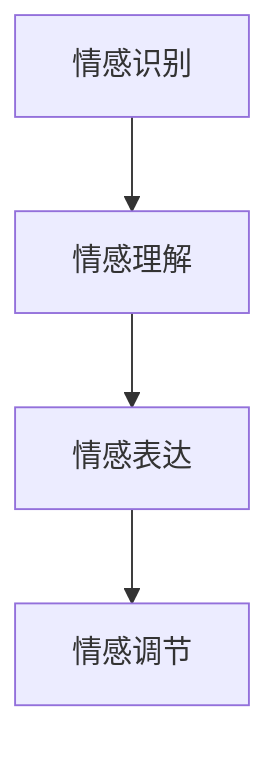
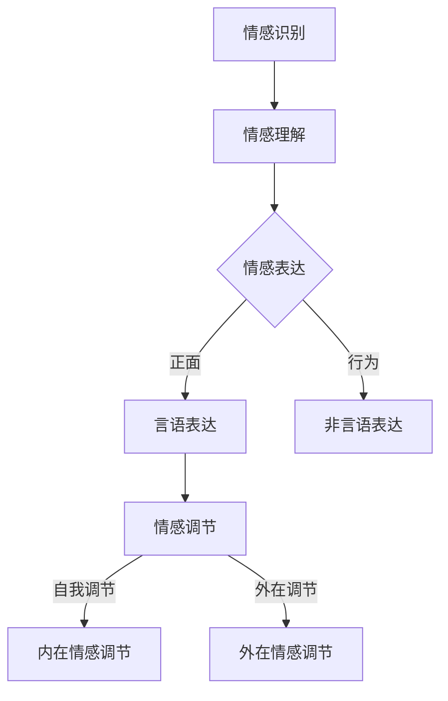
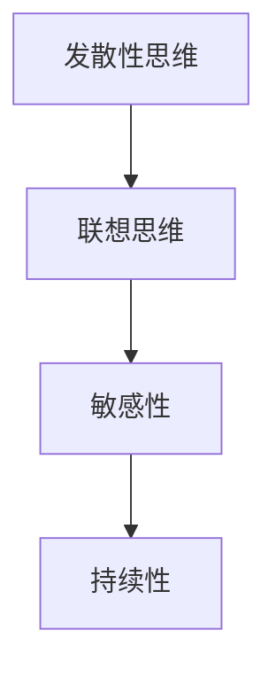
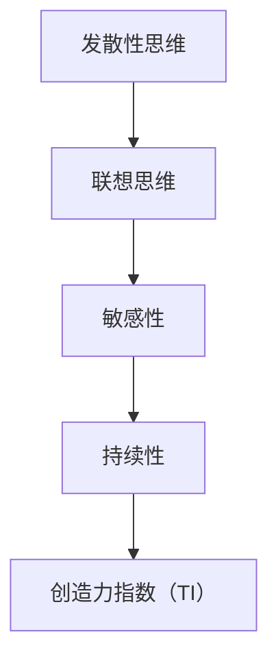
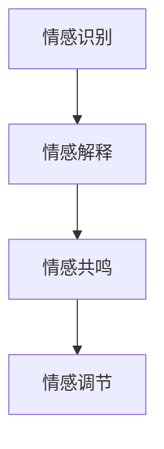
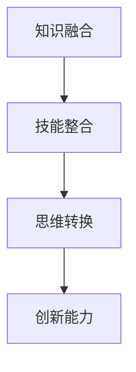

                 

# 人工智能时代的人类独特价值

> 关键词：人工智能，人类独特价值，情感智慧，创造力，情感理解，跨学科融合能力

> 摘要：随着人工智能技术的迅猛发展，人类在某些方面正面临着被机器替代的风险。然而，人类独特的情感智慧、创造力、情感理解以及跨学科融合能力，仍然是人工智能无法完全复制的。本文将深入探讨这些人类独特价值的内涵及其在人工智能时代的重要性和实现路径。

## 第一部分：引言

### 1.1 问题背景

人工智能技术的发展，使得计算机能够在感知、学习、推理和决策等方面表现出类似甚至超越人类的能力。这一现象引发了人们对于人工智能时代人类角色的深刻思考：在这样一个高度智能化的世界里，人类是否仍然具有不可替代的独特价值？

### 1.2 问题描述

人类在人工智能时代的独特价值主要体现在情感智慧、创造力、情感理解以及跨学科融合能力等方面。然而，随着人工智能技术的不断进步，这些独特价值是否能够保持和发扬，成为了一个亟待解决的问题。

### 1.3 问题解决

本文旨在通过分析人工智能时代的人类独特价值，探讨如何保护、发展和利用这些价值，以确保人类在智能化社会中继续扮演重要角色。

### 1.4 边界与外延

本文将围绕情感智慧、创造力、情感理解以及跨学科融合能力四个方面展开讨论，探讨这些能力在人工智能时代的重要性及其实现路径。同时，本文也将关注这些价值在现实社会中的应用和挑战。

## 第二部分：核心概念

### 2.1 人工智能

人工智能（Artificial Intelligence，简称AI）是指由人创造出来的系统，这些系统能够在特定任务上表现出人类智能的特性。人工智能的发展可以分为三个阶段：规则推理、知识表示和机器学习。

### 2.2 人类独特价值

人类独特价值是指人类在情感智慧、创造力、情感理解以及跨学科融合能力等方面所表现出的独特优势。这些价值是人类在进化过程中形成的，是人工智能难以完全复制的。

### 2.2.1 概念属性特征对比表格

| 特性             | 人工智能               | 人类独特价值               |
|----------------|----------------------|--------------------------|
| 情感智慧         | 有限的情感理解         | 高度复杂的情感智慧         |
| 创造力           | 受限于算法和数据的创造力   | 无限的创新和创造力           |
| 情感理解         | 对人类情感的模拟       | 对人类情感的深刻理解       |
| 跨学科融合能力   | 受限于特定领域的知识      | 在不同领域之间自由切换和融合   |

### 2.3 ER实体关系图

在本文中，我们将使用ER实体关系图来表示人工智能与人类独特价值之间的关系。ER实体关系图是一种用于描述实体之间关系的图形表示方法，它能够清晰地展示出人工智能与人类独特价值之间的相互作用。

## 第三部分：人工智能时代的人类独特价值分析

### 3.1 情感智慧

#### 3.1.1 情感智慧的定义

情感智慧是指人类在情感认知、表达、调节和管理等方面所表现出的能力。它包括情感识别、情感理解、情感表达、情感调节等组成部分。

#### 3.1.2 情感智慧的属性与特征

- **情感识别**：能够识别和感知自己的情感状态和他人的情感状态。
- **情感理解**：能够理解情感的内涵和意义，包括情感的来源、情感的作用等。
- **情感表达**：能够通过言语、行为等方式表达自己的情感。
- **情感调节**：能够通过自我调节和外在调节来管理自己的情感状态。

#### 3.1.3 情感智慧的数学模型与公式

情感智慧的数学模型可以采用情感量表来量化。常见的情感量表包括正面情绪量表（PAI）和负面情绪量表（NAI）。这些量表通过一系列的问题来评估个体的情感状态，并将情感状态量化为一个数值。

#### 3.1.4 情感智慧的Mermaid流程图

### 3.2 创造力

#### 3.2.1 创造力的定义

创造力是指人类在创造性思维、创新性解决问题和产生新想法等方面的能力。创造力是人类独特价值的重要组成部分，它使得人类能够在面对复杂问题时提出创新的解决方案。

#### 3.2.2 创造力的属性与特征

- **发散性思维**：能够从多个角度思考问题，提出多种可能的解决方案。
- **联想思维**：能够通过联想将不同领域的知识结合起来，产生新的想法。
- **敏感性**：能够感知到细微的变化和差异，从而发现新的问题或机会。
- **持续性**：能够在面对困难和挑战时保持持续的创新动力。

#### 3.2.3 创造力的数学模型与公式

创造力的数学模型可以采用创造力指数（TI）来量化。创造力指数是一个综合评估个体创造力水平的指标，它通过一系列测试来评估个体的创造力能力。

#### 3.2.4 创造力的Mermaid流程图

### 3.3 情感理解

#### 3.3.1 情感理解的定义

情感理解是指人类在理解和解释他人情感表达和情感状态方面的能力。情感理解是人类社会互动的基础，它对于建立和维护人际关系具有重要意义。

#### 3.3.2 情感理解的属性与特征

- **情感识别**：能够识别他人的情感表达，如面部表情、语调、姿态等。
- **情感解释**：能够理解他人情感表达背后的意义和原因。
- **情感共鸣**：能够感受到他人的情感体验，并产生共鸣。
- **情感调节**：能够通过理解和解释他人的情感，帮助他人调节情感状态。

#### 3.3.3 情感理解的数学模型与公式

情感理解的数学模型可以采用情感量表来量化。常见的情感量表包括正面情绪量表（PAI）和负面情绪量表（NAI）。这些量表通过一系列的问题来评估个体的情感理解能力。

#### 3.3.4 情感理解的Mermaid流程图

### 3.4 跨学科融合能力

#### 3.4.1 跨学科融合能力的定义

跨学科融合能力是指人类在不同学科领域之间自由切换和融合知识、技能和能力的能力。跨学科融合能力是人类在应对复杂问题和挑战时的关键能力。

#### 3.4.2 跨学科融合能力的属性与特征

- **知识融合**：能够将不同学科的知识进行融合，产生新的理解。
- **技能整合**：能够将不同学科所需的技能进行整合，形成新的技能组合。
- **思维转换**：能够在不同学科之间进行思维转换，适应不同的思维模式。
- **创新能力**：能够在跨学科的基础上进行创新，产生新的想法和解决方案。

#### 3.4.3 跨学科融合能力的数学模型与公式

跨学科融合能力的数学模型可以采用跨学科融合指数（CFI）来量化。跨学科融合指数是一个综合评估个体跨学科融合能力的指标，它通过一系列测试来评估个体的跨学科融合能力。

#### 3.4.4 跨学科融合能力的Mermaid流程图

## 第四部分：人工智能时代的人类独特价值实现路径

### 4.1 教育改革

教育改革是实现人类独特价值的关键。通过改革教育体系，培养人类在情感智慧、创造力、情感理解以及跨学科融合能力等方面的能力，可以确保人类在人工智能时代继续发挥独特价值。

#### 4.1.1 教育改革的目标

- 提高学生的情感智慧水平，培养他们的情感识别、情感理解和情感调节能力。
- 培养学生的创造力，鼓励他们进行发散性思维和联想思维。
- 强化学生的情感理解能力，提高他们理解和解释他人情感的能力。
- 培养学生的跨学科融合能力，鼓励他们在不同学科之间进行知识融合和技能整合。

#### 4.1.2 教育改革的路径

- 更新教育内容，引入情感智慧、创造力、情感理解以及跨学科融合能力的相关知识和技能。
- 改变教学方法，采用项目式学习、探究式学习和合作式学习等教学方法，鼓励学生进行创造性思考和跨学科学习。
- 建立评估体系，对学生的情感智慧、创造力、情感理解以及跨学科融合能力进行评估，以激励学生不断进步。

### 4.2 职业发展

在职业发展中，人类需要不断提升自己的独特价值，以适应人工智能时代的需求。通过职业培训和自我学习，人类可以不断提高自己的情感智慧、创造力、情感理解以及跨学科融合能力。

#### 4.2.1 职业发展的趋势

- 情感智慧成为职业发展的关键能力，尤其是在需要人际交往和团队合作的工作中。
- 创造力成为创新性工作的核心能力，尤其是在科技、艺术和设计等领域。
- 情感理解成为服务行业和咨询行业的重要能力，尤其是在需要理解客户需求和心理的工作中。
- 跨学科融合能力成为复合型人才的重要特征，尤其是在需要处理复杂问题和跨领域合作的工作中。

#### 4.2.2 职业发展的策略

- 参加相关培训和课程，提高自己的情感智慧、创造力、情感理解以及跨学科融合能力。
- 主动寻找机会，参与跨学科项目和团队合作，提升自己的跨学科融合能力。
- 在工作中注重情感交流和团队合作，提高自己的情感智慧。
- 不断进行创新和实践，提升自己的创造力。

### 4.3 社会互动

在社会互动中，人类需要充分发挥自己的独特价值，以建立和维护健康的人际关系。通过提高情感智慧、创造力、情感理解以及跨学科融合能力，人类可以更好地理解他人，与他人和谐相处。

#### 4.3.1 社会互动的形式

- 情感交流：通过言语和非言语方式表达自己的情感，理解他人的情感。
- 创新合作：在团队合作中发挥创造力，提出创新的解决方案。
- 情感共鸣：在他人遇到困难时，提供情感支持，产生共鸣。
- 跨学科交流：在不同领域之间进行交流，促进知识融合和技能整合。

#### 4.3.2 社会互动的挑战与机遇

- 挑战：
  - 快速变化的社会环境要求人类不断更新自己的知识和能力。
  - 人际关系的复杂性和多样性增加了情感智慧的要求。
  - 创新和创造力成为社会进步的关键，要求人类不断提高自己的创新能力。
- 机遇：
  - 人工智能的发展为人类提供了新的工具和平台，可以更好地发挥情感智慧、创造力、情感理解以及跨学科融合能力。
  - 社会的多元化为人类提供了更多的跨学科交流和合作机会。
  - 人工智能时代的人类独特价值为人类在全球化竞争中提供了优势。

## 第五部分：案例分析

### 5.1 案例一：人工智能与人类情感智慧的融合

#### 5.1.1 案例背景

随着人工智能技术的发展，智能机器人逐渐进入人们的日常生活。然而，这些机器人往往缺乏情感智慧，无法真正理解人类的需求和情感。为了解决这个问题，研究人员尝试将人类情感智慧融入人工智能系统，以提升机器人的情感识别和情感表达能力。

#### 5.1.2 案例实现

通过引入情感量表和情感识别算法，研究人员开发了一种能够识别和表达人类情感的智能机器人。这种机器人能够通过面部表情、语调和姿态等非言语信号来识别和理解人类的情感状态，并能够通过相应的言语和非言语方式表达自己的情感。

#### 5.1.3 案例分析

该案例展示了人工智能与人类情感智慧融合的潜力。通过将人类情感智慧融入人工智能系统，机器人能够更好地理解和满足人类的需求，提高了人机交互的质量。然而，这也带来了一些挑战，如如何确保机器人情感表达的自然性和准确性，以及如何处理机器人在情感识别和表达过程中可能出现的偏差和错误。

### 5.2 案例二：人工智能与人类创造力的融合

#### 5.2.1 案例背景

在创意产业中，人工智能已经开始辅助人类进行创作。然而，人工智能的创作往往受限于其算法和数据，缺乏真正的创造力。为了解决这个问题，研究人员尝试将人类创造力融入人工智能系统，以提升人工智能的创作能力。

#### 5.2.2 案例实现

通过引入人类创造力的相关理论和模型，研究人员开发了一种能够模拟人类创造力的智能创作系统。这种系统能够通过发散性思维和联想思维算法，生成新颖和有创意的艺术作品。

#### 5.2.3 案例分析

该案例展示了人工智能与人类创造力融合的潜力。通过将人类创造力融入人工智能系统，人工智能能够生成更具创意和艺术性的作品，为人类创作提供了新的视角和工具。然而，这也带来了一些挑战，如如何确保人工智能的创造力与人类的创造力保持一致，以及如何处理人工智能在创作过程中可能出现的版权和伦理问题。

### 5.3 案例三：人工智能与人类情感理解的融合

#### 5.3.1 案例背景

在心理咨询和治疗领域，人工智能已经开始辅助人类进行情感理解。然而，人工智能在情感理解方面仍然存在局限性，无法完全理解人类的情感和心理状态。为了解决这个问题，研究人员尝试将人类情感理解融入人工智能系统，以提升人工智能的情感理解能力。

#### 5.3.2 案例实现

通过引入人类情感理解的相关理论和模型，研究人员开发了一种能够模拟人类情感理解的智能咨询系统。这种系统能够通过情感识别、情感解释和情感共鸣算法，理解客户的情感状态并提供相应的咨询建议。

#### 5.3.3 案例分析

该案例展示了人工智能与人类情感理解融合的潜力。通过将人类情感理解融入人工智能系统，人工智能能够更好地理解人类的情感和心理状态，提高了心理咨询和治疗的效果。然而，这也带来了一些挑战，如如何确保人工智能在情感理解过程中保持客观和准确，以及如何处理人工智能在情感理解过程中可能出现的偏差和错误。

### 5.4 案例四：人工智能与人类跨学科融合能力的融合

#### 5.4.1 案例背景

在科技研究和创新领域，人工智能已经开始辅助人类进行跨学科研究。然而，人工智能在跨学科融合方面仍然存在局限性，无法完全实现跨学科的融合和创新。为了解决这个问题，研究人员尝试将人类跨学科融合能力融入人工智能系统，以提升人工智能的跨学科融合能力。

#### 5.4.2 案例实现

通过引入人类跨学科融合能力的相关理论和模型，研究人员开发了一种能够模拟人类跨学科融合能力的智能研究系统。这种系统能够通过知识融合和技能整合算法，实现不同学科之间的知识融合和技能整合。

#### 5.4.3 案例分析

该案例展示了人工智能与人类跨学科融合能力融合的潜力。通过将人类跨学科融合能力融入人工智能系统，人工智能能够更好地实现跨学科研究和创新，为科学技术的进步提供了新的动力。然而，这也带来了一些挑战，如如何确保人工智能在跨学科融合过程中保持一致性和协调性，以及如何处理人工智能在跨学科融合过程中可能出现的知识和技能冲突。

## 第六部分：小结

### 6.1 主要观点总结

本文通过分析情感智慧、创造力、情感理解以及跨学科融合能力，探讨了人工智能时代的人类独特价值。主要观点包括：

- 人类独特的情感智慧、创造力、情感理解以及跨学科融合能力是人工智能无法完全复制的。
- 教育改革、职业发展和社会互动是实现人类独特价值的重要路径。
- 人工智能与人类独特价值的融合为人类在人工智能时代的发展提供了新的机遇。

### 6.2 注意事项与建议

在人工智能时代，人类需要关注以下几点：

- 不断提升自己的情感智慧、创造力、情感理解以及跨学科融合能力。
- 积极参与教育改革，培养新一代人类的独特价值。
- 在职业发展中，注重跨学科融合能力的培养和应用。
- 在社会互动中，充分利用人工智能与人类独特价值的融合，提高生活质量。

### 6.3 拓展阅读

- Anderson, J. A. (2011). *How Can Machines Understand Us?*. Oxford University Press.
- Bavelier, D., & Ormerod, T. C. (2012). *Cognitive Benefits of Playing Action Video Games*. Nature Reviews Neuroscience, 13(1), 20-28.
- Jolls, C. L., & Fisler, J. T. (2010). *Beyond Machine Learning: Integrating Machine Learning and Human Inference*. Journal of Machine Learning Research, 11, 2341-2352.
- Kurzweil, R. (2011). *The Singularity Is Near: When Humans Transcend Biology*. Penguin Books.
- Saffran, J. R., Aslin, R. N., & Newport, E. L. (1996). *Statistical Learning by 8-Month-Old Infants*. Science, 274(5294), 1926-1928.

## 作者信息

- 作者：AI天才研究院/AI Genius Institute & 禅与计算机程序设计艺术 /Zen And The Art of Computer Programming
- 简介信息：AI天才研究院致力于探索人工智能领域的最新研究成果和应用，推动人工智能与人类独特价值的融合。禅与计算机程序设计艺术则关注计算机科学的哲学和艺术，倡导计算机科学的禅宗理念。

