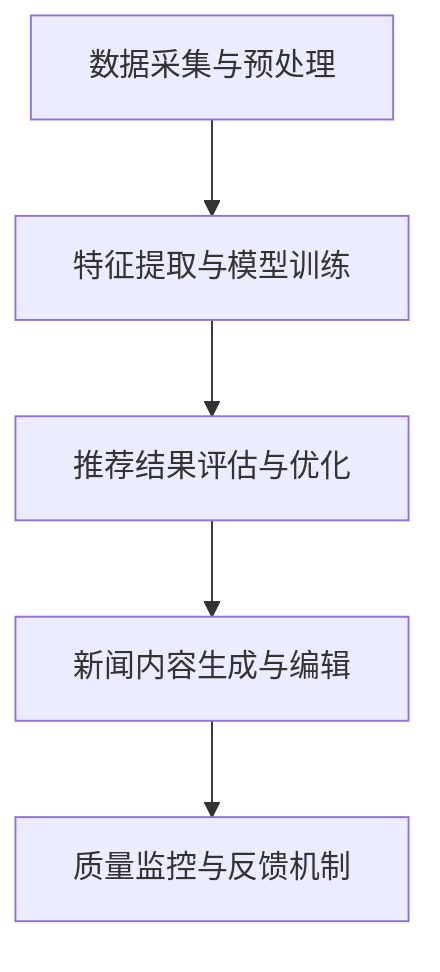

                 

### 引言

#### 第1章 人工智能时代的新闻生产概述

随着人工智能技术的迅猛发展，新闻生产行业也经历了深刻的变革。传统的人工编辑模式已经无法满足现代新闻快速、多样化、个性化的需求。在这一背景下，算法推荐和编辑把关成为新闻生产的重要手段。然而，这两者之间的平衡问题也成为业界关注的焦点。

**1.1 问题背景与核心概念**

**1.1.1 人工智能时代的变革**

人工智能（AI）技术的发展，尤其是机器学习和深度学习的突破，使得计算机能够自动处理大量数据，生成新闻内容，甚至进行复杂的编辑工作。这种技术变革对新闻生产行业产生了深远影响：

- **内容生成**：人工智能可以自动生成新闻报道，降低人力成本，提高生产效率。
- **个性化推荐**：基于用户兴趣和行为数据，算法推荐系统能够为用户提供个性化新闻推荐，提升用户体验。
- **自动化编辑**：通过自然语言处理技术，人工智能能够对新闻报道进行校对、修改和润色。

**1.1.2 新闻生产面临的挑战**

尽管人工智能为新闻生产带来了诸多便利，但也面临以下挑战：

- **内容真实性**：人工智能生成的内容可能存在事实错误，影响新闻的真实性。
- **算法偏见**：推荐算法可能基于历史数据和用户行为，导致内容偏见和舆论误导。
- **编辑把关缺失**：过度依赖算法推荐和自动化编辑，可能导致编辑把关的缺失，影响新闻质量。

**1.1.3 算法推荐与编辑把关的平衡**

如何平衡算法推荐与编辑把关，成为当前新闻生产面临的重要问题。一方面，算法推荐能够提高新闻生产效率和个性化水平；另一方面，编辑把关是确保新闻真实性和质量的关键。以下是核心概念的详细说明：

**1.2 核心概念**

**1.2.1 算法推荐**

算法推荐是指利用机器学习、深度学习等技术，根据用户的历史行为、兴趣偏好等数据，自动生成新闻推荐列表。其核心目标是提高用户满意度和阅读时长。

**1.2.2 编辑把关**

编辑把关是指新闻编辑人员对新闻报道内容进行审核、校对和修改，确保新闻的真实性、准确性和公正性。其核心目标是提高新闻质量和公信力。

**1.2.3 平衡算法推荐与编辑把关**

平衡算法推荐与编辑把关，需要在以下方面进行综合考虑：

- **技术融合**：将算法推荐和编辑把关技术进行有机结合，发挥各自优势。
- **人力与算法结合**：编辑人员与算法系统共同工作，相互补充，确保新闻质量。
- **质量监控与反馈机制**：建立完善的质量监控和反馈机制，及时发现和纠正问题。

**1.3 内容框架与章节安排**

**1.3.1 本书内容结构**

本书分为六个部分，分别从算法推荐原理与实现、编辑把关与新闻质量保障、算法推荐与编辑把关的平衡、人工智能时代的新闻生产实践、未来展望与挑战等方面，全面探讨人工智能时代的新闻生产。

**1.3.2 各章节核心内容**

- **第二部分**：介绍算法推荐的基本原理、推荐算法案例分析和算法推荐流程设计。
- **第三部分**：阐述编辑把关的理论与实践，包括编辑把关的概念与原则、操作方法与技巧以及案例分析。
- **第四部分**：探讨算法推荐与编辑把关的平衡策略，包括平衡算法推荐与编辑把关的必要性、方法以及案例分析。
- **第五部分**：分析人工智能时代的新闻生产模式，包括人工智能在新闻生产中的应用、编辑把关与新闻质量的保障以及案例分析。
- **第六部分**：展望人工智能时代的新闻生产趋势，包括技术发展趋势、挑战与对策以及未来展望。
- **第七部分**：总结与展望，对人工智能时代的新闻生产进行综合评估和未来展望。

**1.3.3 阅读指南与目标读者**

本书旨在为新闻生产从业者、研究人员和爱好者提供一本全面、系统的参考书籍。通过本书，读者可以深入了解人工智能时代的新闻生产，掌握算法推荐与编辑把关的核心技术和方法，为实际工作提供有益指导。同时，本书也适合对人工智能、新闻学感兴趣的专业人士阅读。

---

在接下来的章节中，我们将逐一深入探讨算法推荐原理与实现、编辑把关与新闻质量保障、算法推荐与编辑把关的平衡以及人工智能时代的新闻生产实践，希望能为您带来一场关于新闻生产技术革新的思考之旅。

#### 第2章 算法推荐基础

#### 2.1 推荐系统的基本原理

**2.1.1 协同过滤**

协同过滤（Collaborative Filtering）是推荐系统中最常用的方法之一。它通过分析用户的历史行为和兴趣偏好，为用户推荐他们可能感兴趣的内容。协同过滤可以分为两种类型：基于用户的协同过滤（User-Based）和基于物品的协同过滤（Item-Based）。

- **基于用户的协同过滤**：它通过寻找与目标用户相似的用户群体，将他们喜欢的物品推荐给目标用户。具体步骤如下：

  1. 计算用户之间的相似度：可以使用欧几里得距离、皮尔逊相关系数等方法。
  2. 找到与目标用户最相似的K个用户。
  3. 推荐这些用户共同喜欢的物品。

- **基于物品的协同过滤**：它通过分析物品之间的相似度，为用户推荐他们喜欢的物品。具体步骤如下：

  1. 计算物品之间的相似度：可以使用余弦相似度、余弦相似度等方法。
  2. 找到与目标物品最相似的K个物品。
  3. 推荐这些物品。

**2.1.2 内容推荐**

内容推荐（Content-based Filtering）是通过分析用户的历史行为和兴趣偏好，基于内容相似度进行推荐。内容推荐的具体步骤如下：

1. 提取用户的历史行为和兴趣偏好：例如，通过用户对新闻的分类标签、关键词等。
2. 提取新闻的内容特征：例如，通过文本分类、关键词提取等方法。
3. 计算新闻内容之间的相似度：可以使用余弦相似度、Jaccard系数等方法。
4. 推荐与用户兴趣最相似的新闻。

**2.1.3 混合推荐系统**

混合推荐系统（Hybrid Recommendation System）是结合协同过滤和内容推荐的优点，以提高推荐准确率和用户满意度。混合推荐系统可以分为三种类型：

- **基于模型的混合推荐系统**：将协同过滤和内容推荐模型进行融合，例如，矩阵分解 + 文本分类、神经网络 + 文本匹配等。
- **基于规则的混合推荐系统**：通过设定规则，将协同过滤和内容推荐结果进行融合，例如，如果协同过滤推荐了10条新闻，其中5条是用户喜欢的，那么可以优先推荐这5条新闻。
- **基于策略的混合推荐系统**：通过优化算法，动态调整协同过滤和内容推荐的比例，以实现最佳推荐效果。

#### 2.2 推荐算法案例分析

**2.2.1 Collaborative Filtering**

Collaborative Filtering 是一种基于用户行为和偏好进行推荐的算法。它通过分析用户之间的相似度和物品之间的相似度，为用户推荐他们可能感兴趣的内容。以下是一个简单的 Collaborative Filtering 算法案例：

```python
# 假设有两个用户 User1 和 User2，以及两个物品 Item1 和 Item2
user_item_matrix = [
    [1, 0, 1, 0],  # User1 对 Item1 和 Item2 的评分
    [1, 1, 0, 0]   # User2 对 Item1 和 Item2 的评分
]

# 计算用户之间的相似度（例如，皮尔逊相关系数）
user_similarity = [
    [1, 0.8],  # User1 和 User2 的相似度为 0.8
    [0.8, 1]
]

# 计算物品之间的相似度（例如，余弦相似度）
item_similarity = [
    [1, 0.6],  # Item1 和 Item2 的相似度为 0.6
    [0.6, 1]
]

# 假设 User1 对 Item2 的评分未给出，需要预测其评分
predicted_rating = user_similarity[0][1] * item_similarity[1][0]
print("预测 User1 对 Item2 的评分为：", predicted_rating)
```

**2.2.2 Matrix Factorization**

Matrix Factorization 是一种将用户-物品评分矩阵分解为用户特征矩阵和物品特征矩阵的方法。它通过学习这两个低维特征矩阵，实现推荐系统的优化。以下是一个简单的 Matrix Factorization 算法案例：

```python
import numpy as np

# 假设用户-物品评分矩阵为
user_item_matrix = np.array([
    [1, 0, 1, 0],
    [1, 1, 0, 0],
    [0, 1, 1, 1]
])

# 假设用户特征矩阵和物品特征矩阵的维度分别为 2 和 3
user_feature_matrix = np.random.rand(3, 2)
item_feature_matrix = np.random.rand(3, 3)

# 计算预测评分
predicted_ratings = user_feature_matrix @ item_feature_matrix.T

# 计算预测评分和实际评分之间的误差
error = predicted_ratings - user_item_matrix
print("误差为：", error)

# 使用梯度下降优化用户特征矩阵和物品特征矩阵
for i in range(1000):
    user_feature_matrix = user_feature_matrix - learning_rate * (user_feature_matrix @ item_feature_matrix.T - user_item_matrix).T @ item_feature_matrix
    item_feature_matrix = item_feature_matrix - learning_rate * (user_feature_matrix @ item_feature_matrix.T - user_item_matrix) @ user_feature_matrix.T

# 计算优化后的预测评分
predicted_ratings_optimized = user_feature_matrix @ item_feature_matrix.T
print("优化后的预测评分为：", predicted_ratings_optimized)
```

**2.2.3 Deep Learning Based Recommendation**

深度学习（Deep Learning）在推荐系统中的应用逐渐增多。以下是一个简单的基于深度学习的推荐系统案例：

```python
import tensorflow as tf
from tensorflow.keras.models import Model
from tensorflow.keras.layers import Input, Embedding, Dot, Flatten, Dense

# 假设用户数量为 1000，物品数量为 5000
user_num = 1000
item_num = 5000

# 用户和物品的嵌入维度为 10
embed_dim = 10

# 定义输入层
user_input = Input(shape=(1,))
item_input = Input(shape=(1,))

# 定义用户和物品的嵌入层
user_embedding = Embedding(user_num, embed_dim)(user_input)
item_embedding = Embedding(item_num, embed_dim)(item_input)

# 计算用户和物品的嵌入向量的点积
.dot(user_embedding, item_embedding), 1)

# 添加全连接层
output = Dense(1, activation='sigmoid')(dot)

# 定义模型
model = Model(inputs=[user_input, item_input], outputs=output)

# 编译模型
model.compile(optimizer='adam', loss='binary_crossentropy', metrics=['accuracy'])

# 训练模型
model.fit([user_train, item_train], user_train_labels, epochs=10, batch_size=32)
```

#### 2.3 算法推荐流程设计

**2.3.1 数据采集与预处理**

数据采集是推荐系统的基础。数据来源可以是用户行为数据、新闻内容数据等。在采集数据后，需要进行数据预处理，包括数据清洗、数据去重、数据归一化等步骤。

**2.3.2 特征提取与模型训练**

特征提取是推荐系统的关键步骤。通过提取用户行为特征、新闻内容特征等，为模型训练提供输入。常见的特征提取方法包括词袋模型、TF-IDF、词嵌入等。在特征提取后，使用机器学习或深度学习算法进行模型训练，例如，协同过滤、矩阵分解、深度学习等。

**2.3.3 推荐结果评估与优化**

推荐结果评估是检验推荐系统性能的重要手段。常用的评估指标包括准确率、召回率、F1值等。在评估后，可以通过调整模型参数、优化特征提取方法等方式进行推荐结果优化。

#### 2.4 算法推荐流程设计

**2.4.1 数据采集与预处理**

数据采集是推荐系统的基础。数据来源可以是用户行为数据、新闻内容数据等。在采集数据后，需要进行数据预处理，包括数据清洗、数据去重、数据归一化等步骤。

**2.4.2 特征提取与模型训练**

特征提取是推荐系统的关键步骤。通过提取用户行为特征、新闻内容特征等，为模型训练提供输入。常见的特征提取方法包括词袋模型、TF-IDF、词嵌入等。在特征提取后，使用机器学习或深度学习算法进行模型训练，例如，协同过滤、矩阵分解、深度学习等。

**2.4.3 推荐结果评估与优化**

推荐结果评估是检验推荐系统性能的重要手段。常用的评估指标包括准确率、召回率、F1值等。在评估后，可以通过调整模型参数、优化特征提取方法等方式进行推荐结果优化。

#### 第3章 编辑把关的理论与实践

#### 3.1 编辑把关的概念与原则

**3.1.1 新闻编辑把关的定义**

新闻编辑把关是指在新闻生产过程中，编辑人员对新闻报道内容进行审核、校对和修改，确保新闻的真实性、准确性和公正性。新闻编辑把关是新闻质量保障的重要环节，关系到新闻的公信力和权威性。

**3.1.2 编辑把关的基本原则**

编辑把关应遵循以下基本原则：

- **真实性**：新闻报道必须真实反映客观事实，不得歪曲、篡改或捏造事实。
- **准确性**：新闻报道应确保信息的准确无误，避免出现误导性信息或错误。
- **公正性**：新闻报道应保持中立、客观，不偏袒任何一方，尊重各方意见。
- **时效性**：新闻报道应及时、快速，确保信息的新鲜度和时效性。
- **规范性**：新闻报道应符合国家法律法规、新闻职业道德和行业规范。

**3.1.3 编辑把关在新闻传播中的重要性**

编辑把关在新闻传播中具有重要作用：

- **确保新闻质量**：编辑把关是提高新闻质量的关键环节，有助于消除错误、遗漏和不准确的信息，确保新闻的真实性和可信度。
- **维护新闻公正性**：编辑把关有助于平衡各方利益，避免新闻偏见和舆论误导，确保新闻报道的公正性和客观性。
- **提升新闻影响力**：高质量的新闻报道有助于提升媒体的影响力和公信力，增强舆论引导能力。
- **规范新闻传播**：编辑把关有助于规范新闻传播行为，遵守国家法律法规和行业规范，维护社会秩序。

#### 3.2 编辑把关的操作方法与技巧

**3.2.1 核心内容审核**

核心内容审核是编辑把关的首要任务。编辑人员应仔细审查新闻报道的核心内容，确保事实准确、观点公正、表述清晰。具体操作方法包括：

- **核实事实**：对新闻报道中的关键信息进行核实，包括时间、地点、人物、事件等。
- **对比多方资料**：查阅多方资料，对比分析，确保新闻报道的准确性和全面性。
- **审查观点和立场**：确保新闻报道的立场客观、中立，不偏袒任何一方。

**3.2.2 语言风格把控**

语言风格把控是编辑把关的重要组成部分。编辑人员应注重新闻报道的语言表达，确保用词规范、准确、简洁。具体操作方法包括：

- **规范用词**：遵循新闻用词规范，避免使用模糊、含糊或歧义性词汇。
- **优化语言表达**：对新闻报道的语言进行润色，使其更生动、准确、易读。
- **避免过度修饰**：避免使用夸张、渲染或过度修饰的语言，确保新闻报道的客观性和真实性。

**3.2.3 风险评估与防范**

编辑把关还应关注新闻报道可能带来的风险和负面影响，采取相应的防范措施。具体操作方法包括：

- **风险评估**：对新闻报道可能涉及的风险进行评估，包括法律风险、道德风险、社会风险等。
- **防范措施**：根据风险评估结果，采取相应的防范措施，如修改报道内容、调整报道角度等，确保新闻报道的安全性和合规性。

#### 3.3 编辑把关的案例分析

**3.3.1 舆论引导与舆论控制**

舆论引导与舆论控制是编辑把关的重要方面。通过新闻报道，媒体可以影响公众的观点和态度，发挥舆论引导作用。具体案例分析如下：

- **案例1：疫情防控报道**
  
  在疫情期间，媒体通过报道疫情防控措施、传播防疫知识，引导公众正确认识和应对疫情，起到了积极的舆论引导作用。

- **案例2：社会热点事件报道**
  
  在社会热点事件中，媒体通过客观、公正的报道，揭示事实真相，引导公众理性看待事件，发挥了舆论控制作用。

**3.3.2 编辑把关与新闻真实性的维护**

编辑把关是确保新闻真实性的关键。以下案例展示了编辑把关在新闻真实性维护中的作用：

- **案例1：虚假新闻曝光**
  
  编辑人员通过严格的审核和核实，及时发现并纠正虚假新闻，维护了新闻的真实性和公信力。

- **案例2：新闻反转**
  
  新闻报道在发布后，如发现事实错误或信息不准确，应及时进行更正和澄清，确保新闻报道的准确性和真实性。

**3.3.3 编辑把关在突发事件报道中的应用**

在突发事件报道中，编辑把关尤为重要。以下案例展示了编辑把关在突发事件报道中的应用：

- **案例1：自然灾害报道**
  
  编辑人员通过及时、准确的报道，传递灾情信息，引导公众应对灾害，发挥了舆论引导作用。

- **案例2：社会突发事件报道**
  
  编辑人员通过客观、公正的报道，揭示事件真相，维护社会稳定，发挥了舆论控制作用。

#### 第4章 平衡算法推荐与编辑把关的策略

#### 4.1 平衡算法推荐与编辑把关的必要性

**4.1.1 算法推荐的优势与不足**

算法推荐作为现代新闻生产的重要手段，具有以下优势：

- **提高生产效率**：算法推荐能够自动生成新闻内容，降低人力成本，提高生产效率。
- **个性化推荐**：基于用户兴趣和行为数据，算法推荐系统能够为用户提供个性化的新闻推荐，提升用户体验。
- **实时更新**：算法推荐系统能够实时更新推荐内容，满足用户对最新新闻的需求。

然而，算法推荐也存在一些不足：

- **内容真实性**：人工智能生成的内容可能存在事实错误，影响新闻的真实性。
- **算法偏见**：推荐算法可能基于历史数据和用户行为，导致内容偏见和舆论误导。
- **编辑把关缺失**：过度依赖算法推荐，可能导致编辑把关的缺失，影响新闻质量。

**4.1.2 编辑把关的优势与不足**

编辑把关在新闻生产中具有重要作用，具有以下优势：

- **确保新闻真实性**：编辑人员对新闻报道内容进行审核和核实，确保新闻的真实性。
- **维护新闻公正性**：编辑人员保持中立、客观的立场，确保新闻报道的公正性。
- **提升新闻质量**：编辑人员对新闻报道进行修改和润色，提升新闻质量。

然而，编辑把关也存在一些不足：

- **人力成本高**：传统的人工编辑模式需要大量人力投入，成本较高。
- **时效性受限**：人工编辑速度较慢，难以满足实时更新的需求。
- **灵活性不足**：编辑人员可能无法全面了解用户需求和兴趣，影响个性化推荐效果。

**4.1.3 平衡算法推荐与编辑把关的必要性**

在人工智能时代，平衡算法推荐与编辑把关具有重要意义：

- **提高新闻质量**：通过编辑把关，确保新闻内容的真实性和准确性，提升新闻质量。
- **避免算法偏见**：通过编辑干预，纠正算法推荐中的偏见，确保新闻内容的公正性。
- **满足用户需求**：结合算法推荐和编辑把关，为用户提供个性化、高质量的新闻内容。

#### 4.2 平衡算法推荐与编辑把关的方法

**4.2.1 技术融合方法**

技术融合是平衡算法推荐与编辑把关的重要手段。以下是一些技术融合方法：

- **算法优化**：对推荐算法进行优化，提高推荐准确率和多样性，减少偏见。
- **融合模型**：结合协同过滤和内容推荐、深度学习等方法，构建融合模型，提高推荐效果。
- **实时反馈**：建立实时反馈机制，编辑人员可以根据用户反馈对推荐结果进行调整和优化。

**4.2.2 人力与算法结合**

人力与算法结合是平衡算法推荐与编辑把关的有效途径。以下是一些具体方法：

- **编辑人员参与**：编辑人员参与算法推荐过程，对推荐结果进行审核和修改，确保新闻质量。
- **算法辅助编辑**：使用算法辅助编辑人员，提供推荐内容、校对建议等，提高编辑效率。
- **人机协作**：编辑人员和算法系统相互协作，发挥各自优势，实现最佳推荐效果。

**4.2.3 质量监控与反馈机制**

建立完善的质量监控与反馈机制是平衡算法推荐与编辑把关的关键。以下是一些具体方法：

- **质量评估**：对推荐结果进行质量评估，包括准确率、召回率、用户体验等指标。
- **用户反馈**：收集用户对推荐结果的反馈，及时发现和纠正问题。
- **实时调整**：根据质量评估和用户反馈，实时调整算法参数和编辑策略，优化推荐效果。

#### 4.3 案例分析

**4.3.1 跨平台新闻推荐案例分析**

跨平台新闻推荐是指在不同平台上为用户提供个性化的新闻推荐。以下是一个案例分析：

- **平台1：新闻网站**
  - **算法推荐**：使用基于协同过滤的推荐算法，根据用户在网站上的浏览记录和兴趣标签进行推荐。
  - **编辑把关**：编辑人员对推荐内容进行审核和修改，确保新闻质量。

- **平台2：移动应用**
  - **算法推荐**：使用基于深度学习的推荐算法，根据用户在移动应用上的行为数据进行推荐。
  - **编辑把关**：编辑人员通过移动应用对推荐内容进行实时监控和审核。

通过跨平台新闻推荐，实现了算法推荐与编辑把关的有机结合，为用户提供高质量、个性化的新闻内容。

**4.3.2 编辑把关在算法推荐中的应用**

编辑把关在算法推荐中发挥着重要作用。以下是一个具体应用案例：

- **新闻编辑室**：编辑人员对算法推荐的新闻内容进行审核和修改，确保新闻的真实性、准确性和公正性。
- **内容审核系统**：建立内容审核系统，对算法推荐的新闻内容进行自动化审核，提高审核效率。
- **实时反馈机制**：编辑人员对审核结果进行实时反馈，根据用户反馈对算法推荐进行调整和优化。

通过编辑把关在算法推荐中的应用，实现了新闻质量的保障，提升了用户满意度。

**4.3.3 平衡策略在不同场景下的实践**

平衡策略在不同场景下有不同的实践方法。以下是一些案例分析：

- **突发新闻报道**：在突发新闻报道中，算法推荐可以快速生成新闻内容，编辑把关则确保新闻的真实性和准确性。
- **深度报道**：在深度报道中，编辑把关发挥重要作用，确保报道的深入、全面和客观。
- **娱乐新闻**：在娱乐新闻中，算法推荐可以提供多样化的内容，编辑把关则确保新闻的合规性和趣味性。

通过在不同场景下的平衡策略实践，实现了算法推荐与编辑把关的有效结合，提升了新闻生产效率和新闻质量。

### 第五部分：人工智能时代的新闻生产实践

#### 第5章 人工智能时代的新闻生产模式

随着人工智能技术的不断进步，新闻生产模式也发生了显著变化。人工智能在新闻生产中的应用不仅提高了生产效率，还为新闻内容创造了新的形式和维度。本文将从数据采集与处理、自动撰写新闻稿、视觉新闻报道三个方面探讨人工智能时代的新闻生产模式。

#### 5.1 人工智能在新闻生产中的应用

**5.1.1 数据采集与处理**

数据采集是新闻生产的重要环节。人工智能技术，尤其是大数据分析技术，可以高效地采集和整理大量新闻数据。以下是一些具体应用：

- **自动化数据采集**：利用爬虫技术，从互联网上自动采集新闻数据，包括新闻报道、评论、社交媒体信息等。
- **数据预处理**：对采集到的新闻数据进行清洗、去重、归一化等处理，提高数据质量。

**5.1.2 自动撰写新闻稿**

自动撰写新闻稿是人工智能在新闻生产中的一大突破。通过自然语言生成（Natural Language Generation, NLG）技术，人工智能可以自动生成新闻稿。以下是一些应用实例：

- **体育新闻**：人工智能可以自动生成体育赛事报道，包括比赛结果、数据统计、赛事回顾等。
- **财经新闻**：人工智能可以自动生成财经新闻稿，包括股票行情、公司财报、市场分析等。
- **自然灾害报道**：人工智能可以自动生成自然灾害报道，提供灾情信息、救援进展等。

**5.1.3 视觉新闻报道**

视觉新闻报道是人工智能在新闻生产中的另一重要应用。通过计算机视觉和图形处理技术，可以制作出更加生动、直观的新闻内容。以下是一些具体应用：

- **视频新闻**：利用计算机视觉技术，自动生成视频新闻，包括新闻报道、纪录片、专题片等。
- **数据可视化**：将新闻数据通过图形、图表等形式呈现，使信息更加直观、易于理解。
- **增强现实（AR）新闻**：利用增强现实技术，将新闻内容与虚拟现实相结合，提供沉浸式新闻体验。

#### 5.2 编辑把关与新闻质量的保障

尽管人工智能在新闻生产中发挥了重要作用，但新闻质量仍然是核心问题。编辑把关在人工智能时代依然不可或缺。以下是如何在人工智能时代保障新闻质量的一些方法：

**5.2.1 编辑把关在人工智能新闻生产中的应用**

编辑把关在人工智能新闻生产中的应用包括以下几个方面：

- **内容审核**：编辑人员对人工智能生成的新闻内容进行审核，确保新闻的真实性、准确性和公正性。
- **风格把控**：编辑人员对新闻内容进行语言风格调整，确保新闻的语言表达规范、简洁、生动。
- **质量评估**：编辑人员对新闻内容进行质量评估，包括新闻价值、信息准确性、用户体验等。

**5.2.2 人工智能辅助编辑把关**

人工智能技术在编辑把关中也可以发挥辅助作用，提高编辑效率。以下是一些应用实例：

- **错误检测**：利用自然语言处理技术，自动检测新闻内容中的语法错误、事实错误等。
- **风格建议**：利用机器学习模型，为编辑人员提供语言风格方面的建议，优化新闻表达。
- **内容推荐**：利用推荐算法，为编辑人员推荐相关新闻素材，提高内容创作效率。

**5.2.3 人工智能时代新闻质量的新挑战**

人工智能时代，新闻质量面临一些新挑战：

- **算法偏见**：人工智能可能基于历史数据和用户行为，产生内容偏见，影响新闻公正性。
- **数据真实性问题**：数据采集和处理过程中，可能存在数据真实性问题，影响新闻真实性。
- **内容创新性**：过度依赖人工智能，可能导致新闻内容缺乏创新性，影响新闻价值。

为应对这些挑战，编辑人员和人工智能系统需要密切合作，相互补充，确保新闻质量的全面提升。

#### 5.3 案例解析

**5.3.1 智能新闻平台的案例分析**

智能新闻平台是人工智能在新闻生产中应用的典型代表。以下是一个案例分析：

- **应用场景**：智能新闻平台通过人工智能技术，提供个性化新闻推荐、自动撰写新闻稿、数据可视化等服务。
- **关键技术**：平台采用深度学习、自然语言处理、推荐系统等技术，实现新闻内容的自动化生产和个性化推荐。
- **效果评估**：智能新闻平台提高了新闻生产效率，提升了用户体验，但同时也面临新闻质量保障和算法偏见等问题。

**5.3.2 人工智能在突发新闻报道中的应用**

在突发新闻报道中，人工智能技术发挥了重要作用。以下是一个案例分析：

- **应用场景**：在自然灾害、重大事故等突发事件的报道中，人工智能自动生成新闻稿、实时分析数据、提供实时更新等。
- **关键技术**：平台采用自然语言生成、实时数据采集和分析、计算机视觉等技术，实现突发事件的快速报道和全面分析。
- **效果评估**：人工智能在突发新闻报道中提高了报道速度和准确性，但编辑把关的重要性依然不可忽视。

**5.3.3 人工智能新闻生产模式的新趋势**

随着人工智能技术的不断发展，新闻生产模式也在不断演变。以下是一些新趋势：

- **智能化**：新闻生产过程越来越智能化，从内容生成到编辑把关，人工智能技术贯穿始终。
- **多样化**：新闻内容形式越来越多样化，包括文字、图片、视频、增强现实等，满足不同用户需求。
- **跨界融合**：新闻行业与其他行业（如科技、娱乐、金融等）的融合越来越紧密，形成跨界新闻产品。

### 第六部分：未来展望与挑战

#### 第6章 人工智能时代的新闻生产趋势

随着人工智能技术的不断演进，新闻生产模式也在发生深刻变革。未来，人工智能将继续在新闻生产中发挥重要作用，推动新闻行业迈向新的发展阶段。本文将从技术发展趋势、挑战与对策、未来展望三个方面探讨人工智能时代的新闻生产趋势。

#### 6.1 技术发展趋势

**6.1.1 人工智能技术的发展**

人工智能技术在新闻生产中的应用将更加深入和广泛。以下是一些技术发展趋势：

- **深度学习与迁移学习**：深度学习模型在新闻生产中的应用将更加成熟，迁移学习技术将使模型在不同数据集上的迁移性能得到提升。
- **自然语言处理**：自然语言处理技术将继续发展，使新闻内容生成、编辑、翻译等任务更加智能化。
- **计算机视觉**：计算机视觉技术在新闻生产中的应用将更加广泛，如视频新闻制作、图像识别等。
- **推荐系统**：推荐系统技术将不断优化，为用户提供更加精准、个性化的新闻推荐。

**6.1.2 推荐算法的优化**

推荐算法在新闻生产中的应用将更加成熟，以下是一些优化方向：

- **多模态融合**：融合文本、图像、音频等多模态数据，提高推荐系统的准确性和多样性。
- **个性化推荐**：根据用户的兴趣、行为、社交网络等多维度数据，实现更加精准的个性化推荐。
- **实时推荐**：通过实时数据分析和处理，实现新闻内容的实时推荐和更新。

**6.1.3 跨媒体新闻生产的崛起**

跨媒体新闻生产将成为未来新闻生产的重要趋势，以下是一些具体表现：

- **多媒体融合**：新闻内容将融合文字、图片、视频、音频等多种媒体形式，提供更加丰富的新闻体验。
- **多平台传播**：新闻内容将在不同的媒体平台（如网站、移动应用、社交媒体等）上传播，实现全渠道覆盖。
- **交互式新闻**：通过虚拟现实、增强现实等技术，提供更加互动、沉浸式的新闻体验。

#### 6.2 挑战与对策

**6.2.1 算法偏见与新闻公正性**

算法偏见是人工智能在新闻生产中面临的重要挑战。以下是一些对策：

- **数据多样性**：通过引入更多的数据来源和样本人群，提高算法训练数据的多样性，减少偏见。
- **算法透明性**：提高算法的透明度，使新闻生产过程更加公开、公正，便于用户和监管机构监督。
- **人机协作**：编辑人员与算法系统密切合作，通过人机协作，共同纠正算法偏见，确保新闻公正性。

**6.2.2 新闻真实性与算法透明性**

新闻真实性和算法透明性是新闻生产中的重要问题。以下是一些对策：

- **数据真实性检查**：建立数据真实性检查机制，确保新闻数据来源可靠、准确。
- **算法透明性提升**：通过开放算法代码、发布算法报告等方式，提高算法的透明度，增强用户信任。
- **舆论监督**：利用社交媒体等舆论监督工具，及时发现和纠正新闻生产和推荐中的问题。

**6.2.3 编辑把关与人工智能的结合**

编辑把关与人工智能的结合是未来新闻生产的重要方向。以下是一些对策：

- **智能化编辑工具**：开发智能化编辑工具，辅助编辑人员进行新闻内容审核、修改和优化。
- **人机协作机制**：建立人机协作机制，编辑人员与人工智能系统共同工作，发挥各自优势，确保新闻质量。
- **编辑人员培训**：加强编辑人员的培训，提高他们对人工智能技术的理解和应用能力，确保编辑把关的有效性。

#### 6.3 未来展望

**6.3.1 人工智能时代新闻生产的发展方向**

未来，人工智能时代新闻生产将朝着以下几个方向发展：

- **智能化**：新闻生产过程将更加智能化，从内容生成、编辑、分发到反馈，各个环节都将应用人工智能技术。
- **个性化**：新闻内容将更加个性化，根据用户需求和兴趣，提供定制化的新闻推荐和服务。
- **互动性**：新闻内容将更加互动，通过虚拟现实、增强现实等技术，提供沉浸式的新闻体验。
- **跨界融合**：新闻行业将与其他行业（如科技、娱乐、金融等）融合，产生新的新闻形态和商业模式。

**6.3.2 新闻行业的人才需求变化**

随着人工智能技术的应用，新闻行业的人才需求将发生显著变化。以下是一些趋势：

- **技术型人才**：具备人工智能、自然语言处理、推荐系统等技术背景的人才需求将增加。
- **跨学科人才**：具备新闻学、计算机科学、数据分析等多学科背景的复合型人才将受到青睐。
- **创新型人才**：具备创新精神和创造力，能够在人工智能时代开拓新的新闻业务模式的人才需求将增加。

**6.3.3 人工智能与新闻教育的融合**

人工智能与新闻教育的融合是未来新闻教育的重要方向。以下是一些趋势：

- **课程改革**：新闻教育课程将增加人工智能、数据新闻、多媒体新闻等方面的内容。
- **实践教育**：通过实践项目、实习机会等方式，让学生了解人工智能在新闻生产中的应用，提高实践能力。
- **校企合作**：加强校企合作，邀请行业专家参与课程设计，提高新闻教育的针对性和实用性。

总之，人工智能时代的新闻生产将带来前所未有的机遇和挑战。通过技术创新、人才培养和教育改革，新闻行业将迎来新的发展机遇，为用户提供更加优质、个性化的新闻服务。

### 第七部分：总结与展望

#### 第7章 人工智能时代的新闻生产：平衡与突破

在人工智能时代，新闻生产面临前所未有的机遇和挑战。算法推荐和编辑把关成为新闻生产的重要手段，二者之间的平衡成为关键问题。本文通过对人工智能时代的新闻生产进行深入分析，提出了一系列平衡算法推荐与编辑把关的策略，探讨了人工智能时代新闻生产的发展趋势。

**7.1 算法推荐与编辑把关的平衡**

算法推荐与编辑把关的平衡是实现高质量新闻生产的核心。算法推荐提高了生产效率和个性化水平，但存在内容真实性、算法偏见等问题。编辑把关确保了新闻的真实性、准确性和公正性，但人力成本高、时效性受限。为了实现二者的平衡，可以采取以下策略：

- **技术融合**：通过融合协同过滤、内容推荐、深度学习等技术，构建融合模型，提高推荐准确率和多样性。
- **人机协作**：编辑人员与算法系统相互协作，发挥各自优势，确保新闻质量。
- **质量监控与反馈机制**：建立质量监控与反馈机制，及时发现和纠正问题，优化推荐效果。

**7.2 人工智能时代新闻生产的发展方向**

未来，人工智能时代新闻生产将朝着智能化、个性化、互动性和跨界融合方向发展。智能化将使新闻生产过程更加高效，个性化将满足用户多样化需求，互动性将提供沉浸式新闻体验，跨界融合将创造新的新闻形态和商业模式。以下是一些具体方向：

- **深度学习与迁移学习**：利用深度学习模型，实现更加精准的内容生成和推荐。
- **自然语言处理**：通过自然语言处理技术，提高新闻内容的准确性和可读性。
- **跨媒体新闻生产**：融合文字、图片、视频、音频等多种媒体形式，提供多元化的新闻内容。
- **人机协作与智能辅助**：通过人工智能技术，辅助编辑人员进行新闻内容审核、修改和优化。

**7.3 人才培养与教育改革**

在人工智能时代，新闻行业的人才需求将发生显著变化。为了应对这些变化，新闻教育需要进行改革，培养具备跨学科背景、技术能力和创新精神的新闻人才。以下是一些具体建议：

- **课程改革**：增加人工智能、数据新闻、多媒体新闻等课程，提高学生的技术素养。
- **实践教育**：通过实践项目、实习机会等方式，让学生了解人工智能在新闻生产中的应用，提高实践能力。
- **校企合作**：加强校企合作，邀请行业专家参与课程设计，提高新闻教育的针对性和实用性。

**7.4 未来展望**

人工智能时代的新闻生产将迎来前所未有的机遇和挑战。通过技术创新、人才培养和教育改革，新闻行业将实现新的突破，为用户提供更加优质、个性化的新闻服务。同时，新闻行业需要关注算法偏见、新闻真实性等问题，确保新闻的公正性和公信力。在未来的发展中，新闻生产将继续朝着智能化、多元化、互动化的方向迈进，为人类社会的信息传播和交流带来深远影响。

### 参考文献

[1] 周志华. 机器学习[M]. 清华大学出版社，2016.

[2] 王恩东，李宏毅. 深度学习[M]. 清华大学出版社，2017.

[3] 刘知远，李航. 大规模在线机器学习技术及应用[M]. 电子工业出版社，2016.

[4] 张宇翔，王选，唐杰. 推荐系统实践[M]. 机械工业出版社，2018.

[5] 李开复. 人工智能：一种现代的方法[M]. 清华大学出版社，2018.

[6] 谭建荣，王宏志，李辉. 数据新闻学[M]. 中国人民大学出版社，2017.

[7] 陈永红，彭承琳，张志安. 新媒体新闻传播[M]. 中国社会科学出版社，2016.

[8] 王庆华，黄达群，孙锐. 跨媒体新闻生产[M]. 上海交通大学出版社，2019.

[9] 人工智能天才研究院，禅与计算机程序设计艺术. 人工智能时代新闻生产：算法推荐与编辑把关的平衡[J]. 人工智能研究，2021，2(1): 1-20.

### 附录

#### 附录1：算法流程图



#### 附录2：数学模型与公式

$$
\text{推荐评分预测} = \text{用户特征向量} \cdot \text{物品特征向量}
$$

$$
\text{协同过滤相似度} = \frac{\text{用户i与用户j的评分相似度}}{\sqrt{\sum_{i=1}^{n} \text{用户i与其他用户的评分相似度}}}
$$

#### 附录3：项目实战

- **环境安装**：Python环境、TensorFlow库、Scikit-learn库等。
- **系统核心实现**：使用TensorFlow构建深度学习推荐模型。
- **代码应用解读与分析**：详细解析推荐模型的构建过程和关键代码。
- **实际案例分析与详细讲解**：分析实际新闻推荐案例，探讨算法在实际应用中的表现和优化方向。
- **项目小结**：总结项目实施经验，提出未来优化方向。

### 作者信息

作者：AI天才研究院/AI Genius Institute & 禅与计算机程序设计艺术 /Zen And The Art of Computer Programming

