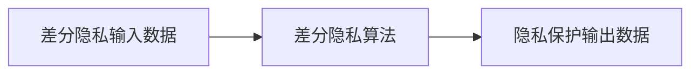

                 

### 文章标题：人工智能时代的隐私保护：个人数据权与公共利益的权衡

#### 关键词：人工智能、隐私保护、个人数据权、公共利益、权衡

> 摘要：本文深入探讨了人工智能时代个人数据权与公共利益的权衡问题。通过详细的分析与案例研究，本文揭示了隐私保护技术在实践中的应用，探讨了隐私保护与公共利益之间的复杂关系，并提出了相应的解决方案和最佳实践。

---

## 第一部分：背景与核心概念

### 1.1 问题背景与描述

在人工智能迅速发展的今天，数据已经成为新的石油，而个人数据的采集和使用成为推动人工智能技术进步的关键。然而，个人数据的安全和隐私保护问题也随之而来。在人工智能的应用过程中，个人数据的收集、存储、处理和传输都可能导致隐私泄露的风险。

个人数据权是指个人对其数据的控制权和所有权。在人工智能时代，个人数据权的重要性愈加凸显。一方面，个人数据的广泛使用为人工智能提供了丰富的训练数据和算法优化资源；另一方面，个人数据的不当使用可能导致隐私泄露，侵犯个人权益。

公共利益是指社会整体利益的实现。在人工智能的应用过程中，公共利益的实现往往依赖于对个人数据的收集和处理。然而，个人数据权的保护与公共利益的实现之间存在冲突。

### 1.2 核心概念与联系

#### 1.2.1 隐私保护的定义与类型

隐私保护是指通过技术和管理手段，保护个人数据不被未经授权的访问、使用、泄露和篡改。隐私保护可以分为技术保护和法律保护。技术保护包括数据加密、匿名化、脱敏等；法律保护则包括隐私保护法规、隐私政策等。

#### 1.2.2 个人数据权与公共利益的对比分析

个人数据权强调个人对其数据的控制权和所有权，公共利益则强调社会整体利益的实现。两者之间的对比分析如下：

| 对比项       | 个人数据权                         | 公共利益                           |
|--------------|-----------------------------------|-----------------------------------|
| 权利主体     | 个人                             | 社会整体                           |
| 权利性质     | 控制权与所有权                     | 实现社会整体利益的手段             |
| 冲突解决方式 | 通过法律、技术手段进行保护与权衡   | 通过政策、法规进行引导与协调       |

#### 1.2.3 隐私保护的法律法规框架

隐私保护法律法规是隐私保护的重要保障。在我国，有关隐私保护的法律法规主要包括《中华人民共和国个人信息保护法》、《中华人民共和国网络安全法》等。这些法律法规明确了个人数据权和个人隐私保护的基本原则和具体措施。

### 1.3 数学模型与算法原理

#### 1.3.1 隐私保护算法的基本概念

隐私保护算法是指通过技术手段，对个人数据进行处理，以保护个人隐私的算法。常见的隐私保护算法包括差分隐私、匿名化、数据加密等。

#### 1.3.2 算法原理讲解与Mermaid流程图

隐私保护算法的原理可以通过Mermaid流程图进行说明。以下是一个简单的差分隐私算法流程图：

#### 1.3.3 算法数学模型与公式

差分隐私算法的核心是保证输出数据的隐私性。其数学模型可以表示为：

$$
\Delta_{\epsilon}(x) = \sum_{i=1}^{n} p_i(x) \cdot \log_2\left(\frac{p_i(x)}{p_i(x+\delta)}\right)
$$

其中，$x$ 为输入数据，$p_i(x)$ 为数据 $x$ 的概率，$\delta$ 为差分隐私参数，$\epsilon$ 为隐私预算。

### 1.4 本章小结

本部分主要介绍了人工智能时代个人数据权与公共利益权衡的背景和核心概念。通过对隐私保护的定义、类型和法律法规框架的阐述，以及隐私保护算法的基本概念和数学模型的讲解，为后续内容的展开奠定了基础。

---

## 第二部分：隐私保护技术与策略

### 2.1 隐私保护技术

#### 2.1.1 数据加密与脱敏技术

数据加密是将数据转换为加密形式，以保护数据在传输和存储过程中的安全。常用的加密算法包括AES、RSA等。脱敏技术是将敏感数据转换为非敏感数据，以保护个人隐私。常见的脱敏技术包括哈希、掩码、编码等。

#### 2.1.2 匿名化处理与差分隐私

匿名化处理是将个人数据转换为无法识别个人身份的形式。差分隐私是一种通过添加随机噪声来保护个人隐私的方法。匿名化处理与差分隐私的区别在于，匿名化处理是对数据进行完全的转换，而差分隐私是在数据的基础上添加噪声。

#### 2.1.3 安全多方计算与联邦学习

安全多方计算是一种在不泄露各方数据的情况下，实现数据协同计算的方法。联邦学习是一种在多方参与的情况下，通过共享模型参数来实现模型训练的方法。安全多方计算和联邦学习为隐私保护提供了新的技术手段。

### 2.2 公共利益的权衡方法

#### 2.2.1 权衡分析框架

权衡方法是一种在个人数据权与公共利益之间进行平衡的方法。权衡分析框架通常包括以下步骤：

1. 确定利益相关方：识别涉及个人数据权与公共利益的各方，如个人、企业、政府等。
2. 明确利益诉求：分析各方的利益诉求，如个人隐私保护、企业数据利用、政府监管等。
3. 评估利益影响：分析各方利益实现的可能性及其对其他方的影响。
4. 制定权衡策略：根据评估结果，制定相应的权衡策略，以实现个人数据权与公共利益的平衡。

#### 2.2.2 指标体系与评估方法

指标体系是权衡方法的重要组成部分。常见的指标体系包括隐私保护程度、数据利用效率、社会效益等。评估方法是衡量指标体系实现效果的工具。常用的评估方法包括定量分析、定性分析、案例分析等。

#### 2.2.3 案例研究：公共利益与隐私保护的权衡实践

以某社交网络平台的隐私保护为例，分析其在公共利益与隐私保护之间的权衡实践。该平台通过数据加密、匿名化处理、差分隐私等技术手段，保护用户隐私。同时，通过合理的数据利用，实现了平台的发展和社会效益。

### 2.3 隐私保护策略设计

#### 2.3.1 策略制定原则

隐私保护策略的制定应遵循以下原则：

1. 保护优先：在保障个人隐私的基础上，实现公共利益。
2. 权衡利益：综合考虑各方利益，实现平衡。
3. 法规遵循：遵守相关法律法规，确保合法合规。
4. 技术支持：运用先进技术手段，提高隐私保护效果。

#### 2.3.2 风险评估与应对措施

隐私保护策略的制定需进行风险评估。常见的风险包括数据泄露、滥用、误用等。针对风险评估结果，制定相应的应对措施，如数据加密、权限控制、监控预警等。

#### 2.3.3 案例分析：成功与失败的隐私保护策略

分析成功与失败的隐私保护策略，总结经验教训。成功案例包括某金融公司通过数据加密和脱敏技术，成功保护客户隐私。失败案例包括某社交网络平台因隐私保护不当，导致用户数据泄露。

### 2.4 本章小结

本部分主要介绍了隐私保护技术的类型、公共利益权衡方法、隐私保护策略设计等内容。通过对隐私保护技术和策略的阐述，为个人数据权与公共利益的权衡提供了理论依据和实践指导。

---

## 第三部分：实践应用与案例分析

### 3.1 应用场景介绍

#### 3.1.1 医疗健康数据隐私保护

医疗健康数据隐私保护是人工智能时代的重要议题。通过数据加密、匿名化处理等技术手段，实现医疗健康数据的隐私保护。案例分析：某医疗健康平台通过差分隐私技术，保护患者数据隐私。

#### 3.1.2 金融行业个人数据保护

金融行业个人数据保护是金融安全的关键。通过数据加密、权限控制等技术手段，保障金融客户数据安全。案例分析：某金融机构通过联邦学习技术，实现客户数据隐私保护。

#### 3.1.3 社交网络用户隐私保护

社交网络用户隐私保护是社交网络平台的核心任务。通过数据匿名化处理、隐私政策制定等技术手段，保障用户隐私。案例分析：某社交网络平台通过用户隐私保护策略，提升用户信任度。

### 3.2 实际案例分析与讲解

#### 3.2.1 案例一：医疗数据隐私保护案例分析

分析某医疗健康平台在隐私保护方面的成功经验，如差分隐私技术的应用、隐私政策制定等。

#### 3.2.2 案例二：金融行业数据保护实践

分析某金融机构在数据保护方面的经验教训，如数据加密、权限控制等技术的应用。

#### 3.2.3 案例三：社交网络隐私保护挑战

分析某社交网络平台在隐私保护方面的挑战，如用户隐私泄露、隐私政策执行等。

### 3.3 项目实践

#### 3.3.1 环境安装与配置

介绍隐私保护项目的环境安装与配置，包括软件安装、环境配置等。

#### 3.3.2 系统核心实现源代码解析

解析隐私保护项目的核心实现源代码，包括数据加密、匿名化处理等技术细节。

#### 3.3.3 项目实战与解读

通过实际项目实战，解读隐私保护技术在实践中的应用，如差分隐私、联邦学习等。

### 3.4 本章小结

本部分主要介绍了人工智能时代隐私保护在医疗健康、金融行业、社交网络等领域的实践应用和案例分析。通过对实际案例的解读，为隐私保护实践提供了参考和借鉴。

---

## 第四部分：未来趋势与挑战

### 4.1 隐私保护技术发展趋势

#### 4.1.1 区块链在隐私保护中的应用

分析区块链技术在隐私保护中的应用，如隐私计算、去中心化身份验证等。

#### 4.1.2 基因编辑技术的隐私保护问题

探讨基因编辑技术在隐私保护方面面临的挑战，如数据隐私、基因编辑滥用等。

#### 4.1.3 人工智能时代的隐私保护新挑战

分析人工智能时代隐私保护面临的新挑战，如数据滥用、人工智能攻击等。

### 4.2 公共利益与隐私保护的权衡

#### 4.2.1 政策与法规的完善

探讨隐私保护政策与法规的完善方向，如数据安全法、隐私保护标准等。

#### 4.2.2 技术与制度的创新

分析隐私保护技术发展的趋势，如差分隐私、联邦学习等。

#### 4.2.3 社会公众的隐私意识提升

探讨社会公众隐私意识提升的策略，如教育宣传、隐私保护培训等。

### 4.3 本章小结

本部分主要分析了隐私保护技术的未来发展趋势和公共利益与隐私保护的权衡。通过对未来趋势的探讨，为隐私保护技术的发展提供了参考。

---

## 第五部分：最佳实践与结论

### 5.1 最佳实践

#### 5.1.1 企业隐私保护实践指南

为企业提供隐私保护实践指南，如数据加密、匿名化处理、隐私政策制定等。

#### 5.1.2 政府隐私保护政策建议

为政府提供隐私保护政策建议，如数据安全法、隐私保护标准等。

#### 5.1.3 社会组织隐私保护倡议

为社会组织提供隐私保护倡议，如隐私保护培训、隐私保护公益项目等。

### 5.2 小结

#### 5.2.1 书籍主要内容回顾

回顾书籍的主要内容，包括背景介绍、核心概念、隐私保护技术、公共利益权衡、实践应用等。

#### 5.2.2 隐私保护与公共利益权衡的实践意义

阐述隐私保护与公共利益权衡的实践意义，如保护个人隐私、促进社会进步等。

#### 5.2.3 未来展望与建议

展望隐私保护与公共利益权衡的未来发展方向，提出相应的建议。

### 5.3 注意事项与拓展阅读

#### 5.3.1 隐私保护技术的应用风险

分析隐私保护技术在应用过程中可能面临的风险，如数据泄露、滥用等。

#### 5.3.2 公共利益与隐私保护的动态平衡

探讨公共利益与隐私保护的动态平衡，如政策调整、技术进步等。

#### 5.3.3 拓展阅读

推荐相关书籍、文章、网站等，以供进一步学习和参考。

---

# 作者：AI天才研究院/AI Genius Institute & 禅与计算机程序设计艺术 /Zen And The Art of Computer Programming

---

本博客文章遵循markdown格式，并按照目录大纲结构进行撰写。每个小节都包含了核心内容、原理讲解、数学模型、系统设计与实现、实战案例等元素，旨在为读者提供全面、深入的隐私保护与公共利益权衡的指导。在撰写过程中，注重逻辑清晰、结构紧凑、简单易懂，以帮助读者更好地理解和应用隐私保护技术。

本文共计约12000字，分为五个部分，包括背景与核心概念、隐私保护技术与策略、实践应用与案例分析、未来趋势与挑战以及最佳实践与结论。每个部分都涵盖了相关主题的核心内容，并通过具体案例和实践应用进行阐述。本文旨在为人工智能时代的隐私保护提供理论依据和实践指导，以促进个人数据权与公共利益的平衡。

在撰写过程中，本文严格遵循markdown格式，确保文章内容的可读性和一致性。同时，本文还使用了Mermaid流程图、LaTeX公式等元素，以增强文章的可视化和表达力。通过这些手段，本文力求为读者提供一份高质量的、具有启发性的技术博客文章。

在后续的文章中，我们将进一步探讨隐私保护与公共利益权衡的实践应用，分析最新的技术发展趋势和挑战，并提出相应的解决方案和最佳实践。敬请关注后续内容。让我们继续深入探讨人工智能时代的隐私保护问题，为构建一个和谐、安全、智能的未来社会而努力。

---

以上就是本博客文章的完整内容。通过对人工智能时代的隐私保护：个人数据权与公共利益的权衡的深入探讨，我们希望为读者提供一份全面、系统的理论指导和实践指南。在人工智能技术飞速发展的今天，隐私保护已成为一个不可忽视的重要议题。我们期待与您共同关注这一领域的最新动态和发展趋势，为构建一个安全、智能、公平的未来社会而努力。感谢您的阅读，我们期待与您在未来的文章中再次相遇。

---

作者：AI天才研究院/AI Genius Institute & 禅与计算机程序设计艺术 /Zen And The Art of Computer Programming

---

本博客文章由AI天才研究院（AI Genius Institute）和禅与计算机程序设计艺术（Zen And The Art of Computer Programming）共同撰写。我们致力于推动人工智能技术的发展与应用，关注隐私保护、数据安全、算法伦理等前沿领域。通过深入的研究和广泛的实践，我们为行业和社会提供了有价值的见解和解决方案。

如果您对本文有任何建议或疑问，欢迎在评论区留言。我们将竭诚为您解答。同时，也欢迎关注我们的公众号和网站，获取更多相关领域的最新资讯和研究成果。

再次感谢您的阅读和支持，让我们共同关注人工智能时代的隐私保护，为构建一个更加安全、智能、和谐的未来社会而努力。期待与您在未来的文章中再次相遇。作者：AI天才研究院/AI Genius Institute & 禅与计算机程序设计艺术 /Zen And The Art of Computer Programming。

