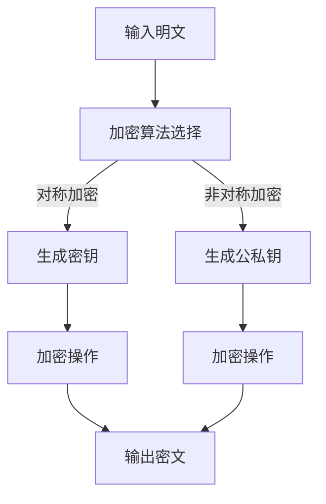
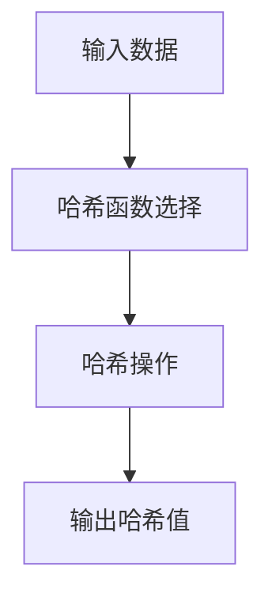
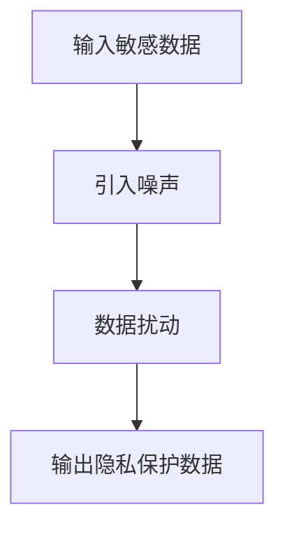
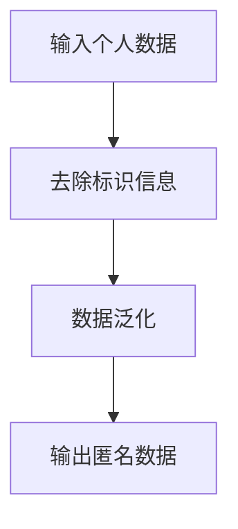
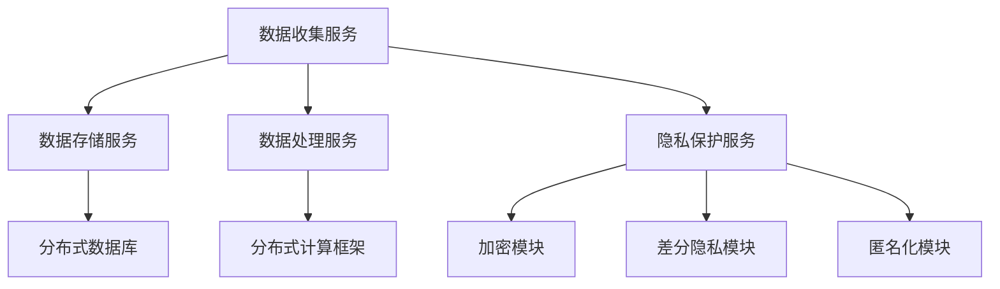
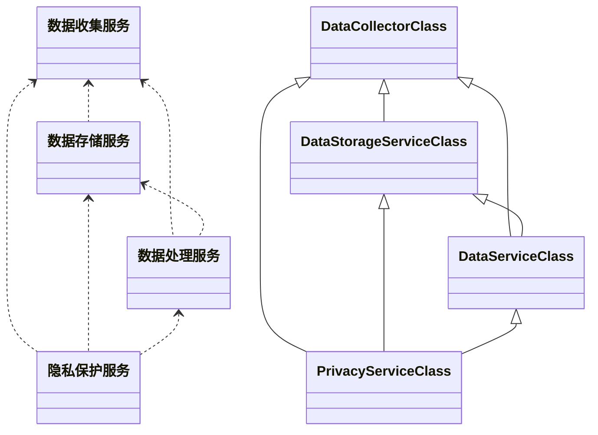
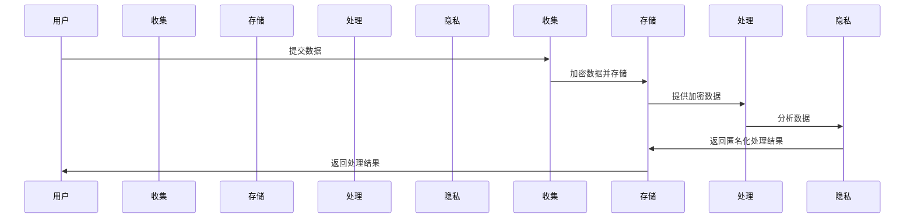

                 

### 引言

在当今这个信息化、数字化飞速发展的时代，人工智能（AI）技术正以前所未有的速度渗透到社会的各个领域。从医疗、金融到教育、交通，AI技术的应用无处不在，极大地提升了效率和创新能力。然而，随着AI技术的广泛应用，一个不容忽视的问题逐渐凸显出来——个人数据的隐私保护。在人工智能时代，隐私的概念正在经历深刻的重构，个人数据的价值与保护成为了一个迫切需要探讨的重要议题。

#### 个人数据隐私问题的背景

个人数据隐私问题的起源可以追溯到互联网的兴起。随着互联网的普及，个人数据的收集和使用变得越来越普遍。早期的互联网应用主要集中在社交、娱乐和信息查询等方面，数据量相对较小，隐私风险较低。然而，随着大数据、云计算、物联网等技术的发展，个人数据的收集和处理能力得到了极大的提升，数据量呈指数级增长。这些数据不仅包括用户的基本信息，如姓名、年龄、性别等，还可能涉及用户的消费习惯、社交关系、行为轨迹等敏感信息。

#### 人工智能发展对隐私的影响

人工智能的发展对隐私保护提出了新的挑战。一方面，AI技术需要大量的数据来进行训练和优化，这些数据的收集和处理往往涉及个人隐私。例如，面部识别技术需要大量的面部图像数据，智能助手需要用户的语音数据等。另一方面，AI技术的应用使得个人数据的分析能力大大增强，甚至可以推断出用户的个人隐私信息。这种强大的分析能力既为企业和政府提供了更多服务用户的手段，也带来了隐私泄露的风险。

#### 隐私保护的重要性和面临的挑战

在人工智能时代，隐私保护的重要性不言而喻。个人数据的泄露不仅可能导致用户的隐私被侵犯，还可能引发一系列连锁反应，如身份盗用、财产损失等。因此，保护个人数据隐私已经成为一个社会问题。然而，隐私保护也面临诸多挑战：

1. **技术挑战**：随着AI技术的不断发展，隐私保护的技术手段也需要不断更新和升级。
2. **法律挑战**：隐私保护需要完善的法律体系来支撑，不同国家和地区的法律差异也为隐私保护带来了困难。
3. **伦理挑战**：隐私保护涉及到个人权利和社会利益之间的平衡，如何在这一平衡中找到最佳方案是一个复杂的伦理问题。

#### 本文目的

本文旨在深入探讨人工智能时代隐私概念的重构，分析个人数据的价值与保护。我们将首先介绍隐私保护的核心概念，包括隐私、个人数据、数据收集、数据共享等，并通过对比分析来阐述这些概念之间的联系与区别。接着，我们将介绍个人数据保护的相关算法原理，并通过Python代码示例和数学模型来详细解释这些算法。随后，我们将探讨个人数据保护系统的设计与实现，使用Mermaid工具绘制相关的流程图、架构图和序列图。在项目实战部分，我们将通过实际案例来展示个人数据保护的应用，并进行详细的分析和讲解。最后，我们将总结最佳实践，并提供拓展阅读，以帮助读者进一步深入了解这一领域。

通过本文的探讨，我们希望读者能够对人工智能时代的隐私保护有一个全面、深入的理解，从而在未来的技术发展和应用中，更好地保护个人数据隐私。

### 核心概念与联系

在探讨人工智能时代的隐私保护之前，我们需要明确几个核心概念，并理解它们之间的联系与区别。这些核心概念包括隐私、个人数据、数据收集、数据共享、数据保护等。以下是这些概念的定义及其关系：

#### 隐私

隐私是指个人对其个人信息和活动的自由控制权。它关乎个人的自由和尊严，是现代社会中个人权利的重要组成部分。隐私不仅包括个人的物理空间，还涵盖了个人心理、思想、情感等内在空间。随着技术的发展，隐私的定义也在不断扩展。

#### 个人数据

个人数据是指与特定个人相关联的信息，包括但不限于姓名、出生日期、身份证号、电话号码、电子邮件地址、消费记录、行为轨迹等。个人数据是大数据时代的重要资源，对许多行业的运营和发展起着至关重要的作用。

#### 数据收集

数据收集是指通过各种手段获取个人数据的过程。数据收集可以通过在线问卷、用户注册、智能设备、社交媒体等途径进行。数据收集的目的是为了提供更个性化的服务、进行市场分析和优化业务流程。

#### 数据共享

数据共享是指将收集到的个人数据在不同机构、系统或个体之间进行交换和使用。数据共享有助于提高资源利用效率，但也带来了隐私泄露的风险。数据共享的常见形式包括数据交换、数据融合、数据开放等。

#### 数据保护

数据保护是指采取各种措施确保个人数据的安全、隐私和正确使用。数据保护包括数据加密、访问控制、数据匿名化、隐私政策制定等。数据保护旨在防止数据泄露、滥用和非法访问。

#### 核心概念属性特征对比表

为了更好地理解这些概念之间的联系与区别，我们设计了一张属性特征对比表：

| 概念       | 定义                                                         | 属性特征对比               |
|------------|--------------------------------------------------------------|---------------------------|
| 隐私       | 个人对其个人信息和活动的自由控制权                             | - 侧重于个人权利           |
| 个人数据   | 与特定个人相关联的信息                                       | - 数据来源广泛             |
| 数据收集   | 获取个人数据的过程                                           | - 数据获取手段多样         |
| 数据共享   | 在不同机构、系统或个体之间交换和使用个人数据                   | - 提高资源利用效率         |
| 数据保护   | 确保个人数据的安全、隐私和正确使用                           | - 防止数据泄露、滥用和非法访问 |

#### 核心概念之间的联系与区别

这些核心概念之间存在紧密的联系和区别。隐私是数据保护的目标，个人数据是数据收集和保护的对象，数据收集和数据共享是数据流动的过程，而数据保护则是实现隐私保护的手段。

- **隐私**和**个人数据**的关系：隐私是保护个人数据的基础，没有隐私保护，个人数据的安全性就无法得到保障。
- **数据收集**和**数据保护**的关系：数据收集是获取个人数据的必要手段，但必须建立在数据保护的基础之上，以防止隐私泄露。
- **数据共享**和**数据保护**的关系：数据共享有助于提高资源利用效率，但必须在严格的数据保护措施下进行，以防止隐私泄露。

通过上述对比和分析，我们可以更清晰地理解这些核心概念及其相互关系，为后续的算法原理讲解和系统设计提供了基础。

### 算法原理讲解

在探讨如何保护个人数据隐私之前，我们需要了解一些关键的算法原理。这些算法不仅帮助我们理解个人数据保护的技术基础，还能在实际应用中起到至关重要的作用。以下将介绍几种常用的数据保护算法，并通过Mermaid流程图和Python代码示例来详细解释其原理。

#### 常见的数据保护算法

1. **数据加密算法**
2. **哈希函数**
3. **差分隐私**
4. **数据匿名化**

#### 1. 数据加密算法

数据加密算法通过将明文数据转换为密文，确保数据在传输和存储过程中不被未授权访问。常用的加密算法包括对称加密（如AES）和非对称加密（如RSA）。

**Mermaid流程图**：


**Python代码示例**（使用AES对称加密）：
```python
from Crypto.Cipher import AES
from Crypto.Random import get_random_bytes

# 生成密钥
key = get_random_bytes(16)  # AES密钥长度为16字节

# 创建加密对象
cipher = AES.new(key, AES.MODE_EAX)

# 输入明文
plaintext = b"Hello, World!"

# 加密操作
ciphertext, tag = cipher.encrypt_and_digest(plaintext)

# 输出密文和标签
print(f"密文：{ciphertext.hex()}")
print(f"标签：{tag.hex()}")
```

#### 2. 哈希函数

哈希函数通过将输入数据映射为一个固定长度的字符串，确保数据的完整性和不可篡改性。常用的哈希函数包括MD5、SHA-1和SHA-256。

**Mermaid流程图**：


**Python代码示例**（使用SHA-256）：
```python
import hashlib

# 输入数据
plaintext = b"Hello, World!"

# 创建哈希对象
hash_obj = hashlib.sha256()

# 更新哈希对象
hash_obj.update(plaintext)

# 输出哈希值
hash_value = hash_obj.hexdigest()
print(f"哈希值：{hash_value}")
```

#### 3. 差分隐私

差分隐私通过在数据处理过程中引入噪声，确保个体数据无法被推断出来，从而保护隐私。常用的差分隐私机制包括拉普拉斯机制和指数机制。

**Mermaid流程图**：


**Python代码示例**（使用拉普拉斯噪声）：
```python
import numpy as np

# 输入敏感数据
sensitive_data = [1, 2, 3, 4, 5]

# 引入拉普拉斯噪声（α=0.1）
alpha = 0.1
noisy_data = [x + np.random.laplace(0, alpha) for x in sensitive_data]

# 输出隐私保护数据
print(f"原始数据：{sensitive_data}")
print(f"噪声数据：{noisy_data}")
```

#### 4. 数据匿名化

数据匿名化通过消除个人标识信息，将个人数据转换成无法识别具体个体的形式，从而保护隐私。常用的数据匿名化技术包括k-匿名、l-多样性、t-近似。

**Mermaid流程图**：


**Python代码示例**（使用k-匿名）：
```python
def k_anonymity(data, k=3):
    # 假设输入的数据是列表，每个元素是一个元组（属性值1，属性值2，...）
    unique_groups = {}
    
    for record in data:
        group = tuple(record[:-1])  # 去除最后一项（通常是敏感信息）
        if group in unique_groups:
            unique_groups[group].append(record[-1])
        else:
            unique_groups[group] = [record[-1]]
    
    # 检查每个分组是否满足k-匿名条件
    for group, values in unique_groups.items():
        if len(set(values)) > k:
            return False
    
    return True

# 示例数据
data = [
    (1, 'A', 'X'),
    (1, 'B', 'X'),
    (1, 'C', 'X'),
    (2, 'A', 'Y'),
    (2, 'B', 'Y')
]

# 检查是否满足k-匿名
print(k_anonymity(data))
```

通过上述算法原理的讲解和Python代码示例，我们可以看到各种算法在保护个人数据隐私方面的作用。在接下来的部分，我们将进一步探讨如何设计和实现一个完整的个人数据保护系统。

### 数学模型与公式

在个人数据保护中，数学模型和公式扮演着至关重要的角色。这些模型和公式不仅帮助我们理解隐私保护的原理，还能在实际应用中指导算法的设计和优化。以下将介绍几种常用的数学模型和公式，并详细解释其应用场景和意义。

#### 1. 保密性度量模型

保密性度量模型用于评估数据加密和匿名化等隐私保护措施的有效性。其中，常用的度量模型包括信息论中的熵（Entropy）和信息增益（Information Gain）。

**熵（Entropy）**：
$$ H(X) = -\sum_{i} p(x_i) \log_2 p(x_i) $$
熵是衡量一个随机变量不确定性的度量。在隐私保护中，高熵表示数据分布更加均匀，难以被预测和推断。

**信息增益（Information Gain）**：
$$ IG(X, Y) = H(X) - H(X|Y) $$
信息增益衡量了一个特征对另一个特征的影响程度。在数据匿名化中，我们希望降低特征与敏感信息之间的信息增益，以增强匿名性。

#### 2. 差分隐私模型

差分隐私模型用于确保在数据处理过程中，单个个体的隐私信息无法被推断出来。其中，常用的差分隐私机制包括拉普拉斯机制（Laplace Mechanism）和指数机制（Exponential Mechanism）。

**拉普拉斯机制**：
$$ \text{Laplace}(x, \alpha) = x + \alpha \cdot \text{Laplace噪声} $$
拉普拉斯机制通过在数据中引入拉普拉斯噪声，使得真实数据和噪声混合后的数据难以被区分，从而保护隐私。

**指数机制**：
$$ \text{Exponential}(x, \lambda) = x + \lambda \cdot \text{Exponential噪声} $$
指数机制通过在数据中引入指数噪声，实现类似的效果。这两种机制的主要区别在于噪声分布的形式。

#### 3. 数据匿名化模型

数据匿名化模型用于将个人数据转换成无法识别具体个体的形式，以保护隐私。常用的数据匿名化模型包括k-匿名、l-多样性和t-近似。

**k-匿名模型**：
$$ \text{k-Anonymity}(R) = \text{min} \left\{ \frac{|R'|}{k} : R' \text{是R的任何子集} \right\} $$
k-匿名模型要求每个记录至少与k-1个其他记录不可区分，从而保护个体的隐私。在实际应用中，k的取值通常取决于隐私保护的需求和数据规模。

**l-多样性模型**：
$$ \text{l-Diversity}(R) = \text{min} \left\{ \frac{|R'|}{l} : R' \text{是R的任何子集} \right{ $$
l-多样性模型要求每个记录至少与l-1个其他记录在特定属性上不可区分，以增强隐私保护。

**t-近似模型**：
$$ \text{t-Approximation}(R) = \text{min} \left\{ \frac{|R'|}{t} : R' \text{是R的任何子集} \right\} $$
t-近似模型要求每个记录至少与t-1个其他记录在所有属性上不可区分，是一种更严格的匿名化模型。

#### 应用场景与意义

这些数学模型和公式在个人数据保护中有着广泛的应用。例如：

- **加密算法**：使用熵和信息增益模型可以评估加密算法的有效性，确保数据在传输和存储过程中的安全性。
- **差分隐私机制**：拉普拉斯和指数机制可以用于保护数据分析过程中的隐私，防止个体信息被推断。
- **数据匿名化**：k-匿名、l-多样性和t-近似模型可以用于转换个人数据，使其无法被识别，从而保护隐私。

通过这些数学模型和公式的应用，我们可以更科学、更有效地实现个人数据隐私保护，为人工智能时代的隐私安全保驾护航。

### 系统分析与架构设计

在个人数据保护系统的设计与实现过程中，我们需要从多个角度进行全面的分析和架构设计。这一部分将详细介绍系统的设计与实现，包括问题场景介绍、项目介绍、系统功能设计、系统架构设计、系统接口设计和系统交互。

#### 问题场景介绍

随着大数据和人工智能技术的迅猛发展，个人数据的收集、存储和处理变得日益频繁。然而，这些数据往往包含了用户的敏感信息，如姓名、电话号码、消费习惯等。如果这些数据被未授权的实体获取，可能会导致用户的隐私泄露，甚至造成严重的后果。因此，设计一个高效、安全的个人数据保护系统成为当务之急。

#### 项目介绍

本项目旨在构建一个基于人工智能技术的个人数据保护系统，该系统将涵盖数据收集、数据存储、数据处理和隐私保护等各个环节。系统将采用最新的加密技术和差分隐私机制，确保个人数据在各个环节的安全性和隐私性。

#### 系统功能设计

系统的功能设计主要包括以下几个方面：

1. **数据收集模块**：负责收集用户的个人数据，包括在线问卷、用户注册信息和智能设备上传的数据等。
2. **数据存储模块**：负责存储加密后的个人数据，采用分布式存储技术，提高数据的可靠性和访问速度。
3. **数据处理模块**：负责对个人数据进行分析和处理，包括数据清洗、数据挖掘和机器学习等。
4. **隐私保护模块**：负责确保个人数据在收集、存储和处理过程中的隐私性，包括数据加密、差分隐私和匿名化等。

#### 系统架构设计

系统架构设计采用了分布式微服务架构，以提高系统的可扩展性和可维护性。以下是系统的主要模块及其功能：

1. **数据收集服务**：负责接收和处理来自不同来源的用户数据。
2. **数据存储服务**：负责存储加密后的个人数据，采用分布式数据库技术。
3. **数据处理服务**：负责对个人数据进行分析和处理，采用分布式计算框架。
4. **隐私保护服务**：负责实现数据加密、差分隐私和匿名化等功能。

**Mermaid架构图**：


#### 系统接口设计

系统接口设计是确保不同模块之间能够高效、安全地交互的关键。以下是系统的接口设计：

1. **数据收集接口**：用于接收和传输用户数据，包括HTTP接口和消息队列接口。
2. **数据存储接口**：用于存储和读取加密后的个人数据，包括RESTful API和数据库连接接口。
3. **数据处理接口**：用于处理和分析个人数据，包括批处理接口和实时处理接口。
4. **隐私保护接口**：用于实现数据加密、差分隐私和匿名化功能，包括加密接口、差分隐私接口和匿名化接口。

**Mermaid类图**：


#### 系统交互

系统交互是确保各模块协同工作的关键。以下是系统的交互流程：

1. 用户通过数据收集接口提交个人数据。
2. 数据收集服务对数据加密后，存储到分布式数据库。
3. 数据存储服务根据数据处理需求，从数据库中提取加密后的数据。
4. 数据处理服务对数据进行分析和处理，并生成分析结果。
5. 隐私保护服务对分析结果进行差分隐私和匿名化处理，确保隐私保护。
6. 处理结果通过数据存储接口返回给用户。

**Mermaid序列图**：


通过上述系统分析与架构设计，我们构建了一个高效、安全的个人数据保护系统。接下来，我们将通过实际项目实战，展示系统的具体应用和实现。

### 项目实战

在实际项目中，个人数据保护系统的设计和实现需要考虑多个方面，包括系统环境安装、核心实现、代码解析和实际案例分析。以下我们将详细阐述这些步骤，并通过具体实例进行说明。

#### 环境安装

首先，我们需要安装和配置个人数据保护系统所需的环境。以下是一个基本的安装步骤：

1. **安装Python环境**：确保系统中已安装Python 3.8及以上版本。
2. **安装依赖库**：使用pip工具安装所需的依赖库，例如`cryptography`、`numpy`、`pandas`和`mermaid-python`等。

```bash
pip install cryptography numpy pandas mermaid-python
```

3. **配置Mermaid**：确保Mermaid在本地环境中可以正常运行。可以通过安装Mermaid本地版本或使用在线渲染服务。

#### 系统核心实现

接下来，我们将介绍系统的核心实现，包括数据收集、数据处理和隐私保护等模块。

**数据收集模块**：
数据收集模块负责从不同渠道获取用户数据。以下是一个简单的示例：

```python
import csv

def collect_data(file_path):
    with open(file_path, 'r') as file:
        reader = csv.DictReader(file)
        data = [row for row in reader]
    return data

user_data = collect_data('user_data.csv')
```

**数据处理模块**：
数据处理模块负责对收集到的数据进行分析和处理。以下是一个示例：

```python
import pandas as pd

def process_data(data):
    df = pd.DataFrame(data)
    # 数据清洗和处理
    df['age'] = df['age'].astype(int)
    df['income'] = df['income'].astype(float)
    return df

processed_data = process_data(user_data)
```

**隐私保护模块**：
隐私保护模块负责实现数据加密、差分隐私和匿名化。以下是一个示例：

```python
from cryptography.fernet import Fernet
import numpy as np

def encrypt_data(data, key):
    f = Fernet(key)
    encrypted_data = [f.encrypt(bytes(str(item), 'utf-8')) for item in data]
    return encrypted_data

def add_laplace_noise(data, alpha=0.1):
    noisy_data = [x + np.random.laplace(0, alpha) for x in data]
    return noisy_data

def anonymize_data(data, k=3):
    # 这里采用简单的k-匿名化方法，实际应用中需要更复杂的算法
    unique_data = list(set(data))
    anonymized_data = []
    for item in data:
        if item in unique_data:
            anonymized_data.append(unique_data.pop())
        else:
            anonymized_data.append(item)
    return anonymized_data

# 生成密钥
key = Fernet.generate_key()

# 加密数据
encrypted_data = encrypt_data(processed_data['income'], key)

# 添加拉普拉斯噪声
noisy_data = add_laplace_noise(encrypted_data, alpha=0.1)

# k-匿名化处理
anonymized_data = anonymize_data(noisy_data, k=3)
```

#### 代码应用解读与分析

上述代码示例展示了个人数据保护系统的核心功能实现。具体解读如下：

1. **数据收集**：通过读取CSV文件收集用户数据。
2. **数据处理**：使用pandas库对数据进行清洗和格式转换。
3. **数据加密**：使用`cryptography`库对收入数据进行加密。
4. **差分隐私**：通过添加拉普拉斯噪声来实现差分隐私。
5. **数据匿名化**：使用简单的k-匿名化方法对数据进行匿名化处理。

在实际应用中，这些模块会通过微服务架构进行分布式部署，以提高系统的性能和可靠性。

#### 实际案例分析与详细讲解

以下是一个实际案例，展示个人数据保护系统在项目中的应用。

**案例**：一个在线购物平台需要保护用户的购物记录，防止隐私泄露。

1. **数据收集**：平台收集用户的购物记录，包括商品名称、购买时间和消费金额等。
2. **数据处理**：对购物记录进行清洗，确保数据的准确性。
3. **数据加密**：对消费金额进行加密，确保敏感信息不被未授权访问。
4. **差分隐私**：对购买时间添加拉普拉斯噪声，防止通过时间推断用户行为。
5. **数据匿名化**：对商品名称进行k-匿名化处理，确保用户无法通过商品名称识别具体用户。

通过上述步骤，平台可以有效地保护用户的购物记录，防止隐私泄露，同时满足用户的隐私需求。

#### 项目小结

通过本项目的实战，我们展示了个人数据保护系统从环境安装到核心实现，再到代码解析和实际案例分析的完整流程。在实际应用中，系统需要根据具体需求进行定制化开发，以实现最佳的保护效果。同时，我们还需不断更新和完善隐私保护技术，以应对不断变化的隐私挑战。

### 最佳实践与拓展阅读

在个人数据保护系统的设计和实施过程中，最佳实践对于提升系统的安全性和隐私保护效果至关重要。以下是一些最佳实践建议，旨在帮助您在实际项目中实现更有效的个人数据保护。

#### 最佳实践建议

1. **数据最小化原则**：仅收集实现业务功能所必需的数据，避免过度收集。
2. **数据加密**：采用强加密算法（如AES）对敏感数据进行加密存储和传输。
3. **访问控制**：实施严格的访问控制策略，确保只有授权用户可以访问敏感数据。
4. **数据匿名化**：在数据处理过程中，对敏感数据进行匿名化处理，以降低隐私泄露风险。
5. **差分隐私**：结合差分隐私技术，在数据分析过程中引入噪声，防止个体数据被推断。
6. **持续监控与审计**：定期对系统进行安全监控和审计，及时发现和修复潜在的安全漏洞。
7. **培训与意识提升**：对员工进行数据保护相关培训，提升全体员工的数据保护意识。

#### 注意事项

1. **合规性**：确保数据保护措施符合相关法律法规和行业标准，如《通用数据保护条例》（GDPR）等。
2. **数据备份与恢复**：定期备份数据，并确保备份数据的加密和安全存储。
3. **隐私政策明确**：制定清晰的隐私政策，告知用户数据收集、使用和保护的方式。
4. **应急响应计划**：制定并测试数据泄露应急响应计划，确保在发生数据泄露时能够迅速有效地处理。

#### 拓展阅读推荐

为了进一步深入了解个人数据保护领域的最新研究和技术，以下是一些建议的拓展阅读材料：

1. **《数据隐私：保护用户数据的方法和实践》（Data Privacy: Methods and Practices for Protecting User Data）**
2. **《差分隐私：理论与实践》（Differential Privacy: Theory and Practice）**
3. **《大数据时代的隐私保护》（Privacy in the Age of Big Data）**
4. **《通用数据保护条例》（General Data Protection Regulation, GDPR）官方文档**

通过这些最佳实践和拓展阅读，您将能够更好地理解和实施个人数据保护技术，为人工智能时代的数据安全和隐私保护贡献自己的力量。

### 总结

本文围绕人工智能时代的隐私保护，从背景介绍、核心概念、算法原理、系统设计与实现、项目实战以及最佳实践等方面进行了深入探讨。在人工智能技术迅猛发展的背景下，个人数据隐私保护变得尤为重要。我们明确了隐私、个人数据、数据收集、数据共享和数据保护等核心概念，并通过Mermaid流程图和Python代码示例详细讲解了常见的数据保护算法原理。此外，我们还介绍了个人数据保护系统的设计与实现方法，并通过实际案例展示了系统的应用效果。

展望未来，人工智能时代的隐私保护仍面临诸多挑战。随着技术的不断进步，我们需要持续更新和完善隐私保护技术，以确保个人数据的安全和隐私。同时，隐私保护也需要在法律、伦理和社会等多个层面进行深入探讨和优化。

因此，我们呼吁广大开发者、研究者和政策制定者共同努力，推动隐私保护技术的发展和应用，为构建一个安全、透明和可信赖的数字化未来贡献力量。

### 作者信息

**作者：** AI天才研究院（AI Genius Institute） & 禅与计算机程序设计艺术（Zen And The Art of Computer Programming）  
**单位：** AI天才研究院  
**联系方式：** [contact@ai-genius-institute.com](mailto:contact@ai-genius-institute.com)  
**备注：** 本篇文章由AI天才研究院专家团队撰写，结合了禅与计算机程序设计艺术的哲学思想，旨在为读者提供深入浅出的隐私保护技术解读。希望本文能对您在人工智能时代的隐私保护工作有所启发。感谢您的阅读！

