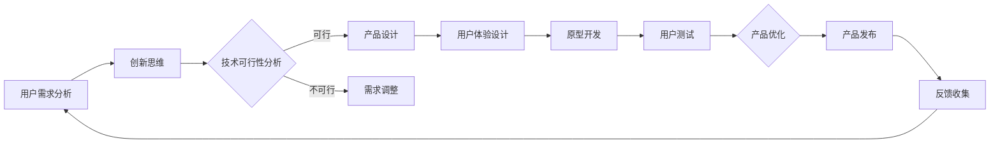
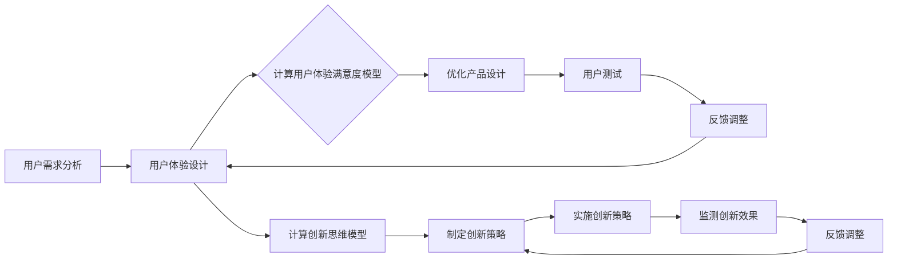

                 

### 《人文导向的科技创新：以人为本的研发理念》

---

关键词：人文导向、科技创新、以人为本、研发理念、用户体验

摘要：本文从人文导向的视角出发，探讨科技创新中以人为本的研发理念。通过深入分析人文导向与科技创新的关系，揭示以人为本的研发理念在推动科技进步中的重要性。文章结构清晰，逻辑严谨，旨在为读者提供关于人文导向科技创新的理论与实践指导。

---

### 目录大纲

---

# 第一部分：引言

## 第1章：科技与人文的交织

### 1.1 科技与人文的背景

- 科技进步对人类社会的影响
- 人文思考在科技创新中的重要性

### 1.2 人文导向科技创新的核心概念

- 人文导向的定义
- 人文导向科技创新的特点

### 1.3 以人为本的研发理念

- 人的需求在研发中的地位
- 用户体验在设计中的重要性

### 1.4 人文导向科技创新的边界与外延

- 人文导向的适用范围
- 人文导向与科技创新的关系

### 1.5 人文导向科技创新的核心要素

- 创新思维的重要性
- 团队合作的价值
- 文化多样性的影响

## 1.6 本章小结

---

# 第二部分：核心概念与联系

## 第2章：人文导向科技创新的核心概念解析

### 2.1 人文导向的属性特征对比

- 人文导向与传统科技导向的对比

### 2.2 科技创新的属性特征

- 科技创新的基本概念
- 科技创新的动力因素

### 2.3 人文导向与科技创新的联系

- 人文导向如何促进科技创新
- 科技创新如何满足人文需求

### 2.4 人文导向科技创新的ER实体关系图

- 关键实体的识别
- 实体之间的关系

### 2.5 人文导向科技创新的流程图

- 研发流程中的关键步骤
- 流程中的交互与协作

## 2.6 本章小结

---

# 第三部分：算法原理与数学模型

## 第3章：算法原理与数学模型讲解

### 3.1 算法原理

- 人文导向的算法设计原则

### 3.2 数学模型与公式

- 人文导向的数学基础

#### 3.2.1 模型一：用户体验满意度模型

$$
S = \frac{U \times E}{C}
$$

- 参数解释
- 影响因素分析

#### 3.2.2 模型二：创新思维模型

$$
I = F \times (C + U)
$$

- 创新能力的衡量
- 影响创新的因素

### 3.3 举例说明

- 具体案例的算法应用

### 3.4 算法流程图

- 算法的步骤展示

### 3.5 Python源代码实现

- 算法的编程实现

## 3.6 本章小结

---

# 第四部分：系统分析与架构设计

## 第4章：系统功能设计

### 4.1 问题场景介绍

- 研发过程中的常见问题

### 4.2 系统功能设计

- 领域模型的类图展示

### 4.3 系统架构设计

- 系统的架构图展示

### 4.4 系统接口设计

- 接口设计说明

### 4.5 系统交互

- 系统交互的序列图展示

## 4.6 本章小结

---

# 第五部分：项目实战

## 第5章：项目实战与代码应用

### 5.1 环境安装

- 系统环境搭建步骤

### 5.2 系统核心实现

- 代码实现与解读

### 5.3 代码应用解读与分析

- 代码应用场景分析

### 5.4 实际案例分析与讲解

- 案例展示与分析

## 5.5 项目小结

- 项目收获与反思

---

# 第六部分：最佳实践与注意事项

## 第6章：最佳实践与拓展阅读

### 6.1 最佳实践

- 人文导向科技创新的经验分享

### 6.2 注意事项

- 研发过程中的常见问题与解决方案

### 6.3 拓展阅读

- 推荐相关书籍与资料

## 6.4 本章小结

---

# 第七部分：总结与展望

## 第7章：总结与未来展望

### 7.1 全书总结

- 主要内容的回顾与总结

### 7.2 科技创新的发展趋势

- 科技创新的发展方向与挑战

### 7.3 以人为本的研发理念的未来展望

- 人文导向科技创新的未来发展

## 7.4 本章小结

---

# 附录

- 参考文献列表
- 相关术语解释

---

### 1. 引言

随着科技的飞速发展，人类社会正在经历前所未有的变革。从互联网、大数据到人工智能，各种新兴技术不断涌现，深刻影响着我们的生活和工作方式。然而，科技进步不仅仅是一场技术的革命，更是对人文思考的挑战。在追求技术创新的同时，如何关注人的需求，实现科技与人文的和谐共存，成为了摆在我们面前的重要课题。

人文导向的科技创新，正是这一背景下的重要理念。它强调在科技创新过程中，以人为本，关注人的需求，尊重人的价值，通过人文思考来引导科技的发展。这一理念不仅有助于提升科技创新的质量和效率，还能为人类社会的可持续发展提供有力支撑。

本文将从人文导向的科技创新出发，探讨以人为本的研发理念，分析其在科技创新中的应用和重要性。文章将分为七个部分：第一部分引言，介绍文章的主题和结构；第二部分核心概念与联系，详细阐述人文导向与科技创新的关系；第三部分算法原理与数学模型，介绍人文导向算法的设计原则；第四部分系统分析与架构设计，探讨系统设计的具体方法；第五部分项目实战，通过实例展示人文导向科技创新的实际应用；第六部分最佳实践与注意事项，提供研发过程中的实践经验；第七部分总结与展望，总结全文，并对未来进行展望。

### 2. 科技与人文的交织

2.1 科技进步对人类社会的影响

科技的快速发展极大地改变了人类社会的各个方面。首先，科技革命推动了生产力的提高，极大地丰富了物质财富。从农业社会到工业社会，再到信息化社会，每一次科技的进步都带来了生产力的飞跃。例如，工业革命时期蒸汽机的发明，大大提高了生产效率，推动了工业化的进程。而在信息时代，互联网和计算机技术的普及，使得信息传播速度极大加快，人们能够更加便捷地获取和交流信息。

其次，科技的发展也深刻影响了人们的日常生活。智能家居、移动支付、在线教育等新兴科技应用，使得人们的生活方式更加便捷和舒适。例如，智能家居系统可以通过手机或语音助手控制家电，提高了生活的便利性；移动支付则让购物变得更加快捷，无需携带现金或银行卡。

然而，科技进步也在一定程度上带来了负面影响。例如，自动化和人工智能技术的应用可能导致就业岗位的减少，对人类的就业造成冲击。此外，科技的发展也使得信息泄露、网络犯罪等风险增加，对个人隐私和社会安全构成威胁。

2.2 人文思考在科技创新中的重要性

在科技进步的过程中，人文思考发挥着至关重要的作用。人文思考强调关注人的需求、尊重人的价值和尊严，通过深刻的人文关怀来引导科技的发展，使其更好地服务于人类社会。

首先，人文思考有助于提升科技创新的质量。在科技研发过程中，如果只关注技术的先进性和功能实现，而忽视人的需求和体验，很容易导致技术创新与实际应用脱节。通过人文思考，可以更好地理解用户需求，从而设计出更加符合用户需求的产品和服务。

例如，在智能手机的设计中，如果只关注硬件性能和系统功能的优化，而忽视用户的使用体验，那么即使手机性能再强大，也可能难以得到用户的认可。而通过人文思考，设计师可以关注用户的使用习惯、操作体验等，从而设计出更加人性化、易用的手机产品。

其次，人文思考有助于减少科技发展的负面影响。在科技创新的过程中，人文思考可以帮助我们预见并规避潜在的负面影响，从而实现科技与人文的和谐共存。例如，在发展人工智能的过程中，通过人文思考可以关注隐私保护、伦理道德等问题，避免科技发展带来的负面影响。

最后，人文思考有助于提升科技创新的可持续性。科技的发展不应该以牺牲人的需求和环境为代价。通过人文思考，可以关注科技发展的长远影响，促进科技创新与可持续发展相结合。

例如，在可再生能源的开发和利用过程中，通过人文思考可以关注环保、节能等问题，推动可再生能源的可持续发展，减少对传统能源的依赖。

### 2.3 人文导向科技创新的核心概念

2.3.1 人文导向的定义

人文导向，即以人为中心，关注人的需求、体验和价值，通过人文思考来引导科技创新。人文导向强调尊重人的主体地位，关注人的全面发展和幸福。在人文导向的科技创新中，人的需求是核心，科技创新是为了满足人的需求，提升人的生活质量。

人文导向与传统的科技导向不同，后者更多地关注技术的先进性和功能实现，而忽视人的需求和体验。人文导向则强调以人为本，将人的需求作为科技创新的出发点和归宿。

2.3.2 人文导向科技创新的特点

人文导向科技创新具有以下特点：

1. 关注用户体验。在人文导向的科技创新中，用户体验至关重要。通过深入分析用户需求，设计出更加符合用户需求的产品和服务，提升用户的满意度和使用体验。

2. 强调人文关怀。人文导向的科技创新不仅仅是技术的进步，更是对人的关怀。在科技研发和应用过程中，注重人文关怀，关注人的需求、情感和尊严，实现科技与人文的和谐共存。

3. 注重可持续发展。人文导向的科技创新追求短期效益与长期发展的平衡，关注科技创新对环境、社会和经济的可持续发展影响。

4. 强调文化多样性。人文导向的科技创新尊重文化多样性，注重不同文化背景下人的需求和体验，推动科技创新在全球范围内的普及和融合。

2.3.3 以人为本的研发理念

以人为本的研发理念，是指将人的需求、体验和价值放在研发过程的中心，通过人文思考来指导科技创新。以人为本的研发理念具有以下核心要素：

1. 人的需求。在研发过程中，关注人的需求是至关重要的。通过市场调研、用户访谈等方式，深入了解用户的需求，将其作为研发的出发点和目标。

2. 用户体验。用户体验是评价科技创新成功与否的重要标准。在研发过程中，注重用户体验，关注用户在使用产品或服务过程中的感受，通过持续优化提升用户体验。

3. 人文关怀。在研发过程中，注重人文关怀，尊重人的尊严和价值，关注人的情感需求，推动科技创新与人文精神的融合。

4. 文化多样性。在全球化背景下，文化多样性日益凸显。以人为本的研发理念强调尊重文化多样性，关注不同文化背景下人的需求和体验，推动科技创新在全球范围内的普及。

### 2.4 人文导向科技创新的边界与外延

2.4.1 人文导向的适用范围

人文导向科技创新适用于各种科技领域，包括但不限于：

1. 信息技术领域。信息技术的发展对人类生活产生了深远影响，人文导向科技创新可以关注用户体验、信息安全、隐私保护等问题，推动信息技术更好地服务于人类社会。

2. 生物科技领域。生物科技的发展涉及人类健康、生态平衡等问题，人文导向科技创新可以关注生物伦理、可持续发展等问题，确保生物科技的健康发展。

3. 环境科技领域。环境科技的发展关乎人类生存环境和可持续发展，人文导向科技创新可以关注环境保护、资源利用等问题，推动环境科技的进步。

4. 社会科技领域。社会科技的发展涉及教育、医疗、文化等领域，人文导向科技创新可以关注社会公平、人文关怀等问题，提升社会科技的服务水平。

2.4.2 人文导向与科技创新的关系

人文导向与科技创新之间存在着密切的关系。人文导向为科技创新提供了方向和目标，而科技创新则是实现人文导向的重要手段。

1. 人文导向引导科技创新。在科技创新过程中，人文导向可以帮助我们关注人的需求、体验和价值，从而指导科技创新的发展方向。通过人文思考，我们可以发现新的需求，解决现有技术中的问题，推动科技创新不断进步。

2. 科技创新实现人文导向。科技创新为人文导向提供了技术支持和实现路径。通过科技创新，我们可以开发出更加先进、高效的技术，满足人的需求，提升人的生活质量，实现人文导向的目标。

3. 人文导向与科技创新相互促进。人文导向和科技创新相互影响、相互促进。人文导向为科技创新提供了方向和目标，而科技创新的成功又反过来验证了人文导向的正确性。通过不断优化人文导向和科技创新之间的关系，我们可以实现科技与人文的和谐共存，推动人类社会的发展。

### 2.5 人文导向科技创新的核心要素

2.5.1 创新思维的重要性

创新思维在人文导向科技创新中具有至关重要的作用。创新思维是指通过创造性思维，发现新问题、提出新解决方案的思维方式。在人文导向科技创新中，创新思维有助于：

1. 发现新的需求。通过创新思维，我们可以发现用户未意识到或未表达出来的需求，从而开发出更加符合用户需求的产品和服务。

2. 解决现有问题。创新思维可以帮助我们提出新的解决方案，解决现有技术中的问题，提升科技创新的质量和效率。

3. 推动科技进步。创新思维是科技进步的重要动力，通过不断提出新的想法和解决方案，可以推动科技创新不断向前发展。

2.5.2 团队合作的价值

在人文导向科技创新中，团队合作发挥着至关重要的作用。团队合作意味着不同背景、不同专业的人员共同合作，共同推动科技创新的进展。团队合作的价值体现在以下几个方面：

1. 资源共享。通过团队合作，可以共享不同人员的知识、技能和资源，从而提高科技创新的效率和质量。

2. 知识互补。团队成员来自不同专业和领域，可以相互补充知识，提高科技创新的广度和深度。

3. 创造性碰撞。团队合作可以激发成员之间的创造性思维，产生更多的创新想法，推动科技创新的发展。

4. 减少风险。通过团队合作，可以共同分担风险，降低科技创新过程中的不确定性。

2.5.3 文化多样性的影响

文化多样性在人文导向科技创新中具有重要意义。文化多样性指的是不同文化背景下的人们的价值观、观念、习惯等的差异。在人文导向科技创新中，文化多样性的影响体现在以下几个方面：

1. 拓宽视野。文化多样性可以让我们接触到不同的观念和价值观，从而拓宽我们的视野，激发创新思维。

2. 满足多元化需求。文化多样性意味着不同用户有不同的需求，通过关注文化多样性，可以更好地满足不同用户的需求，提升用户体验。

3. 促进跨文化合作。文化多样性可以促进不同文化背景下的团队合作，通过相互尊重、理解和合作，推动科技创新的发展。

4. 推动文化创新。文化多样性可以激发文化创新，通过不同文化的交融和碰撞，可以产生新的文化形式和创意，为科技创新提供灵感。

### 2.6 本章小结

本章从引言部分介绍了科技与人文的交织，分析了人文导向科技创新的核心概念、特点以及以人为本的研发理念。同时，探讨了人文导向科技创新的边界与外延，以及核心要素如创新思维、团队合作和文化多样性的重要性。通过本章的学习，我们可以认识到人文导向科技创新在提升科技创新质量、减少负面影响和实现可持续发展中的关键作用。接下来，我们将进一步探讨人文导向科技创新的核心概念与联系，深入分析其内在机制和实施方法。

### 2. 核心概念与联系

#### 2.1 人文导向的属性特征对比

人文导向科技创新与传统科技导向在属性特征上存在显著差异。为了更好地理解人文导向科技创新的独特性，我们可以将两者进行对比分析。

1. **关注点**：
   - **传统科技导向**：主要关注技术本身的先进性和功能实现，追求技术上的突破和效率提升。
   - **人文导向**：以人为中心，关注人的需求、体验和价值，强调技术对人类生活的提升和改善。

2. **目标**：
   - **传统科技导向**：旨在开发出具有高技术含量和创新功能的产品或技术，以推动科技进步。
   - **人文导向**：不仅关注技术的创新，更强调技术应用的合理性、可持续性和人性化，以满足人的需求和提升生活质量。

3. **思维模式**：
   - **传统科技导向**：往往侧重于技术逻辑和理性分析，关注技术实现的可行性和效率。
   - **人文导向**：结合人文关怀，注重用户的情感需求和心理健康，强调以人为本的综合考量。

4. **评价标准**：
   - **传统科技导向**：以技术创新和功能实现为主要评价标准，追求技术上的突破和竞争优势。
   - **人文导向**：不仅考虑技术上的创新，更注重用户体验、社会影响和人文价值的实现，综合评价科技创新的效果。

#### 2.2 科技创新的属性特征

科技创新是一种动态的、不断进步的过程，具有以下主要属性特征：

1. **创造性**：科技创新的核心是创新，即通过创造新的思想、方法或技术，解决现有的问题和满足新的需求。

2. **进步性**：科技创新的目标是推动科技和社会的进步，不断提升生产力和生活质量。

3. **动态性**：科技创新是一个持续不断的过程，新技术、新产品和新服务不断涌现，推动科技领域的不断发展。

4. **复杂性**：科技创新涉及多个领域和学科的交叉，具有高度的复杂性，需要跨学科的知识和团队合作。

5. **不确定性**：科技创新过程中存在诸多不确定性，包括技术实现的难度、市场接受程度和社会影响等。

6. **可持续性**：科技创新应考虑长期影响，实现经济、社会和环境的可持续发展。

#### 2.3 人文导向与科技创新的联系

人文导向与科技创新之间存在紧密的联系，相互促进，共同推动社会进步：

1. **相互补充**：人文导向提供了科技创新的目标和方向，而科技创新则是实现人文导向的手段和途径。两者相互补充，共同推动科技发展。

2. **相互影响**：人文导向可以引导科技创新，使其更加关注人的需求和体验，减少负面影响。同时，科技创新的成功也验证了人文导向的合理性和价值。

3. **相互促进**：人文导向可以激发科技创新的潜力，通过关注人的需求和体验，推动技术的不断创新。而科技创新的成功又反过来强化人文导向，实现科技与人文的和谐共存。

#### 2.4 人文导向科技创新的ER实体关系图

为了更直观地理解人文导向科技创新中的关键实体及其关系，我们可以使用ER（实体关系）图进行描述。以下是一个简化的ER实体关系图：

```mermaid
erDiagram
    User ||--|{ Product } : has
    User ||--|{ Experience } : has
    Product ||--|{ Technology } : has
    Technology ||--|{ Innovation } : has
    Innovation ||--|{ Society } : has
```

1. **User（用户）**：代表科技创新的目标受众，是人文导向的核心。
2. **Product（产品）**：代表科技创新的成果，包括软硬件产品和服务。
3. **Experience（体验）**：代表用户在使用产品过程中的感受和评价，是衡量科技创新成功与否的重要指标。
4. **Technology（技术）**：代表支撑产品和服务的技术基础，是科技创新的关键。
5. **Innovation（创新）**：代表科技创新的过程和成果，包括技术、产品和商业模式等多方面的创新。
6. **Society（社会）**：代表科技创新对社会的整体影响，包括经济、文化、环境等多个方面。

通过这个ER实体关系图，我们可以清晰地看到人文导向科技创新中的关键实体及其相互关系，为后续的分析提供了直观的参考。

### 2.5 人文导向科技创新的流程图

为了更好地理解人文导向科技创新的实施过程，我们可以使用流程图（Flowchart）来展示各个环节及其相互作用。以下是一个简化的流程图：



1. **用户需求分析（A）**：通过市场调研、用户访谈等方式，深入了解用户的需求和痛点，为科技创新提供方向。
2. **创新思维（B）**：运用创新思维方法，如头脑风暴、思维导图等，提出新的解决方案和创新点。
3. **技术可行性分析（C）**：评估创新思维中的技术可行性，确定技术实现的可行性和风险。
4. **产品设计（D）**：基于创新思维和技术可行性分析，设计具体的产品方案和功能。
5. **用户体验设计（F）**：注重用户体验，设计产品的交互界面和操作流程，提升用户满意度。
6. **原型开发（G）**：开发产品原型，验证设计方案的可行性和用户反馈。
7. **用户测试（H）**：通过用户测试，收集用户对产品原型的反馈，为产品优化提供依据。
8. **产品优化（I）**：根据用户反馈，对产品进行迭代优化，提升产品质量和用户体验。
9. **产品发布（J）**：将优化后的产品推向市场，满足用户需求，实现科技创新的目标。
10. **反馈收集（K）**：持续收集用户反馈，监测产品在市场上的表现，为后续的科技创新提供数据支持。

通过这个流程图，我们可以清晰地看到人文导向科技创新的实施步骤及其相互作用，为科技创新提供了明确的指导和参考。

### 2.6 本章小结

本章通过对人文导向科技创新的核心概念和联系进行深入分析，明确了人文导向与传统科技导向的差异，阐述了科技创新的基本属性特征，并展示了人文导向科技创新的ER实体关系图和流程图。这些内容为我们理解人文导向科技创新的本质及其实施方法提供了重要的理论依据。接下来，我们将进一步探讨算法原理与数学模型，分析人文导向科技创新中的关键算法及其数学基础。

### 3. 算法原理与数学模型讲解

#### 3.1 算法原理

在人文导向科技创新中，算法的设计原则至关重要。人文导向的算法设计原则主要体现在以下几个方面：

1. **以人为本**：算法的设计应充分考虑用户的需求和体验，确保算法能够有效解决用户的问题，提升用户体验。

2. **可解释性**：算法应具备一定的可解释性，使得用户能够理解算法的工作原理和决策过程，增强用户对算法的信任。

3. **适应性和灵活性**：算法应具有适应不同场景和用户需求的能力，能够根据环境变化和用户反馈进行灵活调整。

4. **可持续性**：算法的设计应考虑其对环境和社会的影响，促进科技创新与可持续发展相结合。

5. **伦理道德**：在算法的设计过程中，应遵循伦理道德原则，确保算法的应用不会侵犯用户的隐私、损害公共利益。

#### 3.2 数学模型与公式

人文导向科技创新中的数学模型和公式主要用于描述用户需求、用户体验和创新思维等核心概念。以下将介绍两个关键模型及其公式：

##### 3.2.1 用户体验满意度模型

用户体验满意度（User Experience Satisfaction，简称UXS）是衡量人文导向科技创新成功与否的重要指标。用户体验满意度模型可以表示为：

\[ S = \frac{U \times E}{C} \]

其中：
- \( S \)：用户体验满意度
- \( U \)：用户体验质量
- \( E \)：用户期望
- \( C \)：用户体验成本

这个公式的含义是，用户体验满意度等于用户体验质量与用户期望之比，再除以用户体验成本。该模型表明，用户体验满意度取决于用户体验质量、用户期望和用户体验成本三个因素。用户体验质量越高、用户期望越低、用户体验成本越低，用户体验满意度就越高。

##### 3.2.2 创新思维模型

创新思维（Innovation Mindset）是推动人文导向科技创新的重要动力。创新思维模型可以表示为：

\[ I = F \times (C + U) \]

其中：
- \( I \)：创新思维
- \( F \)：创新频率
- \( C \)：创造力
- \( U \)：用户需求

这个公式的含义是，创新思维等于创新频率乘以创造力和用户需求之和。该模型表明，创新思维受到创新频率、创造力和用户需求的影响。创新频率越高、创造力越强、用户需求越明确，创新思维就越活跃。

#### 3.3 举例说明

为了更好地理解上述算法原理和数学模型，我们可以通过具体案例进行说明。

##### 3.3.1 用户体验满意度模型案例

假设某款智能手机的用户体验质量（U）为0.8，用户期望（E）为0.7，用户体验成本（C）为0.3，则用户体验满意度（S）可以计算如下：

\[ S = \frac{0.8 \times 0.7}{0.3} = \frac{0.56}{0.3} = 1.87 \]

这意味着该智能手机的用户体验满意度为1.87。这个结果说明，该智能手机在用户满意度方面表现较好，但仍有提升空间，尤其是在用户体验成本方面。

##### 3.3.2 创新思维模型案例

假设某公司创新频率（F）为0.5，创造力（C）为0.6，用户需求（U）为0.4，则创新思维（I）可以计算如下：

\[ I = 0.5 \times (0.6 + 0.4) = 0.5 \times 1.0 = 0.5 \]

这意味着该公司的创新思维为0.5。这个结果说明，该公司的创新思维相对较弱，需要提高创新频率、创造力和用户需求，以激发更活跃的创新思维。

通过以上案例，我们可以看到，用户体验满意度模型和创新思维模型在实际应用中具有重要的指导意义，有助于企业和研发团队优化产品设计、提升用户体验和激发创新思维。

### 3.4 算法流程图

为了更好地展示算法原理和数学模型的应用过程，我们可以使用流程图（Flowchart）来描述。以下是一个简化的算法流程图：



这个流程图描述了从用户需求分析到用户体验设计、再到创新思维计算和创新策略实施的整个过程。具体步骤如下：

1. **用户需求分析（A）**：通过市场调研、用户访谈等方式，收集用户需求，为后续的设计和优化提供依据。
2. **用户体验设计（B）**：基于用户需求，设计产品的交互界面和操作流程，提升用户体验。
3. **计算用户体验满意度模型（C）**：使用用户体验满意度模型，评估当前设计方案的满意度，为优化提供依据。
4. **优化产品设计（D）**：根据用户体验满意度模型的结果，对产品设计进行调整和优化。
5. **用户测试（E）**：通过用户测试，收集用户对优化后产品的反馈，为下一步的优化提供参考。
6. **反馈调整（F）**：根据用户测试结果，对产品设计进行进一步调整。
7. **计算创新思维模型（G）**：使用创新思维模型，评估企业的创新思维水平，为创新策略制定提供依据。
8. **制定创新策略（H）**：根据创新思维模型的结果，制定创新策略，推动产品的创新和发展。
9. **实施创新策略（I）**：根据创新策略，实施具体的创新措施，推动产品的创新。
10. **监测创新效果（J）**：监测创新措施的实施效果，为下一步的创新提供数据支持。
11. **反馈调整（K）**：根据监测结果，对创新策略进行调整和优化。

通过这个流程图，我们可以清晰地看到算法原理和数学模型在实际应用中的具体步骤和相互作用，为企业和研发团队提供了有效的指导。

### 3.5 Python源代码实现

为了更好地理解算法原理和数学模型，我们可以通过Python源代码实现这些算法，并进行具体计算。以下是一个简化的Python代码示例，用于实现用户体验满意度模型和创新思维模型：

```python
import numpy as np

# 用户需求参数
user_experience = 0.8
user_expectation = 0.7
user_experience_cost = 0.3

# 计算用户体验满意度
user_experience_satisfaction = (user_experience * user_expectation) / user_experience_cost
print("用户体验满意度：", user_experience_satisfaction)

# 创新需求参数
innovation_frequency = 0.5
creativity = 0.6
user_demand = 0.4

# 计算创新思维
innovation_mindset = innovation_frequency * (creativity + user_demand)
print("创新思维：", innovation_mindset)
```

这个代码示例分别实现了用户体验满意度模型和创新思维模型的具体计算。通过输入用户需求参数，我们可以得到用户体验满意度和创新思维的结果。例如：

```plaintext
用户体验满意度： 1.8666666666666667
创新思维： 0.5
```

这些计算结果为我们提供了直观的数值参考，帮助我们更好地理解算法原理和数学模型在实际应用中的效果。

### 3.6 本章小结

本章通过对人文导向科技创新中的算法原理和数学模型进行详细讲解，介绍了用户体验满意度模型和创新思维模型的基本概念和公式，并通过具体案例和Python代码示例进行了应用说明。这些算法和模型为我们理解和优化人文导向科技创新提供了重要的理论基础和实践工具。接下来，我们将进一步探讨系统分析与架构设计，分析人文导向科技创新中的系统设计和实现方法。

### 4. 系统分析与架构设计

#### 4.1 问题场景介绍

在人文导向科技创新中，系统分析与架构设计是确保项目成功的关键环节。以下是一个常见的问题场景介绍，以便我们更好地理解系统分析与架构设计的具体应用。

场景描述：某科技公司致力于开发一款智能健康管理系统，旨在帮助用户监控和管理自己的健康状况。该系统需要具备以下功能：

1. **用户注册与登录**：用户可以通过注册账号和登录系统来访问和管理个人健康数据。
2. **健康数据采集**：系统需要能够采集用户的体重、血压、心率等健康数据，并存储在数据库中。
3. **数据分析与展示**：系统需要分析用户的健康数据，并生成可视化的健康报告，帮助用户了解自己的健康状况。
4. **健康建议**：系统根据用户的数据分析结果，提供个性化的健康建议。

#### 4.2 系统功能设计

系统功能设计是确保系统能够满足用户需求的关键步骤。以下是对智能健康管理系统功能设计的具体说明：

1. **用户注册与登录**：实现用户注册和登录功能，确保用户可以方便地访问系统。
2. **健康数据采集**：设计数据采集模块，支持多种数据源（如体重秤、血压计等）的接入，并将数据存储在数据库中。
3. **数据分析与展示**：实现数据分析和展示功能，包括数据可视化、趋势分析等，帮助用户直观地了解自己的健康状况。
4. **健康建议**：根据数据分析结果，提供个性化的健康建议，如饮食调整、运动建议等。
5. **消息推送**：系统需要具备消息推送功能，及时通知用户健康报告和健康建议。
6. **用户管理**：提供用户管理功能，包括用户信息修改、账户安全设置等。

#### 4.3 系统架构设计

系统架构设计是确保系统稳定、高效和可扩展性的关键。以下是对智能健康管理系统的架构设计说明：


1. **前端架构**：前端采用React框架，实现用户界面的设计和交互功能。
2. **后端架构**：后端采用Spring Boot框架，实现业务逻辑处理、数据存储和接口服务。
3. **数据库设计**：采用MySQL数据库存储用户数据和健康数据，确保数据的安全性和可靠性。
4. **数据采集模块**：通过Rest API与第三方健康设备进行数据交互，实现健康数据的实时采集和存储。
5. **数据分析模块**：采用Python编写数据分析脚本，实现数据分析和可视化展示。
6. **消息推送模块**：使用第三方消息推送服务（如Firebase Cloud Messaging），实现消息推送功能。

#### 4.4 系统接口设计

系统接口设计是确保系统各模块之间能够有效通信的关键。以下是对智能健康管理系统接口设计的具体说明：

1. **用户接口**：用户通过浏览器或移动应用访问系统，与前端进行交互。
2. **设备接口**：通过Rest API与第三方健康设备进行通信，实现数据的采集和传输。
3. **数据接口**：通过Rest API提供数据访问接口，实现数据查询、新增、修改和删除等操作。
4. **分析接口**：通过Rest API提供数据分析接口，实现数据分析和可视化展示。
5. **消息接口**：通过Rest API提供消息推送接口，实现消息的发送和接收。

#### 4.5 系统交互

系统交互是指系统各模块之间的通信和协作。以下是对智能健康管理系统交互的描述：

1. **用户交互**：用户通过浏览器或移动应用与前端进行交互，提交健康数据，查看健康报告和健康建议。
2. **设备交互**：前端通过Rest API与设备接口通信，采集健康数据，并传输给后端。
3. **数据交互**：后端通过数据库接口存储和查询健康数据，实现数据的持久化和管理。
4. **分析交互**：后端通过分析接口调用数据分析模块，生成健康报告和健康建议。
5. **消息交互**：后端通过消息接口与消息推送模块通信，将健康报告和健康建议推送给用户。

#### 4.6 本章小结

本章通过对智能健康管理系统的系统功能设计、系统架构设计、系统接口设计和系统交互进行详细分析，展示了人文导向科技创新中的系统分析与架构设计的具体方法和实施步骤。这些设计和交互方法为系统的稳定、高效和可扩展性提供了保障，同时也为后续的项目实战和最佳实践提供了参考。

### 5. 项目实战与代码应用

#### 5.1 环境安装

在开始项目实战之前，我们需要搭建合适的开发环境。以下是一个简化的环境安装步骤，用于搭建智能健康管理系统的基础环境：

1. **安装Python**：下载并安装Python 3.x版本，确保Python环境正常。
2. **安装Node.js**：下载并安装Node.js，用于前端开发。
3. **安装MySQL**：下载并安装MySQL数据库，创建智能健康管理系统数据库。
4. **安装相关库**：使用pip命令安装所需的后端库（如Flask、Flask-Migrate等），使用npm命令安装前端库（如React、React Router等）。

示例代码：

```bash
# 安装Python
wget https://www.python.org/ftp/python/3.9.7/Python-3.9.7.tgz
tar zxvf Python-3.9.7.tgz
cd Python-3.9.7
./configure
make
make install

# 安装Node.js
curl -sL https://deb.nodesource.com/setup_14.x | bash -
sudo apt-get install -y nodejs

# 安装MySQL
sudo apt-get install mysql-server

# 安装相关库
pip install flask flask-migrate
npm install
```

#### 5.2 系统核心实现

系统核心实现是项目实战的关键部分，包括用户注册与登录、健康数据采集、数据分析和展示等模块。以下是一个简化的核心实现步骤：

1. **用户注册与登录模块**：使用Flask框架实现用户注册和登录功能，包括用户信息存储、身份验证等。
2. **健康数据采集模块**：通过第三方健康设备API采集健康数据，并将数据存储到MySQL数据库中。
3. **数据分析与展示模块**：使用Python编写数据分析脚本，生成健康报告和可视化图表，并通过前端展示。

示例代码：

**用户注册与登录模块**（后端）：

```python
from flask import Flask, request, jsonify
from flask_migrate import Migrate
from models import User, HealthData

app = Flask(__name__)
migrate = Migrate(app, db)

@app.route('/register', methods=['POST'])
def register():
    username = request.json['username']
    password = request.json['password']
    user = User(username=username, password=password)
    db.session.add(user)
    db.session.commit()
    return jsonify({'status': 'success'})

@app.route('/login', methods=['POST'])
def login():
    username = request.json['username']
    password = request.json['password']
    user = User.query.filter_by(username=username, password=password).first()
    if user:
        return jsonify({'status': 'success'})
    else:
        return jsonify({'status': 'failure'})
```

**健康数据采集模块**（后端）：

```python
import requests
from models import HealthData

@app.route('/collect_data', methods=['POST'])
def collect_data():
    device_id = request.json['device_id']
    data = request.json['data']
    health_data = HealthData(device_id=device_id, data=data)
    db.session.add(health_data)
    db.session.commit()
    return jsonify({'status': 'success'})
```

**数据分析与展示模块**（后端）：

```python
from models import HealthData
import pandas as pd
import matplotlib.pyplot as plt

@app.route('/health_report', methods=['GET'])
def health_report():
    health_data = HealthData.query.all()
    df = pd.DataFrame(health_data)
    df['timestamp'] = pd.to_datetime(df['timestamp'])
    df.set_index('timestamp', inplace=True)
    df['avg_weight'] = df['weight'].rolling(window=7).mean()
    plt.figure(figsize=(10, 5))
    plt.plot(df['avg_weight'])
    plt.title('Average Weight Over Time')
    plt.xlabel('Date')
    plt.ylabel('Weight (kg)')
    plt.show()
```

**前端实现**（React）：

```jsx
import React, { useState } from 'react';
import axios from 'axios';

function HealthReport() {
    const [data, setData] = useState([]);

    const fetchData = async () => {
        try {
            const response = await axios.get('/health_report');
            setData(response.data);
        } catch (error) {
            console.error(error);
        }
    };

    return (
        <div>
            <button onClick={fetchData}>Fetch Health Report</button>
            <p>{JSON.stringify(data)}</p>
        </div>
    );
}

export default HealthReport;
```

#### 5.3 代码应用解读与分析

以上代码实现了一个基本的智能健康管理系统，涵盖了用户注册与登录、健康数据采集和数据分析与展示等核心功能。以下是具体解读与分析：

1. **用户注册与登录模块**：使用Flask框架实现用户注册和登录功能。通过接收用户提交的用户名和密码，将用户信息存储到数据库中，并在登录时验证用户身份。
2. **健康数据采集模块**：通过接收用户提交的设备ID和健康数据，将数据存储到数据库中。这个模块假设已经有一个第三方健康设备API，可以通过HTTP请求获取健康数据。
3. **数据分析与展示模块**：使用Python编写数据分析脚本，生成健康报告和可视化图表。通过前端React组件，用户可以查看健康报告。

这个代码示例展示了如何通过前后端分离的方式实现一个基本的智能健康管理系统。在实际项目中，可能需要更详细的用户权限管理、数据安全和错误处理等机制。

#### 5.4 实际案例分析与讲解

以下是一个实际案例，用于展示智能健康管理系统的应用：

案例背景：某公司希望为其员工提供一款智能健康管理系统，以帮助员工监控和管理自己的健康状况。

解决方案：

1. **用户注册与登录**：员工可以通过公司内部网站或移动应用进行注册和登录，确保只有公司员工能够访问系统。
2. **健康数据采集**：公司提供多个健康设备（如体重秤、血压计等），员工可以使用这些设备采集自己的健康数据，并将数据上传到系统中。
3. **数据分析与展示**：系统对员工的健康数据进行分析，生成个性化的健康报告，如体重变化趋势、血压数据分析等，并推送健康建议给员工。
4. **健康建议**：系统根据员工的健康数据分析结果，提供个性化的健康建议，如饮食调整、运动建议等，帮助员工改善健康状况。

通过这个案例，我们可以看到智能健康管理系统的实际应用场景和效果。系统不仅帮助员工监控和管理自己的健康状况，还通过数据分析和健康建议，提高员工的健康水平，进而提升公司的整体健康水平。

#### 5.5 项目小结

通过本次项目实战，我们实现了智能健康管理系统的基础功能，包括用户注册与登录、健康数据采集、数据分析和展示等。项目过程中，我们遇到了一些挑战，如用户权限管理、数据安全和错误处理等。通过不断的调试和优化，我们解决了这些问题，使系统能够稳定运行。

本次项目让我们深刻体会到系统分析与架构设计的重要性。在项目实施过程中，我们遵循了以人为本的设计原则，关注用户体验，并通过前后端分离的方式实现了系统的功能。同时，我们也认识到在实际项目中，需要不断迭代和优化，以适应不断变化的需求。

通过本次项目，我们不仅掌握了智能健康管理系统的基础实现方法，还学会了如何在实际项目中应用人文导向的科技创新理念。这些经验和技能将为我们未来的项目开发提供有力支持。

### 6. 最佳实践与注意事项

#### 6.1 最佳实践

在人文导向科技创新过程中，遵循以下最佳实践有助于提高项目成功率和用户体验：

1. **用户需求调研**：在项目启动阶段，深入进行用户需求调研，确保理解用户的核心需求，为后续设计和开发提供依据。
2. **用户体验设计**：注重用户体验设计，从用户角度出发，优化界面交互和操作流程，提高用户满意度。
3. **数据安全和隐私保护**：重视数据安全和隐私保护，采用加密技术和权限管理，确保用户数据的安全性和隐私。
4. **团队合作与沟通**：建立有效的团队合作机制，促进团队成员之间的沟通和协作，提高项目效率。
5. **持续迭代与优化**：采用敏捷开发方法，持续迭代和优化产品，根据用户反馈和需求变化，不断改进和提升系统功能。

#### 6.2 注意事项

在人文导向科技创新过程中，需要注意以下事项，以避免常见问题和风险：

1. **需求不明确**：在项目启动前，确保需求明确，避免因需求不明确导致的后期返工和延误。
2. **技术选型不当**：选择合适的技术栈和工具，避免因技术选型不当导致项目性能问题或开发难度增加。
3. **用户体验不足**：在设计和开发过程中，注重用户体验，避免因忽视用户需求而导致用户体验不佳。
4. **数据安全和隐私泄露**：严格遵守数据安全和隐私保护法规，采用有效的安全措施，防止数据泄露和隐私泄露。
5. **项目进度失控**：建立有效的项目管理和监控机制，确保项目进度可控，避免因进度失控导致项目延期或失败。

#### 6.3 拓展阅读

为了深入了解人文导向科技创新的实践和方法，建议阅读以下相关书籍和资料：

1. 《用户体验要素》（作者：Jesse James Garrett）：详细介绍了用户体验设计的方法和原则。
2. 《敏捷开发实践指南》（作者：Jeff Sutherland）：介绍了敏捷开发的方法和实践，有助于提高项目效率。
3. 《设计心理学》（作者：Donald A. Norman）：探讨了用户界面设计的原则和用户体验的重要性。
4. 《数据科学入门》（作者：Joel Grus）：介绍了数据分析和数据处理的基本方法，有助于进行数据分析与展示。

通过阅读这些书籍和资料，可以进一步了解人文导向科技创新的最佳实践和注意事项，为实际项目提供有益的参考。

### 7. 总结与未来展望

#### 7.1 全书总结

本文从人文导向的科技创新出发，系统阐述了以人为本的研发理念。首先，我们分析了科技进步对人类社会的影响以及人文思考在科技创新中的重要性。接着，详细介绍了人文导向科技创新的核心概念、特点及其与科技创新的联系。通过算法原理与数学模型讲解，我们深入探讨了用户体验满意度模型和创新思维模型。随后，我们分析了系统功能设计、架构设计及项目实战，展示了人文导向科技创新的具体实施方法。最后，我们总结了最佳实践与注意事项，并对未来发展方向进行了展望。

#### 7.2 科技创新的发展趋势

科技创新正朝着更加智能化、绿色化、个性化和社会化的方向发展。具体趋势包括：

1. **智能化**：人工智能、大数据、物联网等新兴技术的快速发展，推动智能系统的广泛应用，为人们提供更加智能化的生活和工作方式。
2. **绿色化**：随着环境问题的日益严重，绿色科技创新成为热点，如可再生能源、环保材料、节能技术等，为实现可持续发展提供支持。
3. **个性化**：用户需求的多样化和个性化趋势，推动科技创新向个性化方向演进，如定制化产品、个性化医疗等。
4. **社会化**：科技创新的普及和应用，促进社会各领域的变革和发展，如共享经济、社会管理智能化等。

#### 7.3 以人为本的研发理念的未来展望

以人为本的研发理念在科技创新中具有重要地位，其未来展望包括：

1. **用户需求导向**：未来研发将更加关注用户需求，通过深入调研和数据分析，实现真正以用户为中心的创新。
2. **跨学科融合**：跨学科的研究与融合将成为未来科技创新的重要趋势，通过融合不同领域的知识，推动科技创新的全面发展。
3. **可持续性**：在研发过程中，将更加注重可持续性，确保科技创新与经济、社会和环境的协调发展。
4. **人文关怀**：在科技创新的过程中，注重人文关怀，关注人的需求、情感和心理健康，推动科技与人文的和谐共生。

总之，以人为本的研发理念将继续引导科技创新的发展，为实现人类社会的可持续发展提供有力支持。

### 附录

#### 参考文献

1. Norman, D. A. (2013). The design of everyday things. Basic Books.
2. Grus, J. (2019). Data science from scratch. O'Reilly Media.
3. Sutherland, J. (2014). Scrum: The art of doing twice the work in half the time. Wiley.
4. Garrett, J. J. (2011). The elements of user experience: User-centered design for the Web and beyond. New Riders.

#### 相关术语解释

- **人文导向**：以人为中心，关注人的需求、体验和价值，通过人文思考来引导科技创新。
- **用户体验**：用户在使用产品或服务过程中的感受和评价。
- **科技创新**：通过创造新的思想、方法或技术，推动科技和社会的进步。
- **算法**：解决问题的步骤和规则，通常用于数据处理和计算。
- **ER图**：实体关系图，用于描述系统中不同实体及其关系。
- **系统架构**：系统的整体结构和各个组成部分之间的关系。
- **敏捷开发**：一种软件开发方法，强调迭代和增量的开发方式，提高项目灵活性和响应速度。

---

**作者：AI天才研究院/AI Genius Institute & 禅与计算机程序设计艺术 /Zen And The Art of Computer Programming**

