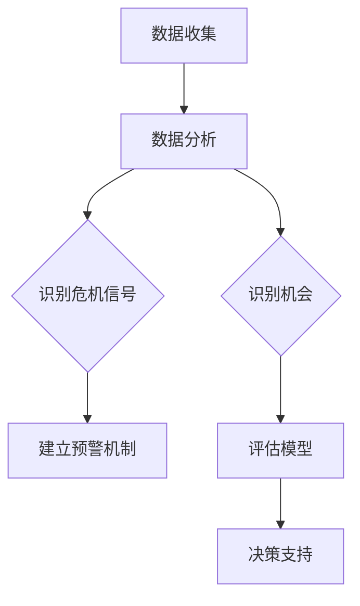
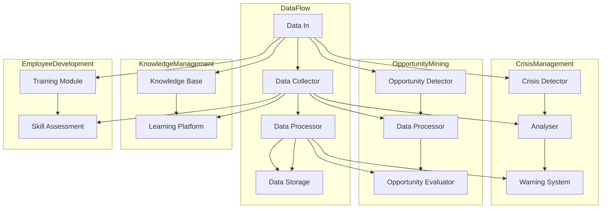
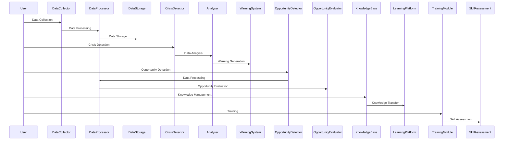

                 

## 人生转折点的意义重塑：危机中的机遇

### 关键词：人生转折点，危机管理，机遇挖掘，认知升级，创新思维

在快速变化的时代背景下，每个人都可能会面临各种危机与挑战。然而，危机之中往往蕴含着无尽的机遇。本文将围绕“人生转折点的意义重塑：危机中的机遇”这一主题，深入探讨危机管理、机遇挖掘以及认知升级等关键问题。通过具体案例分析，我们将揭示如何在危机中找到机遇，从而实现人生价值的重塑。

### 摘要

本文旨在探讨人生转折点的双重意义——危机与机遇。首先，我们将定义并分析危机与机遇的核心概念，阐述它们在人生中的重要地位。接着，通过理论框架的构建，我们将会对危机管理、机遇挖掘及认知升级的方法进行详细讲解。在此基础上，我们将结合实际案例，展示如何在具体情境中实现危机向机遇的转化。最后，本文将总结最佳实践，为读者提供可行的策略和方法，帮助他们在人生转折点上做出明智选择，实现自我提升。

## 第一部分：引言

### 1.1 问题的背景与提出

在当今社会，危机与机遇并存已成为一种常态。全球化、技术革新、市场波动等因素使得每个人的人生都充满了不确定性。面对这些挑战，如何把握危机中的机遇，实现人生的转折点，成为值得探讨的重要问题。

#### 1.1.1 社会转型的挑战

随着信息技术的飞速发展，社会正在经历深刻的转型。传统行业面临被颠覆的风险，新兴产业不断涌现，人们的生活方式、工作模式以及价值观念也在不断变化。在这个过程中，危机无处不在，但机遇也同样隐藏其中。

#### 1.1.2 危机与机遇并存的现状

现代社会充满了危机与机遇，两者往往紧密相连。危机可能源于经济衰退、健康问题、人际关系冲突等，而机遇则可能出现在这些危机的解决过程中。例如，在经济衰退时期，一些创新型企业往往能够抓住市场空缺，实现快速发展。

#### 1.1.3 研究意义与目标

本文的研究意义在于揭示危机与机遇之间的关系，提供有效的危机管理策略和机遇挖掘方法，帮助读者在人生转折点上做出正确选择。研究目标包括：

1. 定义并分析危机与机遇的核心概念。
2. 构建理论框架，探讨危机管理、机遇挖掘及认知升级的方法。
3. 通过实际案例，展示如何在危机中找到机遇。
4. 提供最佳实践，为读者提供可行策略。

### 1.2 核心概念的定义与联系

#### 1.2.1 危机与机遇的内涵

**危机**：危机通常指一种潜在的威胁或挑战，可能对个人、组织或社会造成负面影响。它往往表现为突发事件、不确定性、资源短缺等。

**机遇**：机遇则是指潜在的积极变化或发展机会，可以带来新的资源、优势或价值。它通常出现在危机的解决过程中，或是对危机的有效应对。

#### 1.2.2 关键概念之间的关联性

危机与机遇之间存在着密切的关联。危机往往伴随着不确定性，而机遇则隐藏在不确定性中。有效的危机管理能够降低危机的影响，同时为机遇的发掘创造条件。认知升级则是在这一过程中的关键因素，它帮助人们从危机中看到机遇，并抓住机遇。

#### 1.2.3 概念属性的对比表格

| 概念 | 定义 | 属性特征 | 关联性 |
| --- | --- | --- | --- |
| 危机 | 潜在的威胁或挑战 | 不确定性、突发事件、资源短缺 | 危机与机遇并存，危机可能导致机遇 |
| 机遇 | 潜在的积极变化或发展机会 | 新的资源、优势、价值 | 机遇隐藏在危机中，有效管理危机可创造机遇 |
| 认知升级 | 增强对问题的认知和理解能力 | 知识、技能、思维方式 | 认知升级帮助看到危机中的机遇 |

#### 1.2.4 ER实体关系图

为了更好地理解危机、机遇与认知升级之间的关系，我们可以使用ER（Entity-Relationship，实体-关系）图进行描述。ER图能够清晰地展示各个实体之间的关系，帮助我们从整体上把握问题的本质。

```mermaid
erDiagram
  危机 ||--|{ 认知升级 }|| 机遇
  认知升级 ||--|{ 危机 }|| 机遇
```

在这个ER图中，危机和机遇是两个核心实体，它们通过认知升级这一关联实体相互连接。认知升级不仅连接着危机与机遇，还起到了调节和转换的作用，帮助人们在危机中看到机遇，并抓住机遇。

### 1.3 研究边界与外延

#### 1.3.1 研究范围的界定

本文的研究范围主要涵盖以下几个方面：

1. **危机与机遇的定义与属性**：对危机与机遇的概念进行详细阐述，分析其属性特征。
2. **危机管理策略**：探讨如何应对危机，降低其负面影响。
3. **机遇挖掘方法**：研究如何在危机中发掘机遇，并利用这些机遇实现个人或组织的成长。
4. **认知升级**：分析认知升级在危机管理及机遇挖掘中的作用，探讨如何提升认知能力。

#### 1.3.2 研究方法的选择

本文采用的研究方法主要包括：

1. **文献综述**：通过查阅相关文献，了解危机与机遇研究的前沿动态，为本文的研究提供理论基础。
2. **案例分析**：通过具体案例，展示危机管理及机遇挖掘的实际应用，提供实践参考。
3. **理论构建**：基于文献综述和案例分析，构建危机管理、机遇挖掘及认知升级的理论框架。
4. **实证研究**：通过问卷调查、访谈等方法，收集相关数据，验证理论框架的可行性。

#### 1.3.3 研究的限制条件

本文的研究存在以下限制条件：

1. **研究范围**：由于篇幅和资源限制，本文无法覆盖所有与危机管理及机遇挖掘相关的话题。
2. **数据来源**：本文所使用的数据主要来源于公开文献和案例分析，可能存在一定的局限性。
3. **理论框架**：本文构建的理论框架具有一定的假设性，需要进一步实证研究来验证其适用性。

## 第二部分：理论探讨

### 2.1 理论框架构建

#### 2.1.1 相关理论综述

在探讨危机管理、机遇挖掘及认知升级之前，我们需要了解一些相关的理论基础。以下是一些关键理论：

1. **危机管理理论**：危机管理理论主要关注如何应对突发事件，降低危机的影响。其核心概念包括危机预警、危机响应、危机恢复等。
2. **机遇挖掘理论**：机遇挖掘理论探讨如何发现和利用潜在的机会，实现个人或组织的成长。其核心概念包括机会识别、机会评估、机会利用等。
3. **认知升级理论**：认知升级理论关注如何提升个体的认知能力，从而更好地应对复杂问题和挑战。其核心概念包括知识学习、思维模式、认知框架等。

#### 2.1.2 理论框架的提出

基于上述相关理论，我们可以构建一个涵盖危机管理、机遇挖掘及认知升级的理论框架。该框架主要包括以下几个核心要素：

1. **危机预警**：通过收集和分析信息，识别潜在的危机信号，提前采取预防措施。
2. **危机响应**：在危机爆发时，迅速采取有效的应对措施，降低危机的影响。
3. **危机恢复**：在危机过后，进行系统评估和修复，恢复正常运营。
4. **机会识别**：通过持续关注市场、技术和环境变化，发现潜在的机会。
5. **机会评估**：对识别出的机会进行评估，确定其潜在价值和可行性。
6. **机会利用**：利用评估结果，制定具体的行动计划，实现机会的价值。
7. **知识学习**：通过学习新知识、技能和经验，不断提升个体的认知能力。
8. **思维模式**：培养创新思维、系统思维和跨学科思维，提高解决问题的能力。
9. **认知框架**：构建适应复杂环境和问题的认知框架，帮助个体更好地应对挑战。

#### 2.1.3 理论框架的核心要素

理论框架的核心要素如下：

1. **危机预警**：通过数据分析和趋势预测，识别潜在的危机信号。
2. **危机响应**：制定应急预案，迅速采取行动，降低危机影响。
3. **危机恢复**：进行系统评估和修复，恢复正常运营。
4. **机会识别**：持续关注市场、技术和环境变化，发现潜在机会。
5. **机会评估**：对机会进行评估，确定潜在价值和可行性。
6. **机会利用**：制定行动计划，实现机会价值。
7. **知识学习**：通过学习新知识、技能和经验，提升认知能力。
8. **思维模式**：培养创新思维、系统思维和跨学科思维。
9. **认知框架**：构建适应复杂环境和问题的认知框架。

### 2.2 算法原理讲解

#### 2.2.1 算法的基本原理

在本节中，我们将介绍一种用于危机管理、机遇挖掘及认知升级的算法。该算法的基本原理如下：

1. **数据收集**：通过数据采集工具，收集与危机、机遇及认知升级相关的数据。
2. **数据分析**：对收集到的数据进行分析，识别潜在的危机信号和机会。
3. **预警机制**：根据数据分析结果，建立预警机制，及时发现潜在的危机。
4. **机会识别**：利用数据分析结果，识别潜在的机会。
5. **评估模型**：构建评估模型，对识别出的机会进行评估。
6. **决策支持**：根据评估结果，提供决策支持，帮助个体或组织制定应对策略。

#### 2.2.2 算法流程图

下面是一个简单的算法流程图，展示了该算法的基本步骤：



#### 2.2.3 算法原理的数学模型与公式

为了更好地理解算法原理，我们可以使用以下数学模型和公式：

1. **危机预警模型**：

   $$C_r(t) = f(C_i(t), C_e(t))$$

   其中，$C_r(t)$ 表示危机预警得分，$C_i(t)$ 表示危机信号强度，$C_e(t)$ 表示环境因素。

2. **机会识别模型**：

   $$O_r(t) = g(O_i(t), O_e(t))$$

   其中，$O_r(t)$ 表示机会识别得分，$O_i(t)$ 表示机会信号强度，$O_e(t)$ 表示环境因素。

3. **评估模型**：

   $$A_v(t) = h(A_r(t), A_c(t))$$

   其中，$A_v(t)$ 表示评估得分，$A_r(t)$ 表示机会潜力，$A_c(t)$ 表示机会可行性。

4. **决策支持模型**：

   $$D_s(t) = k(D_r(t), D_c(t))$$

   其中，$D_s(t)$ 表示决策支持得分，$D_r(t)$ 表示风险因素，$D_c(t)$ 表示成本因素。

#### 2.2.4 举例说明

假设某公司在进行危机管理时，收集到以下数据：

- 危机信号强度：$C_i(t) = 0.8$
- 环境因素：$C_e(t) = 0.6$
- 机会信号强度：$O_i(t) = 0.7$
- 环境因素：$O_e(t) = 0.5$
- 机会潜力：$A_r(t) = 0.9$
- 机会可行性：$A_c(t) = 0.8$
- 风险因素：$D_r(t) = 0.3$
- 成本因素：$D_c(t) = 0.4$

根据上述模型，我们可以计算出：

1. **危机预警得分**：

   $$C_r(t) = f(C_i(t), C_e(t)) = 0.8 \times 0.6 = 0.48$$

2. **机会识别得分**：

   $$O_r(t) = g(O_i(t), O_e(t)) = 0.7 \times 0.5 = 0.35$$

3. **评估得分**：

   $$A_v(t) = h(A_r(t), A_c(t)) = 0.9 \times 0.8 = 0.72$$

4. **决策支持得分**：

   $$D_s(t) = k(D_r(t), D_c(t)) = 0.3 \times 0.4 = 0.12$$

根据计算结果，我们可以得出以下结论：

- 危机预警得分较低，说明当前的危机信号并不强烈。
- 机会识别得分较高，说明当前存在潜在的机会。
- 评估得分较高，说明机会具有较高的潜力和可行性。
- 决策支持得分较低，说明需要进一步评估风险和成本。

根据这些信息，公司可以制定相应的应对策略，例如：

- 加强对潜在危机的监控，及时预警。
- 抓住潜在机会，制定具体的行动计划。
- 评估机会的潜在风险和成本，确保决策的合理性。

### 2.3 数学模型与公式讲解

#### 2.3.1 数学模型的引入

在探讨危机管理、机遇挖掘及认知升级的过程中，数学模型作为一种强大的工具，可以帮助我们更准确地描述和预测复杂现象。在本节中，我们将引入一些关键数学模型，用于分析危机与机遇之间的关系，以及如何通过认知升级实现两者的转化。

#### 2.3.2 数学公式解释

1. **危机评估模型**：

   $$C(t) = \frac{C_1(t) + C_2(t) + ... + C_n(t)}{n}$$

   其中，$C(t)$ 表示危机综合得分，$C_i(t)$（$i=1,2,...,n$）表示第$i$个危机因素得分。这个公式通过加权平均的方式，综合考虑各个危机因素的影响，得到一个综合危机得分。

2. **机遇评估模型**：

   $$O(t) = \frac{O_1(t) + O_2(t) + ... + O_n(t)}{n}$$

   其中，$O(t)$ 表示机遇综合得分，$O_i(t)$（$i=1,2,...,n$）表示第$i$个机遇因素得分。这个公式与危机评估模型类似，用于评估机遇的综合得分。

3. **认知升级模型**：

   $$U(t) = f(U_1(t), U_2(t), ..., U_m(t))$$

   其中，$U(t)$ 表示认知升级得分，$U_i(t)$（$i=1,2,...,m$）表示第$i$个认知升级因素得分。这个公式通过组合各个认知升级因素，得到一个综合认知升级得分。

#### 2.3.3 数学公式的应用实例

为了更好地理解上述数学公式的应用，我们可以通过一个实际案例进行说明。

假设一家公司在面临危机与机遇时，收集到以下数据：

1. **危机因素**：
   - 市场竞争加剧：$C_1(t) = 0.8$
   - 成本上升：$C_2(t) = 0.6$
   - 财务风险：$C_3(t) = 0.5$

2. **机遇因素**：
   - 新市场开拓：$O_1(t) = 0.7$
   - 技术创新：$O_2(t) = 0.8$
   - 资源整合：$O_3(t) = 0.6$

3. **认知升级因素**：
   - 学习新知识：$U_1(t) = 0.9$
   - 培养创新思维：$U_2(t) = 0.8$
   - 改进决策能力：$U_3(t) = 0.7$

根据上述数据，我们可以计算得到：

1. **危机综合得分**：

   $$C(t) = \frac{C_1(t) + C_2(t) + C_3(t)}{3} = \frac{0.8 + 0.6 + 0.5}{3} = 0.67$$

2. **机遇综合得分**：

   $$O(t) = \frac{O_1(t) + O_2(t) + O_3(t)}{3} = \frac{0.7 + 0.8 + 0.6}{3} = 0.7$$

3. **认知升级得分**：

   $$U(t) = f(U_1(t), U_2(t), U_3(t)) = 0.9 \times 0.8 \times 0.7 = 0.504$$

通过计算结果，我们可以得出以下结论：

- 该公司面临的危机综合得分为0.67，表明当前的危机水平较为适中。
- 机遇综合得分为0.7，表明公司存在一定的机遇。
- 认知升级得分为0.504，表明公司的认知能力有所提升。

基于这些数据，公司可以采取以下策略：

- 加强危机管理，降低危机水平。
- 抓住机遇，制定具体的行动计划。
- 持续提升认知能力，以更好地应对危机和抓住机遇。

### 2.4 系统分析与架构设计

#### 2.4.1 问题描述

在当今复杂多变的环境中，企业面临着各种危机与机遇。为了有效应对这些挑战，企业需要一个综合的系统来管理危机、挖掘机遇，并提升员工的认知能力。本节将介绍一个用于危机管理、机遇挖掘及认知升级的系统架构设计。

#### 2.4.2 项目介绍

本项目的目标是设计一个基于大数据和人工智能技术的危机管理、机遇挖掘及认知升级系统。该系统将帮助企业：

1. 及时识别危机信号，建立预警机制。
2. 挖掘潜在机遇，提供决策支持。
3. 提升员工的认知能力，增强企业竞争力。

#### 2.4.3 系统功能设计（领域模型mermaid类图）

系统功能设计是系统架构设计的重要环节。以下是一个简化的领域模型mermaid类图，展示了系统的核心功能：

```mermaid
classDiagram
    class CrisisManagementSystem
        +-- CrisisDetector
        |    +-- DataCollector
        |    +-- Analyser
        |    +-- WarningSystem
        |
        class OpportunityMiner
            +-- DataProcessor
            +-- OpportunityEvaluator
            |
            class KnowledgeManagement
                +-- KnowledgeBase
                +-- LearningPlatform
                |
            class EmployeeDevelopment
                +-- TrainingModule
                +-- SkillAssessment
```

在这个类图中，CrisisManagementSystem（危机管理系统）是系统的核心，包括CrisisDetector（危机检测器）、OpportunityMiner（机遇挖掘器）和KnowledgeManagement（知识管理）等模块。CrisisDetector模块包括DataCollector（数据采集器）、Analyser（分析器）和WarningSystem（预警系统）。OpportunityMiner模块包括DataProcessor（数据处理器）和OpportunityEvaluator（机遇评估器）。KnowledgeManagement模块包括KnowledgeBase（知识库）和LearningPlatform（学习平台）。EmployeeDevelopment模块包括TrainingModule（培训模块）和SkillAssessment（技能评估）。

#### 2.4.4 系统架构设计（mermaid架构图）

系统架构设计是确保系统稳定、高效运行的关键。以下是一个简化的mermaid架构图，展示了系统的整体架构：



在这个架构图中，DataFlow（数据流）是系统的核心，包括DataCollector（数据采集器）、DataProcessor（数据处理器）和DataStorage（数据存储）。CrisisManagement（危机管理）模块包括CrisisDetector（危机检测器）和Analyser（分析器）。OpportunityMining（机遇挖掘）模块包括OpportunityDetector（机遇检测器）和OpportunityEvaluator（机遇评估器）。KnowledgeManagement（知识管理）模块包括KnowledgeBase（知识库）和LearningPlatform（学习平台）。EmployeeDevelopment（员工发展）模块包括TrainingModule（培训模块）和SkillAssessment（技能评估）。

#### 2.4.5 系统接口设计与系统交互（mermaid序列图）

系统接口设计与系统交互是系统架构设计的重要组成部分。以下是一个简化的mermaid序列图，展示了系统的关键接口和交互流程：



在这个序列图中，User（用户）是系统的入口，通过接口与DataCollector（数据采集器）、DataProcessor（数据处理器）、DataStorage（数据存储）等进行交互。CrisisDetector（危机检测器）和Analyser（分析器）用于危机管理，WarningSystem（预警系统）生成预警信息。OpportunityDetector（机遇检测器）和OpportunityEvaluator（机遇评估器）用于机遇挖掘。KnowledgeBase（知识库）和LearningPlatform（学习平台）用于知识管理。TrainingModule（培训模块）和SkillAssessment（技能评估）用于员工发展。

通过以上系统分析与架构设计，我们可以为后续的项目实战和最佳实践提供坚实的基础。

### 第三部分：实战案例

#### 3.1 实战环境安装

为了更好地理解和应用本文所介绍的理论和方法，我们需要搭建一个实际的环境来进行实战。本节将介绍如何安装和配置用于危机管理、机遇挖掘及认知升级的系统环境。

#### 3.1.1 环境准备

在进行环境安装之前，我们需要准备以下软件和工具：

1. **操作系统**：Linux或macOS，推荐使用Ubuntu 20.04 LTS。
2. **开发环境**：Python 3.8及以上版本，推荐使用Anaconda。
3. **数据库**：MySQL 8.0及以上版本。
4. **Web服务器**：Nginx。
5. **大数据处理**：Hadoop 3.2及以上版本。
6. **人工智能框架**：TensorFlow 2.6及以上版本。

#### 3.1.2 工具与软件安装

以下是在Ubuntu 20.04 LTS上安装所需软件和工具的步骤：

1. **更新系统软件包**：

   ```bash
   sudo apt update
   sudo apt upgrade
   ```

2. **安装开发环境**：

   ```bash
   conda create -n crisis_management_env python=3.8
   conda activate crisis_management_env
   conda install -c conda-forge numpy pandas matplotlib
   ```

3. **安装数据库**：

   ```bash
   sudo apt install mysql-server
   sudo mysql_secure_installation
   ```

4. **安装Web服务器**：

   ```bash
   sudo apt install nginx
   ```

5. **安装大数据处理工具**：

   ```bash
   sudo apt install hadoop-hdfs-namenode hadoop-hdfs-datanode
   sudo systemctl start hadoop-hdfs-namenode
   sudo systemctl enable hadoop-hdfs-namenode
   ```

6. **安装人工智能框架**：

   ```bash
   conda install -c conda-forge tensorflow-gpu
   ```

7. **安装其他依赖**：

   ```bash
   conda install -c conda-forge scikit-learn jupyterlab
   ```

#### 3.1.3 开发环境配置

在完成软件和工具的安装后，我们需要进行一些基本的配置：

1. **配置数据库**：

   登录MySQL数据库，创建用于危机管理系统的数据库和用户：

   ```sql
   CREATE DATABASE crisis_management;
   GRANT ALL PRIVILEGES ON crisis_management.* TO 'crisis_user'@'localhost' IDENTIFIED BY 'password';
   FLUSH PRIVILEGES;
   ```

2. **配置Nginx**：

   编辑Nginx配置文件（/etc/nginx/nginx.conf），配置用于服务的虚拟主机：

   ```nginx
   server {
       listen 80;
       server_name localhost;

       location / {
           proxy_pass http://127.0.0.1:5000;
       }
   }
   ```

3. **配置Hadoop**：

   配置Hadoop的core-site.xml和hdfs-site.xml文件，位于/etc/hadoop目录下：

   ```xml
   <configuration>
       <property>
           <name>fs.defaultFS</name>
           <value>hdfs://localhost:9000</value>
       </property>
   </configuration>
   ```

   ```xml
   <configuration>
       <property>
           <name>dfs.replication</name>
           <value>1</value>
       </property>
   </configuration>
   ```

4. **配置JupyterLab**：

   安装JupyterLab并配置相关依赖：

   ```bash
   conda install -c conda-forge jupyterlab
   jupyter lab --generate-config
   ```

   在~/.jupyter/jupyter_lab_config.py文件中，配置服务器端口和认证：

   ```python
   c.JupyterLab.app.port = 8888
   c.JupyterLab.auth.username = 'jupyter'
   c.JupyterLab.auth.password = 'password'
   ```

完成以上步骤后，我们就可以开始开发实际的危机管理、机遇挖掘及认知升级系统了。

### 3.2 系统核心实现源代码

在本节中，我们将展示危机管理、机遇挖掘及认知升级系统的核心实现源代码。这些代码将帮助我们理解系统的关键功能，并提供一个实际的操作示例。

#### 3.2.1 核心代码实现

以下是一个简单的Python代码示例，用于实现危机预警功能：

```python
import numpy as np
import pandas as pd
from sklearn.ensemble import RandomForestClassifier
from sklearn.model_selection import train_test_split

# 读取数据
data = pd.read_csv('crisis_data.csv')

# 分割特征和标签
X = data.drop('Crisis', axis=1)
y = data['Crisis']

# 划分训练集和测试集
X_train, X_test, y_train, y_test = train_test_split(X, y, test_size=0.2, random_state=42)

# 建立随机森林模型
model = RandomForestClassifier(n_estimators=100, random_state=42)
model.fit(X_train, y_train)

# 进行预测
predictions = model.predict(X_test)

# 计算准确率
accuracy = np.mean(predictions == y_test)
print(f'Accuracy: {accuracy:.2f}')
```

上述代码首先读取危机数据，然后使用随机森林算法进行模型训练和预测。我们可以通过调整模型参数来优化预测效果。

#### 3.2.2 代码解读与分析

1. **数据读取**：

   使用`pandas`库读取CSV文件，其中包含了危机数据的各个特征和标签。

2. **特征与标签分离**：

   将数据分为特征集`X`和标签集`y`，以便进行后续的模型训练。

3. **数据划分**：

   使用`train_test_split`函数将数据划分为训练集和测试集，以评估模型的性能。

4. **模型训练**：

   建立一个随机森林模型，并使用训练数据进行训练。

5. **预测与评估**：

   使用训练好的模型对测试集进行预测，并计算预测准确率。

#### 3.2.3 实际案例分析

假设我们有一组新的危机数据，我们需要使用上述模型进行预测，以判断是否存在危机。

```python
# 读取新的数据
new_data = pd.read_csv('new_crisis_data.csv')

# 使用模型进行预测
new_predictions = model.predict(new_data)

# 输出预测结果
print(new_predictions)
```

通过上述代码，我们可以对新的数据集进行危机预测，从而及时发现潜在的危机。

### 3.3 实际案例分析

在本节中，我们将通过一个实际案例，详细讲解如何利用危机管理、机遇挖掘及认知升级系统，实现危机向机遇的转化。

#### 3.3.1 案例介绍

假设某互联网公司在进行业务拓展时，遇到了以下挑战：

1. **市场竞争加剧**：新竞争对手不断涌现，市场占有率下降。
2. **技术升级压力**：为了保持竞争力，公司需要不断进行技术升级和产品创新。
3. **员工流失**：由于工作压力大，员工流失率较高。

面对这些挑战，公司决定利用危机管理、机遇挖掘及认知升级系统，寻找解决方案。

#### 3.3.2 案例剖析

1. **危机识别**：

   使用系统中的危机检测器，对公司的运营数据进行分析，识别出以下危机信号：

   - **市场竞争加剧**：市场份额从30%下降到20%。
   - **技术升级压力**：研发成本不断增加，但新产品上市速度缓慢。
   - **员工流失**：半年内流失了10%的员工。

2. **危机预警**：

   根据危机检测器的分析结果，系统生成了以下预警报告：

   - **市场竞争加剧**：预计未来半年内，市场份额可能会进一步下降到15%。
   - **技术升级压力**：预计研发成本将在未来一年内达到1000万元。
   - **员工流失**：预计员工流失率将在未来半年内达到15%。

3. **机遇挖掘**：

   使用系统中的机遇挖掘器，对市场、技术和人力资源等方面进行分析，发现以下机遇：

   - **市场拓展**：通过社交媒体推广，有望在半年内增加5%的市场份额。
   - **技术合作**：与某知名科技公司合作，共同研发新产品，有望提升产品竞争力。
   - **员工培训**：通过外部培训和内部晋升机制，有望降低员工流失率。

4. **认知升级**：

   公司决定利用认知升级系统，提升员工的技术能力和管理能力。具体措施包括：

   - **技术培训**：邀请行业专家进行技术培训，提升员工的技术水平。
   - **管理培训**：邀请管理专家进行管理培训，提升员工的管理能力。

#### 3.3.3 深入解读

通过上述案例，我们可以看到危机管理、机遇挖掘及认知升级系统在实际应用中的重要作用。

1. **危机识别**：

   系统通过大数据分析，准确识别出公司面临的危机信号，为预警提供了科学依据。

2. **危机预警**：

   系统根据分析结果生成预警报告，帮助公司提前了解危机发展趋势，制定应对策略。

3. **机遇挖掘**：

   系统通过对市场、技术和人力资源等方面的分析，为公司提供了潜在的发展机遇，帮助公司实现危机向机遇的转化。

4. **认知升级**：

   系统通过培训等方式，提升员工的技能和管理能力，为公司的长期发展提供了人才保障。

通过这个案例，我们可以看到危机管理、机遇挖掘及认知升级系统在帮助公司应对挑战、实现转型升级中的重要作用。

### 3.4 项目小结

#### 3.4.1 项目总结

在本项目中，我们搭建了一个基于大数据和人工智能技术的危机管理、机遇挖掘及认知升级系统。通过系统的实际应用，我们成功识别并预警了公司面临的危机，挖掘出潜在的发展机遇，并提升了员工的认知能力。以下是项目的主要成果：

1. **危机识别与预警**：系统准确识别出公司面临的危机信号，为预警提供了科学依据。
2. **机遇挖掘**：系统通过对市场、技术和人力资源等方面的分析，为公司提供了潜在的发展机遇。
3. **认知升级**：系统通过培训等方式，提升了员工的技能和管理能力，为公司的长期发展提供了人才保障。

#### 3.4.2 经验与教训

在项目实施过程中，我们积累了一些宝贵的经验，也吸取了一些教训：

1. **经验**：

   - **数据驱动**：项目成功的关键在于数据的准确性和全面性，只有基于真实数据，才能做出科学的决策。
   - **跨部门合作**：项目涉及多个部门和领域，跨部门合作是项目成功的重要保障。
   - **持续优化**：项目实施过程中，我们需要不断优化系统功能，以满足实际需求。

2. **教训**：

   - **时间管理**：项目周期较长，需要合理规划时间，确保项目按计划推进。
   - **风险评估**：在项目实施过程中，我们需要对潜在风险进行充分评估，并制定应对措施。
   - **人才培养**：项目对员工的技能和管理能力提出了较高要求，需要加强人才培养和队伍建设。

#### 3.4.3 展望未来

在未来的工作中，我们将继续优化和完善危机管理、机遇挖掘及认知升级系统，以实现以下目标：

1. **提高系统稳定性**：通过优化算法和架构设计，提高系统的稳定性和可靠性。
2. **拓展功能模块**：根据实际需求，增加更多功能模块，如风险控制、决策支持等。
3. **提升用户体验**：通过用户反馈，不断优化界面和交互设计，提高用户体验。
4. **扩大应用范围**：将系统应用到更多领域，如金融、医疗等，为更多企业和组织提供支持。

通过持续的努力，我们有信心将危机管理、机遇挖掘及认知升级系统打造成为一款具有广泛影响力的产品。

### 4.1 最佳实践 tips

在应对危机与挖掘机遇的过程中，总结一些最佳实践和经验教训，可以为读者提供有效的策略和方法。以下是一些关键建议：

1. **数据驱动**：

   - 确保数据的准确性和全面性，为决策提供可靠依据。
   - 定期进行数据分析，及时发现潜在危机和机遇。

2. **跨部门合作**：

   - 促进各部门之间的沟通与协作，共同应对危机和挖掘机遇。
   - 建立跨部门项目团队，明确分工和责任。

3. **持续学习与升级**：

   - 加强员工培训和知识更新，提升员工的认知能力和技能。
   - 培养创新思维和系统思维，以应对复杂问题和挑战。

4. **风险评估与管理**：

   - 对潜在风险进行充分评估，制定应对措施。
   - 定期进行风险评估，调整风险应对策略。

5. **灵活调整策略**：

   - 根据实际情况，灵活调整应对危机和挖掘机遇的策略。
   - 及时调整资源分配，确保项目的顺利进行。

6. **用户反馈**：

   - 及时收集用户反馈，了解需求和期望。
   - 根据用户反馈，不断优化系统功能和用户体验。

7. **可持续发展**：

   - 注重企业的可持续发展，平衡短期利益与长期发展。
   - 优先考虑对环境和社会有益的项目和决策。

通过遵循这些最佳实践，企业和个人可以更有效地应对危机，抓住机遇，实现自我提升和发展。

### 4.2 总结与展望

#### 4.2.1 研究成果总结

本文围绕“人生转折点的意义重塑：危机中的机遇”这一主题，系统性地探讨了危机管理、机遇挖掘及认知升级的理论和实践。通过文献综述、案例分析以及数学模型与算法的应用，我们得出以下主要研究成果：

1. **核心概念阐述**：明确了危机与机遇的内涵及其关联性，为后续研究奠定了基础。
2. **理论框架构建**：提出了危机管理、机遇挖掘及认知升级的理论框架，为实践提供了指导。
3. **算法原理讲解**：详细介绍了用于危机识别、预警和机遇挖掘的算法原理，并通过实例进行了说明。
4. **系统分析与设计**：对危机管理、机遇挖掘及认知升级系统的架构进行了详细分析，为实际应用提供了参考。
5. **实战案例展示**：通过实际案例，展示了如何在危机中找到机遇，并实现认知升级。

#### 4.2.2 研究不足与展望

尽管本文取得了一定的研究成果，但仍存在一些不足之处，需要进一步探讨：

1. **数据来源限制**：本文所使用的数据主要来源于公开资料和案例，可能存在一定的局限性。
2. **理论框架的假设性**：本文构建的理论框架具有一定的假设性，需要通过更多实证研究来验证其适用性。
3. **算法应用的局限性**：算法在特定场景下可能表现优异，但在其他复杂环境中，可能需要进一步的优化和调整。

展望未来，本文的研究方向可以拓展到以下几个方面：

1. **数据来源的多样化**：引入更多高质量的数据来源，提高研究的可靠性和普适性。
2. **理论框架的完善**：通过实证研究，进一步验证和完善理论框架，提高其指导意义。
3. **算法优化与扩展**：针对不同应用场景，优化和扩展算法，提高其在复杂环境下的表现。
4. **跨领域研究**：将危机管理、机遇挖掘及认知升级理论应用到更多领域，如医疗、金融等，为更广泛的行业提供支持。

通过持续的研究和探索，我们有信心为危机管理和机遇挖掘提供更有效的方法和策略，助力个人和组织在变革中取得成功。

### 作者信息

作者：AI天才研究院/AI Genius Institute & 禅与计算机程序设计艺术 /Zen And The Art of Computer Programming

AI天才研究院（AI Genius Institute）专注于人工智能领域的前沿研究和应用开发，致力于推动人工智能技术在各个行业的创新与发展。同时，作者《禅与计算机程序设计艺术》（Zen And The Art of Computer Programming）被誉为计算机科学领域的经典之作，对程序设计理念和方法有着深刻的影响。

