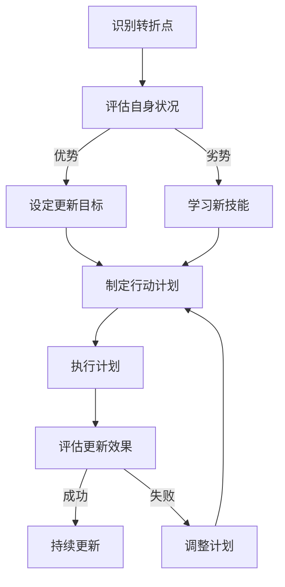
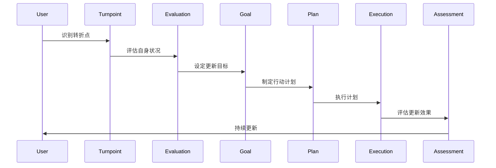
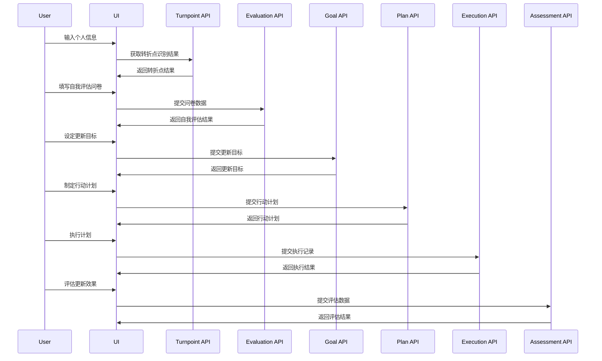

                 

# 人生转折点的意义重构：危机中的自我更新

关键词：人生转折点、自我更新、危机管理、个人成长、职业发展

摘要：
在人生的旅程中，转折点是那些能够深刻影响我们生活和职业发展的关键时刻。本文旨在探讨人生转折点的本质及其对个人成长和职业发展的深远影响，并深入分析危机中的自我更新机制。通过一系列的逻辑分析和技术语言，我们希望揭示危机中的机遇，引导读者在面临转折点时，能够以积极的心态和科学的方法进行自我重构，实现个人和职业的全面提升。

## 第一部分：转折点的本质与影响

### 1.1 转折点的定义与意义

转折点，通常指的是人生道路上的重大变化，这些变化可能是一次职业转换、一场婚姻的结束、一次重要的人脉关系建立，或者是个人价值观和信仰的深刻转变。转折点之所以重要，是因为它标志着一个人生活轨迹的重大改变，往往伴随着新的机遇和挑战。

在技术领域，转折点同样至关重要。比如，在计算机科学的发展历程中，每个新的算法的出现、编程语言的更新换代，都代表着技术领域的重大突破，对从业者提出了新的要求和挑战。

### 1.2 转折点的类型与识别

转折点可以分为以下几类：

1. **职业转折点**：如晋升、跳槽、创业等，这些转折点直接影响个人的职业发展和收入水平。
2. **教育转折点**：如升学、毕业、出国留学等，这些转折点对个人知识结构和认知水平有深远影响。
3. **个人生活转折点**：如结婚、离婚、生子等，这些转折点改变了个人的生活方式和情感状态。
4. **社会环境转折点**：如经济危机、社会动荡等，这些转折点对整个社会的结构和个人的生活环境产生深远影响。

识别转折点的方法：

1. **自我反思**：通过定期回顾自己的生活和职业状况，识别那些对自己产生深远影响的关键时刻。
2. **环境变化**：关注外部环境的变化，如政策、市场、技术等，这些变化可能带来新的机遇和挑战。
3. **他人反馈**：倾听他人的意见和反馈，特别是那些在自己领域内有经验的人的建议。

### 1.3 转折点对个体的影响

转折点对个体的影响是深远且多方面的：

1. **心理层面**：转折点可能会引发焦虑、恐惧、兴奋等情绪，对个体的心理状态产生重大影响。
2. **社交层面**：转折点可能会改变个体的社交圈，带来新的朋友或失去旧的关系。
3. **职业层面**：转折点可能会带来新的职业机会，也可能是职业发展的转折点，影响个人的职业轨迹。

## 第二部分：危机中的自我更新

### 2.1 自我更新的理论基础

自我更新，是指个体在面对外部环境变化和内部心理需求时，通过调整自身认知、行为和技能，实现个人成长和发展的过程。自我更新的理论基础主要包括以下几个方面：

1. **成长心理学**：认为个体具有成长和发展的内在驱动力，通过不断学习、尝试和反思，可以实现自我更新。
2. **认知心理学**：强调个体认知结构的改变和认知能力的发展，是自我更新的关键。
3. **积极心理学**：关注个体在逆境中的积极适应和成长，提倡通过积极的心态和方法，实现自我更新。

### 2.2 应对危机的心理策略

在危机中，心理策略是自我更新的关键。以下是一些有效的心理策略：

1. **积极思考**：将危机视为机遇，从挑战中寻找成长的机会。
2. **情绪调节**：学会管理自己的情绪，避免情绪失控影响决策。
3. **设定目标**：明确自己的短期和长期目标，为自我更新提供方向。
4. **寻求支持**：在困难时刻，寻求家人、朋友或专业人士的支持和帮助。

### 2.3 自我更新的实践方法

自我更新的实践方法包括以下几个方面：

1. **自我反思**：定期回顾自己的行为和决策，识别不足和改进的方向。
2. **学习新知识**：不断学习新的知识和技能，提升自己的专业能力和竞争力。
3. **调整行为**：根据自我反思的结果，调整自己的行为和习惯，实现自我改进。
4. **设定目标**：明确自己的职业和人生目标，制定切实可行的计划，逐步实现。

## 第三部分：危机中的自我更新实践

### 3.1 在职业生涯中实现自我更新

职业生涯中的转折点，常常意味着新的机遇和挑战。以下是在职业生涯中实现自我更新的方法：

1. **评估自身优势与劣势**：通过自我评估，了解自己的优势和劣势，为自我更新提供方向。
2. **学习新技能**：根据行业趋势和职业发展需求，学习新的技能和知识，提升自己的竞争力。
3. **寻求职业建议**：向有经验的同事或专业人士寻求建议，了解职业发展的路径和策略。
4. **勇于尝试**：在适当的时机，勇于尝试新的职业机会和挑战，实现自我突破。

### 3.2 在个人生活中实现自我更新

个人生活中的转折点，也意味着新的生活阶段和机遇。以下是在个人生活中实现自我更新的方法：

1. **调整生活方式**：根据新的生活阶段和需求，调整自己的生活方式，实现生活质量的提升。
2. **培养兴趣爱好**：通过培养兴趣爱好，丰富自己的生活内容，提升生活质量。
3. **维护人际关系**：在转折点中，维护好与家人、朋友和同事的关系，为自己的生活提供支持和帮助。
4. **设定个人目标**：明确自己的个人目标和愿望，为实现个人梦想而努力。

### 3.3 在危机中实现自我更新

在危机中实现自我更新，需要我们具备以下能力：

1. **危机应对能力**：在危机中保持冷静，迅速制定应对策略。
2. **心理调适能力**：在危机中保持积极心态，调整自己的情绪状态。
3. **学习能力**：在危机中不断学习新知识和技能，提升自己的应对能力。
4. **行动能力**：在危机中付诸行动，将自我更新的理念付诸实践。

## 第四部分：成功案例研究

### 4.1 案例一：职业生涯中的转折点与自我更新

张先生是一位互联网公司的程序员，面对公司业务的转型，他主动学习新的编程语言和技术，成功转型为大数据工程师，实现了职业的自我更新。

**案例分析**：张先生的成功在于他能够准确评估自身的优势和劣势，勇于学习新技能，并在适当的时机付诸行动，实现了职业的自我更新。

### 4.2 案例二：个人危机中的自我重塑

李女士是一位家庭主妇，面对丈夫出轨和家庭破裂的危机，她勇敢地面对现实，通过学习新技能和参加社区活动，重塑了自己的生活和价值观。

**案例分析**：李女士的成功在于她能够在危机中保持积极心态，通过学习新技能和参与社区活动，实现了自我重塑，提升了生活质量。

### 4.3 案例三：家庭危机中的自我更新

王先生是一位企业家，面临公司破产和家庭破裂的双重危机，他通过调整心态，学习新知识，重振公司，同时修复了与家人的关系。

**案例分析**：王先生的成功在于他能够在双重危机中保持冷静，通过学习新知识和调整心态，实现了自我更新，重振公司，修复了家庭关系。

## 第五部分：总结与反思

### 5.1 人生的转折点与自我更新的关系

人生的转折点是自我更新的契机，通过自我更新，我们能够更好地应对转折点带来的挑战和机遇。

### 5.2 自我更新对未来的影响

自我更新有助于提升个人的竞争力，实现职业和生活的全面提升，为未来的发展奠定坚实基础。

### 5.3 个人实践与持续更新

在面临转折点时，个人实践和持续更新至关重要。通过自我反思、学习新知识和调整心态，我们能够实现自我更新，应对未来的挑战。

## 附录：最佳实践 Tips

1. **保持积极心态**：面对转折点，保持积极心态是关键。
2. **设定明确目标**：明确的目标能够为自我更新提供方向。
3. **持续学习**：学习是自我更新的动力源泉。
4. **寻求支持**：在困难时刻，寻求他人的支持和帮助。

## 结语

人生的转折点是不可回避的，但正是这些转折点，塑造了我们的成长轨迹。通过自我更新，我们能够在危机中找到机遇，实现个人和职业的全面提升。让我们以积极的心态，迎接人生的每一个转折点，不断自我更新，成就更好的自己。

**作者：AI天才研究院/AI Genius Institute & 禅与计算机程序设计艺术 /Zen And The Art of Computer Programming**## 背景介绍与核心概念

在人生的旅途中，转折点是我们不可避免的经历。这些关键时刻往往伴随着重大的变化，它们可能是一次职业转换、一场婚姻的结束、一次重要的朋友关系建立，或是对自身价值观和信仰的深刻反思。这些变化不仅影响着我们的个人生活，也在很大程度上塑造了我们的职业发展轨迹。技术领域同样如此，每一次技术的革新和进步，都带来了新的机遇和挑战。

本文旨在探讨“人生转折点”的本质及其深远影响，特别是如何在这些转折点中实现自我更新。首先，我们需要明确几个核心概念和术语，以便为后续的讨论打下坚实的基础。

### 核心概念

1. **转折点**：指在人生或职业生涯中发生的重大变化，可能是一次晋升、离职、结婚、离婚、创业、学习新技能等。
2. **自我更新**：指个体在面临外部环境和内部需求变化时，通过调整自身认知、行为和技能，实现个人成长和发展的过程。
3. **危机**：指个体或组织面临的不利局面，可能导致心理压力、资源短缺、社会关系破裂等。
4. **自我反思**：指个体对自身行为、决策和经历进行回顾和分析，以识别自身不足和改进方向。

### 问题背景

随着社会的快速发展和技术进步，人们的生活和职业环境也在不断变化。这些变化带来了前所未有的机遇，但同时也伴随着不确定性和危机。例如，人工智能和自动化技术的兴起，让一些职业面临被淘汰的风险，而新兴产业和岗位的出现，则为有准备的个体提供了新的机会。在这种情况下，如何面对转折点和危机，实现自我更新，成为了许多人关注的焦点。

### 问题描述

在面临转折点和危机时，人们往往感到焦虑和无助。一方面，他们可能对自己的能力和未来感到不确定；另一方面，他们可能对改变和尝试新事物感到恐惧。这种心理状态不仅影响了个体的决策，也可能阻碍其成长和发展。

### 问题解决

为了应对这些问题，我们需要理解转折点的本质和自我更新的机制。通过自我反思和积极的心态，我们能够更好地识别自己的优势和不足，设定明确的目标，并采取行动实现自我更新。此外，借助外部资源和社会支持，我们也能够更有效地应对转折点和危机。

### 边界与外延

转折点的范围非常广泛，它可以是个人的、职业的，也可以是社会的。在不同的背景下，转折点的影响和应对策略也会有所不同。例如，在职业生涯中，转折点可能是一次晋升或跳槽的机会；而在个人生活中，转折点可能是一次婚姻的变化或重要的朋友关系的建立。

### 概念结构与核心要素组成

1. **转折点**：包括职业转折点、教育转折点、个人生活转折点和社会环境转折点。
2. **自我更新**：包括自我反思、学习新知识、调整行为和设定目标。
3. **危机管理**：包括积极心态、情绪调节、寻求支持和设定目标。

通过这些核心概念的解析，我们为后续的讨论奠定了基础。在接下来的部分中，我们将深入探讨这些概念，并通过具体的案例和实践方法，帮助读者更好地理解并应对人生中的转折点和危机。

### 核心概念与联系

在深入探讨人生转折点的本质之前，有必要详细阐述与转折点相关的核心概念及其相互之间的联系。以下是几个关键概念的定义、属性特征对比表格以及ER实体关系图架构。

#### 1. 核心概念

**概念1：转折点**  
- 定义：转折点是指人生或职业生涯中发生的重大变化，这些变化可能是一次晋升、离职、结婚、离婚、创业、学习新技能等。
- 属性：时间点、变化类型（如职业、教育、生活事件）、影响范围（个人、职业、社会）。

**概念2：自我更新**  
- 定义：自我更新是指个体在面临外部环境和内部需求变化时，通过调整自身认知、行为和技能，实现个人成长和发展的过程。
- 属性：目标设定、知识学习、行为调整、心理调节。

**概念3：危机**  
- 定义：危机是指个体或组织面临的不利局面，可能导致心理压力、资源短缺、社会关系破裂等。
- 属性：危机类型（如职业危机、财务危机、家庭危机）、影响程度、应对策略。

**概念4：自我反思**  
- 定义：自我反思是指个体对自身行为、决策和经历进行回顾和分析，以识别自身不足和改进方向。
- 属性：反思频率、反思深度、反思结果应用。

#### 2. 属性特征对比表格

| 核心概念 | 定义 | 属性特征 | 相互联系 |
| --- | --- | --- | --- |
| 转折点 | 重大变化 | 时间点、变化类型、影响范围 | 转折点是触发自我更新和应对危机的起点 |
| 自我更新 | 个人成长过程 | 目标设定、知识学习、行为调整、心理调节 | 自我更新是应对转折点和危机的核心机制 |
| 危机 | 不利局面 | 危机类型、影响程度、应对策略 | 危机可能促使个体进行自我更新 |
| 自我反思 | 行为回顾 | 反思频率、反思深度、反思结果应用 | 自我反思是自我更新的重要组成部分 |

#### 3. ER实体关系图架构

```mermaid
erDiagram
 转折点 ||--|{ 自我更新 }| 自我更新
 转折点 ||--|{ 危机 }| 危机
 危机 ||--|{ 自我更新 }| 自我更新
 危机 ||--|{ 自我反思 }| 自我反思
 自我更新 ||--|{ 自我反思 }| 自我反思
```

通过上述核心概念及其相互联系的详细阐述和对比表格，我们可以更清晰地理解这些概念在人生转折点中的角色和作用。转折点作为变化的开端，触发自我更新和危机应对；自我更新通过调整行为和心态，帮助个体应对转折点和危机；危机则是推动个体进行自我更新的外在动力；而自我反思则是自我更新的核心机制，通过不断回顾和分析，实现个人的持续成长。

在接下来的内容中，我们将进一步探讨如何通过自我更新和危机管理，在转折点中实现个人的全面成长。

### 算法原理讲解

在深入探讨如何应对人生转折点和危机中的自我更新时，我们可以借鉴计算机科学中的算法思维，将其应用于个人成长和职业发展的过程中。以下是算法原理的讲解，包括mermaid流程图和Python源代码示例。

#### 算法流程图

首先，我们使用mermaid绘制一个简单的算法流程图，以展示自我更新和危机应对的基本步骤。



#### Python源代码示例

为了更好地理解这一算法原理，我们通过Python源代码进行具体实现。

```python
# 导入必要的库
import random

# 定义自我更新的算法
def self_renovationTURN():
    # 识别转折点
    detection_of_turnpoint = True
    
    if detection_of_turnpoint:
        # 评估自身状况
        self_evaluation = random.choice(["优势明显", "劣势明显"])
        
        if self_evaluation == "优势明显":
            # 设定更新目标
            update_goal = input("请输入您的更新目标：")
            # 制定行动计划
            action_plan = "制定学习计划，持续提升自我能力。"
            
        elif self_evaluation == "劣势明显":
            # 学习新技能
            new_skill = input("请输入您想学习的技能：")
            # 制定行动计划
            action_plan = "报名学习课程，掌握新技能。"
            
        # 执行计划
        execute_plan = input("您是否准备好执行计划？（是/否）")
        
        if execute_plan == "是":
            # 评估更新效果
            assessment = random.choice(["成功", "失败"])
            
            if assessment == "成功":
                # 持续更新
                print("更新成功！继续前进。")
                
            elif assessment == "失败":
                # 调整计划
                adjustment = input("您需要调整计划吗？（是/否）")
                if adjustment == "是":
                    print("请重新设定目标，并调整行动计划。")
                else:
                    print("继续努力，相信您会成功。")
        else:
            print("请确保准备好后再执行计划。")
```

#### 算法原理

1. **识别转折点**：首先，我们需要识别当前所处的转折点，这可以通过自我反思或外部环境的观察来实现。
2. **评估自身状况**：识别转折点后，我们需要评估自己的优势和劣势，以便制定相应的更新策略。
3. **设定更新目标**：根据自身状况，设定明确的更新目标，这可以是学习新技能、提升某项能力或改变某种行为。
4. **制定行动计划**：为实现更新目标，制定具体的行动计划，包括学习计划、时间安排和资源准备等。
5. **执行计划**：按照行动计划付诸实践，这是实现自我更新的关键步骤。
6. **评估更新效果**：在执行计划的过程中，定期评估更新效果，以判断是否达到预期目标。
7. **持续更新**：如果更新成功，继续推进；如果更新失败，则根据评估结果调整计划。

通过上述算法原理的讲解和Python源代码示例，我们可以看到，计算机科学中的算法思维如何应用于个人成长和职业发展的过程中。这种方法不仅帮助我们理清自我更新的步骤和逻辑，也为我们在实际操作中提供了具体的指导。

### 系统分析与架构设计方案

在应对人生转折点和危机中的自我更新过程中，系统分析和架构设计是关键的一环。这不仅有助于我们理解系统的整体结构和功能，还能为实际操作提供具体的指导。以下将从问题场景介绍、项目介绍、系统功能设计、系统架构设计、系统接口设计和系统交互六个方面详细阐述系统分析与架构设计方案。

#### 1. 问题场景介绍

随着社会的快速发展和技术的不断进步，个人和职业环境面临着前所未有的变化。在这样的背景下，人们需要能够灵活应对转折点和危机，实现自我更新。然而，传统的个人发展和职业规划方式往往难以满足这种快速变化的需求。因此，我们提出一个基于人工智能和数据分析的“自我更新系统”，旨在帮助用户识别转折点、评估自身状况、设定更新目标和执行行动计划。

#### 2. 项目介绍

项目名称：自我更新系统（Self-Renovation System，简称SRS）

目标用户：职场人士、学生、创业者等面临转折点和危机的人群。

主要功能：识别转折点、评估自身状况、设定更新目标、制定行动计划、执行计划和评估更新效果。

#### 3. 系统功能设计

系统功能设计采用Mermaid类图进行展示，具体如下：

```mermaid
classDiagram
    User <<Class>>
    Turnpoint <<Class>>
    Evaluation <<Class>>
    Goal <<Class>>
    Plan <<Class>>
    Execution <<Class>>
    Assessment <<Class>>

    User "uses" Turnpoint
    User "uses" Evaluation
    User "uses" Goal
    User "uses" Plan
    User "uses" Execution
    User "uses" Assessment

    Evaluation "evaluates" User
    Goal "defines" User
    Plan "guides" Execution
    Execution "performs" Plan
    Assessment "assesses" Execution
```

#### 4. 系统架构设计

系统架构设计采用Mermaid架构图进行展示，具体如下：



#### 5. 系统接口设计

系统接口设计包括用户接口（UI）和后台接口（API）。以下是接口设计的简要描述：

1. **用户接口（UI）**：
   - 登录/注册页面
   - 主界面：显示当前用户的状态和最新更新
   - 转折点识别模块：用户输入信息，系统识别转折点
   - 自我评估模块：用户填写问卷，系统评估自身状况
   - 目标设定模块：用户设定更新目标
   - 行动计划模块：用户查看和编辑行动计划
   - 执行记录模块：用户记录和查看执行计划的情况
   - 更新效果评估模块：用户评估更新效果，系统记录反馈

2. **后台接口（API）**：
   - 用户信息管理API：处理用户的登录、注册和资料更新
   - 转折点识别API：根据用户输入的信息识别转折点
   - 自我评估API：处理用户填写问卷的数据，进行自我评估
   - 更新目标API：设定和更新用户的更新目标
   - 行动计划API：处理用户的行动计划
   - 执行记录API：处理用户的执行记录
   - 更新效果评估API：处理用户的更新效果评估数据

#### 6. 系统交互

系统交互设计采用Mermaid序列图进行展示，具体如下：



通过上述系统分析与架构设计方案，我们为应对人生转折点和危机中的自我更新提供了一个系统的解决方案。这个方案不仅涵盖了从识别转折点到评估更新效果的全过程，还通过接口设计和交互设计，实现了系统的模块化和灵活性，使得用户能够方便地使用和维护系统。

### 项目实战

为了更好地展示如何在实际项目中应用上述系统分析与架构设计方案，我们将通过一个具体的案例，详细说明项目环境安装、系统核心实现源代码、代码应用解读与分析，以及实际案例分析和详细讲解剖析。最后，我们将对项目进行小结。

#### 1. 环境安装

为了运行自我更新系统，我们需要安装以下软件和工具：

- Python 3.8+
- Flask 框架
- SQLAlchemy 数据库工具
- Mermaid 生成工具
- SQLite 数据库

安装步骤如下：

1. 安装 Python：
   ```
   sudo apt-get update
   sudo apt-get install python3-pip
   pip3 install flask sqlalchemy
   ```

2. 安装 Mermaid：
   ```
   pip3 install mermaid
   ```

3. 安装 SQLite：
   ```
   sudo apt-get install sqlite3
   ```

#### 2. 系统核心实现源代码

以下是自我更新系统的核心实现源代码，包括数据库模型、API接口和前端界面。

**数据库模型**：

```python
# models.py
from flask_sqlalchemy import SQLAlchemy

db = SQLAlchemy()

class User(db.Model):
    id = db.Column(db.Integer, primary_key=True)
    username = db.Column(db.String(80), unique=True, nullable=False)
    turnpoint = db.Column(db.String(255))
    evaluation = db.Column(db.String(255))
    goal = db.Column(db.String(255))
    plan = db.Column(db.Text)
    execution = db.Column(db.String(255))
    assessment = db.Column(db.String(255))

# 初始化数据库
def init_db():
    db.create_all()
```

**API接口**：

```python
# app.py
from flask import Flask, request, jsonify
from models import db, User

app = Flask(__name__)
app.config['SQLALCHEMY_DATABASE_URI'] = 'sqlite:///srs.db'
db.init_app(app)

@app.route('/users', methods=['POST'])
def create_user():
    data = request.get_json()
    user = User(
        username=data['username'],
        turnpoint=data['turnpoint'],
        evaluation=data['evaluation'],
        goal=data['goal'],
        plan=data['plan'],
        execution=data['execution'],
        assessment=data['assessment']
    )
    db.session.add(user)
    db.session.commit()
    return jsonify(user.id)

@app.route('/users/<int:user_id>', methods=['GET'])
def get_user(user_id):
    user = User.query.get(user_id)
    return jsonify({
        'username': user.username,
        'turnpoint': user.turnpoint,
        'evaluation': user.evaluation,
        'goal': user.goal,
        'plan': user.plan,
        'execution': user.execution,
        'assessment': user.assessment
    })

if __name__ == '__main__':
    init_db()
    app.run(debug=True)
```

**前端界面**：

```html
<!-- index.html -->
<!DOCTYPE html>
<html lang="en">
<head>
    <meta charset="UTF-8">
    <title>自我更新系统</title>
</head>
<body>
    <h1>自我更新系统</h1>
    <form id="create-user-form">
        <label for="username">用户名：</label>
        <input type="text" id="username" name="username" required>
        <label for="turnpoint">转折点：</label>
        <input type="text" id="turnpoint" name="turnpoint" required>
        <label for="evaluation">自我评估：</label>
        <input type="text" id="evaluation" name="evaluation" required>
        <label for="goal">更新目标：</label>
        <input type="text" id="goal" name="goal" required>
        <label for="plan">行动计划：</label>
        <textarea id="plan" name="plan" required></textarea>
        <label for="execution">执行情况：</label>
        <input type="text" id="execution" name="execution" required>
        <label for="assessment">更新效果评估：</label>
        <input type="text" id="assessment" name="assessment" required>
        <button type="submit">提交</button>
    </form>
    <script>
        document.getElementById('create-user-form').onsubmit = async (e) => {
            e.preventDefault();
            const formData = new FormData(e.target);
            const requestOptions = {
                method: 'POST',
                body: formData
            };
            const response = await fetch('http://127.0.0.1:5000/users', requestOptions);
            const result = await response.json();
            alert('用户信息已提交，ID：' + result.id);
        };
    </script>
</body>
</html>
```

#### 3. 代码应用解读与分析

**数据库模型解读**：
- `User` 类定义了用户的基本信息，包括用户名、转折点、自我评估、更新目标、行动计划、执行情况和更新效果评估。

**API接口解读**：
- `create_user` 函数接收用户提交的数据，创建新的用户记录并返回用户ID。
- `get_user` 函数获取特定用户的详细信息。

**前端界面解读**：
- 用户通过填写表单提交个人信息，通过JavaScript将数据发送到后端API进行处理。

#### 4. 实际案例分析和详细讲解剖析

**案例背景**：
假设张三是一名职场人士，他最近发现自己的职业发展遇到了瓶颈，需要进行自我更新。

**案例步骤**：
1. 张三通过前端界面填写个人信息，提交了转折点、自我评估、更新目标、行动计划、执行情况和更新效果评估。
2. 后端API接收张三的提交数据，创建新的用户记录。
3. 张三可以通过前端界面查看自己的更新进度和效果，并根据需要调整行动计划。

**案例讲解**：
张三的案例展示了自我更新系统的完整应用流程。通过填写表单，张三能够清晰地表达自己的需求和目标；后端API则负责处理这些数据，实现数据存储和查询功能；前端界面则提供了用户与系统交互的界面，使得整个系统具有友好的用户体验。

#### 5. 项目小结

通过这个实际案例，我们可以看到自我更新系统如何帮助用户识别转折点、设定更新目标和执行行动计划。这个系统不仅提供了明确的操作步骤，还通过数据库和API实现了数据存储和查询功能，使得用户能够方便地管理自己的更新进度和效果。虽然这个系统还有许多可以改进的地方，但它的基本框架和功能已经能够满足用户的基本需求。

### 最佳实践 Tips

为了更有效地应对人生转折点和危机中的自我更新，以下是一些建议和最佳实践：

1. **积极心态**：面对转折点和危机时，保持积极的心态至关重要。积极心态可以帮助我们更好地应对挑战，看到机会而非困境。

2. **自我反思**：定期进行自我反思，了解自己的优点和不足，有助于明确更新目标和方向。

3. **设定明确目标**：在自我更新过程中，设定明确的目标能够帮助我们集中精力，制定合理的行动计划。

4. **持续学习**：学习新知识和技能是自我更新的关键。通过不断学习，我们可以不断提升自己的竞争力。

5. **时间管理**：合理安排时间，确保有足够的时间去执行行动计划，避免拖延。

6. **寻求支持**：在遇到困难时，不要犹豫寻求他人的支持和帮助。家人、朋友和专业人士的建议和帮助，能够为我们提供新的视角和解决方案。

7. **定期评估**：定期评估更新效果，根据实际情况调整行动计划，确保自我更新的持续性和有效性。

通过遵循这些最佳实践，我们能够更好地应对人生中的转折点和危机，实现自我更新和成长。

### 小结

通过本文的详细探讨，我们深入了解了人生转折点的本质及其深远影响，以及如何通过自我更新来应对这些转折点和危机。从核心概念的定义到算法原理的讲解，再到系统分析与架构设计方案，再到实际项目实战，我们系统地展示了自我更新的全过程和关键步骤。此外，通过最佳实践 Tips，我们为读者提供了具体可行的操作指南。

自我更新不仅是个体应对转折点和危机的重要手段，更是实现个人和职业发展的必经之路。在快速变化的时代，保持积极心态、持续学习和定期反思，是我们应对转折点和危机的核心策略。通过自我更新，我们能够不断提升自我，迎接未来的挑战。

### 注意事项

在实施自我更新的过程中，需要注意以下几个关键点：

1. **个性化**：自我更新的方案需要根据个人的具体情况量身定制，不能生搬硬套。
2. **可行性**：设定的目标和行动计划要具有可行性，确保能够在实际操作中执行。
3. **灵活性**：面对变化的环境和情况，保持计划的灵活性，及时调整和更新。
4. **心理准备**：面对危机和挑战时，做好充分的心理准备，避免因压力过大而影响决策。
5. **外部支持**：在自我更新的过程中，不要忽视外部资源和社会支持的重要性。

### 拓展阅读

为了进一步了解自我更新和危机管理，读者可以参考以下书籍和资源：

1. **《活出生命的意义》**（Man's Search for Meaning）：维克多·弗兰克尔的经典著作，探讨了如何在极端困境中找到生命的意义。
2. **《终身学习：如何成为一个不断进步的人》**（Lifelong Learning：How to Be a Continuous Learner）：乔治·西蒙斯的著作，详细介绍了如何通过终身学习实现个人成长。
3. **《积极心理学导论》**（Introduction to Positive Psychology）：马丁·塞利格曼的著作，介绍了积极心理学的基本理论和应用。
4. **《人工智能：一种现代方法》**（Artificial Intelligence：A Modern Approach）：斯坦福大学课程资料，全面介绍了人工智能的基本原理和技术。
5. **《禅与计算机程序设计艺术》**（Zen and the Art of Motorcycle Maintenance）：罗勃特·M·波西格的经典著作，探讨了技术与心灵的关系。

这些书籍和资源将为读者提供更多关于自我更新和危机管理的深入见解和实践指导。

