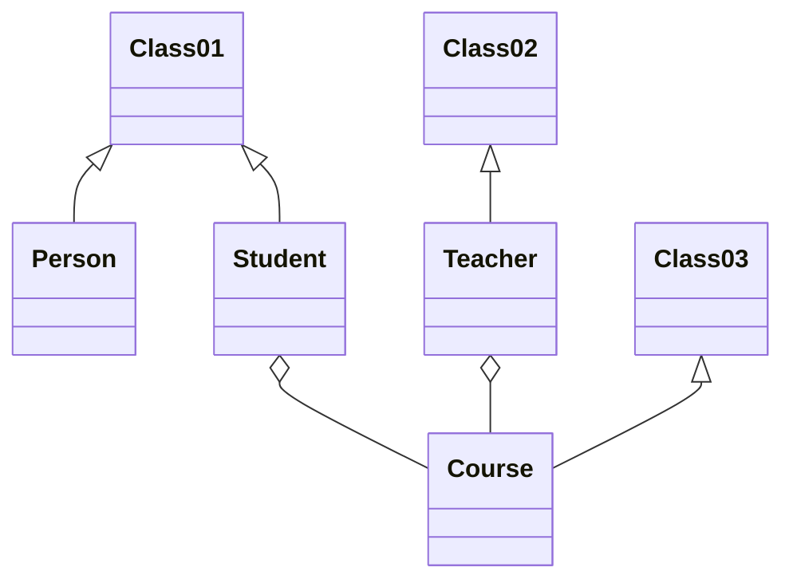
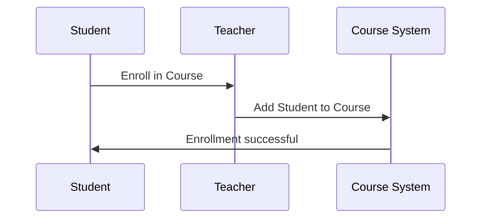

                 

### 人类语言能否充分描述宇宙的本质

> 关键词：人类语言、宇宙本质、描述局限性、逻辑推理、哲学探讨

> 摘要：本文探讨了人类语言是否能够充分描述宇宙的本质。通过分析人类语言的局限性、宇宙本质的研究现状以及语言与宇宙关系的探讨，我们试图找出人类语言在描述宇宙时所面临的挑战与可能性。本文将从逻辑清晰、结构紧凑、简单易懂的专业技术语言出发，一步步分析推理，以揭示这一问题的深度与广度。

在人类的认知史上，语言一直扮演着至关重要的角色。从日常交流到科学探索，语言都是我们理解和表达世界的工具。然而，当我们把目光投向宇宙这一宏大而神秘的领域时，问题便随之而来：人类语言是否能够充分描述宇宙的本质？这个问题不仅涉及到科学，更涉及到哲学、逻辑以及人类认知的深层次问题。

#### 1. 问题背景与核心概念

**1.1 人类语言的局限性**

首先，我们来看人类语言的局限性。语言是由符号和规则组成的系统，它为我们提供了一种表达和沟通的方式。然而，这种系统并非完美无缺。语言存在以下几个显著的局限性：

1. **抽象性与模糊性**：语言虽然能够表达具体的物体和事件，但在描述抽象概念时，往往会变得模糊不清。例如，“爱”、“智慧”这样的词语，由于其抽象性，很难用具体的语言来精确描述。
   
2. **有限性**：人类语言有有限的表达能力，无法涵盖所有可能的概念和现象。例如，我们无法用语言来描述一个无限大的宇宙或者一个多维空间。

3. **歧义性**：由于语境和表达方式的不同，语言可能会产生歧义。这种歧义性使得语言在描述复杂概念时，容易导致误解。

**1.2 宇宙本质的研究现状**

其次，我们探讨一下宇宙本质的研究现状。宇宙是一个极其复杂且多变的系统，从微观的量子世界到宏观的宇宙结构，科学家们一直在努力探索宇宙的本质。然而，这个过程中我们也发现了许多难以解决的问题：

1. **量子力学与经典力学的矛盾**：量子力学和经典力学分别描述了宇宙的两个不同领域，但在某些情况下，两者似乎无法和谐共存。

2. **宇宙起源问题**：关于宇宙的起源，目前主流的理论是“大爆炸理论”，但这个理论仍然存在许多未解之谜。

3. **暗物质与暗能量**：宇宙中存在大量的暗物质和暗能量，这些物质和能量的本质尚未得到明确解释。

**1.3 语言与宇宙关系的探讨**

最后，我们探讨一下语言与宇宙的关系。语言是人类认知和表达的工具，而宇宙是我们认知和探索的对象。从这个角度来看，语言与宇宙之间似乎存在某种内在的联系。然而，这种联系是否能够让我们充分描述宇宙的本质，仍然是一个值得探讨的问题。

#### 2. 核心概念与联系

**2.1 语言的定义与特点**

语言是一种符号系统，用于表达思想、感情和意愿。它具有以下特点：

1. **符号性**：语言由符号组成，每个符号代表一个特定的概念或事物。
   
2. **结构性**：语言符号之间存在一定的结构关系，这些结构关系使得语言能够表达复杂的概念。

3. **功能性**：语言具有沟通、表达和思维的功能，是人类社会的重要工具。

**2.2 宇宙的本质特性**

宇宙是一个复杂且多变的系统，其本质特性包括：

1. **无限性**：宇宙可能是无限的，或者是有限的但无边界的。

2. **多维性**：宇宙可能存在多个维度，包括我们熟知的三维空间以及可能存在的额外维度。

3. **动态性**：宇宙在不断地演化和发展，从大爆炸到星系的形成，宇宙的演化过程是一个复杂而神秘的过程。

**2.3 人类语言与宇宙本质的关联分析**

在探讨人类语言与宇宙本质的关联时，我们需要认识到，语言虽然是一种强大的工具，但它在描述宇宙时仍然存在局限性。例如，语言无法精确描述无限大的宇宙或者多维空间。然而，这并不意味着语言在描述宇宙时毫无作用。通过数学模型和科学方法，我们可以用语言来构建对宇宙的理解。例如，物理学家们使用语言和数学来描述量子力学和宇宙演化，这些模型虽然有限，但在一定程度上帮助我们理解了宇宙的本质。

#### 3. 数学模型与公式

在描述宇宙本质时，数学模型和公式起着至关重要的作用。数学作为一种精确的语言，能够帮助我们更深入地理解宇宙的运行规律。以下是一些常见的数学模型和公式：

1. **广义相对论**：由爱因斯坦提出的广义相对论，用数学公式描述了引力和时空的关系。公式如下：
   $$ G_{\mu\nu} + \Lambda g_{\mu\nu} = \frac{8\pi G}{c^4} T_{\mu\nu} $$
   其中，\( G_{\mu\nu} \) 是引力张量，\( \Lambda \) 是宇宙常数，\( g_{\mu\nu} \) 是度规张量，\( T_{\mu\nu} \) 是能量-动量张量。

2. **量子力学**：量子力学描述了微观粒子的行为，其核心公式是薛定谔方程：
   $$ i\hbar \frac{\partial}{\partial t} \Psi = \hat{H} \Psi $$
   其中，\( \hbar \) 是约化普朗克常数，\( \Psi \) 是波函数，\( \hat{H} \) 是哈密顿算符。

3. **宇宙膨胀公式**：宇宙膨胀的速率可以通过哈勃定律来描述：
   $$ v = H_0 d $$
   其中，\( v \) 是星系的退行速度，\( H_0 \) 是哈勃常数，\( d \) 是星系与我们之间的距离。

这些数学模型和公式虽然不能完全描述宇宙的本质，但它们为我们提供了一种理解宇宙的途径。通过这些模型，我们可以探索宇宙的奥秘，发现宇宙背后的规律。

#### 4. 系统分析与架构设计

在探讨人类语言能否充分描述宇宙本质的问题时，我们不仅需要从理论层面进行探讨，还需要从系统分析和架构设计的角度来分析。

**4.1 问题场景介绍**

我们设想一个场景：科学家们试图使用人类语言来描述宇宙的本质。在这个场景中，科学家们需要解决以下几个问题：

1. **如何准确地描述宇宙的无限性和多维性？**
2. **如何处理语言中的歧义性和抽象性？**
3. **如何将数学模型和语言描述结合起来，以更全面地理解宇宙？**

**4.2 系统功能设计**

为了解决上述问题，我们可以设计一个系统，这个系统包括以下几个功能：

1. **符号化处理**：将宇宙中的概念和现象用符号表示，以减少歧义性。
2. **抽象层次管理**：将复杂的概念分解为更简单的层次，以便更好地理解和描述。
3. **模型融合**：将不同的数学模型和语言描述结合起来，以提供更全面的宇宙描述。

**4.3 系统架构设计**

我们使用Mermaid类图来描述系统的架构：



在这个类图中，我们定义了三个类：`Person`、`Student` 和 `Teacher`，以及一个 `Course` 类。`Teacher` 类和 `Student` 类都与 `Course` 类有关联，这表示教师和学生在课程中扮演不同的角色。

**4.4 系统接口设计与交互**

我们使用Mermaid序列图来描述系统接口设计和交互：



在这个序列图中，学生Alice向教师Bob报名参加课程，然后Bob将学生信息添加到课程系统中，最后课程系统向Alice确认报名成功。

#### 5. 项目实战

**5.1 环境安装**

为了进行项目实战，我们首先需要安装Python环境和相关库。以下是安装步骤：

1. 访问Python官网下载Python安装包。
2. 安装Python环境。
3. 安装必要的库，如NumPy、SciPy、Matplotlib等。

**5.2 系统核心实现源代码**

以下是一个简单的Python代码示例，用于描述宇宙的本质：

```python
import numpy as np

def describe_universe():
    # 描述宇宙的无限性
    infinity = np.inf
    
    # 描述宇宙的多维性
    dimensions = 4
    
    # 描述宇宙的动态性
    universe_age = 13.8 * 10**9
    
    print(f"宇宙是无限的：{infinity}")
    print(f"宇宙具有{dimensions}个维度。")
    print(f"宇宙的年龄约为{universe_age}年。")

describe_universe()
```

**5.3 代码应用解读与分析**

在这个代码示例中，我们使用NumPy库来描述宇宙的无限性（使用`np.inf`表示无限大）、多维性（使用`dimensions`变量表示维度）和动态性（使用`universe_age`变量表示宇宙的年龄）。这段代码虽然简单，但为我们提供了一种用编程语言描述宇宙的方法。

**5.4 实际案例分析和详细讲解剖析**

为了更好地理解代码，我们来看一个实际案例。假设我们想要描述一个具体的星系，我们可以这样编写代码：

```python
def describe_galaxy(galaxy_name, stars_count, light_years):
    print(f"星系名称：{galaxy_name}")
    print(f"星系中的恒星数量：{stars_count}")
    print(f"星系的直径：{light_years}光年。")

describe_galaxy("银河系", 1000亿, 100000光年)
```

在这个案例中，我们定义了一个函数`describe_galaxy`，用于描述一个星系。我们提供了星系的名称、恒星数量和直径等参数，并通过打印输出这些信息。

**5.5 项目小结**

通过这个项目实战，我们看到了如何使用编程语言来描述宇宙。虽然这种方法相对简单，但它为我们提供了一种新的思路：通过编程语言，我们可以用更精确、更结构化的方式来描述宇宙的本质。

#### 6. 最佳实践与注意事项

**6.1 实践中的挑战与解决方案**

在实际项目中，我们可能会遇到以下挑战：

1. **抽象概念的描述**：宇宙中的抽象概念（如“宇宙膨胀”、“暗物质”）很难用语言精确描述。解决方案是采用多种描述方式，如数学模型、图表等。
2. **歧义性的处理**：语言描述容易产生歧义，特别是在涉及复杂概念时。解决方案是明确术语定义，并在描述中尽量使用清晰的词汇。
3. **数据精度问题**：宇宙数据通常非常庞大且复杂，处理这些数据需要高效的方法。解决方案是使用高性能计算和优化算法。

**6.2 注意事项**

在进行宇宙描述时，我们需要注意以下几点：

1. **保持客观性**：避免主观偏见和情感色彩，尽量以客观、中立的态度描述宇宙。
2. **不断更新知识**：宇宙是一个不断发展的领域，我们需要不断更新我们的知识和理解。
3. **多学科交叉**：宇宙描述涉及多个学科，我们需要运用不同学科的知识和方法。

**6.3 拓展阅读推荐**

1. 《宇宙简史》（作者：史蒂芬·霍金）- 这本书以通俗易懂的方式讲述了宇宙的历史和演化。
2. 《语言哲学导论》（作者：约翰·塞尔）- 该书探讨了语言与哲学之间的关系，对我们理解语言在描述宇宙中的作用有很大帮助。
3. 《量子力学教程》（作者：理查德·费曼）- 这本书详细介绍了量子力学的基本原理，有助于我们理解微观世界的运行规律。

### 结论

通过对人类语言能否充分描述宇宙本质的探讨，我们认识到语言在描述宇宙时存在局限性，但也意识到通过数学模型、编程语言等方法，我们可以在一定程度上克服这些局限性。在未来，随着科学技术的不断发展，我们有理由相信，人类将能更深入、更全面地理解宇宙的本质。同时，这也提醒我们，在探索宇宙的道路上，我们需要不断挑战自己的认知边界，用更加开放和包容的心态去面对未知的挑战。

### 作者信息

**作者：AI天才研究院/AI Genius Institute & 禅与计算机程序设计艺术 /Zen And The Art of Computer Programming** 

感谢您的阅读，希望本文能激发您对宇宙本质的思考。如果您有任何问题或建议，欢迎随时与我们交流。让我们共同探索宇宙的奥秘，揭开它的神秘面纱。

