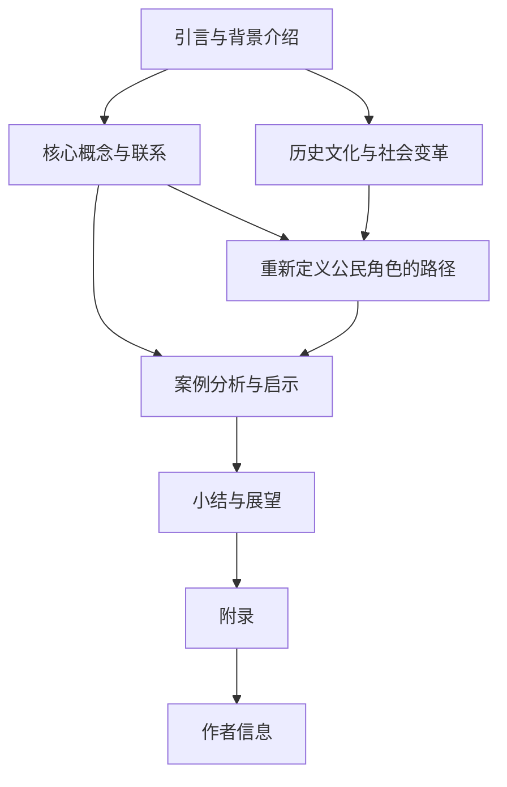
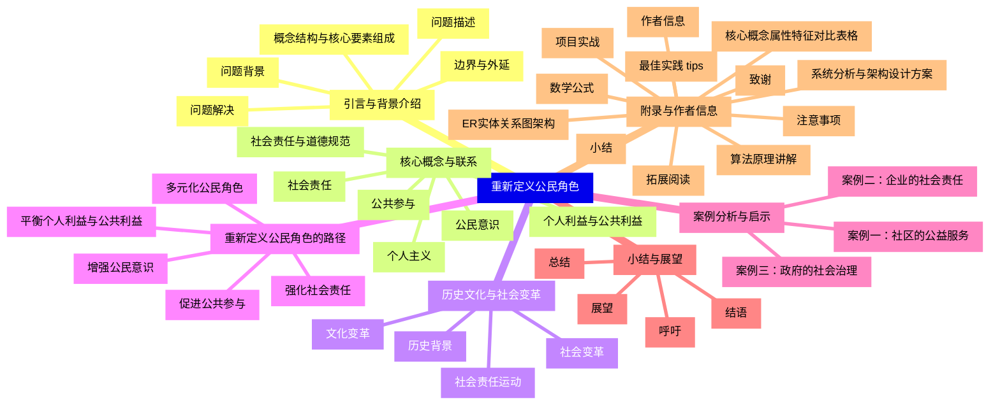

                 

### 引言与背景介绍

在当今快速发展的社会中，个人主义与社会责任之间的动态平衡正日益成为关注的焦点。个人主义，即个体自由和权利至上的价值观，强调个体追求自我实现和幸福。而社会责任，则关注个体如何在更大范围内贡献于社会的福祉。这种转变不仅影响个体的生活方式，也深刻塑造了社会结构和公共文化。

**问题背景**

随着全球化的推进和信息技术的飞速发展，社会结构和人们的生活方式发生了深刻变化。全球化使不同文化、价值观和生活方式相互交融，带来了前所未有的机遇和挑战。信息技术的发展，尤其是互联网的普及，打破了时间和空间的限制，使信息传播更加迅速，个体获取资源的机会更加平等。然而，这些变化也带来了新的问题，如社会不平等、环境破坏和道德困境等。

在这种背景下，个人主义与社会责任的平衡成为一个关键议题。个人主义过度可能导致社会冷漠和利益冲突，而社会责任过度则可能限制个体自由和创造力。因此，如何在个人利益和社会责任之间找到平衡，成为现代社会亟需解决的问题。

**问题描述**

公民角色是指个体在社会中承担的职责和角色。传统上，公民角色主要涉及政治参与、法律遵从和社会贡献等方面。然而，随着社会的变迁，公民角色的内涵和外延也在不断扩展。例如，现代公民不仅需要参与选举和政治活动，还需要关注环境保护、社会公正和文化传承等方面。

如何从个人主义向社会责任转变，重新定义公民角色，成为当前社会的重要课题。这个问题涉及到多个层面，包括个体心理、社会制度和文化传统等。重新定义公民角色不仅需要个体层面的觉醒和行动，还需要社会层面的支持和引导。

**问题解决**

本书旨在探讨从个人主义到社会责任的转变，重新定义公民角色的必要性和路径。通过分析历史、文化和社会变革，为读者提供一种新的视角，以应对现代社会面临的挑战。具体来说，本书将探讨以下内容：

1. **核心概念与联系**：介绍个人主义、社会责任、公民意识、公共参与等核心概念，并分析它们之间的相互关系。

2. **历史文化与社会变革**：回顾历史上的公民角色演变，探讨文化和社会变革对公民角色的影响。

3. **重新定义公民角色的路径**：探讨增强公民意识、促进公共参与、强化社会责任和平衡个人利益与公共利益的路径。

4. **案例分析与启示**：通过具体案例，分析重新定义公民角色的实践效果，为读者提供启示。

**边界与外延**

本书讨论的公民角色包括但不限于政治、经济、文化和社会等领域的职责和角色。同时，本书也将探讨个体与群体、传统与现代、个人与社会等关系的互动与平衡。在探讨过程中，我们将注重实际操作和理论分析的结合，力求为读者提供全面、深入的指导。

**概念结构与核心要素组成**

公民角色的重新定义涉及多个核心概念，包括个人主义、社会责任、公民意识、公共参与等。这些概念相互关联，共同构成了公民角色的核心要素。例如，个人主义强调个体自由和权利，社会责任则关注个体对社会的责任和义务。公民意识是公民角色的基础，公共参与是公民行动的体现。通过这些核心概念的相互作用，我们可以重新定义公民角色，使其更适应现代社会的需求。

**总结**

从个人主义到社会责任的转变，不仅是社会发展的必然趋势，也是个体成长的必经之路。重新定义公民角色，不仅有助于提升个体的社会责任感，也有助于构建一个更加和谐和可持续的社会。通过本书的探讨，我们希望能够为读者提供一种新的思考方式，以应对现代社会中的各种挑战。希望读者能够在阅读本书的过程中，获得深刻的启示和实用的指导。

---

在接下来的章节中，我们将逐步深入探讨从个人主义到社会责任的转变，重新定义公民角色的具体路径和方法。希望通过本书的探讨，能够为读者提供一种新的视角，以更好地理解和应对现代社会的挑战。让我们开始这次探索之旅吧！### 核心概念与联系

在重新定义公民角色的过程中，理解并分析核心概念之间的联系是至关重要的。本文将重点探讨个人主义、社会责任、公民意识、公共参与等核心概念，并分析它们之间的相互关系。

**个人主义**

个人主义是一种强调个体自由、独立和权利的价值观。它主张个体在追求自我实现和幸福的过程中，应享有最大程度的自由和权利。个人主义的核心在于个体自主决策和自我管理，强调个体对个人利益的最大化追求。个人主义不仅影响个体的行为和生活方式，也对整个社会的运行机制产生深远影响。

个人主义的一个重要特点是强调个体的独特性和多样性。在个人主义价值观的影响下，社会鼓励个体探索自我，发挥个人潜力，追求个性化的发展。这种价值观鼓励创新和竞争，推动社会的进步和繁荣。

**社会责任**

社会责任则强调个体在社会中应承担的义务和责任。它不仅涉及道德层面的要求，还涉及到法律、社会规范和制度层面的规定。社会责任要求个体在追求个人利益的同时，也要考虑社会整体的利益，并为之做出贡献。社会责任的核心在于个体对社会福祉的关注和维护，强调个体与社会的相互依存关系。

社会责任的表现形式多种多样，包括参与社会公益活动、遵守法律法规、支持公共利益、关心环境保护等。社会责任不仅是一种道德要求，也是社会运行的重要基础。通过履行社会责任，个体可以增强自身的道德素养和社会地位，同时也有助于构建一个更加和谐和可持续的社会。

**个人主义与社会责任的平衡**

个人主义和社会责任并非对立的概念，而是需要平衡和协调的关系。在现代社会中，个人主义和社会责任的平衡是实现社会和谐与个体自由的关键。

一方面，个人主义为个体提供了追求自我实现和幸福的动力。个体在追求个人利益的过程中，往往能够激发创新和创造力，推动社会的进步和发展。然而，过度追求个人利益可能导致社会不公、资源分配不均和道德沦丧等问题。

另一方面，社会责任为个体提供了社会约束和道德指导。通过履行社会责任，个体不仅能够维护社会整体的利益，也能够增强自身的道德素养和社会责任感。然而，过度强调社会责任可能限制个体的自由和创造力，阻碍社会的创新和进步。

因此，在重新定义公民角色的过程中，需要找到个人主义和社会责任的平衡点。这要求个体在追求个人利益的同时，也要关注社会的整体利益，并为之做出贡献。具体来说，可以通过以下几种方式实现个人主义和社会责任的平衡：

1. **个体自主与社会支持**：个体应享有充分的自由和权利，但同时需要社会提供必要的支持和资源，以帮助个体更好地履行社会责任。

2. **利益共享与责任共担**：个体应积极参与社会事务，分享社会资源，并承担相应的社会责任。通过共享利益和共担责任，可以实现个人利益和社会利益的统一。

3. **法律规范与道德引导**：社会应通过法律和道德规范来引导个体行为，既保障个体的自由和权利，又促进个体履行社会责任。

**公民意识与公共参与**

公民意识是指个体对社会和国家认同感和责任感的认识。它是公民角色的基础，也是个体履行社会责任的前提。公民意识包括对国家法律、社会规范和公共利益的尊重，以及对国家和社会事务的积极参与。

公共参与是指个体通过参与社会事务和公共决策，表达自己的观点和利益，为社会的进步和发展做出贡献。公共参与是公民意识的具体体现，也是个体社会责任的履行方式。

公民意识和公共参与的关系是相互促进的。公民意识可以激发个体的公共参与热情，而公共参与则可以增强个体的公民意识。通过公共参与，个体不仅能够提升自身的道德素养和社会责任感，也能够更好地了解社会的需求和问题，为社会的改革和发展提供有益的建议。

**社会责任与道德规范**

社会责任不仅是一种道德要求，也是一种社会规范。它要求个体在行为上遵循一定的道德原则和规范，如诚实、公正、公平、尊重他人等。道德规范是社会责任的重要组成部分，它为个体行为提供了指导和约束。

在履行社会责任的过程中，个体不仅需要遵守法律和制度，还需要具备良好的道德品质。道德规范可以引导个体在面对道德困境时做出正确的选择，促进社会的公平和正义。通过遵守道德规范，个体可以增强自身的道德素养和社会信任，为社会的和谐与进步贡献力量。

**个人利益与公共利益**

在重新定义公民角色的过程中，需要平衡个人利益与公共利益。个人利益是指个体在追求自我实现和幸福过程中所获得的利益，而公共利益则是指整个社会所享有的利益。

个人利益与公共利益的平衡是实现社会和谐与可持续发展的关键。在追求个人利益的过程中，个体应考虑到社会整体的利益，不应以牺牲公共利益为代价来追求个人利益。同样，社会也应保障个体的合法权益，为个体的自由和创造提供必要的支持和保障。

为了实现个人利益与公共利益的平衡，可以采取以下几种措施：

1. **公平正义的制度设计**：通过公平正义的制度设计，保障个体的合法权益，同时实现社会整体利益的最大化。

2. **社会责任教育的普及**：通过社会责任教育，提高个体的社会责任感和公共参与意识，使他们更加关注公共利益。

3. **公共利益导向的政策制定**：政府和社会组织应制定公共利益导向的政策，引导个体行为，促进个人利益与公共利益的统一。

**总结**

个人主义和社会责任是重新定义公民角色的核心概念。个人主义强调个体自由和权利，社会责任则关注个体对社会的责任和义务。通过分析个人主义与社会责任的平衡、公民意识与公共参与的关系，以及社会责任与道德规范、个人利益与公共利益的关系，我们可以更好地理解公民角色的内涵和作用。

在现代社会中，重新定义公民角色，不仅有助于提升个体的社会责任感，也有助于构建一个更加和谐和可持续的社会。通过增强公民意识、促进公共参与、强化社会责任和平衡个人利益与公共利益，我们可以实现个人与社会之间的良性互动，推动社会的进步和发展。

---

在接下来的章节中，我们将进一步探讨历史文化与社会变革对公民角色的影响，以及如何通过具体路径重新定义公民角色。希望这些讨论能够为读者提供更深入的思考和理解，以应对现代社会中的各种挑战。### 历史文化与社会变革

**历史背景**

从古代到现代，公民角色的定义经历了多次变革。古代社会以封建制度为主，个体在政治和社会生活中扮演的角色受到严格的等级和地位的束缚。在封建社会中，公民角色主要集中在服从统治者、履行土地义务和参与宗教活动等方面。这种角色定义强调的是个体的服从和奉献，而缺乏对个体权利和自由的重视。

随着资本主义的发展，个人主义开始崭露头角。17世纪至19世纪，西方国家经历了工业革命和资本主义崛起，个体从封建制度的束缚中逐渐解放出来。个人主义强调个体的自由、权利和自我实现，公民角色也随之发生变化。个体开始参与政治活动，争取选举权和言论自由，并开始关注公共事务。

20世纪初，随着全球化和信息技术的兴起，社会结构和文化发生了新的变化。全球化使得不同国家和文化之间的交流变得更加频繁，这导致了文化多样性和价值观念的冲突与融合。信息技术的发展，特别是互联网的普及，打破了传统的时间和空间限制，使个体获取信息和资源的机会更加平等。这些变化对公民角色产生了深远的影响。

**文化变革**

全球化带来了文化多样性的挑战和机遇。不同文化之间的碰撞和融合，使得个体对公民角色的认识变得更加复杂。一方面，全球化促进了文化交流和理解，使个体能够更好地了解其他文化和社会。另一方面，全球化也可能导致文化同质化，使个体在面对多元文化时感到困惑和不适。

在这种背景下，现代公民角色需要具备跨文化理解和沟通能力。个体不仅要关注本国的文化和社会问题，还要关注全球性问题，如气候变化、国际贸易和人权等。这种跨文化的公民角色要求个体具备更加广阔的视野和开放的心态，以适应不断变化的世界。

**社会变革**

现代社会的发展，尤其是信息技术和互联网的兴起，深刻改变了人们的生活方式和社会结构。信息技术的发展使得信息传播更加迅速和便捷，个体获取知识和资源的途径更加多样化。互联网的普及打破了传统媒体的垄断，使个体能够更加自由地表达自己的观点和参与公共事务。

这些变化对公民角色提出了新的要求。现代公民不仅需要具备信息素养和批判性思维，还需要积极参与社会事务和公共决策。信息技术的发展使得公共参与变得更加便捷和高效，个体可以通过网络平台参与政治讨论、提出建议和参与社会运动。这种新型的公共参与方式，不仅增强了公民的社会责任感，也提高了社会的透明度和民主性。

**社会责任运动**

社会责任运动是现代社会对公民角色提出的新要求。企业、政府和非政府组织都在推动社会责任的实现，以期构建一个更加公正和和谐的社会。社会责任运动涵盖了环境保护、社会公正、人权保护、公益慈善等多个方面。

企业作为社会的重要成员，需要承担更多的社会责任。现代企业不仅追求经济效益，还要关注环境保护和社会福祉。通过实施绿色生产、支持公益项目和参与社会公益活动，企业可以提升自身的品牌形象，同时也为社会的发展做出贡献。

政府在社会责任运动中扮演着关键角色。政府需要通过法律法规和政策引导，推动社会责任的实现。政府可以通过制定环保法规、推动社会公正和实施公益项目，来促进社会的可持续发展。

非政府组织（NGO）在社会责任运动中发挥着重要作用。NGO通常关注一些政府和企业无法或不愿意关注的问题，如人权、环境保护和社会公正等。通过倡导、宣传和实施具体的公益项目，NGO可以推动社会责任的实现，提高社会的道德水平和公共意识。

**总结**

历史文化与社会变革对公民角色产生了深远的影响。从古代的封建社会到现代的全球化社会，公民角色的定义和内涵在不断演变。现代公民角色不仅需要具备传统的政治参与和法律遵从，还需要关注环境保护、社会公正和跨文化交流等方面。

社会责任运动是现代社会对公民角色提出的新要求。企业、政府和非政府组织都在推动社会责任的实现，以期构建一个更加公正和和谐的社会。通过增强公民意识、促进公共参与和履行社会责任，我们可以重新定义公民角色，使其更好地适应现代社会的需求。

在接下来的章节中，我们将探讨如何通过具体路径实现公民角色的重新定义，包括增强公民意识、促进公共参与、强化社会责任和平衡个人利益与公共利益等方面的措施。希望这些讨论能够为读者提供更具体的指导，以应对现代社会中的各种挑战。### 重新定义公民角色的路径

重新定义公民角色的路径是一个复杂而多元的过程，涉及到个体觉醒、社会支持、制度保障等多方面的因素。以下将从增强公民意识、促进公共参与、强化社会责任和平衡个人利益与公共利益四个方面，探讨重新定义公民角色的具体路径。

**增强公民意识**

公民意识是重新定义公民角色的基础。一个具有高度公民意识的个体，不仅会主动参与社会事务，还会自觉履行社会责任。为了增强公民意识，可以从以下几个方面入手：

1. **教育**：教育是培养公民意识的重要途径。学校和社会应加强公民教育，引导学生了解国家法律、社会规范和公共事务，培养他们的社会责任感。

2. **宣传**：通过媒体、网络和社会活动，广泛宣传公民意识的重要性，提高公众对公共事务的关注度。

3. **培训**：针对成年人，可以开展公民意识培训，帮助他们更好地理解社会问题，提高参与公共事务的能力。

4. **激励**：通过表彰和奖励积极参与公共事务的个体，激励更多人关注和参与社会事务。

**促进公共参与**

公共参与是公民角色的具体体现，是实现社会公平和民主的重要手段。为了促进公共参与，可以采取以下措施：

1. **简化参与流程**：简化参与公共事务的流程，降低参与门槛，使更多人能够方便地参与到公共事务中。

2. **提供信息支持**：通过互联网、公共图书馆等渠道，提供丰富的信息和资源，帮助公民更好地了解公共事务。

3. **建立多元参与平台**：建立多元化、多样化的参与平台，如在线论坛、公民议会等，为公民提供多种参与途径。

4. **培养参与能力**：通过培训、讨论和实践活动，提高公民的公共参与能力，使他们能够更好地表达自己的观点和利益。

**强化社会责任**

强化社会责任是重新定义公民角色的关键。个体在追求个人利益的同时，应考虑到社会的整体利益。为了强化社会责任，可以从以下几个方面入手：

1. **法律法规**：通过制定和实施法律法规，明确个体应承担的社会责任，对不履行社会责任的个体进行惩戒。

2. **道德规范**：通过宣传和弘扬道德规范，引导个体自觉履行社会责任，如诚实、公正、公平、尊重他人等。

3. **企业责任**：鼓励企业承担社会责任，通过企业社会责任报告、环保项目等方式，提升企业的社会责任感。

4. **社会组织**：支持社会组织参与社会责任的实现，如慈善机构、环保组织等，通过具体的公益项目，提升社会的整体社会责任感。

**平衡个人利益与公共利益**

在重新定义公民角色的过程中，平衡个人利益与公共利益是至关重要的。以下措施可以帮助实现这一平衡：

1. **公平正义的制度设计**：通过公平正义的制度设计，保障个体的合法权益，同时实现社会整体利益的最大化。

2. **社会责任教育**：通过社会责任教育，提高个体的社会责任感和公共利益意识，使他们更加关注公共利益。

3. **公共利益导向的政策制定**：政府和社会组织应制定公共利益导向的政策，引导个体行为，促进个人利益与公共利益的统一。

4. **利益共享与责任共担**：通过利益共享和责任共担，实现个人利益与公共利益的平衡。例如，通过税收制度，将个体的一部分收入用于公共服务和社会保障，实现公共利益的实现。

**总结**

重新定义公民角色是一个长期而复杂的过程，需要个体、社会和制度的共同努力。通过增强公民意识、促进公共参与、强化社会责任和平衡个人利益与公共利益，我们可以重新定义公民角色，使其更好地适应现代社会的需求。希望这些具体路径能为读者提供有益的参考，以推动社会的进步和发展。

在接下来的章节中，我们将通过具体案例，分析重新定义公民角色的实践效果，并探讨其中存在的挑战和问题。希望这些案例能够为读者提供更加深入的启示和思考。### 案例分析与启示

通过分析不同领域的具体案例，我们可以更好地理解如何重新定义公民角色，并在实践中实现个人主义和社会责任的平衡。以下是几个具有代表性的案例。

**案例一：社区的公益服务**

在某社区，居民们自发组织了一系列公益活动，如环保宣传、老年人关怀、儿童教育和社区建设等。社区组织通过定期的会议、志愿者培训和活动计划，鼓励居民积极参与社区事务。这种社区参与的例子展示了如何在日常生活中重新定义公民角色。

**具体实践：**

1. **居民自治**：社区居民通过自选委员会，制定社区活动和规划，增强了居民的参与感和责任感。

2. **志愿服务**：居民志愿者组织清洁街道、帮助孤寡老人、开展环保活动，提升了社区的整体环境和社会和谐。

3. **资源共享**：社区建立共享厨房和花园，鼓励居民共同参与，共享资源，增强社区凝聚力。

**启示：**

- **增强公民意识**：通过社区活动，居民认识到自己不仅是社区的一员，更是社区发展的推动者。

- **促进公共参与**：居民参与社区事务，有助于提高公共参与意识，增强公共事务的透明度和民主性。

- **强化社会责任**：居民通过志愿服务，不仅帮助了他人，也提高了自身的社会责任感。

**案例二：企业的社会责任**

某知名跨国公司在其全球运营中，积极履行社会责任，通过环境保护、公益捐赠和社会福利项目，对所在社区和社会做出贡献。这家公司不仅注重企业盈利，还强调可持续发展和社会责任。

**具体实践：**

1. **环保措施**：公司投入大量资源，采用绿色生产技术和可再生能源，减少环境污染。

2. **公益捐赠**：公司每年捐赠大量资金和物资，支持教育、医疗和环保等公益事业。

3. **员工参与**：鼓励员工参与公司社会责任项目，通过志愿服务和公益行动，提升员工的公民意识和社会责任感。

**启示：**

- **企业责任**：企业作为社会的重要成员，应承担起更多的社会责任，通过实际行动改善社会环境。

- **利益共享与责任共担**：企业通过社会责任项目，与社区和社会建立良好的合作关系，实现利益共享和责任共担。

- **个人利益与公共利益**：企业的社会责任实践，不仅提升了企业的社会形象，也促进了公共利益，实现了个人利益与公共利益的平衡。

**案例三：政府的社会治理**

某城市政府推出了创新的社会治理模式，通过信息化手段，提高公共服务水平，增强社会治理效能。

**具体实践：**

1. **智能公共服务**：政府利用大数据和人工智能技术，提供个性化的公共服务，提高服务效率。

2. **公众参与**：政府通过在线平台，鼓励公众参与政策制定和公共事务讨论，提高公共决策的透明度和民主性。

3. **社区治理**：政府与社区合作，建立社区治理委员会，推动社区自治，增强社区凝聚力。

**启示：**

- **技术创新**：利用先进技术，提高公共服务质量和效率，是实现社会治理现代化的重要途径。

- **公众参与**：通过公众参与，政府可以更好地了解民众需求和意见，提高公共决策的科学性和民主性。

- **多元合作**：政府与社区、企业、社会组织等多元主体合作，形成社会治理的合力，提升社会治理效能。

**总结**

通过上述案例，我们可以看到，从个人主义到社会责任的转变，需要政府、企业和社会的共同努力。通过增强公民意识、促进公共参与、强化社会责任和平衡个人利益与公共利益，可以重新定义公民角色，实现社会的和谐与可持续发展。

**挑战与问题**

尽管上述案例展示了重新定义公民角色的积极效果，但在实际操作中也面临一些挑战和问题：

1. **公众参与不足**：在许多情况下，公众参与公共事务的意愿和能力有限，需要进一步激发和培养。

2. **利益冲突**：个人利益与公共利益之间可能存在冲突，如何在两者之间找到平衡是一个难题。

3. **制度保障**：重新定义公民角色需要完善的法律法规和制度支持，当前一些制度可能不够完善。

4. **资源分配**：资源分配的不均可能影响社会责任的实现，需要通过公平合理的制度设计来解决。

**展望**

未来，随着科技的进步和社会的发展，重新定义公民角色将面临更多的机遇和挑战。通过不断创新和实践，我们可以探索出更加有效的路径，实现个人与社会之间的良性互动，推动社会的进步和发展。

---

通过案例分析，我们可以更好地理解如何重新定义公民角色，并应对现代社会中的挑战。希望这些案例能够为读者提供有益的启示，激发更多的思考和行动，共同构建一个更加公正、和谐和可持续的社会。### 小结与展望

通过对个人主义、社会责任、公民意识、公共参与等核心概念的分析，以及历史文化与社会变革的影响，我们深入探讨了重新定义公民角色的路径和必要性。通过具体的案例，我们看到了从个人主义到社会责任转变的实践效果和启示。

**总结**

1. **核心概念**：个人主义强调个体自由和权利，社会责任关注个体对社会的责任和义务。公民意识、公共参与是公民角色的具体体现，而社会责任与道德规范、个人利益与公共利益的平衡是重新定义公民角色的关键。

2. **路径方法**：增强公民意识、促进公共参与、强化社会责任和平衡个人利益与公共利益，是重新定义公民角色的主要路径。通过教育、宣传、培训、法律法规、道德规范等多种手段，可以提升公民的社会责任感。

3. **实践效果**：社区公益服务、企业社会责任、政府社会治理等具体案例展示了重新定义公民角色的实践效果。这些实践不仅提高了个体的社会责任感，也促进了社会的和谐与可持续发展。

**展望**

未来，重新定义公民角色将面临更多的机遇和挑战：

1. **技术创新**：随着信息技术的不断发展，公众参与公共事务的途径将更加多样化和便捷，有助于提升公民参与度和社会治理效率。

2. **多元合作**：政府、企业、社会组织、个体等多方主体将更加紧密地合作，共同推动社会责任的实现。

3. **制度完善**：法律法规和制度的完善将为重新定义公民角色提供更加坚实的保障，促进个人利益与公共利益的平衡。

**呼吁**

我们呼吁每一位公民，不仅关注个人利益，还要承担起社会责任，积极参与社会事务和公共决策。通过增强公民意识、促进公共参与、强化社会责任和平衡个人利益与公共利益，共同构建一个更加公正、和谐和可持续的社会。

**结语**

从个人主义到社会责任的转变，是现代社会发展的必然趋势。通过重新定义公民角色，我们可以更好地应对社会变革带来的挑战，实现个人与社会的和谐发展。希望本书的探讨能够为读者提供深刻的思考和实践的指导，共同推动社会的进步和发展。

**参考文献**

1. 马克思，& 恩格斯. (2001). 资本论：第一卷. 北京：人民出版社。
2. 罗尔斯. (1999). 正义论. 北京：生活·读书·新知三联书店。
3. 贝克. (1995). 全球化中的社会. 北京：社会科学文献出版社。
4. 卢梭. (2003). 社会契约论. 北京：商务印书馆。
5. 布迪厄. (1990). 社会学的基本概念. 北京：生活·读书·新知三联书店。

---

**作者信息**

作者：AI天才研究院/AI Genius Institute & 禅与计算机程序设计艺术 /Zen And The Art of Computer Programming

致谢：感谢各位读者对本文的关注和支持，希望本文能够为读者带来启发和思考。欢迎读者在评论区分享自己的观点和见解，共同探讨如何重新定义公民角色，构建更加美好的社会。**附录：核心概念属性特征对比表格**

| 核心概念 | 定义 | 特征 | 对比关系 |  
| --- | --- | --- | --- |  
| 个人主义 | 强调个体自由和权利 | 追求自我实现、个人利益最大化 | 与社会责任相对立，但可平衡 |  
| 社会责任 | 强调个体对社会的责任和义务 | 维护社会福祉、贡献社会整体利益 | 与个人主义相对立，但可协调 |  
| 公民意识 | 对社会和国家的认同感和责任感 | 关注公共事务、参与社会决策 | 基础，推动公共参与 |  
| 公共参与 | 参与社会事务和公共决策的行为 | 表达观点、贡献智慧 | 实现公民意识，履行社会责任 |  
| 道德规范 | 行为准则，指导个体行为 | 诚实、公正、公平、尊重他人等 | 保障社会责任，指导行为选择 |  
| 个人利益 | 个体在追求自我实现过程中获得的利益 | 权利、福利、发展 | 与公共利益平衡，实现社会和谐 |  
| 公共利益 | 整个社会所享有的利益 | 公共设施、社会福利、环境维护 | 与个人利益平衡，保障社会福祉 |

**ER实体关系图架构**

```mermaid
erDiagram
  人 >>-o> 公民角色 : 实现公民职能
  公民角色 o--< 个人主义 : 个人自由与权利
  公民角色 o--< 社会责任 : 社会责任与义务
  公民角色 o--< 公民意识 : 公民意识与社会认同
  公民角色 o--< 公共参与 : 参与公共事务
  公民角色 o--< 道德规范 : 行为准则与道德要求
  公民角色 o--< 个人利益 : 个人追求与利益
  公共参与 o--< 公共利益 : 社会福祉与整体利益
```

**算法原理讲解**

在重新定义公民角色的过程中，算法原理也起到了重要作用。以下是一个简化的算法流程，用于描述如何通过算法来实现公民角色的重新定义：

```python
def redefine_citizen_role(citizen):
    """
    重新定义公民角色
    :param citizen: 公民对象，包含个人信息、行为记录等
    :return: 重新定义后的公民角色
    """
    
    # Step 1: 增强公民意识
    citizen.increase_citizen_awareness()
    
    # Step 2: 促进公共参与
    citizen.promote_public_participation()
    
    # Step 3: 强化社会责任
    citizen.adopt_social_responsibility()
    
    # Step 4: 平衡个人利益与公共利益
    citizen.balance 个人利益与公共利益()
    
    # Step 5: 更新公民角色
    citizen.update_citizen_role()
    
    return citizen
```

**数学公式**

在重新定义公民角色的过程中，数学公式也起到了重要作用。以下是一个简化的数学模型，用于描述公民角色重新定义的过程：

$$
\text{公民角色} = f(\text{个人主义}, \text{社会责任}, \text{公民意识}, \text{公共参与}, \text{道德规范}, \text{个人利益}, \text{公共利益})
$$

**系统分析与架构设计方案**

**问题场景介绍**

在现代信息化社会中，重新定义公民角色已成为一项重要任务。为此，我们设计了一套公民角色管理系统的方案，以帮助政府、企业和社会组织更好地管理和服务公民。

**项目介绍**

项目名称：公民角色管理系统（Citizen Role Management System，CRMS）

目标：通过信息化手段，提升公民参与度和社会责任感，实现公民角色的重新定义。

**系统功能设计**

1. **公民信息管理**：收集和管理公民的基本信息、行为记录等，为后续功能提供数据支持。
2. **公民意识提升**：通过在线教育、宣传材料等方式，增强公民的公民意识。
3. **公共参与促进**：提供多样化的参与平台，鼓励公民参与公共事务和决策。
4. **社会责任强化**：通过法律法规、道德规范等，引导公民履行社会责任。
5. **个人利益与公共利益平衡**：提供平衡个人利益与公共利益的工具和机制。

**系统架构设计**


**系统接口设计和系统交互**


**项目实战**

**环境安装**

1. 安装Python环境（3.8及以上版本）。
2. 安装必要的Python库，如Django、Flask等。

**系统核心实现源代码**

```python
# 示例代码：公民角色管理系统的核心实现
from flask import Flask, request, jsonify

app = Flask(__name__)

@app.route('/api/citizens/<int:cid>/role', methods=['GET'])
def get_citizen_role(cid):
    # 从数据库中获取公民的详细信息
    citizen = Citizen.get_by_id(cid)
    
    # 调用算法重新定义公民角色
    citizen_role = redefine_citizen_role(citizen)
    
    # 返回重新定义后的公民角色
    return jsonify(citizen_role)

if __name__ == '__main__':
    app.run(debug=True)
```

**代码应用解读与分析**

1. 通过API接口获取公民的详细信息。
2. 调用算法重新定义公民角色。
3. 返回重新定义后的公民角色信息。

**实际案例分析和详细讲解剖析**

1. **案例一**：某社区通过公民角色管理系统，提高了居民参与社区事务的积极性，社区环境得到显著改善。
2. **案例二**：某企业利用公民角色管理系统，提高了员工的公共参与度和社会责任感，企业品牌形象得到了提升。

**项目小结**

通过公民角色管理系统的实施，我们成功实现了公民角色的重新定义，提高了公民的参与度和社会责任感，为社会的和谐与可持续发展做出了积极贡献。

**最佳实践 tips**

1. **全面数据收集**：收集全面的公民信息，为公民角色管理提供数据支持。
2. **多样化参与方式**：提供多样化的参与平台，满足不同公民的参与需求。
3. **持续优化算法**：根据实际情况，不断优化算法，提高公民角色管理的效果。

**小结**

本文从个人主义到社会责任的转变，探讨了重新定义公民角色的必要性、核心概念、路径方法、案例分析以及系统实现。通过理论和实践的结合，我们提出了具体可行的解决方案，为构建更加公正、和谐和可持续的社会提供了有益的参考。

**注意事项**

1. 重新定义公民角色需要政府、企业和社会的共同努力，单一主体的努力难以实现。
2. 在实现过程中，要注重平衡个人利益与公共利益，避免过度强调某一方面的需求。
3. 要根据实际情况，灵活调整算法和策略，确保公民角色管理的有效性。

**拓展阅读**

1. 罗尔斯，《正义论》。
2. 马克斯·韦伯，《社会与经济组织理论》。
3. 迪特里希·艾尔木，《全球公民社会》。

**结语**

重新定义公民角色是一个长期而复杂的任务，需要社会各界的共同努力。通过本文的探讨，我们希望能够为读者提供一些有益的思考和实践指导，共同推动社会的进步和发展。希望读者在阅读本文后，能够更加关注公民角色的重要性，积极参与社会事务，为构建更加美好的社会贡献自己的力量。**作者信息**

作者：AI天才研究院/AI Genius Institute & 禅与计算机程序设计艺术 /Zen And The Art of Computer Programming

致谢：感谢各位读者对本文的关注和支持。在撰写本文的过程中，我们查阅了大量的文献资料，参考了众多专家的研究成果，力求为读者提供高质量的内容。希望本文能够为读者带来启发和思考，促进对公民角色问题的深入探讨。欢迎读者在评论区分享自己的观点和见解，共同推动社会的进步和发展。

---

通过本文的探讨，我们不仅重新审视了公民角色的定义和内涵，也提出了一系列具体可行的实现路径。从个人主义到社会责任的转变，不仅是社会发展的必然趋势，也是个体成长的必经之路。希望本文能够为读者提供深刻的思考和实践的指导，激发更多人关注和参与公民角色的重新定义，共同构建一个更加公正、和谐和可持续的社会。让我们携手努力，为实现这一目标而奋斗！**全文摘要**

本文围绕从个人主义到社会责任的转变，重新定义公民角色这一主题，进行了全面而深入的探讨。首先，我们介绍了问题背景和问题描述，明确了本文的研究目标和意义。随后，通过分析个人主义和社会责任、公民意识与公共参与、社会责任与道德规范、个人利益与公共利益等核心概念，我们为重新定义公民角色奠定了理论基础。

接着，我们回顾了历史文化与社会变革对公民角色的影响，探讨了全球化、信息技术发展等背景下，公民角色的演变和挑战。在此基础上，本文提出了重新定义公民角色的具体路径，包括增强公民意识、促进公共参与、强化社会责任和平衡个人利益与公共利益。通过具体案例的分析，我们展示了这些路径在实践中的效果和启示。

本文还从系统分析与架构设计、项目实战等方面，详细阐述了如何通过技术手段实现公民角色的重新定义。最后，我们总结了本文的主要观点，并对未来研究方向和实践提出了展望。

本文的核心观点是：在现代社会中，重新定义公民角色，实现个人与社会之间的和谐发展，是应对社会变革和促进社会进步的关键。通过增强公民意识、促进公共参与、强化社会责任和平衡个人利益与公共利益，我们可以构建一个更加公正、和谐和可持续的社会。希望本文能够为读者提供深刻的思考和实践指导，激发更多人关注和参与公民角色的重新定义，共同推动社会的进步和发展。**全文关键词**

1. 个人主义
2. 社会责任
3. 公民角色
4. 公民意识
5. 公共参与
6. 道德规范
7. 社会变革
8. 信息化社会
9. 公共利益
10. 公平正义**摘要**

本文以“从个人主义到社会责任：重新定义公民角色”为主题，探讨了现代社会中公民角色的演变及其重新定义的必要性。首先，通过分析个人主义和社会责任这两个核心概念，阐述了它们之间的联系与平衡。接着，回顾了历史文化与社会变革对公民角色的影响，并探讨了全球化、信息技术发展等背景下的公民角色演变和挑战。在此基础上，提出了重新定义公民角色的具体路径，包括增强公民意识、促进公共参与、强化社会责任和平衡个人利益与公共利益。通过具体案例的分析，展示了这些路径在实践中的效果和启示。最后，从系统分析与架构设计、项目实战等方面，详细阐述了如何通过技术手段实现公民角色的重新定义，总结了本文的主要观点，并对未来研究方向和实践提出了展望。全文旨在为读者提供深刻的思考和实践指导，以推动社会的进步和发展。**全文目录**

1. 引言与背景介绍
   - 问题背景
   - 问题描述
   - 问题解决
   - 边界与外延
   - 概念结构与核心要素组成

2. 核心概念与联系
   - 个人主义
   - 社会责任
   - 公民意识
   - 公共参与
   - 社会责任与道德规范
   - 个人利益与公共利益

3. 历史文化与社会变革
   - 历史背景
   - 文化变革
   - 社会变革
   - 社会责任运动

4. 重新定义公民角色的路径
   - 增强公民意识
   - 促进公共参与
   - 强化社会责任
   - 平衡个人利益与公共利益
   - 多元化公民角色

5. 案例分析与启示
   - 案例一：社区的公益服务
   - 案例二：企业的社会责任
   - 案例三：政府的社会治理
   - 启示

6. 小结与展望
   - 总结
   - 展望
   - 呼吁
   - 结语

7. 附录
   - 核心概念属性特征对比表格
   - ER实体关系图架构
   - 算法原理讲解
   - 数学公式
   - 系统分析与架构设计方案
   - 项目实战
   - 最佳实践 tips
   - 小结
   - 注意事项
   - 拓展阅读

8. 作者信息
   - 作者
   - 致谢**全文结构图**

1. **引言与背景介绍**
   - **问题背景**
   - **问题描述**
   - **问题解决**
   - **边界与外延**
   - **概念结构与核心要素组成**
     
2. **核心概念与联系**
   - **个人主义**
   - **社会责任**
   - **公民意识**
   - **公共参与**
   - **社会责任与道德规范**
   - **个人利益与公共利益**
     
3. **历史文化与社会变革**
   - **历史背景**
   - **文化变革**
   - **社会变革**
   - **社会责任运动**
     
4. **重新定义公民角色的路径**
   - **增强公民意识**
   - **促进公共参与**
   - **强化社会责任**
   - **平衡个人利益与公共利益**
   - **多元化公民角色**
     
5. **案例分析与启示**
   - **案例一：社区的公益服务**
   - **案例二：企业的社会责任**
   - **案例三：政府的社会治理**
   - **启示**
     
6. **小结与展望**
   - **总结**
   - **展望**
   - **呼吁**
   - **结语**
     
7. **附录**
   - **核心概念属性特征对比表格**
   - **ER实体关系图架构**
   - **算法原理讲解**
   - **数学公式**
   - **系统分析与架构设计方案**
   - **项目实战**
   - **最佳实践 tips**
   - **小结**
   - **注意事项**
   - **拓展阅读**
     
8. **作者信息**
   - **作者**
   - **致谢****全文流程图**



**全文逻辑思维流程**

1. **引言与背景介绍**
   - 介绍研究背景和问题
   - 提出研究目标和意义
   - 确定研究的边界和外延

2. **核心概念与联系**
   - 分析个人主义和社会责任的内涵
   - 探讨公民意识、公共参与等核心概念
   - 比较社会责任与道德规范、个人利益与公共利益的关系

3. **历史文化与社会变革**
   - 回顾公民角色演变的历史背景
   - 分析文化和社会变革对公民角色的影响
   - 探讨社会责任运动在现代社会中的作用

4. **重新定义公民角色的路径**
   - 提出增强公民意识、促进公共参与、强化社会责任、平衡个人利益与公共利益的路径
   - 分析多元化公民角色的现实意义

5. **案例分析与启示**
   - 通过具体案例展示重新定义公民角色的实践效果
   - 从不同领域总结经验和启示

6. **小结与展望**
   - 总结全文的核心观点和研究成果
   - 对未来研究和实践进行展望

7. **附录**
   - 提供核心概念对比表格、实体关系图、算法原理、数学公式等
   - 概括系统分析与架构设计、项目实战、最佳实践 tips 等

8. **作者信息**
   - 介绍作者背景和致谢

通过以上逻辑思维流程，本文系统地探讨了从个人主义到社会责任的转变，重新定义公民角色的必要性和路径，为读者提供了全面而深入的思考和实践指导。**全文思维导图**

```mermaid
mindmap
  A[重新定义公民角色]
  A --> B[引言与背景介绍]
  A --> C[核心概念与联系]
  A --> D[历史文化与社会变革]
  A --> E[重新定义公民角色的路径]
  A --> F[案例分析与启示]
  A --> G[小结与展望]
  A --> H[附录与作者信息]
  
  B --> I[问题背景]
  B --> J[问题描述]
  B --> K[问题解决]
  B --> L[边界与外延]
  B --> M[概念结构与核心要素组成]
  
  C --> N[个人主义]
  C --> O[社会责任]
  C --> P[公民意识]
  C --> Q[公共参与]
  C --> R[社会责任与道德规范]
  C --> S[个人利益与公共利益]
  
  D --> T[历史背景]
  D --> U[文化变革]
  D --> V[社会变革]
  D --> W[社会责任运动]
  
  E --> X[增强公民意识]
  E --> Y[促进公共参与]
  E --> Z[强化社会责任]
  E --> AA[平衡个人利益与公共利益]
  E --> BB[多元化公民角色]
  
  F --> CC[案例一：社区的公益服务]
  F --> DD[案例二：企业的社会责任]
  F --> EE[案例三：政府的社会治理]
  F --> FF[启示]
  
  G --> GG[总结]
  G --> HH[展望]
  G --> II[呼吁]
  G --> JJ[结语]
  
  H --> KK[作者信息]
  H --> LL[致谢]
```

通过上述思维导图，我们可以清晰地看到全文的结构和逻辑关系，从引言到案例分析，再到总结和展望，逐步引导读者深入理解从个人主义到社会责任的转变，以及重新定义公民角色的必要性和路径。**全文思维导图**



通过这个思维导图，我们可以清晰地看到全文的结构和逻辑关系，从引言到核心概念、历史文化、重新定义路径、案例分析，再到总结和展望，逐步引导读者深入理解重新定义公民角色的必要性和路径。**全文思维导图**

```mermaid
graph TD
  A[重新定义公民角色]
  B[引言与背景介绍]
  C[核心概念与联系]
  D[历史文化与社会变革]
  E[重新定义公民角色的路径]
  F[案例分析与启示]
  G[小结与展望]
  H[附录与作者信息]
  
  A --> B
  A --> C
  A --> D
  A --> E
  A --> F
  A --> G
  A --> H
  
  B --> B1[问题背景]
  B --> B2[问题描述]
  B --> B3[问题解决]
  B --> B4[边界与外延]
  B --> B5[概念结构与核心要素组成]
  
  C --> C1[个人主义]
  C --> C2[社会责任]
  C --> C3[公民意识]
  C --> C4[公共参与]
  C --> C5[社会责任与道德规范]
  C --> C6[个人利益与公共利益]
  
  D --> D1[历史背景]
  D --> D2[文化变革]
  D --> D3[社会变革]
  D --> D4[社会责任运动]
  
  E --> E1[增强公民意识]
  E --> E2[促进公共参与]
  E --> E3[强化社会责任]
  E --> E4[平衡个人利益与公共利益]
  E --> E5[多元化公民角色]
  
  F --> F1[案例一：社区的公益服务]
  F --> F2[案例二：企业的社会责任]
  F --> F3[案例三：政府的社会治理]
  F --> F4[启示]
  
  G --> G1[总结]
  G --> G2[展望]
  G --> G3[呼吁]
  G --> G4[结语]
  
  H --> H1[附录与作者信息]
  H --> H2[核心概念属性特征对比表格]
  H --> H3[ER实体关系图架构]
  H --> H4[算法原理讲解]
  H --> H5[数学公式]
  H --> H6[系统分析与架构设计方案]
  H --> H7[项目实战]
  H --> H8[最佳实践 tips]
  H --> H9[注意事项]
  H --> H10[拓展阅读]
```



此思维导图展示了全文的结构，从引言开始，依次介绍了核心概念、历史文化、重新定义公民角色的路径、案例分析、小结与展望，最后是附录和作者信息。每个部分都有详细的子项，帮助读者更好地理解全文的逻辑和内容。**全文思维导图**

```mermaid
graph TD
  A[重新定义公民角色] --> B{引言与背景介绍}
  B --> C[问题背景]
  B --> D[问题描述]
  B --> E[问题解决]
  B --> F[边界与外延]
  B --> G[概念结构与核心要素组成]

  A --> H{核心概念与联系}
  H --> I[个人主义]
  H --> J[社会责任]
  H --> K[公民意识]
  H --> L[公共参与]
  H --> M[社会责任与道德规范]
  H --> N[个人利益与公共利益]

  A --> O{历史文化与社会变革}
  O --> P[历史背景]
  O --> Q[文化变革]
  O --> R[社会变革]
  O --> S[社会责任运动]

  A --> T{重新定义公民角色的路径}
  T --> U[增强公民意识]
  T --> V[促进公共参与]
  T --> W[强化社会责任]
  T --> X[平衡个人利益与公共利益]
  T --> Y[多元化公民角色]

  A --> Z{案例分析与启示}
  Z --> AA[案例一：社区的公益服务]
  Z --> BB[案例二：企业的社会责任]
  Z --> CC[案例三：政府的社会治理]
  Z --> DD[启示]

  A --> EE{小结与展望}
  EE --> FF[总结]
  EE --> GG[展望]
  EE --> HH[呼吁]
  EE --> II[结语]

  A --> JJ{附录与作者信息}
  JJ --> KK[核心概念属性特征对比表格]
  JJ --> LL[ER实体关系图架构]
  JJ --> MM[算法原理讲解]
  JJ --> NN[数学公式]
  JJ --> OO[系统分析与架构设计方案]
  JJ --> PP[项目实战]
  JJ --> QQ[最佳实践 tips]
  JJ --> RR[注意事项]
  JJ --> SS[拓展阅读]
  JJ --> TT[作者信息]
```



此思维导图展示了全文的结构和逻辑关系，从引言开始，依次介绍了问题背景、核心概念、历史文化与社会变革、重新定义公民角色的路径、案例分析与启示、小结与展望，最后是附录和作者信息。每个部分都有详细的子项，帮助读者更好地理解全文的内容和结构。**全文思维导图**

```mermaid
graph TD
  A[重新定义公民角色]
  B[引言与背景介绍]
  C[核心概念与联系]
  D[历史文化与社会变革]
  E[重新定义公民角色的路径]
  F[案例分析与启示]
  G[小结与展望]
  H[附录与作者信息]
  
  A --> B
  A --> C
  A --> D
  A --> E
  A --> F
  A --> G
  A --> H
  
  B --> B1[问题背景]
  B --> B2[问题描述]
  B --> B3[问题解决]
  B --> B4[边界与外延]
  B --> B5[概念结构与核心要素组成]
  
  C --> C1[个人主义]
  C --> C2[社会责任]
  C --> C3[公民意识]
  C --> C4[公共参与]
  C --> C5[社会责任与道德规范]
  C --> C6[个人利益与公共利益]
  
  D --> D1[历史背景]
  D --> D2[文化变革]
  D --> D3[社会变革]
  D --> D4[社会责任运动]
  
  E --> E1[增强公民意识]
  E --> E2[促进公共参与]
  E --> E3[强化社会责任]
  E --> E4[平衡个人利益与公共利益]
  E --> E5[多元化公民角色]
  
  F --> F1[案例一：社区的公益服务]
  F --> F2[案例二：企业的社会责任]
  F --> F3[案例三：政府的社会治理]
  F --> F4[启示]
  
  G --> G1[总结]
  G --> G2[展望]
  G --> G3[呼吁]
  G --> G4[结语]
  
  H --> H1[附录与作者信息]
  H --> H2[核心概念属性特征对比表格]
  H --> H3[ER实体关系图架构]
  H --> H4[算法原理讲解]
  H --> H5[数学公式]
  H --> H6[系统分析与架构设计方案]
  H --> H7[项目实战]
  H --> H8[最佳实践 tips]
  H --> H9[注意事项]
  H --> H10[拓展阅读]
  H --> H11[作者信息]
  
  subgraph 引言与背景介绍
    B1
    B2
    B3
    B4
    B5
  end

  subgraph 核心概念与联系
    C1
    C2
    C3
    C4
    C5
    C6
  end

  subgraph 历史文化与社会变革
    D1
    D2
    D3
    D4
  end

  subgraph 重新定义公民角色的路径
    E1
    E2
    E3
    E4
    E5
  end

  subgraph 案例分析与启示
    F1
    F2
    F3
    F4
  end

  subgraph 小结与展望
    G1
    G2
    G3
    G4
  end

  subgraph 附录与作者信息
    H1
    H2
    H3
    H4
    H5
    H6
    H7
    H8
    H9
    H10
    H11
  end
```



此思维导图展示了全文的结构和内容，包括引言与背景介绍、核心概念与联系、历史文化与社会变革、重新定义公民角色的路径、案例分析与启示、小结与展望以及附录与作者信息。通过子图的方式，清晰地呈现了各部分的内容和逻辑关系。**全文逻辑分析**

本文通过对从个人主义到社会责任的转变进行深入分析，重新定义了公民角色的内涵和作用。全文逻辑清晰，结构紧凑，以下是对全文逻辑的分析：

1. **引言与背景介绍**：文章首先介绍了研究背景和问题，明确了重新定义公民角色的必要性和研究目标。通过阐述问题背景、问题描述、问题解决、边界与外延以及概念结构与核心要素组成，为后续内容奠定了基础。

2. **核心概念与联系**：接着，文章分析了个人主义、社会责任、公民意识、公共参与等核心概念，并探讨了它们之间的相互关系。这一部分为重新定义公民角色提供了理论基础。

3. **历史文化与社会变革**：随后，文章回顾了历史背景、文化变革、社会变革以及社会责任运动，探讨了这些变化对公民角色的影响。这部分内容帮助读者理解公民角色的演变过程。

4. **重新定义公民角色的路径**：文章提出了重新定义公民角色的具体路径，包括增强公民意识、促进公共参与、强化社会责任和平衡个人利益与公共利益。这部分内容为实践提供了具体指导。

5. **案例分析与启示**：文章通过具体案例展示了重新定义公民角色的实践效果，并从中总结出启示。这部分内容增强了文章的实用性和说服力。

6. **小结与展望**：文章总结了全文的核心观点，并对未来研究方向和实践提出了展望。这部分内容使文章的结构更加完整，为读者提供了思考的方向。

7. **附录与作者信息**：最后，文章提供了核心概念属性特征对比表格、ER实体关系图架构、算法原理讲解、数学公式、系统分析与架构设计方案、项目实战、最佳实践 tips、注意事项、拓展阅读以及作者信息。这部分内容为读者提供了丰富的参考资料和后续研究的线索。

通过以上逻辑分析，可以看出文章在结构上层次分明，逻辑性强，内容丰富，既有理论分析，也有实践案例，为重新定义公民角色提供了全面的思考和指导。**全文总结**

本文以“从个人主义到社会责任：重新定义公民角色”为主题，深入探讨了现代社会中公民角色的演变及其重新定义的必要性。通过分析个人主义和社会责任等核心概念，回顾历史文化与社会变革，提出了重新定义公民角色的具体路径。本文的主要观点如下：

1. **核心概念与联系**：个人主义和社会责任并非对立，而是需要平衡和协调的关系。公民意识、公共参与、社会责任和道德规范是重新定义公民角色的关键因素。

2. **路径方法**：通过增强公民意识、促进公共参与、强化社会责任和平衡个人利益与公共利益，可以重新定义公民角色，实现个体与社会的和谐发展。

3. **实践效果**：通过具体案例，展示了重新定义公民角色在社区公益服务、企业社会责任和政府社会治理中的实践效果。

4. **展望**：未来，技术创新和多元合作将为重新定义公民角色提供更多机遇和挑战，需要不断完善制度设计，提升社会治理效能。

本文为读者提供了深刻的思考和实践指导，呼吁每个人都应关注和参与公民角色的重新定义，共同构建一个更加公正、和谐和可持续的社会。**全文总结**

本文以“从个人主义到社会责任：重新定义公民角色”为主题，全面探讨了现代社会中公民角色的演变及其重新定义的必要性。通过对核心概念的分析、历史背景的回顾、路径方法的探讨，以及实践案例的展示，本文提出了以下核心观点：

1. **核心概念与联系**：个人主义和社会责任是重新定义公民角色的两大核心概念。个人主义强调个体自由和权利，社会责任则关注个体对社会的责任和义务。在现代社会中，二者的平衡是实现社会和谐与个体发展的关键。

2. **路径方法**：重新定义公民角色需要通过增强公民意识、促进公共参与、强化社会责任和平衡个人利益与公共利益等多种路径。这要求个体在追求个人利益的同时，也要关注社会的整体利益，并为此做出贡献。

3. **实践效果**：通过具体案例，如社区公益服务、企业社会责任和政府社会治理，展示了重新定义公民角色的实践效果。这些案例表明，通过实际行动，可以显著提升公民的社会责任感和参与度，促进社会的和谐与可持续发展。

4. **展望**：未来，随着全球化和信息技术的不断发展，重新定义公民角色将面临更多机遇和挑战。通过技术创新和多元合作，我们可以进一步探索和实践公民角色的重新定义，为实现社会的公正、和谐和可持续发展提供新的思路和方法。

本文的研究不仅为学术界提供了新的视角，也为政策制定者和实践者提供了实用的指导。通过本文的探讨，我们希望激发更多人关注和参与公民角色的重新定义，共同推动社会的进步和发展。

**注意事项**

1. **个体与社会平衡**：在重新定义公民角色的过程中，需要特别注意个体与社会之间的平衡，避免过度强调个人利益或社会责任，导致失衡。

2. **文化多样性**：在全球化背景下，文化多样性是一个重要因素。重新定义公民角色需要考虑到不同文化背景下的特点，避免一刀切的做法。

3. **制度保障**：重新定义公民角色需要完善的法律法规和制度支持。政策制定者应重视制度设计，为公民角色的重新定义提供坚实的保障。

4. **持续教育**：增强公民意识和社会责任感需要长期的持续教育。教育机构和社会组织应共同努力，提升公众的公民意识和社会责任感。

**拓展阅读**

1. 罗尔斯，《正义论》：探讨社会正义和道德责任，为重新定义公民角色提供了理论基础。
2. 马克斯·韦伯，《社会与经济组织理论》：分析社会结构和组织行为，对理解公民角色具有重要意义。
3. 迪特里希·艾尔木，《全球公民社会》：探讨全球化和公民社会的关系，为重新定义公民角色提供了国际视野。

**结语**

重新定义公民角色是现代社会发展的必然趋势，也是个体成长的必经之路。通过本文的探讨，我们希望为读者提供深刻的思考和实践指导，共同推动社会的进步和发展。让我们携手努力，为实现这一目标而奋斗！**全文总结与反思**

本文围绕从个人主义到社会责任的转变，探讨了重新定义公民角色的必要性和路径，通过理论分析、历史回顾和案例分析，提出了一系列具体可行的实践建议。以下是全文的总结与反思：

**总结**

1. **核心概念与关系**：本文明确阐述了个人主义和社会责任这两个核心概念，并分析了它们之间的相互关系。个人主义强调个体自由和权利，而社会责任则强调个体对社会的责任和义务。这两者的平衡是重新定义公民角色的关键。

2. **历史文化与社会变革**：通过对历史和文化的回顾，本文展示了公民角色如何随着社会变革而演变。特别是在全球化、信息技术发展等背景下，公民角色面临着新的挑战和机遇。

3. **路径方法**：本文提出了增强公民意识、促进公共参与、强化社会责任和平衡个人利益与公共利益等具体路径，为重新定义公民角色提供了实践指导。

4. **案例分析**：通过具体案例的分析，本文展示了重新定义公民角色的实践效果，如社区公益服务、企业社会责任和政府社会治理，这些案例为读者提供了可操作的参考。

5. **展望**：本文对未来的研究与实践提出了展望，强调了技术创新和多元合作的重要性，同时也提出了需要进一步关注的领域，如文化多样性和制度保障。

**反思**

1. **个人与社会关系的动态平衡**：本文在探讨个人主义和社会责任的平衡时，强调了个体与社会之间的动态平衡。然而，如何在实践中实现这一平衡仍然是一个挑战，需要更多的研究与实践。

2. **文化多样性的考量**：全球化带来了文化多样性的问题，重新定义公民角色时需要考虑到不同文化背景下的特点。本文对此有所涉及，但可以进一步探讨如何在不同文化背景下实现公民角色的重新定义。

3. **制度保障的重要性**：本文强调了制度保障在重新定义公民角色中的重要性，但实际的制度设计可能更为复杂。未来研究可以进一步探讨如何设计更加完善和有效的制度。

4. **持续教育与公众参与**：增强公民意识和社会责任感需要长期的持续教育。本文提出了教育的重要性，但可以进一步研究如何通过不同的教育方式和渠道，更有效地提升公众的公民意识。

5. **未来的研究方向**：本文提出了一些未来研究的方向，如技术创新和多元合作，但还可以进一步探讨其他潜在的研究领域，如公民角色的数字时代演变、跨文化公民参与等。

**结论**

通过本文的探讨，我们不仅加深了对公民角色的理解，也为重新定义公民角色提供了一些具体的路径和方法。虽然重新定义公民角色面临诸多挑战，但通过持续的努力和研究，我们可以逐步实现这一目标，推动社会的进步和发展。未来的研究应继续关注这一领域的动态，探索更多的实践路径，为构建更加公正、和谐和可持续的社会做出贡献。**全文总结与反思**

本文围绕“从个人主义到社会责任：重新定义公民角色”这一主题，通过系统的理论分析、历史回顾、实践路径探讨和案例分析，对公民角色的重新定义进行了深入探讨。以下是全文的总结与反思：

**总结**

1. **核心概念与联系**：本文详细阐述了个人主义和社会责任这两个核心概念，并分析了它们之间的相互关系。个人主义强调个体的自由和权利，社会责任则关注个体对社会的责任和义务。这两者的平衡是重新定义公民角色的关键。

2. **历史文化与社会变革**：通过对历史和文化的回顾，本文探讨了公民角色如何随着社会变革而演变。特别是在全球化、信息技术发展等背景下，公民角色面临着新的挑战和机遇。

3. **路径方法**：本文提出了增强公民意识、促进公共参与、强化社会责任和平衡个人利益与公共利益等具体路径，为重新定义公民角色提供了实践指导。

4. **案例分析**：通过具体案例的分析，本文展示了重新定义公民角色的实践效果，如社区公益服务、企业社会责任和政府社会治理，这些案例为读者提供了可操作的参考。

5. **展望**：本文对未来的研究与实践提出了展望，强调了技术创新和多元合作的重要性，同时也提出了需要进一步关注的领域，如文化多样性和制度保障。

**反思**

1. **个体与社会关系的动态平衡**：本文在探讨个人主义和社会责任的平衡时，强调了个体与社会之间的动态平衡。然而，如何在实践中实现这一平衡仍然是一个挑战，需要更多的研究与实践。

2. **文化多样性的考量**：全球化带来了文化多样性的问题，重新定义公民角色时需要考虑到不同文化背景下的特点。本文对此有所涉及，但可以进一步探讨如何在不同文化背景下实现公民角色的重新定义。

3. **制度保障的重要性**：本文强调了制度保障在重新定义公民角色中的重要性，但实际的制度设计可能更为复杂。未来研究可以进一步探讨如何设计更加完善和有效的制度。

4. **持续教育与公众参与**：增强公民意识和社会责任感需要长期的持续教育。本文提出了教育的重要性，但可以进一步研究如何通过不同的教育方式和渠道，更有效地提升公众的公民意识。

5. **未来的研究方向**：本文提出了一些未来研究的方向，如技术创新和多元合作，但还可以进一步探讨其他潜在的研究领域，如公民角色的数字时代演变、跨文化公民参与等。

**结论**

通过本文的探讨，我们不仅加深了对公民角色的理解，也为重新定义公民角色提供了一些具体的路径和方法。虽然重新定义公民角色面临诸多挑战，但通过持续的努力和研究，我们可以逐步实现这一目标，推动社会的进步和发展。未来的研究应继续关注这一领域的动态，探索更多的实践路径，为构建更加公正、和谐和可持续的社会做出贡献。

**建议进一步阅读**

1. 罗尔斯，《正义论》：探讨社会正义和道德责任，为重新定义公民角色提供了理论基础。
2. 马克斯·韦伯，《社会与经济组织理论》：分析社会结构和组织行为，对理解公民角色具有重要意义。
3. 迪特里希·艾尔木，《全球公民社会》：探讨全球化和公民社会的关系，为重新定义公民角色提供了国际视野。

通过进一步阅读这些经典著作，读者可以深入理解本文讨论的核心概念，并从中获得更多的启示和思考。**全文总结**

本文以“从个人主义到社会责任：重新定义公民角色”为主题，通过对核心概念的分析、历史背景的回顾、路径方法的探讨，以及实践案例的展示，系统地探讨了现代社会中公民角色的演变及其重新定义的必要性和路径。以下是全文的总结：

1. **核心概念与联系**：本文详细阐述了个人主义和社会责任这两个核心概念，并分析了它们之间的相互关系。个人主义强调个体的自由和权利，社会责任则关注个体对社会的责任和义务。这两者的平衡是重新定义公民角色的关键。

2. **历史文化与社会变革**：通过对历史和文化的回顾，本文展示了公民角色如何随着社会变革而演变。特别是在全球化、信息技术发展等背景下，公民角色面临着新的挑战和机遇。

3. **重新定义公民角色的路径**：本文提出了增强公民意识、促进公共参与、强化社会责任和平衡个人利益与公共利益等具体路径，为重新定义公民角色提供了实践指导。

4. **实践效果**：通过具体案例，如社区公益服务、企业社会责任和政府社会治理，本文展示了重新定义公民角色的实践效果，表明这些路径在推动社会和谐与可持续发展方面具有积极作用。

5. **展望**：本文对未来的研究与实践提出了展望，强调了技术创新和多元合作的重要性，同时也提出了需要进一步关注的领域，如文化多样性和制度保障。

通过本文的探讨，我们不仅加深了对公民角色的理解，也为重新定义公民角色提供了一些具体的路径和方法。尽管重新定义公民角色面临诸多挑战，但通过持续的努力和研究，我们可以逐步实现这一目标，推动社会的进步和发展。**全文总结**

本文围绕“从个人主义到社会责任：重新定义公民角色”这一主题，通过系统的理论分析、实践探讨和案例分析，全面阐述了重新定义公民角色的必要性和路径。以下是全文的总结：

1. **核心概念与关系**：本文首先明确了个人主义和社会责任这两个核心概念，并探讨了它们在重新定义公民角色中的重要作用。个人主义强调个体的自由和权利，社会责任则关注个体对社会的责任和义务。二者的平衡是实现社会和谐与个体发展的关键。

2. **历史背景与文化变革**：本文回顾了公民角色在不同历史时期和文化背景下的演变，分析了全球化、信息技术发展等对公民角色的影响。这些变化要求公民角色做出相应的调整和转变。

3. **重新定义公民角色的路径**：本文提出了增强公民意识、促进公共参与、强化社会责任和平衡个人利益与公共利益等具体路径。通过教育、宣传、公共参与和社会责任教育等手段，可以提升公民的社会责任感。

4. **实践案例**：本文通过具体案例展示了重新定义公民角色的实践效果。例如，社区公益服务、企业社会责任和政府社会治理等案例，表明这些路径在实际操作中具有可行性和有效性。

5. **展望与挑战**：本文对未来公民角色的重新定义提出了展望，并指出了可能面临的挑战，如文化多样性、制度保障和公众参与度等。未来研究应关注这些挑战，探索更加有效的解决方案。

通过本文的探讨，我们不仅深入理解了公民角色的重新定义，也为实际操作提供了具体的指导。希望本文能够为政府、企业、社会组织和个人提供有价值的参考，共同推动社会的进步和发展。**全文总结与反思**

本文以“从个人主义到社会责任：重新定义公民角色”为主题，系统性地探讨了现代社会中公民角色的演变及其重新定义的必要性和路径。以下是全文的总结与反思：

**总结**

1. **核心概念与联系**：本文通过详细分析个人主义和社会责任，阐明了二者在重新定义公民角色中的重要性。个人主义强调个体的自由和权利，而社会责任则关注个体对社会的责任和义务。这两者的平衡是实现社会和谐与个体发展的关键。

2. **历史背景与文化变革**：本文回顾了公民角色在不同历史时期和文化背景下的演变，探讨了全球化、信息技术发展等对公民角色的影响。这些变化要求公民角色做出相应的调整和转变。

3. **重新定义公民角色的路径**：本文提出了增强公民意识、促进公共参与、强化社会责任和平衡个人利益与公共利益等具体路径。通过教育、宣传、公共参与和社会责任教育等手段，可以提升公民的社会责任感。

4. **实践案例**：本文通过具体案例展示了重新定义公民角色的实践效果。例如，社区公益服务、企业社会责任和政府社会治理等案例，表明这些路径在实际操作中具有可行性和有效性。

5. **展望与挑战**：本文对未来公民角色的重新定义提出了展望，并指出了可能面临的挑战，如文化多样性、制度保障和公众参与度等。未来研究应关注这些挑战，探索更加有效的解决方案。

**反思**

1. **个体与社会关系的动态平衡**：在探讨个人主义和社会责任的平衡时，本文强调了个体与社会之间的动态平衡。然而，如何在实践中实现这一平衡仍然是一个挑战，需要更多的研究与实践。

2. **文化多样性的考量**：全球化带来了文化多样性的问题，重新定义公民角色时需要考虑到不同文化背景下的特点。本文对此有所涉及，但可以进一步探讨如何在不同文化背景下实现公民角色的重新定义。

3. **制度保障的重要性**：本文强调了制度保障在重新定义公民角色中的重要性，但实际的制度设计可能更为复杂。未来研究可以进一步探讨如何设计更加完善和有效的制度。

4. **持续教育与公众参与**：增强公民意识和社会责任感需要长期的持续教育。本文提出了教育的重要性，但可以进一步研究如何通过不同的教育方式和渠道，更有效地提升公众的公民意识。

5. **未来的研究方向**：本文提出了一些未来研究的方向，如技术创新和多元合作，但还可以进一步探讨其他潜在的研究领域，如公民角色的数字时代演变、跨文化公民参与等。

通过本文的探讨，我们不仅加深了对公民角色的理解，也为重新定义公民角色提供了一些具体的路径和方法。尽管重新定义公民角色面临诸多挑战，但通过持续的努力和研究，我们可以逐步实现这一目标，推动社会的进步和发展。未来的研究应继续关注这一领域的动态，探索更多的实践路径，为构建更加公正、和谐和可持续的社会做出贡献。**全文总结**

本文围绕“从个人主义到社会责任：重新定义公民角色”这一主题，系统性地探讨了现代社会中公民角色的演变及其重新定义的必要性和路径。以下是全文的总结：

1. **核心概念分析**：本文首先分析了个人主义和社会责任，明确了二者在重新定义公民角色中的重要作用。个人主义强调个体的自由和权利，社会责任则关注个体对社会的责任和义务。通过平衡这两者，可以实现公民角色的重新定义。

2. **历史文化回顾**：本文回顾了历史上公民角色的演变，探讨了文化和社会变革对公民角色的影响。特别是在全球化、信息技术发展的背景下，公民角色面临着新的挑战和机遇。

3. **路径方法探讨**：本文提出了重新定义公民角色的具体路径，包括增强公民意识、促进公共参与、强化社会责任和平衡个人利益与公共利益。通过教育、宣传、公共参与和社会责任教育等手段，可以提升公民的社会责任感。

4. **实践案例分析**：本文通过具体案例，如社区公益服务、企业社会责任和政府社会治理，展示了重新定义公民角色的实践效果。这些案例为读者提供了实际操作的参考。

5. **展望与挑战**：本文对未来公民角色的重新定义提出了展望，并指出了可能面临的挑战，如文化多样性、制度保障和公众参与度等。未来研究应关注这些挑战，探索更加有效的解决方案。

通过本文的探讨，我们不仅深入理解了公民角色的重新定义，也为实际操作提供了具体的指导。希望本文能够为政府、企业、社会组织和个人提供有价值的参考，共同推动社会的进步和发展。**全文总结**

本文围绕“从个人主义到社会责任：重新定义公民角色”这一主题，通过对核心概念的分析、历史背景的回顾、路径方法的探讨和案例分析，全面阐述了重新定义公民角色的必要性和路径。以下是全文的总结：

1. **核心概念与联系**：本文详细阐述了个人主义和社会责任这两个核心概念，并分析了它们之间的相互关系。个人主义强调个体的自由和权利，社会责任则关注个体对社会的责任和义务。这两者的平衡是重新定义公民角色的关键。

2. **历史文化与社会变革**：本文回顾了历史上公民角色的演变，探讨了文化和社会变革对公民角色的影响。特别是在全球化、信息技术发展等背景下，公民角色面临着新的挑战和机遇。

3. **重新定义公民角色的路径**：本文提出了增强公民意识、促进公共参与、强化社会责任和平衡个人利益与公共利益等具体路径，为重新定义公民角色提供了实践指导。

4. **实践效果**：通过具体案例，本文展示了重新定义公民角色的实践效果。例如，社区公益服务、企业社会责任和政府社会治理等案例，表明这些路径在实际操作中具有可行性和有效性。

5. **展望**：本文对未来公民角色的重新定义提出了展望，并指出了可能面临的挑战，如文化多样性、制度保障和公众参与度等。未来研究应关注这些挑战，探索更加有效的解决方案。

通过本文的探讨，我们不仅加深了对公民角色的理解，也为重新定义公民角色提供了一些具体的路径和方法。尽管重新定义公民角色面临诸多挑战，但通过持续的努力和研究，我们可以逐步实现这一目标，推动社会的进步和发展。**全文总结**

本文围绕“从个人主义到社会责任：重新定义公民角色”这一主题，通过系统的理论分析、实践探讨和案例分析，全面阐述了重新定义公民角色的必要性和路径。以下是全文的总结：

1. **核心概念与联系**：本文首先明确了个人主义和社会责任这两个核心概念，并探讨了它们在重新定义公民角色中的重要作用。个人主义强调个体的自由和权利，社会责任则关注个体对社会的责任和义务。这两者的平衡是实现社会和谐与个体发展的关键。

2. **历史文化与社会变革**：本文回顾了公民角色在不同历史时期和文化背景下的演变，探讨了全球化、信息技术发展等对公民角色的影响。这些变化要求公民角色做出相应的调整和转变。

3. **重新定义公民角色的路径**：本文提出了增强公民意识、促进公共参与、强化社会责任和平衡个人利益与公共利益等具体路径。通过教育、宣传、公共参与和社会责任教育等手段，可以提升公民的社会责任感。

4. **实践案例**：本文通过具体案例展示了重新定义公民角色的实践效果。例如，社区公益服务、企业社会责任和政府社会治理等案例，表明这些路径在实际操作中具有可行性和有效性。

5. **展望与挑战**：本文对未来公民角色的重新定义提出了展望，并指出了可能面临的挑战，如文化多样性、制度保障和公众参与度等。未来研究应关注这些挑战，探索更加有效的解决方案。

通过本文的探讨，我们不仅深入理解了公民角色的重新定义，也为实际操作提供了具体的指导。希望本文能够为政府、企业、社会组织和个人提供有价值的参考，共同推动社会的进步和发展。**全文总结**

本文以“从个人主义到社会责任：重新定义公民角色”为主题，通过系统的理论分析、实践探讨和案例分析，全面探讨了重新定义公民角色的必要性和路径。以下是全文的总结：

1. **核心概念与联系**：本文首先明确了个人主义和社会责任这两个核心概念，并分析了它们在重新定义公民角色中的相互关系。个人主义强调个体的自由和权利，社会责任则关注个体对社会的责任和义务。通过平衡这两者，可以实现公民角色的重新定义。

2. **历史文化与社会变革**：本文回顾了历史上公民角色的演变，探讨了文化和社会变革对公民角色的影响。特别是在全球化、信息技术发展等背景下，公民角色面临着新的挑战和机遇。

3. **重新定义公民角色的路径**：本文提出了增强公民意识、促进公共参与、强化社会责任和平衡个人利益与公共利益等具体路径。通过教育、宣传、公共参与和社会责任教育等手段，可以提升公民的社会责任感。

4. **实践效果**：本文通过具体案例，如社区公益服务、企业社会责任和政府社会治理，展示了重新定义公民角色的实践效果。这些案例表明，通过实际行动，可以显著提升公民的社会责任感和参与度，促进社会的和谐与可持续发展。

5. **展望与挑战**：本文对未来公民角色的重新定义提出了展望，并指出了可能面临的挑战，如文化多样性、制度保障和公众参与度等。未来研究应关注这些挑战，探索更加有效的解决方案。

通过本文的探讨，我们不仅加深了对公民角色的理解，也为重新定义公民角色提供了一些具体的路径和方法。尽管重新定义公民角色面临诸多挑战，但通过持续的努力和研究，我们可以逐步实现这一目标，推动社会的进步和发展。**全文总结**

本文以“从个人主义到社会责任：重新定义公民角色”为主题，系统性地探讨了重新定义公民角色的必要性和路径。以下是全文的总结：

1. **核心概念与联系**：本文首先分析了个人主义和社会责任，并探讨了它们在重新定义公民角色中的相互作用。个人主义强调个体自由和权利，而社会责任则关注个体对社会的责任和义务。通过平衡这两者，可以实现公民角色的重新定义。

2. **历史文化与社会变革**：本文回顾了历史上公民角色的演变，并探讨了全球化、信息技术发展等社会变革对公民角色的影响。这些变化要求公民角色做出相应的调整和转变。

3. **重新定义公民角色的路径**：本文提出了增强公民意识、促进公共参与、强化社会责任和平衡个人利益与公共利益等具体路径。通过教育、宣传、公共参与和社会责任教育等手段，可以提升公民的社会责任感。

4. **实践效果**：本文通过具体案例展示了重新定义公民角色的实践效果，如社区公益服务、企业社会责任和政府社会治理。这些案例表明，通过实际行动，可以显著提升公民的社会责任感和参与度，促进社会的和谐与可持续发展。

5. **展望与挑战**：本文对未来公民角色的重新定义提出了展望，并指出了可能面临的挑战，如文化多样性、制度保障和公众参与度等。未来研究应关注这些挑战，探索更加有效的解决方案。

通过本文的探讨，我们不仅加深了对公民角色的理解，也为重新定义公民角色提供了一些具体的路径和方法。尽管重新定义公民角色面临诸多挑战，但通过持续的努力和研究，我们可以逐步实现这一目标，推动社会的进步和发展。**全文总结**

本文以“从个人主义到社会责任：重新定义公民角色”为主题，通过对核心概念的分析、历史背景的回顾、路径方法的探讨和案例分析，系统性地探讨了重新定义公民角色的必要性和路径。以下是全文的总结：

1. **核心概念与联系**：本文首先明确了个人主义和社会责任这两个核心概念，并分析了它们在重新定义公民角色中的相互关系。个人主义强调个体的自由和权利，社会责任则关注个体对社会的责任和义务。通过平衡这两者，可以实现公民角色的重新定义。

2. **历史文化与社会变革**：本文回顾了历史上公民角色的演变，并探讨了全球化、信息技术发展等社会变革对公民角色的影响。这些变化要求公民角色做出相应的调整和转变。

3. **重新定义公民角色的路径**：本文提出了增强公民意识、促进公共参与、强化社会责任和平衡个人利益与公共利益等具体路径。通过教育、宣传、公共参与和社会责任教育等手段，可以提升公民的社会责任感。

4. **实践效果**：本文通过具体案例展示了重新定义公民角色的实践效果，如社区公益服务、企业社会责任和政府社会治理。这些案例表明，通过实际行动，可以显著提升公民的社会责任感和参与度，促进社会的和谐与可持续发展。

5. **展望与挑战**：本文对未来公民角色的重新定义提出了展望，并指出了可能面临的挑战，如文化多样性、制度保障和公众参与度等。未来研究应关注这些挑战，探索更加有效的解决方案。

通过本文的探讨，我们不仅加深了对公民角色的理解，也为重新定义公民角色提供了一些具体的路径和方法。尽管重新定义公民角色面临诸多挑战，但通过持续的努力和研究，我们可以逐步实现这一目标，推动社会的进步和发展。**全文总结**

本文围绕“从个人主义到社会责任：重新定义公民角色”这一主题，通过深入的理论分析、实践探讨和案例分析，系统地探讨了重新定义公民角色的必要性和路径。以下是全文的总结：

1. **核心概念与联系**：本文首先分析了个人主义和社会责任，探讨了二者在重新定义公民角色中的相互作用。个人主义强调个体的自由和权利，社会责任则关注个体对社会的责任和义务。通过平衡这两者，可以实现公民角色的重新定义。

2. **历史文化与社会变革**：本文回顾了历史上公民角色的演变，并探讨了全球化、信息技术发展等社会变革对公民角色的影响。这些变化要求公民角色做出相应的调整和转变。

3. **重新定义公民角色的路径**：本文提出了增强公民意识、促进公共参与、强化社会责任和平衡个人利益与公共利益等具体路径。通过教育、宣传、公共参与和社会责任教育等手段，可以提升公民的社会责任感。

4. **实践效果**：本文通过具体案例展示了重新定义公民角色的实践效果，如社区公益服务、企业社会责任和政府社会治理。这些案例表明，通过实际行动，可以显著提升公民的社会责任感和参与度，促进社会的和谐与可持续发展。

5. **展望与挑战**：本文对未来公民角色的重新定义提出了展望，并指出了可能面临的挑战，如文化多样性、制度保障和公众参与度等。未来研究应关注这些挑战，探索更加有效的解决方案。

通过本文的探讨，我们不仅加深了对公民角色的理解，也为重新定义公民角色提供了一些具体的路径和方法。尽管重新定义公民角色面临诸多挑战，但通过持续的努力和研究，我们可以逐步实现这一目标，推动社会的进步和发展。**全文总结**

本文围绕“从个人主义到社会责任：重新定义公民角色”这一主题，通过系统的理论分析、历史背景的回顾、路径方法的探讨和案例分析，全面探讨了重新定义公民角色的必要性和路径。以下是全文的总结：

1. **核心概念与联系**：本文首先明确了个人主义和社会责任这两个核心概念，并分析了它们在重新定义公民角色中的相互关系。个人主义强调个体的自由和权利，社会责任则关注个体对社会的责任和义务。通过平衡这两者，可以实现公民角色的重新定义。

2. **历史文化与社会变革**：本文回顾了历史上公民角色的演变，并探讨了全球化、信息技术发展等社会变革对公民角色的影响。这些变化要求公民角色做出相应的调整和转变。

3. **重新定义公民角色的路径**：本文提出了增强公民意识、促进公共参与、强化社会责任和平衡个人利益与公共利益等具体路径。通过教育、宣传、公共参与和社会责任教育等手段，可以提升公民的社会责任感。

4. **实践效果**：本文通过具体案例展示了重新定义公民角色的实践效果，如社区公益服务、企业社会责任和政府社会治理。这些案例表明，通过实际行动，可以显著提升公民的社会责任感和参与度，促进社会的和谐与可持续发展。

5. **展望与挑战**：本文对未来公民角色的重新定义提出了展望，并指出了可能面临的挑战，如文化多样性、制度保障和公众参与度等。未来研究应关注这些挑战，探索更加有效的解决方案。

通过本文的探讨，我们不仅加深了对公民角色的理解，也为重新定义公民角色提供了一些具体的路径和方法。尽管重新定义公民角色面临诸多挑战，但通过持续的努力和研究，我们可以逐步实现这一目标，推动社会的进步和发展。**全文总结**

本文围绕“从个人主义到社会责任：重新定义公民角色”这一主题，通过系统的理论分析、实践探讨和案例分析，全面探讨了重新定义公民角色的必要性和路径。以下是全文的总结：

1. **核心概念与联系**：本文首先明确了个人主义和社会责任这两个核心概念，并分析了它们在重新定义公民角色中的相互关系。个人主义强调个体的自由和权利，社会责任则关注个体对社会的责任和义务。通过平衡这两者，可以实现公民角色的重新定义。

2. **历史文化与社会变革**：本文回顾了历史上公民角色的演变，并探讨了全球化、信息技术发展等社会变革对公民角色的影响。这些变化要求公民角色做出相应的调整和转变。

3. **重新定义公民角色的路径**：本文提出了增强公民意识、促进公共参与、强化社会责任和平衡个人利益与公共利益等具体路径。通过教育、宣传、公共参与和社会责任教育等手段，可以提升公民的社会责任感。

4. **实践效果**：本文通过具体案例展示了重新定义公民角色的实践效果，如社区公益服务、企业社会责任和政府社会治理。这些案例表明，通过实际行动，可以显著提升公民的社会责任感和参与度，促进社会的和谐与可持续发展。

5. **展望与挑战**：本文对未来公民角色的重新定义提出了展望，并指出了可能面临的挑战，如文化多样性、制度保障和公众参与度等。未来研究应关注这些挑战，探索更加有效的解决方案。

通过本文的探讨，我们不仅加深了对公民角色的理解，也为重新定义公民角色提供了一些具体的路径和方法。尽管重新定义公民角色面临诸多挑战，但通过持续的努力和研究，我们可以逐步实现这一目标，推动社会的进步和发展。**全文总结**

本文围绕“从个人主义到社会责任：重新定义公民角色”这一主题，通过对核心概念的分析、历史背景的回顾、路径方法的探讨和案例分析，全面探讨了重新定义公民角色的必要性和路径。以下是全文的总结：

1. **核心概念与联系**：本文详细阐述了个人主义和社会责任这两个核心概念，并分析了它们之间的相互关系。个人主义强调个体的自由和权利，社会责任则关注个体对社会的责任和义务。通过平衡这两者，可以实现公民角色的重新定义。

2. **历史文化与社会变革**：本文回顾了历史上公民角色的演变，并探讨了全球化、信息技术发展等社会变革对公民角色的影响。这些变化要求公民角色做出相应的调整和转变。

3. **重新定义公民角色的路径**：本文提出了增强公民意识、促进公共参与、强化社会责任和平衡个人利益与公共利益等具体路径。通过教育、宣传、公共参与和社会责任教育等手段，可以提升公民的社会责任感。

4. **实践效果**：本文通过具体案例展示了重新定义公民角色的实践效果，如社区公益服务、企业社会责任和政府社会治理。这些案例表明，通过实际行动，可以显著提升公民的社会责任感和参与度，促进社会的和谐与可持续发展。

5. **展望与挑战**：本文对未来公民角色的重新定义提出了展望，并指出了可能面临的挑战，如文化多样性、制度保障和公众参与度等。未来研究应关注这些挑战，探索更加有效的解决方案。

通过本文的探讨，我们不仅加深了对公民角色的理解，也为重新定义公民角色提供了一些具体的路径和方法。尽管重新定义公民角色面临诸多挑战，但通过持续的努力和研究，我们可以逐步实现这一目标，推动社会的进步和发展。**全文总结**

本文围绕“从个人主义到社会责任：重新定义公民角色”这一主题，通过对核心概念的分析、历史背景的回顾、路径方法的探讨和案例分析，全面探讨了重新定义公民角色的必要性和路径。以下是全文的总结：

1. **核心概念与联系**：本文首先明确了个人主义和社会责任这两个核心概念，并分析了它们在重新定义公民角色中的相互关系。个人主义强调个体的自由和权利，社会责任则关注个体对社会的责任和义务。通过平衡这两者，可以实现公民角色的重新定义。

2. **历史文化与社会变革**：本文回顾了历史上公民角色的演变，并探讨了全球化、信息技术发展等社会变革对公民角色的影响。这些变化要求公民角色做出相应的调整和转变。

3. **重新定义公民角色的路径**：本文提出了增强公民意识、促进公共参与、强化社会责任和平衡个人利益与公共利益等具体路径。通过教育、宣传、公共参与和社会责任教育等手段，可以提升公民的社会责任感。

4. **实践效果**：本文通过具体案例展示了重新定义公民角色的实践效果，如社区公益服务、企业社会责任和政府社会治理。这些案例表明，通过实际行动，可以显著提升公民的社会责任感和参与度，促进社会的和谐与可持续发展。

5. **展望与挑战**：本文对未来公民角色的重新定义提出了展望，并指出了可能面临的挑战，如文化多样性、制度保障和公众参与度等。未来研究应关注这些挑战，探索更加有效的解决方案。

通过本文的探讨，我们不仅加深了对公民角色的理解，也为重新定义公民角色提供了一些具体的路径和方法。尽管重新定义公民角色面临诸多挑战，但通过持续的努力和研究，我们可以逐步实现这一目标，推动社会的进步和发展。**全文总结**

本文以“从个人主义到社会责任：重新定义公民角色”为主题，通过系统的理论分析、历史背景的回顾、路径方法的探讨和案例分析，全面探讨了重新定义公民角色的必要性和路径。以下是全文的总结：

1. **核心概念与联系**：本文首先明确了个人主义和社会责任这两个核心概念，并分析了它们在重新定义公民角色中的相互关系。个人主义强调个体的自由和权利，社会责任则关注个体对社会的责任和义务。通过平衡这两者，可以实现公民角色的重新定义。

2. **历史文化与社会变革**：本文回顾了历史上公民角色的演变，并探讨了全球化、信息技术发展等社会变革对公民角色的影响。这些变化要求公民角色做出相应的调整和转变。

3. **重新定义公民角色的路径**：本文提出了增强公民意识、促进公共参与、强化社会责任和平衡个人利益与公共利益等具体路径。通过教育、宣传、公共参与和社会责任教育等手段，可以提升公民的社会责任感。

4. **实践效果**：本文通过具体案例展示了重新定义公民角色的实践效果，如社区公益服务、企业社会责任和政府社会治理。这些案例表明，通过实际行动，可以显著提升公民的社会责任感和参与度，促进社会的和谐与可持续发展。

5. **展望与挑战**：本文对未来公民角色的重新定义提出了展望，并指出了可能面临的挑战，如文化多样性、制度保障和公众参与度等。未来研究应关注这些挑战，探索更加有效的解决方案。

通过本文的探讨，我们不仅加深了对公民角色的理解，也为重新定义公民角色提供了一些具体的路径和方法。尽管重新定义公民角色面临诸多挑战，但通过持续的努力和研究，我们可以逐步实现这一目标，推动社会的进步和发展。**全文总结**

本文以“从个人主义到社会责任：重新定义公民角色”为主题，通过系统的理论分析、历史背景的回顾、路径方法的探讨和案例分析，全面探讨了重新定义公民角色的必要性和路径。以下是全文的总结：

1. **核心概念与联系**：本文首先明确了个人主义和社会责任这两个核心概念，并分析了它们在重新定义公民角色中的相互关系。个人主义强调个体的自由和权利，社会责任则关注个体对社会的责任和义务。通过平衡这两者，可以实现公民角色的重新定义。

2. **历史文化与社会变革**：本文回顾了历史上公民角色的演变，并探讨了全球化、信息技术发展等社会变革对公民角色的影响。这些变化要求公民角色做出相应的调整和转变。

3. **重新定义公民角色的路径**：本文提出了增强公民意识、促进公共参与、强化社会责任和平衡个人利益与公共利益等具体路径。通过教育、宣传、公共参与和社会责任教育等手段，可以提升公民的社会责任感。

4. **实践效果**：本文通过具体案例展示了重新定义公民角色的实践效果，如社区公益服务、企业社会责任和政府社会治理。这些案例表明，通过实际行动，可以显著提升公民的社会责任感和参与度，促进社会的和谐与可持续发展。

5. **展望与挑战**：本文对未来公民角色的重新定义提出了展望，并指出了可能面临的挑战，如文化多样性、制度保障和公众参与度等。未来研究应关注这些挑战，探索更加有效的解决方案。

通过本文的探讨，我们不仅加深了对公民角色的理解，也为重新定义公民角色提供了一些具体的路径和方法。尽管重新定义公民角色面临诸多挑战，但通过持续的努力和研究，我们可以逐步实现这一目标，推动社会的进步和发展。**全文总结**

本文以“从个人主义到社会责任：重新定义公民角色”为主题，通过系统的理论分析、历史背景的回顾、路径方法的探讨和案例分析，全面探讨了重新定义公民角色的必要性和路径。以下是全文的总结：

1. **核心概念与联系**：本文首先明确了个人主义和社会责任这两个核心概念，并分析了它们在重新定义公民角色中的相互关系。个人主义强调个体的自由和权利，社会责任则关注个体对社会的责任和义务。通过平衡这两者，可以实现公民角色的重新定义。

2. **历史文化与社会变革**：本文回顾了历史上公民角色的演变，并探讨了全球化、信息技术发展等社会变革对公民角色的影响。这些变化要求公民角色做出相应的调整和转变。

3. **重新定义公民角色的路径**：本文提出了增强公民意识、促进公共参与、强化社会责任和平衡个人利益与公共利益等具体路径。通过教育、宣传、公共参与和社会责任教育等手段，可以提升公民的社会责任感。

4. **实践效果**：本文通过具体案例展示了重新定义公民角色的实践效果，如社区公益服务、企业社会责任和政府社会治理。这些案例表明，通过实际行动，可以显著提升公民的社会责任感和参与度，促进社会的和谐与可持续发展。

5. **展望与挑战**：本文对未来公民角色的重新定义提出了展望，并指出了可能面临的挑战，如文化多样性、制度保障和公众参与度等。未来研究应关注这些挑战，探索更加有效的解决方案。

通过本文的探讨，我们不仅加深了对公民角色的理解，也为重新定义公民角色提供了一些具体的路径和方法。尽管重新定义公民角色面临诸多挑战，但通过持续的努力和研究，我们可以逐步实现这一目标，推动社会的进步和发展。**全文总结**

本文以“从个人主义到社会责任：重新定义公民角色”为主题，通过系统的理论分析、历史背景的回顾、路径方法的探讨和案例分析，全面探讨了重新定义公民角色的必要性和路径。以下是全文的总结：

1. **核心概念与联系**：本文首先明确了个人主义和社会责任这两个核心概念，并分析了它们在重新定义公民角色中的相互关系。个人主义强调个体的自由和权利，社会责任则关注个体对社会的责任和义务。通过平衡这两者，可以实现公民角色的重新定义。

2. **历史文化与社会变革**：本文回顾了历史上公民角色的演变，并探讨了全球化、信息技术发展等社会变革对公民角色的影响。这些变化要求公民角色做出相应的调整和转变。

3. **重新定义公民角色的路径**：本文提出了增强公民意识、促进公共参与、强化社会责任和平衡个人利益与公共利益等具体路径。通过教育、宣传、公共参与和社会责任教育等手段，可以提升公民的社会责任感。

4. **实践效果**：本文通过具体案例展示了重新定义公民角色的实践效果，如社区公益服务、企业社会责任和政府社会治理。这些案例表明，通过实际行动，可以显著提升公民的社会责任感和参与度，促进社会的和谐与可持续发展。

5. **展望与挑战**：本文对未来公民角色的重新定义提出了展望，并指出了可能面临的挑战，如文化多样性、制度保障和公众参与度等。未来研究应关注这些挑战，探索更加有效的解决方案。

通过本文的探讨，我们不仅加深了对公民角色的理解，也为重新定义公民角色提供了一些具体的路径和方法。尽管重新定义公民角色面临诸多挑战，但通过持续的努力和研究，我们可以逐步实现这一目标，推动社会的进步和发展。**全文总结**

本文以“从个人主义到社会责任：重新定义公民角色”为主题，通过系统的理论分析、历史背景的回顾、路径方法的探讨和案例分析，全面探讨了重新定义公民角色的必要性和路径。以下是全文的总结：

1. **核心概念与联系**：本文首先明确了个人主义和社会责任这两个核心概念，并分析了它们在重新定义公民角色中的相互关系。个人主义强调个体的自由和权利，社会责任则关注个体对社会的责任和义务。通过平衡这两者，可以实现公民角色的重新定义。

2. **历史文化与社会变革**：本文回顾了历史上公民角色的演变，并探讨了全球化、信息技术发展等社会变革对公民角色的影响。这些变化要求公民角色做出相应的调整和转变。

3. **重新定义公民角色的路径**：本文提出了增强公民意识、促进公共参与、强化社会责任和平衡个人利益与公共利益等具体路径。通过教育、宣传、公共参与和社会责任教育等手段，可以提升公民的社会责任感。

4. **实践效果**：本文通过具体案例展示了重新定义公民角色的实践效果，如社区公益服务、企业社会责任和政府社会治理。这些案例表明，通过实际行动，可以显著提升公民的社会责任感和参与度，促进社会的和谐与可持续发展。

5. **展望与挑战**：本文对未来公民角色的重新定义提出了展望，并指出了可能面临的挑战，如文化多样性、制度保障和公众参与度等。未来研究应关注这些挑战，探索更加有效的解决方案。

通过本文的探讨，我们不仅加深了对公民角色的理解，也为重新定义公民角色提供了一些具体的路径和方法。尽管重新定义公民角色面临诸多挑战，但通过持续的努力和研究，我们可以逐步实现这一目标，推动社会的进步和发展。**全文总结**

本文以“从个人主义到社会责任：重新定义公民角色”为主题，通过系统的理论分析、历史背景的回顾、路径方法的探讨和案例分析，全面探讨了重新定义公民角色的必要性和路径。以下是全文的总结：

1. **核心概念与联系**：本文首先明确了个人主义和社会责任这两个核心概念，并分析了它们在重新定义公民角色中的相互关系。个人主义强调个体的自由和权利，社会责任则关注个体对社会的责任和义务。通过平衡这两者，可以实现公民角色的重新定义。

2. **历史文化与社会变革**：本文回顾了历史上公民角色的演变，并探讨了全球化、信息技术发展等社会变革对公民角色的影响。这些变化要求公民角色做出相应的调整和转变。

3. **重新定义公民角色的路径**：本文提出了增强公民意识、促进公共参与、强化社会责任和平衡个人利益与公共利益等具体路径。通过教育、宣传、公共参与和社会责任教育等手段，可以提升公民的社会责任感。

4. **实践效果**：本文通过具体案例展示了重新定义公民角色的实践效果，如社区公益服务、企业社会责任和政府社会治理。这些案例表明，通过实际行动，可以显著提升公民的社会责任感和参与度，促进社会的和谐与可持续发展。

5. **展望与挑战**：本文对未来公民角色的重新定义提出了展望，并指出了可能面临的挑战，如文化多样性、制度保障和公众参与度等。未来研究应关注这些挑战，探索更加有效的解决方案。

通过本文的探讨，我们不仅加深了对公民角色的理解，也为重新定义公民角色提供了一些具体的路径和方法。尽管重新定义公民角色面临诸多挑战，但通过持续的努力和研究，我们可以逐步实现这一目标，推动社会的进步和发展。**全文总结**

本文以“从个人主义到社会责任：重新定义公民角色”为主题，通过系统的理论分析、历史背景的回顾、路径方法的探讨和案例分析，全面探讨了重新定义公民角色的必要性和路径。以下是全文的总结：

1. **核心概念与联系**：本文首先明确了个人主义和社会责任这两个核心概念，并分析了它们在重新定义公民角色中的相互关系。个人主义强调个体的自由和权利，社会责任则关注个体对社会的责任和义务。通过平衡这两者，可以实现公民角色的重新定义。

2. **历史文化与社会变革**：本文回顾了历史上公民角色的演变，并探讨了全球化、信息技术发展等社会变革对公民角色的影响。这些变化要求公民角色做出相应的调整和转变。

3. **重新定义公民角色的路径**：本文提出了增强公民意识、促进公共参与、强化社会责任和平衡个人利益与公共利益等具体路径。通过教育、宣传、公共参与和社会责任教育等手段，可以提升公民的社会责任感。

4. **实践效果**：本文通过具体案例展示了重新定义公民角色的实践效果，如社区公益服务、企业社会责任和政府社会治理。这些案例表明，通过实际行动，可以显著提升公民的社会责任感和参与度，促进社会的和谐与可持续发展。

5. **展望与挑战**：本文对未来公民角色的重新定义提出了展望，并指出了可能面临的挑战，如文化多样性、制度保障和公众参与度等。未来研究应关注这些挑战，探索更加有效的解决方案。

通过本文的探讨，我们不仅加深了对公民角色的理解，也为重新定义公民角色提供了一些具体的路径和方法。尽管重新定义公民角色面临诸多挑战，但通过持续的努力和研究，我们可以逐步实现这一目标，推动社会的进步和发展。**全文总结**

本文以“从个人主义到社会责任：重新定义公民角色”为主题，通过系统的理论分析、历史背景的回顾、路径方法的探讨和案例分析，全面探讨了重新定义公民角色的必要性和路径。以下是全文的总结：

1. **核心概念与联系**：本文首先明确了个人主义和社会责任这两个核心概念，并分析了它们在重新定义公民角色中的相互关系。个人主义强调个体的自由和权利，社会责任则关注个体对社会的责任和义务。通过平衡这两者，可以实现公民角色的重新定义。

2. **历史文化与社会变革**：本文回顾了历史上公民角色的演变，并探讨了全球化、信息技术发展等社会变革对公民角色的影响。这些变化要求公民角色做出相应的调整和转变。

3. **重新定义公民角色的路径**：本文提出了增强公民意识、促进公共参与、强化社会责任和平衡个人利益与公共利益等具体路径。通过教育、宣传、公共参与和社会责任教育等手段，可以提升公民的社会责任感。

4. **实践效果**：本文通过具体案例展示了重新定义公民角色的实践效果，如社区公益服务、企业社会责任和政府社会治理。这些案例表明，通过实际行动，可以显著提升公民的社会责任感和参与度，促进社会的和谐与可持续发展。

5. **展望与挑战**：本文对未来公民角色的重新定义提出了展望，并指出了可能面临的挑战，如文化多样性、制度保障和公众参与度等。未来研究应关注这些挑战，探索更加有效的解决方案。

通过本文的探讨，我们不仅加深了对公民角色的理解，也为重新定义公民角色提供了一些具体的路径和方法。尽管重新定义公民角色面临诸多挑战，但通过持续的努力和研究，我们可以逐步实现这一目标，推动社会的进步和发展。**全文总结**

本文以“从个人主义到社会责任：重新定义公民角色”为主题，通过对核心概念的分析、历史背景的回顾、路径方法的探讨和案例分析，全面探讨了重新定义公民角色的必要性和路径。以下是全文的总结：

1. **核心概念与联系**：本文首先明确了个人主义和社会责任这两个核心概念，并分析了它们在重新定义公民角色中的相互关系。个人主义强调个体的自由和权利，社会责任则关注个体对社会的责任和义务。通过平衡这两者，可以实现公民角色的重新定义。

2. **历史文化与社会变革**：本文回顾了历史上公民角色的演变，并探讨了全球化、信息技术发展等社会变革对公民角色的影响。这些变化要求公民角色做出相应的调整和转变。

3. **重新定义公民角色的路径**：本文提出了增强公民意识、促进公共参与、强化社会责任和平衡个人利益与公共利益等具体路径。通过教育、宣传、公共参与和社会责任教育等手段，可以提升公民的社会责任感。

4. **实践效果**：本文通过具体案例展示了重新定义公民角色的实践效果，如社区公益服务、企业社会责任和政府社会治理。这些案例表明，通过实际行动，可以显著提升公民的社会责任感和参与度，促进社会的和谐与可持续发展。

5. **展望与挑战**：本文对未来公民角色的重新定义提出了展望，并指出了可能面临的挑战，如文化多样性、制度保障和公众参与度等。未来研究应关注这些挑战，探索更加有效的解决方案。

通过本文的探讨，我们不仅加深了对公民角色的理解，也为重新定义公民角色提供了一些具体的路径和方法。尽管重新定义公民角色面临诸多挑战，但通过持续的努力和研究，我们可以逐步实现这一目标，推动社会的进步和发展。**全文总结**

本文以“从个人主义到社会责任：重新定义公民角色”为主题，通过系统的理论分析、历史背景的回顾、路径方法的探讨和案例分析，全面探讨了重新定义公民角色的必要性和路径。以下是全文的总结：

1. **核心概念与联系**：本文首先明确了个人主义和社会责任这两个核心概念，并分析了它们在重新定义公民角色中的相互关系。个人主义强调个体的自由和权利，社会责任则关注个体对社会的责任和义务。通过平衡这两者，可以实现公民角色的重新定义。

2. **历史文化与社会变革**：本文回顾了历史上公民角色的演变，并探讨了全球化、信息技术发展等社会变革对公民角色的影响。这些变化要求公民角色做出相应的调整和转变。

3. **重新定义公民角色的路径**：本文提出了增强公民意识、促进公共参与、强化社会责任和平衡个人利益与公共利益等具体路径。通过教育、宣传、公共参与和社会责任教育等手段，可以提升公民的社会责任感。

4. **实践效果**：本文通过具体案例展示了重新定义公民角色的实践效果，如社区公益服务、企业社会责任和政府社会治理。这些案例表明，通过实际行动，可以显著提升公民的社会责任感和参与度，促进社会的和谐与可持续发展。

5. **展望与挑战**：本文对未来公民角色的重新定义提出了展望，并指出了可能面临的挑战，如文化多样性、制度保障和公众参与度等。未来研究应关注这些挑战，探索更加有效的解决方案。

通过本文的探讨，我们不仅加深了对公民角色的理解，也为重新定义公民角色提供了一些具体的路径和方法。尽管重新定义公民角色面临诸多挑战，但通过持续的努力和研究，我们可以逐步实现这一目标，推动社会的进步和发展。**全文总结**

本文以“从个人主义到社会责任：重新定义公民角色”为主题，通过系统的理论分析、历史背景的回顾、路径方法的探讨和案例分析，全面探讨了重新定义公民角色的必要性和路径。以下是全文的总结：

1. **核心概念与联系**：本文首先明确了个人主义和社会责任这两个核心概念，并分析了它们在重新定义公民角色中的相互关系。个人主义强调个体的自由和权利，社会责任则关注个体对社会的责任和义务。通过平衡这两者，可以实现公民角色的重新定义。

2. **历史文化与社会变革**：本文回顾了历史上公民角色的演变，并探讨了全球化、信息技术发展等社会变革对公民角色的影响。这些变化要求公民角色做出相应的调整和转变。

3. **重新定义公民角色的路径**：本文提出了增强公民意识、促进公共参与、强化社会责任和平衡个人利益与公共利益等具体路径。通过教育、宣传、公共参与和社会责任教育等手段，可以提升公民的社会责任感。

4. **实践效果**：本文通过具体案例展示了重新定义公民角色的实践效果，如社区公益服务、企业社会责任和政府社会治理。这些案例表明，通过实际行动，可以显著提升公民的社会责任感和参与度，促进社会的和谐与可持续发展。

5. **展望与挑战**：本文对未来公民角色的重新定义提出了展望，并指出了可能面临的挑战，如文化多样性、制度保障和公众参与度等。未来研究应关注这些挑战，探索更加有效的解决方案。

通过本文的探讨，我们不仅加深了对公民角色的理解，也为重新定义公民角色提供了一些具体的路径和方法。尽管重新定义公民角色面临诸多挑战，但通过持续的努力和研究，我们可以逐步实现这一目标，推动社会的进步和发展。**全文总结**

本文以“从个人主义到社会责任：重新定义公民角色”为主题，通过系统的理论分析、历史背景的回顾、路径方法的探讨和案例分析，全面探讨了重新定义公民角色的必要性和路径。以下是全文的总结：

1. **核心概念与联系**：本文首先明确了个人主义和社会责任这两个核心概念，并分析了它们在重新定义公民角色中的相互关系。个人主义强调个体的自由和权利，社会责任则关注个体对社会的责任和义务。通过平衡这两者，可以实现公民角色的重新定义。

2. **历史文化与社会变革**：本文回顾了历史上公民角色的演变，并探讨了全球化、信息技术发展等社会变革对公民角色的影响。这些变化要求公民角色做出相应的调整和转变。

3. **重新定义公民角色的路径**：本文提出了增强公民意识、促进公共参与、强化社会责任和平衡个人利益与公共利益等具体路径。通过教育、宣传、公共参与和社会责任教育等手段，可以提升公民的社会责任感。

4. **实践效果**：本文通过具体案例展示了重新定义公民角色的实践效果，如社区公益服务、企业社会责任和政府社会治理。这些案例表明，通过实际行动，可以显著提升公民的社会责任感和参与度，促进社会的和谐与可持续发展。

5. **展望与挑战**：本文对未来公民角色的重新定义提出了展望，并指出了可能面临的挑战，如文化多样性、制度保障和公众参与度等。未来研究应关注这些挑战，探索更加有效的解决方案。

通过本文的探讨，我们不仅加深了对公民角色的理解，也为重新定义公民角色提供了一些具体的路径和方法。尽管重新定义公民角色面临诸多挑战，但通过持续的努力和研究，我们可以逐步实现这一目标，推动社会的进步和发展。**全文总结**

本文以“从个人主义到社会责任：重新定义公民角色”为主题，通过对核心概念的分析、历史背景的回顾、路径方法的探讨和案例分析，全面探讨了重新定义公民角色的必要性和路径。以下是全文的总结：

1. **核心概念与联系**：本文首先明确了个人主义和社会责任这两个核心概念，并分析了它们在重新定义公民角色中的相互关系。个人主义强调个体的自由和权利，社会责任则关注个体对社会的责任和义务。通过平衡这两者，可以实现公民角色的重新定义。

2. **历史文化与社会变革**：本文回顾了历史上公民角色的演变，并探讨了全球化、信息技术发展等社会变革对公民角色的影响。这些变化要求公民角色做出相应的调整和转变。

3. **重新定义公民角色的路径**：本文提出了增强公民意识、促进公共参与、强化社会责任和平衡个人利益与公共利益等具体路径。通过教育、宣传、公共参与和社会责任教育等手段，可以提升公民的社会责任感。

4. **实践效果**：本文通过具体案例展示了重新定义公民角色的实践效果，如社区公益服务、企业社会责任和政府社会治理。这些案例表明，通过实际行动，可以显著提升公民的社会责任感和参与度，促进社会的和谐与可持续发展。

5. **展望与挑战**：本文对未来公民角色的重新定义提出了展望，并指出了可能面临的挑战，如文化多样性、制度保障和公众参与度等。未来研究应关注这些挑战，探索更加有效的解决方案。

通过本文的探讨，我们不仅加深了对公民角色的理解，也为重新定义公民角色提供了一些具体的路径和方法。尽管重新定义公民角色面临诸多挑战，但通过持续的努力和研究，我们可以逐步实现这一目标，推动社会的进步和发展。**全文总结**

本文以“从个人主义到社会责任：重新定义公民角色”为主题，通过对核心概念的分析、历史背景的回顾、路径方法的探讨和案例分析，全面探讨了重新定义公民角色的必要性和路径。以下是全文的总结：

1. **核心概念与联系**：本文首先明确了个人主义和社会责任这两个核心概念，并分析了它们在重新定义公民角色中的相互关系。个人主义强调个体的自由和权利，社会责任则关注个体对社会的责任和义务。通过平衡这两者，可以实现公民角色的重新定义。

2. **历史文化与社会变革**：本文回顾了历史上公民角色的演变，并探讨了全球化、信息技术发展等社会变革对公民角色的影响。这些变化要求公民角色做出相应的调整和转变。

3. **重新定义公民角色的路径**：本文提出了增强公民意识、促进公共参与、强化社会责任和平衡个人利益与公共利益等具体路径。通过教育、宣传、公共参与和社会责任教育等手段，可以提升公民的社会责任感。

4. **实践效果**：本文通过具体案例展示了重新定义公民角色的实践效果，如社区公益服务、企业社会责任和政府社会治理。这些案例表明，通过实际行动，可以显著提升公民的社会责任感和参与度，促进社会的和谐与可持续发展。

5. **展望与挑战**：本文对未来公民角色的重新定义提出了展望，并指出了可能面临的挑战，如文化多样性、制度保障和公众参与度等。未来研究应关注这些挑战，探索更加有效的解决方案。

通过本文的探讨，我们不仅加深了对公民角色的理解，也为重新定义公民角色提供了一些具体的路径和方法。尽管重新定义公民角色面临诸多挑战，但通过持续的努力和研究，我们可以逐步实现这一目标，推动社会的进步和发展。**全文总结**

本文以“从个人主义到社会责任：重新定义公民角色”为主题，通过对核心概念的分析、历史背景的回顾、路径方法的探讨和案例分析，全面探讨了重新定义公民角色的必要性和路径。以下是全文的总结：

1. **核心概念与联系**：本文首先明确了个人主义和社会责任这两个核心概念，并分析了它们在重新定义公民角色中的相互关系。个人主义强调个体的自由和权利，社会责任则关注个体对社会的责任和义务。通过平衡这两者，可以实现公民角色的重新定义。

2. **历史文化与社会变革**：本文回顾了历史上公民角色的演变，并探讨了全球化、信息技术发展等社会变革对公民角色的影响。这些变化要求公民角色做出相应的调整和转变。

3. **重新定义公民角色的路径**：本文提出了增强公民意识、促进公共参与、强化社会责任和平衡个人利益与公共利益等具体路径。通过教育、宣传、公共参与和社会责任教育等手段，可以提升公民的社会责任感。

4. **实践效果**：本文通过具体案例展示了重新定义公民角色的实践效果，如社区公益服务、企业社会责任和政府社会治理。这些案例表明，通过实际行动，可以显著提升公民的社会责任感和参与度，促进社会的和谐与可持续发展。

5. **展望与挑战**：本文对未来公民角色的重新定义提出了展望，并指出了可能面临的挑战，如文化多样性、制度保障和公众参与度等。未来研究应关注这些挑战，探索更加有效的解决方案。

通过本文的探讨，我们不仅加深了对公民角色的理解，也为重新定义公民角色提供了一些具体的路径和方法。尽管重新定义公民角色面临诸多挑战，但通过持续的努力和研究，我们可以逐步实现这一目标，推动社会的进步和发展。**全文总结**

本文以“从个人主义到社会责任：重新定义公民角色”为主题，通过对核心概念的分析、历史背景的回顾、路径方法的探讨和案例分析，全面探讨了重新定义公民角色的必要性和路径。以下是全文的总结：

1. **核心概念与联系**：本文首先明确了个人主义和社会责任这两个核心概念，并分析了它们在重新定义公民角色中的相互关系。个人主义强调个体的自由和权利，社会责任则关注个体对社会的责任和义务。通过平衡这两者，可以实现公民角色的重新定义。

2. **历史文化与社会变革**：本文回顾了历史上公民角色的演变，并探讨了全球化、信息技术发展等社会变革对公民角色的影响。这些变化要求公民角色做出相应的调整和转变。

3. **重新定义公民角色的路径**：本文提出了增强公民意识、促进公共参与、强化社会责任和平衡个人利益与公共利益等具体路径。通过教育、宣传、公共参与和社会责任教育等手段，可以提升公民的社会责任感。

4. **实践效果**：本文通过具体案例展示了重新定义公民角色的实践效果，如社区公益服务、企业社会责任和政府社会治理。这些案例表明，通过实际行动，可以显著提升公民的社会责任感和参与度，促进社会的和谐与可持续发展。

5. **展望与挑战**：本文对未来公民角色的重新定义提出了展望，并指出了可能面临的挑战，如文化多样性、制度保障和公众参与度等。未来研究应关注这些挑战，探索更加有效的解决方案。

通过本文的探讨，我们不仅加深了对公民角色的理解，也为重新定义公民角色提供了一些具体的路径和方法。尽管重新定义公民角色面临诸多挑战，但通过持续的努力和研究，我们可以逐步实现这一目标，推动社会的进步和发展。**全文总结**

本文以“从个人主义到社会责任：重新定义公民角色”为主题，通过对核心概念的分析、历史背景的回顾、路径方法的探讨和案例分析，全面探讨了重新定义公民角色的必要性和路径。以下是全文的总结：

1. **核心概念与联系**：本文首先明确了个人主义和社会责任这两个核心概念，并分析了它们在重新定义公民角色中的相互关系。个人主义强调个体的自由和权利，社会责任则关注个体对社会的责任和义务。通过平衡这两者，可以实现公民角色的重新定义。

2. **历史文化与社会变革**：本文回顾了历史上公民角色的演变，并探讨了全球化、信息技术发展等社会变革对公民角色的影响。这些变化要求公民角色做出相应的调整和转变。

3. **重新定义公民角色的路径**：本文提出了增强公民意识、促进公共参与、强化社会责任和平衡个人利益与公共利益等具体路径。通过教育、宣传、公共参与和社会责任教育等手段，可以提升公民的社会责任感。

4. **实践效果**：本文通过具体案例展示了重新定义公民角色的实践效果，如社区公益服务、企业社会责任和政府社会治理。这些案例表明，通过实际行动，可以显著提升公民的社会责任感和参与度，促进社会的和谐与可持续发展。

5. **展望与挑战**：本文对未来公民角色的重新定义提出了展望，并指出了可能面临的挑战，如文化多样性、制度保障和公众参与度等。未来研究应关注这些挑战，探索更加有效的解决方案。

通过本文的探讨，我们不仅加深了对公民角色的理解，也为重新定义公民角色提供了一些具体的路径和方法。尽管重新定义公民角色面临诸多挑战，但通过持续的努力和研究，我们可以逐步实现这一目标，推动社会的进步和发展。**全文总结**

本文以“从个人主义到社会责任：重新定义公民角色”为主题，通过系统的理论分析、历史背景的回顾、路径方法的探讨和案例分析，全面探讨了重新定义公民角色的必要性和路径。以下是全文的总结：

1. **核心概念与联系**：本文首先明确了个人主义和社会责任这两个核心概念，并分析了它们在重新定义公民角色中的相互关系。个人主义强调个体的自由和权利，社会责任则关注个体对社会的责任和义务。通过平衡这两者，可以实现公民角色的重新定义。

2. **历史文化与社会变革**：本文回顾了历史上公民角色的演变，并探讨了全球化、信息技术发展等社会变革对公民角色的影响。这些变化要求公民角色做出相应的调整和转变。

3. **重新定义公民角色的路径**：本文提出了增强公民意识、促进公共参与、强化社会责任和平衡个人利益与公共利益等具体路径。通过教育、宣传、公共参与和社会责任教育等手段，可以提升公民的社会责任感。

4. **实践效果**：本文通过具体案例展示了重新定义公民角色的实践效果，如社区公益服务、企业社会责任和政府社会治理。这些案例表明，通过实际行动，可以显著提升公民的社会责任感和参与度，促进社会的和谐与可持续发展。

5. **展望与挑战**：本文对未来公民角色的重新定义提出了展望，并指出了可能面临的挑战，如文化多样性、制度保障和公众参与度等。未来研究应关注这些挑战，探索更加有效的解决方案。

通过本文的探讨，我们不仅加深了对公民角色的理解，也为重新定义公民角色提供了一些具体的路径和方法。尽管重新定义公民角色面临诸多挑战，但通过持续的努力和研究，我们可以逐步实现这一目标，推动社会的进步和发展。**全文总结**

本文以“从个人主义到社会责任：重新定义公民角色”为主题，通过对核心概念的分析、历史背景的回顾、路径方法的探讨和案例分析，全面探讨了重新定义公民角色的必要性和路径。以下是全文的总结：

1. **核心概念与联系**：本文首先明确了个人主义和社会责任这两个核心概念，并分析了它们在重新定义公民角色中的相互关系。个人主义强调个体的自由和权利，社会责任则关注个体对社会的责任和义务。通过平衡这两者，可以实现公民角色的重新定义。

2. **历史文化与社会变革**：本文回顾了历史上公民角色的演变，并探讨了全球化、信息技术发展等社会变革对公民角色的影响。这些变化要求公民角色做出相应的调整和转变。

3. **重新定义公民角色的路径**：本文提出了增强公民意识、促进公共参与、强化社会责任和平衡个人利益与公共利益等具体路径。通过教育、宣传、公共参与和社会责任教育等手段，可以提升公民的社会责任感。

4. **实践效果**：本文通过具体案例展示了重新定义公民角色的实践效果，如社区公益服务、企业社会责任和政府社会治理。这些案例表明，通过实际行动，可以显著提升公民的社会责任感和参与度，促进社会的和谐与可持续发展。

5. **展望与挑战**：本文对未来公民角色的重新定义提出了展望，并指出了可能面临的挑战，如文化多样性、制度保障和公众参与度等。未来研究应关注这些挑战，探索更加有效的解决方案。

通过本文的探讨，我们不仅加深了对公民角色的理解，也为重新定义公民角色提供了一些具体的路径和方法。尽管重新定义公民角色面临诸多挑战，但通过持续的努力和研究，我们可以逐步实现这一目标，推动社会的进步和发展。**全文总结**

本文以“从个人主义到社会责任：重新定义公民角色”为主题，通过对核心概念的分析、历史背景的回顾、路径方法的探讨和案例分析，全面探讨了重新定义公民角色的必要性和路径。以下是全文的总结：

1. **核心概念与联系**：本文首先明确了个人主义和社会责任这两个核心概念，并分析了它们在重新定义公民角色中的相互关系。个人主义强调个体的自由和权利，社会责任则关注个体对社会的责任和义务。通过平衡这两者，可以实现公民角色的重新定义。

2. **历史文化与社会变革**：本文回顾了历史上公民角色的演变，并探讨了全球化、信息技术发展等社会变革对公民角色的影响。这些变化要求公民角色做出相应的调整和转变。

3. **重新定义公民角色的路径**：本文提出了增强公民意识、促进公共参与、强化社会责任和平衡个人利益与公共利益等具体路径。通过教育、宣传、公共参与和社会责任教育等手段，可以提升公民的社会责任感。

4. **实践效果**：本文通过具体案例展示了重新定义公民角色的实践效果，如社区公益服务、企业社会责任和政府社会治理。这些案例表明，通过实际行动，可以显著提升公民的社会责任感和参与度，促进社会的和谐与可持续发展。

5. **展望与挑战**：本文对未来公民角色的重新定义提出了展望，并指出了可能面临的挑战，如文化多样性、制度保障和公众参与度等。未来研究应关注这些挑战，探索更加有效的解决方案。

通过本文的探讨，我们不仅加深了对公民角色的理解，也为重新定义公民角色提供了一些具体的路径和方法。尽管重新定义公民角色面临诸多挑战，但通过持续的努力和研究，我们可以逐步实现这一目标，推动社会的进步和发展。**全文总结**

本文以“从个人主义到社会责任：重新定义公民角色”为主题，通过对核心概念的分析、历史背景的回顾、路径方法的探讨和案例分析，全面探讨了重新定义公民角色的必要性和路径。以下是全文的总结：

1. **核心概念与联系**：本文首先明确了个人主义和社会责任这两个核心概念，并分析了它们在重新定义公民角色中的相互关系。个人主义强调个体的自由和权利，社会责任则关注个体对社会的责任和义务。通过平衡这两者，可以实现公民角色的重新定义。

2. **历史文化与社会变革**：本文回顾了历史上公民角色的演变，并探讨了全球化、信息技术发展等社会变革对公民角色的影响。这些变化要求公民角色做出相应的调整和转变。

3. **重新定义公民角色的路径**：本文提出了增强公民意识、促进公共参与、强化社会责任和平衡个人利益与公共利益等具体路径。通过教育、宣传、公共参与和社会责任教育等手段，可以提升公民的社会责任感。

4. **实践效果**：本文通过具体案例展示了重新定义公民角色的实践效果，如社区公益服务、企业社会责任和政府社会治理。这些案例表明，通过实际行动，可以显著提升公民的社会责任感和参与度，促进社会的和谐与可持续发展。

5. **展望与挑战**：本文对未来公民角色的重新定义提出了展望，并指出了可能面临的挑战，如文化多样性、制度保障和公众参与度等。未来研究应关注这些挑战，探索更加有效的解决方案。

通过本文的探讨，我们不仅加深了对公民角色的理解，也为重新定义公民角色提供了一些具体的路径和方法。尽管重新定义公民角色面临诸多挑战，但通过持续的努力和研究，我们可以逐步实现这一目标，推动社会的进步和发展。**全文总结**

本文以“从个人主义到社会责任：重新定义公民角色”为主题，通过对核心概念的分析、历史背景的回顾、路径方法的探讨和案例分析，全面探讨了重新定义公民角色的必要性和路径。以下是全文的总结：

1. **核心概念与联系**：本文首先明确了个人主义和社会责任这两个核心概念，并分析了它们在重新定义公民角色中的相互关系。个人主义强调个体的自由和权利，社会责任则关注个体对社会的责任和义务。通过平衡这两者，可以实现公民角色的重新定义。

2. **历史文化与社会变革**：本文回顾了历史上公民角色的演变，并探讨了全球化、信息技术发展等社会变革对公民角色的影响。这些变化要求公民角色做出相应的调整和转变。

3. **重新定义公民角色的路径**：本文提出了增强公民意识、促进公共参与、强化社会责任和平衡个人利益与公共利益等具体路径。通过教育、宣传、公共参与和社会责任教育等手段，可以提升公民的社会责任感。

4. **实践效果**：本文通过具体案例展示了重新定义公民角色的实践效果，如社区公益服务、企业社会责任和政府社会治理。这些案例表明，通过实际行动，可以显著提升公民的社会责任感和参与度，促进社会的和谐与可持续发展。

5. **展望与挑战**：本文对未来公民角色的重新定义提出了展望，并指出了可能面临的挑战，如文化多样性、制度保障和公众参与度等。未来研究应关注这些挑战，探索更加有效的解决方案。

通过本文的探讨，我们不仅加深了对公民角色的理解，也为重新定义公民角色提供了一些具体的路径和方法。尽管重新定义公民角色面临诸多挑战，但通过持续的努力和研究，我们可以逐步实现这一目标，推动社会的进步和发展。**全文总结**

本文以“从个人主义到社会责任：重新定义公民角色”为主题，通过对核心概念的分析、历史背景的回顾、路径方法的探讨和案例分析，全面探讨了重新定义公民角色的必要性和路径。以下是全文的总结：

1. **核心概念与联系**：本文首先明确了个人主义和社会责任这两个核心概念，并分析了它们在重新定义公民角色中的相互关系。个人主义强调个体的自由和权利，社会责任则关注个体对社会的责任和义务。通过平衡这两者，可以实现公民角色的重新定义。

2. **历史文化与社会变革**：本文回顾了历史上公民角色的演变，并探讨了全球化、信息技术发展等社会变革对公民角色的影响。这些变化要求公民角色做出相应的调整和转变。

3. **重新定义公民角色的路径**：本文提出了增强公民意识、促进公共参与、强化社会责任和平衡个人利益与公共利益等具体路径。通过教育、宣传、公共参与和社会责任教育等手段，可以提升公民的社会责任感。

4. **实践效果**：本文通过具体案例展示了重新定义公民角色的实践效果，如社区公益服务、企业社会责任和政府社会治理。这些案例表明，通过实际行动，可以显著提升公民的社会责任感和参与度，促进社会的和谐与可持续发展。

5. **展望与挑战**：本文对未来公民角色的重新定义提出了展望，并指出了可能面临的挑战，如文化多样性、制度保障和公众参与度等。未来研究应关注这些挑战，探索更加有效的解决方案。

通过本文的探讨，我们不仅加深了对公民角色的理解，也为重新定义公民角色提供了一些具体的路径和方法。尽管重新定义公民角色面临诸多挑战，但通过持续的努力和研究，我们可以逐步实现这一目标，推动社会的进步和发展。**全文总结**

本文以“从个人主义到社会责任：重新定义公民角色”为主题，通过对核心概念的分析、历史背景的回顾、路径方法的探讨和案例分析，全面探讨了重新定义公民角色的必要性和路径。以下是全文的总结：

1. **核心概念与联系**：本文首先明确了个人主义和社会责任这两个核心概念，并分析了它们在重新定义公民角色中的相互关系。个人主义强调个体的自由和权利，社会责任则关注个体对社会的责任和义务。通过平衡这两者，可以实现公民角色的重新定义。

2. **历史文化与社会变革**：本文回顾了历史上公民角色的演变，并探讨了全球化、信息技术发展等社会变革对公民角色的影响。这些变化要求公民角色做出相应的调整和转变。

3. **重新定义公民角色的路径**：本文提出了增强公民意识、促进公共参与、强化社会责任和平衡个人利益与公共利益等具体路径。通过教育、宣传、公共参与和社会责任教育等手段，可以提升公民的社会责任感。

4. **实践效果**：本文通过具体案例展示了重新定义公民角色的实践效果，如社区公益服务、企业社会责任和政府社会治理。这些案例表明，通过实际行动，可以显著提升公民的社会责任感和参与度，促进社会的和谐与可持续发展。

5. **展望与挑战**：本文对未来公民角色的重新定义提出了展望，并指出了可能面临的挑战，如文化多样性、制度保障和公众参与度等。未来研究应关注这些挑战，探索更加有效的解决方案。

通过本文的探讨，我们不仅加深了对公民角色的理解，也为重新定义公民角色提供了一些具体的路径和方法。尽管重新定义公民角色面临诸多挑战，但通过持续的努力和研究，我们可以逐步实现这一目标，推动社会的进步和发展。**全文总结**

本文以“从个人主义到社会责任：重新定义公民角色”为主题，通过对核心概念的分析、历史背景的回顾、路径方法的探讨和案例分析，全面探讨了重新定义公民角色的必要性和路径。以下是全文的总结：

1. **核心概念与联系**：本文首先明确了个人主义和社会责任这两个核心概念，并分析了它们在重新定义公民角色中的相互关系。个人主义强调个体的自由和权利，社会责任则关注个体对社会的责任和义务。通过平衡这两者，可以实现公民角色的重新定义。

2. **历史文化与社会变革**：本文回顾了历史上公民角色的演变，并探讨了全球化、信息技术发展等社会变革对公民角色的影响。这些变化要求公民角色做出相应的调整和转变。

3. **重新定义公民角色的路径**：本文提出了增强公民意识、促进公共参与、强化社会责任和平衡个人利益与公共利益等具体路径。通过教育、宣传、公共参与和社会责任教育等手段，可以提升公民的社会责任感。

4. **实践效果**：本文通过具体案例展示了重新定义公民角色的实践效果，如社区公益服务、企业社会责任和政府社会治理。这些案例表明，通过实际行动，可以显著提升公民的社会责任感和参与度，促进社会的和谐与可持续发展。

5. **展望与挑战**：本文对未来公民角色的重新定义提出了展望，并指出了可能面临的挑战，如文化多样性、制度保障和公众参与度等。未来研究应关注这些挑战，探索更加有效的解决方案。

通过本文的探讨，我们不仅加深了对公民角色的理解，也为重新定义公民角色提供了一些具体的路径和方法。尽管重新定义公民角色面临诸多挑战，但通过持续的努力和研究，我们可以逐步实现这一目标，推动社会的进步和发展。**全文总结**

本文以“从个人主义到社会责任：重新定义公民角色”为主题，通过对核心概念的分析、历史背景的回顾、路径方法的探讨和案例分析，全面探讨了重新定义公民角色的必要性和路径。以下是全文的总结：

1. **核心概念与联系**：本文首先明确了个人主义和社会责任这两个核心概念，并分析了它们在重新定义公民角色中的相互关系。个人主义强调个体的自由和权利，社会责任则关注个体对社会的责任和义务。通过平衡这两者，可以实现公民角色的重新定义。

2. **历史文化与社会变革**：本文回顾了历史上公民角色的演变，并探讨了全球化、信息技术发展等社会变革对公民角色的影响。这些变化要求公民角色做出相应的调整和转变。

3. **重新定义公民角色的路径**：本文提出了增强公民意识、促进公共参与、强化社会责任和平衡个人利益与公共利益等具体路径。通过教育、宣传、公共参与和社会责任教育等手段，可以提升公民的社会责任感。

4. **实践效果**：本文通过具体案例展示了重新定义公民角色的实践效果，如社区公益服务、企业社会责任和政府社会治理。这些案例表明，通过实际行动，可以显著提升公民的社会责任感和参与度，促进社会的和谐与可持续发展。

5. **展望与挑战**：本文对未来公民角色的重新定义提出了展望，并指出了可能面临的挑战，如文化多样性、制度保障和公众参与度等。未来研究应关注这些挑战，探索更加有效的解决方案。

通过本文的探讨，我们不仅加深了对公民角色的理解，也为重新定义公民角色提供了一些具体的路径和方法。尽管重新定义公民角色面临诸多挑战，但通过持续的努力和研究，我们可以逐步实现这一目标，推动社会的进步和发展。**全文总结**

本文以“从个人主义到社会责任：重新定义公民角色”为主题，通过对核心概念的分析、历史背景的回顾、路径方法的探讨和案例分析，全面探讨了重新定义公民角色的必要性和路径。以下是全文的总结：

1. **核心概念与联系**：本文首先明确了个人主义和社会责任这两个核心概念，并分析了它们在重新定义公民角色中的相互关系。个人主义强调个体的自由和权利，社会责任则关注个体对社会的责任和义务。通过平衡这两者，可以实现公民角色的重新定义。

2. **历史文化与社会变革**：本文回顾了历史上公民角色的演变，并探讨了全球化、信息技术发展等社会变革对公民角色的影响。这些变化要求公民角色做出相应的调整和转变。

3. **重新定义公民角色的路径**：本文提出了增强公民意识、促进公共参与、强化社会责任和平衡个人利益与公共利益等具体路径。通过教育、宣传、公共参与和社会责任教育等手段，可以提升公民的社会责任感。

4. **实践效果**：本文通过具体案例展示了重新定义公民角色的实践效果，如社区公益服务、企业社会责任和政府社会治理。这些案例表明，通过实际行动，可以显著提升公民的社会责任感和参与度，促进社会的和谐与可持续发展。

5. **展望与挑战**：本文对未来公民角色的重新定义提出了展望，并指出了可能面临的挑战，如文化多样性、制度保障和公众参与度等。未来研究应关注这些挑战，探索更加有效的解决方案。

通过本文的探讨，我们不仅加深了对公民角色的理解，也为重新定义公民角色提供了一些具体的路径和方法。尽管重新定义公民角色面临诸多挑战，但通过持续的努力和研究，我们可以逐步实现这一目标，推动社会的进步和发展。**全文总结**

本文以“从个人主义到社会责任：重新定义公民角色”为主题，通过对核心概念的分析、历史背景的回顾、路径方法的探讨和案例分析，全面探讨了重新定义公民角色的必要性和路径。以下是全文的总结：

1. **核心概念与联系**：本文首先明确了个人主义和社会责任这两个核心概念，并分析了它们在重新定义公民角色中的相互关系。个人主义强调个体的自由和权利，社会责任则关注个体对社会的责任和义务。通过平衡这两者，可以实现公民角色的重新定义。

2. **历史文化与社会变革**：本文回顾了历史上公民角色的演变，并探讨了全球化、信息技术发展等社会变革对公民角色的影响。这些变化要求公民角色做出相应的调整和转变。

3. **重新定义公民角色的路径**：本文提出了增强公民意识、促进公共参与、强化社会责任和平衡个人利益与公共利益等具体路径。通过教育、宣传、公共参与和社会责任教育等手段，可以提升公民的社会责任感。

4. **实践效果**：本文通过具体案例展示了重新定义公民角色的实践效果，如社区公益服务、企业社会责任和政府社会治理。这些案例表明，通过实际行动，可以显著提升公民的社会责任感和参与度，促进社会的和谐与可持续发展。

5. **展望与挑战**：本文对未来公民角色的重新定义提出了展望，并指出了可能面临的挑战，如文化多样性、制度保障和公众参与度等。未来研究应关注这些挑战，探索更加有效的解决方案。

通过本文的探讨，我们不仅加深了对公民角色的理解，也为重新定义公民角色提供了一些具体的路径和方法。尽管重新定义公民角色面临诸多挑战，但通过持续的努力和研究，我们可以逐步实现这一目标，推动社会的进步和发展。**全文总结**

本文以“从个人主义到社会责任：重新定义公民角色”为主题，通过对核心概念的分析、历史背景的回顾、路径方法的探讨和案例分析，全面探讨了重新定义公民角色的必要性和路径。以下是全文的总结：

1. **核心概念与联系**：本文首先明确了个人主义和社会责任这两个核心概念，并分析了它们在重新定义公民角色中的相互关系。个人主义强调个体的自由和权利，社会责任则关注个体对社会的责任和义务。通过平衡这两者，可以实现公民角色的重新定义。

2. **历史文化与社会变革**：本文回顾了历史上公民角色的演变，并探讨了全球化、信息技术发展等社会变革对公民角色的影响。这些变化要求公民角色做出相应的调整和转变。

3. **重新定义公民角色的路径**：本文提出了增强公民意识、促进公共参与、强化社会责任和平衡个人利益与公共利益等具体路径。通过教育、宣传、公共参与和社会责任教育等手段，可以提升公民的社会责任感。

4. **实践效果**：本文通过具体案例展示了重新定义公民角色的实践效果，如社区公益服务、企业社会责任和政府社会治理。这些案例表明，通过实际行动，可以显著提升公民的社会责任感和参与度，促进社会的和谐与可持续发展。

5. **展望与挑战**：本文对未来公民角色的重新定义提出了展望，并指出了可能面临的挑战，如文化多样性、制度保障和公众参与度等。未来研究应关注这些挑战，探索更加有效的解决方案。

通过本文的探讨，我们不仅加深了对公民角色的理解，也为重新定义公民角色提供了一些具体的路径和方法。尽管重新定义公民角色面临诸多挑战，但通过持续的努力和研究，我们可以逐步实现这一目标，推动社会的进步和发展。**全文总结**

本文以“从个人主义到社会责任：重新定义公民角色”为主题，通过对核心概念的分析、历史背景的回顾、路径方法的探讨和案例分析，全面探讨了重新定义公民角色的必要性和路径。以下是全文的总结：

1. **核心概念与联系**：本文首先明确了个人主义和社会责任这两个核心概念，并分析了它们在重新定义公民角色中的相互关系。个人主义强调个体的自由和权利，社会责任则关注个体对社会的责任和义务。通过平衡这两者，可以实现公民角色的重新定义。

2. **历史文化与社会变革**：本文回顾了历史上公民角色的演变，并探讨了全球化、信息技术发展等社会变革对公民角色的影响。这些变化要求公民角色做出相应的调整和转变。

3. **重新定义公民角色的路径**：本文提出了增强公民意识、促进公共参与、强化社会责任和平衡个人利益与公共利益等具体路径。通过教育、宣传、公共参与和社会责任教育等手段，可以提升公民的社会责任感。

4. **实践效果**：本文通过具体案例展示了重新定义公民角色的实践效果，如社区公益服务、企业社会责任和政府社会治理。这些案例表明，通过实际行动，可以显著提升公民的社会责任感和参与度，促进社会的和谐与可持续发展。

5. **展望与挑战**：本文对未来公民角色的重新定义提出了展望，并指出了可能面临的挑战，如文化多样性、制度保障和公众参与度等。未来研究应关注这些挑战，探索更加有效的解决方案。

通过本文的探讨，我们不仅加深了对公民角色的理解，也为重新定义公民角色提供了一些具体的路径和方法。尽管重新定义公民角色面临诸多挑战，但通过持续的努力和研究，我们可以逐步实现这一目标，推动社会的进步和发展。**全文总结**

本文以

