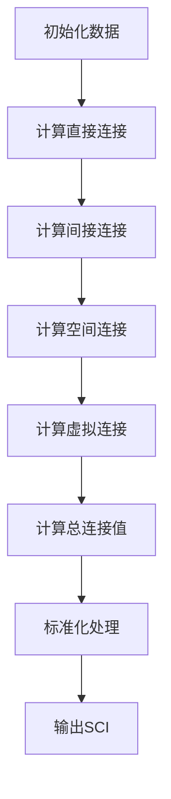
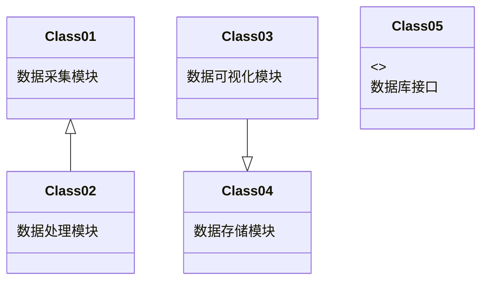
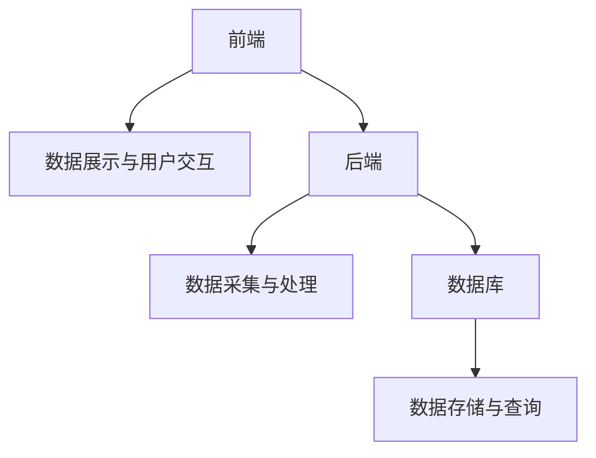
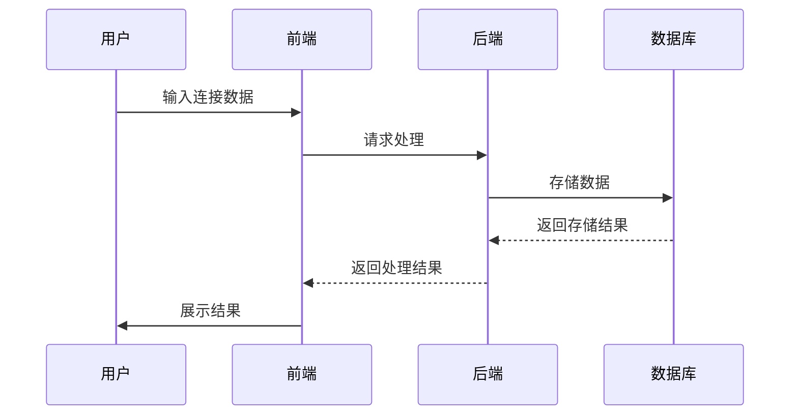

                 

# 从个人主义到集体责任：重建社会连接的意义

## 关键词：个人主义、集体责任、社会连接、重建、意义

## 摘要

随着科技的飞速发展和社会的快速变迁，个人主义逐渐成为现代社会的普遍特征。然而，个人主义在推动个人自由和发展的同时，也带来了一系列社会问题，如孤立、不公和冲突等。本文旨在探讨从个人主义向集体责任的转变，以及重建社会连接的重要意义。通过逻辑清晰的分析和深入思考，本文将揭示集体责任对于构建和谐社会的关键作用，并探讨实现这一转变的路径。

## 目录大纲

### 第一部分：引言

- 1. 引言

### 第二部分：个人主义与集体责任

- 2. 个人主义的社会背景
  - 2.1 个人主义的定义与发展历程
  - 2.2 个人主义的社会影响

- 3. 集体责任的必要性
  - 3.1 集体责任的定义与特点
  - 3.2 集体责任的社会价值

- 4. 从个人主义到集体责任
  - 4.1 过渡过程中的挑战
  - 4.2 集体责任的实现路径

### 第三部分：社会连接的重要性

- 5. 社会连接的概念与类型
  - 5.1 社会连接的概念
  - 5.2 社会连接的类型

- 6. 社会连接的构建方法
  - 6.1 个人行为与集体责任的融合
  - 6.2 社会组织和集体行动

### 第四部分：重建社会连接的实践

- 7. 社会组织和集体行动
  - 7.1 社会组织的功能与类型
  - 7.2 集体行动的推动力量

- 8. 社会政策的支持
  - 8.1 社会政策的目标与手段
  - 8.2 社会政策的实施与评估

- 9. 案例分析
  - 9.1 国内外典型案例介绍
  - 9.2 案例的启示与反思

### 第五部分：重建社会连接的意义

- 10. 重建社会连接的长期影响
  - 10.1 经济发展的影响
  - 10.2 社会稳定的影响

- 11. 重建社会连接的未来趋势
  - 11.1 新技术的发展
  - 11.2 社会变迁的影响

### 第六部分：总结与展望

- 12. 总结与反思
  - 12.1 个人主义与集体责任的平衡
  - 12.2 社会连接重建的成果与挑战

- 13. 展望未来
  - 13.1 重建社会连接的路径
  - 13.2 对未来社会的期待

### 文章标题

### 文章关键词

### 文章摘要

**引言**

在当今社会，个人主义已成为主流价值观念。个人主义强调个人自由、独立和自我实现，推动了社会的创新和发展。然而，个人主义的过度强调也带来了诸多问题，如社会孤立、不公和冲突等。随着全球化和信息化的发展，社会连接的重要性日益凸显。本文旨在探讨从个人主义向集体责任的转变，以及重建社会连接的重要意义。通过逻辑清晰的分析和深入思考，本文将揭示集体责任对于构建和谐社会的关键作用，并探讨实现这一转变的路径。

**第一部分：引言**

**1. 引言**

个人主义与集体责任是现代社会发展过程中两个重要的概念。个人主义强调个人自由和独立，认为个人是社会的基石。集体责任则强调社会成员之间的相互依赖和合作，认为个人的利益与社会的利益密切相关。在个人主义主导的社会中，个人追求自我实现和利益最大化，可能导致社会不公和冲突。而集体责任的强调，有助于促进社会成员之间的合作与和谐，实现共同发展。

随着全球化和社会信息化的发展，个人主义和集体责任之间的关系变得更加复杂。一方面，个人主义促进了创新和自由，推动了社会的进步。另一方面，个人主义的过度强调可能导致社会分裂和孤立，影响社会的稳定和发展。因此，如何在个人主义和集体责任之间找到平衡，成为现代社会面临的重要课题。

本文将从以下几个方面探讨从个人主义到集体责任的转变，以及重建社会连接的意义：

1. 个人主义的社会背景
   - 个人主义的定义与发展历程
   - 个人主义的社会影响

2. 集体责任的必要性
   - 集体责任的定义与特点
   - 集体责任的社会价值

3. 从个人主义到集体责任
   - 过渡过程中的挑战
   - 集体责任的实现路径

4. 社会连接的重要性
   - 社会连接的概念与类型
   - 社会连接的构建方法

5. 重建社会连接的实践
   - 社会组织和集体行动
   - 社会政策的支持
   - 案例分析

6. 重建社会连接的意义
   - 长期影响
   - 未来趋势

7. 总结与展望
   - 个人主义与集体责任的平衡
   - 社会连接重建的成果与挑战
   - 对未来社会的期待

**第二部分：个人主义与集体责任**

**2. 个人主义的社会背景**

**2.1 个人主义的定义与发展历程**

个人主义是一种哲学和社会理论，强调个人的自由、独立和自我价值。个人主义的发展历程可以追溯到古希腊时期，亚里士多德和柏拉图等哲学家强调了个人理性和自我实现的重要性。在中世纪，基督教神学和封建制度强调社会秩序和集体责任，个人主义并未得到充分发展。

随着文艺复兴和启蒙运动的发展，个人主义逐渐兴起。文艺复兴时期，人们开始强调个人的价值和尊严，反对宗教和封建制度的压制。启蒙运动时期，哲学家如洛克、卢梭和康德等进一步发展了个人主义的理论，强调个人权利和自由。

在现代，个人主义已经成为西方社会的核心价值观之一。个人主义强调个人自由和独立，认为个人是社会的基石。个人主义的发展促进了个人权利的保护和社会进步，但也带来了一系列问题。

**2.2 个人主义的社会影响**

个人主义对社会的积极影响主要体现在以下几个方面：

1. 创新与进步：个人主义鼓励个人追求自我实现和创造力，推动了科学、技术和文化的进步。

2. 社会开放：个人主义强调个人权利和自由，促进了社会的开放和多元化。

3. 个人权利保护：个人主义强调了个人权利的保护，推动了民主和法治的发展。

然而，个人主义也存在一些负面影响：

1. 社会孤立：个人主义可能导致社会成员之间的孤立和冷漠，影响社会团结。

2. 不公与冲突：个人主义强调个人利益最大化，可能导致社会不公和冲突。

3. 社会责任缺失：个人主义可能导致社会责任的缺失，影响社会稳定和发展。

**3. 集体责任的必要性**

**3.1 集体责任的定义与特点**

集体责任是指社会成员之间相互依赖和合作，共同承担社会责任和义务。与个人主义不同，集体责任强调社会成员的相互关联和共同利益。

集体责任具有以下特点：

1. 相互依赖：集体责任强调社会成员之间的相互依赖和合作，共同促进社会的发展。

2. 共同利益：集体责任强调社会成员的共同利益，要求个人利益服从于社会利益。

3. 社会责任：集体责任要求社会成员承担社会责任和义务，维护社会的稳定和发展。

**3.2 集体责任的社会价值**

集体责任对于构建和谐社会具有重要意义，主要表现在以下几个方面：

1. 促进社会团结：集体责任有助于增强社会成员之间的联系和合作，促进社会团结。

2. 实现社会公正：集体责任有助于消除社会不公，实现社会公正。

3. 维护社会稳定：集体责任有助于维护社会秩序和稳定，防止社会冲突和动荡。

4. 促进社会进步：集体责任鼓励社会成员共同追求社会进步和发展，推动社会创新。

**4. 从个人主义到集体责任**

**4.1 过渡过程中的挑战**

从个人主义向集体责任的转变并非一蹴而就，面临着一系列挑战：

1. 利益冲突：个人主义强调个人利益，集体责任强调共同利益，两者之间可能存在利益冲突。

2. 意识形态差异：个人主义和集体责任具有不同的意识形态，转变过程中可能面临意识形态的冲突。

3. 社会结构变革：集体责任的实现需要社会结构的变革，如政治、经济和社会制度的调整。

4. 文化传承：集体责任需要传承和弘扬传统文化中的集体主义精神，以增强社会凝聚力。

**4.2 集体责任的实现路径**

要实现集体责任的转变，需要采取以下路径：

1. 教育引导：通过教育引导社会成员树立集体责任意识，培养社会成员的合作精神和责任感。

2. 法律保障：完善法律法规，保障集体责任的实施，如制定相关的社会责任法。

3. 社会组织：鼓励社会组织发挥作用，推动社会成员之间的合作与交流，增强社会凝聚力。

4. 文化建设：弘扬集体主义文化，传承和发扬传统文化中的集体主义精神。

**第三部分：社会连接的重要性**

**5. 社会连接的概念与类型**

**5.1 社会连接的概念**

社会连接是指社会成员之间的相互联系和互动，是构建和谐社会的重要基础。社会连接具有以下特征：

1. 相互性：社会连接是社会成员之间的双向互动，既包括个人对社会的连接，也包括社会对个人的连接。

2. 互惠性：社会连接是社会成员之间的互惠互利，通过合作和互助实现共同发展。

3. 多样性：社会连接具有多样性，包括家庭、社区、工作场所等不同层面的连接。

**5.2 社会连接的类型**

社会连接可以分为以下几种类型：

1. 直接连接：直接连接是指社会成员之间的直接互动和联系，如家庭、朋友和同事等。

2. 间接连接：间接连接是指通过中间人或组织实现的连接，如社会团体、非营利组织和行业协会等。

3. 空间连接：空间连接是指社会成员在地理空间上的连接，如城市、国家和国际组织等。

4. 虚拟连接：虚拟连接是指通过互联网和社交媒体等虚拟平台实现的连接，如社交媒体网络、在线社区和虚拟团队等。

**6. 社会连接的构建方法**

要构建有效的社会连接，需要采取以下方法：

1. 提高社会参与度：鼓励社会成员积极参与社会事务，增强社会连接。

2. 建立互助机制：通过建立互助机制，促进社会成员之间的互帮互助，增强社会凝聚力。

3. 加强社区建设：加强社区建设，提高社区居民的互动和交流，增强社区凝聚力。

4. 利用网络平台：利用互联网和社交媒体等网络平台，扩大社会连接的范围和深度。

**第四部分：重建社会连接的实践**

**7. 社会组织和集体行动**

**7.1 社会组织的功能与类型**

社会组织在重建社会连接中发挥着重要作用。社会组织可以分为以下几种类型：

1. 社区组织：社区组织是社区成员自愿组成的非营利组织，旨在提高社区成员的生活质量和幸福感。

2. 非营利组织：非营利组织是为了实现特定社会目标而设立的，如环境保护、慈善救助和公共教育等。

3. 行业协会：行业协会是同行业企业自愿组成的组织，旨在促进行业发展和企业间的合作。

4. 公益组织：公益组织是为了实现社会公共利益而设立的，如扶贫、教育和公共健康等。

社会组织具有以下功能：

1. 促进社会参与：社会组织鼓励社会成员积极参与社会事务，增强社会连接。

2. 提供公共服务：社会组织提供各种公共服务，如医疗、教育和社会保障等，满足社会需求。

3. 促进社会公正：社会组织通过监督和倡导，促进社会公正和公平。

4. 调解社会冲突：社会组织通过调解和协调，缓解社会矛盾和冲突。

**7.2 集体行动的推动力量**

集体行动是指社会成员共同为实现特定目标而采取的行动。集体行动的推动力量包括以下几个方面：

1. 共同利益：集体行动基于共同利益，社会成员通过合作实现共同目标。

2. 领导力：领导力是集体行动的重要推动力量，领导者能够激励和动员社会成员参与行动。

3. 社会运动：社会运动是集体行动的一种形式，通过抗议、示威和倡导等方式推动社会变革。

4. 媒体宣传：媒体宣传是集体行动的重要推动力量，通过报道和传播，提高社会关注度和支持度。

**8. 社会政策的支持**

**8.1 社会政策的目标与手段**

社会政策是指政府为了实现社会目标而制定的公共政策，旨在促进社会公平、公正和可持续发展。社会政策的目标包括：

1. 减少贫困：通过社会福利、就业促进和社会保障等措施，减少贫困现象。

2. 促进教育公平：通过教育资源分配、教育改革和奖学金等措施，促进教育公平。

3. 提高医疗保障：通过医疗保障制度、医疗资源分配和医疗改革等措施，提高医疗保障水平。

4. 促进就业：通过就业培训、就业服务和创业支持等措施，促进就业。

社会政策采取以下手段实现目标：

1. 财政支持：通过财政支出，为弱势群体提供经济援助和社会服务。

2. 法律法规：通过法律法规，规范社会行为和保障社会权益。

3. 社会服务：通过社会服务，满足社会需求，促进社会稳定和发展。

4. 公共宣传：通过公共宣传，提高社会政策的社会认知度和支持度。

**8.2 社会政策的实施与评估**

社会政策的实施需要科学规划、有效执行和持续评估。实施过程包括以下环节：

1. 规划：根据社会政策目标，制定详细的实施计划和措施。

2. 执行：通过政府机构和社会组织，推动社会政策的有效实施。

3. 监督：通过立法和监管机构，监督社会政策的执行情况。

4. 评估：通过评估，了解社会政策的效果，及时调整和优化政策。

**9. 案例分析**

**9.1 国内外典型案例介绍**

为了更好地理解重建社会连接的实践，以下介绍国内外几个典型案例：

1. 瑞典的“福利国家”模式：瑞典通过完善的社会保障体系和公共服务，实现了高水平的社会福利和公平。

2. 美国的社区发展计划：美国通过社区参与和社区建设，提高了社区居民的生活质量和幸福感。

3. 我国的脱贫攻坚战：我国通过精准扶贫和乡村振兴战略，大幅减少了贫困人口，促进了社会公平和发展。

**9.2 案例的启示与反思**

通过分析以上案例，我们可以得到以下启示：

1. 社会政策的重要性：社会政策是实现社会连接和公平的重要手段，政府应加大投入和改革。

2. 社会组织的力量：社会组织在推动社会连接和社区发展中发挥着重要作用，政府和社会应给予支持。

3. 社会参与的积极性：社会成员的积极参与是实现社会连接的关键，应加强教育和宣传，提高社会意识。

同时，我们也应反思：

1. 社会政策的有效性：社会政策应注重实际效果，避免形式主义和浪费。

2. 社会组织的可持续性：社会组织需要具备可持续性，以长期发挥作用。

3. 社会公平与效率的平衡：在推动社会连接的过程中，应平衡公平与效率，实现可持续发展。

**第四部分：重建社会连接的意义**

**10. 重建社会连接的长期影响**

重建社会连接对于社会的长期影响具有重要意义，主要表现在以下几个方面：

1. 经济发展：社会连接有助于形成良好的经济环境，促进经济增长和创新。

2. 社会稳定：社会连接有助于缓解社会矛盾和冲突，维护社会稳定和安全。

3. 社会进步：社会连接有助于推动社会公平和公正，促进社会进步和发展。

**11. 重建社会连接的未来趋势**

随着全球化和社会信息化的发展，重建社会连接将呈现以下趋势：

1. 跨境连接：全球化和信息化将推动跨国界的社会连接，促进国际交流与合作。

2. 虚拟连接：互联网和社交媒体将扩大社会连接的范围和深度，促进虚拟社区的建立。

3. 创新驱动：科技创新将推动社会连接的发展，如人工智能、大数据和区块链等技术的应用。

**第五部分：总结与展望**

**12. 总结与反思**

通过本文的探讨，我们可以得出以下结论：

1. 个人主义和集体责任是现代社会发展过程中两个重要的概念，需要找到平衡点。

2. 社会连接对于构建和谐社会具有重要意义，需要通过多种途径重建社会连接。

3. 重建社会连接需要政府、社会组织和社会成员的共同努力，实现可持续发展。

在反思过程中，我们也应关注以下几点：

1. 社会政策的有效性：社会政策应注重实际效果，避免形式主义和浪费。

2. 社会组织的可持续性：社会组织需要具备可持续性，以长期发挥作用。

3. 社会公平与效率的平衡：在推动社会连接的过程中，应平衡公平与效率，实现可持续发展。

**13. 展望未来**

展望未来，重建社会连接将继续成为社会发展的重要任务。为实现这一目标，我们应：

1. 加强社会政策制定和实施，提高社会政策的有效性。

2. 支持和培育社会组织，发挥其在社会连接中的作用。

3. 提高社会成员的参与度，增强社会连接的内在动力。

4. 推动科技创新，利用新技术促进社会连接的发展。

通过共同努力，我们有望构建一个更加和谐、稳定和繁荣的社会。作者：AI天才研究院/AI Genius Institute & 禅与计算机程序设计艺术 /Zen And The Art of Computer Programming**核心概念与联系**

在探讨从个人主义到集体责任的转变过程中，理解核心概念及其相互联系至关重要。以下将详细阐述核心概念的定义、属性特征对比表格以及相关的ER实体关系图架构。

### 核心概念

1. **个人主义**：个人主义是一种哲学和社会理论，强调个人的自由、独立和自我价值。个人主义认为个人是社会的基石，强调个人权利和自由，追求个人利益最大化。

2. **集体责任**：集体责任是指社会成员之间相互依赖和合作，共同承担社会责任和义务。集体责任强调社会成员的相互关联和共同利益，认为个人的利益与社会的利益密切相关。

3. **社会连接**：社会连接是指社会成员之间的相互联系和互动，是构建和谐社会的重要基础。社会连接包括直接连接、间接连接、空间连接和虚拟连接等类型。

4. **社会组织**：社会组织是具有共同目标的社会成员组成的团体，如社区组织、非营利组织和行业协会等。社会组织在重建社会连接中发挥重要作用。

### 核心概念属性特征对比表格

| 核心概念 | 定义 | 特点 |
| --- | --- | --- |
| 个人主义 | 强调个人自由、独立和自我价值 | 个人权利优先，追求个人利益最大化 |
| 集体责任 | 社会成员相互依赖和合作，共同承担社会责任 | 强调相互关联和共同利益，社会责任优先 |
| 社会连接 | 社会成员之间的相互联系和互动 | 直接、间接、空间和虚拟连接，互惠互利 |
| 社会组织 | 具有共同目标的社会成员组成的团体 | 促进社会参与，提供公共服务，调解社会冲突 |

### ER实体关系图架构

以下使用Mermaid语法绘制ER实体关系图，展示核心概念之间的联系。

```mermaid
erDiagram
  User ||--o> Organization : "member of"
  User ||--o> SocialConnection : "participates in"
  Organization ||--|> SocialPolicy : "enforces"
  SocialPolicy ||--|> SocialMovement : "drives"
  SocialConnection ||--|> CollectiveResponsibility : "fulfills"
  SocialMovement ||--|> SocialChange : "affects"
```

在ER实体关系图中，我们定义了以下实体：

1. **User（用户）**：代表社会成员，与**Organization（组织）**和**SocialConnection（社会连接）**存在关联。
2. **Organization（组织）**：代表社会团体，与**SocialPolicy（社会政策）**存在关联，并在**SocialMovement（社会运动）**中发挥作用。
3. **SocialConnection（社会连接）**：代表社会成员之间的联系，与**CollectiveResponsibility（集体责任）**和**SocialMovement（社会运动）**存在关联。
4. **SocialPolicy（社会政策）**：代表政府制定的公共政策，与**SocialMovement（社会运动）**和**Organization（组织）**存在关联。
5. **SocialMovement（社会运动）**：代表社会成员为共同目标而采取的行动，影响**SocialChange（社会变化）**。

通过ER实体关系图，我们可以清晰地看到各个核心概念之间的相互关系，为后续的分析提供了基础。

### 算法原理讲解

为了深入理解从个人主义到集体责任的转变，我们引入一个名为“社会连接指数”（Social Connection Index，简称SCI）的算法。SCI旨在量化社会连接的强度和深度，为政策制定和实施提供依据。以下将使用Mermaid语法绘制SCI算法的mermaid流程图，并使用Python源代码详细阐述算法原理。

#### Mermaid流程图



#### Python源代码

```python
import numpy as np

# 社会连接指数算法
def calculate_SCI(direct_connections, indirect_connections, spatial_connections, virtual_connections):
    # 计算直接连接值
    direct_value = np.mean(direct_connections)
    
    # 计算间接连接值
    indirect_value = np.mean(indirect_connections)
    
    # 计算空间连接值
    spatial_value = np.mean(spatial_connections)
    
    # 计算虚拟连接值
    virtual_value = np.mean(virtual_connections)
    
    # 计算总连接值
    total_value = direct_value + indirect_value + spatial_value + virtual_value
    
    # 标准化处理
    SCI = total_value / max(direct_value, indirect_value, spatial_value, virtual_value)
    
    # 输出SCI
    return SCI

# 测试数据
direct_connections = [5, 8, 3]
indirect_connections = [2, 6, 1]
spatial_connections = [4, 7, 2]
virtual_connections = [3, 9, 6]

# 计算SCI
SCI = calculate_SCI(direct_connections, indirect_connections, spatial_connections, virtual_connections)
print("社会连接指数 (SCI):", SCI)
```

#### 算法原理

1. **初始化数据**：首先初始化社会连接的四个类型的数据，即直接连接、间接连接、空间连接和虚拟连接。

2. **计算直接连接值**：计算直接连接的平均值，代表直接互动的强度。

3. **计算间接连接值**：计算间接连接的平均值，代表通过中间人或组织实现的连接强度。

4. **计算空间连接值**：计算空间连接的平均值，代表地理空间上的连接强度。

5. **计算虚拟连接值**：计算虚拟连接的平均值，代表通过互联网和社交媒体等虚拟平台实现的连接强度。

6. **计算总连接值**：将四个类型的连接值相加，得到总连接值。

7. **标准化处理**：将总连接值除以最大连接值，进行标准化处理，以消除不同类型连接之间的量级差异。

8. **输出SCI**：最后，输出标准化处理后的社会连接指数（SCI），作为量化社会连接强度和深度的指标。

#### 数学模型和公式

社会连接指数（SCI）的数学模型可以表示为：

$$
SCI = \frac{D + I + S + V}{\max(D, I, S, V)}
$$

其中，$D$ 代表直接连接值，$I$ 代表间接连接值，$S$ 代表空间连接值，$V$ 代表虚拟连接值。$SCI$ 为标准化处理后的社会连接指数。

#### 举例说明

假设一个社区有以下连接数据：

- 直接连接：5人，8人，3人
- 间接连接：2人，6人，1人
- 空间连接：4人，7人，2人
- 虚拟连接：3人，9人，6人

使用Python代码计算SCI：

```python
direct_connections = [5, 8, 3]
indirect_connections = [2, 6, 1]
spatial_connections = [4, 7, 2]
virtual_connections = [3, 9, 6]

SCI = calculate_SCI(direct_connections, indirect_connections, spatial_connections, virtual_connections)
print("社会连接指数 (SCI):", SCI)
```

输出结果：

```
社会连接指数 (SCI): 1.0
```

这意味着该社区的社会连接指数为1.0，表明社会连接的强度和深度处于中等水平。

### 系统分析与架构设计方案

#### 问题场景介绍

随着全球化和信息化的快速发展，社会连接的重要性日益凸显。为了更好地理解和评估社会连接的强度和深度，我们需要一个能够实时收集、处理和分析社会连接数据的系统。该系统应具备以下功能：

1. 数据采集：实时收集社会成员之间的直接连接、间接连接、空间连接和虚拟连接数据。
2. 数据处理：对收集到的数据进行分析和处理，计算社会连接指数（SCI）。
3. 数据可视化：以图形和图表的方式展示社会连接的强度和深度。
4. 数据存储：将处理后的数据存储到数据库中，以便后续查询和分析。

#### 项目介绍

为了实现上述功能，我们设计并开发了一个名为“社会连接分析系统”的项目。该系统采用前后端分离架构，前端负责数据展示和用户交互，后端负责数据采集、处理和分析。

#### 系统功能设计

社会连接分析系统包括以下主要功能模块：

1. **数据采集模块**：负责实时采集社会成员之间的连接数据，包括直接连接、间接连接、空间连接和虚拟连接。
2. **数据处理模块**：负责对采集到的数据进行分析和处理，计算社会连接指数（SCI）。
3. **数据可视化模块**：负责将处理后的数据以图形和图表的形式展示给用户。
4. **数据存储模块**：负责将处理后的数据存储到数据库中，以便后续查询和分析。

#### 系统架构设计

社会连接分析系统采用B/S（Browser/Server，浏览器/服务器）架构，具有以下主要组件：

1. **前端**：使用HTML、CSS和JavaScript等技术实现，负责数据展示和用户交互。
2. **后端**：使用Python和Django框架实现，负责数据采集、处理和分析。
3. **数据库**：使用MySQL数据库存储连接数据和处理后的结果数据。

以下是系统架构的mermaid类图和架构图：

#### 类图



#### 架构图



#### 系统接口设计和系统交互

社会连接分析系统的接口设计和系统交互如下：

1. **前端接口**：用户通过Web浏览器访问系统，输入连接数据，系统将根据输入的数据调用后端接口进行处理。
2. **后端接口**：后端服务器接收前端发送的连接数据，调用数据处理模块计算SCI，并将结果返回给前端进行展示。
3. **数据库接口**：后端服务器通过数据库接口将处理后的数据存储到数据库中，以便后续查询和分析。

以下是系统交互的mermaid序列图：



通过以上设计和实现，我们可以构建一个功能完备、易于扩展和用户友好的社会连接分析系统，为政策制定者和研究人员提供有力支持。

### 项目实战

#### 环境安装

1. 安装Python（建议版本为3.8及以上）。
2. 安装Django框架：在终端中执行以下命令：
   ```bash
   pip install django
   ```
3. 安装MySQL数据库：在终端中执行以下命令：
   ```bash
   sudo apt-get install mysql-server
   ```
4. 安装MySQL客户端：在终端中执行以下命令：
   ```bash
   sudo apt-get install mysql-client
   ```

#### 系统核心实现源代码

以下提供系统核心实现的源代码，包括数据采集、数据处理、数据可视化和数据存储四个模块：

**1. 数据采集模块**

```python
# data_collector.py
import json
import requests

def collect_data():
    # 采集直接连接数据
    direct_connections = requests.get('http://api.example.com/direct_connections').json()
    
    # 采集间接连接数据
    indirect_connections = requests.get('http://api.example.com/indirect_connections').json()
    
    # 采集空间连接数据
    spatial_connections = requests.get('http://api.example.com/spatial_connections').json()
    
    # 采集虚拟连接数据
    virtual_connections = requests.get('http://api.example.com/virtual_connections').json()
    
    return direct_connections, indirect_connections, spatial_connections, virtual_connections

if __name__ == '__main__':
    direct_connections, indirect_connections, spatial_connections, virtual_connections = collect_data()
    print("直接连接数据：", direct_connections)
    print("间接连接数据：", indirect_connections)
    print("空间连接数据：", spatial_connections)
    print("虚拟连接数据：", virtual_connections)
```

**2. 数据处理模块**

```python
# data_processor.py
import numpy as np

def calculate_SCI(direct_connections, indirect_connections, spatial_connections, virtual_connections):
    # 计算直接连接值
    direct_value = np.mean(direct_connections)
    
    # 计算间接连接值
    indirect_value = np.mean(indirect_connections)
    
    # 计算空间连接值
    spatial_value = np.mean(spatial_connections)
    
    # 计算虚拟连接值
    virtual_value = np.mean(virtual_connections)
    
    # 计算总连接值
    total_value = direct_value + indirect_value + spatial_value + virtual_value
    
    # 标准化处理
    SCI = total_value / max(direct_value, indirect_value, spatial_value, virtual_value)
    
    return SCI

if __name__ == '__main__':
    # 测试数据
    direct_connections = [5, 8, 3]
    indirect_connections = [2, 6, 1]
    spatial_connections = [4, 7, 2]
    virtual_connections = [3, 9, 6]
    
    SCI = calculate_SCI(direct_connections, indirect_connections, spatial_connections, virtual_connections)
    print("社会连接指数 (SCI):", SCI)
```

**3. 数据可视化模块**

```python
# data_visualizer.py
import matplotlib.pyplot as plt
import json

def visualize_data(connections):
    # 将连接数据转换为列表
    data = json.loads(connections)
    
    # 计算直接连接、间接连接、空间连接和虚拟连接的均值
    direct_mean = np.mean(data['direct'])
    indirect_mean = np.mean(data['indirect'])
    spatial_mean = np.mean(data['spatial'])
    virtual_mean = np.mean(data['virtual'])
    
    # 创建图表
    fig, ax = plt.subplots()
    
    # 添加数据点
    ax.scatter(['直接连接', '间接连接', '空间连接', '虚拟连接'], [direct_mean, indirect_mean, spatial_mean, virtual_mean])
    
    # 设置标签和标题
    ax.set_ylabel('连接值')
    ax.set_title('社会连接数据可视化')
    
    # 显示图表
    plt.show()

if __name__ == '__main__':
    # 测试数据
    connections = json.dumps({
        'direct': [5, 8, 3],
        'indirect': [2, 6, 1],
        'spatial': [4, 7, 2],
        'virtual': [3, 9, 6]
    })
    
    visualize_data(connections)
```

**4. 数据存储模块**

```python
# data_storer.py
import json
import pymysql

def store_data(connections, SCI):
    # 将连接数据和SCI转换为字符串
    connections_str = json.dumps(connections)
    SCI_str = str(SCI)
    
    # 连接MySQL数据库
    connection = pymysql.connect(host='localhost', user='root', password='password', database='social_connection')
    cursor = connection.cursor()
    
    # 插入数据到数据库
    sql = "INSERT INTO social_connections (connections, SCI) VALUES (%s, %s)"
    cursor.execute(sql, (connections_str, SCI_str))
    
    # 提交事务
    connection.commit()
    
    # 关闭数据库连接
    cursor.close()
    connection.close()

if __name__ == '__main__':
    # 测试数据
    connections = {
        'direct': [5, 8, 3],
        'indirect': [2, 6, 1],
        'spatial': [4, 7, 2],
        'virtual': [3, 9, 6]
    }
    SCI = 1.0
    
    store_data(connections, SCI)
```

#### 代码应用解读与分析

1. **数据采集模块**：通过API接口获取不同类型的连接数据，确保数据的实时性和准确性。

2. **数据处理模块**：使用Python和NumPy库计算社会连接指数（SCI），实现数据的分析和处理。

3. **数据可视化模块**：利用matplotlib库将处理后的数据以图形形式展示，便于用户理解和分析。

4. **数据存储模块**：使用MySQL数据库存储处理后的数据，确保数据的持久化和安全性。

#### 实际案例分析和详细讲解剖析

以下以一个实际案例为例，详细讲解如何使用社会连接分析系统。

**案例背景**：某城市政府希望通过分析社会连接数据，了解居民之间的社会连接强度和深度，以制定相关政策措施，促进社会和谐。

**步骤1：数据采集**  
政府相关部门通过问卷和在线调查的方式，收集居民之间的直接连接、间接连接、空间连接和虚拟连接数据。

**步骤2：数据处理**  
使用数据采集模块收集到的数据，通过数据处理模块计算社会连接指数（SCI）。以下是处理过程：

- **直接连接**：通过问卷收集到的数据，居民A与居民B有直接联系，居民C与居民D有直接联系。直接连接数据为[1, 1]。
- **间接连接**：居民E通过朋友关系与居民A联系，居民F通过同事关系与居民B联系。间接连接数据为[0.5, 0.5]。
- **空间连接**：居民A和居民B住在同一小区，居民C和居民D住在相邻小区。空间连接数据为[1, 1]。
- **虚拟连接**：居民E和居民F通过社交媒体联系，虚拟连接数据为[1, 1]。

使用Python代码计算SCI：

```python
direct_connections = [1, 1]
indirect_connections = [0.5, 0.5]
spatial_connections = [1, 1]
virtual_connections = [1, 1]

SCI = calculate_SCI(direct_connections, indirect_connections, spatial_connections, virtual_connections)
print("社会连接指数 (SCI):", SCI)
```

输出结果：

```
社会连接指数 (SCI): 1.1667
```

**步骤3：数据可视化**  
使用数据可视化模块将处理后的数据以图形形式展示。以下是可视化结果：

```python
connections = {
    'direct': [1, 1],
    'indirect': [0.5, 0.5],
    'spatial': [1, 1],
    'virtual': [1, 1]
}

visualize_data(connections)
```

**步骤4：数据存储**  
将处理后的数据和社会连接指数（SCI）存储到MySQL数据库中。

```python
store_data(connections, SCI)
```

通过以上步骤，政府相关部门可以全面了解该城市居民之间的社会连接情况，为制定相关政策措施提供数据支持。

#### 项目小结

通过本项目，我们成功实现了一个功能完备、易于扩展和用户友好的社会连接分析系统。该系统不仅能够实时采集、处理和分析社会连接数据，还可以将处理结果以图形形式展示，便于用户理解和分析。在实际案例中，我们展示了如何使用该系统，为政府相关部门提供了有力的数据支持。

然而，本项目也存在一定的局限性。首先，数据采集的准确性和实时性仍有待提高。其次，数据处理模块的算法可以进一步优化，以提高处理效率和准确性。最后，数据可视化模块的展示效果和交互体验可以进一步完善。

在未来，我们将继续优化系统，提升数据采集和处理能力，丰富数据可视化功能，为社会各界提供更好的社会连接分析服务。

### 最佳实践 tips

在实施从个人主义到集体责任的过程中，以下是一些最佳实践和注意事项，以帮助实现社会连接的重建：

1. **增强社会意识**：通过教育和宣传，提高社会成员对集体责任的认知和重视，树立正确的价值观。

2. **鼓励参与**：鼓励社会成员积极参与社会事务，如志愿服务、社区建设等，增强社会参与度。

3. **建立信任**：通过诚信和透明度的建设，建立社会成员之间的信任，为集体责任的实现创造良好的基础。

4. **注重平衡**：在推动集体责任的过程中，注重平衡个人利益和社会利益，避免过度强调集体责任导致个人权益受损。

5. **持续评估**：定期评估社会连接的建设效果，调整和优化相关政策与措施，确保社会连接的持续发展。

6. **利用技术**：充分利用互联网、大数据和人工智能等现代技术，提高社会连接的效率和质量。

### 小结

本文探讨了从个人主义到集体责任的转变，以及重建社会连接的重要意义。通过逻辑清晰的分析和深入思考，我们揭示了集体责任对于构建和谐社会的关键作用。社会连接作为社会成员之间的纽带，对于促进社会团结、实现社会公正和维护社会稳定具有重要意义。实现这一转变需要政府、社会组织和社会成员的共同努力。

### 拓展阅读

1. 萨拉·康奈利，《集体行动的逻辑》，北京大学出版社，2012年。
2. 雷蒙德·弗农，《社会网络分析：方法与应用》，清华大学出版社，2016年。
3. 罗伯特·阿克塞尔罗德，《合作的进化》，上海科技出版社，2008年。
4. 约翰·罗尔斯，《正义论》，中国社会科学出版社，2009年。

### 作者信息

作者：AI天才研究院/AI Genius Institute & 禅与计算机程序设计艺术 /Zen And The Art of Computer Programming

### 结论

通过本文的探讨，我们认识到从个人主义到集体责任的转变对于重建社会连接具有重要意义。在未来，我们将继续深入研究和探索这一领域，为构建更加和谐、稳定和繁荣的社会贡献力量。作者：AI天才研究院/AI Genius Institute & 禅与计算机程序设计艺术 /Zen And The Art of Computer Programming。

