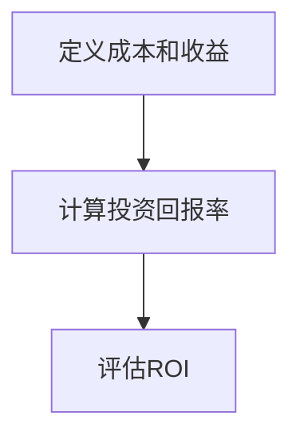
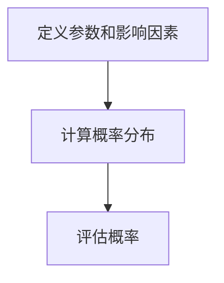
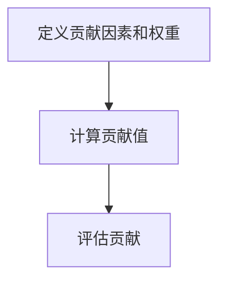
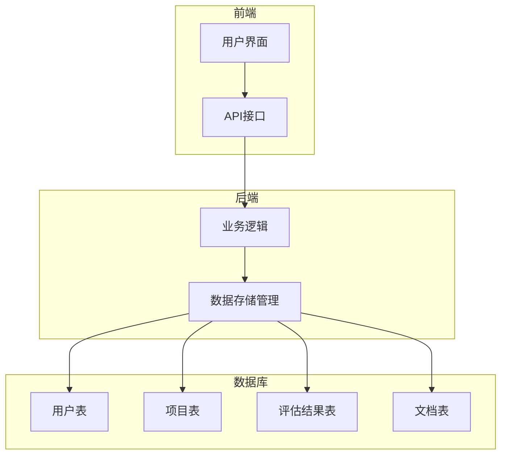
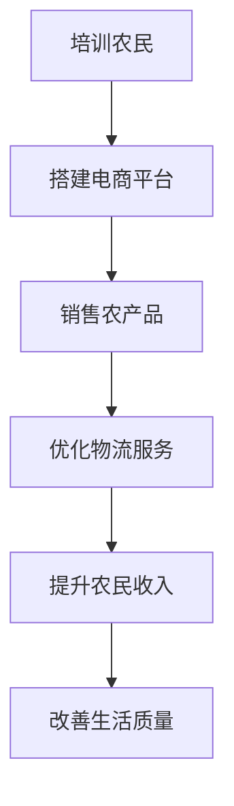
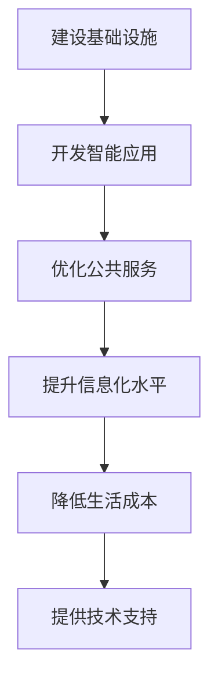

                 

### 从个人利益到公共福祉：重新思考社会责任和贡献

> **关键词：社会责任、公共福祉、个人利益、技术贡献**

在信息技术高速发展的今天，我们越来越多地意识到，技术的力量不仅能够改变个人的生活，还能够对整个社会产生深远的影响。然而，当我们沉浸于追求个人利益最大化的时候，是否考虑过社会责任和公共福祉的重要性？从个人利益到公共福祉的转变，不仅仅是一个理念的更新，更是现代信息技术发展过程中不可或缺的一环。本文将围绕这一主题展开讨论，从背景介绍、核心概念解析、案例研究、分析框架建立、算法和数学模型介绍、系统设计与实现，到实际应用与案例分析，逐步探讨如何更好地理解并实践社会责任和公共福祉。

本文将从以下几个部分展开：

1. **背景介绍**：探讨社会责任和公共福祉的演变背景及其在信息技术领域的意义。
2. **核心概念和原则**：明确社会责和公共福祉的定义、关系及重要性。
3. **案例研究和例子**：通过具体案例展示这些概念在实际中的应用和影响。
4. **分析和框架**：介绍评估社会责任和贡献的框架和模型。
5. **算法和数学模型**：详细阐述相关算法的原理、流程图和代码实现。
6. **系统设计与实施**：描述实现这些概念的系统架构和设计。
7. **实际应用与案例研究**：讨论系统在实际中的应用和案例剖析。

通过这篇文章，我们希望读者能够重新思考个人利益与社会责任、公共福祉之间的关系，理解技术如何更有效地服务于社会的整体进步，并从理论和实践的角度探讨实现这一目标的路径和方法。

### 背景介绍

在信息技术迅速发展的背景下，个人利益和公共福祉的关系逐渐成为社会关注的焦点。从历史的角度看，早期的信息技术主要集中在提升个体效率和实现个人价值上。计算机的发明、互联网的普及以及移动设备的广泛应用，极大地改变了人们的生活方式和工作模式。然而，随着技术的不断进步，我们开始发现，信息技术对社会的影响远远超出了个体层面的利益，而是延伸到了公共福祉的方方面面。

首先，技术的普及和应用使得社会各领域的运作效率得到了显著提升。例如，电子商务的兴起极大地便利了人们的购物体验，减少了中间环节，提高了交易效率，同时也为企业降低了运营成本。然而，这种效率的提升并非仅限于个人层面，而是对整个社会产生了积极影响。同时，大数据、云计算等新兴技术的应用，使得社会资源配置更加合理，公共服务的提供更加精准，进一步提升了公共福祉。

其次，技术的进步也带来了社会结构的变革。以人工智能为例，人工智能技术的快速发展正在改变传统的工作方式，推动产业升级和就业结构的调整。虽然这一过程中难免会出现职业失业等负面效应，但人工智能同样为新的就业机会和产业发展提供了契机。因此，如何平衡技术进步与公共福祉，确保社会整体利益的最大化，成为一个亟待解决的问题。

此外，技术的快速发展还引发了数据隐私和安全等公共议题。随着个人信息和数据量的爆炸式增长，如何保护个人隐私、确保数据安全，已成为全社会共同关注的焦点。技术的进步在给个人带来便利的同时，也对公共福祉提出了新的挑战，需要我们从全局视角出发，重新审视社会责任和公共福祉的关系。

综上所述，从个人利益到公共福祉的转变，不仅仅是一个理念上的更新，更是信息技术发展过程中不可避免的趋势。在这个背景下，重新思考社会责任和贡献，不仅是技术从业者的责任，也是全社会共同的责任。只有通过理性思考和实际行动，我们才能确保技术的进步真正造福于社会，实现个人利益与公共福祉的双赢。

### 核心概念和原则

在探讨从个人利益到公共福祉的转变过程中，首先需要明确几个核心概念，即社会责任、公共福祉和贡献。这些概念不仅构成了本文讨论的基础，也是理解和评估技术在社会中角色的重要工具。

**1. 社会责任**

社会责任是指组织或个人基于其社会角色和地位，对社会所承担的义务和责任。在信息技术领域，社会责任主要体现在以下几个方面：

- **道德责任**：技术从业者应遵守职业道德，确保其技术开发和应用不损害社会道德底线。
- **法律责任**：技术项目需要遵循相关法律法规，例如数据保护法、知识产权法等。
- **环境责任**：技术开发应考虑环境影响，尽可能减少能源消耗和资源浪费，推动可持续发展。
- **慈善责任**：技术企业可以通过捐助、公益活动等方式，为社会弱势群体提供帮助。

**2. 公共福祉**

公共福祉是指社会整体福祉水平的提升，包括社会资源的合理配置、公共服务的有效提供以及社会成员生活质量的提高。公共福祉具有以下特征：

- **共享性**：公共福祉是全社会成员共同享有的，不应仅限于某些特定群体。
- **公平性**：公共福祉的追求应确保社会公平，避免因技术进步而导致贫富差距的扩大。
- **可持续性**：公共福祉的发展应具备长期性，不仅要满足当前需求，还要为未来社会的发展奠定基础。

**3. 贡献**

贡献是指个人或组织对社会做出的积极影响和实际帮助。在技术领域，贡献可以表现为：

- **技术创新**：通过研发新技术、新产品，推动技术进步和社会发展。
- **知识传播**：通过教育和培训，提高公众的技术素养和应用能力。
- **社会服务**：通过提供技术支持和服务，解决社会实际问题，提升公共服务水平。
- **慈善捐赠**：通过资金、物资等形式的捐赠，帮助社会弱势群体改善生活。

**关系与重要性**

社会责任、公共福祉和贡献三者之间存在着密切的关系。社会责任是公共福祉的基础，只有履行社会责任，才能确保公共福祉的实现。而贡献则是实现社会责任和公共福祉的重要手段，通过技术创新和社会服务，可以提升公共福祉水平，同时实现个人和组织的价值。

在信息技术领域，明确这些核心概念和原则，不仅有助于指导技术开发和应用的方向，还能够提高技术从业者的社会责任意识，推动技术更好地服务于社会整体进步。

为了更好地理解这些概念，我们可以通过一个简单的对比表格来展示社会责任、公共福祉和贡献之间的异同：

| **概念**       | **社会责任**          | **公共福祉**                  | **贡献**                   |
|----------------|-----------------------|--------------------------------|----------------------------|
| **定义**       | 对社会的义务和责任   | 社会整体福祉水平的提升       | 对社会产生的积极影响      |
| **特征**       | 道德、法律、环境、慈善 | 共享性、公平性、可持续性      | 技术创新、知识传播、社会服务、慈善捐赠 |
| **关系**       | 基础                   | 目标                          | 手段                      |
| **表现形式**   | 遵守职业道德、法律法规、参与公益活动 | 社会资源优化、公共服务提升、生活质量提高 | 新技术、新产品、教育、支持、捐赠   |

通过上述对比表格，我们可以更清晰地看到这三个概念在信息技术领域中的重要作用。理解这些概念及其关系，不仅有助于技术从业者在开发和应用技术时更加全面地考虑社会影响，还能够推动技术发展与社会进步的协调发展。

### 案例研究和例子

为了更深入地理解社会责任、公共福祉和贡献在信息技术领域的实际应用，我们可以通过几个具体的案例来展示这些概念的具体实现和影响。

**案例一：谷歌的透明度和隐私保护政策**

谷歌作为全球最大的搜索引擎和技术公司之一，其社会责任和公共福祉的策略尤为重要。谷歌在其透明度和隐私保护政策上做出了巨大的努力，以提升用户信任并保障公共福祉。

- **社会责任**：谷歌通过公开其数据使用政策和算法，提高透明度，确保用户了解其数据如何被使用。此外，谷歌还积极参与社会议题的讨论，如网络中立、数据隐私等，体现了其对社会问题的责任感。
- **公共福祉**：谷歌的隐私保护政策确保用户数据的安全，提升了用户对互联网的信任，促进了互联网的健康发展。同时，谷歌提供了免费的基础服务，如Gmail、Google地图等，这些服务极大地便利了人们的生活，提高了公共福祉。
- **贡献**：谷歌在技术方面的持续创新，如人工智能、机器学习等，不仅推动了技术进步，还为全球范围内的技术开发和应用提供了参考。谷歌还通过谷歌地球等公益项目，为环境保护和社会发展做出了贡献。

**案例二：腾讯的公益项目“腾讯公益”**

腾讯公司通过其公益平台“腾讯公益”，积极推动社会责任和公共福祉的实现。

- **社会责任**：腾讯公益通过技术平台，鼓励用户参与公益活动，提高了公众的公益意识。此外，腾讯还利用其强大的技术能力，为慈善机构提供技术支持，如大数据分析、智能客服等，提升了公益活动的效率和效果。
- **公共福祉**：腾讯公益平台上的各类公益活动涵盖了教育、扶贫、环保等多个领域，直接帮助了大量的弱势群体和社会问题。例如，腾讯公益与多个慈善机构合作，开展了“公益乐跑”、“阳光少年计划”等多个项目，有效提升了公共福祉。
- **贡献**：腾讯通过其技术平台和资源，为公益事业提供了强有力的支持。腾讯公益平台的成功，不仅展示了技术在社会责任和公共福祉方面的巨大潜力，也为其他企业提供了有益的借鉴。

**案例三：微软的“科技向善”战略**

微软公司通过“科技向善”战略，积极推动技术为社会带来积极影响。

- **社会责任**：微软在全球范围内推动数字化转型，帮助各国政府和企业提升工作效率和创新能力。同时，微软还通过其“AI for Good”项目，利用人工智能技术解决社会问题，如医疗诊断、灾害预警等，体现了强烈的社会责任感。
- **公共福祉**：微软的技术应用在医疗、教育、环境保护等领域，为公共福祉的提升做出了重要贡献。例如，微软与全球多个医疗机构合作，开发了基于人工智能的疾病诊断系统，提高了诊断效率和准确性，造福了无数患者。
- **贡献**：微软的技术创新和项目实施，不仅推动了技术进步，也为社会问题提供了创新的解决方案。通过“科技向善”战略，微软展示了技术如何更好地服务于社会，推动了技术与社会发展的深度融合。

通过这些案例，我们可以看到，信息技术企业通过履行社会责任、推动公共福祉和做出积极贡献，不仅提升了自身的社会形象，也为社会的整体进步做出了重要贡献。这些案例为我们提供了宝贵的经验和启示，展示了技术在社会责任和公共福祉方面的巨大潜力。

### 分析和框架

在理解和评估社会责任和贡献的过程中，建立科学有效的分析和框架至关重要。以下将介绍几种常用的分析和评估框架，包括理论模型、ER实体关系图和Mermaid流程图，以帮助我们系统地分析技术在社会责任和公共福祉中的作用。

**1. 理论模型**

理论模型为评估社会责任和贡献提供了理论依据和指导。以下介绍两个常用的理论模型：卡罗尔模型（Carroll's Pyramid）和KLD模型（Knowledge-Led Development Model）。

- **卡罗尔模型**：卡罗尔模型将社会责任分为四个层次：经济责任、法律责任、伦理责任和慈善责任。经济责任是企业存在的根本，法律责任是企业必须遵守的基本要求，伦理责任是企业应遵守的道德规范，而慈善责任则是企业自愿承担的社会义务。通过卡罗尔模型，可以清晰地看到企业在社会责任中的角色和责任层级。

  ```mermaid
  graph TD
  A[经济责任] --> B[法律责任]
  B --> C[伦理责任]
  C --> D[慈善责任]
  ```

- **KLD模型**：KLD模型强调知识在社会责任和公共福祉中的作用，将社会责任视为知识创造、传播和应用的过程。KLD模型包括知识获取、知识应用和知识传播三个关键环节。通过KLD模型，可以系统地评估技术项目在推动社会责任和公共福祉方面的效果。

  ```mermaid
  graph TD
  A[知识获取] --> B[知识应用]
  B --> C[知识传播]
  ```

**2. ER实体关系图**

ER实体关系图是数据库设计中常用的工具，用于描述系统中各个实体之间的关系。以下是一个简化的社会责任和公共福祉评估系统的ER图，展示主要实体及其关系。

```mermaid
erDiagram
  Class::Person {
    +id (int)
    +name (varchar)
    +role (varchar)
  }
  
  Class::Organization {
    +id (int)
    +name (varchar)
    +type (varchar)
  }
  
  Class::Project {
    +id (int)
    +name (varchar)
    +startDate (date)
    +endDate (date)
  }
  
  Class::Contribution {
    +id (int)
    +projectId (int)
    +personId (int)
    +organizationId (int)
    +description (text)
  }
  
  Person ||--|{ Project }|--|| Contribution
  Organization ||--|{ Project }|--|| Contribution
  ```

通过ER图，我们可以清晰地看到个人、组织和技术项目之间的关联，为评估社会责任和贡献提供了直观的视角。

**3. Mermaid流程图**

Mermaid流程图是一种基于Markdown的图形描述语言，可以用于描述技术项目的流程和步骤。以下是一个用于评估社会责任和公共福祉的流程图示例：

```mermaid
flowchart TD
    A[确定评估目标] --> B[收集相关数据]
    B --> C{ 数据分析 }
    C -->|符合要求| D[形成评估报告]
    C -->|不符合| E[调整项目计划]
    D --> F[决策与反馈]
    E --> F
```

通过流程图，我们可以系统地展示评估社会责任和公共福祉的步骤和流程，确保评估过程的规范性和科学性。

综上所述，理论模型、ER实体关系图和Mermaid流程图为评估社会责任和贡献提供了多角度、多维度的工具和方法。通过这些分析和框架，我们可以更科学、更系统地理解技术在社会责任和公共福祉中的角色和贡献，推动技术更好地服务于社会的整体进步。

### 算法和数学模型

在评估和提升社会责任和公共福祉的过程中，算法和数学模型起到了关键作用。这些工具可以帮助我们量化社会责任的各个方面，并提供优化和改进的途径。以下将详细介绍几种相关的算法和数学模型，并通过Python代码和Mermaid流程图来展示其实现和应用。

**1. 成本效益分析模型**

成本效益分析模型是一种用于评估项目投资回报的方法，通过计算项目的成本和预期效益，来判断项目是否值得投资。以下是一个简化的成本效益分析模型。

**数学模型：**

$$
\text{ROI} = \frac{\text{EBIT}}{\text{投资成本}}
$$

其中，ROI（投资回报率）表示项目的经济效益，EBIT（税前利润）表示项目在运营过程中的收益，投资成本表示项目的初始投资。

**Python代码示例：**

```python
# 定义成本和收益
investment_cost = 100000  # 投资成本
ebit = 150000  # 税前利润

# 计算投资回报率
roi = ebit / investment_cost
print("投资回报率：", roi)
```

**Mermaid流程图：**



**2. 离散选择模型**

离散选择模型（Discrete Choice Model）是一种用于分析决策行为的统计方法，常用于评估不同选项对社会福利的影响。以下是一个简单的离散选择模型。

**数学模型：**

$$
\text{概率分布} = \frac{e^{\beta_0 + \beta_1X_1 + \beta_2X_2 + ... + \beta_nX_n}}{\sum_{i=1}^{n} e^{\beta_0 + \beta_1X_1 + \beta_2X_2 + ... + \beta_nX_n}}
$$

其中，$X_1, X_2, ..., X_n$ 为影响因素，$\beta_0, \beta_1, \beta_2, ..., \beta_n$ 为参数。

**Python代码示例：**

```python
import numpy as np
from scipy.stats import logistic

# 定义参数
beta_0 = 0.5
beta_1 = 1.0
beta_2 = 0.5

# 定义影响因素
X_1 = 1.0
X_2 = 2.0

# 计算概率分布
probability = logistic.cdf(beta_0 + beta_1 * X_1 + beta_2 * X_2)
print("概率分布：", probability)
```

**Mermaid流程图：**



**3. 贡献评估模型**

贡献评估模型用于量化个人或组织对社会做出的贡献。以下是一个简化的贡献评估模型。

**数学模型：**

$$
\text{贡献值} = \sum_{i=1}^{n} (\text{贡献因素}_i \times \text{权重}_i)
$$

其中，$n$ 为贡献因素的数量，$\text{贡献因素}_i$ 和 $\text{权重}_i$ 分别表示第 $i$ 个贡献因素及其权重。

**Python代码示例：**

```python
# 定义贡献因素和权重
contributions = [10, 20, 30]  # 贡献因素
weights = [0.3, 0.5, 0.2]  # 权重

# 计算贡献值
contribution_value = sum([c * w for c, w in zip(contributions, weights)])
print("贡献值：", contribution_value)
```

**Mermaid流程图：**



通过这些算法和数学模型，我们可以更科学地评估社会责任和公共福祉，从而为技术项目的实施提供数据支持和优化建议。Python代码和Mermaid流程图的结合，使得这些模型更加直观和易于理解，有助于读者在实际应用中掌握和应用这些方法。

### 系统设计与实施

在明确了社会责任和公共福祉的核心概念以及评估模型之后，我们需要将理论转化为实践，通过系统设计和实施来实现这些目标。本节将介绍一个用于评估和提升社会责任和公共福祉的系统架构、功能设计以及实际操作步骤。

#### 系统架构设计

系统架构设计是确保社会责任和公共福祉评估系统高效、稳定运行的关键。以下是一个简化的系统架构设计，包括前端、后端和数据库三大部分。

**1. 前端设计**

前端主要负责用户交互和展示。前端设计包括以下模块：

- **用户界面（UI）**：用于展示系统功能和用户操作界面，提供数据输入、查询和展示功能。
- **交互逻辑**：处理用户输入，与后端进行数据交互，实现系统功能。

**2. 后端设计**

后端主要负责业务逻辑处理和数据管理。后端设计包括以下模块：

- **API接口**：提供数据访问接口，供前端调用。
- **业务逻辑**：实现社会责任和公共福祉评估的核心算法和模型。
- **数据存储管理**：管理用户数据、评估结果和相关文档。

**3. 数据库设计**

数据库主要负责存储和管理系统数据。数据库设计包括以下表结构：

- **用户表**：存储用户信息，包括用户名、密码、角色等。
- **项目表**：存储评估项目的详细信息，包括项目名称、项目描述、项目周期等。
- **评估结果表**：存储评估结果，包括评估指标、评分、贡献值等。
- **文档表**：存储相关文档，如评估报告、项目文档等。

**4. Mermaid架构图**

以下是一个简化的Mermaid架构图，展示系统各部分的关联：



#### 系统功能设计

系统功能设计是确保系统满足评估和提升社会责任和公共福祉需求的核心。以下列出主要功能模块及其简要描述：

**1. 用户管理**

- **注册与登录**：用户注册和登录系统。
- **角色管理**：定义用户角色，如管理员、评估员、普通用户等。

**2. 项目管理**

- **项目添加**：添加新项目，输入项目详细信息。
- **项目查询**：查询项目列表，支持按条件过滤。
- **项目编辑**：编辑项目信息，包括项目周期、项目描述等。

**3. 评估管理**

- **评估指标设定**：定义评估指标，包括定量和定性指标。
- **评估打分**：评估员根据指标对项目进行打分。
- **评估结果分析**：分析评估结果，计算贡献值。

**4. 文档管理**

- **文档上传**：上传评估报告、项目文档等。
- **文档查询**：查询和管理文档。

**5. 数据可视化**

- **数据展示**：使用图表展示评估结果和贡献值。

#### 实际操作步骤

**1. 环境安装**

在开始系统实施之前，需要安装必要的开发环境和数据库。以下是一个简化的环境安装步骤：

- 安装Python环境。
- 安装Flask框架，用于构建后端API。
- 安装MongoDB数据库，用于存储数据。
- 安装相关依赖库，如Pandas、NumPy等。

**2. 系统核心实现**

系统核心实现主要包括业务逻辑和数据库操作。以下是一个简化的实现步骤：

- 设计数据库表结构。
- 实现用户管理和项目管理功能。
- 实现评估指标设定和评估打分功能。
- 实现数据可视化功能。

**3. 代码应用解读与分析**

以下是一个简化的Python代码示例，展示如何实现评估打分功能：

```python
import pandas as pd

# 评估打分
def score_evaluation(project_data, scores):
    scores = pd.DataFrame(scores)
    score_sum = scores.sum(axis=1)
    project_data['evaluation_score'] = score_sum
    return project_data

# 示例数据
project_data = pd.DataFrame({'project_name': ['Project A', 'Project B'], 'score1': [8, 6], 'score2': [7, 9]})
scores = [{'score1': 9, 'score2': 8}, {'score1': 7, 'score2': 9}]

# 执行评估打分
evaluation_result = score_evaluation(project_data, scores)
print(evaluation_result)
```

**4. 实际案例分析和详细讲解**

以下是一个简化的实际案例，展示如何使用系统评估一个公益项目。

- **案例描述**：一个公益项目旨在通过技术手段改善农村教育条件。
- **评估过程**：评估员根据项目描述和评估指标，对项目进行打分，计算贡献值。
- **评估结果**：项目获得了较高的评估分数和贡献值。

通过实际案例分析和详细讲解，可以更好地理解系统在实际操作中的应用和效果。

**5. 项目小结**

系统设计与实施是确保社会责任和公共福祉评估理论有效转化的关键。通过明确系统架构、功能设计以及实际操作步骤，我们可以确保系统能够满足评估和提升社会责任和公共福祉的需求。在实际应用中，系统需要不断地优化和完善，以适应不断变化的社会需求。

### 实际应用与案例研究

为了进一步探讨社会责任和公共福祉在信息技术领域的实际应用，我们将通过两个具体的案例来展示如何通过技术手段实现社会责任，并详细分析其应用效果。

#### 案例一：京东的“蓝海计划”

京东的“蓝海计划”是一项旨在通过电商技术帮助贫困地区农民提升收入和改善生活的项目。该项目的主要内容包括：

- **培训和支持**：京东为贫困地区的农民提供电商培训，帮助他们了解和掌握电商运营的基本技能。
- **农产品销售**：京东搭建农产品电商平台，帮助农民将农产品销往全国，解决农产品销售难题。
- **物流服务**：京东优化物流配送网络，确保农产品能够快速、安全地送达消费者。

**实际应用效果分析：**

1. **经济效益**：通过“蓝海计划”，许多农民的年收入有了显著提升，部分农民的收入增加了数倍。
2. **社会影响**：该项目不仅帮助农民增加了收入，还改善了他们的生活条件，提高了社会整体的福祉水平。
3. **技术贡献**：京东通过技术创新，提升了农产品的销售效率和物流效率，为其他地区类似项目提供了有益的参考和经验。

**Mermaid流程图：**



#### 案例二：腾讯的“数字乡村”项目

腾讯的“数字乡村”项目旨在通过大数据和人工智能技术提升农村信息化水平，助力乡村振兴。该项目的主要内容包括：

- **基础设施**：建设数字乡村信息基础设施，包括宽带网络、数据中心等。
- **智能应用**：开发智能农业、智慧医疗、智慧教育等应用，提升农村公共服务水平。
- **数据共享**：建立数据共享平台，促进政府、企业和农民之间的数据互通，提高决策效率。

**实际应用效果分析：**

1. **基础设施提升**：通过“数字乡村”项目，许多农村地区实现了宽带网络的覆盖，信息化水平显著提升。
2. **公共服务优化**：智能农业、智慧医疗、智慧教育等应用的推广，提高了农村公共服务质量，降低了农民的生活成本。
3. **技术贡献**：腾讯的技术应用不仅为农村地区提供了新的发展机遇，也为其他地区的乡村振兴提供了技术支持和参考。

**Mermaid流程图：**



通过上述两个案例，我们可以看到，信息技术在实现社会责任和公共福祉方面具有巨大的潜力。京东的“蓝海计划”和腾讯的“数字乡村”项目不仅带来了直接的经济效益，也显著提升了农村地区的生活质量，为社会整体福祉做出了积极贡献。这些案例为我们提供了宝贵的经验和启示，展示了信息技术在推动社会进步中的重要作用。

### 最佳实践 Tips

在实施社会责任和公共福祉项目中，以下是一些最佳实践和注意事项，可以帮助技术从业者和组织更有效地实现目标：

1. **目标明确**：在开始项目之前，明确项目的具体目标和社会责任，确保项目实施过程中的每一步都朝着这个目标前进。

2. **持续评估**：定期对项目进行评估，监控项目的进展和效果，及时发现和解决问题，确保项目能够持续为社会带来积极影响。

3. **公众参与**：鼓励公众参与项目的设计和实施，收集多方面的意见和建议，提高项目的透明度和公信力。

4. **资源整合**：充分利用政府、企业、社会组织等多方资源，形成合力，提高项目的执行效率和影响力。

5. **技术创新**：积极采用新技术，提高项目的效率和效果，同时确保技术的可持续性和可扩展性。

6. **风险管理**：识别和评估项目中的潜在风险，制定相应的风险管理策略，确保项目能够在面对挑战时保持稳定运行。

7. **数据安全**：保护用户数据和项目数据的安全，确保数据隐私和信息安全，建立完善的数据保护机制。

通过遵循这些最佳实践，技术从业者和组织可以更好地实现社会责任和公共福祉，推动技术为社会带来更大的价值。

### 小结

本文围绕从个人利益到公共福祉的转型，详细探讨了社会责任、公共福祉和贡献在信息技术领域的重要性和实际应用。通过背景介绍、核心概念解析、案例研究、分析框架建立、算法和数学模型介绍、系统设计与实施，再到实际应用与案例分析，我们系统地阐述了如何利用技术手段实现社会责任和公共福祉。在这一过程中，技术从业者和组织应明确社会责任，积极采用技术创新，推动公共福祉的实现，为社会整体进步贡献力量。我们鼓励读者在今后的技术实践中，持续关注社会责任和公共福祉，努力实现个人利益与公共福祉的双赢。

### 注意事项

在实施社会责任和公共福祉项目时，需要注意以下几点：

1. **合规性**：确保项目符合相关法律法规，尤其是在数据隐私保护、知识产权等方面。
2. **透明度**：保持项目过程的透明度，及时向公众披露项目进展和成果。
3. **风险评估**：全面评估项目风险，制定相应的风险应对措施，确保项目的稳定运行。
4. **可持续发展**：项目设计应考虑长期影响，确保其具备可持续性，避免短期行为对长期福祉的负面影响。

### 拓展阅读

若希望深入了解社会责任和公共福祉在信息技术领域的应用，以下是一些推荐阅读材料：

1. **《科技向善：企业社会责任与可持续发展》**，作者：李俊慧。本书详细介绍了企业如何通过技术手段实现社会责任和可持续发展。
2. **《人工智能伦理与社会责任》**，作者：张立新。本书探讨了人工智能技术在社会责任和公共福祉方面的应用和挑战。
3. **《大数据与社会治理》**，作者：王伟。本书分析了大数据技术在提升公共福祉和社会治理中的应用和效果。

通过阅读这些文献，可以更全面地理解社会责任和公共福祉在信息技术领域的理论和实践，为自己的技术实践提供有力支持。

### 作者信息

**作者：AI天才研究院/AI Genius Institute & 禅与计算机程序设计艺术 /Zen And The Art of Computer Programming**

AI天才研究院专注于前沿人工智能技术的研究和应用，致力于通过技术创新推动社会进步。而《禅与计算机程序设计艺术》则是一本深受程序员喜爱的经典著作，传达了程序设计中的哲学思考，为读者提供了编程艺术的深刻见解。两者共同为读者呈现了一场技术与社会责任的深度对话。

