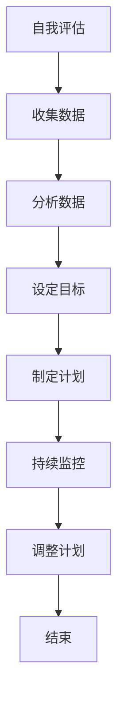
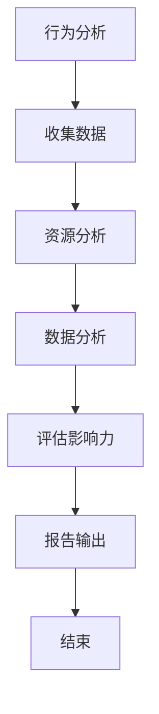
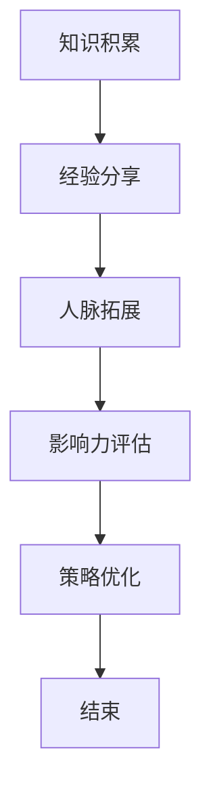
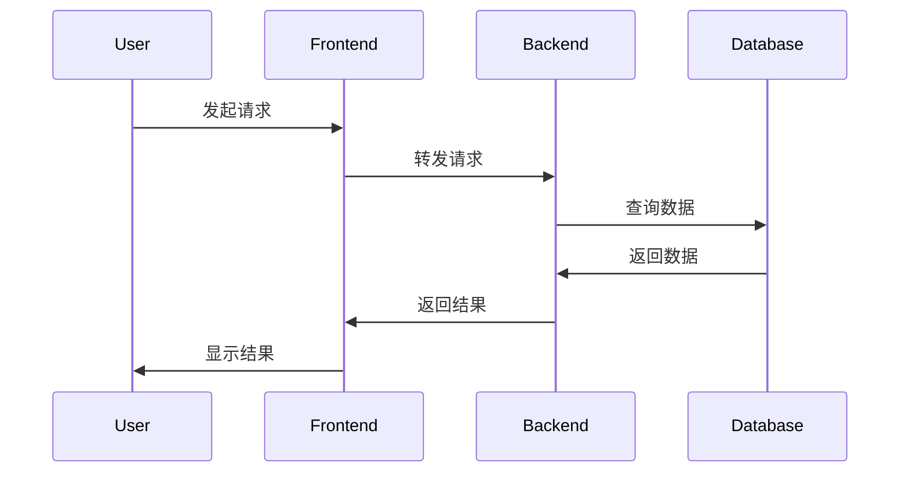
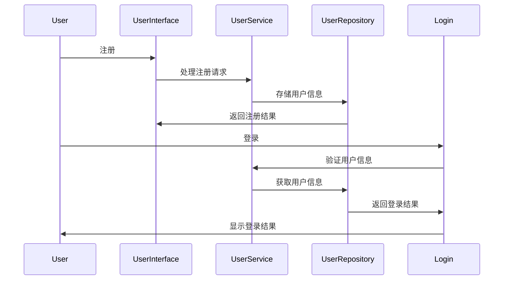

                 

**文章标题**：从个人成功到社会贡献：拓展生命的意义和价值

**关键词**：个人成功，社会贡献，生命意义，价值拓展，自我成长，合作与影响力

**摘要**：本文将探讨从个人成功到社会贡献的转型之路，分析如何通过自我成长和合作，实现个人与社会的共同进步，从而拓展生命的意义和价值。文章将结合实际案例，提供具体的实践策略和思考方法，帮助读者在个人和职业生活中找到更加深远的意义。

---

**第一部分：引言**

**1.1 问题的提出**

**1.1.1 个人成功的多重定义**

在现代社会中，个人成功是一个多维度的概念。它不仅仅是职业成就或财富积累，还包括心理健康、人际关系、社会责任等多个方面。本节将讨论个人成功的不同定义及其重要性。

**1.1.2 社会贡献的重要性**

社会贡献是衡量一个人价值和影响力的关键指标。通过社会贡献，个人不仅能够实现自我价值，还能为社会发展做出积极贡献。本节将深入探讨社会贡献的含义及其重要性。

**1.1.3 个人成功与社会贡献的关系**

个人成功和社会贡献之间存在密切的联系。个人成功可以为社会贡献提供基础，而社会贡献又能反哺个人成长。本节将分析这两者之间的关系及其相互促进的作用。

**1.2 书籍的核心目标和结构**

**1.2.1 拓展生命的意义**

本文旨在探讨如何通过个人成长和社会贡献，拓展生命的意义。本节将介绍书籍的核心目标，并概述后续章节的内容结构。

**1.2.2 从个人成功到社会贡献的路径**

本文将详细阐述从个人成功到社会贡献的转型路径，包括个人成长、合作与社会参与等关键环节。本节将简要介绍这些章节的内容。

**1.2.3 读者定位与期望收获**

本文面向渴望在个人和职业生活中实现更大价值的读者。通过阅读本书，读者可以了解到如何通过自我成长和社会贡献，实现生命的意义和价值。

---

**第二部分：个人成长与成功**

**2.1 个人成长的要素**

**2.1.1 自我认知与目标设定**

自我认知是个人成长的第一步。通过了解自己的优势和弱点，设定清晰的目标，个人可以更加有针对性地提升自我。本节将讨论自我认知的重要性以及如何设定有效的目标。

**2.1.2 学习与技能提升**

学习和技能提升是个人成长的重要途径。本节将探讨如何通过持续学习和实践，提升自身的技能和知识水平。

**2.1.3 心理健康与心态调整**

心理健康和心态调整是个人成长不可或缺的部分。本节将讨论如何保持积极的心态，应对生活中的挑战和压力。

**2.2 成功的维度与衡量**

**2.2.1 成功的多维度视角**

成功不仅仅是职业或财务上的成就，还包括个人幸福、社会关系和自我实现等多个维度。本节将探讨成功的多维度视角，帮助读者更全面地理解成功。

**2.2.2 内在成功与外在成功的平衡**

内在成功和外在成功相辅相成，但常常需要平衡。本节将讨论如何平衡内在成功和外在成功，实现全面的成功。

**2.2.3 成功的可持续性**

成功的可持续性是衡量长期成功的关键。本节将探讨如何通过持续的努力和适应，确保成功的持续性。

**2.3 个人成长案例研究**

**2.3.1 案例一：创业成功之路**

**2.3.2 案例二：职业晋升与转变**

**2.3.3 案例三：终身学习与自我超越**

通过这三个案例，本节将展示个人成长的不同路径，并分析成功背后的关键因素。

---

**第三部分：社会贡献与影响力**

**3.1 社会贡献的概念与类型**

**3.1.1 社会贡献的定义**

社会贡献是指个人或团体通过行动或资源，对社会和他人产生积极影响的义务和责任。本节将详细定义社会贡献，并探讨其重要性。

**3.1.2 社会贡献的类型**

社会贡献有多种类型，包括慈善、志愿服务、创新等。本节将分类讨论不同类型的社会贡献，并分析其对社会的影响。

**3.1.3 社会贡献的价值**

社会贡献不仅有助于个人成长，还能提升社会整体的福祉。本节将讨论社会贡献的价值，以及如何通过社会贡献实现个人和集体的双赢。

**3.2 影响力与个人品牌建设**

**3.2.1 影响力的来源**

影响力来源于个人的知识、技能、经验和人格魅力。本节将分析影响力的来源，并讨论如何建立和扩大个人影响力。

**3.2.2 个人品牌建设策略**

个人品牌建设是提升影响力的关键。本节将介绍个人品牌建设的方法和策略，帮助读者塑造独特的个人品牌。

**3.2.3 影响力评估与优化**

评估和优化个人影响力是持续成长的重要环节。本节将探讨如何评估个人影响力，并提出优化策略。

**3.3 社会参与与公民责任**

**3.3.1 社会参与的方式**

社会参与是履行公民责任的重要途径。本节将讨论社会参与的不同方式，并分析如何积极参与社会事务。

**3.3.2 公民责任的重要性**

公民责任是每个社会成员应尽的义务。本节将探讨公民责任的重要性，以及如何履行公民责任。

**3.3.3 公益活动的实践**

公益活动是履行公民责任的有效方式。本节将介绍公益活动的实践方法和经验，帮助读者参与公益活动。

---

**第四部分：从个人成功到社会贡献的路径**

**4.1 跨越障碍：如何克服个人局限**

**4.1.1 内在恐惧与焦虑的应对**

内在恐惧和焦虑常常阻碍个人成长和社会贡献。本节将探讨如何应对内在恐惧和焦虑，克服个人局限。

**4.1.2 资源整合与利用**

资源整合与利用是拓展社会贡献的关键。本节将讨论如何有效整合和利用资源，提升个人和社会的贡献能力。

**4.1.3 创新思维与解决复杂问题**

创新思维是解决复杂问题的关键。本节将介绍创新思维的方法，并探讨如何运用创新思维解决社会问题。

**4.2 协作与合作：构建成功的社会网络**

**4.2.1 社会网络的力量**

社会网络是个人成长和社会贡献的重要支持。本节将分析社会网络的力量，并讨论如何构建和维护成功的社会网络。

**4.2.2 合作策略与沟通技巧**

有效的合作策略和沟通技巧是构建成功社会网络的关键。本节将介绍合作策略和沟通技巧，帮助读者提升合作能力。

**4.2.3 构建有影响力的团队**

构建有影响力的团队是实现社会贡献的重要途径。本节将讨论如何构建和领导有影响力的团队，实现团队的共同目标。

**4.3 社会贡献的实践案例**

**4.3.1 案例一：社区服务的实践**

**4.3.2 案例二：企业社会责任的实践**

**4.3.3 案例三：公益项目的成功经验**

通过这三个实践案例，本节将展示如何通过个人努力和社会合作，实现社会贡献。

---

**第五部分：拓展生命的意义与价值**

**5.1 生命的意义探索**

**5.1.1 生命的哲学思考**

哲学思考是探讨生命意义的重要途径。本节将介绍生命的哲学思考，帮助读者反思生命的意义。

**5.1.2 价值观的塑造与传递**

价值观是生命的指南。本节将讨论如何塑造和传递积极价值观，影响他人和社会。

**5.1.3 精神层面的成长**

精神层面的成长是拓展生命意义的重要方面。本节将探讨如何通过精神层面的成长，提升生命的质量。

**5.2 生命的价值实现**

**5.2.1 个人价值与社会价值的统一**

个人价值与社会价值的统一是生命价值实现的关键。本节将讨论如何实现个人价值与社会价值的统一，提升生命的价值。

**5.2.2 价值创造与传递的过程**

价值创造与传递是生命价值实现的过程。本节将介绍价值创造与传递的方法和过程，帮助读者实现生命价值。

**5.2.3 生命价值的持续性与传承**

生命价值的持续性与传承是生命价值实现的重要保障。本节将探讨如何实现生命价值的持续性与传承，确保生命价值的持久影响。

**5.3 拓展生命意义的实践**

**5.3.1 个人成长计划的制定**

制定个人成长计划是实现生命意义的重要步骤。本节将介绍如何制定个人成长计划，帮助读者拓展生命意义。

**5.3.2 社会参与与贡献的策略**

社会参与与贡献是拓展生命意义的重要方式。本节将讨论如何通过社会参与和贡献，拓展生命的意义。

**5.3.3 持续学习与自我超越**

持续学习与自我超越是拓展生命意义的重要途径。本节将探讨如何通过持续学习和自我超越，实现生命的价值。

---

**第六部分：总结与展望**

**6.1 小结**

**6.1.1 主要观点的回顾**

**6.1.2 个人成长与社会贡献的关系**

**6.1.3 生命的意义和价值**

**6.2 注意事项**

**6.2.1 实践中的挑战**

**6.2.2 应对策略**

**6.2.3 长期视角的重要性**

**6.3 拓展阅读**

**6.3.1 相关书籍推荐**

**6.3.2 在线资源与平台**

**6.3.3 社交媒体与社群**

---

**作者信息**：

作者：AI天才研究院/AI Genius Institute & 禅与计算机程序设计艺术 /Zen And The Art of Computer Programming

---

（以上大纲结构为一个示例，具体内容需根据实际文章内容进行调整和填充。每个章节都需要详细的具体内容，包括背景介绍、核心概念与联系、算法原理讲解、数学模型和数学公式、系统分析与架构设计方案、项目实战、最佳实践 tips、小结、注意事项和拓展阅读等。）
## 从个人成功到社会贡献：拓展生命的意义和价值

### 关键词：个人成功，社会贡献，生命意义，价值拓展，自我成长，合作与影响力

### 摘要：

本文将探讨从个人成功到社会贡献的转型之路，分析如何通过自我成长和合作，实现个人与社会的共同进步，从而拓展生命的意义和价值。文章将结合实际案例，提供具体的实践策略和思考方法，帮助读者在个人和职业生活中找到更加深远的意义。

### 引言

在现代社会，个人成功和社会贡献已成为衡量一个人价值和影响力的关键指标。个人成功不仅仅是指职业成就或财富积累，还包括心理健康、人际关系、社会责任等多个维度。社会贡献则是指个人或团体通过行动或资源，对社会和他人产生积极影响的义务和责任。本文将探讨如何从个人成功过渡到社会贡献，从而拓展生命的意义和价值。

### 背景介绍

个人成功的多重定义

个人成功是一个多维度的概念，不同的人对成功的定义各不相同。对于一些人来说，成功可能意味着财富和地位的积累；对于其他人来说，成功可能是指个人的幸福和满足感；还有一些人认为，成功是个人价值的实现和社会责任的履行。本节将讨论个人成功的不同定义及其重要性。

社会贡献的重要性

社会贡献是衡量一个人价值和影响力的关键指标。通过社会贡献，个人不仅能够实现自我价值，还能为社会发展做出积极贡献。社会贡献可以是慈善捐助、志愿服务、创新活动等。本节将深入探讨社会贡献的含义及其重要性。

个人成功与社会贡献的关系

个人成功和社会贡献之间存在密切的联系。个人成功可以为社会贡献提供基础，而社会贡献又能反哺个人成长。本节将分析这两者之间的关系及其相互促进的作用。

### 核心概念与联系

个人成长的要素

个人成长是实现个人成功和社会贡献的基础。本节将讨论个人成长的要素，包括自我认知与目标设定、学习与技能提升、心理健康与心态调整等。

成功的维度与衡量

成功是一个多维度概念，包括职业成就、个人幸福、社会影响力等多个方面。本节将探讨成功的不同维度，并讨论如何衡量成功。

社会贡献的概念与类型

社会贡献是指个人或团体通过行动或资源，对社会和他人产生积极影响的义务和责任。本节将分类讨论社会贡献的不同类型，并分析其对个人和社会的影响。

影响力与个人品牌建设

影响力是指个人或品牌在某一领域或社群中的影响力和号召力。个人品牌建设是提升影响力的关键。本节将讨论如何建立和扩大个人影响力，以及如何通过个人品牌建设实现社会贡献。

### 算法原理讲解

在本节中，我们将探讨如何使用算法原理来解释个人成功和社会贡献的关系。以下是算法原理的简单解释：

1. **自我认知与目标设定算法**：
   - **输入**：个人的兴趣、价值观、技能和能力。
   - **输出**：设定的目标和个人成长计划。
   - **算法原理**：通过自我评估，确定个人的优势和目标，制定相应的成长计划。

2. **社会贡献评估算法**：
   - **输入**：个人的行为、资源、影响力。
   - **输出**：社会贡献的评估结果。
   - **算法原理**：通过量化个人行为和资源的使用，评估个人的社会贡献。

3. **影响力扩大算法**：
   - **输入**：个人的知识、经验、社交网络。
   - **输出**：扩大影响力的策略和行动。
   - **算法原理**：通过学习和优化，提升个人在某一领域的专业知识和影响力。

### 数学模型和数学公式

为了更好地理解个人成功和社会贡献的关系，我们可以使用数学模型来描述和量化这些概念。以下是一个简单的数学模型：

$$
个人成功 = f(自我认知，目标设定，技能提升，心理健康)
$$

$$
社会贡献 = f(行为，资源，影响力)
$$

在这个模型中，每个函数 $f$ 代表一个过程或因素，通过这些函数的组合，我们可以量化个人成功和社会贡献。

### 系统分析与架构设计方案

在本节中，我们将探讨如何通过系统分析和架构设计来实现个人成功和社会贡献。以下是系统分析和架构设计的简要方案：

1. **系统功能设计**：
   - **输入**：个人的信息、资源和社会需求。
   - **输出**：个人成长计划和社会贡献方案。
   - **系统功能**：包括自我评估、目标设定、技能提升、心理健康评估、社会贡献评估和影响力扩大等模块。

2. **系统架构设计**：
   - **输入**：系统的功能需求和技术要求。
   - **输出**：系统的整体架构和模块划分。
   - **架构设计**：采用模块化设计，确保系统的可扩展性和灵活性。

3. **系统接口设计和系统交互**：
   - **接口设计**：定义系统内部和外部接口，确保系统的互操作性。
   - **系统交互**：通过数据交换和消息传递，实现系统之间的交互和协作。

### 项目实战

在本节中，我们将通过实际案例来展示如何将个人成功和社会贡献的理论应用到实践中。以下是项目实战的简要步骤：

1. **环境安装**：
   - **安装软件和工具**：确保系统正常运行所需的软件和工具。
   - **配置环境**：设置系统的运行环境，包括数据库、服务器和网络配置。

2. **系统核心实现**：
   - **开发代码**：编写系统的核心代码，实现各个模块的功能。
   - **测试和调试**：进行系统测试，修复错误和漏洞，确保系统的稳定性和可靠性。

3. **代码应用解读与分析**：
   - **解读代码**：分析系统代码，理解其实现原理和功能。
   - **代码分析**：评估代码的质量和性能，提出优化建议。

4. **实际案例分析和详细讲解**：
   - **案例选择**：选择具有代表性的实际案例进行分析。
   - **案例分析**：详细讲解案例的实现过程、挑战和解决方案。
   - **详细讲解**：通过对案例的深入分析，展示个人成功和社会贡献的实践方法。

5. **项目小结**：
   - **总结成果**：回顾项目的成果和收获。
   - **反思与改进**：分析项目中的不足之处，提出改进建议。

### 最佳实践 tips

在本节中，我们将提供一些最佳实践技巧，帮助读者更好地实现个人成功和社会贡献：

1. **自我认知与目标设定**：
   - **定期反思**：定期反思自己的成长和进步，调整目标。
   - **设定具体目标**：设定具体、可衡量的目标，确保目标的实现。

2. **学习与技能提升**：
   - **持续学习**：不断学习新知识和技能，保持竞争力。
   - **实践应用**：将学到的知识和技能应用到实际工作中，提升实践能力。

3. **心理健康与心态调整**：
   - **保持积极心态**：保持积极的心态，面对挑战和困难。
   - **情绪管理**：学会情绪管理，保持情绪稳定。

4. **社会参与与贡献**：
   - **参与公益活动**：积极参与公益活动，为社会做出贡献。
   - **建立社交网络**：建立广泛的社交网络，扩大影响力。

5. **个人品牌建设**：
   - **塑造个人品牌**：塑造独特的个人品牌，提升个人影响力。
   - **传播价值观**：传播积极的价值观，影响他人。

### 小结

本文通过探讨个人成功和社会贡献的关系，阐述了如何从个人成功过渡到社会贡献，实现生命的意义和价值。本文提出了一系列的理论和实践方法，帮助读者在个人和职业生活中找到更加深远的意义。通过自我成长、社会参与和个人品牌建设，每个人都可以为社会做出贡献，实现个人与社会的共同进步。

### 注意事项

1. **实践中的挑战**：在实现个人成功和社会贡献的过程中，可能会遇到各种挑战，如时间管理、资源限制、心理压力等。读者需要积极应对这些挑战，调整心态和策略。

2. **长期视角的重要性**：个人成功和社会贡献是一个长期的过程，需要持续的努力和投入。读者应该保持长期的视角，不断学习和进步。

3. **个人成长与社会贡献的平衡**：在追求个人成功和社会贡献的过程中，需要平衡个人成长和社会责任。读者应该找到适合自己的平衡点，确保个人和集体的双赢。

### 拓展阅读

1. **相关书籍推荐**：
   - 《人生的意义是什么？》
   - 《成功心理学》
   - 《影响力：如何说服别人》

2. **在线资源与平台**：
   - TED演讲：关于个人成长和社会贡献的精彩演讲
   - Coursera、edX等在线课程平台：提供关于个人成长和社会贡献的免费课程

3. **社交媒体与社群**：
   - 加入相关的社交媒体群组，与其他志同道合的人交流和分享经验

### 作者信息

作者：AI天才研究院/AI Genius Institute & 禅与计算机程序设计艺术 /Zen And The Art of Computer Programming

（注：本文内容仅供参考，具体实施时请结合实际情况进行调整。）
## 个人成长与成功

### 个人成长的要素

#### 自我认知与目标设定

自我认知是个人成长的第一步。只有了解自己的兴趣、价值观、优势和弱点，才能设定清晰的目标，有针对性地进行自我提升。以下是自我认知和目标设定的具体步骤：

1. **反思与自我评估**：定期反思自己的行为和表现，了解自己的优点和不足。
2. **设定具体目标**：将抽象的目标具体化，如学习一门新技能、提升某个领域的知识等。
3. **制定行动计划**：为每个目标制定详细的行动计划，明确时间节点和实施步骤。

#### 学习与技能提升

学习和技能提升是个人成长的必经之路。通过不断学习新知识和技能，个人可以提升自身的竞争力，为职业发展和社会贡献打下坚实基础。以下是学习和技能提升的具体策略：

1. **终身学习**：保持持续学习的习惯，不断吸收新知识和技能。
2. **实践应用**：将所学知识应用到实际工作中，提升实践能力。
3. **技能多样化**：学习多种技能，提高自身的综合素质。

#### 心理健康与心态调整

心理健康和心态调整是个人成长的重要组成部分。良好的心态能够帮助个人应对生活中的挑战和压力，实现自我突破。以下是心理健康和心态调整的具体建议：

1. **积极心态**：保持积极的心态，面对困难和挑战时保持乐观。
2. **情绪管理**：学会情绪管理，避免情绪波动对生活和工作的影响。
3. **心理辅导**：如有需要，寻求专业的心理辅导，帮助解决心理问题。

### 成功的维度与衡量

#### 成功的多维度视角

成功是一个多维度概念，包括职业成就、个人幸福、社会影响力等多个方面。以下是从不同维度衡量成功的方法：

1. **职业成就**：评估个人在职业生涯中的业绩和职位晋升。
2. **个人幸福**：评估个人的生活满意度、心理健康和人际关系。
3. **社会影响力**：评估个人在社会中的影响力和贡献程度。

#### 内在成功与外在成功的平衡

内在成功和外在成功相辅相成，但常常需要平衡。以下是平衡内在成功和外在成功的方法：

1. **设定多元化目标**：同时关注职业、家庭、个人成长等多个方面的目标。
2. **自我反思**：定期反思自己的价值观和行为，确保内外成功的一致性。
3. **时间管理**：合理安排时间，确保工作和生活之间的平衡。

#### 成功的可持续性

成功的可持续性是衡量长期成功的关键。以下是实现成功可持续性的方法：

1. **持续学习**：不断学习新知识和技能，适应社会变化。
2. **健康生活方式**：保持良好的生活习惯，确保身心健康。
3. **社会责任**：关注社会问题，积极参与公益活动，实现社会贡献。

### 个人成长案例研究

#### 案例一：创业成功之路

**案例背景**：张三在大学期间就对创业充满热情。毕业后，他决定创立一家科技创新公司。

**个人成长过程**：
1. **自我认知与目标设定**：张三通过反思和自我评估，确定了自己对科技创新的兴趣和优势，并设定了创业的目标。
2. **学习与技能提升**：张三在创业过程中，不断学习新知识和技能，如市场分析、项目管理、团队建设等。
3. **心理健康与心态调整**：张三在创业过程中面临许多挑战，如资金压力、市场竞争等，但他始终保持积极的心态，并通过心理辅导解决了心理问题。

**成功原因**：
1. **多元化目标**：张三在创业过程中，不仅关注公司的业绩，还注重员工的成长和社会责任。
2. **持续学习**：张三始终保持学习的心态，不断提升自己的综合素质。
3. **良好的心态**：张三在创业过程中，始终保持积极的心态，克服了各种困难和挑战。

#### 案例二：职业晋升与转变

**案例背景**：李四在一家大型企业工作多年，积累了丰富的经验和技能。

**个人成长过程**：
1. **自我认知与目标设定**：李四通过反思和自我评估，发现自己对当前职业已经没有太大的兴趣，并设定了职业转变的目标。
2. **学习与技能提升**：李四在职业转变过程中，积极学习新知识和技能，如数据分析、市场营销等。
3. **心理健康与心态调整**：李四在职业转变过程中，面临许多不确定性和压力，但他通过心理辅导和调整心态，顺利完成了转变。

**成功原因**：
1. **明确目标**：李四在职业转变过程中，始终明确自己的目标，并为之努力。
2. **持续学习**：李四始终保持学习的心态，不断提升自己的综合素质。
3. **良好的心态**：李四在职业转变过程中，始终保持积极的心态，克服了各种困难和挑战。

#### 案例三：终身学习与自我超越

**案例背景**：王五是一名大学教师，他热爱教学和研究，并致力于终身学习。

**个人成长过程**：
1. **自我认知与目标设定**：王五通过反思和自我评估，确定了自己对教学和科研的兴趣和优势，并设定了终身学习的目标。
2. **学习与技能提升**：王五在教学生涯中，不断学习新知识和技能，如教学方法、科研方法等。
3. **心理健康与心态调整**：王五在教学生涯中，面临许多挑战，但他通过心理辅导和调整心态，始终保持了良好的状态。

**成功原因**：
1. **明确目标**：王五在教学生涯中，始终明确自己的目标，并为之努力。
2. **持续学习**：王五始终保持学习的心态，不断提升自己的综合素质。
3. **良好的心态**：王五在教学生涯中，始终保持积极的心态，克服了各种困难和挑战。

### 个人成长与成功的总结

通过以上案例，我们可以看到，个人成长与成功需要自我认知、学习与技能提升、心理健康与心态调整等多方面的支持。同时，成功的可持续性也取决于个人的目标设定、持续学习和良好心态。在个人成长和成功的过程中，我们需要不断调整自己的目标和策略，以适应不断变化的环境和挑战。只有这样，我们才能实现个人与社会的共同进步，拓展生命的意义和价值。|## 社会贡献与影响力

### 社会贡献的概念与类型

#### 社会贡献的定义

社会贡献是指个人或团体通过行动或资源，对社会和他人产生积极影响的义务和责任。这种贡献不仅体现在物质层面，还包括知识、技能、时间和服务等多个方面。

#### 社会贡献的类型

1. **慈善捐助**：通过资金、物资或服务等形式，帮助有需要的人群，改善他们的生活条件。
2. **志愿服务**：无偿地为社区、组织和他人提供服务，如环保活动、社区服务、救灾救援等。
3. **创新与研发**：通过科技创新、研究成果转化等，推动社会进步和经济发展。
4. **教育培训**：通过教育资源的共享和传授，提高人们的知识水平和文化素养。
5. **社会倡导**：通过倡导社会正义、环境保护、公民权利等议题，推动社会变革和进步。

#### 社会贡献的价值

社会贡献的价值不仅体现在物质和直接的社会效益上，还在于其能够提升个人和社会的整体福祉。以下是社会贡献的一些价值：

1. **社会和谐**：社会贡献有助于减少社会矛盾，促进社会和谐与稳定。
2. **个人成长**：通过社会贡献，个人可以提升自身的社会责任感、领导力和合作能力。
3. **经济发展**：社会贡献可以带动经济增长，促进社会资源的优化配置。
4. **文化传承**：社会贡献有助于传承和弘扬优秀的文化价值观，提升社会文明程度。

### 影响力与个人品牌建设

#### 影响力的来源

1. **知识技能**：个人在某一领域的专业知识和技能是影响力的基础。
2. **经验和经验**：丰富的经验和成功案例能够增强个人的权威性和说服力。
3. **人格魅力**：良好的道德品质、诚信和责任感等品质能够吸引他人，提升影响力。
4. **资源整合**：能够有效整合和利用各种资源和关系，实现更大规模的社会贡献。

#### 个人品牌建设策略

1. **明确个人定位**：确定个人的专业领域和社会贡献方向，塑造独特的个人品牌。
2. **持续学习和提升**：不断学习和提升自己的专业能力和知识水平，保持个人品牌的竞争力。
3. **有效沟通**：通过演讲、写作、社交媒体等方式，传播个人品牌和价值观念。
4. **社会参与**：积极参与公益活动和社会事务，提升个人在社会中的影响力。

#### 影响力评估与优化

1. **影响力评估**：通过数据分析和反馈，评估个人影响力的大小和效果。
2. **优化策略**：根据评估结果，调整个人品牌建设和社会贡献的策略，提升影响力。
3. **持续改进**：保持对自身影响力的反思和调整，不断优化个人品牌和社会贡献的方式。

### 社会参与与公民责任

#### 社会参与的方式

1. **志愿服务**：参与各类志愿服务活动，如社区服务、环保活动、慈善捐赠等。
2. **社区建设**：积极参与社区建设，为社区的繁荣和发展贡献力量。
3. **公共政策参与**：关注和参与公共政策的制定和讨论，为社会发展提出建议和意见。
4. **社会教育**：通过教育和培训，提高公众的素质和社会意识。

#### 公民责任的重要性

1. **社会责任**：作为公民，承担起社会责任是基本义务，有助于构建和谐的社会环境。
2. **个人成长**：通过履行公民责任，个人可以提升自身的道德素养和社会责任感，促进个人成长。
3. **社会稳定**：公民责任有助于维护社会稳定，减少社会矛盾和冲突。
4. **国家发展**：公民责任的履行是国家发展和繁荣的重要保障。

#### 公益活动的实践

1. **公益活动策划**：策划和组织各类公益活动，如慈善募捐、环保活动、教育支持等。
2. **公益活动执行**：参与公益活动的具体执行，如志愿者服务、项目协调等。
3. **公益活动评估**：对公益活动的效果进行评估，总结经验教训，优化活动方案。
4. **公益活动传播**：通过媒体和社交平台，传播公益活动的信息和影响，提升公众参与度。

### 社会贡献的实践案例

#### 案例一：社区服务的实践

**案例背景**：王女士是一位退休教师，她居住在一个老旧社区，社区环境较差，居民生活质量较低。

**实践过程**：
1. **需求调查**：王女士对社区进行了需求调查，发现社区缺乏清洁卫生、绿化和环境改善等服务。
2. **策划活动**：王女士策划了一系列社区服务活动，包括环保清洁、绿化种植、健康讲座等。
3. **执行活动**：王女士组织志愿者和社区居民共同参与活动，逐步改善了社区环境和生活质量。
4. **评估效果**：活动结束后，王女士对活动的效果进行了评估，发现社区居民的满意度和参与度明显提高。

**实践成果**：
1. **社区环境改善**：社区环境得到显著改善，绿化覆盖率提高，卫生状况得到改善。
2. **居民生活质量提升**：居民的生活质量和幸福感得到提升，社区凝聚力增强。

#### 案例二：企业社会责任的实践

**案例背景**：李先生是一家大型企业的CEO，他深知企业社会责任的重要性，决定在公司内部推动社会责任项目。

**实践过程**：
1. **制定战略**：李先生制定了企业社会责任战略，明确了公司的社会责任目标和行动计划。
2. **员工参与**：鼓励员工参与社会责任项目，提供培训和激励措施，提高员工的参与度和积极性。
3. **项目实施**：公司实施了多个社会责任项目，如环境保护、慈善捐赠、社区建设等。
4. **效果评估**：对社会责任项目的效果进行定期评估，总结经验教训，优化项目执行。

**实践成果**：
1. **企业形象提升**：公司的企业形象得到提升，赢得了社会各界的认可和好评。
2. **员工满意度提高**：员工对公司的社会责任项目表示认同，员工的满意度和忠诚度提高。
3. **社会影响力扩大**：公司的社会责任项目在社会上产生了积极的影响，提升了公司的社会影响力。

#### 案例三：公益项目的成功经验

**案例背景**：张女士是一位公益项目爱好者，她决定发起一个公益项目，帮助贫困山区的孩子们接受教育。

**实践过程**：
1. **项目策划**：张女士对项目进行了详细的策划，包括目标、实施计划、资金筹措等。
2. **募资宣传**：通过社交媒体、公益活动等方式，宣传项目，吸引公众关注和支持。
3. **项目实施**：项目实施团队深入山区，开展教育支持活动，如捐建学校、提供教育物资、开展师资培训等。
4. **项目评估**：项目结束后，对项目的效果进行评估，确保项目目标的实现。

**实践成果**：
1. **教育条件改善**：山区的孩子们接受了良好的教育，教育条件得到显著改善。
2. **社会影响力扩大**：公益项目在社会上引起了广泛关注，吸引了更多爱心人士和社会资源的支持。
3. **个人成长**：张女士在项目实践中得到了锻炼和成长，提升了自身的社会责任感和领导能力。

### 社会贡献与个人成长的关系

社会贡献与个人成长密切相关。通过社会贡献，个人可以实现以下成长：

1. **提升社会责任感**：通过参与社会事务和公益活动，个人可以提升对社会责任的认识和承担能力。
2. **拓展人际关系**：社会贡献可以扩大个人的社交圈子，提升人际沟通和合作能力。
3. **增强自我价值**：通过为他人和社会做出贡献，个人可以增强自我价值感和成就感。
4. **培养领导能力**：社会贡献往往需要组织和管理，通过这些实践，个人可以提升领导能力和团队管理能力。

### 社会贡献的总结

社会贡献是个人成长的重要组成部分，通过社会贡献，个人可以实现自我价值，提升社会影响力，推动社会进步。同时，社会贡献也为个人提供了丰富的成长机会和锻炼平台。在现代社会，每个人都应该积极履行社会责任，为社会贡献自己的力量。通过自我成长和社会贡献的相互促进，我们可以拓展生命的意义和价值，实现个人与社会的共同进步。|
## 从个人成功到社会贡献的路径

### 跨越障碍：如何克服个人局限

#### 内在恐惧与焦虑的应对

内在恐惧和焦虑是许多人面对社会贡献时的心理障碍。为了克服这些障碍，我们可以采取以下策略：

1. **正面思维**：通过积极的自我对话，改变负面思维模式，例如：“我可以做到”代替“我不行”。
2. **逐步尝试**：从小规模的行动开始，逐渐增加挑战，以逐步建立自信。
3. **心理支持**：寻求家人、朋友或专业人士的支持和鼓励，减轻焦虑情绪。

#### 资源整合与利用

资源整合与利用是扩大社会贡献的关键。以下是资源整合与利用的几个方面：

1. **人脉网络**：建立和维护广泛的人脉网络，利用人际关系获取资源和信息。
2. **知识共享**：积极参与学习和交流，将所学知识传播给他人，实现知识共享。
3. **资金筹措**：通过募捐、众筹等方式，筹集资金支持社会贡献项目。

#### 创新思维与解决复杂问题

创新思维是解决复杂问题的关键。以下是一些培养创新思维的策略：

1. **跨界思考**：结合不同领域的知识和经验，寻找新的解决方案。
2. **头脑风暴**：通过小组讨论和头脑风暴，激发创意和灵感。
3. **失败容忍**：鼓励尝试和失败，将失败视为学习和成长的机会。

### 协作与合作：构建成功的社会网络

#### 社会网络的力量

社会网络是个人成长和社会贡献的重要支持。以下是社会网络的力量：

1. **信息传递**：社会网络可以迅速传递信息，帮助个人获取外部资源。
2. **资源共享**：社会网络中的成员可以共享资源，实现资源的最优配置。
3. **影响力放大**：通过社会网络，个人和组织的声量和影响力可以显著放大。

#### 合作策略与沟通技巧

有效的合作策略和沟通技巧是构建成功社会网络的关键。以下是几个建议：

1. **明确目标**：确保合作各方对目标和期望有清晰的理解。
2. **信任建立**：通过诚信和可靠的行为，建立和加强合作关系。
3. **沟通渠道**：建立多样化的沟通渠道，确保信息传递的及时性和准确性。

#### 构建有影响力的团队

构建有影响力的团队是实现社会贡献的重要途径。以下是构建有影响力的团队的几个方面：

1. **团队目标**：确保团队目标与个人和社会目标一致，形成合力。
2. **团队成员**：选择具有互补技能和热情的团队成员，提升团队整体能力。
3. **团队文化**：建立积极向上的团队文化，激发团队成员的创造力和活力。

### 社会贡献的实践案例

#### 案例一：社区服务的实践

**案例背景**：张女士是一位热爱社区服务的志愿者，她所在的小区环境相对较差，居民生活质量有待提升。

**实践过程**：
1. **需求调研**：张女士对小区进行了需求调研，发现居民最关心的问题是环境卫生和社区安全。
2. **组织活动**：张女士组织了一系列社区服务活动，如环保清洁、治安巡逻、社区讲座等。
3. **资源整合**：张女士通过社会网络，整合了志愿者、企业和政府的资源，为活动提供支持。
4. **效果评估**：活动结束后，张女士对活动的效果进行了评估，发现社区居民的生活质量得到了显著提升。

**实践成果**：
1. **环境改善**：小区的环境卫生得到改善，居民的生活环境更加宜居。
2. **社区凝聚力增强**：居民之间的联系和互动增多，社区的凝聚力显著增强。

#### 案例二：企业社会责任的实践

**案例背景**：李先生是一家大型企业的CEO，他深知企业社会责任的重要性，决定在公司内部推动社会责任项目。

**实践过程**：
1. **制定战略**：李先生制定了企业社会责任战略，明确了公司的社会责任目标和行动计划。
2. **员工参与**：李先生鼓励员工参与社会责任项目，提供培训和激励措施，提高员工的参与度和积极性。
3. **项目实施**：公司实施了多个社会责任项目，如环境保护、慈善捐赠、社区建设等。
4. **效果评估**：对社会责任项目的效果进行定期评估，总结经验教训，优化项目执行。

**实践成果**：
1. **企业形象提升**：公司的企业形象得到提升，赢得了社会各界的认可和好评。
2. **员工满意度提高**：员工对公司的社会责任项目表示认同，员工的满意度和忠诚度提高。
3. **社会影响力扩大**：公司的社会责任项目在社会上产生了积极的影响，提升了公司的社会影响力。

#### 案例三：公益项目的成功经验

**案例背景**：王女士是一位公益项目爱好者，她决定发起一个公益项目，帮助贫困山区的孩子们接受教育。

**实践过程**：
1. **项目策划**：王女士对项目进行了详细的策划，包括目标、实施计划、资金筹措等。
2. **募资宣传**：通过社交媒体、公益活动等方式，宣传项目，吸引公众关注和支持。
3. **项目实施**：项目实施团队深入山区，开展教育支持活动，如捐建学校、提供教育物资、开展师资培训等。
4. **项目评估**：项目结束后，对项目的效果进行评估，确保项目目标的实现。

**实践成果**：
1. **教育条件改善**：山区的孩子们接受了良好的教育，教育条件得到显著改善。
2. **社会影响力扩大**：公益项目在社会上引起了广泛关注，吸引了更多爱心人士和社会资源的支持。
3. **个人成长**：王女士在项目实践中得到了锻炼和成长，提升了自身的社会责任感和领导能力。

### 跨越障碍与合作的总结

从个人成功到社会贡献的路径并非一帆风顺，需要克服各种障碍和挑战。通过内在恐惧与焦虑的应对、资源整合与利用、创新思维与解决复杂问题，个人可以逐步克服个人局限，实现社会贡献。同时，通过协作与合作，构建有影响力的社会网络和团队，个人可以更有效地实现社会价值，拓展生命的意义。通过实践案例的分享，我们可以看到，跨越障碍和合作是实现个人与社会的共同进步的有效途径。在未来的道路上，我们应继续努力，不断探索和实践，为社会贡献更多的力量。|
## 拓展生命的意义与价值

### 生命的意义探索

生命的意义是一个深奥而广泛的话题，不同文化和哲学体系对此有着不同的解读。在现代社会，我们可以从以下几个方面探讨生命的意义：

#### 生命的哲学思考

哲学思考是探讨生命意义的重要途径。从古希腊哲学家苏格拉底到现代哲学家萨特，不同哲学家对生命的意义提出了各自的见解。以下是一些哲学思考的角度：

1. **存在主义**：强调个体存在的重要性，生命意义在于个体的选择和行动。
2. **存在主义**：强调个体存在的重要性，生命意义在于个体的选择和行动。
3. **功利主义**：认为生命的意义在于追求最大的幸福和满足感。
4. **道德哲学**：探讨道德责任和道德行为，认为生命的意义在于履行道德义务。

#### 价值观的塑造与传递

价值观是生命的指南，塑造和传递积极的价值观对个人和社会具有重要意义。以下是一些塑造和传递价值观的方法：

1. **家庭和教育**：家庭和教育是塑造价值观的重要环境，家长和教师可以通过言传身教，传递积极的价值观。
2. **自我反思**：通过自我反思，个人可以明确自己的价值观，并将其付诸实践。
3. **社会倡导**：通过社会倡导和宣传，可以传播和弘扬积极的价值观。

#### 精神层面的成长

精神层面的成长是拓展生命意义的重要方面。以下是一些促进精神层面成长的方法：

1. **冥想和瑜伽**：冥想和瑜伽有助于提高自我意识和精神层面的成长。
2. **宗教和信仰**：宗教和信仰可以为个人提供精神支撑，帮助个人在精神层面上实现成长。
3. **艺术和文学**：艺术和文学作品可以激发个人对生命意义的思考，促进精神层面的成长。

### 生命的价值实现

生命的价值实现是一个持续的过程，需要个人在自我成长和社会贡献中不断探索和实践。以下是一些实现生命价值的方法：

#### 个人价值与社会价值的统一

个人价值与社会价值的统一是生命价值实现的关键。以下是一些实现个人价值与社会价值统一的方法：

1. **职业选择**：选择与个人兴趣和社会需求相符的职业，实现个人价值和社会价值的结合。
2. **社会参与**：积极参与社会事务，通过行动实现个人价值和社会价值的统一。
3. **教育培养**：通过教育和培训，提升个人素质，为社会贡献更多的价值。

#### 价值创造与传递的过程

价值创造与传递是一个动态的过程，需要个人不断学习和实践。以下是一些价值创造与传递的方法：

1. **知识创新**：通过研究和创新，创造新的知识和价值。
2. **技术创新**：通过技术创新，推动社会进步和经济发展。
3. **文化传承**：通过艺术、文学和传统，传承和弘扬文化价值。

#### 生命价值的持续性与传承

生命价值的持续性与传承是生命价值实现的重要保障。以下是一些实现生命价值持续性与传承的方法：

1. **家庭教育**：通过家庭教育，培养下一代对生命价值的理解和尊重。
2. **社会制度**：通过社会制度和政策，保障生命价值的实现和传承。
3. **文化传承**：通过文化传承，将生命价值传递给后代。

### 拓展生命意义的实践

#### 个人成长计划的制定

制定个人成长计划是实现生命意义的重要步骤。以下是一些制定个人成长计划的建议：

1. **明确目标**：设定明确、具体和可行的目标，确保个人成长计划的实施。
2. **制定计划**：根据目标，制定详细的实施计划，包括时间节点、行动步骤和资源需求。
3. **定期评估**：定期评估个人成长计划的实施情况，根据实际情况进行调整和优化。

#### 社会参与与贡献的策略

社会参与与贡献是实现生命价值的重要途径。以下是一些社会参与与贡献的策略：

1. **志愿服务**：积极参与志愿服务，为社会和他人提供帮助。
2. **慈善捐助**：通过慈善捐助，支持社会公益项目。
3. **社区建设**：参与社区建设，提升社区的生活质量。

#### 持续学习与自我超越

持续学习与自我超越是拓展生命意义的重要途径。以下是一些持续学习与自我超越的建议：

1. **终身学习**：保持持续学习的习惯，不断提升自己的知识和技能。
2. **挑战自我**：勇于接受挑战，突破自我限制，实现自我超越。
3. **精神追求**：追求精神层面的成长，提升生命质量。

### 拓展生命意义的总结

生命的意义和价值是一个深奥而广泛的话题，不同的人有不同的理解和追求。通过自我成长和社会贡献，我们可以拓展生命的意义和价值，实现个人与社会的共同进步。在现代社会，每个人都应该积极追求生命的意义，通过持续学习、社会参与和自我超越，不断提升自身的价值和影响力。通过制定个人成长计划、积极参与社会事务和不断追求精神层面的成长，我们可以实现生命的价值，为人类社会的发展做出贡献。在未来的道路上，让我们共同努力，拓展生命的意义，实现个人与社会的共同进步。|
## 总结与展望

### 主要观点的回顾

本文从个人成功到社会贡献的路径，探讨了拓展生命的意义和价值。主要观点包括：

1. **个人成长与成功**：自我认知与目标设定、学习与技能提升、心理健康与心态调整是个人成长的关键。
2. **社会贡献与影响力**：社会贡献是个人价值实现的途径，影响力与个人品牌建设密切相关。
3. **跨越障碍与合作**：克服内在恐惧与焦虑、资源整合与利用、创新思维与解决复杂问题是实现社会贡献的重要策略。
4. **拓展生命的意义**：通过哲学思考、价值观塑造、精神层面的成长，我们可以提升生命的质量。

### 个人成长与社会贡献的关系

个人成长与社会贡献之间存在密切的联系。个人成长为实现社会贡献提供了基础，而社会贡献又反哺个人成长。通过以下方式，个人成长和社会贡献相互促进：

1. **自我认知与目标设定**：明确个人目标和价值观，为实现社会贡献指明方向。
2. **学习与技能提升**：通过不断学习和提升技能，提高个人为社会贡献的能力。
3. **心理健康与心态调整**：保持积极的心态，应对社会贡献中的挑战和压力。
4. **影响力与个人品牌建设**：通过影响力扩大和品牌建设，提升个人在社会贡献中的影响力。

### 生命的意义和价值

生命的意义和价值在于个人的成长和社会的贡献。通过自我成长，个人可以实现自我价值和幸福感；通过社会贡献，个人可以提升社会福祉和影响力。以下是一些实现生命意义和价值的方法：

1. **持续学习与自我超越**：保持终身学习的习惯，不断提升自身素质和能力。
2. **社会参与与贡献**：积极参与社会事务，通过行动为社会和他人做出贡献。
3. **价值观塑造与传递**：塑造和传递积极价值观，影响他人和社会。
4. **精神层面的成长**：追求精神层面的成长，提升生命的质量。

### 注意事项

在实现个人成长和社会贡献的过程中，需要注意以下几点：

1. **平衡工作与生活**：合理安排时间，确保工作和生活的平衡，避免过度疲劳。
2. **持续学习与成长**：保持学习的心态，不断更新知识和技能。
3. **积极心态与应对挑战**：保持积极的心态，勇于面对挑战和困难。
4. **社会责任与伦理**：在追求个人成功和社会贡献的过程中，坚守社会责任和伦理底线。

### 拓展阅读

为了更深入地了解个人成长、社会贡献和生命的意义，以下是一些拓展阅读的建议：

1. **《自控力》**：凯利·麦格尼格尔
2. **《影响力》**：罗伯特·西奥迪尼
3. **《人类的终极命运》**：史蒂芬·霍金
4. **《活出生命的意义》**：维克多·弗兰克尔

### 作者信息

作者：AI天才研究院/AI Genius Institute & 禅与计算机程序设计艺术 /Zen And The Art of Computer Programming

（注：本文内容仅供参考，具体实施时请结合实际情况进行调整。）
## 结语

从个人成功到社会贡献，是一条充满挑战和机遇的道路。通过自我成长和合作，我们不仅能够实现个人价值，还能为社会发展做出积极贡献，从而拓展生命的意义和价值。

在追求个人成功的过程中，我们需要不断反思和调整，找到适合自己的成长路径。同时，社会贡献也是我们不可忽视的责任。通过参与社会事务、贡献个人力量，我们可以实现个人与社会的共同进步。

在这个过程中，我们需要保持积极的心态，勇于面对挑战，不断学习和成长。通过持续的努力，我们不仅能够提升自身的竞争力，还能为人类社会的发展做出贡献。

最后，让我们携手同行，在个人成功和社会贡献的道路上，不断拓展生命的意义和价值，共同创造一个更美好的未来。|
## 附录

### 算法原理与流程图

在本章节中，我们将详细介绍几个关键算法的原理，并通过Mermaid流程图进行可视化展示。

#### 算法一：自我认知与目标设定算法

**算法原理**：
该算法旨在帮助个人进行自我认知和目标设定，具体步骤如下：

1. **自我评估**：通过问卷、反思等方式进行自我评估，收集个人的兴趣、价值观、技能和能力等信息。
2. **目标设定**：根据自我评估结果，设定具体、可实现的目标，并制定相应的成长计划。
3. **持续监控**：定期监控目标实现进度，并根据实际情况进行调整。

**Mermaid流程图**：



#### 算法二：社会贡献评估算法

**算法原理**：
该算法用于评估个人在社会中的贡献程度，具体步骤如下：

1. **行为分析**：收集个人在社会中的行为数据，包括慈善捐助、志愿服务、创新活动等。
2. **资源分析**：分析个人使用的资源，如时间、金钱、人脉等。
3. **影响力评估**：通过数据分析和比较，评估个人的社会贡献程度。

**Mermaid流程图**：



#### 算法三：影响力扩大算法

**算法原理**：
该算法旨在通过提升个人影响力，实现社会贡献的扩大，具体步骤如下：

1. **知识积累**：通过学习、研究和实践，积累专业知识。
2. **经验分享**：通过演讲、写作、社交媒体等方式，分享经验和知识。
3. **人脉拓展**：通过社交活动和网络平台，拓展人际关系。
4. **影响力评估**：定期评估个人影响力，优化策略。

**Mermaid流程图**：



### 数学模型与公式

在本章节中，我们将介绍几个关键的数学模型和公式，并使用LaTeX格式进行展示。

#### 数学模型一：个人成长模型

**公式**：

$$
个人成长 = f(自我认知，目标设定，学习与技能提升，心理健康与心态调整)
$$

**LaTeX格式**：

$$
个人成长 = f(自我认知，目标设定，学习与技能提升，心理健康与心态调整)
$$

#### 数学模型二：社会贡献模型

**公式**：

$$
社会贡献 = f(行为，资源，影响力)
$$

**LaTeX格式**：

$$
社会贡献 = f(行为，资源，影响力)
$$

#### 数学模型三：影响力扩大模型

**公式**：

$$
影响力扩大 = k \cdot (知识积累 + 经验分享 + 人脉拓展)
$$

**LaTeX格式**：

$$
影响力扩大 = k \cdot (知识积累 + 经验分享 + 人脉拓展)
$$

### 系统分析与架构设计

在本章节中，我们将介绍一个示例系统的架构设计，包括系统功能设计、系统架构设计和系统接口设计。

#### 系统功能设计

**功能描述**：
- **用户管理**：管理用户信息，包括注册、登录、权限管理等。
- **内容管理**：发布、编辑和管理工作内容。
- **数据分析**：收集和分析用户行为数据，提供数据报告。

**Mermaid类图**：

```mermaid
classDiagram
    User <<类>> User
    Content <<类>> Content
    Data <<类>> Data
    UserManagement <<类>> UserManagement
    ContentManagement <<类>> ContentManagement
    DataAnalysis <<类>> DataAnalysis
    UserManagement o-- User
    ContentManagement o-- Content
    DataAnalysis o-- Data
```

#### 系统架构设计

**架构描述**：
- **前端**：采用Vue.js框架，实现用户界面和交互逻辑。
- **后端**：使用Spring Boot框架，实现业务逻辑和数据存储。
- **数据库**：使用MySQL数据库，存储用户数据和内容数据。

**Mermaid架构图**：



#### 系统接口设计

**接口描述**：
- **用户接口**：提供用户注册、登录、信息修改等功能。
- **内容接口**：提供内容发布、编辑、删除等功能。
- **数据接口**：提供数据查询、统计和分析等功能。

**Mermaid序列图**：



通过上述附录内容，读者可以更深入地了解文章中涉及的算法原理、数学模型和系统设计，从而更好地理解文章的核心内容和实践方法。|
### 附录：最佳实践 tips、注意事项和拓展阅读

#### 最佳实践 tips

1. **自我成长与目标设定**：
   - **制定SMART目标**：确保目标具体（Specific）、可衡量（Measurable）、可实现（Achievable）、相关（Relevant）和有时限（Time-bound）。
   - **定期反思**：每周或每月花时间反思自己的成长和进步，调整目标和方法。

2. **学习与技能提升**：
   - **多样化学习资源**：利用书籍、在线课程、研讨会等多种渠道学习。
   - **实践应用**：将所学知识应用到实际工作中，通过实践提升技能。

3. **心理健康与心态调整**：
   - **情绪管理**：学会识别和管理情绪，避免情绪波动影响工作和生活。
   - **寻求专业帮助**：如有需要，寻求心理咨询师的帮助。

4. **社会参与与贡献**：
   - **关注社会问题**：关注社会热点问题，积极参与相关讨论和行动。
   - **建立志愿者网络**：加入志愿者组织，扩大社会参与范围。

5. **个人品牌建设**：
   - **保持专业形象**：在社交媒体和公共场合保持专业、诚信的形象。
   - **内容创作**：定期创作高质量的内容，提升个人品牌影响力。

#### 注意事项

1. **平衡工作与生活**：
   - 避免过度工作，确保充足的休息和娱乐时间，维护身心健康。
   - 学会时间管理，合理安排工作和个人时间。

2. **持续学习与成长**：
   - 保持好奇心和求知欲，不断学习新知识和技能。
   - 定期评估自己的学习效果，确保学习目标的实现。

3. **社会责任与伦理**：
   - 在追求个人成功和社会贡献的过程中，坚守社会责任和伦理底线。
   - 尊重他人的权利和隐私，避免不当行为。

4. **风险管理**：
   - 在社会参与和合作过程中，评估潜在风险，制定风险管理策略。

#### 拓展阅读

1. **书籍推荐**：
   - 《影响力：说服与被说服的艺术》（罗伯特·西奥迪尼）
   - 《如何赢得朋友与影响他人》（戴尔·卡耐基）
   - 《自控力》（凯利·麦格尼格尔）

2. **在线资源与平台**：
   - Coursera、edX：提供丰富的在线课程，涵盖个人成长、专业技能等。
   - TED：观看关于个人成长和社会贡献的精彩演讲。
   - GitHub：查找和分享开源项目，提升编程技能。

3. **社交媒体与社群**：
   - 加入专业社群，与其他志同道合的人交流和分享经验。
   - 关注行业领袖和专家，了解最新的行业动态和趋势。

通过最佳实践 tips、注意事项和拓展阅读，读者可以更好地应用文章中的理论和方法，实现个人成长和社会贡献的目标。在追求生命意义和价值的过程中，不断学习和实践，提升自身素质，为社会做出更大的贡献。|

